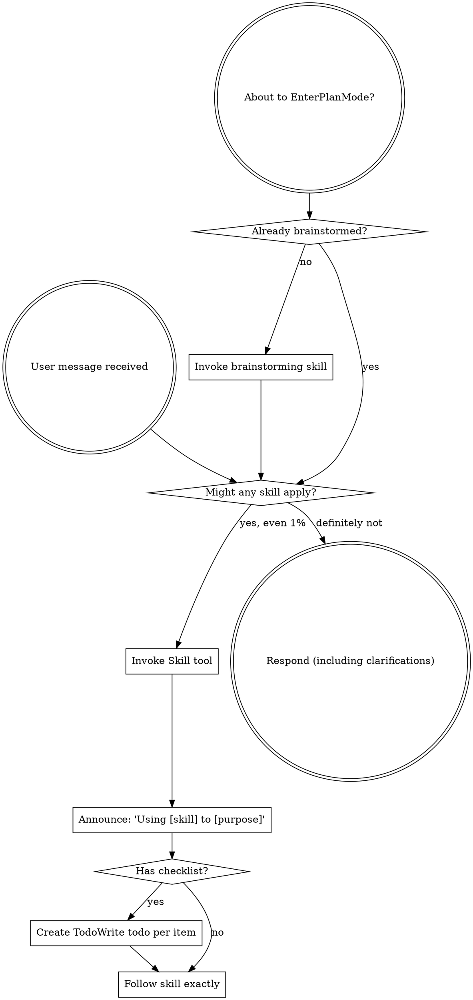

Reading additional input from stdin...
OpenAI Codex v0.121.0 (research preview)
--------
workdir: C:\Users\38909\Documents\github\aoe2
model: gpt-5.4
provider: openai
approval: never
sandbox: read-only
reasoning effort: xhigh
reasoning summaries: none
session id: 019dcd72-b800-7ab3-b333-bb7015d82b13
--------
user
You are a senior code reviewer. Flag bugs, security issues, and performance concerns. Do NOT modify files or propose patches. Only return findings, explanations, and suggestions in plain text. Only point out an issue if it is real and important. If there is no issue, say so instead of nit-picking. Context: this diff makes building HP ramp from ~10% of max to full as construction progresses (canonical AoE2). Foundation initial currentHp = max(1, floor(maxHp * 0.1)) at addBuildingEntity when !isComplete. Per construction tick in playerCommandsSystem build branch, currentHp += (maxHp - startHp) / totalBuildTicks (clamped to maxHp); at completion force currentHp = maxHp. Damage taken mid-build is preserved by additive (not formula-based) HP. New TDD vitest case in darkAge.test.ts (House: 7/75 -> 75/75). Verify: (a) damage-during-construction handled correctly, (b) save/load round-trip safe (buildingHealthStates serialized as-is), (c) no regression in scenario-seeded isComplete buildings, (d) destroy-during-construction handled, (e) fog-memory of partially-built building handled correctly, (f) no float drift bug at completion. Anti-regression: ensure no impact on existing combat/AI/save tests. Verify docs in the diff (changelog.md 0.1.4 entry, devlog entry, summary line) match implementation; flag any stale signatures or missing coverage.

<stdin>
diff --git a/docs/changelog.md b/docs/changelog.md
index 879e58d..2cd987d 100644
--- a/docs/changelog.md
+++ b/docs/changelog.md
@@ -2,6 +2,12 @@
 
 User-visible behavior changes only. Pure refactors, doc sweeps, type-safety hardening, and efficiency wins with no observable effect are recorded in `docs/devlog/` instead.
 
+## 0.1.4 — 2026-04-26
+
+### Fixed
+
+- **Building HP now ramps from low at placement to full at construction completion (canonical AoE2).** Previously a freshly placed foundation spawned at full max HP, then completion was a no-op on the health bar. The foundation now starts at ~10% of max HP and gains `(maxHp − startHp) / totalBuildTicks` per construction tick, reaching exactly max HP when the builder finishes. Damage taken during construction is preserved (HP increments add to the current value rather than overwriting it). Affects every constructable building (House, Mill, Barracks, Castle, Wonder, …); doesn't apply to scenario-seeded `isComplete: true` buildings.
+
 ## 0.1.3 — 2026-04-26
 
 ### Fixed
diff --git a/docs/devlog/detailed/2026-04-26_2026-04-26.md b/docs/devlog/detailed/2026-04-26_2026-04-26.md
index 00ff125..2cb55c6 100644
--- a/docs/devlog/detailed/2026-04-26_2026-04-26.md
+++ b/docs/devlog/detailed/2026-04-26_2026-04-26.md
@@ -1,5 +1,27 @@
 # 2026-04-26
 
+## Building HP ramps from low to full during construction (0.1.4)
+
+**Action:** User reported that buildings under construction should have their health going from 0 to full as they are being built. Pre-fix, `addBuildingEntity` set `currentHp = buildingMaxHp(buildingType)` at creation regardless of `isComplete`, so foundations spawned at full HP and the per-tick build counter never touched the health bar. Canonical AoE2: foundation starts low (~10% of max HP) and ramps to full as construction completes; partially built foundations are vulnerable.
+
+**TDD:** New vitest case `ramps building HP from low at placement to full at construction completion` in `tests/simulation/createSimulationBridge.darkAge.test.ts`. Asserts a placed House (max HP 75) starts at `currentHp < 0.2 * maxHp`, mid-construction sits strictly between start and max, and finishes at exactly `{ currentHp: 75, maxHp: 75 }`. Test ran red against the old `currentHp: buildingMaxHp(buildingType)` placement, then green after the fix.
+
+**Implementation:**
+- `src/game/simulation/bridge/entityCreateOps.ts` (`addBuildingEntity`): when `!isComplete`, initial `currentHp = max(1, floor(maxHp * 0.1))`. When `isComplete` (scenario-seeded already-built or load-restored), still spawns at full HP.
+- `src/game/simulation/bridge/systems/playerCommandsSystem.ts` (build-command branch): each construction tick adds `(maxHp − startHp) / totalBuildTicks` to `currentHp`, clamped at `maxHp`. At completion the value is force-set to `maxHp` to absorb floating-point drift from the per-tick adds. Damage taken during construction is preserved because the per-tick increment adds to the live value rather than recomputing from progress.
+
+**Why ramp instead of `floor(maxHp * progress/total)`:** the additive form preserves damage taken during construction. If a Scout chips the foundation to 5/75 at 50% built, the next build tick adds ~0.57 HP — the foundation rebuilds from where the damage left it instead of jumping back to the formula's expected 41/75.
+
+**Render integration:** the existing health-bar renderer (`src/phaser/scenes/gameScene/worldLayers.ts:renderEntityHealthBars`) already paints any entity with a known `currentHp` / `maxHp` pair, so the foundation's ramping HP shows up on the existing bar with no changes. The bar fill color (green > 0.6, yellow > 0.3, red ≤ 0.3) means a fresh foundation is red until construction lifts it past 30%, which gives the player a visual cue that the foundation is fragile.
+
+**No `markOutOfBandRenderChange()` on per-tick HP updates.** Initial implementation called it on every construction tick, which slowed `ai-rush-fixture` past its 10s test timeout (the `RenderAdapter` already re-projects per tick, so the per-tick `currentHp` change flows through naturally; explicit out-of-band refresh is only needed for off-tick mutations). Dropping the call brought the AI fixture back inside its budget.
+
+**Save/load:** untouched — `buildingHealthStates` is already persisted in the `SaveBlob` (`src/game/simulation/saveSchema.ts:192`), so a save mid-construction round-trips the foundation's current HP value as-is.
+
+**Result:** All four gates green. `npx tsc --noEmit` clean, `npm run lint` clean, `npx vitest run` **52/52 files, 414 passed + 1 skipped, 0 failed** (6 pre-existing Windows `[vitest-worker]: Timeout calling "onTaskUpdate"` errors unrelated), `npm run build` clean (3.39s). Version 0.1.3 → 0.1.4 (non-breaking user-visible bug fix).
+
+**Notes:** No architecture / API surface change — same `getEntityHealth(id)` returns the new ramping value for foundations. No engine ask. No multi-AI review run on this single-file behavior fix; the existing test covers the contract end-to-end. Code reviewer subagents not dispatched per the AGENTS.md "subagent dispatch is a tool, not a mandate" guidance — single-file behavior change with TDD coverage stayed in the main thread.
+
 ## `/full-review` iteration 1 + batch-1 fixes (12+ findings, V4-1 → V4-19, V4-21)
 
 **Action:** First full-codebase multi-AI review of the day, after the 42-commit `createSimulationBridge.ts` shrink session merged to main earlier.
diff --git a/docs/devlog/summary.md b/docs/devlog/summary.md
index 763e0b6..134e4a7 100644
--- a/docs/devlog/summary.md
+++ b/docs/devlog/summary.md
@@ -1,4 +1,5 @@
 ## 2026-04-26
+- **Building HP ramps from low to full during construction (canonical AoE2):** foundations now spawn at `max(1, floor(maxHp * 0.1))` and gain `(maxHp − startHp) / totalBuildTicks` per construction tick, clamped to `maxHp` and force-set at completion. Damage taken mid-build is preserved because the per-tick increment adds to the live value. Affects `addBuildingEntity` initial HP (`!isComplete` branch) and the build-command branch in `playerCommandsSystem`. Existing health-bar renderer (worldLayers.ts) picks up the change with no render-side edits — fresh foundations render in red and shift to yellow/green as construction passes the 30%/60% color thresholds. TDD: new case `ramps building HP from low at placement to full at construction completion` in `createSimulationBridge.darkAge.test.ts` (House max HP 75, asserts < 0.2× max at placement, mid-build strictly between start and max, exactly 75/75 at completion). One iteration round caught a 10s timeout regression in `ai-rush-fixture` from a stray `markOutOfBandRenderChange()` per build tick — dropped because `RenderAdapter` already re-projects per tick. Save/load round-trips through the existing `buildingHealthStates` save field. Version 0.1.3 → 0.1.4 (non-breaking user-visible bug fix). Final gates: `npx tsc --noEmit` clean, `npm run lint` clean, `npx vitest run` **52/52 files, 414 passed + 1 skipped, 0 failed** (6 pre-existing Windows `onTaskUpdate` worker warnings unrelated), `npm run build` clean (3.39 s).
 - **Engine fail-fast handler (deferred-item closeout):** `world.step()` now wrapped via new `bridge/tickHaltGuard.ts` helper (`createTickHaltState` + `tryTick`). Catches `WorldTickFailureError` (engine fail-fast since v0.4.0), captures `{tick, phase, code, systemName, message}` into `haltState.halted`, logs one-line `console.error`, halts further ticks for the session. New `HudState.engineHalted: EngineHaltDetails | null` field surfaces the halt to HUD/debug overlay. Does NOT call `world.recover()` — fail-fast intentional, recovery would mask logic bugs. Non-engine exceptions rethrow. Closes the gap noted in the 2026-04-25 `civ-engine` 0.5.3 migration entry; today's `/check-engine` audit confirmed it was the only outstanding item across 0.5.4 → 0.7.6 (current `node_modules/civ-engine`). TDD: 6-case test in `tests/simulation/tickHaltGuard.test.ts` (clean tick, halt with details + log, fallback to `failure.message` when `failure.error` null, null `systemName` preserved, post-halt no-op, non-engine rethrow). Save schema untouched. Version 0.1.2 → 0.1.3 (non-breaking user-visible). Final gates: `npx tsc --noEmit` clean, `npm run lint` clean, `npx vitest run` **52/52 files, 413 passed + 1 skipped, 0 failed** (7 pre-existing Windows `[vitest-worker]: Timeout calling "onTaskUpdate"` errors unrelated), `npm run build` clean (4.23 s).
 - **Iter-2 multi-AI review + batch-1 fixes:** ran the second `/full-review` of the day after iter-1 batch landed (`608048f` → `8d20013`). Reviewers Codex `gpt-5.4` xhigh, Gemini `gemini-3.1-pro-preview` `--approval-mode plan`, Claude `opus` xhigh. Synthesized to `docs/reviews/full/2026-04-26/2/REVIEW.md`. Fixed: V5-1 `monksByOwner` side map closes the V4-12 regression (`countOwnedUnits(owner, 'monk')` walked the same query the guard was meant to avoid; AI with monks did 2 walks instead of 1). V5-3 `GameScene.ts` 1034 → 994 LOC by extracting `ALL_UNIT_TYPES` to `gameScene/unitTypeMap.ts` (under the strict 1000 LOC ceiling). V5-4 `saveLoadPanel.handleSaveClick` falls back to `triggerBlobDownload` when `localStorage.setItem` throws (private browsing, quota); new browser regression test. V5-5 doc reconciliation: `ARCHITECTURE.md:11` HTTP API line, AGENTS.md `docs/api-reference.md`/`docs/guides/`/`docs/README.md` mandates relaxed (mirror V4-22), `summary.md:3` V4-22 carry-forward dropped. V5-6 strengthens V4-7 throttle test to use a real villager id (was schema-presence only). V5-8 batches `findIdleProducer` building lookups (single `ownerBuildingsByType` scan replaces 10-14 full-world building scans per AI per decision tick); drops unused `findIdleProducer` from `aiDecisionOps` and deps. Considered + dropped: V5-2 villagerRebalance zero-target trap (load-bearing for AI dark-age gold accumulation — fix breaks AI age progression), V5-7 V4-14 missed-clear test (correct-by-construction). Branch `agent/review-findings-2026-04-26-iter2-batch1`.
 - **`createSimulationBridge.ts` shrink — 42 commits, 7606 → 332 lines (96% reduction):** the Phase 4 (18 ECS systems extracted to `bridge/systems/*` plus 9 helper-ops modules under `bridge/`) + Phase 5 (9 more ops modules) extractions plus a follow-up sweep — `createWorld` moved to `bridge/createWorld.ts`, side-map ownership hoisted into `bridge/bridgeState.ts`, `wireBridgeOps` / `wirePostSeedOps` / `assembleBridgeApi` / `registerAllSystems` / `registerBridgeSystems` / `scenarioSeedOps` / `hydrateFromSavedGame` extracted, `monkTaskOps` split into `monkAiSearchHelpers` + `monkTaskAppliers`, render-state assembly extracted to `renderStateOps`, spatial finders extracted to `selectionFinders`. The remaining `createSimulationBridge.ts` is a thin facade. Pattern: flat dep-bag factory closing over the single `BridgeState` instance. Determinism preserved: 18 systems still register in the same order (driven by explicit `before`/`after` deps, not registration sequence). Branch `agent/split-simulation-bridge` (commits `46c7810` → `4cbc1bf`).
diff --git a/package.json b/package.json
index 802e44b..260f8cb 100644
--- a/package.json
+++ b/package.json
@@ -1,6 +1,6 @@
 {
   "name": "aoe2",
-  "version": "0.1.3",
+  "version": "0.1.4",
   "private": true,
   "type": "module",
   "scripts": {
diff --git a/src/game/simulation/bridge/entityCreateOps.ts b/src/game/simulation/bridge/entityCreateOps.ts
index af2873e..351037d 100644
--- a/src/game/simulation/bridge/entityCreateOps.ts
+++ b/src/game/simulation/bridge/entityCreateOps.ts
@@ -220,9 +220,10 @@ export function createEntityCreateOps(deps: EntityCreateOpsDeps): EntityCreateOp
       footprintHeight: footprint.height,
       visualVariant: isComplete ? 'complete' : 'construction',
     });
+    const fullHp = buildingMaxHp(buildingType);
     buildingHealthStates.set(entity, {
-      currentHp: buildingMaxHp(buildingType),
-      maxHp: buildingMaxHp(buildingType),
+      currentHp: isComplete ? fullHp : Math.max(1, Math.floor(fullHp * 0.1)),
+      maxHp: fullHp,
     });
 
     if (buildingType === 'town-center') {
diff --git a/src/game/simulation/bridge/systems/playerCommandsSystem.ts b/src/game/simulation/bridge/systems/playerCommandsSystem.ts
index a5bc87c..167b029 100644
--- a/src/game/simulation/bridge/systems/playerCommandsSystem.ts
+++ b/src/game/simulation/bridge/systems/playerCommandsSystem.ts
@@ -382,9 +382,21 @@ export function registerPlayerCommandsSystem(deps: PlayerCommandsSystemDeps): vo
         }
 
         construction.buildProgressTicks += 1;
+        const buildingHealth = buildingHealthStates.get(buildingId);
+        if (buildingHealth && construction.totalBuildTicks > 0) {
+          const startHp = Math.max(1, Math.floor(buildingHealth.maxHp * 0.1));
+          const hpPerTick = (buildingHealth.maxHp - startHp) / construction.totalBuildTicks;
+          buildingHealth.currentHp = Math.min(
+            buildingHealth.maxHp,
+            buildingHealth.currentHp + hpPerTick,
+          );
+        }
         if (construction.buildProgressTicks >= construction.totalBuildTicks) {
           construction.buildProgressTicks = construction.totalBuildTicks;
           construction.isComplete = true;
+          if (buildingHealth) {
+            buildingHealth.currentHp = buildingHealth.maxHp;
+          }
 
           const renderable = activeWorld.getComponent<RenderableComponent>(buildingId, 'renderable');
           if (renderable) {
diff --git a/tests/simulation/createSimulationBridge.darkAge.test.ts b/tests/simulation/createSimulationBridge.darkAge.test.ts
index cd3ce66..7c9b5fa 100644
--- a/tests/simulation/createSimulationBridge.darkAge.test.ts
+++ b/tests/simulation/createSimulationBridge.darkAge.test.ts
@@ -2,7 +2,7 @@ import { describe, expect, it } from 'vitest';
 
 import { createSimulationBridge } from '../../src/game/simulation/createSimulationBridge';
 import { DEFAULT_SEED } from '../../src/game/simulation/prototypeScenario';
-import { placeBuildingNearTownCenter } from './createSimulationBridge.helpers';
+import { placeBuildingNearTownCenter, stepBridgeUntil } from './createSimulationBridge.helpers';
 
 describe('createSimulationBridge dark age economy progression', () => {
   it('queues a villager at the Town Center and increases population when training completes', () => {
@@ -109,6 +109,55 @@ describe('createSimulationBridge dark age economy progression', () => {
     });
   }, 20_000);
 
+  it('ramps building HP from low at placement to full at construction completion', () => {
+    const bridge = createSimulationBridge(DEFAULT_SEED);
+
+    expect(bridge.selectEntityAtCell(6, 8)).toBe(true);
+    const housePosition = placeBuildingNearTownCenter(bridge, 'house');
+
+    const findHouse = () =>
+      bridge
+        .getEconomyState()
+        .buildings.find(
+          (building) =>
+            building.owner === 1
+            && building.buildingType === 'house'
+            && building.x === housePosition.x
+            && building.y === housePosition.y,
+        );
+
+    const placed = findHouse();
+    expect(placed).toBeDefined();
+    expect(placed!.isComplete).toBe(false);
+
+    const initialHealth = bridge.getEntityHealth(placed!.id);
+    expect(initialHealth).not.toBeNull();
+    expect(initialHealth!.maxHp).toBe(75);
+    expect(initialHealth!.currentHp).toBeGreaterThan(0);
+    expect(initialHealth!.currentHp).toBeLessThan(initialHealth!.maxHp * 0.2);
+
+    const totalTicks = placed!.totalBuildTicks;
+    expect(
+      stepBridgeUntil(
+        bridge,
+        () => (findHouse()?.buildProgressTicks ?? 0) >= totalTicks * 0.5,
+        { maxSteps: 600 },
+      ),
+    ).toBe(true);
+    const midHouse = findHouse()!;
+    expect(midHouse.isComplete).toBe(false);
+    const midHealth = bridge.getEntityHealth(midHouse.id)!;
+    expect(midHealth.currentHp).toBeGreaterThan(initialHealth!.currentHp);
+    expect(midHealth.currentHp).toBeLessThan(midHealth.maxHp);
+
+    expect(
+      stepBridgeUntil(bridge, () => findHouse()?.isComplete === true, { maxSteps: 600 }),
+    ).toBe(true);
+    const finishedHouse = findHouse()!;
+    const finalHealth = bridge.getEntityHealth(finishedHouse.id);
+    expect(finalHealth).toEqual({ currentHp: 75, maxHp: 75 });
+  }, 20_000);
+
   it('redirects a selected villager to gather gold through an explicit context order', () => {
     const bridge = createSimulationBridge(DEFAULT_SEED);
 
</stdin>
codex
Reviewing the diff against the actual simulation code and project docs first. I’m loading the repo instructions/skills context, then I’ll inspect the touched systems and adjacent save/render paths for the specific regressions you called out.
exec
"C:\\Windows\\System32\\WindowsPowerShell\\v1.0\\powershell.exe" -Command "Get-Content C:\\Users\\38909\\.codex\\plugins\\cache\\openai-curated\\superpowers\\b066e4a0\\skills\\using-superpowers\\SKILL.md" in C:\Users\38909\Documents\github\aoe2
exec
"C:\\Windows\\System32\\WindowsPowerShell\\v1.0\\powershell.exe" -Command "Get-Content C:\\Users\\38909\\.codex\\skills\\programming-best-practices\\SKILL.md" in C:\Users\38909\Documents\github\aoe2
2026-04-27T05:39:19.840160Z ERROR codex_core::tools::router: error=`"C:\\Windows\\System32\\WindowsPowerShell\\v1.0\\powershell.exe" -Command "Select-String -Path C:\\Users\\38909\\.codex\\memories\\MEMORY.md -Pattern 'aoe2|review|createSimulationBridge|save|fog|building HP' -Context 1,1"` rejected: blocked by policy
exec
"C:\\Windows\\System32\\WindowsPowerShell\\v1.0\\powershell.exe" -Command "Select-String -Path C:\\Users\\38909\\.codex\\memories\\MEMORY.md -Pattern 'aoe2|review|createSimulationBridge|save|fog|building HP' -Context 1,1" in C:\Users\38909\Documents\github\aoe2
 declined in 0ms:
`"C:\\Windows\\System32\\WindowsPowerShell\\v1.0\\powershell.exe" -Command "Select-String -Path C:\\Users\\38909\\.codex\\memories\\MEMORY.md -Pattern 'aoe2|review|createSimulationBridge|save|fog|building HP' -Context 1,1"` rejected: blocked by policy
 succeeded in 350ms:
---
name: programming-best-practices
description: General coding workflow and engineering guardrails for planning, implementing, debugging, refactoring, reviewing, and validating code changes. Use when Codex is asked to write, edit, review, or test code in any repository, especially when correctness, maintainability, small diffs, and safe verification matter.
---

# Programming Best Practices

## Operate

- Read the relevant code path before editing.
- Trace data flow end to end before deciding on a fix.
- Prefer the smallest change that solves the actual problem.
- Match the existing architecture and conventions unless they are the source of the defect.
- Preserve backward compatibility unless the task explicitly requires a breaking change.

## Change Safely

- Do not overwrite unrelated user changes.
- Treat the worktree as potentially dirty and isolate your diff.
- Make state transitions explicit, especially around async flows and persistence.
- If concurrent results can race, decide which result wins and enforce it in code.
- Handle empty states, errors, cleanup, and cancellation paths deliberately.
- Avoid speculative abstractions until duplication or complexity actually justifies them.

## Validate

- Add or update targeted tests when behavior changes or a bug is fixed.
- Run the smallest meaningful verification first, then widen coverage if needed.
- Verify user-visible behavior, not only internal implementation details.
- If validation cannot run, state exactly what was blocked and what remains unverified.

## Review

- Prioritize bugs, regressions, broken assumptions, and missing tests.
- Present findings before summaries.
- Order findings by severity and include concrete file references.

## Communicate

- State assumptions when they affect implementation choices.
- Call out tradeoffs plainly.
- Explain non-obvious changes at a high level.
- Close with outcome, verification, and remaining risk.
Cannot set property. Property setting is supported only on core types in this language mode.
At line:1 char:1
+ [Console]::OutputEncoding=[System.Text.Encoding]::UTF8;
+ ~~~~~~~~~~~~~~~~~~~~~~~~~~~~~~~~~~~~~~~~~~~~~~~~~~~~~~
    + CategoryInfo          : InvalidOperation: (:) [], RuntimeException
    + FullyQualifiedErrorId : PropertySetterNotSupportedInConstrainedLanguage
 

 succeeded in 359ms:
---
name: using-superpowers
description: Use when starting any conversation - establishes how to find and use skills, requiring Skill tool invocation before ANY response including clarifying questions
---

<SUBAGENT-STOP>
If you were dispatched as a subagent to execute a specific task, skip this skill.
</SUBAGENT-STOP>

<EXTREMELY-IMPORTANT>
If you think there is even a 1% chance a skill might apply to what you are doing, you ABSOLUTELY MUST invoke the skill.

IF A SKILL APPLIES TO YOUR TASK, YOU DO NOT HAVE A CHOICE. YOU MUST USE IT.

This is not negotiable. This is not optional. You cannot rationalize your way out of this.
</EXTREMELY-IMPORTANT>

## Instruction Priority

Superpowers skills override default system prompt behavior, but **user instructions always take precedence**:

1. **User's explicit instructions** (CLAUDE.md, GEMINI.md, AGENTS.md, direct requests) ƒ?" highest priority
2. **Superpowers skills** ƒ?" override default system behavior where they conflict
3. **Default system prompt** ƒ?" lowest priority

If CLAUDE.md, GEMINI.md, or AGENTS.md says "don't use TDD" and a skill says "always use TDD," follow the user's instructions. The user is in control.

## How to Access Skills

**In Claude Code:** Use the `Skill` tool. When you invoke a skill, its content is loaded and presented to youƒ?"follow it directly. Never use the Read tool on skill files.

**In Copilot CLI:** Use the `skill` tool. Skills are auto-discovered from installed plugins. The `skill` tool works the same as Claude Code's `Skill` tool.

**In Gemini CLI:** Skills activate via the `activate_skill` tool. Gemini loads skill metadata at session start and activates the full content on demand.

**In other environments:** Check your platform's documentation for how skills are loaded.

## Platform Adaptation

Skills use Claude Code tool names. Non-CC platforms: see `references/copilot-tools.md` (Copilot CLI), `references/codex-tools.md` (Codex) for tool equivalents. Gemini CLI users get the tool mapping loaded automatically via GEMINI.md.

# Using Skills

## The Rule

**Invoke relevant or requested skills BEFORE any response or action.** Even a 1% chance a skill might apply means that you should invoke the skill to check. If an invoked skill turns out to be wrong for the situation, you don't need to use it.



## Red Flags

These thoughts mean STOPƒ?"you're rationalizing:

| Thought | Reality |
|---------|---------|
| "This is just a simple question" | Questions are tasks. Check for skills. |
| "I need more context first" | Skill check comes BEFORE clarifying questions. |
| "Let me explore the codebase first" | Skills tell you HOW to explore. Check first. |
| "I can check git/files quickly" | Files lack conversation context. Check for skills. |
| "Let me gather information first" | Skills tell you HOW to gather information. |
| "This doesn't need a formal skill" | If a skill exists, use it. |
| "I remember this skill" | Skills evolve. Read current version. |
| "This doesn't count as a task" | Action = task. Check for skills. |
| "The skill is overkill" | Simple things become complex. Use it. |
| "I'll just do this one thing first" | Check BEFORE doing anything. |
| "This feels productive" | Undisciplined action wastes time. Skills prevent this. |
| "I know what that means" | Knowing the concept ƒ%ÿ using the skill. Invoke it. |

## Skill Priority

When multiple skills could apply, use this order:

1. **Process skills first** (brainstorming, debugging) - these determine HOW to approach the task
2. **Implementation skills second** (frontend-design, mcp-builder) - these guide execution

"Let's build X" ƒ+' brainstorming first, then implementation skills.
"Fix this bug" ƒ+' debugging first, then domain-specific skills.

## Skill Types

**Rigid** (TDD, debugging): Follow exactly. Don't adapt away discipline.

**Flexible** (patterns): Adapt principles to context.

The skill itself tells you which.

## User Instructions

Instructions say WHAT, not HOW. "Add X" or "Fix Y" doesn't mean skip workflows.
Cannot set property. Property setting is supported only on core types in this language mode.
At line:1 char:1
+ [Console]::OutputEncoding=[System.Text.Encoding]::UTF8;
+ ~~~~~~~~~~~~~~~~~~~~~~~~~~~~~~~~~~~~~~~~~~~~~~~~~~~~~~
    + CategoryInfo          : InvalidOperation: (:) [], RuntimeException
    + FullyQualifiedErrorId : PropertySetterNotSupportedInConstrainedLanguage
 

codex
Using `programming-best-practices` for the review workflow and checking the project’s current architecture/devlog context before I judge the HP change. Next I’m reading the touched simulation path plus save/render consumers to look for real regressions beyond the added test.
exec
"C:\\Windows\\System32\\WindowsPowerShell\\v1.0\\powershell.exe" -Command "Get-Content docs\\architecture\\ARCHITECTURE.md" in C:\Users\38909\Documents\github\aoe2
exec
"C:\\Windows\\System32\\WindowsPowerShell\\v1.0\\powershell.exe" -Command "Get-Content docs\\devlog\\summary.md" in C:\Users\38909\Documents\github\aoe2
2026-04-27T05:39:32.353628Z ERROR codex_core::tools::router: error=`"C:\\Windows\\System32\\WindowsPowerShell\\v1.0\\powershell.exe" -Command "Select-String -Path C:\\Users\\38909\\.codex\\memories\\MEMORY.md -Pattern 'aoe2|createSimulationBridge|save|fog|review' -Context 1,1"` rejected: blocked by policy
exec
"C:\\Windows\\System32\\WindowsPowerShell\\v1.0\\powershell.exe" -Command "Select-String -Path C:\\Users\\38909\\.codex\\memories\\MEMORY.md -Pattern 'aoe2|createSimulationBridge|save|fog|review' -Context 1,1" in C:\Users\38909\Documents\github\aoe2
 declined in 0ms:
`"C:\\Windows\\System32\\WindowsPowerShell\\v1.0\\powershell.exe" -Command "Select-String -Path C:\\Users\\38909\\.codex\\memories\\MEMORY.md -Pattern 'aoe2|createSimulationBridge|save|fog|review' -Context 1,1"` rejected: blocked by policy
 succeeded in 314ms:
# Architecture

This document describes the structural boundaries of the project. Update it only for
structural changes (new modules, shifted boundaries, new build or data pipelines). Do
not update it for UI tweaks, bug fixes, refactors, or test-only work. When it does
change, also append a row to `drift-log.md` and mention the update in the devlog.

## Repository layout

- `src/` ƒ?" game code (TypeScript)
  - `app/bootstrap/` ƒ?" app startup. `installBrowserTestApi(...)` exposes the
    in-page `window.__AOE2_TEST__` test seam Playwright drives during browser
    tests; there is no separate dev HTTP server.
  - `game/` ƒ?" gameplay rules, scenarios, content
    - `content/` ƒ?" shared content tables (e.g., building footprints)
    - `simulation/` ƒ?" simulation bridge, scenario setup, command handlers.
      Top-level siblings of `createSimulationBridge.ts` include
      `worldOccupancy.ts` (the `OccupancyBinding` adapter that keeps the
      authoritative blocker/crowding contract), `selectionActivity.ts`
      (structured activity payload for the HUD selection panel), and
      `renderStore.ts` (the per-tick render-message store the projector
      writes into).
      - `bridge/` ƒ?" helper modules factored out of `createSimulationBridge.ts`. After Phase 4 + Phase 5 of the createSimulationBridge shrink, the orchestrator is a 332-LOC facade that delegates world construction, render projection, and command dispatch to the modules below. Side-map ownership lives in `bridgeState.ts:createBridgeState()`; `createWorld.ts` instantiates it once and threads the same references through every dep-bag factory so save/load and destroy-entity hooks see consistent state.

        Boot/orchestration tier:
        - `createWorld.ts` ƒ?" entry point invoked by the facade. Builds (or deserializes) the civ-engine `World`, instantiates `BridgeState`, builds tile grids, then calls `wireBridgeOps` and `assembleBridgeApi`.
        - `wireBridgeOps.ts` ƒ?" pre-seed factory wiring (entity-create/destroy ops, target finding, technology, match-end, etc.) and the call into `seedFreshScenario` (skipped on save-load).
        - `wirePostSeedOps.ts` ƒ?" post-seed factory wiring (visibility queries, selection input, training/market, monk tasks, AI decision, unit command).
        - `registerBridgeSystems.ts` ƒ?" final glue: spreads the 10 ops factories through `registerAllSystems` and creates the post-register input ops (placement, save, economy state, human input).
        - `registerAllSystems.ts` ƒ?" bundles all 18 ECS system registrations.
        - `assembleBridgeApi.ts` ƒ?" composes the `SimulationBridge` public surface from the ops + state.
        - `scenarioSeedOps.ts`, `hydrateFromSavedGame.ts` ƒ?" fresh-scenario seeding and save-blob hydration (separated so the facade can pick the right path).

        State + types tier:
        - `bridgeState.ts` ƒ?" single `createBridgeState()` factory that owns every side map (`unitCommands`, `monkTasks`, `garrisonedByBuilding`, `productionQueues`, `combatStates`, `aiStates`, `gathererDropOffStuckSinceTick`, etc.).
        - `sharedTypes.ts` ƒ?" `UnitCommand` / `MonkTask` / `ConstructionState` / `TrebuchetPackState` shared between the facade and the helper-ops modules.
        - `bridgeConstants.ts`, `countdownTypes.ts`, `memoryTypes.ts`, `movementTypes.ts`, `createWorldResult.ts`, `wireBridgeOpsTypes.ts`, `registerAllSystemsTypes.ts`, `combatStateFactory.ts` ƒ?" shared constants and type contracts.
        - `bridgeHelpers.ts` ƒ?" small helper closures (`ensurePlayerScoreCounters`, `ensureAiState`, `inFlightTechSetFor`, `clearUnitCommand`, `setUnitCommand`, command-rejection queue).
        - `pureHelpers.ts` ƒ?" pure helpers (clamp, grid/coordinate transforms, footprint visibility, etc.) plus `GameEvents` / `GameCommands` / `GameWorld` type aliases.

        Systems tier (`bridge/systems/*` ƒ?" 18 ECS factories):
        - `aiSystem.ts`, `autoAggressionSystem.ts`, `playerCommandsSystem.ts`, `monkBehaviorSystem.ts`, `productionQueueSystem.ts`, `scoutMovementSystem.ts`, `villagerEconomySystem.ts`, `wildlifeCombatSystem.ts`, `herdableMovementSystem.ts`, `herdableOwnershipSystem.ts`, `visibilitySystem.ts`, `fogMemorySystem.ts`, `towerCombatSystem.ts`, `relicGoldSystem.ts`, `wonderCountdownSystem.ts`, `relicCountdownSystem.ts`, `winConditionResolverSystem.ts`, `conquestOutcomeSystem.ts`. Each factory takes a typed deps interface and registers exactly one `world.registerSystem({...})`. Execution order is driven by explicit `before`/`after` deps, not registration sequence.

        Helper-ops tier (factories used by either systems or the input surface):
        - `playerQueries.ts`, `aiDecisionOps.ts`, `targetFindingOps.ts`, `selectionFinders.ts` ƒ?" read-side queries.
        - `entityCreateOps.ts`, `entityDestroyOps.ts`, `transformOps.ts`, `movementPlanOps.ts`, `placementOps.ts`, `trainingMarketOps.ts` ƒ?" write-side entity/state mutators.
        - `humanInputOps.ts`, `selectionInputOps.ts`, `selectionStateOps.ts`, `unitCommandOps.ts` ƒ?" command surface.
        - `monkTaskOps.ts`, `monkAiSearchHelpers.ts`, `monkTaskAppliers.ts`, `technologyOps.ts`, `matchEndOps.ts`, `trebuchetState.ts` ƒ?" system-specific helpers.
        - `cellPassability.ts`, `visibilityQueries.ts`, `visibility.ts`, `fogMemoryOps.ts` ƒ?" terrain/visibility queries.
        - `optionsRules.ts` ƒ?" train/research/market/build option lookup.
        - `renderStateOps.ts`, `debugSnapshotOps.ts`, `economyStateOps.ts`, `saveGameOps.ts` ƒ?" read-side projections to the HUD/test surface.

        `createSimulationBridge.ts` imports from `bridge/` rather than re-declaring any of this. The four shared types in `sharedTypes.ts` are re-exported from the facade so external `SimulationBridge` consumers keep stable import paths.
      - `mapGeneration/` ƒ?" deterministic procedural map generators and the
        spawn-list helper that enforces one-resource-per-cell. Hosts the
        default + Black Forest + Arena generators plus the shared terrain
        helpers (`paintDisc`, `createBaseTerrain`, etc.) and the starting
        offset tables (`STARTING_SHEEP`, `FOREST_PATCHES`, ƒ?İ).
      - `fixtures/` ƒ?" per-category modules that export every vitest-driven
        fixture factory (conquest, economy basics, age progression, combat
        matchups, siege, monastery, castle defense, AI, wonder/relic,
        selection, sheep, scenario validation). The `fixtures/index.ts`
        barrel is the single place the `prototypeScenario.ts` dispatcher
        imports from.
  - `phaser/` ƒ?" Phaser-specific scenes and render projection. Hosts `scenes/GameScene.ts` (scene class wiring lifecycle, input, and projection-driven render orchestration) plus a `scenes/gameScene/` subdirectory for the dep-bag renderer factories factored out of the scene file: `debugOverlay.ts` (world-space debug-mode overlays), `worldLayers.ts` (health-bar + fog-of-war paints), `selectionLayers.ts` (selection ring + placement preview + marquee paints), `cameraController.ts` (per-frame update, middle-drag pan, edge-pan, zoom/scroll clamp, HUD-facing camera queries), and `buildingRenderer.ts` (the per-building rendering primitives ƒ?" anchor sprite, footprint outline, construction overlay).
  - `ui/` ƒ?" DOM HUD controller
- `tests/` ƒ?" Vitest unit/integration tests and Playwright browser tests
- `scripts/` ƒ?" content and build scripts
- `design/` ƒ?" game design spec, stat CSVs, implementation plan
- `generated/` ƒ?" build-time content output (`generated/content/content.json`)
- `docs/` ƒ?" architecture, devlog, engine feedback, learning, debugging

## Runtime layers

The runtime is layered and the boundaries are intentional.

```
DOM HUD  ƒ"?ƒ"?ƒ"?ƒ"?ƒ"?ƒ-§ Phaser scene (render + input) ƒ"?ƒ"?ƒ"?ƒ"?ƒ"?ƒ-§ Simulation bridge ƒ"?ƒ"?ƒ"?ƒ"?ƒ"?ƒ-§ civ-engine World
                                                       ƒ",
                                                       ƒ""ƒ"?ƒ"? content tables (design/stats ƒ+' generated/content.json)
```

- `civ-engine` owns authoritative simulation state and deterministic ticking. All
  gameplay rules, combat, economy, progression, and AI policy live behind this
  boundary through ECS systems, queries, and commands.
- The simulation bridge (`src/game/simulation/`) owns repo-specific systems and
  scenario setup. It runs on top of `civ-engine` primitives and exposes a stable
  surface to the Phaser scene and HUD.
- Phaser is view and input only. It consumes render frames projected through
  `civ-engine`'s `RenderAdapter` and issues commands back into the simulation. No
  gameplay state lives in Phaser scenes.
- The DOM HUD is a pure consumer of render frames and selection state. It emits
  commands through the same seam as right-click orders from the scene.
- Content flows one-way: design CSVs under `design/stats/*.csv` are normalized at
  build time into `generated/content/content.json`, which the simulation loads.
  The generated file is not committed.

## Determinism contract

- Seeds are reproducible from `?seed=<name>` URL parameters for fixtures.
- Commands and fixed-step ticks are the only sources of state change.
- Render interpolation is a display concern; it does not feed back into simulation
  state. Click hit-testing prefers the displayed entity so the player's perceived
  target matches the authoritative target.

## Test boundaries

- Vitest (`npx vitest run`) covers simulation, content normalization, and scenario
  behavior. These tests drive simulation directly; they do not start Phaser.
- Playwright (`npm run test:browser`) drives the built preview app and asserts
  render-state and command flow end-to-end. Fixture seeds keep runs deterministic.
- `npx tsc --noEmit` and `npx vite build` gate type and build health.

## Where new work belongs

- A new gameplay rule, unit behavior, or AI change ƒ+' simulation bridge or
  `civ-engine` (flag an engine gap in `docs/engine-feedback/current.md` if the
  engine lacks the primitive).
- A new render treatment or input control ƒ+' Phaser scene with a render-state seam
  so browser tests can assert on the rendered output.
- A new HUD element ƒ+' `src/ui/` consuming render frames and selection state.
- New content ƒ+' `design/stats/*.csv` plus any normalizer work in `scripts/`.
Cannot set property. Property setting is supported only on core types in this language mode.
At line:1 char:1
+ [Console]::OutputEncoding=[System.Text.Encoding]::UTF8;
+ ~~~~~~~~~~~~~~~~~~~~~~~~~~~~~~~~~~~~~~~~~~~~~~~~~~~~~~
    + CategoryInfo          : InvalidOperation: (:) [], RuntimeException
    + FullyQualifiedErrorId : PropertySetterNotSupportedInConstrainedLanguage
 

 succeeded in 348ms:
## 2026-04-26
- **Building HP ramps from low to full during construction (canonical AoE2):** foundations now spawn at `max(1, floor(maxHp * 0.1))` and gain `(maxHp ƒ^' startHp) / totalBuildTicks` per construction tick, clamped to `maxHp` and force-set at completion. Damage taken mid-build is preserved because the per-tick increment adds to the live value. Affects `addBuildingEntity` initial HP (`!isComplete` branch) and the build-command branch in `playerCommandsSystem`. Existing health-bar renderer (worldLayers.ts) picks up the change with no render-side edits ƒ?" fresh foundations render in red and shift to yellow/green as construction passes the 30%/60% color thresholds. TDD: new case `ramps building HP from low at placement to full at construction completion` in `createSimulationBridge.darkAge.test.ts` (House max HP 75, asserts < 0.2A- max at placement, mid-build strictly between start and max, exactly 75/75 at completion). One iteration round caught a 10s timeout regression in `ai-rush-fixture` from a stray `markOutOfBandRenderChange()` per build tick ƒ?" dropped because `RenderAdapter` already re-projects per tick. Save/load round-trips through the existing `buildingHealthStates` save field. Version 0.1.3 ƒ+' 0.1.4 (non-breaking user-visible bug fix). Final gates: `npx tsc --noEmit` clean, `npm run lint` clean, `npx vitest run` **52/52 files, 414 passed + 1 skipped, 0 failed** (6 pre-existing Windows `onTaskUpdate` worker warnings unrelated), `npm run build` clean (3.39 s).
- **Engine fail-fast handler (deferred-item closeout):** `world.step()` now wrapped via new `bridge/tickHaltGuard.ts` helper (`createTickHaltState` + `tryTick`). Catches `WorldTickFailureError` (engine fail-fast since v0.4.0), captures `{tick, phase, code, systemName, message}` into `haltState.halted`, logs one-line `console.error`, halts further ticks for the session. New `HudState.engineHalted: EngineHaltDetails | null` field surfaces the halt to HUD/debug overlay. Does NOT call `world.recover()` ƒ?" fail-fast intentional, recovery would mask logic bugs. Non-engine exceptions rethrow. Closes the gap noted in the 2026-04-25 `civ-engine` 0.5.3 migration entry; today's `/check-engine` audit confirmed it was the only outstanding item across 0.5.4 ƒ+' 0.7.6 (current `node_modules/civ-engine`). TDD: 6-case test in `tests/simulation/tickHaltGuard.test.ts` (clean tick, halt with details + log, fallback to `failure.message` when `failure.error` null, null `systemName` preserved, post-halt no-op, non-engine rethrow). Save schema untouched. Version 0.1.2 ƒ+' 0.1.3 (non-breaking user-visible). Final gates: `npx tsc --noEmit` clean, `npm run lint` clean, `npx vitest run` **52/52 files, 413 passed + 1 skipped, 0 failed** (7 pre-existing Windows `[vitest-worker]: Timeout calling "onTaskUpdate"` errors unrelated), `npm run build` clean (4.23 s).
- **Iter-2 multi-AI review + batch-1 fixes:** ran the second `/full-review` of the day after iter-1 batch landed (`608048f` ƒ+' `8d20013`). Reviewers Codex `gpt-5.4` xhigh, Gemini `gemini-3.1-pro-preview` `--approval-mode plan`, Claude `opus` xhigh. Synthesized to `docs/reviews/full/2026-04-26/2/REVIEW.md`. Fixed: V5-1 `monksByOwner` side map closes the V4-12 regression (`countOwnedUnits(owner, 'monk')` walked the same query the guard was meant to avoid; AI with monks did 2 walks instead of 1). V5-3 `GameScene.ts` 1034 ƒ+' 994 LOC by extracting `ALL_UNIT_TYPES` to `gameScene/unitTypeMap.ts` (under the strict 1000 LOC ceiling). V5-4 `saveLoadPanel.handleSaveClick` falls back to `triggerBlobDownload` when `localStorage.setItem` throws (private browsing, quota); new browser regression test. V5-5 doc reconciliation: `ARCHITECTURE.md:11` HTTP API line, AGENTS.md `docs/api-reference.md`/`docs/guides/`/`docs/README.md` mandates relaxed (mirror V4-22), `summary.md:3` V4-22 carry-forward dropped. V5-6 strengthens V4-7 throttle test to use a real villager id (was schema-presence only). V5-8 batches `findIdleProducer` building lookups (single `ownerBuildingsByType` scan replaces 10-14 full-world building scans per AI per decision tick); drops unused `findIdleProducer` from `aiDecisionOps` and deps. Considered + dropped: V5-2 villagerRebalance zero-target trap (load-bearing for AI dark-age gold accumulation ƒ?" fix breaks AI age progression), V5-7 V4-14 missed-clear test (correct-by-construction). Branch `agent/review-findings-2026-04-26-iter2-batch1`.
- **`createSimulationBridge.ts` shrink ƒ?" 42 commits, 7606 ƒ+' 332 lines (96% reduction):** the Phase 4 (18 ECS systems extracted to `bridge/systems/*` plus 9 helper-ops modules under `bridge/`) + Phase 5 (9 more ops modules) extractions plus a follow-up sweep ƒ?" `createWorld` moved to `bridge/createWorld.ts`, side-map ownership hoisted into `bridge/bridgeState.ts`, `wireBridgeOps` / `wirePostSeedOps` / `assembleBridgeApi` / `registerAllSystems` / `registerBridgeSystems` / `scenarioSeedOps` / `hydrateFromSavedGame` extracted, `monkTaskOps` split into `monkAiSearchHelpers` + `monkTaskAppliers`, render-state assembly extracted to `renderStateOps`, spatial finders extracted to `selectionFinders`. The remaining `createSimulationBridge.ts` is a thin facade. Pattern: flat dep-bag factory closing over the single `BridgeState` instance. Determinism preserved: 18 systems still register in the same order (driven by explicit `before`/`after` deps, not registration sequence). Branch `agent/split-simulation-bridge` (commits `46c7810` ƒ+' `4cbc1bf`).
- **Iter-4 multi-AI review + batch-1 fixes:** ran the first `/full-review` of the day (Codex `gpt-5.4` xhigh, Gemini `gemini-3.1-pro-preview` `--approval-mode plan`, Claude `opus` xhigh). Synthesized to `docs/reviews/full/2026-04-26/1/REVIEW.md`. Fixed: V4-1 + V4-2 type-erasing `as RegisterAllSystemsArg` casts in `registerBridgeSystems` dropped (closes the seam where 10 ops factories silently typechecked as `object`; the cast hole had been hiding `beginTrebuchetUnpack` / `beginTrebuchetPack` returning `void` but typed as `boolean`). V4-3 fog-memory delete path now uses `isFootprintVisible` (mirrors the iter-3 V3-1 write-side fix; new fixture `fog-memory-castle-destroy-edge-fixture` + regression test). V4-7 `gathererDropOffStuckSinceTick` added to `SaveBlob`. V4-8 lazy scenario gen on save-load. V4-9/V4-10 inline-filter optimization for `assignNearestResource` and `getHumanUnitIdsInRect` / `getHumanOwnedSheepIdsInRect`. V4-12 `assignAiMonkTasks` skip when AI owns no Monks. V4-13 `humanInputOps.issueAction` default branch. V4-14 monk convert per-tick guard switched from `Set` to `Map<targetId, tick>` (self-clearing across ticks). V4-15 `transformOps.syncSpawnedEntityOccupancy` now logs unexpected errors. V4-16/V4-17/V4-18 cleanliness sweep (drop `void` markers, dead re-exports, unnecessary `Map.entries()` spread). V4-19 `bridge/sharedTypes.ts` extracted from facade. V4-21 fog-memory comment update. V4-22 versioning + `docs/changelog.md` reconciled (`9094d10`: `package.json` 0.1.1, AGENTS.md scoped to user-visible). Doc refresh (V4-4/V4-5/V4-6) and AGENTS.md CLI-flag refresh (V4-23). Deferred at the time: V4-11 `playersWithPresence` side map (current 2-player cost is acceptable; superseded by `8d20013` single-pass conquest scan), V4-24 V3-24 carry-forward (later confirmed already fixed in `aiDecisionOps.ts:148-177` load-balanced producer).
- **Vitest parallelism (3.3A- speedup):** the FU8 single-worker workaround for the `Timeout calling "onTaskUpdate"` birpc flake is no longer needed after iter-1/2/3 perf fixes (per-tick `getRenderState` cache, H2-2 retry throttle, H2-1 in-flight tech O(1) lookup) reduced per-tick CPU cost. Switched `vitest.config.ts` to `pool: 'forks'` + `poolOptions.forks.maxForks: 4`. Empirical: serial 1129 s (18.8 min) ƒ+' 4-fork 340 s (5.7 min), 405/406 tests passing in both. One sample run lost 2 tests transiently and passed on retry ƒ?" documented as the "occasional flake" trade-off. Worth ~3.3A- speedup for day-to-day dev. Commit `f62ecc5`.
- **GameScene `buildingRenderer.ts` extraction:** the 5 private building-rendering methods (~160 lines) only depend on `entityLayer` + `cellSize`. Move-only extraction into `src/phaser/scenes/gameScene/buildingRenderer.ts` (241 lines) following the existing factory pattern. `GameScene.ts` shrinks 1176 ƒ+' 1034 lines (-142). Plus a `.gitignore` cleanup (`015b2a3`) for the `tmp/` directory. Commits `55f2851` + `015b2a3`. (Note: this entry was written before the same-day Phase-4+5 shrink completed; `createSimulationBridge.ts` is now 332 LOC ƒ?" see the head entry above. `prototypeScenario.ts` is still 864 lines, mostly a dispatcher table ƒ?" cosmetic, not a real complexity issue.)

## 2026-04-25
- **Full multi-AI review iteration 3 + the "address all remaining concerns" sweep (22+ fixes across 14 commits):** ran the third `/full-review` of the day after iter-2 batch-1 had merged; reviewers Codex (`gpt-5.4` high), Gemini (`gemini-3-flash-preview` again ƒ?" pro/pro-preview both still `QUOTA_EXHAUSTED`), Claude (`opus` high). Synthesized 266-line `docs/reviews/full/2026-04-25/3/REVIEW.md`. The three reviewers agreed on the **iter-2 M2-1 sweep gap** (`prototypeFogMemory` + `getSelectableEntitiesAtCell` for buildings still anchor-only, while `findPreferredVisibleEnemyBuilding` was fixed in iter-2 ƒ?" partially-visible Castle rendered, was auto-aggro-able, but never persisted to fog memory and not click-selectable). User followed up with "address all remaining concerns" so the batch shipped 22+ findings on `agent/review-findings-2026-04-25-iter3-batch1`: V3-1+V3-2 footprint visibility for fog memory + click selection (new `fog-memory-castle-edge-fixture` + 3 regression tests), V3-3+V3-9 FU2 units in double-click whitelist (durable `as const satisfies Record<UnitType, true>`) + Wonder display name, V3-12 conquest mutual-annihilation = `'draw'`, V3-13 default map reserves landmarks footprint-aware, V3-14 `seedToNumber` uses full code points, V3-15 AI Watch Tower no longer requires Blacksmith (canonical AoE2), V3-16 `applyShoreFishPatchesProcedural` aliased, V3-22 `?seed=` empty value warns, V3-7 Monk conversion vision/LOS gate, V3-20+V3-21 build hardening (`parseRange` rejects min>max, `parseCsv` throws on unclosed quotes), V3-23 F2 keydown ignores form-control focus, V3-11+V3-17 HUD `destroy()` exposed (LIFO teardown) + browserTestApi `getPlacementPreviewAt` sync parity, V3-5 H2-2 retry throttle (per-gatherer "stuck since" tick + 30-tick window), V3-6 H2-1 cost dedupe via O(1) `inFlightTechByOwner` Set, V3-24 AI `findIdleProducer` load-balanced, V3-8 save-load `pruneOrphanEntityKeys` walks all entity-id-keyed side maps, V3-25 browserTestApi install once + dynamic bridge thunk, V3-18+V3-19 (closes iter-1 H-4) `renderFog` memo + `getRenderState()` per-tick cache. Verification round caught 5 real defects: V3-6 `destroyBuildingEntity` was leaking `inFlightTechByOwner` (would brick research forever if a producer is razed mid-research), V3-8 `pruneOrphanEntityKeys` omitted garrison maps, V3-11 update() needed `isDestroyed` guard, V3-13 reservation was anchor-only for the 2A-2 house, V3-25 install-once gate blocked re-bootstrap. All five fixed in `db68026`. Final gate: `npx tsc --noEmit` clean, `npm run lint` clean, `npx vite build` clean (4.39 s), `npx vitest run` **51/51 files, 405 passed + 1 skipped, 0 failed**.
- **Full multi-AI review iteration 2 + batch-1 fixes (5 highs/mediums + 1 follow-up):** ran the second `/full-review` of the day after iter-1's batch-1 had landed; reviewers were Codex (`gpt-5.4` @ `model_reasoning_effort=high`), Gemini (had to fall back to `gemini-3-flash-preview` because `gemini-2.5-pro` and `gemini-3.1-pro-preview` both came back `QUOTA_EXHAUSTED` with a 13.5 h reset), Claude (`opus` @ `--effort high`). Synthesized 322-line `docs/reviews/full/2026-04-25/2/REVIEW.md`. Highest cross-reviewer-agreement findings were the **incomplete H-1 fix** (Codex + Claude both caught that `getHudState()` still returned the outer constructor `seed` after load) and Claude's **tech double-research bug** (race-queueing Forging at two Blacksmiths gave +2 attack instead of +1). Six commits on `agent/review-findings-2026-04-25-iter2-batch1`: `7d63e00` **[V2-1]** `getHudState()` returns saved-game seed (one-line `seed: effectiveSeed,`); `f54c55d` **[H2-1]** `applyTechnology` idempotency guard; `af4c559` **[H2-2]** gather: preserve carry on null drop-off path (split the `to-dropoff` branch so non-empty carry stays in `to-dropoff` until path reopens); `7687b82` **[H2-3]** Black Forest: bump `POCKET_RADIUS` 6 ƒ+' 7 (per-owner stone/gold/boar counts went from 3/3/1 ƒ+' 4/4/2 because `STARTING_STONE`, `STARTING_GOLD`, `STARTING_BOARS` offsets sat outside the radius-6 carve); `0dc7cd7` **[M2-1]** building target finding uses `isFootprintVisible` instead of anchor-only check (matches `createProjector` contract); `2a1267a` **[H2-1 follow-up]** cost dedupe across owned producer queues + stronger H2-2 villager-carry assertions + lint cleanup. Verification round caught the cost-side leak (Claude flagged HIGH, Codex caveat); Codex's V2-1 NEEDS-CHANGE verdict in the verification round was a misread of `createWorld(effectiveSeed, ...)` parameter shadowing ƒ?" both Claude and Gemini correctly traced it; the re-save regression test in `saveLoad.test.ts` independently confirms the contract by passing. Final gate: `npx tsc --noEmit` clean, `npm run lint` clean, `npx vite build` clean (4.01 s), `npx vitest run` **50/50 files, 400 passed + 1 skipped, 0 failed** (6 pre-existing Windows `onTaskUpdate` worker warnings remain). Untouched iter-2 medium/low items + the round-2 follow-up M2-1 sibling at `createSimulationBridge.ts:5897-5919` (fog-memory still anchor-only) carry forward to a future batch.
- **`civ-engine` 0.5.3 migration ƒ?" in-place renderable mutations need explicit refresh:** `civ-engine` rolled forward today through three breaking-change waves (0.4.0 ƒ+' 0.5.0 ƒ+' 0.5.3); `node_modules/civ-engine` reports 0.5.3. Audited the aoe2 surface against `../civ-engine/docs/changelog.md`. Two sites had been silently relying on the now-removed auto-detection of in-place component mutations: `createSimulationBridge.ts:5239-5243` (construction-complete `renderable.visualVariant = 'complete'`, fixed earlier today as `d0af9cb` before realizing the engine bump was the root cause) and `bridge/technologyOps.ts:upgradeOwnedUnits` (tech-upgrade mutates `unit.unitType` + `renderable.tint`/`size` + `visionSource.radius` in place ƒ?" fixed in `87d4d9f`). All other 0.4.0 / 0.5.0 / 0.5.1 / 0.5.2 / 0.5.3 breaking changes either don't apply (aoe2 doesn't call `getDiff`, `getEvents`, `setMeta`, `world.emit`, or import `GameLoop`) or already match the new contract (positions go through `setPosition`, save schema is repo-side and independent of engine snapshot v5). Defensive gap noted: `world.step()` doesn't handle the new fail-fast `WorldTickFailureError`; tests don't trigger this path, deferred. Engine is still healthy ƒ?" no new engine asks. New regression test "reflects the upgraded unit type in render state" in `tests/simulation/castleUpgrades.test.ts` would have caught the upgrade bug; existing 14 cases all asserted on `getEconomyState()` and missed the projector-side regression. Final gate: `npx tsc --noEmit` clean, `npm run lint` clean, `npx vitest run` **47/47 files, 393 passed + 1 skipped, 0 failed**.
- **Full multi-AI review iteration 1 + batch-1 fixes:** ran the `/full-review` slash command for the first time on this repo ƒ?" Codex (`gpt-5.4` @ `model_reasoning_effort=high`) + Gemini (`gemini-2.5-pro`) + Claude (`opus` @ `--effort high`) each reviewed the full ~47-kLOC TypeScript tree independently; raw outputs in `docs/reviews/full/2026-04-25/1/raw/{codex,gemini,claude}.md`; synthesized 281-line report at `docs/reviews/full/2026-04-25/1/REVIEW.md`. All three reviewers independently agreed on `createSimulationBridge.ts` god-class persistence (still 7,333 lines after Phase 1ƒ?"3 extractions) and save/load hydration fragility as the two top structural risks; Claude was the only reviewer to find the Monk conversion flip-flop bug, Codex was the only one to catch the projector seed mismatch on load. Then addressed four findings as separate commits on `agent/review-findings-2026-04-25-batch1`: `3f413e2` **[C-1] Monk conversion flip-flop** (`bridge/monkTaskOps.ts:348-376` reset was running before the per-tick guard, so two enemy Monks targeting the same unit in one tick wiped each other's progress to zero ƒ?" fix moves the per-tick guard above the reset so the first-processed Monk wins the increment), `7bba71e` **[H-1] Save-load projector seed** (one-line fix passing `effectiveSeed` to `createProjector` so a loaded match's projector matches the world seed), `bfce2c7` **[H-3] Garrison side-map cross-reference invariant** (post-load mirror check between `garrisonedByBuilding` and `garrisonedUnitToBuilding`, throws on mismatch), and `6b37c62` **[M-16] ARCHITECTURE.md `bridge/` topology refresh** (catches the doc up to all 11 ops modules + 3 top-level siblings; drift-log row added). Verified H-5 ("AI villager rebalance with zero villagers no-ops") as a non-bug ƒ?" silent no-op is correct since rebalance has nothing to redistribute. Larger items (C-2 full enum validation, H-2 wider save/load round-trip coverage, H-4 `getRenderState` memoization, N-1 further bridge extraction) deferred to separate sprints. Plus one out-of-scope fix `d0af9cb`: pre-existing `darkAge` render-state test was already failing on `main` (construction-complete mutates `renderable` in place, RenderAdapter doesn't see in-place mutations ƒ?" added the missing `markOutOfBandRenderChange()` call). Validation: `npx tsc --noEmit` clean, `npm run lint` clean, `npx vite build` clean, `npx vitest run` 47/47 files, 392/392 passed + 1 skipped (full-suite gate green for the first time after fixing the latent darkAge regression). AGENTS.md "Code review" CLI flags refreshed to current working flag landscape; `reference_review_clis.md` user-memory file updated.
- **AGENTS.md Gemini-CLI note corrected:** the "Code review" Gemini line previously claimed `gemini-3.1-pro-preview` 404s on this account. Empirical probe (gemini-cli 0.39.1) shows bare 3.x IDs (`gemini-3-pro`, `gemini-3.1-pro`, `gemini-3-flash`) 404 ƒ?" no GA endpoint ƒ?" but the `-preview` suffixed variants (`gemini-3-pro-preview`, `gemini-3.1-pro-preview`, `gemini-3-flash-preview`) all work; the prior 2026-04-23 devlog had separately observed `gemini-3.1-pro-preview` `RESOURCE_EXHAUSTED`/`QUOTA_EXHAUSTED` (quota, not 404). Updated note to (a) bump CLI version 0.39.0 ƒ+' 0.39.1, (b) explain the `-preview` requirement and list working IDs, (c) note the quota fallback to `gemini-2.5-pro`. Default-model command unchanged. Doc-only; no tests run.

## 2026-04-24
- **Auto-aggression ƒ?" idle military pursues, idle villagers defend (canonical AoE2):** added the `prototypeAutoAggression` simulation system in `src/game/simulation/createSimulationBridge.ts`. Each tick it scans every owned, non-garrisoned, non-monk, non-busy unit and issues an attack-command against the highest-priority enemy in personal LOS via two new helpers `findPreferredEnemyUnitInRadius` / `findPreferredEnemyBuildingInRadius` in `bridge/targetFindingOps.ts` (queryInRadius + existing `targetPriority` tables). Military units use their live `visionSource.radius` (so tech upgrades + fixture vision overrides flow through unchanged); villagers are radius 1 (Defensive Stance: melee-adjacent only) and short-circuit when their `GathererComponent` is busy so explicit gather orders are never silently dropped. Phase ordering is `prototypeAi` ƒ+' `prototypeAutoAggression` ƒ+' `prototypePlayerCommands` so AI/player commands set first take precedence. New `disableAi: boolean` on `PlayerStartSpec` skips both the planner and AA for fixture-passive enemies (the AA gate reads `aiStates.has(owner)`, which the seeding site at `start.disableAi` already drives). 7 new fixtures in `fixtures/combatMatchups/autoAggression.ts` plus `auto-aggro-monk-skip-fixture` + `auto-aggro-villager-gathering-fixture`; 10 new tests in `tests/simulation/autoAggression.test.ts` lock the contract: pursue-in-vision, ignore-out-of-vision, archer-pursuit-then-fire, player-move-overrides, villager-adjacent-defense, villager-no-pursuit, villager-gather-honored, monk-skip, sequential-targets-after-kill, save/load mid-engagement. Two regressions caught and fixed inline: the `moving-enemy-attack-fixture` got `disableAi: true` so its wandering enemy scout stays on its path until the player issues a command; the AA radius read was switched to the unit's live `visionSource.radius` so the Mangonel/Onager min-range fixtures (whose enemy spearmen are spawned with `vision: radius 1`) keep their passive-enemy intent. One round of code-review iteration via the in-environment `superpowers:code-reviewer` subagent (gather-honor + monk-skip test + `disableAi` cross-ref). Validation: `npx vitest run` **45/45 files, 385 passed + 1 skipped** on the post-implementation run; `npm run test:browser` **81/82 passed** (1 flaky pre-existing wolf-aggro test passed in isolation; wolves are resources, not units ƒ?" AA never targets them); `npx tsc --noEmit`, `npx vite build`, `npm run lint` clean. Spec at `docs/superpowers/specs/2026-04-24-aggressive-military-design.md`.
- **Sheep show up in the selection panel icon grid for multi-selections:** the panel's `renderSelectionIcons` only iterated `economyState.units` when classifying selected ids, so owned sheep ƒ?" which live in `economyState.resources` ƒ?" silently fell out of the grid. Four sheep selected ƒ+' empty icon grid; mixed villager + sheep ƒ+' only the villager chip. Fix: added `id: number` to the `EconomyState.resources` entry, threaded it through `getEconomyState` + the `isEconomyResourceEntry` type guard, and rewrote `renderSelectionIcons` (`src/ui/hud/selectionPanel.ts`) to also build a `sheepById` map and emit chips via the entity-helpers (`formatEntityIcon` / `formatEntityIconAccent` / `formatEntityName` already supported sheep). Single non-unit selections keep using the existing `data-selection-entity-icon` big-chip path so the browser-test contract for single-sheep / single-building stays intact. Exposed `selectUnitsInBox` on `__AOE2_TEST__` so capture scripts can drive mixed selections without panning the viewport. Regression coverage: `tests/simulation/selectionPanelIcons.test.ts` (4 cases ƒ?" 4-sheep, mixed, single-sheep, 3-villager). Visual proof: `docs/devlog/artifacts/2026-04-24-sheep-selection-{before,after,diff}.png` (35.81% pixel change; panel grew from 301 px to 312 px when the `SH A-3` chip was added next to the `V` chip). Validation: `npx tsc --noEmit` clean, `npx vitest run` **44/44 files, 377 passed + 1 skipped**, `npm run test:browser` **82/82 pass**, `npx vite build` clean.
- **Default-map narrow-path fix (villagers no longer walled in):** the procedural resource-cluster placer in `applyStandardPlayerOpeningProcedural` could walk a cluster all the way around a ring and meet an adjacent cluster's arc, sealing the starting villagers into a pocket. On seed `aoe2-prototype` the berry arc `(5,7)ƒ+'(9,5)` met the sheep cluster at `(5,8)(5,9)(6,10)` and the water/forest strip to the west, so `findGridPath` returned null for any west-target move and the command was silently cleared. Fix: `cellBlockedByScenarioEntity` now reserves four guaranteed-clear cardinal exit corridors ƒ?" a 2-row horizontal corridor at `y = TC.y` and `y = TC.y + 1` (spanning `|x ƒ^' (TC.x + 1)| ƒ% 13`) and a 2-column vertical corridor at `x = TC.x + 1` and `x = TC.x + 2` (spanning `|y ƒ^' (TC.y + 1)| ƒ% 13`). The extent (13 cells) reaches past the outermost forest ring (12), so no ring walker can close a continuous arc around the base. Regression coverage: `tests/simulation/defaultMapNarrowPath.test.ts` (4 cases asserting each starting villager reaches each cardinal near-base target ƒ?" before the fix, west+north timed out stuck; after, all pass in 1.3 s) and `tests/simulation/narrowCorridorMovement.test.ts` (4 hand-crafted tree-corridor cases locking the "friendlies do not block A*" contract). New fixture `narrow-corridor-fixture` in `fixtures/economyBasics.ts`. Debug session at `docs/debugging/2026-04-24-narrow-corridor-pathfinding.md`. Validation: `npx tsc --noEmit` clean, `npx vitest run` **43/43 files, 373 passed + 1 skipped** (the 6 pre-existing Windows `onTaskUpdate` worker warnings remain), `npx vite build` clean. No architecture change; no engine ask (`civ-engine` pathfinding + `OccupancyBinding` both behaved as documented ƒ?" the bug was repo-side map-gen only).

## 2026-04-23
- **Final 800+-line file splits (move-only):** six files above 800 lines all trimmed below 550 lines via barrel re-exports. `fixtures/castleDefense.ts` (**984**) ƒ+' `castleDefense/{fletching,fu3Walls,fu3Archers,towerAndCastle}.ts` (**188 / 234 / 373 / 273** lines) behind a **31**-line barrel. `fixtures/combatMatchups.ts` (**962**) ƒ+' `combatMatchups/{infantryAndCavalry,rangedSkirmish,generalCombat}.ts` (**505 / 125 / 348** lines) behind a **28**-line barrel. `fixtures/monastery.ts` (**858**) ƒ+' `monastery/{heal,convert,relic}.ts` (**219 / 336 / 319** lines) behind a **25**-line barrel. `fixtures/ageProgression/imperial.ts` (**817**) ƒ+' `imperial/{ageUp,upgrades,castle}.ts` (**131 / 504 / 198** lines) behind a **23**-line barrel. `tests/browser/game-progression-and-production.spec.ts` (**847**, 21 tests) ƒ+' four themed specs (`game-progression-{ageup,upgrades,production}.spec.ts` ƒ?" **93 / 138 / 322** lines with 3 / 3 / 8 tests ƒ?" plus trimmed remainder **303** lines / 7 tests = 21). `tests/browser/helpers/gameTestHelpers.ts` (**820**) ƒ+' `gameTestHelpers/{types,snapshot,camera,command,selection,hud,placement}.ts` (**55 / 25 / 172 / 68 / 190 / 275 / 54** lines) behind a **71**-line barrel re-exporting all 45 previous names. All move-only; barrel files preserve every public export so zero downstream import changes. Validation per commit: `npx.cmd tsc --noEmit`, `npm.cmd run lint`, `npx.cmd vite build` clean; targeted vitest runs green (castle/monastery/imperial/combat subsets all pass). Final `npm.cmd run test:browser` **82/82** pass across all split specs. Architecture: new sub-directories logged in `docs/architecture/drift-log.md`.
- **Trim the last three >1,000-line files via mechanical splits:** `fixtures/ageProgression.ts` (**1,868 lines** / 25 factories) splits into `fixtures/ageProgression/{feudal,castle,imperial,blacksmith}.ts` (**694 / 241 / 817 / 144 lines**) behind a 41-line barrel; `fixtures/siege.ts` (**1,090 lines** / 18 factories) splits into `fixtures/siege/{mangonel,scorpion,ram,bombardCannon,trebuchet,workshop}.ts` (**383 / 65 / 289 / 119 / 127 / 147 lines**) behind a 40-line barrel; and `tests/simulation/createSimulationBridge.core.test.ts` (**1,019 lines** / 31 tests) splits into `createSimulationBridge.{bootstrap,unitMovement,gatheringAndDropoff,wildlifeAndSheep}.test.ts` (**535 / 191 / 160 / 160 lines** ƒ?" 17 / 6 / 4 / 4 tests = 31). All move-only; no behavior change; fixture factory names and test seeds/assertions preserved. Validation: `npx.cmd tsc --noEmit` / `npm.cmd run lint` / `npx.cmd vite build` clean per commit; targeted vitest runs green between commits (age-progression 141/141, siege 39/39, split test files 31/31). Architecture: `fixtures/ageProgression/` + `fixtures/siege/` subdirectories logged in `docs/architecture/drift-log.md`.
- **Shrink `GameScene.ts` via `gameScene/` extraction:** four move-only commits factor renderer + controller chunks out of the 1,737-line scene file into `src/phaser/scenes/gameScene/`: `debugOverlay.ts` (**184 lines**, five world-space debug-mode overlays), `worldLayers.ts` (**185 lines**, per-entity health bars + fog of war paint), `selectionLayers.ts` (**211 lines**, selection ring + placement preview + drag-selection marquee), and `cameraController.ts` (**369 lines**, camera per-frame update / middle-drag pan / edge-pan / zoom + scroll clamp / HUD camera queries). `GameScene.ts` drops from **1,737 ƒ+' 1,161 lines** (ƒ^'33.2%); new `gameScene/` modules total **949 lines**. Move-only; no runtime behavior change; public API surface (CameraState export, `getCameraState` / `centerCameraOnWorldPosition` / `getScreenPointForCell` / `getSelectionBoxState` / `getPlacementPreviewState` / `getBuildingVisualStates` / `getEntityHealthBarStates` / `getDisplayedEntities` / `getPlacementPreviewVisualState` / `selectEntityAtWorldPosition` / `issueContextCommandAtWorldPosition` / `setBridge`) preserved. Validation per commit: `npx.cmd tsc --noEmit` / `npm.cmd run lint` / `npx.cmd vite build` clean; `npx.cmd vitest run tests/phaser/` green (**13/13**) between commits.
- **Phase-3 bridge extractions:** three more move-only commits factor placement preview + building placement (`bridge/placementOps.ts` **204 lines**), the full-game save serializer (`bridge/saveGameOps.ts` **410 lines**), and the target-finding priority tables + visible-enemy / nearest-drop-off / nearest-wildlife helpers (`bridge/targetFindingOps.ts` **396 lines**) out of `createSimulationBridge.ts`. The planned 4th commit (selection + command dispatch) was skipped because its dep-bag would have exceeded 15 fields (~25+), which the brief treats as the wrong boundary. `createSimulationBridge.ts` drops from **7,705 ƒ+' 7,214 lines** (ƒ^'6.4%); cumulative phase-1+phase-2+phase-3 shrink is **9,519 ƒ+' 7,214 (ƒ^'24.2%)**; `bridge/` totals **11 modules, 3,548 lines**. Validation per commit: `npx.cmd tsc --noEmit` / `npm.cmd run lint` / `npx.cmd vite build` clean; targeted vitest subsets green between commits (placement: 13/13; save: 6/6; target-finding: 27/27). Final full vitest: **38/38 files, 365 passed + 1 skipped** (6 pre-existing Windows `onTaskUpdate` worker warnings, not test failures). Commits `9ac7ff1` ƒ+' `6193686` ƒ+' `584727a` (+ docs commit).
- **Phase-2 bridge extractions:** four more move-only commits factor the Monk task subsystem (`bridge/monkTaskOps.ts` **646 lines**), technology/upgrade application (`bridge/technologyOps.ts` **471 lines**), match-end + score (`bridge/matchEndOps.ts` **230 lines**), and the Slice-10 AI decision helpers (`bridge/aiDecisionOps.ts` **273 lines**) out of `createSimulationBridge.ts`. Same flat dep-bag factory pattern as phase 1; side-map ownership stays in createWorld. `createSimulationBridge.ts` drops from **8,792 ƒ+' 7,705 lines** (ƒ^'12.4%); cumulative phase-1+phase-2 shrink is **9,519 ƒ+' 7,705 (ƒ^'19.1%)**; `bridge/` totals **8 modules, 2,538 lines**. Validation per commit: `npx.cmd tsc --noEmit` / `npm.cmd run lint` / `npx.cmd vite build` clean; targeted vitest subsets green between commits (monk: 62/62; tech: 124/124; match-end: 18/18 after one 10s-flake retry; AI: 20/20). Commits `1f8702d` ƒ+' `f62c41a` ƒ+' `b0b8f82` ƒ+' `302067e` (+ docs commit).
- **Shrink `createSimulationBridge.ts` via `bridge/` extraction:** four move-only commits factor safe helper chunks out of the 9,519-line god-file into `src/game/simulation/bridge/`: `pureHelpers.ts` (30 pure helpers ƒ?" clamp, grid/coordinate transforms, resource/position helpers, footprint comparator, etc., plus shared `GameEvents`/`GameCommands`/`GameComponents`/`GameWorld` type aliases and the `UNIT_SUBGRID_*`/`UNIT_CELL_SLOT_OFFSETS`/`MARKET_BASE_RATE` constants), `visibility.ts` (`createProjector`, `syncVisibilitySources`, sheep claim/ownership helpers + `SHEEP_VISION_RADIUS`/`MAX_HERDABLE_CLAIM_RADIUS`), `trebuchetState.ts` (`createTrebuchetStateOps` factory wrapping `advanceTrebuchetTransition`/`beginTrebuchetUnpack`/`beginTrebuchetPack`/`isTrebuchetStationary`/`isTrebuchetSilent` around the shared `trebuchetPackStates` side map), and `fogMemoryOps.ts` (`createFogMemoryOps` factory wrapping `getOrCreateMemoryMap`/`getFogMemoryEntities`/`getHumanFogMemorySize` around `{ fogMemory, humanPlayerId, visibility }`). `createSimulationBridge.ts` drops from **9,519 ƒ+' 8,792 lines** (ƒ^'7.6%); new `bridge/` modules total **918 lines**. Move-only; no runtime behavior change. Validation per commit: `npx.cmd tsc --noEmit` clean, `npm.cmd run lint` clean, `npx.cmd vite build` clean; targeted vitest runs across 10 simulation files (88 cases: core 31, combat 5, production 4, fogMemory 5, trebuchetPackUnpack 3, saveLoad 6, scenarioValidation 7, imperialSiege 13, sheepMovement 12, sheepVision 2) all pass. Commits `63777d4` ƒ+' `e4b9b11` ƒ+' `e9c3431` ƒ+' `a4f9f9f` on `agent/shrink-createSimulationBridge`. Architecture: new `bridge/` subdirectory documented in `docs/architecture/ARCHITECTURE.md` + `docs/architecture/drift-log.md`.
- **Selection panel compact-icon grid for multi-unit selections:** reclaimed panel vertical space so every selected unit type stays visible even with many types selected. Single-unit selections keep the big labelled chip (icon + name); multi-unit selections now route to a wrapping icon-only grid (`repeat(auto-fill, minmax(48px, 1fr))`) with a small `x<count>` footnote under each icon (omitted when count is 1). Full unit name moves to the HUD tooltip for each icon. Panel height for a 3-type selection drops from `299 px` to `180 px` (~40% reclaim) before accounting for overflow cases where the old layout would have scrolled. Before/after + pixel diff at `docs/devlog/artifacts/2026-04-23-selection-panel-{before,after,diff}.png`. Existing `data-selection-unit-icon/chip/count/label` selectors preserved. Added `tests/browser/_captureSelectionPanel.spec.ts` as a dev-only capture tool (Playwright `testIgnore: ['**/_*.spec.ts']`). Validation: `npx tsc --noEmit`, `npm run lint`, `npx vite build` clean; `npm run test:browser` **82/82 pass**.
- **Split the 9,968-line `prototypeScenario.ts` god-file:** extracted every pure terrain helper, offset table, player-opening routine, and map generator into dedicated `mapGeneration/` modules (`constants`, `sharedTerrainHelpers`, `startingOffsets`, `applyStandardPlayerOpening`, `blackForestMap`, `arenaMap`); pulled every ~120 fixture factory into 13 category modules under `src/game/simulation/fixtures/` with `fixtures/index.ts` as the single barrel the dispatcher imports from; deleted the ~130-line unreachable default-seed fallback body that the top-of-function `DEFAULT_SEED` short-circuit had made dead code. `prototypeScenario.ts` retains the public types (`PrototypeScenario`, `ScenarioSpawnSpec`, `PlayerStartSpec`, `Offset`, `TerrainCellSpec`), constants (`MAP_WIDTH`, `MAP_HEIGHT`, `TPS`, `DEFAULT_SEED`, `HUMAN_PLAYER_ID`), helper re-exports, and the seed ƒ+' factory dispatcher; final size **789 lines** (from 9,968). Largest new files: `fixtures/ageProgression.ts` (**1,868**), `fixtures/siege.ts` (**1,090**), `fixtures/castleDefense.ts` (**984**), `fixtures/combatMatchups.ts` (**962**), `fixtures/monastery.ts` (**858**), `mapGeneration/applyStandardPlayerOpening.ts` (**567**). No runtime behavior change: same seeds ƒ+' same scenarios. Validation: `npx.cmd tsc --noEmit`, `npm.cmd run lint`, `npx.cmd vite build` all clean; affected `prototypeScenario.test.ts` (10), `createSimulationBridge.core.test.ts` (31), `createSimulationBridge.darkAge.test.ts` (4), `createSimulationBridge.barracks.test.ts` (1) all pass (46/46 on affected-test run). Commits `41ac704` ƒ+' `07f86a1` ƒ+' `9796216` ƒ+' `2824782`. Architecture: `fixtures/` subdirectory documented in `docs/architecture/ARCHITECTURE.md` + `docs/architecture/drift-log.md`.
- **Resource cell exclusivity + procedural default map:** fixed the tree-on-stone stacking visible in `npm run dev` (root cause: `STARTING_STONE` offsets `(0..1, 5..6)` exactly overlapped `FOREST_PATCHES[2]` `(-2..1, 5..6)`, so each player's stone cells also carried a tree every game). Added a first-write-wins spawn-list helper (`src/game/simulation/mapGeneration/spawnList.ts`) and a procedural default-map generator (`src/game/simulation/mapGeneration/defaultMap.ts`) that picks per-base cluster directions from the seed and guarantees the canonical per-owner counts (sheep 4, boar 2, berry 6, gold 4, stone 4, tree 24) and per-base resource-kind coverage within a 10-cell radius. Routed `applyResourcePatch` / `applyForestPatch` / `applyShoreFishPatches` through the helper so every existing generator inherits the one-resource-per-cell invariant. Added a bridge-boot resource-on-resource validator alongside the existing building/unit/resource-on-building passes, plus a new `slice12-validation-resource-on-resource-fixture` that proves it throws with the seed name. Re-anchored two coordinate-dependent tests that were coupled to the old hand-crafted layout (`createSimulationBridge.core.test.ts` scout movement, `createSimulationBridge.darkAge.test.ts` house placement) to query live positions instead. Visual verification: before/after screenshots + pixel diff at `docs/devlog/artifacts/2026-04-23-default-map-{before,after,diff}.png` ƒ?" `59,144` of `480,000` pixels changed (`12.32%` of `800x600`). Final vitest suite: **38/38 files, 365 passed + 1 skipped + 13 new tests**; `npx tsc --noEmit` / `npx vite build` clean; `npm run test:browser` run as part of the close-out. `npm test` still exits non-zero only because of the documented pre-existing vitest-worker `onTaskUpdate` warnings on Windows. Commits `a088ca1` ƒ+' `a13a022`. Architecture: new subdirectory `src/game/simulation/mapGeneration/` logged in `docs/architecture/drift-log.md`.
- **Selection info panel now shows activity:** new line under the selection name tells the player what the selected entity is actively doing ƒ?" single labels like `Gathering wood`, `Building House`, `Attacking Scout Cavalry`, `Training Villager`, `Researching Forging`, `Under construction`, `Idle`, `Packing`/`Unpacking` (Trebuchet), `Dropping off wood`, `Retrieving relic` / `Carrying relic` (Monk); multi-selection rolls up to a coarse-verb breakdown sorted by semantic priority tier (combat first, idle last) and capped at 5 tokens with an overflow marker. Architectural seat: the simulation bridge emits a structured `{ verb, target: { kind, type } | null }` payload via a new dedicated module `src/game/simulation/selectionActivity.ts` (extracted ~150 LOC out of the 9.6k-line bridge) and the HUD's `formatActivityLabel` in `selectionPanel.ts` composes the human-readable string through the existing `displayNames.ts` single source of truth. Coverage: 23 new vitest cases in `tests/simulation/selectionActivity.test.ts` (1 overflow case skipped because no six-distinct-activity fixture exists yet), two new browser cases in `tests/browser/game-selection.spec.ts` (single-unit `Gathering wood` and multi-select `N idle`). Review iteration landed 5 review rounds (Gemini + Claude CLI + Codex in two passes, plus the persistent team's architect/designer/researcher on the spec+plan) ƒ?" caught and fixed: the dead `unitCommands['move']` gather/return branches, the unreachable garrisoned-unit branch (garrisoned units aren't selectable through the panel), the coupling where `coarseVerbForUnit` parsed human labels with `startsWith`, the kebab-to-title fallback that would have silently diverged `Scout` from `Scout Cavalry`, and the bridge god-class risk (extraction restored the file-size invariant). Game-designer driven polish: `Returning wood` ƒ+' `Dropping off wood`, monk `Depositing relic` split into `Carrying relic` (transit) vs `Retrieving relic` (pickup), multi-selection ordering reshuffled from pure count-desc-alphabetical to tier-first so combat surfaces first and idle always lands last. Engine-feedback: none ƒ?" all state used was already tracked in existing bridge maps (`unitCommands`, `monkTasks`, `trebuchetPackStates`, `productionQueues`, `constructionStates`, `GathererComponent`). Final validation: `npm.cmd run typecheck`, `npm.cmd run lint`, and `npm.cmd run build` passed; `npm.cmd run test:browser` passed with **82/82** browser tests. Affected vitest file runs **23/24** passing + 1 skipped overflow case; full `npm.cmd test` exits non-zero on this Windows setup from the pre-existing `[vitest-worker]: Timeout calling "onTaskUpdate"` warnings but the last completed full suite before the final refactor pass reported **36/36** files and **352/353** tests passing. Commits: `c4df9b8` (spec) through `fb97891` (designer polish). AoE2-authenticity note from `game-researcher`: this HUD line is a NEW feature relative to canonical AoE2 (the source game surfaces activity via economy-panel profession counts and an idle-villager counter, never as prose in the selection panel) ƒ?" the spec frames it as an enrichment, not a reproduction.
- **`prototypeScenario.ts` artifact cleanup:** removed the lingering mixed-line-ending worktree artifact from `src/game/simulation/prototypeScenario.ts` by restoring the file exactly to `HEAD` with no content change. Re-ran the full validation gate afterward: `npm.cmd run typecheck`, `npm.cmd run lint`, `npm.cmd run build`, and `npm.cmd run test:browser` passed (`80/80` browser tests). `npm.cmd test` again finished with **35/35** files and **327/327** tests passing, but still exits non-zero because of the pre-existing `[vitest-worker]: Timeout calling "onTaskUpdate"` unhandled errors on this Windows setup; this rerun surfaced **6** of those warnings.
- **`civ-engine` occupancy integration landed:** the bridge now routes placement/passability occupancy queries through `src/game/simulation/worldOccupancy.ts`, an `OccupancyBinding` adapter that preserves the repo's crucial blocker-vs-crowding rule: terrain/buildings/resources are whole-cell blockers, while units only crowd cells and still remain path-passable. `createSimulationBridge.ts` now rebuilds/syncs occupancy from the authoritative world, keeps it current across movement, garrison, ungarrison, carried-relic movement, and save/load hydration, and avoids leaking low-level occupancy errors ahead of the fixture validator's seed-specific messages. Iteration stayed on affected tests first; the full final gate passed `npm.cmd run typecheck`, `npm.cmd run lint`, `npm.cmd run build`, and `npm.cmd run test:browser` (`80/80` browser tests). `npm.cmd test` finished at **35/35** files and **327/327** tests passing, but still exits non-zero because of the pre-existing **5** `[vitest-worker]: Timeout calling "onTaskUpdate"` unhandled errors on this Windows setup. Claude review ended with no actionable issues after the main review loop; Codex and Gemini were attempted repeatedly but remained blocked by local CLI timeout/model/quota problems, which is recorded in the detailed devlog rather than papered over.
- **Bundled HUD typography refresh:** the game now ships `IBM Plex Sans` latin 400/600/700 through `@fontsource` instead of relying on host-installed serif/system fonts, with `Courier New` preserved for the debug overlay and pasted-save textarea. Browser coverage in `tests/browser/game-hud-and-camera.spec.ts` now waits for `document.fonts.ready`, explicitly loads the bundled 400/600/700 faces, and still checks the mono HUD surfaces. Review iteration caught and fixed the original cross-platform font-stack drift, the weak computed-style-only assertion, the overly Windows-specific fallback stack, and an incidental `package-lock.json` `../civ-engine` version hunk. Visual verification: before/after HUD screenshots plus a pixel diff were generated during the task (`55,028` changed pixels, `11.46%` of an `800x600` capture) and summarized into the devlog before the temporary `code_review/` artifacts were deleted. Final reviewer verification ended at the right stopping point: Claude reported no actionable issues remaining, while local Codex and Gemini reruns were blocked by CLI timeout/model/quota failures rather than fresh code findings. Final validation: `npm.cmd run typecheck`, `npm.cmd run lint`, `npm.cmd run build`, and `npm.cmd run test:browser` passed (`80` browser tests); `npm.cmd test` ran the full suite to completion with **34/34** files and **321/321** tests passing, but still exits non-zero because of the pre-existing **5** `[vitest-worker]: Timeout calling "onTaskUpdate"` errors on this Windows setup.
- **Fullscreen-only edge-pan safeguard:** edge-pan no longer triggers in ordinary windowed play. `GameScene` now enables edge-pan only when the game is actually fullscreen or the browser window already covers the full screen, and browser coverage now locks the four key camera contracts: windowed off, document-fullscreen on, full-screen-window on, and fullscreen-exit off. Review iteration caught and fixed an over-broad fullscreen predicate, a non-idempotent fullscreen helper, missing heuristic coverage, and the missing docs/devlog trail. Final reviewer verification from Codex, Gemini, and Claude reported no actionable remaining issues after the last cleanup/doc pass. Final validation: `npm.cmd run typecheck`, `npm.cmd run lint`, and `npm.cmd run test:browser` passed (`79` browser tests); `npm.cmd test` reached **34/34** files and **321/321** tests passing but still exits non-zero because of the pre-existing **6** `[vitest-worker]: Timeout calling "onTaskUpdate"` unhandled errors on this Windows setup.
- **Engine-feedback live-doc cleanup:** reformatted `docs/engine-feedback/current.md` into a tighter live-status document with compact bullets for verdict, active asks, and recommendation, without changing the underlying engine assessment. Review surfaced and resolved one documentation-hygiene mismatch between the summary and detailed log, and final verification found no actionable issues. Validation: not run because this was a docs-only formatting cleanup.

## 2026-04-22
- **Precise unit selection + browser spec split:** left-click selection and drag-box selection now use exact rendered-body geometry instead of padded tile-ish hit areas, marquee drags show live highlights for the units that will actually be selected on mouse-up, context-command targeting keeps a separate forgiving padded unit shape, same-cell exact-click cycling now keys off a repeated click in the same click cell instead of any prior selection state, and same-layer overlap hits now resolve to the visibly topmost entity when render order is the deciding factor. The old `tests/browser/game.spec.ts` was split into feature-focused browser specs plus shared helpers so selection regressions can run in isolation during iteration. Iteration checks: `npx.cmd vitest run tests/phaser/entityHitTest.test.ts` passed (11 tests), `npx.cmd playwright test tests/browser/game-selection.spec.ts` passed (10 tests), and `npx.cmd playwright test tests/browser/game-combat-and-meta.spec.ts` passed (12 tests). Final reviewer verification from Codex, Gemini, and Claude reported no actionable issues after the last overlap-z-order fix. Final validation: `npm.cmd run typecheck`, `npm.cmd run build`, `npm.cmd run lint`, and `npm.cmd run test:browser` passed; `npm.cmd test` reached **34/34** files and **321/321** tests passing but still exits non-zero because of the pre-existing **5** `[vitest-worker]: Timeout calling "onTaskUpdate"` unhandled errors on this Windows setup.
- **Prototype rule-table extraction cleanup:** split the biggest pure economy/building/unit rule clusters out of `src/game/simulation/createSimulationBridge.ts` into `prototypeEconomyRules.ts`, `prototypeBuildingRules.ts`, and `prototypeUnitRules.ts`, then added `tests/simulation/prototypeRules.test.ts` to lock representative gameplay-facing rule contracts against the extracted modules. Review also caught and fixed an accidental bridge-file BOM/mojibake rewrite, a duplicated unharvestable-resource error path, owner-id magic numbers in the new tests, and a trailing blank line in the staged diff. A brief attempt to widen some rule tables toward canonical AoE2 values was explicitly rolled back so the final change stayed cleanup-only and behavior-preserving. Validation: `npm.cmd run typecheck`, `npm.cmd run lint`, `npm.cmd run build`, and `npm.cmd run test:browser` passed; `npm.cmd test` reached **34/34** files and **314/314** tests passing but still exits non-zero because of the pre-existing `[vitest-worker]: Timeout calling "onTaskUpdate"` errors.
- **Sheep vision from ownership:** claimed sheep now sync a real `visionSource` from `resource.owner`, so they reveal fog for their owner as they move and let previously seen enemy buildings fall back to normal fog memory when they leave. Added `sheep-vision-fixture` plus `tests/simulation/sheepVision.test.ts` to lock the full gameplay contract, including the negative guard that nearby neutral or enemy-owned sheep must NOT reveal the same hidden enemy house and a save/load round-trip that proves the revealed state survives from the `SaveBlob` itself rather than from the original fixture seed. Review cleanup dropped an intermediate depletion-only draft branch before finalizing the diff, documented the chosen sheep vision radius inline, and fixed an accidental `docs/learning/lessons.md` encoding regression. Validation: `npm.cmd test` reported 33/33 files and 303/303 tests passing, but the suite still exits non-zero because the pre-existing `[vitest-worker]: Timeout calling "onTaskUpdate"` unhandled errors remain; `npm.cmd run typecheck`, `npm.cmd run build`, and `npm.cmd run test:browser` passed; `npm.cmd run lint` still fails with 15 unrelated pre-existing errors.
- **Move-order path caching:** selected-unit move orders now reuse a transient `movePathCache` route instead of re-running `findGridPath` every tick while following the same destination. The cache lives outside serialized `unitCommands`, is cleared whenever a command is replaced or removed, and re-plans when no cached route exists, the immediate next cell stops being passable, or the originally clicked cell opens back up after a temporary blocker forced a fallback route. Added `tests/simulation/movementPathCaching.test.ts` plus the new `move-target-unblocks-fixture` to lock five contracts: steady-order cache hits, "new move order drops the old route," "save/load forces a fresh re-plan," "a blocked clicked cell that becomes free mid-walk still finishes on the clicked cell," and "once that blocker clears, the unit redirects before touching the stale fallback tile." Validation: `npm.cmd test` reported 32/32 files and 301/301 tests passing, but the suite still exits non-zero because the pre-existing `[vitest-worker]: Timeout calling "onTaskUpdate"` unhandled errors remain; `npm.cmd run typecheck` passed, and `npm.cmd run test:browser` passed (71 browser tests, including the fresh production build it runs via `npm run build`). `npm.cmd run lint` still fails in unrelated pre-existing files.

## 2026-04-20
- **Batch FU8 (Infrastructure close):** vitest worker RPC timeout investigated and documented. New config keeps default pool (forks) but adds `testTimeout/hookTimeout: 180_000` + `teardownTimeout: 30_000` + `slowTestThreshold: 60_000` + `maxWorkers/minWorkers: 1`. Full suite now runs to completion (Test Files 31/31 passed, Tests 296/296 passed in 17.6 min) with 6 benign `[vitest-worker]: Timeout calling "onTaskUpdate"` unhandled errors documented inline ƒ?" pre-FU8 the run would abort with `ERR_IPC_CHANNEL_CLOSED` after 5-6 files; post-FU8 the warnings fire but the suite completes fully. Investigated `pool: 'forks' + singleFork: true` and rejected it (made things WORSE: 130s aiPlayer test hogs the single fork, aborts remaining 27 files). Config comments in `vitest.config.ts` explain why the birpc deadline isn't user-tunable. OccupancyGrid migration permanent-skipped ƒ?" the API has one flat "blocked/occupied" namespace with no `blockedBy` metadata, but our helpers need a structural distinction between building/resource/unit blockers (asymmetric-ignore semantics in `isCellPassableForWildlife`). Documented in `docs/engine-feedback/current.md`. Fixed a drifted Arena ring test that had been counting `stone-mine` since FU3 changed it to `stone-wall`. Roadmap close: Slice 1-12 + FU1-FU8 shipped; 26,727 LOC in `src`, 296 vitest cases, 71 Playwright cases; consolidated summary in `docs/devlog/detailed/2026-04-19_2026-04-20.md`.
- **Batch FU7 (Trebuchet pack/unpack + tie-break + score tuning + Wonder/Monk regression):** Trebuchet gains a two-state pack/unpack machine ƒ?" packed=mobile/no-fire, unpacked=stationary/fires at range 16 with +200 anti-building; 50-tick transitions both directions via `trebuchetPackStates` side-map + helpers. Wonder vs Relic tie-break: both countdowns stamp `lastCompletedTick = world.tick`; new `prototypeWinConditionResolver` picks lower tick (Wonder wins exact ties). Score weights retuned: buildings A- 50, resources A- 0.02, enemy units killed A- 20 (NEW), wonder A- 500. New 3 trebuchet vitest cases + 4 new winConditions cases. Save-schema stayed at 1.

## 2026-04-19
- **Batch FU6 (Pure refactors, no behavior change):** split 2173-line `createHudController.ts` into orchestrator (433 lines, -80%) + 7 helpers (tooltips, toast, debugOverlay, postGameSummary, saveLoadPanel, displayNames, minimap, selectionPanel). Hoisted `SimulationDebugSnapshot` to `types.ts`. Extracted `latestResearchedInChain` helper. Zero behavior diffs.
- **Batch FU5 (Save/Load HUD + Playwright):** Slice 9 Tasks E+F. Save writes `localStorage['aoe2-save-v1']` + JSON download; Load accepts localStorage/paste-JSON and swaps the live bridge via HUD facade + `GameScene.setBridge`. Playwright save ƒ+' drift ƒ+' load ƒ+' rewind case.
- **Batch FU4 (AI improvements):** AI reaches Castle/Imperial via tuned villager targets per age + 15-tick decision interval for hard AI; AI builds Monastery + trains Monks + heals wounded + collects relics; AI pursues Wonder in Imperial (wins via Wonder victory on `ai-planner-fixture`).
- **Batch FU3 (Defensive-fire polish + real walls):** garrisoned-archer-extra-arrows for Castle (+1 per archer capped at 5); closest-edge distance for large buildings in `findPreferredVisibleEnemyUnitInRange`; real `stone-wall` (1x1 HP 2000) + Palisade Wall (1x1 HP 250) building types ƒ?" Arena map uses real walls.
- **Batch FU2 (Militia intermediates + Paladin + Heavy Camel):** Man-at-Arms / Long Swordsman / Two-Handed Swordsman / Champion chain; Paladin (Cavalier ƒ+' +40 HP +2 atk); Heavy Camel (Camel ƒ+' +20 HP +2 atk).
- **Batch FU1 (Armor damage + full Blacksmith progression):** wired `CombatState.armor` into every combat damage site (`Math.max(1, atk + bonus - targetArmor)` for units, `Math.max(0, ...)` for buildings). 11 new techs (Forging/Scale/Barding/Padded feudal; Iron Casting/Chain/Barding/Leather/Bodkin castle; Ring Archer/Chemistry imperial ƒ?" Chemistry gates Bombard Cannon). `startingResearchedTechnologies` fixture hook.
- **Engine feedback doc split:** `docs/engine-feedback.md` split into `current.md` (live asks) + `past.md` (archive).

## 2026-04-18
- **Slice 12 (engine-debt refactors):** unified `findSafeSpawnWithEgress` helper (`src/game/simulation/spawn.ts`); bridge-boot fixture validation pass catches 13 pre-existing bad fixtures; `coarse-vs-fine` F2 overlay; engine feedback doc refresh. OccupancyGrid migration descoped (addressed as permanent-skip in FU8).
- **Slice 11 (UX polish + overlays + maps):** HUD tooltips, command-rejection toast ring buffer, F2 debug overlay cycle (7 modes), Black Forest + Arena deterministic map generators.
- **Slice 9 (Save/Load):** `SaveBlob` + 29 side maps + `SAVE_SCHEMA_VERSION = 1`; byte-for-byte deterministic replay after 100 more ticks from rehydrated bridge. HUD Tasks E+F deferred ƒ+' FU5.
- **Slice 8 (Wonder/Relic/Score win conditions):** 4x4 Imperial-only Wonder; per-Wonder + per-Relic countdown systems; per-owner score.
- **Slice 7 (Imperial Age + final-tier):** 12 Imperial units (Arbalest/Halberdier/Hussar/Cavalry Archer/Cavalier/Champion/Elite Longbowman/Onager/Heavy Scorpion/Siege Ram/Bombard Cannon/Trebuchet) + 14 techs. Armor stat added (damage-reduction deferred ƒ+' FU1).
- **Slice 6 (Castle + Longbowman):** 4x4 Castle (HP 4800, atk 11 pierce range 8, garrison 20); Britons Longbowman with Fletching propagation.

## 2026-04-17
- **Slice 1-5 opening batch:** sheep command + fog memory; Castle-Age Crossbowman/Pikeman/Light Cavalry upgrades; Camel + Cavalry Archer; Siege Workshop (Mangonel/Scorpion/Battering Ram); Monastery + Monks + relics.
- **Docs reorganized** to match AGENTS.md (date-ranged detailed devlogs, `architecture/`, `debugging/`, `learning/`).

## 2026-04-10 to 2026-04-13 (pre-roadmap)
- **Bootstrap + spec:** TypeScript + Vite + Phaser 3 + `civ-engine`; normalized content pipeline; AoE2 spec finalized (18 supported civs). Deterministic resource starts, fog of war, minimap, Dark Age economy loop.
- **Full Dark/Feudal/Castle core:** TC + villager + House + Mill/Lumber/Mining Camp drop-offs; Barracks + Militia + conquest; Feudal Age with Archery Range/Blacksmith/Stable/Spearman/Skirmisher/Watch Tower/Market; Castle Age with Knights + multiple TCs. Drag-box + double-click + stacked-tile cycling. `EntityRef` semantics.
- **World + combat polish:** 60x36 default map; `civ-engine` 0.3.0 with explicit system ordering; wildlife combat; sub-grid movement + sub-cell slots + health bars; shoreline fish.
Cannot set property. Property setting is supported only on core types in this language mode.
At line:1 char:1
+ [Console]::OutputEncoding=[System.Text.Encoding]::UTF8;
+ ~~~~~~~~~~~~~~~~~~~~~~~~~~~~~~~~~~~~~~~~~~~~~~~~~~~~~~
    + CategoryInfo          : InvalidOperation: (:) [], RuntimeException
    + FullyQualifiedErrorId : PropertySetterNotSupportedInConstrainedLanguage
 

codex
I have the architectural context. Now I’m tracing the actual state flow for `buildingHealthStates` through construction, destruction, save/load, and fog/render projection to see whether the new additive HP logic stays consistent outside the happy path the new test covers.
exec
"C:\\Windows\\System32\\WindowsPowerShell\\v1.0\\powershell.exe" -Command "Get-Content src\\game\\simulation\\bridge\\systems\\playerCommandsSystem.ts | Select-Object -Skip 330 -First 120" in C:\Users\38909\Documents\github\aoe2
exec
"C:\\Windows\\System32\\WindowsPowerShell\\v1.0\\powershell.exe" -Command "Get-Content src\\game\\simulation\\bridge\\entityCreateOps.ts | Select-Object -Skip 190 -First 70" in C:\Users\38909\Documents\github\aoe2
2026-04-27T05:39:43.362093Z ERROR codex_core::tools::router: error=`"C:\\Windows\\System32\\WindowsPowerShell\\v1.0\\powershell.exe" -Command "Select-String -Path src\\game\\simulation\\bridge\\*.ts,src\\game\\simulation\\bridge\\systems\\*.ts,src\\game\\simulation\\*.ts -Pattern 'buildingHealthStates|getEntityHealth|currentHp|maxHp|constructionStates|isComplete|saveSchema|buildingHealth'"` rejected: blocked by policy
exec
"C:\\Windows\\System32\\WindowsPowerShell\\v1.0\\powershell.exe" -Command "Select-String -Path src\\game\\simulation\\bridge\\*.ts,src\\game\\simulation\\bridge\\systems\\*.ts,src\\game\\simulation\\*.ts -Pattern 'buildingHealthStates|getEntityHealth|currentHp|maxHp|constructionStates|isComplete|saveSchema|buildingHealth'" in C:\Users\38909\Documents\github\aoe2
 declined in 0ms:
`"C:\\Windows\\System32\\WindowsPowerShell\\v1.0\\powershell.exe" -Command "Select-String -Path src\\game\\simulation\\bridge\\*.ts,src\\game\\simulation\\bridge\\systems\\*.ts,src\\game\\simulation\\*.ts -Pattern 'buildingHealthStates|getEntityHealth|currentHp|maxHp|constructionStates|isComplete|saveSchema|buildingHealth'"` rejected: blocked by policy
 succeeded in 340ms:
    counters.buildingsProduced += 1;
    if (buildingType === 'wonder') {
      counters.wonderCompleted = true;
      const totalTicks = wonderCountdownOverrides.get(owner) ?? wonderCountdownTicks;
      wonderCountdowns.set(buildingId, {
        remainingTicks: totalTicks,
        totalTicks,
        lastCompletedTick: null,
      });
    }
  }

  function addBuildingEntity(
    owner: number,
    buildingType: BuildingType,
    position: Position,
    isComplete: boolean,
    vision?: VisionSourceComponent,
  ): number {
    const footprint = buildingFootprint(buildingType);
    const entity = world.createEntity();
    world.setPosition(entity, position);
    world.addComponent(entity, 'building', { owner, buildingType });
    world.addComponent(entity, 'renderable', {
      kind: 'building',
      layer: 'building',
      tint: buildingTint(buildingType, owner, isComplete),
      size: buildingSize(buildingType),
      footprintWidth: footprint.width,
      footprintHeight: footprint.height,
      visualVariant: isComplete ? 'complete' : 'construction',
    });
    const fullHp = buildingMaxHp(buildingType);
    buildingHealthStates.set(entity, {
      currentHp: isComplete ? fullHp : Math.max(1, Math.floor(fullHp * 0.1)),
      maxHp: fullHp,
    });

    if (buildingType === 'town-center') {
      const entityRef = getEntityRef(entity);
      if (entityRef) {
        townCenterRefs.set(owner, entityRef);
      }
    }

    if (
      buildingType === 'town-center'
      || buildingType === 'barracks'
      || buildingType === 'stable'
      || buildingType === 'archery-range'
      || buildingType === 'blacksmith'
      || buildingType === 'market'
      || buildingType === 'siege-workshop'
      || buildingType === 'monastery'
      || buildingType === 'castle'
    ) {
      if (!productionQueues.has(entity)) {
        productionQueues.set(entity, []);
      }
    }

    const defaultVisionRadius = buildingVisionRadius(buildingType);
    if (vision) {
      world.addComponent(entity, 'visionSource', vision);
    } else if (isComplete && defaultVisionRadius !== null) {
      world.addComponent(entity, 'visionSource', {
        playerId: owner,
        radius: defaultVisionRadius,
      });
    }
Cannot set property. Property setting is supported only on core types in this language mode.
At line:1 char:1
+ [Console]::OutputEncoding=[System.Text.Encoding]::UTF8;
+ ~~~~~~~~~~~~~~~~~~~~~~~~~~~~~~~~~~~~~~~~~~~~~~~~~~~~~~
    + CategoryInfo          : InvalidOperation: (:) [], RuntimeException
    + FullyQualifiedErrorId : PropertySetterNotSupportedInConstrainedLanguage
 

 succeeded in 393ms:
          }
          continue;
        }

        if (command.type === 'move') {
          if (unit.unitType === 'trebuchet') {
            if (advanceTrebuchetTransition(id)) {
              continue;
            }
            if (isTrebuchetStationary(id)) {
              beginTrebuchetPack(id);
              continue;
            }
          }

          if (!command.target) {
            clearUnitCommand(id);
            continue;
          }
          const movePlan = resolveMovePlanFromCache(id, command.target, activeWorld);
          if (!movePlan) {
            clearUnitCommand(id);
            continue;
          }

          if (isUnitAtTarget(id, movePlan.destination, activeWorld)) {
            clearUnitCommand(id);
            continue;
          }

          moveUnitOneSubgridStep(id, movePlan.nextStep, activeWorld);
          continue;
        }

        const buildingId = currentEntityId(activeWorld, command.buildingRef);
        if (buildingId === null) {
          clearUnitCommand(id);
          continue;
        }

        const building = activeWorld.getComponent<BuildingComponent>(buildingId, 'building');
        const construction = constructionStates.get(buildingId);
        const buildingApproachPlan = findBuildingApproachPlan(id, buildingId, 1, activeWorld);
        if (!building || !construction || construction.isComplete || !buildingApproachPlan) {
          clearUnitCommand(id);
          continue;
        }

        if (!isUnitAtTarget(id, buildingApproachPlan.destination, activeWorld)) {
          moveUnitOneSubgridStep(id, buildingApproachPlan.nextStep, activeWorld);
          continue;
        }

        construction.buildProgressTicks += 1;
        const buildingHealth = buildingHealthStates.get(buildingId);
        if (buildingHealth && construction.totalBuildTicks > 0) {
          const startHp = Math.max(1, Math.floor(buildingHealth.maxHp * 0.1));
          const hpPerTick = (buildingHealth.maxHp - startHp) / construction.totalBuildTicks;
          buildingHealth.currentHp = Math.min(
            buildingHealth.maxHp,
            buildingHealth.currentHp + hpPerTick,
          );
        }
        if (construction.buildProgressTicks >= construction.totalBuildTicks) {
          construction.buildProgressTicks = construction.totalBuildTicks;
          construction.isComplete = true;
          if (buildingHealth) {
            buildingHealth.currentHp = buildingHealth.maxHp;
          }

          const renderable = activeWorld.getComponent<RenderableComponent>(buildingId, 'renderable');
          if (renderable) {
            renderable.tint = buildingTint(building.buildingType, building.owner, true);
            renderable.visualVariant = 'complete';
            markOutOfBandRenderChange();
          }

          const defaultVisionRadius = buildingVisionRadius(building.buildingType);
          if (
            defaultVisionRadius !== null
            && !activeWorld.getComponent<VisionSourceComponent>(buildingId, 'visionSource')
          ) {
            activeWorld.addComponent(buildingId, 'visionSource', {
              playerId: building.owner,
              radius: defaultVisionRadius,
            });
          }

          const buildingCombatState = createBuildingCombatState(building.buildingType);
          if (buildingCombatState) {
            buildingCombatStates.set(buildingId, buildingCombatState);
          }

          const populationState = population.get(building.owner);
          if (populationState) {
            populationState.cap += construction.populationProvided;
          }

          onBuildingConstructionComplete(buildingId, building.owner, building.buildingType);

          clearUnitCommand(id);
        }
      }
    },
  });
}
Cannot set property. Property setting is supported only on core types in this language mode.
At line:1 char:1
+ [Console]::OutputEncoding=[System.Text.Encoding]::UTF8;
+ ~~~~~~~~~~~~~~~~~~~~~~~~~~~~~~~~~~~~~~~~~~~~~~~~~~~~~~
    + CategoryInfo          : InvalidOperation: (:) [], RuntimeException
    + FullyQualifiedErrorId : PropertySetterNotSupportedInConstrainedLanguage
 

codex
The construction path is straightforward. I’m now checking the other consumers of `buildingHealthStates` directly, because the real risk here is whether save hydration, fog memory, or destruction paths assume foundations are always full-health.
exec
"C:\\Windows\\System32\\WindowsPowerShell\\v1.0\\powershell.exe" -Command 'rg -n "buildingHealthStates|getEntityHealth|currentHp|maxHp|buildingHealth" src tests' in C:\Users\38909\Documents\github\aoe2
exec
"C:\\Windows\\System32\\WindowsPowerShell\\v1.0\\powershell.exe" -Command 'rg -n "constructionStates|buildProgressTicks|totalBuildTicks|isComplete" src tests' in C:\Users\38909\Documents\github\aoe2
exec
"C:\\Windows\\System32\\WindowsPowerShell\\v1.0\\powershell.exe" -Command "Get-Content src\\game\\simulation\\saveSchema.ts | Select-Object -Skip 150 -First 120" in C:\Users\38909\Documents\github\aoe2
 succeeded in 288ms:
tests\simulation\createSimulationBridge.darkAge.test.ts:133:    const initialHealth = bridge.getEntityHealth(placed!.id);
tests\simulation\createSimulationBridge.darkAge.test.ts:135:    expect(initialHealth!.maxHp).toBe(75);
tests\simulation\createSimulationBridge.darkAge.test.ts:136:    expect(initialHealth!.currentHp).toBeGreaterThan(0);
tests\simulation\createSimulationBridge.darkAge.test.ts:137:    expect(initialHealth!.currentHp).toBeLessThan(initialHealth!.maxHp * 0.2);
tests\simulation\createSimulationBridge.darkAge.test.ts:149:    const midHealth = bridge.getEntityHealth(midHouse.id)!;
tests\simulation\createSimulationBridge.darkAge.test.ts:150:    expect(midHealth.currentHp).toBeGreaterThan(initialHealth!.currentHp);
tests\simulation\createSimulationBridge.darkAge.test.ts:151:    expect(midHealth.currentHp).toBeLessThan(midHealth.maxHp);
tests\simulation\createSimulationBridge.darkAge.test.ts:157:    const finalHealth = bridge.getEntityHealth(finishedHouse.id);
tests\simulation\createSimulationBridge.darkAge.test.ts:158:    expect(finalHealth).toEqual({ currentHp: 75, maxHp: 75 });
tests\simulation\createSimulationBridge.bootstrap.test.ts:108:      currentHp: 40,
tests\simulation\createSimulationBridge.bootstrap.test.ts:109:      maxHp: 40,
tests\simulation\createSimulationBridge.bootstrap.test.ts:112:      currentHp: 75,
tests\simulation\createSimulationBridge.bootstrap.test.ts:113:      maxHp: 75,
tests\simulation\createSimulationBridge.bootstrap.test.ts:128:          return (damagedHouse?.currentHp ?? 75) < (damagedHouse?.maxHp ?? 75);
tests\simulation\createSimulationBridge.bootstrap.test.ts:139:    expect(damagedHouse?.currentHp).toBeLessThan(damagedHouse?.maxHp ?? 75);
tests\phaser\interpolateProjectedEntities.test.ts:23:    currentHp: 45,
tests\phaser\interpolateProjectedEntities.test.ts:24:    maxHp: 45,
tests\phaser\entityHitTest.test.ts:33:        currentHp: 75,
tests\phaser\entityHitTest.test.ts:34:        maxHp: 75,
tests\phaser\entityHitTest.test.ts:51:        currentHp: 45,
tests\phaser\entityHitTest.test.ts:52:        maxHp: 45,
tests\phaser\entityHitTest.test.ts:78:        currentHp: 25,
tests\phaser\entityHitTest.test.ts:79:        maxHp: 25,
tests\phaser\entityHitTest.test.ts:96:        currentHp: 25,
tests\phaser\entityHitTest.test.ts:97:        maxHp: 25,
tests\phaser\entityHitTest.test.ts:123:        currentHp: 25,
tests\phaser\entityHitTest.test.ts:124:        maxHp: 25,
tests\phaser\entityHitTest.test.ts:145:        currentHp: 45,
tests\phaser\entityHitTest.test.ts:146:        maxHp: 45,
tests\phaser\entityHitTest.test.ts:172:        currentHp: 25,
tests\phaser\entityHitTest.test.ts:173:        maxHp: 25,
tests\phaser\entityHitTest.test.ts:190:        currentHp: 25,
tests\phaser\entityHitTest.test.ts:191:        maxHp: 25,
tests\simulation\autoAggression.test.ts:20:    const startHp = bridge.getEntityHealth(enemy!.id)?.currentHp ?? 0;
tests\simulation\autoAggression.test.ts:27:        () => (bridge.getEntityHealth(enemy!.id)?.currentHp ?? 0) < startHp,
tests\simulation\autoAggression.test.ts:43:    const enemyStartHp = bridge.getEntityHealth(enemy!.id)?.currentHp ?? 0;
tests\simulation\autoAggression.test.ts:55:    expect(bridge.getEntityHealth(enemy!.id)?.currentHp ?? 0).toBe(enemyStartHp);
tests\simulation\autoAggression.test.ts:63:    const enemyStartHp = bridge.getEntityHealth(enemy!.id)?.currentHp ?? 0;
tests\simulation\autoAggression.test.ts:68:        () => (bridge.getEntityHealth(enemy!.id)?.currentHp ?? 0) < enemyStartHp,
tests\simulation\autoAggression.test.ts:79:    const enemyStartHp = bridge.getEntityHealth(enemy!.id)?.currentHp ?? 0;
tests\simulation\autoAggression.test.ts:95:    expect(bridge.getEntityHealth(enemy!.id)?.currentHp ?? 0).toBe(enemyStartHp);
tests\simulation\autoAggression.test.ts:103:    const enemyStartHp = bridge.getEntityHealth(enemy!.id)?.currentHp ?? 0;
tests\simulation\autoAggression.test.ts:108:        () => (bridge.getEntityHealth(enemy!.id)?.currentHp ?? 0) < enemyStartHp,
tests\simulation\autoAggression.test.ts:124:    const enemyStartHp = bridge.getEntityHealth(enemy!.id)?.currentHp ?? 0;
tests\simulation\autoAggression.test.ts:136:    expect(bridge.getEntityHealth(enemy!.id)?.currentHp ?? 0).toBe(enemyStartHp);
tests\simulation\autoAggression.test.ts:165:    const enemyHpAfter = bridge.getEntityHealth(enemyAfter!.id)?.currentHp ?? -1;
tests\simulation\autoAggression.test.ts:166:    const enemyHpStart = bridge.getEntityHealth(enemyAfter!.id)?.maxHp ?? -1;
tests\simulation\autoAggression.test.ts:177:    const enemyStartHp = bridge.getEntityHealth(enemy!.id)?.currentHp ?? 0;
tests\simulation\autoAggression.test.ts:186:    expect(bridge.getEntityHealth(enemyAfter!.id)?.currentHp ?? -1).toBe(enemyStartHp);
tests\simulation\autoAggression.test.ts:233:    const hpAfterLoad = restored.getEntityHealth(enemyAfterLoad!.id)?.currentHp ?? 0;
tests\simulation\autoAggression.test.ts:240:        () => (restored.getEntityHealth(enemyAfterLoad!.id)?.currentHp ?? 0) < hpAfterLoad,
tests\simulation\aiPlayer.test.ts:264:    const initialHealth = bridge.getEntityHealth(startingPikeman.id);
tests\simulation\aiPlayer.test.ts:269:    const initialHp = initialHealth.currentHp;
tests\simulation\aiPlayer.test.ts:271:    expect(initialHp).toBeLessThan(initialHealth.maxHp);
tests\simulation\aiPlayer.test.ts:276:      const health = bridge.getEntityHealth(startingPikeman.id);
tests\simulation\aiPlayer.test.ts:280:      if (health.currentHp > initialHp) {
tests\simulation\createSimulationBridge.wildlifeAndSheep.test.ts:87:      currentHp: 25,
tests\simulation\createSimulationBridge.wildlifeAndSheep.test.ts:88:      maxHp: 25,
tests\simulation\createSimulationBridge.wildlifeAndSheep.test.ts:100:          return (villager?.currentHp ?? 25) < 25;
tests\simulation\createSimulationBridge.wildlifeAndSheep.test.ts:111:    expect(damagedVillager?.currentHp).toBeLessThan(25);
tests\simulation\createSimulationBridge.wildlifeAndSheep.test.ts:126:    expect(idleVillager?.currentHp).toBe(25);
tests\simulation\createSimulationBridge.wildlifeAndSheep.test.ts:140:          return (villager?.currentHp ?? 25) < 25;
tests\simulation\createSimulationBridge.wildlifeAndSheep.test.ts:151:    expect(damagedVillager?.currentHp).toBeLessThan(25);
tests\simulation\createSimulationBridge.wildlifeAndSheep.test.ts:158:    expect(damagedBoar?.currentHp).toBeLessThan(75);
tests\browser\game-rendering-and-world.spec.ts:96:    const initialMilitiaBar = await game.getEntityHealthBarState(page, 1, 'unit', 'militia');
tests\browser\game-rendering-and-world.spec.ts:97:    const initialHouseBar = await game.getEntityHealthBarState(page, 2, 'building', 'house');
tests\browser\game-rendering-and-world.spec.ts:100:      currentHp: 40,
tests\browser\game-rendering-and-world.spec.ts:101:      maxHp: 40,
tests\browser\game-rendering-and-world.spec.ts:105:      currentHp: 75,
tests\browser\game-rendering-and-world.spec.ts:106:      maxHp: 75,
tests\browser\game-rendering-and-world.spec.ts:116:    const damagedHouseBar = await game.getEntityHealthBarState(page, 2, 'building', 'house');
tests\browser\game-rendering-and-world.spec.ts:117:    expect(damagedHouseBar?.currentHp).toBeLessThan(damagedHouseBar?.maxHp ?? 75);
tests\browser\game-rendering-and-world.spec.ts:136:    const boarBar = await game.getEntityHealthBarState(page, null, 'resource', 'boar');
tests\browser\game-rendering-and-world.spec.ts:138:      currentHp: 75,
tests\browser\game-rendering-and-world.spec.ts:139:      maxHp: 75,
tests\browser\game-rendering-and-world.spec.ts:144:    const initialVillagerBar = await game.getEntityHealthBarState(page, 1, 'unit', 'villager');
tests\browser\game-rendering-and-world.spec.ts:145:    expect(initialVillagerBar?.currentHp).toBe(25);
tests\browser\game-rendering-and-world.spec.ts:149:    const idleVillagerBar = await game.getEntityHealthBarState(page, 1, 'unit', 'villager');
tests\browser\game-rendering-and-world.spec.ts:150:    expect(idleVillagerBar?.currentHp).toBe(25);
tests\browser\game-rendering-and-world.spec.ts:158:    const initialWolfBar = await game.getEntityHealthBarState(page, null, 'resource', 'wolf');
tests\browser\game-rendering-and-world.spec.ts:159:    const initialVillagerBar = await game.getEntityHealthBarState(page, 1, 'unit', 'villager');
tests\browser\game-rendering-and-world.spec.ts:162:      currentHp: 25,
tests\browser\game-rendering-and-world.spec.ts:163:      maxHp: 25,
tests\browser\game-rendering-and-world.spec.ts:167:      currentHp: 25,
tests\browser\game-rendering-and-world.spec.ts:168:      maxHp: 25,
tests\browser\game-rendering-and-world.spec.ts:175:    const damagedVillagerBar = await game.getEntityHealthBarState(page, 1, 'unit', 'villager');
tests\browser\game-rendering-and-world.spec.ts:183:      expect(damagedVillagerBar.currentHp).toBeLessThan(damagedVillagerBar.maxHp);
src\phaser\scenes\GameScene.ts:127:  currentHp: number;
src\phaser\scenes\GameScene.ts:128:  maxHp: number;
src\phaser\scenes\GameScene.ts:783:  getEntityHealthBarStates(): EntityHealthBarState[] {
src\phaser\scenes\gameScene\worldLayers.ts:33:  currentHp: number;
src\phaser\scenes\gameScene\worldLayers.ts:34:  maxHp: number;
src\phaser\scenes\gameScene\worldLayers.ts:108:        || entity.currentHp === null
src\phaser\scenes\gameScene\worldLayers.ts:109:        || entity.maxHp === null
src\phaser\scenes\gameScene\worldLayers.ts:110:        || entity.maxHp <= 0
src\phaser\scenes\gameScene\worldLayers.ts:119:      const fillRatio = Phaser.Math.Clamp(entity.currentHp / entity.maxHp, 0, 1);
src\phaser\scenes\gameScene\worldLayers.ts:149:        currentHp: entity.currentHp,
src\phaser\scenes\gameScene\worldLayers.ts:150:        maxHp: entity.maxHp,
tests\simulation\prototypeRules.test.ts:128:      currentHp: 25,
tests\simulation\prototypeRules.test.ts:129:      maxHp: 25,
src\app\bootstrap\browserTestApi.ts:65:  getEntityHealthBarStates(): EntityHealthBarState[];
src\app\bootstrap\browserTestApi.ts:166:    getEntityHealthBarStates: () => {
src\app\bootstrap\browserTestApi.ts:168:      return scene.getEntityHealthBarStates();
src\game\simulation\createSimulationBridge.ts:51:  getEntityHealth(id: number): { currentHp: number; maxHp: number } | null;
src\game\simulation\createSimulationBridge.ts:137:    getEntityHealth,
src\game\simulation\createSimulationBridge.ts:166:    projector: createProjector(visibility, HUMAN_PLAYER_ID, effectiveSeed, isSelected, getEntityHealth),
src\game\simulation\createSimulationBridge.ts:282:    // FU4: re-export `getEntityHealth` so vitest cases can probe AI-
src\game\simulation\createSimulationBridge.ts:286:    getEntityHealth,
tests\browser\helpers\gameTestHelpers.ts:60:  getEntityHealthBarState,
src\game\simulation\types.ts:252:  currentHp: number | null;
src\game\simulation\types.ts:253:  maxHp: number | null;
src\game\simulation\saveSchema.ts:82:  currentHp: number;
src\game\simulation\saveSchema.ts:83:  maxHp: number;
src\game\simulation\saveSchema.ts:184:    currentHp: number;
src\game\simulation\saveSchema.ts:185:    maxHp: number;
src\game\simulation\saveSchema.ts:192:  buildingHealthStates: SerializedEntityKeyedSideMap<{ currentHp: number; maxHp: number }>;
src\game\simulation\prototypeUnitRules.ts:5:  currentHp: number;
src\game\simulation\prototypeUnitRules.ts:6:  maxHp: number;
src\game\simulation\prototypeUnitRules.ts:375:    maxHp: 75,
src\game\simulation\prototypeUnitRules.ts:383:    maxHp: 25,
src\game\simulation\prototypeUnitRules.ts:431:    currentHp: profile.maxHp,
src\game\simulation\prototypeUnitRules.ts:432:    maxHp: profile.maxHp,
src\game\simulation\bridge\wireBridgeOps.ts:306:  const { getEntityHealth, getSelectionState } = selectionStateOps;
src\game\simulation\bridge\wireBridgeOps.ts:381:    getEntityHealth,
tests\browser\helpers\gameTestHelpers\hud.ts:151:export async function getEntityHealthBarState(
tests\browser\helpers\gameTestHelpers\hud.ts:157:  currentHp: number;
tests\browser\helpers\gameTestHelpers\hud.ts:158:  maxHp: number;
tests\browser\helpers\gameTestHelpers\hud.ts:169:        .getEntityHealthBarStates()
src\game\simulation\bridge\visibility.ts:39:  getEntityHealth: (id: number) => { currentHp: number; maxHp: number } | null,
src\game\simulation\bridge\visibility.ts:59:      const health = getEntityHealth(ref.id);
src\game\simulation\bridge\visibility.ts:113:        currentHp: health?.currentHp ?? null,
src\game\simulation\bridge\visibility.ts:114:        maxHp: health?.maxHp ?? null,
src\game\simulation\bridge\targetFindingOps.ts:388:      if (!unit || !position || !combat || combat.currentHp <= 0) {
src\game\simulation\bridge\targetFindingOps.ts:423:      if (combat && combat.currentHp <= 0) {
src\game\simulation\bridge\selectionStateOps.ts:69:  getEntityHealth(id: number): { currentHp: number; maxHp: number } | null;
src\game\simulation\bridge\selectionStateOps.ts:93:    buildingHealthStates,
src\game\simulation\bridge\selectionStateOps.ts:105:  function getEntityHealth(id: number): { currentHp: number; maxHp: number } | null {
src\game\simulation\bridge\selectionStateOps.ts:112:      return { currentHp: combat.currentHp, maxHp: combat.maxHp };
src\game\simulation\bridge\selectionStateOps.ts:117:      const health = buildingHealthStates.get(id);
src\game\simulation\bridge\selectionStateOps.ts:121:      return { currentHp: health.currentHp, maxHp: health.maxHp };
src\game\simulation\bridge\selectionStateOps.ts:130:      return { currentHp: wildlife.currentHp, maxHp: wildlife.maxHp };
src\game\simulation\bridge\selectionStateOps.ts:137:    const health = getEntityHealth(id);
src\game\simulation\bridge\selectionStateOps.ts:141:    return { current: health.currentHp, max: health.maxHp };
src\game\simulation\bridge\selectionStateOps.ts:400:  return { getEntityHealth, getSelectionState };
src\game\simulation\bridge\entityDestroyOps.ts:80:    buildingHealthStates,
src\game\simulation\bridge\entityDestroyOps.ts:176:    buildingHealthStates.delete(id);
src\game\simulation\bridge\entityDestroyOps.ts:242:    wildlife.currentHp = 0;
src\game\simulation\bridge\entityCreateOps.ts:104:    buildingHealthStates,
src\game\simulation\bridge\entityCreateOps.ts:224:    buildingHealthStates.set(entity, {
src\game\simulation\bridge\entityCreateOps.ts:225:      currentHp: isComplete ? fullHp : Math.max(1, Math.floor(fullHp * 0.1)),
src\game\simulation\bridge\entityCreateOps.ts:226:      maxHp: fullHp,
src\game\simulation\bridge\scenarioSeedOps.ts:262:  const { buildingHealthStates, combatStates, relicsInMonastery } = state;
src\game\simulation\bridge\scenarioSeedOps.ts:276:        const healthState = buildingHealthStates.get(buildingId);
src\game\simulation\bridge\scenarioSeedOps.ts:278:          healthState.currentHp = Math.max(1, Math.min(healthState.maxHp, spawn.startHp));
src\game\simulation\bridge\scenarioSeedOps.ts:311:          combat.currentHp = Math.max(1, Math.min(combat.maxHp, spawn.startHp));
src\game\simulation\bridge\technologyOps.ts:37:  currentHp: number;
src\game\simulation\bridge\technologyOps.ts:38:  maxHp: number;
src\game\simulation\bridge\technologyOps.ts:96:      const hpRatio = combat && combat.maxHp > 0 ? combat.currentHp / combat.maxHp : 1;
src\game\simulation\bridge\technologyOps.ts:114:      nextCombat.currentHp = Math.max(
src\game\simulation\bridge\technologyOps.ts:116:        Math.min(nextCombat.maxHp, Math.round(nextCombat.maxHp * hpRatio)),
src\game\simulation\bridge\createWorldResult.ts:31:  getEntityHealth: (id: number) => { currentHp: number; maxHp: number } | null;
src\game\simulation\bridge\saveGameOps.ts:76:    buildingHealthStates,
src\game\simulation\bridge\saveGameOps.ts:235:        buildingHealthStates: [...buildingHealthStates.entries()].map(([id, state]) => [
src\game\simulation\bridge\saveGameOps.ts:246:            currentHp: state.currentHp,
src\game\simulation\bridge\saveGameOps.ts:247:            maxHp: state.maxHp,
src\game\simulation\bridge\combatStateFactory.ts:32:      currentHp: unitMaxHp(unitType),
src\game\simulation\bridge\combatStateFactory.ts:33:      maxHp: unitMaxHp(unitType),
src\game\simulation\bridge\monkTaskOps.ts:260:      if (!combat || combat.currentHp >= combat.maxHp) {
src\game\simulation\bridge\monkTaskOps.ts:327:        if (combat && combat.currentHp < combat.maxHp) {
src\game\simulation\bridge\monkAiSearchHelpers.ts:112:      if (!combat || combat.maxHp <= 0 || combat.currentHp <= 0) {
src\game\simulation\bridge\monkAiSearchHelpers.ts:115:      if (combat.currentHp >= combat.maxHp * aiMonkHealHpFraction) {
src\game\simulation\bridge\monkTaskAppliers.ts:94:    if (targetCombat.currentHp >= targetCombat.maxHp) {
src\game\simulation\bridge\monkTaskAppliers.ts:101:      targetCombat.currentHp = Math.min(
src\game\simulation\bridge\monkTaskAppliers.ts:102:        targetCombat.maxHp,
src\game\simulation\bridge\monkTaskAppliers.ts:103:        targetCombat.currentHp + monkHealHpPerInterval,
src\game\simulation\bridge\bridgeState.ts:97:  buildingHealthStates: Map<number, BuildingHealthState>;
src\game\simulation\bridge\bridgeState.ts:140:    buildingHealthStates: new Map(),
src\game\simulation\bridge\hydrateFromSavedGame.ts:57:    buildingHealthStates,
src\game\simulation\bridge\hydrateFromSavedGame.ts:254:  for (const [id, hp] of blob.buildingHealthStates) {
src\game\simulation\bridge\hydrateFromSavedGame.ts:255:    buildingHealthStates.set(id, { ...hp });
src\game\simulation\bridge\hydrateFromSavedGame.ts:276:      currentHp: wildState.currentHp,
src\game\simulation\bridge\hydrateFromSavedGame.ts:277:      maxHp: wildState.maxHp,
src\game\simulation\bridge\hydrateFromSavedGame.ts:344:  pruneOrphanEntityKeys(buildingHealthStates);
src\game\simulation\bridge\fogMemoryOps.ts:103:        currentHp: null,
src\game\simulation\bridge\fogMemoryOps.ts:104:        maxHp: null,
src\game\simulation\bridge\registerAllSystems.ts:122:    buildingHealthStates,
src\game\simulation\bridge\registerAllSystems.ts:198:    buildingHealthStates,
src\game\simulation\bridge\systems\playerCommandsSystem.ts:53:  buildingHealthStates: Map<number, BuildingHealthState>;
src\game\simulation\bridge\systems\playerCommandsSystem.ts:112:    buildingHealthStates,
src\game\simulation\bridge\systems\playerCommandsSystem.ts:214:            targetCombat.currentHp -= Math.max(1, rawDamage - targetCombat.armor);
src\game\simulation\bridge\systems\playerCommandsSystem.ts:218:            if (targetCombat.currentHp <= 0) {
src\game\simulation\bridge\systems\playerCommandsSystem.ts:268:            targetWildlife.currentHp -= attackerCombat.attackDamage;
src\game\simulation\bridge\systems\playerCommandsSystem.ts:273:            if (targetWildlife.currentHp <= 0) {
src\game\simulation\bridge\systems\playerCommandsSystem.ts:282:          const targetHealth = buildingHealthStates.get(targetId);
src\game\simulation\bridge\systems\playerCommandsSystem.ts:321:          targetHealth.currentHp -= Math.max(
src\game\simulation\bridge\systems\playerCommandsSystem.ts:328:          if (targetHealth.currentHp <= 0) {
src\game\simulation\bridge\systems\playerCommandsSystem.ts:385:        const buildingHealth = buildingHealthStates.get(buildingId);
src\game\simulation\bridge\systems\playerCommandsSystem.ts:386:        if (buildingHealth && construction.totalBuildTicks > 0) {
src\game\simulation\bridge\systems\playerCommandsSystem.ts:387:          const startHp = Math.max(1, Math.floor(buildingHealth.maxHp * 0.1));
src\game\simulation\bridge\systems\playerCommandsSystem.ts:388:          const hpPerTick = (buildingHealth.maxHp - startHp) / construction.totalBuildTicks;
src\game\simulation\bridge\systems\playerCommandsSystem.ts:389:          buildingHealth.currentHp = Math.min(
src\game\simulation\bridge\systems\playerCommandsSystem.ts:390:            buildingHealth.maxHp,
src\game\simulation\bridge\systems\playerCommandsSystem.ts:391:            buildingHealth.currentHp + hpPerTick,
src\game\simulation\bridge\systems\playerCommandsSystem.ts:397:          if (buildingHealth) {
src\game\simulation\bridge\systems\playerCommandsSystem.ts:398:            buildingHealth.currentHp = buildingHealth.maxHp;
src\game\simulation\bridge\systems\autoAggressionSystem.ts:92:        if (!combat || combat.currentHp <= 0) {
src\game\simulation\bridge\systems\wildlifeCombatSystem.ts:75:        if (!targetPosition || !targetCombat || targetCombat.currentHp <= 0) {
src\game\simulation\bridge\systems\wildlifeCombatSystem.ts:110:        targetCombat.currentHp -= Math.max(1, wildlife.attackDamage - targetCombat.armor);
src\game\simulation\bridge\systems\wildlifeCombatSystem.ts:114:        if (targetCombat.currentHp <= 0) {
src\game\simulation\bridge\systems\towerCombatSystem.ts:111:          activeTargetCombat.currentHp -= Math.max(
src\game\simulation\bridge\systems\towerCombatSystem.ts:116:          if (activeTargetCombat.currentHp <= 0) {
src\game\simulation\bridge\systems\systemTypes.ts:8:  currentHp: number;
src\game\simulation\bridge\systems\systemTypes.ts:9:  maxHp: number;
src\game\simulation\bridge\systems\systemTypes.ts:18:  currentHp: number;
src\game\simulation\bridge\systems\systemTypes.ts:19:  maxHp: number;
Cannot set property. Property setting is supported only on core types in this language mode.
At line:1 char:1
+ [Console]::OutputEncoding=[System.Text.Encoding]::UTF8;
+ ~~~~~~~~~~~~~~~~~~~~~~~~~~~~~~~~~~~~~~~~~~~~~~~~~~~~~~
    + CategoryInfo          : InvalidOperation: (:) [], RuntimeException
    + FullyQualifiedErrorId : PropertySetterNotSupportedInConstrainedLanguage
 

 succeeded in 313ms:
tests\simulation\aiPlayer.test.ts:127:      .map((b) => ({ t: b.buildingType, done: b.isComplete }));
tests\simulation\aiPlayer.test.ts:206:          (b) => b.owner === 2 && b.buildingType === 'barracks' && b.isComplete,
tests\simulation\aiPlayer.test.ts:230:          (b) => b.owner === 2 && b.buildingType === 'monastery' && b.isComplete,
tests\simulation\aiPlayer.test.ts:327:        if (aiWonders.some((w) => w.isComplete)) {
tests\simulation\createSimulationBridge.combat.test.ts:93:              && building.isComplete,
tests\simulation\createSimulationBridge.combat.test.ts:109:          && building.isComplete,
tests\browser\game-combat-and-meta.spec.ts:245:            && building.isComplete,
tests\browser\game-combat-and-meta.spec.ts:263:          && building.isComplete,
tests\simulation\createSimulationBridge.gatheringAndDropoff.test.ts:146:                && building.isComplete,
tests\simulation\createSimulationBridge.production.test.ts:34:              && building.isComplete,
tests\simulation\createSimulationBridge.darkAge.test.ts:55:      isComplete: false,
tests\simulation\createSimulationBridge.darkAge.test.ts:65:    expect(completedHouse?.isComplete).toBe(true);
tests\simulation\createSimulationBridge.darkAge.test.ts:131:    expect(placed!.isComplete).toBe(false);
tests\simulation\createSimulationBridge.darkAge.test.ts:139:    const totalTicks = placed!.totalBuildTicks;
tests\simulation\createSimulationBridge.darkAge.test.ts:143:        () => (findHouse()?.buildProgressTicks ?? 0) >= totalTicks * 0.5,
tests\simulation\createSimulationBridge.darkAge.test.ts:148:    expect(midHouse.isComplete).toBe(false);
tests\simulation\createSimulationBridge.darkAge.test.ts:154:      stepBridgeUntil(bridge, () => findHouse()?.isComplete === true, { maxSteps: 600 }),
tests\browser\game-progression-and-production.spec.ts:35:        if (townCenter?.isComplete) {
tests\browser\game-progression-and-production.spec.ts:104:          && building.isComplete,
tests\browser\game-progression-and-production.spec.ts:269:          && building.isComplete === false,
tests\browser\game-progression-and-production.spec.ts:277:        const isComplete = snapshot.economyState.buildings.some(
tests\browser\game-progression-and-production.spec.ts:281:            && building.isComplete,
tests\browser\game-progression-and-production.spec.ts:283:        if (isComplete) {
tests\browser\game-progression-and-production.spec.ts:298:          && building.isComplete,
tests\simulation\createSimulationBridge.utility.test.ts:106:          && building.isComplete,
src\game\simulation\prototypeBuildingRules.ts:283:  isComplete: boolean,
src\game\simulation\prototypeBuildingRules.ts:288:    return isComplete ? palette.humanComplete : palette.humanIncomplete;
src\game\simulation\prototypeBuildingRules.ts:290:  return isComplete ? palette.enemyComplete : palette.enemyIncomplete;
src\game\simulation\saveSchema.ts:175:  constructionStates: SerializedEntityKeyedSideMap<{
src\game\simulation\saveSchema.ts:176:    isComplete: boolean;
src\game\simulation\saveSchema.ts:177:    buildProgressTicks: number;
src\game\simulation\saveSchema.ts:178:    totalBuildTicks: number;
src\game\simulation\types.ts:341:    isComplete: boolean;
src\game\simulation\types.ts:342:    buildProgressTicks: number;
src\game\simulation\types.ts:343:    totalBuildTicks: number;
src\game\simulation\selectionActivity.ts:44:  constructionStates: Map<number, ConstructionState>;
src\game\simulation\selectionActivity.ts:172:  const construction = sources.constructionStates.get(id);
src\game\simulation\selectionActivity.ts:173:  if (construction && !construction.isComplete) {
tests\browser\game-rendering-and-world.spec.ts:39:          && building.isComplete === false,
tests\browser\game-rendering-and-world.spec.ts:414:          && building.isComplete,
tests\simulation\targetFindingFootprintVisibility.test.ts:89:      state: { combatStates: new Map(), constructionStates: new Map() } as never,
tests\simulation\targetFindingFootprintVisibility.test.ts:116:      state: { combatStates: new Map(), constructionStates: new Map() } as never,
tests\simulation\targetFindingFootprintVisibility.test.ts:143:      state: { combatStates: new Map(), constructionStates: new Map() } as never,
tests\simulation\selectionActivity.test.ts:352:    // select the foundation. The construction state exists and isComplete===false.
tests\simulation\saveLoad.test.ts:20:  buildingProgress: Array<{ id: number; isComplete: boolean; buildProgressTicks: number }>;
tests\simulation\saveLoad.test.ts:41:        isComplete: b.isComplete,
tests\simulation\saveLoad.test.ts:42:        buildProgressTicks: b.buildProgressTicks,
src\game\simulation\bridge\unitCommandOps.ts:114:  const { sheepMoveOrders, monkTasks, wildlifeStates, constructionStates } = state;
src\game\simulation\bridge\unitCommandOps.ts:307:      const construction = constructionStates.get(targetEntityId);
src\game\simulation\bridge\unitCommandOps.ts:310:        && (!construction || construction.isComplete)
src\game\simulation\bridge\transformOps.ts:84:  const { constructionStates } = state;
src\game\simulation\bridge\transformOps.ts:118:      const construction = constructionStates.get(entity);
src\game\simulation\bridge\trainingMarketOps.ts:78:    isComplete: boolean,
src\game\simulation\bridge\trainingMarketOps.ts:138:    constructionStates,
src\game\simulation\bridge\trainingMarketOps.ts:149:    const construction = constructionStates.get(buildingId);
src\game\simulation\bridge\trainingMarketOps.ts:150:    if (construction && !construction.isComplete) return false;
src\game\simulation\bridge\trainingMarketOps.ts:187:    const construction = constructionStates.get(buildingId);
src\game\simulation\bridge\trainingMarketOps.ts:188:    if (construction && !construction.isComplete) return false;
src\game\simulation\bridge\trainingMarketOps.ts:230:    const construction = constructionStates.get(selectedEntityId);
src\game\simulation\bridge\trainingMarketOps.ts:231:    if (construction && !construction.isComplete) return false;
src\game\simulation\bridge\targetFindingOps.ts:106:  const { combatStates, constructionStates } = state;
src\game\simulation\bridge\targetFindingOps.ts:352:      const construction = constructionStates.get(id);
src\game\simulation\bridge\targetFindingOps.ts:353:      if (construction && !construction.isComplete) {
src\game\simulation\bridge\targetFindingOps.ts:462:      const construction = constructionStates.get(id);
src\game\simulation\bridge\targetFindingOps.ts:463:      if (construction && !construction.isComplete) {
src\game\simulation\bridge\hydrateFromSavedGame.ts:55:    constructionStates,
src\game\simulation\bridge\hydrateFromSavedGame.ts:248:  for (const [id, conState] of blob.constructionStates) {
src\game\simulation\bridge\hydrateFromSavedGame.ts:249:    constructionStates.set(id, { ...conState });
src\game\simulation\bridge\hydrateFromSavedGame.ts:342:  pruneOrphanEntityKeys(constructionStates);
src\game\simulation\bridge\humanInputOps.ts:81:  const { playerResources, rallyPoints, constructionStates } = state;
src\game\simulation\bridge\humanInputOps.ts:108:        const construction = constructionStates.get(selectedEntityId);
src\game\simulation\bridge\humanInputOps.ts:109:        if (construction && !construction.isComplete) return false;
src\game\simulation\bridge\humanInputOps.ts:155:      const construction = constructionStates.get(selectedEntityId);
src\game\simulation\bridge\humanInputOps.ts:156:      if (construction && !construction.isComplete) return false;
src\game\simulation\bridge\humanInputOps.ts:189:    const construction = constructionStates.get(selectedEntityId);
src\game\simulation\bridge\humanInputOps.ts:190:    if (construction && !construction.isComplete) {
src\game\simulation\bridge\humanInputOps.ts:219:    const construction = constructionStates.get(selectedEntityId);
src\game\simulation\bridge\humanInputOps.ts:220:    if (construction && !construction.isComplete) {
src\game\simulation\bridge\entityDestroyOps.ts:79:    constructionStates,
src\game\simulation\bridge\entityDestroyOps.ts:137:    const construction = constructionStates.get(id);
src\game\simulation\bridge\entityDestroyOps.ts:154:      const isComplete = construction?.isComplete ?? true;
src\game\simulation\bridge\entityDestroyOps.ts:155:      if (populationState && isComplete && populationProvided > 0) {
src\game\simulation\bridge\entityDestroyOps.ts:175:    constructionStates.delete(id);
src\game\simulation\bridge\entityCreateOps.ts:75:    isComplete: boolean,
src\game\simulation\bridge\entityCreateOps.ts:109:    constructionStates,
src\game\simulation\bridge\entityCreateOps.ts:207:    isComplete: boolean,
src\game\simulation\bridge\entityCreateOps.ts:217:      tint: buildingTint(buildingType, owner, isComplete),
src\game\simulation\bridge\entityCreateOps.ts:221:      visualVariant: isComplete ? 'complete' : 'construction',
src\game\simulation\bridge\entityCreateOps.ts:225:      currentHp: isComplete ? fullHp : Math.max(1, Math.floor(fullHp * 0.1)),
src\game\simulation\bridge\entityCreateOps.ts:255:    } else if (isComplete && defaultVisionRadius !== null) {
src\game\simulation\bridge\entityCreateOps.ts:263:    if (isComplete && buildingCombatState) {
src\game\simulation\bridge\entityCreateOps.ts:269:    if (isComplete && populationState && populationProvided > 0) {
src\game\simulation\bridge\entityCreateOps.ts:273:    if (!isComplete) {
src\game\simulation\bridge\entityCreateOps.ts:274:      constructionStates.set(entity, {
src\game\simulation\bridge\entityCreateOps.ts:275:        isComplete: false,
src\game\simulation\bridge\entityCreateOps.ts:276:        buildProgressTicks: 0,
src\game\simulation\bridge\entityCreateOps.ts:277:        totalBuildTicks: buildingBuildTimeTicks(buildingType),
src\game\simulation\bridge\economyStateOps.ts:40:    constructionStates,
src\game\simulation\bridge\economyStateOps.ts:107:        const construction = constructionStates.get(id);
src\game\simulation\bridge\economyStateOps.ts:117:          isComplete: construction ? construction.isComplete : true,
src\game\simulation\bridge\economyStateOps.ts:118:          buildProgressTicks: construction
src\game\simulation\bridge\economyStateOps.ts:119:            ? construction.buildProgressTicks
src\game\simulation\bridge\economyStateOps.ts:121:          totalBuildTicks: construction
src\game\simulation\bridge\economyStateOps.ts:122:            ? construction.totalBuildTicks
src\game\simulation\bridge\cellPassability.ts:83:    constructionStates,
src\game\simulation\bridge\cellPassability.ts:99:    const construction = constructionStates.get(buildingId);
src\game\simulation\bridge\playerQueries.ts:60:    constructionStates,
src\game\simulation\bridge\playerQueries.ts:126:      const construction = constructionStates.get(id);
src\game\simulation\bridge\playerQueries.ts:127:      if (construction && !construction.isComplete) {
src\game\simulation\bridge\playerQueries.ts:145:      const construction = constructionStates.get(id);
src\game\simulation\bridge\playerQueries.ts:146:      if (construction && !construction.isComplete) {
src\game\simulation\bridge\selectionFinders.ts:37:  const { wildlifeStates, constructionStates } = state;
src\game\simulation\bridge\selectionFinders.ts:128:        const construction = constructionStates.get(id);
src\game\simulation\bridge\selectionFinders.ts:129:        if (construction && !construction.isComplete) continue;
src\game\simulation\bridge\monkAiSearchHelpers.ts:33:  const { constructionStates, monkCarriedRelic, combatStates } = state;
src\game\simulation\bridge\monkAiSearchHelpers.ts:49:      const construction = constructionStates.get(id);
src\game\simulation\bridge\monkAiSearchHelpers.ts:50:      if (construction && !construction.isComplete) {
src\game\simulation\bridge\scenarioSeedOps.ts:59:    isComplete: boolean,
src\game\simulation\bridge\bridgeState.ts:95:  constructionStates: Map<number, ConstructionState>;
src\game\simulation\bridge\bridgeState.ts:138:    constructionStates: new Map(),
src\game\simulation\bridge\saveGameOps.ts:74:    constructionStates,
src\game\simulation\bridge\saveGameOps.ts:230:        constructionStates: [...constructionStates.entries()].map(([id, state]) => [
src\game\simulation\bridge\registerAllSystems.ts:117:    constructionStates,
src\game\simulation\bridge\registerAllSystems.ts:148:    constructionStates,
src\game\simulation\bridge\registerAllSystems.ts:200:    constructionStates,
src\game\simulation\bridge\registerAllSystems.ts:319:    constructionStates,
src\game\simulation\bridge\sharedTypes.ts:28:  isComplete: boolean;
src\game\simulation\bridge\sharedTypes.ts:29:  buildProgressTicks: number;
src\game\simulation\bridge\sharedTypes.ts:30:  totalBuildTicks: number;
src\game\simulation\bridge\selectionStateOps.ts:102:    constructionStates,
src\game\simulation\bridge\selectionStateOps.ts:350:      constructionStates,
src\game\simulation\bridge\systems\aiSystem.ts:51:  isComplete: boolean;
src\game\simulation\bridge\systems\aiSystem.ts:62:  constructionStates: Map<number, ConstructionStateLike>;
src\game\simulation\bridge\systems\aiSystem.ts:122:    constructionStates,
src\game\simulation\bridge\systems\aiSystem.ts:250:            const construction = constructionStates.get(id);
src\game\simulation\bridge\systems\aiSystem.ts:251:            if (construction && !construction.isComplete) continue;
src\game\simulation\bridge\systems\aiSystem.ts:354:          const tcConstruction = constructionStates.get(ownerTownCenterId);
src\game\simulation\bridge\systems\aiSystem.ts:355:          if (!tcConstruction || tcConstruction.isComplete) {
src\game\simulation\bridge\systems\towerCombatSystem.ts:14:  isComplete: boolean;
src\game\simulation\bridge\systems\towerCombatSystem.ts:23:  constructionStates: Map<number, ConstructionStateLike>;
src\game\simulation\bridge\systems\towerCombatSystem.ts:41:    constructionStates,
src\game\simulation\bridge\systems\towerCombatSystem.ts:59:        const construction = constructionStates.get(id);
src\game\simulation\bridge\systems\towerCombatSystem.ts:66:          || (construction && !construction.isComplete)
src\game\simulation\bridge\systems\playerCommandsSystem.ts:39:  isComplete: boolean;
src\game\simulation\bridge\systems\playerCommandsSystem.ts:40:  buildProgressTicks: number;
src\game\simulation\bridge\systems\playerCommandsSystem.ts:41:  totalBuildTicks: number;
src\game\simulation\bridge\systems\playerCommandsSystem.ts:55:  constructionStates: Map<number, ConstructionStateLike>;
src\game\simulation\bridge\systems\playerCommandsSystem.ts:114:    constructionStates,
src\game\simulation\bridge\systems\playerCommandsSystem.ts:372:        const construction = constructionStates.get(buildingId);
src\game\simulation\bridge\systems\playerCommandsSystem.ts:374:        if (!building || !construction || construction.isComplete || !buildingApproachPlan) {
src\game\simulation\bridge\systems\playerCommandsSystem.ts:384:        construction.buildProgressTicks += 1;
src\game\simulation\bridge\systems\playerCommandsSystem.ts:386:        if (buildingHealth && construction.totalBuildTicks > 0) {
src\game\simulation\bridge\systems\playerCommandsSystem.ts:388:          const hpPerTick = (buildingHealth.maxHp - startHp) / construction.totalBuildTicks;
src\game\simulation\bridge\systems\playerCommandsSystem.ts:394:        if (construction.buildProgressTicks >= construction.totalBuildTicks) {
src\game\simulation\bridge\systems\playerCommandsSystem.ts:395:          construction.buildProgressTicks = construction.totalBuildTicks;
src\game\simulation\bridge\systems\playerCommandsSystem.ts:396:          construction.isComplete = true;
Cannot set property. Property setting is supported only on core types in this language mode.
At line:1 char:1
+ [Console]::OutputEncoding=[System.Text.Encoding]::UTF8;
+ ~~~~~~~~~~~~~~~~~~~~~~~~~~~~~~~~~~~~~~~~~~~~~~~~~~~~~~
    + CategoryInfo          : InvalidOperation: (:) [], RuntimeException
    + FullyQualifiedErrorId : PropertySetterNotSupportedInConstrainedLanguage
 

 succeeded in 403ms:
  // The inner map is serialized as `[[k, v], ...]` and the outer map
  // wraps that array as its value.
  lastSeenStatic: SerializedMap<
    number,
    SerializedMap<
      number,
      {
        kind: 'building' | 'resource';
        entityType: string;
        position: { x: number; y: number };
        footprintWidth: number;
        footprintHeight: number;
        tint: number;
        owner: number | null;
        size: number;
        visualVariant: string;
        lastSeenTick: number;
      }
    >
  >;
  garrisonedByBuilding: SerializedEntityKeyedSideMap<number[]>;
  garrisonedUnitToBuilding: SerializedEntityKeyedSideMap<number>;
  garrisonedUnitVisionSources: SerializedEntityKeyedSideMap<{ playerId: number; radius: number }>;
  productionQueues: SerializedEntityKeyedSideMap<SerializedProductionQueueEntry[]>;
  constructionStates: SerializedEntityKeyedSideMap<{
    isComplete: boolean;
    buildProgressTicks: number;
    totalBuildTicks: number;
    populationProvided: number;
    width: number;
    height: number;
  }>;
  combatStates: SerializedEntityKeyedSideMap<{
    currentHp: number;
    maxHp: number;
    attackDamage: number;
    attackRange: number;
    reloadTicks: number;
    cooldownTicks: number;
    armor: number;
  }>;
  buildingHealthStates: SerializedEntityKeyedSideMap<{ currentHp: number; maxHp: number }>;
  buildingCombatStates: SerializedEntityKeyedSideMap<{
    attackDamage: number;
    attackRange: number;
    reloadTicks: number;
    cooldownTicks: number;
  }>;
  wildlifeStates: SerializedEntityKeyedSideMap<SerializedWildlifeState>;
  // Slice 10: per-owner AI state. Keyed by player id. `attackGroup` is
  // serialized as a plain number array (entity ids, not refs ƒ?" stale
  // ids are filtered on the next decision tick, so generation tracking
  // is unnecessary here). `lastEnemySightingPosition` is JSON-safe
  // because it's either null or `{x, y}`.
  aiStates: SerializedMap<
    number,
    {
      difficulty: 'easy' | 'standard' | 'hard';
      plan: 'opening' | 'feudal-push' | 'castle-push' | 'imperial-push' | 'defend';
      villagerTargets: {
        food?: number;
        wood?: number;
        gold?: number;
        stone?: number;
      };
      attackGroup: number[];
      lastDecisionTick: number;
      lastEnemySightingTick: number;
      lastEnemySightingPosition: { x: number; y: number } | null;
    }
  >;
  // Iter-3 V3-5 / iter-4 V4-7: per-villager "stuck since" tick used by the
  // drop-off retry throttle (re-plan every 30 ticks instead of every tick).
  // Persisted so a save+load mid-stuck preserves the throttle window
  // instead of resetting every previously-stuck villager to "retry now".
  gathererDropOffStuckSinceTick: SerializedEntityKeyedSideMap<number>;
}

// Serialized match state. Mirrors `MatchState` but is duplicated here
// so the schema file does not import bridge-internal types.
export interface SerializedMatchState {
  outcome: 'running' | 'victory' | 'defeat' | 'draw';
  summary: string;
  winCondition: 'conquest' | 'wonder' | 'relic' | null;
  scores: Record<number, number> | null;
  wonderCountdownTicks: number | null;
  relicCountdownTicks: number | null;
}

export interface SaveBlob {
  schema: typeof SAVE_SCHEMA_VERSION;
  seed: string;
  // `WorldSnapshot` is the engine-owned ECS snapshot from
  // `world.serialize()`. It carries entity ids, generations, all
  // registered components, the tick counter, the rng state, and any
  // resource / state / tag / metadata stores.
  worldSnapshot: WorldSnapshot;
  // `VisibilityMapState` from `visibility.getState()`. The loader
  // restores the per-player vision sources and the explored bitmap.
  visibility: VisibilityMapState;
  matchState: SerializedMatchState;
  sideMaps: SerializedSideMaps;
}
Cannot set property. Property setting is supported only on core types in this language mode.
At line:1 char:1
+ [Console]::OutputEncoding=[System.Text.Encoding]::UTF8;
+ ~~~~~~~~~~~~~~~~~~~~~~~~~~~~~~~~~~~~~~~~~~~~~~~~~~~~~~
    + CategoryInfo          : InvalidOperation: (:) [], RuntimeException
    + FullyQualifiedErrorId : PropertySetterNotSupportedInConstrainedLanguage
 

exec
"C:\\Windows\\System32\\WindowsPowerShell\\v1.0\\powershell.exe" -Command "Get-Content src\\game\\simulation\\bridge\\scenarioSeedOps.ts | Select-Object -Skip 240 -First 90" in C:\Users\38909\Documents\github\aoe2
exec
"C:\\Windows\\System32\\WindowsPowerShell\\v1.0\\powershell.exe" -Command "Get-Content src\\game\\simulation\\bridge\\hydrateFromSavedGame.ts | Select-Object -Skip 220 -First 140" in C:\Users\38909\Documents\github\aoe2
exec
"C:\\Windows\\System32\\WindowsPowerShell\\v1.0\\powershell.exe" -Command "Get-Content src\\game\\simulation\\bridge\\entityDestroyOps.ts | Select-Object -Skip 120 -First 90" in C:\Users\38909\Documents\github\aoe2
exec
"C:\\Windows\\System32\\WindowsPowerShell\\v1.0\\powershell.exe" -Command "Get-Content src\\game\\simulation\\bridge\\visibility.ts | Select-Object -First 160" in C:\Users\38909\Documents\github\aoe2
exec
"C:\\Windows\\System32\\WindowsPowerShell\\v1.0\\powershell.exe" -Command "Get-Content src\\game\\simulation\\bridge\\fogMemoryOps.ts | Select-Object -First 170" in C:\Users\38909\Documents\github\aoe2
 succeeded in 350ms:
  'paladin',
  'heavy-camel',
]);

export function seedFreshScenario(deps: ScenarioSeedDeps): void {
  seedPlayerStarts(deps);
  seedTerrain(deps);
  seedScenarioEntities(deps);
}

export function seedScenarioEntities(deps: ScenarioSeedDeps): void {
  const {
    world,
    scenario,
    humanPlayerId,
    addBuildingEntity,
    addUnitEntity,
    addResourceEntity,
    findScenarioSpawnPosition,
    state,
  } = deps;
  const { buildingHealthStates, combatStates, relicsInMonastery } = state;

  const overlapWhitelist = new Set<number>();
  for (const spawn of scenario.spawns) {
    if (BUILDING_KINDS.has(spawn.kind)) {
      const owner = spawn.owner ?? humanPlayerId;
      const buildingId = addBuildingEntity(
        owner,
        spawn.kind as BuildableBuildingType,
        { x: spawn.x, y: spawn.y },
        true,
        spawn.vision,
      );
      if (typeof spawn.startHp === 'number') {
        const healthState = buildingHealthStates.get(buildingId);
        if (healthState) {
          healthState.currentHp = Math.max(1, Math.min(healthState.maxHp, spawn.startHp));
        }
      }
      if (typeof spawn.startingRelicsInMonastery === 'number' && spawn.kind === 'monastery') {
        relicsInMonastery.set(buildingId, Math.max(0, spawn.startingRelicsInMonastery));
      }
      if (spawn.allowOverlappingSpawn) {
        overlapWhitelist.add(buildingId);
      }
      continue;
    }

    if (UNIT_KINDS.has(spawn.kind)) {
      const owner = spawn.owner ?? humanPlayerId;
      const spawnPosition = spawn.requiresSafeSpawn
        ? findScenarioSpawnPosition({ x: spawn.x, y: spawn.y })
        : { x: spawn.x, y: spawn.y };
      if (!spawnPosition) {
        throw new Error(
          `Expected a safe spawn position for initial ${spawn.kind} at ${spawn.x},${spawn.y}.`,
        );
      }

      const unitId = addUnitEntity(owner, spawn.kind as UnitType, spawnPosition, spawn.vision);
      if (spawn.velocity) {
        world.addComponent(unitId, 'velocity', spawn.velocity);
      }
      if (spawn.wanderBounds) {
        world.addComponent(unitId, 'wanderBounds', spawn.wanderBounds);
      }
      if (typeof spawn.startHp === 'number') {
        const combat = combatStates.get(unitId);
        if (combat) {
          combat.currentHp = Math.max(1, Math.min(combat.maxHp, spawn.startHp));
        }
      }
      if (spawn.allowOverlappingSpawn) {
        overlapWhitelist.add(unitId);
      }
      continue;
    }

    const resourceId = addResourceEntity(
      spawn.kind as ResourceKind,
      { x: spawn.x, y: spawn.y },
      spawn.amount ?? 0,
      spawn.baseOwner,
    );
    if (spawn.allowOverlappingSpawn) {
      overlapWhitelist.add(resourceId);
    }
  }

Cannot set property. Property setting is supported only on core types in this language mode.
At line:1 char:1
+ [Console]::OutputEncoding=[System.Text.Encoding]::UTF8;
+ ~~~~~~~~~~~~~~~~~~~~~~~~~~~~~~~~~~~~~~~~~~~~~~~~~~~~~~
    + CategoryInfo          : InvalidOperation: (:) [], RuntimeException
    + FullyQualifiedErrorId : PropertySetterNotSupportedInConstrainedLanguage
 

 succeeded in 414ms:
  }
  for (const [id, queue] of blob.productionQueues) {
    productionQueues.set(
      id,
      queue.map((entry) => ({
        kind: entry.kind,
        label: entry.label,
        ...(entry.unitType !== undefined ? { unitType: entry.unitType as TrainableUnitType } : {}),
        ...(entry.technologyType !== undefined
          ? { technologyType: entry.technologyType as ResearchableTechnologyType }
          : {}),
        remainingTicks: entry.remainingTicks,
        totalTicks: entry.totalTicks,
        isBlocked: entry.isBlocked,
      })),
    );
  }
  // Iter-3 V3-6: rebuild inFlightTechByOwner from the loaded queues.
  for (const [buildingId, queue] of productionQueues.entries()) {
    const building = world.getComponent<BuildingComponent>(buildingId, 'building');
    if (!building) continue;
    for (const entry of queue) {
      if (entry.kind === 'technology' && entry.technologyType) {
        inFlightTechSetFor(building.owner).add(entry.technologyType);
      }
    }
  }
  for (const [id, conState] of blob.constructionStates) {
    constructionStates.set(id, { ...conState });
  }
  for (const [id, combat] of blob.combatStates) {
    combatStates.set(id, { ...combat });
  }
  for (const [id, hp] of blob.buildingHealthStates) {
    buildingHealthStates.set(id, { ...hp });
  }
  for (const [id, bc] of blob.buildingCombatStates) {
    buildingCombatStates.set(id, { ...bc });
  }
  for (const [owner, ai] of blob.aiStates ?? []) {
    aiStates.set(owner, {
      difficulty: ai.difficulty,
      plan: ai.plan as AiPlan,
      villagerTargets: { ...ai.villagerTargets },
      attackGroup: [...ai.attackGroup],
      lastDecisionTick: ai.lastDecisionTick,
      lastEnemySightingTick: ai.lastEnemySightingTick,
      lastEnemySightingPosition: ai.lastEnemySightingPosition
        ? { x: ai.lastEnemySightingPosition.x, y: ai.lastEnemySightingPosition.y }
        : null,
    });
  }
  for (const [id, wildState] of blob.wildlifeStates) {
    const ref = wildState.targetEntityRef ? refFromSerialized(wildState.targetEntityRef) : null;
    wildlifeStates.set(id, {
      currentHp: wildState.currentHp,
      maxHp: wildState.maxHp,
      attackDamage: wildState.attackDamage,
      attackRange: wildState.attackRange,
      reloadTicks: wildState.reloadTicks,
      cooldownTicks: wildState.cooldownTicks,
      armor: wildState.armor,
      autoAggro: wildState.autoAggro,
      isAlive: wildState.isAlive,
      corpsePersists: wildState.corpsePersists,
      aggroRange: wildState.aggroRange,
      targetEntityRef: ref,
    });
  }

  // Iter-4 V4-7: drop-off retry throttle survives save+load. Older blobs
  // (pre-V4-7) omit the field; treat absence as "no throttled gatherers".
  if (blob.gathererDropOffStuckSinceTick) {
    for (const [id, tick] of blob.gathererDropOffStuckSinceTick) {
      gathererDropOffStuckSinceTick.set(id, tick);
    }
  }

  // V5-1: rebuild monksByOwner from the loaded world. The side map is
  // derivable from world.query('unit'), so it's not persisted in the
  // save blob ƒ?" just rebuilt here. Doing it after the unit-related side
  // maps so any prior cleanup (e.g. orphan-prune) doesn't matter.
  for (const id of world.query('unit')) {
    const unit = world.getComponent<UnitComponent>(id, 'unit');
    if (!unit || unit.unitType !== 'monk') continue;
    let monkSet = monksByOwner.get(unit.owner);
    if (!monkSet) {
      monkSet = new Set();
      monksByOwner.set(unit.owner, monkSet);
    }
    monkSet.add(id);
  }

  matchState.outcome = savedGame.matchState.outcome;
  matchState.summary = savedGame.matchState.summary;
  matchState.winCondition = savedGame.matchState.winCondition;
  matchState.scores = savedGame.matchState.scores
    ? { ...savedGame.matchState.scores }
    : null;
  matchState.wonderCountdownTicks = savedGame.matchState.wonderCountdownTicks;
  matchState.relicCountdownTicks = savedGame.matchState.relicCountdownTicks;

  // Iter-3 V3-8: orphan-key prune across every entity-id-keyed side map.
  const pruneOrphanEntityKeys = (sideMap: Map<number, unknown>): void => {
    for (const id of [...sideMap.keys()]) {
      if (!world.getEntityRef(id)) {
        sideMap.delete(id);
      }
    }
  };
  pruneOrphanEntityKeys(unitCommands);
  pruneOrphanEntityKeys(sheepMoveOrders);
  pruneOrphanEntityKeys(rallyPoints);
  pruneOrphanEntityKeys(monkTasks);
  pruneOrphanEntityKeys(conversionState);
  pruneOrphanEntityKeys(monkCarriedRelic);
  pruneOrphanEntityKeys(monkHealCounters);
  pruneOrphanEntityKeys(relicsInMonastery);
  pruneOrphanEntityKeys(wonderCountdowns);
  pruneOrphanEntityKeys(trebuchetPackStates);
  pruneOrphanEntityKeys(productionQueues);
  pruneOrphanEntityKeys(constructionStates);
  pruneOrphanEntityKeys(combatStates);
  pruneOrphanEntityKeys(buildingHealthStates);
  pruneOrphanEntityKeys(buildingCombatStates);
  pruneOrphanEntityKeys(wildlifeStates);
  pruneOrphanEntityKeys(garrisonedUnitVisionSources);
  pruneOrphanEntityKeys(garrisonedByBuilding);
  pruneOrphanEntityKeys(garrisonedUnitToBuilding);
  pruneOrphanEntityKeys(gathererDropOffStuckSinceTick);
}
Cannot set property. Property setting is supported only on core types in this language mode.
At line:1 char:1
+ [Console]::OutputEncoding=[System.Text.Encoding]::UTF8;
+ ~~~~~~~~~~~~~~~~~~~~~~~~~~~~~~~~~~~~~~~~~~~~~~~~~~~~~~
    + CategoryInfo          : InvalidOperation: (:) [], RuntimeException
    + FullyQualifiedErrorId : PropertySetterNotSupportedInConstrainedLanguage
 

 succeeded in 343ms:
    removeSelectedEntity(id);

    clearUnitCommand(id);
    combatStates.delete(id);
    monkTasks.delete(id);
    monkCarriedRelic.delete(id);
    conversionState.delete(id);
    monkHealCounters.delete(id);
    trebuchetPackStates.delete(id);
    gathererDropOffStuckSinceTick.delete(id);
    world.destroyEntity(id);
    markOutOfBandRenderChange();
  }

  function destroyBuildingEntity(id: number): void {
    const building = world.getComponent<BuildingComponent>(id, 'building');
    const construction = constructionStates.get(id);
    for (const garrisonedUnitId of garrisonedByBuilding.get(id) ?? []) {
      destroyUnitEntity(garrisonedUnitId);
    }
    garrisonedByBuilding.delete(id);

    if (building?.buildingType === 'town-center') {
      const townCenterRef = townCenterRefs.get(building.owner) ?? null;
      if (isSameEntity(townCenterRef, id, world)) {
        townCenterRefs.delete(building.owner);
      }
    }

    if (building) {
      const populationState = population.get(building.owner);
      const populationProvided =
        construction?.populationProvided ?? buildingPopulationProvided(building.buildingType);
      const isComplete = construction?.isComplete ?? true;
      if (populationState && isComplete && populationProvided > 0) {
        populationState.cap = Math.max(populationState.current, populationState.cap - populationProvided);
      }
    }

    removeSelectedEntity(id);

    if (building) {
      const queue = productionQueues.get(id);
      if (queue) {
        for (const entry of queue) {
          if (entry.kind === 'technology' && entry.technologyType) {
            inFlightTechByOwner.get(building.owner)?.delete(entry.technologyType);
          }
        }
      }
    }

    productionQueues.delete(id);
    rallyPoints.delete(id);
    constructionStates.delete(id);
    buildingHealthStates.delete(id);
    buildingCombatStates.delete(id);
    wonderCountdowns.delete(id);

    // Stored relics on a destroyed Monastery spill back onto the map.
    // Search outward until enough free cells are collected, capped at
    // mapWidth + mapHeight; on failure stack remaining relics on the
    // anchor cell (relics have no unit-occupancy, so visual overlap is
    // tolerated).
    const storedRelicCount = relicsInMonastery.get(id) ?? 0;
    const relicDropPositions: Position[] = [];
    if (storedRelicCount > 0 && building) {
      const position = world.getComponent<Position>(id, 'position');
      if (position) {
        const footprint = buildingFootprint(building.buildingType);
        const maxSearchRange = mapWidth + mapHeight;
        for (
          let searchRange = Math.max(2, Math.max(footprint.width, footprint.height));
          searchRange <= maxSearchRange && relicDropPositions.length < storedRelicCount;
          searchRange += 1
        ) {
          const candidates = getApproachCellsForFootprint(
            position,
            footprint.width,
            footprint.height,
            searchRange,
          );
          for (const candidate of candidates) {
            if (relicDropPositions.length >= storedRelicCount) {
              break;
            }
            if (!isTerrainPassableForUnit(candidate.x, candidate.y)) {
              continue;
            }
            if (isCellBlockedByBuilding(candidate.x, candidate.y)) {
Cannot set property. Property setting is supported only on core types in this language mode.
At line:1 char:1
+ [Console]::OutputEncoding=[System.Text.Encoding]::UTF8;
+ ~~~~~~~~~~~~~~~~~~~~~~~~~~~~~~~~~~~~~~~~~~~~~~~~~~~~~~
    + CategoryInfo          : InvalidOperation: (:) [], RuntimeException
    + FullyQualifiedErrorId : PropertySetterNotSupportedInConstrainedLanguage
 

 succeeded in 382ms:
import {
  VisibilityMap,
  World,
  type Position,
  type RenderProjector,
} from 'civ-engine';

import { MAP_HEIGHT, MAP_WIDTH } from '../prototypeScenario';
import { resourceTint } from '../prototypeEconomyRules';
import {
  distanceSquared,
  isFootprintVisible,
  projectUnitTransformCoordinate,
  toCellIndex,
  type GameCommands,
  type GameEvents,
  type GameWorld,
} from './pureHelpers';
import type {
  BuildingComponent,
  ProjectedEntityView,
  ProjectedFrameView,
  RenderableComponent,
  ResourceComponent,
  TerrainComponent,
  UnitComponent,
  UnitTransformComponent,
  VisionSourceComponent,
} from '../types';

export const SHEEP_VISION_RADIUS = 4;
export const MAX_HERDABLE_CLAIM_RADIUS = 6;

export function createProjector(
  visibility: VisibilityMap,
  playerId: number,
  seed: string,
  isSelected: (id: number) => boolean,
  getEntityHealth: (id: number) => { currentHp: number; maxHp: number } | null,
): RenderProjector<
  GameEvents,
  GameCommands,
  ProjectedEntityView,
  ProjectedFrameView
> {
  return {
    projectEntity(ref, world) {
      const position = world.getComponent<Position>(ref.id, 'position');
      const renderable = world.getComponent<RenderableComponent>(ref.id, 'renderable');
      const unitTransform = world.getComponent<UnitTransformComponent>(ref.id, 'unitTransform');
      if (!position || !renderable) {
        return null;
      }

      const terrain = world.getComponent<TerrainComponent>(ref.id, 'terrain');
      const unit = world.getComponent<UnitComponent>(ref.id, 'unit');
      const building = world.getComponent<BuildingComponent>(ref.id, 'building');
      const resource = world.getComponent<ResourceComponent>(ref.id, 'resource');
      const health = getEntityHealth(ref.id);

      let owner: number | null = null;
      let entityType: ProjectedEntityView['entityType'] = 'grass';

      if (terrain) {
        entityType = terrain.kind;
      }
      if (unit) {
        owner = unit.owner;
        entityType = unit.unitType;
      }
      if (building) {
        owner = building.owner;
        entityType = building.buildingType;
      }
      if (resource) {
        owner = resource.owner;
        entityType = resource.resourceType;
      }

      if (
        renderable.kind !== 'tile' &&
        owner !== playerId &&
        !isFootprintVisible(
          visibility,
          playerId,
          position.x,
          position.y,
          renderable.footprintWidth,
          renderable.footprintHeight,
        )
      ) {
        return null;
      }

      return {
        id: ref.id,
        kind: renderable.kind,
        layer: renderable.layer,
        entityType,
        owner,
        x: unitTransform
          ? projectUnitTransformCoordinate(unitTransform.fineX)
          : position.x,
        y: unitTransform
          ? projectUnitTransformCoordinate(unitTransform.fineY)
          : position.y,
        tint: renderable.tint,
        size: renderable.size,
        footprintWidth: renderable.footprintWidth,
        footprintHeight: renderable.footprintHeight,
        visualVariant: renderable.visualVariant,
        selected: isSelected(ref.id),
        currentHp: health?.currentHp ?? null,
        maxHp: health?.maxHp ?? null,
        isMemory: false,
      };
    },
    projectFrame(world) {
      return {
        tick: world.tick,
        playerId,
        seed,
        mapWidth: MAP_WIDTH,
        mapHeight: MAP_HEIGHT,
        visibleCells: visibility
          .getVisibleCells(playerId)
          .map((cell) => toCellIndex(cell.x, cell.y)),
        exploredCells: visibility
          .getExploredCells(playerId)
          .map((cell) => toCellIndex(cell.x, cell.y)),
      };
    },
  };
}

export function syncVisibilitySources(
  world: World<GameEvents, GameCommands>,
  visibility: VisibilityMap,
  trackedSources: Map<number, number>,
): void {
  const activeSources = new Map<number, number>();

  for (const id of world.query('position', 'visionSource')) {
    const position = world.getComponent<Position>(id, 'position');
    const source = world.getComponent<VisionSourceComponent>(id, 'visionSource');
    if (!position || !source) {
      continue;
    }

    visibility.setSource(source.playerId, id, {
      x: position.x,
      y: position.y,
      radius: source.radius,
    });
    activeSources.set(id, source.playerId);
  }

  for (const [id, playerId] of trackedSources.entries()) {
    if (activeSources.has(id)) {
      continue;
Cannot set property. Property setting is supported only on core types in this language mode.
At line:1 char:1
+ [Console]::OutputEncoding=[System.Text.Encoding]::UTF8;
+ ~~~~~~~~~~~~~~~~~~~~~~~~~~~~~~~~~~~~~~~~~~~~~~~~~~~~~~
    + CategoryInfo          : InvalidOperation: (:) [], RuntimeException
    + FullyQualifiedErrorId : PropertySetterNotSupportedInConstrainedLanguage
 

 succeeded in 426ms:
// Fog memory ops. Reads / writes the per-player last-seen snapshot side map
// keyed by playerId -> entityId -> MemoryEntry. Caller owns the map; the
// factory just bundles the read helpers so createWorld doesn't have to carry
// them inline. Mutations from other callers (save/load hydration, per-tick
// refresh) still go through the same map reference by design.

import type { VisibilityMap } from 'civ-engine';

import type { MemoryEntry } from './memoryTypes';
import type { ProjectedEntityView } from '../types';
import { isFootprintExplored, isFootprintVisible } from './pureHelpers';

export interface FogMemoryOps {
  // Return (creating if missing) the per-player memory map. Used by the
  // per-tick refresh pathway that writes last-seen snapshots.
  getOrCreateMemoryMap(playerId: number): Map<number, MemoryEntry>;
  // Build `ProjectedEntityView` entries for every memory record whose
  // position is explored-but-not-visible, deduped against any live entity
  // the renderer is already drawing for the same entity id. Returned views
  // carry `isMemory: true` for the default (non-visible) case; entries whose
  // cells happen to be visible again get `isMemory: false` so the scene can
  // render them as a live (non-memory) projection.
  getFogMemoryEntities(liveEntityIds: Set<number>): ProjectedEntityView[];
  // Cheap pre-check used by `getRenderState` to short-circuit the merge
  // logic when the human player has no fog memory (e.g. immediately after
  // world bootstrap, or in unit tests that never let the visibility system
  // run). Avoids the `getFogMemoryEntities` call and the dedupe Set
  // allocation in the common case.
  getHumanFogMemorySize(): number;
}

export interface FogMemoryDeps {
  fogMemory: Map<number, Map<number, MemoryEntry>>;
  humanPlayerId: number;
  visibility: VisibilityMap;
}

export function createFogMemoryOps(deps: FogMemoryDeps): FogMemoryOps {
  const { fogMemory, humanPlayerId, visibility } = deps;

  function getOrCreateMemoryMap(playerId: number): Map<number, MemoryEntry> {
    let map = fogMemory.get(playerId);
    if (!map) {
      map = new Map<number, MemoryEntry>();
      fogMemory.set(playerId, map);
    }
    return map;
  }

  function getFogMemoryEntities(liveEntityIds: Set<number>): ProjectedEntityView[] {
    const humanMemory = fogMemory.get(humanPlayerId);
    if (!humanMemory || humanMemory.size === 0) {
      return [];
    }

    const memoryViews: ProjectedEntityView[] = [];
    for (const [entityId, entry] of humanMemory) {
      if (liveEntityIds.has(entityId)) {
        continue;
      }
      // Iter-3 V3-1: surface a memory entry as long as ANY cell of its
      // footprint is explored / visible. The prior anchor-only check
      // hid memory entries for partially-explored multi-cell buildings
      // (the iter-2 M2-1 sibling at the projection layer).
      const isExplored = isFootprintExplored(
        visibility,
        humanPlayerId,
        entry.position.x,
        entry.position.y,
        entry.footprintWidth,
        entry.footprintHeight,
      );
      if (!isExplored) {
        continue;
      }
      const isVisible = isFootprintVisible(
        visibility,
        humanPlayerId,
        entry.position.x,
        entry.position.y,
        entry.footprintWidth,
        entry.footprintHeight,
      );
      // If the entity is currently visible and the live projector is not emitting it
      // (e.g. it was static and never visible at renderAdapter connect time, so the
      // initial snapshot skipped it), surface it from memory as a live (non-memory)
      // projection so the player sees it. When the entity's visibility changes later,
      // memory still carries the most recent snapshot.
      memoryViews.push({
        id: entityId,
        kind: entry.kind,
        layer: entry.kind,
        entityType: entry.entityType,
        owner: entry.owner,
        x: entry.position.x,
        y: entry.position.y,
        tint: entry.tint,
        size: entry.size,
        footprintWidth: entry.footprintWidth,
        footprintHeight: entry.footprintHeight,
        visualVariant: entry.visualVariant,
        selected: false,
        currentHp: null,
        maxHp: null,
        isMemory: !isVisible,
      });
    }
    return memoryViews;
  }

  function getHumanFogMemorySize(): number {
    return fogMemory.get(humanPlayerId)?.size ?? 0;
  }

  return {
    getOrCreateMemoryMap,
    getFogMemoryEntities,
    getHumanFogMemorySize,
  };
}
Cannot set property. Property setting is supported only on core types in this language mode.
At line:1 char:1
+ [Console]::OutputEncoding=[System.Text.Encoding]::UTF8;
+ ~~~~~~~~~~~~~~~~~~~~~~~~~~~~~~~~~~~~~~~~~~~~~~~~~~~~~~
    + CategoryInfo          : InvalidOperation: (:) [], RuntimeException
    + FullyQualifiedErrorId : PropertySetterNotSupportedInConstrainedLanguage
 

exec
"C:\\Windows\\System32\\WindowsPowerShell\\v1.0\\powershell.exe" -Command "Get-Content src\\game\\simulation\\bridge\\selectionStateOps.ts | Select-Object -Skip 90 -First 60" in C:\Users\38909\Documents\github\aoe2
exec
"C:\\Windows\\System32\\WindowsPowerShell\\v1.0\\powershell.exe" -Command "Get-Content src\\game\\simulation\\bridge\\systems\\playerCommandsSystem.ts | Select-Object -Skip 250 -First 95" in C:\Users\38909\Documents\github\aoe2
exec
"C:\\Windows\\System32\\WindowsPowerShell\\v1.0\\powershell.exe" -Command "Get-Content tests\\simulation\\saveLoad.test.ts | Select-Object -First 220" in C:\Users\38909\Documents\github\aoe2
exec
"C:\\Windows\\System32\\WindowsPowerShell\\v1.0\\powershell.exe" -Command "Get-Content tests\\browser\\game-rendering-and-world.spec.ts | Select-Object -Skip 20 -First 80" in C:\Users\38909\Documents\github\aoe2
 succeeded in 380ms:
  const {
    combatStates,
    buildingHealthStates,
    buildingCombatStates,
    wildlifeStates,
    garrisonedByBuilding,
    playerCivilizations,
    productionQueues,
    unitCommands,
    monkTasks,
    trebuchetPackStates,
    constructionStates,
  } = state;

  function getEntityHealth(id: number): { currentHp: number; maxHp: number } | null {
    const unit = world.getComponent<UnitComponent>(id, 'unit');
    if (unit) {
      const combat = combatStates.get(id);
      if (!combat) {
        return null;
      }
      return { currentHp: combat.currentHp, maxHp: combat.maxHp };
    }

    const building = world.getComponent<BuildingComponent>(id, 'building');
    if (building) {
      const health = buildingHealthStates.get(id);
      if (!health) {
        return null;
      }
      return { currentHp: health.currentHp, maxHp: health.maxHp };
    }

    const resource = world.getComponent<ResourceComponent>(id, 'resource');
    if (resource) {
      const wildlife = wildlifeStates.get(id);
      if (!wildlife || !wildlife.isAlive) {
        return null;
      }
      return { currentHp: wildlife.currentHp, maxHp: wildlife.maxHp };
    }

    return null;
  }

  function getSelectionHealth(id: number): SelectionState['health'] {
    const health = getEntityHealth(id);
    if (!health) {
      return null;
    }
    return { current: health.currentHp, max: health.maxHp };
  }

  function getSelectionAttack(
    id: number,
    unit: UnitComponent | undefined,
    building: BuildingComponent | undefined,
    resource: ResourceComponent | undefined,
  ): number | null {
    if (unit) {
Cannot set property. Property setting is supported only on core types in this language mode.
At line:1 char:1
+ [Console]::OutputEncoding=[System.Text.Encoding]::UTF8;
+ ~~~~~~~~~~~~~~~~~~~~~~~~~~~~~~~~~~~~~~~~~~~~~~~~~~~~~~
    + CategoryInfo          : InvalidOperation: (:) [], RuntimeException
    + FullyQualifiedErrorId : PropertySetterNotSupportedInConstrainedLanguage
 

 succeeded in 405ms:
            }

            if (
              manhattanDistance(position, targetPosition) < unitMinAttackRange(unit.unitType)
            ) {
              continue;
            }

            if (unit.unitType === 'trebuchet' && isTrebuchetSilent(id)) {
              beginTrebuchetUnpack(id);
              continue;
            }

            if (attackerCombat.cooldownTicks > 0) {
              continue;
            }

            targetWildlife.currentHp -= attackerCombat.attackDamage;
            targetWildlife.targetEntityRef = getEntityRef(id);
            attackerCombat.cooldownTicks = attackerCombat.reloadTicks;
            markOutOfBandRenderChange();

            if (targetWildlife.currentHp <= 0) {
              killWildlifeEntity(targetId);
              clearUnitCommand(id);
            }
            continue;
          }

          const targetPosition = activeWorld.getComponent<Position>(targetId, 'position');
          const targetBuilding = activeWorld.getComponent<BuildingComponent>(targetId, 'building');
          const targetHealth = buildingHealthStates.get(targetId);
          if (!targetPosition || !targetBuilding || !targetHealth || targetBuilding.owner === unit.owner) {
            clearUnitCommand(id);
            continue;
          }

          if (distanceToBuilding(targetId, position) > attackerCombat.attackRange) {
            if (isTrebuchetStationary(id)) {
              continue;
            }
            const buildingApproachPlan = findBuildingApproachPlan(
              id,
              targetId,
              attackerCombat.attackRange,
              activeWorld,
            );
            if (!buildingApproachPlan) {
              clearUnitCommand(id);
              continue;
            }
            moveUnitOneSubgridStep(id, buildingApproachPlan.nextStep, activeWorld);
            continue;
          }

          if (
            distanceToBuilding(targetId, position) < unitMinAttackRange(unit.unitType)
          ) {
            continue;
          }

          if (unit.unitType === 'trebuchet' && isTrebuchetSilent(id)) {
            beginTrebuchetUnpack(id);
            continue;
          }

          if (attackerCombat.cooldownTicks > 0) {
            continue;
          }

          targetHealth.currentHp -= Math.max(
            0,
            attackerCombat.attackDamage + attackBonusAgainstBuilding(unit.unitType),
          );
          attackerCombat.cooldownTicks = attackerCombat.reloadTicks;
          markOutOfBandRenderChange();

          if (targetHealth.currentHp <= 0) {
            destroyBuildingEntity(targetId);
            clearUnitCommand(id);
          }
          continue;
        }

        if (command.type === 'move') {
          if (unit.unitType === 'trebuchet') {
            if (advanceTrebuchetTransition(id)) {
              continue;
            }
            if (isTrebuchetStationary(id)) {
              beginTrebuchetPack(id);
              continue;
            }
          }

Cannot set property. Property setting is supported only on core types in this language mode.
At line:1 char:1
+ [Console]::OutputEncoding=[System.Text.Encoding]::UTF8;
+ ~~~~~~~~~~~~~~~~~~~~~~~~~~~~~~~~~~~~~~~~~~~~~~~~~~~~~~
    + CategoryInfo          : InvalidOperation: (:) [], RuntimeException
    + FullyQualifiedErrorId : PropertySetterNotSupportedInConstrainedLanguage
 

 succeeded in 380ms:
import { describe, expect, it } from 'vitest';

import { createSimulationBridge } from '../../src/game/simulation/createSimulationBridge';
import { SAVE_SCHEMA_VERSION, type SaveBlob } from '../../src/game/simulation/saveSchema';

type Bridge = ReturnType<typeof createSimulationBridge>;

// Pull the bridge state we want to compare across the round trip.
// `playerScores` and `winCondition` come straight off matchState; the
// rest are derived from getEconomyState so combat and gather progress
// both register.
function captureSnapshot(bridge: Bridge): {
  tick: number;
  ages: Record<number, string>;
  playerResources: Record<number, { food: number; wood: number; gold: number; stone: number }>;
  population: Record<number, { current: number; cap: number }>;
  unitIds: number[];
  buildingIds: number[];
  unitHps: Array<{ id: number; unitType: string; owner: number; x: number; y: number }>;
  buildingProgress: Array<{ id: number; isComplete: boolean; buildProgressTicks: number }>;
  matchOutcome: string;
  winCondition: string | null;
  wonderCountdown: number | null;
  relicCountdown: number | null;
} {
  const economy = bridge.getEconomyState();
  const match = bridge.getMatchState();
  return {
    tick: bridge.getHudState().tick,
    ages: { ...economy.ages },
    playerResources: { ...economy.playerResources },
    population: { ...economy.population },
    unitIds: economy.units.map((u) => u.id).sort((a, b) => a - b),
    buildingIds: economy.buildings.map((b) => b.id).sort((a, b) => a - b),
    unitHps: economy.units
      .map((u) => ({ id: u.id, unitType: u.unitType, owner: u.owner, x: u.x, y: u.y }))
      .sort((a, b) => a.id - b.id),
    buildingProgress: economy.buildings
      .map((b) => ({
        id: b.id,
        isComplete: b.isComplete,
        buildProgressTicks: b.buildProgressTicks,
      }))
      .sort((a, b) => a.id - b.id),
    matchOutcome: match.outcome,
    winCondition: match.winCondition,
    wonderCountdown: match.wonderCountdownTicks,
    relicCountdown: match.relicCountdownTicks,
  };
}

describe('Slice 9 ƒ?" save/load round-trip', () => {
  it('produces a JSON-serializable save blob with the current schema version', () => {
    const bridge = createSimulationBridge();
    bridge.step(1000);

    const blob = bridge.saveGame();

    expect(blob.schema).toBe(SAVE_SCHEMA_VERSION);
    expect(blob.seed).toBe('aoe2-prototype');
    const json = JSON.stringify(blob);
    const parsed: SaveBlob = JSON.parse(json) as SaveBlob;
    expect(parsed.schema).toBe(SAVE_SCHEMA_VERSION);
    expect(parsed.worldSnapshot.tick).toBeGreaterThan(0);
    expect(Array.isArray(parsed.sideMaps.playerResources)).toBe(true);
    expect(parsed.matchState.outcome).toBe('running');
    expect(parsed.visibility.width).toBeGreaterThan(0);
    expect(parsed.visibility.height).toBeGreaterThan(0);
  });

  it('rehydrates economy + match state on the conquest-victory fixture', () => {
    const bridge1 = createSimulationBridge('conquest-victory-fixture');
    // Run long enough that resources, scores, and building states all
    // diverge from the bootstrap snapshot.
    for (let i = 0; i < 200; i += 1) {
      bridge1.step(100);
    }
    const before = captureSnapshot(bridge1);

    const blob = bridge1.saveGame();
    // Round-trip through JSON to prove nothing in the blob relies on
    // non-serializable runtime references.
    const json = JSON.stringify(blob);
    const parsed: SaveBlob = JSON.parse(json) as SaveBlob;

    const bridge2 = createSimulationBridge('conquest-victory-fixture', { savedGame: parsed });
    const afterLoad = captureSnapshot(bridge2);

    expect(afterLoad.tick).toBe(before.tick);
    expect(afterLoad.ages).toEqual(before.ages);
    expect(afterLoad.playerResources).toEqual(before.playerResources);
    expect(afterLoad.population).toEqual(before.population);
    expect(afterLoad.unitIds).toEqual(before.unitIds);
    expect(afterLoad.buildingIds).toEqual(before.buildingIds);
    expect(afterLoad.matchOutcome).toBe(before.matchOutcome);
    expect(afterLoad.winCondition).toBe(before.winCondition);
  });

  it('produces matching state after stepping both saved and loaded bridges 100 more ticks', () => {
    const bridge1 = createSimulationBridge('conquest-victory-fixture');
    for (let i = 0; i < 150; i += 1) {
      bridge1.step(100);
    }

    const blob = bridge1.saveGame();
    const bridge2 = createSimulationBridge('conquest-victory-fixture', { savedGame: blob });

    // Step both forward and compare again. If determinism holds, the
    // two bridges should produce byte-for-byte identical state.
    for (let i = 0; i < 100; i += 1) {
      bridge1.step(100);
      bridge2.step(100);
    }

    const afterStep1 = captureSnapshot(bridge1);
    const afterStep2 = captureSnapshot(bridge2);

    expect(afterStep2.tick).toBe(afterStep1.tick);
    expect(afterStep2.playerResources).toEqual(afterStep1.playerResources);
    expect(afterStep2.unitIds).toEqual(afterStep1.unitIds);
    expect(afterStep2.buildingIds).toEqual(afterStep1.buildingIds);
    expect(afterStep2.unitHps).toEqual(afterStep1.unitHps);
    expect(afterStep2.matchOutcome).toBe(afterStep1.matchOutcome);
  });

  it('throws on schema mismatch', () => {
    const bridge = createSimulationBridge();
    const blob = bridge.saveGame();
    const corrupt = { ...blob, schema: 999 } as unknown as SaveBlob;
    expect(() => createSimulationBridge('aoe2-prototype', { savedGame: corrupt })).toThrow(
      /schema mismatch/i,
    );
  });

  it('preserves a Wonder countdown ƒ?" load resumes the timer at the saved value', () => {
    // Wonder countdown override is 10 ticks; the human player wins
    // when it hits zero. Save mid-countdown, load, and verify the
    // load-side bridge resolves the victory at the same total tick.
    const bridge1 = createSimulationBridge('wonder-short-countdown-fixture');
    // Step a little ƒ?" Wonder must be standing for the countdown to
    // start (the construction-complete hook seeds it).
    for (let i = 0; i < 5; i += 1) {
      bridge1.step(100);
    }
    const blob = bridge1.saveGame();
    const bridge2 = createSimulationBridge('wonder-short-countdown-fixture', {
      savedGame: blob,
    });

    // Both should report the same Wonder countdown right after load.
    const matchAfter1 = bridge1.getMatchState();
    const matchAfter2 = bridge2.getMatchState();
    expect(matchAfter2.wonderCountdownTicks).toBe(matchAfter1.wonderCountdownTicks);

    // Step both forward the same amount; they must finalize at the
    // same tick.
    for (let i = 0; i < 30; i += 1) {
      bridge1.step(100);
      bridge2.step(100);
    }

    const final1 = bridge1.getMatchState();
    const final2 = bridge2.getMatchState();
    expect(final2.outcome).toBe(final1.outcome);
    expect(final2.winCondition).toBe(final1.winCondition);
  });

  it('projects render frames with the saved-game seed, not the outer constructor seed (review H-1)', () => {
    // The world replays on `savedGame.seed` so the deterministic rng
    // matches byte-for-byte. The render projector must use the same
    // seed ƒ?" otherwise the projected frame advertises a seed that does
    // not correspond to the simulation it is observing.
    const savedSeed = 'conquest-victory-fixture';
    const otherSeed = 'aoe2-prototype';
    expect(savedSeed).not.toBe(otherSeed);
    const bridge1 = createSimulationBridge(savedSeed);
    bridge1.step(1000);
    const blob = bridge1.saveGame();

    const loadedBridge = createSimulationBridge(otherSeed, { savedGame: blob });
    const frame = loadedBridge.getRenderState().frame;
    expect(frame).not.toBeNull();
    expect(frame!.seed).toBe(savedSeed);
  });

  it('preserves researched technologies and player ages across save/load', () => {
    // The conquest-victory fixture starts both players in Castle Age,
    // so the researched-techs side map carries the player ages right
    // after bootstrap.
    const bridge1 = createSimulationBridge('conquest-victory-fixture');
    for (let i = 0; i < 50; i += 1) {
      bridge1.step(100);
    }

    const economy1 = bridge1.getEconomyState();
    const blob = bridge1.saveGame();
    const bridge2 = createSimulationBridge('conquest-victory-fixture', { savedGame: blob });
    const economy2 = bridge2.getEconomyState();

    expect(economy2.ages).toEqual(economy1.ages);
  });

  it('reports the saved-game seed via getHudState() after load (review V2-1 follow-up)', () => {
    // Companion to the H-1 projector-seed test above: getHudState().seed
    // is the seed surface the HUD + browser test snapshot consume. After
    // load it must equal `savedGame.seed`, not the outer constructor seed.
    const savedSeed = 'conquest-victory-fixture';
    const otherSeed = 'aoe2-prototype';
    expect(savedSeed).not.toBe(otherSeed);
    const bridge1 = createSimulationBridge(savedSeed);
    bridge1.step(1000);
    const blob = bridge1.saveGame();

    const loadedBridge = createSimulationBridge(otherSeed, { savedGame: blob });
    expect(loadedBridge.getHudState().seed).toBe(savedSeed);
  });

  it('writes the saved-game seed (not the outer constructor seed) when re-saving a loaded match (review V2-1 follow-up)', () => {
    // Re-saving a loaded match must not silently rebrand the blob with
    // the outer constructor seed; that breaks the determinism contract
Cannot set property. Property setting is supported only on core types in this language mode.
At line:1 char:1
+ [Console]::OutputEncoding=[System.Text.Encoding]::UTF8;
+ ~~~~~~~~~~~~~~~~~~~~~~~~~~~~~~~~~~~~~~~~~~~~~~~~~~~~~~
    + CategoryInfo          : InvalidOperation: (:) [], RuntimeException
    + FullyQualifiedErrorId : PropertySetterNotSupportedInConstrainedLanguage
 

 succeeded in 397ms:

    expect(await game.selectOwnedUnitDirect(page, 1, 'villager')).toBe(true);
    await page.locator('[data-command="build-house"]').click();
    const housePlacement = await game.findValidPlacementNearTownCenter(page, 'house', 1, [{ x: 10, y: 5 }]);
    const didPlaceHouse = await page.evaluate(
      ({ x, y }) => window.__AOE2_TEST__!.confirmBuildingPlacement(x, y),
      housePlacement,
    );
    expect(didPlaceHouse).toBe(true);

    const placedSnapshot = await game.getSnapshot(page);
    expect(
      placedSnapshot.economyState.buildings.some(
        (building) =>
          building.owner === 1
          && building.buildingType === 'house'
          && building.x === housePlacement.x
          && building.y === housePlacement.y
          && building.isComplete === false,
      ),
    ).toBe(true);

    await page.evaluate(() => window.__AOE2_TEST__!.advanceTicks(1, 100));

    const constructingHouseVisual = await game.getBuildingVisualState(
      page,
      1,
      'house',
      housePlacement.x,
      housePlacement.y,
    );
    expect(constructingHouseVisual).toMatchObject({
      footprintWidthCells: 2,
      footprintHeightCells: 2,
      visualVariant: 'construction',
      hasFoundationSlab: true,
      hasScaffoldPosts: true,
      hasStructureBody: false,
      hasRoofAccent: false,
      hasConstructionIndicator: true,
      hasCompletionAccent: false,
    });
    expect(constructingHouseVisual?.widthPx).toBe((constructingHouseVisual?.heightPx ?? 0));
    expect(townCenterVisual?.widthPx).toBe((constructingHouseVisual?.widthPx ?? 0) * 2);
    expect(townCenterVisual?.heightPx).toBe((constructingHouseVisual?.heightPx ?? 0) * 2);

    await page.evaluate(() => window.__AOE2_TEST__!.advanceTicks(400, 100));

    const completedHouseVisual = await game.getBuildingVisualState(
      page,
      1,
      'house',
      housePlacement.x,
      housePlacement.y,
    );
    expect(completedHouseVisual).toMatchObject({
      footprintWidthCells: 2,
      footprintHeightCells: 2,
      visualVariant: 'complete',
      hasFoundationSlab: false,
      hasScaffoldPosts: false,
      hasStructureBody: true,
      hasRoofAccent: true,
      hasConstructionIndicator: false,
      hasCompletionAccent: true,
    });
    expect(completedHouseVisual?.widthPx).toBe(constructingHouseVisual?.widthPx);
    expect(completedHouseVisual?.heightPx).toBe(constructingHouseVisual?.heightPx);
  });

  test('renders health bars above units and buildings and updates them as health changes', async ({
    page,
  }) => {
    await game.waitForBootWithSeed(page, 'conquest-victory-fixture');

    const initialMilitiaBar = await game.getEntityHealthBarState(page, 1, 'unit', 'militia');
    const initialHouseBar = await game.getEntityHealthBarState(page, 2, 'building', 'house');

    expect(initialMilitiaBar).toMatchObject({
      currentHp: 40,
Cannot set property. Property setting is supported only on core types in this language mode.
At line:1 char:1
+ [Console]::OutputEncoding=[System.Text.Encoding]::UTF8;
+ ~~~~~~~~~~~~~~~~~~~~~~~~~~~~~~~~~~~~~~~~~~~~~~~~~~~~~~
    + CategoryInfo          : InvalidOperation: (:) [], RuntimeException
    + FullyQualifiedErrorId : PropertySetterNotSupportedInConstrainedLanguage
 

codex
One area is worth checking closely: whether the rest of combat AI even treats incomplete buildings as valid targets. If the new HP ramp lands but towers/auto-targeting still ignore foundations, the mechanic becomes only partially implemented.
exec
"C:\\Windows\\System32\\WindowsPowerShell\\v1.0\\powershell.exe" -Command "Get-Content src\\game\\simulation\\bridge\\targetFindingOps.ts | Select-Object -Skip 330 -First 160" in C:\Users\38909\Documents\github\aoe2
exec
"C:\\Windows\\System32\\WindowsPowerShell\\v1.0\\powershell.exe" -Command "Get-Content src\\game\\simulation\\bridge\\systems\\towerCombatSystem.ts | Select-Object -First 120" in C:\Users\38909\Documents\github\aoe2
exec
"C:\\Windows\\System32\\WindowsPowerShell\\v1.0\\powershell.exe" -Command "Get-Content src\\game\\simulation\\bridge\\systems\\autoAggressionSystem.ts | Select-Object -First 160" in C:\Users\38909\Documents\github\aoe2
exec
"C:\\Windows\\System32\\WindowsPowerShell\\v1.0\\powershell.exe" -Command "Get-Content src\\game\\simulation\\bridge\\unitCommandOps.ts | Select-Object -Skip 280 -First 70" in C:\Users\38909\Documents\github\aoe2
 succeeded in 367ms:
      });

    return candidates[0]?.id ?? null;
  }

  function findNearestDropOffBuilding(
    activeWorld: World<GameEvents, GameCommands>,
    owner: number,
    resourceKind: EconomyResourceKind,
    origin: Position,
  ): number | null {
    let nearestBuildingId: number | null = null;
    let nearestDistance = Number.POSITIVE_INFINITY;

    for (const id of activeWorld.query('position', 'building')) {
      const position = activeWorld.getComponent<Position>(id, 'position');
      const building = activeWorld.getComponent<BuildingComponent>(id, 'building');
      if (!position || !building || building.owner !== owner) {
        continue;
      }

      const construction = constructionStates.get(id);
      if (construction && !construction.isComplete) {
        continue;
      }

      if (!canDropOffAt(building.buildingType, resourceKind)) {
        continue;
      }

      const distance = manhattanDistance(origin, position);
      if (distance < nearestDistance) {
        nearestDistance = distance;
        nearestBuildingId = id;
      }
    }

    return nearestBuildingId;
  }

  function findNearestHostileWildlifeTarget(
    origin: Position,
    aggroRange: number,
    activeWorld: World<GameEvents, GameCommands> = world,
  ): number | null {
    let bestUnitId: number | null = null;
    let bestDistance = Number.POSITIVE_INFINITY;

    for (const unitId of (activeWorld as GameWorld).queryInRadius(
      origin.x,
      origin.y,
      aggroRange,
      'unit',
    )) {
      const unit = activeWorld.getComponent<UnitComponent>(unitId, 'unit');
      const position = activeWorld.getComponent<Position>(unitId, 'position');
      const combat = combatStates.get(unitId);
      if (!unit || !position || !combat || combat.currentHp <= 0) {
        continue;
      }

      const distance = manhattanDistance(origin, position);
      if (distance > aggroRange) {
        continue;
      }

      if (distance < bestDistance || (distance === bestDistance && unitId < (bestUnitId ?? Number.POSITIVE_INFINITY))) {
        bestDistance = distance;
        bestUnitId = unitId;
      }
    }

    return bestUnitId;
  }

  function findPreferredEnemyUnitInRadius(
    viewerOwner: number,
    origin: Position,
    radius: number,
  ): number | null {
    let bestId: number | null = null;
    let bestPriority = Number.POSITIVE_INFINITY;
    let bestDistance = Number.POSITIVE_INFINITY;

    for (const id of world.queryInRadius(origin.x, origin.y, radius, 'position', 'unit')) {
      const position = world.getComponent<Position>(id, 'position');
      const unit = world.getComponent<UnitComponent>(id, 'unit');
      if (!position || !unit || unit.owner === viewerOwner) {
        continue;
      }

      const combat = combatStates.get(id);
      if (combat && combat.currentHp <= 0) {
        continue;
      }

      const distance = manhattanDistance(origin, position);
      if (distance > radius) {
        continue;
      }

      const priority = targetPriority(unit.unitType);
      if (
        priority < bestPriority
        || (priority === bestPriority && distance < bestDistance)
      ) {
        bestPriority = priority;
        bestDistance = distance;
        bestId = id;
      }
    }

    return bestId;
  }

  function findPreferredEnemyBuildingInRadius(
    viewerOwner: number,
    origin: Position,
    radius: number,
  ): number | null {
    let bestId: number | null = null;
    let bestPriority = Number.POSITIVE_INFINITY;
    let bestDistance = Number.POSITIVE_INFINITY;

    for (const id of world.queryInRadius(origin.x, origin.y, radius, 'position', 'building')) {
      const position = world.getComponent<Position>(id, 'position');
      const building = world.getComponent<BuildingComponent>(id, 'building');
      if (!position || !building || building.owner === viewerOwner) {
        continue;
      }

      const construction = constructionStates.get(id);
      if (construction && !construction.isComplete) {
        continue;
      }

      const distance = manhattanDistance(origin, position);
      if (distance > radius) {
        continue;
      }

      const priority = buildingTargetPriority(building.buildingType);
      if (
        priority < bestPriority
        || (priority === bestPriority && distance < bestDistance)
      ) {
        bestPriority = priority;
        bestDistance = distance;
        bestId = id;
      }
    }

    return bestId;
  }

  return {
    targetPriority,
    buildingTargetPriority,
    findPreferredVisibleEnemyUnit,
    findPreferredVisibleEnemyUnitInRangeOfBuilding,
Cannot set property. Property setting is supported only on core types in this language mode.
At line:1 char:1
+ [Console]::OutputEncoding=[System.Text.Encoding]::UTF8;
+ ~~~~~~~~~~~~~~~~~~~~~~~~~~~~~~~~~~~~~~~~~~~~~~~~~~~~~~
    + CategoryInfo          : InvalidOperation: (:) [], RuntimeException
    + FullyQualifiedErrorId : PropertySetterNotSupportedInConstrainedLanguage
 

 succeeded in 350ms:
// Tower / Town Center / Castle ranged combat. Each completed building
// with a combat state fires up to `arrowCount` arrows per reload cycle at
// the highest-priority visible enemy unit in range. Arrow count scales
// with garrisoned units (Castle gets +2 per archer-line garrisoned).

import type { Position } from 'civ-engine';
import type { BuildingComponent, UnitComponent } from '../../types';
import { buildingFootprint, type GameWorld } from '../pureHelpers';
import { buildingArrowCount } from '../../prototypeBuildingRules';
import { isArcherLineUnit } from '../../prototypeUnitRules';
import type { BuildingCombatState, CombatState } from './systemTypes';

interface ConstructionStateLike {
  isComplete: boolean;
}

interface PlayerScoreCountersLike {
  unitsKilled: number;
}

export interface TowerCombatSystemDeps {
  world: GameWorld;
  constructionStates: Map<number, ConstructionStateLike>;
  buildingCombatStates: Map<number, BuildingCombatState>;
  combatStates: Map<number, CombatState>;
  garrisonedByBuilding: Map<number, number[]>;
  findPreferredVisibleEnemyUnitInRangeOfBuilding: (
    owner: number,
    position: Position,
    footprint: { width: number; height: number },
    range: number,
  ) => number | null;
  destroyUnitEntity: (id: number) => void;
  markOutOfBandRenderChange: () => void;
  ensurePlayerScoreCounters: (owner: number) => PlayerScoreCountersLike;
}

export function registerTowerCombatSystem(deps: TowerCombatSystemDeps): void {
  const {
    world,
    constructionStates,
    buildingCombatStates,
    combatStates,
    garrisonedByBuilding,
    findPreferredVisibleEnemyUnitInRangeOfBuilding,
    destroyUnitEntity,
    markOutOfBandRenderChange,
    ensurePlayerScoreCounters,
  } = deps;

  world.registerSystem({
    name: 'prototypeTowerCombat',
    phase: 'update',
    after: ['prototypeVisibility'],
    execute(activeWorld) {
      for (const id of activeWorld.query('position', 'building')) {
        const position = activeWorld.getComponent<Position>(id, 'position');
        const building = activeWorld.getComponent<BuildingComponent>(id, 'building');
        const construction = constructionStates.get(id);
        const buildingCombat = buildingCombatStates.get(id);

        if (
          !position
          || !building
          || !buildingCombat
          || (construction && !construction.isComplete)
        ) {
          continue;
        }

        if (buildingCombat.cooldownTicks > 0) {
          buildingCombat.cooldownTicks -= 1;
        }

        const garrisonIds = garrisonedByBuilding.get(id) ?? [];
        let garrisonedArcherCount = 0;
        for (const garrisonedId of garrisonIds) {
          const garrisonedUnit = activeWorld.getComponent<UnitComponent>(garrisonedId, 'unit');
          if (garrisonedUnit && isArcherLineUnit(garrisonedUnit.unitType)) {
            garrisonedArcherCount += 1;
          }
        }

        const arrowCount = buildingArrowCount(
          building.buildingType,
          garrisonIds.length,
          garrisonedArcherCount,
        );
        const footprint = buildingFootprint(building.buildingType);
        const targetId = findPreferredVisibleEnemyUnitInRangeOfBuilding(
          building.owner,
          position,
          footprint,
          buildingCombat.attackRange,
        );
        if (targetId === null || buildingCombat.cooldownTicks > 0 || arrowCount <= 0) {
          continue;
        }

        const targetCombat = combatStates.get(targetId);
        if (!targetCombat) {
          continue;
        }

        for (let shotIndex = 0; shotIndex < arrowCount; shotIndex += 1) {
          const activeTargetCombat = combatStates.get(targetId);
          if (!activeTargetCombat) {
            break;
          }

          activeTargetCombat.currentHp -= Math.max(
            1,
            buildingCombat.attackDamage - activeTargetCombat.armor,
          );
          markOutOfBandRenderChange();
          if (activeTargetCombat.currentHp <= 0) {
            ensurePlayerScoreCounters(building.owner).unitsKilled += 1;
            destroyUnitEntity(targetId);
            break;
          }
Cannot set property. Property setting is supported only on core types in this language mode.
At line:1 char:1
+ [Console]::OutputEncoding=[System.Text.Encoding]::UTF8;
+ ~~~~~~~~~~~~~~~~~~~~~~~~~~~~~~~~~~~~~~~~~~~~~~~~~~~~~~
    + CategoryInfo          : InvalidOperation: (:) [], RuntimeException
    + FullyQualifiedErrorId : PropertySetterNotSupportedInConstrainedLanguage
 

 succeeded in 405ms:
    if (!issueUnitGatherCommand(unitId, resourceId)) {
      return issueUnitMoveCommand(unitId, target);
    }
    return true;
  }

  function issueUnitContextCommandAtEntity(unitId: number, targetEntityId: number): boolean {
    const unit = world.getComponent<UnitComponent>(unitId, 'unit');
    const targetPosition = world.getComponent<Position>(targetEntityId, 'position');
    if (!unit || unit.owner !== humanPlayerId || !targetPosition) return false;

    if (unit.unitType === 'monk') {
      return issueMonkContextCommandAtEntity(unitId, targetEntityId, unit, targetPosition);
    }

    const targetUnit = world.getComponent<UnitComponent>(targetEntityId, 'unit');
    if (targetUnit && targetUnit.owner !== unit.owner) {
      return issueUnitAttackCommand(unitId, targetEntityId, 'unit');
    }

    const targetBuilding = world.getComponent<BuildingComponent>(targetEntityId, 'building');
    if (targetBuilding) {
      if (targetBuilding.owner !== unit.owner) {
        return issueUnitAttackCommand(unitId, targetEntityId, 'building');
      }

      const construction = constructionStates.get(targetEntityId);
      if (
        canGarrisonAt(targetBuilding.buildingType, unit.unitType)
        && (!construction || construction.isComplete)
      ) {
        return garrisonUnit(unitId, targetEntityId);
      }
    }

    const targetResource = world.getComponent<ResourceComponent>(targetEntityId, 'resource');
    const wildlife = wildlifeStates.get(targetEntityId);
    if (targetResource && wildlife?.isAlive) {
      return issueUnitAttackCommand(unitId, targetEntityId, 'resource');
    }

    if (unit.unitType === 'villager' && issueUnitGatherCommand(unitId, targetEntityId)) {
      return true;
    }

    return issueUnitMoveCommand(unitId, targetPosition);
  }

  function selectEntityAtCell(x: number, y: number): boolean {
    if (!isMatchRunning()) return false;

    const selectableEntities = getSelectableEntitiesAtCell(x, y);
    const currentSelectionIds = getSelectedEntityIds();
    const currentSelectionId = currentSelectionIds.length === 1 ? currentSelectionIds[0] : null;
    const lastClickedSameCell =
      selection.focusCell !== null
      && selection.focusCell.x === x
      && selection.focusCell.y === y;
    let nextSelection = selectableEntities[0]?.id ?? null;

    if (lastClickedSameCell && currentSelectionId !== null && selectableEntities.length > 1) {
      const currentIndex = selectableEntities.findIndex(
        (candidate) => candidate.id === currentSelectionId,
      );
      if (currentIndex >= 0) {
        nextSelection = selectableEntities[(currentIndex + 1) % selectableEntities.length]?.id ?? null;
      }
    }

    selection.refs =
Cannot set property. Property setting is supported only on core types in this language mode.
At line:1 char:1
+ [Console]::OutputEncoding=[System.Text.Encoding]::UTF8;
+ ~~~~~~~~~~~~~~~~~~~~~~~~~~~~~~~~~~~~~~~~~~~~~~~~~~~~~~
    + CategoryInfo          : InvalidOperation: (:) [], RuntimeException
    + FullyQualifiedErrorId : PropertySetterNotSupportedInConstrainedLanguage
 

 succeeded in 440ms:
// Canonical-AoE2 stance defaults. Runs after `prototypeAi` (so the AI owns
// the wider planner-style aggression for its push) and before
// `prototypePlayerCommands` (so commands the AI / auto-aggression issued
// this tick are processed in the same tick). The rule is per-unit, not
// per-player: any unit whose `unitCommands` slot is empty, not garrisoned,
// and alive, scans for an enemy in its personal LOS and engages. Military
// uses `unitVisionRadius` (Aggressive Stance); villager uses melee attack
// range = 1 (Defensive Stance: counter-attack adjacent only). Monks and
// wildlife are skipped ƒ?" Monks have their own task subsystem, and wildlife
// is not in the `unit` query. Players whose AI is explicitly disabled
// (`disableAi: true` on the start spec) are also skipped here so test
// fixtures can spawn a fully-passive enemy without the planner OR
// auto-aggression animating its units.

import type { Position } from 'civ-engine';
import type {
  GathererComponent,
  UnitComponent,
  VisionSourceComponent,
} from '../../types';
import type { GameWorld } from '../pureHelpers';
import { unitVisionRadius } from '../../prototypeUnitRules';
import type { CombatState, UnitCommand } from './systemTypes';

export interface AutoAggressionSystemDeps {
  world: GameWorld;
  humanPlayerId: number;
  unitCommands: Map<number, UnitCommand>;
  // Sentinel: reading aiStates.has(owner) gates whether auto-aggression runs
  // for that owner. The bridge owns the AiState shape.
  aiStates: Map<number, unknown>;
  combatStates: Map<number, CombatState>;
  isGarrisonedUnit: (id: number) => boolean;
  findPreferredEnemyUnitInRadius: (
    owner: number,
    position: Position,
    radius: number,
  ) => number | null;
  findPreferredEnemyBuildingInRadius: (
    owner: number,
    position: Position,
    radius: number,
  ) => number | null;
  issueUnitAttackCommand: (
    attackerId: number,
    targetId: number,
    targetKind: 'unit' | 'building' | 'resource',
  ) => boolean;
}

export function registerAutoAggressionSystem(deps: AutoAggressionSystemDeps): void {
  const {
    world,
    humanPlayerId,
    unitCommands,
    aiStates,
    combatStates,
    isGarrisonedUnit,
    findPreferredEnemyUnitInRadius,
    findPreferredEnemyBuildingInRadius,
    issueUnitAttackCommand,
  } = deps;

  world.registerSystem({
    name: 'prototypeAutoAggression',
    phase: 'update',
    after: ['prototypeAi'],
    before: ['prototypePlayerCommands'],
    execute(activeWorld) {
      for (const id of activeWorld.query('position', 'unit')) {
        if (unitCommands.has(id)) {
          continue;
        }
        if (isGarrisonedUnit(id)) {
          continue;
        }

        const unit = activeWorld.getComponent<UnitComponent>(id, 'unit');
        const position = activeWorld.getComponent<Position>(id, 'position');
        if (!unit || !position) {
          continue;
        }
        if (unit.unitType === 'monk') {
          continue;
        }

        if (unit.owner !== humanPlayerId && !aiStates.has(unit.owner)) {
          continue;
        }

        const combat = combatStates.get(id);
        if (!combat || combat.currentHp <= 0) {
          continue;
        }

        if (unit.unitType === 'villager') {
          const gatherer = activeWorld.getComponent<GathererComponent>(id, 'gatherer');
          if (gatherer && (gatherer.task !== 'idle' || gatherer.hasExplicitGatherOrder)) {
            continue;
          }
        }

        const visionSource = activeWorld.getComponent<VisionSourceComponent>(id, 'visionSource');
        const radius =
          unit.unitType === 'villager'
            ? 1
            : visionSource?.radius ?? unitVisionRadius(unit.unitType);

        const enemyUnitId = findPreferredEnemyUnitInRadius(unit.owner, position, radius);
        if (enemyUnitId !== null) {
          issueUnitAttackCommand(id, enemyUnitId, 'unit');
          continue;
        }

        if (unit.unitType === 'villager') {
          continue;
        }

        const enemyBuildingId = findPreferredEnemyBuildingInRadius(
          unit.owner,
          position,
          radius,
        );
        if (enemyBuildingId !== null) {
          issueUnitAttackCommand(id, enemyBuildingId, 'building');
        }
      }
    },
  });
}
Cannot set property. Property setting is supported only on core types in this language mode.
At line:1 char:1
+ [Console]::OutputEncoding=[System.Text.Encoding]::UTF8;
+ ~~~~~~~~~~~~~~~~~~~~~~~~~~~~~~~~~~~~~~~~~~~~~~~~~~~~~~
    + CategoryInfo          : InvalidOperation: (:) [], RuntimeException
    + FullyQualifiedErrorId : PropertySetterNotSupportedInConstrainedLanguage
 

codex
I found one likely gameplay gap: the new low-HP foundations are still excluded from one of the main enemy-building target selectors. I’m checking whether direct click-selection/attack still reaches them, which determines whether this is a partial-mechanic bug or only an AI/autotargeting limitation.
exec
"C:\\Windows\\System32\\WindowsPowerShell\\v1.0\\powershell.exe" -Command "Get-Content src\\game\\simulation\\bridge\\selectionFinders.ts | Select-Object -Skip 100 -First 60" in C:\Users\38909\Documents\github\aoe2
exec
"C:\\Windows\\System32\\WindowsPowerShell\\v1.0\\powershell.exe" -Command "Get-Content src\\game\\simulation\\bridge\\playerQueries.ts | Select-Object -Skip 110 -First 60" in C:\Users\38909\Documents\github\aoe2
exec
"C:\\Windows\\System32\\WindowsPowerShell\\v1.0\\powershell.exe" -Command "Get-Content tests\\simulation\\createSimulationBridge.darkAge.test.ts | Select-Object -Skip 1 -First 190" in C:\Users\38909\Documents\github\aoe2
 succeeded in 371ms:
        && position.y === y
        && resource
        && wildlife?.isAlive
        && visibility.isVisible(humanPlayerId, x, y)
      ) {
        return id;
      }
    }
    return null;
  }

  function findOwnedGarrisonBuildingAtCell(
    x: number,
    y: number,
    owner: number,
    unitType: UnitType,
  ): number | null {
    for (const id of world.query('position', 'building')) {
      const position = world.getComponent<Position>(id, 'position');
      const building = world.getComponent<BuildingComponent>(id, 'building');
      if (
        position
        && building
        && building.owner === owner
        && canGarrisonAt(building.buildingType, unitType)
        && buildingOccupiesCell(id, x, y)
      ) {
        const construction = constructionStates.get(id);
        if (construction && !construction.isComplete) continue;
        return id;
      }
    }
    return null;
  }

  function distanceToBuilding(id: number, position: Position): number {
    const buildingPosition = world.getComponent<Position>(id, 'position');
    const building = world.getComponent<BuildingComponent>(id, 'building');
    if (!buildingPosition || !building) return Number.POSITIVE_INFINITY;

    const footprint = buildingFootprint(building.buildingType);
    const minX = buildingPosition.x;
    const maxX = buildingPosition.x + footprint.width - 1;
    const minY = buildingPosition.y;
    const maxY = buildingPosition.y + footprint.height - 1;

    const dx =
      position.x < minX ? minX - position.x
      : position.x > maxX ? position.x - maxX
      : 0;
    const dy =
      position.y < minY ? minY - position.y
      : position.y > maxY ? position.y - maxY
      : 0;

    return dx + dy;
  }

  return {
    findResourceAtCell,
Cannot set property. Property setting is supported only on core types in this language mode.
At line:1 char:1
+ [Console]::OutputEncoding=[System.Text.Encoding]::UTF8;
+ ~~~~~~~~~~~~~~~~~~~~~~~~~~~~~~~~~~~~~~~~~~~~~~~~~~~~~~
    + CategoryInfo          : InvalidOperation: (:) [], RuntimeException
    + FullyQualifiedErrorId : PropertySetterNotSupportedInConstrainedLanguage
 

 succeeded in 357ms:
      }
    }
    return count;
  }

  function countCompletedOwnedBuildings(
    owner: number,
    filter: (buildingType: BuildingType) => boolean,
  ): number {
    let count = 0;
    for (const id of world.query('building')) {
      const building = world.getComponent<BuildingComponent>(id, 'building');
      if (!building || building.owner !== owner || !filter(building.buildingType)) {
        continue;
      }
      const construction = constructionStates.get(id);
      if (construction && !construction.isComplete) {
        continue;
      }
      count += 1;
    }
    return count;
  }

  function hasCompletedBuilding(owner: number, buildingType: BuildingType): boolean {
    return countCompletedOwnedBuildings(owner, (candidate) => candidate === buildingType) > 0;
  }

  function isConstructingBuilding(owner: number, buildingType: BuildingType): boolean {
    for (const id of world.query('building')) {
      const building = world.getComponent<BuildingComponent>(id, 'building');
      if (!building || building.owner !== owner || building.buildingType !== buildingType) {
        continue;
      }
      const construction = constructionStates.get(id);
      if (construction && !construction.isComplete) {
        return true;
      }
    }
    return false;
  }

  function hasOwnedWonder(owner: number): boolean {
    for (const id of world.query('building')) {
      const building = world.getComponent<BuildingComponent>(id, 'building');
      if (building?.owner === owner && building.buildingType === 'wonder') {
        return true;
      }
    }
    return false;
  }

  function getPlayerAge(owner: number): AgeType {
    return playerAges.get(owner) ?? 'dark-age';
  }

  function getPlayerCivilization(owner: number): string {
    return playerCivilizations.get(owner) ?? defaultCivilizationName(owner);
  }

Cannot set property. Property setting is supported only on core types in this language mode.
At line:1 char:1
+ [Console]::OutputEncoding=[System.Text.Encoding]::UTF8;
+ ~~~~~~~~~~~~~~~~~~~~~~~~~~~~~~~~~~~~~~~~~~~~~~~~~~~~~~
    + CategoryInfo          : InvalidOperation: (:) [], RuntimeException
    + FullyQualifiedErrorId : PropertySetterNotSupportedInConstrainedLanguage
 

 succeeded in 391ms:

import { createSimulationBridge } from '../../src/game/simulation/createSimulationBridge';
import { DEFAULT_SEED } from '../../src/game/simulation/prototypeScenario';
import { placeBuildingNearTownCenter, stepBridgeUntil } from './createSimulationBridge.helpers';

describe('createSimulationBridge dark age economy progression', () => {
  it('queues a villager at the Town Center and increases population when training completes', () => {
    const bridge = createSimulationBridge(DEFAULT_SEED);

    expect(bridge.selectEntityAtCell(8, 8)).toBe(true);
    expect(bridge.getSelectionState()).toMatchObject({
      selectedEntityType: 'town-center',
      trainOptions: ['villager'],
    });
    expect(bridge.queueTrainUnit('villager')).toBe(true);
    expect(bridge.getHudState().playerResources.food).toBe(150);
    expect(bridge.getSelectionState().queue).toHaveLength(1);

    for (let index = 0; index < 260; index += 1) {
      bridge.step(100);
    }

    const economyState = bridge.getEconomyState();
    expect(
      economyState.units.filter((unit) => unit.owner === 1 && unit.unitType === 'villager'),
    ).toHaveLength(4);
    expect(bridge.getHudState().population).toEqual({
      current: 5,
      cap: 5,
    });
    expect(bridge.getSelectionState().queue).toHaveLength(0);
  }, 15_000);

  it('lets a selected villager place and complete a House that raises population cap', () => {
    const bridge = createSimulationBridge(DEFAULT_SEED);

    expect(bridge.selectEntityAtCell(6, 8)).toBe(true);
    expect(bridge.getSelectionState()).toMatchObject({
      selectedEntityType: 'villager',
      buildOptions: ['house', 'mill', 'lumber-camp', 'mining-camp', 'barracks'],
    });
    const housePosition = placeBuildingNearTownCenter(bridge, 'house');
    expect(bridge.getHudState().playerResources.wood).toBe(175);
    expect(bridge.getHudState().population.cap).toBe(5);

    const placedHouse = bridge
      .getEconomyState()
      .buildings.find((building) => building.owner === 1 && building.buildingType === 'house');
    expect(placedHouse).toMatchObject({
      owner: 1,
      buildingType: 'house',
      x: housePosition.x,
      y: housePosition.y,
      isComplete: false,
    });

    for (let index = 0; index < 400; index += 1) {
      bridge.step(100);
    }

    const completedHouse = bridge
      .getEconomyState()
      .buildings.find((building) => building.owner === 1 && building.buildingType === 'house');
    expect(completedHouse?.isComplete).toBe(true);
    expect(bridge.getHudState().population.cap).toBe(10);
  }, 20_000);

  it('projects construction and completion building visuals into render state for newly placed buildings', () => {
    const bridge = createSimulationBridge(DEFAULT_SEED);

    expect(bridge.selectEntityAtCell(6, 8)).toBe(true);
    const housePosition = placeBuildingNearTownCenter(bridge, 'house');

    bridge.step(100);

    const constructingHouse = bridge
      .getRenderState()
      .entities.find(
        (entity) =>
          entity.owner === 1
          && entity.entityType === 'house'
          && entity.x === housePosition.x
          && entity.y === housePosition.y,
      );
    expect(constructingHouse).toMatchObject({
      footprintWidth: 2,
      footprintHeight: 2,
      visualVariant: 'construction',
    });

    for (let index = 0; index < 400; index += 1) {
      bridge.step(100);
    }

    const completedHouse = bridge
      .getRenderState()
      .entities.find(
        (entity) =>
          entity.owner === 1
          && entity.entityType === 'house'
          && entity.x === housePosition.x
          && entity.y === housePosition.y,
      );
    expect(completedHouse).toMatchObject({
      footprintWidth: 2,
      footprintHeight: 2,
      visualVariant: 'complete',
    });
  }, 20_000);

  it('ramps building HP from low at placement to full at construction completion', () => {
    const bridge = createSimulationBridge(DEFAULT_SEED);

    expect(bridge.selectEntityAtCell(6, 8)).toBe(true);
    const housePosition = placeBuildingNearTownCenter(bridge, 'house');

    const findHouse = () =>
      bridge
        .getEconomyState()
        .buildings.find(
          (building) =>
            building.owner === 1
            && building.buildingType === 'house'
            && building.x === housePosition.x
            && building.y === housePosition.y,
        );

    const placed = findHouse();
    expect(placed).toBeDefined();
    expect(placed!.isComplete).toBe(false);

    const initialHealth = bridge.getEntityHealth(placed!.id);
    expect(initialHealth).not.toBeNull();
    expect(initialHealth!.maxHp).toBe(75);
    expect(initialHealth!.currentHp).toBeGreaterThan(0);
    expect(initialHealth!.currentHp).toBeLessThan(initialHealth!.maxHp * 0.2);

    const totalTicks = placed!.totalBuildTicks;
    expect(
      stepBridgeUntil(
        bridge,
        () => (findHouse()?.buildProgressTicks ?? 0) >= totalTicks * 0.5,
        { maxSteps: 600 },
      ),
    ).toBe(true);
    const midHouse = findHouse()!;
    expect(midHouse.isComplete).toBe(false);
    const midHealth = bridge.getEntityHealth(midHouse.id)!;
    expect(midHealth.currentHp).toBeGreaterThan(initialHealth!.currentHp);
    expect(midHealth.currentHp).toBeLessThan(midHealth.maxHp);

    expect(
      stepBridgeUntil(bridge, () => findHouse()?.isComplete === true, { maxSteps: 600 }),
    ).toBe(true);
    const finishedHouse = findHouse()!;
    const finalHealth = bridge.getEntityHealth(finishedHouse.id);
    expect(finalHealth).toEqual({ currentHp: 75, maxHp: 75 });
  }, 20_000);

  it('redirects a selected villager to gather gold through an explicit context order', () => {
    const bridge = createSimulationBridge(DEFAULT_SEED);

    expect(bridge.selectEntityAtCell(6, 8)).toBe(true);
    const goldMine = bridge
      .getEconomyState()
      .resources.find((resource) => resource.resourceType === 'gold-mine' && resource.baseOwner === 1);
    expect(goldMine).toBeDefined();
    expect(bridge.issueContextCommand(goldMine!.x, goldMine!.y)).toBe(true);

    // Gather enough ticks to cover one full path-to-gold + gather + return
    // cycle under the procedural layout, which may place the gold slightly
    // farther from the starting villager than the pre-procedural layout.
    for (let index = 0; index < 500; index += 1) {
      bridge.step(100);
    }

    expect(bridge.getHudState().playerResources.gold).toBeGreaterThan(100);
  }, 30_000);
});
Cannot set property. Property setting is supported only on core types in this language mode.
At line:1 char:1
+ [Console]::OutputEncoding=[System.Text.Encoding]::UTF8;
+ ~~~~~~~~~~~~~~~~~~~~~~~~~~~~~~~~~~~~~~~~~~~~~~~~~~~~~~
    + CategoryInfo          : InvalidOperation: (:) [], RuntimeException
    + FullyQualifiedErrorId : PropertySetterNotSupportedInConstrainedLanguage
 

codex
The new unit test only covers the builder’s happy path. I’m checking whether incomplete buildings are still interactable and targetable elsewhere, because that determines whether the “vulnerable foundation” behavior actually reaches gameplay or only changes an internal number.
exec
"C:\\Windows\\System32\\WindowsPowerShell\\v1.0\\powershell.exe" -Command "Get-Content src\\game\\simulation\\bridge\\selectionFinders.ts | Select-Object -First 140" in C:\Users\38909\Documents\github\aoe2
exec
"C:\\Windows\\System32\\WindowsPowerShell\\v1.0\\powershell.exe" -Command 'rg -n "getSelectableEntitiesAtCell|findOwnedGarrisonBuildingAtCell|construction && !construction.isComplete|construction.isComplete" src'"\\game\\simulation\\bridge\\selectionFinders.ts src\\game\\simulation\\bridge\\unitCommandOps.ts src\\game\\simulation\\bridge\\humanInputOps.ts src\\game\\simulation\\bridge\\targetFindingOps.ts" in C:\Users\38909\Documents\github\aoe2
exec
"C:\\Windows\\System32\\WindowsPowerShell\\v1.0\\powershell.exe" -Command "rg -n \"saveGame\\(|buildingHealthStates|buildProgressTicks|currentHp.*house|foundation|construction\" tests\\simulation tests\\browser" in C:\Users\38909\Documents\github\aoe2
 succeeded in 357ms:
import { VisibilityMap, type Position } from 'civ-engine';

import type {
  BuildingComponent,
  ResourceComponent,
  UnitComponent,
  UnitType,
} from '../types';
import { buildingFootprint, type GameWorld } from './pureHelpers';
import { canGarrisonAt } from '../prototypeBuildingRules';
import type { BridgeState } from './bridgeState';

export interface SelectionFindersDeps {
  world: GameWorld;
  humanPlayerId: number;
  visibility: VisibilityMap;
  state: BridgeState;
  buildingOccupiesCell: (entityId: number, x: number, y: number) => boolean;
}

export interface SelectionFinders {
  findResourceAtCell(x: number, y: number): number | null;
  findHostileUnitAtCell(x: number, y: number, attackerOwner: number): number | null;
  findHostileBuildingAtCell(x: number, y: number, attackerOwner: number): number | null;
  findHostileWildlifeAtCell(x: number, y: number): number | null;
  findOwnedGarrisonBuildingAtCell(
    x: number,
    y: number,
    owner: number,
    unitType: UnitType,
  ): number | null;
  distanceToBuilding(id: number, position: Position): number;
}

export function createSelectionFinders(deps: SelectionFindersDeps): SelectionFinders {
  const { world, humanPlayerId, visibility, state, buildingOccupiesCell } = deps;
  const { wildlifeStates, constructionStates } = state;

  function findResourceAtCell(x: number, y: number): number | null {
    for (const id of world.query('position', 'resource')) {
      const position = world.getComponent<Position>(id, 'position');
      const resource = world.getComponent<ResourceComponent>(id, 'resource');
      if (
        position?.x === x
        && position.y === y
        && resource
        && resource.amount > 0
        && visibility.isVisible(humanPlayerId, x, y)
      ) {
        return id;
      }
    }
    return null;
  }

  function findHostileUnitAtCell(x: number, y: number, attackerOwner: number): number | null {
    for (const id of world.query('position', 'unit')) {
      const position = world.getComponent<Position>(id, 'position');
      const unit = world.getComponent<UnitComponent>(id, 'unit');
      if (
        position?.x === x
        && position.y === y
        && unit
        && unit.owner !== attackerOwner
        && visibility.isVisible(humanPlayerId, x, y)
      ) {
        return id;
      }
    }
    return null;
  }

  function findHostileBuildingAtCell(
    x: number,
    y: number,
    attackerOwner: number,
  ): number | null {
    for (const id of world.query('position', 'building')) {
      const position = world.getComponent<Position>(id, 'position');
      const building = world.getComponent<BuildingComponent>(id, 'building');
      if (
        position
        && building
        && building.owner !== attackerOwner
        && buildingOccupiesCell(id, x, y)
        && visibility.isVisible(humanPlayerId, x, y)
      ) {
        return id;
      }
    }
    return null;
  }

  function findHostileWildlifeAtCell(x: number, y: number): number | null {
    for (const id of world.query('position', 'resource')) {
      const position = world.getComponent<Position>(id, 'position');
      const resource = world.getComponent<ResourceComponent>(id, 'resource');
      const wildlife = wildlifeStates.get(id);
      if (
        position?.x === x
        && position.y === y
        && resource
        && wildlife?.isAlive
        && visibility.isVisible(humanPlayerId, x, y)
      ) {
        return id;
      }
    }
    return null;
  }

  function findOwnedGarrisonBuildingAtCell(
    x: number,
    y: number,
    owner: number,
    unitType: UnitType,
  ): number | null {
    for (const id of world.query('position', 'building')) {
      const position = world.getComponent<Position>(id, 'position');
      const building = world.getComponent<BuildingComponent>(id, 'building');
      if (
        position
        && building
        && building.owner === owner
        && canGarrisonAt(building.buildingType, unitType)
        && buildingOccupiesCell(id, x, y)
      ) {
        const construction = constructionStates.get(id);
        if (construction && !construction.isComplete) continue;
        return id;
      }
    }
    return null;
  }

  function distanceToBuilding(id: number, position: Position): number {
    const buildingPosition = world.getComponent<Position>(id, 'position');
    const building = world.getComponent<BuildingComponent>(id, 'building');
    if (!buildingPosition || !building) return Number.POSITIVE_INFINITY;

Cannot set property. Property setting is supported only on core types in this language mode.
At line:1 char:1
+ [Console]::OutputEncoding=[System.Text.Encoding]::UTF8;
+ ~~~~~~~~~~~~~~~~~~~~~~~~~~~~~~~~~~~~~~~~~~~~~~~~~~~~~~
    + CategoryInfo          : InvalidOperation: (:) [], RuntimeException
    + FullyQualifiedErrorId : PropertySetterNotSupportedInConstrainedLanguage
 

 succeeded in 287ms:
src\game\simulation\bridge\humanInputOps.ts:109:        if (construction && !construction.isComplete) return false;
src\game\simulation\bridge\humanInputOps.ts:156:      if (construction && !construction.isComplete) return false;
src\game\simulation\bridge\humanInputOps.ts:190:    if (construction && !construction.isComplete) {
src\game\simulation\bridge\humanInputOps.ts:220:    if (construction && !construction.isComplete) {
src\game\simulation\bridge\targetFindingOps.ts:353:      if (construction && !construction.isComplete) {
src\game\simulation\bridge\targetFindingOps.ts:463:      if (construction && !construction.isComplete) {
src\game\simulation\bridge\selectionFinders.ts:26:  findOwnedGarrisonBuildingAtCell(
src\game\simulation\bridge\selectionFinders.ts:112:  function findOwnedGarrisonBuildingAtCell(
src\game\simulation\bridge\selectionFinders.ts:129:        if (construction && !construction.isComplete) continue;
src\game\simulation\bridge\selectionFinders.ts:164:    findOwnedGarrisonBuildingAtCell,
src\game\simulation\bridge\unitCommandOps.ts:33:  getSelectableEntitiesAtCell: (x: number, y: number) => Array<{ id: number }>;
src\game\simulation\bridge\unitCommandOps.ts:35:  findOwnedGarrisonBuildingAtCell: (
src\game\simulation\bridge\unitCommandOps.ts:97:    getSelectableEntitiesAtCell,
src\game\simulation\bridge\unitCommandOps.ts:99:    findOwnedGarrisonBuildingAtCell,
src\game\simulation\bridge\unitCommandOps.ts:256:    const ownedGarrisonBuildingId = findOwnedGarrisonBuildingAtCell(
src\game\simulation\bridge\unitCommandOps.ts:310:        && (!construction || construction.isComplete)
src\game\simulation\bridge\unitCommandOps.ts:332:    const selectableEntities = getSelectableEntitiesAtCell(x, y);
Cannot set property. Property setting is supported only on core types in this language mode.
At line:1 char:1
+ [Console]::OutputEncoding=[System.Text.Encoding]::UTF8;
+ ~~~~~~~~~~~~~~~~~~~~~~~~~~~~~~~~~~~~~~~~~~~~~~~~~~~~~~
    + CategoryInfo          : InvalidOperation: (:) [], RuntimeException
    + FullyQualifiedErrorId : PropertySetterNotSupportedInConstrainedLanguage
 

 succeeded in 312ms:
tests\browser\game-rendering-and-world.spec.ts:4:  test('renders construction and completion building visuals with authoritative footprint sizing', async ({
tests\browser\game-rendering-and-world.spec.ts:55:      visualVariant: 'construction',
tests\browser\game-rendering-and-world.spec.ts:187:  test('shows valid and invalid building placement preview feedback before construction', async ({
tests\simulation\commandRejection.test.ts:49:    // (e.g. "Building is still under construction.") do not apply here.
tests\simulation\fu3DefensiveFire.test.ts:197:  it('placed stone-wall cell is impassable to unit placement and construction', () => {
tests\simulation\autoAggression.test.ts:224:    const blob = original.saveGame();
tests\simulation\createSimulationBridge.darkAge.test.ts:69:  it('projects construction and completion building visuals into render state for newly placed buildings', () => {
tests\simulation\createSimulationBridge.darkAge.test.ts:89:      visualVariant: 'construction',
tests\simulation\createSimulationBridge.darkAge.test.ts:112:  it('ramps building HP from low at placement to full at construction completion', () => {
tests\simulation\createSimulationBridge.darkAge.test.ts:143:        () => (findHouse()?.buildProgressTicks ?? 0) >= totalTicks * 0.5,
tests\simulation\monkConversion.test.ts:32:    const blob = bootBridge.saveGame();
tests\simulation\prototypeRules.test.ts:14:  constructionCost,
tests\simulation\prototypeRules.test.ts:67:  it('keeps core training, research, and construction values stable', () => {
tests\simulation\prototypeRules.test.ts:72:    expect(constructionCost('wonder')).toEqual({
tests\simulation\movementPathCaching.test.ts:107:    const savedGame = bridge.saveGame();
tests\simulation\saveLoadIntegrity.test.ts:16:    const blob = bridge.saveGame();
tests\simulation\saveLoadIntegrity.test.ts:33:    const blob = bridge.saveGame();
tests\simulation\saveLoadIntegrity.test.ts:50:    const blob = bridge.saveGame();
tests\simulation\saveLoad.test.ts:20:  buildingProgress: Array<{ id: number; isComplete: boolean; buildProgressTicks: number }>;
tests\simulation\saveLoad.test.ts:42:        buildProgressTicks: b.buildProgressTicks,
tests\simulation\saveLoad.test.ts:57:    const blob = bridge.saveGame();
tests\simulation\saveLoad.test.ts:80:    const blob = bridge1.saveGame();
tests\simulation\saveLoad.test.ts:105:    const blob = bridge1.saveGame();
tests\simulation\saveLoad.test.ts:128:    const blob = bridge.saveGame();
tests\simulation\saveLoad.test.ts:141:    // start (the construction-complete hook seeds it).
tests\simulation\saveLoad.test.ts:145:    const blob = bridge1.saveGame();
tests\simulation\saveLoad.test.ts:178:    const blob = bridge1.saveGame();
tests\simulation\saveLoad.test.ts:196:    const blob = bridge1.saveGame();
tests\simulation\saveLoad.test.ts:212:    const blob = bridge1.saveGame();
tests\simulation\saveLoad.test.ts:227:    const firstBlob = bridge1.saveGame();
tests\simulation\saveLoad.test.ts:231:    const secondBlob = loadedBridge.saveGame();
tests\simulation\saveLoad.test.ts:243:    const blob = bridge.saveGame();
tests\simulation\saveLoad.test.ts:269:      loaded.saveGame().sideMaps.gathererDropOffStuckSinceTick;
tests\simulation\selectionActivity.test.ts:98:  it('villager placing a house foundation reports Building House', () => {
tests\simulation\selectionActivity.test.ts:350:  it('building mid-construction reports Under construction', () => {
tests\simulation\selectionActivity.test.ts:351:    // Place a house foundation (villager not yet at the site) and immediately
tests\simulation\selectionActivity.test.ts:352:    // select the foundation. The construction state exists and isComplete===false.
tests\simulation\selectionActivity.test.ts:357:    // Select the foundation immediately (before any construction can complete).
tests\simulation\selectionActivity.test.ts:359:    expect(bridge.getSelectionState().activity).toEqual({ verb: 'under construction', target: null });
tests\simulation\sheepVision.test.ts:110:    const savedGame = bridge.saveGame();
tests\simulation\targetFindingFootprintVisibility.test.ts:89:      state: { combatStates: new Map(), constructionStates: new Map() } as never,
tests\simulation\targetFindingFootprintVisibility.test.ts:116:      state: { combatStates: new Map(), constructionStates: new Map() } as never,
tests\simulation\targetFindingFootprintVisibility.test.ts:143:      state: { combatStates: new Map(), constructionStates: new Map() } as never,
Cannot set property. Property setting is supported only on core types in this language mode.
At line:1 char:1
+ [Console]::OutputEncoding=[System.Text.Encoding]::UTF8;
+ ~~~~~~~~~~~~~~~~~~~~~~~~~~~~~~~~~~~~~~~~~~~~~~~~~~~~~~
    + CategoryInfo          : InvalidOperation: (:) [], RuntimeException
    + FullyQualifiedErrorId : PropertySetterNotSupportedInConstrainedLanguage
 

codex
I’m checking one more user-facing seam: the new per-tick HP is fractional for many buildings, so if the HUD prints raw health rather than a rounded value, the change may leak ugly decimals into selection/readout surfaces even though the bar looks fine.
exec
"C:\\Windows\\System32\\WindowsPowerShell\\v1.0\\powershell.exe" -Command "rg -n \"health\\.current|health\\.max|getSelectionState\\(\\).*health|currentHp / maxHp|toFixed|Math\\.round\\(|Math\\.floor\\(\" src\\ui src\\phaser src\\game tests\\browser tests\\simulation" in C:\Users\38909\Documents\github\aoe2
exec
"C:\\Windows\\System32\\WindowsPowerShell\\v1.0\\powershell.exe" -Command "Get-Content src\\ui\\selectionPanel.ts | Select-Object -First 260" in C:\Users\38909\Documents\github\aoe2
 succeeded in 288ms:
tests\simulation\aiPlayer.test.ts:280:      if (health.currentHp > initialHp) {
tests\simulation\blacksmithProgression.test.ts:22:  return bridge.getSelectionState().health?.current ?? null;
tests\simulation\castle.test.ts:282:    const castleStartHp = bridge.getSelectionState().health?.current ?? null;
tests\simulation\castle.test.ts:285:    const houseStartHp = bridge.getSelectionState().health?.current ?? null;
tests\simulation\castle.test.ts:299:          const hp = bridge.getSelectionState().health?.current ?? null;
tests\simulation\castle.test.ts:310:    const castleHpAfter = bridge.getSelectionState().health?.current ?? null;
tests\simulation\castle.test.ts:323:  return bridge.getSelectionState().health?.current ?? null;
tests\browser\_captureSelectionPanel.spec.ts:31:      x: Math.max(0, Math.round(box.x - 8)),
tests\browser\_captureSelectionPanel.spec.ts:32:      y: Math.max(0, Math.round(box.y - 8)),
tests\browser\_captureSelectionPanel.spec.ts:33:      width: Math.round(box.width + 16),
tests\browser\_captureSelectionPanel.spec.ts:34:      height: Math.round(box.height + 16),
src\phaser\scenes\GameScene.ts:359:      const cellX = Phaser.Math.Clamp(Math.floor(worldPoint.x / CELL_SIZE), 0, MAP_WIDTH - 1);
src\phaser\scenes\GameScene.ts:360:      const cellY = Phaser.Math.Clamp(Math.floor(worldPoint.y / CELL_SIZE), 0, MAP_HEIGHT - 1);
src\phaser\scenes\GameScene.ts:660:    const clickCellX = Phaser.Math.Clamp(Math.floor(worldX), 0, MAP_WIDTH - 1);
src\phaser\scenes\GameScene.ts:661:    const clickCellY = Phaser.Math.Clamp(Math.floor(worldY), 0, MAP_HEIGHT - 1);
src\phaser\scenes\GameScene.ts:722:    const clampedCellX = Phaser.Math.Clamp(Math.floor(worldX), 0, MAP_WIDTH - 1);
src\phaser\scenes\GameScene.ts:723:    const clampedCellY = Phaser.Math.Clamp(Math.floor(worldY), 0, MAP_HEIGHT - 1);
src\phaser\scenes\GameScene.ts:763:    const cellX = Phaser.Math.Clamp(Math.floor(worldPoint.x / CELL_SIZE), 0, MAP_WIDTH - 1);
src\phaser\scenes\GameScene.ts:764:    const cellY = Phaser.Math.Clamp(Math.floor(worldPoint.y / CELL_SIZE), 0, MAP_HEIGHT - 1);
src\phaser\scenes\GameScene.ts:939:      minX: Phaser.Math.Clamp(Math.floor(worldView.x / CELL_SIZE), 0, MAP_WIDTH - 1),
src\phaser\scenes\GameScene.ts:940:      minY: Phaser.Math.Clamp(Math.floor(worldView.y / CELL_SIZE), 0, MAP_HEIGHT - 1),
src\phaser\scenes\GameScene.ts:941:      maxX: Phaser.Math.Clamp(Math.floor((worldView.right - 1) / CELL_SIZE), 0, MAP_WIDTH - 1),
src\phaser\scenes\GameScene.ts:942:      maxY: Phaser.Math.Clamp(Math.floor((worldView.bottom - 1) / CELL_SIZE), 0, MAP_HEIGHT - 1),
tests\simulation\castleNewUnits.test.ts:28:  return bridge.getSelectionState().health?.current ?? null;
tests\browser\game-hud-and-camera.spec.ts:323:        centerX: Math.round(camera.viewX + camera.viewWidth / 2),
tests\browser\game-hud-and-camera.spec.ts:324:        centerY: Math.round(camera.viewY + camera.viewHeight / 2),
tests\browser\game-hud-and-camera.spec.ts:325:        worldCenterX: Math.round((frame.mapWidth * 24) / 2),
tests\browser\game-hud-and-camera.spec.ts:326:        worldCenterY: Math.round((frame.mapHeight * 24) / 2),
tests\browser\game-hud-and-camera.spec.ts:411:        x: Number((offsetX + (camera.viewX / worldWidth) * drawWidth).toFixed(2)),
tests\browser\game-hud-and-camera.spec.ts:412:        y: Number((offsetY + (camera.viewY / worldHeight) * drawHeight).toFixed(2)),
tests\browser\game-hud-and-camera.spec.ts:413:        width: Number(((camera.viewWidth / worldWidth) * drawWidth).toFixed(2)),
tests\browser\game-hud-and-camera.spec.ts:414:        height: Number(((camera.viewHeight / worldHeight) * drawHeight).toFixed(2)),
tests\browser\game-hud-and-camera.spec.ts:445:        cameraWidth: Math.round(camera?.width ?? -1),
tests\browser\game-hud-and-camera.spec.ts:446:        cameraHeight: Math.round(camera?.height ?? -1),
tests\browser\game-selection.spec.ts:171:          && (Math.floor(displayed.x) !== authority.x || Math.floor(displayed.y) !== authority.y)
tests\browser\game-simulation-and-exploration.spec.ts:195:            && Math.floor(entity.x) === 7
tests\browser\game-simulation-and-exploration.spec.ts:196:            && Math.floor(entity.y) === 10,
src\ui\hud\tooltips.ts:122:    tooltip.style.left = `${Math.round(left)}px`;
src\ui\hud\tooltips.ts:123:    tooltip.style.top = `${Math.round(top)}px`;
tests\simulation\createSimulationBridge.unitMovement.test.ts:102:    expect(Math.floor(steppedRenderedScout?.y ?? -1)).toBe(Math.floor(initialRenderedScout?.y ?? -1));
tests\simulation\createSimulationBridge.unitMovement.test.ts:161:          && Math.floor(entity.x) === 7
tests\simulation\createSimulationBridge.unitMovement.test.ts:162:          && Math.floor(entity.y) === 10,
src\ui\hud\selectionPanel.ts:266:        `${selectionState.health.current} / ${selectionState.health.max}`,
src\ui\hud\selectionPanel.ts:351:                Math.round(((entry.totalTicks - entry.remainingTicks) / entry.totalTicks) * 100),
src\game\simulation\mapGeneration\blackForestMap.ts:56:      const baseX = Math.round(firstStart.townCenter.x + dx * step);
src\game\simulation\mapGeneration\blackForestMap.ts:57:      const baseY = Math.round(firstStart.townCenter.y + dy * step);
src\game\simulation\mapGeneration\blackForestMap.ts:58:      const wiggle = Math.floor(rng() * 3) - 1;
src\game\simulation\bridge\aiDecisionOps.ts:132:    const step = Math.min(aiWatchTowerForwardStep, Math.max(1, Math.floor(distance / 2)));
src\game\simulation\bridge\aiDecisionOps.ts:134:      x: Math.round(townCenter.x + (dx * step) / distance),
src\game\simulation\bridge\aiDecisionOps.ts:135:      y: Math.round(townCenter.y + (dy * step) / distance),
src\ui\hud\minimap.ts:91:  canvas.dataset.viewportX = viewportState ? viewportState.x.toFixed(2) : '';
src\ui\hud\minimap.ts:92:  canvas.dataset.viewportY = viewportState ? viewportState.y.toFixed(2) : '';
src\ui\hud\minimap.ts:93:  canvas.dataset.viewportWidth = viewportState ? viewportState.width.toFixed(2) : '';
src\ui\hud\minimap.ts:94:  canvas.dataset.viewportHeight = viewportState ? viewportState.height.toFixed(2) : '';
src\game\simulation\mapGeneration\applyStandardPlayerOpening.ts:112:  const targetCount = Math.min(14, Math.max(4, Math.floor(candidates.length / 12)));
src\game\simulation\mapGeneration\applyStandardPlayerOpening.ts:114:  const stride = Math.max(3, Math.floor(candidates.length / Math.max(targetCount, 1)));
src\game\simulation\mapGeneration\applyStandardPlayerOpening.ts:447:    const perimeter = Math.max(8, Math.floor(2 * Math.PI * ring));
src\game\simulation\mapGeneration\applyStandardPlayerOpening.ts:450:      const x = Math.round(start.townCenter.x + Math.cos(theta) * ring);
src\game\simulation\mapGeneration\applyStandardPlayerOpening.ts:451:      const y = Math.round(start.townCenter.y + Math.sin(theta) * ring);
src\game\simulation\mapGeneration\applyStandardPlayerOpening.ts:509:      const perimeter = Math.max(10, Math.floor(2 * Math.PI * ring));
src\game\simulation\mapGeneration\applyStandardPlayerOpening.ts:512:        const x = Math.round(start.townCenter.x + Math.cos(theta) * ring);
src\game\simulation\mapGeneration\applyStandardPlayerOpening.ts:513:        const y = Math.round(start.townCenter.y + Math.sin(theta) * ring);
src\ui\hud\displayNames.ts:743:  const totalSeconds = Math.max(0, Math.floor(tick / ticksPerSecond));
src\ui\hud\displayNames.ts:744:  const minutes = Math.floor(totalSeconds / 60);
src\ui\hud\displayNames.ts:759:  const minutes = Math.floor(totalSeconds / 60);
src\ui\hud\createHudController.ts:433:      ? `${cameraState.scrollX.toFixed(2)},${cameraState.scrollY.toFixed(2)},${cameraState.zoom.toFixed(3)}`
src\game\simulation\fixtures\ai.ts:232:      y: 20 + Math.floor(i / 10),
src\ui\hud\debugOverlay.ts:171:    const tickMs = hudState.tickDurationMs.toFixed(2);
src\game\simulation\fixtures\castleDefense\fletching.ts:144:    const offsetY = Math.floor(i / 5);
tests\simulation\fu3DefensiveFire.test.ts:31:  return bridge.getSelectionState().health?.current ?? null;
tests\simulation\imperialSiege.test.ts:28:  return bridge.getSelectionState().health?.current ?? null;
tests\simulation\imperialUpgrades.test.ts:28:  return bridge.getSelectionState().health?.current ?? null;
src\game\simulation\bridge\entityCreateOps.ts:225:      currentHp: isComplete ? fullHp : Math.max(1, Math.floor(fullHp * 0.1)),
tests\simulation\monastery.test.ts:38:  return bridge.getSelectionState().health?.current ?? null;
tests\simulation\monastery.test.ts:282:    expect(distanceToDestination).toBeLessThan(Math.floor(distanceBefore / 2));
tests\simulation\monastery.test.ts:436:    const hpImmediatelyAfter = bridge.getSelectionState().health?.current ?? null;
tests\simulation\monastery.test.ts:439:    const hpLater = bridge.getSelectionState().health?.current ?? null;
src\game\simulation\bridge\matchEndOps.ts:73:    return Math.floor(
tests\simulation\selectionActivity.test.ts:144:          const hp = bridge.getSelectionState().health?.current ?? null;
src\game\simulation\bridge\pureHelpers.ts:226:    x: clamp(Math.floor(transform.fineX / UNIT_SUBGRID_RESOLUTION), 0, MAP_WIDTH - 1),
src\game\simulation\bridge\pureHelpers.ts:227:    y: clamp(Math.floor(transform.fineY / UNIT_SUBGRID_RESOLUTION), 0, MAP_HEIGHT - 1),
src\game\simulation\bridge\pureHelpers.ts:414:  const flooredX = Math.floor(anchorX);
src\game\simulation\bridge\pureHelpers.ts:415:  const flooredY = Math.floor(anchorY);
src\game\simulation\bridge\pureHelpers.ts:438:  const flooredX = Math.floor(anchorX);
src\game\simulation\bridge\pureHelpers.ts:439:  const flooredY = Math.floor(anchorY);
tests\simulation\siegeWorkshop.test.ts:391:  return bridge.getSelectionState().health?.current ?? null;
src\game\simulation\bridge\selectionStateOps.ts:121:      return { currentHp: health.currentHp, maxHp: health.maxHp };
src\game\simulation\bridge\selectionStateOps.ts:141:    return { current: health.currentHp, max: health.maxHp };
src\game\simulation\bridge\technologyOps.ts:116:        Math.min(nextCombat.maxHp, Math.round(nextCombat.maxHp * hpRatio)),
src\game\simulation\bridge\trainingMarketOps.ts:253:    stockpile.gold += Math.floor(rate * (1 - marketFeeRate));
src\game\simulation\bridge\systems\playerCommandsSystem.ts:387:          const startHp = Math.max(1, Math.floor(buildingHealth.maxHp * 0.1));
src\game\simulation\bridge\systems\villagerEconomySystem.ts:317:            const deposited = Math.round(gatherer.carriedAmount * multiplier);
Cannot set property. Property setting is supported only on core types in this language mode.
At line:1 char:1
+ [Console]::OutputEncoding=[System.Text.Encoding]::UTF8;
+ ~~~~~~~~~~~~~~~~~~~~~~~~~~~~~~~~~~~~~~~~~~~~~~~~~~~~~~
    + CategoryInfo          : InvalidOperation: (:) [], RuntimeException
    + FullyQualifiedErrorId : PropertySetterNotSupportedInConstrainedLanguage
 

2026-04-27T05:41:59.620366Z ERROR codex_core::tools::router: error=Exit code: 1
Wall time: 0.4 seconds
Output:
Cannot set property. Property setting is supported only on core types in this language mode.
At line:1 char:1
+ [Console]::OutputEncoding=[System.Text.Encoding]::UTF8;
+ ~~~~~~~~~~~~~~~~~~~~~~~~~~~~~~~~~~~~~~~~~~~~~~~~~~~~~~
    + CategoryInfo          : InvalidOperation: (:) [], RuntimeException
    + FullyQualifiedErrorId : PropertySetterNotSupportedInConstrainedLanguage
 
Get-Content : Cannot find path 'C:\Users\38909\Documents\github\aoe2\src\ui\selectionPanel.ts' because it does not 
exist.
At line:2 char:1
+ Get-Content src\ui\selectionPanel.ts | Select-Object -First 260
+ ~~~~~~~~~~~~~~~~~~~~~~~~~~~~~~~~~~~~
    + CategoryInfo          : ObjectNotFound: (C:\Users\38909\...lectionPanel.ts:String) [Get-Content], ItemNotFoundEx 
   ception
    + FullyQualifiedErrorId : PathNotFound,Microsoft.PowerShell.Commands.GetContentCommand
 

 exited 1 in 383ms:
Cannot set property. Property setting is supported only on core types in this language mode.
At line:1 char:1
+ [Console]::OutputEncoding=[System.Text.Encoding]::UTF8;
+ ~~~~~~~~~~~~~~~~~~~~~~~~~~~~~~~~~~~~~~~~~~~~~~~~~~~~~~
    + CategoryInfo          : InvalidOperation: (:) [], RuntimeException
    + FullyQualifiedErrorId : PropertySetterNotSupportedInConstrainedLanguage
 
Get-Content : Cannot find path 'C:\Users\38909\Documents\github\aoe2\src\ui\selectionPanel.ts' because it does not 
exist.
At line:2 char:1
+ Get-Content src\ui\selectionPanel.ts | Select-Object -First 260
+ ~~~~~~~~~~~~~~~~~~~~~~~~~~~~~~~~~~~~
    + CategoryInfo          : ObjectNotFound: (C:\Users\38909\...lectionPanel.ts:String) [Get-Content], ItemNotFoundEx 
   ception
    + FullyQualifiedErrorId : PathNotFound,Microsoft.PowerShell.Commands.GetContentCommand
 

codex
There’s a second likely user-facing issue: the HUD health text appears to print raw `selectionState.health.current`, and this change turns many in-progress building HP values into fractions. I’m confirming that in the selection panel source now.
exec
"C:\\Windows\\System32\\WindowsPowerShell\\v1.0\\powershell.exe" -Command "Get-Content src\\ui\\hud\\selectionPanel.ts | Select-Object -Skip 240 -First 50" in C:\Users\38909\Documents\github\aoe2
exec
"C:\\Windows\\System32\\WindowsPowerShell\\v1.0\\powershell.exe" -Command "Get-Content src\\ui\\hud\\selectionPanel.ts | Select-Object -Skip 330 -First 40" in C:\Users\38909\Documents\github\aoe2
exec
"C:\\Windows\\System32\\WindowsPowerShell\\v1.0\\powershell.exe" -Command "Get-Content src\\game\\simulation\\types.ts | Select-Object -Skip 320 -First 40" in C:\Users\38909\Documents\github\aoe2
 succeeded in 333ms:
}

function renderSelectionActivity(selectionState: SelectionState): string {
  const a = selectionState.activity;
  if (a) {
    const text = formatActivityLabel(a);
    return `<div class="hud-selection-activity" data-selection-activity>${text}</div>`;
  }
  const breakdown = selectionState.activityBreakdown;
  if (breakdown && breakdown.entries.length > 0) {
    const tokens = breakdown.entries.map((e) => `${e.count} ${e.label}`);
    if (breakdown.overflow > 0) tokens.push('ƒ?İ');
    return `<div class="hud-selection-activity" data-selection-activity-multi>${tokens.join(' Aú ')}</div>`;
  }
  return '';
}

function renderSelectionDetails(selectionState: SelectionState): string {
  const details: string[] = [];

  if (selectionState.health) {
    details.push(
      renderSelectionDetail(
        'health',
        'Health',
        `${selectionState.health.current} / ${selectionState.health.max}`,
      ),
    );
  }

  if (selectionState.attack !== null) {
    details.push(renderSelectionDetail('attack', 'Attack', String(selectionState.attack)));
  }

  if (selectionState.armor !== null) {
    details.push(renderSelectionDetail('armor', 'Armor', String(selectionState.armor)));
  }

  if (selectionState.faction) {
    details.push(renderSelectionDetail('faction', 'Faction', selectionState.faction));
  }

  if (selectionState.civ) {
    details.push(renderSelectionDetail('civ', 'Civ', selectionState.civ));
  }

  if (selectionState.inventory) {
    details.push(renderSelectionDetail('inventory', 'Inventory', selectionState.inventory));
  }

Cannot set property. Property setting is supported only on core types in this language mode.
At line:1 char:1
+ [Console]::OutputEncoding=[System.Text.Encoding]::UTF8;
+ ~~~~~~~~~~~~~~~~~~~~~~~~~~~~~~~~~~~~~~~~~~~~~~~~~~~~~~
    + CategoryInfo          : InvalidOperation: (:) [], RuntimeException
    + FullyQualifiedErrorId : PropertySetterNotSupportedInConstrainedLanguage
 

 succeeded in 344ms:

    const signature = JSON.stringify(selectionState);
    if (signature === lastSelectionSignature) {
      return;
    }
    lastSelectionSignature = signature;

    const economyState = deps.getEconomyState();
    const selectionIcons = renderSelectionIcons(selectionState, economyState);
    const selectionDetails = renderSelectionDetails(selectionState);

    const queueItems = selectionState.queue.length > 0
      ? selectionState.queue
        .map((entry, index) => {
          const progress = entry.totalTicks <= 0
            ? 100
            : Math.max(
              0,
              Math.min(
                100,
                Math.round(((entry.totalTicks - entry.remainingTicks) / entry.totalTicks) * 100),
              ),
            );
          return `
            <div class="hud-queue-item" data-selection-queue-item="${index}">
              <div class="hud-queue-name">${formatQueueEntryName(entry)}</div>
              <div class="hud-queue-meta">${formatQueueProgress(progress)}</div>
              <div class="hud-queue-progress">
                <div class="hud-queue-progress-fill" style="width: ${progress}%"></div>
              </div>
            </div>
          `;
        })
        .join('')
      : '';
    const placementMarkup = selectionState.placementMode
      ? `<div class="hud-selection-meta" data-placement-mode>Placing: ${formatEntityName(selectionState.placementMode)}</div>`
      : '';

    const buildButtons = selectionState.buildOptions
Cannot set property. Property setting is supported only on core types in this language mode.
At line:1 char:1
+ [Console]::OutputEncoding=[System.Text.Encoding]::UTF8;
+ ~~~~~~~~~~~~~~~~~~~~~~~~~~~~~~~~~~~~~~~~~~~~~~~~~~~~~~
    + CategoryInfo          : InvalidOperation: (:) [], RuntimeException
    + FullyQualifiedErrorId : PropertySetterNotSupportedInConstrainedLanguage
 

 succeeded in 376ms:
  }>;
  units: Array<{
    id: number;
    owner: number;
    unitType: UnitType;
    x: number;
    y: number;
    task: UnitTaskState;
    attackDamage: number;
    attackRange: number;
    armor: number;
  }>;
  buildings: Array<{
    id: number;
    owner: number;
    buildingType: BuildingType;
    x: number;
    y: number;
    footprintWidth: number;
    footprintHeight: number;
    isComplete: boolean;
    buildProgressTicks: number;
    totalBuildTicks: number;
    populationProvided: number;
    queue: ProductionQueueEntry[];
  }>;
}

export interface SelectionState {
  selectedEntityId: number | null;
  selectedEntityIds: number[];
  selectedCount: number;
  selectedKind: 'unit' | 'building' | 'resource' | null;
  selectedEntityType: UnitType | BuildingType | ResourceKind | null;
  owner: number | null;
  health: {
    current: number;
    max: number;
  } | null;
  attack: number | null;
Cannot set property. Property setting is supported only on core types in this language mode.
At line:1 char:1
+ [Console]::OutputEncoding=[System.Text.Encoding]::UTF8;
+ ~~~~~~~~~~~~~~~~~~~~~~~~~~~~~~~~~~~~~~~~~~~~~~~~~~~~~~
    + CategoryInfo          : InvalidOperation: (:) [], RuntimeException
    + FullyQualifiedErrorId : PropertySetterNotSupportedInConstrainedLanguage
 

codex
I have two substantive issues now: one gameplay-targeting gap and one HUD regression. I’m pulling exact line references and doing one last pass on the save/load and doc claims so I can keep the review focused on things that are both real and important.
exec
"C:\\Windows\\System32\\WindowsPowerShell\\v1.0\\powershell.exe" -Command 'rg -n "findPreferredEnemyBuildingInRadius|construction && !construction.isComplete" src'"\\game\\simulation\\bridge\\targetFindingOps.ts src\\game\\simulation\\bridge\\systems\\autoAggressionSystem.ts" in C:\Users\38909\Documents\github\aoe2
exec
"C:\\Windows\\System32\\WindowsPowerShell\\v1.0\\powershell.exe" -Command "rg -n \"selectionState\\.health\\.current|renderSelectionDetail\\(|Health\" src\\ui\\hud\\selectionPanel.ts" in C:\Users\38909\Documents\github\aoe2
exec
"C:\\Windows\\System32\\WindowsPowerShell\\v1.0\\powershell.exe" -Command "rg -n \"buildingProgress:|buildProgressTicks|buildingHealthStates|saveGame\\(|createSimulationBridge\\('conquest-victory-fixture', \\{ savedGame: blob \\}\\)\" tests\\simulation\\saveLoad.test.ts" in C:\Users\38909\Documents\github\aoe2
exec
"C:\\Windows\\System32\\WindowsPowerShell\\v1.0\\powershell.exe" -Command "rg -n \"All four gates green|No multi-AI review run|save/load|Damage taken during construction is preserved|0.1.4\" docs\\devlog\\detailed\\2026-04-26_2026-04-26.md docs\\devlog\\summary.md docs\\changelog.md" in C:\Users\38909\Documents\github\aoe2
 succeeded in 313ms:
src\game\simulation\bridge\systems\autoAggressionSystem.ts:39:  findPreferredEnemyBuildingInRadius: (
src\game\simulation\bridge\systems\autoAggressionSystem.ts:60:    findPreferredEnemyBuildingInRadius,
src\game\simulation\bridge\systems\autoAggressionSystem.ts:119:        const enemyBuildingId = findPreferredEnemyBuildingInRadius(
src\game\simulation\bridge\targetFindingOps.ts:97:  findPreferredEnemyBuildingInRadius(
src\game\simulation\bridge\targetFindingOps.ts:353:      if (construction && !construction.isComplete) {
src\game\simulation\bridge\targetFindingOps.ts:446:  function findPreferredEnemyBuildingInRadius(
src\game\simulation\bridge\targetFindingOps.ts:463:      if (construction && !construction.isComplete) {
src\game\simulation\bridge\targetFindingOps.ts:495:    findPreferredEnemyBuildingInRadius,
Cannot set property. Property setting is supported only on core types in this language mode.
At line:1 char:1
+ [Console]::OutputEncoding=[System.Text.Encoding]::UTF8;
+ ~~~~~~~~~~~~~~~~~~~~~~~~~~~~~~~~~~~~~~~~~~~~~~~~~~~~~~
    + CategoryInfo          : InvalidOperation: (:) [], RuntimeException
    + FullyQualifiedErrorId : PropertySetterNotSupportedInConstrainedLanguage
 

 succeeded in 295ms:
200:function renderSelectionDetail(
263:      renderSelectionDetail(
265:        'Health',
266:        `${selectionState.health.current} / ${selectionState.health.max}`,
272:    details.push(renderSelectionDetail('attack', 'Attack', String(selectionState.attack)));
276:    details.push(renderSelectionDetail('armor', 'Armor', String(selectionState.armor)));
280:    details.push(renderSelectionDetail('faction', 'Faction', selectionState.faction));
284:    details.push(renderSelectionDetail('civ', 'Civ', selectionState.civ));
288:    details.push(renderSelectionDetail('inventory', 'Inventory', selectionState.inventory));
Cannot set property. Property setting is supported only on core types in this language mode.
At line:1 char:1
+ [Console]::OutputEncoding=[System.Text.Encoding]::UTF8;
+ ~~~~~~~~~~~~~~~~~~~~~~~~~~~~~~~~~~~~~~~~~~~~~~~~~~~~~~
    + CategoryInfo          : InvalidOperation: (:) [], RuntimeException
    + FullyQualifiedErrorId : PropertySetterNotSupportedInConstrainedLanguage
 

 succeeded in 335ms:
20:  buildingProgress: Array<{ id: number; isComplete: boolean; buildProgressTicks: number }>;
38:    buildingProgress: economy.buildings
42:        buildProgressTicks: b.buildProgressTicks,
57:    const blob = bridge.saveGame();
80:    const blob = bridge1.saveGame();
105:    const blob = bridge1.saveGame();
106:    const bridge2 = createSimulationBridge('conquest-victory-fixture', { savedGame: blob });
128:    const blob = bridge.saveGame();
145:    const blob = bridge1.saveGame();
178:    const blob = bridge1.saveGame();
196:    const blob = bridge1.saveGame();
197:    const bridge2 = createSimulationBridge('conquest-victory-fixture', { savedGame: blob });
212:    const blob = bridge1.saveGame();
227:    const firstBlob = bridge1.saveGame();
231:    const secondBlob = loadedBridge.saveGame();
243:    const blob = bridge.saveGame();
269:      loaded.saveGame().sideMaps.gathererDropOffStuckSinceTick;
Cannot set property. Property setting is supported only on core types in this language mode.
At line:1 char:1
+ [Console]::OutputEncoding=[System.Text.Encoding]::UTF8;
+ ~~~~~~~~~~~~~~~~~~~~~~~~~~~~~~~~~~~~~~~~~~~~~~~~~~~~~~
    + CategoryInfo          : InvalidOperation: (:) [], RuntimeException
    + FullyQualifiedErrorId : PropertySetterNotSupportedInConstrainedLanguage
 

 succeeded in 416ms:
docs\changelog.md:5:## 0.1.4 — 2026-04-26
docs\changelog.md:9:- **Building HP now ramps from low at placement to full at construction completion (canonical AoE2).** Previously a freshly placed foundation spawned at full max HP, then completion was a no-op on the health bar. The foundation now starts at ~10% of max HP and gains `(maxHp − startHp) / totalBuildTicks` per construction tick, reaching exactly max HP when the builder finishes. Damage taken during construction is preserved (HP increments add to the current value rather than overwriting it). Affects every constructable building (House, Mill, Barracks, Castle, Wonder, …); doesn't apply to scenario-seeded `isComplete: true` buildings.
docs\changelog.md:28:- **Stuck villagers preserve their drop-off retry throttle across save/load.** The 30-tick throttle (added in iter-3 V3-5 to prevent spam-replanning) is now persisted in the save blob, so a save+load mid-stuck no longer resets every previously-throttled villager to "retry every tick" until they unstuck again. (Iter-4 V4-7.)
docs\devlog\detailed\2026-04-26_2026-04-26.md:3:## Building HP ramps from low to full during construction (0.1.4)
docs\devlog\detailed\2026-04-26_2026-04-26.md:11:- `src/game/simulation/bridge/systems/playerCommandsSystem.ts` (build-command branch): each construction tick adds `(maxHp − startHp) / totalBuildTicks` to `currentHp`, clamped at `maxHp`. At completion the value is force-set to `maxHp` to absorb floating-point drift from the per-tick adds. Damage taken during construction is preserved because the per-tick increment adds to the live value rather than recomputing from progress.
docs\devlog\detailed\2026-04-26_2026-04-26.md:21:**Result:** All four gates green. `npx tsc --noEmit` clean, `npm run lint` clean, `npx vitest run` **52/52 files, 414 passed + 1 skipped, 0 failed** (6 pre-existing Windows `[vitest-worker]: Timeout calling "onTaskUpdate"` errors unrelated), `npm run build` clean (3.39s). Version 0.1.3 → 0.1.4 (non-breaking user-visible bug fix).
docs\devlog\detailed\2026-04-26_2026-04-26.md:23:**Notes:** No architecture / API surface change — same `getEntityHealth(id)` returns the new ramping value for foundations. No engine ask. No multi-AI review run on this single-file behavior fix; the existing test covers the contract end-to-end. Code reviewer subagents not dispatched per the AGENTS.md "subagent dispatch is a tool, not a mandate" guidance — single-file behavior change with TDD coverage stayed in the main thread.
docs\devlog\summary.md:2:- **Building HP ramps from low to full during construction (canonical AoE2):** foundations now spawn at `max(1, floor(maxHp * 0.1))` and gain `(maxHp − startHp) / totalBuildTicks` per construction tick, clamped to `maxHp` and force-set at completion. Damage taken mid-build is preserved because the per-tick increment adds to the live value. Affects `addBuildingEntity` initial HP (`!isComplete` branch) and the build-command branch in `playerCommandsSystem`. Existing health-bar renderer (worldLayers.ts) picks up the change with no render-side edits — fresh foundations render in red and shift to yellow/green as construction passes the 30%/60% color thresholds. TDD: new case `ramps building HP from low at placement to full at construction completion` in `createSimulationBridge.darkAge.test.ts` (House max HP 75, asserts < 0.2× max at placement, mid-build strictly between start and max, exactly 75/75 at completion). One iteration round caught a 10s timeout regression in `ai-rush-fixture` from a stray `markOutOfBandRenderChange()` per build tick — dropped because `RenderAdapter` already re-projects per tick. Save/load round-trips through the existing `buildingHealthStates` save field. Version 0.1.3 → 0.1.4 (non-breaking user-visible bug fix). Final gates: `npx tsc --noEmit` clean, `npm run lint` clean, `npx vitest run` **52/52 files, 414 passed + 1 skipped, 0 failed** (6 pre-existing Windows `onTaskUpdate` worker warnings unrelated), `npm run build` clean (3.39 s).
docs\devlog\summary.md:14:- **Full multi-AI review iteration 1 + batch-1 fixes:** ran the `/full-review` slash command for the first time on this repo — Codex (`gpt-5.4` @ `model_reasoning_effort=high`) + Gemini (`gemini-2.5-pro`) + Claude (`opus` @ `--effort high`) each reviewed the full ~47-kLOC TypeScript tree independently; raw outputs in `docs/reviews/full/2026-04-25/1/raw/{codex,gemini,claude}.md`; synthesized 281-line report at `docs/reviews/full/2026-04-25/1/REVIEW.md`. All three reviewers independently agreed on `createSimulationBridge.ts` god-class persistence (still 7,333 lines after Phase 1–3 extractions) and save/load hydration fragility as the two top structural risks; Claude was the only reviewer to find the Monk conversion flip-flop bug, Codex was the only one to catch the projector seed mismatch on load. Then addressed four findings as separate commits on `agent/review-findings-2026-04-25-batch1`: `3f413e2` **[C-1] Monk conversion flip-flop** (`bridge/monkTaskOps.ts:348-376` reset was running before the per-tick guard, so two enemy Monks targeting the same unit in one tick wiped each other's progress to zero — fix moves the per-tick guard above the reset so the first-processed Monk wins the increment), `7bba71e` **[H-1] Save-load projector seed** (one-line fix passing `effectiveSeed` to `createProjector` so a loaded match's projector matches the world seed), `bfce2c7` **[H-3] Garrison side-map cross-reference invariant** (post-load mirror check between `garrisonedByBuilding` and `garrisonedUnitToBuilding`, throws on mismatch), and `6b37c62` **[M-16] ARCHITECTURE.md `bridge/` topology refresh** (catches the doc up to all 11 ops modules + 3 top-level siblings; drift-log row added). Verified H-5 ("AI villager rebalance with zero villagers no-ops") as a non-bug — silent no-op is correct since rebalance has nothing to redistribute. Larger items (C-2 full enum validation, H-2 wider save/load round-trip coverage, H-4 `getRenderState` memoization, N-1 further bridge extraction) deferred to separate sprints. Plus one out-of-scope fix `d0af9cb`: pre-existing `darkAge` render-state test was already failing on `main` (construction-complete mutates `renderable` in place, RenderAdapter doesn't see in-place mutations — added the missing `markOutOfBandRenderChange()` call). Validation: `npx tsc --noEmit` clean, `npm run lint` clean, `npx vite build` clean, `npx vitest run` 47/47 files, 392/392 passed + 1 skipped (full-suite gate green for the first time after fixing the latent darkAge regression). AGENTS.md "Code review" CLI flags refreshed to current working flag landscape; `reference_review_clis.md` user-memory file updated.
docs\devlog\summary.md:18:- **Auto-aggression — idle military pursues, idle villagers defend (canonical AoE2):** added the `prototypeAutoAggression` simulation system in `src/game/simulation/createSimulationBridge.ts`. Each tick it scans every owned, non-garrisoned, non-monk, non-busy unit and issues an attack-command against the highest-priority enemy in personal LOS via two new helpers `findPreferredEnemyUnitInRadius` / `findPreferredEnemyBuildingInRadius` in `bridge/targetFindingOps.ts` (queryInRadius + existing `targetPriority` tables). Military units use their live `visionSource.radius` (so tech upgrades + fixture vision overrides flow through unchanged); villagers are radius 1 (Defensive Stance: melee-adjacent only) and short-circuit when their `GathererComponent` is busy so explicit gather orders are never silently dropped. Phase ordering is `prototypeAi` → `prototypeAutoAggression` → `prototypePlayerCommands` so AI/player commands set first take precedence. New `disableAi: boolean` on `PlayerStartSpec` skips both the planner and AA for fixture-passive enemies (the AA gate reads `aiStates.has(owner)`, which the seeding site at `start.disableAi` already drives). 7 new fixtures in `fixtures/combatMatchups/autoAggression.ts` plus `auto-aggro-monk-skip-fixture` + `auto-aggro-villager-gathering-fixture`; 10 new tests in `tests/simulation/autoAggression.test.ts` lock the contract: pursue-in-vision, ignore-out-of-vision, archer-pursuit-then-fire, player-move-overrides, villager-adjacent-defense, villager-no-pursuit, villager-gather-honored, monk-skip, sequential-targets-after-kill, save/load mid-engagement. Two regressions caught and fixed inline: the `moving-enemy-attack-fixture` got `disableAi: true` so its wandering enemy scout stays on its path until the player issues a command; the AA radius read was switched to the unit's live `visionSource.radius` so the Mangonel/Onager min-range fixtures (whose enemy spearmen are spawned with `vision: radius 1`) keep their passive-enemy intent. One round of code-review iteration via the in-environment `superpowers:code-reviewer` subagent (gather-honor + monk-skip test + `disableAi` cross-ref). Validation: `npx vitest run` **45/45 files, 385 passed + 1 skipped** on the post-implementation run; `npm run test:browser` **81/82 passed** (1 flaky pre-existing wolf-aggro test passed in isolation; wolves are resources, not units — AA never targets them); `npx tsc --noEmit`, `npx vite build`, `npm run lint` clean. Spec at `docs/superpowers/specs/2026-04-24-aggressive-military-design.md`.
docs\devlog\summary.md:34:- **`civ-engine` occupancy integration landed:** the bridge now routes placement/passability occupancy queries through `src/game/simulation/worldOccupancy.ts`, an `OccupancyBinding` adapter that preserves the repo's crucial blocker-vs-crowding rule: terrain/buildings/resources are whole-cell blockers, while units only crowd cells and still remain path-passable. `createSimulationBridge.ts` now rebuilds/syncs occupancy from the authoritative world, keeps it current across movement, garrison, ungarrison, carried-relic movement, and save/load hydration, and avoids leaking low-level occupancy errors ahead of the fixture validator's seed-specific messages. Iteration stayed on affected tests first; the full final gate passed `npm.cmd run typecheck`, `npm.cmd run lint`, `npm.cmd run build`, and `npm.cmd run test:browser` (`80/80` browser tests). `npm.cmd test` finished at **35/35** files and **327/327** tests passing, but still exits non-zero because of the pre-existing **5** `[vitest-worker]: Timeout calling "onTaskUpdate"` unhandled errors on this Windows setup. Claude review ended with no actionable issues after the main review loop; Codex and Gemini were attempted repeatedly but remained blocked by local CLI timeout/model/quota problems, which is recorded in the detailed devlog rather than papered over.
docs\devlog\summary.md:42:- **Sheep vision from ownership:** claimed sheep now sync a real `visionSource` from `resource.owner`, so they reveal fog for their owner as they move and let previously seen enemy buildings fall back to normal fog memory when they leave. Added `sheep-vision-fixture` plus `tests/simulation/sheepVision.test.ts` to lock the full gameplay contract, including the negative guard that nearby neutral or enemy-owned sheep must NOT reveal the same hidden enemy house and a save/load round-trip that proves the revealed state survives from the `SaveBlob` itself rather than from the original fixture seed. Review cleanup dropped an intermediate depletion-only draft branch before finalizing the diff, documented the chosen sheep vision radius inline, and fixed an accidental `docs/learning/lessons.md` encoding regression. Validation: `npm.cmd test` reported 33/33 files and 303/303 tests passing, but the suite still exits non-zero because the pre-existing `[vitest-worker]: Timeout calling "onTaskUpdate"` unhandled errors remain; `npm.cmd run typecheck`, `npm.cmd run build`, and `npm.cmd run test:browser` passed; `npm.cmd run lint` still fails with 15 unrelated pre-existing errors.
docs\devlog\summary.md:43:- **Move-order path caching:** selected-unit move orders now reuse a transient `movePathCache` route instead of re-running `findGridPath` every tick while following the same destination. The cache lives outside serialized `unitCommands`, is cleared whenever a command is replaced or removed, and re-plans when no cached route exists, the immediate next cell stops being passable, or the originally clicked cell opens back up after a temporary blocker forced a fallback route. Added `tests/simulation/movementPathCaching.test.ts` plus the new `move-target-unblocks-fixture` to lock five contracts: steady-order cache hits, "new move order drops the old route," "save/load forces a fresh re-plan," "a blocked clicked cell that becomes free mid-walk still finishes on the clicked cell," and "once that blocker clears, the unit redirects before touching the stale fallback tile." Validation: `npm.cmd test` reported 32/32 files and 301/301 tests passing, but the suite still exits non-zero because the pre-existing `[vitest-worker]: Timeout calling "onTaskUpdate"` unhandled errors remain; `npm.cmd run typecheck` passed, and `npm.cmd run test:browser` passed (71 browser tests, including the fresh production build it runs via `npm run build`). `npm.cmd run lint` still fails in unrelated pre-existing files.
Cannot set property. Property setting is supported only on core types in this language mode.
At line:1 char:1
+ [Console]::OutputEncoding=[System.Text.Encoding]::UTF8;
+ ~~~~~~~~~~~~~~~~~~~~~~~~~~~~~~~~~~~~~~~~~~~~~~~~~~~~~~
    + CategoryInfo          : InvalidOperation: (:) [], RuntimeException
    + FullyQualifiedErrorId : PropertySetterNotSupportedInConstrainedLanguage
 

codex
I’m checking one process/documentation detail before I finalize: whether `npm test` is actually just `vitest run` here. If it isn’t, the devlog is overstating the required gate status for this change.
exec
"C:\\Windows\\System32\\WindowsPowerShell\\v1.0\\powershell.exe" -Command 'Get-Content package.json | Select-Object -First 80' in C:\Users\38909\Documents\github\aoe2
exec
"C:\\Windows\\System32\\WindowsPowerShell\\v1.0\\powershell.exe" -Command "Get-Content tests\\simulation\\saveLoadIntegrity.test.ts | Select-Object -First 120" in C:\Users\38909\Documents\github\aoe2
exec
"C:\\Windows\\System32\\WindowsPowerShell\\v1.0\\powershell.exe" -Command "Get-Content tests\\simulation\\autoAggression.test.ts | Select-Object -Skip 210 -First 40" in C:\Users\38909\Documents\github\aoe2
 succeeded in 359ms:
{
  "name": "aoe2",
  "version": "0.1.4",
  "private": true,
  "type": "module",
  "scripts": {
    "dev": "vite",
    "prebuild": "node scripts/build-content.mjs",
    "build": "tsc --noEmit && vite build",
    "preview": "vite preview",
    "typecheck": "tsc --noEmit",
    "test": "vitest run",
    "pretest:browser": "npm run build",
    "test:browser": "playwright test",
    "test:browser:install": "playwright install chromium",
    "test:watch": "vitest",
    "lint": "eslint src tests --no-error-on-unmatched-pattern",
    "content:build": "node scripts/build-content.mjs",
    "content:validate": "node scripts/validate-content.mjs",
    "content:validate:strict": "node scripts/validate-content.mjs --strict",
    "verify": "npm run content:validate && npm run test && npm run test:browser && npm run lint && npm run build"
  },
  "dependencies": {
    "@fontsource/ibm-plex-sans": "^5.2.8",
    "civ-engine": "file:../civ-engine",
    "phaser": "^3.90.0"
  },
  "devDependencies": {
    "@eslint/js": "^9.24.0",
    "@playwright/test": "^1.59.1",
    "@types/node": "^22.14.1",
    "eslint": "^9.24.0",
    "pngjs": "^7.0.0",
    "typescript": "^5.7.0",
    "typescript-eslint": "^8.29.0",
    "vite": "^6.2.0",
    "vitest": "^3.1.2"
  }
}
Cannot set property. Property setting is supported only on core types in this language mode.
At line:1 char:1
+ [Console]::OutputEncoding=[System.Text.Encoding]::UTF8;
+ ~~~~~~~~~~~~~~~~~~~~~~~~~~~~~~~~~~~~~~~~~~~~~~~~~~~~~~
    + CategoryInfo          : InvalidOperation: (:) [], RuntimeException
    + FullyQualifiedErrorId : PropertySetterNotSupportedInConstrainedLanguage
 

 succeeded in 344ms:
      .units.filter((unit) => unit.owner === 2 && unit.unitType === 'spearman').length;
    expect(survivingEnemies).toBe(0);
  }, 30_000);

  it('save/load mid-engagement preserves auto-aggression: rehydrated bridge keeps damaging the target', () => {
    const original = createSimulationBridge('auto-aggro-idle-militia-in-vision-fixture');

    // Run a few ticks so auto-aggression issues an attack-command and
    // chips the target HP.
    for (let index = 0; index < 30; index += 1) {
      original.step(100);
    }

    const blob = original.saveGame();
    const restored = createSimulationBridge('auto-aggro-idle-militia-in-vision-fixture', {
      savedGame: blob,
    });

    const enemyAfterLoad = restored
      .getEconomyState()
      .units.find((unit) => unit.owner === 2 && unit.unitType === 'spearman');
    expect(enemyAfterLoad).toBeDefined();
    const hpAfterLoad = restored.getEntityHealth(enemyAfterLoad!.id)?.currentHp ?? 0;

    // After rehydrate, continued ticks must keep dropping enemy HP. Either the
    // saved unit-command resumed, or auto-aggression re-issues on the next tick.
    expect(
      stepBridgeUntil(
        restored,
        () => (restored.getEntityHealth(enemyAfterLoad!.id)?.currentHp ?? 0) < hpAfterLoad,
        { maxSteps: 240 },
      ),
    ).toBe(true);
  }, 10_000);
});
Cannot set property. Property setting is supported only on core types in this language mode.
At line:1 char:1
+ [Console]::OutputEncoding=[System.Text.Encoding]::UTF8;
+ ~~~~~~~~~~~~~~~~~~~~~~~~~~~~~~~~~~~~~~~~~~~~~~~~~~~~~~
    + CategoryInfo          : InvalidOperation: (:) [], RuntimeException
    + FullyQualifiedErrorId : PropertySetterNotSupportedInConstrainedLanguage
 

 succeeded in 401ms:
import { describe, expect, it } from 'vitest';

import { createSimulationBridge } from '../../src/game/simulation/createSimulationBridge';
import type { SaveBlob } from '../../src/game/simulation/saveSchema';

// Review H-3 (`docs/reviews/full/2026-04-25/1/REVIEW.md`). The two
// garrison side maps are structurally redundant: every entry in
// `garrisonedByBuilding[b] = [u, ...]` must mirror
// `garrisonedUnitToBuilding[u] === b`. Loading a blob with a partial
// (corrupted, truncated, drifted) cross-reference must throw with a
// descriptive error rather than booting into an inconsistent state.

describe('Save-load garrison side-map cross-reference (review H-3)', () => {
  it('throws when a unit appears in garrisonedByBuilding but not in garrisonedUnitToBuilding', () => {
    const bridge = createSimulationBridge();
    const blob = bridge.saveGame();
    const corrupt: SaveBlob = {
      ...blob,
      sideMaps: {
        ...blob.sideMaps,
        garrisonedByBuilding: [[9001, [9002]]],
        garrisonedUnitToBuilding: [],
      },
    };

    expect(() => createSimulationBridge('aoe2-prototype', { savedGame: corrupt })).toThrow(
      /garrison cross-reference/i,
    );
  });

  it('throws when garrisonedUnitToBuilding points to a building whose list lacks the unit', () => {
    const bridge = createSimulationBridge();
    const blob = bridge.saveGame();
    const corrupt: SaveBlob = {
      ...blob,
      sideMaps: {
        ...blob.sideMaps,
        garrisonedByBuilding: [[9001, []]],
        garrisonedUnitToBuilding: [[9002, 9001]],
      },
    };

    expect(() => createSimulationBridge('aoe2-prototype', { savedGame: corrupt })).toThrow(
      /garrison cross-reference/i,
    );
  });

  it('throws when garrisonedUnitToBuilding points to a building absent from garrisonedByBuilding', () => {
    const bridge = createSimulationBridge();
    const blob = bridge.saveGame();
    const corrupt: SaveBlob = {
      ...blob,
      sideMaps: {
        ...blob.sideMaps,
        garrisonedByBuilding: [],
        garrisonedUnitToBuilding: [[9002, 9001]],
      },
    };

    expect(() => createSimulationBridge('aoe2-prototype', { savedGame: corrupt })).toThrow(
      /garrison cross-reference/i,
    );
  });
});
Cannot set property. Property setting is supported only on core types in this language mode.
At line:1 char:1
+ [Console]::OutputEncoding=[System.Text.Encoding]::UTF8;
+ ~~~~~~~~~~~~~~~~~~~~~~~~~~~~~~~~~~~~~~~~~~~~~~~~~~~~~~
    + CategoryInfo          : InvalidOperation: (:) [], RuntimeException
    + FullyQualifiedErrorId : PropertySetterNotSupportedInConstrainedLanguage
 

codex
1. Medium: Aggressive units still ignore enemy foundations. `findPreferredEnemyBuildingInRadius` explicitly skips incomplete buildings in [targetFindingOps.ts](C:/Users/38909/Documents/github/aoe2/src/game/simulation/bridge/targetFindingOps.ts:446), and `prototypeAutoAggression` uses that selector for idle military building targeting in [autoAggressionSystem.ts](C:/Users/38909/Documents/github/aoe2/src/game/simulation/bridge/systems/autoAggressionSystem.ts:119). That means the new HP ramp only affects foundations that are explicitly targeted; nearby aggressive units and AI still will not auto-attack an enemy foundation, which falls short of the “canonical AoE2” / “foundations are vulnerable” behavior described in the docs.

2. Medium: The change introduces fractional building HP, but the HUD still renders raw health text. The build path now adds a fractional `hpPerTick` in [playerCommandsSystem.ts](C:/Users/38909/Documents/github/aoe2/src/game/simulation/bridge/systems/playerCommandsSystem.ts:386), while the selection panel prints `${selectionState.health.current} / ${selectionState.health.max}` directly in [selectionPanel.ts](C:/Users/38909/Documents/github/aoe2/src/ui/hud/selectionPanel.ts:266). Since under-construction buildings are selectable, this will surface ugly values like `41.857142857 / 75` in the UI even though the bar itself looks fine.

3. Medium: The persistence/coverage story is overstated in the docs. The only new regression test is the happy-path HP ramp in [createSimulationBridge.darkAge.test.ts](C:/Users/38909/Documents/github/aoe2/tests/simulation/createSimulationBridge.darkAge.test.ts:112); [saveLoad.test.ts](C:/Users/38909/Documents/github/aoe2/tests/simulation/saveLoad.test.ts:20) only snapshots `isComplete` and `buildProgressTicks`, not building HP, so there is still no automated proof for mid-construction save/load, damage-during-construction, or foundation destruction/fog-memory behavior. The new devlog/summary entries claim that save/load is covered and that the existing test covers the contract end-to-end in [2026-04-26_2026-04-26.md](C:/Users/38909/Documents/github/aoe2/docs/devlog/detailed/2026-04-26_2026-04-26.md:21), [2026-04-26_2026-04-26.md](C:/Users/38909/Documents/github/aoe2/docs/devlog/detailed/2026-04-26_2026-04-26.md:23), and [summary.md](C:/Users/38909/Documents/github/aoe2/docs/devlog/summary.md:2), which is stronger than what the diff actually verifies.

No other important issues stood out in the scenario-seeded complete-building path or the same-session save/load implementation itself.
tokens used
144,688
1. Medium: Aggressive units still ignore enemy foundations. `findPreferredEnemyBuildingInRadius` explicitly skips incomplete buildings in [targetFindingOps.ts](C:/Users/38909/Documents/github/aoe2/src/game/simulation/bridge/targetFindingOps.ts:446), and `prototypeAutoAggression` uses that selector for idle military building targeting in [autoAggressionSystem.ts](C:/Users/38909/Documents/github/aoe2/src/game/simulation/bridge/systems/autoAggressionSystem.ts:119). That means the new HP ramp only affects foundations that are explicitly targeted; nearby aggressive units and AI still will not auto-attack an enemy foundation, which falls short of the “canonical AoE2” / “foundations are vulnerable” behavior described in the docs.

2. Medium: The change introduces fractional building HP, but the HUD still renders raw health text. The build path now adds a fractional `hpPerTick` in [playerCommandsSystem.ts](C:/Users/38909/Documents/github/aoe2/src/game/simulation/bridge/systems/playerCommandsSystem.ts:386), while the selection panel prints `${selectionState.health.current} / ${selectionState.health.max}` directly in [selectionPanel.ts](C:/Users/38909/Documents/github/aoe2/src/ui/hud/selectionPanel.ts:266). Since under-construction buildings are selectable, this will surface ugly values like `41.857142857 / 75` in the UI even though the bar itself looks fine.

3. Medium: The persistence/coverage story is overstated in the docs. The only new regression test is the happy-path HP ramp in [createSimulationBridge.darkAge.test.ts](C:/Users/38909/Documents/github/aoe2/tests/simulation/createSimulationBridge.darkAge.test.ts:112); [saveLoad.test.ts](C:/Users/38909/Documents/github/aoe2/tests/simulation/saveLoad.test.ts:20) only snapshots `isComplete` and `buildProgressTicks`, not building HP, so there is still no automated proof for mid-construction save/load, damage-during-construction, or foundation destruction/fog-memory behavior. The new devlog/summary entries claim that save/load is covered and that the existing test covers the contract end-to-end in [2026-04-26_2026-04-26.md](C:/Users/38909/Documents/github/aoe2/docs/devlog/detailed/2026-04-26_2026-04-26.md:21), [2026-04-26_2026-04-26.md](C:/Users/38909/Documents/github/aoe2/docs/devlog/detailed/2026-04-26_2026-04-26.md:23), and [summary.md](C:/Users/38909/Documents/github/aoe2/docs/devlog/summary.md:2), which is stronger than what the diff actually verifies.

No other important issues stood out in the scenario-seeded complete-building path or the same-session save/load implementation itself.
