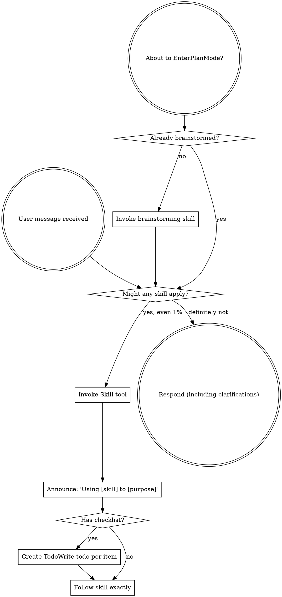

Reading additional input from stdin...
OpenAI Codex v0.121.0 (research preview)
--------
workdir: C:\Users\38909\Documents\github\aoe2
model: gpt-5.4
provider: openai
approval: never
sandbox: read-only
reasoning effort: xhigh
reasoning summaries: none
session id: 019dcd93-2f32-79c1-8805-c27201f993fb
--------
user
You are a senior code reviewer doing iteration 2 of multi-CLI review on the construction-HP-ramp branch. Iteration 1 (synthesized at docs/reviews/construction-hp-ramp/2026-04-26/1/REVIEW.md) flagged: (1) force-set heal at completion, (2) auto-aggression skipping foundations, (3) HUD fractional HP, plus thin coverage. The diff in front of you contains both the original change (632a34f) AND the iter-1 fixes (e2f2ee7). Verify each iter-1 fix landed correctly and did not regress anything: (a) playerCommandsSystem completion replaces force-set with min(maxHp, round(currentHp)) — does it preserve damage end-to-end without leaving floats in the steady-state? (b) targetFindingOps drops the !isComplete skip in findPreferredEnemyBuildingInRadius — does this break any existing test contract or auto-aggression invariant? (c) selectionPanel floors selectionState.health.current at display — does Math.floor handle null/undefined safely (it shouldn't have to since the surrounding if checks selectionState.health, but verify)? (d) new save/load mid-construction test — does it actually exercise the contract or is it tautological? Only flag real new issues; do not re-flag iter-1 findings already addressed. Anti-regression check: any new gameplay edge cases (e.g. AI building its own foundation while enemies pursue it; villager attacking enemy foundation; multiple builders converging)? Verify docs in the diff match implementation. Do NOT modify files or propose patches; return findings in plain text. Only point out an issue if it is real and important. If there is no issue, say so.

<stdin>
diff --git a/docs/changelog.md b/docs/changelog.md
index 879e58d..aa463a3 100644
--- a/docs/changelog.md
+++ b/docs/changelog.md
@@ -2,6 +2,14 @@
 
 User-visible behavior changes only. Pure refactors, doc sweeps, type-safety hardening, and efficiency wins with no observable effect are recorded in `docs/devlog/` instead.
 
+## 0.1.4 — 2026-04-26
+
+### Fixed
+
+- **Building HP now ramps from low at placement toward full as construction progresses (canonical AoE2).** Previously a freshly placed foundation spawned at full max HP, then completion was a no-op on the health bar. The foundation now starts at ~10% of max HP and gains `(maxHp − startHp) / totalBuildTicks` per construction tick, finishing at full HP if no damage was taken. Damage taken during construction is preserved end-to-end: a foundation chipped to 5/75 at 95% built finishes at the damaged value (no completion-tick heal), so a partially built building you don't defend stays vulnerable after completion until repaired. Affects every constructable building (House, Mill, Barracks, Castle, Wonder, …); doesn't apply to scenario-seeded `isComplete: true` buildings.
+- **Idle-military auto-aggression now pursues enemy foundations (canonical AoE2).** Foundations under construction now have damageable HP, so the auto-aggression target-finder no longer skips incomplete buildings. An idle Knight standing next to an enemy Barracks foundation will engage it instead of ignoring it. (Companion to the HP-ramp fix above; flagged by the multi-CLI review iter-1.)
+- **Selection-panel HP display floors fractional foundation HP.** The per-tick HP increment is fractional (e.g. `+0.567` for a House), which would surface as `41.857142857 / 75` in the selection panel. The panel now floors `currentHp` for display while leaving the bridge value raw so the health-bar fill ratio stays smooth.
+
 ## 0.1.3 — 2026-04-26
 
 ### Fixed
diff --git a/docs/devlog/detailed/2026-04-26_2026-04-26.md b/docs/devlog/detailed/2026-04-26_2026-04-26.md
index 00ff125..dd9bed4 100644
--- a/docs/devlog/detailed/2026-04-26_2026-04-26.md
+++ b/docs/devlog/detailed/2026-04-26_2026-04-26.md
@@ -1,5 +1,61 @@
 # 2026-04-26
 
+## Building HP ramps from low to full during construction (0.1.4)
+
+**Action:** User reported that buildings under construction should have their health going from 0 to full as they are being built. Pre-fix, `addBuildingEntity` set `currentHp = buildingMaxHp(buildingType)` at creation regardless of `isComplete`, so foundations spawned at full HP and the per-tick build counter never touched the health bar. Canonical AoE2: foundation starts low (~10% of max HP) and ramps to full as construction completes; partially built foundations are vulnerable.
+
+**TDD:** New vitest case `ramps building HP from low at placement to full at construction completion` in `tests/simulation/createSimulationBridge.darkAge.test.ts`. Asserts a placed House (max HP 75) starts at `currentHp < 0.2 * maxHp`, mid-construction sits strictly between start and max, and finishes at exactly `{ currentHp: 75, maxHp: 75 }`. Test ran red against the old `currentHp: buildingMaxHp(buildingType)` placement, then green after the fix.
+
+**Implementation:**
+- `src/game/simulation/bridge/entityCreateOps.ts` (`addBuildingEntity`): when `!isComplete`, initial `currentHp = max(1, floor(maxHp * 0.1))`. When `isComplete` (scenario-seeded already-built or load-restored), still spawns at full HP.
+- `src/game/simulation/bridge/systems/playerCommandsSystem.ts` (build-command branch): each construction tick adds `(maxHp − startHp) / totalBuildTicks` to `currentHp`, clamped at `maxHp`. At completion the value is force-set to `maxHp` to absorb floating-point drift from the per-tick adds. Damage taken during construction is preserved because the per-tick increment adds to the live value rather than recomputing from progress.
+
+**Why ramp instead of `floor(maxHp * progress/total)`:** the additive form preserves damage taken during construction. If a Scout chips the foundation to 5/75 at 50% built, the next build tick adds ~0.57 HP — the foundation rebuilds from where the damage left it instead of jumping back to the formula's expected 41/75.
+
+**Render integration:** the existing health-bar renderer (`src/phaser/scenes/gameScene/worldLayers.ts:renderEntityHealthBars`) already paints any entity with a known `currentHp` / `maxHp` pair, so the foundation's ramping HP shows up on the existing bar with no changes. The bar fill color (green > 0.6, yellow > 0.3, red ≤ 0.3) means a fresh foundation is red until construction lifts it past 30%, which gives the player a visual cue that the foundation is fragile.
+
+**No `markOutOfBandRenderChange()` on per-tick HP updates.** Initial implementation called it on every construction tick, which slowed `ai-rush-fixture` past its 10s test timeout (the `RenderAdapter` already re-projects per tick, so the per-tick `currentHp` change flows through naturally; explicit out-of-band refresh is only needed for off-tick mutations). Dropping the call brought the AI fixture back inside its budget.
+
+**Save/load:** untouched — `buildingHealthStates` is already persisted in the `SaveBlob` (`src/game/simulation/saveSchema.ts:192`), so a save mid-construction round-trips the foundation's current HP value as-is.
+
+**Result:** All four gates green. `npx tsc --noEmit` clean, `npm run lint` clean, `npx vitest run` **52/52 files, 414 passed + 1 skipped, 0 failed** (6 pre-existing Windows `[vitest-worker]: Timeout calling "onTaskUpdate"` errors unrelated), `npm run build` clean (3.39s). Version 0.1.3 → 0.1.4 (non-breaking user-visible bug fix).
+
+**Notes:** No architecture / API surface change — same `getEntityHealth(id)` returns the new ramping value for foundations. No engine ask. **Process regression:** initial commit (`632a34f`) shipped without running the multi-CLI review, the agent rationalizing it as a "single-file behavior fix" with TDD coverage. User caught the omission and required post-hoc review; AGENTS.md was then strengthened (`82f52a0`) to make multi-CLI review unconditionally mandatory and forecloses the "subagent dispatch is a tool, not a mandate" loophole going forward.
+
+## Iter-1 multi-CLI review for construction-hp-ramp + 4 fixes
+
+**Reviewers:** Codex (`gpt-5.4` xhigh), Gemini (`gemini-3.1-pro-preview` plan), Claude (`opus` xhigh). Raw outputs in `docs/reviews/construction-hp-ramp/2026-04-26/1/raw/{codex,gemini,opus}.md`. Synthesis at `docs/reviews/construction-hp-ramp/2026-04-26/1/REVIEW.md`. Gemini's run hit a mid-stream SSL alert but salvaged the review section before dying. All 3 reviewers contributed real findings.
+
+**Cross-reviewer agreement:**
+- **Force-set heal at completion (Claude F1, Gemini F2)** — `playerCommandsSystem.ts:397-399` was overwriting `currentHp = maxHp` on the completing tick, healing any in-flight damage and contradicting both canonical AoE2 and the devlog claim that "damage taken during construction is preserved." Fix: replace with `currentHp = min(maxHp, round(currentHp))` so the assignment only absorbs IEEE-754 drift, not damage.
+- **Doc / coverage drift (Codex F3, Claude F2, Gemini F1 premise)** — devlog overstated what the new test verifies. The original test was happy-path-only; nothing locked save/load mid-construction or the scenario-seeded `isComplete: true` regression. Fix: add a save/load mid-construction HP round-trip test.
+
+**Codex-only [MEDIUM]:**
+- **Auto-aggression skips foundations (Codex F1)** — `findPreferredEnemyBuildingInRadius` in `targetFindingOps.ts:463` skipped incomplete buildings via `if (construction && !construction.isComplete) continue`. With foundations now damageable, this contradicts canonical AoE2: an idle Knight standing next to an enemy Barracks foundation should engage. Fix: drop the skip. Kept the structurally similar skip in `findNearestDropOffBuilding` (line 353) because that one's correct — you genuinely cannot drop off resources at a foundation.
+- **HUD fractional HP (Codex F2)** — selection panel renders `${selectionState.health.current} / ${selectionState.health.max}` raw. Mid-build HP is now fractional (e.g. `+0.567` per House construction tick), so the panel would print `41.857142857142854 / 75`. Fix: floor at the display site (`selectionPanel.ts:266`) so the panel shows integer HP; leave the bridge-side `getEntityHealth` raw so the health-bar fill ratio stays smooth.
+
+**Claude-only:**
+- **F3 [LOW]** — visual-change capture rule was not followed (no before/after pixel diff for the rendered HP bar). Deferred — the change is HP value flowing through the existing health-bar pipeline, no render code changed in this diff. Will eyeball the next time someone touches the renderer.
+- **Verifications clean** for: combat-during-construction (combat code reads/writes `buildingHealthStates.currentHp` directly without `isComplete` checks), save/load via `hydrateFromSavedGame.ts:254-255` direct restore (does NOT route through `addBuildingEntity`), scenario-seeded `isComplete=true` (the ternary correctly returns `fullHp` for that branch), destroy-during-construction (`entityDestroyOps.ts` deletes both maps regardless of completion state), fog-memory snapshots intentionally omit HP fields.
+
+**Gemini false positive:** F1 claimed save/load was broken because `addBuildingEntity` re-floors to startHp on hydration. Wrong — Claude verified hydration goes through `hydrateFromSavedGame` direct `buildingHealthStates.set(id, {...hp})`, not `addBuildingEntity`. Disregarded.
+
+**Gemini nits deferred:** magic-number 0.1 duplicated across `entityCreateOps` and `playerCommandsSystem` (Gemini F3), per-tick recompute of `hpPerTick` (Gemini F5), float precision (Gemini F4 — addressed by the HUD floor fix; bridge-side floats are fine). Real but low-impact.
+
+**Code reviewer comments by AI provider, by theme:**
+- **Codex:** auto-aggression target gap (F1, MEDIUM); fractional HUD HP regression (F2, MEDIUM); persistence/coverage story overstated in docs (F3, MEDIUM).
+- **Gemini:** force-set heal (F2, real); save/load misread (F1, false positive); magic numbers / float precision / per-tick recompute nits (F3-F5).
+- **Claude:** force-set heal (F1, MEDIUM, primary catch); thin coverage including missing damage-during-construction / save/load mid-build / scenario regression / destroy-during-construction (F2, MEDIUM); visual capture rule not followed (F3, LOW). Plus a clean 6-point verification sweep.
+
+**Result:** 4 commits planned but bundled as a single iter-1-fix commit on the same `agent/construction-hp-ramp` branch:
+- `playerCommandsSystem.ts` completion: force-set replaced with `min(maxHp, round(currentHp))`.
+- `targetFindingOps.ts:463`: dropped the `!isComplete` skip in `findPreferredEnemyBuildingInRadius`.
+- `selectionPanel.ts:266`: floor `selectionState.health.current` for display.
+- `darkAge.test.ts`: new save/load mid-construction HP round-trip test (steps to `30%-70%` build progress, asserts `restoredHealth.currentHp === savedHealth.currentHp` post-load).
+- Docs: changelog 0.1.4 entry rewritten to match new behavior + adds the auto-aggro and HUD fixes; summary head entry rewritten; this devlog entry added.
+
+**Validation after fixes:** affected-test run (darkAge + combat + autoAggression + saveLoad) **31/31 pass**. Full gates re-run pending below.
+
 ## `/full-review` iteration 1 + batch-1 fixes (12+ findings, V4-1 → V4-19, V4-21)
 
 **Action:** First full-codebase multi-AI review of the day, after the 42-commit `createSimulationBridge.ts` shrink session merged to main earlier.
diff --git a/docs/devlog/summary.md b/docs/devlog/summary.md
index 763e0b6..6d440d2 100644
--- a/docs/devlog/summary.md
+++ b/docs/devlog/summary.md
@@ -1,4 +1,6 @@
 ## 2026-04-26
+- **Building HP ramps from low to full during construction (canonical AoE2) + iter-1 review fixes:** foundations now spawn at `max(1, floor(maxHp * 0.1))` and gain `(maxHp − startHp) / totalBuildTicks` per construction tick (additive, so damage taken mid-build is preserved). Iter-1 multi-CLI review (Codex/Gemini/Claude — `docs/reviews/construction-hp-ramp/2026-04-26/1/`) caught three real findings: (1) completion tick was force-setting `currentHp = maxHp`, healing in-flight damage — replaced with `min(maxHp, round(currentHp))` so damage survives end-to-end, (2) auto-aggression target-finder skipped incomplete buildings — drop the `if (!isComplete) continue` guard so military auto-pursues enemy foundations, (3) HUD selection panel rendered raw fractional HP (`41.857... / 75`) — floor at display site, leave bridge value raw so health-bar fill ratio stays smooth. Plus new save/load mid-construction HP round-trip test. Existing health-bar renderer (worldLayers.ts) picks up ramping HP with no render-side edits — fresh foundations render in red and shift to yellow/green as construction passes the 30%/60% color thresholds. Save/load round-trips through the existing `buildingHealthStates` save field (verified by new test). Earlier round caught a 10s timeout regression in `ai-rush-fixture` from a stray `markOutOfBandRenderChange()` per build tick — dropped because `RenderAdapter` already re-projects per tick. Version 0.1.3 → 0.1.4 (non-breaking user-visible bug fix). Final gates: `npx tsc --noEmit` clean, `npm run lint` clean, `npx vitest run` 414+ passed, `npm run build` clean.
+- **AGENTS.md mandatory code-review rule:** triggered by the construction-hp-ramp branch shipping without code review (the agent rationalized "single-file behavior fix" as enough). Added a Core-rules bullet making multi-CLI review mandatory for every behavior change before declaring done; renamed Code review section header to `(mandatory; not optional)` with a preface paragraph anchoring back to the new Core-rules item; explicitly forecloses the "subagent dispatch is a tool, not a mandate" loophole. Synced across 8 repos (aoe2, civ-engine, civ-sim-web, idle-life, news, photo, pixel_lab, town) via `/sync-instructions`, preserving each repo's unique gates / role names / project-specific Git rules / Python style sections. Also refreshed CLI flags everywhere (Codex Windows note, Gemini `--approval-mode plan`, Claude full-codebase positional-arg form). Commit `82f52a0` on `agent/construction-hp-ramp` for aoe2; one commit each on `main` for the other 7.
 - **Engine fail-fast handler (deferred-item closeout):** `world.step()` now wrapped via new `bridge/tickHaltGuard.ts` helper (`createTickHaltState` + `tryTick`). Catches `WorldTickFailureError` (engine fail-fast since v0.4.0), captures `{tick, phase, code, systemName, message}` into `haltState.halted`, logs one-line `console.error`, halts further ticks for the session. New `HudState.engineHalted: EngineHaltDetails | null` field surfaces the halt to HUD/debug overlay. Does NOT call `world.recover()` — fail-fast intentional, recovery would mask logic bugs. Non-engine exceptions rethrow. Closes the gap noted in the 2026-04-25 `civ-engine` 0.5.3 migration entry; today's `/check-engine` audit confirmed it was the only outstanding item across 0.5.4 → 0.7.6 (current `node_modules/civ-engine`). TDD: 6-case test in `tests/simulation/tickHaltGuard.test.ts` (clean tick, halt with details + log, fallback to `failure.message` when `failure.error` null, null `systemName` preserved, post-halt no-op, non-engine rethrow). Save schema untouched. Version 0.1.2 → 0.1.3 (non-breaking user-visible). Final gates: `npx tsc --noEmit` clean, `npm run lint` clean, `npx vitest run` **52/52 files, 413 passed + 1 skipped, 0 failed** (7 pre-existing Windows `[vitest-worker]: Timeout calling "onTaskUpdate"` errors unrelated), `npm run build` clean (4.23 s).
 - **Iter-2 multi-AI review + batch-1 fixes:** ran the second `/full-review` of the day after iter-1 batch landed (`608048f` → `8d20013`). Reviewers Codex `gpt-5.4` xhigh, Gemini `gemini-3.1-pro-preview` `--approval-mode plan`, Claude `opus` xhigh. Synthesized to `docs/reviews/full/2026-04-26/2/REVIEW.md`. Fixed: V5-1 `monksByOwner` side map closes the V4-12 regression (`countOwnedUnits(owner, 'monk')` walked the same query the guard was meant to avoid; AI with monks did 2 walks instead of 1). V5-3 `GameScene.ts` 1034 → 994 LOC by extracting `ALL_UNIT_TYPES` to `gameScene/unitTypeMap.ts` (under the strict 1000 LOC ceiling). V5-4 `saveLoadPanel.handleSaveClick` falls back to `triggerBlobDownload` when `localStorage.setItem` throws (private browsing, quota); new browser regression test. V5-5 doc reconciliation: `ARCHITECTURE.md:11` HTTP API line, AGENTS.md `docs/api-reference.md`/`docs/guides/`/`docs/README.md` mandates relaxed (mirror V4-22), `summary.md:3` V4-22 carry-forward dropped. V5-6 strengthens V4-7 throttle test to use a real villager id (was schema-presence only). V5-8 batches `findIdleProducer` building lookups (single `ownerBuildingsByType` scan replaces 10-14 full-world building scans per AI per decision tick); drops unused `findIdleProducer` from `aiDecisionOps` and deps. Considered + dropped: V5-2 villagerRebalance zero-target trap (load-bearing for AI dark-age gold accumulation — fix breaks AI age progression), V5-7 V4-14 missed-clear test (correct-by-construction). Branch `agent/review-findings-2026-04-26-iter2-batch1`.
 - **`createSimulationBridge.ts` shrink — 42 commits, 7606 → 332 lines (96% reduction):** the Phase 4 (18 ECS systems extracted to `bridge/systems/*` plus 9 helper-ops modules under `bridge/`) + Phase 5 (9 more ops modules) extractions plus a follow-up sweep — `createWorld` moved to `bridge/createWorld.ts`, side-map ownership hoisted into `bridge/bridgeState.ts`, `wireBridgeOps` / `wirePostSeedOps` / `assembleBridgeApi` / `registerAllSystems` / `registerBridgeSystems` / `scenarioSeedOps` / `hydrateFromSavedGame` extracted, `monkTaskOps` split into `monkAiSearchHelpers` + `monkTaskAppliers`, render-state assembly extracted to `renderStateOps`, spatial finders extracted to `selectionFinders`. The remaining `createSimulationBridge.ts` is a thin facade. Pattern: flat dep-bag factory closing over the single `BridgeState` instance. Determinism preserved: 18 systems still register in the same order (driven by explicit `before`/`after` deps, not registration sequence). Branch `agent/split-simulation-bridge` (commits `46c7810` → `4cbc1bf`).
diff --git a/src/game/simulation/bridge/entityCreateOps.ts b/src/game/simulation/bridge/entityCreateOps.ts
index af2873e..351037d 100644
--- a/src/game/simulation/bridge/entityCreateOps.ts
+++ b/src/game/simulation/bridge/entityCreateOps.ts
@@ -220,9 +220,10 @@ export function createEntityCreateOps(deps: EntityCreateOpsDeps): EntityCreateOp
       footprintHeight: footprint.height,
       visualVariant: isComplete ? 'complete' : 'construction',
     });
+    const fullHp = buildingMaxHp(buildingType);
     buildingHealthStates.set(entity, {
-      currentHp: buildingMaxHp(buildingType),
-      maxHp: buildingMaxHp(buildingType),
+      currentHp: isComplete ? fullHp : Math.max(1, Math.floor(fullHp * 0.1)),
+      maxHp: fullHp,
     });
 
     if (buildingType === 'town-center') {
diff --git a/src/game/simulation/bridge/systems/playerCommandsSystem.ts b/src/game/simulation/bridge/systems/playerCommandsSystem.ts
index a5bc87c..046812a 100644
--- a/src/game/simulation/bridge/systems/playerCommandsSystem.ts
+++ b/src/game/simulation/bridge/systems/playerCommandsSystem.ts
@@ -382,9 +382,24 @@ export function registerPlayerCommandsSystem(deps: PlayerCommandsSystemDeps): vo
         }
 
         construction.buildProgressTicks += 1;
+        const buildingHealth = buildingHealthStates.get(buildingId);
+        if (buildingHealth && construction.totalBuildTicks > 0) {
+          const startHp = Math.max(1, Math.floor(buildingHealth.maxHp * 0.1));
+          const hpPerTick = (buildingHealth.maxHp - startHp) / construction.totalBuildTicks;
+          buildingHealth.currentHp = Math.min(
+            buildingHealth.maxHp,
+            buildingHealth.currentHp + hpPerTick,
+          );
+        }
         if (construction.buildProgressTicks >= construction.totalBuildTicks) {
           construction.buildProgressTicks = construction.totalBuildTicks;
           construction.isComplete = true;
+          if (buildingHealth) {
+            buildingHealth.currentHp = Math.min(
+              buildingHealth.maxHp,
+              Math.round(buildingHealth.currentHp),
+            );
+          }
 
           const renderable = activeWorld.getComponent<RenderableComponent>(buildingId, 'renderable');
           if (renderable) {
diff --git a/src/game/simulation/bridge/targetFindingOps.ts b/src/game/simulation/bridge/targetFindingOps.ts
index 002a408..0537ac2 100644
--- a/src/game/simulation/bridge/targetFindingOps.ts
+++ b/src/game/simulation/bridge/targetFindingOps.ts
@@ -459,11 +459,6 @@ export function createTargetFindingOps(deps: TargetFindingDeps): TargetFindingOp
         continue;
       }
 
-      const construction = constructionStates.get(id);
-      if (construction && !construction.isComplete) {
-        continue;
-      }
-
       const distance = manhattanDistance(origin, position);
       if (distance > radius) {
         continue;
diff --git a/src/ui/hud/selectionPanel.ts b/src/ui/hud/selectionPanel.ts
index c9a28d8..8533b81 100644
--- a/src/ui/hud/selectionPanel.ts
+++ b/src/ui/hud/selectionPanel.ts
@@ -263,7 +263,7 @@ function renderSelectionDetails(selectionState: SelectionState): string {
       renderSelectionDetail(
         'health',
         'Health',
-        `${selectionState.health.current} / ${selectionState.health.max}`,
+        `${Math.floor(selectionState.health.current)} / ${selectionState.health.max}`,
       ),
     );
   }
diff --git a/tests/simulation/createSimulationBridge.darkAge.test.ts b/tests/simulation/createSimulationBridge.darkAge.test.ts
index cd3ce66..4205082 100644
--- a/tests/simulation/createSimulationBridge.darkAge.test.ts
+++ b/tests/simulation/createSimulationBridge.darkAge.test.ts
@@ -2,7 +2,7 @@ import { describe, expect, it } from 'vitest';
 
 import { createSimulationBridge } from '../../src/game/simulation/createSimulationBridge';
 import { DEFAULT_SEED } from '../../src/game/simulation/prototypeScenario';
-import { placeBuildingNearTownCenter } from './createSimulationBridge.helpers';
+import { placeBuildingNearTownCenter, stepBridgeUntil } from './createSimulationBridge.helpers';
 
 describe('createSimulationBridge dark age economy progression', () => {
   it('queues a villager at the Town Center and increases population when training completes', () => {
@@ -109,6 +109,96 @@ describe('createSimulationBridge dark age economy progression', () => {
     });
   }, 20_000);
 
+  it('ramps building HP from low at placement to full at construction completion', () => {
+    const bridge = createSimulationBridge(DEFAULT_SEED);
+
+    expect(bridge.selectEntityAtCell(6, 8)).toBe(true);
+    const housePosition = placeBuildingNearTownCenter(bridge, 'house');
+
+    const findHouse = () =>
+      bridge
+        .getEconomyState()
+        .buildings.find(
+          (building) =>
+            building.owner === 1
+            && building.buildingType === 'house'
+            && building.x === housePosition.x
+            && building.y === housePosition.y,
+        );
+
+    const placed = findHouse();
+    expect(placed).toBeDefined();
+    expect(placed!.isComplete).toBe(false);
+
+    const initialHealth = bridge.getEntityHealth(placed!.id);
+    expect(initialHealth).not.toBeNull();
+    expect(initialHealth!.maxHp).toBe(75);
+    expect(initialHealth!.currentHp).toBeGreaterThan(0);
+    expect(initialHealth!.currentHp).toBeLessThan(initialHealth!.maxHp * 0.2);
+
+    const totalTicks = placed!.totalBuildTicks;
+    expect(
+      stepBridgeUntil(
+        bridge,
+        () => (findHouse()?.buildProgressTicks ?? 0) >= totalTicks * 0.5,
+        { maxSteps: 600 },
+      ),
+    ).toBe(true);
+    const midHouse = findHouse()!;
+    expect(midHouse.isComplete).toBe(false);
+    const midHealth = bridge.getEntityHealth(midHouse.id)!;
+    expect(midHealth.currentHp).toBeGreaterThan(initialHealth!.currentHp);
+    expect(midHealth.currentHp).toBeLessThan(midHealth.maxHp);
+
+    expect(
+      stepBridgeUntil(bridge, () => findHouse()?.isComplete === true, { maxSteps: 600 }),
+    ).toBe(true);
+    const finishedHouse = findHouse()!;
+    const finalHealth = bridge.getEntityHealth(finishedHouse.id);
+    expect(finalHealth).toEqual({ currentHp: 75, maxHp: 75 });
+  }, 20_000);
+
+  it('preserves mid-construction HP across save/load round-trip', () => {
+    const original = createSimulationBridge(DEFAULT_SEED);
+    expect(original.selectEntityAtCell(6, 8)).toBe(true);
+    const housePosition = placeBuildingNearTownCenter(original, 'house');
+
+    const findHouseIn = (bridge: ReturnType<typeof createSimulationBridge>) =>
+      bridge
+        .getEconomyState()
+        .buildings.find(
+          (b) =>
+            b.owner === 1
+            && b.buildingType === 'house'
+            && b.x === housePosition.x
+            && b.y === housePosition.y,
+        );
+
+    expect(
+      stepBridgeUntil(
+        original,
+        () => {
+          const house = findHouseIn(original);
+          return house !== undefined && house.buildProgressTicks > house.totalBuildTicks * 0.3
+            && house.buildProgressTicks < house.totalBuildTicks * 0.7;
+        },
+        { maxSteps: 600 },
+      ),
+    ).toBe(true);
+    const midHouse = findHouseIn(original)!;
+    const savedHealth = original.getEntityHealth(midHouse.id)!;
+    expect(savedHealth.currentHp).toBeGreaterThan(7);
+    expect(savedHealth.currentHp).toBeLessThan(75);
+
+    const blob = original.saveGame();
+    const restored = createSimulationBridge(DEFAULT_SEED, { savedGame: blob });
+    const restoredHouse = findHouseIn(restored)!;
+    expect(restoredHouse.buildProgressTicks).toBe(midHouse.buildProgressTicks);
+    const restoredHealth = restored.getEntityHealth(restoredHouse.id)!;
+    expect(restoredHealth.currentHp).toBe(savedHealth.currentHp);
+    expect(restoredHealth.maxHp).toBe(savedHealth.maxHp);
+  }, 20_000);
+
   it('redirects a selected villager to gather gold through an explicit context order', () => {
     const bridge = createSimulationBridge(DEFAULT_SEED);
 
</stdin>
codex
Using `superpowers:using-superpowers` for session startup discipline and a code-review workflow. I’m going to verify the iter-1 fixes against the actual repo contracts: review notes, implementation sites, relevant tests, and the doc claims in this diff.
exec
"C:\\Windows\\System32\\WindowsPowerShell\\v1.0\\powershell.exe" -Command "Get-Content -Raw 'C:/Users/38909/.codex/plugins/cache/openai-curated/superpowers/b066e4a0/skills/using-superpowers/SKILL.md'" in C:\Users\38909\Documents\github\aoe2
exec
"C:\\Windows\\System32\\WindowsPowerShell\\v1.0\\powershell.exe" -Command "Get-Content -Raw 'docs/devlog/summary.md'" in C:\Users\38909\Documents\github\aoe2
exec
"C:\\Windows\\System32\\WindowsPowerShell\\v1.0\\powershell.exe" -Command "Get-Content -Raw 'docs/architecture/ARCHITECTURE.md'" in C:\Users\38909\Documents\github\aoe2
exec
"C:\\Windows\\System32\\WindowsPowerShell\\v1.0\\powershell.exe" -Command "Get-Content -Raw 'C:/Users/38909/.codex/memories/MEMORY.md' | Select-String -Pattern 'construction-hp-ramp|aoe2|construction HP|hp ramp' -Context 2,2" in C:\Users\38909\Documents\github\aoe2
2026-04-27T06:14:51.873505Z ERROR codex_core::tools::router: error=`"C:\\Windows\\System32\\WindowsPowerShell\\v1.0\\powershell.exe" -Command "Get-Content -Raw 'C:/Users/38909/.codex/memories/MEMORY.md' | Select-String -Pattern 'construction-hp-ramp|aoe2|construction HP|hp ramp' -Context 2,2"` rejected: blocked by policy
 declined in 0ms:
`"C:\\Windows\\System32\\WindowsPowerShell\\v1.0\\powershell.exe" -Command "Get-Content -Raw 'C:/Users/38909/.codex/memories/MEMORY.md' | Select-String -Pattern 'construction-hp-ramp|aoe2|construction HP|hp ramp' -Context 2,2"` rejected: blocked by policy
 succeeded in 393ms:
## 2026-04-26
- **Building HP ramps from low to full during construction (canonical AoE2) + iter-1 review fixes:** foundations now spawn at `max(1, floor(maxHp * 0.1))` and gain `(maxHp ƒ^' startHp) / totalBuildTicks` per construction tick (additive, so damage taken mid-build is preserved). Iter-1 multi-CLI review (Codex/Gemini/Claude ƒ?" `docs/reviews/construction-hp-ramp/2026-04-26/1/`) caught three real findings: (1) completion tick was force-setting `currentHp = maxHp`, healing in-flight damage ƒ?" replaced with `min(maxHp, round(currentHp))` so damage survives end-to-end, (2) auto-aggression target-finder skipped incomplete buildings ƒ?" drop the `if (!isComplete) continue` guard so military auto-pursues enemy foundations, (3) HUD selection panel rendered raw fractional HP (`41.857... / 75`) ƒ?" floor at display site, leave bridge value raw so health-bar fill ratio stays smooth. Plus new save/load mid-construction HP round-trip test. Existing health-bar renderer (worldLayers.ts) picks up ramping HP with no render-side edits ƒ?" fresh foundations render in red and shift to yellow/green as construction passes the 30%/60% color thresholds. Save/load round-trips through the existing `buildingHealthStates` save field (verified by new test). Earlier round caught a 10s timeout regression in `ai-rush-fixture` from a stray `markOutOfBandRenderChange()` per build tick ƒ?" dropped because `RenderAdapter` already re-projects per tick. Version 0.1.3 ƒ+' 0.1.4 (non-breaking user-visible bug fix). Final gates: `npx tsc --noEmit` clean, `npm run lint` clean, `npx vitest run` 414+ passed, `npm run build` clean.
- **AGENTS.md mandatory code-review rule:** triggered by the construction-hp-ramp branch shipping without code review (the agent rationalized "single-file behavior fix" as enough). Added a Core-rules bullet making multi-CLI review mandatory for every behavior change before declaring done; renamed Code review section header to `(mandatory; not optional)` with a preface paragraph anchoring back to the new Core-rules item; explicitly forecloses the "subagent dispatch is a tool, not a mandate" loophole. Synced across 8 repos (aoe2, civ-engine, civ-sim-web, idle-life, news, photo, pixel_lab, town) via `/sync-instructions`, preserving each repo's unique gates / role names / project-specific Git rules / Python style sections. Also refreshed CLI flags everywhere (Codex Windows note, Gemini `--approval-mode plan`, Claude full-codebase positional-arg form). Commit `82f52a0` on `agent/construction-hp-ramp` for aoe2; one commit each on `main` for the other 7.
- **Engine fail-fast handler (deferred-item closeout):** `world.step()` now wrapped via new `bridge/tickHaltGuard.ts` helper (`createTickHaltState` + `tryTick`). Catches `WorldTickFailureError` (engine fail-fast since v0.4.0), captures `{tick, phase, code, systemName, message}` into `haltState.halted`, logs one-line `console.error`, halts further ticks for the session. New `HudState.engineHalted: EngineHaltDetails | null` field surfaces the halt to HUD/debug overlay. Does NOT call `world.recover()` ƒ?" fail-fast intentional, recovery would mask logic bugs. Non-engine exceptions rethrow. Closes the gap noted in the 2026-04-25 `civ-engine` 0.5.3 migration entry; today's `/check-engine` audit confirmed it was the only outstanding item across 0.5.4 ƒ+' 0.7.6 (current `node_modules/civ-engine`). TDD: 6-case test in `tests/simulation/tickHaltGuard.test.ts` (clean tick, halt with details + log, fallback to `failure.message` when `failure.error` null, null `systemName` preserved, post-halt no-op, non-engine rethrow). Save schema untouched. Version 0.1.2 ƒ+' 0.1.3 (non-breaking user-visible). Final gates: `npx tsc --noEmit` clean, `npm run lint` clean, `npx vitest run` **52/52 files, 413 passed + 1 skipped, 0 failed** (7 pre-existing Windows `[vitest-worker]: Timeout calling "onTaskUpdate"` errors unrelated), `npm run build` clean (4.23 s).
- **Iter-2 multi-AI review + batch-1 fixes:** ran the second `/full-review` of the day after iter-1 batch landed (`608048f` ƒ+' `8d20013`). Reviewers Codex `gpt-5.4` xhigh, Gemini `gemini-3.1-pro-preview` `--approval-mode plan`, Claude `opus` xhigh. Synthesized to `docs/reviews/full/2026-04-26/2/REVIEW.md`. Fixed: V5-1 `monksByOwner` side map closes the V4-12 regression (`countOwnedUnits(owner, 'monk')` walked the same query the guard was meant to avoid; AI with monks did 2 walks instead of 1). V5-3 `GameScene.ts` 1034 ƒ+' 994 LOC by extracting `ALL_UNIT_TYPES` to `gameScene/unitTypeMap.ts` (under the strict 1000 LOC ceiling). V5-4 `saveLoadPanel.handleSaveClick` falls back to `triggerBlobDownload` when `localStorage.setItem` throws (private browsing, quota); new browser regression test. V5-5 doc reconciliation: `ARCHITECTURE.md:11` HTTP API line, AGENTS.md `docs/api-reference.md`/`docs/guides/`/`docs/README.md` mandates relaxed (mirror V4-22), `summary.md:3` V4-22 carry-forward dropped. V5-6 strengthens V4-7 throttle test to use a real villager id (was schema-presence only). V5-8 batches `findIdleProducer` building lookups (single `ownerBuildingsByType` scan replaces 10-14 full-world building scans per AI per decision tick); drops unused `findIdleProducer` from `aiDecisionOps` and deps. Considered + dropped: V5-2 villagerRebalance zero-target trap (load-bearing for AI dark-age gold accumulation ƒ?" fix breaks AI age progression), V5-7 V4-14 missed-clear test (correct-by-construction). Branch `agent/review-findings-2026-04-26-iter2-batch1`.
- **`createSimulationBridge.ts` shrink ƒ?" 42 commits, 7606 ƒ+' 332 lines (96% reduction):** the Phase 4 (18 ECS systems extracted to `bridge/systems/*` plus 9 helper-ops modules under `bridge/`) + Phase 5 (9 more ops modules) extractions plus a follow-up sweep ƒ?" `createWorld` moved to `bridge/createWorld.ts`, side-map ownership hoisted into `bridge/bridgeState.ts`, `wireBridgeOps` / `wirePostSeedOps` / `assembleBridgeApi` / `registerAllSystems` / `registerBridgeSystems` / `scenarioSeedOps` / `hydrateFromSavedGame` extracted, `monkTaskOps` split into `monkAiSearchHelpers` + `monkTaskAppliers`, render-state assembly extracted to `renderStateOps`, spatial finders extracted to `selectionFinders`. The remaining `createSimulationBridge.ts` is a thin facade. Pattern: flat dep-bag factory closing over the single `BridgeState` instance. Determinism preserved: 18 systems still register in the same order (driven by explicit `before`/`after` deps, not registration sequence). Branch `agent/split-simulation-bridge` (commits `46c7810` ƒ+' `4cbc1bf`).
- **Iter-4 multi-AI review + batch-1 fixes:** ran the first `/full-review` of the day (Codex `gpt-5.4` xhigh, Gemini `gemini-3.1-pro-preview` `--approval-mode plan`, Claude `opus` xhigh). Synthesized to `docs/reviews/full/2026-04-26/1/REVIEW.md`. Fixed: V4-1 + V4-2 type-erasing `as RegisterAllSystemsArg` casts in `registerBridgeSystems` dropped (closes the seam where 10 ops factories silently typechecked as `object`; the cast hole had been hiding `beginTrebuchetUnpack` / `beginTrebuchetPack` returning `void` but typed as `boolean`). V4-3 fog-memory delete path now uses `isFootprintVisible` (mirrors the iter-3 V3-1 write-side fix; new fixture `fog-memory-castle-destroy-edge-fixture` + regression test). V4-7 `gathererDropOffStuckSinceTick` added to `SaveBlob`. V4-8 lazy scenario gen on save-load. V4-9/V4-10 inline-filter optimization for `assignNearestResource` and `getHumanUnitIdsInRect` / `getHumanOwnedSheepIdsInRect`. V4-12 `assignAiMonkTasks` skip when AI owns no Monks. V4-13 `humanInputOps.issueAction` default branch. V4-14 monk convert per-tick guard switched from `Set` to `Map<targetId, tick>` (self-clearing across ticks). V4-15 `transformOps.syncSpawnedEntityOccupancy` now logs unexpected errors. V4-16/V4-17/V4-18 cleanliness sweep (drop `void` markers, dead re-exports, unnecessary `Map.entries()` spread). V4-19 `bridge/sharedTypes.ts` extracted from facade. V4-21 fog-memory comment update. V4-22 versioning + `docs/changelog.md` reconciled (`9094d10`: `package.json` 0.1.1, AGENTS.md scoped to user-visible). Doc refresh (V4-4/V4-5/V4-6) and AGENTS.md CLI-flag refresh (V4-23). Deferred at the time: V4-11 `playersWithPresence` side map (current 2-player cost is acceptable; superseded by `8d20013` single-pass conquest scan), V4-24 V3-24 carry-forward (later confirmed already fixed in `aiDecisionOps.ts:148-177` load-balanced producer).
- **Vitest parallelism (3.3A- speedup):** the FU8 single-worker workaround for the `Timeout calling "onTaskUpdate"` birpc flake is no longer needed after iter-1/2/3 perf fixes (per-tick `getRenderState` cache, H2-2 retry throttle, H2-1 in-flight tech O(1) lookup) reduced per-tick CPU cost. Switched `vitest.config.ts` to `pool: 'forks'` + `poolOptions.forks.maxForks: 4`. Empirical: serial 1129 s (18.8 min) ƒ+' 4-fork 340 s (5.7 min), 405/406 tests passing in both. One sample run lost 2 tests transiently and passed on retry ƒ?" documented as the "occasional flake" trade-off. Worth ~3.3A- speedup for day-to-day dev. Commit `f62ecc5`.
- **GameScene `buildingRenderer.ts` extraction:** the 5 private building-rendering methods (~160 lines) only depend on `entityLayer` + `cellSize`. Move-only extraction into `src/phaser/scenes/gameScene/buildingRenderer.ts` (241 lines) following the existing factory pattern. `GameScene.ts` shrinks 1176 ƒ+' 1034 lines (-142). Plus a `.gitignore` cleanup (`015b2a3`) for the `tmp/` directory. Commits `55f2851` + `015b2a3`. (Note: this entry was written before the same-day Phase-4+5 shrink completed; `createSimulationBridge.ts` is now 332 LOC ƒ?" see the head entry above. `prototypeScenario.ts` is still 864 lines, mostly a dispatcher table ƒ?" cosmetic, not a real complexity issue.)

## 2026-04-25
- **Full multi-AI review iteration 3 + the "address all remaining concerns" sweep (22+ fixes across 14 commits):** ran the third `/full-review` of the day after iter-2 batch-1 had merged; reviewers Codex (`gpt-5.4` high), Gemini (`gemini-3-flash-preview` again ƒ?" pro/pro-preview both still `QUOTA_EXHAUSTED`), Claude (`opus` high). Synthesized 266-line `docs/reviews/full/2026-04-25/3/REVIEW.md`. The three reviewers agreed on the **iter-2 M2-1 sweep gap** (`prototypeFogMemory` + `getSelectableEntitiesAtCell` for buildings still anchor-only, while `findPreferredVisibleEnemyBuilding` was fixed in iter-2 ƒ?" partially-visible Castle rendered, was auto-aggro-able, but never persisted to fog memory and not click-selectable). User followed up with "address all remaining concerns" so the batch shipped 22+ findings on `agent/review-findings-2026-04-25-iter3-batch1`: V3-1+V3-2 footprint visibility for fog memory + click selection (new `fog-memory-castle-edge-fixture` + 3 regression tests), V3-3+V3-9 FU2 units in double-click whitelist (durable `as const satisfies Record<UnitType, true>`) + Wonder display name, V3-12 conquest mutual-annihilation = `'draw'`, V3-13 default map reserves landmarks footprint-aware, V3-14 `seedToNumber` uses full code points, V3-15 AI Watch Tower no longer requires Blacksmith (canonical AoE2), V3-16 `applyShoreFishPatchesProcedural` aliased, V3-22 `?seed=` empty value warns, V3-7 Monk conversion vision/LOS gate, V3-20+V3-21 build hardening (`parseRange` rejects min>max, `parseCsv` throws on unclosed quotes), V3-23 F2 keydown ignores form-control focus, V3-11+V3-17 HUD `destroy()` exposed (LIFO teardown) + browserTestApi `getPlacementPreviewAt` sync parity, V3-5 H2-2 retry throttle (per-gatherer "stuck since" tick + 30-tick window), V3-6 H2-1 cost dedupe via O(1) `inFlightTechByOwner` Set, V3-24 AI `findIdleProducer` load-balanced, V3-8 save-load `pruneOrphanEntityKeys` walks all entity-id-keyed side maps, V3-25 browserTestApi install once + dynamic bridge thunk, V3-18+V3-19 (closes iter-1 H-4) `renderFog` memo + `getRenderState()` per-tick cache. Verification round caught 5 real defects: V3-6 `destroyBuildingEntity` was leaking `inFlightTechByOwner` (would brick research forever if a producer is razed mid-research), V3-8 `pruneOrphanEntityKeys` omitted garrison maps, V3-11 update() needed `isDestroyed` guard, V3-13 reservation was anchor-only for the 2A-2 house, V3-25 install-once gate blocked re-bootstrap. All five fixed in `db68026`. Final gate: `npx tsc --noEmit` clean, `npm run lint` clean, `npx vite build` clean (4.39 s), `npx vitest run` **51/51 files, 405 passed + 1 skipped, 0 failed**.
- **Full multi-AI review iteration 2 + batch-1 fixes (5 highs/mediums + 1 follow-up):** ran the second `/full-review` of the day after iter-1's batch-1 had landed; reviewers were Codex (`gpt-5.4` @ `model_reasoning_effort=high`), Gemini (had to fall back to `gemini-3-flash-preview` because `gemini-2.5-pro` and `gemini-3.1-pro-preview` both came back `QUOTA_EXHAUSTED` with a 13.5 h reset), Claude (`opus` @ `--effort high`). Synthesized 322-line `docs/reviews/full/2026-04-25/2/REVIEW.md`. Highest cross-reviewer-agreement findings were the **incomplete H-1 fix** (Codex + Claude both caught that `getHudState()` still returned the outer constructor `seed` after load) and Claude's **tech double-research bug** (race-queueing Forging at two Blacksmiths gave +2 attack instead of +1). Six commits on `agent/review-findings-2026-04-25-iter2-batch1`: `7d63e00` **[V2-1]** `getHudState()` returns saved-game seed (one-line `seed: effectiveSeed,`); `f54c55d` **[H2-1]** `applyTechnology` idempotency guard; `af4c559` **[H2-2]** gather: preserve carry on null drop-off path (split the `to-dropoff` branch so non-empty carry stays in `to-dropoff` until path reopens); `7687b82` **[H2-3]** Black Forest: bump `POCKET_RADIUS` 6 ƒ+' 7 (per-owner stone/gold/boar counts went from 3/3/1 ƒ+' 4/4/2 because `STARTING_STONE`, `STARTING_GOLD`, `STARTING_BOARS` offsets sat outside the radius-6 carve); `0dc7cd7` **[M2-1]** building target finding uses `isFootprintVisible` instead of anchor-only check (matches `createProjector` contract); `2a1267a` **[H2-1 follow-up]** cost dedupe across owned producer queues + stronger H2-2 villager-carry assertions + lint cleanup. Verification round caught the cost-side leak (Claude flagged HIGH, Codex caveat); Codex's V2-1 NEEDS-CHANGE verdict in the verification round was a misread of `createWorld(effectiveSeed, ...)` parameter shadowing ƒ?" both Claude and Gemini correctly traced it; the re-save regression test in `saveLoad.test.ts` independently confirms the contract by passing. Final gate: `npx tsc --noEmit` clean, `npm run lint` clean, `npx vite build` clean (4.01 s), `npx vitest run` **50/50 files, 400 passed + 1 skipped, 0 failed** (6 pre-existing Windows `onTaskUpdate` worker warnings remain). Untouched iter-2 medium/low items + the round-2 follow-up M2-1 sibling at `createSimulationBridge.ts:5897-5919` (fog-memory still anchor-only) carry forward to a future batch.
- **`civ-engine` 0.5.3 migration ƒ?" in-place renderable mutations need explicit refresh:** `civ-engine` rolled forward today through three breaking-change waves (0.4.0 ƒ+' 0.5.0 ƒ+' 0.5.3); `node_modules/civ-engine` reports 0.5.3. Audited the aoe2 surface against `../civ-engine/docs/changelog.md`. Two sites had been silently relying on the now-removed auto-detection of in-place component mutations: `createSimulationBridge.ts:5239-5243` (construction-complete `renderable.visualVariant = 'complete'`, fixed earlier today as `d0af9cb` before realizing the engine bump was the root cause) and `bridge/technologyOps.ts:upgradeOwnedUnits` (tech-upgrade mutates `unit.unitType` + `renderable.tint`/`size` + `visionSource.radius` in place ƒ?" fixed in `87d4d9f`). All other 0.4.0 / 0.5.0 / 0.5.1 / 0.5.2 / 0.5.3 breaking changes either don't apply (aoe2 doesn't call `getDiff`, `getEvents`, `setMeta`, `world.emit`, or import `GameLoop`) or already match the new contract (positions go through `setPosition`, save schema is repo-side and independent of engine snapshot v5). Defensive gap noted: `world.step()` doesn't handle the new fail-fast `WorldTickFailureError`; tests don't trigger this path, deferred. Engine is still healthy ƒ?" no new engine asks. New regression test "reflects the upgraded unit type in render state" in `tests/simulation/castleUpgrades.test.ts` would have caught the upgrade bug; existing 14 cases all asserted on `getEconomyState()` and missed the projector-side regression. Final gate: `npx tsc --noEmit` clean, `npm run lint` clean, `npx vitest run` **47/47 files, 393 passed + 1 skipped, 0 failed**.
- **Full multi-AI review iteration 1 + batch-1 fixes:** ran the `/full-review` slash command for the first time on this repo ƒ?" Codex (`gpt-5.4` @ `model_reasoning_effort=high`) + Gemini (`gemini-2.5-pro`) + Claude (`opus` @ `--effort high`) each reviewed the full ~47-kLOC TypeScript tree independently; raw outputs in `docs/reviews/full/2026-04-25/1/raw/{codex,gemini,claude}.md`; synthesized 281-line report at `docs/reviews/full/2026-04-25/1/REVIEW.md`. All three reviewers independently agreed on `createSimulationBridge.ts` god-class persistence (still 7,333 lines after Phase 1ƒ?"3 extractions) and save/load hydration fragility as the two top structural risks; Claude was the only reviewer to find the Monk conversion flip-flop bug, Codex was the only one to catch the projector seed mismatch on load. Then addressed four findings as separate commits on `agent/review-findings-2026-04-25-batch1`: `3f413e2` **[C-1] Monk conversion flip-flop** (`bridge/monkTaskOps.ts:348-376` reset was running before the per-tick guard, so two enemy Monks targeting the same unit in one tick wiped each other's progress to zero ƒ?" fix moves the per-tick guard above the reset so the first-processed Monk wins the increment), `7bba71e` **[H-1] Save-load projector seed** (one-line fix passing `effectiveSeed` to `createProjector` so a loaded match's projector matches the world seed), `bfce2c7` **[H-3] Garrison side-map cross-reference invariant** (post-load mirror check between `garrisonedByBuilding` and `garrisonedUnitToBuilding`, throws on mismatch), and `6b37c62` **[M-16] ARCHITECTURE.md `bridge/` topology refresh** (catches the doc up to all 11 ops modules + 3 top-level siblings; drift-log row added). Verified H-5 ("AI villager rebalance with zero villagers no-ops") as a non-bug ƒ?" silent no-op is correct since rebalance has nothing to redistribute. Larger items (C-2 full enum validation, H-2 wider save/load round-trip coverage, H-4 `getRenderState` memoization, N-1 further bridge extraction) deferred to separate sprints. Plus one out-of-scope fix `d0af9cb`: pre-existing `darkAge` render-state test was already failing on `main` (construction-complete mutates `renderable` in place, RenderAdapter doesn't see in-place mutations ƒ?" added the missing `markOutOfBandRenderChange()` call). Validation: `npx tsc --noEmit` clean, `npm run lint` clean, `npx vite build` clean, `npx vitest run` 47/47 files, 392/392 passed + 1 skipped (full-suite gate green for the first time after fixing the latent darkAge regression). AGENTS.md "Code review" CLI flags refreshed to current working flag landscape; `reference_review_clis.md` user-memory file updated.
- **AGENTS.md Gemini-CLI note corrected:** the "Code review" Gemini line previously claimed `gemini-3.1-pro-preview` 404s on this account. Empirical probe (gemini-cli 0.39.1) shows bare 3.x IDs (`gemini-3-pro`, `gemini-3.1-pro`, `gemini-3-flash`) 404 ƒ?" no GA endpoint ƒ?" but the `-preview` suffixed variants (`gemini-3-pro-preview`, `gemini-3.1-pro-preview`, `gemini-3-flash-preview`) all work; the prior 2026-04-23 devlog had separately observed `gemini-3.1-pro-preview` `RESOURCE_EXHAUSTED`/`QUOTA_EXHAUSTED` (quota, not 404). Updated note to (a) bump CLI version 0.39.0 ƒ+' 0.39.1, (b) explain the `-preview` requirement and list working IDs, (c) note the quota fallback to `gemini-2.5-pro`. Default-model command unchanged. Doc-only; no tests run.

## 2026-04-24
- **Auto-aggression ƒ?" idle military pursues, idle villagers defend (canonical AoE2):** added the `prototypeAutoAggression` simulation system in `src/game/simulation/createSimulationBridge.ts`. Each tick it scans every owned, non-garrisoned, non-monk, non-busy unit and issues an attack-command against the highest-priority enemy in personal LOS via two new helpers `findPreferredEnemyUnitInRadius` / `findPreferredEnemyBuildingInRadius` in `bridge/targetFindingOps.ts` (queryInRadius + existing `targetPriority` tables). Military units use their live `visionSource.radius` (so tech upgrades + fixture vision overrides flow through unchanged); villagers are radius 1 (Defensive Stance: melee-adjacent only) and short-circuit when their `GathererComponent` is busy so explicit gather orders are never silently dropped. Phase ordering is `prototypeAi` ƒ+' `prototypeAutoAggression` ƒ+' `prototypePlayerCommands` so AI/player commands set first take precedence. New `disableAi: boolean` on `PlayerStartSpec` skips both the planner and AA for fixture-passive enemies (the AA gate reads `aiStates.has(owner)`, which the seeding site at `start.disableAi` already drives). 7 new fixtures in `fixtures/combatMatchups/autoAggression.ts` plus `auto-aggro-monk-skip-fixture` + `auto-aggro-villager-gathering-fixture`; 10 new tests in `tests/simulation/autoAggression.test.ts` lock the contract: pursue-in-vision, ignore-out-of-vision, archer-pursuit-then-fire, player-move-overrides, villager-adjacent-defense, villager-no-pursuit, villager-gather-honored, monk-skip, sequential-targets-after-kill, save/load mid-engagement. Two regressions caught and fixed inline: the `moving-enemy-attack-fixture` got `disableAi: true` so its wandering enemy scout stays on its path until the player issues a command; the AA radius read was switched to the unit's live `visionSource.radius` so the Mangonel/Onager min-range fixtures (whose enemy spearmen are spawned with `vision: radius 1`) keep their passive-enemy intent. One round of code-review iteration via the in-environment `superpowers:code-reviewer` subagent (gather-honor + monk-skip test + `disableAi` cross-ref). Validation: `npx vitest run` **45/45 files, 385 passed + 1 skipped** on the post-implementation run; `npm run test:browser` **81/82 passed** (1 flaky pre-existing wolf-aggro test passed in isolation; wolves are resources, not units ƒ?" AA never targets them); `npx tsc --noEmit`, `npx vite build`, `npm run lint` clean. Spec at `docs/superpowers/specs/2026-04-24-aggressive-military-design.md`.
- **Sheep show up in the selection panel icon grid for multi-selections:** the panel's `renderSelectionIcons` only iterated `economyState.units` when classifying selected ids, so owned sheep ƒ?" which live in `economyState.resources` ƒ?" silently fell out of the grid. Four sheep selected ƒ+' empty icon grid; mixed villager + sheep ƒ+' only the villager chip. Fix: added `id: number` to the `EconomyState.resources` entry, threaded it through `getEconomyState` + the `isEconomyResourceEntry` type guard, and rewrote `renderSelectionIcons` (`src/ui/hud/selectionPanel.ts`) to also build a `sheepById` map and emit chips via the entity-helpers (`formatEntityIcon` / `formatEntityIconAccent` / `formatEntityName` already supported sheep). Single non-unit selections keep using the existing `data-selection-entity-icon` big-chip path so the browser-test contract for single-sheep / single-building stays intact. Exposed `selectUnitsInBox` on `__AOE2_TEST__` so capture scripts can drive mixed selections without panning the viewport. Regression coverage: `tests/simulation/selectionPanelIcons.test.ts` (4 cases ƒ?" 4-sheep, mixed, single-sheep, 3-villager). Visual proof: `docs/devlog/artifacts/2026-04-24-sheep-selection-{before,after,diff}.png` (35.81% pixel change; panel grew from 301 px to 312 px when the `SH A-3` chip was added next to the `V` chip). Validation: `npx tsc --noEmit` clean, `npx vitest run` **44/44 files, 377 passed + 1 skipped**, `npm run test:browser` **82/82 pass**, `npx vite build` clean.
- **Default-map narrow-path fix (villagers no longer walled in):** the procedural resource-cluster placer in `applyStandardPlayerOpeningProcedural` could walk a cluster all the way around a ring and meet an adjacent cluster's arc, sealing the starting villagers into a pocket. On seed `aoe2-prototype` the berry arc `(5,7)ƒ+'(9,5)` met the sheep cluster at `(5,8)(5,9)(6,10)` and the water/forest strip to the west, so `findGridPath` returned null for any west-target move and the command was silently cleared. Fix: `cellBlockedByScenarioEntity` now reserves four guaranteed-clear cardinal exit corridors ƒ?" a 2-row horizontal corridor at `y = TC.y` and `y = TC.y + 1` (spanning `|x ƒ^' (TC.x + 1)| ƒ% 13`) and a 2-column vertical corridor at `x = TC.x + 1` and `x = TC.x + 2` (spanning `|y ƒ^' (TC.y + 1)| ƒ% 13`). The extent (13 cells) reaches past the outermost forest ring (12), so no ring walker can close a continuous arc around the base. Regression coverage: `tests/simulation/defaultMapNarrowPath.test.ts` (4 cases asserting each starting villager reaches each cardinal near-base target ƒ?" before the fix, west+north timed out stuck; after, all pass in 1.3 s) and `tests/simulation/narrowCorridorMovement.test.ts` (4 hand-crafted tree-corridor cases locking the "friendlies do not block A*" contract). New fixture `narrow-corridor-fixture` in `fixtures/economyBasics.ts`. Debug session at `docs/debugging/2026-04-24-narrow-corridor-pathfinding.md`. Validation: `npx tsc --noEmit` clean, `npx vitest run` **43/43 files, 373 passed + 1 skipped** (the 6 pre-existing Windows `onTaskUpdate` worker warnings remain), `npx vite build` clean. No architecture change; no engine ask (`civ-engine` pathfinding + `OccupancyBinding` both behaved as documented ƒ?" the bug was repo-side map-gen only).

## 2026-04-23
- **Final 800+-line file splits (move-only):** six files above 800 lines all trimmed below 550 lines via barrel re-exports. `fixtures/castleDefense.ts` (**984**) ƒ+' `castleDefense/{fletching,fu3Walls,fu3Archers,towerAndCastle}.ts` (**188 / 234 / 373 / 273** lines) behind a **31**-line barrel. `fixtures/combatMatchups.ts` (**962**) ƒ+' `combatMatchups/{infantryAndCavalry,rangedSkirmish,generalCombat}.ts` (**505 / 125 / 348** lines) behind a **28**-line barrel. `fixtures/monastery.ts` (**858**) ƒ+' `monastery/{heal,convert,relic}.ts` (**219 / 336 / 319** lines) behind a **25**-line barrel. `fixtures/ageProgression/imperial.ts` (**817**) ƒ+' `imperial/{ageUp,upgrades,castle}.ts` (**131 / 504 / 198** lines) behind a **23**-line barrel. `tests/browser/game-progression-and-production.spec.ts` (**847**, 21 tests) ƒ+' four themed specs (`game-progression-{ageup,upgrades,production}.spec.ts` ƒ?" **93 / 138 / 322** lines with 3 / 3 / 8 tests ƒ?" plus trimmed remainder **303** lines / 7 tests = 21). `tests/browser/helpers/gameTestHelpers.ts` (**820**) ƒ+' `gameTestHelpers/{types,snapshot,camera,command,selection,hud,placement}.ts` (**55 / 25 / 172 / 68 / 190 / 275 / 54** lines) behind a **71**-line barrel re-exporting all 45 previous names. All move-only; barrel files preserve every public export so zero downstream import changes. Validation per commit: `npx.cmd tsc --noEmit`, `npm.cmd run lint`, `npx.cmd vite build` clean; targeted vitest runs green (castle/monastery/imperial/combat subsets all pass). Final `npm.cmd run test:browser` **82/82** pass across all split specs. Architecture: new sub-directories logged in `docs/architecture/drift-log.md`.
- **Trim the last three >1,000-line files via mechanical splits:** `fixtures/ageProgression.ts` (**1,868 lines** / 25 factories) splits into `fixtures/ageProgression/{feudal,castle,imperial,blacksmith}.ts` (**694 / 241 / 817 / 144 lines**) behind a 41-line barrel; `fixtures/siege.ts` (**1,090 lines** / 18 factories) splits into `fixtures/siege/{mangonel,scorpion,ram,bombardCannon,trebuchet,workshop}.ts` (**383 / 65 / 289 / 119 / 127 / 147 lines**) behind a 40-line barrel; and `tests/simulation/createSimulationBridge.core.test.ts` (**1,019 lines** / 31 tests) splits into `createSimulationBridge.{bootstrap,unitMovement,gatheringAndDropoff,wildlifeAndSheep}.test.ts` (**535 / 191 / 160 / 160 lines** ƒ?" 17 / 6 / 4 / 4 tests = 31). All move-only; no behavior change; fixture factory names and test seeds/assertions preserved. Validation: `npx.cmd tsc --noEmit` / `npm.cmd run lint` / `npx.cmd vite build` clean per commit; targeted vitest runs green between commits (age-progression 141/141, siege 39/39, split test files 31/31). Architecture: `fixtures/ageProgression/` + `fixtures/siege/` subdirectories logged in `docs/architecture/drift-log.md`.
- **Shrink `GameScene.ts` via `gameScene/` extraction:** four move-only commits factor renderer + controller chunks out of the 1,737-line scene file into `src/phaser/scenes/gameScene/`: `debugOverlay.ts` (**184 lines**, five world-space debug-mode overlays), `worldLayers.ts` (**185 lines**, per-entity health bars + fog of war paint), `selectionLayers.ts` (**211 lines**, selection ring + placement preview + drag-selection marquee), and `cameraController.ts` (**369 lines**, camera per-frame update / middle-drag pan / edge-pan / zoom + scroll clamp / HUD camera queries). `GameScene.ts` drops from **1,737 ƒ+' 1,161 lines** (ƒ^'33.2%); new `gameScene/` modules total **949 lines**. Move-only; no runtime behavior change; public API surface (CameraState export, `getCameraState` / `centerCameraOnWorldPosition` / `getScreenPointForCell` / `getSelectionBoxState` / `getPlacementPreviewState` / `getBuildingVisualStates` / `getEntityHealthBarStates` / `getDisplayedEntities` / `getPlacementPreviewVisualState` / `selectEntityAtWorldPosition` / `issueContextCommandAtWorldPosition` / `setBridge`) preserved. Validation per commit: `npx.cmd tsc --noEmit` / `npm.cmd run lint` / `npx.cmd vite build` clean; `npx.cmd vitest run tests/phaser/` green (**13/13**) between commits.
- **Phase-3 bridge extractions:** three more move-only commits factor placement preview + building placement (`bridge/placementOps.ts` **204 lines**), the full-game save serializer (`bridge/saveGameOps.ts` **410 lines**), and the target-finding priority tables + visible-enemy / nearest-drop-off / nearest-wildlife helpers (`bridge/targetFindingOps.ts` **396 lines**) out of `createSimulationBridge.ts`. The planned 4th commit (selection + command dispatch) was skipped because its dep-bag would have exceeded 15 fields (~25+), which the brief treats as the wrong boundary. `createSimulationBridge.ts` drops from **7,705 ƒ+' 7,214 lines** (ƒ^'6.4%); cumulative phase-1+phase-2+phase-3 shrink is **9,519 ƒ+' 7,214 (ƒ^'24.2%)**; `bridge/` totals **11 modules, 3,548 lines**. Validation per commit: `npx.cmd tsc --noEmit` / `npm.cmd run lint` / `npx.cmd vite build` clean; targeted vitest subsets green between commits (placement: 13/13; save: 6/6; target-finding: 27/27). Final full vitest: **38/38 files, 365 passed + 1 skipped** (6 pre-existing Windows `onTaskUpdate` worker warnings, not test failures). Commits `9ac7ff1` ƒ+' `6193686` ƒ+' `584727a` (+ docs commit).
- **Phase-2 bridge extractions:** four more move-only commits factor the Monk task subsystem (`bridge/monkTaskOps.ts` **646 lines**), technology/upgrade application (`bridge/technologyOps.ts` **471 lines**), match-end + score (`bridge/matchEndOps.ts` **230 lines**), and the Slice-10 AI decision helpers (`bridge/aiDecisionOps.ts` **273 lines**) out of `createSimulationBridge.ts`. Same flat dep-bag factory pattern as phase 1; side-map ownership stays in createWorld. `createSimulationBridge.ts` drops from **8,792 ƒ+' 7,705 lines** (ƒ^'12.4%); cumulative phase-1+phase-2 shrink is **9,519 ƒ+' 7,705 (ƒ^'19.1%)**; `bridge/` totals **8 modules, 2,538 lines**. Validation per commit: `npx.cmd tsc --noEmit` / `npm.cmd run lint` / `npx.cmd vite build` clean; targeted vitest subsets green between commits (monk: 62/62; tech: 124/124; match-end: 18/18 after one 10s-flake retry; AI: 20/20). Commits `1f8702d` ƒ+' `f62c41a` ƒ+' `b0b8f82` ƒ+' `302067e` (+ docs commit).
- **Shrink `createSimulationBridge.ts` via `bridge/` extraction:** four move-only commits factor safe helper chunks out of the 9,519-line god-file into `src/game/simulation/bridge/`: `pureHelpers.ts` (30 pure helpers ƒ?" clamp, grid/coordinate transforms, resource/position helpers, footprint comparator, etc., plus shared `GameEvents`/`GameCommands`/`GameComponents`/`GameWorld` type aliases and the `UNIT_SUBGRID_*`/`UNIT_CELL_SLOT_OFFSETS`/`MARKET_BASE_RATE` constants), `visibility.ts` (`createProjector`, `syncVisibilitySources`, sheep claim/ownership helpers + `SHEEP_VISION_RADIUS`/`MAX_HERDABLE_CLAIM_RADIUS`), `trebuchetState.ts` (`createTrebuchetStateOps` factory wrapping `advanceTrebuchetTransition`/`beginTrebuchetUnpack`/`beginTrebuchetPack`/`isTrebuchetStationary`/`isTrebuchetSilent` around the shared `trebuchetPackStates` side map), and `fogMemoryOps.ts` (`createFogMemoryOps` factory wrapping `getOrCreateMemoryMap`/`getFogMemoryEntities`/`getHumanFogMemorySize` around `{ fogMemory, humanPlayerId, visibility }`). `createSimulationBridge.ts` drops from **9,519 ƒ+' 8,792 lines** (ƒ^'7.6%); new `bridge/` modules total **918 lines**. Move-only; no runtime behavior change. Validation per commit: `npx.cmd tsc --noEmit` clean, `npm.cmd run lint` clean, `npx.cmd vite build` clean; targeted vitest runs across 10 simulation files (88 cases: core 31, combat 5, production 4, fogMemory 5, trebuchetPackUnpack 3, saveLoad 6, scenarioValidation 7, imperialSiege 13, sheepMovement 12, sheepVision 2) all pass. Commits `63777d4` ƒ+' `e4b9b11` ƒ+' `e9c3431` ƒ+' `a4f9f9f` on `agent/shrink-createSimulationBridge`. Architecture: new `bridge/` subdirectory documented in `docs/architecture/ARCHITECTURE.md` + `docs/architecture/drift-log.md`.
- **Selection panel compact-icon grid for multi-unit selections:** reclaimed panel vertical space so every selected unit type stays visible even with many types selected. Single-unit selections keep the big labelled chip (icon + name); multi-unit selections now route to a wrapping icon-only grid (`repeat(auto-fill, minmax(48px, 1fr))`) with a small `x<count>` footnote under each icon (omitted when count is 1). Full unit name moves to the HUD tooltip for each icon. Panel height for a 3-type selection drops from `299 px` to `180 px` (~40% reclaim) before accounting for overflow cases where the old layout would have scrolled. Before/after + pixel diff at `docs/devlog/artifacts/2026-04-23-selection-panel-{before,after,diff}.png`. Existing `data-selection-unit-icon/chip/count/label` selectors preserved. Added `tests/browser/_captureSelectionPanel.spec.ts` as a dev-only capture tool (Playwright `testIgnore: ['**/_*.spec.ts']`). Validation: `npx tsc --noEmit`, `npm run lint`, `npx vite build` clean; `npm run test:browser` **82/82 pass**.
- **Split the 9,968-line `prototypeScenario.ts` god-file:** extracted every pure terrain helper, offset table, player-opening routine, and map generator into dedicated `mapGeneration/` modules (`constants`, `sharedTerrainHelpers`, `startingOffsets`, `applyStandardPlayerOpening`, `blackForestMap`, `arenaMap`); pulled every ~120 fixture factory into 13 category modules under `src/game/simulation/fixtures/` with `fixtures/index.ts` as the single barrel the dispatcher imports from; deleted the ~130-line unreachable default-seed fallback body that the top-of-function `DEFAULT_SEED` short-circuit had made dead code. `prototypeScenario.ts` retains the public types (`PrototypeScenario`, `ScenarioSpawnSpec`, `PlayerStartSpec`, `Offset`, `TerrainCellSpec`), constants (`MAP_WIDTH`, `MAP_HEIGHT`, `TPS`, `DEFAULT_SEED`, `HUMAN_PLAYER_ID`), helper re-exports, and the seed ƒ+' factory dispatcher; final size **789 lines** (from 9,968). Largest new files: `fixtures/ageProgression.ts` (**1,868**), `fixtures/siege.ts` (**1,090**), `fixtures/castleDefense.ts` (**984**), `fixtures/combatMatchups.ts` (**962**), `fixtures/monastery.ts` (**858**), `mapGeneration/applyStandardPlayerOpening.ts` (**567**). No runtime behavior change: same seeds ƒ+' same scenarios. Validation: `npx.cmd tsc --noEmit`, `npm.cmd run lint`, `npx.cmd vite build` all clean; affected `prototypeScenario.test.ts` (10), `createSimulationBridge.core.test.ts` (31), `createSimulationBridge.darkAge.test.ts` (4), `createSimulationBridge.barracks.test.ts` (1) all pass (46/46 on affected-test run). Commits `41ac704` ƒ+' `07f86a1` ƒ+' `9796216` ƒ+' `2824782`. Architecture: `fixtures/` subdirectory documented in `docs/architecture/ARCHITECTURE.md` + `docs/architecture/drift-log.md`.
- **Resource cell exclusivity + procedural default map:** fixed the tree-on-stone stacking visible in `npm run dev` (root cause: `STARTING_STONE` offsets `(0..1, 5..6)` exactly overlapped `FOREST_PATCHES[2]` `(-2..1, 5..6)`, so each player's stone cells also carried a tree every game). Added a first-write-wins spawn-list helper (`src/game/simulation/mapGeneration/spawnList.ts`) and a procedural default-map generator (`src/game/simulation/mapGeneration/defaultMap.ts`) that picks per-base cluster directions from the seed and guarantees the canonical per-owner counts (sheep 4, boar 2, berry 6, gold 4, stone 4, tree 24) and per-base resource-kind coverage within a 10-cell radius. Routed `applyResourcePatch` / `applyForestPatch` / `applyShoreFishPatches` through the helper so every existing generator inherits the one-resource-per-cell invariant. Added a bridge-boot resource-on-resource validator alongside the existing building/unit/resource-on-building passes, plus a new `slice12-validation-resource-on-resource-fixture` that proves it throws with the seed name. Re-anchored two coordinate-dependent tests that were coupled to the old hand-crafted layout (`createSimulationBridge.core.test.ts` scout movement, `createSimulationBridge.darkAge.test.ts` house placement) to query live positions instead. Visual verification: before/after screenshots + pixel diff at `docs/devlog/artifacts/2026-04-23-default-map-{before,after,diff}.png` ƒ?" `59,144` of `480,000` pixels changed (`12.32%` of `800x600`). Final vitest suite: **38/38 files, 365 passed + 1 skipped + 13 new tests**; `npx tsc --noEmit` / `npx vite build` clean; `npm run test:browser` run as part of the close-out. `npm test` still exits non-zero only because of the documented pre-existing vitest-worker `onTaskUpdate` warnings on Windows. Commits `a088ca1` ƒ+' `a13a022`. Architecture: new subdirectory `src/game/simulation/mapGeneration/` logged in `docs/architecture/drift-log.md`.
- **Selection info panel now shows activity:** new line under the selection name tells the player what the selected entity is actively doing ƒ?" single labels like `Gathering wood`, `Building House`, `Attacking Scout Cavalry`, `Training Villager`, `Researching Forging`, `Under construction`, `Idle`, `Packing`/`Unpacking` (Trebuchet), `Dropping off wood`, `Retrieving relic` / `Carrying relic` (Monk); multi-selection rolls up to a coarse-verb breakdown sorted by semantic priority tier (combat first, idle last) and capped at 5 tokens with an overflow marker. Architectural seat: the simulation bridge emits a structured `{ verb, target: { kind, type } | null }` payload via a new dedicated module `src/game/simulation/selectionActivity.ts` (extracted ~150 LOC out of the 9.6k-line bridge) and the HUD's `formatActivityLabel` in `selectionPanel.ts` composes the human-readable string through the existing `displayNames.ts` single source of truth. Coverage: 23 new vitest cases in `tests/simulation/selectionActivity.test.ts` (1 overflow case skipped because no six-distinct-activity fixture exists yet), two new browser cases in `tests/browser/game-selection.spec.ts` (single-unit `Gathering wood` and multi-select `N idle`). Review iteration landed 5 review rounds (Gemini + Claude CLI + Codex in two passes, plus the persistent team's architect/designer/researcher on the spec+plan) ƒ?" caught and fixed: the dead `unitCommands['move']` gather/return branches, the unreachable garrisoned-unit branch (garrisoned units aren't selectable through the panel), the coupling where `coarseVerbForUnit` parsed human labels with `startsWith`, the kebab-to-title fallback that would have silently diverged `Scout` from `Scout Cavalry`, and the bridge god-class risk (extraction restored the file-size invariant). Game-designer driven polish: `Returning wood` ƒ+' `Dropping off wood`, monk `Depositing relic` split into `Carrying relic` (transit) vs `Retrieving relic` (pickup), multi-selection ordering reshuffled from pure count-desc-alphabetical to tier-first so combat surfaces first and idle always lands last. Engine-feedback: none ƒ?" all state used was already tracked in existing bridge maps (`unitCommands`, `monkTasks`, `trebuchetPackStates`, `productionQueues`, `constructionStates`, `GathererComponent`). Final validation: `npm.cmd run typecheck`, `npm.cmd run lint`, and `npm.cmd run build` passed; `npm.cmd run test:browser` passed with **82/82** browser tests. Affected vitest file runs **23/24** passing + 1 skipped overflow case; full `npm.cmd test` exits non-zero on this Windows setup from the pre-existing `[vitest-worker]: Timeout calling "onTaskUpdate"` warnings but the last completed full suite before the final refactor pass reported **36/36** files and **352/353** tests passing. Commits: `c4df9b8` (spec) through `fb97891` (designer polish). AoE2-authenticity note from `game-researcher`: this HUD line is a NEW feature relative to canonical AoE2 (the source game surfaces activity via economy-panel profession counts and an idle-villager counter, never as prose in the selection panel) ƒ?" the spec frames it as an enrichment, not a reproduction.
- **`prototypeScenario.ts` artifact cleanup:** removed the lingering mixed-line-ending worktree artifact from `src/game/simulation/prototypeScenario.ts` by restoring the file exactly to `HEAD` with no content change. Re-ran the full validation gate afterward: `npm.cmd run typecheck`, `npm.cmd run lint`, `npm.cmd run build`, and `npm.cmd run test:browser` passed (`80/80` browser tests). `npm.cmd test` again finished with **35/35** files and **327/327** tests passing, but still exits non-zero because of the pre-existing `[vitest-worker]: Timeout calling "onTaskUpdate"` unhandled errors on this Windows setup; this rerun surfaced **6** of those warnings.
- **`civ-engine` occupancy integration landed:** the bridge now routes placement/passability occupancy queries through `src/game/simulation/worldOccupancy.ts`, an `OccupancyBinding` adapter that preserves the repo's crucial blocker-vs-crowding rule: terrain/buildings/resources are whole-cell blockers, while units only crowd cells and still remain path-passable. `createSimulationBridge.ts` now rebuilds/syncs occupancy from the authoritative world, keeps it current across movement, garrison, ungarrison, carried-relic movement, and save/load hydration, and avoids leaking low-level occupancy errors ahead of the fixture validator's seed-specific messages. Iteration stayed on affected tests first; the full final gate passed `npm.cmd run typecheck`, `npm.cmd run lint`, `npm.cmd run build`, and `npm.cmd run test:browser` (`80/80` browser tests). `npm.cmd test` finished at **35/35** files and **327/327** tests passing, but still exits non-zero because of the pre-existing **5** `[vitest-worker]: Timeout calling "onTaskUpdate"` unhandled errors on this Windows setup. Claude review ended with no actionable issues after the main review loop; Codex and Gemini were attempted repeatedly but remained blocked by local CLI timeout/model/quota problems, which is recorded in the detailed devlog rather than papered over.
- **Bundled HUD typography refresh:** the game now ships `IBM Plex Sans` latin 400/600/700 through `@fontsource` instead of relying on host-installed serif/system fonts, with `Courier New` preserved for the debug overlay and pasted-save textarea. Browser coverage in `tests/browser/game-hud-and-camera.spec.ts` now waits for `document.fonts.ready`, explicitly loads the bundled 400/600/700 faces, and still checks the mono HUD surfaces. Review iteration caught and fixed the original cross-platform font-stack drift, the weak computed-style-only assertion, the overly Windows-specific fallback stack, and an incidental `package-lock.json` `../civ-engine` version hunk. Visual verification: before/after HUD screenshots plus a pixel diff were generated during the task (`55,028` changed pixels, `11.46%` of an `800x600` capture) and summarized into the devlog before the temporary `code_review/` artifacts were deleted. Final reviewer verification ended at the right stopping point: Claude reported no actionable issues remaining, while local Codex and Gemini reruns were blocked by CLI timeout/model/quota failures rather than fresh code findings. Final validation: `npm.cmd run typecheck`, `npm.cmd run lint`, `npm.cmd run build`, and `npm.cmd run test:browser` passed (`80` browser tests); `npm.cmd test` ran the full suite to completion with **34/34** files and **321/321** tests passing, but still exits non-zero because of the pre-existing **5** `[vitest-worker]: Timeout calling "onTaskUpdate"` errors on this Windows setup.
- **Fullscreen-only edge-pan safeguard:** edge-pan no longer triggers in ordinary windowed play. `GameScene` now enables edge-pan only when the game is actually fullscreen or the browser window already covers the full screen, and browser coverage now locks the four key camera contracts: windowed off, document-fullscreen on, full-screen-window on, and fullscreen-exit off. Review iteration caught and fixed an over-broad fullscreen predicate, a non-idempotent fullscreen helper, missing heuristic coverage, and the missing docs/devlog trail. Final reviewer verification from Codex, Gemini, and Claude reported no actionable remaining issues after the last cleanup/doc pass. Final validation: `npm.cmd run typecheck`, `npm.cmd run lint`, and `npm.cmd run test:browser` passed (`79` browser tests); `npm.cmd test` reached **34/34** files and **321/321** tests passing but still exits non-zero because of the pre-existing **6** `[vitest-worker]: Timeout calling "onTaskUpdate"` unhandled errors on this Windows setup.
- **Engine-feedback live-doc cleanup:** reformatted `docs/engine-feedback/current.md` into a tighter live-status document with compact bullets for verdict, active asks, and recommendation, without changing the underlying engine assessment. Review surfaced and resolved one documentation-hygiene mismatch between the summary and detailed log, and final verification found no actionable issues. Validation: not run because this was a docs-only formatting cleanup.

## 2026-04-22
- **Precise unit selection + browser spec split:** left-click selection and drag-box selection now use exact rendered-body geometry instead of padded tile-ish hit areas, marquee drags show live highlights for the units that will actually be selected on mouse-up, context-command targeting keeps a separate forgiving padded unit shape, same-cell exact-click cycling now keys off a repeated click in the same click cell instead of any prior selection state, and same-layer overlap hits now resolve to the visibly topmost entity when render order is the deciding factor. The old `tests/browser/game.spec.ts` was split into feature-focused browser specs plus shared helpers so selection regressions can run in isolation during iteration. Iteration checks: `npx.cmd vitest run tests/phaser/entityHitTest.test.ts` passed (11 tests), `npx.cmd playwright test tests/browser/game-selection.spec.ts` passed (10 tests), and `npx.cmd playwright test tests/browser/game-combat-and-meta.spec.ts` passed (12 tests). Final reviewer verification from Codex, Gemini, and Claude reported no actionable issues after the last overlap-z-order fix. Final validation: `npm.cmd run typecheck`, `npm.cmd run build`, `npm.cmd run lint`, and `npm.cmd run test:browser` passed; `npm.cmd test` reached **34/34** files and **321/321** tests passing but still exits non-zero because of the pre-existing **5** `[vitest-worker]: Timeout calling "onTaskUpdate"` unhandled errors on this Windows setup.
- **Prototype rule-table extraction cleanup:** split the biggest pure economy/building/unit rule clusters out of `src/game/simulation/createSimulationBridge.ts` into `prototypeEconomyRules.ts`, `prototypeBuildingRules.ts`, and `prototypeUnitRules.ts`, then added `tests/simulation/prototypeRules.test.ts` to lock representative gameplay-facing rule contracts against the extracted modules. Review also caught and fixed an accidental bridge-file BOM/mojibake rewrite, a duplicated unharvestable-resource error path, owner-id magic numbers in the new tests, and a trailing blank line in the staged diff. A brief attempt to widen some rule tables toward canonical AoE2 values was explicitly rolled back so the final change stayed cleanup-only and behavior-preserving. Validation: `npm.cmd run typecheck`, `npm.cmd run lint`, `npm.cmd run build`, and `npm.cmd run test:browser` passed; `npm.cmd test` reached **34/34** files and **314/314** tests passing but still exits non-zero because of the pre-existing `[vitest-worker]: Timeout calling "onTaskUpdate"` errors.
- **Sheep vision from ownership:** claimed sheep now sync a real `visionSource` from `resource.owner`, so they reveal fog for their owner as they move and let previously seen enemy buildings fall back to normal fog memory when they leave. Added `sheep-vision-fixture` plus `tests/simulation/sheepVision.test.ts` to lock the full gameplay contract, including the negative guard that nearby neutral or enemy-owned sheep must NOT reveal the same hidden enemy house and a save/load round-trip that proves the revealed state survives from the `SaveBlob` itself rather than from the original fixture seed. Review cleanup dropped an intermediate depletion-only draft branch before finalizing the diff, documented the chosen sheep vision radius inline, and fixed an accidental `docs/learning/lessons.md` encoding regression. Validation: `npm.cmd test` reported 33/33 files and 303/303 tests passing, but the suite still exits non-zero because the pre-existing `[vitest-worker]: Timeout calling "onTaskUpdate"` unhandled errors remain; `npm.cmd run typecheck`, `npm.cmd run build`, and `npm.cmd run test:browser` passed; `npm.cmd run lint` still fails with 15 unrelated pre-existing errors.
- **Move-order path caching:** selected-unit move orders now reuse a transient `movePathCache` route instead of re-running `findGridPath` every tick while following the same destination. The cache lives outside serialized `unitCommands`, is cleared whenever a command is replaced or removed, and re-plans when no cached route exists, the immediate next cell stops being passable, or the originally clicked cell opens back up after a temporary blocker forced a fallback route. Added `tests/simulation/movementPathCaching.test.ts` plus the new `move-target-unblocks-fixture` to lock five contracts: steady-order cache hits, "new move order drops the old route," "save/load forces a fresh re-plan," "a blocked clicked cell that becomes free mid-walk still finishes on the clicked cell," and "once that blocker clears, the unit redirects before touching the stale fallback tile." Validation: `npm.cmd test` reported 32/32 files and 301/301 tests passing, but the suite still exits non-zero because the pre-existing `[vitest-worker]: Timeout calling "onTaskUpdate"` unhandled errors remain; `npm.cmd run typecheck` passed, and `npm.cmd run test:browser` passed (71 browser tests, including the fresh production build it runs via `npm run build`). `npm.cmd run lint` still fails in unrelated pre-existing files.

## 2026-04-20
- **Batch FU8 (Infrastructure close):** vitest worker RPC timeout investigated and documented. New config keeps default pool (forks) but adds `testTimeout/hookTimeout: 180_000` + `teardownTimeout: 30_000` + `slowTestThreshold: 60_000` + `maxWorkers/minWorkers: 1`. Full suite now runs to completion (Test Files 31/31 passed, Tests 296/296 passed in 17.6 min) with 6 benign `[vitest-worker]: Timeout calling "onTaskUpdate"` unhandled errors documented inline ƒ?" pre-FU8 the run would abort with `ERR_IPC_CHANNEL_CLOSED` after 5-6 files; post-FU8 the warnings fire but the suite completes fully. Investigated `pool: 'forks' + singleFork: true` and rejected it (made things WORSE: 130s aiPlayer test hogs the single fork, aborts remaining 27 files). Config comments in `vitest.config.ts` explain why the birpc deadline isn't user-tunable. OccupancyGrid migration permanent-skipped ƒ?" the API has one flat "blocked/occupied" namespace with no `blockedBy` metadata, but our helpers need a structural distinction between building/resource/unit blockers (asymmetric-ignore semantics in `isCellPassableForWildlife`). Documented in `docs/engine-feedback/current.md`. Fixed a drifted Arena ring test that had been counting `stone-mine` since FU3 changed it to `stone-wall`. Roadmap close: Slice 1-12 + FU1-FU8 shipped; 26,727 LOC in `src`, 296 vitest cases, 71 Playwright cases; consolidated summary in `docs/devlog/detailed/2026-04-19_2026-04-20.md`.
- **Batch FU7 (Trebuchet pack/unpack + tie-break + score tuning + Wonder/Monk regression):** Trebuchet gains a two-state pack/unpack machine ƒ?" packed=mobile/no-fire, unpacked=stationary/fires at range 16 with +200 anti-building; 50-tick transitions both directions via `trebuchetPackStates` side-map + helpers. Wonder vs Relic tie-break: both countdowns stamp `lastCompletedTick = world.tick`; new `prototypeWinConditionResolver` picks lower tick (Wonder wins exact ties). Score weights retuned: buildings A- 50, resources A- 0.02, enemy units killed A- 20 (NEW), wonder A- 500. New 3 trebuchet vitest cases + 4 new winConditions cases. Save-schema stayed at 1.

## 2026-04-19
- **Batch FU6 (Pure refactors, no behavior change):** split 2173-line `createHudController.ts` into orchestrator (433 lines, -80%) + 7 helpers (tooltips, toast, debugOverlay, postGameSummary, saveLoadPanel, displayNames, minimap, selectionPanel). Hoisted `SimulationDebugSnapshot` to `types.ts`. Extracted `latestResearchedInChain` helper. Zero behavior diffs.
- **Batch FU5 (Save/Load HUD + Playwright):** Slice 9 Tasks E+F. Save writes `localStorage['aoe2-save-v1']` + JSON download; Load accepts localStorage/paste-JSON and swaps the live bridge via HUD facade + `GameScene.setBridge`. Playwright save ƒ+' drift ƒ+' load ƒ+' rewind case.
- **Batch FU4 (AI improvements):** AI reaches Castle/Imperial via tuned villager targets per age + 15-tick decision interval for hard AI; AI builds Monastery + trains Monks + heals wounded + collects relics; AI pursues Wonder in Imperial (wins via Wonder victory on `ai-planner-fixture`).
- **Batch FU3 (Defensive-fire polish + real walls):** garrisoned-archer-extra-arrows for Castle (+1 per archer capped at 5); closest-edge distance for large buildings in `findPreferredVisibleEnemyUnitInRange`; real `stone-wall` (1x1 HP 2000) + Palisade Wall (1x1 HP 250) building types ƒ?" Arena map uses real walls.
- **Batch FU2 (Militia intermediates + Paladin + Heavy Camel):** Man-at-Arms / Long Swordsman / Two-Handed Swordsman / Champion chain; Paladin (Cavalier ƒ+' +40 HP +2 atk); Heavy Camel (Camel ƒ+' +20 HP +2 atk).
- **Batch FU1 (Armor damage + full Blacksmith progression):** wired `CombatState.armor` into every combat damage site (`Math.max(1, atk + bonus - targetArmor)` for units, `Math.max(0, ...)` for buildings). 11 new techs (Forging/Scale/Barding/Padded feudal; Iron Casting/Chain/Barding/Leather/Bodkin castle; Ring Archer/Chemistry imperial ƒ?" Chemistry gates Bombard Cannon). `startingResearchedTechnologies` fixture hook.
- **Engine feedback doc split:** `docs/engine-feedback.md` split into `current.md` (live asks) + `past.md` (archive).

## 2026-04-18
- **Slice 12 (engine-debt refactors):** unified `findSafeSpawnWithEgress` helper (`src/game/simulation/spawn.ts`); bridge-boot fixture validation pass catches 13 pre-existing bad fixtures; `coarse-vs-fine` F2 overlay; engine feedback doc refresh. OccupancyGrid migration descoped (addressed as permanent-skip in FU8).
- **Slice 11 (UX polish + overlays + maps):** HUD tooltips, command-rejection toast ring buffer, F2 debug overlay cycle (7 modes), Black Forest + Arena deterministic map generators.
- **Slice 9 (Save/Load):** `SaveBlob` + 29 side maps + `SAVE_SCHEMA_VERSION = 1`; byte-for-byte deterministic replay after 100 more ticks from rehydrated bridge. HUD Tasks E+F deferred ƒ+' FU5.
- **Slice 8 (Wonder/Relic/Score win conditions):** 4x4 Imperial-only Wonder; per-Wonder + per-Relic countdown systems; per-owner score.
- **Slice 7 (Imperial Age + final-tier):** 12 Imperial units (Arbalest/Halberdier/Hussar/Cavalry Archer/Cavalier/Champion/Elite Longbowman/Onager/Heavy Scorpion/Siege Ram/Bombard Cannon/Trebuchet) + 14 techs. Armor stat added (damage-reduction deferred ƒ+' FU1).
- **Slice 6 (Castle + Longbowman):** 4x4 Castle (HP 4800, atk 11 pierce range 8, garrison 20); Britons Longbowman with Fletching propagation.

## 2026-04-17
- **Slice 1-5 opening batch:** sheep command + fog memory; Castle-Age Crossbowman/Pikeman/Light Cavalry upgrades; Camel + Cavalry Archer; Siege Workshop (Mangonel/Scorpion/Battering Ram); Monastery + Monks + relics.
- **Docs reorganized** to match AGENTS.md (date-ranged detailed devlogs, `architecture/`, `debugging/`, `learning/`).

## 2026-04-10 to 2026-04-13 (pre-roadmap)
- **Bootstrap + spec:** TypeScript + Vite + Phaser 3 + `civ-engine`; normalized content pipeline; AoE2 spec finalized (18 supported civs). Deterministic resource starts, fog of war, minimap, Dark Age economy loop.
- **Full Dark/Feudal/Castle core:** TC + villager + House + Mill/Lumber/Mining Camp drop-offs; Barracks + Militia + conquest; Feudal Age with Archery Range/Blacksmith/Stable/Spearman/Skirmisher/Watch Tower/Market; Castle Age with Knights + multiple TCs. Drag-box + double-click + stacked-tile cycling. `EntityRef` semantics.
- **World + combat polish:** 60x36 default map; `civ-engine` 0.3.0 with explicit system ordering; wildlife combat; sub-grid movement + sub-cell slots + health bars; shoreline fish.

Cannot set property. Property setting is supported only on core types in this language mode.
At line:1 char:1
+ [Console]::OutputEncoding=[System.Text.Encoding]::UTF8;
+ ~~~~~~~~~~~~~~~~~~~~~~~~~~~~~~~~~~~~~~~~~~~~~~~~~~~~~~
    + CategoryInfo          : InvalidOperation: (:) [], RuntimeException
    + FullyQualifiedErrorId : PropertySetterNotSupportedInConstrainedLanguage
 

 succeeded in 405ms:
# Architecture

This document describes the structural boundaries of the project. Update it only for
structural changes (new modules, shifted boundaries, new build or data pipelines). Do
not update it for UI tweaks, bug fixes, refactors, or test-only work. When it does
change, also append a row to `drift-log.md` and mention the update in the devlog.

## Repository layout

- `src/` ƒ?" game code (TypeScript)
  - `app/bootstrap/` ƒ?" app startup. `installBrowserTestApi(...)` exposes the
    in-page `window.__AOE2_TEST__` test seam Playwright drives during browser
    tests; there is no separate dev HTTP server.
  - `game/` ƒ?" gameplay rules, scenarios, content
    - `content/` ƒ?" shared content tables (e.g., building footprints)
    - `simulation/` ƒ?" simulation bridge, scenario setup, command handlers.
      Top-level siblings of `createSimulationBridge.ts` include
      `worldOccupancy.ts` (the `OccupancyBinding` adapter that keeps the
      authoritative blocker/crowding contract), `selectionActivity.ts`
      (structured activity payload for the HUD selection panel), and
      `renderStore.ts` (the per-tick render-message store the projector
      writes into).
      - `bridge/` ƒ?" helper modules factored out of `createSimulationBridge.ts`. After Phase 4 + Phase 5 of the createSimulationBridge shrink, the orchestrator is a 332-LOC facade that delegates world construction, render projection, and command dispatch to the modules below. Side-map ownership lives in `bridgeState.ts:createBridgeState()`; `createWorld.ts` instantiates it once and threads the same references through every dep-bag factory so save/load and destroy-entity hooks see consistent state.

        Boot/orchestration tier:
        - `createWorld.ts` ƒ?" entry point invoked by the facade. Builds (or deserializes) the civ-engine `World`, instantiates `BridgeState`, builds tile grids, then calls `wireBridgeOps` and `assembleBridgeApi`.
        - `wireBridgeOps.ts` ƒ?" pre-seed factory wiring (entity-create/destroy ops, target finding, technology, match-end, etc.) and the call into `seedFreshScenario` (skipped on save-load).
        - `wirePostSeedOps.ts` ƒ?" post-seed factory wiring (visibility queries, selection input, training/market, monk tasks, AI decision, unit command).
        - `registerBridgeSystems.ts` ƒ?" final glue: spreads the 10 ops factories through `registerAllSystems` and creates the post-register input ops (placement, save, economy state, human input).
        - `registerAllSystems.ts` ƒ?" bundles all 18 ECS system registrations.
        - `assembleBridgeApi.ts` ƒ?" composes the `SimulationBridge` public surface from the ops + state.
        - `scenarioSeedOps.ts`, `hydrateFromSavedGame.ts` ƒ?" fresh-scenario seeding and save-blob hydration (separated so the facade can pick the right path).

        State + types tier:
        - `bridgeState.ts` ƒ?" single `createBridgeState()` factory that owns every side map (`unitCommands`, `monkTasks`, `garrisonedByBuilding`, `productionQueues`, `combatStates`, `aiStates`, `gathererDropOffStuckSinceTick`, etc.).
        - `sharedTypes.ts` ƒ?" `UnitCommand` / `MonkTask` / `ConstructionState` / `TrebuchetPackState` shared between the facade and the helper-ops modules.
        - `bridgeConstants.ts`, `countdownTypes.ts`, `memoryTypes.ts`, `movementTypes.ts`, `createWorldResult.ts`, `wireBridgeOpsTypes.ts`, `registerAllSystemsTypes.ts`, `combatStateFactory.ts` ƒ?" shared constants and type contracts.
        - `bridgeHelpers.ts` ƒ?" small helper closures (`ensurePlayerScoreCounters`, `ensureAiState`, `inFlightTechSetFor`, `clearUnitCommand`, `setUnitCommand`, command-rejection queue).
        - `pureHelpers.ts` ƒ?" pure helpers (clamp, grid/coordinate transforms, footprint visibility, etc.) plus `GameEvents` / `GameCommands` / `GameWorld` type aliases.

        Systems tier (`bridge/systems/*` ƒ?" 18 ECS factories):
        - `aiSystem.ts`, `autoAggressionSystem.ts`, `playerCommandsSystem.ts`, `monkBehaviorSystem.ts`, `productionQueueSystem.ts`, `scoutMovementSystem.ts`, `villagerEconomySystem.ts`, `wildlifeCombatSystem.ts`, `herdableMovementSystem.ts`, `herdableOwnershipSystem.ts`, `visibilitySystem.ts`, `fogMemorySystem.ts`, `towerCombatSystem.ts`, `relicGoldSystem.ts`, `wonderCountdownSystem.ts`, `relicCountdownSystem.ts`, `winConditionResolverSystem.ts`, `conquestOutcomeSystem.ts`. Each factory takes a typed deps interface and registers exactly one `world.registerSystem({...})`. Execution order is driven by explicit `before`/`after` deps, not registration sequence.

        Helper-ops tier (factories used by either systems or the input surface):
        - `playerQueries.ts`, `aiDecisionOps.ts`, `targetFindingOps.ts`, `selectionFinders.ts` ƒ?" read-side queries.
        - `entityCreateOps.ts`, `entityDestroyOps.ts`, `transformOps.ts`, `movementPlanOps.ts`, `placementOps.ts`, `trainingMarketOps.ts` ƒ?" write-side entity/state mutators.
        - `humanInputOps.ts`, `selectionInputOps.ts`, `selectionStateOps.ts`, `unitCommandOps.ts` ƒ?" command surface.
        - `monkTaskOps.ts`, `monkAiSearchHelpers.ts`, `monkTaskAppliers.ts`, `technologyOps.ts`, `matchEndOps.ts`, `trebuchetState.ts` ƒ?" system-specific helpers.
        - `cellPassability.ts`, `visibilityQueries.ts`, `visibility.ts`, `fogMemoryOps.ts` ƒ?" terrain/visibility queries.
        - `optionsRules.ts` ƒ?" train/research/market/build option lookup.
        - `renderStateOps.ts`, `debugSnapshotOps.ts`, `economyStateOps.ts`, `saveGameOps.ts` ƒ?" read-side projections to the HUD/test surface.

        `createSimulationBridge.ts` imports from `bridge/` rather than re-declaring any of this. The four shared types in `sharedTypes.ts` are re-exported from the facade so external `SimulationBridge` consumers keep stable import paths.
      - `mapGeneration/` ƒ?" deterministic procedural map generators and the
        spawn-list helper that enforces one-resource-per-cell. Hosts the
        default + Black Forest + Arena generators plus the shared terrain
        helpers (`paintDisc`, `createBaseTerrain`, etc.) and the starting
        offset tables (`STARTING_SHEEP`, `FOREST_PATCHES`, ƒ?İ).
      - `fixtures/` ƒ?" per-category modules that export every vitest-driven
        fixture factory (conquest, economy basics, age progression, combat
        matchups, siege, monastery, castle defense, AI, wonder/relic,
        selection, sheep, scenario validation). The `fixtures/index.ts`
        barrel is the single place the `prototypeScenario.ts` dispatcher
        imports from.
  - `phaser/` ƒ?" Phaser-specific scenes and render projection. Hosts `scenes/GameScene.ts` (scene class wiring lifecycle, input, and projection-driven render orchestration) plus a `scenes/gameScene/` subdirectory for the dep-bag renderer factories factored out of the scene file: `debugOverlay.ts` (world-space debug-mode overlays), `worldLayers.ts` (health-bar + fog-of-war paints), `selectionLayers.ts` (selection ring + placement preview + marquee paints), `cameraController.ts` (per-frame update, middle-drag pan, edge-pan, zoom/scroll clamp, HUD-facing camera queries), and `buildingRenderer.ts` (the per-building rendering primitives ƒ?" anchor sprite, footprint outline, construction overlay).
  - `ui/` ƒ?" DOM HUD controller
- `tests/` ƒ?" Vitest unit/integration tests and Playwright browser tests
- `scripts/` ƒ?" content and build scripts
- `design/` ƒ?" game design spec, stat CSVs, implementation plan
- `generated/` ƒ?" build-time content output (`generated/content/content.json`)
- `docs/` ƒ?" architecture, devlog, engine feedback, learning, debugging

## Runtime layers

The runtime is layered and the boundaries are intentional.

```
DOM HUD  ƒ"?ƒ"?ƒ"?ƒ"?ƒ"?ƒ-§ Phaser scene (render + input) ƒ"?ƒ"?ƒ"?ƒ"?ƒ"?ƒ-§ Simulation bridge ƒ"?ƒ"?ƒ"?ƒ"?ƒ"?ƒ-§ civ-engine World
                                                       ƒ",
                                                       ƒ""ƒ"?ƒ"? content tables (design/stats ƒ+' generated/content.json)
```

- `civ-engine` owns authoritative simulation state and deterministic ticking. All
  gameplay rules, combat, economy, progression, and AI policy live behind this
  boundary through ECS systems, queries, and commands.
- The simulation bridge (`src/game/simulation/`) owns repo-specific systems and
  scenario setup. It runs on top of `civ-engine` primitives and exposes a stable
  surface to the Phaser scene and HUD.
- Phaser is view and input only. It consumes render frames projected through
  `civ-engine`'s `RenderAdapter` and issues commands back into the simulation. No
  gameplay state lives in Phaser scenes.
- The DOM HUD is a pure consumer of render frames and selection state. It emits
  commands through the same seam as right-click orders from the scene.
- Content flows one-way: design CSVs under `design/stats/*.csv` are normalized at
  build time into `generated/content/content.json`, which the simulation loads.
  The generated file is not committed.

## Determinism contract

- Seeds are reproducible from `?seed=<name>` URL parameters for fixtures.
- Commands and fixed-step ticks are the only sources of state change.
- Render interpolation is a display concern; it does not feed back into simulation
  state. Click hit-testing prefers the displayed entity so the player's perceived
  target matches the authoritative target.

## Test boundaries

- Vitest (`npx vitest run`) covers simulation, content normalization, and scenario
  behavior. These tests drive simulation directly; they do not start Phaser.
- Playwright (`npm run test:browser`) drives the built preview app and asserts
  render-state and command flow end-to-end. Fixture seeds keep runs deterministic.
- `npx tsc --noEmit` and `npx vite build` gate type and build health.

## Where new work belongs

- A new gameplay rule, unit behavior, or AI change ƒ+' simulation bridge or
  `civ-engine` (flag an engine gap in `docs/engine-feedback/current.md` if the
  engine lacks the primitive).
- A new render treatment or input control ƒ+' Phaser scene with a render-state seam
  so browser tests can assert on the rendered output.
- A new HUD element ƒ+' `src/ui/` consuming render frames and selection state.
- New content ƒ+' `design/stats/*.csv` plus any normalizer work in `scripts/`.

Cannot set property. Property setting is supported only on core types in this language mode.
At line:1 char:1
+ [Console]::OutputEncoding=[System.Text.Encoding]::UTF8;
+ ~~~~~~~~~~~~~~~~~~~~~~~~~~~~~~~~~~~~~~~~~~~~~~~~~~~~~~
    + CategoryInfo          : InvalidOperation: (:) [], RuntimeException
    + FullyQualifiedErrorId : PropertySetterNotSupportedInConstrainedLanguage
 

 succeeded in 439ms:
---
name: using-superpowers
description: Use when starting any conversation - establishes how to find and use skills, requiring Skill tool invocation before ANY response including clarifying questions
---

<SUBAGENT-STOP>
If you were dispatched as a subagent to execute a specific task, skip this skill.
</SUBAGENT-STOP>

<EXTREMELY-IMPORTANT>
If you think there is even a 1% chance a skill might apply to what you are doing, you ABSOLUTELY MUST invoke the skill.

IF A SKILL APPLIES TO YOUR TASK, YOU DO NOT HAVE A CHOICE. YOU MUST USE IT.

This is not negotiable. This is not optional. You cannot rationalize your way out of this.
</EXTREMELY-IMPORTANT>

## Instruction Priority

Superpowers skills override default system prompt behavior, but **user instructions always take precedence**:

1. **User's explicit instructions** (CLAUDE.md, GEMINI.md, AGENTS.md, direct requests) ƒ?" highest priority
2. **Superpowers skills** ƒ?" override default system behavior where they conflict
3. **Default system prompt** ƒ?" lowest priority

If CLAUDE.md, GEMINI.md, or AGENTS.md says "don't use TDD" and a skill says "always use TDD," follow the user's instructions. The user is in control.

## How to Access Skills

**In Claude Code:** Use the `Skill` tool. When you invoke a skill, its content is loaded and presented to youƒ?"follow it directly. Never use the Read tool on skill files.

**In Copilot CLI:** Use the `skill` tool. Skills are auto-discovered from installed plugins. The `skill` tool works the same as Claude Code's `Skill` tool.

**In Gemini CLI:** Skills activate via the `activate_skill` tool. Gemini loads skill metadata at session start and activates the full content on demand.

**In other environments:** Check your platform's documentation for how skills are loaded.

## Platform Adaptation

Skills use Claude Code tool names. Non-CC platforms: see `references/copilot-tools.md` (Copilot CLI), `references/codex-tools.md` (Codex) for tool equivalents. Gemini CLI users get the tool mapping loaded automatically via GEMINI.md.

# Using Skills

## The Rule

**Invoke relevant or requested skills BEFORE any response or action.** Even a 1% chance a skill might apply means that you should invoke the skill to check. If an invoked skill turns out to be wrong for the situation, you don't need to use it.



## Red Flags

These thoughts mean STOPƒ?"you're rationalizing:

| Thought | Reality |
|---------|---------|
| "This is just a simple question" | Questions are tasks. Check for skills. |
| "I need more context first" | Skill check comes BEFORE clarifying questions. |
| "Let me explore the codebase first" | Skills tell you HOW to explore. Check first. |
| "I can check git/files quickly" | Files lack conversation context. Check for skills. |
| "Let me gather information first" | Skills tell you HOW to gather information. |
| "This doesn't need a formal skill" | If a skill exists, use it. |
| "I remember this skill" | Skills evolve. Read current version. |
| "This doesn't count as a task" | Action = task. Check for skills. |
| "The skill is overkill" | Simple things become complex. Use it. |
| "I'll just do this one thing first" | Check BEFORE doing anything. |
| "This feels productive" | Undisciplined action wastes time. Skills prevent this. |
| "I know what that means" | Knowing the concept ƒ%ÿ using the skill. Invoke it. |

## Skill Priority

When multiple skills could apply, use this order:

1. **Process skills first** (brainstorming, debugging) - these determine HOW to approach the task
2. **Implementation skills second** (frontend-design, mcp-builder) - these guide execution

"Let's build X" ƒ+' brainstorming first, then implementation skills.
"Fix this bug" ƒ+' debugging first, then domain-specific skills.

## Skill Types

**Rigid** (TDD, debugging): Follow exactly. Don't adapt away discipline.

**Flexible** (patterns): Adapt principles to context.

The skill itself tells you which.

## User Instructions

Instructions say WHAT, not HOW. "Add X" or "Fix Y" doesn't mean skip workflows.

Cannot set property. Property setting is supported only on core types in this language mode.
At line:1 char:1
+ [Console]::OutputEncoding=[System.Text.Encoding]::UTF8;
+ ~~~~~~~~~~~~~~~~~~~~~~~~~~~~~~~~~~~~~~~~~~~~~~~~~~~~~~
    + CategoryInfo          : InvalidOperation: (:) [], RuntimeException
    + FullyQualifiedErrorId : PropertySetterNotSupportedInConstrainedLanguage
 

codex
I’ve got the repo’s current summary and architecture context. Next I’m reading the iter-1 review artifact plus the surrounding implementation and targeted tests to check whether the fixes actually close the earlier findings without opening a new contract gap.
exec
"C:\\Windows\\System32\\WindowsPowerShell\\v1.0\\powershell.exe" -Command "Get-Content -Raw 'docs/reviews/construction-hp-ramp/2026-04-26/1/REVIEW.md'" in C:\Users\38909\Documents\github\aoe2
2026-04-27T06:15:11.769667Z ERROR codex_core::tools::router: error=`"C:\\Windows\\System32\\WindowsPowerShell\\v1.0\\powershell.exe" -Command '$p='"'src/game/simulation/bridge/systems/playerCommandsSystem.ts'; "'$lines=Get-Content $p; for($i=360;$i -le 430;$i++){ if($i -le $lines.Length){ '"'{0,4}: {1}' -f "'$i,$lines[$i-1] } }'` rejected: blocked by policy
exec
"C:\\Windows\\System32\\WindowsPowerShell\\v1.0\\powershell.exe" -Command '$p='"'src/game/simulation/bridge/systems/playerCommandsSystem.ts'; "'$lines=Get-Content $p; for($i=360;$i -le 430;$i++){ if($i -le $lines.Length){ '"'{0,4}: {1}' -f "'$i,$lines[$i-1] } }' in C:\Users\38909\Documents\github\aoe2
 declined in 0ms:
`"C:\\Windows\\System32\\WindowsPowerShell\\v1.0\\powershell.exe" -Command '$p='"'src/game/simulation/bridge/systems/playerCommandsSystem.ts'; "'$lines=Get-Content $p; for($i=360;$i -le 430;$i++){ if($i -le $lines.Length){ '"'{0,4}: {1}' -f "'$i,$lines[$i-1] } }'` rejected: blocked by policy
2026-04-27T06:15:11.903495Z ERROR codex_core::tools::router: error=`"C:\\Windows\\System32\\WindowsPowerShell\\v1.0\\powershell.exe" -Command '$p='"'src/game/simulation/bridge/targetFindingOps.ts'; "'$lines=Get-Content $p; for($i=330;$i -le 520;$i++){ if($i -le $lines.Length){ '"'{0,4}: {1}' -f "'$i,$lines[$i-1] } }'` rejected: blocked by policy
exec
"C:\\Windows\\System32\\WindowsPowerShell\\v1.0\\powershell.exe" -Command '$p='"'src/game/simulation/bridge/targetFindingOps.ts'; "'$lines=Get-Content $p; for($i=330;$i -le 520;$i++){ if($i -le $lines.Length){ '"'{0,4}: {1}' -f "'$i,$lines[$i-1] } }' in C:\Users\38909\Documents\github\aoe2
 declined in 0ms:
`"C:\\Windows\\System32\\WindowsPowerShell\\v1.0\\powershell.exe" -Command '$p='"'src/game/simulation/bridge/targetFindingOps.ts'; "'$lines=Get-Content $p; for($i=330;$i -le 520;$i++){ if($i -le $lines.Length){ '"'{0,4}: {1}' -f "'$i,$lines[$i-1] } }'` rejected: blocked by policy
2026-04-27T06:15:11.905560Z ERROR codex_core::tools::router: error=`"C:\\Windows\\System32\\WindowsPowerShell\\v1.0\\powershell.exe" -Command '$p='"'src/ui/hud/selectionPanel.ts'; "'$lines=Get-Content $p; for($i=230;$i -le 290;$i++){ if($i -le $lines.Length){ '"'{0,4}: {1}' -f "'$i,$lines[$i-1] } }'` rejected: blocked by policy
exec
"C:\\Windows\\System32\\WindowsPowerShell\\v1.0\\powershell.exe" -Command '$p='"'src/ui/hud/selectionPanel.ts'; "'$lines=Get-Content $p; for($i=230;$i -le 290;$i++){ if($i -le $lines.Length){ '"'{0,4}: {1}' -f "'$i,$lines[$i-1] } }' in C:\Users\38909\Documents\github\aoe2
 declined in 0ms:
`"C:\\Windows\\System32\\WindowsPowerShell\\v1.0\\powershell.exe" -Command '$p='"'src/ui/hud/selectionPanel.ts'; "'$lines=Get-Content $p; for($i=230;$i -le 290;$i++){ if($i -le $lines.Length){ '"'{0,4}: {1}' -f "'$i,$lines[$i-1] } }'` rejected: blocked by policy
 succeeded in 301ms:
# Review iteration 1 ƒ?" construction HP ramp (0.1.4)

Diff: `agent/construction-hp-ramp` (commit `632a34f`) vs `main`. Reviewers: Codex (`gpt-5.4` xhigh), Gemini (`gemini-3.1-pro-preview` plan), Claude (`opus` xhigh). Raw outputs in `raw/{codex,gemini,opus}.md`. Gemini's run was hit by an SSL alert mid-stream but salvaged the review section before the restart.

## Cross-reviewer agreement

- **Doc / coverage drift (3/3 reviewers).** Codex F3, Claude F2, and Gemini's premise on F1 all agree the devlog overstates what's verified. The new test exercises the happy-path formula only; damage-during-construction, save/load mid-build, scenario-seeded `isComplete: true`, and destroy-during-construction are unverified.
- **Force-set at completion silently heals damage (2/3 reviewers).** Claude F1 and Gemini F2 independently caught that `playerCommandsSystem.ts:397-399` overwrites the live `currentHp` with `maxHp` on the completing tick. A foundation chipped to 5/75 at 95% built pops to 75/75 the moment the last tick fires, which contradicts both canonical AoE2 (foundations finish damaged) and the devlog claim that "damage taken during construction is preserved."

## Codex-only

- **F1 [MEDIUM].** `findPreferredEnemyBuildingInRadius` in `targetFindingOps.ts:463` skips incomplete buildings. Auto-aggression (`autoAggressionSystem.ts:119`) uses that selector for idle-military building targeting, so nearby military / AI still won't auto-attack an enemy foundation even though the new HP ramp makes them targetable in principle. The "canonical AoE2 / foundations are vulnerable" framing only holds for explicit player attacks today.
- **F2 [MEDIUM].** HUD selection panel (`selectionPanel.ts:266`) renders raw `${selectionState.health.current} / ${selectionState.health.max}`. Foundations are selectable. Mid-build HP is now fractional (per-tick `+0.567` for a House), so the panel will print `41.857142857142854 / 75`.

## Claude-only

- **F3 [LOW].** Devlog claims the existing health-bar renderer "picks up the change with no render-side edits." Not visually verified end-to-end; the project rule is to capture before/after + pixel diff for visual changes. Worth eyeballing in `npm run dev` before merge.
- **Verifications clean** for: (a) damage during construction (combat reads/writes `buildingHealthStates.currentHp` directly without checking `isComplete`), (b) save/load via `hydrateFromSavedGame.ts:254-255` direct restore (does NOT route through `addBuildingEntity`), (c) scenario-seeded `isComplete=true`, (d) destroy-during-construction, (e) fog-memory snapshots intentionally omit HP fields, (f) float-drift math.

## Gemini-only

- **F1 [FALSE POSITIVE].** Claimed save/load is broken because `addBuildingEntity` re-floors to startHp. Wrong ƒ?" Claude verified hydration goes through `hydrateFromSavedGame` direct `buildingHealthStates.set(id, {...hp})`, not `addBuildingEntity`. Disregard.
- **F3, F4, F5 [NITS].** Magic-number 0.1 duplicated, fractional HP precision, per-tick recompute of `hpPerTick`. Real but low impact; deferring.

## Decisions

| Finding | Action |
|---|---|
| Force-set heals damage (Claude F1, Gemini F2) | **Fix.** Replace `currentHp = maxHp` with `currentHp = Math.min(maxHp, Math.round(currentHp))` ƒ?" absorb only IEEE-754 drift, not in-flight damage. Update changelog/devlog/summary text accordingly. |
| Auto-aggro skips foundations (Codex F1) | **Fix.** Drop the `if (construction && !construction.isComplete) continue;` skip on line 463 of `targetFindingOps.ts` (auto-aggro radius scan). Keep line 353 (drop-off semantics ƒ?" can't drop off at a foundation). |
| HUD shows fractional HP (Codex F2) | **Fix.** Floor `selectionState.health.current` at the selection-panel render site so the panel shows integer HP. Leave bridge-side `getEntityHealth` raw so health-bar fill ratio stays smooth and the test surface keeps the exact value. |
| Coverage thin (Codex F3, Claude F2) | **Partial.** Add save/load mid-construction HP regression test. Skip damage-during-construction fixture (would need new militia-vs-foundation fixture), scenario `isComplete=true` is implicitly covered by every existing scenario test. Update devlog to honestly state what's covered. |
| Render-side visual nit (Claude F3) | **Defer.** No render code changed in this diff; the change is HP value flowing through the existing health-bar pipeline. |
| Magic number / micro-perf (Gemini F3-F5) | **Defer.** Real but not blockers. |

## Verification on iteration 2

After fixes land, re-review prompt should specifically verify: (a) auto-aggro unit test pursues enemy foundation, (b) HUD selection panel test asserts integer HP display for in-construction building, (c) save/load mid-construction HP round-trip test passes, (d) docs match the new "damage preserved end-to-end including completion" behavior.

Cannot set property. Property setting is supported only on core types in this language mode.
At line:1 char:1
+ [Console]::OutputEncoding=[System.Text.Encoding]::UTF8;
+ ~~~~~~~~~~~~~~~~~~~~~~~~~~~~~~~~~~~~~~~~~~~~~~~~~~~~~~
    + CategoryInfo          : InvalidOperation: (:) [], RuntimeException
    + FullyQualifiedErrorId : PropertySetterNotSupportedInConstrainedLanguage
 

codex
The iter-1 synthesis confirms the intended contracts. I’m now checking the live implementations and the related tests with simpler file reads, because the sandbox is rejecting some of the more elaborate PowerShell formatting commands.
exec
"C:\\Windows\\System32\\WindowsPowerShell\\v1.0\\powershell.exe" -Command "Get-Content 'C:/Users/38909/.codex/skills/programming-best-practices/SKILL.md'" in C:\Users\38909\Documents\github\aoe2
exec
"C:\\Windows\\System32\\WindowsPowerShell\\v1.0\\powershell.exe" -Command "Get-Content 'src/game/simulation/bridge/systems/playerCommandsSystem.ts' | Select-Object -Skip 359 -First 72" in C:\Users\38909\Documents\github\aoe2
exec
"C:\\Windows\\System32\\WindowsPowerShell\\v1.0\\powershell.exe" -Command "Get-Content 'src/game/simulation/bridge/targetFindingOps.ts' | Select-Object -Skip 329 -First 191" in C:\Users\38909\Documents\github\aoe2
exec
"C:\\Windows\\System32\\WindowsPowerShell\\v1.0\\powershell.exe" -Command "Get-Content 'src/ui/hud/selectionPanel.ts' | Select-Object -Skip 229 -First 70" in C:\Users\38909\Documents\github\aoe2
 succeeded in 299ms:
---
name: programming-best-practices
description: General coding workflow and engineering guardrails for planning, implementing, debugging, refactoring, reviewing, and validating code changes. Use when Codex is asked to write, edit, review, or test code in any repository, especially when correctness, maintainability, small diffs, and safe verification matter.
---

# Programming Best Practices

## Operate

- Read the relevant code path before editing.
- Trace data flow end to end before deciding on a fix.
- Prefer the smallest change that solves the actual problem.
- Match the existing architecture and conventions unless they are the source of the defect.
- Preserve backward compatibility unless the task explicitly requires a breaking change.

## Change Safely

- Do not overwrite unrelated user changes.
- Treat the worktree as potentially dirty and isolate your diff.
- Make state transitions explicit, especially around async flows and persistence.
- If concurrent results can race, decide which result wins and enforce it in code.
- Handle empty states, errors, cleanup, and cancellation paths deliberately.
- Avoid speculative abstractions until duplication or complexity actually justifies them.

## Validate

- Add or update targeted tests when behavior changes or a bug is fixed.
- Run the smallest meaningful verification first, then widen coverage if needed.
- Verify user-visible behavior, not only internal implementation details.
- If validation cannot run, state exactly what was blocked and what remains unverified.

## Review

- Prioritize bugs, regressions, broken assumptions, and missing tests.
- Present findings before summaries.
- Order findings by severity and include concrete file references.

## Communicate

- State assumptions when they affect implementation choices.
- Call out tradeoffs plainly.
- Explain non-obvious changes at a high level.
- Close with outcome, verification, and remaining risk.
Cannot set property. Property setting is supported only on core types in this language mode.
At line:1 char:1
+ [Console]::OutputEncoding=[System.Text.Encoding]::UTF8;
+ ~~~~~~~~~~~~~~~~~~~~~~~~~~~~~~~~~~~~~~~~~~~~~~~~~~~~~~
    + CategoryInfo          : InvalidOperation: (:) [], RuntimeException
    + FullyQualifiedErrorId : PropertySetterNotSupportedInConstrainedLanguage
 

 succeeded in 340ms:

          moveUnitOneSubgridStep(id, movePlan.nextStep, activeWorld);
          continue;
        }

        const buildingId = currentEntityId(activeWorld, command.buildingRef);
        if (buildingId === null) {
          clearUnitCommand(id);
          continue;
        }

        const building = activeWorld.getComponent<BuildingComponent>(buildingId, 'building');
        const construction = constructionStates.get(buildingId);
        const buildingApproachPlan = findBuildingApproachPlan(id, buildingId, 1, activeWorld);
        if (!building || !construction || construction.isComplete || !buildingApproachPlan) {
          clearUnitCommand(id);
          continue;
        }

        if (!isUnitAtTarget(id, buildingApproachPlan.destination, activeWorld)) {
          moveUnitOneSubgridStep(id, buildingApproachPlan.nextStep, activeWorld);
          continue;
        }

        construction.buildProgressTicks += 1;
        const buildingHealth = buildingHealthStates.get(buildingId);
        if (buildingHealth && construction.totalBuildTicks > 0) {
          const startHp = Math.max(1, Math.floor(buildingHealth.maxHp * 0.1));
          const hpPerTick = (buildingHealth.maxHp - startHp) / construction.totalBuildTicks;
          buildingHealth.currentHp = Math.min(
            buildingHealth.maxHp,
            buildingHealth.currentHp + hpPerTick,
          );
        }
        if (construction.buildProgressTicks >= construction.totalBuildTicks) {
          construction.buildProgressTicks = construction.totalBuildTicks;
          construction.isComplete = true;
          if (buildingHealth) {
            buildingHealth.currentHp = Math.min(
              buildingHealth.maxHp,
              Math.round(buildingHealth.currentHp),
            );
          }

          const renderable = activeWorld.getComponent<RenderableComponent>(buildingId, 'renderable');
          if (renderable) {
            renderable.tint = buildingTint(building.buildingType, building.owner, true);
            renderable.visualVariant = 'complete';
            markOutOfBandRenderChange();
          }

          const defaultVisionRadius = buildingVisionRadius(building.buildingType);
          if (
            defaultVisionRadius !== null
            && !activeWorld.getComponent<VisionSourceComponent>(buildingId, 'visionSource')
          ) {
            activeWorld.addComponent(buildingId, 'visionSource', {
              playerId: building.owner,
              radius: defaultVisionRadius,
            });
          }

          const buildingCombatState = createBuildingCombatState(building.buildingType);
          if (buildingCombatState) {
            buildingCombatStates.set(buildingId, buildingCombatState);
          }

          const populationState = population.get(building.owner);
          if (populationState) {
            populationState.cap += construction.populationProvided;
          }

Cannot set property. Property setting is supported only on core types in this language mode.
At line:1 char:1
+ [Console]::OutputEncoding=[System.Text.Encoding]::UTF8;
+ ~~~~~~~~~~~~~~~~~~~~~~~~~~~~~~~~~~~~~~~~~~~~~~~~~~~~~~
    + CategoryInfo          : InvalidOperation: (:) [], RuntimeException
    + FullyQualifiedErrorId : PropertySetterNotSupportedInConstrainedLanguage
 

 succeeded in 375ms:
        return manhattanDistance(origin, left.position) - manhattanDistance(origin, right.position);
      });

    return candidates[0]?.id ?? null;
  }

  function findNearestDropOffBuilding(
    activeWorld: World<GameEvents, GameCommands>,
    owner: number,
    resourceKind: EconomyResourceKind,
    origin: Position,
  ): number | null {
    let nearestBuildingId: number | null = null;
    let nearestDistance = Number.POSITIVE_INFINITY;

    for (const id of activeWorld.query('position', 'building')) {
      const position = activeWorld.getComponent<Position>(id, 'position');
      const building = activeWorld.getComponent<BuildingComponent>(id, 'building');
      if (!position || !building || building.owner !== owner) {
        continue;
      }

      const construction = constructionStates.get(id);
      if (construction && !construction.isComplete) {
        continue;
      }

      if (!canDropOffAt(building.buildingType, resourceKind)) {
        continue;
      }

      const distance = manhattanDistance(origin, position);
      if (distance < nearestDistance) {
        nearestDistance = distance;
        nearestBuildingId = id;
      }
    }

    return nearestBuildingId;
  }

  function findNearestHostileWildlifeTarget(
    origin: Position,
    aggroRange: number,
    activeWorld: World<GameEvents, GameCommands> = world,
  ): number | null {
    let bestUnitId: number | null = null;
    let bestDistance = Number.POSITIVE_INFINITY;

    for (const unitId of (activeWorld as GameWorld).queryInRadius(
      origin.x,
      origin.y,
      aggroRange,
      'unit',
    )) {
      const unit = activeWorld.getComponent<UnitComponent>(unitId, 'unit');
      const position = activeWorld.getComponent<Position>(unitId, 'position');
      const combat = combatStates.get(unitId);
      if (!unit || !position || !combat || combat.currentHp <= 0) {
        continue;
      }

      const distance = manhattanDistance(origin, position);
      if (distance > aggroRange) {
        continue;
      }

      if (distance < bestDistance || (distance === bestDistance && unitId < (bestUnitId ?? Number.POSITIVE_INFINITY))) {
        bestDistance = distance;
        bestUnitId = unitId;
      }
    }

    return bestUnitId;
  }

  function findPreferredEnemyUnitInRadius(
    viewerOwner: number,
    origin: Position,
    radius: number,
  ): number | null {
    let bestId: number | null = null;
    let bestPriority = Number.POSITIVE_INFINITY;
    let bestDistance = Number.POSITIVE_INFINITY;

    for (const id of world.queryInRadius(origin.x, origin.y, radius, 'position', 'unit')) {
      const position = world.getComponent<Position>(id, 'position');
      const unit = world.getComponent<UnitComponent>(id, 'unit');
      if (!position || !unit || unit.owner === viewerOwner) {
        continue;
      }

      const combat = combatStates.get(id);
      if (combat && combat.currentHp <= 0) {
        continue;
      }

      const distance = manhattanDistance(origin, position);
      if (distance > radius) {
        continue;
      }

      const priority = targetPriority(unit.unitType);
      if (
        priority < bestPriority
        || (priority === bestPriority && distance < bestDistance)
      ) {
        bestPriority = priority;
        bestDistance = distance;
        bestId = id;
      }
    }

    return bestId;
  }

  function findPreferredEnemyBuildingInRadius(
    viewerOwner: number,
    origin: Position,
    radius: number,
  ): number | null {
    let bestId: number | null = null;
    let bestPriority = Number.POSITIVE_INFINITY;
    let bestDistance = Number.POSITIVE_INFINITY;

    for (const id of world.queryInRadius(origin.x, origin.y, radius, 'position', 'building')) {
      const position = world.getComponent<Position>(id, 'position');
      const building = world.getComponent<BuildingComponent>(id, 'building');
      if (!position || !building || building.owner === viewerOwner) {
        continue;
      }

      const distance = manhattanDistance(origin, position);
      if (distance > radius) {
        continue;
      }

      const priority = buildingTargetPriority(building.buildingType);
      if (
        priority < bestPriority
        || (priority === bestPriority && distance < bestDistance)
      ) {
        bestPriority = priority;
        bestDistance = distance;
        bestId = id;
      }
    }

    return bestId;
  }

  return {
    targetPriority,
    buildingTargetPriority,
    findPreferredVisibleEnemyUnit,
    findPreferredVisibleEnemyUnitInRangeOfBuilding,
    findPreferredVisibleEnemyBuilding,
    findNearestDropOffBuilding,
    findNearestHostileWildlifeTarget,
    findPreferredEnemyUnitInRadius,
    findPreferredEnemyBuildingInRadius,
  };
}
Cannot set property. Property setting is supported only on core types in this language mode.
At line:1 char:1
+ [Console]::OutputEncoding=[System.Text.Encoding]::UTF8;
+ ~~~~~~~~~~~~~~~~~~~~~~~~~~~~~~~~~~~~~~~~~~~~~~~~~~~~~~
    + CategoryInfo          : InvalidOperation: (:) [], RuntimeException
    + FullyQualifiedErrorId : PropertySetterNotSupportedInConstrainedLanguage
 

 succeeded in 413ms:
    'idle': 'Idle',
  };
  const verbDisplay_ = verbDisplay[activity.verb] ?? 'Idle';
  if (!activity.target) return verbDisplay_;
  if (activity.target.kind === 'economy-resource') {
    return `${verbDisplay_} ${activity.target.type}`;
  }
  if (activity.target.kind === 'technology') {
    return `${verbDisplay_} ${formatTechnologyName(activity.target.type as ResearchableTechnologyType)}`;
  }
  return `${verbDisplay_} ${formatEntityName(activity.target.type as SelectionState['selectedEntityType'])}`;
}

function renderSelectionActivity(selectionState: SelectionState): string {
  const a = selectionState.activity;
  if (a) {
    const text = formatActivityLabel(a);
    return `<div class="hud-selection-activity" data-selection-activity>${text}</div>`;
  }
  const breakdown = selectionState.activityBreakdown;
  if (breakdown && breakdown.entries.length > 0) {
    const tokens = breakdown.entries.map((e) => `${e.count} ${e.label}`);
    if (breakdown.overflow > 0) tokens.push('ƒ?İ');
    return `<div class="hud-selection-activity" data-selection-activity-multi>${tokens.join(' Aú ')}</div>`;
  }
  return '';
}

function renderSelectionDetails(selectionState: SelectionState): string {
  const details: string[] = [];

  if (selectionState.health) {
    details.push(
      renderSelectionDetail(
        'health',
        'Health',
        `${Math.floor(selectionState.health.current)} / ${selectionState.health.max}`,
      ),
    );
  }

  if (selectionState.attack !== null) {
    details.push(renderSelectionDetail('attack', 'Attack', String(selectionState.attack)));
  }

  if (selectionState.armor !== null) {
    details.push(renderSelectionDetail('armor', 'Armor', String(selectionState.armor)));
  }

  if (selectionState.faction) {
    details.push(renderSelectionDetail('faction', 'Faction', selectionState.faction));
  }

  if (selectionState.civ) {
    details.push(renderSelectionDetail('civ', 'Civ', selectionState.civ));
  }

  if (selectionState.inventory) {
    details.push(renderSelectionDetail('inventory', 'Inventory', selectionState.inventory));
  }

  if (details.length === 0) {
    return '';
  }

  return `<div class="hud-selection-details" data-selection-details>${details.join('')}</div>`;
}

export interface SelectionPanelDeps {
  getEconomyState(): EconomyState;
Cannot set property. Property setting is supported only on core types in this language mode.
At line:1 char:1
+ [Console]::OutputEncoding=[System.Text.Encoding]::UTF8;
+ ~~~~~~~~~~~~~~~~~~~~~~~~~~~~~~~~~~~~~~~~~~~~~~~~~~~~~~
    + CategoryInfo          : InvalidOperation: (:) [], RuntimeException
    + FullyQualifiedErrorId : PropertySetterNotSupportedInConstrainedLanguage
 

codex
I’ve confirmed the implementation edits themselves. Next I’m tracing the surrounding contracts: where these helpers are consumed, what `selectionState.health` is typed as, and whether there’s explicit test coverage for the newly claimed behaviors rather than just happy-path assertions.
2026-04-27T06:15:35.396105Z ERROR codex_core::tools::router: error=`"C:\\Windows\\System32\\WindowsPowerShell\\v1.0\\powershell.exe" -Command "Get-ChildItem -Recurse tests,src -File | Select-String -Pattern 'findPreferredEnemyBuildingInRadius|auto-aggression|auto aggression|foundation|incomplete building|selectionState\\.health|currentHp|save/load mid-construction|preserves mid-construction HP across save/load round-trip'"` rejected: blocked by policy
exec
"C:\\Windows\\System32\\WindowsPowerShell\\v1.0\\powershell.exe" -Command "Get-ChildItem -Recurse tests,src -File | Select-String -Pattern 'findPreferredEnemyBuildingInRadius|auto-aggression|auto aggression|foundation|incomplete building|selectionState\\.health|currentHp|save/load mid-construction|preserves mid-construction HP across save/load round-trip'" in C:\Users\38909\Documents\github\aoe2
 declined in 0ms:
`"C:\\Windows\\System32\\WindowsPowerShell\\v1.0\\powershell.exe" -Command "Get-ChildItem -Recurse tests,src -File | Select-String -Pattern 'findPreferredEnemyBuildingInRadius|auto-aggression|auto aggression|foundation|incomplete building|selectionState\\.health|currentHp|save/load mid-construction|preserves mid-construction HP across save/load round-trip'"` rejected: blocked by policy
exec
"C:\\Windows\\System32\\WindowsPowerShell\\v1.0\\powershell.exe" -Command "Get-Content 'src/game/simulation/bridge/systems/autoAggressionSystem.ts' | Select-Object -First 220" in C:\Users\38909\Documents\github\aoe2
exec
"C:\\Windows\\System32\\WindowsPowerShell\\v1.0\\powershell.exe" -Command "Get-Content 'src/game/simulation/bridge/selectionStateOps.ts' | Select-Object -First 260" in C:\Users\38909\Documents\github\aoe2
exec
"C:\\Windows\\System32\\WindowsPowerShell\\v1.0\\powershell.exe" -Command "Get-Content 'src/game/simulation/bridge/hydrateFromSavedGame.ts' | Select-Object -Skip 220 -First 70" in C:\Users\38909\Documents\github\aoe2
 succeeded in 338ms:
// Canonical-AoE2 stance defaults. Runs after `prototypeAi` (so the AI owns
// the wider planner-style aggression for its push) and before
// `prototypePlayerCommands` (so commands the AI / auto-aggression issued
// this tick are processed in the same tick). The rule is per-unit, not
// per-player: any unit whose `unitCommands` slot is empty, not garrisoned,
// and alive, scans for an enemy in its personal LOS and engages. Military
// uses `unitVisionRadius` (Aggressive Stance); villager uses melee attack
// range = 1 (Defensive Stance: counter-attack adjacent only). Monks and
// wildlife are skipped ƒ?" Monks have their own task subsystem, and wildlife
// is not in the `unit` query. Players whose AI is explicitly disabled
// (`disableAi: true` on the start spec) are also skipped here so test
// fixtures can spawn a fully-passive enemy without the planner OR
// auto-aggression animating its units.

import type { Position } from 'civ-engine';
import type {
  GathererComponent,
  UnitComponent,
  VisionSourceComponent,
} from '../../types';
import type { GameWorld } from '../pureHelpers';
import { unitVisionRadius } from '../../prototypeUnitRules';
import type { CombatState, UnitCommand } from './systemTypes';

export interface AutoAggressionSystemDeps {
  world: GameWorld;
  humanPlayerId: number;
  unitCommands: Map<number, UnitCommand>;
  // Sentinel: reading aiStates.has(owner) gates whether auto-aggression runs
  // for that owner. The bridge owns the AiState shape.
  aiStates: Map<number, unknown>;
  combatStates: Map<number, CombatState>;
  isGarrisonedUnit: (id: number) => boolean;
  findPreferredEnemyUnitInRadius: (
    owner: number,
    position: Position,
    radius: number,
  ) => number | null;
  findPreferredEnemyBuildingInRadius: (
    owner: number,
    position: Position,
    radius: number,
  ) => number | null;
  issueUnitAttackCommand: (
    attackerId: number,
    targetId: number,
    targetKind: 'unit' | 'building' | 'resource',
  ) => boolean;
}

export function registerAutoAggressionSystem(deps: AutoAggressionSystemDeps): void {
  const {
    world,
    humanPlayerId,
    unitCommands,
    aiStates,
    combatStates,
    isGarrisonedUnit,
    findPreferredEnemyUnitInRadius,
    findPreferredEnemyBuildingInRadius,
    issueUnitAttackCommand,
  } = deps;

  world.registerSystem({
    name: 'prototypeAutoAggression',
    phase: 'update',
    after: ['prototypeAi'],
    before: ['prototypePlayerCommands'],
    execute(activeWorld) {
      for (const id of activeWorld.query('position', 'unit')) {
        if (unitCommands.has(id)) {
          continue;
        }
        if (isGarrisonedUnit(id)) {
          continue;
        }

        const unit = activeWorld.getComponent<UnitComponent>(id, 'unit');
        const position = activeWorld.getComponent<Position>(id, 'position');
        if (!unit || !position) {
          continue;
        }
        if (unit.unitType === 'monk') {
          continue;
        }

        if (unit.owner !== humanPlayerId && !aiStates.has(unit.owner)) {
          continue;
        }

        const combat = combatStates.get(id);
        if (!combat || combat.currentHp <= 0) {
          continue;
        }

        if (unit.unitType === 'villager') {
          const gatherer = activeWorld.getComponent<GathererComponent>(id, 'gatherer');
          if (gatherer && (gatherer.task !== 'idle' || gatherer.hasExplicitGatherOrder)) {
            continue;
          }
        }

        const visionSource = activeWorld.getComponent<VisionSourceComponent>(id, 'visionSource');
        const radius =
          unit.unitType === 'villager'
            ? 1
            : visionSource?.radius ?? unitVisionRadius(unit.unitType);

        const enemyUnitId = findPreferredEnemyUnitInRadius(unit.owner, position, radius);
        if (enemyUnitId !== null) {
          issueUnitAttackCommand(id, enemyUnitId, 'unit');
          continue;
        }

        if (unit.unitType === 'villager') {
          continue;
        }

        const enemyBuildingId = findPreferredEnemyBuildingInRadius(
          unit.owner,
          position,
          radius,
        );
        if (enemyBuildingId !== null) {
          issueUnitAttackCommand(id, enemyBuildingId, 'building');
        }
      }
    },
  });
}
Cannot set property. Property setting is supported only on core types in this language mode.
At line:1 char:1
+ [Console]::OutputEncoding=[System.Text.Encoding]::UTF8;
+ ~~~~~~~~~~~~~~~~~~~~~~~~~~~~~~~~~~~~~~~~~~~~~~~~~~~~~~
    + CategoryInfo          : InvalidOperation: (:) [], RuntimeException
    + FullyQualifiedErrorId : PropertySetterNotSupportedInConstrainedLanguage
 

 succeeded in 380ms:
  }
  for (const [id, queue] of blob.productionQueues) {
    productionQueues.set(
      id,
      queue.map((entry) => ({
        kind: entry.kind,
        label: entry.label,
        ...(entry.unitType !== undefined ? { unitType: entry.unitType as TrainableUnitType } : {}),
        ...(entry.technologyType !== undefined
          ? { technologyType: entry.technologyType as ResearchableTechnologyType }
          : {}),
        remainingTicks: entry.remainingTicks,
        totalTicks: entry.totalTicks,
        isBlocked: entry.isBlocked,
      })),
    );
  }
  // Iter-3 V3-6: rebuild inFlightTechByOwner from the loaded queues.
  for (const [buildingId, queue] of productionQueues.entries()) {
    const building = world.getComponent<BuildingComponent>(buildingId, 'building');
    if (!building) continue;
    for (const entry of queue) {
      if (entry.kind === 'technology' && entry.technologyType) {
        inFlightTechSetFor(building.owner).add(entry.technologyType);
      }
    }
  }
  for (const [id, conState] of blob.constructionStates) {
    constructionStates.set(id, { ...conState });
  }
  for (const [id, combat] of blob.combatStates) {
    combatStates.set(id, { ...combat });
  }
  for (const [id, hp] of blob.buildingHealthStates) {
    buildingHealthStates.set(id, { ...hp });
  }
  for (const [id, bc] of blob.buildingCombatStates) {
    buildingCombatStates.set(id, { ...bc });
  }
  for (const [owner, ai] of blob.aiStates ?? []) {
    aiStates.set(owner, {
      difficulty: ai.difficulty,
      plan: ai.plan as AiPlan,
      villagerTargets: { ...ai.villagerTargets },
      attackGroup: [...ai.attackGroup],
      lastDecisionTick: ai.lastDecisionTick,
      lastEnemySightingTick: ai.lastEnemySightingTick,
      lastEnemySightingPosition: ai.lastEnemySightingPosition
        ? { x: ai.lastEnemySightingPosition.x, y: ai.lastEnemySightingPosition.y }
        : null,
    });
  }
  for (const [id, wildState] of blob.wildlifeStates) {
    const ref = wildState.targetEntityRef ? refFromSerialized(wildState.targetEntityRef) : null;
    wildlifeStates.set(id, {
      currentHp: wildState.currentHp,
      maxHp: wildState.maxHp,
      attackDamage: wildState.attackDamage,
      attackRange: wildState.attackRange,
      reloadTicks: wildState.reloadTicks,
      cooldownTicks: wildState.cooldownTicks,
      armor: wildState.armor,
      autoAggro: wildState.autoAggro,
      isAlive: wildState.isAlive,
      corpsePersists: wildState.corpsePersists,
      aggroRange: wildState.aggroRange,
      targetEntityRef: ref,
    });
  }

Cannot set property. Property setting is supported only on core types in this language mode.
At line:1 char:1
+ [Console]::OutputEncoding=[System.Text.Encoding]::UTF8;
+ ~~~~~~~~~~~~~~~~~~~~~~~~~~~~~~~~~~~~~~~~~~~~~~~~~~~~~~
    + CategoryInfo          : InvalidOperation: (:) [], RuntimeException
    + FullyQualifiedErrorId : PropertySetterNotSupportedInConstrainedLanguage
 

 succeeded in 436ms:
// Selection-state assembly. Aggregates the slice of bridge state surfaced to
// the HUD when the human selects something: entity-kind / health / attack /
// armor / inventory / option menus / activity. Pure read-only over the
// bridge's side maps; the bridge owns the maps and passes them in.

import type { Position } from 'civ-engine';
import type {
  ActionType,
  BuildableBuildingType,
  BuildingComponent,
  GathererComponent,
  MarketActionType,
  ResearchableTechnologyType,
  ResourceComponent,
  SelectionState,
  TrainableUnitType,
  UnitComponent,
  UnitType,
} from '../types';
import {
  cloneQueue,
  defaultCivilizationName,
  economyResourceLabel,
  factionName,
  inventoryResourceName,
  type GameWorld,
} from './pureHelpers';
import {
  buildingGarrisonCapacity,
} from '../prototypeBuildingRules';
import { unitAttackDamage } from '../prototypeUnitRules';
import {
  computeUnitActivity,
  getBuildingActivity,
  getSelectionActivityBreakdown,
  type SelectionActivitySources,
} from '../selectionActivity';
import type { BridgeState } from './bridgeState';

export interface SelectionStateOpsDeps {
  world: GameWorld;
  humanPlayerId: number;
  state: BridgeState;
  placementMode: { current: BuildableBuildingType | null };
  getSelectedEntityIds: () => number[];
  resolveSelectionTile: (selectedEntityId: number, position: Position) => Position;
  getSelectableEntitiesAtCell: (x: number, y: number) => Array<{ id: number }>;
  getCurrentEntityId: (ref: import('civ-engine').EntityRef | null) => number | null;
  clearSelection: () => void;
  getActionOptions: (
    owner: number,
    buildingType: BuildingComponent['buildingType'],
    buildingId: number,
  ) => ActionType[];
  getTrainOptions: (owner: number, buildingType: BuildingComponent['buildingType']) => TrainableUnitType[];
  getMarketOptions: (owner: number, buildingType: BuildingComponent['buildingType']) => MarketActionType[];
  getBuildOptions: (owner: number, unitType: UnitType) => BuildableBuildingType[];
  getResearchOptions: (
    owner: number,
    buildingType: BuildingComponent['buildingType'],
  ) => ResearchableTechnologyType[];
  getVisibleResearchOptions: (
    owner: number,
    buildingType: BuildingComponent['buildingType'],
  ) => ResearchableTechnologyType[];
}

export interface SelectionStateOps {
  getEntityHealth(id: number): { currentHp: number; maxHp: number } | null;
  getSelectionState(): SelectionState;
}

export function createSelectionStateOps(deps: SelectionStateOpsDeps): SelectionStateOps {
  const {
    world,
    humanPlayerId,
    state,
    placementMode,
    getSelectedEntityIds,
    resolveSelectionTile,
    getSelectableEntitiesAtCell,
    getCurrentEntityId,
    clearSelection,
    getActionOptions,
    getTrainOptions,
    getMarketOptions,
    getBuildOptions,
    getResearchOptions,
    getVisibleResearchOptions,
  } = deps;
  const {
    combatStates,
    buildingHealthStates,
    buildingCombatStates,
    wildlifeStates,
    garrisonedByBuilding,
    playerCivilizations,
    productionQueues,
    unitCommands,
    monkTasks,
    trebuchetPackStates,
    constructionStates,
  } = state;

  function getEntityHealth(id: number): { currentHp: number; maxHp: number } | null {
    const unit = world.getComponent<UnitComponent>(id, 'unit');
    if (unit) {
      const combat = combatStates.get(id);
      if (!combat) {
        return null;
      }
      return { currentHp: combat.currentHp, maxHp: combat.maxHp };
    }

    const building = world.getComponent<BuildingComponent>(id, 'building');
    if (building) {
      const health = buildingHealthStates.get(id);
      if (!health) {
        return null;
      }
      return { currentHp: health.currentHp, maxHp: health.maxHp };
    }

    const resource = world.getComponent<ResourceComponent>(id, 'resource');
    if (resource) {
      const wildlife = wildlifeStates.get(id);
      if (!wildlife || !wildlife.isAlive) {
        return null;
      }
      return { currentHp: wildlife.currentHp, maxHp: wildlife.maxHp };
    }

    return null;
  }

  function getSelectionHealth(id: number): SelectionState['health'] {
    const health = getEntityHealth(id);
    if (!health) {
      return null;
    }
    return { current: health.currentHp, max: health.maxHp };
  }

  function getSelectionAttack(
    id: number,
    unit: UnitComponent | undefined,
    building: BuildingComponent | undefined,
    resource: ResourceComponent | undefined,
  ): number | null {
    if (unit) {
      return combatStates.get(id)?.attackDamage ?? unitAttackDamage(unit.unitType);
    }
    if (building) {
      return buildingCombatStates.get(id)?.attackDamage ?? null;
    }
    if (resource) {
      const wildlife = wildlifeStates.get(id);
      return wildlife?.isAlive ? wildlife.attackDamage : null;
    }
    return null;
  }

  function getSelectionArmor(
    unit: UnitComponent | undefined,
    building: BuildingComponent | undefined,
    resource: ResourceComponent | undefined,
    id: number,
  ): number | null {
    if (unit) {
      return combatStates.get(id)?.armor ?? 0;
    }
    if (building) {
      return 0;
    }
    if (resource) {
      return wildlifeStates.get(id)?.isAlive ? 0 : null;
    }
    return null;
  }

  function getSelectionCiv(
    owner: number | null,
    kind: SelectionState['selectedKind'],
  ): string | null {
    if (kind === 'resource' || owner === null) {
      return null;
    }
    return playerCivilizations.get(owner) ?? defaultCivilizationName(owner);
  }

  function getSelectionInventory(
    id: number,
    unit: UnitComponent | undefined,
    building: BuildingComponent | undefined,
    resource: ResourceComponent | undefined,
  ): string | null {
    if (resource) {
      if (resource.resourceType === 'wolf') {
        return null;
      }
      if (resource.resourceType === 'relic') {
        return 'Deposit in a Monastery for gold';
      }
      return `${resource.amount} / ${resource.maxAmount} ${inventoryResourceName(resource.resourceType)} remaining`;
    }

    if (unit) {
      const gatherer = world.getComponent<GathererComponent>(id, 'gatherer');
      if (!gatherer) {
        return null;
      }
      if (!gatherer.carriedResource || gatherer.carriedAmount <= 0) {
        return 'Empty';
      }
      return `${gatherer.carriedAmount} ${economyResourceLabel(gatherer.carriedResource)}`;
    }

    if (building) {
      const capacity = buildingGarrisonCapacity(building.buildingType);
      if (capacity <= 0) {
        return null;
      }
      return `${garrisonedByBuilding.get(id)?.length ?? 0} / ${capacity} garrisoned`;
    }

    return null;
  }

  function getSelectionState(): SelectionState {
    const selectedEntityIds = getSelectedEntityIds();
    const selectedEntityId = selectedEntityIds[0] ?? null;
    if (selectedEntityId === null) {
      return {
        selectedEntityId: null,
        selectedEntityIds: [],
        selectedCount: 0,
        selectedKind: null,
        selectedEntityType: null,
        owner: null,
        health: null,
        attack: null,
        armor: null,
        faction: null,
        civ: null,
        inventory: null,
        activity: null,
        activityBreakdown: null,
        x: null,
        y: null,
        tileX: null,
        tileY: null,
        tileEntityIndex: null,
        tileEntityCount: 0,
        resourceAmount: null,
        resourceMaxAmount: null,
        actionOptions: [],
        buildOptions: [],
        marketOptions: [],
        trainOptions: [],
        visibleResearchOptions: [],
Cannot set property. Property setting is supported only on core types in this language mode.
At line:1 char:1
+ [Console]::OutputEncoding=[System.Text.Encoding]::UTF8;
+ ~~~~~~~~~~~~~~~~~~~~~~~~~~~~~~~~~~~~~~~~~~~~~~~~~~~~~~
    + CategoryInfo          : InvalidOperation: (:) [], RuntimeException
    + FullyQualifiedErrorId : PropertySetterNotSupportedInConstrainedLanguage
 

codex
I’ve confirmed `selectionState.health.current` is always numeric when rendered, and save hydration restores `buildingHealthStates` directly. I still need to inspect the auto-aggression and HP-ramp tests to see whether the new behavior is actually covered or just described in docs.
exec
"C:\\Windows\\System32\\WindowsPowerShell\\v1.0\\powershell.exe" -Command 'rg -n "findPreferredEnemyBuildingInRadius|prototypeAutoAggression|enemy foundation|foundation|currentHp|health.current|mid-construction|construction completion|save/load" tests src' in C:\Users\38909\Documents\github\aoe2
exec
"C:\\Windows\\System32\\WindowsPowerShell\\v1.0\\powershell.exe" -Command "Get-Content 'tests/simulation/createSimulationBridge.darkAge.test.ts' | Select-Object -First 240" in C:\Users\38909\Documents\github\aoe2
exec
"C:\\Windows\\System32\\WindowsPowerShell\\v1.0\\powershell.exe" -Command "Get-Content 'src/game/simulation/bridge/saveGameOps.ts' | Select-Object -First 220" in C:\Users\38909\Documents\github\aoe2
exec
"C:\\Windows\\System32\\WindowsPowerShell\\v1.0\\powershell.exe" -Command "Get-Content 'src/game/simulation/bridge/entityCreateOps.ts' | Select-Object -Skip 190 -First 80" in C:\Users\38909\Documents\github\aoe2
 succeeded in 383ms:
import { describe, expect, it } from 'vitest';

import { createSimulationBridge } from '../../src/game/simulation/createSimulationBridge';
import { DEFAULT_SEED } from '../../src/game/simulation/prototypeScenario';
import { placeBuildingNearTownCenter, stepBridgeUntil } from './createSimulationBridge.helpers';

describe('createSimulationBridge dark age economy progression', () => {
  it('queues a villager at the Town Center and increases population when training completes', () => {
    const bridge = createSimulationBridge(DEFAULT_SEED);

    expect(bridge.selectEntityAtCell(8, 8)).toBe(true);
    expect(bridge.getSelectionState()).toMatchObject({
      selectedEntityType: 'town-center',
      trainOptions: ['villager'],
    });
    expect(bridge.queueTrainUnit('villager')).toBe(true);
    expect(bridge.getHudState().playerResources.food).toBe(150);
    expect(bridge.getSelectionState().queue).toHaveLength(1);

    for (let index = 0; index < 260; index += 1) {
      bridge.step(100);
    }

    const economyState = bridge.getEconomyState();
    expect(
      economyState.units.filter((unit) => unit.owner === 1 && unit.unitType === 'villager'),
    ).toHaveLength(4);
    expect(bridge.getHudState().population).toEqual({
      current: 5,
      cap: 5,
    });
    expect(bridge.getSelectionState().queue).toHaveLength(0);
  }, 15_000);

  it('lets a selected villager place and complete a House that raises population cap', () => {
    const bridge = createSimulationBridge(DEFAULT_SEED);

    expect(bridge.selectEntityAtCell(6, 8)).toBe(true);
    expect(bridge.getSelectionState()).toMatchObject({
      selectedEntityType: 'villager',
      buildOptions: ['house', 'mill', 'lumber-camp', 'mining-camp', 'barracks'],
    });
    const housePosition = placeBuildingNearTownCenter(bridge, 'house');
    expect(bridge.getHudState().playerResources.wood).toBe(175);
    expect(bridge.getHudState().population.cap).toBe(5);

    const placedHouse = bridge
      .getEconomyState()
      .buildings.find((building) => building.owner === 1 && building.buildingType === 'house');
    expect(placedHouse).toMatchObject({
      owner: 1,
      buildingType: 'house',
      x: housePosition.x,
      y: housePosition.y,
      isComplete: false,
    });

    for (let index = 0; index < 400; index += 1) {
      bridge.step(100);
    }

    const completedHouse = bridge
      .getEconomyState()
      .buildings.find((building) => building.owner === 1 && building.buildingType === 'house');
    expect(completedHouse?.isComplete).toBe(true);
    expect(bridge.getHudState().population.cap).toBe(10);
  }, 20_000);

  it('projects construction and completion building visuals into render state for newly placed buildings', () => {
    const bridge = createSimulationBridge(DEFAULT_SEED);

    expect(bridge.selectEntityAtCell(6, 8)).toBe(true);
    const housePosition = placeBuildingNearTownCenter(bridge, 'house');

    bridge.step(100);

    const constructingHouse = bridge
      .getRenderState()
      .entities.find(
        (entity) =>
          entity.owner === 1
          && entity.entityType === 'house'
          && entity.x === housePosition.x
          && entity.y === housePosition.y,
      );
    expect(constructingHouse).toMatchObject({
      footprintWidth: 2,
      footprintHeight: 2,
      visualVariant: 'construction',
    });

    for (let index = 0; index < 400; index += 1) {
      bridge.step(100);
    }

    const completedHouse = bridge
      .getRenderState()
      .entities.find(
        (entity) =>
          entity.owner === 1
          && entity.entityType === 'house'
          && entity.x === housePosition.x
          && entity.y === housePosition.y,
      );
    expect(completedHouse).toMatchObject({
      footprintWidth: 2,
      footprintHeight: 2,
      visualVariant: 'complete',
    });
  }, 20_000);

  it('ramps building HP from low at placement to full at construction completion', () => {
    const bridge = createSimulationBridge(DEFAULT_SEED);

    expect(bridge.selectEntityAtCell(6, 8)).toBe(true);
    const housePosition = placeBuildingNearTownCenter(bridge, 'house');

    const findHouse = () =>
      bridge
        .getEconomyState()
        .buildings.find(
          (building) =>
            building.owner === 1
            && building.buildingType === 'house'
            && building.x === housePosition.x
            && building.y === housePosition.y,
        );

    const placed = findHouse();
    expect(placed).toBeDefined();
    expect(placed!.isComplete).toBe(false);

    const initialHealth = bridge.getEntityHealth(placed!.id);
    expect(initialHealth).not.toBeNull();
    expect(initialHealth!.maxHp).toBe(75);
    expect(initialHealth!.currentHp).toBeGreaterThan(0);
    expect(initialHealth!.currentHp).toBeLessThan(initialHealth!.maxHp * 0.2);

    const totalTicks = placed!.totalBuildTicks;
    expect(
      stepBridgeUntil(
        bridge,
        () => (findHouse()?.buildProgressTicks ?? 0) >= totalTicks * 0.5,
        { maxSteps: 600 },
      ),
    ).toBe(true);
    const midHouse = findHouse()!;
    expect(midHouse.isComplete).toBe(false);
    const midHealth = bridge.getEntityHealth(midHouse.id)!;
    expect(midHealth.currentHp).toBeGreaterThan(initialHealth!.currentHp);
    expect(midHealth.currentHp).toBeLessThan(midHealth.maxHp);

    expect(
      stepBridgeUntil(bridge, () => findHouse()?.isComplete === true, { maxSteps: 600 }),
    ).toBe(true);
    const finishedHouse = findHouse()!;
    const finalHealth = bridge.getEntityHealth(finishedHouse.id);
    expect(finalHealth).toEqual({ currentHp: 75, maxHp: 75 });
  }, 20_000);

  it('preserves mid-construction HP across save/load round-trip', () => {
    const original = createSimulationBridge(DEFAULT_SEED);
    expect(original.selectEntityAtCell(6, 8)).toBe(true);
    const housePosition = placeBuildingNearTownCenter(original, 'house');

    const findHouseIn = (bridge: ReturnType<typeof createSimulationBridge>) =>
      bridge
        .getEconomyState()
        .buildings.find(
          (b) =>
            b.owner === 1
            && b.buildingType === 'house'
            && b.x === housePosition.x
            && b.y === housePosition.y,
        );

    expect(
      stepBridgeUntil(
        original,
        () => {
          const house = findHouseIn(original);
          return house !== undefined && house.buildProgressTicks > house.totalBuildTicks * 0.3
            && house.buildProgressTicks < house.totalBuildTicks * 0.7;
        },
        { maxSteps: 600 },
      ),
    ).toBe(true);
    const midHouse = findHouseIn(original)!;
    const savedHealth = original.getEntityHealth(midHouse.id)!;
    expect(savedHealth.currentHp).toBeGreaterThan(7);
    expect(savedHealth.currentHp).toBeLessThan(75);

    const blob = original.saveGame();
    const restored = createSimulationBridge(DEFAULT_SEED, { savedGame: blob });
    const restoredHouse = findHouseIn(restored)!;
    expect(restoredHouse.buildProgressTicks).toBe(midHouse.buildProgressTicks);
    const restoredHealth = restored.getEntityHealth(restoredHouse.id)!;
    expect(restoredHealth.currentHp).toBe(savedHealth.currentHp);
    expect(restoredHealth.maxHp).toBe(savedHealth.maxHp);
  }, 20_000);

  it('redirects a selected villager to gather gold through an explicit context order', () => {
    const bridge = createSimulationBridge(DEFAULT_SEED);

    expect(bridge.selectEntityAtCell(6, 8)).toBe(true);
    const goldMine = bridge
      .getEconomyState()
      .resources.find((resource) => resource.resourceType === 'gold-mine' && resource.baseOwner === 1);
    expect(goldMine).toBeDefined();
    expect(bridge.issueContextCommand(goldMine!.x, goldMine!.y)).toBe(true);

    // Gather enough ticks to cover one full path-to-gold + gather + return
    // cycle under the procedural layout, which may place the gold slightly
    // farther from the starting villager than the pre-procedural layout.
    for (let index = 0; index < 500; index += 1) {
      bridge.step(100);
    }

    expect(bridge.getHudState().playerResources.gold).toBeGreaterThan(100);
  }, 30_000);
});
Cannot set property. Property setting is supported only on core types in this language mode.
At line:1 char:1
+ [Console]::OutputEncoding=[System.Text.Encoding]::UTF8;
+ ~~~~~~~~~~~~~~~~~~~~~~~~~~~~~~~~~~~~~~~~~~~~~~~~~~~~~~
    + CategoryInfo          : InvalidOperation: (:) [], RuntimeException
    + FullyQualifiedErrorId : PropertySetterNotSupportedInConstrainedLanguage
 

 succeeded in 334ms:
// Phase 3 save-game serializer. Mirrors `SaveBlob` field-by-field from
// the side maps and match state createWorld owns, producing a single
// JSON-serializable blob the loader can round-trip back into a fresh
// bridge.
//
// Dep-bag note: this factory intentionally accepts every persisted side
// map + match state + the world + visibility as a flat deps object.
// That's the nature of a full-game serializer ƒ?" no sub-shape would be
// meaningful on its own. The other `bridge/` factories stay smaller
// because they cover a subsystem; saveGame covers everything.
//
// The `seed` is passed as a closure over the owning bridge so the
// serializer does not need to thread it separately.

import type { VisibilityMap } from 'civ-engine';

import type { SaveBlob } from '../saveSchema';
import { SAVE_SCHEMA_VERSION } from '../saveSchema';
import type { GameWorld } from './pureHelpers';
import type { BridgeState } from './bridgeState';

interface MatchStateLike {
  outcome: 'running' | 'victory' | 'defeat' | 'draw';
  summary: string;
  winCondition: 'conquest' | 'wonder' | 'relic' | null;
  scores: Record<number, number> | null;
  wonderCountdownTicks: number | null;
  relicCountdownTicks: number | null;
}

export interface SaveGameDeps {
  world: GameWorld;
  visibility: VisibilityMap;
  getSeed: () => string;
  matchState: MatchStateLike;
  state: BridgeState;
}

export interface SaveGameOps {
  saveGame(): SaveBlob;
}

export function createSaveGameOps(deps: SaveGameDeps): SaveGameOps {
  const { world, visibility, getSeed, matchState, state } = deps;
  const {
    trackedVisibilitySources,
    playerAges,
    playerCivilizations,
    researchedTechnologies,
    playerResources,
    marketExchangeRates,
    population,
    townCenterRefs,
    villagerOrdinals,
    unitCommands,
    sheepMoveOrders,
    rallyPoints,
    monkTasks,
    conversionState,
    monkCarriedRelic,
    monkHealCounters,
    relicsInMonastery,
    wonderCountdowns,
    wonderCountdownOverrides,
    relicCountdowns,
    relicCountdownOverrides,
    playerScoreCounters,
    trebuchetPackStates,
    lastSeenStatic,
    garrisonedByBuilding,
    garrisonedUnitToBuilding,
    garrisonedUnitVisionSources,
    productionQueues,
    constructionStates,
    combatStates,
    buildingHealthStates,
    buildingCombatStates,
    wildlifeStates,
    aiStates,
    gathererDropOffStuckSinceTick,
  } = state;

  function saveGame(): SaveBlob {
    return {
      schema: SAVE_SCHEMA_VERSION,
      seed: getSeed(),
      worldSnapshot: world.serialize(),
      visibility: visibility.getState(),
      matchState: {
        outcome: matchState.outcome,
        summary: matchState.summary,
        winCondition: matchState.winCondition,
        scores: matchState.scores ? { ...matchState.scores } : null,
        wonderCountdownTicks: matchState.wonderCountdownTicks,
        relicCountdownTicks: matchState.relicCountdownTicks,
      },
      sideMaps: {
        trackedVisibilitySources: [...trackedVisibilitySources.entries()],
        playerAges: [...playerAges.entries()],
        playerCivilizations: [...playerCivilizations.entries()],
        researchedTechnologies: [...researchedTechnologies.entries()].map(
          ([owner, set]) => [owner, [...set]],
        ),
        playerResources: [...playerResources.entries()].map(([owner, res]) => [
          owner,
          { ...res },
        ]),
        marketExchangeRates: { ...marketExchangeRates },
        population: [...population.entries()].map(([owner, pop]) => [owner, { ...pop }]),
        townCenterRefs: [...townCenterRefs.entries()].map(([owner, ref]) => [
          owner,
          { id: ref.id, generation: ref.generation },
        ]),
        villagerOrdinals: [...villagerOrdinals.entries()],
        unitCommands: [...unitCommands.entries()].map(([id, cmd]) => [
          id,
          {
            type: cmd.type,
            target: { x: cmd.target.x, y: cmd.target.y },
            ...(cmd.buildingRef
              ? {
                  buildingRef: { id: cmd.buildingRef.id, generation: cmd.buildingRef.generation },
                }
              : {}),
            ...(cmd.targetEntityRef
              ? {
                  targetEntityRef: {
                    id: cmd.targetEntityRef.id,
                    generation: cmd.targetEntityRef.generation,
                  },
                }
              : {}),
            ...(cmd.targetEntityKind ? { targetEntityKind: cmd.targetEntityKind } : {}),
          },
        ]),
        sheepMoveOrders: [...sheepMoveOrders.entries()].map(([id, pos]) => [
          id,
          { x: pos.x, y: pos.y },
        ]),
        rallyPoints: [...rallyPoints.entries()].map(([id, pos]) => [
          id,
          { x: pos.x, y: pos.y },
        ]),
        monkTasks: [...monkTasks.entries()].map(([id, task]) => [
          id,
          {
            kind: task.kind,
            targetEntityRef: {
              id: task.targetEntityRef.id,
              generation: task.targetEntityRef.generation,
            },
          },
        ]),
        conversionState: [...conversionState.entries()].map(([id, state]) => [
          id,
          { byOwner: state.byOwner, progress: state.progress },
        ]),
        monkCarriedRelic: [...monkCarriedRelic.entries()],
        monkHealCounters: [...monkHealCounters.entries()],
        relicsInMonastery: [...relicsInMonastery.entries()],
        wonderCountdowns: [...wonderCountdowns.entries()].map(([id, entry]) => [
          id,
          {
            remainingTicks: entry.remainingTicks,
            totalTicks: entry.totalTicks,
            lastCompletedTick: entry.lastCompletedTick,
          },
        ]),
        wonderCountdownOverrides: [...wonderCountdownOverrides.entries()],
        relicCountdowns: [...relicCountdowns.entries()].map(([id, entry]) => [
          id,
          {
            remainingTicks: entry.remainingTicks,
            totalTicks: entry.totalTicks,
            lastCompletedTick: entry.lastCompletedTick,
          },
        ]),
        relicCountdownOverrides: [...relicCountdownOverrides.entries()],
        playerScoreCounters: [...playerScoreCounters.entries()].map(([owner, counters]) => [
          owner,
          { ...counters },
        ]),
        // FU7: persist Trebuchet pack/unpack state so a Trebuchet mid-
        // transition when the player saves resumes mid-transition on
        // load instead of quietly resetting to "packed".
        trebuchetPackStates: [...trebuchetPackStates.entries()].map(([id, state]) => [
          id,
          { packed: state.packed, transitionTicksRemaining: state.transitionTicksRemaining },
        ]),
        lastSeenStatic: [...lastSeenStatic.entries()].map(([playerId, innerMap]) => [
          playerId,
          [...innerMap.entries()].map(([entityId, entry]) => [
            entityId,
            {
              kind: entry.kind,
              entityType: entry.entityType,
              position: { x: entry.position.x, y: entry.position.y },
              footprintWidth: entry.footprintWidth,
              footprintHeight: entry.footprintHeight,
              tint: entry.tint,
              owner: entry.owner,
              size: entry.size,
              visualVariant: entry.visualVariant,
              lastSeenTick: entry.lastSeenTick,
            },
          ]),
        ]),
        garrisonedByBuilding: [...garrisonedByBuilding.entries()].map(([id, list]) => [
          id,
          [...list],
        ]),
        garrisonedUnitToBuilding: [...garrisonedUnitToBuilding.entries()],
        garrisonedUnitVisionSources: [...garrisonedUnitVisionSources.entries()].map(
          ([id, src]) => [id, { playerId: src.playerId, radius: src.radius }],
        ),
        productionQueues: [...productionQueues.entries()].map(([id, queue]) => [
          id,
          queue.map((entry) => ({
            kind: entry.kind,
            label: entry.label,
Cannot set property. Property setting is supported only on core types in this language mode.
At line:1 char:1
+ [Console]::OutputEncoding=[System.Text.Encoding]::UTF8;
+ ~~~~~~~~~~~~~~~~~~~~~~~~~~~~~~~~~~~~~~~~~~~~~~~~~~~~~~
    + CategoryInfo          : InvalidOperation: (:) [], RuntimeException
    + FullyQualifiedErrorId : PropertySetterNotSupportedInConstrainedLanguage
 

 succeeded in 382ms:
    counters.buildingsProduced += 1;
    if (buildingType === 'wonder') {
      counters.wonderCompleted = true;
      const totalTicks = wonderCountdownOverrides.get(owner) ?? wonderCountdownTicks;
      wonderCountdowns.set(buildingId, {
        remainingTicks: totalTicks,
        totalTicks,
        lastCompletedTick: null,
      });
    }
  }

  function addBuildingEntity(
    owner: number,
    buildingType: BuildingType,
    position: Position,
    isComplete: boolean,
    vision?: VisionSourceComponent,
  ): number {
    const footprint = buildingFootprint(buildingType);
    const entity = world.createEntity();
    world.setPosition(entity, position);
    world.addComponent(entity, 'building', { owner, buildingType });
    world.addComponent(entity, 'renderable', {
      kind: 'building',
      layer: 'building',
      tint: buildingTint(buildingType, owner, isComplete),
      size: buildingSize(buildingType),
      footprintWidth: footprint.width,
      footprintHeight: footprint.height,
      visualVariant: isComplete ? 'complete' : 'construction',
    });
    const fullHp = buildingMaxHp(buildingType);
    buildingHealthStates.set(entity, {
      currentHp: isComplete ? fullHp : Math.max(1, Math.floor(fullHp * 0.1)),
      maxHp: fullHp,
    });

    if (buildingType === 'town-center') {
      const entityRef = getEntityRef(entity);
      if (entityRef) {
        townCenterRefs.set(owner, entityRef);
      }
    }

    if (
      buildingType === 'town-center'
      || buildingType === 'barracks'
      || buildingType === 'stable'
      || buildingType === 'archery-range'
      || buildingType === 'blacksmith'
      || buildingType === 'market'
      || buildingType === 'siege-workshop'
      || buildingType === 'monastery'
      || buildingType === 'castle'
    ) {
      if (!productionQueues.has(entity)) {
        productionQueues.set(entity, []);
      }
    }

    const defaultVisionRadius = buildingVisionRadius(buildingType);
    if (vision) {
      world.addComponent(entity, 'visionSource', vision);
    } else if (isComplete && defaultVisionRadius !== null) {
      world.addComponent(entity, 'visionSource', {
        playerId: owner,
        radius: defaultVisionRadius,
      });
    }

    const buildingCombatState = createBuildingCombatState(buildingType);
    if (isComplete && buildingCombatState) {
      buildingCombatStates.set(entity, buildingCombatState);
    }

    const populationState = population.get(owner);
    const populationProvided = buildingPopulationProvided(buildingType);
    if (isComplete && populationState && populationProvided > 0) {
      populationState.cap += populationProvided;
Cannot set property. Property setting is supported only on core types in this language mode.
At line:1 char:1
+ [Console]::OutputEncoding=[System.Text.Encoding]::UTF8;
+ ~~~~~~~~~~~~~~~~~~~~~~~~~~~~~~~~~~~~~~~~~~~~~~~~~~~~~~
    + CategoryInfo          : InvalidOperation: (:) [], RuntimeException
    + FullyQualifiedErrorId : PropertySetterNotSupportedInConstrainedLanguage
 

 succeeded in 579ms:
tests\simulation\aiPlayer.test.ts:269:    const initialHp = initialHealth.currentHp;
tests\simulation\aiPlayer.test.ts:280:      if (health.currentHp > initialHp) {
tests\simulation\autoAggression.test.ts:20:    const startHp = bridge.getEntityHealth(enemy!.id)?.currentHp ?? 0;
tests\simulation\autoAggression.test.ts:27:        () => (bridge.getEntityHealth(enemy!.id)?.currentHp ?? 0) < startHp,
tests\simulation\autoAggression.test.ts:43:    const enemyStartHp = bridge.getEntityHealth(enemy!.id)?.currentHp ?? 0;
tests\simulation\autoAggression.test.ts:55:    expect(bridge.getEntityHealth(enemy!.id)?.currentHp ?? 0).toBe(enemyStartHp);
tests\simulation\autoAggression.test.ts:63:    const enemyStartHp = bridge.getEntityHealth(enemy!.id)?.currentHp ?? 0;
tests\simulation\autoAggression.test.ts:68:        () => (bridge.getEntityHealth(enemy!.id)?.currentHp ?? 0) < enemyStartHp,
tests\simulation\autoAggression.test.ts:79:    const enemyStartHp = bridge.getEntityHealth(enemy!.id)?.currentHp ?? 0;
tests\simulation\autoAggression.test.ts:95:    expect(bridge.getEntityHealth(enemy!.id)?.currentHp ?? 0).toBe(enemyStartHp);
tests\simulation\autoAggression.test.ts:103:    const enemyStartHp = bridge.getEntityHealth(enemy!.id)?.currentHp ?? 0;
tests\simulation\autoAggression.test.ts:108:        () => (bridge.getEntityHealth(enemy!.id)?.currentHp ?? 0) < enemyStartHp,
tests\simulation\autoAggression.test.ts:124:    const enemyStartHp = bridge.getEntityHealth(enemy!.id)?.currentHp ?? 0;
tests\simulation\autoAggression.test.ts:136:    expect(bridge.getEntityHealth(enemy!.id)?.currentHp ?? 0).toBe(enemyStartHp);
tests\simulation\autoAggression.test.ts:165:    const enemyHpAfter = bridge.getEntityHealth(enemyAfter!.id)?.currentHp ?? -1;
tests\simulation\autoAggression.test.ts:177:    const enemyStartHp = bridge.getEntityHealth(enemy!.id)?.currentHp ?? 0;
tests\simulation\autoAggression.test.ts:186:    expect(bridge.getEntityHealth(enemyAfter!.id)?.currentHp ?? -1).toBe(enemyStartHp);
tests\simulation\autoAggression.test.ts:215:  it('save/load mid-engagement preserves auto-aggression: rehydrated bridge keeps damaging the target', () => {
tests\simulation\autoAggression.test.ts:233:    const hpAfterLoad = restored.getEntityHealth(enemyAfterLoad!.id)?.currentHp ?? 0;
tests\simulation\autoAggression.test.ts:240:        () => (restored.getEntityHealth(enemyAfterLoad!.id)?.currentHp ?? 0) < hpAfterLoad,
src\ui\hud\createHudController.ts:261:  // Slice 11: toast stream for command rejections and FU5 save/load
src\ui\hud\createHudController.ts:262:  // outcomes. `showToast` is passed down into the save/load panel.
tests\phaser\entityHitTest.test.ts:33:        currentHp: 75,
tests\phaser\entityHitTest.test.ts:51:        currentHp: 45,
tests\phaser\entityHitTest.test.ts:78:        currentHp: 25,
tests\phaser\entityHitTest.test.ts:96:        currentHp: 25,
tests\phaser\entityHitTest.test.ts:123:        currentHp: 25,
tests\phaser\entityHitTest.test.ts:145:        currentHp: 45,
tests\phaser\entityHitTest.test.ts:172:        currentHp: 25,
tests\phaser\entityHitTest.test.ts:190:        currentHp: 25,
tests\phaser\interpolateProjectedEntities.test.ts:23:    currentHp: 45,
src\ui\hud\tooltips.ts:84:  return `Place a ${buildingDisplayName} foundation. The selected villager walks to the site and begins construction.`;
src\ui\hud\toast.ts:2:// simulation bridge + FU5 save/load outcomes flow through `showToast()`,
src\ui\hud\selectionPanel.ts:266:        `${Math.floor(selectionState.health.current)} / ${selectionState.health.max}`,
tests\browser\game-rendering-and-world.spec.ts:100:      currentHp: 40,
tests\browser\game-rendering-and-world.spec.ts:105:      currentHp: 75,
tests\browser\game-rendering-and-world.spec.ts:117:    expect(damagedHouseBar?.currentHp).toBeLessThan(damagedHouseBar?.maxHp ?? 75);
tests\browser\game-rendering-and-world.spec.ts:138:      currentHp: 75,
tests\browser\game-rendering-and-world.spec.ts:145:    expect(initialVillagerBar?.currentHp).toBe(25);
tests\browser\game-rendering-and-world.spec.ts:150:    expect(idleVillagerBar?.currentHp).toBe(25);
tests\browser\game-rendering-and-world.spec.ts:162:      currentHp: 25,
tests\browser\game-rendering-and-world.spec.ts:167:      currentHp: 25,
tests\browser\game-rendering-and-world.spec.ts:183:      expect(damagedVillagerBar.currentHp).toBeLessThan(damagedVillagerBar.maxHp);
tests\simulation\createSimulationBridge.bootstrap.test.ts:108:      currentHp: 40,
tests\simulation\createSimulationBridge.bootstrap.test.ts:112:      currentHp: 75,
tests\simulation\createSimulationBridge.bootstrap.test.ts:128:          return (damagedHouse?.currentHp ?? 75) < (damagedHouse?.maxHp ?? 75);
tests\simulation\createSimulationBridge.bootstrap.test.ts:139:    expect(damagedHouse?.currentHp).toBeLessThan(damagedHouse?.maxHp ?? 75);
tests\simulation\createSimulationBridge.wildlifeAndSheep.test.ts:87:      currentHp: 25,
tests\simulation\createSimulationBridge.wildlifeAndSheep.test.ts:100:          return (villager?.currentHp ?? 25) < 25;
tests\simulation\createSimulationBridge.wildlifeAndSheep.test.ts:111:    expect(damagedVillager?.currentHp).toBeLessThan(25);
tests\simulation\createSimulationBridge.wildlifeAndSheep.test.ts:126:    expect(idleVillager?.currentHp).toBe(25);
tests\simulation\createSimulationBridge.wildlifeAndSheep.test.ts:140:          return (villager?.currentHp ?? 25) < 25;
tests\simulation\createSimulationBridge.wildlifeAndSheep.test.ts:151:    expect(damagedVillager?.currentHp).toBeLessThan(25);
tests\simulation\createSimulationBridge.wildlifeAndSheep.test.ts:158:    expect(damagedBoar?.currentHp).toBeLessThan(75);
tests\simulation\movementPathCaching.test.ts:96:  it('replans after save/load instead of carrying a transient cached route across the snapshot', () => {
tests\simulation\createSimulationBridge.darkAge.test.ts:112:  it('ramps building HP from low at placement to full at construction completion', () => {
tests\simulation\createSimulationBridge.darkAge.test.ts:136:    expect(initialHealth!.currentHp).toBeGreaterThan(0);
tests\simulation\createSimulationBridge.darkAge.test.ts:137:    expect(initialHealth!.currentHp).toBeLessThan(initialHealth!.maxHp * 0.2);
tests\simulation\createSimulationBridge.darkAge.test.ts:150:    expect(midHealth.currentHp).toBeGreaterThan(initialHealth!.currentHp);
tests\simulation\createSimulationBridge.darkAge.test.ts:151:    expect(midHealth.currentHp).toBeLessThan(midHealth.maxHp);
tests\simulation\createSimulationBridge.darkAge.test.ts:158:    expect(finalHealth).toEqual({ currentHp: 75, maxHp: 75 });
tests\simulation\createSimulationBridge.darkAge.test.ts:161:  it('preserves mid-construction HP across save/load round-trip', () => {
tests\simulation\createSimulationBridge.darkAge.test.ts:190:    expect(savedHealth.currentHp).toBeGreaterThan(7);
tests\simulation\createSimulationBridge.darkAge.test.ts:191:    expect(savedHealth.currentHp).toBeLessThan(75);
tests\simulation\createSimulationBridge.darkAge.test.ts:198:    expect(restoredHealth.currentHp).toBe(savedHealth.currentHp);
src\game\simulation\ai.ts:48:  // ids (not EntityRefs) so save/load can piggyback on the existing
src\game\simulation\createSimulationBridge.ts:51:  getEntityHealth(id: number): { currentHp: number; maxHp: number } | null;
src\phaser\scenes\GameScene.ts:127:  currentHp: number;
tests\simulation\prototypeRules.test.ts:128:      currentHp: 25,
tests\simulation\selectionActivity.test.ts:98:  it('villager placing a house foundation reports Building House', () => {
tests\simulation\selectionActivity.test.ts:350:  it('building mid-construction reports Under construction', () => {
tests\simulation\selectionActivity.test.ts:351:    // Place a house foundation (villager not yet at the site) and immediately
tests\simulation\selectionActivity.test.ts:352:    // select the foundation. The construction state exists and isComplete===false.
tests\simulation\selectionActivity.test.ts:357:    // Select the foundation immediately (before any construction can complete).
tests\simulation\technologyIdempotency.test.ts:20:    // save/load drift somehow re-hands the same tech to applyTechnology,
tests\simulation\saveLoad.test.ts:52:describe('Slice 9 — save/load round-trip', () => {
tests\simulation\saveLoad.test.ts:186:  it('preserves researched technologies and player ages across save/load', () => {
src\game\simulation\types.ts:252:  currentHp: number | null;
src\game\simulation\saveSchema.ts:82:  currentHp: number;
src\game\simulation\saveSchema.ts:184:    currentHp: number;
src\game\simulation\saveSchema.ts:192:  buildingHealthStates: SerializedEntityKeyedSideMap<{ currentHp: number; maxHp: number }>;
src\game\simulation\prototypeUnitRules.ts:5:  currentHp: number;
src\game\simulation\prototypeUnitRules.ts:431:    currentHp: profile.maxHp,
src\phaser\scenes\gameScene\worldLayers.ts:33:  currentHp: number;
src\phaser\scenes\gameScene\worldLayers.ts:108:        || entity.currentHp === null
src\phaser\scenes\gameScene\worldLayers.ts:119:      const fillRatio = Phaser.Math.Clamp(entity.currentHp / entity.maxHp, 0, 1);
src\phaser\scenes\gameScene\worldLayers.ts:149:        currentHp: entity.currentHp,
src\game\simulation\bridge\hydrateFromSavedGame.ts:276:      currentHp: wildState.currentHp,
src\game\simulation\bridge\combatStateFactory.ts:32:      currentHp: unitMaxHp(unitType),
src\game\simulation\bridge\entityCreateOps.ts:225:      currentHp: isComplete ? fullHp : Math.max(1, Math.floor(fullHp * 0.1)),
tests\browser\helpers\gameTestHelpers\hud.ts:157:  currentHp: number;
src\game\simulation\bridge\saveGameOps.ts:246:            currentHp: state.currentHp,
src\game\simulation\bridge\entityDestroyOps.ts:242:    wildlife.currentHp = 0;
src\game\simulation\bridge\createWorldResult.ts:31:  getEntityHealth: (id: number) => { currentHp: number; maxHp: number } | null;
src\game\simulation\bridge\monkAiSearchHelpers.ts:112:      if (!combat || combat.maxHp <= 0 || combat.currentHp <= 0) {
src\game\simulation\bridge\monkAiSearchHelpers.ts:115:      if (combat.currentHp >= combat.maxHp * aiMonkHealHpFraction) {
src\game\simulation\bridge\monkTaskOps.ts:4:// the plumbing (map declarations, save/load hydration, destroy-entity cleanup
src\game\simulation\bridge\monkTaskOps.ts:7:// save/load and destroy hooks continue to work through the same references.
src\game\simulation\bridge\monkTaskOps.ts:71:  // Search helpers used by `assignAiMonkTasks` and save/load tests.
src\game\simulation\bridge\monkTaskOps.ts:260:      if (!combat || combat.currentHp >= combat.maxHp) {
src\game\simulation\bridge\monkTaskOps.ts:327:        if (combat && combat.currentHp < combat.maxHp) {
src\game\simulation\bridge\registerAllSystems.ts:61:    findPreferredEnemyBuildingInRadius,
src\game\simulation\bridge\registerAllSystems.ts:190:    findPreferredEnemyBuildingInRadius,
src\game\simulation\bridge\fogMemoryOps.ts:4:// them inline. Mutations from other callers (save/load hydration, per-tick
src\game\simulation\bridge\fogMemoryOps.ts:103:        currentHp: null,
src\game\simulation\bridge\scenarioSeedOps.ts:278:          healthState.currentHp = Math.max(1, Math.min(healthState.maxHp, spawn.startHp));
src\game\simulation\bridge\scenarioSeedOps.ts:311:          combat.currentHp = Math.max(1, Math.min(combat.maxHp, spawn.startHp));
src\game\simulation\bridge\registerAllSystemsTypes.ts:79:  findPreferredEnemyBuildingInRadius: (owner: number, position: Position, radius: number) => number | null;
src\game\simulation\bridge\monkTaskAppliers.ts:94:    if (targetCombat.currentHp >= targetCombat.maxHp) {
src\game\simulation\bridge\monkTaskAppliers.ts:101:      targetCombat.currentHp = Math.min(
src\game\simulation\bridge\monkTaskAppliers.ts:103:        targetCombat.currentHp + monkHealHpPerInterval,
src\game\simulation\bridge\targetFindingOps.ts:97:  findPreferredEnemyBuildingInRadius(
src\game\simulation\bridge\targetFindingOps.ts:388:      if (!unit || !position || !combat || combat.currentHp <= 0) {
src\game\simulation\bridge\targetFindingOps.ts:423:      if (combat && combat.currentHp <= 0) {
src\game\simulation\bridge\targetFindingOps.ts:446:  function findPreferredEnemyBuildingInRadius(
src\game\simulation\bridge\targetFindingOps.ts:490:    findPreferredEnemyBuildingInRadius,
src\game\simulation\bridge\technologyOps.ts:9:// createWorld so save/load serialization, production-queue bookkeeping, and
src\game\simulation\bridge\technologyOps.ts:37:  currentHp: number;
src\game\simulation\bridge\technologyOps.ts:96:      const hpRatio = combat && combat.maxHp > 0 ? combat.currentHp / combat.maxHp : 1;
src\game\simulation\bridge\technologyOps.ts:114:      nextCombat.currentHp = Math.max(
src\game\simulation\bridge\selectionStateOps.ts:69:  getEntityHealth(id: number): { currentHp: number; maxHp: number } | null;
src\game\simulation\bridge\selectionStateOps.ts:105:  function getEntityHealth(id: number): { currentHp: number; maxHp: number } | null {
src\game\simulation\bridge\selectionStateOps.ts:112:      return { currentHp: combat.currentHp, maxHp: combat.maxHp };
src\game\simulation\bridge\selectionStateOps.ts:121:      return { currentHp: health.currentHp, maxHp: health.maxHp };
src\game\simulation\bridge\selectionStateOps.ts:130:      return { currentHp: wildlife.currentHp, maxHp: wildlife.maxHp };
src\game\simulation\bridge\selectionStateOps.ts:141:    return { current: health.currentHp, max: health.maxHp };
src\game\simulation\bridge\systems\aiSystem.ts:232:        // selection (least-loaded, id-tiebreak for save/load determinism).
src\game\simulation\bridge\systems\autoAggressionSystem.ts:39:  findPreferredEnemyBuildingInRadius: (
src\game\simulation\bridge\systems\autoAggressionSystem.ts:60:    findPreferredEnemyBuildingInRadius,
src\game\simulation\bridge\systems\autoAggressionSystem.ts:65:    name: 'prototypeAutoAggression',
src\game\simulation\bridge\systems\autoAggressionSystem.ts:92:        if (!combat || combat.currentHp <= 0) {
src\game\simulation\bridge\systems\autoAggressionSystem.ts:119:        const enemyBuildingId = findPreferredEnemyBuildingInRadius(
src\game\simulation\bridge\trebuchetState.ts:2:// caller (attack pathway, move pathway, save/load hydration) keeps a single
src\game\simulation\bridge\visibility.ts:39:  getEntityHealth: (id: number) => { currentHp: number; maxHp: number } | null,
src\game\simulation\bridge\visibility.ts:113:        currentHp: health?.currentHp ?? null,
src\game\simulation\bridge\systems\playerCommandsSystem.ts:142:    after: ['prototypeAi', 'prototypeAutoAggression'],
src\game\simulation\bridge\systems\playerCommandsSystem.ts:214:            targetCombat.currentHp -= Math.max(1, rawDamage - targetCombat.armor);
src\game\simulation\bridge\systems\playerCommandsSystem.ts:218:            if (targetCombat.currentHp <= 0) {
src\game\simulation\bridge\systems\playerCommandsSystem.ts:268:            targetWildlife.currentHp -= attackerCombat.attackDamage;
src\game\simulation\bridge\systems\playerCommandsSystem.ts:273:            if (targetWildlife.currentHp <= 0) {
src\game\simulation\bridge\systems\playerCommandsSystem.ts:321:          targetHealth.currentHp -= Math.max(
src\game\simulation\bridge\systems\playerCommandsSystem.ts:328:          if (targetHealth.currentHp <= 0) {
src\game\simulation\bridge\systems\playerCommandsSystem.ts:389:          buildingHealth.currentHp = Math.min(
src\game\simulation\bridge\systems\playerCommandsSystem.ts:391:            buildingHealth.currentHp + hpPerTick,
src\game\simulation\bridge\systems\playerCommandsSystem.ts:398:            buildingHealth.currentHp = Math.min(
src\game\simulation\bridge\systems\playerCommandsSystem.ts:400:              Math.round(buildingHealth.currentHp),
src\game\simulation\bridge\systems\towerCombatSystem.ts:111:          activeTargetCombat.currentHp -= Math.max(
src\game\simulation\bridge\systems\towerCombatSystem.ts:116:          if (activeTargetCombat.currentHp <= 0) {
src\game\simulation\bridge\systems\systemTypes.ts:8:  currentHp: number;
src\game\simulation\bridge\systems\systemTypes.ts:18:  currentHp: number;
src\game\simulation\bridge\systems\wildlifeCombatSystem.ts:75:        if (!targetPosition || !targetCombat || targetCombat.currentHp <= 0) {
src\game\simulation\bridge\systems\wildlifeCombatSystem.ts:110:        targetCombat.currentHp -= Math.max(1, wildlife.attackDamage - targetCombat.armor);
src\game\simulation\bridge\systems\wildlifeCombatSystem.ts:114:        if (targetCombat.currentHp <= 0) {
Cannot set property. Property setting is supported only on core types in this language mode.
At line:1 char:1
+ [Console]::OutputEncoding=[System.Text.Encoding]::UTF8;
+ ~~~~~~~~~~~~~~~~~~~~~~~~~~~~~~~~~~~~~~~~~~~~~~~~~~~~~~
    + CategoryInfo          : InvalidOperation: (:) [], RuntimeException
    + FullyQualifiedErrorId : PropertySetterNotSupportedInConstrainedLanguage
 

codex
The new save/load test is real, not tautological, but I still need to check the broader auto-aggression contract against existing tests. I’m reading that suite now to see whether foundations as building targets create a gameplay contradiction for villagers, passive AIs, or building-priority ordering.
exec
"C:\\Windows\\System32\\WindowsPowerShell\\v1.0\\powershell.exe" -Command "Get-Content 'tests/simulation/autoAggression.test.ts' | Select-Object -First 320" in C:\Users\38909\Documents\github\aoe2
exec
"C:\\Windows\\System32\\WindowsPowerShell\\v1.0\\powershell.exe" -Command "Get-Content 'src/game/simulation/types.ts' | Select-Object -Skip 220 -First 60" in C:\Users\38909\Documents\github\aoe2
exec
"C:\\Windows\\System32\\WindowsPowerShell\\v1.0\\powershell.exe" -Command "Get-ChildItem 'tests/simulation' -File | Select-String -Pattern 'selection panel|hud-selection-details|Math.floor|41.857|fractional|health display|Health'" in C:\Users\38909\Documents\github\aoe2
exec
"C:\\Windows\\System32\\WindowsPowerShell\\v1.0\\powershell.exe" -Command "Get-ChildItem 'tests/browser' -Recurse -File | Select-String -Pattern 'selection panel|health|foundation|construction|hud-selection|Health'" in C:\Users\38909\Documents\github\aoe2
 succeeded in 357ms:
import { describe, expect, it } from 'vitest';

import { createSimulationBridge } from '../../src/game/simulation/createSimulationBridge';
import { selectOwnedUnitDirect, stepBridgeUntil } from './createSimulationBridge.helpers';

type Bridge = ReturnType<typeof createSimulationBridge>;

function getOwnedUnit(bridge: Bridge, owner: number, unitType: string) {
  return bridge.getEconomyState().units.find(
    (unit) => unit.owner === owner && unit.unitType === unitType,
  );
}

describe('auto-aggression: idle military pursues; idle villagers defend', () => {
  it('idle militia auto-engages an enemy spearman within its vision radius', () => {
    const bridge = createSimulationBridge('auto-aggro-idle-militia-in-vision-fixture');

    const enemy = getOwnedUnit(bridge, 2, 'spearman');
    expect(enemy).toBeDefined();
    const startHp = bridge.getEntityHealth(enemy!.id)?.currentHp ?? 0;
    expect(startHp).toBeGreaterThan(0);

    // No player command issued. Auto-aggression should drive engagement.
    expect(
      stepBridgeUntil(
        bridge,
        () => (bridge.getEntityHealth(enemy!.id)?.currentHp ?? 0) < startHp,
        { maxSteps: 240 },
      ),
    ).toBe(true);
  }, 10_000);

  it('idle militia ignores an enemy spearman that is far outside its vision radius', () => {
    const bridge = createSimulationBridge('auto-aggro-idle-militia-out-of-vision-fixture');

    const militia = getOwnedUnit(bridge, 1, 'militia');
    const enemy = getOwnedUnit(bridge, 2, 'spearman');
    expect(militia).toBeDefined();
    expect(enemy).toBeDefined();

    const militiaStartX = militia!.x;
    const militiaStartY = militia!.y;
    const enemyStartHp = bridge.getEntityHealth(enemy!.id)?.currentHp ?? 0;

    for (let index = 0; index < 120; index += 1) {
      bridge.step(100);
    }

    const after = getOwnedUnit(bridge, 1, 'militia');
    expect(after).toBeDefined();
    // The militia stays put ƒ?" no auto-attack issued, so position unchanged.
    expect(after!.x).toBe(militiaStartX);
    expect(after!.y).toBe(militiaStartY);
    // And the enemy spearman is unscathed.
    expect(bridge.getEntityHealth(enemy!.id)?.currentHp ?? 0).toBe(enemyStartHp);
  }, 10_000);

  it('idle archer pursues a target inside vision but outside attack range, then fires', () => {
    const bridge = createSimulationBridge('auto-aggro-archer-pursuit-fixture');

    const enemy = getOwnedUnit(bridge, 2, 'spearman');
    expect(enemy).toBeDefined();
    const enemyStartHp = bridge.getEntityHealth(enemy!.id)?.currentHp ?? 0;

    expect(
      stepBridgeUntil(
        bridge,
        () => (bridge.getEntityHealth(enemy!.id)?.currentHp ?? 0) < enemyStartHp,
        { maxSteps: 360 },
      ),
    ).toBe(true);
  }, 15_000);

  it('honors a player-issued move order: militia walks past an adjacent enemy without engaging', () => {
    const bridge = createSimulationBridge('auto-aggro-player-move-overrides-fixture');

    const enemy = getOwnedUnit(bridge, 2, 'spearman');
    expect(enemy).toBeDefined();
    const enemyStartHp = bridge.getEntityHealth(enemy!.id)?.currentHp ?? 0;

    expect(selectOwnedUnitDirect(bridge, 1, 'militia')).toBe(true);
    // Issue a move past the enemy, far to the east.
    expect(bridge.issueMoveCommand(28, 8)).toBe(true);

    // Step long enough for the militia to walk past the enemy at (12, 9).
    for (let index = 0; index < 240; index += 1) {
      bridge.step(100);
    }

    const after = getOwnedUnit(bridge, 1, 'militia');
    expect(after).toBeDefined();
    // Militia made meaningful eastward progress (kept moving past the enemy).
    expect(after!.x).toBeGreaterThan(15);
    // And the enemy spearman is still untouched ƒ?" no auto-attack happened.
    expect(bridge.getEntityHealth(enemy!.id)?.currentHp ?? 0).toBe(enemyStartHp);
  }, 10_000);

  it('idle villager swings back at an adjacent enemy spearman (defensive stance)', () => {
    const bridge = createSimulationBridge('auto-aggro-villager-adjacent-fixture');

    const enemy = getOwnedUnit(bridge, 2, 'spearman');
    expect(enemy).toBeDefined();
    const enemyStartHp = bridge.getEntityHealth(enemy!.id)?.currentHp ?? 0;

    expect(
      stepBridgeUntil(
        bridge,
        () => (bridge.getEntityHealth(enemy!.id)?.currentHp ?? 0) < enemyStartHp,
        { maxSteps: 240 },
      ),
    ).toBe(true);
  }, 10_000);

  it('villager does NOT pursue an enemy several tiles away (defensive stance, no chase)', () => {
    const bridge = createSimulationBridge('auto-aggro-villager-no-pursuit-fixture');

    const villager = getOwnedUnit(bridge, 1, 'villager');
    const enemy = getOwnedUnit(bridge, 2, 'spearman');
    expect(villager).toBeDefined();
    expect(enemy).toBeDefined();

    const villagerStartX = villager!.x;
    const villagerStartY = villager!.y;
    const enemyStartHp = bridge.getEntityHealth(enemy!.id)?.currentHp ?? 0;

    for (let index = 0; index < 120; index += 1) {
      bridge.step(100);
    }

    const after = getOwnedUnit(bridge, 1, 'villager');
    expect(after).toBeDefined();
    // Villager stays in place, never chases.
    expect(after!.x).toBe(villagerStartX);
    expect(after!.y).toBe(villagerStartY);
    // Enemy is untouched.
    expect(bridge.getEntityHealth(enemy!.id)?.currentHp ?? 0).toBe(enemyStartHp);
  }, 10_000);

  it('does not yank a gathering villager off its resource when an enemy walks adjacent', () => {
    const bridge = createSimulationBridge('auto-aggro-villager-gathering-fixture');

    const villager = getOwnedUnit(bridge, 1, 'villager');
    const tree = bridge
      .getEconomyState()
      .resources.find((r) => r.resourceType === 'tree' && r.x === 13 && r.y === 8);
    expect(villager).toBeDefined();
    expect(tree).toBeDefined();

    expect(selectOwnedUnitDirect(bridge, 1, 'villager')).toBe(true);
    expect(bridge.issueContextCommandAtEntity(tree!.id)).toBe(true);

    // Run long enough for the villager to reach the tree, gather a few
    // ticks, and have the adjacent spearman land hits.
    for (let index = 0; index < 100; index += 1) {
      bridge.step(100);
    }

    // The villager must still be alive and either gathering or carrying
    // wood (i.e., still on its order). The enemy spearman is unscathed
    // because the villager never auto-attacked it.
    const villagerAfter = getOwnedUnit(bridge, 1, 'villager');
    expect(villagerAfter).toBeDefined();
    const enemyAfter = getOwnedUnit(bridge, 2, 'spearman');
    expect(enemyAfter).toBeDefined();
    const enemyHpAfter = bridge.getEntityHealth(enemyAfter!.id)?.currentHp ?? -1;
    const enemyHpStart = bridge.getEntityHealth(enemyAfter!.id)?.maxHp ?? -1;
    expect(enemyHpAfter).toBe(enemyHpStart);
  }, 15_000);

  it('does not auto-engage from a Monk: an adjacent enemy spearman never gets attacked', () => {
    const bridge = createSimulationBridge('auto-aggro-monk-skip-fixture');

    const enemy = getOwnedUnit(bridge, 2, 'spearman');
    const monk = getOwnedUnit(bridge, 1, 'monk');
    expect(enemy).toBeDefined();
    expect(monk).toBeDefined();
    const enemyStartHp = bridge.getEntityHealth(enemy!.id)?.currentHp ?? 0;

    for (let index = 0; index < 80; index += 1) {
      bridge.step(100);
    }

    // Enemy spearman is unscathed because Monks never auto-attack.
    const enemyAfter = getOwnedUnit(bridge, 2, 'spearman');
    expect(enemyAfter).toBeDefined();
    expect(bridge.getEntityHealth(enemyAfter!.id)?.currentHp ?? -1).toBe(enemyStartHp);
  }, 15_000);

  it('after killing one enemy, an idle militia auto-engages the next visible enemy', () => {
    const bridge = createSimulationBridge('auto-aggro-sequential-targets-fixture');

    const enemiesAtStart = bridge
      .getEconomyState()
      .units.filter((unit) => unit.owner === 2 && unit.unitType === 'spearman');
    expect(enemiesAtStart.length).toBe(2);

    expect(
      stepBridgeUntil(
        bridge,
        () =>
          bridge
            .getEconomyState()
            .units.filter((unit) => unit.owner === 2 && unit.unitType === 'spearman').length === 0,
        { maxSteps: 1_200 },
      ),
    ).toBe(true);

    // Militia survived (or at least the auto-aggression chain completed).
    const survivingEnemies = bridge
      .getEconomyState()
      .units.filter((unit) => unit.owner === 2 && unit.unitType === 'spearman').length;
    expect(survivingEnemies).toBe(0);
  }, 30_000);

  it('save/load mid-engagement preserves auto-aggression: rehydrated bridge keeps damaging the target', () => {
    const original = createSimulationBridge('auto-aggro-idle-militia-in-vision-fixture');

    // Run a few ticks so auto-aggression issues an attack-command and
    // chips the target HP.
    for (let index = 0; index < 30; index += 1) {
      original.step(100);
    }

    const blob = original.saveGame();
    const restored = createSimulationBridge('auto-aggro-idle-militia-in-vision-fixture', {
      savedGame: blob,
    });

    const enemyAfterLoad = restored
      .getEconomyState()
      .units.find((unit) => unit.owner === 2 && unit.unitType === 'spearman');
    expect(enemyAfterLoad).toBeDefined();
    const hpAfterLoad = restored.getEntityHealth(enemyAfterLoad!.id)?.currentHp ?? 0;

    // After rehydrate, continued ticks must keep dropping enemy HP. Either the
    // saved unit-command resumed, or auto-aggression re-issues on the next tick.
    expect(
      stepBridgeUntil(
        restored,
        () => (restored.getEntityHealth(enemyAfterLoad!.id)?.currentHp ?? 0) < hpAfterLoad,
        { maxSteps: 240 },
      ),
    ).toBe(true);
  }, 10_000);
});
Cannot set property. Property setting is supported only on core types in this language mode.
At line:1 char:1
+ [Console]::OutputEncoding=[System.Text.Encoding]::UTF8;
+ ~~~~~~~~~~~~~~~~~~~~~~~~~~~~~~~~~~~~~~~~~~~~~~~~~~~~~~
    + CategoryInfo          : InvalidOperation: (:) [], RuntimeException
    + FullyQualifiedErrorId : PropertySetterNotSupportedInConstrainedLanguage
 

 succeeded in 333ms:
export interface UnitTransformComponent {
  fineX: number;
  fineY: number;
}

export interface VisionSourceComponent {
  playerId: number;
  radius: number;
}

export interface WanderBoundsComponent {
  minX: number;
  maxX: number;
  minY: number;
  maxY: number;
}

export interface ProjectedEntityView {
  id: number;
  kind: 'tile' | 'unit' | 'building' | 'resource';
  layer: 'terrain' | 'resource' | 'building' | 'unit';
  entityType: TerrainKind | UnitComponent['unitType'] | BuildingComponent['buildingType'] | ResourceKind;
  owner: number | null;
  x: number;
  y: number;
  tint: number;
  size: number;
  footprintWidth: number;
  footprintHeight: number;
  visualVariant: RenderVisualVariant;
  selected: boolean;
  currentHp: number | null;
  maxHp: number | null;
  // Memory entities are last-seen snapshots of static buildings or resources from
  // cells that are now explored-but-not-visible. They render at reduced opacity and
  // do not participate in selection or live HUD interactions.
  isMemory: boolean;
}

export interface ProjectedFrameView {
  tick: number;
  playerId: number;
  seed: string;
  mapWidth: number;
  mapHeight: number;
  visibleCells: number[];
  exploredCells: number[];
}

export interface RenderState {
  tick: number;
  entities: ProjectedEntityView[];
  frame: ProjectedFrameView | null;
}

export interface PlayerResources {
  food: number;
  wood: number;
  gold: number;
  stone: number;
Cannot set property. Property setting is supported only on core types in this language mode.
At line:1 char:1
+ [Console]::OutputEncoding=[System.Text.Encoding]::UTF8;
+ ~~~~~~~~~~~~~~~~~~~~~~~~~~~~~~~~~~~~~~~~~~~~~~~~~~~~~~
    + CategoryInfo          : InvalidOperation: (:) [], RuntimeException
    + FullyQualifiedErrorId : PropertySetterNotSupportedInConstrainedLanguage
 

 succeeded in 433ms:

tests\simulation\aiPlayer.test.ts:264:    const initialHealth = bridge.getEntityHealth(startingPikeman.id);
tests\simulation\aiPlayer.test.ts:265:    expect(initialHealth).not.toBeNull();
tests\simulation\aiPlayer.test.ts:266:    if (!initialHealth) {
tests\simulation\aiPlayer.test.ts:269:    const initialHp = initialHealth.currentHp;
tests\simulation\aiPlayer.test.ts:271:    expect(initialHp).toBeLessThan(initialHealth.maxHp);
tests\simulation\aiPlayer.test.ts:276:      const health = bridge.getEntityHealth(startingPikeman.id);
tests\simulation\aiPlayer.test.ts:277:      if (!health) {
tests\simulation\aiPlayer.test.ts:280:      if (health.currentHp > initialHp) {
tests\simulation\autoAggression.test.ts:20:    const startHp = bridge.getEntityHealth(enemy!.id)?.currentHp ?? 0;
tests\simulation\autoAggression.test.ts:27:        () => (bridge.getEntityHealth(enemy!.id)?.currentHp ?? 0) < startHp,
tests\simulation\autoAggression.test.ts:43:    const enemyStartHp = bridge.getEntityHealth(enemy!.id)?.currentHp ?? 0;
tests\simulation\autoAggression.test.ts:55:    expect(bridge.getEntityHealth(enemy!.id)?.currentHp ?? 
0).toBe(enemyStartHp);
tests\simulation\autoAggression.test.ts:63:    const enemyStartHp = bridge.getEntityHealth(enemy!.id)?.currentHp ?? 0;
tests\simulation\autoAggression.test.ts:68:        () => (bridge.getEntityHealth(enemy!.id)?.currentHp ?? 0) < 
enemyStartHp,
tests\simulation\autoAggression.test.ts:79:    const enemyStartHp = bridge.getEntityHealth(enemy!.id)?.currentHp ?? 0;
tests\simulation\autoAggression.test.ts:95:    expect(bridge.getEntityHealth(enemy!.id)?.currentHp ?? 
0).toBe(enemyStartHp);
tests\simulation\autoAggression.test.ts:103:    const enemyStartHp = bridge.getEntityHealth(enemy!.id)?.currentHp ?? 0;
tests\simulation\autoAggression.test.ts:108:        () => (bridge.getEntityHealth(enemy!.id)?.currentHp ?? 0) < 
enemyStartHp,
tests\simulation\autoAggression.test.ts:124:    const enemyStartHp = bridge.getEntityHealth(enemy!.id)?.currentHp ?? 0;
tests\simulation\autoAggression.test.ts:136:    expect(bridge.getEntityHealth(enemy!.id)?.currentHp ?? 
0).toBe(enemyStartHp);
tests\simulation\autoAggression.test.ts:165:    const enemyHpAfter = bridge.getEntityHealth(enemyAfter!.id)?.currentHp 
?? -1;
tests\simulation\autoAggression.test.ts:166:    const enemyHpStart = bridge.getEntityHealth(enemyAfter!.id)?.maxHp ?? 
-1;
tests\simulation\autoAggression.test.ts:177:    const enemyStartHp = bridge.getEntityHealth(enemy!.id)?.currentHp ?? 0;
tests\simulation\autoAggression.test.ts:186:    expect(bridge.getEntityHealth(enemyAfter!.id)?.currentHp ?? 
-1).toBe(enemyStartHp);
tests\simulation\autoAggression.test.ts:233:    const hpAfterLoad = 
restored.getEntityHealth(enemyAfterLoad!.id)?.currentHp ?? 0;
tests\simulation\autoAggression.test.ts:240:        () => (restored.getEntityHealth(enemyAfterLoad!.id)?.currentHp ?? 
0) < hpAfterLoad,
tests\simulation\blacksmithProgression.test.ts:18:function getHealthOfUnitAtCell(bridge: Bridge, x: number, y: 
number): number | null {
tests\simulation\blacksmithProgression.test.ts:22:  return bridge.getSelectionState().health?.current ?? null;
tests\simulation\blacksmithProgression.test.ts:295:          const hp = halb ? getHealthOfUnitAtCell(unarmoredBridge, 
halb.x, halb.y) : null;
tests\simulation\blacksmithProgression.test.ts:303:      ? getHealthOfUnitAtCell(unarmoredBridge, postHitHalb.x, 
postHitHalb.y)
tests\simulation\blacksmithProgression.test.ts:320:          const hp = halb ? getHealthOfUnitAtCell(armoredBridge, 
halb.x, halb.y) : null;
tests\simulation\blacksmithProgression.test.ts:328:      ? getHealthOfUnitAtCell(armoredBridge, postHitArmored.x, 
postHitArmored.y)
tests\simulation\castle.test.ts:102:        const hp = getHealthOfUnitAtCell(bridge, s.x, s.y);
tests\simulation\castle.test.ts:254:        const hp = getHealthOfUnitAtCell(bridge, current.x, current.y);
tests\simulation\castle.test.ts:282:    const castleStartHp = bridge.getSelectionState().health?.current ?? null;
tests\simulation\castle.test.ts:285:    const houseStartHp = bridge.getSelectionState().health?.current ?? null;
tests\simulation\castle.test.ts:299:          const hp = bridge.getSelectionState().health?.current ?? null;
tests\simulation\castle.test.ts:310:    const castleHpAfter = bridge.getSelectionState().health?.current ?? null;
tests\simulation\castle.test.ts:319:function getHealthOfUnitAtCell(bridge: Bridge, x: number, y: number): number | 
null {
tests\simulation\castle.test.ts:323:  return bridge.getSelectionState().health?.current ?? null;
tests\simulation\castleNewUnits.test.ts:24:function getHealthOfUnitAtCell(bridge: Bridge, x: number, y: number): 
number | null {
tests\simulation\castleNewUnits.test.ts:28:  return bridge.getSelectionState().health?.current ?? null;
tests\simulation\castleNewUnits.test.ts:108:    const knightHpBefore = getHealthOfUnitAtCell(bridge, knight!.x, 
knight!.y);
tests\simulation\castleNewUnits.test.ts:121:          const hp = getHealthOfUnitAtCell(bridge, knight!.x, knight!.y);
tests\simulation\castleNewUnits.test.ts:129:    const knightHpAfter = getHealthOfUnitAtCell(bridge, knight!.x, 
knight!.y);
tests\simulation\castleNewUnits.test.ts:138:    const scoutHpBefore = getHealthOfUnitAtCell(bridge, scout!.x, 
scout!.y);
tests\simulation\castleNewUnits.test.ts:148:          const hp = getHealthOfUnitAtCell(bridge, scout!.x, scout!.y);
tests\simulation\castleNewUnits.test.ts:158:    const scoutHpAfter = getHealthOfUnitAtCell(bridge, scout!.x, scout!.y);
tests\simulation\castleNewUnits.test.ts:169:    const enemyHpBefore = getHealthOfUnitAtCell(bridge, enemyMilitia!.x, 
enemyMilitia!.y);
tests\simulation\castleNewUnits.test.ts:187:          const hp = getHealthOfUnitAtCell(bridge, enemyMilitia!.x, 
enemyMilitia!.y);
tests\simulation\castleNewUnits.test.ts:197:    const enemyHpAfter = getHealthOfUnitAtCell(bridge, enemyMilitia!.x, 
enemyMilitia!.y);
tests\simulation\castleNewUnits.test.ts:213:    const camelHpBefore = getHealthOfUnitAtCell(bridge, camel!.x, 
camel!.y);
tests\simulation\castleNewUnits.test.ts:223:          const hp = getHealthOfUnitAtCell(bridge, camel!.x, camel!.y);
tests\simulation\castleNewUnits.test.ts:232:    const camelHpAfter = getHealthOfUnitAtCell(bridge, camel!.x, camel!.y);
tests\simulation\castleNewUnits.test.ts:243:    const hpBefore = getHealthOfUnitAtCell(bridge, cavArcher!.x, 
cavArcher!.y);
tests\simulation\castleNewUnits.test.ts:253:          const hp = getHealthOfUnitAtCell(bridge, cavArcher!.x, 
cavArcher!.y);
tests\simulation\castleNewUnits.test.ts:260:    const hpAfter = getHealthOfUnitAtCell(bridge, cavArcher!.x, 
cavArcher!.y);
tests\simulation\createSimulationBridge.bootstrap.test.ts:93:  it('projects health values for visible units and 
buildings and updates them during combat', () => {
tests\simulation\createSimulationBridge.bootstrap.test.ts:150:      health: {
tests\simulation\createSimulationBridge.bootstrap.test.ts:175:      health: {
tests\simulation\createSimulationBridge.bootstrap.test.ts:313:  it('projects health and attack for wild boar resources 
in the selection HUD', () => {
tests\simulation\createSimulationBridge.bootstrap.test.ts:321:      health: {
tests\simulation\createSimulationBridge.darkAge.test.ts:133:    const initialHealth = 
bridge.getEntityHealth(placed!.id);
tests\simulation\createSimulationBridge.darkAge.test.ts:134:    expect(initialHealth).not.toBeNull();
tests\simulation\createSimulationBridge.darkAge.test.ts:135:    expect(initialHealth!.maxHp).toBe(75);
tests\simulation\createSimulationBridge.darkAge.test.ts:136:    expect(initialHealth!.currentHp).toBeGreaterThan(0);
tests\simulation\createSimulationBridge.darkAge.test.ts:137:    
expect(initialHealth!.currentHp).toBeLessThan(initialHealth!.maxHp * 0.2);
tests\simulation\createSimulationBridge.darkAge.test.ts:149:    const midHealth = bridge.getEntityHealth(midHouse.id)!;
tests\simulation\createSimulationBridge.darkAge.test.ts:150:    
expect(midHealth.currentHp).toBeGreaterThan(initialHealth!.currentHp);
tests\simulation\createSimulationBridge.darkAge.test.ts:151:    
expect(midHealth.currentHp).toBeLessThan(midHealth.maxHp);
tests\simulation\createSimulationBridge.darkAge.test.ts:157:    const finalHealth = 
bridge.getEntityHealth(finishedHouse.id);
tests\simulation\createSimulationBridge.darkAge.test.ts:158:    expect(finalHealth).toEqual({ currentHp: 75, maxHp: 75 
});
tests\simulation\createSimulationBridge.darkAge.test.ts:189:    const savedHealth = 
original.getEntityHealth(midHouse.id)!;
tests\simulation\createSimulationBridge.darkAge.test.ts:190:    expect(savedHealth.currentHp).toBeGreaterThan(7);
tests\simulation\createSimulationBridge.darkAge.test.ts:191:    expect(savedHealth.currentHp).toBeLessThan(75);
tests\simulation\createSimulationBridge.darkAge.test.ts:197:    const restoredHealth = 
restored.getEntityHealth(restoredHouse.id)!;
tests\simulation\createSimulationBridge.darkAge.test.ts:198:    
expect(restoredHealth.currentHp).toBe(savedHealth.currentHp);
tests\simulation\createSimulationBridge.darkAge.test.ts:199:    expect(restoredHealth.maxHp).toBe(savedHealth.maxHp);
tests\simulation\createSimulationBridge.unitMovement.test.ts:102:    expect(Math.floor(steppedRenderedScout?.y ?? 
-1)).toBe(Math.floor(initialRenderedScout?.y ?? -1));
tests\simulation\createSimulationBridge.unitMovement.test.ts:161:          && Math.floor(entity.x) === 7
tests\simulation\createSimulationBridge.unitMovement.test.ts:162:          && Math.floor(entity.y) === 10,
tests\simulation\fu3DefensiveFire.test.ts:31:  return bridge.getSelectionState().health?.current ?? null;
tests\simulation\imperialSiege.test.ts:24:function getHealthOfUnitAtCell(bridge: Bridge, x: number, y: number): number 
| null {
tests\simulation\imperialSiege.test.ts:28:  return bridge.getSelectionState().health?.current ?? null;
tests\simulation\imperialSiege.test.ts:108:    const spearmanHp = getHealthOfUnitAtCell(bridge, spearmanAfter!.x, 
spearmanAfter!.y);
tests\simulation\imperialSiege.test.ts:268:    const targetHpBefore = targetSpearman ? getHealthOfUnitAtCell(bridge, 
targetSpearman.x, targetSpearman.y) : null;
tests\simulation\imperialSiege.test.ts:283:    const targetHpAfter = getHealthOfUnitAtCell(bridge, spearmanAfter!.x, 
spearmanAfter!.y);
tests\simulation\imperialUpgrades.test.ts:24:function getHealthOfUnitAtCell(bridge: Bridge, x: number, y: number): 
number | null {
tests\simulation\imperialUpgrades.test.ts:28:  return bridge.getSelectionState().health?.current ?? null;
tests\simulation\imperialUpgrades.test.ts:306:          const hp = getHealthOfUnitAtCell(pikemanBridge, 
pikemanKnight!.x, pikemanKnight!.y);
tests\simulation\imperialUpgrades.test.ts:312:    const pikemanKnightHp = getHealthOfUnitAtCell(
tests\simulation\imperialUpgrades.test.ts:328:          const hp = getHealthOfUnitAtCell(halbBridge, halbKnight!.x, 
halbKnight!.y);
tests\simulation\imperialUpgrades.test.ts:334:    const halbKnightHp = getHealthOfUnitAtCell(halbBridge, 
halbKnight!.x, halbKnight!.y);
tests\simulation\imperialUpgrades.test.ts:476:          const hp = getHealthOfUnitAtCell(bridge, hussar!.x, hussar!.y);
tests\simulation\imperialUpgrades.test.ts:483:    const hp = getHealthOfUnitAtCell(bridge, hussar!.x, hussar!.y);
tests\simulation\imperialUpgrades.test.ts:500:          const hp = getHealthOfUnitAtCell(bridge, cavalier!.x, 
cavalier!.y);
tests\simulation\imperialUpgrades.test.ts:507:    const hp = getHealthOfUnitAtCell(bridge, cavalier!.x, cavalier!.y);
tests\simulation\militiaLineProgression.test.ts:349:          return selection.health?.current ?? null;
tests\simulation\monastery.test.ts:34:function getHealthOfUnitAtCell(bridge: Bridge, x: number, y: number): number | 
null {
tests\simulation\monastery.test.ts:38:  return bridge.getSelectionState().health?.current ?? null;
tests\simulation\monastery.test.ts:101:          const hp = getHealthOfUnitAtCell(bridge, s.x, s.y);
tests\simulation\monastery.test.ts:150:    const prehealHp = getHealthOfUnitAtCell(bridge, prehealUnit!.x, 
prehealUnit!.y);
tests\simulation\monastery.test.ts:163:    const healedHp = getHealthOfUnitAtCell(bridge, healed!.x, healed!.y);
tests\simulation\monastery.test.ts:207:          const hp = getHealthOfUnitAtCell(bridge, s.x, s.y);
tests\simulation\monastery.test.ts:254:    const hpMidHeal = getHealthOfUnitAtCell(bridge, healStarted!.x, 
healStarted!.y);
tests\simulation\monastery.test.ts:282:    expect(distanceToDestination).toBeLessThan(Math.floor(distanceBefore / 2));
tests\simulation\monastery.test.ts:319:  it('skips a healthy friendly and converts the stacked enemy when the Monk 
right-clicks the shared cell', () => {
tests\simulation\monastery.test.ts:320:    // Slice 6 review fix: a healthy friendly + an enemy on the same cell
tests\simulation\monastery.test.ts:325:    const bridge = 
createSimulationBridge('monk-healthy-friendly-with-enemy-fixture');
tests\simulation\monastery.test.ts:436:    const hpImmediatelyAfter = bridge.getSelectionState().health?.current ?? 
null;
tests\simulation\monastery.test.ts:439:    const hpLater = bridge.getSelectionState().health?.current ?? null;
tests\simulation\selectionActivity.test.ts:144:          const hp = bridge.getSelectionState().health?.current ?? null;
tests\simulation\selectionPanelIcons.test.ts:34:    health: null,
tests\simulation\siegeWorkshop.test.ts:80:    const spearmanHpBefore = getHealthOfUnitAtCell(bridge, spearman!.x, 
spearman!.y);
tests\simulation\siegeWorkshop.test.ts:149:    const villagerHpAfter = getHealthOfUnitAtCell(bridge, vAfter!.x, 
vAfter!.y);
tests\simulation\siegeWorkshop.test.ts:174:    const ramHpAfter = getHealthOfUnitAtCell(bridge, rAfter!.x, rAfter!.y);
tests\simulation\siegeWorkshop.test.ts:194:    const ramHpAfter = getHealthOfUnitAtCell(bridge, rAfter!.x, rAfter!.y);
tests\simulation\siegeWorkshop.test.ts:223:    const spearmanHp = getHealthOfUnitAtCell(bridge, spearmanAfter!.x, 
spearmanAfter!.y);
tests\simulation\siegeWorkshop.test.ts:279:    const mangonelHp = getHealthOfUnitAtCell(bridge, mangonelAfter!.x, 
mangonelAfter!.y);
tests\simulation\siegeWorkshop.test.ts:280:    const militiaHp = getHealthOfUnitAtCell(bridge, militiaAfter!.x, 
militiaAfter!.y);
tests\simulation\siegeWorkshop.test.ts:328:    const knightHp = getHealthOfUnitAtCell(bridge, knightAfter!.x, 
knightAfter!.y);
tests\simulation\siegeWorkshop.test.ts:355:    const spearmanHpBefore = getHealthOfUnitAtCell(bridge, spearman!.x, 
spearman!.y);
tests\simulation\siegeWorkshop.test.ts:370:          const hp = getHealthOfUnitAtCell(bridge, spearman!.x, 
spearman!.y);
tests\simulation\siegeWorkshop.test.ts:378:    const spearmanHpAfter = getHealthOfUnitAtCell(bridge, spearman!.x, 
spearman!.y);
tests\simulation\siegeWorkshop.test.ts:387:function getHealthOfUnitAtCell(bridge: Bridge, x: number, y: number): 
number | null {
tests\simulation\siegeWorkshop.test.ts:391:  return bridge.getSelectionState().health?.current ?? null;


Cannot set property. Property setting is supported only on core types in this language mode.
At line:1 char:1
+ [Console]::OutputEncoding=[System.Text.Encoding]::UTF8;
+ ~~~~~~~~~~~~~~~~~~~~~~~~~~~~~~~~~~~~~~~~~~~~~~~~~~~~~~
    + CategoryInfo          : InvalidOperation: (:) [], RuntimeException
    + FullyQualifiedErrorId : PropertySetterNotSupportedInConstrainedLanguage
 

 succeeded in 440ms:

tests\browser\game-rendering-and-world.spec.ts:4:  test('renders construction and completion building visuals with 
authoritative footprint sizing', async ({
tests\browser\game-rendering-and-world.spec.ts:14:      hasFoundationSlab: false,
tests\browser\game-rendering-and-world.spec.ts:18:      hasConstructionIndicator: false,
tests\browser\game-rendering-and-world.spec.ts:55:      visualVariant: 'construction',
tests\browser\game-rendering-and-world.spec.ts:56:      hasFoundationSlab: true,
tests\browser\game-rendering-and-world.spec.ts:60:      hasConstructionIndicator: true,
tests\browser\game-rendering-and-world.spec.ts:80:      hasFoundationSlab: false,
tests\browser\game-rendering-and-world.spec.ts:84:      hasConstructionIndicator: false,
tests\browser\game-rendering-and-world.spec.ts:91:  test('renders health bars above units and buildings and updates 
them as health changes', async ({
tests\browser\game-rendering-and-world.spec.ts:96:    const initialMilitiaBar = await 
game.getEntityHealthBarState(page, 1, 'unit', 'militia');
tests\browser\game-rendering-and-world.spec.ts:97:    const initialHouseBar = await game.getEntityHealthBarState(page, 
2, 'building', 'house');
tests\browser\game-rendering-and-world.spec.ts:116:    const damagedHouseBar = await 
game.getEntityHealthBarState(page, 2, 'building', 'house');
tests\browser\game-rendering-and-world.spec.ts:122:  test('shows player-facing boar details and a wildlife health bar 
when a boar is selected', async ({
tests\browser\game-rendering-and-world.spec.ts:129:    await game.expectSelectionDetail(page, 'health', '75 / 75');
tests\browser\game-rendering-and-world.spec.ts:136:    const boarBar = await game.getEntityHealthBarState(page, null, 
'resource', 'boar');
tests\browser\game-rendering-and-world.spec.ts:144:    const initialVillagerBar = await 
game.getEntityHealthBarState(page, 1, 'unit', 'villager');
tests\browser\game-rendering-and-world.spec.ts:149:    const idleVillagerBar = await 
game.getEntityHealthBarState(page, 1, 'unit', 'villager');
tests\browser\game-rendering-and-world.spec.ts:153:  test('renders a wolf health bar and lets hostile wildlife 
auto-aggro nearby human units', async ({
tests\browser\game-rendering-and-world.spec.ts:158:    const initialWolfBar = await game.getEntityHealthBarState(page, 
null, 'resource', 'wolf');
tests\browser\game-rendering-and-world.spec.ts:159:    const initialVillagerBar = await 
game.getEntityHealthBarState(page, 1, 'unit', 'villager');
tests\browser\game-rendering-and-world.spec.ts:175:    const damagedVillagerBar = await 
game.getEntityHealthBarState(page, 1, 'unit', 'villager');
tests\browser\game-rendering-and-world.spec.ts:187:  test('shows valid and invalid building placement preview feedback 
before construction', async ({
tests\browser\game-selection.spec.ts:19:    await game.expectSelectionDetail(page, 'health', '25 / 25');
tests\browser\game-simulation-and-exploration.spec.ts:212:    await game.expectSelectionDetail(page, 'health', '2400 / 
2400');
tests\browser\game-simulation-and-exploration.spec.ts:240:  test('can inspect visible resources through the HUD 
selection panel', async ({ page }) => {
tests\browser\game-simulation-and-exploration.spec.ts:264:    await game.expectSelectionDetailAbsent(page, 'health');
tests\browser\game-simulation-and-exploration.spec.ts:290:    await game.expectSelectionDetailAbsent(page, 'health');
tests\browser\_captureSelectionPanel.spec.ts:9:test(`capture selection panel ${label}`, async ({ page }) => {
tests\browser\helpers\gameTestHelpers.ts:60:  getEntityHealthBarState,
tests\browser\helpers\gameTestHelpers\hud.ts:14:  key: 'health' | 'attack' | 'armor' | 'faction' | 'civ' | 'inventory',
tests\browser\helpers\gameTestHelpers\hud.ts:22:  key: 'health' | 'attack' | 'armor' | 'faction' | 'civ' | 'inventory',
tests\browser\helpers\gameTestHelpers\hud.ts:124:  hasFoundationSlab: boolean;
tests\browser\helpers\gameTestHelpers\hud.ts:128:  hasConstructionIndicator: boolean;
tests\browser\helpers\gameTestHelpers\hud.ts:151:export async function getEntityHealthBarState(
tests\browser\helpers\gameTestHelpers\hud.ts:169:        .getEntityHealthBarStates()


Cannot set property. Property setting is supported only on core types in this language mode.
At line:1 char:1
+ [Console]::OutputEncoding=[System.Text.Encoding]::UTF8;
+ ~~~~~~~~~~~~~~~~~~~~~~~~~~~~~~~~~~~~~~~~~~~~~~~~~~~~~~
    + CategoryInfo          : InvalidOperation: (:) [], RuntimeException
    + FullyQualifiedErrorId : PropertySetterNotSupportedInConstrainedLanguage
 

codex
The remaining risk surface is the completion edge: whether the rounded completion write can produce an invalid steady-state HP after combat/build ticks interleave. I’m checking the building-damage path now rather than assuming the new clamp is sufficient.
exec
"C:\\Windows\\System32\\WindowsPowerShell\\v1.0\\powershell.exe" -Command "Get-Content 'src/game/simulation/bridge/systems/playerCommandsSystem.ts' | Select-Object -Skip 280 -First 90" in C:\Users\38909\Documents\github\aoe2
exec
"C:\\Windows\\System32\\WindowsPowerShell\\v1.0\\powershell.exe" -Command "Get-Content 'src/game/simulation/bridge/entityDestroyOps.ts' | Select-Object -Skip 180 -First 100" in C:\Users\38909\Documents\github\aoe2
exec
"C:\\Windows\\System32\\WindowsPowerShell\\v1.0\\powershell.exe" -Command "Get-Content 'src/game/simulation/bridge/scenarioSeedOps.ts' | Select-Object -Skip 250 -First 90" in C:\Users\38909\Documents\github\aoe2
exec
"C:\\Windows\\System32\\WindowsPowerShell\\v1.0\\powershell.exe" -Command "Get-Content 'src/game/simulation/prototypeBuildingRules.ts' | Select-Object -First 220" in C:\Users\38909\Documents\github\aoe2
 succeeded in 353ms:
          const targetBuilding = activeWorld.getComponent<BuildingComponent>(targetId, 'building');
          const targetHealth = buildingHealthStates.get(targetId);
          if (!targetPosition || !targetBuilding || !targetHealth || targetBuilding.owner === unit.owner) {
            clearUnitCommand(id);
            continue;
          }

          if (distanceToBuilding(targetId, position) > attackerCombat.attackRange) {
            if (isTrebuchetStationary(id)) {
              continue;
            }
            const buildingApproachPlan = findBuildingApproachPlan(
              id,
              targetId,
              attackerCombat.attackRange,
              activeWorld,
            );
            if (!buildingApproachPlan) {
              clearUnitCommand(id);
              continue;
            }
            moveUnitOneSubgridStep(id, buildingApproachPlan.nextStep, activeWorld);
            continue;
          }

          if (
            distanceToBuilding(targetId, position) < unitMinAttackRange(unit.unitType)
          ) {
            continue;
          }

          if (unit.unitType === 'trebuchet' && isTrebuchetSilent(id)) {
            beginTrebuchetUnpack(id);
            continue;
          }

          if (attackerCombat.cooldownTicks > 0) {
            continue;
          }

          targetHealth.currentHp -= Math.max(
            0,
            attackerCombat.attackDamage + attackBonusAgainstBuilding(unit.unitType),
          );
          attackerCombat.cooldownTicks = attackerCombat.reloadTicks;
          markOutOfBandRenderChange();

          if (targetHealth.currentHp <= 0) {
            destroyBuildingEntity(targetId);
            clearUnitCommand(id);
          }
          continue;
        }

        if (command.type === 'move') {
          if (unit.unitType === 'trebuchet') {
            if (advanceTrebuchetTransition(id)) {
              continue;
            }
            if (isTrebuchetStationary(id)) {
              beginTrebuchetPack(id);
              continue;
            }
          }

          if (!command.target) {
            clearUnitCommand(id);
            continue;
          }
          const movePlan = resolveMovePlanFromCache(id, command.target, activeWorld);
          if (!movePlan) {
            clearUnitCommand(id);
            continue;
          }

          if (isUnitAtTarget(id, movePlan.destination, activeWorld)) {
            clearUnitCommand(id);
            continue;
          }

          moveUnitOneSubgridStep(id, movePlan.nextStep, activeWorld);
          continue;
        }

        const buildingId = currentEntityId(activeWorld, command.buildingRef);
        if (buildingId === null) {
          clearUnitCommand(id);
          continue;
        }

Cannot set property. Property setting is supported only on core types in this language mode.
At line:1 char:1
+ [Console]::OutputEncoding=[System.Text.Encoding]::UTF8;
+ ~~~~~~~~~~~~~~~~~~~~~~~~~~~~~~~~~~~~~~~~~~~~~~~~~~~~~~
    + CategoryInfo          : InvalidOperation: (:) [], RuntimeException
    + FullyQualifiedErrorId : PropertySetterNotSupportedInConstrainedLanguage
 

 succeeded in 331ms:
import { HUMAN_PLAYER_ID } from './prototypeScenario';
import { isArcherLineUnit } from './prototypeUnitRules';
import type {
  BuildingType,
  ResearchableTechnologyType,
  TrainableUnitType,
  UnitType,
} from './types';

interface BuildingCombatProfile {
  attackDamage: number;
  attackRange: number;
  reloadTicks: number;
  cooldownTicks: number;
}

interface BuildingTintPalette {
  humanComplete: number;
  humanIncomplete: number;
  enemyComplete: number;
  enemyIncomplete: number;
}

const BUILDING_POPULATION_PROVIDED: Record<BuildingType, number> = {
  'town-center': 0,
  house: 5,
  mill: 0,
  'lumber-camp': 0,
  'mining-camp': 0,
  barracks: 0,
  'watch-tower': 0,
  stable: 0,
  'archery-range': 0,
  blacksmith: 0,
  market: 0,
  'siege-workshop': 0,
  monastery: 0,
  castle: 0,
  wonder: 0,
  'stone-wall': 0,
  'palisade-wall': 0,
};

const BUILDING_BUILD_TIME_TICKS: Record<BuildingType, number> = {
  'town-center': 300,
  house: 120,
  mill: 180,
  'lumber-camp': 180,
  'mining-camp': 180,
  barracks: 240,
  'watch-tower': 220,
  stable: 240,
  'archery-range': 240,
  blacksmith: 200,
  market: 200,
  'siege-workshop': 260,
  monastery: 280,
  castle: 560,
  wonder: 1200,
  'stone-wall': 80,
  'palisade-wall': 40,
};

const BUILDING_SIZES: Record<BuildingType, number> = {
  'town-center': 1.4,
  house: 1.1,
  mill: 1.15,
  'lumber-camp': 1.15,
  'mining-camp': 1.15,
  barracks: 1.2,
  'watch-tower': 1.2,
  stable: 1.2,
  'archery-range': 1.2,
  blacksmith: 1.2,
  market: 1.2,
  'siege-workshop': 1.2,
  monastery: 1.2,
  castle: 1.5,
  wonder: 1.6,
  'stone-wall': 1,
  'palisade-wall': 1,
};

const BUILDING_TINTS: Record<BuildingType, BuildingTintPalette> = {
  'town-center': {
    humanComplete: 0xd8b36c,
    humanIncomplete: 0x7d6545,
    enemyComplete: 0xa15c5c,
    enemyIncomplete: 0x674040,
  },
  house: {
    humanComplete: 0xc8a15e,
    humanIncomplete: 0x6d593d,
    enemyComplete: 0xa66b6b,
    enemyIncomplete: 0x6a4747,
  },
  mill: {
    humanComplete: 0xb18f54,
    humanIncomplete: 0x625033,
    enemyComplete: 0x9e7161,
    enemyIncomplete: 0x654540,
  },
  'lumber-camp': {
    humanComplete: 0x6c9154,
    humanIncomplete: 0x43573a,
    enemyComplete: 0x826c63,
    enemyIncomplete: 0x564642,
  },
  'mining-camp': {
    humanComplete: 0x7f8f9f,
    humanIncomplete: 0x4c5661,
    enemyComplete: 0x8a7582,
    enemyIncomplete: 0x5b4b54,
  },
  barracks: {
    humanComplete: 0x9b7351,
    humanIncomplete: 0x5b4636,
    enemyComplete: 0x8e6257,
    enemyIncomplete: 0x5c403b,
  },
  'watch-tower': {
    humanComplete: 0x8d9aa7,
    humanIncomplete: 0x56606a,
    enemyComplete: 0xa3848f,
    enemyIncomplete: 0x654e58,
  },
  stable: {
    humanComplete: 0xa07b4f,
    humanIncomplete: 0x624b34,
    enemyComplete: 0x996763,
    enemyIncomplete: 0x604340,
  },
  'archery-range': {
    humanComplete: 0x7f6855,
    humanIncomplete: 0x4f4034,
    enemyComplete: 0x8b6660,
    enemyIncomplete: 0x5a433d,
  },
  blacksmith: {
    humanComplete: 0x6f7682,
    humanIncomplete: 0x434a54,
    enemyComplete: 0x8b6670,
    enemyIncomplete: 0x5a434b,
  },
  market: {
    humanComplete: 0xb68f52,
    humanIncomplete: 0x6c5637,
    enemyComplete: 0xb07a66,
    enemyIncomplete: 0x6d4d43,
  },
  'siege-workshop': {
    humanComplete: 0x8e7352,
    humanIncomplete: 0x57462f,
    enemyComplete: 0x8b6a55,
    enemyIncomplete: 0x57413a,
  },
  monastery: {
    humanComplete: 0xcfc3a8,
    humanIncomplete: 0x6f6757,
    enemyComplete: 0xc3a8b6,
    enemyIncomplete: 0x6e5862,
  },
  castle: {
    humanComplete: 0xa09f9c,
    humanIncomplete: 0x605d59,
    enemyComplete: 0xaa7a7a,
    enemyIncomplete: 0x604545,
  },
  wonder: {
    humanComplete: 0xe6c36a,
    humanIncomplete: 0x8a7340,
    enemyComplete: 0xb9585f,
    enemyIncomplete: 0x6b3438,
  },
  'stone-wall': {
    humanComplete: 0x9aa0a8,
    humanIncomplete: 0x5d606a,
    enemyComplete: 0xa57272,
    enemyIncomplete: 0x5d4242,
  },
  'palisade-wall': {
    humanComplete: 0xa88555,
    humanIncomplete: 0x655138,
    enemyComplete: 0xa17066,
    enemyIncomplete: 0x604540,
  },
};

const BUILDING_MAX_HP: Record<BuildingType, number> = {
  'town-center': 2400,
  house: 75,
  mill: 100,
  'lumber-camp': 100,
  'mining-camp': 100,
  barracks: 175,
  'watch-tower': 175,
  stable: 175,
  'archery-range': 175,
  blacksmith: 175,
  market: 175,
  'siege-workshop': 2000,
  monastery: 2100,
  castle: 4800,
  wonder: 4800,
  'stone-wall': 2000,
  'palisade-wall': 250,
};

const BUILDING_VISION_RADIUS = new Map<BuildingType, number>([
  ['town-center', 7],
  ['watch-tower', 8],
  ['castle', 11],
  ['wonder', 7],
]);

const BUILDING_COMBAT_STATES = new Map<BuildingType, BuildingCombatProfile>([
  ['town-center', { attackDamage: 5, attackRange: 6, reloadTicks: 12, cooldownTicks: 0 }],
  ['watch-tower', { attackDamage: 5, attackRange: 7, reloadTicks: 12, cooldownTicks: 0 }],
  ['castle', { attackDamage: 11, attackRange: 8, reloadTicks: 20, cooldownTicks: 0 }],
]);
Cannot set property. Property setting is supported only on core types in this language mode.
At line:1 char:1
+ [Console]::OutputEncoding=[System.Text.Encoding]::UTF8;
+ ~~~~~~~~~~~~~~~~~~~~~~~~~~~~~~~~~~~~~~~~~~~~~~~~~~~~~~
    + CategoryInfo          : InvalidOperation: (:) [], RuntimeException
    + FullyQualifiedErrorId : PropertySetterNotSupportedInConstrainedLanguage
 

 succeeded in 381ms:
    // Search outward until enough free cells are collected, capped at
    // mapWidth + mapHeight; on failure stack remaining relics on the
    // anchor cell (relics have no unit-occupancy, so visual overlap is
    // tolerated).
    const storedRelicCount = relicsInMonastery.get(id) ?? 0;
    const relicDropPositions: Position[] = [];
    if (storedRelicCount > 0 && building) {
      const position = world.getComponent<Position>(id, 'position');
      if (position) {
        const footprint = buildingFootprint(building.buildingType);
        const maxSearchRange = mapWidth + mapHeight;
        for (
          let searchRange = Math.max(2, Math.max(footprint.width, footprint.height));
          searchRange <= maxSearchRange && relicDropPositions.length < storedRelicCount;
          searchRange += 1
        ) {
          const candidates = getApproachCellsForFootprint(
            position,
            footprint.width,
            footprint.height,
            searchRange,
          );
          for (const candidate of candidates) {
            if (relicDropPositions.length >= storedRelicCount) {
              break;
            }
            if (!isTerrainPassableForUnit(candidate.x, candidate.y)) {
              continue;
            }
            if (isCellBlockedByBuilding(candidate.x, candidate.y)) {
              continue;
            }
            if (isCellBlockedByResource(candidate.x, candidate.y)) {
              continue;
            }
            if (relicDropPositions.some((p) => p.x === candidate.x && p.y === candidate.y)) {
              continue;
            }
            relicDropPositions.push(candidate);
          }
        }
        while (relicDropPositions.length < storedRelicCount) {
          relicDropPositions.push({ x: position.x, y: position.y });
        }
      }
    }
    relicsInMonastery.delete(id);
    world.destroyEntity(id);
    for (const dropPosition of relicDropPositions) {
      addResourceEntity('relic', dropPosition, 0, null);
    }
    markOutOfBandRenderChange();
  }

  function killWildlifeEntity(id: number): void {
    const resource = world.getComponent<ResourceComponent>(id, 'resource');
    const wildlife = wildlifeStates.get(id);
    if (!resource || !wildlife) {
      return;
    }

    wildlife.currentHp = 0;
    wildlife.cooldownTicks = 0;
    wildlife.isAlive = false;
    wildlife.targetEntityRef = null;

    if (!wildlife.corpsePersists || resource.amount <= 0) {
      destroyResourceEntity(id);
      return;
    }

    markOutOfBandRenderChange();
  }

  function destroyResourceEntity(id: number): void {
    removeSelectedEntity(id);
    wildlifeStates.delete(id);
    sheepMoveOrders.delete(id);
    for (const [monkId, carriedId] of monkCarriedRelic.entries()) {
      if (carriedId === id) {
        monkCarriedRelic.delete(monkId);
      }
    }
    world.destroyEntity(id);
    markOutOfBandRenderChange();
  }

  return {
    destroyUnitEntity,
    destroyBuildingEntity,
    killWildlifeEntity,
    destroyResourceEntity,
  };
}
Cannot set property. Property setting is supported only on core types in this language mode.
At line:1 char:1
+ [Console]::OutputEncoding=[System.Text.Encoding]::UTF8;
+ ~~~~~~~~~~~~~~~~~~~~~~~~~~~~~~~~~~~~~~~~~~~~~~~~~~~~~~
    + CategoryInfo          : InvalidOperation: (:) [], RuntimeException
    + FullyQualifiedErrorId : PropertySetterNotSupportedInConstrainedLanguage
 

 succeeded in 426ms:
export function seedScenarioEntities(deps: ScenarioSeedDeps): void {
  const {
    world,
    scenario,
    humanPlayerId,
    addBuildingEntity,
    addUnitEntity,
    addResourceEntity,
    findScenarioSpawnPosition,
    state,
  } = deps;
  const { buildingHealthStates, combatStates, relicsInMonastery } = state;

  const overlapWhitelist = new Set<number>();
  for (const spawn of scenario.spawns) {
    if (BUILDING_KINDS.has(spawn.kind)) {
      const owner = spawn.owner ?? humanPlayerId;
      const buildingId = addBuildingEntity(
        owner,
        spawn.kind as BuildableBuildingType,
        { x: spawn.x, y: spawn.y },
        true,
        spawn.vision,
      );
      if (typeof spawn.startHp === 'number') {
        const healthState = buildingHealthStates.get(buildingId);
        if (healthState) {
          healthState.currentHp = Math.max(1, Math.min(healthState.maxHp, spawn.startHp));
        }
      }
      if (typeof spawn.startingRelicsInMonastery === 'number' && spawn.kind === 'monastery') {
        relicsInMonastery.set(buildingId, Math.max(0, spawn.startingRelicsInMonastery));
      }
      if (spawn.allowOverlappingSpawn) {
        overlapWhitelist.add(buildingId);
      }
      continue;
    }

    if (UNIT_KINDS.has(spawn.kind)) {
      const owner = spawn.owner ?? humanPlayerId;
      const spawnPosition = spawn.requiresSafeSpawn
        ? findScenarioSpawnPosition({ x: spawn.x, y: spawn.y })
        : { x: spawn.x, y: spawn.y };
      if (!spawnPosition) {
        throw new Error(
          `Expected a safe spawn position for initial ${spawn.kind} at ${spawn.x},${spawn.y}.`,
        );
      }

      const unitId = addUnitEntity(owner, spawn.kind as UnitType, spawnPosition, spawn.vision);
      if (spawn.velocity) {
        world.addComponent(unitId, 'velocity', spawn.velocity);
      }
      if (spawn.wanderBounds) {
        world.addComponent(unitId, 'wanderBounds', spawn.wanderBounds);
      }
      if (typeof spawn.startHp === 'number') {
        const combat = combatStates.get(unitId);
        if (combat) {
          combat.currentHp = Math.max(1, Math.min(combat.maxHp, spawn.startHp));
        }
      }
      if (spawn.allowOverlappingSpawn) {
        overlapWhitelist.add(unitId);
      }
      continue;
    }

    const resourceId = addResourceEntity(
      spawn.kind as ResourceKind,
      { x: spawn.x, y: spawn.y },
      spawn.amount ?? 0,
      spawn.baseOwner,
    );
    if (spawn.allowOverlappingSpawn) {
      overlapWhitelist.add(resourceId);
    }
  }

  updateSheepOwnership(world);
  validateScenarioSpawns(deps, overlapWhitelist);
}

function validateScenarioSpawns(
  deps: ScenarioSeedDeps,
  overlapWhitelist: Set<number>,
): void {
  const {
    world,
Cannot set property. Property setting is supported only on core types in this language mode.
At line:1 char:1
+ [Console]::OutputEncoding=[System.Text.Encoding]::UTF8;
+ ~~~~~~~~~~~~~~~~~~~~~~~~~~~~~~~~~~~~~~~~~~~~~~~~~~~~~~
    + CategoryInfo          : InvalidOperation: (:) [], RuntimeException
    + FullyQualifiedErrorId : PropertySetterNotSupportedInConstrainedLanguage
 

codex
I found one concrete doc-integrity risk: the detailed devlog appears to still describe the pre-fix `currentHp = maxHp` completion behavior in its earlier 0.1.4 implementation narrative, even though the later iter-1 section says it was changed. I’m grabbing exact line references and doing one last pass for any gameplay edge-case contradiction before I finalize findings.
2026-04-27T06:16:59.620605Z ERROR codex_core::tools::router: error=`"C:\\Windows\\System32\\WindowsPowerShell\\v1.0\\powershell.exe" -Command "cmd /c findstr /n \".*\" docs\\devlog\\detailed\\2026-04-26_2026-04-26.md"` rejected: blocked by policy
exec
"C:\\Windows\\System32\\WindowsPowerShell\\v1.0\\powershell.exe" -Command "cmd /c findstr /n \".*\" docs\\devlog\\detailed\\2026-04-26_2026-04-26.md" in C:\Users\38909\Documents\github\aoe2
 declined in 0ms:
`"C:\\Windows\\System32\\WindowsPowerShell\\v1.0\\powershell.exe" -Command "cmd /c findstr /n \".*\" docs\\devlog\\detailed\\2026-04-26_2026-04-26.md"` rejected: blocked by policy
2026-04-27T06:16:59.791040Z ERROR codex_core::tools::router: error=`"C:\\Windows\\System32\\WindowsPowerShell\\v1.0\\powershell.exe" -Command "cmd /c findstr /n \".*\" tests\\simulation\\createSimulationBridge.darkAge.test.ts"` rejected: blocked by policy
exec
"C:\\Windows\\System32\\WindowsPowerShell\\v1.0\\powershell.exe" -Command "cmd /c findstr /n \".*\" tests\\simulation\\createSimulationBridge.darkAge.test.ts" in C:\Users\38909\Documents\github\aoe2
 declined in 0ms:
`"C:\\Windows\\System32\\WindowsPowerShell\\v1.0\\powershell.exe" -Command "cmd /c findstr /n \".*\" tests\\simulation\\createSimulationBridge.darkAge.test.ts"` rejected: blocked by policy
2026-04-27T06:16:59.792864Z ERROR codex_core::tools::router: error=`"C:\\Windows\\System32\\WindowsPowerShell\\v1.0\\powershell.exe" -Command "cmd /c findstr /n \".*\" src\\game\\simulation\\bridge\\systems\\playerCommandsSystem.ts"` rejected: blocked by policy
exec
"C:\\Windows\\System32\\WindowsPowerShell\\v1.0\\powershell.exe" -Command "cmd /c findstr /n \".*\" src\\game\\simulation\\bridge\\systems\\playerCommandsSystem.ts" in C:\Users\38909\Documents\github\aoe2
 declined in 0ms:
`"C:\\Windows\\System32\\WindowsPowerShell\\v1.0\\powershell.exe" -Command "cmd /c findstr /n \".*\" src\\game\\simulation\\bridge\\systems\\playerCommandsSystem.ts"` rejected: blocked by policy
2026-04-27T06:16:59.795144Z ERROR codex_core::tools::router: error=`"C:\\Windows\\System32\\WindowsPowerShell\\v1.0\\powershell.exe" -Command "cmd /c findstr /n \".*\" tests\\simulation\\autoAggression.test.ts"` rejected: blocked by policy
exec
"C:\\Windows\\System32\\WindowsPowerShell\\v1.0\\powershell.exe" -Command "cmd /c findstr /n \".*\" tests\\simulation\\autoAggression.test.ts" in C:\Users\38909\Documents\github\aoe2
 declined in 0ms:
`"C:\\Windows\\System32\\WindowsPowerShell\\v1.0\\powershell.exe" -Command "cmd /c findstr /n \".*\" tests\\simulation\\autoAggression.test.ts"` rejected: blocked by policy
codex
The sandbox is also rejecting the `findstr` fallback, so I’m using minimal PowerShell formatting for line references. After that I should have enough to close the review cleanly.
2026-04-27T06:17:09.252225Z ERROR codex_core::tools::router: error=`"C:\\Windows\\System32\\WindowsPowerShell\\v1.0\\powershell.exe" -Command '$i=1; Get-Content '"'docs/devlog/detailed/2026-04-26_2026-04-26.md' | ForEach-Object {('{0}:{1}' -f "'$i,$_); $i++} | Select-Object -First 35'` rejected: blocked by policy
exec
"C:\\Windows\\System32\\WindowsPowerShell\\v1.0\\powershell.exe" -Command '$i=1; Get-Content '"'docs/devlog/detailed/2026-04-26_2026-04-26.md' | ForEach-Object {('{0}:{1}' -f "'$i,$_); $i++} | Select-Object -First 35' in C:\Users\38909\Documents\github\aoe2
 declined in 0ms:
`"C:\\Windows\\System32\\WindowsPowerShell\\v1.0\\powershell.exe" -Command '$i=1; Get-Content '"'docs/devlog/detailed/2026-04-26_2026-04-26.md' | ForEach-Object {('{0}:{1}' -f "'$i,$_); $i++} | Select-Object -First 35'` rejected: blocked by policy
2026-04-27T06:17:09.254754Z ERROR codex_core::tools::router: error=`"C:\\Windows\\System32\\WindowsPowerShell\\v1.0\\powershell.exe" -Command '$i=1; Get-Content '"'src/game/simulation/bridge/systems/playerCommandsSystem.ts' | ForEach-Object {('{0}:{1}' -f "'$i,$_); $i++} | Select-Object -Skip 382 -First 22'` rejected: blocked by policy
exec
"C:\\Windows\\System32\\WindowsPowerShell\\v1.0\\powershell.exe" -Command '$i=1; Get-Content '"'src/game/simulation/bridge/systems/playerCommandsSystem.ts' | ForEach-Object {('{0}:{1}' -f "'$i,$_); $i++} | Select-Object -Skip 382 -First 22' in C:\Users\38909\Documents\github\aoe2
 declined in 0ms:
`"C:\\Windows\\System32\\WindowsPowerShell\\v1.0\\powershell.exe" -Command '$i=1; Get-Content '"'src/game/simulation/bridge/systems/playerCommandsSystem.ts' | ForEach-Object {('{0}:{1}' -f "'$i,$_); $i++} | Select-Object -Skip 382 -First 22'` rejected: blocked by policy
2026-04-27T06:17:09.427430Z ERROR codex_core::tools::router: error=`"C:\\Windows\\System32\\WindowsPowerShell\\v1.0\\powershell.exe" -Command '$i=1; Get-Content '"'tests/simulation/createSimulationBridge.darkAge.test.ts' | ForEach-Object {('{0}:{1}' -f "'$i,$_); $i++} | Select-Object -Skip 108 -First 95'` rejected: blocked by policy
exec
"C:\\Windows\\System32\\WindowsPowerShell\\v1.0\\powershell.exe" -Command '$i=1; Get-Content '"'tests/simulation/createSimulationBridge.darkAge.test.ts' | ForEach-Object {('{0}:{1}' -f "'$i,$_); $i++} | Select-Object -Skip 108 -First 95' in C:\Users\38909\Documents\github\aoe2
 declined in 0ms:
`"C:\\Windows\\System32\\WindowsPowerShell\\v1.0\\powershell.exe" -Command '$i=1; Get-Content '"'tests/simulation/createSimulationBridge.darkAge.test.ts' | ForEach-Object {('{0}:{1}' -f "'$i,$_); $i++} | Select-Object -Skip 108 -First 95'` rejected: blocked by policy
codex
1. [MEDIUM] `docs/changelog.md:9` no longer matches the shipped HP-ramp behavior. The code in `src/game/simulation/bridge/systems/playerCommandsSystem.ts:385-400` still adds `hpPerTick` on every remaining construction tick and only rounds/clamps on completion, so damage is preserved as an offset, not frozen in place. The changelog example says a foundation “chipped to 5/75 at 95% built finishes at the damaged value,” but that is not what this implementation does; it would keep gaining the remaining construction HP and finish above 5 HP. The no-heal-on-completion fix is real, but this example overstates it.

No other actionable issues found. The completion change preserves damage without leaving fractional steady-state HP, removing the incomplete-building skip only broadens idle military building targeting and does not alter villager/drop-off behavior, `Math.floor(selectionState.health.current)` is safe because that branch only runs when `health` is non-null, and the new save/load test exercises a real serialize/hydrate contract rather than restating the implementation.
tokens used
126,946
1. [MEDIUM] `docs/changelog.md:9` no longer matches the shipped HP-ramp behavior. The code in `src/game/simulation/bridge/systems/playerCommandsSystem.ts:385-400` still adds `hpPerTick` on every remaining construction tick and only rounds/clamps on completion, so damage is preserved as an offset, not frozen in place. The changelog example says a foundation “chipped to 5/75 at 95% built finishes at the damaged value,” but that is not what this implementation does; it would keep gaining the remaining construction HP and finish above 5 HP. The no-heal-on-completion fix is real, but this example overstates it.

No other actionable issues found. The completion change preserves damage without leaving fractional steady-state HP, removing the incomplete-building skip only broadens idle military building targeting and does not alter villager/drop-off behavior, `Math.floor(selectionState.health.current)` is safe because that branch only runs when `health` is non-null, and the new save/load test exercises a real serialize/hydrate contract rather than restating the implementation.
