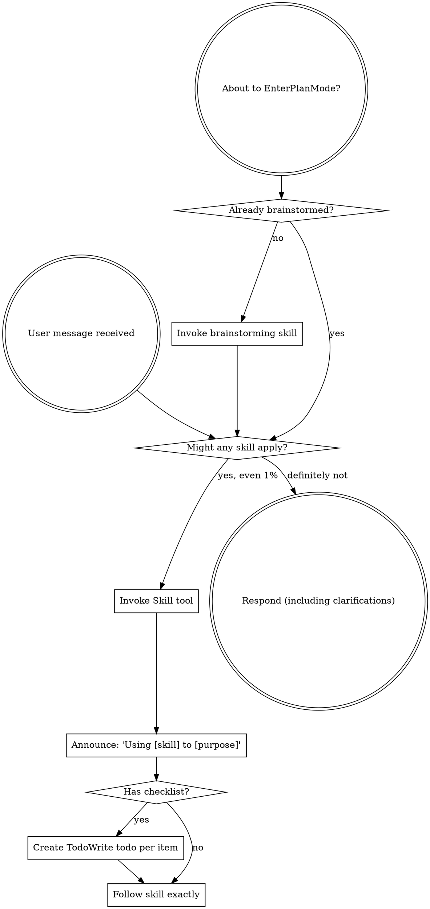

Reading prompt from stdin...
OpenAI Codex v0.121.0 (research preview)
--------
workdir: C:\Users\38909\Documents\github\aoe2
model: gpt-5.4
provider: openai
approval: never
sandbox: read-only
reasoning effort: high
reasoning summaries: none
session id: 019dc7b5-7057-7590-86c0-c8dc8782ce03
--------
user
You are a senior code reviewer running iteration **2** of a thorough, full-repository audit of an Age of Empires II browser prototype. The repository root is the current working directory.

# What to read first

- `AGENTS.md` (project rules and conventions)
- `docs/architecture/ARCHITECTURE.md` (intended boundaries)
- `docs/devlog/summary.md` (latest milestones)
- `docs/engine-feedback/current.md` (live engine asks)
- **`docs/reviews/full/2026-04-25/1/REVIEW.md` — iteration 1 synthesized findings.** Skim before reviewing so you do not re-flag already-known issues. The summary section "Iteration 1 fix status" below lists which findings were fixed, deferred, or rejected.
- High-traffic modules: `src/main.ts`, `src/app/bootstrap/**`, `src/game/simulation/createSimulationBridge.ts`, `src/game/simulation/bridge/**`, `src/game/simulation/mapGeneration/**`, `src/game/simulation/fixtures/**`, `src/phaser/scenes/**`, `src/ui/**`
- Test seams: `tests/simulation/**`, `tests/browser/**`, `tests/phaser/**`
- Sample widely; do not stop at the first file. The repo is ~47 kLOC of TypeScript across ~155 files.

# Iteration 1 fix status (do not re-flag the FIXED items as new)

**FIXED (verify the fix lands correctly; flag only if the fix has a new defect):**

- **C-1 Monk conversion flip-flop** — `bridge/monkTaskOps.ts` reset-on-different-owner now runs after the per-tick guard so the first-processed Monk wins. Commit `3f413e2`.
- **H-1 Save/load projector seed mismatch** — `createProjector` is now called with `effectiveSeed` (= `savedGame.seed` when loading). Commit `7bba71e`.
- **H-3 Garrison cross-reference integrity** — `createSimulationBridge.ts` post-load mirror check between `garrisonedByBuilding` and `garrisonedUnitToBuilding` throws on mismatch. Commit `bfce2c7`.
- **M-16 ARCHITECTURE.md `bridge/` topology** — refreshed to all 11 `bridge/` ops modules + 3 top-level siblings. Commit `6b37c62`.

**REJECTED as not-a-bug after verification:**

- **H-5 AI villager rebalance with zero villagers no-ops** — silent no-op is correct (rebalance has nothing to redistribute).

**DEFERRED to later iterations (do not re-flag as new findings — but if you find a stronger angle on any of them, note it):**

- **C-2 Save loader has no enum validation** (`createSimulationBridge.ts:1789, 1795, 1902, 1909, 1930, 1932, 1955`).
- **H-2 Save/load round-trip lacks side-map coverage** (`tests/simulation/saveLoad.test.ts`).
- **H-4 `getRenderState` per-call full scan** (`createSimulationBridge.ts:7187+`).
- **H-6 `placementMode` cleared inconsistently across player-action surfaces.**
- **H-7 HUD listeners / RAF have no symmetric cleanup.**
- **N-1 `createSimulationBridge.ts` is still ~7,360 lines.** Combat / production / gather-dropoff / sheep-ownership are the largest in-file surfaces.
- Plus M-1 through M-18 and L-1 through L-8 from iteration 1.

# What we want from iteration 2

1. **Verification pass:** Inspect the four fixes above (`monkTaskOps.ts` reset ordering, `effectiveSeed` plumbing, garrison cross-reference loop, ARCHITECTURE.md). Are they correct, complete, and side-effect-free? Flag any new defect introduced by the fix as `[V-x]`.
2. **New findings:** Anything iteration 1 missed. Particularly: places we have not yet swept hard — `mapGeneration/`, `fixtures/`, `phaser/scenes/gameScene/*`, `tests/browser/`, `scripts/`, `app/bootstrap/dev-server`. Also any cross-module integration risk.
3. **Game-design / player-experience correctness** that is not pure code health: pathing edge cases, win-condition timing, UI feedback gaps, AI loops. iteration 1 was code-leaning; iteration 2 can lean a bit more on player experience.
4. **Verified-not-bugs** section like Claude did in iteration 1 — surface tempting "bugs" you ruled out so we do not re-investigate.

# Aspects to review (matches AGENTS.md "Code review")

1. Design — scalability, generalization, debuggability, leanness. Boundary violations vs ARCHITECTURE.md.
2. Test coverage — critical paths (combat, gathering, fog, save/load, AI, occupancy, win conditions, age progression, monk + relic, trebuchet pack/unpack, sheep claims, auto-aggression).
3. Correctness — bugs, race conditions, off-by-ones, broken invariants, save/load schema drift, determinism violations.
4. Cleanliness / typing / efficiency / memory — duplicated logic, dead code, unsafe `any`, expensive per-tick scans, unbounded side maps, missing listener / RAF / timer cleanup, hidden allocations in hot loops.
5. Documentation — outdated comments, mismatches between `summary.md`, ARCHITECTURE.md, and code.

# Output format

Plain text or markdown. Do NOT propose patches and do NOT modify files.

For each finding:

- **Severity:** critical | high | medium | low | nit
- **Theme:** design | tests | correctness | cleanliness | docs
- **Where:** `path/to/file.ts:LN` (or a tight range)
- **Finding:** one to three sentences explaining the issue and the concrete risk.

End with two sections:

- **Verified-not-bugs** — items you examined and ruled out.
- **Top issues to fix first** (max 5, ordered by impact). Cite specific files and lines.

codex
Reviewing the repository as iteration 2 of the full audit. I’m starting with the required skill instructions, a quick memory pass for prior `aoe2` context, then the project docs and iteration 1 review so I can avoid re-flagging known items.
exec
"C:\\Windows\\System32\\WindowsPowerShell\\v1.0\\powershell.exe" -Command 'Get-Content AGENTS.md' in C:\Users\38909\Documents\github\aoe2
exec
"C:\\Windows\\System32\\WindowsPowerShell\\v1.0\\powershell.exe" -Command "Get-Content C:\\Users\\38909\\.codex\\plugins\\cache\\openai-curated\\superpowers\\421657af\\skills\\using-superpowers\\SKILL.md" in C:\Users\38909\Documents\github\aoe2
exec
"C:\\Windows\\System32\\WindowsPowerShell\\v1.0\\powershell.exe" -Command "Select-String -Path C:\\Users\\38909\\.codex\\memories\\MEMORY.md -Pattern 'aoe2|full audit|review|project state|planning docs'" in C:\Users\38909\Documents\github\aoe2
 succeeded in 358ms:
## Core rules

- Use test-driven development for behavior changes: write or update tests first, then make them pass. Test the contract, not the code: tests should focus exclusively on app experience and mechanisms.
- For each desired change, make the change easy, then make the easy change.
- Before implementing a change, write a plan.
- Use a subagent to implement the plan such that the tests pass. For example, if the tech stack uses node, it should make sure `npx vitest run`, `npx tsc --noEmit`, and `npx vite build` pass.
- When the change is visual:
  - Capture a before screenshot.
  - Apply the change.
  - Capture an after screenshot.
  - Generate a pixel diff and use that as verification alongside the normal test/build gates.

## Team of subagents

- For every task from the user, create a stateless, ephemeral team of subgents to work together on tasks, then turn down the agents when you are done to avoid context rot.
- **Team lead**:
  - Responsibility: Breaks the human's request into atomic tasks, selects the appropriate domain specialists, routes the tasks, and acts as the final gatekeeper before merging.
  - If tests (`npx vitest run`, `npx tsc --noEmit`, etc.) fail or review consensus is not reached after 3 iterations, the Team Lead must execute a hard abort. It will `git reset --hard` the branch, dump the error logs and the failed approach into `docs/learning/lessons.md`, and spin up a completely fresh Architect and Engineer to write a brand new plan that explicitly avoids the failed approach.
- **Architect**:
  - Responsibility: Act purely as a consultant rather than an active driver. The Lead queries the Architect to draft the initial implementation plan and verify it against ARCHITECTURE.md before dispatching work.
- **Game designer**:
  - Responsibility: Make sure the game mechanism works well and is fun. Research local and online sources to ground your opinions.
- **Software engineer**:
  - Responsibility: Handle all the code writing.
  - Reach out to the team if you have questions or need a second opinion. 
  - CRITICAL: After you are done coding, ask the code reviewer to review your code. Iterate with the code reviewer. Reviews might take a long time. Be patient.
  - After addressing review comments, ask the reviewer to verify that you have successfully done so.
  - If the Software Engineer and the Code Reviewer cannot reach consensus after 3 iterations, escalate to the Tie-Breaker agent.
  - Write down the reviewer feedback from previous round(s) under `code_review/` as temp files. The reviewer should consider this info + `docs/learning/lessons.md` + your diff. After you summarize reviewer feedback into devlog, delete the temp files.
  - Continue this iteration loop until the reviewers seem to start nit-picking instead of catching real bugs / giving substantial feedback. Do not get stuck in an infinite loop.
- **Code reviewer**: Follow the code review section for detailed rules.
- **Tie breaker**: Use the high-reasoning model. Its prompt dictates that it must definitively choose to either ACCEPT the current diff (overriding the reviewer) or REJECT it with a mandatory, prescriptive patch. The Tie-Breaker's decision is final.

## Code review

- Use all of Codex / Gemini / Claude in CLI to independently review every change on the following aspects:
  1. Design.
    - Can easily scale, generalize, debug, be understood and reasoned about, and stay lean.
  2. Test coverage.
  3. Correctness.
  4. Clean code, typing, efficiency, memory leaks.
    - No: god class, large files, duplicated logic, inconsistent implementations, violation of boundaries.
    - Prefer composition over inheritance.
    - Clean up dead code.
    - Do not change app mechanics or behavior unless explicitly asked.
  5. Documentation.
    - Dev logs should be updated and maintained.
    - References to code should be up to date.
    - No outdated comments.
    - Learnings from debugging and friction points should be documented in `docs/learning/lessons.md`. The file should be actively maintained to not become long, tedious, or outdated.
- `base_prompt` for the code review agent: "You are a senior code reviewer. Flag bugs, security issues, and performance concerns. Do NOT modify files or propose patches. Only return findings, explanations, and suggestions in plain text."
- Optionally, use the @ symbol within `base_prompt` to include directory context for the best reasoning results.
- Codex:
  - `git diff [branch] | codex exec --model gpt-5.4 -c model_reasoning_effort=xhigh -c approval_policy=never --sandbox read-only --ephemeral <base_prompt>`
- Gemini:
  - `git diff [branch] | gemini -p <base_prompt> --model gemini-3.1-pro-preview`.
- Claude:
  - `git diff [branch] | claude -p --model opus --effort xhigh --append-system-prompt <base_prompt> --allowedTools "Read,Bash(git diff *),Bash(git log *),Bash(git show *)"`
- For full-codebase reviews (no diff), drop the `git diff` pipe and let each CLI agentically explore the workspace from its CWD; keep the same model/effort flags.

## Git

- When you iterate, only run affected tests.
- In the end, after you are confident about your change, run the full suite of tests to make sure you didn't accidentally break anything.
- Create a short-lived branch for every task (e.g., `agent/fix-tick-start`). Run the test suite on the branch. Only after all tests and visual pixel-diffs pass, merge into main using a fast-forward merge, and delete the branch.
- Commit durable docs you added if you are not planning to remove them.
- Commit as soon as you have a coherent, self-contained unit of change.

## Project docs

- Read `docs/devlog/summary.md` and `docs/architecture/ARCHITECTURE.md` at session start.
- Key directories:
  - `src`: app code.
  - `docs`: architecture, devlogs, reviews.
  - `design`: app and mechanism notes.

## Architecture

- Respect the boundaries documented there. If a boundary seems wrong, flag it instead of silently violating it.
- If architecture changes, update the relevant sections in `docs/architecture/ARCHITECTURE.md`, append a row to `docs/architecture/drift-log.md`, and mention the update in the devlog.
- Do not update `docs/architecture/ARCHITECTURE.md` for non-structural fixes, refactors, UI tweaks, or test-only work.
- Never delete a Key Architectural Decision in `docs/architecture/decisions.md`; add a newer decision that supersedes it.

## Devlog

- Detailed devlogs live under `docs/devlog/detailed/` as append-only files named `YYYY-MM-DD_YYYY-MM-DD.md` (e.g. `2026-04-07_2026-04-13.md`).
- Always append new entries to the latest detailed devlog (the file with the most recent `END_DATE`). When looking something up, start from the latest file and work backwards.
- Periodically archive: when the active file grows larger than 500 lines or a significant time boundary is reached, close it (freeze its `END_DATE` in the filename) and start a new file whose `START_DATE` is the next entry's date. Check if the start and end dates of all previous devlogs are still accurate.
- After every completed task, append a detailed entry with:
  - timestamp
  - action
  - code reviewer comments, broken down by AI provider and theme as stated above
  - result
  - reasoning
  - notes
- Keep `docs/devlog/summary.md` current after updating the detailed log. Always remove outdated info. Compact when it grows larger than 50 lines.
- If a subagent handles summary work, it should extract facts only and avoid interpretation.

## Debugging

- When debugging, use `docs/debugging/template.md` to record your process. Create a new file per debugging session and use it to iterate until you solve the problem.
- If a future session makes you realize that your previous debug sessions on the same topic did not fully solve the problem, update past docs to avoid misunderstandings.
- Clean up the temporary files (such as stack dump, test results) created during debugging after you are done.

## Doc formatting

- Don't wrap lines. Only use a new line when you are starting a new paragraph.

## Game specific

- Record current `civ-engine` weaknesses and misses in `docs/engine-feedback/current.md` as you work. Historical observations belong in `docs/engine-feedback/past.md`. Before you write to the current file, use a subagent to audit if its content is still valid and up to date. If too long, stale, or the issues are already addressed, it should be adjusted.
- If a missing engine feature blocks the task, stop your work and report it to the user. But do not modify the `civ-engine` repo directly.
Cannot set property. Property setting is supported only on core types in this language mode.
At line:1 char:1
+ [Console]::OutputEncoding=[System.Text.Encoding]::UTF8;
+ ~~~~~~~~~~~~~~~~~~~~~~~~~~~~~~~~~~~~~~~~~~~~~~~~~~~~~~
    + CategoryInfo          : InvalidOperation: (:) [], RuntimeException
    + FullyQualifiedErrorId : PropertySetterNotSupportedInConstrainedLanguage
 

 succeeded in 358ms:
---
name: using-superpowers
description: Use when starting any conversation - establishes how to find and use skills, requiring Skill tool invocation before ANY response including clarifying questions
---

<SUBAGENT-STOP>
If you were dispatched as a subagent to execute a specific task, skip this skill.
</SUBAGENT-STOP>

<EXTREMELY-IMPORTANT>
If you think there is even a 1% chance a skill might apply to what you are doing, you ABSOLUTELY MUST invoke the skill.

IF A SKILL APPLIES TO YOUR TASK, YOU DO NOT HAVE A CHOICE. YOU MUST USE IT.

This is not negotiable. This is not optional. You cannot rationalize your way out of this.
</EXTREMELY-IMPORTANT>

## Instruction Priority

Superpowers skills override default system prompt behavior, but **user instructions always take precedence**:

1. **User's explicit instructions** (CLAUDE.md, GEMINI.md, AGENTS.md, direct requests) ƒ?" highest priority
2. **Superpowers skills** ƒ?" override default system behavior where they conflict
3. **Default system prompt** ƒ?" lowest priority

If CLAUDE.md, GEMINI.md, or AGENTS.md says "don't use TDD" and a skill says "always use TDD," follow the user's instructions. The user is in control.

## How to Access Skills

**In Claude Code:** Use the `Skill` tool. When you invoke a skill, its content is loaded and presented to youƒ?"follow it directly. Never use the Read tool on skill files.

**In Copilot CLI:** Use the `skill` tool. Skills are auto-discovered from installed plugins. The `skill` tool works the same as Claude Code's `Skill` tool.

**In Gemini CLI:** Skills activate via the `activate_skill` tool. Gemini loads skill metadata at session start and activates the full content on demand.

**In other environments:** Check your platform's documentation for how skills are loaded.

## Platform Adaptation

Skills use Claude Code tool names. Non-CC platforms: see `references/copilot-tools.md` (Copilot CLI), `references/codex-tools.md` (Codex) for tool equivalents. Gemini CLI users get the tool mapping loaded automatically via GEMINI.md.

# Using Skills

## The Rule

**Invoke relevant or requested skills BEFORE any response or action.** Even a 1% chance a skill might apply means that you should invoke the skill to check. If an invoked skill turns out to be wrong for the situation, you don't need to use it.



## Red Flags

These thoughts mean STOPƒ?"you're rationalizing:

| Thought | Reality |
|---------|---------|
| "This is just a simple question" | Questions are tasks. Check for skills. |
| "I need more context first" | Skill check comes BEFORE clarifying questions. |
| "Let me explore the codebase first" | Skills tell you HOW to explore. Check first. |
| "I can check git/files quickly" | Files lack conversation context. Check for skills. |
| "Let me gather information first" | Skills tell you HOW to gather information. |
| "This doesn't need a formal skill" | If a skill exists, use it. |
| "I remember this skill" | Skills evolve. Read current version. |
| "This doesn't count as a task" | Action = task. Check for skills. |
| "The skill is overkill" | Simple things become complex. Use it. |
| "I'll just do this one thing first" | Check BEFORE doing anything. |
| "This feels productive" | Undisciplined action wastes time. Skills prevent this. |
| "I know what that means" | Knowing the concept ƒ%ÿ using the skill. Invoke it. |

## Skill Priority

When multiple skills could apply, use this order:

1. **Process skills first** (brainstorming, debugging) - these determine HOW to approach the task
2. **Implementation skills second** (frontend-design, mcp-builder) - these guide execution

"Let's build X" ƒ+' brainstorming first, then implementation skills.
"Fix this bug" ƒ+' debugging first, then domain-specific skills.

## Skill Types

**Rigid** (TDD, debugging): Follow exactly. Don't adapt away discipline.

**Flexible** (patterns): Adapt principles to context.

The skill itself tells you which.

## User Instructions

Instructions say WHAT, not HOW. "Add X" or "Fix Y" doesn't mean skip workflows.
Cannot set property. Property setting is supported only on core types in this language mode.
At line:1 char:1
+ [Console]::OutputEncoding=[System.Text.Encoding]::UTF8;
+ ~~~~~~~~~~~~~~~~~~~~~~~~~~~~~~~~~~~~~~~~~~~~~~~~~~~~~~
    + CategoryInfo          : InvalidOperation: (:) [], RuntimeException
    + FullyQualifiedErrorId : PropertySetterNotSupportedInConstrainedLanguage
 

 succeeded in 443ms:

C:\Users\38909\.codex\memories\MEMORY.md:37:# Task Group: civ-engine occupancy binding + aoe2 feedback sync
C:\Users\38909\.codex\memories\MEMORY.md:38:scope: occupancy/crowding engine work, feedback closure, and 
validation/commit expectations when the task spans `civ-engine` plus external `aoe2` feedback docs
C:\Users\38909\.codex\memories\MEMORY.md:39:applies_to: cwd=C:\Users\38909\Documents\github\civ-engine and 
C:\Users\38909\Documents\github\aoe2\docs\engine-feedback; reuse_rule=reuse for 
occupancy/passability/benchmarking/feedback-sync work in these repos, but re-check paths and current docs ownership 
before applying elsewhere
C:\Users\38909\.codex\memories\MEMORY.md:45:- 
rollout_summaries/2026-04-20T21-23-41-qDdk-occupancy_binding_hardening_and_feedback_closure.md 
(cwd=C:\Users\38909\Documents\github\civ-engine, rollout_path=C:\Users\38909\.codex\sessions\2026\04\20\rollout-2026-04
-20T14-23-41-019dacc7-1427-74c1-8010-592e45136ee6.jsonl, updated_at=2026-04-21T03:53:51+00:00, 
thread_id=019dacc7-1427-74c1-8010-592e45136ee6, success; includes external aoe2 feedback-doc sync)
C:\Users\38909\.codex\memories\MEMORY.md:55:- when repo boundaries matter, the user corrected the path to 
`aoe2\docs\engine-feedback` -> verify which repo owns the doc before editing or summarizing [Task 1]
C:\Users\38909\.codex\memories\MEMORY.md:67:- `aoe2/docs/engine-feedback/current.md` should show only active asks; 
once the engine work is complete, move the closed item into `past.md` [Task 1]
C:\Users\38909\.codex\memories\MEMORY.md:75:- symptom: review automation does not complete because Gemini/Codex 
reviewer tooling is unavailable -> cause: model availability/quota issues in the local CLI -> fix: record the blocker 
explicitly and rely on direct tests/benchmarks plus targeted regression coverage instead of implying the reviews 
succeeded [Task 1]
C:\Users\38909\.codex\memories\MEMORY.md:78:scope: feature work inside the Rust/iced photo app covering RAW support, 
Detail-view rotation, thumbnail containment, staged preview-first RAW loading, and the validation/docs pattern that 
accompanies those changes
C:\Users\38909\.codex\memories\MEMORY.md:89:- raw support, rawler, DNG, CR2, NEF, ARW, src/nav.rs, src/decode.rs, 
src/edit.rs, save_edited_image, edited_save_path, thumbnail fallback, preview fallback, full_image fallback, cargo 
test, cargo clippy, cargo build
C:\Users\38909\.codex\memories\MEMORY.md:95:- 
rollout_summaries/2026-04-20T05-58-15-fhwe-photo_detail_rotation_and_raw_preview_speedup.md 
(cwd=C:\Users\38909\Documents\github\photo, rollout_path=C:\Users\38909\.codex\sessions\2026\04\19\rollout-2026-04-19T2
2-58-15-019da977-d308-7df1-9dd5-c5de5f563a5a.jsonl, updated_at=2026-04-20T23:10:46+00:00, 
thread_id=019da977-d308-7df1-9dd5-c5de5f563a5a, success)
C:\Users\38909\.codex\memories\MEMORY.md:101:## Task 3: Speed up RAW Detail loading with staged preview-first decode
C:\Users\38909\.codex\memories\MEMORY.md:105:- 
rollout_summaries/2026-04-20T05-58-15-fhwe-photo_detail_rotation_and_raw_preview_speedup.md 
(cwd=C:\Users\38909\Documents\github\photo, rollout_path=C:\Users\38909\.codex\sessions\2026\04\19\rollout-2026-04-19T2
2-58-15-019da977-d308-7df1-9dd5-c5de5f563a5a.jsonl, updated_at=2026-04-20T23:10:46+00:00, 
thread_id=019da977-d308-7df1-9dd5-c5de5f563a5a, partial because reviewer automation was blocked by external service 
capacity)
C:\Users\38909\.codex\memories\MEMORY.md:109:- RAW preview, decode_embedded_preview, DetailLoadState, request id, 
preview-first, EXIF, auto lens metadata, preview-to-full swap, zoom pan, 
docs/debugging/2026-04-20-detail-load-latency.md, cargo test, cargo clippy, cargo build --release, commit 7e6990c
C:\Users\38909\.codex\memories\MEMORY.md:111:## Task 4: Preserve thumbnail aspect ratios in square slots for library 
and drag previews
C:\Users\38909\.codex\memories\MEMORY.md:119:- iced, ContentFit::Contain, thumbnail_slot_with_renderer, 
thumbnail_slot, renderer tests, draw bounds, aspect ratio, square slots, library thumbnails, drag preview, 
src/main.rs, docs/learning/lessons.md, cargo test, cargo clippy, cargo build --release, 
decode::tests::write_decoded_cache_triggers_periodic_pruning
C:\Users\38909\.codex\memories\MEMORY.md:127:- when staging preview/full handoffs, preserve the user's current 
zoom/pan across the swap instead of causing gratuitous framing resets [Task 3]
C:\Users\38909\.codex\memories\MEMORY.md:137:- live preview rotation and saved-output rotation both depend on the same 
quarter-turn math; `src/edit.rs`, `src/viewer.rs`, and `assets/shaders/image.wgsl` must stay in sync [Task 2]
C:\Users\38909\.codex\memories\MEMORY.md:139:- the shared square-slot seam is `thumbnail_slot_with_renderer(...)` plus 
the thin production wrapper `thumbnail_slot(...)`, and both Library cards and drag previews should reuse that helper 
to keep containment behavior consistent [Task 4]
C:\Users\38909\.codex\memories\MEMORY.md:141:- `DetailLoadState` centralizes request id, loading stage, preview 
visibility, and EXIF readiness for staged RAW loads [Task 3]
C:\Users\38909\.codex\memories\MEMORY.md:142:- the staged RAW Detail path is: embedded preview first when available, 
then full decode plus EXIF only for the still-current request; stale preview/full/EXIF completions are ignored by 
request ID [Task 3]
C:\Users\38909\.codex\memories\MEMORY.md:143:- save/export must stay blocked while only a preview is visible or while 
auto lens metadata is still pending [Task 3]
C:\Users\38909\.codex\memories\MEMORY.md:148:- symptom: RAW tests claim branch coverage that the fixtures do not 
actually distinguish -> cause: thumbnail/preview/full-image/thumbnail-only cases are collapsed into too few fixtures 
-> fix: use distinct fixtures for each fallback branch and only claim the branches the fixtures prove [Task 1]
C:\Users\38909\.codex\memories\MEMORY.md:151:- symptom: rotation behavior can drift across preview and save paths -> 
cause: quarter-turn semantics are split across save logic, viewer geometry, and shader UV handling -> fix: centralize 
the transform rules if this area expands [Task 2]
C:\Users\38909\.codex\memories\MEMORY.md:152:- symptom: preview-to-full swap causes a large zoom jump -> cause: a 
resolution-based zoom rewrite tried to recompute framing from source dimensions -> fix: preserve the current zoom/pan 
and let viewer fit math handle size differences [Task 3]
C:\Users\38909\.codex\memories\MEMORY.md:153:- symptom: automated reviews do not finish because `codex exec review 
uncommitted` reconnects fail or Gemini returns repeated `429` capacity exhaustion -> cause: external service/tooling 
instability -> fix: record review coverage as partial instead of completed and rely on direct validation plus targeted 
regressions [Task 3]
C:\Users\38909\.codex\memories\MEMORY.md:159:scope: canonical docs layout, compatibility shims, review/validation 
pattern, and staging discipline for docs-only work in the photo repo
C:\Users\38909\.codex\memories\MEMORY.md:170:- AGENTS.md, docs/README.md, docs/architecture, docs/devlog, 
docs/learning, docs/debugging, docs/reviews, compatibility shim, cargo test, cargo clippy, cargo build --release, 
docs-restructure.diff
C:\Users\38909\.codex\memories\MEMORY.md:180:- Commit relevant changes, docs-only commit, docs/README.md, 
docs/architecture/ARCHITECTURE.md, docs/devlog/summary.md, docs/reviews/README.md, git status, git diff --cached 
--stat, f982c4e
C:\Users\38909\.codex\memories\MEMORY.md:189:- the canonical docs layout expected by this repo is 
`docs/architecture/`, `docs/devlog/`, `docs/learning/`, `docs/debugging/`, `docs/reviews/`, plus `docs/README.md` as 
the entry point [Task 1]
C:\Users\38909\.codex\memories\MEMORY.md:197:- symptom: review tooling cannot inspect the diff directly from plan mode 
-> cause: Gemini plan mode limitation -> fix: write a diff file such as 
`docs/reviews/2026-04-19-docs-restructure.diff` and feed that to the reviewer instead [Task 1]
C:\Users\38909\.codex\memories\MEMORY.md:261:scope: top-HUD vs bottom-status-bar behavior, overlay wiring, 
accessibility/doc review hardening, commit hygiene, and detailed devlog filename accuracy in `civ-sim-web`
C:\Users\38909\.codex\memories\MEMORY.md:268:- 
rollout_summaries/2026-04-19T06-29-51-MDUa-hud_split_devlog_review_filename_audit.md 
(cwd=C:\Users\38909\Documents\github\civ-sim-web, rollout_path=C:\Users\38909\.codex\sessions\2026\04\18\rollout-2026-0
4-18T23-29-51-019da46e-6514-7c31-9544-db33795a2646.jsonl, updated_at=2026-04-19T15:43:42+00:00, 
thread_id=019da46e-6514-7c31-9544-db33795a2646, success)
C:\Users\38909\.codex\memories\MEMORY.md:274:## Task 2: Review-hardening, docs updates, and commit hygiene around the 
HUD split
C:\Users\38909\.codex\memories\MEMORY.md:278:- 
rollout_summaries/2026-04-19T06-29-51-MDUa-hud_split_devlog_review_filename_audit.md 
(cwd=C:\Users\38909\Documents\github\civ-sim-web, rollout_path=C:\Users\38909\.codex\sessions\2026\04\18\rollout-2026-0
4-18T23-29-51-019da46e-6514-7c31-9544-db33795a2646.jsonl, updated_at=2026-04-19T15:43:42+00:00, 
thread_id=019da46e-6514-7c31-9544-db33795a2646, success; commit `9cdd76e`)
C:\Users\38909\.codex\memories\MEMORY.md:288:- 
rollout_summaries/2026-04-19T06-29-51-MDUa-hud_split_devlog_review_filename_audit.md 
(cwd=C:\Users\38909\Documents\github\civ-sim-web, rollout_path=C:\Users\38909\.codex\sessions\2026\04\18\rollout-2026-0
4-18T23-29-51-019da46e-6514-7c31-9544-db33795a2646.jsonl, updated_at=2026-04-19T15:43:42+00:00, 
thread_id=019da46e-6514-7c31-9544-db33795a2646, success)
C:\Users\38909\.codex\memories\MEMORY.md:318:# Task Group: aoe2 project-state checks and planning-doc routing
C:\Users\38909\.codex\memories\MEMORY.md:319:scope: repo-backed status summaries, validation reality, and which 
planning docs to search first in the `aoe2` checkout
C:\Users\38909\.codex\memories\MEMORY.md:320:applies_to: cwd=C:\Users\38909\Documents\github\aoe2; reuse_rule=reuse 
for status checks and backlog routing in this checkout, but rerun validations because repo health can change quickly
C:\Users\38909\.codex\memories\MEMORY.md:322:## Task 1: Summarize the current project state from repo evidence
C:\Users\38909\.codex\memories\MEMORY.md:326:- 
rollout_summaries/2026-04-19T06-27-22-hBBf-project_state_and_planning_docs.md 
(cwd=C:\Users\38909\Documents\github\aoe2, rollout_path=C:\Users\38909\.codex\sessions\2026\04\18\rollout-2026-04-18T23
-27-22-019da46c-1e54-7ab0-974a-2bcd066a4f81.jsonl, updated_at=2026-04-19T06:48:27+00:00, 
thread_id=019da46c-1e54-7ab0-974a-2bcd066a4f81, success)
C:\Users\38909\.codex\memories\MEMORY.md:332:## Task 2: Find the planning docs that lay out valid todo items
C:\Users\38909\.codex\memories\MEMORY.md:336:- 
rollout_summaries/2026-04-19T06-27-22-hBBf-project_state_and_planning_docs.md 
(cwd=C:\Users\38909\Documents\github\aoe2, rollout_path=C:\Users\38909\.codex\sessions\2026\04\18\rollout-2026-04-18T23
-27-22-019da46c-1e54-7ab0-974a-2bcd066a4f81.jsonl, updated_at=2026-04-19T06:48:27+00:00, 
thread_id=019da46c-1e54-7ab0-974a-2bcd066a4f81, success)
C:\Users\38909\.codex\memories\MEMORY.md:362:# Task Group: civ-sim-web ECS review hardening and stale TODO closure
C:\Users\38909\.codex\memories\MEMORY.md:364:applies_to: cwd=C:\Users\38909\Documents\github\civ-sim-web; 
reuse_rule=reuse for simulation-hardening and backlog-audit work in this checkout, but re-verify any TODO or review 
doc against current source before acting on it
C:\Users\38909\.codex\memories\MEMORY.md:370:- 
rollout_summaries/2026-04-17T19-50-28-8Xgm-civ_sim_web_review_hardening_ecs_edge_cases.md 
(cwd=C:\Users\38909\Documents\github\civ-sim-web, rollout_path=C:\Users\38909\.codex\sessions\2026\04\17\rollout-2026-0
4-17T12-50-28-019d9cfe-a976-74a1-acb1-7825567087c2.jsonl, updated_at=2026-04-17T23:03:31+00:00, 
thread_id=019d9cfe-a976-74a1-acb1-7825567087c2, success)
C:\Users\38909\.codex\memories\MEMORY.md:374:- remaining todo items, Are they valid, 
docs/reviews/todo/game-engine-usage.md, simulation-stability.test.ts, TechnologyTree, KnowledgeResident, 
EntityRegistry, stale backlog
C:\Users\38909\.codex\memories\MEMORY.md:380:- 
rollout_summaries/2026-04-17T19-50-28-8Xgm-civ_sim_web_review_hardening_ecs_edge_cases.md 
(cwd=C:\Users\38909\Documents\github\civ-sim-web, rollout_path=C:\Users\38909\.codex\sessions\2026\04\17\rollout-2026-0
4-17T12-50-28-019d9cfe-a976-74a1-acb1-7825567087c2.jsonl, updated_at=2026-04-17T23:03:31+00:00, 
thread_id=019d9cfe-a976-74a1-acb1-7825567087c2, success)
C:\Users\38909\.codex\memories\MEMORY.md:390:- 
rollout_summaries/2026-04-17T19-50-28-8Xgm-civ_sim_web_review_hardening_ecs_edge_cases.md 
(cwd=C:\Users\38909\Documents\github\civ-sim-web, rollout_path=C:\Users\38909\.codex\sessions\2026\04\17\rollout-2026-0
4-17T12-50-28-019d9cfe-a976-74a1-acb1-7825567087c2.jsonl, updated_at=2026-04-17T23:03:31+00:00, 
thread_id=019d9cfe-a976-74a1-acb1-7825567087c2, success)
C:\Users\38909\.codex\memories\MEMORY.md:396:## Task 4: Resolve actionable review findings and close the loop with a 
commit
C:\Users\38909\.codex\memories\MEMORY.md:400:- 
rollout_summaries/2026-04-17T19-50-28-8Xgm-civ_sim_web_review_hardening_ecs_edge_cases.md 
(cwd=C:\Users\38909\Documents\github\civ-sim-web, rollout_path=C:\Users\38909\.codex\sessions\2026\04\17\rollout-2026-0
4-17T12-50-28-019d9cfe-a976-74a1-acb1-7825567087c2.jsonl, updated_at=2026-04-17T23:03:31+00:00, 
thread_id=019d9cfe-a976-74a1-acb1-7825567087c2, success; commit `fe84a64`)
C:\Users\38909\.codex\memories\MEMORY.md:404:- proceed with your best judgement, reviewer findings, fe84a64, 
pixi-vendor chunk-size warning, git diff --check, empty path crash, multi-agent review
C:\Users\38909\.codex\memories\MEMORY.md:428:- symptom: reviewer agents time out or return low-signal feedback -> 
cause: tooling latency/noise -> fix: act on the concrete findings already returned and verify the repo directly 
instead of waiting indefinitely [Task 4]


Cannot set property. Property setting is supported only on core types in this language mode.
At line:1 char:1
+ [Console]::OutputEncoding=[System.Text.Encoding]::UTF8;
+ ~~~~~~~~~~~~~~~~~~~~~~~~~~~~~~~~~~~~~~~~~~~~~~~~~~~~~~
    + CategoryInfo          : InvalidOperation: (:) [], RuntimeException
    + FullyQualifiedErrorId : PropertySetterNotSupportedInConstrainedLanguage
 

codex
Using `programming-best-practices` for the repository audit workflow. Next I’m reading the architecture, devlog, live engine feedback, and the iteration 1 review before sampling the code paths the user called out.
exec
"C:\\Windows\\System32\\WindowsPowerShell\\v1.0\\powershell.exe" -Command "Get-Content C:\\Users\\38909\\.codex\\skills\\programming-best-practices\\SKILL.md" in C:\Users\38909\Documents\github\aoe2
 succeeded in 290ms:
---
name: programming-best-practices
description: General coding workflow and engineering guardrails for planning, implementing, debugging, refactoring, reviewing, and validating code changes. Use when Codex is asked to write, edit, review, or test code in any repository, especially when correctness, maintainability, small diffs, and safe verification matter.
---

# Programming Best Practices

## Operate

- Read the relevant code path before editing.
- Trace data flow end to end before deciding on a fix.
- Prefer the smallest change that solves the actual problem.
- Match the existing architecture and conventions unless they are the source of the defect.
- Preserve backward compatibility unless the task explicitly requires a breaking change.

## Change Safely

- Do not overwrite unrelated user changes.
- Treat the worktree as potentially dirty and isolate your diff.
- Make state transitions explicit, especially around async flows and persistence.
- If concurrent results can race, decide which result wins and enforce it in code.
- Handle empty states, errors, cleanup, and cancellation paths deliberately.
- Avoid speculative abstractions until duplication or complexity actually justifies them.

## Validate

- Add or update targeted tests when behavior changes or a bug is fixed.
- Run the smallest meaningful verification first, then widen coverage if needed.
- Verify user-visible behavior, not only internal implementation details.
- If validation cannot run, state exactly what was blocked and what remains unverified.

## Review

- Prioritize bugs, regressions, broken assumptions, and missing tests.
- Present findings before summaries.
- Order findings by severity and include concrete file references.

## Communicate

- State assumptions when they affect implementation choices.
- Call out tradeoffs plainly.
- Explain non-obvious changes at a high level.
- Close with outcome, verification, and remaining risk.
Cannot set property. Property setting is supported only on core types in this language mode.
At line:1 char:1
+ [Console]::OutputEncoding=[System.Text.Encoding]::UTF8;
+ ~~~~~~~~~~~~~~~~~~~~~~~~~~~~~~~~~~~~~~~~~~~~~~~~~~~~~~
    + CategoryInfo          : InvalidOperation: (:) [], RuntimeException
    + FullyQualifiedErrorId : PropertySetterNotSupportedInConstrainedLanguage
 

Full-repository audit with required verification of iteration-1 fixes and a broad sweep of less-reviewed surfaces.
  → Read project guidance and iteration-1 review, then inspect the four claimed fixes for correctness and side effects
  • Sweep high-risk modules and the less-reviewed directories for new correctness, design, test, and docs issues
  • Cross-check suspicious areas against tests and documentation, then draft prioritized findings plus verified-not-bugs
exec
"C:\\Windows\\System32\\WindowsPowerShell\\v1.0\\powershell.exe" -Command "Get-Content docs\\architecture\\ARCHITECTURE.md" in C:\Users\38909\Documents\github\aoe2
exec
"C:\\Windows\\System32\\WindowsPowerShell\\v1.0\\powershell.exe" -Command "Get-Content docs\\devlog\\summary.md" in C:\Users\38909\Documents\github\aoe2
exec
"C:\\Windows\\System32\\WindowsPowerShell\\v1.0\\powershell.exe" -Command "Get-Content docs\\engine-feedback\\current.md" in C:\Users\38909\Documents\github\aoe2
exec
"C:\\Windows\\System32\\WindowsPowerShell\\v1.0\\powershell.exe" -Command "Get-Content docs\\reviews\\full\\2026-04-25\\1\\REVIEW.md" in C:\Users\38909\Documents\github\aoe2
 succeeded in 303ms:
# Architecture

This document describes the structural boundaries of the project. Update it only for
structural changes (new modules, shifted boundaries, new build or data pipelines). Do
not update it for UI tweaks, bug fixes, refactors, or test-only work. When it does
change, also append a row to `drift-log.md` and mention the update in the devlog.

## Repository layout

- `src/` ƒ?" game code (TypeScript)
  - `app/bootstrap/` ƒ?" app startup, dev HTTP API used by browser tests
  - `game/` ƒ?" gameplay rules, scenarios, content
    - `content/` ƒ?" shared content tables (e.g., building footprints)
    - `simulation/` ƒ?" simulation bridge, scenario setup, command handlers.
      Top-level siblings of `createSimulationBridge.ts` include
      `worldOccupancy.ts` (the `OccupancyBinding` adapter that keeps the
      authoritative blocker/crowding contract), `selectionActivity.ts`
      (structured activity payload for the HUD selection panel), and
      `renderStore.ts` (the per-tick render-message store the projector
      writes into).
      - `bridge/` ƒ?" helper modules factored out of `createSimulationBridge.ts`
        to keep the entry file from drifting back into god-class shape.
        Each module either exports plain helpers or a dep-bag factory whose
        side-map ownership still lives in `createWorld` so save/load and
        destroy-entity hooks share the same references:
        - `pureHelpers.ts` ƒ?" pure helpers (clamp, grid/coordinate
          transforms, economy/resource helpers, footprint and projection
          comparators) plus the shared `GameEvents` / `GameCommands` /
          `GameComponents` / `GameWorld` type aliases and the
          `UNIT_SUBGRID_*` / `UNIT_CELL_SLOT_OFFSETS` / `MARKET_BASE_RATE`
          constants.
        - `visibility.ts` ƒ?" `createProjector` (RenderAdapter projection),
          `syncVisibilitySources`, and the sheep claim / ownership helpers
          plus `SHEEP_VISION_RADIUS` / `MAX_HERDABLE_CLAIM_RADIUS`.
        - `trebuchetState.ts` ƒ?" `createTrebuchetStateOps` factory wrapping
          the Trebuchet pack/unpack transition over `trebuchetPackStates`.
        - `fogMemoryOps.ts` ƒ?" `createFogMemoryOps` factory bundling
          `getOrCreateMemoryMap`, `getFogMemoryEntities`,
          `getHumanFogMemorySize`.
        - `monkTaskOps.ts` ƒ?" `createMonkTaskOps` factory for the Monk
          heal / convert / pickup / deposit lifecycle, including AI-side
          task assignment and human-side context-click routing.
        - `technologyOps.ts` ƒ?" technology / upgrade application (research
          completion, per-unit / per-building stat propagation, civ
          unique-tech handling).
        - `matchEndOps.ts` ƒ?" match-end / score / win-condition resolution
          (conquest, Wonder, relic timers, score tally).
        - `aiDecisionOps.ts` ƒ?" Slice-10 AI decision helpers (villager
          retargeting, attack-group forming, plan transitions).
        - `placementOps.ts` ƒ?" placement preview + building placement
          confirmation (footprint validation, occupancy reservation).
        - `saveGameOps.ts` ƒ?" `createSaveGameOps` factory: serializes the
          world snapshot, visibility, match state, and every side map into
          a `SaveBlob`.
        - `targetFindingOps.ts` ƒ?" target-priority tables and helpers for
          finding visible enemies, nearest drop-offs, and nearest wildlife.
        `createSimulationBridge.ts` imports from `bridge/` rather than
        re-declaring any of this.
      - `mapGeneration/` ƒ?" deterministic procedural map generators and the
        spawn-list helper that enforces one-resource-per-cell. Hosts the
        default + Black Forest + Arena generators plus the shared terrain
        helpers (`paintDisc`, `createBaseTerrain`, etc.) and the starting
        offset tables (`STARTING_SHEEP`, `FOREST_PATCHES`, ƒ?İ).
      - `fixtures/` ƒ?" per-category modules that export every vitest-driven
        fixture factory (conquest, economy basics, age progression, combat
        matchups, siege, monastery, castle defense, AI, wonder/relic,
        selection, sheep, scenario validation). The `fixtures/index.ts`
        barrel is the single place the `prototypeScenario.ts` dispatcher
        imports from.
  - `phaser/` ƒ?" Phaser-specific scenes and render projection. Hosts
    `scenes/GameScene.ts` (scene class wiring lifecycle, input, and
    projection-driven render orchestration) plus a `scenes/gameScene/`
    subdirectory for the dep-bag renderer factories factored out of the
    scene file: `debugOverlay.ts` (world-space debug-mode overlays),
    `worldLayers.ts` (health-bar + fog-of-war paints), `selectionLayers.ts`
    (selection ring + placement preview + marquee paints), and
    `cameraController.ts` (per-frame update, middle-drag pan, edge-pan,
    zoom/scroll clamp, HUD-facing camera queries).
  - `ui/` ƒ?" DOM HUD controller
- `tests/` ƒ?" Vitest unit/integration tests and Playwright browser tests
- `scripts/` ƒ?" content and build scripts
- `design/` ƒ?" game design spec, stat CSVs, implementation plan
- `generated/` ƒ?" build-time content output (`generated/content/content.json`)
- `docs/` ƒ?" architecture, devlog, engine feedback, learning, debugging

## Runtime layers

The runtime is layered and the boundaries are intentional.

```
DOM HUD  ƒ"?ƒ"?ƒ"?ƒ"?ƒ"?ƒ-§ Phaser scene (render + input) ƒ"?ƒ"?ƒ"?ƒ"?ƒ"?ƒ-§ Simulation bridge ƒ"?ƒ"?ƒ"?ƒ"?ƒ"?ƒ-§ civ-engine World
                                                       ƒ",
                                                       ƒ""ƒ"?ƒ"? content tables (design/stats ƒ+' generated/content.json)
```

- `civ-engine` owns authoritative simulation state and deterministic ticking. All
  gameplay rules, combat, economy, progression, and AI policy live behind this
  boundary through ECS systems, queries, and commands.
- The simulation bridge (`src/game/simulation/`) owns repo-specific systems and
  scenario setup. It runs on top of `civ-engine` primitives and exposes a stable
  surface to the Phaser scene and HUD.
- Phaser is view and input only. It consumes render frames projected through
  `civ-engine`'s `RenderAdapter` and issues commands back into the simulation. No
  gameplay state lives in Phaser scenes.
- The DOM HUD is a pure consumer of render frames and selection state. It emits
  commands through the same seam as right-click orders from the scene.
- Content flows one-way: design CSVs under `design/stats/*.csv` are normalized at
  build time into `generated/content/content.json`, which the simulation loads.
  The generated file is not committed.

## Determinism contract

- Seeds are reproducible from `?seed=<name>` URL parameters for fixtures.
- Commands and fixed-step ticks are the only sources of state change.
- Render interpolation is a display concern; it does not feed back into simulation
  state. Click hit-testing prefers the displayed entity so the player's perceived
  target matches the authoritative target.

## Test boundaries

- Vitest (`npx vitest run`) covers simulation, content normalization, and scenario
  behavior. These tests drive simulation directly; they do not start Phaser.
- Playwright (`npm run test:browser`) drives the built preview app and asserts
  render-state and command flow end-to-end. Fixture seeds keep runs deterministic.
- `npx tsc --noEmit` and `npx vite build` gate type and build health.

## Where new work belongs

- A new gameplay rule, unit behavior, or AI change ƒ+' simulation bridge or
  `civ-engine` (flag an engine gap in `docs/engine-feedback/current.md` if the
  engine lacks the primitive).
- A new render treatment or input control ƒ+' Phaser scene with a render-state seam
  so browser tests can assert on the rendered output.
- A new HUD element ƒ+' `src/ui/` consuming render frames and selection state.
- New content ƒ+' `design/stats/*.csv` plus any normalizer work in `scripts/`.
Cannot set property. Property setting is supported only on core types in this language mode.
At line:1 char:1
+ [Console]::OutputEncoding=[System.Text.Encoding]::UTF8;
+ ~~~~~~~~~~~~~~~~~~~~~~~~~~~~~~~~~~~~~~~~~~~~~~~~~~~~~~
    + CategoryInfo          : InvalidOperation: (:) [], RuntimeException
    + FullyQualifiedErrorId : PropertySetterNotSupportedInConstrainedLanguage
 

 succeeded in 318ms:
## 2026-04-25
- **`civ-engine` 0.5.3 migration ƒ?" in-place renderable mutations need explicit refresh:** `civ-engine` rolled forward today through three breaking-change waves (0.4.0 ƒ+' 0.5.0 ƒ+' 0.5.3); `node_modules/civ-engine` reports 0.5.3. Audited the aoe2 surface against `../civ-engine/docs/changelog.md`. Two sites had been silently relying on the now-removed auto-detection of in-place component mutations: `createSimulationBridge.ts:5239-5243` (construction-complete `renderable.visualVariant = 'complete'`, fixed earlier today as `d0af9cb` before realizing the engine bump was the root cause) and `bridge/technologyOps.ts:upgradeOwnedUnits` (tech-upgrade mutates `unit.unitType` + `renderable.tint`/`size` + `visionSource.radius` in place ƒ?" fixed in `87d4d9f`). All other 0.4.0 / 0.5.0 / 0.5.1 / 0.5.2 / 0.5.3 breaking changes either don't apply (aoe2 doesn't call `getDiff`, `getEvents`, `setMeta`, `world.emit`, or import `GameLoop`) or already match the new contract (positions go through `setPosition`, save schema is repo-side and independent of engine snapshot v5). Defensive gap noted: `world.step()` doesn't handle the new fail-fast `WorldTickFailureError`; tests don't trigger this path, deferred. Engine is still healthy ƒ?" no new engine asks. New regression test "reflects the upgraded unit type in render state" in `tests/simulation/castleUpgrades.test.ts` would have caught the upgrade bug; existing 14 cases all asserted on `getEconomyState()` and missed the projector-side regression. Final gate: `npx tsc --noEmit` clean, `npm run lint` clean, `npx vitest run` **47/47 files, 393 passed + 1 skipped, 0 failed**.
- **Full multi-AI review iteration 1 + batch-1 fixes:** ran the `/full-review` slash command for the first time on this repo ƒ?" Codex (`gpt-5.4` @ `model_reasoning_effort=high`) + Gemini (`gemini-2.5-pro`) + Claude (`opus` @ `--effort high`) each reviewed the full ~47-kLOC TypeScript tree independently; raw outputs in `docs/reviews/full/2026-04-25/1/raw/{codex,gemini,claude}.md`; synthesized 281-line report at `docs/reviews/full/2026-04-25/1/REVIEW.md`. All three reviewers independently agreed on `createSimulationBridge.ts` god-class persistence (still 7,333 lines after Phase 1ƒ?"3 extractions) and save/load hydration fragility as the two top structural risks; Claude was the only reviewer to find the Monk conversion flip-flop bug, Codex was the only one to catch the projector seed mismatch on load. Then addressed four findings as separate commits on `agent/review-findings-2026-04-25-batch1`: `3f413e2` **[C-1] Monk conversion flip-flop** (`bridge/monkTaskOps.ts:348-376` reset was running before the per-tick guard, so two enemy Monks targeting the same unit in one tick wiped each other's progress to zero ƒ?" fix moves the per-tick guard above the reset so the first-processed Monk wins the increment), `7bba71e` **[H-1] Save-load projector seed** (one-line fix passing `effectiveSeed` to `createProjector` so a loaded match's projector matches the world seed), `bfce2c7` **[H-3] Garrison side-map cross-reference invariant** (post-load mirror check between `garrisonedByBuilding` and `garrisonedUnitToBuilding`, throws on mismatch), and `6b37c62` **[M-16] ARCHITECTURE.md `bridge/` topology refresh** (catches the doc up to all 11 ops modules + 3 top-level siblings; drift-log row added). Verified H-5 ("AI villager rebalance with zero villagers no-ops") as a non-bug ƒ?" silent no-op is correct since rebalance has nothing to redistribute. Larger items (C-2 full enum validation, H-2 wider save/load round-trip coverage, H-4 `getRenderState` memoization, N-1 further bridge extraction) deferred to separate sprints. Plus one out-of-scope fix `d0af9cb`: pre-existing `darkAge` render-state test was already failing on `main` (construction-complete mutates `renderable` in place, RenderAdapter doesn't see in-place mutations ƒ?" added the missing `markOutOfBandRenderChange()` call). Validation: `npx tsc --noEmit` clean, `npm run lint` clean, `npx vite build` clean, `npx vitest run` 47/47 files, 392/392 passed + 1 skipped (full-suite gate green for the first time after fixing the latent darkAge regression). AGENTS.md "Code review" CLI flags refreshed to current working flag landscape; `reference_review_clis.md` user-memory file updated.
- **AGENTS.md Gemini-CLI note corrected:** the "Code review" Gemini line previously claimed `gemini-3.1-pro-preview` 404s on this account. Empirical probe (gemini-cli 0.39.1) shows bare 3.x IDs (`gemini-3-pro`, `gemini-3.1-pro`, `gemini-3-flash`) 404 ƒ?" no GA endpoint ƒ?" but the `-preview` suffixed variants (`gemini-3-pro-preview`, `gemini-3.1-pro-preview`, `gemini-3-flash-preview`) all work; the prior 2026-04-23 devlog had separately observed `gemini-3.1-pro-preview` `RESOURCE_EXHAUSTED`/`QUOTA_EXHAUSTED` (quota, not 404). Updated note to (a) bump CLI version 0.39.0 ƒ+' 0.39.1, (b) explain the `-preview` requirement and list working IDs, (c) note the quota fallback to `gemini-2.5-pro`. Default-model command unchanged. Doc-only; no tests run.

## 2026-04-24
- **Auto-aggression ƒ?" idle military pursues, idle villagers defend (canonical AoE2):** added the `prototypeAutoAggression` simulation system in `src/game/simulation/createSimulationBridge.ts`. Each tick it scans every owned, non-garrisoned, non-monk, non-busy unit and issues an attack-command against the highest-priority enemy in personal LOS via two new helpers `findPreferredEnemyUnitInRadius` / `findPreferredEnemyBuildingInRadius` in `bridge/targetFindingOps.ts` (queryInRadius + existing `targetPriority` tables). Military units use their live `visionSource.radius` (so tech upgrades + fixture vision overrides flow through unchanged); villagers are radius 1 (Defensive Stance: melee-adjacent only) and short-circuit when their `GathererComponent` is busy so explicit gather orders are never silently dropped. Phase ordering is `prototypeAi` ƒ+' `prototypeAutoAggression` ƒ+' `prototypePlayerCommands` so AI/player commands set first take precedence. New `disableAi: boolean` on `PlayerStartSpec` skips both the planner and AA for fixture-passive enemies (the AA gate reads `aiStates.has(owner)`, which the seeding site at `start.disableAi` already drives). 7 new fixtures in `fixtures/combatMatchups/autoAggression.ts` plus `auto-aggro-monk-skip-fixture` + `auto-aggro-villager-gathering-fixture`; 10 new tests in `tests/simulation/autoAggression.test.ts` lock the contract: pursue-in-vision, ignore-out-of-vision, archer-pursuit-then-fire, player-move-overrides, villager-adjacent-defense, villager-no-pursuit, villager-gather-honored, monk-skip, sequential-targets-after-kill, save/load mid-engagement. Two regressions caught and fixed inline: the `moving-enemy-attack-fixture` got `disableAi: true` so its wandering enemy scout stays on its path until the player issues a command; the AA radius read was switched to the unit's live `visionSource.radius` so the Mangonel/Onager min-range fixtures (whose enemy spearmen are spawned with `vision: radius 1`) keep their passive-enemy intent. One round of code-review iteration via the in-environment `superpowers:code-reviewer` subagent (gather-honor + monk-skip test + `disableAi` cross-ref). Validation: `npx vitest run` **45/45 files, 385 passed + 1 skipped** on the post-implementation run; `npm run test:browser` **81/82 passed** (1 flaky pre-existing wolf-aggro test passed in isolation; wolves are resources, not units ƒ?" AA never targets them); `npx tsc --noEmit`, `npx vite build`, `npm run lint` clean. Spec at `docs/superpowers/specs/2026-04-24-aggressive-military-design.md`.
- **Sheep show up in the selection panel icon grid for multi-selections:** the panel's `renderSelectionIcons` only iterated `economyState.units` when classifying selected ids, so owned sheep ƒ?" which live in `economyState.resources` ƒ?" silently fell out of the grid. Four sheep selected ƒ+' empty icon grid; mixed villager + sheep ƒ+' only the villager chip. Fix: added `id: number` to the `EconomyState.resources` entry, threaded it through `getEconomyState` + the `isEconomyResourceEntry` type guard, and rewrote `renderSelectionIcons` (`src/ui/hud/selectionPanel.ts`) to also build a `sheepById` map and emit chips via the entity-helpers (`formatEntityIcon` / `formatEntityIconAccent` / `formatEntityName` already supported sheep). Single non-unit selections keep using the existing `data-selection-entity-icon` big-chip path so the browser-test contract for single-sheep / single-building stays intact. Exposed `selectUnitsInBox` on `__AOE2_TEST__` so capture scripts can drive mixed selections without panning the viewport. Regression coverage: `tests/simulation/selectionPanelIcons.test.ts` (4 cases ƒ?" 4-sheep, mixed, single-sheep, 3-villager). Visual proof: `docs/devlog/artifacts/2026-04-24-sheep-selection-{before,after,diff}.png` (35.81% pixel change; panel grew from 301 px to 312 px when the `SH A-3` chip was added next to the `V` chip). Validation: `npx tsc --noEmit` clean, `npx vitest run` **44/44 files, 377 passed + 1 skipped**, `npm run test:browser` **82/82 pass**, `npx vite build` clean.
- **Default-map narrow-path fix (villagers no longer walled in):** the procedural resource-cluster placer in `applyStandardPlayerOpeningProcedural` could walk a cluster all the way around a ring and meet an adjacent cluster's arc, sealing the starting villagers into a pocket. On seed `aoe2-prototype` the berry arc `(5,7)ƒ+'(9,5)` met the sheep cluster at `(5,8)(5,9)(6,10)` and the water/forest strip to the west, so `findGridPath` returned null for any west-target move and the command was silently cleared. Fix: `cellBlockedByScenarioEntity` now reserves four guaranteed-clear cardinal exit corridors ƒ?" a 2-row horizontal corridor at `y = TC.y` and `y = TC.y + 1` (spanning `|x ƒ^' (TC.x + 1)| ƒ% 13`) and a 2-column vertical corridor at `x = TC.x + 1` and `x = TC.x + 2` (spanning `|y ƒ^' (TC.y + 1)| ƒ% 13`). The extent (13 cells) reaches past the outermost forest ring (12), so no ring walker can close a continuous arc around the base. Regression coverage: `tests/simulation/defaultMapNarrowPath.test.ts` (4 cases asserting each starting villager reaches each cardinal near-base target ƒ?" before the fix, west+north timed out stuck; after, all pass in 1.3 s) and `tests/simulation/narrowCorridorMovement.test.ts` (4 hand-crafted tree-corridor cases locking the "friendlies do not block A*" contract). New fixture `narrow-corridor-fixture` in `fixtures/economyBasics.ts`. Debug session at `docs/debugging/2026-04-24-narrow-corridor-pathfinding.md`. Validation: `npx tsc --noEmit` clean, `npx vitest run` **43/43 files, 373 passed + 1 skipped** (the 6 pre-existing Windows `onTaskUpdate` worker warnings remain), `npx vite build` clean. No architecture change; no engine ask (`civ-engine` pathfinding + `OccupancyBinding` both behaved as documented ƒ?" the bug was repo-side map-gen only).

## 2026-04-23
- **Final 800+-line file splits (move-only):** six files above 800 lines all trimmed below 550 lines via barrel re-exports. `fixtures/castleDefense.ts` (**984**) ƒ+' `castleDefense/{fletching,fu3Walls,fu3Archers,towerAndCastle}.ts` (**188 / 234 / 373 / 273** lines) behind a **31**-line barrel. `fixtures/combatMatchups.ts` (**962**) ƒ+' `combatMatchups/{infantryAndCavalry,rangedSkirmish,generalCombat}.ts` (**505 / 125 / 348** lines) behind a **28**-line barrel. `fixtures/monastery.ts` (**858**) ƒ+' `monastery/{heal,convert,relic}.ts` (**219 / 336 / 319** lines) behind a **25**-line barrel. `fixtures/ageProgression/imperial.ts` (**817**) ƒ+' `imperial/{ageUp,upgrades,castle}.ts` (**131 / 504 / 198** lines) behind a **23**-line barrel. `tests/browser/game-progression-and-production.spec.ts` (**847**, 21 tests) ƒ+' four themed specs (`game-progression-{ageup,upgrades,production}.spec.ts` ƒ?" **93 / 138 / 322** lines with 3 / 3 / 8 tests ƒ?" plus trimmed remainder **303** lines / 7 tests = 21). `tests/browser/helpers/gameTestHelpers.ts` (**820**) ƒ+' `gameTestHelpers/{types,snapshot,camera,command,selection,hud,placement}.ts` (**55 / 25 / 172 / 68 / 190 / 275 / 54** lines) behind a **71**-line barrel re-exporting all 45 previous names. All move-only; barrel files preserve every public export so zero downstream import changes. Validation per commit: `npx.cmd tsc --noEmit`, `npm.cmd run lint`, `npx.cmd vite build` clean; targeted vitest runs green (castle/monastery/imperial/combat subsets all pass). Final `npm.cmd run test:browser` **82/82** pass across all split specs. Architecture: new sub-directories logged in `docs/architecture/drift-log.md`.
- **Trim the last three >1,000-line files via mechanical splits:** `fixtures/ageProgression.ts` (**1,868 lines** / 25 factories) splits into `fixtures/ageProgression/{feudal,castle,imperial,blacksmith}.ts` (**694 / 241 / 817 / 144 lines**) behind a 41-line barrel; `fixtures/siege.ts` (**1,090 lines** / 18 factories) splits into `fixtures/siege/{mangonel,scorpion,ram,bombardCannon,trebuchet,workshop}.ts` (**383 / 65 / 289 / 119 / 127 / 147 lines**) behind a 40-line barrel; and `tests/simulation/createSimulationBridge.core.test.ts` (**1,019 lines** / 31 tests) splits into `createSimulationBridge.{bootstrap,unitMovement,gatheringAndDropoff,wildlifeAndSheep}.test.ts` (**535 / 191 / 160 / 160 lines** ƒ?" 17 / 6 / 4 / 4 tests = 31). All move-only; no behavior change; fixture factory names and test seeds/assertions preserved. Validation: `npx.cmd tsc --noEmit` / `npm.cmd run lint` / `npx.cmd vite build` clean per commit; targeted vitest runs green between commits (age-progression 141/141, siege 39/39, split test files 31/31). Architecture: `fixtures/ageProgression/` + `fixtures/siege/` subdirectories logged in `docs/architecture/drift-log.md`.
- **Shrink `GameScene.ts` via `gameScene/` extraction:** four move-only commits factor renderer + controller chunks out of the 1,737-line scene file into `src/phaser/scenes/gameScene/`: `debugOverlay.ts` (**184 lines**, five world-space debug-mode overlays), `worldLayers.ts` (**185 lines**, per-entity health bars + fog of war paint), `selectionLayers.ts` (**211 lines**, selection ring + placement preview + drag-selection marquee), and `cameraController.ts` (**369 lines**, camera per-frame update / middle-drag pan / edge-pan / zoom + scroll clamp / HUD camera queries). `GameScene.ts` drops from **1,737 ƒ+' 1,161 lines** (ƒ^'33.2%); new `gameScene/` modules total **949 lines**. Move-only; no runtime behavior change; public API surface (CameraState export, `getCameraState` / `centerCameraOnWorldPosition` / `getScreenPointForCell` / `getSelectionBoxState` / `getPlacementPreviewState` / `getBuildingVisualStates` / `getEntityHealthBarStates` / `getDisplayedEntities` / `getPlacementPreviewVisualState` / `selectEntityAtWorldPosition` / `issueContextCommandAtWorldPosition` / `setBridge`) preserved. Validation per commit: `npx.cmd tsc --noEmit` / `npm.cmd run lint` / `npx.cmd vite build` clean; `npx.cmd vitest run tests/phaser/` green (**13/13**) between commits.
- **Phase-3 bridge extractions:** three more move-only commits factor placement preview + building placement (`bridge/placementOps.ts` **204 lines**), the full-game save serializer (`bridge/saveGameOps.ts` **410 lines**), and the target-finding priority tables + visible-enemy / nearest-drop-off / nearest-wildlife helpers (`bridge/targetFindingOps.ts` **396 lines**) out of `createSimulationBridge.ts`. The planned 4th commit (selection + command dispatch) was skipped because its dep-bag would have exceeded 15 fields (~25+), which the brief treats as the wrong boundary. `createSimulationBridge.ts` drops from **7,705 ƒ+' 7,214 lines** (ƒ^'6.4%); cumulative phase-1+phase-2+phase-3 shrink is **9,519 ƒ+' 7,214 (ƒ^'24.2%)**; `bridge/` totals **11 modules, 3,548 lines**. Validation per commit: `npx.cmd tsc --noEmit` / `npm.cmd run lint` / `npx.cmd vite build` clean; targeted vitest subsets green between commits (placement: 13/13; save: 6/6; target-finding: 27/27). Final full vitest: **38/38 files, 365 passed + 1 skipped** (6 pre-existing Windows `onTaskUpdate` worker warnings, not test failures). Commits `9ac7ff1` ƒ+' `6193686` ƒ+' `584727a` (+ docs commit).
- **Phase-2 bridge extractions:** four more move-only commits factor the Monk task subsystem (`bridge/monkTaskOps.ts` **646 lines**), technology/upgrade application (`bridge/technologyOps.ts` **471 lines**), match-end + score (`bridge/matchEndOps.ts` **230 lines**), and the Slice-10 AI decision helpers (`bridge/aiDecisionOps.ts` **273 lines**) out of `createSimulationBridge.ts`. Same flat dep-bag factory pattern as phase 1; side-map ownership stays in createWorld. `createSimulationBridge.ts` drops from **8,792 ƒ+' 7,705 lines** (ƒ^'12.4%); cumulative phase-1+phase-2 shrink is **9,519 ƒ+' 7,705 (ƒ^'19.1%)**; `bridge/` totals **8 modules, 2,538 lines**. Validation per commit: `npx.cmd tsc --noEmit` / `npm.cmd run lint` / `npx.cmd vite build` clean; targeted vitest subsets green between commits (monk: 62/62; tech: 124/124; match-end: 18/18 after one 10s-flake retry; AI: 20/20). Commits `1f8702d` ƒ+' `f62c41a` ƒ+' `b0b8f82` ƒ+' `302067e` (+ docs commit).
- **Shrink `createSimulationBridge.ts` via `bridge/` extraction:** four move-only commits factor safe helper chunks out of the 9,519-line god-file into `src/game/simulation/bridge/`: `pureHelpers.ts` (30 pure helpers ƒ?" clamp, grid/coordinate transforms, resource/position helpers, footprint comparator, etc., plus shared `GameEvents`/`GameCommands`/`GameComponents`/`GameWorld` type aliases and the `UNIT_SUBGRID_*`/`UNIT_CELL_SLOT_OFFSETS`/`MARKET_BASE_RATE` constants), `visibility.ts` (`createProjector`, `syncVisibilitySources`, sheep claim/ownership helpers + `SHEEP_VISION_RADIUS`/`MAX_HERDABLE_CLAIM_RADIUS`), `trebuchetState.ts` (`createTrebuchetStateOps` factory wrapping `advanceTrebuchetTransition`/`beginTrebuchetUnpack`/`beginTrebuchetPack`/`isTrebuchetStationary`/`isTrebuchetSilent` around the shared `trebuchetPackStates` side map), and `fogMemoryOps.ts` (`createFogMemoryOps` factory wrapping `getOrCreateMemoryMap`/`getFogMemoryEntities`/`getHumanFogMemorySize` around `{ fogMemory, humanPlayerId, visibility }`). `createSimulationBridge.ts` drops from **9,519 ƒ+' 8,792 lines** (ƒ^'7.6%); new `bridge/` modules total **918 lines**. Move-only; no runtime behavior change. Validation per commit: `npx.cmd tsc --noEmit` clean, `npm.cmd run lint` clean, `npx.cmd vite build` clean; targeted vitest runs across 10 simulation files (88 cases: core 31, combat 5, production 4, fogMemory 5, trebuchetPackUnpack 3, saveLoad 6, scenarioValidation 7, imperialSiege 13, sheepMovement 12, sheepVision 2) all pass. Commits `63777d4` ƒ+' `e4b9b11` ƒ+' `e9c3431` ƒ+' `a4f9f9f` on `agent/shrink-createSimulationBridge`. Architecture: new `bridge/` subdirectory documented in `docs/architecture/ARCHITECTURE.md` + `docs/architecture/drift-log.md`.
- **Selection panel compact-icon grid for multi-unit selections:** reclaimed panel vertical space so every selected unit type stays visible even with many types selected. Single-unit selections keep the big labelled chip (icon + name); multi-unit selections now route to a wrapping icon-only grid (`repeat(auto-fill, minmax(48px, 1fr))`) with a small `x<count>` footnote under each icon (omitted when count is 1). Full unit name moves to the HUD tooltip for each icon. Panel height for a 3-type selection drops from `299 px` to `180 px` (~40% reclaim) before accounting for overflow cases where the old layout would have scrolled. Before/after + pixel diff at `docs/devlog/artifacts/2026-04-23-selection-panel-{before,after,diff}.png`. Existing `data-selection-unit-icon/chip/count/label` selectors preserved. Added `tests/browser/_captureSelectionPanel.spec.ts` as a dev-only capture tool (Playwright `testIgnore: ['**/_*.spec.ts']`). Validation: `npx tsc --noEmit`, `npm run lint`, `npx vite build` clean; `npm run test:browser` **82/82 pass**.
- **Split the 9,968-line `prototypeScenario.ts` god-file:** extracted every pure terrain helper, offset table, player-opening routine, and map generator into dedicated `mapGeneration/` modules (`constants`, `sharedTerrainHelpers`, `startingOffsets`, `applyStandardPlayerOpening`, `blackForestMap`, `arenaMap`); pulled every ~120 fixture factory into 13 category modules under `src/game/simulation/fixtures/` with `fixtures/index.ts` as the single barrel the dispatcher imports from; deleted the ~130-line unreachable default-seed fallback body that the top-of-function `DEFAULT_SEED` short-circuit had made dead code. `prototypeScenario.ts` retains the public types (`PrototypeScenario`, `ScenarioSpawnSpec`, `PlayerStartSpec`, `Offset`, `TerrainCellSpec`), constants (`MAP_WIDTH`, `MAP_HEIGHT`, `TPS`, `DEFAULT_SEED`, `HUMAN_PLAYER_ID`), helper re-exports, and the seed ƒ+' factory dispatcher; final size **789 lines** (from 9,968). Largest new files: `fixtures/ageProgression.ts` (**1,868**), `fixtures/siege.ts` (**1,090**), `fixtures/castleDefense.ts` (**984**), `fixtures/combatMatchups.ts` (**962**), `fixtures/monastery.ts` (**858**), `mapGeneration/applyStandardPlayerOpening.ts` (**567**). No runtime behavior change: same seeds ƒ+' same scenarios. Validation: `npx.cmd tsc --noEmit`, `npm.cmd run lint`, `npx.cmd vite build` all clean; affected `prototypeScenario.test.ts` (10), `createSimulationBridge.core.test.ts` (31), `createSimulationBridge.darkAge.test.ts` (4), `createSimulationBridge.barracks.test.ts` (1) all pass (46/46 on affected-test run). Commits `41ac704` ƒ+' `07f86a1` ƒ+' `9796216` ƒ+' `2824782`. Architecture: `fixtures/` subdirectory documented in `docs/architecture/ARCHITECTURE.md` + `docs/architecture/drift-log.md`.
- **Resource cell exclusivity + procedural default map:** fixed the tree-on-stone stacking visible in `npm run dev` (root cause: `STARTING_STONE` offsets `(0..1, 5..6)` exactly overlapped `FOREST_PATCHES[2]` `(-2..1, 5..6)`, so each player's stone cells also carried a tree every game). Added a first-write-wins spawn-list helper (`src/game/simulation/mapGeneration/spawnList.ts`) and a procedural default-map generator (`src/game/simulation/mapGeneration/defaultMap.ts`) that picks per-base cluster directions from the seed and guarantees the canonical per-owner counts (sheep 4, boar 2, berry 6, gold 4, stone 4, tree 24) and per-base resource-kind coverage within a 10-cell radius. Routed `applyResourcePatch` / `applyForestPatch` / `applyShoreFishPatches` through the helper so every existing generator inherits the one-resource-per-cell invariant. Added a bridge-boot resource-on-resource validator alongside the existing building/unit/resource-on-building passes, plus a new `slice12-validation-resource-on-resource-fixture` that proves it throws with the seed name. Re-anchored two coordinate-dependent tests that were coupled to the old hand-crafted layout (`createSimulationBridge.core.test.ts` scout movement, `createSimulationBridge.darkAge.test.ts` house placement) to query live positions instead. Visual verification: before/after screenshots + pixel diff at `docs/devlog/artifacts/2026-04-23-default-map-{before,after,diff}.png` ƒ?" `59,144` of `480,000` pixels changed (`12.32%` of `800x600`). Final vitest suite: **38/38 files, 365 passed + 1 skipped + 13 new tests**; `npx tsc --noEmit` / `npx vite build` clean; `npm run test:browser` run as part of the close-out. `npm test` still exits non-zero only because of the documented pre-existing vitest-worker `onTaskUpdate` warnings on Windows. Commits `a088ca1` ƒ+' `a13a022`. Architecture: new subdirectory `src/game/simulation/mapGeneration/` logged in `docs/architecture/drift-log.md`.
- **Selection info panel now shows activity:** new line under the selection name tells the player what the selected entity is actively doing ƒ?" single labels like `Gathering wood`, `Building House`, `Attacking Scout Cavalry`, `Training Villager`, `Researching Forging`, `Under construction`, `Idle`, `Packing`/`Unpacking` (Trebuchet), `Dropping off wood`, `Retrieving relic` / `Carrying relic` (Monk); multi-selection rolls up to a coarse-verb breakdown sorted by semantic priority tier (combat first, idle last) and capped at 5 tokens with an overflow marker. Architectural seat: the simulation bridge emits a structured `{ verb, target: { kind, type } | null }` payload via a new dedicated module `src/game/simulation/selectionActivity.ts` (extracted ~150 LOC out of the 9.6k-line bridge) and the HUD's `formatActivityLabel` in `selectionPanel.ts` composes the human-readable string through the existing `displayNames.ts` single source of truth. Coverage: 23 new vitest cases in `tests/simulation/selectionActivity.test.ts` (1 overflow case skipped because no six-distinct-activity fixture exists yet), two new browser cases in `tests/browser/game-selection.spec.ts` (single-unit `Gathering wood` and multi-select `N idle`). Review iteration landed 5 review rounds (Gemini + Claude CLI + Codex in two passes, plus the persistent team's architect/designer/researcher on the spec+plan) ƒ?" caught and fixed: the dead `unitCommands['move']` gather/return branches, the unreachable garrisoned-unit branch (garrisoned units aren't selectable through the panel), the coupling where `coarseVerbForUnit` parsed human labels with `startsWith`, the kebab-to-title fallback that would have silently diverged `Scout` from `Scout Cavalry`, and the bridge god-class risk (extraction restored the file-size invariant). Game-designer driven polish: `Returning wood` ƒ+' `Dropping off wood`, monk `Depositing relic` split into `Carrying relic` (transit) vs `Retrieving relic` (pickup), multi-selection ordering reshuffled from pure count-desc-alphabetical to tier-first so combat surfaces first and idle always lands last. Engine-feedback: none ƒ?" all state used was already tracked in existing bridge maps (`unitCommands`, `monkTasks`, `trebuchetPackStates`, `productionQueues`, `constructionStates`, `GathererComponent`). Final validation: `npm.cmd run typecheck`, `npm.cmd run lint`, and `npm.cmd run build` passed; `npm.cmd run test:browser` passed with **82/82** browser tests. Affected vitest file runs **23/24** passing + 1 skipped overflow case; full `npm.cmd test` exits non-zero on this Windows setup from the pre-existing `[vitest-worker]: Timeout calling "onTaskUpdate"` warnings but the last completed full suite before the final refactor pass reported **36/36** files and **352/353** tests passing. Commits: `c4df9b8` (spec) through `fb97891` (designer polish). AoE2-authenticity note from `game-researcher`: this HUD line is a NEW feature relative to canonical AoE2 (the source game surfaces activity via economy-panel profession counts and an idle-villager counter, never as prose in the selection panel) ƒ?" the spec frames it as an enrichment, not a reproduction.
- **`prototypeScenario.ts` artifact cleanup:** removed the lingering mixed-line-ending worktree artifact from `src/game/simulation/prototypeScenario.ts` by restoring the file exactly to `HEAD` with no content change. Re-ran the full validation gate afterward: `npm.cmd run typecheck`, `npm.cmd run lint`, `npm.cmd run build`, and `npm.cmd run test:browser` passed (`80/80` browser tests). `npm.cmd test` again finished with **35/35** files and **327/327** tests passing, but still exits non-zero because of the pre-existing `[vitest-worker]: Timeout calling "onTaskUpdate"` unhandled errors on this Windows setup; this rerun surfaced **6** of those warnings.
- **`civ-engine` occupancy integration landed:** the bridge now routes placement/passability occupancy queries through `src/game/simulation/worldOccupancy.ts`, an `OccupancyBinding` adapter that preserves the repo's crucial blocker-vs-crowding rule: terrain/buildings/resources are whole-cell blockers, while units only crowd cells and still remain path-passable. `createSimulationBridge.ts` now rebuilds/syncs occupancy from the authoritative world, keeps it current across movement, garrison, ungarrison, carried-relic movement, and save/load hydration, and avoids leaking low-level occupancy errors ahead of the fixture validator's seed-specific messages. Iteration stayed on affected tests first; the full final gate passed `npm.cmd run typecheck`, `npm.cmd run lint`, `npm.cmd run build`, and `npm.cmd run test:browser` (`80/80` browser tests). `npm.cmd test` finished at **35/35** files and **327/327** tests passing, but still exits non-zero because of the pre-existing **5** `[vitest-worker]: Timeout calling "onTaskUpdate"` unhandled errors on this Windows setup. Claude review ended with no actionable issues after the main review loop; Codex and Gemini were attempted repeatedly but remained blocked by local CLI timeout/model/quota problems, which is recorded in the detailed devlog rather than papered over.
- **Bundled HUD typography refresh:** the game now ships `IBM Plex Sans` latin 400/600/700 through `@fontsource` instead of relying on host-installed serif/system fonts, with `Courier New` preserved for the debug overlay and pasted-save textarea. Browser coverage in `tests/browser/game-hud-and-camera.spec.ts` now waits for `document.fonts.ready`, explicitly loads the bundled 400/600/700 faces, and still checks the mono HUD surfaces. Review iteration caught and fixed the original cross-platform font-stack drift, the weak computed-style-only assertion, the overly Windows-specific fallback stack, and an incidental `package-lock.json` `../civ-engine` version hunk. Visual verification: before/after HUD screenshots plus a pixel diff were generated during the task (`55,028` changed pixels, `11.46%` of an `800x600` capture) and summarized into the devlog before the temporary `code_review/` artifacts were deleted. Final reviewer verification ended at the right stopping point: Claude reported no actionable issues remaining, while local Codex and Gemini reruns were blocked by CLI timeout/model/quota failures rather than fresh code findings. Final validation: `npm.cmd run typecheck`, `npm.cmd run lint`, `npm.cmd run build`, and `npm.cmd run test:browser` passed (`80` browser tests); `npm.cmd test` ran the full suite to completion with **34/34** files and **321/321** tests passing, but still exits non-zero because of the pre-existing **5** `[vitest-worker]: Timeout calling "onTaskUpdate"` errors on this Windows setup.
- **Fullscreen-only edge-pan safeguard:** edge-pan no longer triggers in ordinary windowed play. `GameScene` now enables edge-pan only when the game is actually fullscreen or the browser window already covers the full screen, and browser coverage now locks the four key camera contracts: windowed off, document-fullscreen on, full-screen-window on, and fullscreen-exit off. Review iteration caught and fixed an over-broad fullscreen predicate, a non-idempotent fullscreen helper, missing heuristic coverage, and the missing docs/devlog trail. Final reviewer verification from Codex, Gemini, and Claude reported no actionable remaining issues after the last cleanup/doc pass. Final validation: `npm.cmd run typecheck`, `npm.cmd run lint`, and `npm.cmd run test:browser` passed (`79` browser tests); `npm.cmd test` reached **34/34** files and **321/321** tests passing but still exits non-zero because of the pre-existing **6** `[vitest-worker]: Timeout calling "onTaskUpdate"` unhandled errors on this Windows setup.
- **Engine-feedback live-doc cleanup:** reformatted `docs/engine-feedback/current.md` into a tighter live-status document with compact bullets for verdict, active asks, and recommendation, without changing the underlying engine assessment. Review surfaced and resolved one documentation-hygiene mismatch between the summary and detailed log, and final verification found no actionable issues. Validation: not run because this was a docs-only formatting cleanup.

## 2026-04-22
- **Precise unit selection + browser spec split:** left-click selection and drag-box selection now use exact rendered-body geometry instead of padded tile-ish hit areas, marquee drags show live highlights for the units that will actually be selected on mouse-up, context-command targeting keeps a separate forgiving padded unit shape, same-cell exact-click cycling now keys off a repeated click in the same click cell instead of any prior selection state, and same-layer overlap hits now resolve to the visibly topmost entity when render order is the deciding factor. The old `tests/browser/game.spec.ts` was split into feature-focused browser specs plus shared helpers so selection regressions can run in isolation during iteration. Iteration checks: `npx.cmd vitest run tests/phaser/entityHitTest.test.ts` passed (11 tests), `npx.cmd playwright test tests/browser/game-selection.spec.ts` passed (10 tests), and `npx.cmd playwright test tests/browser/game-combat-and-meta.spec.ts` passed (12 tests). Final reviewer verification from Codex, Gemini, and Claude reported no actionable issues after the last overlap-z-order fix. Final validation: `npm.cmd run typecheck`, `npm.cmd run build`, `npm.cmd run lint`, and `npm.cmd run test:browser` passed; `npm.cmd test` reached **34/34** files and **321/321** tests passing but still exits non-zero because of the pre-existing **5** `[vitest-worker]: Timeout calling "onTaskUpdate"` unhandled errors on this Windows setup.
- **Prototype rule-table extraction cleanup:** split the biggest pure economy/building/unit rule clusters out of `src/game/simulation/createSimulationBridge.ts` into `prototypeEconomyRules.ts`, `prototypeBuildingRules.ts`, and `prototypeUnitRules.ts`, then added `tests/simulation/prototypeRules.test.ts` to lock representative gameplay-facing rule contracts against the extracted modules. Review also caught and fixed an accidental bridge-file BOM/mojibake rewrite, a duplicated unharvestable-resource error path, owner-id magic numbers in the new tests, and a trailing blank line in the staged diff. A brief attempt to widen some rule tables toward canonical AoE2 values was explicitly rolled back so the final change stayed cleanup-only and behavior-preserving. Validation: `npm.cmd run typecheck`, `npm.cmd run lint`, `npm.cmd run build`, and `npm.cmd run test:browser` passed; `npm.cmd test` reached **34/34** files and **314/314** tests passing but still exits non-zero because of the pre-existing `[vitest-worker]: Timeout calling "onTaskUpdate"` errors.
- **Sheep vision from ownership:** claimed sheep now sync a real `visionSource` from `resource.owner`, so they reveal fog for their owner as they move and let previously seen enemy buildings fall back to normal fog memory when they leave. Added `sheep-vision-fixture` plus `tests/simulation/sheepVision.test.ts` to lock the full gameplay contract, including the negative guard that nearby neutral or enemy-owned sheep must NOT reveal the same hidden enemy house and a save/load round-trip that proves the revealed state survives from the `SaveBlob` itself rather than from the original fixture seed. Review cleanup dropped an intermediate depletion-only draft branch before finalizing the diff, documented the chosen sheep vision radius inline, and fixed an accidental `docs/learning/lessons.md` encoding regression. Validation: `npm.cmd test` reported 33/33 files and 303/303 tests passing, but the suite still exits non-zero because the pre-existing `[vitest-worker]: Timeout calling "onTaskUpdate"` unhandled errors remain; `npm.cmd run typecheck`, `npm.cmd run build`, and `npm.cmd run test:browser` passed; `npm.cmd run lint` still fails with 15 unrelated pre-existing errors.
- **Move-order path caching:** selected-unit move orders now reuse a transient `movePathCache` route instead of re-running `findGridPath` every tick while following the same destination. The cache lives outside serialized `unitCommands`, is cleared whenever a command is replaced or removed, and re-plans when no cached route exists, the immediate next cell stops being passable, or the originally clicked cell opens back up after a temporary blocker forced a fallback route. Added `tests/simulation/movementPathCaching.test.ts` plus the new `move-target-unblocks-fixture` to lock five contracts: steady-order cache hits, "new move order drops the old route," "save/load forces a fresh re-plan," "a blocked clicked cell that becomes free mid-walk still finishes on the clicked cell," and "once that blocker clears, the unit redirects before touching the stale fallback tile." Validation: `npm.cmd test` reported 32/32 files and 301/301 tests passing, but the suite still exits non-zero because the pre-existing `[vitest-worker]: Timeout calling "onTaskUpdate"` unhandled errors remain; `npm.cmd run typecheck` passed, and `npm.cmd run test:browser` passed (71 browser tests, including the fresh production build it runs via `npm run build`). `npm.cmd run lint` still fails in unrelated pre-existing files.

## 2026-04-20
- **Batch FU8 (Infrastructure close):** vitest worker RPC timeout investigated and documented. New config keeps default pool (forks) but adds `testTimeout/hookTimeout: 180_000` + `teardownTimeout: 30_000` + `slowTestThreshold: 60_000` + `maxWorkers/minWorkers: 1`. Full suite now runs to completion (Test Files 31/31 passed, Tests 296/296 passed in 17.6 min) with 6 benign `[vitest-worker]: Timeout calling "onTaskUpdate"` unhandled errors documented inline ƒ?" pre-FU8 the run would abort with `ERR_IPC_CHANNEL_CLOSED` after 5-6 files; post-FU8 the warnings fire but the suite completes fully. Investigated `pool: 'forks' + singleFork: true` and rejected it (made things WORSE: 130s aiPlayer test hogs the single fork, aborts remaining 27 files). Config comments in `vitest.config.ts` explain why the birpc deadline isn't user-tunable. OccupancyGrid migration permanent-skipped ƒ?" the API has one flat "blocked/occupied" namespace with no `blockedBy` metadata, but our helpers need a structural distinction between building/resource/unit blockers (asymmetric-ignore semantics in `isCellPassableForWildlife`). Documented in `docs/engine-feedback/current.md`. Fixed a drifted Arena ring test that had been counting `stone-mine` since FU3 changed it to `stone-wall`. Roadmap close: Slice 1-12 + FU1-FU8 shipped; 26,727 LOC in `src`, 296 vitest cases, 71 Playwright cases; consolidated summary in `docs/devlog/detailed/2026-04-19_2026-04-20.md`.
- **Batch FU7 (Trebuchet pack/unpack + tie-break + score tuning + Wonder/Monk regression):** Trebuchet gains a two-state pack/unpack machine ƒ?" packed=mobile/no-fire, unpacked=stationary/fires at range 16 with +200 anti-building; 50-tick transitions both directions via `trebuchetPackStates` side-map + helpers. Wonder vs Relic tie-break: both countdowns stamp `lastCompletedTick = world.tick`; new `prototypeWinConditionResolver` picks lower tick (Wonder wins exact ties). Score weights retuned: buildings A- 50, resources A- 0.02, enemy units killed A- 20 (NEW), wonder A- 500. New 3 trebuchet vitest cases + 4 new winConditions cases. Save-schema stayed at 1.

## 2026-04-19
- **Batch FU6 (Pure refactors, no behavior change):** split 2173-line `createHudController.ts` into orchestrator (433 lines, -80%) + 7 helpers (tooltips, toast, debugOverlay, postGameSummary, saveLoadPanel, displayNames, minimap, selectionPanel). Hoisted `SimulationDebugSnapshot` to `types.ts`. Extracted `latestResearchedInChain` helper. Zero behavior diffs.
- **Batch FU5 (Save/Load HUD + Playwright):** Slice 9 Tasks E+F. Save writes `localStorage['aoe2-save-v1']` + JSON download; Load accepts localStorage/paste-JSON and swaps the live bridge via HUD facade + `GameScene.setBridge`. Playwright save ƒ+' drift ƒ+' load ƒ+' rewind case.
- **Batch FU4 (AI improvements):** AI reaches Castle/Imperial via tuned villager targets per age + 15-tick decision interval for hard AI; AI builds Monastery + trains Monks + heals wounded + collects relics; AI pursues Wonder in Imperial (wins via Wonder victory on `ai-planner-fixture`).
- **Batch FU3 (Defensive-fire polish + real walls):** garrisoned-archer-extra-arrows for Castle (+1 per archer capped at 5); closest-edge distance for large buildings in `findPreferredVisibleEnemyUnitInRange`; real `stone-wall` (1x1 HP 2000) + Palisade Wall (1x1 HP 250) building types ƒ?" Arena map uses real walls.
- **Batch FU2 (Militia intermediates + Paladin + Heavy Camel):** Man-at-Arms / Long Swordsman / Two-Handed Swordsman / Champion chain; Paladin (Cavalier ƒ+' +40 HP +2 atk); Heavy Camel (Camel ƒ+' +20 HP +2 atk).
- **Batch FU1 (Armor damage + full Blacksmith progression):** wired `CombatState.armor` into every combat damage site (`Math.max(1, atk + bonus - targetArmor)` for units, `Math.max(0, ...)` for buildings). 11 new techs (Forging/Scale/Barding/Padded feudal; Iron Casting/Chain/Barding/Leather/Bodkin castle; Ring Archer/Chemistry imperial ƒ?" Chemistry gates Bombard Cannon). `startingResearchedTechnologies` fixture hook.
- **Engine feedback doc split:** `docs/engine-feedback.md` split into `current.md` (live asks) + `past.md` (archive).

## 2026-04-18
- **Slice 12 (engine-debt refactors):** unified `findSafeSpawnWithEgress` helper (`src/game/simulation/spawn.ts`); bridge-boot fixture validation pass catches 13 pre-existing bad fixtures; `coarse-vs-fine` F2 overlay; engine feedback doc refresh. OccupancyGrid migration descoped (addressed as permanent-skip in FU8).
- **Slice 11 (UX polish + overlays + maps):** HUD tooltips, command-rejection toast ring buffer, F2 debug overlay cycle (7 modes), Black Forest + Arena deterministic map generators.
- **Slice 9 (Save/Load):** `SaveBlob` + 29 side maps + `SAVE_SCHEMA_VERSION = 1`; byte-for-byte deterministic replay after 100 more ticks from rehydrated bridge. HUD Tasks E+F deferred ƒ+' FU5.
- **Slice 8 (Wonder/Relic/Score win conditions):** 4x4 Imperial-only Wonder; per-Wonder + per-Relic countdown systems; per-owner score.
- **Slice 7 (Imperial Age + final-tier):** 12 Imperial units (Arbalest/Halberdier/Hussar/Cavalry Archer/Cavalier/Champion/Elite Longbowman/Onager/Heavy Scorpion/Siege Ram/Bombard Cannon/Trebuchet) + 14 techs. Armor stat added (damage-reduction deferred ƒ+' FU1).
- **Slice 6 (Castle + Longbowman):** 4x4 Castle (HP 4800, atk 11 pierce range 8, garrison 20); Britons Longbowman with Fletching propagation.

## 2026-04-17
- **Slice 1-5 opening batch:** sheep command + fog memory; Castle-Age Crossbowman/Pikeman/Light Cavalry upgrades; Camel + Cavalry Archer; Siege Workshop (Mangonel/Scorpion/Battering Ram); Monastery + Monks + relics.
- **Docs reorganized** to match AGENTS.md (date-ranged detailed devlogs, `architecture/`, `debugging/`, `learning/`).

## 2026-04-10 to 2026-04-13 (pre-roadmap)
- **Bootstrap + spec:** TypeScript + Vite + Phaser 3 + `civ-engine`; normalized content pipeline; AoE2 spec finalized (18 supported civs). Deterministic resource starts, fog of war, minimap, Dark Age economy loop.
- **Full Dark/Feudal/Castle core:** TC + villager + House + Mill/Lumber/Mining Camp drop-offs; Barracks + Militia + conquest; Feudal Age with Archery Range/Blacksmith/Stable/Spearman/Skirmisher/Watch Tower/Market; Castle Age with Knights + multiple TCs. Drag-box + double-click + stacked-tile cycling. `EntityRef` semantics.
- **World + combat polish:** 60x36 default map; `civ-engine` 0.3.0 with explicit system ordering; wildlife combat; sub-grid movement + sub-cell slots + health bars; shoreline fish.
Cannot set property. Property setting is supported only on core types in this language mode.
At line:1 char:1
+ [Console]::OutputEncoding=[System.Text.Encoding]::UTF8;
+ ~~~~~~~~~~~~~~~~~~~~~~~~~~~~~~~~~~~~~~~~~~~~~~~~~~~~~~
    + CategoryInfo          : InvalidOperation: (:) [], RuntimeException
    + FullyQualifiedErrorId : PropertySetterNotSupportedInConstrainedLanguage
 

 succeeded in 283ms:
# civ-engine Feedback

Live engine feedback belongs here. Historical observations and slice-by-slice notes
live in [past.md](./past.md).

## Current verdict

- Status: `civ-engine` remains viable as the authoritative simulation core for
  this project.
- Coverage so far: the repo has now shipped through Slice 12 on top of the
  current engine boundary.
- What still fits cleanly behind the bridge: upgrades, age gating, combat
  bonuses, conversion, relics, win conditions, save/load, AI, maps, and debug
  overlays.
- The earlier occupancy revisit is now closed in both repos: `civ-engine`
  shipped `OccupancyBinding`, and `aoe2` now uses it for bridge-side
  occupancy queries.

## Current engine asks

- None right now.
- The previous occupancy/crowding concerns have moved to [past.md](./past.md).
- Why they moved: `civ-engine` now ships a higher-level `OccupancyBinding`,
  measurable occupancy scan counters, and blocker metadata that closed the
  earlier FU8 revisit conditions.

## Current recommendation

- Continue building on top of `civ-engine`.
- The engine is not the blocker today.
- Revisit engine work only if a new integration cost appears that cannot be kept
  cleanly behind the current bridge.
Cannot set property. Property setting is supported only on core types in this language mode.
At line:1 char:1
+ [Console]::OutputEncoding=[System.Text.Encoding]::UTF8;
+ ~~~~~~~~~~~~~~~~~~~~~~~~~~~~~~~~~~~~~~~~~~~~~~~~~~~~~~
    + CategoryInfo          : InvalidOperation: (:) [], RuntimeException
    + FullyQualifiedErrorId : PropertySetterNotSupportedInConstrainedLanguage
 

 succeeded in 307ms:
# Full Codebase Review ƒ?" 2026-04-25 (Iteration 1)

**Reviewers:** Codex (`gpt-5.4` @ `model_reasoning_effort=high`), Gemini (`gemini-2.5-pro` @ default thinking), Claude (`opus` @ `--effort high`). Each ran independently with read-only access to the working tree; raw outputs in `raw/codex.md`, `raw/gemini.md`, `raw/claude.md`.

**Scope:** ~47 kLOC across 155 TypeScript files in `src/` and `tests/`, plus `docs/architecture/`, `docs/devlog/summary.md`, and `AGENTS.md`. Each reviewer received the same `PROMPT.md` (in this directory) covering the five AGENTS.md review aspects: design, tests, correctness, cleanliness, docs.

**HEAD reviewed:** `3446387` on `main`.

---

## Executive summary

The three reviewers agreed on the project's two largest structural risks:

1. **`createSimulationBridge.ts` is still a 7,333-line god module.** Phase 1ƒ?"3 extractions cut size but not responsibility concentration; ownership of scenario bootstrap, occupancy, selection, AI wiring, monk logic, save/load hydration, and render projection still lives in the same closure. Every reviewer flagged it independently as the top long-term risk.
2. **Save/load hydration is the most fragile correctness surface.** It does `JSON.parse` plus typed-string casts with no schema validation, the side maps are loaded independently with no cross-reference integrity check, and the round-trip test (`tests/simulation/saveLoad.test.ts`) only asserts a thin slice of state. Codex, Gemini, and Claude each flagged a different facet of this same load-path fragility; together they constitute the most actionable correctness cluster in the report.

Beyond those, **Claude was the only reviewer to surface a concrete gameplay bug (Monk conversion flip-flop, C-1)** ƒ?" likely because Codex/Gemini stayed higher-level ƒ?" and **Codex was the only one to catch the seed-mismatch on load (H-1)**. Both deserve verification before the next refactor pass.

---

## Cross-reviewer agreement

| Theme | Codex | Gemini | Claude |
|---|---|---|---|
| `createSimulationBridge.ts` god class | ƒo" (high) | ƒo" (critical) | ƒo" (nit, but called load-bearing) |
| Save/load fragility (hydration / schema drift) | ƒo" (medium, trebuchet) | ƒo" (high) | ƒo" (critical + high, multiple) |
| `getRenderState` / per-tick scans expensive | ƒ?" | ƒo" (high) | ƒo" (high) |
| ARCHITECTURE.md docs drift | ƒo" (medium) | ƒ?" | ƒo" (nit) |
| Hardcoded tech-tree / unit-rule switches | ƒ?" | ƒo" (medium) | ƒ?" (not flagged) |
| Skipped / weak tests | ƒo" (medium, overflow) | ƒo" (nit, slow E2E) | ƒo" (high, save coverage; medium, age-up) |

Anything below appears in only one reviewer unless noted.

---

## Critical

### [C-1] Monk conversion progress wipes when two enemy Monks share a target *(Claude)*

- **Theme:** correctness
- **Where:** `src/game/simulation/bridge/monkTaskOps.ts:360-376`
- **Finding:** When two Monks from different owners both target the same unit in a given tick, the `state.byOwner !== monkUnit.owner` branch resets `state.progress = 0` for the second-processed Monk *before* the per-tick guard returns. Net effect over many ticks: zero progress for either side. Worse than the documented "first writer wins" intent.
- **Verify before acting:** Claude marked this as a verified bug; no other reviewer reached this depth of `monkTaskOps`. Worth a quick fixture (two-Monk same-target test) to confirm before designing the fix.

### [C-2] Save loader casts JSON values to typed enums with no runtime validation *(Claude, partially Codex)*

- **Theme:** correctness / design
- **Where:** `src/game/simulation/createSimulationBridge.ts:1789, 1795, 1902, 1909, 1930, 1932, 1955`
- **Finding:** Load uses `as AgeType`, `as ResearchableTechnologyType`, `as TrainableUnitType`, `as MemoryEntry['entityType'/'visualVariant']`, `as AiPlan` directly on `JSON.parse` output. A hand-edited save, an older build re-loading a future save, or any blob that diverges from the current enum will silently install invalid strings into side maps and produce cascading downstream crashes far from the loader. `saveSchema.ts:5` itself notes cross-version migration is unsupported.

---

## High

### [H-1] Save/load: projector and HUD use outer `seed` while world uses `effectiveSeed = savedGame.seed` *(Codex)*

- **Theme:** correctness
- **Where:** `src/game/simulation/createSimulationBridge.ts:7096-7141, 7270-7284`; `src/game/simulation/bridge/visibility.ts:34-37, 120-123`
- **Finding:** A loaded match simulates one seed while rendering / debug / reporting another. Breaks the save/load determinism contract documented in `ARCHITECTURE.md:82-88`.

### [H-2] No save/load round-trip coverage for the side maps that exist only on the side *(Claude)*

- **Theme:** tests
- **Where:** `tests/simulation/saveLoad.test.ts:12-50` (snapshot helper)
- **Finding:** `captureSnapshot` only checks tick, ages, resources, population, sorted ids, match outcome, win condition, and the two countdowns. Missing: `garrisonedByBuilding`, `garrisonedUnitVisionSources`, `monkTasks`, `monkCarriedRelic`, `conversionState`, `productionQueues`, `constructionStates`, `combatStates`, `wildlifeStates`, `trebuchetPackStates`, `aiStates`. Schema drift in any of these would currently land green.

### [H-3] Garrison side maps loaded independently, may desync on a partial blob *(Claude)*

- **Theme:** correctness
- **Where:** `src/game/simulation/createSimulationBridge.ts:1915-1923`
- **Finding:** `garrisonedUnitToBuilding` and `garrisonedByBuilding` are hydrated by two independent loops. A blob with an id present in one but not the other boots into an inconsistent state ƒ?" `ungarrisonBuilding` silently drops the orphan, vision sources may live forever. Add a cross-reference invariant check after hydration.

### [H-4] `getRenderState()` scans all entities every call (HUD RAF, scene, browser-test API) *(Claude, Gemini)*

- **Theme:** design / cleanliness / efficiency
- **Where:** `src/game/simulation/createSimulationBridge.ts:7187-7220+`
- **Finding:** Every consumer call runs `flushOutOfBandRenderChange()` then a full `liveEntities = liveEntitiesRaw.filter(...)`. The HUD RAF loop and every `getSnapshot` browser-test call hit this path. Cache projected list per-tick; the tick counter already gates re-projection elsewhere.

### [H-5] AI villager rebalance silently does nothing when total villagers = 0 *(Claude)*

- **Theme:** correctness
- **Where:** `src/game/simulation/bridge/aiDecisionOps.ts:214-262`
- **Finding:** With zero villagers, `worstRatio` / `bestRatio` never receive a finite value, the diff guard never fires, `bestKind` / `worstKind` stay null, and rebalance no-ops. AI cannot recover from a temporary villager wipe through redistribution.

### [H-6] `placementMode` cleared inconsistently across player-action surfaces *(Claude)*

- **Theme:** correctness
- **Where:** `src/game/simulation/createSimulationBridge.ts:6614, 6644, 6659`; `src/game/simulation/bridge/placementOps.ts:174`
- **Finding:** `placementMode.current = null` is sprinkled across many player-action paths. No central "any non-placement player action clears placement" hook. A future regression that forgets the clear in one new path is invisible until production.

### [H-7] HUD listeners / RAF have no symmetric cleanup *(Claude)*

- **Theme:** cleanliness / correctness
- **Where:** `src/ui/hud/debugOverlay.ts` (F2 keydown), `src/ui/hud/createHudController.ts:424` (recursive RAF), `src/ui/hud/saveLoadPanel.ts` (button listeners)
- **Finding:** The F2 keydown attaches at HUD construction with no `removeEventListener` exposed; per-frame `requestAnimationFrame(update)` runs forever, including after match end and during paste-load (where a fresh bridge swaps in). Leaks under HMR/dev; wastes CPU after victory in prod. Return a `destroy()` from `createHudController`.

---

## Medium

### [M-1] Trebuchet hydration: missing `trebuchetPackStates` defaults to "not packed" / "not silent" *(Codex)*

- **Where:** `src/game/simulation/createSimulationBridge.ts:1887-1895`; `src/game/simulation/bridge/trebuchetState.ts:42-82`
- **Finding:** Load path comments claim missing state is safe for older saves, but runtime helpers treat missing state as "not packed / not silent." Older same-schema saves can hydrate trebuchets into the wrong live behavior.

### [M-2] Auto-aggression target-finding helpers don't enforce true LOS, only Manhattan radius *(Claude)*

- **Where:** `src/game/simulation/bridge/targetFindingOps.ts:408-486`
- **Finding:** `findPreferredEnemyUnitInRadius` / `findPreferredEnemyBuildingInRadius` only check Manhattan distance. A unit on the far side of a 4A-4 Castle still aggros a target on the other side at radius+0 because terrain doesn't break the visibility cone. The doc comments imply "personal sight radius" ƒ?" overpromised. Either rename or add a `visibility.isVisible` check parity with their `findPreferredVisibleEnemy*` siblings.

### [M-3] `monkCarriedRelic` loaded without verifying the relic id still resolves *(Claude)*

- **Where:** `src/game/simulation/createSimulationBridge.ts:1844-1846`
- **Finding:** Unlike `townCenterRefs`, `unitCommands`, `monkTasks`, etc. (all guarded by `refFromSerialized`), the `monkCarriedRelic` loader pushes raw ids in. A phantom relic carrier is harmless until the relic countdown could deadlock if it was the last "carried" relic. Add a `world.getEntityRef` validation at load.

### [M-4] `playerHasConquestPresence` runs two full ECS queries per call *(Claude)*

- **Where:** `src/game/simulation/bridge/matchEndOps.ts:204-220`
- **Finding:** Called every tick by the win-condition resolver. 150+ entity scan per player per tick late-game. Replace with an incremental count keyed by owner, piggy-backing on the same hooks that already maintain `population.current`.

### [M-5] HUD selection signature uses `JSON.stringify(selectionState)` per RAF tick *(Claude)*

- **Where:** `src/ui/hud/selectionPanel.ts:332`
- **Finding:** Full selection state ƒ?" including option arrays and queue entries ƒ?" is JSON-stringified each frame to detect change. A composite `tick + selectedEntityId` signature, or a stable signature exposed by the bridge, removes the per-frame allocation.

### [M-6] `displayNames.ts` and `GameScene.isUnitType` unit-type lists drift *(Claude)*

- **Where:** `src/phaser/scenes/GameScene.ts:1128-1160`; `src/ui/hud/displayNames.ts`
- **Finding:** `isUnitType` is a long `||`-chain of unit-type literals used to gate same-type double-click selection. Adding a new unit requires editing both the chain and `displayNames`; missing the chain silently disables double-click select-by-type. Replace with a `UnitType`-driven exhaustiveness check.

### [M-7] AI command order may depend on ECS query iteration order across save/load *(Claude)*

- **Where:** `src/game/simulation/createSimulationBridge.ts:4739-4746`; `src/game/simulation/bridge/aiDecisionOps.ts` (`findOwnedMilitaryUnits`)
- **Finding:** `state.attackGroup` is populated from a `world.query('unit')` walk; engine iteration order is not documented as stable across save/load cycles. Determinism contract risk. Either verify `world.serialize`/`deserialize` preserves entity creation order, or pre-sort query results by id at every consumption site.

### [M-8] Dependency-direction violation: bridge ops still import back from `prototypeScenario.ts` / `createSimulationBridge.ts` *(Codex)*

- **Where:** `src/game/simulation/bridge/pureHelpers.ts:8-12, 65-84`; `src/game/simulation/bridge/monkTaskOps.ts:31-36`; `src/game/simulation/bridge/saveGameOps.ts:24-28`
- **Finding:** The lower layer is not actually self-contained. Layering is only partially extracted. Future splits and isolated unit testing of `bridge/*` modules are harder than ARCHITECTURE.md implies.

### [M-9] `getTrainOptions` / `getResearchOptions` are large hardcoded `switch` statements *(Gemini)*

- **Where:** `src/game/simulation/createSimulationBridge.ts:3485-4078` (approx)
- **Finding:** Tech-tree and unit-line prerequisites are baked into simulation logic via long `if/else` and `switch` blocks. This couples game content to game code; every new unit/tech is an in-engine edit. Externalize into data tables (the project already has CSV-driven content for stats), then have the bridge consume them.

### [M-10] Tests assert hardcoded fixture cell coordinates coupled to map-gen drift *(Claude)*

- **Where:** `tests/simulation/createSimulationBridge.combat.test.ts:48-49, 63-64, 75-76`; `tests/simulation/sheepVision.test.ts:48, 82-83`
- **Finding:** Tests look for `building.x === 10 && building.y === 8` and `findSheepAtCell(bridge, 22, 10)`. The 2026-04-23 devlog already noted two tests had to be re-anchored after the procedural map switch. Same risk repeats here. Re-anchor by querying for the entity by type/owner first, then asserting position equals its initial position.

### [M-11] `aiPlayer.test.ts` "ages up through the ages" silently exits on early termination *(Claude)*

- **Where:** `tests/simulation/aiPlayer.test.ts:107-141`
- **Finding:** 8000-tick budget with a `break` on age advancement. If the AI never advances, the loop simply exits without telling the runner that the desired transition was not reached. Add an explicit `expect(reachedCastleAge).toBe(true)`.

### [M-12] Skipped overflow test on selection-activity HUD path *(Codex, Claude)*

- **Where:** `tests/simulation/selectionActivity.test.ts:505-511`
- **Finding:** The only test for the "cap at 5 tokens, report overflow" branch is skipped, even though it is rendered live in the HUD. Easy to regress with future activity-label work.

### [M-13] Compact multi-selection HUD path lacks end-to-end coverage for mixed (sheep + villager) selections *(Codex)*

- **Where:** `src/ui/hud/selectionPanel.ts:102-197`; `tests/browser/game-selection.spec.ts:423-569`
- **Finding:** Lower-level simulation/icon tests help, but a DOM/layout regression in the actual HUD would currently miss browser coverage.

### [M-14] `currentRelicHoldingOwner` lifecycle interaction with countdowns is uncovered *(Claude)*

- **Where:** `src/game/simulation/bridge/matchEndOps.ts:161-202`; `tests/simulation/winConditions.test.ts`
- **Finding:** Saw no test for "an enemy Monk grabs a free relic mid-countdown." The cancellation behavior is the spec, but it should be locked.

### [M-15] `saveLoadPanel` doesn't distinguish quota errors from private-mode rejection *(Claude)*

- **Where:** `src/ui/hud/saveLoadPanel.ts`
- **Finding:** Multi-MB JSON saves on a private-browsing Safari fail with a generic "storage unavailable" toast. Distinguish `QuotaExceededError` (offer download) from genuinely unavailable storage (private mode). `lastSeenStatic` map can grow unbounded for long sessions ƒ?" clamp.

### [M-16] ARCHITECTURE.md `bridge/` topology is stale *(Codex, partially Claude)*

- **Where:** `docs/architecture/ARCHITECTURE.md:15-29`
- **Finding:** Still describes only the first extraction wave (`pureHelpers`, `visibility`, `trebuchetState`, `fogMemoryOps`). Codebase now also has `aiDecisionOps`, `matchEndOps`, `monkTaskOps`, `placementOps`, `saveGameOps`, `targetFindingOps`, `technologyOps`, plus top-level `worldOccupancy`, `selectionActivity`, `renderStore`. Documented topology weakens repo's own boundary rules.

### [M-17] `selectionActivity` allocates a fresh `Map` per `getSelectionActivityBreakdown` call *(Claude)*

- **Where:** `src/game/simulation/selectionActivity.ts:196`
- **Finding:** Per-RAF allocation when selection changes. Trivial GC pressure; verify before optimizing.

### [M-18] HUD tooltips ignore `window.scrollX/Y` *(Claude)*

- **Where:** `src/ui/hud/tooltips.ts:110-124`
- **Finding:** `getBoundingClientRect()` is viewport-relative; tooltip positions misplace under a scrolled HUD root. Low impact today (HUD isn't normally scrolled), but a one-line fix when next touched.

---

## Low / Nit

### [L-1] `applyForestPatch` and `applyResourcePatch` order checks asymmetrically *(Claude)*

- **Where:** `src/game/simulation/mapGeneration/applyStandardPlayerOpening.ts:64-86`
- **Finding:** No corruption today (`setTerrainKind` is internally bounds-checked), but a footgun for any future refactor that removes the inner guard. Make the helpers parallel.

### [L-2] Dead local `carriedRelicId` in `destroyUnitEntity` *(Claude)*

- **Where:** `src/game/simulation/createSimulationBridge.ts:3063-3068`
- **Finding:** `carriedRelicId = monkCarriedRelic.get(id)` is read into a local that is never used; the comment about dropping the relic at the Monk's last cell is misleading. Either remove the local + reword, or call `setPositionAndSyncOccupancy` so the comment matches the code.

### [L-3] `GameScene.update` passes raw Phaser delta into `bridge.step` *(Claude)*

- **Where:** `src/phaser/scenes/GameScene.ts:380-387`
- **Finding:** Tab unfocus produces a 5-minute delta; the bridge accumulator catches up correctly but inside one Phaser tick, freezing the UI thread for 3000+ ticks. Cap the catch-up step.

### [L-4] `currentEntityId` cast load-path drops generation mismatches silently *(Claude)*

- **Where:** `src/game/simulation/createSimulationBridge.ts:1779-1781`
- **Finding:** Correct behavior, but no log or counter; partially-corrupt saves load with no diagnostic. Surface drop count in debug snapshot.

### [L-5] `targetFindingOps.findPreferredEnemyBuildingInRadius` `default: return 5` swallows new building types *(Claude)*

- **Where:** `src/game/simulation/bridge/targetFindingOps.ts:213-215`
- **Finding:** Adding a new building type silently inherits the catch-all priority. Use a `const _: never = buildingType;` exhaustiveness check.

### [L-6] HUD camera signature uses `toFixed(2)` / `toFixed(3)` for change detection *(Claude)*

- **Where:** `src/ui/hud/createHudController.ts:405-406`
- **Finding:** Sub-pixel pans are dropped from the minimap update key. Acceptable; document the trade-off.

### [L-7] Devlog points readers at deleted `tests/browser/game.spec.ts` *(Codex)*

- **Where:** `docs/devlog/detailed/2026-04-19_2026-04-20.md:29, 32, 138, 142`
- **Finding:** Stale reference; the active suite has been split. Makes coverage history harder to audit.

### [L-8] AI top-level comment in `src/game/simulation/ai.ts` predates the `*Ops.ts` extraction *(Gemini)*

- **Finding:** Should now point at `bridge/aiDecisionOps.ts` for the decision-loop entry rather than `createSimulationBridge.ts`.

### [N-1] `createSimulationBridge.ts` is still 7,333 lines after Phase 1ƒ?"3 extractions *(All three reviewers)*

- **Where:** `src/game/simulation/createSimulationBridge.ts` whole-file
- **Finding:** Combat systems (~lines 4900ƒ?"5200), production-queues system (~5378+), gather/dropoff loop, and sheep-ownership update are the largest in-file surfaces left. The drift-log entry noting "Phase-3 selection+command commit was skipped because dep-bag exceeded 15 fields" is worth revisiting now that combat alone could be split off.

### [N-2] Long-timeout E2E tests up to 180_000ms slow the suite *(Gemini)*

- **Where:** `tests/simulation/aiPlayer.test.ts` and similar
- **Finding:** Symptom rather than cause; addressed by the underlying per-tick scan optimizations (H-4, M-4).

### [N-3] Command-rejection mechanism uses raw strings *(Gemini)*

- **Where:** `src/game/simulation/createSimulationBridge.ts:6961-6967`
- **Finding:** `enqueueRejection('Target not visible.')` raw strings; prone to typos. A shared enum or string-constant module would tighten type safety.

---

## Verified-not-bugs

Claude's review explicitly verified and rejected several tempting "bugs" during the audit. Calling these out so they don't get cargo-culted:

- `movePathCache` does not leak on unit death ƒ?" `clearUnitCommand(id)` in `destroyUnitEntity` deletes from the cache.
- `selectionPanel` rerender does not accumulate listeners ƒ?" `el.innerHTML = ƒ?Ý` detaches the prior buttons before `querySelectorAll` selects fresh ones.
- `worldOccupancy.isPlacementBlocked` correctly catches OOB footprints ƒ?" `getCellStatus` returns a `bounds`-blocked status.
- `monkConvertProcessedThisTick` is correctly omitted from saves ƒ?" it is per-tick scratch state cleared at `prototypeMonkBehavior.execute` start.
- `garrisonedUnitVisionSources` does not leak on garrisoned-unit death ƒ?" `destroyUnitEntity` deletes it.
- `issueMoveCommand` does not need `flushOutOfBandRenderChange` ƒ?" move commands only mutate `unitCommands`, no render-affecting state.

---

## Top issues to fix first (synthesized)

1. **[C-1] Monk conversion flip-flop** *(correctness, isolated, gameplay-visible)* ƒ?" small fix once the test fixture is built.
2. **[C-2] Save loader has no enum validation** + **[H-2] No round-trip coverage for side maps** + **[H-3] Garrison cross-reference integrity** ƒ?" one cluster, one pass through the load path adds runtime validation, widens `captureSnapshot`, and lands a cross-reference invariant.
3. **[H-1] Seed mismatch on load** ƒ?" fix is small (route effective seed through projector + HUD), but the determinism implication is large.
4. **[H-4] `getRenderState` per-call full scan** ƒ?" hot path; per-tick memo is cheap and removes a scaling allocation.
5. **[N-1] Continue draining `createSimulationBridge.ts`** ƒ?" combat subsystem is the next obvious extraction; cited by every reviewer.

`[H-5]` (AI villager-zero rebalance) and `[H-6]` (placementMode central clear) are also small, isolated correctness fixes worth bundling with the save-load cluster sprint.

---

## Process notes for next iteration

- The `AGENTS.md` Codex/Gemini flag table was updated in this iteration. If the next iteration's CLIs return version mismatches, re-probe ƒ?" these CLIs change every release.
- **Gemini's first run wrote findings to `code-review-findings.md` in the project root** even though the prompt said to print them, because plan mode forced it through a write_file call. Output was moved to `raw/gemini.md` by hand; for next iteration, drop `--approval-mode plan` and rely on read-only `--output-format text` alone, or pre-create an empty `raw/gemini.md` so it lands in the right place.
- Claude's review was the most thorough by a wide margin (188 lines vs Codex's 46 vs Gemini's 70), and it included a "verified-not-bugs" section. Worth replicating in the prompt for next iteration: explicitly ask each reviewer to return both flagged-as-bug findings and examined-but-not-bug claims.
Cannot set property. Property setting is supported only on core types in this language mode.
At line:1 char:1
+ [Console]::OutputEncoding=[System.Text.Encoding]::UTF8;
+ ~~~~~~~~~~~~~~~~~~~~~~~~~~~~~~~~~~~~~~~~~~~~~~~~~~~~~~
    + CategoryInfo          : InvalidOperation: (:) [], RuntimeException
    + FullyQualifiedErrorId : PropertySetterNotSupportedInConstrainedLanguage
 

codex
I have the project guidance and iteration 1 report loaded. Now I’m verifying the four claimed fixes directly in code and then branching into the less-reviewed map-gen, fixture, Phaser scene, browser-test, and bootstrap surfaces for new issues.
2026-04-26T02:55:02.852185Z ERROR codex_core::tools::router: error=`"C:\\Windows\\System32\\WindowsPowerShell\\v1.0\\powershell.exe" -Command '$path='"'src/game/simulation/bridge/monkTaskOps.ts'; "'$start=330; $end=395; $i=0; Get-Content $path | ForEach-Object { $i++; if ($i -ge $start -and $i -le $end) { '"'{0,6}: {1}' -f "'$i, $_ } }'` rejected: blocked by policy
exec
"C:\\Windows\\System32\\WindowsPowerShell\\v1.0\\powershell.exe" -Command '$path='"'src/game/simulation/bridge/monkTaskOps.ts'; "'$start=330; $end=395; $i=0; Get-Content $path | ForEach-Object { $i++; if ($i -ge $start -and $i -le $end) { '"'{0,6}: {1}' -f "'$i, $_ } }' in C:\Users\38909\Documents\github\aoe2
 declined in 0ms:
`"C:\\Windows\\System32\\WindowsPowerShell\\v1.0\\powershell.exe" -Command '$path='"'src/game/simulation/bridge/monkTaskOps.ts'; "'$start=330; $end=395; $i=0; Get-Content $path | ForEach-Object { $i++; if ($i -ge $start -and $i -le $end) { '"'{0,6}: {1}' -f "'$i, $_ } }'` rejected: blocked by policy
2026-04-26T02:55:02.855640Z ERROR codex_core::tools::router: error=`"C:\\Windows\\System32\\WindowsPowerShell\\v1.0\\powershell.exe" -Command '$path='"'src/game/simulation/createSimulationBridge.ts'; "'$ranges=@(@(1770,1965),@(7088,7148),@(7260,7290)); foreach($range in $ranges){ $start=$range[0]; $end=$range[1]; Write-Output ('"'--- lines {0}-{1} ---' -f "'$start,$end); $i=0; Get-Content $path | ForEach-Object { $i++; if ($i -ge $start -and $i -le $end) { '"'{0,6}: {1}' -f "'$i, $_ } } }'` rejected: blocked by policy
exec
"C:\\Windows\\System32\\WindowsPowerShell\\v1.0\\powershell.exe" -Command '$path='"'src/game/simulation/createSimulationBridge.ts'; "'$ranges=@(@(1770,1965),@(7088,7148),@(7260,7290)); foreach($range in $ranges){ $start=$range[0]; $end=$range[1]; Write-Output ('"'--- lines {0}-{1} ---' -f "'$start,$end); $i=0; Get-Content $path | ForEach-Object { $i++; if ($i -ge $start -and $i -le $end) { '"'{0,6}: {1}' -f "'$i, $_ } } }' in C:\Users\38909\Documents\github\aoe2
 declined in 0ms:
`"C:\\Windows\\System32\\WindowsPowerShell\\v1.0\\powershell.exe" -Command '$path='"'src/game/simulation/createSimulationBridge.ts'; "'$ranges=@(@(1770,1965),@(7088,7148),@(7260,7290)); foreach($range in $ranges){ $start=$range[0]; $end=$range[1]; Write-Output ('"'--- lines {0}-{1} ---' -f "'$start,$end); $i=0; Get-Content $path | ForEach-Object { $i++; if ($i -ge $start -and $i -le $end) { '"'{0,6}: {1}' -f "'$i, $_ } } }'` rejected: blocked by policy
exec
"C:\\Windows\\System32\\WindowsPowerShell\\v1.0\\powershell.exe" -Command 'git show --stat --oneline 3f413e2 7bba71e bfce2c7 6b37c62' in C:\Users\38909\Documents\github\aoe2
2026-04-26T02:55:03.380066Z ERROR codex_core::tools::router: error=Exit code: 1
Wall time: 0.4 seconds
Output:
Cannot set property. Property setting is supported only on core types in this language mode.
At line:1 char:1
+ [Console]::OutputEncoding=[System.Text.Encoding]::UTF8;
+ ~~~~~~~~~~~~~~~~~~~~~~~~~~~~~~~~~~~~~~~~~~~~~~~~~~~~~~
    + CategoryInfo          : InvalidOperation: (:) [], RuntimeException
    + FullyQualifiedErrorId : PropertySetterNotSupportedInConstrainedLanguage
 
fatal: detected dubious ownership in repository at 'C:/Users/38909/Documents/github/aoe2'
'C:/Users/38909/Documents/github/aoe2' is owned by:
	'S-1-5-21-1271198036-759608721-3065425230-1001'
but the current user is:
	'S-1-5-21-1271198036-759608721-3065425230-1004'
To add an exception for this directory, call:

	git config --global --add safe.directory C:/Users/38909/Documents/github/aoe2

 exited 1 in 354ms:
Cannot set property. Property setting is supported only on core types in this language mode.
At line:1 char:1
+ [Console]::OutputEncoding=[System.Text.Encoding]::UTF8;
+ ~~~~~~~~~~~~~~~~~~~~~~~~~~~~~~~~~~~~~~~~~~~~~~~~~~~~~~
    + CategoryInfo          : InvalidOperation: (:) [], RuntimeException
    + FullyQualifiedErrorId : PropertySetterNotSupportedInConstrainedLanguage
 
fatal: detected dubious ownership in repository at 'C:/Users/38909/Documents/github/aoe2'
'C:/Users/38909/Documents/github/aoe2' is owned by:
	'S-1-5-21-1271198036-759608721-3065425230-1001'
but the current user is:
	'S-1-5-21-1271198036-759608721-3065425230-1004'
To add an exception for this directory, call:

	git config --global --add safe.directory C:/Users/38909/Documents/github/aoe2

codex
The shell is rejecting some of the more elaborate PowerShell one-liners, so I’m switching to simpler read commands and safe-directory-scoped `git -c safe.directory=...` invocations. That keeps the audit moving without write access.
2026-04-26T02:55:13.018956Z ERROR codex_core::tools::router: error=`"C:\\Windows\\System32\\WindowsPowerShell\\v1.0\\powershell.exe" -Command "cmd /c findstr /n \".*\" src\\game\\simulation\\bridge\\monkTaskOps.ts | more +329"` rejected: blocked by policy
exec
"C:\\Windows\\System32\\WindowsPowerShell\\v1.0\\powershell.exe" -Command "cmd /c findstr /n \".*\" src\\game\\simulation\\bridge\\monkTaskOps.ts | more +329" in C:\Users\38909\Documents\github\aoe2
 declined in 0ms:
`"C:\\Windows\\System32\\WindowsPowerShell\\v1.0\\powershell.exe" -Command "cmd /c findstr /n \".*\" src\\game\\simulation\\bridge\\monkTaskOps.ts | more +329"` rejected: blocked by policy
2026-04-26T02:55:13.195603Z ERROR codex_core::tools::router: error=`"C:\\Windows\\System32\\WindowsPowerShell\\v1.0\\powershell.exe" -Command "cmd /c findstr /n \".*\" src\\game\\simulation\\createSimulationBridge.ts | more +1769"` rejected: blocked by policy
exec
"C:\\Windows\\System32\\WindowsPowerShell\\v1.0\\powershell.exe" -Command "cmd /c findstr /n \".*\" src\\game\\simulation\\createSimulationBridge.ts | more +1769" in C:\Users\38909\Documents\github\aoe2
 declined in 0ms:
`"C:\\Windows\\System32\\WindowsPowerShell\\v1.0\\powershell.exe" -Command "cmd /c findstr /n \".*\" src\\game\\simulation\\createSimulationBridge.ts | more +1769"` rejected: blocked by policy
2026-04-26T02:55:13.199139Z ERROR codex_core::tools::router: error=`"C:\\Windows\\System32\\WindowsPowerShell\\v1.0\\powershell.exe" -Command 'git -c safe.directory=C:/Users/38909/Documents/github/aoe2 show --stat --oneline 3f413e2 7bba71e bfce2c7 6b37c62'` rejected: blocked by policy
exec
"C:\\Windows\\System32\\WindowsPowerShell\\v1.0\\powershell.exe" -Command 'git -c safe.directory=C:/Users/38909/Documents/github/aoe2 show --stat --oneline 3f413e2 7bba71e bfce2c7 6b37c62' in C:\Users\38909\Documents\github\aoe2
 declined in 0ms:
`"C:\\Windows\\System32\\WindowsPowerShell\\v1.0\\powershell.exe" -Command 'git -c safe.directory=C:/Users/38909/Documents/github/aoe2 show --stat --oneline 3f413e2 7bba71e bfce2c7 6b37c62'` rejected: blocked by policy
exec
"C:\\Windows\\System32\\WindowsPowerShell\\v1.0\\powershell.exe" -Command "Get-Content src\\game\\simulation\\bridge\\monkTaskOps.ts | Select-Object -Skip 329 -First 70" in C:\Users\38909\Documents\github\aoe2
 succeeded in 385ms:
    if (targetCombat.currentHp >= targetCombat.maxHp) {
      clearMonkTask(monkId);
      monkHealCounters.delete(monkId);
      return;
    }
    const counter = (monkHealCounters.get(monkId) ?? 0) + 1;
    if (counter >= monkHealTickInterval) {
      targetCombat.currentHp = Math.min(
        targetCombat.maxHp,
        targetCombat.currentHp + monkHealHpPerInterval,
      );
      markOutOfBandRenderChange();
      monkHealCounters.set(monkId, 0);
    } else {
      monkHealCounters.set(monkId, counter);
    }
  }

  function applyMonkConvert(
    monkId: number,
    targetId: number,
    monkUnit: UnitComponent,
    activeWorld: World<GameEvents, GameCommands>,
  ): void {
    const targetUnit = activeWorld.getComponent<UnitComponent>(targetId, 'unit');
    if (!targetUnit || targetUnit.owner === monkUnit.owner) {
      clearMonkTask(monkId);
      conversionState.delete(targetId);
      return;
    }
    const state = conversionState.get(targetId) ?? { byOwner: monkUnit.owner, progress: 0 };
    // Per-tick guard FIRST (review C-1): without this ordering, two enemy
    // Monks processed in the same tick would flip-flop the target's
    // progress to zero. The first-processed Monk this tick wins ownership
    // of the progress increment; later-processed Monks of any owner just
    // store the existing state and bail. Take-over across owners still
    // works ƒ?" next tick's first-processed Monk runs the reset below.
    if (monkConvertProcessedThisTick.has(targetId)) {
      conversionState.set(targetId, state);
      return;
    }
    // If a different player's Monk is already converting this target, reset
    // progress in favor of the latest converter so the ownership handoff is
    // deterministic.
    if (state.byOwner !== monkUnit.owner) {
      state.byOwner = monkUnit.owner;
      state.progress = 0;
    }
    monkConvertProcessedThisTick.add(targetId);
    state.progress += monkConvertProgressPerTick;
    if (state.progress >= monkConvertFlipThreshold) {
      // Flip ownership. Move the living unit between population books: the
      // former owner loses a pop slot and the new owner gains one. Every
      // trainable unit we can realistically convert consumes exactly one pop
      // slot in `addUnitEntity`, so mirror that delta here.
      const previousOwner = targetUnit.owner;
      targetUnit.owner = monkUnit.owner;
      const previousPopulation = population.get(previousOwner);
      if (previousPopulation) {
        previousPopulation.current = Math.max(0, previousPopulation.current - 1);
      }
      const nextPopulation = population.get(monkUnit.owner);
      if (nextPopulation) {
        nextPopulation.current += 1;
      }
      // Reassign vision to the new owner. Without this, the converted unit
      // keeps lighting fog for its former owner and leaves the new owner
      // blind around it. `syncVisibilitySources` picks up the new playerId
      // on the next tick and re-maps the visibility source.
      const visionSource = activeWorld.getComponent<VisionSourceComponent>(
Cannot set property. Property setting is supported only on core types in this language mode.
At line:1 char:1
+ [Console]::OutputEncoding=[System.Text.Encoding]::UTF8;
+ ~~~~~~~~~~~~~~~~~~~~~~~~~~~~~~~~~~~~~~~~~~~~~~~~~~~~~~
    + CategoryInfo          : InvalidOperation: (:) [], RuntimeException
    + FullyQualifiedErrorId : PropertySetterNotSupportedInConstrainedLanguage
 

2026-04-26T02:55:23.699240Z ERROR codex_core::tools::router: error=`"C:\\Windows\\System32\\WindowsPowerShell\\v1.0\\powershell.exe" -Command "Select-String -Path src\\game\\simulation\\bridge\\monkTaskOps.ts -Pattern 'applyMonkConvert|Per-tick guard FIRST|different player' -Context 0,12"` rejected: blocked by policy
exec
"C:\\Windows\\System32\\WindowsPowerShell\\v1.0\\powershell.exe" -Command "Select-String -Path src\\game\\simulation\\bridge\\monkTaskOps.ts -Pattern 'applyMonkConvert|Per-tick guard FIRST|different player' -Context 0,12" in C:\Users\38909\Documents\github\aoe2
 declined in 0ms:
`"C:\\Windows\\System32\\WindowsPowerShell\\v1.0\\powershell.exe" -Command "Select-String -Path src\\game\\simulation\\bridge\\monkTaskOps.ts -Pattern 'applyMonkConvert|Per-tick guard FIRST|different player' -Context 0,12"` rejected: blocked by policy
exec
"C:\\Windows\\System32\\WindowsPowerShell\\v1.0\\powershell.exe" -Command "Get-Content src\\game\\simulation\\createSimulationBridge.ts | Select-Object -Skip 1768 -First 200" in C:\Users\38909\Documents\github\aoe2
 succeeded in 350ms:
  // that were destroyed in the saved game, so the load path filters
  // those entries out (their referent no longer exists, and any system
  // that consumed the side map would also have dropped them).
  if (savedGame) {
    const blob = savedGame.sideMaps;
    const refFromSerialized = (s: { id: number; generation: number }): EntityRef | null => {
      const ref = world.getEntityRef(s.id);
      // Even if the id is alive, the generation must match exactly
      // ƒ?" otherwise the entity has been destroyed and recycled to a
      // different live instance, and the saved ref must not resolve.
      if (!ref || ref.generation !== s.generation) {
        return null;
      }
      return ref;
    };

    for (const [k, v] of blob.trackedVisibilitySources) {
      trackedVisibilitySources.set(k, v);
    }
    for (const [owner, age] of blob.playerAges) {
      playerAges.set(owner, age as AgeType);
    }
    for (const [owner, civ] of blob.playerCivilizations) {
      playerCivilizations.set(owner, civ);
    }
    for (const [owner, techs] of blob.researchedTechnologies) {
      researchedTechnologies.set(owner, new Set(techs as ResearchableTechnologyType[]));
    }
    for (const [owner, res] of blob.playerResources) {
      playerResources.set(owner, { ...res });
    }
    marketExchangeRates.food = blob.marketExchangeRates.food;
    marketExchangeRates.wood = blob.marketExchangeRates.wood;
    marketExchangeRates.stone = blob.marketExchangeRates.stone;
    for (const [owner, pop] of blob.population) {
      population.set(owner, { ...pop });
    }
    for (const [owner, refData] of blob.townCenterRefs) {
      const ref = refFromSerialized(refData);
      if (ref) townCenterRefs.set(owner, ref);
    }
    for (const [owner, ord] of blob.villagerOrdinals) {
      villagerOrdinals.set(owner, ord);
    }
    for (const [id, cmd] of blob.unitCommands) {
      const restored: UnitCommand = {
        type: cmd.type,
        target: { x: cmd.target.x, y: cmd.target.y },
      };
      if (cmd.targetEntityKind) {
        restored.targetEntityKind = cmd.targetEntityKind;
      }
      if (cmd.targetEntityRef) {
        const ref = refFromSerialized(cmd.targetEntityRef);
        if (ref) restored.targetEntityRef = ref;
      }
      if (cmd.buildingRef) {
        const ref = refFromSerialized(cmd.buildingRef);
        if (ref) restored.buildingRef = ref;
      }
      setUnitCommand(id, restored);
    }
    for (const [id, pos] of blob.sheepMoveOrders) {
      sheepMoveOrders.set(id, { x: pos.x, y: pos.y });
    }
    for (const [id, pos] of blob.rallyPoints) {
      rallyPoints.set(id, { x: pos.x, y: pos.y });
    }
    for (const [id, task] of blob.monkTasks) {
      const ref = refFromSerialized(task.targetEntityRef);
      if (ref) monkTasks.set(id, { kind: task.kind, targetEntityRef: ref });
    }
    for (const [id, state] of blob.conversionState) {
      conversionState.set(id, { byOwner: state.byOwner, progress: state.progress });
    }
    for (const [id, relicId] of blob.monkCarriedRelic) {
      monkCarriedRelic.set(id, relicId);
    }
    for (const [id, count] of blob.monkHealCounters) {
      monkHealCounters.set(id, count);
    }
    for (const [id, count] of blob.relicsInMonastery) {
      relicsInMonastery.set(id, count);
    }
    for (const [id, entry] of blob.wonderCountdowns) {
      wonderCountdowns.set(id, {
        remainingTicks: entry.remainingTicks,
        totalTicks: entry.totalTicks,
        // FU7: tolerate older saves that lacked `lastCompletedTick` ƒ?"
        // mid-flight countdowns default back to null.
        lastCompletedTick: entry.lastCompletedTick ?? null,
      });
    }
    for (const [owner, ticks] of blob.wonderCountdownOverrides) {
      wonderCountdownOverrides.set(owner, ticks);
    }
    for (const [owner, entry] of blob.relicCountdowns) {
      relicCountdowns.set(owner, {
        remainingTicks: entry.remainingTicks,
        totalTicks: entry.totalTicks,
        lastCompletedTick: entry.lastCompletedTick ?? null,
      });
    }
    for (const [owner, ticks] of blob.relicCountdownOverrides) {
      relicCountdownOverrides.set(owner, ticks);
    }
    for (const [owner, counters] of blob.playerScoreCounters) {
      // FU7: back-fill `unitsKilled` for saves written before the field
      // existed (schema-tolerant hydrate of an optional-looking field).
      // Older saves implicitly have zero kills.
      playerScoreCounters.set(owner, {
        unitsProduced: counters.unitsProduced,
        buildingsProduced: counters.buildingsProduced,
        resourcesGathered: counters.resourcesGathered,
        unitsKilled: counters.unitsKilled ?? 0,
        wonderCompleted: counters.wonderCompleted,
      });
    }
    // FU7: hydrate Trebuchet pack states. Absent-on-old-save is fine ƒ?"
    // the trebuchets will be treated as packed by the init path below
    // when a scenario is fresh; on save/load we replay whatever the
    // blob stored.
    for (const [id, state] of blob.trebuchetPackStates ?? []) {
      trebuchetPackStates.set(id, {
        packed: state.packed,
        transitionTicksRemaining: state.transitionTicksRemaining,
      });
    }
    for (const [playerId, innerEntries] of blob.lastSeenStatic) {
      const inner = new Map<number, MemoryEntry>();
      for (const [entityId, entry] of innerEntries) {
        inner.set(entityId, {
          kind: entry.kind,
          entityType: entry.entityType as MemoryEntry['entityType'],
          position: { x: entry.position.x, y: entry.position.y },
          footprintWidth: entry.footprintWidth,
          footprintHeight: entry.footprintHeight,
          tint: entry.tint,
          owner: entry.owner,
          size: entry.size,
          visualVariant: entry.visualVariant as MemoryEntry['visualVariant'],
          lastSeenTick: entry.lastSeenTick,
        });
      }
      lastSeenStatic.set(playerId, inner);
    }
    for (const [id, list] of blob.garrisonedByBuilding) {
      garrisonedByBuilding.set(id, [...list]);
    }
    for (const [id, buildingId] of blob.garrisonedUnitToBuilding) {
      garrisonedUnitToBuilding.set(id, buildingId);
    }
    for (const [id, src] of blob.garrisonedUnitVisionSources) {
      garrisonedUnitVisionSources.set(id, { playerId: src.playerId, radius: src.radius });
    }
    // Review H-3: every entry in `garrisonedByBuilding[b] = [...units]`
    // must mirror `garrisonedUnitToBuilding[u] === b` and vice versa. A
    // partial or drifted blob (corruption, schema drift, incomplete
    // export) would otherwise boot the bridge into a silently inconsistent
    // state. Throw with the same `Save schema mismatch:`-style descriptive
    // shape the existing schema-version guard uses.
    for (const [buildingId, list] of garrisonedByBuilding) {
      for (const unitId of list) {
        const reverse = garrisonedUnitToBuilding.get(unitId);
        if (reverse !== buildingId) {
          throw new Error(
            `Save invariant violated: garrison cross-reference mismatch for unit ${unitId} / building ${buildingId} (garrisonedUnitToBuilding=${reverse ?? 'absent'}).`,
          );
        }
      }
    }
    for (const [unitId, buildingId] of garrisonedUnitToBuilding) {
      const list = garrisonedByBuilding.get(buildingId);
      if (!list || !list.includes(unitId)) {
        throw new Error(
          `Save invariant violated: garrison cross-reference mismatch for unit ${unitId} / building ${buildingId} (not present in garrisonedByBuilding).`,
        );
      }
    }
    for (const [id, queue] of blob.productionQueues) {
      productionQueues.set(
        id,
        queue.map((entry) => ({
          kind: entry.kind,
          label: entry.label,
          ...(entry.unitType !== undefined ? { unitType: entry.unitType as TrainableUnitType } : {}),
          ...(entry.technologyType !== undefined
            ? { technologyType: entry.technologyType as ResearchableTechnologyType }
            : {}),
          remainingTicks: entry.remainingTicks,
          totalTicks: entry.totalTicks,
          isBlocked: entry.isBlocked,
        })),
      );
    }
    for (const [id, state] of blob.constructionStates) {
      constructionStates.set(id, { ...state });
    }
    for (const [id, state] of blob.combatStates) {
      combatStates.set(id, { ...state });
Cannot set property. Property setting is supported only on core types in this language mode.
At line:1 char:1
+ [Console]::OutputEncoding=[System.Text.Encoding]::UTF8;
+ ~~~~~~~~~~~~~~~~~~~~~~~~~~~~~~~~~~~~~~~~~~~~~~~~~~~~~~
    + CategoryInfo          : InvalidOperation: (:) [], RuntimeException
    + FullyQualifiedErrorId : PropertySetterNotSupportedInConstrainedLanguage
 

exec
"C:\\Windows\\System32\\WindowsPowerShell\\v1.0\\powershell.exe" -Command "Get-Content src\\game\\simulation\\createSimulationBridge.ts | Select-Object -Skip 7087 -First 70" in C:\Users\38909\Documents\github\aoe2
 succeeded in 390ms:
    queueTrainUnit,
    queueResearch,
    issueMarketAction,
    beginBuildingPlacement,
    confirmBuildingPlacement,
    isSelected(id: number) {
      return getSelectedEntityIds().includes(id);
    },
    consumeOutOfBandRenderChange() {
      const didChange = hasOutOfBandRenderChange;
      hasOutOfBandRenderChange = false;
      return didChange;
    },
    consumeCommandRejection,
    getDebugSnapshot,
    getFogMemoryEntities,
    getHumanFogMemorySize,
  };
}

export interface CreateSimulationBridgeOptions {
  // Slice 9: when present, hydrate the new bridge from this save blob
  // instead of running the normal scenario bootstrap. The blob's
  // `schema` must equal `SAVE_SCHEMA_VERSION` exactly ƒ?" the loader
  // throws on mismatch.
  savedGame?: SaveBlob;
}

export function createSimulationBridge(
  seed = DEFAULT_SEED,
  options: CreateSimulationBridgeOptions = {},
): SimulationBridge {
  const savedGame = options.savedGame;
  if (savedGame && savedGame.schema !== SAVE_SCHEMA_VERSION) {
    throw new Error(
      `Save schema mismatch: expected ${SAVE_SCHEMA_VERSION}, got ${savedGame.schema}.`,
    );
  }
  // When loading, the seed comes from the blob so the new World's
  // deterministic rng matches the original simulation byte-for-byte.
  const effectiveSeed = savedGame ? savedGame.seed : seed;
  const visibility = savedGame
    ? VisibilityMap.fromState(savedGame.visibility)
    : new VisibilityMap(MAP_WIDTH, MAP_HEIGHT);
  const {
    world,
    saveGame,
    getEconomyState,
    getPopulationState,
    getPlayerAge,
    getPlayerResources,
    getMatchState,
    getSelectionState,
    getPlacementPreview,
    getEntityHealth,
    selectEntityAtCell,
    selectEntityById,
    selectOwnedUnitsByTypeInRect,
    filterSelectableUnitIds,
    selectUnitsByIds,
    selectUnitsInBox,
    clearSelection,
    issueContextCommand,
    issueContextCommandAtEntity: issueContextCommandAtEntityInternal,
    issueMoveCommand,
    issueAction,
    queueTrainUnit,
    queueResearch,
    issueMarketAction,
    beginBuildingPlacement,
Cannot set property. Property setting is supported only on core types in this language mode.
At line:1 char:1
+ [Console]::OutputEncoding=[System.Text.Encoding]::UTF8;
+ ~~~~~~~~~~~~~~~~~~~~~~~~~~~~~~~~~~~~~~~~~~~~~~~~~~~~~~
    + CategoryInfo          : InvalidOperation: (:) [], RuntimeException
    + FullyQualifiedErrorId : PropertySetterNotSupportedInConstrainedLanguage
 

exec
"C:\\Windows\\System32\\WindowsPowerShell\\v1.0\\powershell.exe" -Command "Get-Content src\\game\\simulation\\createSimulationBridge.ts | Select-Object -Skip 7264 -First 30" in C:\Users\38909\Documents\github\aoe2
 succeeded in 355ms:
      }
      const memoryEntities = getFogMemoryEntities(liveIds);
      if (memoryEntities.length === 0) {
        return {
          tick: renderStore.getTick(),
          entities: liveEntities,
          frame: renderStore.getFrame(),
        };
      }

      // Merge live and memory entries into one sorted array. Live entries are
      // already sorted by (layer, y, x); memory entries are not, so a single sort
      // of the combined array is the simplest way to keep the rendering layer
      // order intact. The comparator is hoisted to module scope so we don't
      // allocate a fresh closure each frame.
      const merged = liveEntities.slice();
      for (const entity of memoryEntities) {
        merged.push(entity);
      }
      merged.sort(compareProjectedRenderEntities);
      return {
        tick: renderStore.getTick(),
        entities: merged,
        frame: renderStore.getFrame(),
      };
    },
    getRenderInterpolationAlpha() {
      const tickMs = 1000 / TPS;
      if (tickMs <= 0) {
        return 1;
Cannot set property. Property setting is supported only on core types in this language mode.
At line:1 char:1
+ [Console]::OutputEncoding=[System.Text.Encoding]::UTF8;
+ ~~~~~~~~~~~~~~~~~~~~~~~~~~~~~~~~~~~~~~~~~~~~~~~~~~~~~~
    + CategoryInfo          : InvalidOperation: (:) [], RuntimeException
    + FullyQualifiedErrorId : PropertySetterNotSupportedInConstrainedLanguage
 

exec
"C:\\Windows\\System32\\WindowsPowerShell\\v1.0\\powershell.exe" -Command "Get-Content src\\game\\simulation\\createSimulationBridge.ts | Select-Object -Skip 7130 -First 40" in C:\Users\38909\Documents\github\aoe2
 succeeded in 363ms:
    : new VisibilityMap(MAP_WIDTH, MAP_HEIGHT);
  const {
    world,
    saveGame,
    getEconomyState,
    getPopulationState,
    getPlayerAge,
    getPlayerResources,
    getMatchState,
    getSelectionState,
    getPlacementPreview,
    getEntityHealth,
    selectEntityAtCell,
    selectEntityById,
    selectOwnedUnitsByTypeInRect,
    filterSelectableUnitIds,
    selectUnitsByIds,
    selectUnitsInBox,
    clearSelection,
    issueContextCommand,
    issueContextCommandAtEntity: issueContextCommandAtEntityInternal,
    issueMoveCommand,
    issueAction,
    queueTrainUnit,
    queueResearch,
    issueMarketAction,
    beginBuildingPlacement,
    confirmBuildingPlacement,
    isSelected,
    consumeOutOfBandRenderChange,
    consumeCommandRejection,
    getDebugSnapshot,
    getFogMemoryEntities,
    getHumanFogMemorySize,
  } =
    createWorld(effectiveSeed, visibility, savedGame);
  const renderStore = new RenderStore();
  const debuggerView = new WorldDebugger({ world });
  const renderAdapter = new RenderAdapter({
    world,
Cannot set property. Property setting is supported only on core types in this language mode.
At line:1 char:1
+ [Console]::OutputEncoding=[System.Text.Encoding]::UTF8;
+ ~~~~~~~~~~~~~~~~~~~~~~~~~~~~~~~~~~~~~~~~~~~~~~~~~~~~~~
    + CategoryInfo          : InvalidOperation: (:) [], RuntimeException
    + FullyQualifiedErrorId : PropertySetterNotSupportedInConstrainedLanguage
 

exec
"C:\\Windows\\System32\\WindowsPowerShell\\v1.0\\powershell.exe" -Command "Get-Content src\\game\\simulation\\createSimulationBridge.ts | Select-Object -Skip 7160 -First 25" in C:\Users\38909\Documents\github\aoe2
 succeeded in 369ms:
    consumeCommandRejection,
    getDebugSnapshot,
    getFogMemoryEntities,
    getHumanFogMemorySize,
  } =
    createWorld(effectiveSeed, visibility, savedGame);
  const renderStore = new RenderStore();
  const debuggerView = new WorldDebugger({ world });
  const renderAdapter = new RenderAdapter({
    world,
    projector: createProjector(visibility, HUMAN_PLAYER_ID, effectiveSeed, isSelected, getEntityHealth),
    debug: debuggerView,
    send(message) {
      renderStore.apply(message);
    },
  });

  renderAdapter.connect();

  function refreshRenderProjection(): void {
    renderAdapter.disconnect();
    renderAdapter.connect();
  }

  function flushOutOfBandRenderChange(): void {
Cannot set property. Property setting is supported only on core types in this language mode.
At line:1 char:1
+ [Console]::OutputEncoding=[System.Text.Encoding]::UTF8;
+ ~~~~~~~~~~~~~~~~~~~~~~~~~~~~~~~~~~~~~~~~~~~~~~~~~~~~~~
    + CategoryInfo          : InvalidOperation: (:) [], RuntimeException
    + FullyQualifiedErrorId : PropertySetterNotSupportedInConstrainedLanguage
 

exec
"C:\\Windows\\System32\\WindowsPowerShell\\v1.0\\powershell.exe" -Command "Get-ChildItem src\\game\\simulation\\bridge | Select-Object Name" in C:\Users\38909\Documents\github\aoe2
 succeeded in 318ms:

Name               
----               
aiDecisionOps.ts   
fogMemoryOps.ts    
matchEndOps.ts     
monkTaskOps.ts     
placementOps.ts    
pureHelpers.ts     
saveGameOps.ts     
targetFindingOps.ts
technologyOps.ts   
trebuchetState.ts  
visibility.ts      


Cannot set property. Property setting is supported only on core types in this language mode.
At line:1 char:1
+ [Console]::OutputEncoding=[System.Text.Encoding]::UTF8;
+ ~~~~~~~~~~~~~~~~~~~~~~~~~~~~~~~~~~~~~~~~~~~~~~~~~~~~~~
    + CategoryInfo          : InvalidOperation: (:) [], RuntimeException
    + FullyQualifiedErrorId : PropertySetterNotSupportedInConstrainedLanguage
 

exec
"C:\\Windows\\System32\\WindowsPowerShell\\v1.0\\powershell.exe" -Command "Get-Content src\\game\\simulation\\bridge\\monkTaskOps.ts | Select-Object -Skip 500 -First 80" in C:\Users\38909\Documents\github\aoe2
 succeeded in 380ms:

  function clearMonkTask(monkId: number): void {
    monkTasks.delete(monkId);
  }

  // Context-click target selection for a Monk. A Monk clicking a cell
  // prefers: friendly wounded unit (heal) > enemy unit (convert) > friendly
  // Monastery (deposit, if carrying a relic) > neutral relic (pickup).
  // Buildings other than a friendly Monastery are intentionally skipped ƒ?"
  // otherwise the Monk would consume the click and short-circuit the
  // convert pass, leaving the Monk with a useless move-fallback (Codex P2
  // review). Enemy targets are rejected if not currently visible to the
  // Monk's owner ƒ?" the player shouldn't be able to convert fog-hidden
  // enemies. Friendly and owned targets skip the visibility guard (they're
  // the player's own units and always "visible" to them), and relic /
  // Monastery lookups likewise reference owned or world entities that fog
  // memory already surfaces.
  function findMonkContextTargetAtCell(
    x: number,
    y: number,
    monkOwner: number,
  ): number | null {
    // Pass 1: friendly wounded unit at this cell (heal priority). A
    // healthy friendly is skipped so an overlapping enemy can still be
    // picked up by pass 2.
    for (const id of world.query('position', 'unit')) {
      const position = world.getComponent<Position>(id, 'position');
      const unit = world.getComponent<UnitComponent>(id, 'unit');
      if (!position || !unit || position.x !== x || position.y !== y) {
        continue;
      }
      if (unit.owner !== monkOwner) {
        continue;
      }
      const combat = combatStates.get(id);
      if (!combat || combat.currentHp >= combat.maxHp) {
        continue;
      }
      return id;
    }

    // Pass 2: enemy unit at this cell (convert) ƒ?" only if currently visible
    // to the Monk's owner.
    for (const id of world.query('position', 'unit')) {
      const position = world.getComponent<Position>(id, 'position');
      const unit = world.getComponent<UnitComponent>(id, 'unit');
      if (!position || !unit || position.x !== x || position.y !== y) {
        continue;
      }
      if (unit.owner === monkOwner) {
        continue;
      }
      if (!isVisibleToOwner(monkOwner, x, y)) {
        continue;
      }
      return id;
    }

    // Building: only interesting if it's a friendly Monastery (deposit).
    for (const id of world.query('position', 'building')) {
      const building = world.getComponent<BuildingComponent>(id, 'building');
      if (!building || building.owner !== monkOwner || building.buildingType !== 'monastery') {
        continue;
      }
      if (buildingOccupiesCell(id, x, y)) {
        return id;
      }
    }

    // Resource: relic.
    for (const id of world.query('position', 'resource')) {
      const position = world.getComponent<Position>(id, 'position');
      const resource = world.getComponent<ResourceComponent>(id, 'resource');
      if (!position || !resource || position.x !== x || position.y !== y) {
        continue;
      }
      if (resource.resourceType === 'relic') {
        return id;
      }
    }
Cannot set property. Property setting is supported only on core types in this language mode.
At line:1 char:1
+ [Console]::OutputEncoding=[System.Text.Encoding]::UTF8;
+ ~~~~~~~~~~~~~~~~~~~~~~~~~~~~~~~~~~~~~~~~~~~~~~~~~~~~~~
    + CategoryInfo          : InvalidOperation: (:) [], RuntimeException
    + FullyQualifiedErrorId : PropertySetterNotSupportedInConstrainedLanguage
 

exec
"C:\\Windows\\System32\\WindowsPowerShell\\v1.0\\powershell.exe" -Command "Get-Content src\\game\\simulation\\bridge\\monkTaskOps.ts | Select-Object -Skip 580 -First 90" in C:\Users\38909\Documents\github\aoe2
 succeeded in 335ms:

    return null;
  }

  function issueMonkContextCommandAtEntity(
    monkId: number,
    targetEntityId: number,
    monkUnit: UnitComponent,
    targetPosition: Position,
  ): boolean {
    const targetEntityRef = getEntityRef(targetEntityId);
    if (!targetEntityRef) {
      return false;
    }

    const targetUnit = world.getComponent<UnitComponent>(targetEntityId, 'unit');
    const targetBuilding = world.getComponent<BuildingComponent>(targetEntityId, 'building');
    const targetResource = world.getComponent<ResourceComponent>(targetEntityId, 'resource');

    if (targetUnit) {
      if (targetUnit.owner === monkUnit.owner) {
        const combat = combatStates.get(targetEntityId);
        if (combat && combat.currentHp < combat.maxHp) {
          return setMonkTask(monkId, 'heal', targetEntityRef);
        }
        return issueUnitMoveCommand(monkId, targetPosition);
      }

      // Enemy unit: convert. Skip conversion on other Monks (no canonical
      // rule against it but v1 keeps the target set simple ƒ?" convert only
      // "normal" units).
      return setMonkTask(monkId, 'convert', targetEntityRef);
    }

    if (
      targetResource
      && targetResource.resourceType === 'relic'
      && monkCarriedRelic.get(monkId) === undefined
    ) {
      return setMonkTask(monkId, 'pickup', targetEntityRef);
    }

    if (
      targetBuilding
      && targetBuilding.owner === monkUnit.owner
      && targetBuilding.buildingType === 'monastery'
      && monkCarriedRelic.get(monkId) !== undefined
    ) {
      return setMonkTask(monkId, 'deposit', targetEntityRef);
    }

    return issueUnitMoveCommand(monkId, targetPosition);
  }

  return {
    assignAiMonkTasks,
    findNearestOwnedMonasteryToDeposit,
    findNearestVisibleNeutralRelic,
    findNearestWoundedFriendlyMilitary,
    applyMonkHeal,
    applyMonkConvert,
    applyMonkPickup,
    applyMonkDeposit,
    setMonkTask,
    clearMonkTask,
    findMonkContextTargetAtCell,
    issueMonkContextCommandAtEntity,
  };
}
Cannot set property. Property setting is supported only on core types in this language mode.
At line:1 char:1
+ [Console]::OutputEncoding=[System.Text.Encoding]::UTF8;
+ ~~~~~~~~~~~~~~~~~~~~~~~~~~~~~~~~~~~~~~~~~~~~~~~~~~~~~~
    + CategoryInfo          : InvalidOperation: (:) [], RuntimeException
    + FullyQualifiedErrorId : PropertySetterNotSupportedInConstrainedLanguage
 

exec
"C:\\Windows\\System32\\WindowsPowerShell\\v1.0\\powershell.exe" -Command "Get-Content src\\game\\simulation\\bridge\\monkTaskOps.ts | Select-Object -First 90" in C:\Users\38909\Documents\github\aoe2
 succeeded in 350ms:
// Slice 5 Monk subsystem. Heal / convert / pickup / deposit task lifecycle,
// plus the AI-side auto-assignment and human-side context-click routing.
// Factored out of `createSimulationBridge.ts` so the bridge file only keeps
// the plumbing (map declarations, save/load hydration, destroy-entity cleanup
// hooks). The factory closes over every side map and collaborator function
// these ops mutate; side-map ownership still lives in createWorld so
// save/load and destroy hooks continue to work through the same references.
//
// See `createSimulationBridge.ts` for the MonkTask type and the
// MONK_* / AI_MONK_* constants; the factory accepts both as deps rather
// than importing the constants so tests could tweak them if needed later.
//
// Design note on dep-bag size: this subsystem has more dependencies than the
// other bridge extractions because convert / deposit / pickup mutate across
// population, unitCommands, visibility sources, and multiple Monk-specific
// side maps. The deps object stays flat for parity with the other bridge
// factories; the shape is named (`MonkTaskDeps`) so readers can navigate it
// in one jump.

import type { EntityRef, Position, World } from 'civ-engine';

import type {
  BuildingComponent,
  GathererComponent,
  PopulationState,
  RenderableComponent,
  ResourceComponent,
  UnitComponent,
  UnitType,
  VisionSourceComponent,
} from '../types';
import type {
  MonkTask,
  UnitCommand,
} from '../createSimulationBridge';
import type { GameCommands, GameEvents, GameWorld } from './pureHelpers';
import { manhattanDistance } from './pureHelpers';

interface CombatStateLike {
  currentHp: number;
  maxHp: number;
}

interface ConstructionStateLike {
  isComplete: boolean;
}

interface ConversionStateEntry {
  byOwner: number;
  progress: number;
}

export interface MonkTaskDeps {
  world: GameWorld;
  // Side maps. Owned by createWorld so save/load hydration and destroy-entity
  // cleanup can share the same references without routing through the ops
  // factory.
  monkTasks: Map<number, MonkTask>;
  monkCarriedRelic: Map<number, number>;
  monkHealCounters: Map<number, number>;
  monkConvertProcessedThisTick: Set<number>;
  conversionState: Map<number, ConversionStateEntry>;
  relicsInMonastery: Map<number, number>;
  combatStates: Map<number, CombatStateLike>;
  constructionStates: Map<number, ConstructionStateLike>;
  unitCommands: Map<number, UnitCommand>;
  population: Map<number, PopulationState>;
  // Collaborators. Thin wrappers around bridge-local helpers; the factory
  // just calls them ƒ?" the implementations still live in createWorld because
  // they touch other side maps this subsystem intentionally does not own.
  clearUnitCommand: (unitId: number) => void;
  clearGathererOrder: (unitId: number) => void;
  markOutOfBandRenderChange: () => void;
  getEntityRef: (id: number) => EntityRef | null;
  destroyResourceEntity: (id: number) => void;
  buildingOccupiesCell: (
    buildingId: number,
    x: number,
    y: number,
    activeWorld?: World<GameEvents, GameCommands>,
  ) => boolean;
  issueUnitMoveCommand: (unitId: number, target: Position) => boolean;
  isAiMilitaryUnit: (unitType: UnitType) => boolean;
  isVisibleToOwner: (owner: number, x: number, y: number) => boolean;
  currentEntityId: (
    activeWorld: World<GameEvents, GameCommands>,
    ref: EntityRef | undefined | null,
  ) => number | null;
  unitTint: (unitType: UnitType, owner: number) => number;
  // Constants passed through as deps so tests could tweak them without
Cannot set property. Property setting is supported only on core types in this language mode.
At line:1 char:1
+ [Console]::OutputEncoding=[System.Text.Encoding]::UTF8;
+ ~~~~~~~~~~~~~~~~~~~~~~~~~~~~~~~~~~~~~~~~~~~~~~~~~~~~~~
    + CategoryInfo          : InvalidOperation: (:) [], RuntimeException
    + FullyQualifiedErrorId : PropertySetterNotSupportedInConstrainedLanguage
 

exec
"C:\\Windows\\System32\\WindowsPowerShell\\v1.0\\powershell.exe" -Command "Get-Content src\\game\\simulation\\createSimulationBridge.ts | Select-String 'monkConvertProcessedThisTick|prototypeMonkBehavior'" in C:\Users\38909\Documents\github\aoe2
 succeeded in 354ms:

  // `prototypeMonkBehavior` reads these per tick.
  // was inside the prototypeMonkBehavior system body; the system still
  // the start of every prototypeMonkBehavior pass, so it never holds
  const monkConvertProcessedThisTick = new Set<number>();
    monkConvertProcessedThisTick,
  // (monkHealCounters + monkConvertProcessedThisTick are hoisted to the
    name: 'prototypeMonkBehavior',
      monkConvertProcessedThisTick.clear();
    after: ['prototypeMonkBehavior'],


Cannot set property. Property setting is supported only on core types in this language mode.
At line:1 char:1
+ [Console]::OutputEncoding=[System.Text.Encoding]::UTF8;
+ ~~~~~~~~~~~~~~~~~~~~~~~~~~~~~~~~~~~~~~~~~~~~~~~~~~~~~~
    + CategoryInfo          : InvalidOperation: (:) [], RuntimeException
    + FullyQualifiedErrorId : PropertySetterNotSupportedInConstrainedLanguage
 

2026-04-26T02:56:36.378032Z ERROR codex_core::tools::router: error=`"C:\\Windows\\System32\\WindowsPowerShell\\v1.0\\powershell.exe" -Command "Get-Content src\\game\\simulation\\createSimulationBridge.ts | Select-String 'monkConvertProcessedThisTick.clear' -Context 3,5"` rejected: blocked by policy
exec
"C:\\Windows\\System32\\WindowsPowerShell\\v1.0\\powershell.exe" -Command "Get-Content src\\game\\simulation\\createSimulationBridge.ts | Select-String 'monkConvertProcessedThisTick.clear' -Context 3,5" in C:\Users\38909\Documents\github\aoe2
 declined in 0ms:
`"C:\\Windows\\System32\\WindowsPowerShell\\v1.0\\powershell.exe" -Command "Get-Content src\\game\\simulation\\createSimulationBridge.ts | Select-String 'monkConvertProcessedThisTick.clear' -Context 3,5"` rejected: blocked by policy
exec
"C:\\Windows\\System32\\WindowsPowerShell\\v1.0\\powershell.exe" -Command "Select-String -Path src\\game\\simulation\\createSimulationBridge.ts -Pattern monkConvertProcessedThisTick.clear" in C:\Users\38909\Documents\github\aoe2
 succeeded in 348ms:

src\game\simulation\createSimulationBridge.ts:5298:      monkConvertProcessedThisTick.clear();


Cannot set property. Property setting is supported only on core types in this language mode.
At line:1 char:1
+ [Console]::OutputEncoding=[System.Text.Encoding]::UTF8;
+ ~~~~~~~~~~~~~~~~~~~~~~~~~~~~~~~~~~~~~~~~~~~~~~~~~~~~~~
    + CategoryInfo          : InvalidOperation: (:) [], RuntimeException
    + FullyQualifiedErrorId : PropertySetterNotSupportedInConstrainedLanguage
 

exec
"C:\\Windows\\System32\\WindowsPowerShell\\v1.0\\powershell.exe" -Command "Get-Content src\\game\\simulation\\createSimulationBridge.ts | Select-Object -Skip 5290 -First 20" in C:\Users\38909\Documents\github\aoe2
 succeeded in 330ms:
    name: 'prototypeMonkBehavior',
    phase: 'update',
    after: ['prototypePlayerCommands'],
    execute(activeWorld) {
      // Reset the per-tick "convert progress already applied" guard so
      // every target starts the tick eligible for exactly one progress
      // increment, no matter how many Monks are in range.
      monkConvertProcessedThisTick.clear();
      // Iterate over a snapshot because some tasks (deposit / pickup) mutate
      // the map (clear on completion or destroy the relic entity).
      for (const [monkId, task] of [...monkTasks.entries()]) {
        const monkUnit = activeWorld.getComponent<UnitComponent>(monkId, 'unit');
        const monkPosition = activeWorld.getComponent<Position>(monkId, 'position');
        if (!monkUnit || !monkPosition || monkUnit.unitType !== 'monk') {
          monkTasks.delete(monkId);
          continue;
        }

        const targetId = currentEntityId(activeWorld, task.targetEntityRef);
        if (targetId === null) {
Cannot set property. Property setting is supported only on core types in this language mode.
At line:1 char:1
+ [Console]::OutputEncoding=[System.Text.Encoding]::UTF8;
+ ~~~~~~~~~~~~~~~~~~~~~~~~~~~~~~~~~~~~~~~~~~~~~~~~~~~~~~
    + CategoryInfo          : InvalidOperation: (:) [], RuntimeException
    + FullyQualifiedErrorId : PropertySetterNotSupportedInConstrainedLanguage
 

exec
"C:\\Windows\\System32\\WindowsPowerShell\\v1.0\\powershell.exe" -Command "Get-ChildItem -Recurse src\\game\\simulation\\mapGeneration | Select-Object FullName" in C:\Users\38909\Documents\github\aoe2
exec
"C:\\Windows\\System32\\WindowsPowerShell\\v1.0\\powershell.exe" -Command "Get-ChildItem -Recurse src\\game\\simulation\\fixtures | Select-Object FullName" in C:\Users\38909\Documents\github\aoe2
exec
"C:\\Windows\\System32\\WindowsPowerShell\\v1.0\\powershell.exe" -Command "Get-ChildItem -Recurse src\\phaser\\scenes\\gameScene | Select-Object FullName" in C:\Users\38909\Documents\github\aoe2
exec
"C:\\Windows\\System32\\WindowsPowerShell\\v1.0\\powershell.exe" -Command "Get-ChildItem -Recurse tests\\browser | Select-Object FullName" in C:\Users\38909\Documents\github\aoe2
exec
"C:\\Windows\\System32\\WindowsPowerShell\\v1.0\\powershell.exe" -Command 'Get-ChildItem -Recurse scripts | Select-Object FullName' in C:\Users\38909\Documents\github\aoe2
exec
"C:\\Windows\\System32\\WindowsPowerShell\\v1.0\\powershell.exe" -Command "Get-ChildItem -Recurse src\\app\\bootstrap\\dev-server | Select-Object FullName" in C:\Users\38909\Documents\github\aoe2
 succeeded in 371ms:

FullName                                                                                            
--------                                                                                            
C:\Users\38909\Documents\github\aoe2\src\game\simulation\mapGeneration\applyStandardPlayerOpening.ts
C:\Users\38909\Documents\github\aoe2\src\game\simulation\mapGeneration\arenaMap.ts                  
C:\Users\38909\Documents\github\aoe2\src\game\simulation\mapGeneration\blackForestMap.ts            
C:\Users\38909\Documents\github\aoe2\src\game\simulation\mapGeneration\constants.ts                 
C:\Users\38909\Documents\github\aoe2\src\game\simulation\mapGeneration\defaultMap.ts                
C:\Users\38909\Documents\github\aoe2\src\game\simulation\mapGeneration\sharedTerrainHelpers.ts      
C:\Users\38909\Documents\github\aoe2\src\game\simulation\mapGeneration\spawnList.ts                 
C:\Users\38909\Documents\github\aoe2\src\game\simulation\mapGeneration\startingOffsets.ts           


Cannot set property. Property setting is supported only on core types in this language mode.
At line:1 char:1
+ [Console]::OutputEncoding=[System.Text.Encoding]::UTF8;
+ ~~~~~~~~~~~~~~~~~~~~~~~~~~~~~~~~~~~~~~~~~~~~~~~~~~~~~~
    + CategoryInfo          : InvalidOperation: (:) [], RuntimeException
    + FullyQualifiedErrorId : PropertySetterNotSupportedInConstrainedLanguage
 

 succeeded in 403ms:

FullName                                                                                              
--------                                                                                              
C:\Users\38909\Documents\github\aoe2\src\game\simulation\fixtures\ageProgression                      
C:\Users\38909\Documents\github\aoe2\src\game\simulation\fixtures\castleDefense                       
C:\Users\38909\Documents\github\aoe2\src\game\simulation\fixtures\combatMatchups                      
C:\Users\38909\Documents\github\aoe2\src\game\simulation\fixtures\monastery                           
C:\Users\38909\Documents\github\aoe2\src\game\simulation\fixtures\siege                               
C:\Users\38909\Documents\github\aoe2\src\game\simulation\fixtures\ageProgression.ts                   
C:\Users\38909\Documents\github\aoe2\src\game\simulation\fixtures\ai.ts                               
C:\Users\38909\Documents\github\aoe2\src\game\simulation\fixtures\castleDefense.ts                    
C:\Users\38909\Documents\github\aoe2\src\game\simulation\fixtures\combatMatchups.ts                   
C:\Users\38909\Documents\github\aoe2\src\game\simulation\fixtures\common.ts                           
C:\Users\38909\Documents\github\aoe2\src\game\simulation\fixtures\conquest.ts                         
C:\Users\38909\Documents\github\aoe2\src\game\simulation\fixtures\createGrassFixtureTerrain.ts        
C:\Users\38909\Documents\github\aoe2\src\game\simulation\fixtures\economyBasics.ts                    
C:\Users\38909\Documents\github\aoe2\src\game\simulation\fixtures\index.ts                            
C:\Users\38909\Documents\github\aoe2\src\game\simulation\fixtures\monastery.ts                        
C:\Users\38909\Documents\github\aoe2\src\game\simulation\fixtures\scenarioValidation.ts               
C:\Users\38909\Documents\github\aoe2\src\game\simulation\fixtures\selection.ts                        
C:\Users\38909\Documents\github\aoe2\src\game\simulation\fixtures\sheep.ts                            
C:\Users\38909\Documents\github\aoe2\src\game\simulation\fixtures\siege.ts                            
C:\Users\38909\Documents\github\aoe2\src\game\simulation\fixtures\wonderRelic.ts                      
C:\Users\38909\Documents\github\aoe2\src\game\simulation\fixtures\ageProgression\imperial             
C:\Users\38909\Documents\github\aoe2\src\game\simulation\fixtures\ageProgression\blacksmith.ts        
C:\Users\38909\Documents\github\aoe2\src\game\simulation\fixtures\ageProgression\castle.ts            
C:\Users\38909\Documents\github\aoe2\src\game\simulation\fixtures\ageProgression\feudal.ts            
C:\Users\38909\Documents\github\aoe2\src\game\simulation\fixtures\ageProgression\imperial.ts          
C:\Users\38909\Documents\github\aoe2\src\game\simulation\fixtures\ageProgression\imperial\ageUp.ts    
C:\Users\38909\Documents\github\aoe2\src\game\simulation\fixtures\ageProgression\imperial\castle.ts   
C:\Users\38909\Documents\github\aoe2\src\game\simulation\fixtures\ageProgression\imperial\upgrades.ts 
C:\Users\38909\Documents\github\aoe2\src\game\simulation\fixtures\castleDefense\fletching.ts          
C:\Users\38909\Documents\github\aoe2\src\game\simulation\fixtures\castleDefense\fu3Archers.ts         
C:\Users\38909\Documents\github\aoe2\src\game\simulation\fixtures\castleDefense\fu3Walls.ts           
C:\Users\38909\Documents\github\aoe2\src\game\simulation\fixtures\castleDefense\towerAndCastle.ts     
C:\Users\38909\Documents\github\aoe2\src\game\simulation\fixtures\combatMatchups\autoAggression.ts    
C:\Users\38909\Documents\github\aoe2\src\game\simulation\fixtures\combatMatchups\generalCombat.ts     
C:\Users\38909\Documents\github\aoe2\src\game\simulation\fixtures\combatMatchups\infantryAndCavalry.ts
C:\Users\38909\Documents\github\aoe2\src\game\simulation\fixtures\combatMatchups\rangedSkirmish.ts    
C:\Users\38909\Documents\github\aoe2\src\game\simulation\fixtures\monastery\convert.ts                
C:\Users\38909\Documents\github\aoe2\src\game\simulation\fixtures\monastery\heal.ts                   
C:\Users\38909\Documents\github\aoe2\src\game\simulation\fixtures\monastery\relic.ts                  
C:\Users\38909\Documents\github\aoe2\src\game\simulation\fixtures\siege\bombardCannon.ts              
C:\Users\38909\Documents\github\aoe2\src\game\simulation\fixtures\siege\mangonel.ts                   
C:\Users\38909\Documents\github\aoe2\src\game\simulation\fixtures\siege\ram.ts                        
C:\Users\38909\Documents\github\aoe2\src\game\simulation\fixtures\siege\scorpion.ts                   
C:\Users\38909\Documents\github\aoe2\src\game\simulation\fixtures\siege\trebuchet.ts                  
C:\Users\38909\Documents\github\aoe2\src\game\simulation\fixtures\siege\workshop.ts                   


Cannot set property. Property setting is supported only on core types in this language mode.
At line:1 char:1
+ [Console]::OutputEncoding=[System.Text.Encoding]::UTF8;
+ ~~~~~~~~~~~~~~~~~~~~~~~~~~~~~~~~~~~~~~~~~~~~~~~~~~~~~~
    + CategoryInfo          : InvalidOperation: (:) [], RuntimeException
    + FullyQualifiedErrorId : PropertySetterNotSupportedInConstrainedLanguage
 

 succeeded in 366ms:

FullName                                                                            
--------                                                                            
C:\Users\38909\Documents\github\aoe2\src\phaser\scenes\gameScene\cameraController.ts
C:\Users\38909\Documents\github\aoe2\src\phaser\scenes\gameScene\debugOverlay.ts    
C:\Users\38909\Documents\github\aoe2\src\phaser\scenes\gameScene\selectionLayers.ts 
C:\Users\38909\Documents\github\aoe2\src\phaser\scenes\gameScene\worldLayers.ts     


Cannot set property. Property setting is supported only on core types in this language mode.
At line:1 char:1
+ [Console]::OutputEncoding=[System.Text.Encoding]::UTF8;
+ ~~~~~~~~~~~~~~~~~~~~~~~~~~~~~~~~~~~~~~~~~~~~~~~~~~~~~~
    + CategoryInfo          : InvalidOperation: (:) [], RuntimeException
    + FullyQualifiedErrorId : PropertySetterNotSupportedInConstrainedLanguage
 

 succeeded in 398ms:

FullName                                                                                  
--------                                                                                  
C:\Users\38909\Documents\github\aoe2\tests\browser\helpers                                
C:\Users\38909\Documents\github\aoe2\tests\browser\game-combat-and-meta.spec.ts           
C:\Users\38909\Documents\github\aoe2\tests\browser\game-hud-and-camera.spec.ts            
C:\Users\38909\Documents\github\aoe2\tests\browser\game-progression-ageup.spec.ts         
C:\Users\38909\Documents\github\aoe2\tests\browser\game-progression-and-production.spec.ts
C:\Users\38909\Documents\github\aoe2\tests\browser\game-progression-production.spec.ts    
C:\Users\38909\Documents\github\aoe2\tests\browser\game-progression-upgrades.spec.ts      
C:\Users\38909\Documents\github\aoe2\tests\browser\game-rendering-and-world.spec.ts       
C:\Users\38909\Documents\github\aoe2\tests\browser\game-selection.spec.ts                 
C:\Users\38909\Documents\github\aoe2\tests\browser\game-simulation-and-exploration.spec.ts
C:\Users\38909\Documents\github\aoe2\tests\browser\_captureSelectionPanel.spec.ts         
C:\Users\38909\Documents\github\aoe2\tests\browser\helpers\gameTestHelpers                
C:\Users\38909\Documents\github\aoe2\tests\browser\helpers\gameTestHelpers.ts             
C:\Users\38909\Documents\github\aoe2\tests\browser\helpers\gameTestHelpers\camera.ts      
C:\Users\38909\Documents\github\aoe2\tests\browser\helpers\gameTestHelpers\command.ts     
C:\Users\38909\Documents\github\aoe2\tests\browser\helpers\gameTestHelpers\hud.ts         
C:\Users\38909\Documents\github\aoe2\tests\browser\helpers\gameTestHelpers\placement.ts   
C:\Users\38909\Documents\github\aoe2\tests\browser\helpers\gameTestHelpers\selection.ts   
C:\Users\38909\Documents\github\aoe2\tests\browser\helpers\gameTestHelpers\snapshot.ts    
C:\Users\38909\Documents\github\aoe2\tests\browser\helpers\gameTestHelpers\types.ts       


Cannot set property. Property setting is supported only on core types in this language mode.
At line:1 char:1
+ [Console]::OutputEncoding=[System.Text.Encoding]::UTF8;
+ ~~~~~~~~~~~~~~~~~~~~~~~~~~~~~~~~~~~~~~~~~~~~~~~~~~~~~~
    + CategoryInfo          : InvalidOperation: (:) [], RuntimeException
    + FullyQualifiedErrorId : PropertySetterNotSupportedInConstrainedLanguage
 

 succeeded in 419ms:

FullName                                                              
--------                                                              
C:\Users\38909\Documents\github\aoe2\scripts\build-content.mjs        
C:\Users\38909\Documents\github\aoe2\scripts\captureMapScreenshot.mjs 
C:\Users\38909\Documents\github\aoe2\scripts\captureSheepSelection.mjs
C:\Users\38909\Documents\github\aoe2\scripts\content-lib.d.ts         
C:\Users\38909\Documents\github\aoe2\scripts\content-lib.mjs          
C:\Users\38909\Documents\github\aoe2\scripts\diffMapScreenshots.mjs   
C:\Users\38909\Documents\github\aoe2\scripts\diffSelectionPanel.mjs   
C:\Users\38909\Documents\github\aoe2\scripts\diffSheepSelection.mjs   
C:\Users\38909\Documents\github\aoe2\scripts\validate-content.mjs     


Cannot set property. Property setting is supported only on core types in this language mode.
At line:1 char:1
+ [Console]::OutputEncoding=[System.Text.Encoding]::UTF8;
+ ~~~~~~~~~~~~~~~~~~~~~~~~~~~~~~~~~~~~~~~~~~~~~~~~~~~~~~
    + CategoryInfo          : InvalidOperation: (:) [], RuntimeException
    + FullyQualifiedErrorId : PropertySetterNotSupportedInConstrainedLanguage
 

 succeeded in 442ms:
Cannot set property. Property setting is supported only on core types in this language mode.
At line:1 char:1
+ [Console]::OutputEncoding=[System.Text.Encoding]::UTF8;
+ ~~~~~~~~~~~~~~~~~~~~~~~~~~~~~~~~~~~~~~~~~~~~~~~~~~~~~~
    + CategoryInfo          : InvalidOperation: (:) [], RuntimeException
    + FullyQualifiedErrorId : PropertySetterNotSupportedInConstrainedLanguage
 

codex
I’m into the lower-traffic surfaces now. I’m reading map generation, fixture plumbing, Phaser scene helpers, browser-test helpers, and the bootstrap/test harness code to look for integration bugs that iteration 1 likely missed.
exec
"C:\\Windows\\System32\\WindowsPowerShell\\v1.0\\powershell.exe" -Command "Get-Content src\\game\\simulation\\mapGeneration\\spawnList.ts" in C:\Users\38909\Documents\github\aoe2
exec
"C:\\Windows\\System32\\WindowsPowerShell\\v1.0\\powershell.exe" -Command "Get-Content src\\game\\simulation\\mapGeneration\\defaultMap.ts" in C:\Users\38909\Documents\github\aoe2
exec
"C:\\Windows\\System32\\WindowsPowerShell\\v1.0\\powershell.exe" -Command "Get-Content src\\game\\simulation\\mapGeneration\\applyStandardPlayerOpening.ts" in C:\Users\38909\Documents\github\aoe2
exec
"C:\\Windows\\System32\\WindowsPowerShell\\v1.0\\powershell.exe" -Command "Get-Content src\\phaser\\scenes\\gameScene\\cameraController.ts" in C:\Users\38909\Documents\github\aoe2
exec
"C:\\Windows\\System32\\WindowsPowerShell\\v1.0\\powershell.exe" -Command "Get-Content tests\\browser\\helpers\\gameTestHelpers\\snapshot.ts" in C:\Users\38909\Documents\github\aoe2
exec
"C:\\Windows\\System32\\WindowsPowerShell\\v1.0\\powershell.exe" -Command "Get-Content src\\app\\bootstrap\\createBrowserTestApi.ts" in C:\Users\38909\Documents\github\aoe2
 succeeded in 301ms:
import type { ResourceKind } from '../types';
import type { ScenarioSpawnSpec } from '../prototypeScenario';

export type AddResourceResult =
  | { accepted: true }
  | { accepted: false; reason: 'cell-occupied'; existingKind: ResourceKind };

export interface SpawnList {
  addResourceSpawn(spawn: ScenarioSpawnSpec): AddResourceResult;
  addBuildingSpawn(spawn: ScenarioSpawnSpec): void;
  addUnitSpawn(spawn: ScenarioSpawnSpec): void;
  isCellOccupiedByResource(x: number, y: number): boolean;
  toArray(): ScenarioSpawnSpec[];
}

function cellKey(x: number, y: number): string {
  return `${x},${y}`;
}

export function createSpawnList(): SpawnList {
  const spawns: ScenarioSpawnSpec[] = [];
  const resourceByCell = new Map<string, ScenarioSpawnSpec>();

  return {
    addResourceSpawn(spawn: ScenarioSpawnSpec): AddResourceResult {
      const key = cellKey(spawn.x, spawn.y);
      const existing = resourceByCell.get(key);
      if (existing) {
        return {
          accepted: false,
          reason: 'cell-occupied',
          existingKind: existing.kind as ResourceKind,
        };
      }
      resourceByCell.set(key, spawn);
      spawns.push(spawn);
      return { accepted: true };
    },

    addBuildingSpawn(spawn: ScenarioSpawnSpec): void {
      spawns.push(spawn);
    },

    addUnitSpawn(spawn: ScenarioSpawnSpec): void {
      spawns.push(spawn);
    },

    isCellOccupiedByResource(x: number, y: number): boolean {
      return resourceByCell.has(cellKey(x, y));
    },

    toArray(): ScenarioSpawnSpec[] {
      return spawns;
    },
  };
}
Cannot set property. Property setting is supported only on core types in this language mode.
At line:1 char:1
+ [Console]::OutputEncoding=[System.Text.Encoding]::UTF8;
+ ~~~~~~~~~~~~~~~~~~~~~~~~~~~~~~~~~~~~~~~~~~~~~~~~~~~~~~
    + CategoryInfo          : InvalidOperation: (:) [], RuntimeException
    + FullyQualifiedErrorId : PropertySetterNotSupportedInConstrainedLanguage
 

 succeeded in 333ms:
import type { PrototypeScenario } from '../prototypeScenario';
import {
  applyShoreFishPatchesProcedural,
  applyStandardPlayerOpeningProcedural,
  createPlayerStarts,
} from './applyStandardPlayerOpening';
import { MAP_HEIGHT, MAP_WIDTH } from './constants';
import { createBaseTerrain, paintDisc } from './sharedTerrainHelpers';
import { createSpawnList } from './spawnList';
import {
  DEFAULT_RELIC_POSITIONS,
  FORWARD_ENEMY_HOUSE_POSITION,
  FORWARD_ENEMY_SCOUT_POSITION,
} from './startingOffsets';

export function createDefaultMap(seed: string): PrototypeScenario {
  const terrain = createBaseTerrain(seed);
  const starts = createPlayerStarts();
  const spawns = createSpawnList();

  for (const start of starts) {
    applyStandardPlayerOpeningProcedural(terrain, start, spawns, seed);
  }

  paintDisc(terrain, FORWARD_ENEMY_SCOUT_POSITION, 1, 'grass');
  paintDisc(terrain, FORWARD_ENEMY_HOUSE_POSITION, 2, 'grass');

  spawns.addBuildingSpawn({
    kind: 'house',
    x: FORWARD_ENEMY_HOUSE_POSITION.x,
    y: FORWARD_ENEMY_HOUSE_POSITION.y,
    owner: 2,
    baseOwner: 2,
  });
  spawns.addUnitSpawn({
    kind: 'scout',
    x: FORWARD_ENEMY_SCOUT_POSITION.x,
    y: FORWARD_ENEMY_SCOUT_POSITION.y,
    owner: 2,
    baseOwner: 2,
    vision: { playerId: 2, radius: 6 },
  });

  for (const relicPosition of DEFAULT_RELIC_POSITIONS) {
    paintDisc(terrain, relicPosition, 1, 'grass');
    spawns.addResourceSpawn({
      kind: 'relic',
      x: relicPosition.x,
      y: relicPosition.y,
      owner: null,
      baseOwner: null,
      amount: 0,
    });
  }

  applyShoreFishPatchesProcedural(terrain, starts, seed, spawns);

  return {
    seed,
    width: MAP_WIDTH,
    height: MAP_HEIGHT,
    terrain,
    starts,
    spawns: spawns.toArray(),
  };
}
Cannot set property. Property setting is supported only on core types in this language mode.
At line:1 char:1
+ [Console]::OutputEncoding=[System.Text.Encoding]::UTF8;
+ ~~~~~~~~~~~~~~~~~~~~~~~~~~~~~~~~~~~~~~~~~~~~~~~~~~~~~~
    + CategoryInfo          : InvalidOperation: (:) [], RuntimeException
    + FullyQualifiedErrorId : PropertySetterNotSupportedInConstrainedLanguage
 

 succeeded in 309ms:
import type { Position } from 'civ-engine';

import type { ResourceKind } from '../types';
import type { PlayerStartSpec } from '../prototypeScenario';
import { MAP_HEIGHT, MAP_WIDTH } from './constants';
import { createSpawnList, type SpawnList } from './spawnList';
import {
  distanceSquared,
  isAccessibleShorelineCell,
  isInBounds,
  orientationFor,
  paintDisc,
  projectOffset,
  seedToNumber,
  setTerrainKind,
  type Offset,
  type TerrainCellSpec,
} from './sharedTerrainHelpers';
import {
  createStartingScoutSpawn,
  SHORE_FISH_AMOUNT,
  STARTING_BERRIES,
  STARTING_BOARS,
  STARTING_GOLD,
  STARTING_SHEEP,
  STARTING_STONE,
  STARTING_VILLAGERS,
} from './startingOffsets';

export function createPlayerStarts(): PlayerStartSpec[] {
  return [
    { owner: 1, townCenter: { x: 8, y: 8 }, civilization: 'Britons' },
    { owner: 2, townCenter: { x: 48, y: 24 }, civilization: 'Franks' },
  ];
}

export function applyResourcePatch(
  terrain: TerrainCellSpec[][],
  center: Position,
  offsets: Offset[],
  kind: ResourceKind,
  amount: number,
  baseOwner: number,
  spawns: SpawnList,
): void {
  for (const offset of offsets) {
    const position = projectOffset(center, offset);
    if (!isInBounds(position.x, position.y)) {
      continue;
    }

    setTerrainKind(terrain, position.x, position.y, 'grass');
    spawns.addResourceSpawn({
      kind,
      x: position.x,
      y: position.y,
      owner: null,
      baseOwner,
      amount,
    });
  }
}

export function applyForestPatch(
  terrain: TerrainCellSpec[][],
  center: Position,
  offsets: Offset[],
  baseOwner: number,
  spawns: SpawnList,
): void {
  for (const offset of offsets) {
    const position = projectOffset(center, offset);
    setTerrainKind(terrain, position.x, position.y, 'forest');
    if (!isInBounds(position.x, position.y)) {
      continue;
    }
    spawns.addResourceSpawn({
      kind: 'tree',
      x: position.x,
      y: position.y,
      owner: null,
      baseOwner,
      amount: 100,
    });
  }
}

export function applyShoreFishPatches(
  terrain: TerrainCellSpec[][],
  starts: PlayerStartSpec[],
  seed: string,
  spawns: SpawnList,
): void {
  const candidates: Position[] = [];
  for (let y = 0; y < MAP_HEIGHT; y += 1) {
    for (let x = 0; x < MAP_WIDTH; x += 1) {
      if (!isAccessibleShorelineCell(terrain, x, y)) {
        continue;
      }
      if (starts.some((start) => distanceSquared(start.townCenter, { x, y }) <= 81)) {
        continue;
      }
      candidates.push({ x, y });
    }
  }

  if (candidates.length === 0) {
    return;
  }

  const placed: Position[] = [];
  const targetCount = Math.min(14, Math.max(4, Math.floor(candidates.length / 12)));
  const startIndex = seedToNumber(seed) % candidates.length;
  const stride = Math.max(3, Math.floor(candidates.length / Math.max(targetCount, 1)));

  for (let attempt = 0; attempt < candidates.length && placed.length < targetCount; attempt += 1) {
    const candidate = candidates[(startIndex + attempt * stride) % candidates.length];
    if (placed.some((position) => distanceSquared(position, candidate) < 9)) {
      continue;
    }

    spawns.addResourceSpawn({
      kind: 'fish',
      x: candidate.x,
      y: candidate.y,
      owner: null,
      baseOwner: null,
      amount: SHORE_FISH_AMOUNT,
    });
    placed.push(candidate);
  }

  if (placed.length === 0) {
    const fallback = candidates[0];
    spawns.addResourceSpawn({
      kind: 'fish',
      x: fallback.x,
      y: fallback.y,
      owner: null,
      baseOwner: null,
      amount: SHORE_FISH_AMOUNT,
    });
  }
}

// Procedural variant of applyShoreFishPatches that uses the spawn list.
export function applyShoreFishPatchesProcedural(
  terrain: TerrainCellSpec[][],
  starts: PlayerStartSpec[],
  seed: string,
  spawns: SpawnList,
): void {
  const candidates: Position[] = [];
  for (let y = 0; y < MAP_HEIGHT; y += 1) {
    for (let x = 0; x < MAP_WIDTH; x += 1) {
      if (!isAccessibleShorelineCell(terrain, x, y)) {
        continue;
      }
      if (starts.some((start) => distanceSquared(start.townCenter, { x, y }) <= 81)) {
        continue;
      }
      candidates.push({ x, y });
    }
  }

  if (candidates.length === 0) {
    return;
  }

  const placed: Position[] = [];
  const targetCount = Math.min(14, Math.max(4, Math.floor(candidates.length / 12)));
  const startIndex = seedToNumber(seed) % candidates.length;
  const stride = Math.max(3, Math.floor(candidates.length / Math.max(targetCount, 1)));

  for (let attempt = 0; attempt < candidates.length && placed.length < targetCount; attempt += 1) {
    const candidate = candidates[(startIndex + attempt * stride) % candidates.length];
    if (placed.some((position) => distanceSquared(position, candidate) < 9)) {
      continue;
    }
    spawns.addResourceSpawn({
      kind: 'fish',
      x: candidate.x,
      y: candidate.y,
      owner: null,
      baseOwner: null,
      amount: SHORE_FISH_AMOUNT,
    });
    placed.push(candidate);
  }

  if (placed.length === 0) {
    const fallback = candidates[0];
    spawns.addResourceSpawn({
      kind: 'fish',
      x: fallback.x,
      y: fallback.y,
      owner: null,
      baseOwner: null,
      amount: SHORE_FISH_AMOUNT,
    });
  }
}

// Slice 11: helper shared by the alternate maps. Re-uses the default
// starting-resource / villager / scout patches so each map has the same
// economic baseline as Arabia. Everything is placed via the existing
// projectOffset + applyResourcePatch + applyForestPatch helpers, so the
// offset tables stay the single source of truth.
export function applyStandardPlayerOpening(
  terrain: TerrainCellSpec[][],
  starts: PlayerStartSpec[],
  spawns: SpawnList,
  seed: string,
): void {
  for (const start of starts) {
    paintDisc(terrain, start.townCenter, 4, 'grass');

    spawns.addBuildingSpawn({
      kind: 'town-center',
      x: start.townCenter.x,
      y: start.townCenter.y,
      owner: start.owner,
      baseOwner: start.owner,
      vision: { playerId: start.owner, radius: 7 },
    });

    applyResourcePatch(
      terrain,
      start.townCenter,
      STARTING_SHEEP,
      'sheep',
      100,
      start.owner,
      spawns,
    );
    applyResourcePatch(
      terrain,
      start.townCenter,
      STARTING_BOARS,
      'boar',
      340,
      start.owner,
      spawns,
    );
    applyResourcePatch(
      terrain,
      start.townCenter,
      STARTING_BERRIES,
      'berry-bush',
      125,
      start.owner,
      spawns,
    );
    applyResourcePatch(
      terrain,
      start.townCenter,
      STARTING_GOLD,
      'gold-mine',
      800,
      start.owner,
      spawns,
    );
    applyResourcePatch(
      terrain,
      start.townCenter,
      STARTING_STONE,
      'stone-mine',
      350,
      start.owner,
      spawns,
    );

    for (const offset of STARTING_VILLAGERS) {
      const position = projectOffset(start.townCenter, offset);
      spawns.addUnitSpawn({
        kind: 'villager',
        x: position.x,
        y: position.y,
        owner: start.owner,
        baseOwner: start.owner,
        vision: { playerId: start.owner, radius: 4 },
        requiresSafeSpawn: true,
      });
    }

    spawns.addUnitSpawn(createStartingScoutSpawn(start.owner, start.townCenter));
  }

  // Keep a hint of the seed in the output so two different seeds never
  // produce identical scenarios. The shoreline-fish helper already hashes
  // the seed; we call it with deterministic candidates so the alternate
  // maps vary slightly too.
  applyShoreFishPatches(terrain, starts, seed, spawns);
}

// Procedural variant of applyStandardPlayerOpening used by the default
// map. Lays down each starting-resource type at seed-derived cluster
// directions, then forest clusters, with first-write-wins dedupe via
// the spawn list. Guarantees the per-owner counts required by the
// prototypeScenario contract (sheep 4, boar 2, berry 6, gold 4, stone
// 4, tree 24) because a spiral-outward fallback backfills whenever the
// primary cluster position is blocked.
export function applyStandardPlayerOpeningProcedural(
  terrain: TerrainCellSpec[][],
  start: PlayerStartSpec,
  spawns: SpawnList,
  seed: string,
): void {
  paintDisc(terrain, start.townCenter, 4, 'grass');

  spawns.addBuildingSpawn({
    kind: 'town-center',
    x: start.townCenter.x,
    y: start.townCenter.y,
    owner: start.owner,
    baseOwner: start.owner,
    vision: { playerId: start.owner, radius: 7 },
  });

  const rng = createSeedPerBaseRng(seed, start.owner);

  const cellBlockedByScenarioEntity = (x: number, y: number): boolean => {
    // Block TC footprint (4x4 starting at TC anchor) plus a 1-cell
    // buffer around it. The buffer keeps a walkable corridor around the
    // TC so villagers and the scout can always path out of the base ƒ?"
    // resource clusters packed tight against the TC would otherwise
    // wall it off, especially when the procedural directions happen to
    // fire resources directly alongside the TC.
    if (
      x >= start.townCenter.x - 1
      && x < start.townCenter.x + 5
      && y >= start.townCenter.y - 1
      && y < start.townCenter.y + 5
    ) {
      return true;
    }
    // Guaranteed cardinal exit corridors. The cluster walker places resources
    // continuously around rings; adjacent clusters' arcs can meet and form an
    // impassable wall around the villager cluster. Reserving four corridors
    // aligned with the villager and scout cluster (horizontal two-row corridor
    // covering the villager row and the row below, vertical two-column corridor
    // covering the TC centerline) keeps a walkable gap in every resource ring.
    // Each corridor extends 13 cells past the TC center ƒ?" enough to clear the
    // outermost forest ring (ring 12) so no cluster can wall the base off.
    const corridorExtent = 13;
    const onHorizontalCorridor =
      (y === start.townCenter.y || y === start.townCenter.y + 1)
      && Math.abs(x - (start.townCenter.x + 1)) <= corridorExtent;
    const onVerticalCorridor =
      (x === start.townCenter.x + 1 || x === start.townCenter.x + 2)
      && Math.abs(y - (start.townCenter.y + 1)) <= corridorExtent;
    if (onHorizontalCorridor || onVerticalCorridor) {
      return true;
    }
    return spawns.isCellOccupiedByResource(x, y);
  };

  placeResourceCluster(
    terrain,
    start,
    'sheep',
    4,
    100,
    rng,
    cellBlockedByScenarioEntity,
    spawns,
    { minRing: 3, maxRing: 5, preferredAngle: 0 },
  );
  placeResourceCluster(
    terrain,
    start,
    'boar',
    2,
    340,
    rng,
    cellBlockedByScenarioEntity,
    spawns,
    { minRing: 4, maxRing: 6, preferredAngle: Math.PI * 1.75 },
  );
  placeResourceCluster(
    terrain,
    start,
    'berry-bush',
    6,
    125,
    rng,
    cellBlockedByScenarioEntity,
    spawns,
    { minRing: 3, maxRing: 4, preferredAngle: Math.PI },
  );
  placeResourceCluster(
    terrain,
    start,
    'gold-mine',
    4,
    800,
    rng,
    cellBlockedByScenarioEntity,
    spawns,
    { minRing: 5, maxRing: 6, preferredAngle: Math.PI * 0.25 },
  );
  placeResourceCluster(
    terrain,
    start,
    'stone-mine',
    4,
    350,
    rng,
    cellBlockedByScenarioEntity,
    spawns,
    { minRing: 5, maxRing: 6, preferredAngle: Math.PI * 0.5 },
  );

  placeForestCluster(
    terrain,
    start,
    24,
    rng,
    cellBlockedByScenarioEntity,
    spawns,
  );

  const orientation = orientationFor(start.townCenter);
  const villagerOffsets: Offset[] = [
    { x: -2, y: 0 },
    { x: -2, y: 1 },
    { x: -1, y: 1 },
  ];
  for (const offset of villagerOffsets) {
    const position = {
      x: start.townCenter.x + offset.x * orientation.x,
      y: start.townCenter.y + offset.y * orientation.y,
    };
    spawns.addUnitSpawn({
      kind: 'villager',
      x: position.x,
      y: position.y,
      owner: start.owner,
      baseOwner: start.owner,
      vision: { playerId: start.owner, radius: 4 },
      requiresSafeSpawn: true,
    });
  }

  spawns.addUnitSpawn(createStartingScoutSpawn(start.owner, start.townCenter));
}

function createSeedPerBaseRng(seed: string, owner: number): () => number {
  let state = (seedToNumber(seed) ^ (owner * 2654435761)) >>> 0;
  if (state === 0) {
    state = 1;
  }
  return () => {
    state = (state * 48271) % 0x7fffffff;
    return state / 0x7fffffff;
  };
}

interface ClusterOptions {
  minRing: number;
  maxRing: number;
  preferredAngle: number;
}

export function placeResourceCluster(
  terrain: TerrainCellSpec[][],
  start: PlayerStartSpec,
  kind: ResourceKind,
  count: number,
  amount: number,
  rng: () => number,
  isBlocked: (x: number, y: number) => boolean,
  spawns: SpawnList,
  options: ClusterOptions,
): void {
  // Perturb the preferred angle deterministically so different seeds
  // don't always put the sheep due east. Within +/- 45 degrees of the
  // preferred direction.
  const angleJitter = (rng() - 0.5) * (Math.PI / 2);
  const angle = options.preferredAngle + angleJitter;

  let placed = 0;
  const tried = new Set<string>();
  for (let ring = options.minRing; ring <= options.maxRing + 6 && placed < count; ring += 1) {
    // Walk around the ring starting from the chosen angle.
    const perimeter = Math.max(8, Math.floor(2 * Math.PI * ring));
    for (let step = 0; step < perimeter && placed < count; step += 1) {
      const theta = angle + (step * 2 * Math.PI) / perimeter;
      const x = Math.round(start.townCenter.x + Math.cos(theta) * ring);
      const y = Math.round(start.townCenter.y + Math.sin(theta) * ring);
      const key = `${x},${y}`;
      if (tried.has(key)) {
        continue;
      }
      tried.add(key);
      if (!isInBounds(x, y)) {
        continue;
      }
      if (isBlocked(x, y)) {
        continue;
      }
      setTerrainKind(terrain, x, y, 'grass');
      const result = spawns.addResourceSpawn({
        kind,
        x,
        y,
        owner: null,
        baseOwner: start.owner,
        amount,
      });
      if (result.accepted) {
        placed += 1;
      }
    }
  }

  if (placed < count) {
    throw new Error(
      `createDefaultMap: only placed ${placed}/${count} ${kind} near owner ${start.owner} TC (${start.townCenter.x},${start.townCenter.y}).`,
    );
  }
}

export function placeForestCluster(
  terrain: TerrainCellSpec[][],
  start: PlayerStartSpec,
  count: number,
  rng: () => number,
  isBlocked: (x: number, y: number) => boolean,
  spawns: SpawnList,
): void {
  // Forest clusters live farther out than starting resources (ring 7+)
  // so they rarely conflict. Spread across three seed-perturbed
  // directions to keep the starting map feeling similar to the pre-
  // procedural layout.
  let placed = 0;
  const directions = [
    Math.PI * 0.75 + rng() * 0.4,
    Math.PI * 1.25 + rng() * 0.4,
    Math.PI * 1.75 + rng() * 0.4,
  ];

  for (const baseAngle of directions) {
    if (placed >= count) {
      break;
    }
    for (let ring = 6; ring <= 12 && placed < count; ring += 1) {
      const perimeter = Math.max(10, Math.floor(2 * Math.PI * ring));
      for (let step = -4; step <= 4 && placed < count; step += 1) {
        const theta = baseAngle + (step * 2 * Math.PI) / perimeter;
        const x = Math.round(start.townCenter.x + Math.cos(theta) * ring);
        const y = Math.round(start.townCenter.y + Math.sin(theta) * ring);
        if (!isInBounds(x, y)) {
          continue;
        }
        if (isBlocked(x, y)) {
          continue;
        }
        setTerrainKind(terrain, x, y, 'forest');
        const result = spawns.addResourceSpawn({
          kind: 'tree',
          x,
          y,
          owner: null,
          baseOwner: start.owner,
          amount: 100,
        });
        if (result.accepted) {
          placed += 1;
        }
      }
    }
  }

  if (placed < count) {
    throw new Error(
      `createDefaultMap: only placed ${placed}/${count} trees near owner ${start.owner} TC (${start.townCenter.x},${start.townCenter.y}).`,
    );
  }
}

// Re-export createSpawnList so callers that need it don't have to add an
// extra import ƒ?" keeps the fixture-facing surface tight.
export { createSpawnList };
Cannot set property. Property setting is supported only on core types in this language mode.
At line:1 char:1
+ [Console]::OutputEncoding=[System.Text.Encoding]::UTF8;
+ ~~~~~~~~~~~~~~~~~~~~~~~~~~~~~~~~~~~~~~~~~~~~~~~~~~~~~~
    + CategoryInfo          : InvalidOperation: (:) [], RuntimeException
    + FullyQualifiedErrorId : PropertySetterNotSupportedInConstrainedLanguage
 

 succeeded in 323ms:
// Camera + edge-pan controller factored out of `GameScene.ts`. Same
// dep-bag factory pattern as the other `gameScene/` extractions. The
// controller owns:
//   - the per-frame `update` cycle that applies WASD / arrow-key scroll,
//     edge-pan from pointer proximity, then clamps to world bounds;
//   - middle-mouse drag pan (pointer_move handler in GameScene routes
//     here);
//   - world-bounded zoom (wheel handler does the same);
//   - the public camera queries the HUD + browser test API consume
//     (`getCameraState`, `centerOn`, `getScreenPointForCell`), kept
//     public with their original shapes so consumers stay unchanged.
//
// Fullscreen detection and edge-pan hover-delay tracking live in this
// module so the scene no longer carries the state for it.

import Phaser from 'phaser';

const EDGE_PAN_THRESHOLD_PX = 20;
const EDGE_PAN_SPEED_PX_PER_SECOND = 480;
const EDGE_PAN_HOVER_DELAY_MS = 500;
const MIDDLE_DRAG_PAN_MIN_DELTA_PX = 0.5;
const MIN_CAMERA_ZOOM = 0.7;
const MAX_CAMERA_ZOOM = 2.4;
const INITIAL_CAMERA_ZOOM = 1.4;
const FULLSCREEN_WINDOW_TOLERANCE_PX = 2;
const KEYBOARD_SCROLL_SPEED_PX_PER_SECOND = 420;

interface EdgePanState {
  dx: -1 | 0 | 1;
  dy: -1 | 0 | 1;
  sinceMs: number;
}

export interface CameraStateSnapshot {
  scrollX: number;
  scrollY: number;
  zoom: number;
  width: number;
  height: number;
  viewX: number;
  viewY: number;
  viewWidth: number;
  viewHeight: number;
}

export interface CameraControllerDeps {
  // The Phaser scene handle. The controller uses it only for `sys.isActive`,
  // `scale`, `input.activePointer`, and `game.canvas`. It does NOT hold
  // simulation or selection state.
  scene: Phaser.Scene;
  camera: Phaser.Cameras.Scene2D.Camera;
  cellSize: number;
  mapWidth: number;
  mapHeight: number;
  // Scene-owned predicates so the controller can skip edge-pan while the
  // player is actively drag-selecting or middle-dragging.
  isDragSelecting: () => boolean;
  isMiddleDragging: () => boolean;
}

export interface CameraController {
  initialZoom: number;
  readonly maxZoom: number;
  readonly minimumBaseZoom: number;

  // Wired into Phaser's update loop. Consumes keyboard state via the
  // `cursors` / `wasd` key objects resolved during scene `create`.
  update(
    time: number,
    delta: number,
    keys: {
      cursors: Phaser.Types.Input.Keyboard.CursorKeys | undefined;
      wasd: Record<'W' | 'A' | 'S' | 'D', Phaser.Input.Keyboard.Key> | undefined;
    },
  ): void;

  // Called from GameScene's `pointermove` handler for middle-button drag.
  panByMiddleDrag(deltaScreenX: number, deltaScreenY: number): void;

  // Called from the wheel handler. Absolute zoom value.
  setZoom(zoom: number): void;

  // Camera world-bounds clamp. Runs after every camera-moving operation
  // so the viewport never exposes out-of-world area.
  clampToWorld(): void;

  // Public query helpers ƒ?" bridged to the HUD and the browser test API.
  getState(): CameraStateSnapshot | null;
  centerOnWorldPosition(worldX: number, worldY: number): void;
  getScreenPointForCell(cellX: number, cellY: number): { x: number; y: number } | null;
  resetEdgePanState(): void;
}

export function createCameraController(deps: CameraControllerDeps): CameraController {
  const {
    scene,
    camera,
    cellSize,
    mapWidth,
    mapHeight,
    isDragSelecting,
    isMiddleDragging,
  } = deps;

  let edgePanState: EdgePanState | null = null;

  function worldWidthPx(): number {
    return mapWidth * cellSize;
  }

  function worldHeightPx(): number {
    return mapHeight * cellSize;
  }

  function getMinimumCameraZoom(): number {
    return Math.max(
      MIN_CAMERA_ZOOM,
      camera.width / worldWidthPx(),
      camera.height / worldHeightPx(),
    );
  }

  function getCameraScrollBounds(): {
    minScrollX: number;
    maxScrollX: number;
    minScrollY: number;
    maxScrollY: number;
  } {
    const viewWidth = camera.width / camera.zoom;
    const viewHeight = camera.height / camera.zoom;
    const minScrollX = (viewWidth - camera.width) * 0.5;
    const maxScrollX = worldWidthPx() - (camera.width + viewWidth) * 0.5;
    const minScrollY = (viewHeight - camera.height) * 0.5;
    const maxScrollY = worldHeightPx() - (camera.height + viewHeight) * 0.5;

    return {
      minScrollX,
      maxScrollX: Math.max(minScrollX, maxScrollX),
      minScrollY,
      maxScrollY: Math.max(minScrollY, maxScrollY),
    };
  }

  function clampToWorld(): void {
    if (!scene.sys.isActive()) {
      return;
    }

    const minimumZoom = getMinimumCameraZoom();
    const clampedZoom = Phaser.Math.Clamp(camera.zoom, minimumZoom, MAX_CAMERA_ZOOM);
    if (camera.zoom !== clampedZoom) {
      camera.setZoom(clampedZoom);
    }

    const { minScrollX, maxScrollX, minScrollY, maxScrollY } = getCameraScrollBounds();
    camera.scrollX = Phaser.Math.Clamp(camera.scrollX, minScrollX, maxScrollX);
    camera.scrollY = Phaser.Math.Clamp(camera.scrollY, minScrollY, maxScrollY);
  }

  function setZoom(nextZoom: number): void {
    const minimumZoom = getMinimumCameraZoom();
    const clampedZoom = Phaser.Math.Clamp(nextZoom, minimumZoom, MAX_CAMERA_ZOOM);
    camera.setZoom(clampedZoom);
    clampToWorld();
  }

  function isEdgePanEnabled(): boolean {
    const ownerDocument = scene.game.canvas?.ownerDocument;
    const fullscreenElement = ownerDocument?.fullscreenElement;
    const canvas = scene.game.canvas;
    if (fullscreenElement != null && canvas != null && fullscreenElement.contains(canvas)) {
      return true;
    }

    const view = ownerDocument?.defaultView;
    const screenWidth = view?.screen.width ?? 0;
    const screenHeight = view?.screen.height ?? 0;
    if (!view || screenWidth <= 0 || screenHeight <= 0) {
      return false;
    }

    return (
      Math.abs(view.outerWidth - screenWidth) <= FULLSCREEN_WINDOW_TOLERANCE_PX
      && Math.abs(view.outerHeight - screenHeight) <= FULLSCREEN_WINDOW_TOLERANCE_PX
    );
  }

  function getEdgePanDelta(time: number): { dx: -1 | 0 | 1; dy: -1 | 0 | 1 } {
    if (!isEdgePanEnabled()) {
      edgePanState = null;
      return { dx: 0, dy: 0 };
    }

    const pointer = scene.input.activePointer;
    const width = scene.scale.width;
    const height = scene.scale.height;
    // Once the game is fullscreen, activePointer still defaults to (0, 0),
    // which is inside the NW edge zone. Wait for a real mousemove on the
    // canvas before trusting it.
    if (
      pointer.moveTime === 0
      || pointer.isDown
      || pointer.x < 0
      || pointer.y < 0
      || pointer.x > width
      || pointer.y > height
    ) {
      edgePanState = null;
      return { dx: 0, dy: 0 };
    }

    const dx =
      pointer.x <= EDGE_PAN_THRESHOLD_PX ? -1
      : pointer.x >= width - EDGE_PAN_THRESHOLD_PX ? 1
      : 0;
    const dy =
      pointer.y <= EDGE_PAN_THRESHOLD_PX ? -1
      : pointer.y >= height - EDGE_PAN_THRESHOLD_PX ? 1
      : 0;

    if (dx === 0 && dy === 0) {
      edgePanState = null;
      return { dx: 0, dy: 0 };
    }

    if (
      edgePanState === null
      || edgePanState.dx !== dx
      || edgePanState.dy !== dy
    ) {
      edgePanState = {
        dx,
        dy,
        sinceMs: time,
      };
      return { dx: 0, dy: 0 };
    }

    if (time - edgePanState.sinceMs < EDGE_PAN_HOVER_DELAY_MS) {
      return { dx: 0, dy: 0 };
    }

    return { dx, dy };
  }

  function update(
    time: number,
    delta: number,
    keys: {
      cursors: Phaser.Types.Input.Keyboard.CursorKeys | undefined;
      wasd: Record<'W' | 'A' | 'S' | 'D', Phaser.Input.Keyboard.Key> | undefined;
    },
  ): void {
    const { cursors, wasd } = keys;
    const speed = (delta / 1000) * KEYBOARD_SCROLL_SPEED_PX_PER_SECOND;
    const edgePanSpeed = (delta / 1000) * EDGE_PAN_SPEED_PX_PER_SECOND;

    if (cursors?.left.isDown || wasd?.A.isDown) {
      camera.scrollX -= speed;
    }
    if (cursors?.right.isDown || wasd?.D.isDown) {
      camera.scrollX += speed;
    }
    if (cursors?.up.isDown || wasd?.W.isDown) {
      camera.scrollY -= speed;
    }
    if (cursors?.down.isDown || wasd?.S.isDown) {
      camera.scrollY += speed;
    }

    if (!isMiddleDragging() && !isDragSelecting()) {
      const edgePan = getEdgePanDelta(time);
      if (edgePan.dx !== 0) {
        camera.scrollX += edgePan.dx * edgePanSpeed;
      }
      if (edgePan.dy !== 0) {
        camera.scrollY += edgePan.dy * edgePanSpeed;
      }
    }

    clampToWorld();
  }

  function panByMiddleDrag(deltaScreenX: number, deltaScreenY: number): void {
    if (
      Math.abs(deltaScreenX) < MIDDLE_DRAG_PAN_MIN_DELTA_PX
      && Math.abs(deltaScreenY) < MIDDLE_DRAG_PAN_MIN_DELTA_PX
    ) {
      return;
    }

    camera.scrollX -= deltaScreenX / camera.zoom;
    camera.scrollY -= deltaScreenY / camera.zoom;
    clampToWorld();
  }

  function getState(): CameraStateSnapshot | null {
    if (!scene.sys.isActive()) {
      return null;
    }

    clampToWorld();

    const viewWidth = camera.width / camera.zoom;
    const viewHeight = camera.height / camera.zoom;
    const viewX = camera.scrollX + (camera.width - viewWidth) * 0.5;
    const viewY = camera.scrollY + (camera.height - viewHeight) * 0.5;

    return {
      scrollX: camera.scrollX,
      scrollY: camera.scrollY,
      zoom: camera.zoom,
      width: camera.width,
      height: camera.height,
      viewX,
      viewY,
      viewWidth,
      viewHeight,
    };
  }

  function centerOnWorldPosition(worldX: number, worldY: number): void {
    if (!scene.sys.isActive()) {
      return;
    }

    camera.centerOn(worldX, worldY);
    clampToWorld();
  }

  function getScreenPointForCell(
    cellX: number,
    cellY: number,
  ): { x: number; y: number } | null {
    if (!scene.sys.isActive() || !scene.game.canvas) {
      return null;
    }

    const worldX = cellX * cellSize + cellSize * 0.5;
    const worldY = cellY * cellSize + cellSize * 0.5;
    const bounds = scene.game.canvas.getBoundingClientRect();
    const worldView = camera.worldView;
    const scaleX = bounds.width / worldView.width;
    const scaleY = bounds.height / worldView.height;

    return {
      x: bounds.left + (worldX - worldView.x) * scaleX,
      y: bounds.top + (worldY - worldView.y) * scaleY,
    };
  }

  function resetEdgePanState(): void {
    edgePanState = null;
  }

  return {
    initialZoom: INITIAL_CAMERA_ZOOM,
    maxZoom: MAX_CAMERA_ZOOM,
    minimumBaseZoom: MIN_CAMERA_ZOOM,
    update,
    panByMiddleDrag,
    setZoom,
    clampToWorld,
    getState,
    centerOnWorldPosition,
    getScreenPointForCell,
    resetEdgePanState,
  };
}
Cannot set property. Property setting is supported only on core types in this language mode.
At line:1 char:1
+ [Console]::OutputEncoding=[System.Text.Encoding]::UTF8;
+ ~~~~~~~~~~~~~~~~~~~~~~~~~~~~~~~~~~~~~~~~~~~~~~~~~~~~~~
    + CategoryInfo          : InvalidOperation: (:) [], RuntimeException
    + FullyQualifiedErrorId : PropertySetterNotSupportedInConstrainedLanguage
 

 succeeded in 337ms:
import { expect, type Page } from '@playwright/test';

import type {
  BrowserTestSnapshot,
} from '../../../../src/app/bootstrap/browserTestApi';

export async function getSnapshot(
  page: Page,
): Promise<BrowserTestSnapshot> {
  return page.evaluate(() => window.__AOE2_TEST__!.getSnapshot());
}

export async function waitForBoot(page: Page): Promise<void> {
  await waitForBootWithSeed(page, 'aoe2-prototype');
}

export async function waitForBootWithSeed(page: Page, seed: string): Promise<void> {
  await page.goto(`/?seed=${seed}`);
  await page.waitForFunction(() => window.__AOE2_TEST__?.isBooted() === true);
  await expect.poll(async () => (await getSnapshot(page)).hudState.seed).toBe(seed);
  await expect.poll(async () => {
    const snapshot = await getSnapshot(page);
    return snapshot.hudState.tick;
  }).toBeGreaterThan(0);
}
Cannot set property. Property setting is supported only on core types in this language mode.
At line:1 char:1
+ [Console]::OutputEncoding=[System.Text.Encoding]::UTF8;
+ ~~~~~~~~~~~~~~~~~~~~~~~~~~~~~~~~~~~~~~~~~~~~~~~~~~~~~~
    + CategoryInfo          : InvalidOperation: (:) [], RuntimeException
    + FullyQualifiedErrorId : PropertySetterNotSupportedInConstrainedLanguage
 

2026-04-26T02:57:17.064630Z ERROR codex_core::tools::router: error=Exit code: 1
Wall time: 0.4 seconds
Output:
Cannot set property. Property setting is supported only on core types in this language mode.
At line:1 char:1
+ [Console]::OutputEncoding=[System.Text.Encoding]::UTF8;
+ ~~~~~~~~~~~~~~~~~~~~~~~~~~~~~~~~~~~~~~~~~~~~~~~~~~~~~~
    + CategoryInfo          : InvalidOperation: (:) [], RuntimeException
    + FullyQualifiedErrorId : PropertySetterNotSupportedInConstrainedLanguage
 
Get-Content : Cannot find path 'C:\Users\38909\Documents\github\aoe2\src\app\bootstrap\createBrowserTestApi.ts' 
because it does not exist.
At line:2 char:1
+ Get-Content src\app\bootstrap\createBrowserTestApi.ts
+ ~~~~~~~~~~~~~~~~~~~~~~~~~~~~~~~~~~~~~~~~~~~~~~~~~~~~~
    + CategoryInfo          : ObjectNotFound: (C:\Users\38909\...owserTestApi.ts:String) [Get-Content], ItemNotFoundEx 
   ception
    + FullyQualifiedErrorId : PathNotFound,Microsoft.PowerShell.Commands.GetContentCommand
 

 exited 1 in 370ms:
Cannot set property. Property setting is supported only on core types in this language mode.
At line:1 char:1
+ [Console]::OutputEncoding=[System.Text.Encoding]::UTF8;
+ ~~~~~~~~~~~~~~~~~~~~~~~~~~~~~~~~~~~~~~~~~~~~~~~~~~~~~~
    + CategoryInfo          : InvalidOperation: (:) [], RuntimeException
    + FullyQualifiedErrorId : PropertySetterNotSupportedInConstrainedLanguage
 
Get-Content : Cannot find path 'C:\Users\38909\Documents\github\aoe2\src\app\bootstrap\createBrowserTestApi.ts' 
because it does not exist.
At line:2 char:1
+ Get-Content src\app\bootstrap\createBrowserTestApi.ts
+ ~~~~~~~~~~~~~~~~~~~~~~~~~~~~~~~~~~~~~~~~~~~~~~~~~~~~~
    + CategoryInfo          : ObjectNotFound: (C:\Users\38909\...owserTestApi.ts:String) [Get-Content], ItemNotFoundEx 
   ception
    + FullyQualifiedErrorId : PathNotFound,Microsoft.PowerShell.Commands.GetContentCommand
 

exec
"C:\\Windows\\System32\\WindowsPowerShell\\v1.0\\powershell.exe" -Command "Get-ChildItem -Recurse src\\app\\bootstrap | Select-Object FullName" in C:\Users\38909\Documents\github\aoe2
 succeeded in 330ms:

FullName                                                                
--------                                                                
C:\Users\38909\Documents\github\aoe2\src\app\bootstrap\browserTestApi.ts
C:\Users\38909\Documents\github\aoe2\src\app\bootstrap\createApp.ts     


Cannot set property. Property setting is supported only on core types in this language mode.
At line:1 char:1
+ [Console]::OutputEncoding=[System.Text.Encoding]::UTF8;
+ ~~~~~~~~~~~~~~~~~~~~~~~~~~~~~~~~~~~~~~~~~~~~~~~~~~~~~~
    + CategoryInfo          : InvalidOperation: (:) [], RuntimeException
    + FullyQualifiedErrorId : PropertySetterNotSupportedInConstrainedLanguage
 

exec
"C:\\Windows\\System32\\WindowsPowerShell\\v1.0\\powershell.exe" -Command "Get-Content src\\app\\bootstrap\\browserTestApi.ts" in C:\Users\38909\Documents\github\aoe2
 succeeded in 281ms:
import type Phaser from 'phaser';

import type {
  UnitType,
  EconomyState,
  HudState,
  PlacementPreviewState,
  RenderState,
  SelectionState,
} from '../../game/simulation/types';
import type {
  BuildingVisualState,
  DisplayedEntityState,
  EntityHealthBarState,
  CameraState,
  GameScene,
  PlacementPreviewViewState,
  PlacementPreviewVisualState,
  SelectionBoxState,
} from '../../phaser/scenes/GameScene';

interface BrowserTestBridge {
  step(deltaMs: number): void;
  getHudState(): HudState;
  getRenderState(): RenderState;
  getRenderInterpolationAlpha(): number;
  getEconomyState(): EconomyState;
  getSelectionState(): SelectionState;
  getPlacementPreview(x: number, y: number): PlacementPreviewState | null;
  confirmBuildingPlacement(x: number, y: number): boolean;
  selectEntityAtCell(x: number, y: number): boolean;
  selectOwnedUnitsByTypeInRect(
    unitType: UnitType | 'sheep',
    minX: number,
    minY: number,
    maxX: number,
    maxY: number,
  ): boolean;
  selectUnitsInBox(minX: number, minY: number, maxX: number, maxY: number): boolean;
  clearSelection(): void;
  issueContextCommand(x: number, y: number): boolean;
  issueMoveCommand(x: number, y: number): boolean;
}

export interface BrowserTestSnapshot {
  hudState: HudState;
  renderState: RenderState;
  economyState: EconomyState;
  selectionState: SelectionState;
  cameraState: CameraState | null;
}

export interface BrowserTestApi {
  isBooted(): boolean;
  getHudState(): HudState;
  getRenderState(): RenderState;
  getEconomyState(): EconomyState;
  getSelectionState(): SelectionState;
  getCameraState(): CameraState | null;
  getSelectionBoxState(): SelectionBoxState | null;
  getPlacementPreviewState(): PlacementPreviewViewState | null;
  getPlacementPreviewVisualState(): PlacementPreviewVisualState | null;
  getPlacementPreviewAt(cellX: number, cellY: number): PlacementPreviewState | null;
  getBuildingVisualStates(): BuildingVisualState[];
  getEntityHealthBarStates(): EntityHealthBarState[];
  getDisplayedEntities(): DisplayedEntityState[];
  worldToScreen(cellX: number, cellY: number): { x: number; y: number };
  confirmBuildingPlacement(cellX: number, cellY: number): boolean;
  selectEntityAtWorldPosition(worldX: number, worldY: number): boolean;
  selectEntityAtCell(cellX: number, cellY: number): boolean;
  selectOwnedUnitsByTypeInRect(
    unitType: UnitType | 'sheep',
    minX: number,
    minY: number,
    maxX: number,
    maxY: number,
  ): boolean;
  selectUnitsInBox(minX: number, minY: number, maxX: number, maxY: number): boolean;
  clearSelection(): void;
  issueContextCommand(cellX: number, cellY: number): boolean;
  issueContextCommandAtWorldPosition(worldX: number, worldY: number): boolean;
  issueMoveCommand(cellX: number, cellY: number): boolean;
  getSnapshot(): BrowserTestSnapshot;
  advanceTicks(count: number, deltaMs?: number): BrowserTestSnapshot;
}

declare global {
  interface Window {
    __AOE2_TEST__?: BrowserTestApi;
  }
}

function getSnapshot(
  bridge: BrowserTestBridge,
  scene: GameScene,
): BrowserTestSnapshot {
  scene.syncFromBridge(true);
  return {
    hudState: bridge.getHudState(),
    renderState: bridge.getRenderState(),
    economyState: bridge.getEconomyState(),
    selectionState: bridge.getSelectionState(),
    cameraState: scene.getCameraState(),
  };
}

export function installBrowserTestApi(
  target: Window,
  game: Phaser.Game,
  bridge: BrowserTestBridge,
  scene: GameScene,
): void {
  target.__AOE2_TEST__ = {
    isBooted: () => game.isBooted && scene.scene.isActive(),
    getHudState: () => bridge.getHudState(),
    getRenderState: () => bridge.getRenderState(),
    getEconomyState: () => bridge.getEconomyState(),
    getSelectionState: () => bridge.getSelectionState(),
    getCameraState: () => {
      scene.syncFromBridge(true);
      return scene.getCameraState();
    },
    getSelectionBoxState: () => scene.getSelectionBoxState(),
    getPlacementPreviewState: () => {
      scene.syncFromBridge(true);
      return scene.getPlacementPreviewState();
    },
    getPlacementPreviewVisualState: () => {
      scene.syncFromBridge(true);
      return scene.getPlacementPreviewVisualState();
    },
    getPlacementPreviewAt: (cellX: number, cellY: number) => bridge.getPlacementPreview(cellX, cellY),
    getBuildingVisualStates: () => {
      scene.syncFromBridge(true);
      return scene.getBuildingVisualStates();
    },
    getEntityHealthBarStates: () => {
      scene.syncFromBridge(true);
      return scene.getEntityHealthBarStates();
    },
    getDisplayedEntities: () => {
      scene.syncFromBridge(true);
      return scene.getDisplayedEntities();
    },
    worldToScreen: (cellX: number, cellY: number) => {
      scene.syncFromBridge(true);
      const point = scene.getScreenPointForCell(cellX, cellY);
      if (!point) {
        throw new Error('Game scene is not ready to project screen coordinates.');
      }
      return point;
    },
    selectEntityAtCell: (cellX: number, cellY: number) => {
      const didSelect = bridge.selectEntityAtCell(cellX, cellY);
      scene.syncFromBridge(true);
      return didSelect;
    },
    selectEntityAtWorldPosition: (worldX: number, worldY: number) => {
      const didSelect = scene.selectEntityAtWorldPosition(worldX, worldY);
      scene.syncFromBridge(true);
      return didSelect;
    },
    selectOwnedUnitsByTypeInRect: (unitType, minX, minY, maxX, maxY) => {
      const didSelect = bridge.selectOwnedUnitsByTypeInRect(unitType, minX, minY, maxX, maxY);
      scene.syncFromBridge(true);
      return didSelect;
    },
    selectUnitsInBox: (minX, minY, maxX, maxY) => {
      const didSelect = bridge.selectUnitsInBox(minX, minY, maxX, maxY);
      scene.syncFromBridge(true);
      return didSelect;
    },
    confirmBuildingPlacement: (cellX: number, cellY: number) => {
      const didPlace = bridge.confirmBuildingPlacement(cellX, cellY);
      scene.syncFromBridge(true);
      return didPlace;
    },
    clearSelection: () => {
      bridge.clearSelection();
      scene.syncFromBridge(true);
    },
    issueContextCommand: (cellX: number, cellY: number) => {
      const didIssue = bridge.issueContextCommand(cellX, cellY);
      scene.syncFromBridge(true);
      return didIssue;
    },
    issueContextCommandAtWorldPosition: (worldX: number, worldY: number) => {
      const didIssue = scene.issueContextCommandAtWorldPosition(worldX, worldY);
      scene.syncFromBridge(true);
      return didIssue;
    },
    issueMoveCommand: (cellX: number, cellY: number) => {
      const didIssue = bridge.issueMoveCommand(cellX, cellY);
      scene.syncFromBridge(true);
      return didIssue;
    },
    getSnapshot: () => getSnapshot(bridge, scene),
    advanceTicks: (count: number, deltaMs = 100) => {
      const safeCount = Math.max(0, Math.floor(count));
      const safeDeltaMs = Number.isFinite(deltaMs) ? Math.max(0, deltaMs) : 100;

      for (let index = 0; index < safeCount; index += 1) {
        bridge.step(safeDeltaMs);
      }

      scene.syncFromBridge(true);
      return getSnapshot(bridge, scene);
    },
  };
}
Cannot set property. Property setting is supported only on core types in this language mode.
At line:1 char:1
+ [Console]::OutputEncoding=[System.Text.Encoding]::UTF8;
+ ~~~~~~~~~~~~~~~~~~~~~~~~~~~~~~~~~~~~~~~~~~~~~~~~~~~~~~
    + CategoryInfo          : InvalidOperation: (:) [], RuntimeException
    + FullyQualifiedErrorId : PropertySetterNotSupportedInConstrainedLanguage
 

exec
"C:\\Windows\\System32\\WindowsPowerShell\\v1.0\\powershell.exe" -Command "Get-Content src\\app\\bootstrap\\createApp.ts" in C:\Users\38909\Documents\github\aoe2
exec
"C:\\Windows\\System32\\WindowsPowerShell\\v1.0\\powershell.exe" -Command "Get-Content tests\\browser\\game-simulation-and-exploration.spec.ts" in C:\Users\38909\Documents\github\aoe2
exec
"C:\\Windows\\System32\\WindowsPowerShell\\v1.0\\powershell.exe" -Command "Get-Content tests\\browser\\game-rendering-and-world.spec.ts" in C:\Users\38909\Documents\github\aoe2
exec
"C:\\Windows\\System32\\WindowsPowerShell\\v1.0\\powershell.exe" -Command "Get-Content src\\phaser\\scenes\\gameScene\\selectionLayers.ts" in C:\Users\38909\Documents\github\aoe2
exec
"C:\\Windows\\System32\\WindowsPowerShell\\v1.0\\powershell.exe" -Command "Get-Content src\\phaser\\scenes\\gameScene\\worldLayers.ts" in C:\Users\38909\Documents\github\aoe2
exec
"C:\\Windows\\System32\\WindowsPowerShell\\v1.0\\powershell.exe" -Command "Get-Content scripts\\build-content.mjs" in C:\Users\38909\Documents\github\aoe2
 succeeded in 298ms:
import Phaser from 'phaser';

import {
  createSimulationBridge,
  type SimulationBridge,
} from '../../game/simulation/createSimulationBridge';
import type { SaveBlob } from '../../game/simulation/saveSchema';
import { GameScene } from '../../phaser/scenes/GameScene';
import { createHudController } from '../../ui/hud/createHudController';
import { installBrowserTestApi } from './browserTestApi';

export function createApp(): Phaser.Game {
  const gameRoot = document.getElementById('game-root');
  const hudRoot = document.getElementById('hud-root');

  if (!gameRoot || !hudRoot) {
    throw new Error('Expected #game-root and #hud-root to exist.');
  }

  const seed = new URL(window.location.href).searchParams.get('seed')?.trim() || undefined;
  // FU5: the bridge reference is mutable so the HUD Load button can swap
  // in a rehydrated simulation. Everything downstream (scene, HUD,
  // browser test API) is rewired to the new bridge when `loadGame` fires.
  let bridge: SimulationBridge = createSimulationBridge(seed);

  // GameScene receives the debug-mode getter up front so its render loop
  // can read the current overlay mode every frame (selection-bounds,
  // pathing, etc.) without further plumbing.
  const scene = new GameScene(bridge, {
    getDebugOverlayMode: () => hudController.getDebugOverlayMode(),
  });

  function handleLoadGame(blob: SaveBlob): void {
    const nextBridge = createSimulationBridge(seed, { savedGame: blob });
    bridge = nextBridge;
    scene.setBridge(nextBridge);
    // Re-install the browser test API so tests (Playwright) see the
    // swapped bridge too. `installBrowserTestApi` overwrites
    // `window.__AOE2_TEST__` in place, which is all that's required.
    installBrowserTestApi(window, game, nextBridge, scene);
  }

  const hudController = createHudController(hudRoot, {
    // The HUD receives a stable facade whose methods always delegate to
    // the currently-live bridge, so swapping the bridge on load does not
    // require re-creating the HUD. Arrow bodies re-read `bridge` on every
    // call.
    getHudState: () => bridge.getHudState(),
    getRenderState: () => bridge.getRenderState(),
    getEconomyState: () => bridge.getEconomyState(),
    getSelectionState: () => bridge.getSelectionState(),
    getCameraState: () => scene.getCameraState(),
    centerCameraOnWorldPosition: (worldX: number, worldY: number) => {
      scene.centerCameraOnWorldPosition(worldX, worldY);
    },
    issueAction: (actionType) => bridge.issueAction(actionType),
    queueTrainUnit: (unitType) => bridge.queueTrainUnit(unitType),
    queueResearch: (technologyType) => bridge.queueResearch(technologyType),
    issueMarketAction: (actionType) => bridge.issueMarketAction(actionType),
    beginBuildingPlacement: (buildingType) => bridge.beginBuildingPlacement(buildingType),
    consumeCommandRejection: () => bridge.consumeCommandRejection(),
    getDebugSnapshot: () => bridge.getDebugSnapshot(),
    saveGame: () => bridge.saveGame(),
    loadGame: handleLoadGame,
  });

  const game = new Phaser.Game({
    type: Phaser.AUTO,
    parent: gameRoot,
    width: gameRoot.clientWidth,
    height: gameRoot.clientHeight,
    backgroundColor: '#132224',
    scale: {
      mode: Phaser.Scale.RESIZE,
      autoCenter: Phaser.Scale.CENTER_BOTH,
    },
    render: {
      pixelArt: true,
      antialias: false,
    },
    scene: [scene],
  });

  installBrowserTestApi(window, game, bridge, scene);

  return game;
}
Cannot set property. Property setting is supported only on core types in this language mode.
At line:1 char:1
+ [Console]::OutputEncoding=[System.Text.Encoding]::UTF8;
+ ~~~~~~~~~~~~~~~~~~~~~~~~~~~~~~~~~~~~~~~~~~~~~~~~~~~~~~
    + CategoryInfo          : InvalidOperation: (:) [], RuntimeException
    + FullyQualifiedErrorId : PropertySetterNotSupportedInConstrainedLanguage
 

 succeeded in 351ms:
import { expect, test } from '@playwright/test';
import * as game from './helpers/gameTestHelpers';
test.describe('browser gameplay smoke tests - simulation and exploration', () => {
  test('keeps human starting units idle until the player gives orders', async ({ page }) => {
    await game.waitForBoot(page);

    const initialSnapshot = await game.getSnapshot(page);
    const initialHumanScout = initialSnapshot.economyState.units.find(
      (unit) => unit.owner === 1 && unit.unitType === 'scout',
    );
    expect(initialHumanScout).toBeDefined();

    const advancedSnapshot = await page.evaluate(
      () => window.__AOE2_TEST__!.advanceTicks(120, 100),
    );

    await expect
      .poll(async () => page.locator('[data-hud="food"]').textContent())
      .toBe(String(advancedSnapshot.hudState.playerResources.food));

    expect(advancedSnapshot.hudState.playerResources).toEqual(
      initialSnapshot.hudState.playerResources,
    );
    expect(advancedSnapshot.renderState.frame?.exploredCells.length ?? 0).toBe(
      initialSnapshot.renderState.frame?.exploredCells.length ?? 0,
    );
    expect(
      advancedSnapshot.economyState.villagers
        .filter((villager) => villager.owner === 1)
        .every((villager) => villager.task === 'idle'),
    ).toBe(true);
    expect(
      advancedSnapshot.economyState.units.find((unit) => unit.owner === 1 && unit.unitType === 'scout'),
    ).toMatchObject({
      x: initialHumanScout?.x,
      y: initialHumanScout?.y,
    });
  });

  test('advances human economy and exploration only after explicit gather and move orders', async ({ page }) => {
    await game.waitForBootWithSeed(page, 'orders-fixture');

    const initialSnapshot = await game.getSnapshot(page);
    const sheepCells = await game.getOwnedResourceCells(page, 1, 'sheep');
    expect(sheepCells.length).toBeGreaterThan(0);

    expect(await game.selectOwnedUnitDirect(page, 1, 'villager')).toBe(true);
    expect(
      await page.evaluate(
        ({ x, y }) => window.__AOE2_TEST__!.issueContextCommand(x, y),
        sheepCells[0],
      ),
    ).toBe(true);

    expect(await game.selectOwnedUnitDirect(page, 1, 'scout')).toBe(true);
    expect(await page.evaluate(() => window.__AOE2_TEST__!.issueContextCommand(16, 12))).toBe(true);

    const advancedSnapshot = await page.evaluate(
      ({ initialFood, initialExploredCells }) => {
        const api = window.__AOE2_TEST__!;
        let snapshot = api.getSnapshot();
        for (let index = 0; index < 320; index += 1) {
          snapshot = api.advanceTicks(1, 100);
          const foodIncreased = snapshot.hudState.playerResources.food > initialFood;
          const exploredIncreased =
            (snapshot.renderState.frame?.exploredCells.length ?? 0) > initialExploredCells;
          const sheepHarvested = snapshot.economyState.resources.some(
            (resource) =>
              resource.baseOwner === 1
              && resource.resourceType === 'sheep'
              && resource.amount < resource.maxAmount,
          );
          if (foodIncreased && exploredIncreased && sheepHarvested) {
            break;
          }
        }
        return snapshot;
      },
      {
        initialFood: initialSnapshot.hudState.playerResources.food,
        initialExploredCells: initialSnapshot.renderState.frame?.exploredCells.length ?? 0,
      },
    );

    expect(advancedSnapshot.hudState.playerResources.food).toBeGreaterThan(
      initialSnapshot.hudState.playerResources.food,
    );
    expect(advancedSnapshot.renderState.frame?.exploredCells.length ?? 0).toBeGreaterThan(
      initialSnapshot.renderState.frame?.exploredCells.length ?? 0,
    );
    expect(
      advancedSnapshot.economyState.resources.some(
        (resource) =>
          resource.baseOwner === 1
          && resource.resourceType === 'sheep'
          && resource.amount < resource.maxAmount,
      ),
    ).toBe(true);
  });

  test('renders units on a finer sub-grid while buildings stay snapped to coarse cells', async ({ page }) => {
    await game.waitForBoot(page);

    const initialSnapshot = await game.getSnapshot(page);
    const scout = initialSnapshot.economyState.units.find(
      (unit) => unit.owner === 1 && unit.unitType === 'scout',
    );
    const initialScoutRender = initialSnapshot.renderState.entities.find((entity) => entity.id === scout?.id);
    const initialTownCenterRender = initialSnapshot.renderState.entities.find(
      (entity) => entity.owner === 1 && entity.entityType === 'town-center',
    );

    expect(scout).toBeDefined();
    expect(initialScoutRender).toBeDefined();
    expect(initialTownCenterRender).toBeDefined();

    expect(await game.selectOwnedUnitDirect(page, 1, 'scout')).toBe(true);
    await game.clickCell(page, 12, 7, 'right');

    const advancedSnapshot = await page.evaluate(
      () => window.__AOE2_TEST__!.advanceTicks(1, 100),
    );
    const advancedScoutRender = advancedSnapshot.renderState.entities.find((entity) => entity.id === scout?.id);
    const advancedEconomyScout = advancedSnapshot.economyState.units.find((unit) => unit.id === scout?.id);
    const advancedTownCenterRender = advancedSnapshot.renderState.entities.find(
      (entity) => entity.owner === 1 && entity.entityType === 'town-center',
    );

    expect(
      Math.abs((advancedScoutRender?.x ?? 0) - (initialScoutRender?.x ?? 0))
      + Math.abs((advancedScoutRender?.y ?? 0) - (initialScoutRender?.y ?? 0)),
    ).toBeGreaterThan(0);
    expect(
      Math.abs((advancedScoutRender?.x ?? 0) - (initialScoutRender?.x ?? 0))
      + Math.abs((advancedScoutRender?.y ?? 0) - (initialScoutRender?.y ?? 0)),
    ).toBeLessThan(24);
    expect(
      Number.isInteger(advancedScoutRender?.x ?? NaN)
      && Number.isInteger(advancedScoutRender?.y ?? NaN),
    ).toBe(false);
    expect(advancedEconomyScout).toBeDefined();
    expect(advancedTownCenterRender?.x).toBe(initialTownCenterRender?.x);
    expect(Number.isInteger(advancedTownCenterRender?.x ?? NaN)).toBe(true);
  });

  test('interpolates live unit visuals between simulation ticks instead of only snapping to tick positions', async ({ page }) => {
    await game.waitForBoot(page);

    expect(await game.selectOwnedUnitDirect(page, 1, 'scout')).toBe(true);
    expect(await page.evaluate(() => window.__AOE2_TEST__!.issueMoveCommand(12, 7))).toBe(true);

    await expect.poll(async () => {
      const displayedScout = await game.getDisplayedEntityState(page, 1, 'unit', 'scout');
      const projectedScout = (await game.getSnapshot(page)).renderState.entities.find(
        (entity) => entity.owner === 1 && entity.kind === 'unit' && entity.entityType === 'scout',
      );
      if (!displayedScout || !projectedScout) {
        return 0;
      }

      return (
        Math.abs(displayedScout.x - projectedScout.x)
        + Math.abs(displayedScout.y - projectedScout.y)
      );
    }).toBeGreaterThan(0);
  });

  test('lets multiple friendly units share one coarse cell while rendering them at distinct sub-grid positions', async ({ page }) => {
    await game.waitForBootWithSeed(page, 'unit-sharing-fixture');

    const initialSnapshot = await game.getSnapshot(page);
    const initialUnits = initialSnapshot.economyState.units.filter((unit) => unit.owner === 1);
    expect(initialUnits).toHaveLength(2);

    expect(await page.evaluate(() => window.__AOE2_TEST__!.clearSelection())).toBeUndefined();
    await game.dragSelectCells(page, 5, 9, 8, 11);
    await page.mouse.up({ button: 'left' });
    await expect(page.locator('[data-selection-name]')).toHaveText('2 Units Selected');
    expect(await page.evaluate(() => window.__AOE2_TEST__!.issueMoveCommand(7, 10))).toBe(true);

    await expect.poll(async () => {
      const snapshot = await page.evaluate(() => window.__AOE2_TEST__!.advanceTicks(1, 100));
      return snapshot.economyState.units.filter(
        (unit) => unit.owner === 1 && unit.x === 7 && unit.y === 10,
      ).length;
    }).toBe(2);

    const displayedUnits = await page.evaluate(() =>
      window.__AOE2_TEST__!
        .getDisplayedEntities()
        .filter(
          (entity) =>
            entity.kind === 'unit'
            && entity.owner === 1
            && Math.floor(entity.x) === 7
            && Math.floor(entity.y) === 10,
        ),
    );
    expect(displayedUnits).toHaveLength(2);
    expect(
      Math.abs((displayedUnits[0]?.x ?? 0) - (displayedUnits[1]?.x ?? 0))
      + Math.abs((displayedUnits[0]?.y ?? 0) - (displayedUnits[1]?.y ?? 0)),
    ).toBeGreaterThan(0.05);
  });

  test('can select the Town Center and train a villager through the command panel', async ({ page }) => {
    await game.waitForBoot(page);

    expect(await game.selectOwnedBuildingDirect(page, 1, 'town-center')).toBe(true);
    await expect(page.locator('[data-selection-name]')).toHaveText('Town Center');
    await expect(page.locator('[data-selection-entity-icon="town-center"]')).toHaveText('TC');
    await game.expectSelectionDetail(page, 'health', '2400 / 2400');
    await game.expectSelectionDetail(page, 'attack', '5');
    await game.expectSelectionDetail(page, 'armor', '0');
    await game.expectSelectionDetail(page, 'faction', 'Player');
    await game.expectSelectionDetail(page, 'civ', 'Britons');
    await game.expectSelectionDetail(page, 'inventory', '0 / 5 garrisoned');
    await expect(page.locator('[data-selection-position]')).toHaveCount(0);
    await expect(page.locator('[data-selection-cycle]')).toHaveCount(0);
    await expect(page.locator('[data-selection-resource]')).toHaveCount(0);
    await expect(page.locator('[data-placement-mode]')).toHaveCount(0);
    await page.locator('[data-command="train-villager"]').click();

    await expect(page.locator('[data-hud="food"]')).toHaveText('150');
    await expect(page.locator('[data-selection-queue-item="0"]')).toContainText('Training: Villager');
    await expect(page.locator('[data-selection-queue-item="0"]')).not.toContainText('ticks remaining');

    const advancedSnapshot = await page.evaluate(
      () => window.__AOE2_TEST__!.advanceTicks(260, 100),
    );

    await expect(page.locator('[data-hud="pop"]')).toHaveText('5/5');
    expect(
      advancedSnapshot.economyState.units.filter(
        (unit) => unit.owner === 1 && unit.unitType === 'villager',
      ),
    ).toHaveLength(4);
  });

  test('can inspect visible resources through the HUD selection panel', async ({ page }) => {
    await game.waitForBoot(page);
    const sheepCells = await game.getOwnedResourceCells(page, 1, 'sheep');
    expect(sheepCells.length).toBeGreaterThan(0);

    const initialSnapshot = await game.getSnapshot(page);
    expect(
      initialSnapshot.economyState.resources.some(
        (resource) => resource.resourceType === 'sheep' && resource.baseOwner === 1 && resource.owner === 1,
      ),
    ).toBe(true);

    expect(
      await page.evaluate(
        ({ x, y }) => window.__AOE2_TEST__!.selectEntityAtCell(x, y),
        sheepCells[0],
      ),
    ).toBe(true);
    const selectedSnapshot = await game.getSnapshot(page);

    await expect(page.locator('[data-selection-name]')).toHaveText('Sheep');
    await expect(page.locator('[data-selection-entity-icon="sheep"]')).toHaveText('SH');
    await game.expectSelectionDetail(page, 'faction', 'Player');
    await game.expectSelectionDetail(page, 'inventory', '100 / 100 food remaining');
    await game.expectSelectionDetailAbsent(page, 'health');
    await game.expectSelectionDetailAbsent(page, 'attack');
    await game.expectSelectionDetailAbsent(page, 'armor');
    await game.expectSelectionDetailAbsent(page, 'civ');
    await expect(page.locator('[data-selection-position]')).toHaveCount(0);
    await expect(page.locator('[data-selection-cycle]')).toHaveCount(0);
    await expect(page.locator('[data-selection-resource]')).toHaveCount(0);
    expect(selectedSnapshot.selectionState.owner).toBe(1);
  });

  test('renders shoreline fish on water and lets villagers gather food from them', async ({ page }) => {
    test.slow();
    await game.waitForBootWithSeed(page, 'fish-fixture');

    const fish = await page.evaluate(() =>
      window.__AOE2_TEST__!
        .getSnapshot()
        .economyState.resources.find((resource) => resource.resourceType === 'fish') ?? null,
    );
    expect(fish).not.toBeNull();

    await game.clickCell(page, fish?.x ?? 0, fish?.y ?? 0);
    await expect(page.locator('[data-selection-name]')).toHaveText('Fish');
    await expect(page.locator('[data-selection-entity-icon="fish"]')).toHaveText('F');
    await game.expectSelectionDetail(page, 'faction', 'Gaia');
    await game.expectSelectionDetail(page, 'inventory', `${fish?.amount} / ${fish?.maxAmount} food remaining`);
    await game.expectSelectionDetailAbsent(page, 'health');
    await game.expectSelectionDetailAbsent(page, 'attack');
    await game.expectSelectionDetailAbsent(page, 'armor');
    await game.expectSelectionDetailAbsent(page, 'civ');

    expect(await game.selectOwnedUnitDirect(page, 1, 'villager')).toBe(true);
    expect(
      await page.evaluate(
        ({ x, y }) => window.__AOE2_TEST__!.issueContextCommand(x, y),
        { x: fish?.x ?? 0, y: fish?.y ?? 0 },
      ),
    ).toBe(true);

    await expect.poll(async () => {
      const snapshot = await page.evaluate(
        () => window.__AOE2_TEST__!.advanceTicks(1, 100),
      );
      return snapshot.hudState.playerResources.food;
    }, { timeout: 15_000 }).toBeGreaterThan(0);

    await expect.poll(async () => {
      const snapshot = await page.evaluate(
        () => window.__AOE2_TEST__!.advanceTicks(1, 100),
      );
      return snapshot.economyState.resources.find((resource) => resource.resourceType === 'fish')?.amount ?? 0;
    }, { timeout: 15_000 }).toBeLessThan(fish?.amount ?? 0);
  });

  test('removes depleted resources from the live world instead of rendering zero-amount nodes', async ({ page }) => {
    await game.waitForBootWithSeed(page, 'resource-depletion-fixture');

    await game.clickCell(page, 12, 8);
    await expect(page.locator('[data-selection-name]')).toHaveText('Tree');
    await game.expectSelectionDetail(page, 'inventory', '1 / 1 wood remaining');

    expect(await game.selectOwnedUnitDirect(page, 1, 'villager')).toBe(true);
    expect(await page.evaluate(() => window.__AOE2_TEST__!.issueContextCommand(12, 8))).toBe(true);

    await expect.poll(async () => {
      const snapshot = await page.evaluate(() => window.__AOE2_TEST__!.advanceTicks(1, 100));
      return snapshot.economyState.resources.some(
        (resource) => resource.resourceType === 'tree' && resource.x === 12 && resource.y === 8,
      );
    }).toBe(false);

    const depletedSnapshot = await game.getSnapshot(page);
    expect(
      depletedSnapshot.economyState.resources.some(
        (resource) => resource.resourceType === 'tree' && resource.x === 12 && resource.y === 8,
      ),
    ).toBe(false);
    expect(
      depletedSnapshot.renderState.entities.some(
        (entity) => entity.kind === 'resource' && entity.entityType === 'tree' && entity.x === 10 && entity.y === 8,
      ),
    ).toBe(false);
  });

  test('claims neutral sheep for the player once a nearby scout moves into range', async ({ page }) => {
    await game.waitForBootWithSeed(page, 'sheep-ownership-fixture');

    const initialSnapshot = await game.getSnapshot(page);
    expect(
      initialSnapshot.economyState.resources.find((resource) => resource.resourceType === 'sheep'),
    ).toMatchObject({
      owner: null,
      baseOwner: null,
      x: 10,
      y: 8,
    });

    expect(await game.selectOwnedUnitDirect(page, 1, 'scout')).toBe(true);
    expect(await page.evaluate(() => window.__AOE2_TEST__!.issueContextCommand(7, 8))).toBe(true);

    await expect.poll(async () => {
      const snapshot = await page.evaluate(
        () => window.__AOE2_TEST__!.advanceTicks(1, 100),
      );
      return snapshot.economyState.resources.find((resource) => resource.resourceType === 'sheep')?.owner ?? null;
    }).toBe(1);

    expect(await page.evaluate(() => window.__AOE2_TEST__!.selectEntityAtCell(10, 8))).toBe(true);
    await expect(page.locator('[data-selection-name]')).toHaveText('Sheep');
    await expect.poll(async () => (await game.getSnapshot(page)).selectionState.owner).toBe(1);
  });

  test('lets the player right-click an owned sheep to walk it to a destination', async ({ page }) => {
    test.slow();
    await game.waitForBootWithSeed(page, 'sheep-movement-fixture');

    // Wait for the human villager to claim its adjacent sheep at (20, 19).
    await expect.poll(async () => {
      const snapshot = await page.evaluate(() => window.__AOE2_TEST__!.advanceTicks(1, 100));
      return snapshot.economyState.resources.find(
        (resource) => resource.resourceType === 'sheep' && resource.x === 20 && resource.y === 19,
      )?.owner ?? null;
    }).toBe(1);

    // Select the now-owned sheep at its current cell.
    expect(await page.evaluate(() => window.__AOE2_TEST__!.selectEntityAtCell(20, 19))).toBe(true);

    // Right-click a destination several tiles away on open terrain.
    const targetX = 14;
    const targetY = 19;
    expect(
      await page.evaluate(
        ({ x, y }) => window.__AOE2_TEST__!.issueContextCommand(x, y),
        { x: targetX, y: targetY },
      ),
    ).toBe(true);

    // Advance enough ticks for the sheep to make visible progress and assert the cell
    // position has shifted toward the target.
    await expect.poll(async () => {
      const snapshot = await page.evaluate(() => window.__AOE2_TEST__!.advanceTicks(20, 100));
      const sheep = snapshot.economyState.resources.find(
        (resource) => resource.resourceType === 'sheep' && resource.owner === 1,
      );
      if (!sheep) {
        return Number.POSITIVE_INFINITY;
      }
      return Math.abs(sheep.x - targetX) + Math.abs(sheep.y - targetY);
    }).toBeLessThan(Math.abs(20 - targetX) + Math.abs(19 - targetY));
  });

  test('double clicking an owned sheep selects every visible owned sheep', async ({ page }) => {
    test.slow();
    await game.waitForBootWithSeed(page, 'sheep-movement-fixture');

    // Wait for the human villager to claim the adjacent sheep cluster.
    await expect.poll(async () => {
      const snapshot = await page.evaluate(() => window.__AOE2_TEST__!.advanceTicks(1, 100));
      return snapshot.economyState.resources.filter(
        (resource) => resource.resourceType === 'sheep' && resource.owner === 1,
      ).length;
    }).toBeGreaterThanOrEqual(2);

    // Snapshot owned sheep positions and the villager position before any selection.
    const ownedSheepCells = await page.evaluate(() =>
      window
        .__AOE2_TEST__!.getSnapshot()
        .economyState.resources.filter(
          (resource) => resource.resourceType === 'sheep' && resource.owner === 1,
        )
        .map((resource) => ({ x: resource.x, y: resource.y })),
    );
    expect(ownedSheepCells.length).toBeGreaterThanOrEqual(2);

    // The sheep cluster is at (19-20, 18-19); the default camera is centered on the
    // human TC at (4, 4), so the sheep may land off the rendered canvas. Click the
    // minimap to center the camera on the sheep before issuing the canvas clicks.
    const minimapPoint = await game.getMinimapPoint(page, 20 / 60, 19 / 36);
    await page.mouse.click(minimapPoint.x, minimapPoint.y);
    // Let the scene flush the new camera position.
    await page.evaluate(() => window.__AOE2_TEST__!.advanceTicks(1, 16));

    const renderedSheep = await game.getRenderedOwnedEntitiesByType(page, 1, 'resource', 'sheep');
    expect(renderedSheep.length).toBeGreaterThanOrEqual(ownedSheepCells.length);

    // Double-click the first visible sheep body. The first click selects the single
    // sheep; the second (inside the double-click window) triggers same-type selection
    // expansion to every visible owned sheep.
    await game.doubleClickWorldPosition(
      page,
      (renderedSheep[0]?.x ?? 0) + 0.5,
      (renderedSheep[0]?.y ?? 0) + 0.5,
    );

    const selectedSnapshot = await game.getSnapshot(page);
    expect(selectedSnapshot.selectionState.selectedCount).toBeGreaterThanOrEqual(
      ownedSheepCells.length,
    );
    expect(selectedSnapshot.selectionState.selectedKind).toBe('resource');
    expect(selectedSnapshot.selectionState.owner).toBe(1);
  });

  test('remembers an enemy house with reduced-opacity memory rendering after the scout walks away', async ({ page }) => {
    test.slow();
    await game.waitForBootWithSeed(page, 'fog-memory-fixture');

    // Warm up a couple of ticks so visibility updates run.
    await page.evaluate(() => window.__AOE2_TEST__!.advanceTicks(3, 100));

    // Confirm the enemy house starts in live vision (non-memory).
    const initialHouse = await page.evaluate(() =>
      window
        .__AOE2_TEST__!.getRenderState()
        .entities.find(
          (entity) =>
            entity.kind === 'building'
            && entity.entityType === 'house'
            && entity.owner === 2,
        ),
    );
    expect(initialHouse).toBeTruthy();
    expect(initialHouse!.isMemory).toBe(false);

    // Select the scout and walk it back near the human TC so the house leaves vision.
    expect(await game.selectOwnedUnitDirect(page, 1, 'scout')).toBe(true);
    expect(await page.evaluate(() => window.__AOE2_TEST__!.issueMoveCommand(4, 5))).toBe(true);

    // Poll until the scout arrives (it can take many ticks).
    await expect.poll(async () => {
      const snapshot = await page.evaluate(() => window.__AOE2_TEST__!.advanceTicks(10, 100));
      const scout = snapshot.economyState.units.find(
        (unit) => unit.owner === 1 && unit.unitType === 'scout',
      );
      if (!scout) {
        return Number.POSITIVE_INFINITY;
      }
      return Math.abs(scout.x - 4) + Math.abs(scout.y - 5);
    }).toBeLessThanOrEqual(1);

    // A few more ticks for visibility to settle.
    await page.evaluate(() => window.__AOE2_TEST__!.advanceTicks(5, 100));

    const memoryHouse = await page.evaluate(() =>
      window
        .__AOE2_TEST__!.getRenderState()
        .entities.find(
          (entity) =>
            entity.kind === 'building'
            && entity.entityType === 'house'
            && entity.owner === 2,
        ),
    );
    expect(memoryHouse).toBeTruthy();
    expect(memoryHouse!.isMemory).toBe(true);
    expect(memoryHouse!.x).toBe(14);
    expect(memoryHouse!.y).toBe(10);
  });

});
Cannot set property. Property setting is supported only on core types in this language mode.
At line:1 char:1
+ [Console]::OutputEncoding=[System.Text.Encoding]::UTF8;
+ ~~~~~~~~~~~~~~~~~~~~~~~~~~~~~~~~~~~~~~~~~~~~~~~~~~~~~~
    + CategoryInfo          : InvalidOperation: (:) [], RuntimeException
    + FullyQualifiedErrorId : PropertySetterNotSupportedInConstrainedLanguage
 

 succeeded in 309ms:
import { expect, test } from '@playwright/test';
import * as game from './helpers/gameTestHelpers';
test.describe('browser gameplay smoke tests - rendering and world interactions', () => {
  test('renders construction and completion building visuals with authoritative footprint sizing', async ({
    page,
  }) => {
    await game.waitForBoot(page);

    const townCenterVisual = await game.getBuildingVisualState(page, 1, 'town-center', 8, 8);
    expect(townCenterVisual).toMatchObject({
      footprintWidthCells: 4,
      footprintHeightCells: 4,
      visualVariant: 'complete',
      hasFoundationSlab: false,
      hasScaffoldPosts: false,
      hasStructureBody: true,
      hasRoofAccent: true,
      hasConstructionIndicator: false,
      hasCompletionAccent: true,
    });

    expect(await game.selectOwnedUnitDirect(page, 1, 'villager')).toBe(true);
    await page.locator('[data-command="build-house"]').click();
    const housePlacement = await game.findValidPlacementNearTownCenter(page, 'house', 1, [{ x: 10, y: 5 }]);
    const didPlaceHouse = await page.evaluate(
      ({ x, y }) => window.__AOE2_TEST__!.confirmBuildingPlacement(x, y),
      housePlacement,
    );
    expect(didPlaceHouse).toBe(true);

    const placedSnapshot = await game.getSnapshot(page);
    expect(
      placedSnapshot.economyState.buildings.some(
        (building) =>
          building.owner === 1
          && building.buildingType === 'house'
          && building.x === housePlacement.x
          && building.y === housePlacement.y
          && building.isComplete === false,
      ),
    ).toBe(true);

    await page.evaluate(() => window.__AOE2_TEST__!.advanceTicks(1, 100));

    const constructingHouseVisual = await game.getBuildingVisualState(
      page,
      1,
      'house',
      housePlacement.x,
      housePlacement.y,
    );
    expect(constructingHouseVisual).toMatchObject({
      footprintWidthCells: 2,
      footprintHeightCells: 2,
      visualVariant: 'construction',
      hasFoundationSlab: true,
      hasScaffoldPosts: true,
      hasStructureBody: false,
      hasRoofAccent: false,
      hasConstructionIndicator: true,
      hasCompletionAccent: false,
    });
    expect(constructingHouseVisual?.widthPx).toBe((constructingHouseVisual?.heightPx ?? 0));
    expect(townCenterVisual?.widthPx).toBe((constructingHouseVisual?.widthPx ?? 0) * 2);
    expect(townCenterVisual?.heightPx).toBe((constructingHouseVisual?.heightPx ?? 0) * 2);

    await page.evaluate(() => window.__AOE2_TEST__!.advanceTicks(400, 100));

    const completedHouseVisual = await game.getBuildingVisualState(
      page,
      1,
      'house',
      housePlacement.x,
      housePlacement.y,
    );
    expect(completedHouseVisual).toMatchObject({
      footprintWidthCells: 2,
      footprintHeightCells: 2,
      visualVariant: 'complete',
      hasFoundationSlab: false,
      hasScaffoldPosts: false,
      hasStructureBody: true,
      hasRoofAccent: true,
      hasConstructionIndicator: false,
      hasCompletionAccent: true,
    });
    expect(completedHouseVisual?.widthPx).toBe(constructingHouseVisual?.widthPx);
    expect(completedHouseVisual?.heightPx).toBe(constructingHouseVisual?.heightPx);
  });

  test('renders health bars above units and buildings and updates them as health changes', async ({
    page,
  }) => {
    await game.waitForBootWithSeed(page, 'conquest-victory-fixture');

    const initialMilitiaBar = await game.getEntityHealthBarState(page, 1, 'unit', 'militia');
    const initialHouseBar = await game.getEntityHealthBarState(page, 2, 'building', 'house');

    expect(initialMilitiaBar).toMatchObject({
      currentHp: 40,
      maxHp: 40,
      fillRatio: 1,
    });
    expect(initialHouseBar).toMatchObject({
      currentHp: 75,
      maxHp: 75,
      fillRatio: 1,
    });
    expect(initialMilitiaBar?.barY ?? 0).toBeLessThan(initialMilitiaBar?.entityTopPx ?? 0);
    expect(initialHouseBar?.barY ?? 0).toBeLessThan(initialHouseBar?.entityTopPx ?? 0);

    await game.clickCell(page, 8, 8);
    await game.clickCell(page, 10, 8, 'right');
    await page.evaluate(() => window.__AOE2_TEST__!.advanceTicks(80, 100));

    const damagedHouseBar = await game.getEntityHealthBarState(page, 2, 'building', 'house');
    expect(damagedHouseBar?.currentHp).toBeLessThan(damagedHouseBar?.maxHp ?? 75);
    expect(damagedHouseBar?.fillRatio ?? 1).toBeLessThan(1);
    expect(damagedHouseBar?.barY ?? 0).toBeLessThan(damagedHouseBar?.entityTopPx ?? 0);
  });

  test('shows player-facing boar details and a wildlife health bar when a boar is selected', async ({
    page,
  }) => {
    await game.waitForBootWithSeed(page, 'boar-aggro-fixture');

    await game.clickCell(page, 13, 8);
    await expect(page.locator('[data-selection-name]')).toHaveText('Boar');
    await game.expectSelectionDetail(page, 'health', '75 / 75');
    await game.expectSelectionDetail(page, 'attack', '7');
    await game.expectSelectionDetail(page, 'armor', '0');
    await game.expectSelectionDetail(page, 'faction', 'Gaia');
    await game.expectSelectionDetailAbsent(page, 'civ');
    await game.expectSelectionDetail(page, 'inventory', '340 / 340 food remaining');

    const boarBar = await game.getEntityHealthBarState(page, null, 'resource', 'boar');
    expect(boarBar).toMatchObject({
      currentHp: 75,
      maxHp: 75,
      fillRatio: 1,
    });
    expect(boarBar?.barY ?? 0).toBeLessThan(boarBar?.entityTopPx ?? 0);

    const initialVillagerBar = await game.getEntityHealthBarState(page, 1, 'unit', 'villager');
    expect(initialVillagerBar?.currentHp).toBe(25);

    await page.evaluate(() => window.__AOE2_TEST__!.advanceTicks(80, 100));

    const idleVillagerBar = await game.getEntityHealthBarState(page, 1, 'unit', 'villager');
    expect(idleVillagerBar?.currentHp).toBe(25);
  });

  test('renders a wolf health bar and lets hostile wildlife auto-aggro nearby human units', async ({
    page,
  }) => {
    await game.waitForBootWithSeed(page, 'wolf-aggro-fixture');

    const initialWolfBar = await game.getEntityHealthBarState(page, null, 'resource', 'wolf');
    const initialVillagerBar = await game.getEntityHealthBarState(page, 1, 'unit', 'villager');

    expect(initialWolfBar).toMatchObject({
      currentHp: 25,
      maxHp: 25,
      fillRatio: 1,
    });
    expect(initialVillagerBar).toMatchObject({
      currentHp: 25,
      maxHp: 25,
      fillRatio: 1,
    });
    expect(initialWolfBar?.barY ?? 0).toBeLessThan(initialWolfBar?.entityTopPx ?? 0);

    await page.evaluate(() => window.__AOE2_TEST__!.advanceTicks(120, 100));

    const damagedVillagerBar = await game.getEntityHealthBarState(page, 1, 'unit', 'villager');
    if (!damagedVillagerBar) {
      const survivingVillager = await page.evaluate(() =>
        window.__AOE2_TEST__!.getRenderState().entities.find(
          (entity) => entity.kind === 'unit' && entity.owner === 1 && entity.entityType === 'villager',
        ) ?? null);
      expect(survivingVillager).toBeNull();
    } else {
      expect(damagedVillagerBar.currentHp).toBeLessThan(damagedVillagerBar.maxHp);
    }
  });

  test('shows valid and invalid building placement preview feedback before construction', async ({
    page,
  }) => {
    await game.waitForBoot(page);

    expect(await game.selectOwnedUnitDirect(page, 1, 'villager')).toBe(true);
    await page.locator('[data-command="build-house"]').click();
    await expect(page.locator('[data-placement-mode]')).toHaveText('Placing: House');

    const validAnchor = await game.findValidPlacementNearTownCenter(page, 'house');
    await game.moveMouseToCell(page, validAnchor.x, validAnchor.y);
    let previewState = await page.evaluate(
      () => window.__AOE2_TEST__!.getPlacementPreviewState(),
    );
    let previewVisualState = await page.evaluate(
      () => window.__AOE2_TEST__!.getPlacementPreviewVisualState(),
    );
    expect(previewState).toMatchObject({
      active: true,
      buildingType: 'house',
      cellX: validAnchor.x,
      cellY: validAnchor.y,
      width: 2,
      height: 2,
      isValid: true,
    });
    expect(previewVisualState).toMatchObject({
      active: true,
      isValid: true,
      cellOutlineCount: 4,
      blockedMarkerCount: 0,
    });

    // Pick any resource cell on the map ƒ?" a 2x2 house anchored there
    // must overlap the resource and therefore be invalid.
    const invalidAnchor = await page.evaluate(() => {
      const resources = window.__AOE2_TEST__!.getSnapshot().economyState.resources;
      const humanTc = window.__AOE2_TEST__!
        .getSnapshot()
        .economyState.buildings.find(
          (building) => building.owner === 1 && building.buildingType === 'town-center',
        );
      if (!humanTc) {
        throw new Error('Expected human Town Center.');
      }
      let closest: { x: number; y: number } | null = null;
      let closestDist = Infinity;
      for (const resource of resources) {
        const dx = resource.x - humanTc.x;
        const dy = resource.y - humanTc.y;
        const dist = dx * dx + dy * dy;
        if (dist < closestDist) {
          closest = { x: resource.x, y: resource.y };
          closestDist = dist;
        }
      }
      if (!closest) {
        throw new Error('Expected at least one resource near the Town Center.');
      }
      return closest;
    });
    await game.moveMouseToCell(page, invalidAnchor.x, invalidAnchor.y);
    previewState = await page.evaluate(
      () => window.__AOE2_TEST__!.getPlacementPreviewState(),
    );
    previewVisualState = await page.evaluate(
      () => window.__AOE2_TEST__!.getPlacementPreviewVisualState(),
    );
    expect(previewState).toMatchObject({
      active: true,
      buildingType: 'house',
      cellX: invalidAnchor.x,
      cellY: invalidAnchor.y,
      width: 2,
      height: 2,
      isValid: false,
    });
    expect(previewVisualState).toMatchObject({
      active: true,
      isValid: false,
      cellOutlineCount: 4,
    });
    expect(previewVisualState?.blockedMarkerCount ?? 0).toBeGreaterThan(0);

    await game.clickCell(page, 8, 8);
    await expect(page.locator('[data-placement-mode]')).toHaveText('Placing: House');

    const postInvalidClickSnapshot = await game.getSnapshot(page);
    expect(
      postInvalidClickSnapshot.economyState.buildings.some(
        (building) => building.owner === 1 && building.buildingType === 'house',
      ),
    ).toBe(false);
  });

  test('shows house placement as invalid on blocked terrain, resources, buildings, and units', async ({
    page,
  }) => {
    await game.waitForBootWithSeed(page, 'blocking-rules-fixture');

    expect(await game.selectOwnedUnitDirect(page, 1, 'villager')).toBe(true);
    await page.locator('[data-command="build-house"]').click();
    await expect(page.locator('[data-placement-mode]')).toHaveText('Placing: House');

    const blockedAnchors = [
      { x: 10, y: 5 },
      { x: 12, y: 5 },
      { x: 14, y: 5 },
      { x: 8, y: 13 },
      { x: 7, y: 13 },
      { x: 4, y: 8 },
    ];

    for (const anchor of blockedAnchors) {
      const preview = await page.evaluate(
        ({ x, y }) => window.__AOE2_TEST__!.getPlacementPreviewAt(x, y),
        anchor,
      );
      expect(preview).toMatchObject({
        active: true,
        buildingType: 'house',
        cellX: anchor.x,
        cellY: anchor.y,
        isValid: false,
      });
    }
  });

  test('routes movement around blocked terrain and resources without treating units as hard blockers', async ({
    page,
  }) => {
    await game.waitForBootWithSeed(page, 'blocking-rules-fixture');

    expect(await game.selectOwnedUnitDirect(page, 1, 'scout')).toBe(true);
    expect(await page.evaluate(() => window.__AOE2_TEST__!.issueMoveCommand(10, 13))).toBe(true);

    const visitedCells = await page.evaluate(() => {
      const blocked = new Set(['8,13', '10,5', '12,5', '14,5']);
      const api = window.__AOE2_TEST__!;
      const visited: string[] = [];

      for (let index = 0; index < 80; index += 1) {
        const snapshot = api.advanceTicks(1, 100);
        const scout = snapshot.economyState.units.find(
          (unit) => unit.owner === 1 && unit.unitType === 'scout',
        );
        if (!scout) {
          throw new Error('Expected the human scout to exist.');
        }
        const key = `${scout.x},${scout.y}`;
        if (blocked.has(key)) {
          throw new Error(`Scout entered blocked cell ${key}.`);
        }
        visited.push(key);
      }

      return visited;
    });

    expect(visitedCells).toContain('10,13');
  });

  test('can right-click a visible resource to redirect villager gathering', async ({ page }) => {
    await game.waitForBoot(page);

    expect(await game.selectOwnedUnitDirect(page, 1, 'villager')).toBe(true);
    await expect(page.locator('[data-selection-name]')).toHaveText('Villager');

    const goldMine = await page.evaluate(() => {
      const snapshot = window.__AOE2_TEST__!.getSnapshot();
      const humanTc = snapshot.economyState.buildings.find(
        (building) => building.owner === 1 && building.buildingType === 'town-center',
      );
      if (!humanTc) {
        throw new Error('Expected human Town Center.');
      }
      const mines = snapshot.economyState.resources.filter(
        (resource) => resource.resourceType === 'gold-mine' && resource.baseOwner === 1,
      );
      if (mines.length === 0) {
        throw new Error('Expected at least one gold mine near the human base.');
      }
      mines.sort((a, b) => {
        const distA = (a.x - humanTc.x) ** 2 + (a.y - humanTc.y) ** 2;
        const distB = (b.x - humanTc.x) ** 2 + (b.y - humanTc.y) ** 2;
        return distA - distB;
      });
      return { x: mines[0].x, y: mines[0].y };
    });

    await game.clickCell(page, goldMine.x, goldMine.y, 'right');

    const advancedSnapshot = await page.evaluate(
      () => window.__AOE2_TEST__!.advanceTicks(260, 100),
    );

    await expect(page.locator('[data-hud="gold"]')).toHaveText(
      String(advancedSnapshot.hudState.playerResources.gold),
    );
    expect(advancedSnapshot.hudState.playerResources.gold).toBeGreaterThan(100);
  });

  test('can build a Mining Camp from the villager build panel and use it for gold drop-off', async ({
    page,
  }) => {
    await game.waitForBootWithSeed(page, 'mining-camp-fixture');

    expect(await game.selectOwnedUnitDirect(page, 1, 'villager')).toBe(true);
    await expect(page.locator('[data-selection-name]')).toHaveText('Villager');
    await page.locator('[data-command="build-mining-camp"]').click();
    await expect(page.locator('[data-placement-mode]')).toHaveText('Placing: Mining Camp');
    const miningCampPlacement = await game.findValidPlacementNearTownCenter(page, 'mining-camp', 1, [
      { x: 15, y: 7 },
      { x: 15, y: 8 },
      { x: 15, y: 6 },
    ]);
    await game.clickCell(page, miningCampPlacement.x, miningCampPlacement.y);
    await expect(page.locator('[data-hud="wood"]')).toHaveText('100');

    await page.evaluate(() => window.__AOE2_TEST__!.advanceTicks(400, 100));

    const completedSnapshot = await game.getSnapshot(page);
    expect(
      completedSnapshot.economyState.buildings.some(
        (building) =>
          building.owner === 1
          && building.buildingType === 'mining-camp'
          && building.isComplete,
      ),
    ).toBe(true);

    await game.clickCell(page, 13, 7, 'right');
    const incomeSnapshot = await page.evaluate(
      () => window.__AOE2_TEST__!.advanceTicks(120, 100),
    );

    await expect(page.locator('[data-hud="gold"]')).toHaveText(
      String(incomeSnapshot.hudState.playerResources.gold),
    );
    expect(incomeSnapshot.hudState.playerResources.gold).toBeGreaterThan(100);
  });

});
Cannot set property. Property setting is supported only on core types in this language mode.
At line:1 char:1
+ [Console]::OutputEncoding=[System.Text.Encoding]::UTF8;
+ ~~~~~~~~~~~~~~~~~~~~~~~~~~~~~~~~~~~~~~~~~~~~~~~~~~~~~~
    + CategoryInfo          : InvalidOperation: (:) [], RuntimeException
    + FullyQualifiedErrorId : PropertySetterNotSupportedInConstrainedLanguage
 

 succeeded in 343ms:
// Selection / placement-preview / marquee renderers factored out of
// `GameScene.ts`. Same dep-bag factory shape as the other `gameScene/`
// extractions. Move-only ƒ?" every paint call and branch mirrors the prior
// private methods on GameScene, and the returned `renderPlacementPreview`
// hands back the visual-state record the scene stashes for browser tests.
//
// The marquee renderer needs `getDisplayedEntities` as a collaborator
// callback because the preview outlines are drawn for entities the scene
// currently displays. The factory stays pure ƒ?" it reads entity data through
// the callback and paints via the injected layers.

import type {
  PlacementPreviewState,
  ProjectedEntityView,
  SelectionState,
} from '../../../game/simulation/types';
import type {
  PlacementPreviewViewState,
  PlacementPreviewVisualState,
  SelectionBoxState,
} from '../GameScene';

export interface SelectionLayersDeps {
  selectionLayer: Phaser.GameObjects.Graphics;
  placementLayer: Phaser.GameObjects.Graphics;
  selectionBoxLayer: Phaser.GameObjects.Graphics;
  cellSize: number;
  // Screen ƒ+' world coordinate mapping. The marquee is painted in world
  // space, but the drag state it reads is stored in screen coordinates;
  // this callback unifies the two so the factory does not need a handle on
  // the whole camera object.
  screenToWorldPoint: (screenX: number, screenY: number) => { x: number; y: number };
  // Snapshot of the scene's `displayedEntities`. Read fresh each paint to
  // avoid capturing a stale array reference across frames.
  getDisplayedEntities: () => ProjectedEntityView[];
}

export interface SelectionLayersRenderer {
  // Paint selection rings / rounded borders for every selected entity.
  renderSelection(entities: ProjectedEntityView[], selectionState: SelectionState): void;
  // Paint the drag-selection marquee plus the live preview outlines for the
  // entities that would be selected on mouse-up.
  renderSelectionBox(selectionBoxState: SelectionBoxState | null): void;
  // Paint the building-placement preview. Returns the visual-state record
  // so the scene can stash it for browser-test introspection, or null if
  // nothing was painted this frame.
  renderPlacementPreview(
    previewState: PlacementPreviewViewState | null,
  ): PlacementPreviewVisualState | null;
}

export function createSelectionLayersRenderer(
  deps: SelectionLayersDeps,
): SelectionLayersRenderer {
  const {
    selectionLayer,
    placementLayer,
    selectionBoxLayer,
    cellSize,
    screenToWorldPoint,
    getDisplayedEntities,
  } = deps;

  function renderSelection(
    entities: ProjectedEntityView[],
    selectionState: SelectionState,
  ): void {
    if (selectionState.selectedEntityIds.length === 0) {
      return;
    }

    selectionLayer.lineStyle(2, 0xf7e5a5, 0.9);
    const selectedIds = new Set(selectionState.selectedEntityIds);

    for (const entity of entities) {
      if (!selectedIds.has(entity.id) || entity.isMemory) {
        continue;
      }

      const px = entity.x * cellSize;
      const py = entity.y * cellSize;

      if (entity.kind === 'building') {
        const widthPx = entity.footprintWidth * cellSize;
        const heightPx = entity.footprintHeight * cellSize;
        selectionLayer.strokeRoundedRect(
          px,
          py,
          widthPx,
          heightPx,
          6,
        );
        continue;
      }

      selectionLayer.strokeCircle(
        px + cellSize * 0.5,
        py + cellSize * 0.5,
        cellSize * Math.max(entity.size, 0.55),
      );
    }
  }

  function renderSelectionBox(selectionBoxState: SelectionBoxState | null): void {
    if (!selectionBoxState?.active) {
      return;
    }

    const minX = Math.min(selectionBoxState.startX, selectionBoxState.currentX);
    const minY = Math.min(selectionBoxState.startY, selectionBoxState.currentY);
    const maxX = Math.max(selectionBoxState.startX, selectionBoxState.currentX);
    const maxY = Math.max(selectionBoxState.startY, selectionBoxState.currentY);
    const worldStart = screenToWorldPoint(minX, minY);
    const worldEnd = screenToWorldPoint(maxX, maxY);
    const width = Math.max(1, worldEnd.x - worldStart.x);
    const height = Math.max(1, worldEnd.y - worldStart.y);

    selectionBoxLayer.lineStyle(2, 0xf7e5a5, 0.98);
    selectionBoxLayer.fillStyle(0xf7e5a5, 0.18);
    selectionBoxLayer.fillRect(worldStart.x, worldStart.y, width, height);
    selectionBoxLayer.strokeRect(worldStart.x, worldStart.y, width, height);

    const previewIds = new Set(selectionBoxState.previewEntityIds);
    if (previewIds.size === 0) {
      return;
    }

    selectionBoxLayer.lineStyle(2, 0xfff4c8, 0.95);
    selectionBoxLayer.fillStyle(0xfff4c8, 0.12);
    for (const entity of getDisplayedEntities()) {
      if (!previewIds.has(entity.id) || entity.isMemory) {
        continue;
      }

      const px = entity.x * cellSize;
      const py = entity.y * cellSize;

      if (entity.kind === 'unit') {
        const radius = cellSize * entity.size * 0.5;
        selectionBoxLayer.fillCircle(px + cellSize * 0.5, py + cellSize * 0.5, radius);
        selectionBoxLayer.strokeCircle(px + cellSize * 0.5, py + cellSize * 0.5, radius);
        continue;
      }

      if (entity.kind === 'resource' && entity.entityType === 'sheep') {
        const radius = cellSize * entity.size * 0.55;
        selectionBoxLayer.fillCircle(px + cellSize * 0.5, py + cellSize * 0.5, radius);
        selectionBoxLayer.strokeCircle(px + cellSize * 0.5, py + cellSize * 0.5, radius);
      }
    }
  }

  function renderPlacementPreview(
    previewState: PlacementPreviewViewState | null,
  ): PlacementPreviewVisualState | null {
    if (!previewState?.active) {
      return null;
    }

    const tint = previewState.isValid ? 0x8fe388 : 0xe36f6f;
    const fillAlpha = previewState.isValid ? 0.32 : 0.36;
    const strokeWidth = 3;
    let cellOutlineCount = 0;
    let blockedMarkerCount = 0;
    placementLayer.lineStyle(strokeWidth, tint, 0.98);
    placementLayer.fillStyle(tint, fillAlpha);
    placementLayer.fillRect(
      previewState.cellX * cellSize,
      previewState.cellY * cellSize,
      previewState.width * cellSize,
      previewState.height * cellSize,
    );
    placementLayer.strokeRect(
      previewState.cellX * cellSize,
      previewState.cellY * cellSize,
      previewState.width * cellSize,
      previewState.height * cellSize,
    );

    placementLayer.lineStyle(1, previewState.isValid ? 0xf6ffe9 : 0xfff0f0, 0.95);
    for (let offsetY = 0; offsetY < previewState.height; offsetY += 1) {
      for (let offsetX = 0; offsetX < previewState.width; offsetX += 1) {
        const x = (previewState.cellX + offsetX) * cellSize;
        const y = (previewState.cellY + offsetY) * cellSize;
        placementLayer.strokeRect(x, y, cellSize, cellSize);
        cellOutlineCount += 1;

        if (!previewState.isValid) {
          placementLayer.lineStyle(2, 0xfff6f6, 0.98);
          placementLayer.lineBetween(x + 3, y + 3, x + cellSize - 3, y + cellSize - 3);
          placementLayer.lineBetween(x + cellSize - 3, y + 3, x + 3, y + cellSize - 3);
          blockedMarkerCount += 1;
          placementLayer.lineStyle(1, 0xfff0f0, 0.95);
        }
      }
    }

    return {
      ...previewState,
      strokeWidth,
      cellOutlineCount,
      blockedMarkerCount,
    };
  }

  return { renderSelection, renderSelectionBox, renderPlacementPreview };
}

// Re-export the PlacementPreviewState type through this module so callers
// that only depend on placement preview can stay off the types barrel.
export type { PlacementPreviewState };
Cannot set property. Property setting is supported only on core types in this language mode.
At line:1 char:1
+ [Console]::OutputEncoding=[System.Text.Encoding]::UTF8;
+ ~~~~~~~~~~~~~~~~~~~~~~~~~~~~~~~~~~~~~~~~~~~~~~~~~~~~~~
    + CategoryInfo          : InvalidOperation: (:) [], RuntimeException
    + FullyQualifiedErrorId : PropertySetterNotSupportedInConstrainedLanguage
 

 succeeded in 350ms:
// World-layer renderers factored out of `GameScene.ts`: per-entity health
// bars and the fog-of-war mask. Both are move-only extractions that used to
// live as private methods on GameScene and paint to a dedicated graphics
// layer. The factory shape mirrors the `bridge/` ops-factory pattern used
// elsewhere (see `src/game/simulation/bridge/placementOps.ts`): a flat
// dep-bag in, a small object of render functions out. No behavior change.

import Phaser from 'phaser';

import type {
  ProjectedEntityView,
  ProjectedFrameView,
} from '../../../game/simulation/types';

// Health-bar layout for a single entity. Returned separately so the scene
// (and tests) can recompute it without re-running the paint logic.
export interface HealthBarLayout {
  barX: number;
  barY: number;
  barWidthPx: number;
  barHeightPx: number;
  entityTopPx: number;
}

// Accumulated visual-state record for each entity we drew a bar for. The
// scene stashes these on its per-frame visual-state buffers so browser tests
// can assert on layout without having to re-read the Graphics canvas.
export interface EntityHealthBarVisualState {
  id: number;
  entityKind: 'unit' | 'building' | 'resource';
  entityType: ProjectedEntityView['entityType'];
  owner: number | null;
  currentHp: number;
  maxHp: number;
  fillRatio: number;
  barX: number;
  barY: number;
  barWidthPx: number;
  barHeightPx: number;
  entityTopPx: number;
}

export interface WorldLayersDeps {
  healthBarLayer: Phaser.GameObjects.Graphics;
  fogLayer: Phaser.GameObjects.Graphics;
  cellSize: number;
}

export interface WorldLayersRenderer {
  // Paint health bars for every entity whose hp is known and non-memory.
  // Returns the visual-state records so the caller can stash them.
  renderEntityHealthBars(entities: ProjectedEntityView[]): EntityHealthBarVisualState[];
  // Paint the fog of war mask onto the fog layer using explored / visible
  // cell indexes from the projected frame.
  renderFog(frame: ProjectedFrameView): void;
}

// Computes the health-bar layout for a single entity. Mirrors the scene's
// prior private helper exactly so the existing browser-test assertions on
// bar width / offset keep matching.
export function computeHealthBarLayout(
  entity: ProjectedEntityView,
  px: number,
  py: number,
  cellSize: number,
): HealthBarLayout {
  const entityWidthPx =
    entity.kind === 'building'
      ? entity.footprintWidth * cellSize
      : cellSize * Math.max(entity.size, 0.55);
  const entityCenterX =
    entity.kind === 'building'
      ? px + (entity.footprintWidth * cellSize) * 0.5
      : px + cellSize * 0.5;
  const entityTopPx =
    entity.kind === 'building'
      ? py
      : py + cellSize * 0.5 - (cellSize * entity.size * 0.5);
  const barWidthPx = Phaser.Math.Clamp(
    entityWidthPx * (entity.kind === 'building' ? 0.78 : 1.35),
    18,
    72,
  );
  const barHeightPx = entity.kind === 'building' ? 5 : 4;
  const barX = entityCenterX - barWidthPx * 0.5;
  const barY = entityTopPx - (barHeightPx + 4);

  return {
    barX,
    barY,
    barWidthPx,
    barHeightPx,
    entityTopPx,
  };
}

export function createWorldLayersRenderer(deps: WorldLayersDeps): WorldLayersRenderer {
  const { healthBarLayer, fogLayer, cellSize } = deps;

  function renderEntityHealthBars(
    entities: ProjectedEntityView[],
  ): EntityHealthBarVisualState[] {
    const states: EntityHealthBarVisualState[] = [];

    for (const entity of entities) {
      if (
        (entity.kind !== 'unit' && entity.kind !== 'building' && entity.kind !== 'resource')
        || entity.currentHp === null
        || entity.maxHp === null
        || entity.maxHp <= 0
        || entity.isMemory
      ) {
        continue;
      }

      const px = entity.x * cellSize;
      const py = entity.y * cellSize;
      const layout = computeHealthBarLayout(entity, px, py, cellSize);
      const fillRatio = Phaser.Math.Clamp(entity.currentHp / entity.maxHp, 0, 1);
      const fillColor =
        fillRatio > 0.6 ? 0x77d26a
        : fillRatio > 0.3 ? 0xdab85a
        : 0xd76464;

      healthBarLayer.fillStyle(0x101010, 0.88);
      healthBarLayer.fillRoundedRect(layout.barX, layout.barY, layout.barWidthPx, layout.barHeightPx, 2);
      healthBarLayer.fillStyle(0x2d2d2d, 0.95);
      healthBarLayer.fillRoundedRect(
        layout.barX + 1,
        layout.barY + 1,
        Math.max(0, layout.barWidthPx - 2),
        Math.max(0, layout.barHeightPx - 2),
        2,
      );
      healthBarLayer.fillStyle(fillColor, 0.96);
      healthBarLayer.fillRoundedRect(
        layout.barX + 1,
        layout.barY + 1,
        Math.max(0, (layout.barWidthPx - 2) * fillRatio),
        Math.max(0, layout.barHeightPx - 2),
        2,
      );

      states.push({
        id: entity.id,
        entityKind: entity.kind,
        entityType: entity.entityType,
        owner: entity.owner,
        currentHp: entity.currentHp,
        maxHp: entity.maxHp,
        fillRatio,
        barX: layout.barX,
        barY: layout.barY,
        barWidthPx: layout.barWidthPx,
        barHeightPx: layout.barHeightPx,
        entityTopPx: layout.entityTopPx,
      });
    }

    return states;
  }

  function renderFog(frame: ProjectedFrameView): void {
    const visible = new Set(frame.visibleCells);
    const explored = new Set(frame.exploredCells);

    for (let y = 0; y < frame.mapHeight; y += 1) {
      for (let x = 0; x < frame.mapWidth; x += 1) {
        const index = y * frame.mapWidth + x;
        if (!explored.has(index)) {
          fogLayer.fillStyle(0x081012, 0.94);
          fogLayer.fillRect(x * cellSize, y * cellSize, cellSize + 1, cellSize + 1);
          continue;
        }

        if (!visible.has(index)) {
          fogLayer.fillStyle(0x0b1215, 0.58);
          fogLayer.fillRect(x * cellSize, y * cellSize, cellSize + 1, cellSize + 1);
        }
      }
    }
  }

  return { renderEntityHealthBars, renderFog };
}
Cannot set property. Property setting is supported only on core types in this language mode.
At line:1 char:1
+ [Console]::OutputEncoding=[System.Text.Encoding]::UTF8;
+ ~~~~~~~~~~~~~~~~~~~~~~~~~~~~~~~~~~~~~~~~~~~~~~~~~~~~~~
    + CategoryInfo          : InvalidOperation: (:) [], RuntimeException
    + FullyQualifiedErrorId : PropertySetterNotSupportedInConstrainedLanguage
 

 succeeded in 375ms:
import { buildContentBundle, writeGeneratedContent } from './content-lib.mjs';

const bundle = buildContentBundle();
writeGeneratedContent(bundle);

console.log(
  `Built normalized content bundle: ${bundle.civilizations.length} civs, ${bundle.units.length} units, ${bundle.technologies.length} technologies, ${bundle.structures.length} structures.`,
);
console.log(
  `Coverage: ${bundle.coverage.supportedCivilizationCount} supported civs, ${bundle.coverage.unsupportedCivilizationCount} unsupported civs.`,
);
Cannot set property. Property setting is supported only on core types in this language mode.
At line:1 char:1
+ [Console]::OutputEncoding=[System.Text.Encoding]::UTF8;
+ ~~~~~~~~~~~~~~~~~~~~~~~~~~~~~~~~~~~~~~~~~~~~~~~~~~~~~~
    + CategoryInfo          : InvalidOperation: (:) [], RuntimeException
    + FullyQualifiedErrorId : PropertySetterNotSupportedInConstrainedLanguage
 

exec
"C:\\Windows\\System32\\WindowsPowerShell\\v1.0\\powershell.exe" -Command "Get-Content src\\game\\simulation\\mapGeneration\\sharedTerrainHelpers.ts" in C:\Users\38909\Documents\github\aoe2
 succeeded in 302ms:
import {
  createNoise2D,
  octaveNoise2D,
  type Position,
} from 'civ-engine';

import type { TerrainComponent, TerrainKind } from '../types';
import { MAP_HEIGHT, MAP_WIDTH } from './constants';

export interface TerrainCellSpec extends TerrainComponent {
  x: number;
  y: number;
}

export interface Offset {
  x: number;
  y: number;
}

export function seedToNumber(seed: string): number {
  let hash = 0;
  for (const character of seed) {
    hash = (hash * 31 + character.charCodeAt(0)) >>> 0;
  }
  return hash || 1;
}

export function createTerrainCell(x: number, y: number, kind: TerrainKind): TerrainCellSpec {
  return {
    x,
    y,
    kind,
    buildable: kind !== 'water' && kind !== 'forest',
    elevation: kind === 'hill' ? 1 : 0,
  };
}

export function isInBounds(x: number, y: number): boolean {
  return x >= 0 && x < MAP_WIDTH && y >= 0 && y < MAP_HEIGHT;
}

export function setTerrainKind(
  terrain: TerrainCellSpec[][],
  x: number,
  y: number,
  kind: TerrainKind,
): void {
  if (!isInBounds(x, y)) {
    return;
  }
  terrain[y][x] = createTerrainCell(x, y, kind);
}

export function paintDisc(
  terrain: TerrainCellSpec[][],
  center: Position,
  radius: number,
  kind: TerrainKind,
): void {
  const radiusSq = radius * radius;

  for (let y = center.y - radius; y <= center.y + radius; y += 1) {
    for (let x = center.x - radius; x <= center.x + radius; x += 1) {
      if (!isInBounds(x, y)) {
        continue;
      }

      const dx = x - center.x;
      const dy = y - center.y;
      if (dx * dx + dy * dy <= radiusSq) {
        setTerrainKind(terrain, x, y, kind);
      }
    }
  }
}

export function distanceSquared(left: Position, right: Position): number {
  const dx = left.x - right.x;
  const dy = left.y - right.y;
  return dx * dx + dy * dy;
}

export function orientationFor(center: Position): { x: 1 | -1; y: 1 | -1 } {
  return {
    x: center.x < MAP_WIDTH / 2 ? 1 : -1,
    y: center.y < MAP_HEIGHT / 2 ? 1 : -1,
  };
}

export function projectOffset(center: Position, offset: Offset): Position {
  const orientation = orientationFor(center);
  return {
    x: center.x + offset.x * orientation.x,
    y: center.y + offset.y * orientation.y,
  };
}

export function createBaseTerrain(seed: string): TerrainCellSpec[][] {
  const noise2d = createNoise2D(seedToNumber(seed));
  const terrain: TerrainCellSpec[][] = [];

  for (let y = 0; y < MAP_HEIGHT; y += 1) {
    const row: TerrainCellSpec[] = [];
    for (let x = 0; x < MAP_WIDTH; x += 1) {
      const noise = octaveNoise2D(noise2d, x * 0.12, y * 0.12, 3);
      const kind =
        noise < -0.28
          ? 'water'
          : noise > 0.42
            ? 'forest'
            : noise > 0.18
              ? 'hill'
              : 'grass';
      row.push(createTerrainCell(x, y, kind));
    }
    terrain.push(row);
  }

  return terrain;
}

export function isAccessibleShorelineCell(
  terrain: TerrainCellSpec[][],
  x: number,
  y: number,
): boolean {
  if (!isInBounds(x, y) || terrain[y][x]?.kind !== 'water') {
    return false;
  }

  const orthogonalOffsets: Offset[] = [
    { x: -1, y: 0 },
    { x: 1, y: 0 },
    { x: 0, y: -1 },
    { x: 0, y: 1 },
  ];

  return orthogonalOffsets.some((offset) => {
    const shoreX = x + offset.x;
    const shoreY = y + offset.y;
    if (!isInBounds(shoreX, shoreY)) {
      return false;
    }
    const shorelineCell = terrain[shoreY][shoreX];
    return shorelineCell.kind !== 'water' && shorelineCell.kind !== 'forest';
  });
}
Cannot set property. Property setting is supported only on core types in this language mode.
At line:1 char:1
+ [Console]::OutputEncoding=[System.Text.Encoding]::UTF8;
+ ~~~~~~~~~~~~~~~~~~~~~~~~~~~~~~~~~~~~~~~~~~~~~~~~~~~~~~
    + CategoryInfo          : InvalidOperation: (:) [], RuntimeException
    + FullyQualifiedErrorId : PropertySetterNotSupportedInConstrainedLanguage
 

exec
"C:\\Windows\\System32\\WindowsPowerShell\\v1.0\\powershell.exe" -Command "Get-Content src\\game\\simulation\\mapGeneration\\arenaMap.ts" in C:\Users\38909\Documents\github\aoe2
exec
"C:\\Windows\\System32\\WindowsPowerShell\\v1.0\\powershell.exe" -Command "Get-Content src\\game\\simulation\\mapGeneration\\blackForestMap.ts" in C:\Users\38909\Documents\github\aoe2
exec
"C:\\Windows\\System32\\WindowsPowerShell\\v1.0\\powershell.exe" -Command "Get-Content src\\game\\simulation\\mapGeneration\\constants.ts" in C:\Users\38909\Documents\github\aoe2
 succeeded in 303ms:
import type { Position } from 'civ-engine';

import type { PrototypeScenario } from '../prototypeScenario';
import {
  applyStandardPlayerOpening,
  createPlayerStarts,
} from './applyStandardPlayerOpening';
import { MAP_HEIGHT, MAP_WIDTH } from './constants';
import {
  createTerrainCell,
  isInBounds,
  type TerrainCellSpec,
} from './sharedTerrainHelpers';
import { createSpawnList } from './spawnList';

// Slice 11: Arena-style map. Each start is ringed by a stone wall, with
// a gap on the side facing the map center so the player can break out.
// FU3: the ring is built from real `stone-wall` buildings (1x1, HP 2000,
// impassable, cost 5 stone). Pre-FU3 this used `stone-mine` nodes as a
// wall proxy ƒ?" FU3 replaces that with the real wall type so the player
// breaches by attacking walls rather than mining them.
export function createArenaMap(seed: string): PrototypeScenario {
  const terrain: TerrainCellSpec[][] = Array.from({ length: MAP_HEIGHT }, (_, y) =>
    Array.from({ length: MAP_WIDTH }, (_, x) => createTerrainCell(x, y, 'grass')),
  );

  const starts = createPlayerStarts();
  const spawns = createSpawnList();

  // Place the standard opening FIRST so we can skip ring cells that would
  // overlap a starting resource, villager, or scout. Bridge-boot fixture
  // validation rejects overlaps (Slice 12 Task B), and the pre-FU3 Arena
  // silently ate these because `stone-mine` wasn't a building.
  applyStandardPlayerOpening(terrain, starts, spawns, seed);

  const occupiedCells = new Set<string>();
  for (const spawn of spawns.toArray()) {
    occupiedCells.add(`${spawn.x},${spawn.y}`);
  }

  const RING_INNER_RADIUS = 6;
  const RING_OUTER_RADIUS = 7;
  for (const start of starts) {
    const ringedCells = collectRingCells(
      start.townCenter,
      RING_INNER_RADIUS,
      RING_OUTER_RADIUS,
    );
    for (const cell of ringedCells) {
      // Small fixed gap on the side facing the map center so the player
      // has a single exit. Gap is deterministic per start (no seed
      // randomness) so the fixture reproduces the same shape each time.
      if (isCellInArenaGap(start.townCenter, cell)) {
        continue;
      }
      // Skip ring cells that would collide with starting resources,
      // villagers, or the scout. The gap in the wall guarantees at least
      // one exit, and the resource-overlap gaps are rare because the
      // starting patches fan out in pre-defined offset lists.
      if (occupiedCells.has(`${cell.x},${cell.y}`)) {
        continue;
      }
      spawns.addBuildingSpawn({
        kind: 'stone-wall',
        x: cell.x,
        y: cell.y,
        owner: start.owner,
        baseOwner: start.owner,
      });
    }
  }

  return {
    seed,
    width: MAP_WIDTH,
    height: MAP_HEIGHT,
    terrain,
    starts,
    spawns: spawns.toArray(),
  };
}

// Arena ring helper. Collects every cell whose distance from the center
// sits between `innerRadius` and `outerRadius` inclusive. Iteration
// order is deterministic (row-major) so the spawn list is stable.
function collectRingCells(
  center: Position,
  innerRadius: number,
  outerRadius: number,
): Position[] {
  const inner2 = innerRadius * innerRadius;
  const outer2 = outerRadius * outerRadius;
  const cells: Position[] = [];
  for (let y = center.y - outerRadius; y <= center.y + outerRadius; y += 1) {
    for (let x = center.x - outerRadius; x <= center.x + outerRadius; x += 1) {
      if (!isInBounds(x, y)) {
        continue;
      }
      const dx = x - center.x;
      const dy = y - center.y;
      const d2 = dx * dx + dy * dy;
      if (d2 < inner2 || d2 > outer2) {
        continue;
      }
      cells.push({ x, y });
    }
  }
  return cells;
}

// The Arena ring has a 2-cell-wide gap on the side of the ring that
// faces the map center. Determined by whether the cell sits in the
// direction of travel from `center` to the map midpoint.
function isCellInArenaGap(center: Position, cell: Position): boolean {
  const midX = MAP_WIDTH / 2;
  const midY = MAP_HEIGHT / 2;
  const dirX = Math.sign(midX - center.x);
  const dirY = Math.sign(midY - center.y);
  const dx = cell.x - center.x;
  const dy = cell.y - center.y;
  // 2-tile wide gap: cells whose dominant-direction offset aligns with
  // the exit vector AND whose orthogonal offset is within Añ1.
  if (Math.abs(dx) > Math.abs(dy)) {
    return Math.sign(dx) === dirX && Math.abs(dy) <= 1;
  }
  if (Math.abs(dy) > Math.abs(dx)) {
    return Math.sign(dy) === dirY && Math.abs(dx) <= 1;
  }
  // Diagonal cell ƒ?" include in the gap if both components line up.
  return Math.sign(dx) === dirX && Math.sign(dy) === dirY;
}
Cannot set property. Property setting is supported only on core types in this language mode.
At line:1 char:1
+ [Console]::OutputEncoding=[System.Text.Encoding]::UTF8;
+ ~~~~~~~~~~~~~~~~~~~~~~~~~~~~~~~~~~~~~~~~~~~~~~~~~~~~~~
    + CategoryInfo          : InvalidOperation: (:) [], RuntimeException
    + FullyQualifiedErrorId : PropertySetterNotSupportedInConstrainedLanguage
 

 succeeded in 337ms:
import type { PrototypeScenario } from '../prototypeScenario';
import {
  applyStandardPlayerOpening,
  createPlayerStarts,
} from './applyStandardPlayerOpening';
import { MAP_HEIGHT, MAP_WIDTH } from './constants';
import {
  createTerrainCell,
  paintDisc,
  seedToNumber,
  type TerrainCellSpec,
} from './sharedTerrainHelpers';
import { createSpawnList } from './spawnList';

// Slice 11: Black Forest-style map. Dense forest covers the map with
// carved-out pockets for each player start and a winding corridor
// between them. Deterministic on the seed so tests and fixtures agree.
// The standard resource patches near each Town Center are preserved so
// the opening 2-3 minutes of play feel like Arabia ƒ?" the differentiator
// is the wall of trees across the rest of the map.
export function createBlackForestMap(seed: string): PrototypeScenario {
  const terrain: TerrainCellSpec[][] = Array.from({ length: MAP_HEIGHT }, (_, y) =>
    Array.from({ length: MAP_WIDTH }, (_, x) => createTerrainCell(x, y, 'forest')),
  );

  const starts = createPlayerStarts();
  const spawns = createSpawnList();

  // Carve out a base pocket (grass) around each start so the Town Center,
  // villagers, and resource offsets all have valid terrain.
  const POCKET_RADIUS = 6;
  for (const start of starts) {
    paintDisc(terrain, start.townCenter, POCKET_RADIUS, 'grass');
  }

  // Carve a winding corridor between the two starts. The corridor steps
  // from one Town Center to the other one tile at a time; at each step
  // we paint a small disc of grass so the path is passable. The seed
  // drives a small vertical wiggle so the corridor isn't a dead straight
  // line ƒ?" players on the same seed always get the same corridor.
  const [firstStart, secondStart] = starts;
  if (firstStart && secondStart) {
    const rng = createBlackForestWiggleRng(seed);
    const steps = 28;
    const dx = (secondStart.townCenter.x - firstStart.townCenter.x) / steps;
    const dy = (secondStart.townCenter.y - firstStart.townCenter.y) / steps;
    for (let step = 0; step <= steps; step += 1) {
      const baseX = Math.round(firstStart.townCenter.x + dx * step);
      const baseY = Math.round(firstStart.townCenter.y + dy * step);
      const wiggle = Math.floor(rng() * 3) - 1;
      paintDisc(terrain, { x: baseX, y: baseY + wiggle }, 2, 'grass');
    }
  }

  // Seed tree spawns inside the surviving forest cells so villagers have
  // something to chop. Every forest cell in the final terrain map gets a
  // tree, which matches how the base map builds `spawns` in lockstep
  // with terrain kind.
  for (let y = 0; y < MAP_HEIGHT; y += 1) {
    for (let x = 0; x < MAP_WIDTH; x += 1) {
      if (terrain[y][x].kind === 'forest') {
        spawns.addResourceSpawn({
          kind: 'tree',
          x,
          y,
          owner: null,
          baseOwner: null,
          amount: 100,
        });
      }
    }
  }

  applyStandardPlayerOpening(terrain, starts, spawns, seed);

  return {
    seed,
    width: MAP_WIDTH,
    height: MAP_HEIGHT,
    terrain,
    starts,
    spawns: spawns.toArray(),
  };
}

// Simple deterministic RNG used by the Black Forest corridor wiggle.
// Keeps a dependency-free Park-Miller LCG so the corridor shape is
// reproducible from the seed alone.
function createBlackForestWiggleRng(seed: string): () => number {
  let state = seedToNumber(seed);
  return () => {
    state = (state * 48271) % 0x7fffffff;
    return state / 0x7fffffff;
  };
}
Cannot set property. Property setting is supported only on core types in this language mode.
At line:1 char:1
+ [Console]::OutputEncoding=[System.Text.Encoding]::UTF8;
+ ~~~~~~~~~~~~~~~~~~~~~~~~~~~~~~~~~~~~~~~~~~~~~~~~~~~~~~
    + CategoryInfo          : InvalidOperation: (:) [], RuntimeException
    + FullyQualifiedErrorId : PropertySetterNotSupportedInConstrainedLanguage
 

 succeeded in 288ms:
// Shared map dimensions. Kept in a dedicated module so `mapGeneration/*`
// helpers never need to import from `../prototypeScenario`, which would
// otherwise cycle back through the fixture/dispatcher graph.
// `prototypeScenario.ts` re-exports these as its public surface.
export const MAP_WIDTH = 60;
export const MAP_HEIGHT = 36;
Cannot set property. Property setting is supported only on core types in this language mode.
At line:1 char:1
+ [Console]::OutputEncoding=[System.Text.Encoding]::UTF8;
+ ~~~~~~~~~~~~~~~~~~~~~~~~~~~~~~~~~~~~~~~~~~~~~~~~~~~~~~
    + CategoryInfo          : InvalidOperation: (:) [], RuntimeException
    + FullyQualifiedErrorId : PropertySetterNotSupportedInConstrainedLanguage
 

exec
"C:\\Windows\\System32\\WindowsPowerShell\\v1.0\\powershell.exe" -Command "Get-Content src\\game\\simulation\\prototypeScenario.ts" in C:\Users\38909\Documents\github\aoe2
exec
"C:\\Windows\\System32\\WindowsPowerShell\\v1.0\\powershell.exe" -Command "Get-Content src\\game\\simulation\\fixtures\\index.ts" in C:\Users\38909\Documents\github\aoe2
exec
"C:\\Windows\\System32\\WindowsPowerShell\\v1.0\\powershell.exe" -Command "Get-Content src\\game\\simulation\\fixtures\\scenarioValidation.ts" in C:\Users\38909\Documents\github\aoe2
 succeeded in 321ms:
// Barrel module that re-exports every fixture factory. The dispatcher
// in `prototypeScenario.ts` imports each fixture from here so the seed
// -> fixture wiring is the only thing the dispatcher has to maintain.
//
// When you add a new fixture, drop it into the appropriate category
// file and add its export below.

export {
  createConquestVictoryFixture,
  createConquestDefeatFixture,
  createBlockingRulesFixture,
  createUnitSharingFixture,
  createOrdersFixture,
} from './conquest';

export {
  createMiningCampFixture,
  createFishFixture,
  createResourceDepletionFixture,
  createMoveTargetUnblocksFixture,
  createNarrowCorridorFixture,
  createFogMemoryFixture,
  createBuildingFootprintVisionFixture,
  createBoarAggroFixture,
  createWolfAggroFixture,
} from './economyBasics';

export {
  createFeudalMissingPrereqFixture,
  createFeudalAgeFixture,
  createFeudalBlacksmithFixture,
  createFeudalStableFixture,
  createBlockedStableSpawnFixture,
  createIsolatedScoutSpawnFixture,
  createCastleAgeFixture,
  createCastleTownCenterFixture,
  createCastleUpgradesFixture,
  createImperialAgeFixture,
  createImperialMissingPrereqFixture,
  createImperialUpgradesFixture,
  createImperialArbalestFixture,
  createImperialHalberdierFixture,
  createImperialStableFixture,
  createImperialCastleBritonsFixture,
  createImperialCastleFranksFixture,
  createImperialSiegeFixture,
  createImperialBlacksmithFixture,
  createBlacksmithProgressionFixture,
  createImperialCastleFixture,
  createFeudalMarketFixture,
  createFeudalSpearmanFixture,
  createFeudalSkirmisherFixture,
  createFeudalWatchTowerFixture,
} from './ageProgression';

export {
  createPikemanVsKnightFixture,
  createCamelVsHussarFixture,
  createHalberdierVsCavalierFixture,
  createHalberdierVsKnightFixture,
  createCamelVsCavalryFixture,
  createSpearmanVsCamelFixture,
  createCavalryArcherRangedFixture,
  createSkirmisherVsCavalryArcherFixture,
  createMilitiaCombatFixture,
  createMovingEnemyAttackFixture,
  createChampionVsHalberdierFixture,
  createChampionVsArmoredHalberdierFixture,
  createMilitiaLineFixture,
  createPaladinFixture,
  createHeavyCamelVsKnightFixture,
  createAutoAggroIdleMilitiaInVisionFixture,
  createAutoAggroIdleMilitiaOutOfVisionFixture,
  createAutoAggroArcherPursuitFixture,
  createAutoAggroPlayerMoveOverridesFixture,
  createAutoAggroVillagerAdjacentFixture,
  createAutoAggroVillagerNoPursuitFixture,
  createAutoAggroVillagerGatheringFixture,
  createAutoAggroMonkSkipFixture,
  createAutoAggroSequentialTargetsFixture,
} from './combatMatchups';

export {
  createSiegeWorkshopFixture,
  createMangonelRangedFixture,
  createMangonelVsSpearmanFixture,
  createMangonelVsKnightFixture,
  createMangonelMinRangeBlockedFixture,
  createMangonelOutsideMinRangeFixture,
  createTowerVsSiegePriorityFixture,
  createScorpionRangedFixture,
  createRamVsBuildingFixture,
  createRamVsVillagerFixture,
  createPikemanVsRamFixture,
  createCamelVsRamFixture,
  createOnagerMinRangeBlockedFixture,
  createBombardCannonVsBuildingFixture,
  createBombardCannonMinRangeBlockedFixture,
  createSiegeRamVsBuildingFixture,
  createTrebuchetPackFixture,
  createTrebuchetVsBuildingFixture,
} from './siege';

export {
  createMonasteryFixture,
  createMonkHealFixture,
  createMonkConvertFixture,
  createMonkDoubleConvertFixture,
  createMonkFlipFlopFixture,
  createMonkConvertCleanupFixture,
  createMonkRelicDropCrampedFixture,
  createMonkRelicDropFixture,
  createMonkHealthyFriendlyWithEnemyFixture,
  createMonkHealOverConvertFixture,
  createMonkConvertVisionFixture,
  createMonkFogFixture,
  createMonkRelicFixture,
} from './monastery';

export {
  createCastleNonBritonsFixture,
  createCastleUniqueFixture,
  createCastleAiTargetPriorityFixture,
  createCastleDefensiveFireFixture,
  createLongbowmanRangedFixture,
  createCastleFletchingFixture,
  createCastleGarrisonFixture,
  createFu3CastleNoArchersFixture,
  createFu3CastleThreeArchersFixture,
  createFu3CastleFiveArchersFixture,
  createFu3CastleEdgeRangeFixture,
  createFu3PalisadeWallFixture,
  createFu3StoneWallFixture,
  createFu3StoneWallBlockingFixture,
  createFu3StoneWallCombatFixture,
} from './castleDefense';

export {
  createAiPlannerFixture,
  createAiMonkFixture,
  createAiMonkHealFixture,
  createAiWonderFixture,
  createAiMonkRelicFixture,
  createAiScoutingResponseFixture,
  createAiDifficultyFixture,
  createAiRushFixture,
  createAiEconomyFixture,
} from './ai';

export {
  createWonderImperialFixture,
  createWonderExistingFixture,
  createWonderShortCountdownFixture,
  createWonderDestroyedFixture,
  createRelicShortCountdownFixture,
  createRelicNotAllHeldFixture,
  createWonderRelicTieFixture,
  createWonderOwnerAfterConversionFixture,
} from './wonderRelic';

export {
  createTownCenterDefenseFixture,
  createVillagerSelectionFixture,
  createDoubleClickSelectionFixture,
  createMixedSelectionFixture,
  createTileSelectionCycleFixture,
} from './selection';

export {
  createSheepOwnershipFixture,
  createSheepMovementFixture,
  createSheepVisionFixture,
} from './sheep';

export {
  createScenarioValidationFixture,
} from './scenarioValidation';
Cannot set property. Property setting is supported only on core types in this language mode.
At line:1 char:1
+ [Console]::OutputEncoding=[System.Text.Encoding]::UTF8;
+ ~~~~~~~~~~~~~~~~~~~~~~~~~~~~~~~~~~~~~~~~~~~~~~~~~~~~~~
    + CategoryInfo          : InvalidOperation: (:) [], RuntimeException
    + FullyQualifiedErrorId : PropertySetterNotSupportedInConstrainedLanguage
 

 succeeded in 350ms:
import type { Position } from 'civ-engine';

import type {
  AgeType,
  BuildingType,
  PlayerResources,
  ResearchableTechnologyType,
  ResourceKind,
  UnitType,
  VisionSourceComponent,
  WanderBoundsComponent,
} from './types';
import { createDefaultMap } from './mapGeneration/defaultMap';
import { createBlackForestMap } from './mapGeneration/blackForestMap';
import { createArenaMap } from './mapGeneration/arenaMap';
import type { TerrainCellSpec } from './mapGeneration/sharedTerrainHelpers';
import {
  createAiDifficultyFixture,
  createAiEconomyFixture,
  createAiMonkFixture,
  createAiMonkHealFixture,
  createAiMonkRelicFixture,
  createAiPlannerFixture,
  createAiRushFixture,
  createAiScoutingResponseFixture,
  createAiWonderFixture,
  createBlacksmithProgressionFixture,
  createBlockedStableSpawnFixture,
  createBlockingRulesFixture,
  createBoarAggroFixture,
  createBombardCannonMinRangeBlockedFixture,
  createBombardCannonVsBuildingFixture,
  createBuildingFootprintVisionFixture,
  createCamelVsCavalryFixture,
  createCamelVsHussarFixture,
  createCamelVsRamFixture,
  createCastleAgeFixture,
  createCastleAiTargetPriorityFixture,
  createCastleDefensiveFireFixture,
  createCastleFletchingFixture,
  createCastleGarrisonFixture,
  createCastleNonBritonsFixture,
  createCastleTownCenterFixture,
  createCastleUniqueFixture,
  createCastleUpgradesFixture,
  createCavalryArcherRangedFixture,
  createChampionVsArmoredHalberdierFixture,
  createChampionVsHalberdierFixture,
  createConquestDefeatFixture,
  createConquestVictoryFixture,
  createDoubleClickSelectionFixture,
  createFeudalAgeFixture,
  createFeudalBlacksmithFixture,
  createFeudalMarketFixture,
  createFeudalMissingPrereqFixture,
  createFeudalSkirmisherFixture,
  createFeudalSpearmanFixture,
  createFeudalStableFixture,
  createFeudalWatchTowerFixture,
  createFishFixture,
  createFogMemoryFixture,
  createFu3CastleEdgeRangeFixture,
  createFu3CastleFiveArchersFixture,
  createFu3CastleNoArchersFixture,
  createFu3CastleThreeArchersFixture,
  createFu3PalisadeWallFixture,
  createFu3StoneWallBlockingFixture,
  createFu3StoneWallCombatFixture,
  createFu3StoneWallFixture,
  createHalberdierVsCavalierFixture,
  createHalberdierVsKnightFixture,
  createHeavyCamelVsKnightFixture,
  createImperialAgeFixture,
  createImperialArbalestFixture,
  createImperialBlacksmithFixture,
  createImperialCastleBritonsFixture,
  createImperialCastleFixture,
  createImperialCastleFranksFixture,
  createImperialHalberdierFixture,
  createImperialMissingPrereqFixture,
  createImperialSiegeFixture,
  createImperialStableFixture,
  createImperialUpgradesFixture,
  createIsolatedScoutSpawnFixture,
  createLongbowmanRangedFixture,
  createMangonelMinRangeBlockedFixture,
  createMangonelOutsideMinRangeFixture,
  createMangonelRangedFixture,
  createMangonelVsKnightFixture,
  createMangonelVsSpearmanFixture,
  createAutoAggroIdleMilitiaInVisionFixture,
  createAutoAggroIdleMilitiaOutOfVisionFixture,
  createAutoAggroArcherPursuitFixture,
  createAutoAggroPlayerMoveOverridesFixture,
  createAutoAggroVillagerAdjacentFixture,
  createAutoAggroVillagerNoPursuitFixture,
  createAutoAggroVillagerGatheringFixture,
  createAutoAggroMonkSkipFixture,
  createAutoAggroSequentialTargetsFixture,
  createMilitiaCombatFixture,
  createMilitiaLineFixture,
  createMiningCampFixture,
  createMixedSelectionFixture,
  createMonasteryFixture,
  createMonkConvertCleanupFixture,
  createMonkConvertFixture,
  createMonkConvertVisionFixture,
  createMonkDoubleConvertFixture,
  createMonkFlipFlopFixture,
  createMonkFogFixture,
  createMonkHealFixture,
  createMonkHealOverConvertFixture,
  createMonkHealthyFriendlyWithEnemyFixture,
  createMonkRelicDropCrampedFixture,
  createMonkRelicDropFixture,
  createMonkRelicFixture,
  createMoveTargetUnblocksFixture,
  createMovingEnemyAttackFixture,
  createNarrowCorridorFixture,
  createOnagerMinRangeBlockedFixture,
  createOrdersFixture,
  createPaladinFixture,
  createPikemanVsKnightFixture,
  createPikemanVsRamFixture,
  createRamVsBuildingFixture,
  createRamVsVillagerFixture,
  createRelicNotAllHeldFixture,
  createRelicShortCountdownFixture,
  createResourceDepletionFixture,
  createScenarioValidationFixture,
  createScorpionRangedFixture,
  createSheepMovementFixture,
  createSheepOwnershipFixture,
  createSheepVisionFixture,
  createSiegeRamVsBuildingFixture,
  createSiegeWorkshopFixture,
  createSkirmisherVsCavalryArcherFixture,
  createSpearmanVsCamelFixture,
  createTileSelectionCycleFixture,
  createTowerVsSiegePriorityFixture,
  createTownCenterDefenseFixture,
  createTrebuchetPackFixture,
  createTrebuchetVsBuildingFixture,
  createUnitSharingFixture,
  createVillagerSelectionFixture,
  createWolfAggroFixture,
  createWonderDestroyedFixture,
  createWonderExistingFixture,
  createWonderImperialFixture,
  createWonderOwnerAfterConversionFixture,
  createWonderRelicTieFixture,
  createWonderShortCountdownFixture,
} from './fixtures';

export { MAP_HEIGHT, MAP_WIDTH } from './mapGeneration/constants';
export const TPS = 10;
export const DEFAULT_SEED = 'aoe2-prototype';
export const HUMAN_PLAYER_ID = 1;

// Re-export helpers so existing consumers (tests, other modules)
// continue to import from `prototypeScenario`. The canonical home for
// each helper is under `mapGeneration/`, but the public surface here
// stays stable.
export {
  createBaseTerrain,
  createTerrainCell,
  distanceSquared,
  isAccessibleShorelineCell,
  isInBounds,
  orientationFor,
  paintDisc,
  projectOffset,
  seedToNumber,
  setTerrainKind,
} from './mapGeneration/sharedTerrainHelpers';

export {
  applyForestPatch,
  applyResourcePatch,
  applyShoreFishPatches,
  applyShoreFishPatchesProcedural,
  applyStandardPlayerOpening,
  applyStandardPlayerOpeningProcedural,
  createPlayerStarts,
  placeForestCluster,
  placeResourceCluster,
} from './mapGeneration/applyStandardPlayerOpening';

export {
  createStartingScoutSpawn,
  DEFAULT_RELIC_POSITIONS,
  FOREST_PATCHES,
  FORWARD_ENEMY_HOUSE_POSITION,
  FORWARD_ENEMY_SCOUT_POSITION,
  SHORE_FISH_AMOUNT,
  STARTING_BERRIES,
  STARTING_BOARS,
  STARTING_GOLD,
  STARTING_SHEEP,
  STARTING_STONE,
  STARTING_VILLAGERS,
} from './mapGeneration/startingOffsets';

export type { Offset, TerrainCellSpec } from './mapGeneration/sharedTerrainHelpers';

export interface ScenarioSpawnSpec {
  kind:
    | BuildingType
    | UnitType
    | ResourceKind;
  x: number;
  y: number;
  owner: number | null;
  baseOwner: number | null;
  amount?: number;
  velocity?: { dx: number; dy: number };
  wanderBounds?: WanderBoundsComponent;
  vision?: VisionSourceComponent;
  requiresSafeSpawn?: boolean;
  // Slice 12 Task B: opt out of the bridge-boot fixture validator for
  // a single spawn. Used by fixtures that intentionally stack
  // otherwise-illegal entities (e.g., a unit standing inside a building
  // footprint for the tile-selection-cycle UX test). Default `false`;
  // leave unset in every gameplay fixture.
  allowOverlappingSpawn?: boolean;
  // Building-only. Starts deposited relics inside a Monastery. Lets
  // tests exercise the "destroy the Monastery, drop the relics" flow
  // without driving a full pickup-and-deposit cycle.
  startingRelicsInMonastery?: number;
  // Overrides the spawned entity's starting HP so tests can make siege
  // scenarios resolve in a handful of ticks (buildings) or pre-wound a
  // unit so the heal path fires immediately (units, FU4). Ignored when
  // unset or when the value is larger than the entity's default max HP.
  startHp?: number;
}

export interface PlayerStartSpec {
  owner: number;
  townCenter: Position;
  civilization?: string;
  startingAge?: AgeType;
  startingResources?: PlayerResources;
  // Test-only override for the Wonder and Relic victory countdown.
  // Production uses the authoritative `WONDER_COUNTDOWN_TICKS` /
  // `RELIC_COUNTDOWN_TICKS` constants; fixtures can shrink this to a
  // handful of ticks so vitest cases resolve quickly. Applied per owner.
  wonderCountdownOverrideTicks?: number;
  relicCountdownOverrideTicks?: number;
  // Slice 10 (AI baseline). Non-human players get a per-owner
  // `AiState` seeded with this difficulty level. Defaults to
  // `'standard'` when omitted. Vitest fixtures can bump this to
  // `'hard'` to stress the gather-rate multiplier, or `'easy'` to
  // confirm the opposite side of the gap.
  difficulty?: 'easy' | 'standard' | 'hard';
  // Test-only flag: skip seeding an AiState entry for this owner so
  // the planner-style `prototypeAi` system never issues commands for
  // the player's units. Fixtures use this to spawn a "passive enemy"
  // that exercises one specific behavior (auto-aggression detection,
  // boundary checks) without the standard AI walking units around.
  disableAi?: boolean;
  // FU1: Fixtures can pre-research technologies on bridge boot so
  // tests skip the research cadence when verifying downstream effects
  // (e.g. Chemistry-gated Bombard Cannon training). Applied after
  // `researchedTechnologies` init but BEFORE combat-state creation so
  // newly-spawned units pick up the tech bonuses. Does NOT fire the
  // `applyTechnology` side effects (age-up, unit upgrades, etc.);
  // restricted to "passive-bonus" techs that only affect createCombatState.
  startingResearchedTechnologies?: ResearchableTechnologyType[];
}

export interface PrototypeScenario {
  seed: string;
  width: number;
  height: number;
  terrain: TerrainCellSpec[][];
  starts: PlayerStartSpec[];
  spawns: ScenarioSpawnSpec[];
}

export function createPrototypeScenario(seed = DEFAULT_SEED): PrototypeScenario {
  if (seed === DEFAULT_SEED) {
    // The procedural default map lives in a dedicated module so the
    // starting-resource / forest / fish layout has a single source of
    // truth and the spawn-list dedupe invariant is enforced up front.
    return createDefaultMap(seed);
  }

  if (seed === 'conquest-victory-fixture') {
    return createConquestVictoryFixture(seed);
  }

  if (seed === 'conquest-defeat-fixture') {
    return createConquestDefeatFixture(seed);
  }

  if (seed === 'blocking-rules-fixture') {
    return createBlockingRulesFixture(seed);
  }

  if (seed === 'unit-sharing-fixture') {
    return createUnitSharingFixture(seed);
  }

  if (seed === 'feudal-missing-prereq-fixture') {
    return createFeudalMissingPrereqFixture(seed);
  }

  if (seed === 'feudal-age-fixture') {
    return createFeudalAgeFixture(seed);
  }

  if (seed === 'feudal-blacksmith-fixture') {
    return createFeudalBlacksmithFixture(seed);
  }

  if (seed === 'feudal-stable-fixture') {
    return createFeudalStableFixture(seed);
  }

  if (seed === 'blocked-stable-spawn-fixture') {
    return createBlockedStableSpawnFixture(seed);
  }

  if (seed === 'isolated-scout-spawn-fixture') {
    return createIsolatedScoutSpawnFixture(seed);
  }

  if (seed === 'castle-age-fixture') {
    return createCastleAgeFixture(seed);
  }

  if (seed === 'castle-town-center-fixture') {
    return createCastleTownCenterFixture(seed);
  }

  if (seed === 'castle-upgrades-fixture') {
    return createCastleUpgradesFixture(seed);
  }

  if (seed === 'imperial-upgrades-fixture') {
    return createImperialUpgradesFixture(seed);
  }

  if (seed === 'imperial-age-fixture') {
    return createImperialAgeFixture(seed);
  }

  if (seed === 'imperial-missing-prereq-fixture') {
    return createImperialMissingPrereqFixture(seed);
  }

  if (seed === 'imperial-arbalest-fixture') {
    return createImperialArbalestFixture(seed);
  }

  if (seed === 'imperial-halberdier-fixture') {
    return createImperialHalberdierFixture(seed);
  }

  if (seed === 'pikeman-vs-knight-fixture') {
    return createPikemanVsKnightFixture(seed);
  }

  if (seed === 'halberdier-vs-knight-fixture') {
    return createHalberdierVsKnightFixture(seed);
  }

  if (seed === 'imperial-stable-fixture') {
    return createImperialStableFixture(seed);
  }

  if (seed === 'camel-vs-hussar-fixture') {
    return createCamelVsHussarFixture(seed);
  }

  if (seed === 'halberdier-vs-cavalier-fixture') {
    return createHalberdierVsCavalierFixture(seed);
  }

  if (seed === 'imperial-castle-britons-fixture') {
    return createImperialCastleBritonsFixture(seed);
  }

  if (seed === 'imperial-castle-franks-fixture') {
    return createImperialCastleFranksFixture(seed);
  }

  if (seed === 'camel-vs-cavalry-fixture') {
    return createCamelVsCavalryFixture(seed);
  }

  if (seed === 'spearman-vs-camel-fixture') {
    return createSpearmanVsCamelFixture(seed);
  }

  if (seed === 'cavalry-archer-ranged-fixture') {
    return createCavalryArcherRangedFixture(seed);
  }

  if (seed === 'skirmisher-vs-cavalry-archer-fixture') {
    return createSkirmisherVsCavalryArcherFixture(seed);
  }

  if (seed === 'siege-workshop-fixture') {
    return createSiegeWorkshopFixture(seed);
  }

  if (seed === 'imperial-siege-fixture') {
    return createImperialSiegeFixture(seed);
  }

  if (seed === 'imperial-blacksmith-fixture') {
    return createImperialBlacksmithFixture(seed);
  }

  if (seed === 'blacksmith-progression-fixture') {
    return createBlacksmithProgressionFixture(seed);
  }

  if (seed === 'champion-vs-halberdier-fixture') {
    return createChampionVsHalberdierFixture(seed);
  }

  if (seed === 'champion-vs-armored-halberdier-fixture') {
    return createChampionVsArmoredHalberdierFixture(seed);
  }

  if (seed === 'militia-line-fixture') {
    return createMilitiaLineFixture(seed);
  }

  if (seed === 'paladin-fixture') {
    return createPaladinFixture(seed);
  }

  if (seed === 'heavy-camel-vs-knight-fixture') {
    return createHeavyCamelVsKnightFixture(seed);
  }

  if (seed === 'fu3-castle-no-archers-fixture') {
    return createFu3CastleNoArchersFixture(seed);
  }

  if (seed === 'fu3-castle-three-archers-fixture') {
    return createFu3CastleThreeArchersFixture(seed);
  }

  if (seed === 'fu3-castle-five-archers-fixture') {
    return createFu3CastleFiveArchersFixture(seed);
  }

  if (seed === 'fu3-castle-edge-range-fixture') {
    return createFu3CastleEdgeRangeFixture(seed);
  }

  if (seed === 'fu3-stone-wall-fixture') {
    return createFu3StoneWallFixture(seed);
  }

  if (seed === 'fu3-stone-wall-blocking-fixture') {
    return createFu3StoneWallBlockingFixture(seed);
  }

  if (seed === 'fu3-stone-wall-combat-fixture') {
    return createFu3StoneWallCombatFixture(seed);
  }

  if (seed === 'fu3-palisade-wall-fixture') {
    return createFu3PalisadeWallFixture(seed);
  }

  if (seed === 'onager-min-range-blocked-fixture') {
    return createOnagerMinRangeBlockedFixture(seed);
  }

  if (seed === 'siege-ram-vs-building-fixture') {
    return createSiegeRamVsBuildingFixture(seed);
  }

  if (seed === 'bombard-cannon-vs-building-fixture') {
    return createBombardCannonVsBuildingFixture(seed);
  }

  if (seed === 'bombard-cannon-min-range-blocked-fixture') {
    return createBombardCannonMinRangeBlockedFixture(seed);
  }

  if (seed === 'imperial-castle-fixture') {
    return createImperialCastleFixture(seed);
  }

  if (seed === 'trebuchet-pack-fixture') {
    return createTrebuchetPackFixture(seed);
  }

  if (seed === 'trebuchet-vs-building-fixture') {
    return createTrebuchetVsBuildingFixture(seed);
  }

  if (seed === 'mangonel-ranged-fixture') {
    return createMangonelRangedFixture(seed);
  }

  if (seed === 'scorpion-ranged-fixture') {
    return createScorpionRangedFixture(seed);
  }

  if (seed === 'tower-vs-siege-priority-fixture') {
    return createTowerVsSiegePriorityFixture(seed);
  }

  if (seed === 'mangonel-vs-spearman-fixture') {
    return createMangonelVsSpearmanFixture(seed);
  }

  if (seed === 'mangonel-vs-knight-fixture') {
    return createMangonelVsKnightFixture(seed);
  }

  if (seed === 'mangonel-min-range-blocked-fixture') {
    return createMangonelMinRangeBlockedFixture(seed);
  }

  if (seed === 'mangonel-outside-min-range-fixture') {
    return createMangonelOutsideMinRangeFixture(seed);
  }

  if (seed === 'ram-vs-building-fixture') {
    return createRamVsBuildingFixture(seed);
  }

  if (seed === 'ram-vs-villager-fixture') {
    return createRamVsVillagerFixture(seed);
  }

  if (seed === 'pikeman-vs-ram-fixture') {
    return createPikemanVsRamFixture(seed);
  }

  if (seed === 'camel-vs-ram-fixture') {
    return createCamelVsRamFixture(seed);
  }

  if (seed === 'monastery-fixture') {
    return createMonasteryFixture(seed);
  }

  if (seed === 'monk-heal-fixture') {
    return createMonkHealFixture(seed);
  }

  if (seed === 'monk-convert-fixture') {
    return createMonkConvertFixture(seed);
  }

  if (seed === 'monk-fog-fixture') {
    return createMonkFogFixture(seed);
  }

  if (seed === 'monk-convert-vision-fixture') {
    return createMonkConvertVisionFixture(seed);
  }

  if (seed === 'monk-heal-over-convert-fixture') {
    return createMonkHealOverConvertFixture(seed);
  }

  if (seed === 'monk-healthy-friendly-with-enemy-fixture') {
    return createMonkHealthyFriendlyWithEnemyFixture(seed);
  }

  if (seed === 'monk-double-convert-fixture') {
    return createMonkDoubleConvertFixture(seed);
  }

  if (seed === 'monk-flip-flop-fixture') {
    return createMonkFlipFlopFixture(seed);
  }

  if (seed === 'monk-convert-cleanup-fixture') {
    return createMonkConvertCleanupFixture(seed);
  }

  if (seed === 'monk-relic-drop-fixture') {
    return createMonkRelicDropFixture(seed);
  }

  if (seed === 'monk-relic-drop-cramped-fixture') {
    return createMonkRelicDropCrampedFixture(seed);
  }

  if (seed === 'castle-unique-fixture') {
    return createCastleUniqueFixture(seed);
  }
  if (seed === 'castle-non-britons-fixture') {
    return createCastleNonBritonsFixture(seed);
  }
  if (seed === 'castle-defensive-fire-fixture') {
    return createCastleDefensiveFireFixture(seed);
  }
  if (seed === 'castle-ai-target-priority-fixture') {
    return createCastleAiTargetPriorityFixture(seed);
  }
  if (seed === 'longbowman-ranged-fixture') {
    return createLongbowmanRangedFixture(seed);
  }
  if (seed === 'castle-fletching-fixture') {
    return createCastleFletchingFixture(seed);
  }
  if (seed === 'castle-garrison-fixture') {
    return createCastleGarrisonFixture(seed);
  }
  if (seed === 'monk-relic-fixture') {
    return createMonkRelicFixture(seed);
  }

  if (seed === 'wonder-imperial-fixture') {
    return createWonderImperialFixture(seed);
  }

  if (seed === 'wonder-existing-fixture') {
    return createWonderExistingFixture(seed);
  }

  if (seed === 'wonder-short-countdown-fixture') {
    return createWonderShortCountdownFixture(seed);
  }

  if (seed === 'wonder-destroyed-fixture') {
    return createWonderDestroyedFixture(seed);
  }

  if (seed === 'relic-short-countdown-fixture') {
    return createRelicShortCountdownFixture(seed);
  }

  if (seed === 'relic-not-all-held-fixture') {
    return createRelicNotAllHeldFixture(seed);
  }

  if (seed === 'wonder-relic-tie-fixture') {
    return createWonderRelicTieFixture(seed);
  }

  if (seed === 'wonder-owner-after-conversion-fixture') {
    return createWonderOwnerAfterConversionFixture(seed);
  }

  if (seed === 'feudal-spearman-fixture') {
    return createFeudalSpearmanFixture(seed);
  }

  if (seed === 'feudal-skirmisher-fixture') {
    return createFeudalSkirmisherFixture(seed);
  }

  if (seed === 'militia-combat-fixture') {
    return createMilitiaCombatFixture(seed);
  }

  if (seed === 'moving-enemy-attack-fixture') {
    return createMovingEnemyAttackFixture(seed);
  }

  if (seed === 'auto-aggro-idle-militia-in-vision-fixture') {
    return createAutoAggroIdleMilitiaInVisionFixture(seed);
  }

  if (seed === 'auto-aggro-idle-militia-out-of-vision-fixture') {
    return createAutoAggroIdleMilitiaOutOfVisionFixture(seed);
  }

  if (seed === 'auto-aggro-archer-pursuit-fixture') {
    return createAutoAggroArcherPursuitFixture(seed);
  }

  if (seed === 'auto-aggro-player-move-overrides-fixture') {
    return createAutoAggroPlayerMoveOverridesFixture(seed);
  }

  if (seed === 'auto-aggro-villager-adjacent-fixture') {
    return createAutoAggroVillagerAdjacentFixture(seed);
  }

  if (seed === 'auto-aggro-villager-no-pursuit-fixture') {
    return createAutoAggroVillagerNoPursuitFixture(seed);
  }

  if (seed === 'auto-aggro-villager-gathering-fixture') {
    return createAutoAggroVillagerGatheringFixture(seed);
  }

  if (seed === 'auto-aggro-monk-skip-fixture') {
    return createAutoAggroMonkSkipFixture(seed);
  }

  if (seed === 'auto-aggro-sequential-targets-fixture') {
    return createAutoAggroSequentialTargetsFixture(seed);
  }

  if (seed === 'feudal-watch-tower-fixture') {
    return createFeudalWatchTowerFixture(seed);
  }

  if (seed === 'ai-rush-fixture') {
    return createAiRushFixture(seed);
  }

  if (seed === 'ai-planner-fixture') {
    return createAiPlannerFixture(seed);
  }

  if (seed === 'ai-scouting-response-fixture') {
    return createAiScoutingResponseFixture(seed);
  }

  if (seed === 'ai-difficulty-fixture') {
    return createAiDifficultyFixture(seed);
  }

  if (seed === 'ai-monk-fixture') {
    return createAiMonkFixture(seed);
  }

  if (seed === 'ai-monk-heal-fixture') {
    return createAiMonkHealFixture(seed);
  }

  if (seed === 'ai-monk-relic-fixture') {
    return createAiMonkRelicFixture(seed);
  }

  if (seed === 'ai-wonder-fixture') {
    return createAiWonderFixture(seed);
  }

  if (seed === 'feudal-market-fixture') {
    return createFeudalMarketFixture(seed);
  }

  if (seed === 'town-center-defense-fixture') {
    return createTownCenterDefenseFixture(seed);
  }

  if (seed === 'mining-camp-fixture') {
    return createMiningCampFixture(seed);
  }

  if (seed === 'fish-fixture') {
    return createFishFixture(seed);
  }

  if (seed === 'boar-aggro-fixture') {
    return createBoarAggroFixture(seed);
  }

  if (seed === 'wolf-aggro-fixture') {
    return createWolfAggroFixture(seed);
  }

  if (seed === 'orders-fixture') {
    return createOrdersFixture(seed);
  }

  if (seed === 'ai-economy-fixture') {
    return createAiEconomyFixture(seed);
  }

  if (seed === 'villager-selection-fixture') {
    return createVillagerSelectionFixture(seed);
  }

  if (seed === 'double-click-selection-fixture') {
    return createDoubleClickSelectionFixture(seed);
  }

  if (seed === 'mixed-selection-fixture') {
    return createMixedSelectionFixture(seed);
  }

  if (seed === 'tile-selection-cycle-fixture') {
    return createTileSelectionCycleFixture(seed);
  }

  if (seed === 'sheep-ownership-fixture') {
    return createSheepOwnershipFixture(seed);
  }

  if (seed === 'sheep-movement-fixture') {
    return createSheepMovementFixture(seed);
  }

  if (seed === 'sheep-vision-fixture') {
    return createSheepVisionFixture(seed);
  }

  if (seed === 'resource-depletion-fixture') {
    return createResourceDepletionFixture(seed);
  }

  if (seed === 'move-target-unblocks-fixture') {
    return createMoveTargetUnblocksFixture(seed);
  }

  if (seed === 'narrow-corridor-fixture') {
    return createNarrowCorridorFixture(seed);
  }

  if (seed === 'fog-memory-fixture') {
    return createFogMemoryFixture(seed);
  }

  if (seed === 'building-footprint-vision-fixture') {
    return createBuildingFootprintVisionFixture(seed);
  }

  // Slice 11: alternate playable maps. Both share the default
  // two-player layout (same starts, same resource patches near each
  // base) so existing code paths work identically; only terrain differs.
  if (seed === 'black-forest-fixture' || seed === 'black-forest') {
    return createBlackForestMap(seed);
  }

  if (seed === 'arena-fixture' || seed === 'arena') {
    return createArenaMap(seed);
  }

  // Slice 12 Task B: scenario-validation fixtures. Each seed here is a
  // minimal scenario designed to exercise one failure mode of the new
  // bridge-boot validation pass. The `-ok-fixture` seed is the positive
  // control (no overlaps, no out-of-bounds, no wedged units).
  if (
    seed === 'slice12-validation-ok-fixture'
    || seed === 'slice12-validation-out-of-bounds-fixture'
    || seed === 'slice12-validation-overlap-fixture'
    || seed === 'slice12-validation-unit-in-building-fixture'
    || seed === 'slice12-validation-resource-on-building-fixture'
    || seed === 'slice12-validation-resource-on-resource-fixture'
  ) {
    return createScenarioValidationFixture(seed);
  }

  // Unknown seed. The top-level `DEFAULT_SEED` branch above already
  // short-circuits the default map via `createDefaultMap`, so the only
  // way to reach here is with a seed that doesn't match any fixture.
  // Fall back to the default procedural map so every caller gets a
  // valid scenario instead of undefined.
  return createDefaultMap(seed);
}
Cannot set property. Property setting is supported only on core types in this language mode.
At line:1 char:1
+ [Console]::OutputEncoding=[System.Text.Encoding]::UTF8;
+ ~~~~~~~~~~~~~~~~~~~~~~~~~~~~~~~~~~~~~~~~~~~~~~~~~~~~~~
    + CategoryInfo          : InvalidOperation: (:) [], RuntimeException
    + FullyQualifiedErrorId : PropertySetterNotSupportedInConstrainedLanguage
 

 succeeded in 283ms:
import {
  MAP_HEIGHT,
  MAP_WIDTH,
  type PrototypeScenario,
  type ScenarioSpawnSpec,
} from '../prototypeScenario';
import {
  createGrassFixtureTerrain,
} from './common';

// Slice 12 Task B: minimal all-grass fixtures for the scenario-validation
// pass. Each seed wires in exactly one mistake; the `-ok-fixture` variant
// is the positive control. The `starts` entry is required because the
// bridge's score + age helpers key on it, but the minimal single-TC
// human-only setup is enough to test the validator.
export function createScenarioValidationFixture(seed: string): PrototypeScenario {
  const baseSpawns: ScenarioSpawnSpec[] = [
    {
      kind: 'town-center',
      x: 4,
      y: 4,
      owner: 1,
      baseOwner: 1,
      vision: { playerId: 1, radius: 7 },
    },
  ];

  switch (seed) {
    case 'slice12-validation-ok-fixture':
      break;
    case 'slice12-validation-out-of-bounds-fixture':
      // A 4x4 Town Center anchored at x = MAP_WIDTH - 1 extends past
      // the right edge (x = MAP_WIDTH + 2).
      baseSpawns.push({
        kind: 'town-center',
        x: MAP_WIDTH - 1,
        y: 5,
        owner: 2,
        baseOwner: 2,
      });
      break;
    case 'slice12-validation-overlap-fixture':
      // A 2x2 house placed inside the human TC's 4x4 footprint (TC
      // covers x=[4,7], y=[4,7]; house at (5,5) covers x=[5,6], y=[5,6]).
      baseSpawns.push({
        kind: 'house',
        x: 5,
        y: 5,
        owner: 1,
        baseOwner: 1,
      });
      break;
    case 'slice12-validation-unit-in-building-fixture':
      // A Spearman anchored at (5, 5) sits inside the TC footprint with
      // no `requiresSafeSpawn` escape. Validation should catch that the
      // unit cannot legally live inside a building.
      baseSpawns.push({
        kind: 'spearman',
        x: 5,
        y: 5,
        owner: 1,
        baseOwner: 1,
      });
      break;
    case 'slice12-validation-resource-on-building-fixture':
      // Gold mine placed on a town-center footprint cell.
      baseSpawns.push({
        kind: 'gold-mine',
        x: 5,
        y: 5,
        owner: null,
        baseOwner: null,
        amount: 500,
      });
      break;
    case 'slice12-validation-resource-on-resource-fixture':
      // Tree and stone-mine placed on the same cell. Validation should
      // catch the resource-on-resource overlap.
      baseSpawns.push({
        kind: 'tree',
        x: 12,
        y: 4,
        owner: null,
        baseOwner: null,
        amount: 100,
      });
      baseSpawns.push({
        kind: 'stone-mine',
        x: 12,
        y: 4,
        owner: null,
        baseOwner: null,
        amount: 350,
      });
      break;
    default:
      // Unknown validation seed ƒ?" fall through to the ok scenario so
      // the switch is exhaustive at runtime.
      break;
  }

  return {
    seed,
    width: MAP_WIDTH,
    height: MAP_HEIGHT,
    terrain: createGrassFixtureTerrain(),
    starts: [
      {
        owner: 1,
        townCenter: { x: 4, y: 4 },
      },
    ],
    spawns: baseSpawns,
  };
}
Cannot set property. Property setting is supported only on core types in this language mode.
At line:1 char:1
+ [Console]::OutputEncoding=[System.Text.Encoding]::UTF8;
+ ~~~~~~~~~~~~~~~~~~~~~~~~~~~~~~~~~~~~~~~~~~~~~~~~~~~~~~
    + CategoryInfo          : InvalidOperation: (:) [], RuntimeException
    + FullyQualifiedErrorId : PropertySetterNotSupportedInConstrainedLanguage
 

exec
"C:\\Windows\\System32\\WindowsPowerShell\\v1.0\\powershell.exe" -Command "Select-String -Path tests\\**\\*.ts -Pattern 'test\\.skip|it\\.skip|describe\\.skip|\\.skip\\('" in C:\Users\38909\Documents\github\aoe2
2026-04-26T02:58:17.889768Z ERROR codex_core::tools::router: error=`"C:\\Windows\\System32\\WindowsPowerShell\\v1.0\\powershell.exe" -Command "Select-String -Path src\\**\\*.ts,tests\\**\\*.ts,docs\\**\\*.md -Pattern 'TODO|FIXME|XXX'"` rejected: blocked by policy
exec
"C:\\Windows\\System32\\WindowsPowerShell\\v1.0\\powershell.exe" -Command "Select-String -Path src\\**\\*.ts,tests\\**\\*.ts,docs\\**\\*.md -Pattern 'TODO|FIXME|XXX'" in C:\Users\38909\Documents\github\aoe2
 declined in 0ms:
`"C:\\Windows\\System32\\WindowsPowerShell\\v1.0\\powershell.exe" -Command "Select-String -Path src\\**\\*.ts,tests\\**\\*.ts,docs\\**\\*.md -Pattern 'TODO|FIXME|XXX'"` rejected: blocked by policy
exec
"C:\\Windows\\System32\\WindowsPowerShell\\v1.0\\powershell.exe" -Command "Select-String -Path src\\**\\*.ts -Pattern 'setInterval|setTimeout|requestAnimationFrame|addEventListener\\('" in C:\Users\38909\Documents\github\aoe2
 succeeded in 378ms:

tests\simulation\selectionActivity.test.ts:505:  it.skip('overflow: 6 distinct coarse verbs cap at 5 with overflow=1', 
() => {


Cannot set property. Property setting is supported only on core types in this language mode.
At line:1 char:1
+ [Console]::OutputEncoding=[System.Text.Encoding]::UTF8;
+ ~~~~~~~~~~~~~~~~~~~~~~~~~~~~~~~~~~~~~~~~~~~~~~~~~~~~~~
    + CategoryInfo          : InvalidOperation: (:) [], RuntimeException
    + FullyQualifiedErrorId : PropertySetterNotSupportedInConstrainedLanguage
 

 succeeded in 295ms:
Cannot set property. Property setting is supported only on core types in this language mode.
At line:1 char:1
+ [Console]::OutputEncoding=[System.Text.Encoding]::UTF8;
+ ~~~~~~~~~~~~~~~~~~~~~~~~~~~~~~~~~~~~~~~~~~~~~~~~~~~~~~
    + CategoryInfo          : InvalidOperation: (:) [], RuntimeException
    + FullyQualifiedErrorId : PropertySetterNotSupportedInConstrainedLanguage
 

exec
"C:\\Windows\\System32\\WindowsPowerShell\\v1.0\\powershell.exe" -Command "Get-Content src\\game\\simulation\\bridge\\matchEndOps.ts" in C:\Users\38909\Documents\github\aoe2
exec
"C:\\Windows\\System32\\WindowsPowerShell\\v1.0\\powershell.exe" -Command "Get-Content src\\game\\simulation\\bridge\\aiDecisionOps.ts" in C:\Users\38909\Documents\github\aoe2
exec
"C:\\Windows\\System32\\WindowsPowerShell\\v1.0\\powershell.exe" -Command "Get-Content src\\game\\simulation\\bridge\\targetFindingOps.ts" in C:\Users\38909\Documents\github\aoe2
 succeeded in 312ms:
// Match-end + score pipeline. The HUD reads the Wonder / Relic countdown
// ticks per tick; the win-condition resolver calls finalizeMatchEnd to
// freeze the outcome + score once a win condition fires. Conquest presence
// and the relic-holding aggregate share the same bridge side maps as the
// rest of the match-end surface, so the factory closes over them here
// instead of duplicating the side-map ownership in createWorld.

import type {
  BuildingComponent,
  MatchState,
  PlayerResources,
  ResourceComponent,
  UnitComponent,
} from '../types';
import type { GameWorld } from './pureHelpers';

interface PlayerScoreCountersLike {
  unitsProduced: number;
  buildingsProduced: number;
  resourcesGathered: number;
  unitsKilled: number;
  wonderCompleted: boolean;
}

interface WonderCountdownEntryLike {
  remainingTicks: number;
  totalTicks: number;
  lastCompletedTick: number | null;
}

interface RelicCountdownEntryLike {
  remainingTicks: number;
  totalTicks: number;
  lastCompletedTick: number | null;
}

export interface MatchEndDeps {
  world: GameWorld;
  // Target state object that `finalizeMatchEnd` mutates in place. Shared
  // with createWorld's HUD snapshot pathway so a single reference carries
  // the current outcome.
  matchState: MatchState;
  humanPlayerId: number;
  // Side maps owned by createWorld ƒ?" the bridge keeps wiring save/load,
  // destroy-entity, and tick-level mutations through these same
  // references.
  playerScoreCounters: Map<number, PlayerScoreCountersLike>;
  relicsInMonastery: Map<number, number>;
  wonderCountdowns: Map<number, WonderCountdownEntryLike>;
  relicCountdowns: Map<number, RelicCountdownEntryLike>;
  monkCarriedRelic: Map<number, number>;
  playerResources: Map<number, PlayerResources>;
}

export interface MatchEndOps {
  // Deterministic score tally used by the HUD and by finalizeMatchEnd. Per
  // AGENTS.md "test the contract, not the code": the weights are stable
  // by design ƒ?" changing them is a behavior change.
  computePlayerScore(owner: number): number;
  // Finalize the match state. Called once by the win-condition resolver
  // after a condition (conquest / wonder / relic) is satisfied; flips
  // `outcome`, clears the live countdowns, and stamps final per-owner
  // scores.
  finalizeMatchEnd(
    outcome: 'victory' | 'defeat',
    winCondition: 'conquest' | 'wonder' | 'relic',
    summary: string,
  ): void;
  // Aggregate who (if anyone) currently holds every relic on the map.
  // Returns null when the ownership picture is ambiguous (relics in
  // flight on a Monk, live relics on the map, no relics deposited).
  currentRelicHoldingOwner(): number | null;
  // HUD helpers. Return the minimum remaining ticks on the human's
  // Wonder countdown, or null when no countdown is active. Relic uses
  // the same shape.
  getHumanWonderCountdownTicks(): number | null;
  getHumanRelicCountdownTicks(): number | null;
  // Conquest-victory predicate. True iff `owner` has at least one living
  // unit or building.
  playerHasConquestPresence(owner: number): boolean;
}

export function createMatchEndOps(deps: MatchEndDeps): MatchEndOps {
  const {
    world,
    matchState,
    humanPlayerId,
    playerScoreCounters,
    relicsInMonastery,
    wonderCountdowns,
    relicCountdowns,
    monkCarriedRelic,
    playerResources,
  } = deps;

  function computePlayerScore(owner: number): number {
    const counters = playerScoreCounters.get(owner) ?? {
      unitsProduced: 0,
      buildingsProduced: 0,
      resourcesGathered: 0,
      unitsKilled: 0,
      wonderCompleted: false,
    };
    let relicsHeld = 0;
    for (const [monasteryId, count] of relicsInMonastery.entries()) {
      const building = world.getComponent<BuildingComponent>(monasteryId, 'building');
      if (building?.owner === owner) {
        relicsHeld += count;
      }
    }
    return Math.floor(
      counters.unitsProduced * 10
      + counters.buildingsProduced * 50
      + counters.resourcesGathered * 0.02
      + relicsHeld * 50
      + counters.unitsKilled * 20
      + (counters.wonderCompleted ? 500 : 0),
    );
  }

  function finalizeMatchEnd(
    outcome: 'victory' | 'defeat',
    winCondition: 'conquest' | 'wonder' | 'relic',
    summary: string,
  ): void {
    matchState.outcome = outcome;
    matchState.winCondition = winCondition;
    matchState.summary = summary;
    matchState.wonderCountdownTicks = null;
    matchState.relicCountdownTicks = null;
    const scores: Record<number, number> = {};
    for (const owner of playerResources.keys()) {
      scores[owner] = computePlayerScore(owner);
    }
    matchState.scores = scores;
  }

  // Snapshots the remaining ticks on the humanPlayerId's in-flight Wonder /
  // Relic countdown, or null if no countdown is active. Called every tick
  // so the HUD can render a live timer. The lowest remaining value wins
  // when there are multiple countdowns for the same player (should be at
  // most one Wonder per owner, but the helper stays defensive).
  function getHumanWonderCountdownTicks(): number | null {
    let minRemaining: number | null = null;
    for (const [buildingId, entry] of wonderCountdowns.entries()) {
      const building = world.getComponent<BuildingComponent>(buildingId, 'building');
      if (building?.owner !== humanPlayerId) {
        continue;
      }
      if (minRemaining === null || entry.remainingTicks < minRemaining) {
        minRemaining = entry.remainingTicks;
      }
    }
    return minRemaining;
  }

  function getHumanRelicCountdownTicks(): number | null {
    return relicCountdowns.get(humanPlayerId)?.remainingTicks ?? null;
  }

  function currentRelicHoldingOwner(): number | null {
    // Count live (on-map) relic entities. If any exist the "hold all"
    // condition is false for every player.
    let liveRelicCount = 0;
    for (const id of world.query('resource')) {
      const resource = world.getComponent<ResourceComponent>(id, 'resource');
      if (resource?.resourceType === 'relic') {
        liveRelicCount += 1;
      }
    }
    if (liveRelicCount > 0) {
      return null;
    }
    // Any Monk carrying a relic means it is "in flight" ƒ?" not held by an
    // owner, ownership picture is ambiguous until deposited.
    if (monkCarriedRelic.size > 0) {
      return null;
    }
    // Aggregate deposited relics by owner.
    const totalByOwner = new Map<number, number>();
    let grandTotal = 0;
    for (const [monasteryId, count] of relicsInMonastery.entries()) {
      if (count <= 0) {
        continue;
      }
      const building = world.getComponent<BuildingComponent>(monasteryId, 'building');
      if (!building) {
        continue;
      }
      totalByOwner.set(building.owner, (totalByOwner.get(building.owner) ?? 0) + count);
      grandTotal += count;
    }
    if (grandTotal === 0) {
      return null;
    }
    for (const [owner, count] of totalByOwner.entries()) {
      if (count === grandTotal) {
        return owner;
      }
    }
    return null;
  }

  function playerHasConquestPresence(owner: number): boolean {
    for (const id of world.query('unit')) {
      const unit = world.getComponent<UnitComponent>(id, 'unit');
      if (unit?.owner === owner) {
        return true;
      }
    }

    for (const id of world.query('building')) {
      const building = world.getComponent<BuildingComponent>(id, 'building');
      if (building?.owner === owner) {
        return true;
      }
    }

    return false;
  }

  return {
    computePlayerScore,
    finalizeMatchEnd,
    currentRelicHoldingOwner,
    getHumanWonderCountdownTicks,
    getHumanRelicCountdownTicks,
    playerHasConquestPresence,
  };
}
Cannot set property. Property setting is supported only on core types in this language mode.
At line:1 char:1
+ [Console]::OutputEncoding=[System.Text.Encoding]::UTF8;
+ ~~~~~~~~~~~~~~~~~~~~~~~~~~~~~~~~~~~~~~~~~~~~~~~~~~~~~~
    + CategoryInfo          : InvalidOperation: (:) [], RuntimeException
    + FullyQualifiedErrorId : PropertySetterNotSupportedInConstrainedLanguage
 

 succeeded in 329ms:
// Slice 10 AI decision helpers. Six small utility functions the
// prototypeAi system calls per decision tick ƒ?" extracted here so the
// bridge file keeps only the loop-body policy / action sequencing and
// these helpers live next to each other. Same flat dep-bag factory as
// the other `bridge/` extractions.

import type { Position } from 'civ-engine';

import type {
  BuildingComponent,
  BuildingType,
  EconomyResourceKind,
  GathererComponent,
  ProductionQueueEntry,
  UnitComponent,
  UnitType,
} from '../types';
import type { GameWorld } from './pureHelpers';

interface ConstructionStateLike {
  isComplete: boolean;
}

export interface AiDecisionDeps {
  world: GameWorld;
  // Side maps owned by createWorld; the bridge shares these references
  // with every other consumer (construction completion, training queue,
  // etc.).
  constructionStates: Map<number, ConstructionStateLike>;
  productionQueues: Map<number, ProductionQueueEntry[]>;
  // Collaborator. The placement-anchor search lives in createWorld
  // because it reads worldOccupancy + tile passability; the factory
  // defers to it so pickWatchTowerPlacement keeps one footprint-aware
  // anchor computation site.
  findBuildPlacementNear: (
    origin: Position,
    buildingType: BuildingType,
  ) => Position | null;
  // Constant injected as a dep so future tests could tune the forward
  // step without rewiring the module-level AI constants import.
  aiWatchTowerForwardStep: number;
}

export interface AiDecisionOps {
  // Predicate: is `unitType` a trainable military unit? Used by the AI
  // to decide what counts toward the attack-group threshold and to
  // filter villagers / monks out of push targets.
  isAiMilitaryUnit(unitType: UnitType): boolean;
  // Returns the owner's military units for push-target aggregation.
  findOwnedMilitaryUnits(owner: number): Array<{ id: number; position: Position }>;
  // Returns every owned military unit's id as a set for fast membership
  // tests during attack-group pruning.
  ownedMilitaryUnitIds(owner: number): Set<number>;
  // Choose a Watch Tower placement anchor between the AI's Town Center
  // and the most recent enemy sighting. Steps the anchor one
  // AI_WATCH_TOWER_FORWARD_STEP toward the sighting so the tower sits
  // forward of the base rather than on top of it.
  pickWatchTowerPlacement(townCenter: Position, sighting: Position): Position | null;
  // Find one owned building of the requested type whose construction is
  // complete AND that has capacity in its production queue (ƒ% 2
  // entries, matching human-player UX). Returns null if nothing
  // qualifies; the AI tries again on the next decision tick.
  findIdleProducer(owner: number, buildingType: BuildingType): number | null;
  // Assign the owner's idle villagers to gather from the desired
  // resource, walking toward the `villagerTargets` distribution one
  // reassignment at a time per decision tick.
  villagerRebalance(
    owner: number,
    targets: Partial<Record<EconomyResourceKind, number>>,
  ): void;
}

export function createAiDecisionOps(deps: AiDecisionDeps): AiDecisionOps {
  const {
    world,
    constructionStates,
    productionQueues,
    findBuildPlacementNear,
    aiWatchTowerForwardStep,
  } = deps;

  function isAiMilitaryUnit(unitType: UnitType): boolean {
    switch (unitType) {
      case 'militia':
      case 'champion':
      case 'spearman':
      case 'pikeman':
      case 'halberdier':
      case 'archer':
      case 'crossbowman':
      case 'arbalest':
      case 'skirmisher':
      case 'longbowman':
      case 'elite-longbowman':
      case 'knight':
      case 'cavalier':
      case 'light-cavalry':
      case 'hussar':
      case 'camel':
      case 'cavalry-archer':
      case 'heavy-cavalry-archer':
      case 'mangonel':
      case 'onager':
      case 'scorpion':
      case 'heavy-scorpion':
      case 'battering-ram':
      case 'siege-ram':
      case 'bombard-cannon':
      case 'trebuchet':
      case 'man-at-arms':
      case 'long-swordsman':
      case 'two-handed-swordsman':
      case 'paladin':
      case 'heavy-camel':
        return true;
      case 'villager':
      case 'scout':
      case 'monk':
        return false;
    }
  }

  function findOwnedMilitaryUnits(owner: number): Array<{ id: number; position: Position }> {
    const results: Array<{ id: number; position: Position }> = [];
    for (const id of world.query('position', 'unit')) {
      const unit = world.getComponent<UnitComponent>(id, 'unit');
      const position = world.getComponent<Position>(id, 'position');
      if (!unit || !position || unit.owner !== owner || !isAiMilitaryUnit(unit.unitType)) {
        continue;
      }
      results.push({ id, position });
    }
    return results;
  }

  function ownedMilitaryUnitIds(owner: number): Set<number> {
    const ids = new Set<number>();
    for (const id of world.query('unit')) {
      const unit = world.getComponent<UnitComponent>(id, 'unit');
      if (unit && unit.owner === owner && isAiMilitaryUnit(unit.unitType)) {
        ids.add(id);
      }
    }
    return ids;
  }

  function pickWatchTowerPlacement(townCenter: Position, sighting: Position): Position | null {
    const dx = sighting.x - townCenter.x;
    const dy = sighting.y - townCenter.y;
    const distance = Math.abs(dx) + Math.abs(dy);
    if (distance <= 0) {
      return findBuildPlacementNear(townCenter, 'watch-tower');
    }
    const step = Math.min(aiWatchTowerForwardStep, Math.max(1, Math.floor(distance / 2)));
    const toward = {
      x: Math.round(townCenter.x + (dx * step) / distance),
      y: Math.round(townCenter.y + (dy * step) / distance),
    };
    return findBuildPlacementNear(toward, 'watch-tower');
  }

  function findIdleProducer(owner: number, buildingType: BuildingType): number | null {
    for (const id of world.query('building')) {
      const building = world.getComponent<BuildingComponent>(id, 'building');
      if (!building || building.owner !== owner || building.buildingType !== buildingType) {
        continue;
      }
      const construction = constructionStates.get(id);
      if (construction && !construction.isComplete) {
        continue;
      }
      const queue = productionQueues.get(id) ?? [];
      if (queue.length >= 2) {
        continue;
      }
      return id;
    }
    return null;
  }

  function villagerRebalance(
    owner: number,
    targets: Partial<Record<EconomyResourceKind, number>>,
  ): void {
    const desiredByKind: Record<EconomyResourceKind, number> = {
      food: targets.food ?? 0,
      wood: targets.wood ?? 0,
      gold: targets.gold ?? 0,
      stone: targets.stone ?? 0,
    };
    const actualByKind: Record<EconomyResourceKind, number> = {
      food: 0,
      wood: 0,
      gold: 0,
      stone: 0,
    };
    const villagersByKind: Record<EconomyResourceKind, number[]> = {
      food: [],
      wood: [],
      gold: [],
      stone: [],
    };
    for (const id of world.query('unit', 'gatherer')) {
      const unit = world.getComponent<UnitComponent>(id, 'unit');
      const gatherer = world.getComponent<GathererComponent>(id, 'gatherer');
      if (!unit || !gatherer || unit.owner !== owner || unit.unitType !== 'villager') {
        continue;
      }
      const resource = gatherer.desiredResource;
      actualByKind[resource] += 1;
      villagersByKind[resource].push(id);
    }

    // Rebalance metric: compare actual / desired ratios. The kind
    // whose actual / desired ratio is WORST (ratio low = under-served)
    // is the deficit kind; the kind with the HIGHEST ratio (actual
    // exceeding or most-served vs desired) is the donor. Using the
    // ratio rather than the absolute gap means the rebalance fires
    // even when every kind is under its target ƒ?" a common case when
    // total villagers is smaller than total desired villagers.
    const kinds: EconomyResourceKind[] = ['food', 'wood', 'gold', 'stone'];
    let worstKind: EconomyResourceKind | null = null;
    let worstRatio = Number.POSITIVE_INFINITY;
    let bestKind: EconomyResourceKind | null = null;
    let bestRatio = Number.NEGATIVE_INFINITY;
    for (const kind of kinds) {
      const desired = desiredByKind[kind];
      if (desired <= 0) {
        continue; // Avoid divide-by-zero; zero-target kinds don't pull villagers.
      }
      const ratio = actualByKind[kind] / desired;
      if (ratio < worstRatio) {
        worstRatio = ratio;
        worstKind = kind;
      }
      if (ratio > bestRatio && villagersByKind[kind].length > 0) {
        bestRatio = ratio;
        bestKind = kind;
      }
    }

    // Only rebalance when there's a meaningful gap between the
    // best-served and worst-served kinds, and the donor kind has at
    // least one villager to spare. Otherwise skip this decision tick.
    if (
      worstKind
      && bestKind
      && worstKind !== bestKind
      && bestRatio - worstRatio > 0.01
    ) {
      const donorId = villagersByKind[bestKind][0];
      if (donorId !== undefined) {
        const gatherer = world.getComponent<GathererComponent>(donorId, 'gatherer');
        if (gatherer) {
          gatherer.desiredResource = worstKind;
          gatherer.hasExplicitGatherOrder = false;
          gatherer.task = 'idle';
          gatherer.targetResourceId = null;
          gatherer.gatherProgressTicks = 0;
        }
      }
    }
  }

  return {
    isAiMilitaryUnit,
    findOwnedMilitaryUnits,
    ownedMilitaryUnitIds,
    pickWatchTowerPlacement,
    findIdleProducer,
    villagerRebalance,
  };
}
Cannot set property. Property setting is supported only on core types in this language mode.
At line:1 char:1
+ [Console]::OutputEncoding=[System.Text.Encoding]::UTF8;
+ ~~~~~~~~~~~~~~~~~~~~~~~~~~~~~~~~~~~~~~~~~~~~~~~~~~~~~~
    + CategoryInfo          : InvalidOperation: (:) [], RuntimeException
    + FullyQualifiedErrorId : PropertySetterNotSupportedInConstrainedLanguage
 

 succeeded in 304ms:
// Phase 3 target-finding helpers. Pure geometry + filter queries the
// combat, AI, and villager systems call to pick a target from the
// current world state. Factored out of `createSimulationBridge.ts` so
// the priority tables + visible-target / nearest-drop-off helpers live
// next to each other. Same flat dep-bag factory as the other `bridge/`
// extractions.
//
// All helpers take whatever varies per call (viewer owner, origin,
// range, activeWorld) as arguments so the factory deps stay small ƒ?"
// world + visibility + the three side maps this module reads.

import type { Position, World } from 'civ-engine';

import type {
  BuildingComponent,
  BuildingType,
  EconomyResourceKind,
  UnitComponent,
  UnitType,
} from '../types';
import { canDropOffAt } from '../prototypeEconomyRules';
import type {
  GameCommands,
  GameEvents,
  GameWorld,
} from './pureHelpers';
import {
  distanceFromBuildingFootprint,
  manhattanDistance,
} from './pureHelpers';

interface CombatStateLike {
  currentHp: number;
}

interface ConstructionStateLike {
  isComplete: boolean;
}

interface BuildingHealthStateLike {
  currentHp: number;
}

interface VisibilityQuery {
  isVisible: (playerId: number, x: number, y: number) => boolean;
}

export interface TargetFindingDeps {
  world: GameWorld;
  visibility: VisibilityQuery;
  // Side maps. createWorld owns the references; this module only
  // reads from them. `buildingHealthStates` is accepted for parity
  // with how combat helpers inspect building HP; unused callers pass
  // the same shared Map.
  combatStates: Map<number, CombatStateLike>;
  constructionStates: Map<number, ConstructionStateLike>;
  buildingHealthStates: Map<number, BuildingHealthStateLike>;
}

export interface TargetFindingOps {
  // Per-unitType targeting priority. Lower numbers are picked first
  // (ties break by Manhattan distance downstream).
  targetPriority(unitType: UnitType): number;
  // Per-buildingType targeting priority. Same lower-first convention.
  buildingTargetPriority(buildingType: BuildingType): number;
  // Scan every enemy unit visible to `viewerOwner`, pick the one with
  // the best priority/distance.
  findPreferredVisibleEnemyUnit(viewerOwner: number, origin: Position): number | null;
  // Footprint-aware variant. Measures distance from the nearest
  // footprint cell so a 4x4 Castle's stated range lands evenly all
  // the way around the footprint (not just from the anchor corner).
  findPreferredVisibleEnemyUnitInRangeOfBuilding(
    viewerOwner: number,
    buildingAnchor: Position,
    footprint: { width: number; height: number },
    range: number,
  ): number | null;
  // Scan every enemy building visible to `viewerOwner`, pick the one
  // with the best priority/distance.
  findPreferredVisibleEnemyBuilding(viewerOwner: number, origin: Position): number | null;
  // Nearest owned, complete building that accepts drop-off of
  // `resourceKind`. `activeWorld` parameter lets system-loop callers
  // thread the world reference they already hold.
  findNearestDropOffBuilding(
    activeWorld: World<GameEvents, GameCommands>,
    owner: number,
    resourceKind: EconomyResourceKind,
    origin: Position,
  ): number | null;
  // Scan for the nearest hostile unit within `aggroRange` of `origin`.
  // Used by wildlife aggro + similar auto-target behaviors.
  findNearestHostileWildlifeTarget(
    origin: Position,
    aggroRange: number,
    activeWorld?: World<GameEvents, GameCommands>,
  ): number | null;
  // Personal-LOS variant of `findPreferredVisibleEnemyUnit`. Auto-
  // aggression (canonical AoE2 Aggressive Stance) uses the unit's own
  // sight radius ƒ?" not the player-level fog state ƒ?" so a Knight
  // standing next to an enemy spearman engages even if no allied
  // structure illuminates that tile. Returns the highest-priority
  // enemy unit within `radius` Manhattan distance from `origin`.
  findPreferredEnemyUnitInRadius(
    viewerOwner: number,
    origin: Position,
    radius: number,
  ): number | null;
  // Personal-LOS variant of `findPreferredVisibleEnemyBuilding`. Same
  // contract as `findPreferredEnemyUnitInRadius` for buildings, with
  // construction-incomplete buildings filtered out (you cannot attack
  // a partially-built building anyway and they are an off-by-one
  // gameplay footgun for auto-aggression).
  findPreferredEnemyBuildingInRadius(
    viewerOwner: number,
    origin: Position,
    radius: number,
  ): number | null;
}

export function createTargetFindingOps(deps: TargetFindingDeps): TargetFindingOps {
  const {
    world,
    visibility,
    combatStates,
    constructionStates,
  } = deps;

  // Per-unitType targeting priority for AI / unit-vs-unit target
  // selection. Lower numbers are picked first (after the priority sort,
  // ties break by Manhattan distance). Siege units sit at the top of
  // priority because they disable defensive fire (tower, castle, stone
  // wall) before chewing on infantry that will still be there after the
  // siege is gone. Monks follow because they convert and heal and also
  // need to be silenced early. Ranged units sit above melee / cavalry
  // since hitting the archer line usually wins the engagement, and
  // villagers / scouts sit last ƒ?" they are low-value kills compared to
  // losing the tower or a key army unit to siege fire.
  function targetPriority(unitType: UnitType): number {
    switch (unitType) {
      // Slice 7A: the Imperial-tier siege units slot into the same top-of-
      // target-priority bucket as their Castle-Age predecessors. Bombard
      // Cannon and Trebuchet are Imperial-only newcomers but still count
      // as siege and get the same priority.
      case 'mangonel':
      case 'scorpion':
      case 'battering-ram':
      case 'onager':
      case 'heavy-scorpion':
      case 'siege-ram':
      case 'bombard-cannon':
      case 'trebuchet':
        return 0;
      case 'monk':
        return 1;
      case 'archer':
      case 'crossbowman':
      case 'cavalry-archer':
      case 'skirmisher':
      case 'longbowman':
      case 'arbalest':
      case 'heavy-cavalry-archer':
      case 'elite-longbowman':
        return 2;
      case 'militia':
      case 'spearman':
      case 'pikeman':
      case 'knight':
      case 'camel':
      case 'scout':
      case 'light-cavalry':
      case 'halberdier':
      case 'hussar':
      case 'cavalier':
      case 'champion':
      case 'man-at-arms':
      case 'long-swordsman':
      case 'two-handed-swordsman':
      case 'paladin':
      case 'heavy-camel':
        return 3;
      case 'villager':
        return 4;
    }
  }

  // Per-buildingType targeting priority for AI / unit-vs-building target
  // selection. Lower numbers are picked first (after the priority sort,
  // ties break by Manhattan distance). Castles and Town Centers are
  // intentionally pushed to the bottom: they have huge HP pools and are
  // poor first-strikes (Gemini Medium review). Watch Towers are still
  // worth attacking quickly. Everything else stays in the middle so the
  // sort is stable for buildings without an explicit reason to defer.
  function buildingTargetPriority(buildingType: BuildingType): number {
    switch (buildingType) {
      case 'watch-tower':
        return 2;
      case 'wonder':
        // Slice 8: a Wonder with an active countdown is the single most
        // important target on the map ƒ?" if it stands, its owner wins. Rank
        // it first so AI / auto-target picks swarm the Wonder.
        return 1;
      case 'town-center':
        return 9;
      case 'castle':
        return 10;
      case 'stone-wall':
      case 'palisade-wall':
        // FU3: walls sit behind every production / tech building. They're
        // attacked only when no better target is visible (ram punch-through
        // behavior). Units still attack a wall if it blocks their path to
        // a real objective ƒ?" the pathing fallback handles that.
        return 11;
      default:
        return 5;
    }
  }

  function findPreferredVisibleEnemyUnit(viewerOwner: number, origin: Position): number | null {
    const candidates = [...world.query('position', 'unit')]
      .map((id) => ({
        id,
        position: world.getComponent<Position>(id, 'position'),
        unit: world.getComponent<UnitComponent>(id, 'unit'),
      }))
      .filter(
        (
          entry,
        ): entry is { id: number; position: Position; unit: UnitComponent } =>
          entry.position !== undefined
          && entry.unit !== undefined
          && entry.unit.owner !== viewerOwner
          && visibility.isVisible(viewerOwner, entry.position.x, entry.position.y),
      )
      .sort((left, right) => {
        const priorityDelta = targetPriority(left.unit.unitType) - targetPriority(right.unit.unitType);
        if (priorityDelta !== 0) {
          return priorityDelta;
        }

        return manhattanDistance(origin, left.position) - manhattanDistance(origin, right.position);
      });

    return candidates[0]?.id ?? null;
  }

  // FU3: range check for large buildings that measures distance from the
  // NEAREST footprint cell to the target (not from the anchor cell). The
  // anchor of a 4x4 Castle is its top-left corner, so a target at range 8
  // off the south-east corner used to be reported as distance 8 + 3 = 11
  // ƒ?" three cells outside the stated range. This helper fixes that by
  // folding the footprint into the distance math so the Castle's stated
  // range lands evenly all the way around the footprint.
  function findPreferredVisibleEnemyUnitInRangeOfBuilding(
    viewerOwner: number,
    buildingAnchor: Position,
    footprint: { width: number; height: number },
    range: number,
  ): number | null {
    // The queryInRadius hook uses Manhattan distance from the anchor
    // cell; expand the query radius by the building's max span so targets
    // at the far edge of the footprint are still included in the initial
    // candidate list. We then re-filter by footprint distance before
    // returning.
    const anchorQueryRadius = range + Math.max(footprint.width, footprint.height) - 1;
    const candidates = [...world.queryInRadius(
      buildingAnchor.x,
      buildingAnchor.y,
      anchorQueryRadius,
      'position',
      'unit',
    )]
      .map((id) => ({
        id,
        position: world.getComponent<Position>(id, 'position'),
        unit: world.getComponent<UnitComponent>(id, 'unit'),
      }))
      .filter(
        (
          entry,
        ): entry is { id: number; position: Position; unit: UnitComponent } => {
          if (
            entry.position === undefined
            || entry.unit === undefined
            || entry.unit.owner === viewerOwner
          ) {
            return false;
          }
          if (!visibility.isVisible(viewerOwner, entry.position.x, entry.position.y)) {
            return false;
          }
          return distanceFromBuildingFootprint(buildingAnchor, footprint, entry.position) <= range;
        },
      )
      .sort((left, right) => {
        const priorityDelta = targetPriority(left.unit.unitType) - targetPriority(right.unit.unitType);
        if (priorityDelta !== 0) {
          return priorityDelta;
        }

        return (
          distanceFromBuildingFootprint(buildingAnchor, footprint, left.position)
          - distanceFromBuildingFootprint(buildingAnchor, footprint, right.position)
        );
      });

    return candidates[0]?.id ?? null;
  }

  function findPreferredVisibleEnemyBuilding(viewerOwner: number, origin: Position): number | null {
    const candidates = [...world.query('position', 'building')]
      .map((id) => ({
        id,
        position: world.getComponent<Position>(id, 'position'),
        building: world.getComponent<BuildingComponent>(id, 'building'),
      }))
      .filter(
        (
          entry,
        ): entry is { id: number; position: Position; building: BuildingComponent } =>
          entry.position !== undefined
          && entry.building !== undefined
          && entry.building.owner !== viewerOwner
          && visibility.isVisible(viewerOwner, entry.position.x, entry.position.y),
      )
      .sort((left, right) => {
        const priorityDelta =
          buildingTargetPriority(left.building.buildingType)
          - buildingTargetPriority(right.building.buildingType);
        if (priorityDelta !== 0) {
          return priorityDelta;
        }
        return manhattanDistance(origin, left.position) - manhattanDistance(origin, right.position);
      });

    return candidates[0]?.id ?? null;
  }

  function findNearestDropOffBuilding(
    activeWorld: World<GameEvents, GameCommands>,
    owner: number,
    resourceKind: EconomyResourceKind,
    origin: Position,
  ): number | null {
    let nearestBuildingId: number | null = null;
    let nearestDistance = Number.POSITIVE_INFINITY;

    for (const id of activeWorld.query('position', 'building')) {
      const position = activeWorld.getComponent<Position>(id, 'position');
      const building = activeWorld.getComponent<BuildingComponent>(id, 'building');
      if (!position || !building || building.owner !== owner) {
        continue;
      }

      const construction = constructionStates.get(id);
      if (construction && !construction.isComplete) {
        continue;
      }

      if (!canDropOffAt(building.buildingType, resourceKind)) {
        continue;
      }

      const distance = manhattanDistance(origin, position);
      if (distance < nearestDistance) {
        nearestDistance = distance;
        nearestBuildingId = id;
      }
    }

    return nearestBuildingId;
  }

  function findNearestHostileWildlifeTarget(
    origin: Position,
    aggroRange: number,
    activeWorld: World<GameEvents, GameCommands> = world,
  ): number | null {
    let bestUnitId: number | null = null;
    let bestDistance = Number.POSITIVE_INFINITY;

    for (const unitId of (activeWorld as GameWorld).queryInRadius(
      origin.x,
      origin.y,
      aggroRange,
      'unit',
    )) {
      const unit = activeWorld.getComponent<UnitComponent>(unitId, 'unit');
      const position = activeWorld.getComponent<Position>(unitId, 'position');
      const combat = combatStates.get(unitId);
      if (!unit || !position || !combat || combat.currentHp <= 0) {
        continue;
      }

      const distance = manhattanDistance(origin, position);
      if (distance > aggroRange) {
        continue;
      }

      if (distance < bestDistance || (distance === bestDistance && unitId < (bestUnitId ?? Number.POSITIVE_INFINITY))) {
        bestDistance = distance;
        bestUnitId = unitId;
      }
    }

    return bestUnitId;
  }

  function findPreferredEnemyUnitInRadius(
    viewerOwner: number,
    origin: Position,
    radius: number,
  ): number | null {
    let bestId: number | null = null;
    let bestPriority = Number.POSITIVE_INFINITY;
    let bestDistance = Number.POSITIVE_INFINITY;

    for (const id of world.queryInRadius(origin.x, origin.y, radius, 'position', 'unit')) {
      const position = world.getComponent<Position>(id, 'position');
      const unit = world.getComponent<UnitComponent>(id, 'unit');
      if (!position || !unit || unit.owner === viewerOwner) {
        continue;
      }

      const combat = combatStates.get(id);
      if (combat && combat.currentHp <= 0) {
        continue;
      }

      const distance = manhattanDistance(origin, position);
      if (distance > radius) {
        continue;
      }

      const priority = targetPriority(unit.unitType);
      if (
        priority < bestPriority
        || (priority === bestPriority && distance < bestDistance)
      ) {
        bestPriority = priority;
        bestDistance = distance;
        bestId = id;
      }
    }

    return bestId;
  }

  function findPreferredEnemyBuildingInRadius(
    viewerOwner: number,
    origin: Position,
    radius: number,
  ): number | null {
    let bestId: number | null = null;
    let bestPriority = Number.POSITIVE_INFINITY;
    let bestDistance = Number.POSITIVE_INFINITY;

    for (const id of world.queryInRadius(origin.x, origin.y, radius, 'position', 'building')) {
      const position = world.getComponent<Position>(id, 'position');
      const building = world.getComponent<BuildingComponent>(id, 'building');
      if (!position || !building || building.owner === viewerOwner) {
        continue;
      }

      const construction = constructionStates.get(id);
      if (construction && !construction.isComplete) {
        continue;
      }

      const distance = manhattanDistance(origin, position);
      if (distance > radius) {
        continue;
      }

      const priority = buildingTargetPriority(building.buildingType);
      if (
        priority < bestPriority
        || (priority === bestPriority && distance < bestDistance)
      ) {
        bestPriority = priority;
        bestDistance = distance;
        bestId = id;
      }
    }

    return bestId;
  }

  return {
    targetPriority,
    buildingTargetPriority,
    findPreferredVisibleEnemyUnit,
    findPreferredVisibleEnemyUnitInRangeOfBuilding,
    findPreferredVisibleEnemyBuilding,
    findNearestDropOffBuilding,
    findNearestHostileWildlifeTarget,
    findPreferredEnemyUnitInRadius,
    findPreferredEnemyBuildingInRadius,
  };
}
Cannot set property. Property setting is supported only on core types in this language mode.
At line:1 char:1
+ [Console]::OutputEncoding=[System.Text.Encoding]::UTF8;
+ ~~~~~~~~~~~~~~~~~~~~~~~~~~~~~~~~~~~~~~~~~~~~~~~~~~~~~~
    + CategoryInfo          : InvalidOperation: (:) [], RuntimeException
    + FullyQualifiedErrorId : PropertySetterNotSupportedInConstrainedLanguage
 

exec
"C:\\Windows\\System32\\WindowsPowerShell\\v1.0\\powershell.exe" -Command "Select-String -Path tests\\**\\*.ts -Pattern 'black-forest|arena'" in C:\Users\38909\Documents\github\aoe2
 succeeded in 358ms:

tests\simulation\fu3DefensiveFire.test.ts:244:  it('Arena map uses real stone-wall buildings around each start', () => 
{
tests\simulation\fu3DefensiveFire.test.ts:245:    // Slice 11's Arena originally used stone-mine nodes as a wall proxy.
tests\simulation\fu3DefensiveFire.test.ts:247:    const bridge = createSimulationBridge('arena');
tests\simulation\prototypeScenario.test.ts:476:    const left = createPrototypeScenario('black-forest-fixture');
tests\simulation\prototypeScenario.test.ts:477:    const right = createPrototypeScenario('black-forest-fixture');
tests\simulation\prototypeScenario.test.ts:508:  it('builds the Arena map deterministically with a stone ring around 
each base', () => {
tests\simulation\prototypeScenario.test.ts:509:    const left = createPrototypeScenario('arena-fixture');
tests\simulation\prototypeScenario.test.ts:510:    const right = createPrototypeScenario('arena-fixture');
tests\simulation\prototypeScenario.test.ts:520:    // wide). Post-FU3, the Arena ring is made of real `stone-wall`


Cannot set property. Property setting is supported only on core types in this language mode.
At line:1 char:1
+ [Console]::OutputEncoding=[System.Text.Encoding]::UTF8;
+ ~~~~~~~~~~~~~~~~~~~~~~~~~~~~~~~~~~~~~~~~~~~~~~~~~~~~~~
    + CategoryInfo          : InvalidOperation: (:) [], RuntimeException
    + FullyQualifiedErrorId : PropertySetterNotSupportedInConstrainedLanguage
 

exec
"C:\\Windows\\System32\\WindowsPowerShell\\v1.0\\powershell.exe" -Command "Get-Content tests\\simulation\\prototypeScenario.test.ts | Select-Object -Skip 430 -First 130" in C:\Users\38909\Documents\github\aoe2
 succeeded in 330ms:
        const overlapsBuilding = buildingSpawns.some((buildingSpawn) => {
          const footprint = getBuildingFootprint(buildingSpawn.kind);
          return (
            unitSpawn.x >= buildingSpawn.x
            && unitSpawn.x < buildingSpawn.x + footprint.width
            && unitSpawn.y >= buildingSpawn.y
            && unitSpawn.y < buildingSpawn.y + footprint.height
          );
        });
        expect(overlapsBuilding, `${fixtureName} spawned ${unitSpawn.kind} inside a building`).toBe(false);
      }
    }
  });

  it('provides a unit-sharing fixture with adjacent friendly units and no Town Center overlap', () => {
    const scenario = createPrototypeScenario('unit-sharing-fixture');

    expect(
      scenario.spawns.some(
        (spawn) => spawn.owner === 1 && spawn.kind === 'scout' && spawn.x === 6 && spawn.y === 10,
      ),
    ).toBe(true);
    expect(
      scenario.spawns.some(
        (spawn) => spawn.owner === 1 && spawn.kind === 'villager' && spawn.x === 7 && spawn.y === 10,
      ),
    ).toBe(true);
    expect(
      scenario.spawns.some(
        (spawn) =>
          spawn.owner === 1
          && spawn.kind === 'town-center'
          && 7 >= spawn.x
          && 7 < spawn.x + 4
          && 10 >= spawn.y
          && 10 < spawn.y + 4,
      ),
    ).toBe(false);
  });

  // Slice 11: alternate map scripts. Each one must be deterministic on
  // its seed, keep the standard player-opening layout (Town Center +
  // resource patches + starting villagers + scout) for each player, and
  // differ from the default Arabia map.
  it('builds the Black Forest map deterministically and with dense trees', () => {
    const left = createPrototypeScenario('black-forest-fixture');
    const right = createPrototypeScenario('black-forest-fixture');

    expect(left).toEqual(right);

    const treeCount = left.spawns.filter((spawn) => spawn.kind === 'tree').length;
    // Default Arabia-style map ships with 24 trees per player (48 total);
    // Black Forest should vastly exceed that baseline.
    expect(treeCount).toBeGreaterThan(200);

    // Each player still has a full opening set: one Town Center, six
    // villagers, one scout, one mill-ready berry patch, etc.
    for (const owner of [1, 2]) {
      expect(
        left.spawns.filter(
          (spawn) => spawn.owner === owner && spawn.kind === 'villager',
        ).length,
      ).toBe(3);
      expect(
        left.spawns.some(
          (spawn) =>
            spawn.kind === 'town-center' && spawn.owner === owner,
        ),
      ).toBe(true);
      expect(
        left.spawns.filter(
          (spawn) => spawn.baseOwner === owner && spawn.kind === 'berry-bush',
        ).length,
      ).toBe(6);
    }
  });

  it('builds the Arena map deterministically with a stone ring around each base', () => {
    const left = createPrototypeScenario('arena-fixture');
    const right = createPrototypeScenario('arena-fixture');

    expect(left).toEqual(right);

    const humanStart = left.starts.find((start) => start.owner === 1);
    expect(humanStart).toBeDefined();

    // Count stone-wall cells that sit on the ring perimeter (between
    // radius 6 and radius 7 from the human Town Center). Rings should
    // contain more than a handful of wall cells (gap is only 2 cells
    // wide). Post-FU3, the Arena ring is made of real `stone-wall`
    // buildings rather than the pre-FU3 stone-mine proxy.
    const ringWallCount = left.spawns.filter((spawn) => {
      if (spawn.kind !== 'stone-wall' || spawn.baseOwner !== humanStart?.owner) {
        return false;
      }
      const dx = spawn.x - (humanStart?.townCenter.x ?? 0);
      const dy = spawn.y - (humanStart?.townCenter.y ?? 0);
      const distSq = dx * dx + dy * dy;
      return distSq >= 36 && distSq <= 49;
    }).length;
    expect(ringWallCount).toBeGreaterThan(10);

    // The player's canonical STARTING_STONE patch still spawns as
    // gatherable stone mines inside the ring so the economy opening is
    // unchanged. Assert at least two stone-mine spawns beside whatever
    // the ring contributes.
    const humanStones = left.spawns.filter(
      (spawn) => spawn.kind === 'stone-mine' && spawn.baseOwner === humanStart?.owner,
    ).length;
    expect(humanStones).toBeGreaterThanOrEqual(2);
  });
});
Cannot set property. Property setting is supported only on core types in this language mode.
At line:1 char:1
+ [Console]::OutputEncoding=[System.Text.Encoding]::UTF8;
+ ~~~~~~~~~~~~~~~~~~~~~~~~~~~~~~~~~~~~~~~~~~~~~~~~~~~~~~
    + CategoryInfo          : InvalidOperation: (:) [], RuntimeException
    + FullyQualifiedErrorId : PropertySetterNotSupportedInConstrainedLanguage
 

exec
"C:\\Windows\\System32\\WindowsPowerShell\\v1.0\\powershell.exe" -Command "Select-String -Path src\\**\\*.ts -Pattern 'Math\\.random|Date\\.now|performance\\.now'" in C:\Users\38909\Documents\github\aoe2
exec
"C:\\Windows\\System32\\WindowsPowerShell\\v1.0\\powershell.exe" -Command "Select-String -Path src\\**\\*.ts -Pattern 'JSON\\.parse|localStorage|fullscreenElement|queryInRadius\\('" in C:\Users\38909\Documents\github\aoe2
exec
"C:\\Windows\\System32\\WindowsPowerShell\\v1.0\\powershell.exe" -Command "Select-String -Path src\\**\\*.ts -Pattern 'TODO|FIXME|HACK|BUG'" in C:\Users\38909\Documents\github\aoe2
 succeeded in 307ms:
Cannot set property. Property setting is supported only on core types in this language mode.
At line:1 char:1
+ [Console]::OutputEncoding=[System.Text.Encoding]::UTF8;
+ ~~~~~~~~~~~~~~~~~~~~~~~~~~~~~~~~~~~~~~~~~~~~~~~~~~~~~~
    + CategoryInfo          : InvalidOperation: (:) [], RuntimeException
    + FullyQualifiedErrorId : PropertySetterNotSupportedInConstrainedLanguage
 

 succeeded in 336ms:
Cannot set property. Property setting is supported only on core types in this language mode.
At line:1 char:1
+ [Console]::OutputEncoding=[System.Text.Encoding]::UTF8;
+ ~~~~~~~~~~~~~~~~~~~~~~~~~~~~~~~~~~~~~~~~~~~~~~~~~~~~~~
    + CategoryInfo          : InvalidOperation: (:) [], RuntimeException
    + FullyQualifiedErrorId : PropertySetterNotSupportedInConstrainedLanguage
 

 succeeded in 297ms:
Cannot set property. Property setting is supported only on core types in this language mode.
At line:1 char:1
+ [Console]::OutputEncoding=[System.Text.Encoding]::UTF8;
+ ~~~~~~~~~~~~~~~~~~~~~~~~~~~~~~~~~~~~~~~~~~~~~~~~~~~~~~
    + CategoryInfo          : InvalidOperation: (:) [], RuntimeException
    + FullyQualifiedErrorId : PropertySetterNotSupportedInConstrainedLanguage
 

2026-04-26T02:59:04.972641Z ERROR codex_core::tools::router: error=`"C:\\Windows\\System32\\WindowsPowerShell\\v1.0\\powershell.exe" -Command "Select-String -Path src\\phaser\\scenes\\GameScene.ts -Pattern 'setBridge\\(|syncFromBridge\\(|placementPreview|selectionBoxState|middleDrag' -Context 0,12"` rejected: blocked by policy
exec
"C:\\Windows\\System32\\WindowsPowerShell\\v1.0\\powershell.exe" -Command "Select-String -Path src\\phaser\\scenes\\GameScene.ts -Pattern 'setBridge\\(|syncFromBridge\\(|placementPreview|selectionBoxState|middleDrag' -Context 0,12" in C:\Users\38909\Documents\github\aoe2
 declined in 0ms:
`"C:\\Windows\\System32\\WindowsPowerShell\\v1.0\\powershell.exe" -Command "Select-String -Path src\\phaser\\scenes\\GameScene.ts -Pattern 'setBridge\\(|syncFromBridge\\(|placementPreview|selectionBoxState|middleDrag' -Context 0,12"` rejected: blocked by policy
exec
"C:\\Windows\\System32\\WindowsPowerShell\\v1.0\\powershell.exe" -Command "Get-Content src\\phaser\\scenes\\GameScene.ts | Select-Object -First 260" in C:\Users\38909\Documents\github\aoe2
 succeeded in 329ms:
import Phaser from 'phaser';

import {
  HUMAN_PLAYER_ID,
  MAP_HEIGHT,
  MAP_WIDTH,
} from '../../game/simulation/prototypeScenario';
import type { SimulationBridge } from '../../game/simulation/createSimulationBridge';
import type {
  PlacementPreviewState,
  ProjectedFrameView,
  ProjectedEntityView,
  RenderState,
  SelectionState,
  UnitType,
} from '../../game/simulation/types';
import {
  doesWorldRectIntersectEntity,
  findCommandTargetEntityAtWorldPointInEntities,
  findEntitiesAtWorldPointInEntities,
} from './entityHitTest';
import {
  createCameraController,
  type CameraController,
} from './gameScene/cameraController';
import {
  createDebugOverlayRenderer,
  type DebugOverlayRenderer,
} from './gameScene/debugOverlay';
import {
  createSelectionLayersRenderer,
  type SelectionLayersRenderer,
} from './gameScene/selectionLayers';
import {
  createWorldLayersRenderer,
  type WorldLayersRenderer,
} from './gameScene/worldLayers';
import { interpolateProjectedEntities } from './interpolateProjectedEntities';

// Slice 11: debug-overlay modes relevant to world-space drawing. The HUD
// owns the full cycle; the scene only needs to read the current mode to
// decide whether to draw selection rectangles, pathing lines, or fog tints.
// Slice 12 Task D adds `coarse-vs-fine` for the sub-grid probe overlay.
export type DebugOverlayMode =
  | 'off'
  | 'selection-bounds'
  | 'pathing'
  | 'fog-state'
  | 'ai-state'
  | 'perf'
  | 'coarse-vs-fine';

interface GameSceneOptions {
  getDebugOverlayMode(): DebugOverlayMode;
}

const CELL_SIZE = 24;

export interface CameraState {
  scrollX: number;
  scrollY: number;
  zoom: number;
  width: number;
  height: number;
  viewX: number;
  viewY: number;
  viewWidth: number;
  viewHeight: number;
}

export interface SelectionBoxState {
  active: boolean;
  startX: number;
  startY: number;
  currentX: number;
  currentY: number;
  width: number;
  height: number;
  previewEntityIds: number[];
}

export interface PlacementPreviewViewState {
  active: boolean;
  buildingType: PlacementPreviewState['buildingType'];
  cellX: number;
  cellY: number;
  width: number;
  height: number;
  isValid: boolean;
}

export interface PlacementPreviewVisualState extends PlacementPreviewViewState {
  strokeWidth: number;
  cellOutlineCount: number;
  blockedMarkerCount: number;
}

export interface BuildingVisualState {
  id: number;
  buildingType: ProjectedEntityView['entityType'];
  owner: number | null;
  cellX: number;
  cellY: number;
  footprintWidthCells: number;
  footprintHeightCells: number;
  widthPx: number;
  heightPx: number;
  visualVariant: ProjectedEntityView['visualVariant'];
  hasFoundationSlab: boolean;
  hasScaffoldPosts: boolean;
  hasStructureBody: boolean;
  hasRoofAccent: boolean;
  hasConstructionIndicator: boolean;
  hasCompletionAccent: boolean;
}

export interface EntityHealthBarState {
  id: number;
  entityKind: 'unit' | 'building' | 'resource';
  entityType: ProjectedEntityView['entityType'];
  owner: number | null;
  currentHp: number;
  maxHp: number;
  fillRatio: number;
  barX: number;
  barY: number;
  barWidthPx: number;
  barHeightPx: number;
  entityTopPx: number;
}

export interface DisplayedEntityState {
  id: number;
  kind: ProjectedEntityView['kind'];
  entityType: ProjectedEntityView['entityType'];
  owner: number | null;
  x: number;
  y: number;
}

interface DragSelectionState {
  pointerId: number;
  startScreenX: number;
  startScreenY: number;
  currentScreenX: number;
  currentScreenY: number;
}

interface MiddleDragPanState {
  pointerId: number;
  lastScreenX: number;
  lastScreenY: number;
}

interface RecentFriendlyUnitClick {
  atMs: number;
  cellX: number;
  cellY: number;
  unitType: UnitType | 'sheep';
}

interface RecentExactSelectionClick {
  cellX: number;
  cellY: number;
}

const DRAG_SELECTION_THRESHOLD_PX = 8;
const DOUBLE_CLICK_WINDOW_MS = 300;

export class GameScene extends Phaser.Scene {
  // FU5: mutable so the HUD's Load button can swap the scene onto a
  // freshly-rehydrated bridge without reconstructing Phaser.
  private bridge: SimulationBridge;
  private readonly options: GameSceneOptions;
  private terrainLayer?: Phaser.GameObjects.Graphics;
  private entityLayer?: Phaser.GameObjects.Graphics;
  private fogLayer?: Phaser.GameObjects.Graphics;
  private healthBarLayer?: Phaser.GameObjects.Graphics;
  private selectionLayer?: Phaser.GameObjects.Graphics;
  private placementLayer?: Phaser.GameObjects.Graphics;
  private selectionBoxLayer?: Phaser.GameObjects.Graphics;
  private debugLayer?: Phaser.GameObjects.Graphics;
  private cursors?: Phaser.Types.Input.Keyboard.CursorKeys;
  private wasd?: Record<'W' | 'A' | 'S' | 'D', Phaser.Input.Keyboard.Key>;
  private lastRenderedTick = -1;
  private lastRenderedInterpolationAlpha = Number.NaN;
  private lastSelectionKey = '';
  private lastProjectedEntities: ProjectedEntityView[] = [];
  private previousUnitProjectedPositions = new Map<number, { x: number; y: number }>();
  private displayedEntities: ProjectedEntityView[] = [];
  private dragSelection: DragSelectionState | null = null;
  private middleDragPan: MiddleDragPanState | null = null;
  private cameraController?: CameraController;
  private recentExactSelectionClick: RecentExactSelectionClick | null = null;
  private recentFriendlyUnitClick: RecentFriendlyUnitClick | null = null;
  private lastPlacementPreviewVisualState: PlacementPreviewVisualState | null = null;
  private lastBuildingVisualStates: BuildingVisualState[] = [];
  private lastEntityHealthBarStates: EntityHealthBarState[] = [];
  private debugOverlayRenderer?: DebugOverlayRenderer;
  private worldLayersRenderer?: WorldLayersRenderer;
  private selectionLayersRenderer?: SelectionLayersRenderer;
  private readonly handleNativeDoubleClick = (event: MouseEvent): void => {
    // Phaser's pointer-up handler owns same-type promotion; this listener only
    // suppresses browser-native text selection on canvas double clicks.
    event.preventDefault();
  };

  constructor(
    bridge: SimulationBridge,
    options: GameSceneOptions = { getDebugOverlayMode: () => 'off' },
  ) {
    super('game');
    this.bridge = bridge;
    this.options = options;
  }

  create(): void {
    this.terrainLayer = this.add.graphics();
    this.entityLayer = this.add.graphics();
    this.fogLayer = this.add.graphics();
    this.healthBarLayer = this.add.graphics();
    this.selectionLayer = this.add.graphics();
    this.placementLayer = this.add.graphics();
    this.selectionBoxLayer = this.add.graphics();
    this.debugLayer = this.add.graphics();
    this.debugOverlayRenderer = createDebugOverlayRenderer({
      debugLayer: this.debugLayer,
      bridge: this.bridge,
      cellSize: CELL_SIZE,
    });
    this.worldLayersRenderer = createWorldLayersRenderer({
      healthBarLayer: this.healthBarLayer,
      fogLayer: this.fogLayer,
      cellSize: CELL_SIZE,
    });
    this.selectionLayersRenderer = createSelectionLayersRenderer({
      selectionLayer: this.selectionLayer,
      placementLayer: this.placementLayer,
      selectionBoxLayer: this.selectionBoxLayer,
      cellSize: CELL_SIZE,
      screenToWorldPoint: (screenX, screenY) => {
        const worldPoint = this.cameras.main.getWorldPoint(screenX, screenY);
        return { x: worldPoint.x, y: worldPoint.y };
      },
      getDisplayedEntities: () => this.displayedEntities,
    });

    this.cameras.main.setBackgroundColor('#132224');
    this.cameras.main.setBounds(0, 0, MAP_WIDTH * CELL_SIZE, MAP_HEIGHT * CELL_SIZE);
    this.cameraController = createCameraController({
      scene: this,
      camera: this.cameras.main,
      cellSize: CELL_SIZE,
      mapWidth: MAP_WIDTH,
      mapHeight: MAP_HEIGHT,
      isDragSelecting: () => this.dragSelection !== null,
      isMiddleDragging: () => this.middleDragPan !== null,
    });
    this.cameraController.setZoom(this.cameraController.initialZoom);

Cannot set property. Property setting is supported only on core types in this language mode.
At line:1 char:1
+ [Console]::OutputEncoding=[System.Text.Encoding]::UTF8;
+ ~~~~~~~~~~~~~~~~~~~~~~~~~~~~~~~~~~~~~~~~~~~~~~~~~~~~~~
    + CategoryInfo          : InvalidOperation: (:) [], RuntimeException
    + FullyQualifiedErrorId : PropertySetterNotSupportedInConstrainedLanguage
 

exec
"C:\\Windows\\System32\\WindowsPowerShell\\v1.0\\powershell.exe" -Command "Select-String -Path src\\phaser\\scenes\\GameScene.ts -Pattern 'setBridge\\(|syncFromBridge\\('" in C:\Users\38909\Documents\github\aoe2
 succeeded in 325ms:

src\phaser\scenes\GameScene.ts:386:    this.syncFromBridge();
src\phaser\scenes\GameScene.ts:394:  setBridge(bridge: SimulationBridge): void {
src\phaser\scenes\GameScene.ts:436:    this.syncFromBridge(true);
src\phaser\scenes\GameScene.ts:439:  syncFromBridge(force = false): void {


Cannot set property. Property setting is supported only on core types in this language mode.
At line:1 char:1
+ [Console]::OutputEncoding=[System.Text.Encoding]::UTF8;
+ ~~~~~~~~~~~~~~~~~~~~~~~~~~~~~~~~~~~~~~~~~~~~~~~~~~~~~~
    + CategoryInfo          : InvalidOperation: (:) [], RuntimeException
    + FullyQualifiedErrorId : PropertySetterNotSupportedInConstrainedLanguage
 

exec
"C:\\Windows\\System32\\WindowsPowerShell\\v1.0\\powershell.exe" -Command "Get-Content src\\phaser\\scenes\\GameScene.ts | Select-Object -Skip 380 -First 85" in C:\Users\38909\Documents\github\aoe2
 succeeded in 347ms:
    this.bridge.step(delta);
    this.cameraController?.update(_time, delta, {
      cursors: this.cursors,
      wasd: this.wasd,
    });
    this.syncFromBridge();
  }

  // FU5: swap the live simulation bridge the scene is reading from. The
  // HUD Load button calls this after constructing a new bridge from a
  // save blob; the cached render/selection signatures are reset so the
  // very next syncFromBridge forces a full re-render against the newly
  // rehydrated world state.
  setBridge(bridge: SimulationBridge): void {
    this.bridge = bridge;
    this.lastRenderedTick = -1;
    this.lastRenderedInterpolationAlpha = Number.NaN;
    this.lastSelectionKey = '';
    this.lastProjectedEntities = [];
    this.previousUnitProjectedPositions = new Map();
    this.displayedEntities = [];
    this.dragSelection = null;
    this.middleDragPan = null;
    this.cameraController?.resetEdgePanState();
    this.clearRecentSelectionClicks();
    this.lastPlacementPreviewVisualState = null;
    this.lastBuildingVisualStates = [];
    this.lastEntityHealthBarStates = [];
    if (this.debugLayer) {
      this.debugOverlayRenderer = createDebugOverlayRenderer({
        debugLayer: this.debugLayer,
        bridge: this.bridge,
        cellSize: CELL_SIZE,
      });
    }
    if (this.healthBarLayer && this.fogLayer) {
      this.worldLayersRenderer = createWorldLayersRenderer({
        healthBarLayer: this.healthBarLayer,
        fogLayer: this.fogLayer,
        cellSize: CELL_SIZE,
      });
    }
    if (this.selectionLayer && this.placementLayer && this.selectionBoxLayer) {
      this.selectionLayersRenderer = createSelectionLayersRenderer({
        selectionLayer: this.selectionLayer,
        placementLayer: this.placementLayer,
        selectionBoxLayer: this.selectionBoxLayer,
        cellSize: CELL_SIZE,
        screenToWorldPoint: (screenX, screenY) => {
          const worldPoint = this.cameras.main.getWorldPoint(screenX, screenY);
          return { x: worldPoint.x, y: worldPoint.y };
        },
        getDisplayedEntities: () => this.displayedEntities,
      });
    }
    this.syncFromBridge(true);
  }

  syncFromBridge(force = false): void {
    if (!this.sys.isActive()) {
      return;
    }

    this.cameraController?.clampToWorld();

    const state = this.bridge.getRenderState();
    const selectionState = this.bridge.getSelectionState();
    const interpolationAlpha = this.bridge.getRenderInterpolationAlpha();
    const selectionKey = this.getSelectionKey(selectionState);
    if (
      !force
      && state.tick === this.lastRenderedTick
      && selectionKey === this.lastSelectionKey
      && Math.abs(interpolationAlpha - this.lastRenderedInterpolationAlpha) < 0.001
    ) {
      return;
    }

    if (state.tick !== this.lastRenderedTick) {
      this.previousUnitProjectedPositions = new Map(
        this.lastProjectedEntities
          .filter((entity) => entity.kind === 'unit')
          .map((entity) => [entity.id, { x: entity.x, y: entity.y }]),
      );
      this.lastProjectedEntities = state.entities.map((entity) => ({ ...entity }));
Cannot set property. Property setting is supported only on core types in this language mode.
At line:1 char:1
+ [Console]::OutputEncoding=[System.Text.Encoding]::UTF8;
+ ~~~~~~~~~~~~~~~~~~~~~~~~~~~~~~~~~~~~~~~~~~~~~~~~~~~~~~
    + CategoryInfo          : InvalidOperation: (:) [], RuntimeException
    + FullyQualifiedErrorId : PropertySetterNotSupportedInConstrainedLanguage
 

exec
"C:\\Windows\\System32\\WindowsPowerShell\\v1.0\\powershell.exe" -Command "Select-String -Path tests\\**\\*.ts -Pattern 'loadGame|saveGame|aoe2-save-v1|savedGame|load'" in C:\Users\38909\Documents\github\aoe2
 succeeded in 374ms:

tests\browser\game-combat-and-meta.spec.ts:399:  // FU5: Save / Load HUD plumbing. Clicking Save writes the current
tests\browser\game-combat-and-meta.spec.ts:400:  // simulation to localStorage; clicking Load  Restore swaps in a new
tests\browser\game-combat-and-meta.spec.ts:408:    // Ensure nothing is pre-stored so the Load-from-localStorage option
tests\browser\game-combat-and-meta.spec.ts:411:      window.localStorage.removeItem('aoe2-save-v1');
tests\browser\game-combat-and-meta.spec.ts:427:      () => window.localStorage.getItem('aoe2-save-v1'),
tests\browser\game-combat-and-meta.spec.ts:441:    // saved blob. After loading, those extra ticks must disappear.
tests\browser\game-combat-and-meta.spec.ts:448:    // Open Load panel, confirm localStorage restore.
tests\browser\game-combat-and-meta.spec.ts:449:    await page.locator('[data-hud="load-button"]').click();
tests\browser\game-combat-and-meta.spec.ts:450:    await expect(page.locator('[data-hud="load-panel"]')).toBeVisible();
tests\browser\game-combat-and-meta.spec.ts:451:    await page.locator('[data-hud="load-source-localstorage"]').check();
tests\browser\game-combat-and-meta.spec.ts:452:    await page.locator('[data-hud="load-confirm"]').click();
tests\browser\game-combat-and-meta.spec.ts:453:    await 
expect(page.locator('[data-hud="toast-container"]')).toContainText(/loaded/i);
tests\browser\game-combat-and-meta.spec.ts:454:    await expect(page.locator('[data-hud="load-panel"]')).toBeHidden();
tests\browser\game-combat-and-meta.spec.ts:456:    // The loaded bridge starts at savedTick. The natural RAF loop is
tests\browser\game-combat-and-meta.spec.ts:460:    const postLoadSnapshot = await game.getSnapshot(page);
tests\browser\game-combat-and-meta.spec.ts:461:    
expect(postLoadSnapshot.hudState.tick).toBeGreaterThanOrEqual(savedTick);
tests\browser\game-combat-and-meta.spec.ts:462:    
expect(postLoadSnapshot.hudState.tick).toBeLessThan(driftedSnapshot.hudState.tick);
tests\browser\game-combat-and-meta.spec.ts:464:    // Resources captured at the exact load moment must match the saved
tests\browser\game-combat-and-meta.spec.ts:465:    // blob - a few frames of natural RAF post-load won't change food
tests\browser\game-combat-and-meta.spec.ts:468:    
expect(postLoadSnapshot.economyState.playerResources[1]!.food).toBe(savedFood);
tests\browser\game-hud-and-camera.spec.ts:27:  test('uses the shipped HUD font while keeping debug and save-load text 
monospace', async ({
tests\browser\game-hud-and-camera.spec.ts:34:      const regularFaces = await document.fonts.load('16px "IBM Plex 
Sans"', 'A');
tests\browser\game-hud-and-camera.spec.ts:35:      const semiboldFaces = await document.fonts.load('600 16px "IBM Plex 
Sans"', 'A');
tests\browser\game-hud-and-camera.spec.ts:36:      const boldFaces = await document.fonts.load('700 16px "IBM Plex 
Sans"', 'A');
tests\browser\game-hud-and-camera.spec.ts:44:        regularLoaded: regularFaces.length > 0,
tests\browser\game-hud-and-camera.spec.ts:45:        semiboldLoaded: semiboldFaces.length > 0,
tests\browser\game-hud-and-camera.spec.ts:46:        boldLoaded: boldFaces.length > 0,
tests\browser\game-hud-and-camera.spec.ts:50:    expect(hudFontState.regularLoaded).toBe(true);
tests\browser\game-hud-and-camera.spec.ts:51:    expect(hudFontState.semiboldLoaded).toBe(true);
tests\browser\game-hud-and-camera.spec.ts:52:    expect(hudFontState.boldLoaded).toBe(true);
tests\browser\game-hud-and-camera.spec.ts:60:    await page.locator('[data-hud="load-button"]').click();
tests\browser\game-hud-and-camera.spec.ts:61:    await expect(page.locator('[data-hud="load-panel"]')).toBeVisible();
tests\browser\game-hud-and-camera.spec.ts:62:    const loadPanelTextareaFontFamily = await 
page.locator('[data-hud="load-paste-textarea"]').evaluate((element) =>
tests\browser\game-hud-and-camera.spec.ts:65:    expect(loadPanelTextareaFontFamily).toContain('"Courier New"');
tests\simulation\aiPlayer.test.ts:132:    // The full age pipeline (Dark  Feudal  Castle) is the load-
tests\simulation\autoAggression.test.ts:215:  it('save/load mid-engagement preserves auto-aggression: rehydrated 
bridge keeps damaging the target', () => {
tests\simulation\autoAggression.test.ts:224:    const blob = original.saveGame();
tests\simulation\autoAggression.test.ts:226:      savedGame: blob,
tests\simulation\autoAggression.test.ts:229:    const enemyAfterLoad = restored
tests\simulation\autoAggression.test.ts:232:    expect(enemyAfterLoad).toBeDefined();
tests\simulation\autoAggression.test.ts:233:    const hpAfterLoad = 
restored.getEntityHealth(enemyAfterLoad!.id)?.currentHp ?? 0;
tests\simulation\autoAggression.test.ts:240:        () => (restored.getEntityHealth(enemyAfterLoad!.id)?.currentHp ?? 
0) < hpAfterLoad,
tests\simulation\castle.test.ts:93:    // Longbow attack 6 pierce / reload 20. Spearman 45 HP  ~8 shots
tests\simulation\castle.test.ts:237:    // Castle attack 11 pierce > Spearman 45 HP / reload 20 ticks means
tests\simulation\castleNewUnits.test.ts:114:    // Step until one hit has landed (20-tick reload) - the Camel is 
adjacent
tests\simulation\castleNewUnits.test.ts:181:    // Advance ticks; the first hit lands after one reload at range without
tests\simulation\fu3DefensiveFire.test.ts:35:  it('Castle with no garrisoned archers fires a single arrow per reload', 
() => {
tests\simulation\fu3DefensiveFire.test.ts:37:    // closest-edge distance ó 8. Over 15 ticks (< 1 reload of 20), the
tests\simulation\fu3DefensiveFire.test.ts:46:    // 15 ticks < one reload (20 ticks), so exactly 1 shot lands.
tests\simulation\fu3DefensiveFire.test.ts:55:  it('Castle with 3 archers garrisoned fires 4 arrows per reload cycle', 
() => {
tests\simulation\fu3DefensiveFire.test.ts:57:    // but with 3 archers pre-garrisoned. Expected damage per reload is
tests\simulation\fu3DefensiveFire.test.ts:91:    // 15 ticks < one reload (20 ticks), so exactly one reload fires.
tests\simulation\fu3DefensiveFire.test.ts:102:  it('Castle with 5 archers garrisoned caps at 5 arrows per reload 
cycle', () => {
tests\simulation\fu3DefensiveFire.test.ts:132:    // 15 ticks < one reload (20 ticks). 5 arrows per shot x 11 damage =
tests\simulation\fu3DefensiveFire.test.ts:163:    // Step long enough for at least one shot (reload is 20 ticks).
tests\simulation\imperialSiege.test.ts:100:    // Run past one full reload cycle (60 ticks). A missing min-range check
tests\simulation\monkConversion.test.ts:20:    // loader expects. We then save, mutate the blob to inject monkTasks
tests\simulation\monkConversion.test.ts:21:    // for both Monks targeting the same neutral Militia, and re-load.
tests\simulation\monkConversion.test.ts:32:    const blob = bootBridge.saveGame();
tests\simulation\monkConversion.test.ts:39:      savedGame: blob,
tests\simulation\movementPathCaching.test.ts:96:  it('replans after save/load instead of carrying a transient cached 
route across the snapshot', () => {
tests\simulation\movementPathCaching.test.ts:107:    const savedGame = bridge.saveGame();
tests\simulation\movementPathCaching.test.ts:108:    const restoredBridge = 
createSimulationBridge('villager-selection-fixture', { savedGame });
tests\simulation\saveLoad.test.ts:52:describe('Slice 9 - save/load round-trip', () => {
tests\simulation\saveLoad.test.ts:57:    const blob = bridge.saveGame();
tests\simulation\saveLoad.test.ts:80:    const blob = bridge1.saveGame();
tests\simulation\saveLoad.test.ts:86:    const bridge2 = createSimulationBridge('conquest-victory-fixture', { 
savedGame: parsed });
tests\simulation\saveLoad.test.ts:87:    const afterLoad = captureSnapshot(bridge2);
tests\simulation\saveLoad.test.ts:89:    expect(afterLoad.tick).toBe(before.tick);
tests\simulation\saveLoad.test.ts:90:    expect(afterLoad.ages).toEqual(before.ages);
tests\simulation\saveLoad.test.ts:91:    expect(afterLoad.playerResources).toEqual(before.playerResources);
tests\simulation\saveLoad.test.ts:92:    expect(afterLoad.population).toEqual(before.population);
tests\simulation\saveLoad.test.ts:93:    expect(afterLoad.unitIds).toEqual(before.unitIds);
tests\simulation\saveLoad.test.ts:94:    expect(afterLoad.buildingIds).toEqual(before.buildingIds);
tests\simulation\saveLoad.test.ts:95:    expect(afterLoad.matchOutcome).toBe(before.matchOutcome);
tests\simulation\saveLoad.test.ts:96:    expect(afterLoad.winCondition).toBe(before.winCondition);
tests\simulation\saveLoad.test.ts:99:  it('produces matching state after stepping both saved and loaded bridges 100 
more ticks', () => {
tests\simulation\saveLoad.test.ts:105:    const blob = bridge1.saveGame();
tests\simulation\saveLoad.test.ts:106:    const bridge2 = createSimulationBridge('conquest-victory-fixture', { 
savedGame: blob });
tests\simulation\saveLoad.test.ts:128:    const blob = bridge.saveGame();
tests\simulation\saveLoad.test.ts:130:    expect(() => createSimulationBridge('aoe2-prototype', { savedGame: corrupt 
})).toThrow(
tests\simulation\saveLoad.test.ts:135:  it('preserves a Wonder countdown - load resumes the timer at the saved value', 
() => {
tests\simulation\saveLoad.test.ts:137:    // when it hits zero. Save mid-countdown, load, and verify the
tests\simulation\saveLoad.test.ts:138:    // load-side bridge resolves the victory at the same total tick.
tests\simulation\saveLoad.test.ts:145:    const blob = bridge1.saveGame();
tests\simulation\saveLoad.test.ts:147:      savedGame: blob,
tests\simulation\saveLoad.test.ts:150:    // Both should report the same Wonder countdown right after load.
tests\simulation\saveLoad.test.ts:169:    // The world replays on `savedGame.seed` so the deterministic rng
tests\simulation\saveLoad.test.ts:178:    const blob = bridge1.saveGame();
tests\simulation\saveLoad.test.ts:180:    const loadedBridge = createSimulationBridge(otherSeed, { savedGame: blob });
tests\simulation\saveLoad.test.ts:181:    const frame = loadedBridge.getRenderState().frame;
tests\simulation\saveLoad.test.ts:186:  it('preserves researched technologies and player ages across save/load', () => 
{
tests\simulation\saveLoad.test.ts:196:    const blob = bridge1.saveGame();
tests\simulation\saveLoad.test.ts:197:    const bridge2 = createSimulationBridge('conquest-victory-fixture', { 
savedGame: blob });
tests\simulation\saveLoadIntegrity.test.ts:9:// `garrisonedUnitToBuilding[u] === b`. Loading a blob with a partial
tests\simulation\saveLoadIntegrity.test.ts:13:describe('Save-load garrison side-map cross-reference (review H-3)', () 
=> {
tests\simulation\saveLoadIntegrity.test.ts:16:    const blob = bridge.saveGame();
tests\simulation\saveLoadIntegrity.test.ts:26:    expect(() => createSimulationBridge('aoe2-prototype', { savedGame: 
corrupt })).toThrow(
tests\simulation\saveLoadIntegrity.test.ts:33:    const blob = bridge.saveGame();
tests\simulation\saveLoadIntegrity.test.ts:43:    expect(() => createSimulationBridge('aoe2-prototype', { savedGame: 
corrupt })).toThrow(
tests\simulation\saveLoadIntegrity.test.ts:50:    const blob = bridge.saveGame();
tests\simulation\saveLoadIntegrity.test.ts:60:    expect(() => createSimulationBridge('aoe2-prototype', { savedGame: 
corrupt })).toThrow(
tests\simulation\sheepVision.test.ts:86:  it('preserves owned-sheep vision across save and load', () => {
tests\simulation\sheepVision.test.ts:110:    const savedGame = bridge.saveGame();
tests\simulation\sheepVision.test.ts:111:    const loadedBridge = createSimulationBridge('aoe2-prototype', { savedGame 
});
tests\simulation\sheepVision.test.ts:113:    const visibleHouseAfterLoad = findEnemyHouseInRender(loadedBridge);
tests\simulation\sheepVision.test.ts:114:    expect(visibleHouseAfterLoad).toBeDefined();
tests\simulation\sheepVision.test.ts:115:    expect(visibleHouseAfterLoad!.isMemory).toBe(false);
tests\simulation\siegeWorkshop.test.ts:205:    // two reload cycles of 6s) the Spearman's HP must still be 45.
tests\simulation\siegeWorkshop.test.ts:215:    // Run for longer than a single reload cycle (60 ticks is full reload);
tests\simulation\trebuchetPackUnpack.test.ts:80:    // After the 50-tick unpack transition plus one reload cycle, the


Cannot set property. Property setting is supported only on core types in this language mode.
At line:1 char:1
+ [Console]::OutputEncoding=[System.Text.Encoding]::UTF8;
+ ~~~~~~~~~~~~~~~~~~~~~~~~~~~~~~~~~~~~~~~~~~~~~~~~~~~~~~
    + CategoryInfo          : InvalidOperation: (:) [], RuntimeException
    + FullyQualifiedErrorId : PropertySetterNotSupportedInConstrainedLanguage
 

exec
"C:\\Windows\\System32\\WindowsPowerShell\\v1.0\\powershell.exe" -Command "Get-Content src\\ui\\hud\\saveLoadPanel.ts" in C:\Users\38909\Documents\github\aoe2
 succeeded in 283ms:
import type { SaveBlob } from '../../game/simulation/saveSchema';

// FU5: Save / Load HUD plumbing.
//
// The module owns only the UI: click handlers, the hidden load panel, a
// localStorage key, and a blob-URL download link. The simulation
// serialization lives on the bridge (`saveGame()` / `loadGame(blob)`).
// Whenever the bridge reference swaps (on load), the controller is not
// notified directly ƒ?" closures keep resolving the bridge lazily through
// the injected `getBridge()` thunk, so the old bridge stays alive until
// `loadGame` replaces it.

const SAVE_STORAGE_KEY = 'aoe2-save-v1';

export interface SaveLoadElements {
  saveButton: HTMLButtonElement | null;
  loadButton: HTMLButtonElement | null;
  loadPanel: HTMLElement | null;
  loadSourceLocalStorageInput: HTMLInputElement | null;
  loadSourceLocalStorageLabel: HTMLElement | null;
  loadSourcePasteInput: HTMLInputElement | null;
  loadPasteTextarea: HTMLTextAreaElement | null;
  loadConfirmButton: HTMLButtonElement | null;
  loadCancelButton: HTMLButtonElement | null;
}

export interface SaveLoadDeps {
  saveGame(): SaveBlob;
  loadGame(blob: SaveBlob): void;
  showToast(text: string): void;
}

export interface SaveLoadHandle {
  // Kept narrow: FU5 only exposes the Save/Load buttons to the user.
  // Public methods would be future state-sync hooks; currently no
  // caller needs them.
  destroy(): void;
}

export function createSaveLoadPanel(
  elements: SaveLoadElements,
  deps: SaveLoadDeps,
): SaveLoadHandle {
  const {
    saveButton,
    loadButton,
    loadPanel,
    loadSourceLocalStorageInput,
    loadSourceLocalStorageLabel,
    loadSourcePasteInput,
    loadPasteTextarea,
    loadConfirmButton,
    loadCancelButton,
  } = elements;
  const { saveGame, loadGame, showToast } = deps;

  function refreshLoadSourceAvailability(): void {
    if (!loadSourceLocalStorageInput || !loadSourceLocalStorageLabel) {
      return;
    }
    let hasStoredBlob = false;
    try {
      hasStoredBlob = window.localStorage.getItem(SAVE_STORAGE_KEY) !== null;
    } catch {
      // Access to localStorage can throw in privacy-locked browsers.
      hasStoredBlob = false;
    }
    loadSourceLocalStorageInput.disabled = !hasStoredBlob;
    loadSourceLocalStorageLabel.textContent = hasStoredBlob
      ? 'From browser storage'
      : 'From browser storage (no save found)';
    // If the stored option just became unavailable and it was checked,
    // flip selection onto the paste alternative so the confirm button
    // has a valid source.
    if (!hasStoredBlob && loadSourceLocalStorageInput.checked && loadSourcePasteInput) {
      loadSourcePasteInput.checked = true;
      applyLoadSourceSelection();
    }
  }

  function applyLoadSourceSelection(): void {
    if (!loadPasteTextarea) {
      return;
    }
    const pasteSelected = loadSourcePasteInput?.checked === true;
    loadPasteTextarea.hidden = !pasteSelected;
    if (pasteSelected) {
      loadPasteTextarea.focus();
    }
  }

  function openLoadPanel(): void {
    if (!loadPanel) {
      return;
    }
    refreshLoadSourceAvailability();
    // Prefer the available option: if localStorage has a blob, keep
    // that selected; otherwise start on the paste option.
    if (loadSourceLocalStorageInput && !loadSourceLocalStorageInput.disabled) {
      loadSourceLocalStorageInput.checked = true;
    } else if (loadSourcePasteInput) {
      loadSourcePasteInput.checked = true;
    }
    applyLoadSourceSelection();
    loadPanel.hidden = false;
  }

  function closeLoadPanel(): void {
    if (!loadPanel) {
      return;
    }
    loadPanel.hidden = true;
    if (loadPasteTextarea) {
      loadPasteTextarea.value = '';
    }
  }

  function triggerBlobDownload(json: string): void {
    // Vite's preview + playwright environment both support
    // URL.createObjectURL; guard just so the code stays safe in
    // non-browser test harnesses.
    if (typeof URL === 'undefined' || typeof document === 'undefined') {
      return;
    }
    try {
      const blob = new Blob([json], { type: 'application/json' });
      const url = URL.createObjectURL(blob);
      const timestamp = new Date()
        .toISOString()
        .replace(/[:.]/g, '-')
        .replace(/T/, '_')
        .slice(0, 19);
      const anchor = document.createElement('a');
      anchor.href = url;
      anchor.download = `aoe2-save-${timestamp}.json`;
      anchor.style.display = 'none';
      document.body.appendChild(anchor);
      anchor.click();
      anchor.remove();
      // Revoke asynchronously so Firefox/Safari have time to begin the
      // download before the URL is released.
      window.setTimeout(() => URL.revokeObjectURL(url), 1000);
    } catch (error) {
      console.warn('Failed to trigger save download:', error);
    }
  }

  function handleSaveClick(): void {
    let json: string;
    try {
      const blob = saveGame();
      json = JSON.stringify(blob);
    } catch (error) {
      console.warn('Save failed:', error);
      showToast('Save failed.');
      return;
    }
    try {
      window.localStorage.setItem(SAVE_STORAGE_KEY, json);
    } catch (error) {
      console.warn('Could not write save to localStorage:', error);
      showToast('Save failed (storage unavailable).');
      return;
    }
    triggerBlobDownload(json);
    showToast('Game saved.');
    refreshLoadSourceAvailability();
  }

  function handleLoadConfirmClick(): void {
    let blobJson: string | null = null;
    if (loadSourcePasteInput?.checked) {
      blobJson = loadPasteTextarea?.value.trim() ?? '';
      if (!blobJson) {
        showToast('Paste a save blob before restoring.');
        return;
      }
    } else {
      try {
        blobJson = window.localStorage.getItem(SAVE_STORAGE_KEY);
      } catch {
        blobJson = null;
      }
      if (!blobJson) {
        showToast('No save found in browser storage.');
        return;
      }
    }

    let parsed: SaveBlob;
    try {
      parsed = JSON.parse(blobJson) as SaveBlob;
    } catch (error) {
      console.warn('Save blob was not valid JSON:', error);
      showToast('Load failed (invalid JSON).');
      return;
    }

    try {
      loadGame(parsed);
    } catch (error) {
      console.warn('Load failed:', error);
      const message = error instanceof Error && error.message.length > 0
        ? error.message
        : 'Load failed.';
      showToast(message);
      return;
    }

    showToast('Game loaded.');
    closeLoadPanel();
  }

  const handleLoadButton = (): void => {
    if (loadPanel?.hidden === false) {
      closeLoadPanel();
      return;
    }
    openLoadPanel();
  };

  saveButton?.addEventListener('click', handleSaveClick);
  loadButton?.addEventListener('click', handleLoadButton);
  loadCancelButton?.addEventListener('click', closeLoadPanel);
  loadConfirmButton?.addEventListener('click', handleLoadConfirmClick);
  loadSourceLocalStorageInput?.addEventListener('change', applyLoadSourceSelection);
  loadSourcePasteInput?.addEventListener('change', applyLoadSourceSelection);
  // Ensure the label and availability reflect the current localStorage
  // state on boot (prior sessions may have written a save).
  refreshLoadSourceAvailability();

  return {
    destroy: () => {
      saveButton?.removeEventListener('click', handleSaveClick);
      loadButton?.removeEventListener('click', handleLoadButton);
      loadCancelButton?.removeEventListener('click', closeLoadPanel);
      loadConfirmButton?.removeEventListener('click', handleLoadConfirmClick);
      loadSourceLocalStorageInput?.removeEventListener('change', applyLoadSourceSelection);
      loadSourcePasteInput?.removeEventListener('change', applyLoadSourceSelection);
    },
  };
}
Cannot set property. Property setting is supported only on core types in this language mode.
At line:1 char:1
+ [Console]::OutputEncoding=[System.Text.Encoding]::UTF8;
+ ~~~~~~~~~~~~~~~~~~~~~~~~~~~~~~~~~~~~~~~~~~~~~~~~~~~~~~
    + CategoryInfo          : InvalidOperation: (:) [], RuntimeException
    + FullyQualifiedErrorId : PropertySetterNotSupportedInConstrainedLanguage
 

exec
"C:\\Windows\\System32\\WindowsPowerShell\\v1.0\\powershell.exe" -Command "Select-String -Path src\\ui\\hud\\saveLoadPanel.ts -Pattern 'window.localStorage.setItem|Save failed \\(storage unavailable\\)|triggerBlobDownload\\(json\\)'" in C:\Users\38909\Documents\github\aoe2
 succeeded in 344ms:

src\ui\hud\saveLoadPanel.ts:159:      window.localStorage.setItem(SAVE_STORAGE_KEY, json);
src\ui\hud\saveLoadPanel.ts:162:      showToast('Save failed (storage unavailable).');
src\ui\hud\saveLoadPanel.ts:165:    triggerBlobDownload(json);


Cannot set property. Property setting is supported only on core types in this language mode.
At line:1 char:1
+ [Console]::OutputEncoding=[System.Text.Encoding]::UTF8;
+ ~~~~~~~~~~~~~~~~~~~~~~~~~~~~~~~~~~~~~~~~~~~~~~~~~~~~~~
    + CategoryInfo          : InvalidOperation: (:) [], RuntimeException
    + FullyQualifiedErrorId : PropertySetterNotSupportedInConstrainedLanguage
 

exec
"C:\\Windows\\System32\\WindowsPowerShell\\v1.0\\powershell.exe" -Command "Select-String -Path src\\game\\simulation\\createSimulationBridge.ts -Pattern 'seed:'" in C:\Users\38909\Documents\github\aoe2
 succeeded in 354ms:

src\game\simulation\createSimulationBridge.ts:378:  seed: string,
src\game\simulation\createSimulationBridge.ts:6894:    getSeed: () => seed,


Cannot set property. Property setting is supported only on core types in this language mode.
At line:1 char:1
+ [Console]::OutputEncoding=[System.Text.Encoding]::UTF8;
+ ~~~~~~~~~~~~~~~~~~~~~~~~~~~~~~~~~~~~~~~~~~~~~~~~~~~~~~
    + CategoryInfo          : InvalidOperation: (:) [], RuntimeException
    + FullyQualifiedErrorId : PropertySetterNotSupportedInConstrainedLanguage
 

codex
One of the verification targets turned up an incomplete fix: I found a remaining `getSeed: () => seed` path after the `effectiveSeed` change. I’m checking how that value flows into HUD/test state now, because it looks like render determinism was fixed but the exposed seed may still lie after load.
exec
"C:\\Windows\\System32\\WindowsPowerShell\\v1.0\\powershell.exe" -Command "Get-Content src\\game\\simulation\\createSimulationBridge.ts | Select-Object -Skip 6878 -First 26" in C:\Users\38909\Documents\github\aoe2
2026-04-26T03:00:01.491817Z ERROR codex_core::tools::router: error=`"C:\\Windows\\System32\\WindowsPowerShell\\v1.0\\powershell.exe" -Command "Select-String -Path src\\game\\simulation\\types.ts,src\\ui\\**\\*.ts,src\\app\\bootstrap\\**\\*.ts,tests\\**\\*.ts -Pattern 'hudState\\.seed|getSeed\\(|playerResources\\.seed|seed\\)'"` rejected: blocked by policy
exec
"C:\\Windows\\System32\\WindowsPowerShell\\v1.0\\powershell.exe" -Command "Select-String -Path src\\game\\simulation\\types.ts,src\\ui\\**\\*.ts,src\\app\\bootstrap\\**\\*.ts,tests\\**\\*.ts -Pattern 'hudState\\.seed|getSeed\\(|playerResources\\.seed|seed\\)'" in C:\Users\38909\Documents\github\aoe2
 declined in 0ms:
`"C:\\Windows\\System32\\WindowsPowerShell\\v1.0\\powershell.exe" -Command "Select-String -Path src\\game\\simulation\\types.ts,src\\ui\\**\\*.ts,src\\app\\bootstrap\\**\\*.ts,tests\\**\\*.ts -Pattern 'hudState\\.seed|getSeed\\(|playerResources\\.seed|seed\\)'"` rejected: blocked by policy
exec
"C:\\Windows\\System32\\WindowsPowerShell\\v1.0\\powershell.exe" -Command "Select-String -Path src\\game\\simulation\\createSimulationBridge.ts -Pattern 'getSeed: \\(\\) => seed|effectiveSeed'" in C:\Users\38909\Documents\github\aoe2
 succeeded in 339ms:

src\game\simulation\createSimulationBridge.ts:6894:    getSeed: () => seed,
src\game\simulation\createSimulationBridge.ts:7128:  const effectiveSeed = savedGame ? savedGame.seed : seed;
src\game\simulation\createSimulationBridge.ts:7166:    createWorld(effectiveSeed, visibility, savedGame);
src\game\simulation\createSimulationBridge.ts:7171:    projector: createProjector(visibility, HUMAN_PLAYER_ID, 
effectiveSeed, isSelected, getEntityHealth),


Cannot set property. Property setting is supported only on core types in this language mode.
At line:1 char:1
+ [Console]::OutputEncoding=[System.Text.Encoding]::UTF8;
+ ~~~~~~~~~~~~~~~~~~~~~~~~~~~~~~~~~~~~~~~~~~~~~~~~~~~~~~
    + CategoryInfo          : InvalidOperation: (:) [], RuntimeException
    + FullyQualifiedErrorId : PropertySetterNotSupportedInConstrainedLanguage
 

 succeeded in 392ms:
    startConstruction,
    enqueueRejection,
    humanPlayerId: HUMAN_PLAYER_ID,
    mapWidth: MAP_WIDTH,
    mapHeight: MAP_HEIGHT,
  });

  // Slice 9 + Phase 3: full-game serialization lives in
  // `bridge/saveGameOps`. The factory takes every persisted side map +
  // matchState + world/visibility references createWorld owns; the
  // returned `saveGame` produces the same blob as the pre-extraction
  // inline implementation.
  const { saveGame } = createSaveGameOps({
    world,
    visibility,
    getSeed: () => seed,
    matchState,
    trackedVisibilitySources,
    playerAges,
    playerCivilizations,
    researchedTechnologies,
    playerResources,
    marketExchangeRates,
    population,
    townCenterRefs,
    villagerOrdinals,
Cannot set property. Property setting is supported only on core types in this language mode.
At line:1 char:1
+ [Console]::OutputEncoding=[System.Text.Encoding]::UTF8;
+ ~~~~~~~~~~~~~~~~~~~~~~~~~~~~~~~~~~~~~~~~~~~~~~~~~~~~~~
    + CategoryInfo          : InvalidOperation: (:) [], RuntimeException
    + FullyQualifiedErrorId : PropertySetterNotSupportedInConstrainedLanguage
 

exec
"C:\\Windows\\System32\\WindowsPowerShell\\v1.0\\powershell.exe" -Command "Get-Content src\\game\\simulation\\bridge\\saveGameOps.ts" in C:\Users\38909\Documents\github\aoe2
exec
"C:\\Windows\\System32\\WindowsPowerShell\\v1.0\\powershell.exe" -Command "Select-String -Path src\\game\\simulation\\types.ts -Pattern 'seed'" in C:\Users\38909\Documents\github\aoe2
exec
"C:\\Windows\\System32\\WindowsPowerShell\\v1.0\\powershell.exe" -Command "Select-String -Path src\\game\\simulation\\createSimulationBridge.ts -Pattern 'hudState|seed,'" in C:\Users\38909\Documents\github\aoe2
 succeeded in 316ms:
// Phase 3 save-game serializer. Mirrors `SaveBlob` field-by-field from
// the side maps and match state createWorld owns, producing a single
// JSON-serializable blob the loader can round-trip back into a fresh
// bridge.
//
// Dep-bag note: this factory intentionally accepts every persisted side
// map + match state + the world + visibility as a flat deps object.
// That's the nature of a full-game serializer ƒ?" no sub-shape would be
// meaningful on its own. The other `bridge/` factories stay smaller
// because they cover a subsystem; saveGame covers everything.
//
// The `seed` is passed as a closure over the owning bridge so the
// serializer does not need to thread it separately.

import type { EntityRef, Position, VisibilityMap } from 'civ-engine';

import type {
  AgeType,
  PlayerResources,
  PopulationState,
  ProductionQueueEntry,
  ResearchableTechnologyType,
  VisionSourceComponent,
} from '../types';
import type {
  MemoryEntry,
  MonkTask,
  TrebuchetPackState,
  UnitCommand,
} from '../createSimulationBridge';
import type { SaveBlob } from '../saveSchema';
import { SAVE_SCHEMA_VERSION } from '../saveSchema';
import type { GameWorld } from './pureHelpers';

// Structural mirrors of the private interfaces createWorld declares
// inline. Kept here so this module does not need to import private
// types; the runtime shapes match exactly, so the serializer produces
// byte-for-byte identical output to the pre-extraction implementation.
interface CountdownEntryLike {
  remainingTicks: number;
  totalTicks: number;
  lastCompletedTick: number | null;
}

interface ConstructionStateLike {
  isComplete: boolean;
  buildProgressTicks: number;
  totalBuildTicks: number;
  populationProvided: number;
  width: number;
  height: number;
}

interface CombatStateLike {
  currentHp: number;
  maxHp: number;
  attackDamage: number;
  attackRange: number;
  reloadTicks: number;
  cooldownTicks: number;
  armor: number;
}

interface BuildingHealthStateLike {
  currentHp: number;
  maxHp: number;
}

interface BuildingCombatStateLike {
  attackDamage: number;
  attackRange: number;
  reloadTicks: number;
  cooldownTicks: number;
}

interface WildlifeStateLike extends CombatStateLike {
  autoAggro: boolean;
  isAlive: boolean;
  corpsePersists: boolean;
  aggroRange: number;
  targetEntityRef: EntityRef | null;
}

interface PlayerScoreCountersLike {
  unitsProduced: number;
  buildingsProduced: number;
  resourcesGathered: number;
  unitsKilled: number;
  wonderCompleted: boolean;
}

interface MatchStateLike {
  outcome: 'running' | 'victory' | 'defeat';
  summary: string;
  winCondition: 'conquest' | 'wonder' | 'relic' | null;
  scores: Record<number, number> | null;
  wonderCountdownTicks: number | null;
  relicCountdownTicks: number | null;
}

interface AiStateLike {
  difficulty: 'easy' | 'standard' | 'hard';
  plan: 'opening' | 'feudal-push' | 'castle-push' | 'imperial-push' | 'defend';
  villagerTargets: {
    food?: number;
    wood?: number;
    gold?: number;
    stone?: number;
  };
  attackGroup: number[];
  lastDecisionTick: number;
  lastEnemySightingTick: number;
  lastEnemySightingPosition: Position | null;
}

export interface SaveGameDeps {
  world: GameWorld;
  visibility: VisibilityMap;
  getSeed: () => string;
  matchState: MatchStateLike;
  // Side maps. createWorld owns the references; this factory only
  // reads from them. Adding a new side map to the save blob requires
  // (1) a new field on SerializedSideMaps, (2) a bridge wire-up here,
  // and (3) a schema bump.
  trackedVisibilitySources: Map<number, number>;
  playerAges: Map<number, AgeType>;
  playerCivilizations: Map<number, string>;
  researchedTechnologies: Map<number, Set<ResearchableTechnologyType>>;
  playerResources: Map<number, PlayerResources>;
  marketExchangeRates: { food: number; wood: number; stone: number };
  population: Map<number, PopulationState>;
  townCenterRefs: Map<number, EntityRef>;
  villagerOrdinals: Map<number, number>;
  unitCommands: Map<number, UnitCommand>;
  sheepMoveOrders: Map<number, Position>;
  rallyPoints: Map<number, Position>;
  monkTasks: Map<number, MonkTask>;
  conversionState: Map<number, { byOwner: number; progress: number }>;
  monkCarriedRelic: Map<number, number>;
  monkHealCounters: Map<number, number>;
  relicsInMonastery: Map<number, number>;
  wonderCountdowns: Map<number, CountdownEntryLike>;
  wonderCountdownOverrides: Map<number, number>;
  relicCountdowns: Map<number, CountdownEntryLike>;
  relicCountdownOverrides: Map<number, number>;
  playerScoreCounters: Map<number, PlayerScoreCountersLike>;
  trebuchetPackStates: Map<number, TrebuchetPackState>;
  lastSeenStatic: Map<number, Map<number, MemoryEntry>>;
  garrisonedByBuilding: Map<number, number[]>;
  garrisonedUnitToBuilding: Map<number, number>;
  garrisonedUnitVisionSources: Map<number, VisionSourceComponent>;
  productionQueues: Map<number, ProductionQueueEntry[]>;
  constructionStates: Map<number, ConstructionStateLike>;
  combatStates: Map<number, CombatStateLike>;
  buildingHealthStates: Map<number, BuildingHealthStateLike>;
  buildingCombatStates: Map<number, BuildingCombatStateLike>;
  wildlifeStates: Map<number, WildlifeStateLike>;
  aiStates: Map<number, AiStateLike>;
}

export interface SaveGameOps {
  saveGame(): SaveBlob;
}

export function createSaveGameOps(deps: SaveGameDeps): SaveGameOps {
  const {
    world,
    visibility,
    getSeed,
    matchState,
    trackedVisibilitySources,
    playerAges,
    playerCivilizations,
    researchedTechnologies,
    playerResources,
    marketExchangeRates,
    population,
    townCenterRefs,
    villagerOrdinals,
    unitCommands,
    sheepMoveOrders,
    rallyPoints,
    monkTasks,
    conversionState,
    monkCarriedRelic,
    monkHealCounters,
    relicsInMonastery,
    wonderCountdowns,
    wonderCountdownOverrides,
    relicCountdowns,
    relicCountdownOverrides,
    playerScoreCounters,
    trebuchetPackStates,
    lastSeenStatic,
    garrisonedByBuilding,
    garrisonedUnitToBuilding,
    garrisonedUnitVisionSources,
    productionQueues,
    constructionStates,
    combatStates,
    buildingHealthStates,
    buildingCombatStates,
    wildlifeStates,
    aiStates,
  } = deps;

  function saveGame(): SaveBlob {
    return {
      schema: SAVE_SCHEMA_VERSION,
      seed: getSeed(),
      worldSnapshot: world.serialize(),
      visibility: visibility.getState(),
      matchState: {
        outcome: matchState.outcome,
        summary: matchState.summary,
        winCondition: matchState.winCondition,
        scores: matchState.scores ? { ...matchState.scores } : null,
        wonderCountdownTicks: matchState.wonderCountdownTicks,
        relicCountdownTicks: matchState.relicCountdownTicks,
      },
      sideMaps: {
        trackedVisibilitySources: [...trackedVisibilitySources.entries()],
        playerAges: [...playerAges.entries()],
        playerCivilizations: [...playerCivilizations.entries()],
        researchedTechnologies: [...researchedTechnologies.entries()].map(
          ([owner, set]) => [owner, [...set]],
        ),
        playerResources: [...playerResources.entries()].map(([owner, res]) => [
          owner,
          { ...res },
        ]),
        marketExchangeRates: { ...marketExchangeRates },
        population: [...population.entries()].map(([owner, pop]) => [owner, { ...pop }]),
        townCenterRefs: [...townCenterRefs.entries()].map(([owner, ref]) => [
          owner,
          { id: ref.id, generation: ref.generation },
        ]),
        villagerOrdinals: [...villagerOrdinals.entries()],
        unitCommands: [...unitCommands.entries()].map(([id, cmd]) => [
          id,
          {
            type: cmd.type,
            target: { x: cmd.target.x, y: cmd.target.y },
            ...(cmd.buildingRef
              ? {
                  buildingRef: { id: cmd.buildingRef.id, generation: cmd.buildingRef.generation },
                }
              : {}),
            ...(cmd.targetEntityRef
              ? {
                  targetEntityRef: {
                    id: cmd.targetEntityRef.id,
                    generation: cmd.targetEntityRef.generation,
                  },
                }
              : {}),
            ...(cmd.targetEntityKind ? { targetEntityKind: cmd.targetEntityKind } : {}),
          },
        ]),
        sheepMoveOrders: [...sheepMoveOrders.entries()].map(([id, pos]) => [
          id,
          { x: pos.x, y: pos.y },
        ]),
        rallyPoints: [...rallyPoints.entries()].map(([id, pos]) => [
          id,
          { x: pos.x, y: pos.y },
        ]),
        monkTasks: [...monkTasks.entries()].map(([id, task]) => [
          id,
          {
            kind: task.kind,
            targetEntityRef: {
              id: task.targetEntityRef.id,
              generation: task.targetEntityRef.generation,
            },
          },
        ]),
        conversionState: [...conversionState.entries()].map(([id, state]) => [
          id,
          { byOwner: state.byOwner, progress: state.progress },
        ]),
        monkCarriedRelic: [...monkCarriedRelic.entries()],
        monkHealCounters: [...monkHealCounters.entries()],
        relicsInMonastery: [...relicsInMonastery.entries()],
        wonderCountdowns: [...wonderCountdowns.entries()].map(([id, entry]) => [
          id,
          {
            remainingTicks: entry.remainingTicks,
            totalTicks: entry.totalTicks,
            lastCompletedTick: entry.lastCompletedTick,
          },
        ]),
        wonderCountdownOverrides: [...wonderCountdownOverrides.entries()],
        relicCountdowns: [...relicCountdowns.entries()].map(([id, entry]) => [
          id,
          {
            remainingTicks: entry.remainingTicks,
            totalTicks: entry.totalTicks,
            lastCompletedTick: entry.lastCompletedTick,
          },
        ]),
        relicCountdownOverrides: [...relicCountdownOverrides.entries()],
        playerScoreCounters: [...playerScoreCounters.entries()].map(([owner, counters]) => [
          owner,
          { ...counters },
        ]),
        // FU7: persist Trebuchet pack/unpack state so a Trebuchet mid-
        // transition when the player saves resumes mid-transition on
        // load instead of quietly resetting to "packed".
        trebuchetPackStates: [...trebuchetPackStates.entries()].map(([id, state]) => [
          id,
          { packed: state.packed, transitionTicksRemaining: state.transitionTicksRemaining },
        ]),
        lastSeenStatic: [...lastSeenStatic.entries()].map(([playerId, innerMap]) => [
          playerId,
          [...innerMap.entries()].map(([entityId, entry]) => [
            entityId,
            {
              kind: entry.kind,
              entityType: entry.entityType,
              position: { x: entry.position.x, y: entry.position.y },
              footprintWidth: entry.footprintWidth,
              footprintHeight: entry.footprintHeight,
              tint: entry.tint,
              owner: entry.owner,
              size: entry.size,
              visualVariant: entry.visualVariant,
              lastSeenTick: entry.lastSeenTick,
            },
          ]),
        ]),
        garrisonedByBuilding: [...garrisonedByBuilding.entries()].map(([id, list]) => [
          id,
          [...list],
        ]),
        garrisonedUnitToBuilding: [...garrisonedUnitToBuilding.entries()],
        garrisonedUnitVisionSources: [...garrisonedUnitVisionSources.entries()].map(
          ([id, src]) => [id, { playerId: src.playerId, radius: src.radius }],
        ),
        productionQueues: [...productionQueues.entries()].map(([id, queue]) => [
          id,
          queue.map((entry) => ({
            kind: entry.kind,
            label: entry.label,
            ...(entry.unitType !== undefined ? { unitType: entry.unitType } : {}),
            ...(entry.technologyType !== undefined
              ? { technologyType: entry.technologyType }
              : {}),
            remainingTicks: entry.remainingTicks,
            totalTicks: entry.totalTicks,
            isBlocked: entry.isBlocked,
          })),
        ]),
        constructionStates: [...constructionStates.entries()].map(([id, state]) => [
          id,
          { ...state },
        ]),
        combatStates: [...combatStates.entries()].map(([id, state]) => [id, { ...state }]),
        buildingHealthStates: [...buildingHealthStates.entries()].map(([id, state]) => [
          id,
          { ...state },
        ]),
        buildingCombatStates: [...buildingCombatStates.entries()].map(([id, state]) => [
          id,
          { ...state },
        ]),
        wildlifeStates: [...wildlifeStates.entries()].map(([id, state]) => [
          id,
          {
            currentHp: state.currentHp,
            maxHp: state.maxHp,
            attackDamage: state.attackDamage,
            attackRange: state.attackRange,
            reloadTicks: state.reloadTicks,
            cooldownTicks: state.cooldownTicks,
            armor: state.armor,
            autoAggro: state.autoAggro,
            isAlive: state.isAlive,
            corpsePersists: state.corpsePersists,
            aggroRange: state.aggroRange,
            targetEntityRef: state.targetEntityRef
              ? {
                  id: state.targetEntityRef.id,
                  generation: state.targetEntityRef.generation,
                }
              : null,
          },
        ]),
        aiStates: [...aiStates.entries()].map(([owner, state]) => [
          owner,
          {
            difficulty: state.difficulty,
            plan: state.plan,
            villagerTargets: { ...state.villagerTargets },
            attackGroup: [...state.attackGroup],
            lastDecisionTick: state.lastDecisionTick,
            lastEnemySightingTick: state.lastEnemySightingTick,
            lastEnemySightingPosition: state.lastEnemySightingPosition
              ? { x: state.lastEnemySightingPosition.x, y: state.lastEnemySightingPosition.y }
              : null,
          },
        ]),
      },
    };
  }

  return {
    saveGame,
  };
}
Cannot set property. Property setting is supported only on core types in this language mode.
At line:1 char:1
+ [Console]::OutputEncoding=[System.Text.Encoding]::UTF8;
+ ~~~~~~~~~~~~~~~~~~~~~~~~~~~~~~~~~~~~~~~~~~~~~~~~~~~~~~
    + CategoryInfo          : InvalidOperation: (:) [], RuntimeException
    + FullyQualifiedErrorId : PropertySetterNotSupportedInConstrainedLanguage
 

 succeeded in 333ms:

src\game\simulation\types.ts:263:  seed: string;
src\game\simulation\types.ts:413:  seed: string;


Cannot set property. Property setting is supported only on core types in this language mode.
At line:1 char:1
+ [Console]::OutputEncoding=[System.Text.Encoding]::UTF8;
+ ~~~~~~~~~~~~~~~~~~~~~~~~~~~~~~~~~~~~~~~~~~~~~~~~~~~~~~
    + CategoryInfo          : InvalidOperation: (:) [], RuntimeException
    + FullyQualifiedErrorId : PropertySetterNotSupportedInConstrainedLanguage
 

 succeeded in 324ms:

src\game\simulation\createSimulationBridge.ts:62:  DEFAULT_SEED,
src\game\simulation\createSimulationBridge.ts:162:  HudState,
src\game\simulation\createSimulationBridge.ts:208:  getHudState(): HudState;
src\game\simulation\createSimulationBridge.ts:436:        seed,
src\game\simulation\createSimulationBridge.ts:620:      // HUD via `getHudState()`; the debug overlay can surface those
src\game\simulation\createSimulationBridge.ts:6894:    getSeed: () => seed,
src\game\simulation\createSimulationBridge.ts:7117:  seed = DEFAULT_SEED,
src\game\simulation\createSimulationBridge.ts:7166:    createWorld(effectiveSeed, visibility, savedGame);
src\game\simulation\createSimulationBridge.ts:7171:    projector: createProjector(visibility, HUMAN_PLAYER_ID, 
effectiveSeed, isSelected, getEntityHealth),
src\game\simulation\createSimulationBridge.ts:7299:    getHudState() {
src\game\simulation\createSimulationBridge.ts:7314:        seed,


Cannot set property. Property setting is supported only on core types in this language mode.
At line:1 char:1
+ [Console]::OutputEncoding=[System.Text.Encoding]::UTF8;
+ ~~~~~~~~~~~~~~~~~~~~~~~~~~~~~~~~~~~~~~~~~~~~~~~~~~~~~~
    + CategoryInfo          : InvalidOperation: (:) [], RuntimeException
    + FullyQualifiedErrorId : PropertySetterNotSupportedInConstrainedLanguage
 

exec
"C:\\Windows\\System32\\WindowsPowerShell\\v1.0\\powershell.exe" -Command "Get-Content src\\game\\simulation\\createSimulationBridge.ts | Select-Object -Skip 7296 -First 24" in C:\Users\38909\Documents\github\aoe2
 succeeded in 358ms:
      return clamp(accumulatorMs / tickMs, 0, 1);
    },
    getHudState() {
      const debugState = renderStore.getDebug();
      const frame = renderStore.getFrame();
      const metrics = debugState?.metrics;
      const tickDurationMs = metrics?.durationMs.total ?? 0;

      return {
        tick: renderStore.getTick(),
        entityCount: debugState?.entityCount ?? 0,
        visibleEntities: renderStore.getEntities().length,
        visibleCells: frame?.visibleCells.length ?? 0,
        exploredCells: frame?.exploredCells.length ?? 0,
        tickDurationMs,
        fpsTarget: TPS,
        worldSize: `${MAP_WIDTH}x${MAP_HEIGHT}`,
        seed,
        currentAge: getPlayerAge(HUMAN_PLAYER_ID),
        playerResources: getPlayerResources(HUMAN_PLAYER_ID),
        population: getPopulationState(HUMAN_PLAYER_ID),
        matchState: getMatchState(),
      };
    },
Cannot set property. Property setting is supported only on core types in this language mode.
At line:1 char:1
+ [Console]::OutputEncoding=[System.Text.Encoding]::UTF8;
+ ~~~~~~~~~~~~~~~~~~~~~~~~~~~~~~~~~~~~~~~~~~~~~~~~~~~~~~
    + CategoryInfo          : InvalidOperation: (:) [], RuntimeException
    + FullyQualifiedErrorId : PropertySetterNotSupportedInConstrainedLanguage
 

exec
"C:\\Windows\\System32\\WindowsPowerShell\\v1.0\\powershell.exe" -Command "Get-Content tests\\simulation\\saveLoad.test.ts | Select-Object -Skip 160 -First 30" in C:\Users\38909\Documents\github\aoe2
 succeeded in 330ms:

    const final1 = bridge1.getMatchState();
    const final2 = bridge2.getMatchState();
    expect(final2.outcome).toBe(final1.outcome);
    expect(final2.winCondition).toBe(final1.winCondition);
  });

  it('projects render frames with the saved-game seed, not the outer constructor seed (review H-1)', () => {
    // The world replays on `savedGame.seed` so the deterministic rng
    // matches byte-for-byte. The render projector must use the same
    // seed ƒ?" otherwise the projected frame advertises a seed that does
    // not correspond to the simulation it is observing.
    const savedSeed = 'conquest-victory-fixture';
    const otherSeed = 'aoe2-prototype';
    expect(savedSeed).not.toBe(otherSeed);
    const bridge1 = createSimulationBridge(savedSeed);
    bridge1.step(1000);
    const blob = bridge1.saveGame();

    const loadedBridge = createSimulationBridge(otherSeed, { savedGame: blob });
    const frame = loadedBridge.getRenderState().frame;
    expect(frame).not.toBeNull();
    expect(frame!.seed).toBe(savedSeed);
  });

  it('preserves researched technologies and player ages across save/load', () => {
    // The conquest-victory fixture starts both players in Castle Age,
    // so the researched-techs side map carries the player ages right
    // after bootstrap.
    const bridge1 = createSimulationBridge('conquest-victory-fixture');
Cannot set property. Property setting is supported only on core types in this language mode.
At line:1 char:1
+ [Console]::OutputEncoding=[System.Text.Encoding]::UTF8;
+ ~~~~~~~~~~~~~~~~~~~~~~~~~~~~~~~~~~~~~~~~~~~~~~~~~~~~~~
    + CategoryInfo          : InvalidOperation: (:) [], RuntimeException
    + FullyQualifiedErrorId : PropertySetterNotSupportedInConstrainedLanguage
 

exec
"C:\\Windows\\System32\\WindowsPowerShell\\v1.0\\powershell.exe" -Command "Select-String -Path docs\\architecture\\ARCHITECTURE.md -Pattern 'dev HTTP API|browser tests'" in C:\Users\38909\Documents\github\aoe2
 succeeded in 331ms:

docs\architecture\ARCHITECTURE.md:11:  - `app/bootstrap/` - app startup, dev HTTP API used by browser tests
docs\architecture\ARCHITECTURE.md:80:- `tests/` - Vitest unit/integration tests and Playwright browser tests
docs\architecture\ARCHITECTURE.md:133:  so browser tests can assert on the rendered output.


Cannot set property. Property setting is supported only on core types in this language mode.
At line:1 char:1
+ [Console]::OutputEncoding=[System.Text.Encoding]::UTF8;
+ ~~~~~~~~~~~~~~~~~~~~~~~~~~~~~~~~~~~~~~~~~~~~~~~~~~~~~~
    + CategoryInfo          : InvalidOperation: (:) [], RuntimeException
    + FullyQualifiedErrorId : PropertySetterNotSupportedInConstrainedLanguage
 

2026-04-26T03:00:58.983265Z ERROR codex_core::tools::router: error=`"C:\\Windows\\System32\\WindowsPowerShell\\v1.0\\powershell.exe" -Command "Select-String -Path src\\game\\simulation\\mapGeneration\\startingOffsets.ts -Pattern 'createStartingScoutSpawn|STARTING_VILLAGERS' -Context 0,12"` rejected: blocked by policy
exec
"C:\\Windows\\System32\\WindowsPowerShell\\v1.0\\powershell.exe" -Command "Select-String -Path src\\game\\simulation\\mapGeneration\\startingOffsets.ts -Pattern 'createStartingScoutSpawn|STARTING_VILLAGERS' -Context 0,12" in C:\Users\38909\Documents\github\aoe2
 declined in 0ms:
`"C:\\Windows\\System32\\WindowsPowerShell\\v1.0\\powershell.exe" -Command "Select-String -Path src\\game\\simulation\\mapGeneration\\startingOffsets.ts -Pattern 'createStartingScoutSpawn|STARTING_VILLAGERS' -Context 0,12"` rejected: blocked by policy
exec
"C:\\Windows\\System32\\WindowsPowerShell\\v1.0\\powershell.exe" -Command "Get-Content src\\game\\simulation\\mapGeneration\\startingOffsets.ts" in C:\Users\38909\Documents\github\aoe2
 succeeded in 298ms:
import type { Position } from 'civ-engine';

import { MAP_HEIGHT, MAP_WIDTH } from './constants';
import {
  orientationFor,
  projectOffset,
  type Offset,
} from './sharedTerrainHelpers';
import type { ScenarioSpawnSpec } from '../prototypeScenario';

// Slice 1: starting unit, sheep, boar, berry, gold, stone, and forest
// offsets for every player base. Coordinates are expressed relative to
// the player's Town Center anchor and get mirrored to fit the
// orientation of each player's home base.

export const HUMAN_PLAYER_ID = 1;

export const STARTING_VILLAGERS: Offset[] = [
  { x: -2, y: 0 },
  { x: -2, y: 1 },
  { x: -1, y: 1 },
];

export const STARTING_SHEEP: Offset[] = [
  { x: 4, y: 1 },
  { x: 5, y: 1 },
  { x: 4, y: 2 },
  { x: 5, y: 2 },
];

export const STARTING_BOARS: Offset[] = [
  { x: -4, y: -4 },
  { x: 4, y: -5 },
];

export const STARTING_BERRIES: Offset[] = [
  { x: -4, y: 1 },
  { x: -4, y: 2 },
  { x: -3, y: 2 },
  { x: -3, y: 3 },
  { x: -2, y: 2 },
  { x: -2, y: 3 },
];

export const STARTING_GOLD: Offset[] = [
  { x: 5, y: -1 },
  { x: 6, y: -1 },
  { x: 5, y: 0 },
  { x: 6, y: 0 },
];

export const STARTING_STONE: Offset[] = [
  { x: 0, y: 5 },
  { x: 1, y: 5 },
  { x: 0, y: 6 },
  { x: 1, y: 6 },
];

export const SHORE_FISH_AMOUNT = 225;

export const FOREST_PATCHES: Offset[][] = [
  [
    { x: -6, y: -2 },
    { x: -6, y: -1 },
    { x: -6, y: 0 },
    { x: -5, y: -2 },
    { x: -5, y: -1 },
    { x: -5, y: 0 },
    { x: -4, y: -2 },
    { x: -4, y: -1 },
  ],
  [
    { x: 4, y: -4 },
    { x: 5, y: -4 },
    { x: 6, y: -4 },
    { x: 4, y: -3 },
    { x: 5, y: -3 },
    { x: 6, y: -3 },
    { x: 5, y: -2 },
    { x: 6, y: -2 },
  ],
  [
    { x: -2, y: 5 },
    { x: -1, y: 5 },
    { x: 0, y: 5 },
    { x: 1, y: 5 },
    { x: -2, y: 6 },
    { x: -1, y: 6 },
    { x: 0, y: 6 },
    { x: 1, y: 6 },
  ],
];

export const FORWARD_ENEMY_SCOUT_POSITION: Position = { x: 41, y: 20 };
export const FORWARD_ENEMY_HOUSE_POSITION: Position = { x: 39, y: 18 };

// Slice 5: two neutral relics on the default map. Placed on the center line
// midway between the two player starts so both players have a roughly
// symmetric path to claim them. Positions avoid resource patches and the
// default forest strips.
export const DEFAULT_RELIC_POSITIONS: Position[] = [
  { x: 24, y: 24 },
  { x: 36, y: 10 },
];

export function createStartingScoutSpawn(
  owner: number,
  townCenter: Position,
): ScenarioSpawnSpec {
  const scoutPosition = projectOffset(townCenter, { x: 2, y: -1 });
  if (owner === HUMAN_PLAYER_ID) {
    return {
      kind: 'scout',
      x: scoutPosition.x,
      y: scoutPosition.y,
      owner,
      baseOwner: owner,
      vision: { playerId: owner, radius: 6 },
      requiresSafeSpawn: true,
    };
  }

  return {
    kind: 'scout',
    x: scoutPosition.x,
    y: scoutPosition.y,
    owner,
    baseOwner: owner,
    velocity: { dx: orientationFor(townCenter).x, dy: 0 },
    wanderBounds: {
      minX: Math.max(0, townCenter.x - 5),
      maxX: Math.min(MAP_WIDTH - 1, townCenter.x + 6),
      minY: Math.max(0, townCenter.y - 4),
      maxY: Math.min(MAP_HEIGHT - 1, townCenter.y + 4),
    },
    vision: { playerId: owner, radius: 6 },
    requiresSafeSpawn: true,
  };
}
Cannot set property. Property setting is supported only on core types in this language mode.
At line:1 char:1
+ [Console]::OutputEncoding=[System.Text.Encoding]::UTF8;
+ ~~~~~~~~~~~~~~~~~~~~~~~~~~~~~~~~~~~~~~~~~~~~~~~~~~~~~~
    + CategoryInfo          : InvalidOperation: (:) [], RuntimeException
    + FullyQualifiedErrorId : PropertySetterNotSupportedInConstrainedLanguage
 

codex
The map-gen sweep found a more interesting integration bug than I expected: Black Forest seeds trees before it applies the standard opening, and at least one standard stone offset sits outside the carved pocket radius. I’m pinning down the exact lines now, because that means the spawn-list dedupe can quietly drop a starting resource while the current tests still pass.
exec
"C:\\Windows\\System32\\WindowsPowerShell\\v1.0\\powershell.exe" -Command "Select-String -Path src\\game\\simulation\\mapGeneration\\blackForestMap.ts -Pattern 'POCKET_RADIUS|forest\\)|applyStandardPlayerOpening'" in C:\Users\38909\Documents\github\aoe2
exec
"C:\\Windows\\System32\\WindowsPowerShell\\v1.0\\powershell.exe" -Command "Select-String -Path src\\game\\simulation\\mapGeneration\\startingOffsets.ts -Pattern 'STARTING_STONE|{ x: 1, y: 6 }|{ x: 0, y: 6 }'" in C:\Users\38909\Documents\github\aoe2
exec
"C:\\Windows\\System32\\WindowsPowerShell\\v1.0\\powershell.exe" -Command "Select-String -Path src\\game\\simulation\\mapGeneration\\applyStandardPlayerOpening.ts -Pattern 'addResourceSpawn\\(|setTerrainKind\\(terrain, position.x, position.y, ''grass''\\)'" in C:\Users\38909\Documents\github\aoe2
exec
"C:\\Windows\\System32\\WindowsPowerShell\\v1.0\\powershell.exe" -Command "Select-String -Path tests\\simulation\\prototypeScenario.test.ts -Pattern 'Black Forest|berry|stone'" in C:\Users\38909\Documents\github\aoe2
 succeeded in 335ms:

src\game\simulation\mapGeneration\blackForestMap.ts:3:  applyStandardPlayerOpening,
src\game\simulation\mapGeneration\blackForestMap.ts:5:} from './applyStandardPlayerOpening';
src\game\simulation\mapGeneration\blackForestMap.ts:31:  const POCKET_RADIUS = 6;
src\game\simulation\mapGeneration\blackForestMap.ts:33:    paintDisc(terrain, start.townCenter, POCKET_RADIUS, 
'grass');
src\game\simulation\mapGeneration\blackForestMap.ts:74:  applyStandardPlayerOpening(terrain, starts, spawns, seed);


Cannot set property. Property setting is supported only on core types in this language mode.
At line:1 char:1
+ [Console]::OutputEncoding=[System.Text.Encoding]::UTF8;
+ ~~~~~~~~~~~~~~~~~~~~~~~~~~~~~~~~~~~~~~~~~~~~~~~~~~~~~~
    + CategoryInfo          : InvalidOperation: (:) [], RuntimeException
    + FullyQualifiedErrorId : PropertySetterNotSupportedInConstrainedLanguage
 

 succeeded in 322ms:

src\game\simulation\mapGeneration\startingOffsets.ts:52:export const STARTING_STONE: Offset[] = [
src\game\simulation\mapGeneration\startingOffsets.ts:55:  { x: 0, y: 6 },
src\game\simulation\mapGeneration\startingOffsets.ts:56:  { x: 1, y: 6 },
src\game\simulation\mapGeneration\startingOffsets.ts:89:    { x: 0, y: 6 },
src\game\simulation\mapGeneration\startingOffsets.ts:90:    { x: 1, y: 6 },


Cannot set property. Property setting is supported only on core types in this language mode.
At line:1 char:1
+ [Console]::OutputEncoding=[System.Text.Encoding]::UTF8;
+ ~~~~~~~~~~~~~~~~~~~~~~~~~~~~~~~~~~~~~~~~~~~~~~~~~~~~~~
    + CategoryInfo          : InvalidOperation: (:) [], RuntimeException
    + FullyQualifiedErrorId : PropertySetterNotSupportedInConstrainedLanguage
 

 succeeded in 332ms:

tests\simulation\prototypeScenario.test.ts:73:      expect(countBy('berry-bush', owner)).toBe(6);
tests\simulation\prototypeScenario.test.ts:76:      expect(countBy('stone-mine', owner)).toBe(4);
tests\simulation\prototypeScenario.test.ts:194:      stone: 200,
tests\simulation\prototypeScenario.test.ts:221:      stone: 200,
tests\simulation\prototypeScenario.test.ts:242:      stone: 350,
tests\simulation\prototypeScenario.test.ts:287:      stone: 200,
tests\simulation\prototypeScenario.test.ts:475:  it('builds the Black Forest map deterministically and with dense 
trees', () => {
tests\simulation\prototypeScenario.test.ts:483:    // Black Forest should vastly exceed that baseline.
tests\simulation\prototypeScenario.test.ts:487:    // villagers, one scout, one mill-ready berry patch, etc.
tests\simulation\prototypeScenario.test.ts:502:          (spawn) => spawn.baseOwner === owner && spawn.kind === 
'berry-bush',
tests\simulation\prototypeScenario.test.ts:508:  it('builds the Arena map deterministically with a stone ring around 
each base', () => {
tests\simulation\prototypeScenario.test.ts:517:    // Count stone-wall cells that sit on the ring perimeter (between
tests\simulation\prototypeScenario.test.ts:520:    // wide). Post-FU3, the Arena ring is made of real `stone-wall`
tests\simulation\prototypeScenario.test.ts:521:    // buildings rather than the pre-FU3 stone-mine proxy.
tests\simulation\prototypeScenario.test.ts:523:      if (spawn.kind !== 'stone-wall' || spawn.baseOwner !== 
humanStart?.owner) {
tests\simulation\prototypeScenario.test.ts:533:    // The player's canonical STARTING_STONE patch still spawns as
tests\simulation\prototypeScenario.test.ts:534:    // gatherable stone mines inside the ring so the economy opening is
tests\simulation\prototypeScenario.test.ts:535:    // unchanged. Assert at least two stone-mine spawns beside whatever
tests\simulation\prototypeScenario.test.ts:537:    const humanStones = left.spawns.filter(
tests\simulation\prototypeScenario.test.ts:538:      (spawn) => spawn.kind === 'stone-mine' && spawn.baseOwner === 
humanStart?.owner,
tests\simulation\prototypeScenario.test.ts:540:    expect(humanStones).toBeGreaterThanOrEqual(2);


Cannot set property. Property setting is supported only on core types in this language mode.
At line:1 char:1
+ [Console]::OutputEncoding=[System.Text.Encoding]::UTF8;
+ ~~~~~~~~~~~~~~~~~~~~~~~~~~~~~~~~~~~~~~~~~~~~~~~~~~~~~~
    + CategoryInfo          : InvalidOperation: (:) [], RuntimeException
    + FullyQualifiedErrorId : PropertySetterNotSupportedInConstrainedLanguage
 

 succeeded in 363ms:

src\game\simulation\mapGeneration\applyStandardPlayerOpening.ts:52:    setTerrainKind(terrain, position.x, position.y, 
'grass');
src\game\simulation\mapGeneration\applyStandardPlayerOpening.ts:53:    spawns.addResourceSpawn({
src\game\simulation\mapGeneration\applyStandardPlayerOpening.ts:77:    spawns.addResourceSpawn({
src\game\simulation\mapGeneration\applyStandardPlayerOpening.ts:122:    spawns.addResourceSpawn({
src\game\simulation\mapGeneration\applyStandardPlayerOpening.ts:135:    spawns.addResourceSpawn({
src\game\simulation\mapGeneration\applyStandardPlayerOpening.ts:180:    spawns.addResourceSpawn({
src\game\simulation\mapGeneration\applyStandardPlayerOpening.ts:193:    spawns.addResourceSpawn({
src\game\simulation\mapGeneration\applyStandardPlayerOpening.ts:503:      const result = spawns.addResourceSpawn({
src\game\simulation\mapGeneration\applyStandardPlayerOpening.ts:560:        const result = spawns.addResourceSpawn({


Cannot set property. Property setting is supported only on core types in this language mode.
At line:1 char:1
+ [Console]::OutputEncoding=[System.Text.Encoding]::UTF8;
+ ~~~~~~~~~~~~~~~~~~~~~~~~~~~~~~~~~~~~~~~~~~~~~~~~~~~~~~
    + CategoryInfo          : InvalidOperation: (:) [], RuntimeException
    + FullyQualifiedErrorId : PropertySetterNotSupportedInConstrainedLanguage
 

exec
"C:\\Windows\\System32\\WindowsPowerShell\\v1.0\\powershell.exe" -Command "Select-String -Path src\\game\\simulation\\mapGeneration\\spawnList.ts -Pattern 'accepted: false|resourceByCell|first-write|cell-occupied|return \\{ accepted: true \\}'" in C:\Users\38909\Documents\github\aoe2
 succeeded in 336ms:

src\game\simulation\mapGeneration\spawnList.ts:6:  | { accepted: false; reason: 'cell-occupied'; existingKind: 
ResourceKind };
src\game\simulation\mapGeneration\spawnList.ts:22:  const resourceByCell = new Map<string, ScenarioSpawnSpec>();
src\game\simulation\mapGeneration\spawnList.ts:27:      const existing = resourceByCell.get(key);
src\game\simulation\mapGeneration\spawnList.ts:30:          accepted: false,
src\game\simulation\mapGeneration\spawnList.ts:31:          reason: 'cell-occupied',
src\game\simulation\mapGeneration\spawnList.ts:35:      resourceByCell.set(key, spawn);
src\game\simulation\mapGeneration\spawnList.ts:37:      return { accepted: true };
src\game\simulation\mapGeneration\spawnList.ts:49:      return resourceByCell.has(cellKey(x, y));


Cannot set property. Property setting is supported only on core types in this language mode.
At line:1 char:1
+ [Console]::OutputEncoding=[System.Text.Encoding]::UTF8;
+ ~~~~~~~~~~~~~~~~~~~~~~~~~~~~~~~~~~~~~~~~~~~~~~~~~~~~~~
    + CategoryInfo          : InvalidOperation: (:) [], RuntimeException
    + FullyQualifiedErrorId : PropertySetterNotSupportedInConstrainedLanguage
 

exec
"C:\\Windows\\System32\\WindowsPowerShell\\v1.0\\powershell.exe" -Command "Select-String -Path tests\\**\\*.ts -Pattern 'hudState\\.seed|frame\\.seed|saveGame\\(\\)'" in C:\Users\38909\Documents\github\aoe2
 succeeded in 363ms:

tests\simulation\autoAggression.test.ts:224:    const blob = original.saveGame();
tests\simulation\createSimulationBridge.bootstrap.test.ts:222:    expect(hudState.seed).toBe(DEFAULT_SEED);
tests\simulation\monkConversion.test.ts:32:    const blob = bootBridge.saveGame();
tests\simulation\movementPathCaching.test.ts:107:    const savedGame = bridge.saveGame();
tests\simulation\saveLoad.test.ts:57:    const blob = bridge.saveGame();
tests\simulation\saveLoad.test.ts:80:    const blob = bridge1.saveGame();
tests\simulation\saveLoad.test.ts:105:    const blob = bridge1.saveGame();
tests\simulation\saveLoad.test.ts:128:    const blob = bridge.saveGame();
tests\simulation\saveLoad.test.ts:145:    const blob = bridge1.saveGame();
tests\simulation\saveLoad.test.ts:178:    const blob = bridge1.saveGame();
tests\simulation\saveLoad.test.ts:196:    const blob = bridge1.saveGame();
tests\simulation\saveLoadIntegrity.test.ts:16:    const blob = bridge.saveGame();
tests\simulation\saveLoadIntegrity.test.ts:33:    const blob = bridge.saveGame();
tests\simulation\saveLoadIntegrity.test.ts:50:    const blob = bridge.saveGame();
tests\simulation\sheepVision.test.ts:110:    const savedGame = bridge.saveGame();


Cannot set property. Property setting is supported only on core types in this language mode.
At line:1 char:1
+ [Console]::OutputEncoding=[System.Text.Encoding]::UTF8;
+ ~~~~~~~~~~~~~~~~~~~~~~~~~~~~~~~~~~~~~~~~~~~~~~~~~~~~~~
    + CategoryInfo          : InvalidOperation: (:) [], RuntimeException
    + FullyQualifiedErrorId : PropertySetterNotSupportedInConstrainedLanguage
 

codex
I have enough on the two strongest new issues. I’m doing a last quick pass through the content/build scripts and a few fixture helpers so the final report isn’t overfit to save/load and map generation alone.
exec
"C:\\Windows\\System32\\WindowsPowerShell\\v1.0\\powershell.exe" -Command "Get-Content scripts\\validate-content.mjs" in C:\Users\38909\Documents\github\aoe2
exec
"C:\\Windows\\System32\\WindowsPowerShell\\v1.0\\powershell.exe" -Command "Get-Content src\\game\\simulation\\fixtures\\common.ts" in C:\Users\38909\Documents\github\aoe2
exec
"C:\\Windows\\System32\\WindowsPowerShell\\v1.0\\powershell.exe" -Command "Get-Content tests\\browser\\helpers\\gameTestHelpers\\selection.ts" in C:\Users\38909\Documents\github\aoe2
exec
"C:\\Windows\\System32\\WindowsPowerShell\\v1.0\\powershell.exe" -Command "Get-Content src\\phaser\\scenes\\gameScene\\debugOverlay.ts" in C:\Users\38909\Documents\github\aoe2
 succeeded in 282ms:
import { buildContentBundle, collectValidationIssues } from './content-lib.mjs';

const strict = process.argv.includes('--strict');
const bundle = buildContentBundle();
const issues = collectValidationIssues(bundle);

if (issues.length === 0) {
  console.log('Content validation passed with no issues.');
  console.log(
    `Coverage: ${bundle.coverage.supportedCivilizationCount} supported civs, ${bundle.coverage.unsupportedCivilizationCount} unsupported civs.`,
  );
  process.exit(0);
}

const errors = issues.filter((issue) => issue.severity === 'error');
const warnings = issues.filter((issue) => issue.severity === 'warn');

console.log(
  `Content validation found ${errors.length} error(s) and ${warnings.length} warning(s).`,
);
console.log(
  `Coverage: ${bundle.coverage.supportedCivilizationCount} supported civs, ${bundle.coverage.unsupportedCivilizationCount} unsupported civs.`,
);
for (const issue of issues) {
  console.log(`[${issue.severity}] ${issue.code}: ${issue.message}`);
}

if (errors.length > 0 || (strict && warnings.length > 0)) {
  process.exit(1);
}
Cannot set property. Property setting is supported only on core types in this language mode.
At line:1 char:1
+ [Console]::OutputEncoding=[System.Text.Encoding]::UTF8;
+ ~~~~~~~~~~~~~~~~~~~~~~~~~~~~~~~~~~~~~~~~~~~~~~~~~~~~~~
    + CategoryInfo          : InvalidOperation: (:) [], RuntimeException
    + FullyQualifiedErrorId : PropertySetterNotSupportedInConstrainedLanguage
 

 succeeded in 265ms:
import type { Position } from 'civ-engine';

// Shared fixture position constants. Originally inlined at the top of
// prototypeScenario.ts; the fixtures that use them are spread across
// several categories (feudal prereqs, feudal stables, selection tests,
// etc.) so pulling them into one module keeps the single source of truth
// without making a single fixture file own them.

export const FIXTURE_NEARBY_VILLAGER_POSITION: Position = { x: 6, y: 10 };
export const FIXTURE_PRIMARY_BUILDING_POSITION: Position = { x: 13, y: 8 };
export const FIXTURE_SECONDARY_BUILDING_POSITION: Position = { x: 17, y: 8 };
export const FIXTURE_STACK_POSITION: Position = { x: 13, y: 12 };
export const FIXTURE_VILLAGER_CLUSTER: Position[] = [
  { x: 5, y: 10 },
  { x: 6, y: 10 },
  { x: 7, y: 10 },
];
export const FIXTURE_MIXED_SELECTION_HOUSE_POSITION: Position = { x: 12, y: 12 };
export const FIXTURE_MIXED_SELECTION_UNITS: Array<{
  kind: 'villager' | 'militia' | 'scout';
  x: number;
  y: number;
}> = [
  { kind: 'villager', x: 5, y: 10 },
  { kind: 'militia', x: 6, y: 10 },
  { kind: 'scout', x: 7, y: 10 },
];

export { createGrassFixtureTerrain } from './createGrassFixtureTerrain';
Cannot set property. Property setting is supported only on core types in this language mode.
At line:1 char:1
+ [Console]::OutputEncoding=[System.Text.Encoding]::UTF8;
+ ~~~~~~~~~~~~~~~~~~~~~~~~~~~~~~~~~~~~~~~~~~~~~~~~~~~~~~
    + CategoryInfo          : InvalidOperation: (:) [], RuntimeException
    + FullyQualifiedErrorId : PropertySetterNotSupportedInConstrainedLanguage
 

 succeeded in 291ms:
// Debug-overlay renderers factored out of `GameScene.ts` so the scene file
// stays focused on lifecycle + render orchestration. The five overlay modes
// (selection-bounds, pathing, fog-state, coarse-vs-fine) are move-only
// extractions that previously lived as private methods on `GameScene`. They
// read the debug snapshot off the provided bridge and paint onto the scene's
// dedicated `debugLayer`. No behavior change from pre-extraction.

import type { SimulationBridge } from '../../../game/simulation/createSimulationBridge';
import type {
  ProjectedEntityView,
  ProjectedFrameView,
  SelectionState,
} from '../../../game/simulation/types';
import type { DebugOverlayMode } from '../GameScene';

export interface DebugOverlayDeps {
  // The graphics layer the renderer paints onto. Scene owns the lifetime.
  debugLayer: Phaser.GameObjects.Graphics;
  // Bridge read-only access for debug snapshots (unit paths, coarse-vs-fine
  // probes). No mutations happen here.
  bridge: SimulationBridge;
  // World-space cell pitch in pixels. Matches GameScene's `CELL_SIZE`.
  cellSize: number;
}

export interface DebugOverlayRenderer {
  // Dispatches to the right sub-renderer based on the current HUD debug mode.
  // Off / ai-state / perf modes are no-ops (ai-state + perf are HUD-only).
  render(
    mode: DebugOverlayMode,
    entities: ProjectedEntityView[],
    selectionState: SelectionState,
    frame: ProjectedFrameView | null,
  ): void;
}

export function createDebugOverlayRenderer(deps: DebugOverlayDeps): DebugOverlayRenderer {
  const { debugLayer, bridge, cellSize } = deps;

  function renderDebugSelectionBounds(
    entities: ProjectedEntityView[],
    selectionState: SelectionState,
  ): void {
    if (selectionState.selectedEntityIds.length === 0) {
      return;
    }

    const selectedIds = new Set(selectionState.selectedEntityIds);
    let minX = Number.POSITIVE_INFINITY;
    let minY = Number.POSITIVE_INFINITY;
    let maxX = Number.NEGATIVE_INFINITY;
    let maxY = Number.NEGATIVE_INFINITY;
    let anyFound = false;

    for (const entity of entities) {
      if (!selectedIds.has(entity.id) || entity.isMemory) {
        continue;
      }
      const left = entity.x;
      const top = entity.y;
      const width = entity.kind === 'building' ? entity.footprintWidth : 1;
      const height = entity.kind === 'building' ? entity.footprintHeight : 1;
      minX = Math.min(minX, left);
      minY = Math.min(minY, top);
      maxX = Math.max(maxX, left + width);
      maxY = Math.max(maxY, top + height);
      anyFound = true;
    }

    if (!anyFound) {
      return;
    }

    const px = minX * cellSize;
    const py = minY * cellSize;
    const widthPx = (maxX - minX) * cellSize;
    const heightPx = (maxY - minY) * cellSize;
    debugLayer.lineStyle(2, 0x6ed4ff, 0.95);
    debugLayer.strokeRect(px, py, widthPx, heightPx);
  }

  function renderDebugPathing(entities: ProjectedEntityView[]): void {
    const displayedPositionById = new Map<number, { x: number; y: number }>();
    for (const entity of entities) {
      if (entity.kind === 'unit') {
        displayedPositionById.set(entity.id, { x: entity.x, y: entity.y });
      }
    }

    const snapshot = bridge.getDebugSnapshot();
    for (const path of snapshot.unitPaths) {
      const source = displayedPositionById.get(path.id) ?? { x: path.fromX, y: path.fromY };
      const sx = source.x * cellSize + cellSize * 0.5;
      const sy = source.y * cellSize + cellSize * 0.5;
      const tx = path.toX * cellSize + cellSize * 0.5;
      const ty = path.toY * cellSize + cellSize * 0.5;
      const color =
        path.commandType === 'attack'
          ? 0xff5a5a
          : path.commandType === 'build'
            ? 0xffd97d
            : 0x6ed4ff;
      debugLayer.lineStyle(1.5, color, 0.9);
      debugLayer.lineBetween(sx, sy, tx, ty);
      debugLayer.fillStyle(color, 0.9);
      debugLayer.fillCircle(tx, ty, 3);
    }
  }

  function renderDebugFogState(frame: ProjectedFrameView): void {
    const visible = new Set(frame.visibleCells);
    const explored = new Set(frame.exploredCells);
    for (let y = 0; y < frame.mapHeight; y += 1) {
      for (let x = 0; x < frame.mapWidth; x += 1) {
        const index = y * frame.mapWidth + x;
        if (visible.has(index)) {
          debugLayer.fillStyle(0x39d27c, 0.16);
        } else if (explored.has(index)) {
          debugLayer.fillStyle(0xe0b25a, 0.18);
        } else {
          debugLayer.fillStyle(0x8a3f5b, 0.22);
        }
        debugLayer.fillRect(x * cellSize, y * cellSize, cellSize, cellSize);
      }
    }
  }

  // Slice 12 Task D: draw one line per unit from the coarse simulation
  // cell center to the fine interpolated render position. A big delta
  // is the visible signal of "unit is between coarse cells A and B
  // right now" ƒ?" if simulation pushes coarse back to A or forward to B
  // while rendering stays put (or vice versa), that mismatch shows up
  // as a long line instead of the expected short step.
  function renderDebugCoarseVsFine(): void {
    const snapshot = bridge.getDebugSnapshot();
    for (const probe of snapshot.coarseVsFine) {
      const coarseCx = (probe.coarseX + 0.5) * cellSize;
      const coarseCy = (probe.coarseY + 0.5) * cellSize;
      const fineCx = (probe.fineX + 0.5) * cellSize;
      const fineCy = (probe.fineY + 0.5) * cellSize;
      // Line from coarse (blue) to fine (magenta) with a dot on the
      // coarse endpoint so the player can see which side is the
      // simulation cell.
      debugLayer.lineStyle(1.5, 0xff5ed1, 0.9);
      debugLayer.lineBetween(coarseCx, coarseCy, fineCx, fineCy);
      debugLayer.fillStyle(0x6ed4ff, 0.9);
      debugLayer.fillCircle(coarseCx, coarseCy, 3);
      debugLayer.fillStyle(0xff5ed1, 0.9);
      debugLayer.fillCircle(fineCx, fineCy, 3);
    }
  }

  function render(
    mode: DebugOverlayMode,
    entities: ProjectedEntityView[],
    selectionState: SelectionState,
    frame: ProjectedFrameView | null,
  ): void {
    if (mode === 'off' || mode === 'ai-state' || mode === 'perf') {
      return;
    }

    if (mode === 'selection-bounds') {
      renderDebugSelectionBounds(entities, selectionState);
      return;
    }

    if (mode === 'pathing') {
      renderDebugPathing(entities);
      return;
    }

    if (mode === 'fog-state' && frame) {
      renderDebugFogState(frame);
      return;
    }

    if (mode === 'coarse-vs-fine') {
      renderDebugCoarseVsFine();
    }
  }

  return { render };
}
Cannot set property. Property setting is supported only on core types in this language mode.
At line:1 char:1
+ [Console]::OutputEncoding=[System.Text.Encoding]::UTF8;
+ ~~~~~~~~~~~~~~~~~~~~~~~~~~~~~~~~~~~~~~~~~~~~~~~~~~~~~~
    + CategoryInfo          : InvalidOperation: (:) [], RuntimeException
    + FullyQualifiedErrorId : PropertySetterNotSupportedInConstrainedLanguage
 

 succeeded in 314ms:
import { type Page } from '@playwright/test';

import { getScreenPointForCell, getScreenPointForWorldPosition } from './camera';

export async function doubleClickWorldPosition(
  page: Page,
  worldX: number,
  worldY: number,
): Promise<void> {
  const point = await getScreenPointForWorldPosition(page, worldX, worldY);
  await page.mouse.move(point.x, point.y);
  await page.mouse.click(point.x, point.y, { button: 'left' });
  await page.mouse.click(point.x, point.y, { button: 'left' });
}

export async function dragSelectCells(
  page: Page,
  startCellX: number,
  startCellY: number,
  endCellX: number,
  endCellY: number,
): Promise<void> {
  const startPoint = await getScreenPointForCell(page, startCellX, startCellY);
  const endPoint = await getScreenPointForCell(page, endCellX, endCellY);

  await page.mouse.move(startPoint.x, startPoint.y);
  await page.mouse.down({ button: 'left' });
  await page.mouse.move(endPoint.x, endPoint.y, { steps: 6 });
}

export async function dragSelectWorldRect(
  page: Page,
  startWorldX: number,
  startWorldY: number,
  endWorldX: number,
  endWorldY: number,
): Promise<void> {
  const startPoint = await getScreenPointForWorldPosition(page, startWorldX, startWorldY);
  const endPoint = await getScreenPointForWorldPosition(page, endWorldX, endWorldY);

  await page.mouse.move(startPoint.x, startPoint.y);
  await page.mouse.down({ button: 'left' });
  await page.mouse.move(endPoint.x, endPoint.y, { steps: 6 });
}

export async function selectOwnedUnitDirect(
  page: Page,
  owner: number,
  unitType: string,
): Promise<boolean> {
  return page.evaluate(
    ({ owner: playerOwner, unitType: expectedUnitType }) => {
      const api = window.__AOE2_TEST__!;
      const unit = api
        .getSnapshot()
        .economyState.units.find(
          (candidate) =>
            candidate.owner === playerOwner && candidate.unitType === expectedUnitType,
        );
      if (!unit) {
        return false;
      }

      if (api.selectOwnedUnitsByTypeInRect(expectedUnitType as never, unit.x, unit.y, unit.x, unit.y)) {
        return api.getSelectionState().selectedEntityType === expectedUnitType;
      }

      return api.selectEntityAtCell(unit.x, unit.y);
    },
    { owner, unitType },
  );
}

export async function getOwnedUnitCells(
  page: Page,
  owner: number,
  unitType: string,
): Promise<Array<{ x: number; y: number }>> {
  return page.evaluate(
    ({ owner: playerOwner, unitType: expectedUnitType }) =>
      window.__AOE2_TEST__!
        .getSnapshot()
        .economyState.units.filter(
          (candidate) =>
            candidate.owner === playerOwner && candidate.unitType === expectedUnitType,
        )
        .map((unit) => ({ x: unit.x, y: unit.y })),
    { owner, unitType },
  );
}

export async function getOwnedResourceCells(
  page: Page,
  owner: number,
  resourceType: string,
): Promise<Array<{ x: number; y: number }>> {
  return page.evaluate(
    ({ owner: playerOwner, resourceType: expectedResourceType }) =>
      window.__AOE2_TEST__!
        .getSnapshot()
        .economyState.resources.filter(
          (candidate) =>
            candidate.resourceType === expectedResourceType
            && (candidate.owner === playerOwner || candidate.baseOwner === playerOwner),
        )
        .map((resource) => ({ x: resource.x, y: resource.y })),
    { owner, resourceType },
  );
}

export async function selectOwnedBuildingDirect(
  page: Page,
  owner: number,
  buildingType: string,
): Promise<boolean> {
  return page.evaluate(
    ({ owner: playerOwner, buildingType: expectedBuildingType }) => {
      const api = window.__AOE2_TEST__!;
      const building = api
        .getSnapshot()
        .economyState.buildings.find(
          (candidate) =>
            candidate.owner === playerOwner && candidate.buildingType === expectedBuildingType,
        );
      if (!building) {
        return false;
      }

      for (let offsetY = 0; offsetY < building.footprintHeight; offsetY += 1) {
        for (let offsetX = 0; offsetX < building.footprintWidth; offsetX += 1) {
          api.selectEntityAtCell(building.x + offsetX, building.y + offsetY);
          if (api.getSelectionState().selectedEntityType === expectedBuildingType) {
            return true;
          }
        }
      }

      return false;
    },
    { owner, buildingType },
  );
}

export async function selectOwnedBuildingAtDirect(
  page: Page,
  owner: number,
  buildingType: string,
  cellX: number,
  cellY: number,
): Promise<boolean> {
  return page.evaluate(
    ({
      owner: playerOwner,
      buildingType: expectedBuildingType,
      cellX: targetX,
      cellY: targetY,
    }) => {
      const api = window.__AOE2_TEST__!;
      const building = api
        .getSnapshot()
        .economyState.buildings.find(
          (candidate) =>
            candidate.owner === playerOwner
            && candidate.buildingType === expectedBuildingType
            && candidate.x === targetX
            && candidate.y === targetY,
        );
      if (!building) {
        return false;
      }

      for (let offsetY = 0; offsetY < building.footprintHeight; offsetY += 1) {
        for (let offsetX = 0; offsetX < building.footprintWidth; offsetX += 1) {
          api.selectEntityAtCell(building.x + offsetX, building.y + offsetY);
          if (api.getSelectionState().selectedEntityId === building.id) {
            return true;
          }
        }
      }

      return false;
    },
    {
      owner,
      buildingType,
      cellX,
      cellY,
    },
  );
}
Cannot set property. Property setting is supported only on core types in this language mode.
At line:1 char:1
+ [Console]::OutputEncoding=[System.Text.Encoding]::UTF8;
+ ~~~~~~~~~~~~~~~~~~~~~~~~~~~~~~~~~~~~~~~~~~~~~~~~~~~~~~
    + CategoryInfo          : InvalidOperation: (:) [], RuntimeException
    + FullyQualifiedErrorId : PropertySetterNotSupportedInConstrainedLanguage
 

exec
"C:\\Windows\\System32\\WindowsPowerShell\\v1.0\\powershell.exe" -Command "Select-String -Path src\\game\\simulation\\mapGeneration\\blackForestMap.ts -Pattern 'spawns.addResourceSpawn|terrain\\[y\\]\\[x\\]\\.kind === ''forest'''" in C:\Users\38909\Documents\github\aoe2
 succeeded in 331ms:

src\game\simulation\mapGeneration\blackForestMap.ts:61:      if (terrain[y][x].kind === 'forest') {
src\game\simulation\mapGeneration\blackForestMap.ts:62:        spawns.addResourceSpawn({


Cannot set property. Property setting is supported only on core types in this language mode.
At line:1 char:1
+ [Console]::OutputEncoding=[System.Text.Encoding]::UTF8;
+ ~~~~~~~~~~~~~~~~~~~~~~~~~~~~~~~~~~~~~~~~~~~~~~~~~~~~~~
    + CategoryInfo          : InvalidOperation: (:) [], RuntimeException
    + FullyQualifiedErrorId : PropertySetterNotSupportedInConstrainedLanguage
 

Verification uncovered an incomplete H-1 fix: the world/projector now use `effectiveSeed`, but save serialization and HUD state still expose the outer constructor seed. I also found a Black Forest map-generation overlap that can silently drop a starting stone node.
  ✓ Read project guidance and iteration-1 review, then inspect the four claimed fixes for correctness and side effects
  → Sweep high-risk modules and the less-reviewed directories for new correctness, design, test, and docs issues
  • Cross-check suspicious areas against tests and documentation, then draft prioritized findings plus verified-not-bugs
exec
"C:\\Windows\\System32\\WindowsPowerShell\\v1.0\\powershell.exe" -Command "Select-String -Path src\\app\\bootstrap\\browserTestApi.ts -Pattern '__AOE2_TEST__|installBrowserTestApi|page.evaluate|window'" in C:\Users\38909\Documents\github\aoe2
 succeeded in 351ms:

src\app\bootstrap\browserTestApi.ts:88:  interface Window {
src\app\bootstrap\browserTestApi.ts:89:    __AOE2_TEST__?: BrowserTestApi;
src\app\bootstrap\browserTestApi.ts:107:export function installBrowserTestApi(
src\app\bootstrap\browserTestApi.ts:108:  target: Window,
src\app\bootstrap\browserTestApi.ts:113:  target.__AOE2_TEST__ = {


Cannot set property. Property setting is supported only on core types in this language mode.
At line:1 char:1
+ [Console]::OutputEncoding=[System.Text.Encoding]::UTF8;
+ ~~~~~~~~~~~~~~~~~~~~~~~~~~~~~~~~~~~~~~~~~~~~~~~~~~~~~~
    + CategoryInfo          : InvalidOperation: (:) [], RuntimeException
    + FullyQualifiedErrorId : PropertySetterNotSupportedInConstrainedLanguage
 

exec
"C:\\Windows\\System32\\WindowsPowerShell\\v1.0\\powershell.exe" -Command "Select-String -Path tests\\browser\\helpers\\gameTestHelpers\\snapshot.ts -Pattern '__AOE2_TEST__|page\\.goto'" in C:\Users\38909\Documents\github\aoe2
 succeeded in 351ms:

tests\browser\helpers\gameTestHelpers\snapshot.ts:10:  return page.evaluate(() => window.__AOE2_TEST__!.getSnapshot());
tests\browser\helpers\gameTestHelpers\snapshot.ts:18:  await page.goto(`/?seed=${seed}`);
tests\browser\helpers\gameTestHelpers\snapshot.ts:19:  await page.waitForFunction(() => 
window.__AOE2_TEST__?.isBooted() === true);


Cannot set property. Property setting is supported only on core types in this language mode.
At line:1 char:1
+ [Console]::OutputEncoding=[System.Text.Encoding]::UTF8;
+ ~~~~~~~~~~~~~~~~~~~~~~~~~~~~~~~~~~~~~~~~~~~~~~~~~~~~~~
    + CategoryInfo          : InvalidOperation: (:) [], RuntimeException
    + FullyQualifiedErrorId : PropertySetterNotSupportedInConstrainedLanguage
 

exec
"C:\\Windows\\System32\\WindowsPowerShell\\v1.0\\powershell.exe" -Command "Select-String -Path tests\\simulation\\monkConversion.test.ts -Pattern 'flip-flop|monk-flip-flop-fixture|first-processed'" in C:\Users\38909\Documents\github\aoe2
 succeeded in 350ms:

tests\simulation\monkConversion.test.ts:17:describe('Slice 5 Monk conversion - flip-flop regression (review C-1)', () 
=> {
tests\simulation\monkConversion.test.ts:18:  it('accumulates progress for the first-processed Monk when two enemy 
Monks share a target', () => {
tests\simulation\monkConversion.test.ts:24:    const bootBridge = createSimulationBridge('monk-flip-flop-fixture');
tests\simulation\monkConversion.test.ts:38:    const replayBridge = createSimulationBridge('monk-flip-flop-fixture', {


Cannot set property. Property setting is supported only on core types in this language mode.
At line:1 char:1
+ [Console]::OutputEncoding=[System.Text.Encoding]::UTF8;
+ ~~~~~~~~~~~~~~~~~~~~~~~~~~~~~~~~~~~~~~~~~~~~~~~~~~~~~~
    + CategoryInfo          : InvalidOperation: (:) [], RuntimeException
    + FullyQualifiedErrorId : PropertySetterNotSupportedInConstrainedLanguage
 

exec
"C:\\Windows\\System32\\WindowsPowerShell\\v1.0\\powershell.exe" -Command "Select-String -Path tests\\simulation\\saveLoadIntegrity.test.ts -Pattern 'garrisonedUnitToBuilding|garrison cross-reference|toThrow'" in C:\Users\38909\Documents\github\aoe2
 succeeded in 324ms:

tests\simulation\saveLoadIntegrity.test.ts:9:// `garrisonedUnitToBuilding[u] === b`. Loading a blob with a partial
tests\simulation\saveLoadIntegrity.test.ts:14:  it('throws when a unit appears in garrisonedByBuilding but not in 
garrisonedUnitToBuilding', () => {
tests\simulation\saveLoadIntegrity.test.ts:22:        garrisonedUnitToBuilding: [],
tests\simulation\saveLoadIntegrity.test.ts:26:    expect(() => createSimulationBridge('aoe2-prototype', { savedGame: 
corrupt })).toThrow(
tests\simulation\saveLoadIntegrity.test.ts:27:      /garrison cross-reference/i,
tests\simulation\saveLoadIntegrity.test.ts:31:  it('throws when garrisonedUnitToBuilding points to a building whose 
list lacks the unit', () => {
tests\simulation\saveLoadIntegrity.test.ts:39:        garrisonedUnitToBuilding: [[9002, 9001]],
tests\simulation\saveLoadIntegrity.test.ts:43:    expect(() => createSimulationBridge('aoe2-prototype', { savedGame: 
corrupt })).toThrow(
tests\simulation\saveLoadIntegrity.test.ts:44:      /garrison cross-reference/i,
tests\simulation\saveLoadIntegrity.test.ts:48:  it('throws when garrisonedUnitToBuilding points to a building absent 
from garrisonedByBuilding', () => {
tests\simulation\saveLoadIntegrity.test.ts:56:        garrisonedUnitToBuilding: [[9002, 9001]],
tests\simulation\saveLoadIntegrity.test.ts:60:    expect(() => createSimulationBridge('aoe2-prototype', { savedGame: 
corrupt })).toThrow(
tests\simulation\saveLoadIntegrity.test.ts:61:      /garrison cross-reference/i,


Cannot set property. Property setting is supported only on core types in this language mode.
At line:1 char:1
+ [Console]::OutputEncoding=[System.Text.Encoding]::UTF8;
+ ~~~~~~~~~~~~~~~~~~~~~~~~~~~~~~~~~~~~~~~~~~~~~~~~~~~~~~
    + CategoryInfo          : InvalidOperation: (:) [], RuntimeException
    + FullyQualifiedErrorId : PropertySetterNotSupportedInConstrainedLanguage
 

exec
"C:\\Windows\\System32\\WindowsPowerShell\\v1.0\\powershell.exe" -Command "Select-String -Path src\\game\\simulation\\bridge\\saveGameOps.ts -Pattern 'seed: getSeed\\(\\)'" in C:\Users\38909\Documents\github\aoe2
 succeeded in 315ms:

src\game\simulation\bridge\saveGameOps.ts:210:      seed: getSeed(),


Cannot set property. Property setting is supported only on core types in this language mode.
At line:1 char:1
+ [Console]::OutputEncoding=[System.Text.Encoding]::UTF8;
+ ~~~~~~~~~~~~~~~~~~~~~~~~~~~~~~~~~~~~~~~~~~~~~~~~~~~~~~
    + CategoryInfo          : InvalidOperation: (:) [], RuntimeException
    + FullyQualifiedErrorId : PropertySetterNotSupportedInConstrainedLanguage
 

exec
"C:\\Windows\\System32\\WindowsPowerShell\\v1.0\\powershell.exe" -Command "Select-String -Path tests\\browser\\game-combat-and-meta.spec.ts -Pattern 'Save / Load HUD plumbing|localStorage.removeItem|load-source-localstorage|Game loaded|saved blob'" in C:\Users\38909\Documents\github\aoe2
 succeeded in 339ms:

tests\browser\game-combat-and-meta.spec.ts:399:  // FU5: Save / Load HUD plumbing. Clicking Save writes the current
tests\browser\game-combat-and-meta.spec.ts:411:      window.localStorage.removeItem('aoe2-save-v1');
tests\browser\game-combat-and-meta.spec.ts:441:    // saved blob. After loading, those extra ticks must disappear.
tests\browser\game-combat-and-meta.spec.ts:451:    await page.locator('[data-hud="load-source-localstorage"]').check();
tests\browser\game-combat-and-meta.spec.ts:459:    // resources match the saved blob.


Cannot set property. Property setting is supported only on core types in this language mode.
At line:1 char:1
+ [Console]::OutputEncoding=[System.Text.Encoding]::UTF8;
+ ~~~~~~~~~~~~~~~~~~~~~~~~~~~~~~~~~~~~~~~~~~~~~~~~~~~~~~
    + CategoryInfo          : InvalidOperation: (:) [], RuntimeException
    + FullyQualifiedErrorId : PropertySetterNotSupportedInConstrainedLanguage
 

The main findings are now grounded: an incomplete saved-seed fix, a Black Forest opening-resource overlap, a save-panel fallback gap, and a stale architecture note about browser-test plumbing.
  ✓ Read project guidance and iteration-1 review, then inspect the four claimed fixes for correctness and side effects
  ✓ Sweep high-risk modules and the less-reviewed directories for new correctness, design, test, and docs issues
  → Cross-check suspicious areas against tests and documentation, then draft prioritized findings plus verified-not-bugs
codex
- `[V-1]` Severity: high. Theme: correctness. Where: `src/game/simulation/createSimulationBridge.ts:6894,7299-7314`; `src/game/simulation/bridge/saveGameOps.ts:210`; `tests/simulation/saveLoad.test.ts:167-181`. Finding: the H-1 fix only switched `createWorld(...)` and `createProjector(...)` to `effectiveSeed`. The bridge still serializes `getSeed: () => seed`, and `getHudState()` still returns `seed`, so a loaded game immediately reports the wrong seed to the HUD and any save taken after load writes the outer constructor seed back into the blob. The current regression test only checks `frame.seed`, which is why this incomplete fix slipped through.

- Severity: high. Theme: correctness. Where: `src/game/simulation/mapGeneration/blackForestMap.ts:31-33,61-74`; `src/game/simulation/mapGeneration/startingOffsets.ts:52-56`; `src/game/simulation/mapGeneration/applyStandardPlayerOpening.ts:52-53`; `tests/simulation/prototypeScenario.test.ts:475-504`. Finding: Black Forest seeds trees into every remaining forest cell before it applies the standard opening, but the carved start pocket is only radius 6 while `STARTING_STONE` includes `{ x: 1, y: 6 }` outside that pocket. That tree claims the cell first, `applyResourcePatch()` ignores the rejected `addResourceSpawn(...)` result, and the map can silently drop a starting stone node while still advertising the standard Arabia-like opening. The dedicated Black Forest test only checks villagers, Town Centers, and berries, so this regression is currently unguarded.

- Severity: medium. Theme: correctness. Where: `src/ui/hud/saveLoadPanel.ts:159-165`; `tests/browser/game-combat-and-meta.spec.ts:399-459`. Finding: the Save button treats any `localStorage.setItem(...)` failure as a total save failure and returns before `triggerBlobDownload(json)`. In quota-limited or privacy-locked browsers, the code has already built the save blob but then discards the only remaining export path, so the player cannot save at all. The browser suite only covers the happy-path localStorage flow.

- Severity: low. Theme: docs. Where: `docs/architecture/ARCHITECTURE.md:11`; `src/app/bootstrap/browserTestApi.ts:107-113`; `tests/browser/helpers/gameTestHelpers/snapshot.ts:10,18-19`. Finding: the architecture doc still says `app/bootstrap/` contains a “dev HTTP API used by browser tests”, but the actual seam is an in-page `window.__AOE2_TEST__` API installed by `installBrowserTestApi(...)` and consumed via `page.evaluate(...)`. That description is now stale enough to mislead future test-harness work.

**Verified-not-bugs**
- The monk flip-flop fix looks correct: `applyMonkConvert()` now checks `monkConvertProcessedThisTick` before resetting ownership, and `prototypeMonkBehavior` clears that set once per tick (`src/game/simulation/createSimulationBridge.ts:5298`), so the “first processed monk wins this tick” contract is intact.
- The garrison cross-reference fix is correct and appropriately fail-fast. The loader now validates both directions, and `tests/simulation/saveLoadIntegrity.test.ts:14-61` covers the three partial-blob shapes that mattered.
- The ARCHITECTURE bridge-topology refresh is accurate for the `bridge/` directory itself: the documented 11 modules match the live file set, and the three top-level siblings called out in the doc do exist.

**Top issues to fix first**
1. `src/game/simulation/createSimulationBridge.ts:6894,7299-7314` and `src/game/simulation/bridge/saveGameOps.ts:210` — finish the H-1 seed plumbing so load, HUD, and re-save all agree on `savedGame.seed`.
2. `src/game/simulation/mapGeneration/blackForestMap.ts:31-74` plus `src/game/simulation/mapGeneration/applyStandardPlayerOpening.ts:52-53` — stop Black Forest from silently losing at least one starting stone spawn.
3. `src/ui/hud/saveLoadPanel.ts:159-165` — preserve download export when browser storage is unavailable.
4. `docs/architecture/ARCHITECTURE.md:11` — fix the stale bootstrap/browser-test seam description so future reviewers are looking at the right surface.


tokens used
227,580
- `[V-1]` Severity: high. Theme: correctness. Where: `src/game/simulation/createSimulationBridge.ts:6894,7299-7314`; `src/game/simulation/bridge/saveGameOps.ts:210`; `tests/simulation/saveLoad.test.ts:167-181`. Finding: the H-1 fix only switched `createWorld(...)` and `createProjector(...)` to `effectiveSeed`. The bridge still serializes `getSeed: () => seed`, and `getHudState()` still returns `seed`, so a loaded game immediately reports the wrong seed to the HUD and any save taken after load writes the outer constructor seed back into the blob. The current regression test only checks `frame.seed`, which is why this incomplete fix slipped through.

- Severity: high. Theme: correctness. Where: `src/game/simulation/mapGeneration/blackForestMap.ts:31-33,61-74`; `src/game/simulation/mapGeneration/startingOffsets.ts:52-56`; `src/game/simulation/mapGeneration/applyStandardPlayerOpening.ts:52-53`; `tests/simulation/prototypeScenario.test.ts:475-504`. Finding: Black Forest seeds trees into every remaining forest cell before it applies the standard opening, but the carved start pocket is only radius 6 while `STARTING_STONE` includes `{ x: 1, y: 6 }` outside that pocket. That tree claims the cell first, `applyResourcePatch()` ignores the rejected `addResourceSpawn(...)` result, and the map can silently drop a starting stone node while still advertising the standard Arabia-like opening. The dedicated Black Forest test only checks villagers, Town Centers, and berries, so this regression is currently unguarded.

- Severity: medium. Theme: correctness. Where: `src/ui/hud/saveLoadPanel.ts:159-165`; `tests/browser/game-combat-and-meta.spec.ts:399-459`. Finding: the Save button treats any `localStorage.setItem(...)` failure as a total save failure and returns before `triggerBlobDownload(json)`. In quota-limited or privacy-locked browsers, the code has already built the save blob but then discards the only remaining export path, so the player cannot save at all. The browser suite only covers the happy-path localStorage flow.

- Severity: low. Theme: docs. Where: `docs/architecture/ARCHITECTURE.md:11`; `src/app/bootstrap/browserTestApi.ts:107-113`; `tests/browser/helpers/gameTestHelpers/snapshot.ts:10,18-19`. Finding: the architecture doc still says `app/bootstrap/` contains a “dev HTTP API used by browser tests”, but the actual seam is an in-page `window.__AOE2_TEST__` API installed by `installBrowserTestApi(...)` and consumed via `page.evaluate(...)`. That description is now stale enough to mislead future test-harness work.

**Verified-not-bugs**
- The monk flip-flop fix looks correct: `applyMonkConvert()` now checks `monkConvertProcessedThisTick` before resetting ownership, and `prototypeMonkBehavior` clears that set once per tick (`src/game/simulation/createSimulationBridge.ts:5298`), so the “first processed monk wins this tick” contract is intact.
- The garrison cross-reference fix is correct and appropriately fail-fast. The loader now validates both directions, and `tests/simulation/saveLoadIntegrity.test.ts:14-61` covers the three partial-blob shapes that mattered.
- The ARCHITECTURE bridge-topology refresh is accurate for the `bridge/` directory itself: the documented 11 modules match the live file set, and the three top-level siblings called out in the doc do exist.

**Top issues to fix first**
1. `src/game/simulation/createSimulationBridge.ts:6894,7299-7314` and `src/game/simulation/bridge/saveGameOps.ts:210` — finish the H-1 seed plumbing so load, HUD, and re-save all agree on `savedGame.seed`.
2. `src/game/simulation/mapGeneration/blackForestMap.ts:31-74` plus `src/game/simulation/mapGeneration/applyStandardPlayerOpening.ts:52-53` — stop Black Forest from silently losing at least one starting stone spawn.
3. `src/ui/hud/saveLoadPanel.ts:159-165` — preserve download export when browser storage is unavailable.
4. `docs/architecture/ARCHITECTURE.md:11` — fix the stale bootstrap/browser-test seam description so future reviewers are looking at the right surface.


