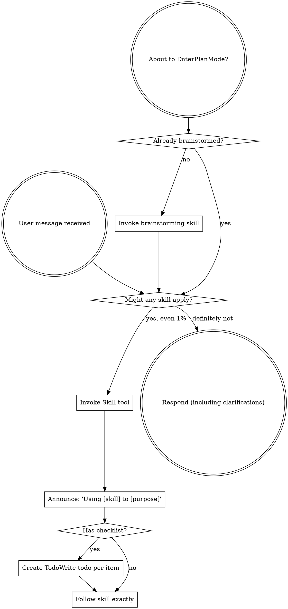

Reading prompt from stdin...
OpenAI Codex v0.121.0 (research preview)
--------
workdir: C:\Users\38909\Documents\github\aoe2
model: gpt-5.4
provider: openai
approval: never
sandbox: read-only
reasoning effort: high
reasoning summaries: none
session id: 019dc834-ff3b-7121-a544-04f6e800bcc3
--------
user
You are a senior code reviewer running iteration **3** of a thorough, full-repository audit of an Age of Empires II browser prototype. The repository root is the current working directory.

# What to read first

- `AGENTS.md` (project rules and conventions)
- `docs/architecture/ARCHITECTURE.md` (intended boundaries)
- `docs/devlog/summary.md` (latest milestones — iteration 1 + 2 entries are at the top of the 2026-04-25 section)
- `docs/engine-feedback/current.md` (live engine asks)
- **`docs/reviews/full/2026-04-25/1/REVIEW.md`** — iteration 1 synthesized findings.
- **`docs/reviews/full/2026-04-25/2/REVIEW.md`** — iteration 2 synthesized findings.
- **`docs/reviews/full/2026-04-25/2/raw/{codex,gemini,claude}_verify.md`** — iteration 2 verification round outputs.
- High-traffic modules: `src/main.ts`, `src/app/bootstrap/**`, `src/game/simulation/createSimulationBridge.ts`, `src/game/simulation/bridge/**`, `src/game/simulation/mapGeneration/**`, `src/game/simulation/fixtures/**`, `src/phaser/scenes/**`, `src/ui/**`
- Test seams: `tests/simulation/**`, `tests/browser/**`, `tests/phaser/**`
- Sample widely; do not stop at the first file. The repo is ~47 kLOC of TypeScript across ~155 files.

# Iteration 1 + 2 fix status (do not re-flag the FIXED items as new findings)

**Fixed in iteration 1 (commits `3f413e2`, `7bba71e`, `bfce2c7`, `6b37c62`):**
C-1 Monk conversion flip-flop, H-1 (partial) Save-load projector seed, H-3 Garrison cross-reference, M-16 ARCHITECTURE.md `bridge/` topology refresh.

**Fixed in iteration 2 (commits `7d63e00`, `f54c55d`, `af4c559`, `7687b82`, `0dc7cd7`, `2a1267a`):**
- V2-1: `getHudState()` returns saved-game seed (completes the iteration-1 H-1 fix on the HUD path)
- H2-1: `applyTechnology` idempotency guard + `enqueueResearch` cross-producer cost dedupe
- H2-2: Gather: preserve carried load when no drop-off path is available
- H2-3: Black Forest pocket radius 6 → 7 to fit STARTING_STONE / GOLD / BOARS offsets
- M2-1: `findPreferredVisibleEnemyBuilding` uses `isFootprintVisible` (matches `createProjector` contract)

**Rejected as not-a-bug after verification:**
- H-5 (iter-1) AI villager rebalance with zero villagers no-ops — silent no-op is intentional
- Codex's V2-1 NEEDS-CHANGE in iter-2 verification round was a misread of `createWorld(effectiveSeed, ...)` parameter shadowing — the re-save test in `saveLoad.test.ts` independently confirms correctness

**Deferred to iteration 3 (do not re-flag as new — but if you find a stronger angle, note it):**
- C-2 Save loader has no enum validation
- H-2 Save/load round-trip lacks side-map coverage (garrisonedByBuilding, monkTasks, conversionState, productionQueues, constructionStates, combatStates, wildlifeStates, trebuchetPackStates, aiStates)
- H-4 `getRenderState()` per-call full scan
- H-6 `placementMode` cleared inconsistently across player-action surfaces
- H-7 HUD listeners / RAF / keydown have no symmetric `destroy()`
- N-1 `createSimulationBridge.ts` is still ~7,360 lines
- M-1 through M-18 from iteration 1, plus all of M2-2 through M2-15 from iteration 2:
  - M2-2 Save panel discards download fallback when localStorage fails
  - M2-3 AI `findAvailableVillager` treats actively-gathering villagers as available
  - M2-4 Conquest resolver: simultaneous mutual annihilation grants defeat instead of draw
  - M2-5 AI Watch-Tower defensive response gated on Blacksmith
  - M2-6 HUD controller `destroy()` not exposed
  - M2-7 `applyMonkConvert` per-tick guard can write stale default after same-tick flip
  - M2-8 `applyShoreFishPatches` and `applyShoreFishPatchesProcedural` are byte-for-byte identical duplicates
  - M2-9 No fuzz test exercises `createDefaultMap` across multiple seeds
  - M2-10 Default-map procedural placement can collide forward-enemy-house with player-2 forest cells
  - M2-11 AI `findIdleProducer` returns first match (multi-base AI never trains at second producer)
  - M2-12 `seedToNumber` walks code points but indexes by code unit (UTF-16 surrogate pair hash collision)
  - M2-13 C-1 regression test asserts specific owner (order-dependent)
  - M2-14 `renderFog` per-frame full-map scan + per-cell allocations
  - M2-15 `getSnapshot` triggers redundant projecting and filtering
  - L-1 through L-8 from iter-1 plus L2-1 through L2-9 from iter-2

**Round-2 follow-up flagged in verification (not yet fixed):**
- **M2-1 sibling**: `createSimulationBridge.ts:5897-5919` and `:2548` (`isVisibleToHuman`) still use anchor-cell visibility for buildings in the fog-memory refresh path and other places. The round-2 reviewer flagged Medium; should also use `isFootprintVisible` for parity.

# What we want from iteration 3

1. **Verification pass**: Inspect the six iteration-2 fixes and confirm they are correct, complete, and side-effect-free. Flag new defects as `[V3-x]`.
2. **New findings**: Anything iteration 1 + 2 missed. Particularly:
   - Less-swept directories: `tests/browser/helpers/**`, `scripts/**`, `src/phaser/scenes/gameScene/**`, `src/ui/hud/saveLoadPanel.ts`, `src/ui/hud/displayNames.ts`, `src/ui/hud/createHudController.ts`, `src/app/bootstrap/createApp.ts`, `src/app/bootstrap/browserTestApi.ts`
   - The full deferred-list above; if any of those is now critical-blocking, escalate severity.
3. **Game-design / player-experience correctness** — Claude was the only iteration-2 reviewer to flag canonical-AoE2 deviations (Watch-Tower gate, draw outcome, AI villager priority, etc.). Lean harder on this in iteration 3.
4. **Verified-not-bugs** section — surface tempting "bugs" you ruled out so we do not re-investigate.

# Aspects to review (matches AGENTS.md "Code review")

1. Design — scalability, generalization, debuggability, leanness. Boundary violations vs ARCHITECTURE.md.
2. Test coverage — critical paths (combat, gathering, fog, save/load, AI, occupancy, win conditions, age progression, monk + relic, trebuchet pack/unpack, sheep claims, auto-aggression).
3. Correctness — bugs, race conditions, off-by-ones, broken invariants, save/load schema drift, determinism violations.
4. Cleanliness / typing / efficiency / memory — duplicated logic, dead code, unsafe `any`, expensive per-tick scans, unbounded side maps, missing listener / RAF / timer cleanup, hidden allocations in hot loops.
5. Documentation — outdated comments, mismatches between `summary.md`, ARCHITECTURE.md, and code.

# Output format

Plain text or markdown. Do NOT propose patches and do NOT modify files.

For each finding:

- **Severity:** critical | high | medium | low | nit
- **Theme:** design | tests | correctness | cleanliness | docs
- **Where:** `path/to/file.ts:LN` (or a tight range)
- **Finding:** one to three sentences explaining the issue and the concrete risk.

End with three sections:

- **Verification of iter-2 fixes** — one line per V2-1 / H2-1 / H2-2 / H2-3 / M2-1 with verdict OK / OK with caveats / NEEDS CHANGE.
- **Verified-not-bugs** — items you examined and ruled out.
- **Top issues to fix first** (max 5, ordered by impact). Cite specific files and lines.

codex
I’m treating this as a full repo review pass with explicit verification of the iteration-2 fixes and a fresh sweep for anything iteration 1 and 2 missed. I’ll start by loading the required repo instructions, relevant skills, and the prior review artifacts so the findings stay consistent with the project’s existing audit history.
exec
"C:\\Windows\\System32\\WindowsPowerShell\\v1.0\\powershell.exe" -Command "Get-Content C:\\Users\\38909\\.codex\\skills\\programming-best-practices\\SKILL.md -TotalCount 220" in C:\Users\38909\Documents\github\aoe2
exec
"C:\\Windows\\System32\\WindowsPowerShell\\v1.0\\powershell.exe" -Command "Get-Content C:\\Users\\38909\\.codex\\plugins\\cache\\openai-curated\\superpowers\\421657af\\skills\\using-superpowers\\SKILL.md -TotalCount 200" in C:\Users\38909\Documents\github\aoe2
exec
"C:\\Windows\\System32\\WindowsPowerShell\\v1.0\\powershell.exe" -Command "Select-String -Path C:\\Users\\38909\\.codex\\memories\\MEMORY.md -Pattern 'aoe2|Age of Empires|current state|planning docs|engine feedback' -Context 2,3" in C:\Users\38909\Documents\github\aoe2
2026-04-26T05:13:44.667279Z ERROR codex_core::tools::router: error=`"C:\\Windows\\System32\\WindowsPowerShell\\v1.0\\powershell.exe" -Command "Select-String -Path C:\\Users\\38909\\.codex\\memories\\MEMORY.md -Pattern 'aoe2|Age of Empires|current state|planning docs|engine feedback' -Context 2,3"` rejected: blocked by policy
 declined in 0ms:
`"C:\\Windows\\System32\\WindowsPowerShell\\v1.0\\powershell.exe" -Command "Select-String -Path C:\\Users\\38909\\.codex\\memories\\MEMORY.md -Pattern 'aoe2|Age of Empires|current state|planning docs|engine feedback' -Context 2,3"` rejected: blocked by policy
 succeeded in 306ms:
---
name: using-superpowers
description: Use when starting any conversation - establishes how to find and use skills, requiring Skill tool invocation before ANY response including clarifying questions
---

<SUBAGENT-STOP>
If you were dispatched as a subagent to execute a specific task, skip this skill.
</SUBAGENT-STOP>

<EXTREMELY-IMPORTANT>
If you think there is even a 1% chance a skill might apply to what you are doing, you ABSOLUTELY MUST invoke the skill.

IF A SKILL APPLIES TO YOUR TASK, YOU DO NOT HAVE A CHOICE. YOU MUST USE IT.

This is not negotiable. This is not optional. You cannot rationalize your way out of this.
</EXTREMELY-IMPORTANT>

## Instruction Priority

Superpowers skills override default system prompt behavior, but **user instructions always take precedence**:

1. **User's explicit instructions** (CLAUDE.md, GEMINI.md, AGENTS.md, direct requests) ƒ?" highest priority
2. **Superpowers skills** ƒ?" override default system behavior where they conflict
3. **Default system prompt** ƒ?" lowest priority

If CLAUDE.md, GEMINI.md, or AGENTS.md says "don't use TDD" and a skill says "always use TDD," follow the user's instructions. The user is in control.

## How to Access Skills

**In Claude Code:** Use the `Skill` tool. When you invoke a skill, its content is loaded and presented to youƒ?"follow it directly. Never use the Read tool on skill files.

**In Copilot CLI:** Use the `skill` tool. Skills are auto-discovered from installed plugins. The `skill` tool works the same as Claude Code's `Skill` tool.

**In Gemini CLI:** Skills activate via the `activate_skill` tool. Gemini loads skill metadata at session start and activates the full content on demand.

**In other environments:** Check your platform's documentation for how skills are loaded.

## Platform Adaptation

Skills use Claude Code tool names. Non-CC platforms: see `references/copilot-tools.md` (Copilot CLI), `references/codex-tools.md` (Codex) for tool equivalents. Gemini CLI users get the tool mapping loaded automatically via GEMINI.md.

# Using Skills

## The Rule

**Invoke relevant or requested skills BEFORE any response or action.** Even a 1% chance a skill might apply means that you should invoke the skill to check. If an invoked skill turns out to be wrong for the situation, you don't need to use it.



## Red Flags

These thoughts mean STOPƒ?"you're rationalizing:

| Thought | Reality |
|---------|---------|
| "This is just a simple question" | Questions are tasks. Check for skills. |
| "I need more context first" | Skill check comes BEFORE clarifying questions. |
| "Let me explore the codebase first" | Skills tell you HOW to explore. Check first. |
| "I can check git/files quickly" | Files lack conversation context. Check for skills. |
| "Let me gather information first" | Skills tell you HOW to gather information. |
| "This doesn't need a formal skill" | If a skill exists, use it. |
| "I remember this skill" | Skills evolve. Read current version. |
| "This doesn't count as a task" | Action = task. Check for skills. |
| "The skill is overkill" | Simple things become complex. Use it. |
| "I'll just do this one thing first" | Check BEFORE doing anything. |
| "This feels productive" | Undisciplined action wastes time. Skills prevent this. |
| "I know what that means" | Knowing the concept ƒ%ÿ using the skill. Invoke it. |

## Skill Priority

When multiple skills could apply, use this order:

1. **Process skills first** (brainstorming, debugging) - these determine HOW to approach the task
2. **Implementation skills second** (frontend-design, mcp-builder) - these guide execution

"Let's build X" ƒ+' brainstorming first, then implementation skills.
"Fix this bug" ƒ+' debugging first, then domain-specific skills.

## Skill Types

**Rigid** (TDD, debugging): Follow exactly. Don't adapt away discipline.

**Flexible** (patterns): Adapt principles to context.

The skill itself tells you which.

## User Instructions

Instructions say WHAT, not HOW. "Add X" or "Fix Y" doesn't mean skip workflows.
Cannot set property. Property setting is supported only on core types in this language mode.
At line:1 char:1
+ [Console]::OutputEncoding=[System.Text.Encoding]::UTF8;
+ ~~~~~~~~~~~~~~~~~~~~~~~~~~~~~~~~~~~~~~~~~~~~~~~~~~~~~~
    + CategoryInfo          : InvalidOperation: (:) [], RuntimeException
    + FullyQualifiedErrorId : PropertySetterNotSupportedInConstrainedLanguage
 

 succeeded in 347ms:
---
name: programming-best-practices
description: General coding workflow and engineering guardrails for planning, implementing, debugging, refactoring, reviewing, and validating code changes. Use when Codex is asked to write, edit, review, or test code in any repository, especially when correctness, maintainability, small diffs, and safe verification matter.
---

# Programming Best Practices

## Operate

- Read the relevant code path before editing.
- Trace data flow end to end before deciding on a fix.
- Prefer the smallest change that solves the actual problem.
- Match the existing architecture and conventions unless they are the source of the defect.
- Preserve backward compatibility unless the task explicitly requires a breaking change.

## Change Safely

- Do not overwrite unrelated user changes.
- Treat the worktree as potentially dirty and isolate your diff.
- Make state transitions explicit, especially around async flows and persistence.
- If concurrent results can race, decide which result wins and enforce it in code.
- Handle empty states, errors, cleanup, and cancellation paths deliberately.
- Avoid speculative abstractions until duplication or complexity actually justifies them.

## Validate

- Add or update targeted tests when behavior changes or a bug is fixed.
- Run the smallest meaningful verification first, then widen coverage if needed.
- Verify user-visible behavior, not only internal implementation details.
- If validation cannot run, state exactly what was blocked and what remains unverified.

## Review

- Prioritize bugs, regressions, broken assumptions, and missing tests.
- Present findings before summaries.
- Order findings by severity and include concrete file references.

## Communicate

- State assumptions when they affect implementation choices.
- Call out tradeoffs plainly.
- Explain non-obvious changes at a high level.
- Close with outcome, verification, and remaining risk.
Cannot set property. Property setting is supported only on core types in this language mode.
At line:1 char:1
+ [Console]::OutputEncoding=[System.Text.Encoding]::UTF8;
+ ~~~~~~~~~~~~~~~~~~~~~~~~~~~~~~~~~~~~~~~~~~~~~~~~~~~~~~
    + CategoryInfo          : InvalidOperation: (:) [], RuntimeException
    + FullyQualifiedErrorId : PropertySetterNotSupportedInConstrainedLanguage
 

codex
Using `superpowers:using-superpowers` to enforce the required skill-first workflow, and `programming-best-practices` to keep the audit focused on concrete correctness, test coverage, and architectural risk. Next I’m pulling the repo instructions, prior review rounds, and a lightweight memory note for `aoe2` so iteration 3 stays aligned with what has already been verified.
exec
"C:\\Windows\\System32\\WindowsPowerShell\\v1.0\\powershell.exe" -Command "Get-Content .\\AGENTS.md" in C:\Users\38909\Documents\github\aoe2
exec
"C:\\Windows\\System32\\WindowsPowerShell\\v1.0\\powershell.exe" -Command "Get-Content .\\docs\\architecture\\ARCHITECTURE.md" in C:\Users\38909\Documents\github\aoe2
exec
"C:\\Windows\\System32\\WindowsPowerShell\\v1.0\\powershell.exe" -Command "Get-Content .\\docs\\devlog\\summary.md" in C:\Users\38909\Documents\github\aoe2
exec
"C:\\Windows\\System32\\WindowsPowerShell\\v1.0\\powershell.exe" -Command "Get-Content .\\docs\\engine-feedback\\current.md" in C:\Users\38909\Documents\github\aoe2
2026-04-26T05:13:55.907675Z ERROR codex_core::tools::router: error=`"C:\\Windows\\System32\\WindowsPowerShell\\v1.0\\powershell.exe" -Command "Get-Content C:\\Users\\38909\\.codex\\memories\\MEMORY.md | Select-String -Pattern 'aoe2|engine-feedback|project state|planning docs' -Context 2,3"` rejected: blocked by policy
exec
"C:\\Windows\\System32\\WindowsPowerShell\\v1.0\\powershell.exe" -Command "Get-Content C:\\Users\\38909\\.codex\\memories\\MEMORY.md | Select-String -Pattern 'aoe2|engine-feedback|project state|planning docs' -Context 2,3" in C:\Users\38909\Documents\github\aoe2
 declined in 0ms:
`"C:\\Windows\\System32\\WindowsPowerShell\\v1.0\\powershell.exe" -Command "Get-Content C:\\Users\\38909\\.codex\\memories\\MEMORY.md | Select-String -Pattern 'aoe2|engine-feedback|project state|planning docs' -Context 2,3"` rejected: blocked by policy
 succeeded in 303ms:
## Core rules

- Use test-driven development for behavior changes: write or update tests first, then make them pass. Test the contract, not the code: tests should focus exclusively on app experience and mechanisms.
- For each desired change, make the change easy, then make the easy change.
- Before implementing a change, write a plan.
- Use a subagent to implement the plan such that the tests pass. For example, if the tech stack uses node, it should make sure `npx vitest run`, `npx tsc --noEmit`, and `npx vite build` pass.
- When the change is visual:
  - Capture a before screenshot.
  - Apply the change.
  - Capture an after screenshot.
  - Generate a pixel diff and use that as verification alongside the normal test/build gates.

## Team of subagents

- For every task from the user, create a stateless, ephemeral team of subgents to work together on tasks, then turn down the agents when you are done to avoid context rot.
- **Team lead**:
  - Responsibility: Breaks the human's request into atomic tasks, selects the appropriate domain specialists, routes the tasks, and acts as the final gatekeeper before merging.
  - If tests (`npx vitest run`, `npx tsc --noEmit`, etc.) fail or review consensus is not reached after 3 iterations, the Team Lead must execute a hard abort. It will `git reset --hard` the branch, dump the error logs and the failed approach into `docs/learning/lessons.md`, and spin up a completely fresh Architect and Engineer to write a brand new plan that explicitly avoids the failed approach.
- **Architect**:
  - Responsibility: Act purely as a consultant rather than an active driver. The Lead queries the Architect to draft the initial implementation plan and verify it against ARCHITECTURE.md before dispatching work.
- **Game designer**:
  - Responsibility: Make sure the game mechanism works well and is fun. Research local and online sources to ground your opinions.
- **Software engineer**:
  - Responsibility: Handle all the code writing.
  - Reach out to the team if you have questions or need a second opinion. 
  - CRITICAL: After you are done coding, ask the code reviewer to review your code. Iterate with the code reviewer. Reviews might take a long time. Be patient.
  - After addressing review comments, ask the reviewer to verify that you have successfully done so.
  - If the Software Engineer and the Code Reviewer cannot reach consensus after 3 iterations, escalate to the Tie-Breaker agent.
  - Write down the reviewer feedback from previous round(s) under `code_review/` as temp files. The reviewer should consider this info + `docs/learning/lessons.md` + your diff. After you summarize reviewer feedback into devlog, delete the temp files.
  - Continue this iteration loop until the reviewers seem to start nit-picking instead of catching real bugs / giving substantial feedback. Do not get stuck in an infinite loop.
- **Code reviewer**: Follow the code review section for detailed rules.
- **Tie breaker**: Use the high-reasoning model. Its prompt dictates that it must definitively choose to either ACCEPT the current diff (overriding the reviewer) or REJECT it with a mandatory, prescriptive patch. The Tie-Breaker's decision is final.

## Code review

- Use all of Codex / Gemini / Claude in CLI to independently review every change on the following aspects:
  1. Design.
    - Can easily scale, generalize, debug, be understood and reasoned about, and stay lean.
  2. Test coverage.
  3. Correctness.
  4. Clean code, typing, efficiency, memory leaks.
    - No: god class, large files, duplicated logic, inconsistent implementations, violation of boundaries.
    - Prefer composition over inheritance.
    - Clean up dead code.
    - Do not change app mechanics or behavior unless explicitly asked.
  5. Documentation.
    - Dev logs should be updated and maintained.
    - References to code should be up to date.
    - No outdated comments.
    - Learnings from debugging and friction points should be documented in `docs/learning/lessons.md`. The file should be actively maintained to not become long, tedious, or outdated.
- `base_prompt` for the code review agent: "You are a senior code reviewer. Flag bugs, security issues, and performance concerns. Do NOT modify files or propose patches. Only return findings, explanations, and suggestions in plain text."
- Optionally, use the @ symbol within `base_prompt` to include directory context for the best reasoning results.
- Codex:
  - `git diff [branch] | codex exec --model gpt-5.4 -c model_reasoning_effort=xhigh -c approval_policy=never --sandbox read-only --ephemeral <base_prompt>`
- Gemini:
  - `git diff [branch] | gemini -p <base_prompt> --model gemini-3.1-pro-preview`.
- Claude:
  - `git diff [branch] | claude -p --model opus --effort xhigh --append-system-prompt <base_prompt> --allowedTools "Read,Bash(git diff *),Bash(git log *),Bash(git show *)"`
- For full-codebase reviews (no diff), drop the `git diff` pipe and let each CLI agentically explore the workspace from its CWD; keep the same model/effort flags.

## Git

- When you iterate, only run affected tests.
- In the end, after you are confident about your change, run the full suite of tests to make sure you didn't accidentally break anything.
- Create a short-lived branch for every task (e.g., `agent/fix-tick-start`). Run the test suite on the branch. Only after all tests and visual pixel-diffs pass, merge into main using a fast-forward merge, and delete the branch.
- Commit durable docs you added if you are not planning to remove them.
- Commit as soon as you have a coherent, self-contained unit of change.

## Project docs

- Read `docs/devlog/summary.md` and `docs/architecture/ARCHITECTURE.md` at session start.
- Key directories:
  - `src`: app code.
  - `docs`: architecture, devlogs, reviews.
  - `design`: app and mechanism notes.

## Architecture

- Respect the boundaries documented there. If a boundary seems wrong, flag it instead of silently violating it.
- If architecture changes, update the relevant sections in `docs/architecture/ARCHITECTURE.md`, append a row to `docs/architecture/drift-log.md`, and mention the update in the devlog.
- Do not update `docs/architecture/ARCHITECTURE.md` for non-structural fixes, refactors, UI tweaks, or test-only work.
- Never delete a Key Architectural Decision in `docs/architecture/decisions.md`; add a newer decision that supersedes it.

## Devlog

- Detailed devlogs live under `docs/devlog/detailed/` as append-only files named `YYYY-MM-DD_YYYY-MM-DD.md` (e.g. `2026-04-07_2026-04-13.md`).
- Always append new entries to the latest detailed devlog (the file with the most recent `END_DATE`). When looking something up, start from the latest file and work backwards.
- Periodically archive: when the active file grows larger than 500 lines or a significant time boundary is reached, close it (freeze its `END_DATE` in the filename) and start a new file whose `START_DATE` is the next entry's date. Check if the start and end dates of all previous devlogs are still accurate.
- After every completed task, append a detailed entry with:
  - timestamp
  - action
  - code reviewer comments, broken down by AI provider and theme as stated above
  - result
  - reasoning
  - notes
- Keep `docs/devlog/summary.md` current after updating the detailed log. Always remove outdated info. Compact when it grows larger than 50 lines.
- If a subagent handles summary work, it should extract facts only and avoid interpretation.

## Debugging

- When debugging, use `docs/debugging/template.md` to record your process. Create a new file per debugging session and use it to iterate until you solve the problem.
- If a future session makes you realize that your previous debug sessions on the same topic did not fully solve the problem, update past docs to avoid misunderstandings.
- Clean up the temporary files (such as stack dump, test results) created during debugging after you are done.

## Doc formatting

- Don't wrap lines. Only use a new line when you are starting a new paragraph.

## Game specific

- Record current `civ-engine` weaknesses and misses in `docs/engine-feedback/current.md` as you work. Historical observations belong in `docs/engine-feedback/past.md`. Before you write to the current file, use a subagent to audit if its content is still valid and up to date. If too long, stale, or the issues are already addressed, it should be adjusted.
- If a missing engine feature blocks the task, stop your work and report it to the user. But do not modify the `civ-engine` repo directly.
Cannot set property. Property setting is supported only on core types in this language mode.
At line:1 char:1
+ [Console]::OutputEncoding=[System.Text.Encoding]::UTF8;
+ ~~~~~~~~~~~~~~~~~~~~~~~~~~~~~~~~~~~~~~~~~~~~~~~~~~~~~~
    + CategoryInfo          : InvalidOperation: (:) [], RuntimeException
    + FullyQualifiedErrorId : PropertySetterNotSupportedInConstrainedLanguage
 

 succeeded in 308ms:
# Architecture

This document describes the structural boundaries of the project. Update it only for
structural changes (new modules, shifted boundaries, new build or data pipelines). Do
not update it for UI tweaks, bug fixes, refactors, or test-only work. When it does
change, also append a row to `drift-log.md` and mention the update in the devlog.

## Repository layout

- `src/` ƒ?" game code (TypeScript)
  - `app/bootstrap/` ƒ?" app startup, dev HTTP API used by browser tests
  - `game/` ƒ?" gameplay rules, scenarios, content
    - `content/` ƒ?" shared content tables (e.g., building footprints)
    - `simulation/` ƒ?" simulation bridge, scenario setup, command handlers.
      Top-level siblings of `createSimulationBridge.ts` include
      `worldOccupancy.ts` (the `OccupancyBinding` adapter that keeps the
      authoritative blocker/crowding contract), `selectionActivity.ts`
      (structured activity payload for the HUD selection panel), and
      `renderStore.ts` (the per-tick render-message store the projector
      writes into).
      - `bridge/` ƒ?" helper modules factored out of `createSimulationBridge.ts`
        to keep the entry file from drifting back into god-class shape.
        Each module either exports plain helpers or a dep-bag factory whose
        side-map ownership still lives in `createWorld` so save/load and
        destroy-entity hooks share the same references:
        - `pureHelpers.ts` ƒ?" pure helpers (clamp, grid/coordinate
          transforms, economy/resource helpers, footprint and projection
          comparators) plus the shared `GameEvents` / `GameCommands` /
          `GameComponents` / `GameWorld` type aliases and the
          `UNIT_SUBGRID_*` / `UNIT_CELL_SLOT_OFFSETS` / `MARKET_BASE_RATE`
          constants.
        - `visibility.ts` ƒ?" `createProjector` (RenderAdapter projection),
          `syncVisibilitySources`, and the sheep claim / ownership helpers
          plus `SHEEP_VISION_RADIUS` / `MAX_HERDABLE_CLAIM_RADIUS`.
        - `trebuchetState.ts` ƒ?" `createTrebuchetStateOps` factory wrapping
          the Trebuchet pack/unpack transition over `trebuchetPackStates`.
        - `fogMemoryOps.ts` ƒ?" `createFogMemoryOps` factory bundling
          `getOrCreateMemoryMap`, `getFogMemoryEntities`,
          `getHumanFogMemorySize`.
        - `monkTaskOps.ts` ƒ?" `createMonkTaskOps` factory for the Monk
          heal / convert / pickup / deposit lifecycle, including AI-side
          task assignment and human-side context-click routing.
        - `technologyOps.ts` ƒ?" technology / upgrade application (research
          completion, per-unit / per-building stat propagation, civ
          unique-tech handling).
        - `matchEndOps.ts` ƒ?" match-end / score / win-condition resolution
          (conquest, Wonder, relic timers, score tally).
        - `aiDecisionOps.ts` ƒ?" Slice-10 AI decision helpers (villager
          retargeting, attack-group forming, plan transitions).
        - `placementOps.ts` ƒ?" placement preview + building placement
          confirmation (footprint validation, occupancy reservation).
        - `saveGameOps.ts` ƒ?" `createSaveGameOps` factory: serializes the
          world snapshot, visibility, match state, and every side map into
          a `SaveBlob`.
        - `targetFindingOps.ts` ƒ?" target-priority tables and helpers for
          finding visible enemies, nearest drop-offs, and nearest wildlife.
        `createSimulationBridge.ts` imports from `bridge/` rather than
        re-declaring any of this.
      - `mapGeneration/` ƒ?" deterministic procedural map generators and the
        spawn-list helper that enforces one-resource-per-cell. Hosts the
        default + Black Forest + Arena generators plus the shared terrain
        helpers (`paintDisc`, `createBaseTerrain`, etc.) and the starting
        offset tables (`STARTING_SHEEP`, `FOREST_PATCHES`, ƒ?İ).
      - `fixtures/` ƒ?" per-category modules that export every vitest-driven
        fixture factory (conquest, economy basics, age progression, combat
        matchups, siege, monastery, castle defense, AI, wonder/relic,
        selection, sheep, scenario validation). The `fixtures/index.ts`
        barrel is the single place the `prototypeScenario.ts` dispatcher
        imports from.
  - `phaser/` ƒ?" Phaser-specific scenes and render projection. Hosts
    `scenes/GameScene.ts` (scene class wiring lifecycle, input, and
    projection-driven render orchestration) plus a `scenes/gameScene/`
    subdirectory for the dep-bag renderer factories factored out of the
    scene file: `debugOverlay.ts` (world-space debug-mode overlays),
    `worldLayers.ts` (health-bar + fog-of-war paints), `selectionLayers.ts`
    (selection ring + placement preview + marquee paints), and
    `cameraController.ts` (per-frame update, middle-drag pan, edge-pan,
    zoom/scroll clamp, HUD-facing camera queries).
  - `ui/` ƒ?" DOM HUD controller
- `tests/` ƒ?" Vitest unit/integration tests and Playwright browser tests
- `scripts/` ƒ?" content and build scripts
- `design/` ƒ?" game design spec, stat CSVs, implementation plan
- `generated/` ƒ?" build-time content output (`generated/content/content.json`)
- `docs/` ƒ?" architecture, devlog, engine feedback, learning, debugging

## Runtime layers

The runtime is layered and the boundaries are intentional.

```
DOM HUD  ƒ"?ƒ"?ƒ"?ƒ"?ƒ"?ƒ-§ Phaser scene (render + input) ƒ"?ƒ"?ƒ"?ƒ"?ƒ"?ƒ-§ Simulation bridge ƒ"?ƒ"?ƒ"?ƒ"?ƒ"?ƒ-§ civ-engine World
                                                       ƒ",
                                                       ƒ""ƒ"?ƒ"? content tables (design/stats ƒ+' generated/content.json)
```

- `civ-engine` owns authoritative simulation state and deterministic ticking. All
  gameplay rules, combat, economy, progression, and AI policy live behind this
  boundary through ECS systems, queries, and commands.
- The simulation bridge (`src/game/simulation/`) owns repo-specific systems and
  scenario setup. It runs on top of `civ-engine` primitives and exposes a stable
  surface to the Phaser scene and HUD.
- Phaser is view and input only. It consumes render frames projected through
  `civ-engine`'s `RenderAdapter` and issues commands back into the simulation. No
  gameplay state lives in Phaser scenes.
- The DOM HUD is a pure consumer of render frames and selection state. It emits
  commands through the same seam as right-click orders from the scene.
- Content flows one-way: design CSVs under `design/stats/*.csv` are normalized at
  build time into `generated/content/content.json`, which the simulation loads.
  The generated file is not committed.

## Determinism contract

- Seeds are reproducible from `?seed=<name>` URL parameters for fixtures.
- Commands and fixed-step ticks are the only sources of state change.
- Render interpolation is a display concern; it does not feed back into simulation
  state. Click hit-testing prefers the displayed entity so the player's perceived
  target matches the authoritative target.

## Test boundaries

- Vitest (`npx vitest run`) covers simulation, content normalization, and scenario
  behavior. These tests drive simulation directly; they do not start Phaser.
- Playwright (`npm run test:browser`) drives the built preview app and asserts
  render-state and command flow end-to-end. Fixture seeds keep runs deterministic.
- `npx tsc --noEmit` and `npx vite build` gate type and build health.

## Where new work belongs

- A new gameplay rule, unit behavior, or AI change ƒ+' simulation bridge or
  `civ-engine` (flag an engine gap in `docs/engine-feedback/current.md` if the
  engine lacks the primitive).
- A new render treatment or input control ƒ+' Phaser scene with a render-state seam
  so browser tests can assert on the rendered output.
- A new HUD element ƒ+' `src/ui/` consuming render frames and selection state.
- New content ƒ+' `design/stats/*.csv` plus any normalizer work in `scripts/`.
Cannot set property. Property setting is supported only on core types in this language mode.
At line:1 char:1
+ [Console]::OutputEncoding=[System.Text.Encoding]::UTF8;
+ ~~~~~~~~~~~~~~~~~~~~~~~~~~~~~~~~~~~~~~~~~~~~~~~~~~~~~~
    + CategoryInfo          : InvalidOperation: (:) [], RuntimeException
    + FullyQualifiedErrorId : PropertySetterNotSupportedInConstrainedLanguage
 

 succeeded in 328ms:
## 2026-04-25
- **Full multi-AI review iteration 2 + batch-1 fixes (5 highs/mediums + 1 follow-up):** ran the second `/full-review` of the day after iter-1's batch-1 had landed; reviewers were Codex (`gpt-5.4` @ `model_reasoning_effort=high`), Gemini (had to fall back to `gemini-3-flash-preview` because `gemini-2.5-pro` and `gemini-3.1-pro-preview` both came back `QUOTA_EXHAUSTED` with a 13.5 h reset), Claude (`opus` @ `--effort high`). Synthesized 322-line `docs/reviews/full/2026-04-25/2/REVIEW.md`. Highest cross-reviewer-agreement findings were the **incomplete H-1 fix** (Codex + Claude both caught that `getHudState()` still returned the outer constructor `seed` after load) and Claude's **tech double-research bug** (race-queueing Forging at two Blacksmiths gave +2 attack instead of +1). Six commits on `agent/review-findings-2026-04-25-iter2-batch1`: `7d63e00` **[V2-1]** `getHudState()` returns saved-game seed (one-line `seed: effectiveSeed,`); `f54c55d` **[H2-1]** `applyTechnology` idempotency guard; `af4c559` **[H2-2]** gather: preserve carry on null drop-off path (split the `to-dropoff` branch so non-empty carry stays in `to-dropoff` until path reopens); `7687b82` **[H2-3]** Black Forest: bump `POCKET_RADIUS` 6 ƒ+' 7 (per-owner stone/gold/boar counts went from 3/3/1 ƒ+' 4/4/2 because `STARTING_STONE`, `STARTING_GOLD`, `STARTING_BOARS` offsets sat outside the radius-6 carve); `0dc7cd7` **[M2-1]** building target finding uses `isFootprintVisible` instead of anchor-only check (matches `createProjector` contract); `2a1267a` **[H2-1 follow-up]** cost dedupe across owned producer queues + stronger H2-2 villager-carry assertions + lint cleanup. Verification round caught the cost-side leak (Claude flagged HIGH, Codex caveat); Codex's V2-1 NEEDS-CHANGE verdict in the verification round was a misread of `createWorld(effectiveSeed, ...)` parameter shadowing ƒ?" both Claude and Gemini correctly traced it; the re-save regression test in `saveLoad.test.ts` independently confirms the contract by passing. Final gate: `npx tsc --noEmit` clean, `npm run lint` clean, `npx vite build` clean (4.01 s), `npx vitest run` **50/50 files, 400 passed + 1 skipped, 0 failed** (6 pre-existing Windows `onTaskUpdate` worker warnings remain). Untouched iter-2 medium/low items + the round-2 follow-up M2-1 sibling at `createSimulationBridge.ts:5897-5919` (fog-memory still anchor-only) carry forward to a future batch.
- **`civ-engine` 0.5.3 migration ƒ?" in-place renderable mutations need explicit refresh:** `civ-engine` rolled forward today through three breaking-change waves (0.4.0 ƒ+' 0.5.0 ƒ+' 0.5.3); `node_modules/civ-engine` reports 0.5.3. Audited the aoe2 surface against `../civ-engine/docs/changelog.md`. Two sites had been silently relying on the now-removed auto-detection of in-place component mutations: `createSimulationBridge.ts:5239-5243` (construction-complete `renderable.visualVariant = 'complete'`, fixed earlier today as `d0af9cb` before realizing the engine bump was the root cause) and `bridge/technologyOps.ts:upgradeOwnedUnits` (tech-upgrade mutates `unit.unitType` + `renderable.tint`/`size` + `visionSource.radius` in place ƒ?" fixed in `87d4d9f`). All other 0.4.0 / 0.5.0 / 0.5.1 / 0.5.2 / 0.5.3 breaking changes either don't apply (aoe2 doesn't call `getDiff`, `getEvents`, `setMeta`, `world.emit`, or import `GameLoop`) or already match the new contract (positions go through `setPosition`, save schema is repo-side and independent of engine snapshot v5). Defensive gap noted: `world.step()` doesn't handle the new fail-fast `WorldTickFailureError`; tests don't trigger this path, deferred. Engine is still healthy ƒ?" no new engine asks. New regression test "reflects the upgraded unit type in render state" in `tests/simulation/castleUpgrades.test.ts` would have caught the upgrade bug; existing 14 cases all asserted on `getEconomyState()` and missed the projector-side regression. Final gate: `npx tsc --noEmit` clean, `npm run lint` clean, `npx vitest run` **47/47 files, 393 passed + 1 skipped, 0 failed**.
- **Full multi-AI review iteration 1 + batch-1 fixes:** ran the `/full-review` slash command for the first time on this repo ƒ?" Codex (`gpt-5.4` @ `model_reasoning_effort=high`) + Gemini (`gemini-2.5-pro`) + Claude (`opus` @ `--effort high`) each reviewed the full ~47-kLOC TypeScript tree independently; raw outputs in `docs/reviews/full/2026-04-25/1/raw/{codex,gemini,claude}.md`; synthesized 281-line report at `docs/reviews/full/2026-04-25/1/REVIEW.md`. All three reviewers independently agreed on `createSimulationBridge.ts` god-class persistence (still 7,333 lines after Phase 1ƒ?"3 extractions) and save/load hydration fragility as the two top structural risks; Claude was the only reviewer to find the Monk conversion flip-flop bug, Codex was the only one to catch the projector seed mismatch on load. Then addressed four findings as separate commits on `agent/review-findings-2026-04-25-batch1`: `3f413e2` **[C-1] Monk conversion flip-flop** (`bridge/monkTaskOps.ts:348-376` reset was running before the per-tick guard, so two enemy Monks targeting the same unit in one tick wiped each other's progress to zero ƒ?" fix moves the per-tick guard above the reset so the first-processed Monk wins the increment), `7bba71e` **[H-1] Save-load projector seed** (one-line fix passing `effectiveSeed` to `createProjector` so a loaded match's projector matches the world seed), `bfce2c7` **[H-3] Garrison side-map cross-reference invariant** (post-load mirror check between `garrisonedByBuilding` and `garrisonedUnitToBuilding`, throws on mismatch), and `6b37c62` **[M-16] ARCHITECTURE.md `bridge/` topology refresh** (catches the doc up to all 11 ops modules + 3 top-level siblings; drift-log row added). Verified H-5 ("AI villager rebalance with zero villagers no-ops") as a non-bug ƒ?" silent no-op is correct since rebalance has nothing to redistribute. Larger items (C-2 full enum validation, H-2 wider save/load round-trip coverage, H-4 `getRenderState` memoization, N-1 further bridge extraction) deferred to separate sprints. Plus one out-of-scope fix `d0af9cb`: pre-existing `darkAge` render-state test was already failing on `main` (construction-complete mutates `renderable` in place, RenderAdapter doesn't see in-place mutations ƒ?" added the missing `markOutOfBandRenderChange()` call). Validation: `npx tsc --noEmit` clean, `npm run lint` clean, `npx vite build` clean, `npx vitest run` 47/47 files, 392/392 passed + 1 skipped (full-suite gate green for the first time after fixing the latent darkAge regression). AGENTS.md "Code review" CLI flags refreshed to current working flag landscape; `reference_review_clis.md` user-memory file updated.
- **AGENTS.md Gemini-CLI note corrected:** the "Code review" Gemini line previously claimed `gemini-3.1-pro-preview` 404s on this account. Empirical probe (gemini-cli 0.39.1) shows bare 3.x IDs (`gemini-3-pro`, `gemini-3.1-pro`, `gemini-3-flash`) 404 ƒ?" no GA endpoint ƒ?" but the `-preview` suffixed variants (`gemini-3-pro-preview`, `gemini-3.1-pro-preview`, `gemini-3-flash-preview`) all work; the prior 2026-04-23 devlog had separately observed `gemini-3.1-pro-preview` `RESOURCE_EXHAUSTED`/`QUOTA_EXHAUSTED` (quota, not 404). Updated note to (a) bump CLI version 0.39.0 ƒ+' 0.39.1, (b) explain the `-preview` requirement and list working IDs, (c) note the quota fallback to `gemini-2.5-pro`. Default-model command unchanged. Doc-only; no tests run.

## 2026-04-24
- **Auto-aggression ƒ?" idle military pursues, idle villagers defend (canonical AoE2):** added the `prototypeAutoAggression` simulation system in `src/game/simulation/createSimulationBridge.ts`. Each tick it scans every owned, non-garrisoned, non-monk, non-busy unit and issues an attack-command against the highest-priority enemy in personal LOS via two new helpers `findPreferredEnemyUnitInRadius` / `findPreferredEnemyBuildingInRadius` in `bridge/targetFindingOps.ts` (queryInRadius + existing `targetPriority` tables). Military units use their live `visionSource.radius` (so tech upgrades + fixture vision overrides flow through unchanged); villagers are radius 1 (Defensive Stance: melee-adjacent only) and short-circuit when their `GathererComponent` is busy so explicit gather orders are never silently dropped. Phase ordering is `prototypeAi` ƒ+' `prototypeAutoAggression` ƒ+' `prototypePlayerCommands` so AI/player commands set first take precedence. New `disableAi: boolean` on `PlayerStartSpec` skips both the planner and AA for fixture-passive enemies (the AA gate reads `aiStates.has(owner)`, which the seeding site at `start.disableAi` already drives). 7 new fixtures in `fixtures/combatMatchups/autoAggression.ts` plus `auto-aggro-monk-skip-fixture` + `auto-aggro-villager-gathering-fixture`; 10 new tests in `tests/simulation/autoAggression.test.ts` lock the contract: pursue-in-vision, ignore-out-of-vision, archer-pursuit-then-fire, player-move-overrides, villager-adjacent-defense, villager-no-pursuit, villager-gather-honored, monk-skip, sequential-targets-after-kill, save/load mid-engagement. Two regressions caught and fixed inline: the `moving-enemy-attack-fixture` got `disableAi: true` so its wandering enemy scout stays on its path until the player issues a command; the AA radius read was switched to the unit's live `visionSource.radius` so the Mangonel/Onager min-range fixtures (whose enemy spearmen are spawned with `vision: radius 1`) keep their passive-enemy intent. One round of code-review iteration via the in-environment `superpowers:code-reviewer` subagent (gather-honor + monk-skip test + `disableAi` cross-ref). Validation: `npx vitest run` **45/45 files, 385 passed + 1 skipped** on the post-implementation run; `npm run test:browser` **81/82 passed** (1 flaky pre-existing wolf-aggro test passed in isolation; wolves are resources, not units ƒ?" AA never targets them); `npx tsc --noEmit`, `npx vite build`, `npm run lint` clean. Spec at `docs/superpowers/specs/2026-04-24-aggressive-military-design.md`.
- **Sheep show up in the selection panel icon grid for multi-selections:** the panel's `renderSelectionIcons` only iterated `economyState.units` when classifying selected ids, so owned sheep ƒ?" which live in `economyState.resources` ƒ?" silently fell out of the grid. Four sheep selected ƒ+' empty icon grid; mixed villager + sheep ƒ+' only the villager chip. Fix: added `id: number` to the `EconomyState.resources` entry, threaded it through `getEconomyState` + the `isEconomyResourceEntry` type guard, and rewrote `renderSelectionIcons` (`src/ui/hud/selectionPanel.ts`) to also build a `sheepById` map and emit chips via the entity-helpers (`formatEntityIcon` / `formatEntityIconAccent` / `formatEntityName` already supported sheep). Single non-unit selections keep using the existing `data-selection-entity-icon` big-chip path so the browser-test contract for single-sheep / single-building stays intact. Exposed `selectUnitsInBox` on `__AOE2_TEST__` so capture scripts can drive mixed selections without panning the viewport. Regression coverage: `tests/simulation/selectionPanelIcons.test.ts` (4 cases ƒ?" 4-sheep, mixed, single-sheep, 3-villager). Visual proof: `docs/devlog/artifacts/2026-04-24-sheep-selection-{before,after,diff}.png` (35.81% pixel change; panel grew from 301 px to 312 px when the `SH A-3` chip was added next to the `V` chip). Validation: `npx tsc --noEmit` clean, `npx vitest run` **44/44 files, 377 passed + 1 skipped**, `npm run test:browser` **82/82 pass**, `npx vite build` clean.
- **Default-map narrow-path fix (villagers no longer walled in):** the procedural resource-cluster placer in `applyStandardPlayerOpeningProcedural` could walk a cluster all the way around a ring and meet an adjacent cluster's arc, sealing the starting villagers into a pocket. On seed `aoe2-prototype` the berry arc `(5,7)ƒ+'(9,5)` met the sheep cluster at `(5,8)(5,9)(6,10)` and the water/forest strip to the west, so `findGridPath` returned null for any west-target move and the command was silently cleared. Fix: `cellBlockedByScenarioEntity` now reserves four guaranteed-clear cardinal exit corridors ƒ?" a 2-row horizontal corridor at `y = TC.y` and `y = TC.y + 1` (spanning `|x ƒ^' (TC.x + 1)| ƒ% 13`) and a 2-column vertical corridor at `x = TC.x + 1` and `x = TC.x + 2` (spanning `|y ƒ^' (TC.y + 1)| ƒ% 13`). The extent (13 cells) reaches past the outermost forest ring (12), so no ring walker can close a continuous arc around the base. Regression coverage: `tests/simulation/defaultMapNarrowPath.test.ts` (4 cases asserting each starting villager reaches each cardinal near-base target ƒ?" before the fix, west+north timed out stuck; after, all pass in 1.3 s) and `tests/simulation/narrowCorridorMovement.test.ts` (4 hand-crafted tree-corridor cases locking the "friendlies do not block A*" contract). New fixture `narrow-corridor-fixture` in `fixtures/economyBasics.ts`. Debug session at `docs/debugging/2026-04-24-narrow-corridor-pathfinding.md`. Validation: `npx tsc --noEmit` clean, `npx vitest run` **43/43 files, 373 passed + 1 skipped** (the 6 pre-existing Windows `onTaskUpdate` worker warnings remain), `npx vite build` clean. No architecture change; no engine ask (`civ-engine` pathfinding + `OccupancyBinding` both behaved as documented ƒ?" the bug was repo-side map-gen only).

## 2026-04-23
- **Final 800+-line file splits (move-only):** six files above 800 lines all trimmed below 550 lines via barrel re-exports. `fixtures/castleDefense.ts` (**984**) ƒ+' `castleDefense/{fletching,fu3Walls,fu3Archers,towerAndCastle}.ts` (**188 / 234 / 373 / 273** lines) behind a **31**-line barrel. `fixtures/combatMatchups.ts` (**962**) ƒ+' `combatMatchups/{infantryAndCavalry,rangedSkirmish,generalCombat}.ts` (**505 / 125 / 348** lines) behind a **28**-line barrel. `fixtures/monastery.ts` (**858**) ƒ+' `monastery/{heal,convert,relic}.ts` (**219 / 336 / 319** lines) behind a **25**-line barrel. `fixtures/ageProgression/imperial.ts` (**817**) ƒ+' `imperial/{ageUp,upgrades,castle}.ts` (**131 / 504 / 198** lines) behind a **23**-line barrel. `tests/browser/game-progression-and-production.spec.ts` (**847**, 21 tests) ƒ+' four themed specs (`game-progression-{ageup,upgrades,production}.spec.ts` ƒ?" **93 / 138 / 322** lines with 3 / 3 / 8 tests ƒ?" plus trimmed remainder **303** lines / 7 tests = 21). `tests/browser/helpers/gameTestHelpers.ts` (**820**) ƒ+' `gameTestHelpers/{types,snapshot,camera,command,selection,hud,placement}.ts` (**55 / 25 / 172 / 68 / 190 / 275 / 54** lines) behind a **71**-line barrel re-exporting all 45 previous names. All move-only; barrel files preserve every public export so zero downstream import changes. Validation per commit: `npx.cmd tsc --noEmit`, `npm.cmd run lint`, `npx.cmd vite build` clean; targeted vitest runs green (castle/monastery/imperial/combat subsets all pass). Final `npm.cmd run test:browser` **82/82** pass across all split specs. Architecture: new sub-directories logged in `docs/architecture/drift-log.md`.
- **Trim the last three >1,000-line files via mechanical splits:** `fixtures/ageProgression.ts` (**1,868 lines** / 25 factories) splits into `fixtures/ageProgression/{feudal,castle,imperial,blacksmith}.ts` (**694 / 241 / 817 / 144 lines**) behind a 41-line barrel; `fixtures/siege.ts` (**1,090 lines** / 18 factories) splits into `fixtures/siege/{mangonel,scorpion,ram,bombardCannon,trebuchet,workshop}.ts` (**383 / 65 / 289 / 119 / 127 / 147 lines**) behind a 40-line barrel; and `tests/simulation/createSimulationBridge.core.test.ts` (**1,019 lines** / 31 tests) splits into `createSimulationBridge.{bootstrap,unitMovement,gatheringAndDropoff,wildlifeAndSheep}.test.ts` (**535 / 191 / 160 / 160 lines** ƒ?" 17 / 6 / 4 / 4 tests = 31). All move-only; no behavior change; fixture factory names and test seeds/assertions preserved. Validation: `npx.cmd tsc --noEmit` / `npm.cmd run lint` / `npx.cmd vite build` clean per commit; targeted vitest runs green between commits (age-progression 141/141, siege 39/39, split test files 31/31). Architecture: `fixtures/ageProgression/` + `fixtures/siege/` subdirectories logged in `docs/architecture/drift-log.md`.
- **Shrink `GameScene.ts` via `gameScene/` extraction:** four move-only commits factor renderer + controller chunks out of the 1,737-line scene file into `src/phaser/scenes/gameScene/`: `debugOverlay.ts` (**184 lines**, five world-space debug-mode overlays), `worldLayers.ts` (**185 lines**, per-entity health bars + fog of war paint), `selectionLayers.ts` (**211 lines**, selection ring + placement preview + drag-selection marquee), and `cameraController.ts` (**369 lines**, camera per-frame update / middle-drag pan / edge-pan / zoom + scroll clamp / HUD camera queries). `GameScene.ts` drops from **1,737 ƒ+' 1,161 lines** (ƒ^'33.2%); new `gameScene/` modules total **949 lines**. Move-only; no runtime behavior change; public API surface (CameraState export, `getCameraState` / `centerCameraOnWorldPosition` / `getScreenPointForCell` / `getSelectionBoxState` / `getPlacementPreviewState` / `getBuildingVisualStates` / `getEntityHealthBarStates` / `getDisplayedEntities` / `getPlacementPreviewVisualState` / `selectEntityAtWorldPosition` / `issueContextCommandAtWorldPosition` / `setBridge`) preserved. Validation per commit: `npx.cmd tsc --noEmit` / `npm.cmd run lint` / `npx.cmd vite build` clean; `npx.cmd vitest run tests/phaser/` green (**13/13**) between commits.
- **Phase-3 bridge extractions:** three more move-only commits factor placement preview + building placement (`bridge/placementOps.ts` **204 lines**), the full-game save serializer (`bridge/saveGameOps.ts` **410 lines**), and the target-finding priority tables + visible-enemy / nearest-drop-off / nearest-wildlife helpers (`bridge/targetFindingOps.ts` **396 lines**) out of `createSimulationBridge.ts`. The planned 4th commit (selection + command dispatch) was skipped because its dep-bag would have exceeded 15 fields (~25+), which the brief treats as the wrong boundary. `createSimulationBridge.ts` drops from **7,705 ƒ+' 7,214 lines** (ƒ^'6.4%); cumulative phase-1+phase-2+phase-3 shrink is **9,519 ƒ+' 7,214 (ƒ^'24.2%)**; `bridge/` totals **11 modules, 3,548 lines**. Validation per commit: `npx.cmd tsc --noEmit` / `npm.cmd run lint` / `npx.cmd vite build` clean; targeted vitest subsets green between commits (placement: 13/13; save: 6/6; target-finding: 27/27). Final full vitest: **38/38 files, 365 passed + 1 skipped** (6 pre-existing Windows `onTaskUpdate` worker warnings, not test failures). Commits `9ac7ff1` ƒ+' `6193686` ƒ+' `584727a` (+ docs commit).
- **Phase-2 bridge extractions:** four more move-only commits factor the Monk task subsystem (`bridge/monkTaskOps.ts` **646 lines**), technology/upgrade application (`bridge/technologyOps.ts` **471 lines**), match-end + score (`bridge/matchEndOps.ts` **230 lines**), and the Slice-10 AI decision helpers (`bridge/aiDecisionOps.ts` **273 lines**) out of `createSimulationBridge.ts`. Same flat dep-bag factory pattern as phase 1; side-map ownership stays in createWorld. `createSimulationBridge.ts` drops from **8,792 ƒ+' 7,705 lines** (ƒ^'12.4%); cumulative phase-1+phase-2 shrink is **9,519 ƒ+' 7,705 (ƒ^'19.1%)**; `bridge/` totals **8 modules, 2,538 lines**. Validation per commit: `npx.cmd tsc --noEmit` / `npm.cmd run lint` / `npx.cmd vite build` clean; targeted vitest subsets green between commits (monk: 62/62; tech: 124/124; match-end: 18/18 after one 10s-flake retry; AI: 20/20). Commits `1f8702d` ƒ+' `f62c41a` ƒ+' `b0b8f82` ƒ+' `302067e` (+ docs commit).
- **Shrink `createSimulationBridge.ts` via `bridge/` extraction:** four move-only commits factor safe helper chunks out of the 9,519-line god-file into `src/game/simulation/bridge/`: `pureHelpers.ts` (30 pure helpers ƒ?" clamp, grid/coordinate transforms, resource/position helpers, footprint comparator, etc., plus shared `GameEvents`/`GameCommands`/`GameComponents`/`GameWorld` type aliases and the `UNIT_SUBGRID_*`/`UNIT_CELL_SLOT_OFFSETS`/`MARKET_BASE_RATE` constants), `visibility.ts` (`createProjector`, `syncVisibilitySources`, sheep claim/ownership helpers + `SHEEP_VISION_RADIUS`/`MAX_HERDABLE_CLAIM_RADIUS`), `trebuchetState.ts` (`createTrebuchetStateOps` factory wrapping `advanceTrebuchetTransition`/`beginTrebuchetUnpack`/`beginTrebuchetPack`/`isTrebuchetStationary`/`isTrebuchetSilent` around the shared `trebuchetPackStates` side map), and `fogMemoryOps.ts` (`createFogMemoryOps` factory wrapping `getOrCreateMemoryMap`/`getFogMemoryEntities`/`getHumanFogMemorySize` around `{ fogMemory, humanPlayerId, visibility }`). `createSimulationBridge.ts` drops from **9,519 ƒ+' 8,792 lines** (ƒ^'7.6%); new `bridge/` modules total **918 lines**. Move-only; no runtime behavior change. Validation per commit: `npx.cmd tsc --noEmit` clean, `npm.cmd run lint` clean, `npx.cmd vite build` clean; targeted vitest runs across 10 simulation files (88 cases: core 31, combat 5, production 4, fogMemory 5, trebuchetPackUnpack 3, saveLoad 6, scenarioValidation 7, imperialSiege 13, sheepMovement 12, sheepVision 2) all pass. Commits `63777d4` ƒ+' `e4b9b11` ƒ+' `e9c3431` ƒ+' `a4f9f9f` on `agent/shrink-createSimulationBridge`. Architecture: new `bridge/` subdirectory documented in `docs/architecture/ARCHITECTURE.md` + `docs/architecture/drift-log.md`.
- **Selection panel compact-icon grid for multi-unit selections:** reclaimed panel vertical space so every selected unit type stays visible even with many types selected. Single-unit selections keep the big labelled chip (icon + name); multi-unit selections now route to a wrapping icon-only grid (`repeat(auto-fill, minmax(48px, 1fr))`) with a small `x<count>` footnote under each icon (omitted when count is 1). Full unit name moves to the HUD tooltip for each icon. Panel height for a 3-type selection drops from `299 px` to `180 px` (~40% reclaim) before accounting for overflow cases where the old layout would have scrolled. Before/after + pixel diff at `docs/devlog/artifacts/2026-04-23-selection-panel-{before,after,diff}.png`. Existing `data-selection-unit-icon/chip/count/label` selectors preserved. Added `tests/browser/_captureSelectionPanel.spec.ts` as a dev-only capture tool (Playwright `testIgnore: ['**/_*.spec.ts']`). Validation: `npx tsc --noEmit`, `npm run lint`, `npx vite build` clean; `npm run test:browser` **82/82 pass**.
- **Split the 9,968-line `prototypeScenario.ts` god-file:** extracted every pure terrain helper, offset table, player-opening routine, and map generator into dedicated `mapGeneration/` modules (`constants`, `sharedTerrainHelpers`, `startingOffsets`, `applyStandardPlayerOpening`, `blackForestMap`, `arenaMap`); pulled every ~120 fixture factory into 13 category modules under `src/game/simulation/fixtures/` with `fixtures/index.ts` as the single barrel the dispatcher imports from; deleted the ~130-line unreachable default-seed fallback body that the top-of-function `DEFAULT_SEED` short-circuit had made dead code. `prototypeScenario.ts` retains the public types (`PrototypeScenario`, `ScenarioSpawnSpec`, `PlayerStartSpec`, `Offset`, `TerrainCellSpec`), constants (`MAP_WIDTH`, `MAP_HEIGHT`, `TPS`, `DEFAULT_SEED`, `HUMAN_PLAYER_ID`), helper re-exports, and the seed ƒ+' factory dispatcher; final size **789 lines** (from 9,968). Largest new files: `fixtures/ageProgression.ts` (**1,868**), `fixtures/siege.ts` (**1,090**), `fixtures/castleDefense.ts` (**984**), `fixtures/combatMatchups.ts` (**962**), `fixtures/monastery.ts` (**858**), `mapGeneration/applyStandardPlayerOpening.ts` (**567**). No runtime behavior change: same seeds ƒ+' same scenarios. Validation: `npx.cmd tsc --noEmit`, `npm.cmd run lint`, `npx.cmd vite build` all clean; affected `prototypeScenario.test.ts` (10), `createSimulationBridge.core.test.ts` (31), `createSimulationBridge.darkAge.test.ts` (4), `createSimulationBridge.barracks.test.ts` (1) all pass (46/46 on affected-test run). Commits `41ac704` ƒ+' `07f86a1` ƒ+' `9796216` ƒ+' `2824782`. Architecture: `fixtures/` subdirectory documented in `docs/architecture/ARCHITECTURE.md` + `docs/architecture/drift-log.md`.
- **Resource cell exclusivity + procedural default map:** fixed the tree-on-stone stacking visible in `npm run dev` (root cause: `STARTING_STONE` offsets `(0..1, 5..6)` exactly overlapped `FOREST_PATCHES[2]` `(-2..1, 5..6)`, so each player's stone cells also carried a tree every game). Added a first-write-wins spawn-list helper (`src/game/simulation/mapGeneration/spawnList.ts`) and a procedural default-map generator (`src/game/simulation/mapGeneration/defaultMap.ts`) that picks per-base cluster directions from the seed and guarantees the canonical per-owner counts (sheep 4, boar 2, berry 6, gold 4, stone 4, tree 24) and per-base resource-kind coverage within a 10-cell radius. Routed `applyResourcePatch` / `applyForestPatch` / `applyShoreFishPatches` through the helper so every existing generator inherits the one-resource-per-cell invariant. Added a bridge-boot resource-on-resource validator alongside the existing building/unit/resource-on-building passes, plus a new `slice12-validation-resource-on-resource-fixture` that proves it throws with the seed name. Re-anchored two coordinate-dependent tests that were coupled to the old hand-crafted layout (`createSimulationBridge.core.test.ts` scout movement, `createSimulationBridge.darkAge.test.ts` house placement) to query live positions instead. Visual verification: before/after screenshots + pixel diff at `docs/devlog/artifacts/2026-04-23-default-map-{before,after,diff}.png` ƒ?" `59,144` of `480,000` pixels changed (`12.32%` of `800x600`). Final vitest suite: **38/38 files, 365 passed + 1 skipped + 13 new tests**; `npx tsc --noEmit` / `npx vite build` clean; `npm run test:browser` run as part of the close-out. `npm test` still exits non-zero only because of the documented pre-existing vitest-worker `onTaskUpdate` warnings on Windows. Commits `a088ca1` ƒ+' `a13a022`. Architecture: new subdirectory `src/game/simulation/mapGeneration/` logged in `docs/architecture/drift-log.md`.
- **Selection info panel now shows activity:** new line under the selection name tells the player what the selected entity is actively doing ƒ?" single labels like `Gathering wood`, `Building House`, `Attacking Scout Cavalry`, `Training Villager`, `Researching Forging`, `Under construction`, `Idle`, `Packing`/`Unpacking` (Trebuchet), `Dropping off wood`, `Retrieving relic` / `Carrying relic` (Monk); multi-selection rolls up to a coarse-verb breakdown sorted by semantic priority tier (combat first, idle last) and capped at 5 tokens with an overflow marker. Architectural seat: the simulation bridge emits a structured `{ verb, target: { kind, type } | null }` payload via a new dedicated module `src/game/simulation/selectionActivity.ts` (extracted ~150 LOC out of the 9.6k-line bridge) and the HUD's `formatActivityLabel` in `selectionPanel.ts` composes the human-readable string through the existing `displayNames.ts` single source of truth. Coverage: 23 new vitest cases in `tests/simulation/selectionActivity.test.ts` (1 overflow case skipped because no six-distinct-activity fixture exists yet), two new browser cases in `tests/browser/game-selection.spec.ts` (single-unit `Gathering wood` and multi-select `N idle`). Review iteration landed 5 review rounds (Gemini + Claude CLI + Codex in two passes, plus the persistent team's architect/designer/researcher on the spec+plan) ƒ?" caught and fixed: the dead `unitCommands['move']` gather/return branches, the unreachable garrisoned-unit branch (garrisoned units aren't selectable through the panel), the coupling where `coarseVerbForUnit` parsed human labels with `startsWith`, the kebab-to-title fallback that would have silently diverged `Scout` from `Scout Cavalry`, and the bridge god-class risk (extraction restored the file-size invariant). Game-designer driven polish: `Returning wood` ƒ+' `Dropping off wood`, monk `Depositing relic` split into `Carrying relic` (transit) vs `Retrieving relic` (pickup), multi-selection ordering reshuffled from pure count-desc-alphabetical to tier-first so combat surfaces first and idle always lands last. Engine-feedback: none ƒ?" all state used was already tracked in existing bridge maps (`unitCommands`, `monkTasks`, `trebuchetPackStates`, `productionQueues`, `constructionStates`, `GathererComponent`). Final validation: `npm.cmd run typecheck`, `npm.cmd run lint`, and `npm.cmd run build` passed; `npm.cmd run test:browser` passed with **82/82** browser tests. Affected vitest file runs **23/24** passing + 1 skipped overflow case; full `npm.cmd test` exits non-zero on this Windows setup from the pre-existing `[vitest-worker]: Timeout calling "onTaskUpdate"` warnings but the last completed full suite before the final refactor pass reported **36/36** files and **352/353** tests passing. Commits: `c4df9b8` (spec) through `fb97891` (designer polish). AoE2-authenticity note from `game-researcher`: this HUD line is a NEW feature relative to canonical AoE2 (the source game surfaces activity via economy-panel profession counts and an idle-villager counter, never as prose in the selection panel) ƒ?" the spec frames it as an enrichment, not a reproduction.
- **`prototypeScenario.ts` artifact cleanup:** removed the lingering mixed-line-ending worktree artifact from `src/game/simulation/prototypeScenario.ts` by restoring the file exactly to `HEAD` with no content change. Re-ran the full validation gate afterward: `npm.cmd run typecheck`, `npm.cmd run lint`, `npm.cmd run build`, and `npm.cmd run test:browser` passed (`80/80` browser tests). `npm.cmd test` again finished with **35/35** files and **327/327** tests passing, but still exits non-zero because of the pre-existing `[vitest-worker]: Timeout calling "onTaskUpdate"` unhandled errors on this Windows setup; this rerun surfaced **6** of those warnings.
- **`civ-engine` occupancy integration landed:** the bridge now routes placement/passability occupancy queries through `src/game/simulation/worldOccupancy.ts`, an `OccupancyBinding` adapter that preserves the repo's crucial blocker-vs-crowding rule: terrain/buildings/resources are whole-cell blockers, while units only crowd cells and still remain path-passable. `createSimulationBridge.ts` now rebuilds/syncs occupancy from the authoritative world, keeps it current across movement, garrison, ungarrison, carried-relic movement, and save/load hydration, and avoids leaking low-level occupancy errors ahead of the fixture validator's seed-specific messages. Iteration stayed on affected tests first; the full final gate passed `npm.cmd run typecheck`, `npm.cmd run lint`, `npm.cmd run build`, and `npm.cmd run test:browser` (`80/80` browser tests). `npm.cmd test` finished at **35/35** files and **327/327** tests passing, but still exits non-zero because of the pre-existing **5** `[vitest-worker]: Timeout calling "onTaskUpdate"` unhandled errors on this Windows setup. Claude review ended with no actionable issues after the main review loop; Codex and Gemini were attempted repeatedly but remained blocked by local CLI timeout/model/quota problems, which is recorded in the detailed devlog rather than papered over.
- **Bundled HUD typography refresh:** the game now ships `IBM Plex Sans` latin 400/600/700 through `@fontsource` instead of relying on host-installed serif/system fonts, with `Courier New` preserved for the debug overlay and pasted-save textarea. Browser coverage in `tests/browser/game-hud-and-camera.spec.ts` now waits for `document.fonts.ready`, explicitly loads the bundled 400/600/700 faces, and still checks the mono HUD surfaces. Review iteration caught and fixed the original cross-platform font-stack drift, the weak computed-style-only assertion, the overly Windows-specific fallback stack, and an incidental `package-lock.json` `../civ-engine` version hunk. Visual verification: before/after HUD screenshots plus a pixel diff were generated during the task (`55,028` changed pixels, `11.46%` of an `800x600` capture) and summarized into the devlog before the temporary `code_review/` artifacts were deleted. Final reviewer verification ended at the right stopping point: Claude reported no actionable issues remaining, while local Codex and Gemini reruns were blocked by CLI timeout/model/quota failures rather than fresh code findings. Final validation: `npm.cmd run typecheck`, `npm.cmd run lint`, `npm.cmd run build`, and `npm.cmd run test:browser` passed (`80` browser tests); `npm.cmd test` ran the full suite to completion with **34/34** files and **321/321** tests passing, but still exits non-zero because of the pre-existing **5** `[vitest-worker]: Timeout calling "onTaskUpdate"` errors on this Windows setup.
- **Fullscreen-only edge-pan safeguard:** edge-pan no longer triggers in ordinary windowed play. `GameScene` now enables edge-pan only when the game is actually fullscreen or the browser window already covers the full screen, and browser coverage now locks the four key camera contracts: windowed off, document-fullscreen on, full-screen-window on, and fullscreen-exit off. Review iteration caught and fixed an over-broad fullscreen predicate, a non-idempotent fullscreen helper, missing heuristic coverage, and the missing docs/devlog trail. Final reviewer verification from Codex, Gemini, and Claude reported no actionable remaining issues after the last cleanup/doc pass. Final validation: `npm.cmd run typecheck`, `npm.cmd run lint`, and `npm.cmd run test:browser` passed (`79` browser tests); `npm.cmd test` reached **34/34** files and **321/321** tests passing but still exits non-zero because of the pre-existing **6** `[vitest-worker]: Timeout calling "onTaskUpdate"` unhandled errors on this Windows setup.
- **Engine-feedback live-doc cleanup:** reformatted `docs/engine-feedback/current.md` into a tighter live-status document with compact bullets for verdict, active asks, and recommendation, without changing the underlying engine assessment. Review surfaced and resolved one documentation-hygiene mismatch between the summary and detailed log, and final verification found no actionable issues. Validation: not run because this was a docs-only formatting cleanup.

## 2026-04-22
- **Precise unit selection + browser spec split:** left-click selection and drag-box selection now use exact rendered-body geometry instead of padded tile-ish hit areas, marquee drags show live highlights for the units that will actually be selected on mouse-up, context-command targeting keeps a separate forgiving padded unit shape, same-cell exact-click cycling now keys off a repeated click in the same click cell instead of any prior selection state, and same-layer overlap hits now resolve to the visibly topmost entity when render order is the deciding factor. The old `tests/browser/game.spec.ts` was split into feature-focused browser specs plus shared helpers so selection regressions can run in isolation during iteration. Iteration checks: `npx.cmd vitest run tests/phaser/entityHitTest.test.ts` passed (11 tests), `npx.cmd playwright test tests/browser/game-selection.spec.ts` passed (10 tests), and `npx.cmd playwright test tests/browser/game-combat-and-meta.spec.ts` passed (12 tests). Final reviewer verification from Codex, Gemini, and Claude reported no actionable issues after the last overlap-z-order fix. Final validation: `npm.cmd run typecheck`, `npm.cmd run build`, `npm.cmd run lint`, and `npm.cmd run test:browser` passed; `npm.cmd test` reached **34/34** files and **321/321** tests passing but still exits non-zero because of the pre-existing **5** `[vitest-worker]: Timeout calling "onTaskUpdate"` unhandled errors on this Windows setup.
- **Prototype rule-table extraction cleanup:** split the biggest pure economy/building/unit rule clusters out of `src/game/simulation/createSimulationBridge.ts` into `prototypeEconomyRules.ts`, `prototypeBuildingRules.ts`, and `prototypeUnitRules.ts`, then added `tests/simulation/prototypeRules.test.ts` to lock representative gameplay-facing rule contracts against the extracted modules. Review also caught and fixed an accidental bridge-file BOM/mojibake rewrite, a duplicated unharvestable-resource error path, owner-id magic numbers in the new tests, and a trailing blank line in the staged diff. A brief attempt to widen some rule tables toward canonical AoE2 values was explicitly rolled back so the final change stayed cleanup-only and behavior-preserving. Validation: `npm.cmd run typecheck`, `npm.cmd run lint`, `npm.cmd run build`, and `npm.cmd run test:browser` passed; `npm.cmd test` reached **34/34** files and **314/314** tests passing but still exits non-zero because of the pre-existing `[vitest-worker]: Timeout calling "onTaskUpdate"` errors.
- **Sheep vision from ownership:** claimed sheep now sync a real `visionSource` from `resource.owner`, so they reveal fog for their owner as they move and let previously seen enemy buildings fall back to normal fog memory when they leave. Added `sheep-vision-fixture` plus `tests/simulation/sheepVision.test.ts` to lock the full gameplay contract, including the negative guard that nearby neutral or enemy-owned sheep must NOT reveal the same hidden enemy house and a save/load round-trip that proves the revealed state survives from the `SaveBlob` itself rather than from the original fixture seed. Review cleanup dropped an intermediate depletion-only draft branch before finalizing the diff, documented the chosen sheep vision radius inline, and fixed an accidental `docs/learning/lessons.md` encoding regression. Validation: `npm.cmd test` reported 33/33 files and 303/303 tests passing, but the suite still exits non-zero because the pre-existing `[vitest-worker]: Timeout calling "onTaskUpdate"` unhandled errors remain; `npm.cmd run typecheck`, `npm.cmd run build`, and `npm.cmd run test:browser` passed; `npm.cmd run lint` still fails with 15 unrelated pre-existing errors.
- **Move-order path caching:** selected-unit move orders now reuse a transient `movePathCache` route instead of re-running `findGridPath` every tick while following the same destination. The cache lives outside serialized `unitCommands`, is cleared whenever a command is replaced or removed, and re-plans when no cached route exists, the immediate next cell stops being passable, or the originally clicked cell opens back up after a temporary blocker forced a fallback route. Added `tests/simulation/movementPathCaching.test.ts` plus the new `move-target-unblocks-fixture` to lock five contracts: steady-order cache hits, "new move order drops the old route," "save/load forces a fresh re-plan," "a blocked clicked cell that becomes free mid-walk still finishes on the clicked cell," and "once that blocker clears, the unit redirects before touching the stale fallback tile." Validation: `npm.cmd test` reported 32/32 files and 301/301 tests passing, but the suite still exits non-zero because the pre-existing `[vitest-worker]: Timeout calling "onTaskUpdate"` unhandled errors remain; `npm.cmd run typecheck` passed, and `npm.cmd run test:browser` passed (71 browser tests, including the fresh production build it runs via `npm run build`). `npm.cmd run lint` still fails in unrelated pre-existing files.

## 2026-04-20
- **Batch FU8 (Infrastructure close):** vitest worker RPC timeout investigated and documented. New config keeps default pool (forks) but adds `testTimeout/hookTimeout: 180_000` + `teardownTimeout: 30_000` + `slowTestThreshold: 60_000` + `maxWorkers/minWorkers: 1`. Full suite now runs to completion (Test Files 31/31 passed, Tests 296/296 passed in 17.6 min) with 6 benign `[vitest-worker]: Timeout calling "onTaskUpdate"` unhandled errors documented inline ƒ?" pre-FU8 the run would abort with `ERR_IPC_CHANNEL_CLOSED` after 5-6 files; post-FU8 the warnings fire but the suite completes fully. Investigated `pool: 'forks' + singleFork: true` and rejected it (made things WORSE: 130s aiPlayer test hogs the single fork, aborts remaining 27 files). Config comments in `vitest.config.ts` explain why the birpc deadline isn't user-tunable. OccupancyGrid migration permanent-skipped ƒ?" the API has one flat "blocked/occupied" namespace with no `blockedBy` metadata, but our helpers need a structural distinction between building/resource/unit blockers (asymmetric-ignore semantics in `isCellPassableForWildlife`). Documented in `docs/engine-feedback/current.md`. Fixed a drifted Arena ring test that had been counting `stone-mine` since FU3 changed it to `stone-wall`. Roadmap close: Slice 1-12 + FU1-FU8 shipped; 26,727 LOC in `src`, 296 vitest cases, 71 Playwright cases; consolidated summary in `docs/devlog/detailed/2026-04-19_2026-04-20.md`.
- **Batch FU7 (Trebuchet pack/unpack + tie-break + score tuning + Wonder/Monk regression):** Trebuchet gains a two-state pack/unpack machine ƒ?" packed=mobile/no-fire, unpacked=stationary/fires at range 16 with +200 anti-building; 50-tick transitions both directions via `trebuchetPackStates` side-map + helpers. Wonder vs Relic tie-break: both countdowns stamp `lastCompletedTick = world.tick`; new `prototypeWinConditionResolver` picks lower tick (Wonder wins exact ties). Score weights retuned: buildings A- 50, resources A- 0.02, enemy units killed A- 20 (NEW), wonder A- 500. New 3 trebuchet vitest cases + 4 new winConditions cases. Save-schema stayed at 1.

## 2026-04-19
- **Batch FU6 (Pure refactors, no behavior change):** split 2173-line `createHudController.ts` into orchestrator (433 lines, -80%) + 7 helpers (tooltips, toast, debugOverlay, postGameSummary, saveLoadPanel, displayNames, minimap, selectionPanel). Hoisted `SimulationDebugSnapshot` to `types.ts`. Extracted `latestResearchedInChain` helper. Zero behavior diffs.
- **Batch FU5 (Save/Load HUD + Playwright):** Slice 9 Tasks E+F. Save writes `localStorage['aoe2-save-v1']` + JSON download; Load accepts localStorage/paste-JSON and swaps the live bridge via HUD facade + `GameScene.setBridge`. Playwright save ƒ+' drift ƒ+' load ƒ+' rewind case.
- **Batch FU4 (AI improvements):** AI reaches Castle/Imperial via tuned villager targets per age + 15-tick decision interval for hard AI; AI builds Monastery + trains Monks + heals wounded + collects relics; AI pursues Wonder in Imperial (wins via Wonder victory on `ai-planner-fixture`).
- **Batch FU3 (Defensive-fire polish + real walls):** garrisoned-archer-extra-arrows for Castle (+1 per archer capped at 5); closest-edge distance for large buildings in `findPreferredVisibleEnemyUnitInRange`; real `stone-wall` (1x1 HP 2000) + Palisade Wall (1x1 HP 250) building types ƒ?" Arena map uses real walls.
- **Batch FU2 (Militia intermediates + Paladin + Heavy Camel):** Man-at-Arms / Long Swordsman / Two-Handed Swordsman / Champion chain; Paladin (Cavalier ƒ+' +40 HP +2 atk); Heavy Camel (Camel ƒ+' +20 HP +2 atk).
- **Batch FU1 (Armor damage + full Blacksmith progression):** wired `CombatState.armor` into every combat damage site (`Math.max(1, atk + bonus - targetArmor)` for units, `Math.max(0, ...)` for buildings). 11 new techs (Forging/Scale/Barding/Padded feudal; Iron Casting/Chain/Barding/Leather/Bodkin castle; Ring Archer/Chemistry imperial ƒ?" Chemistry gates Bombard Cannon). `startingResearchedTechnologies` fixture hook.
- **Engine feedback doc split:** `docs/engine-feedback.md` split into `current.md` (live asks) + `past.md` (archive).

## 2026-04-18
- **Slice 12 (engine-debt refactors):** unified `findSafeSpawnWithEgress` helper (`src/game/simulation/spawn.ts`); bridge-boot fixture validation pass catches 13 pre-existing bad fixtures; `coarse-vs-fine` F2 overlay; engine feedback doc refresh. OccupancyGrid migration descoped (addressed as permanent-skip in FU8).
- **Slice 11 (UX polish + overlays + maps):** HUD tooltips, command-rejection toast ring buffer, F2 debug overlay cycle (7 modes), Black Forest + Arena deterministic map generators.
- **Slice 9 (Save/Load):** `SaveBlob` + 29 side maps + `SAVE_SCHEMA_VERSION = 1`; byte-for-byte deterministic replay after 100 more ticks from rehydrated bridge. HUD Tasks E+F deferred ƒ+' FU5.
- **Slice 8 (Wonder/Relic/Score win conditions):** 4x4 Imperial-only Wonder; per-Wonder + per-Relic countdown systems; per-owner score.
- **Slice 7 (Imperial Age + final-tier):** 12 Imperial units (Arbalest/Halberdier/Hussar/Cavalry Archer/Cavalier/Champion/Elite Longbowman/Onager/Heavy Scorpion/Siege Ram/Bombard Cannon/Trebuchet) + 14 techs. Armor stat added (damage-reduction deferred ƒ+' FU1).
- **Slice 6 (Castle + Longbowman):** 4x4 Castle (HP 4800, atk 11 pierce range 8, garrison 20); Britons Longbowman with Fletching propagation.

## 2026-04-17
- **Slice 1-5 opening batch:** sheep command + fog memory; Castle-Age Crossbowman/Pikeman/Light Cavalry upgrades; Camel + Cavalry Archer; Siege Workshop (Mangonel/Scorpion/Battering Ram); Monastery + Monks + relics.
- **Docs reorganized** to match AGENTS.md (date-ranged detailed devlogs, `architecture/`, `debugging/`, `learning/`).

## 2026-04-10 to 2026-04-13 (pre-roadmap)
- **Bootstrap + spec:** TypeScript + Vite + Phaser 3 + `civ-engine`; normalized content pipeline; AoE2 spec finalized (18 supported civs). Deterministic resource starts, fog of war, minimap, Dark Age economy loop.
- **Full Dark/Feudal/Castle core:** TC + villager + House + Mill/Lumber/Mining Camp drop-offs; Barracks + Militia + conquest; Feudal Age with Archery Range/Blacksmith/Stable/Spearman/Skirmisher/Watch Tower/Market; Castle Age with Knights + multiple TCs. Drag-box + double-click + stacked-tile cycling. `EntityRef` semantics.
- **World + combat polish:** 60x36 default map; `civ-engine` 0.3.0 with explicit system ordering; wildlife combat; sub-grid movement + sub-cell slots + health bars; shoreline fish.
Cannot set property. Property setting is supported only on core types in this language mode.
At line:1 char:1
+ [Console]::OutputEncoding=[System.Text.Encoding]::UTF8;
+ ~~~~~~~~~~~~~~~~~~~~~~~~~~~~~~~~~~~~~~~~~~~~~~~~~~~~~~
    + CategoryInfo          : InvalidOperation: (:) [], RuntimeException
    + FullyQualifiedErrorId : PropertySetterNotSupportedInConstrainedLanguage
 

 succeeded in 357ms:
# civ-engine Feedback

Live engine feedback belongs here. Historical observations and slice-by-slice notes
live in [past.md](./past.md).

## Current verdict

- Status: `civ-engine` remains viable as the authoritative simulation core for
  this project.
- Coverage so far: the repo has now shipped through Slice 12 on top of the
  current engine boundary.
- What still fits cleanly behind the bridge: upgrades, age gating, combat
  bonuses, conversion, relics, win conditions, save/load, AI, maps, and debug
  overlays.
- The earlier occupancy revisit is now closed in both repos: `civ-engine`
  shipped `OccupancyBinding`, and `aoe2` now uses it for bridge-side
  occupancy queries.

## Current engine asks

- None right now.
- The previous occupancy/crowding concerns have moved to [past.md](./past.md).
- Why they moved: `civ-engine` now ships a higher-level `OccupancyBinding`,
  measurable occupancy scan counters, and blocker metadata that closed the
  earlier FU8 revisit conditions.

## Current recommendation

- Continue building on top of `civ-engine`.
- The engine is not the blocker today.
- Revisit engine work only if a new integration cost appears that cannot be kept
  cleanly behind the current bridge.
Cannot set property. Property setting is supported only on core types in this language mode.
At line:1 char:1
+ [Console]::OutputEncoding=[System.Text.Encoding]::UTF8;
+ ~~~~~~~~~~~~~~~~~~~~~~~~~~~~~~~~~~~~~~~~~~~~~~~~~~~~~~
    + CategoryInfo          : InvalidOperation: (:) [], RuntimeException
    + FullyQualifiedErrorId : PropertySetterNotSupportedInConstrainedLanguage
 

codex
I have the repo rules, architecture boundary, current devlog state, and live engine context loaded. Next I’m reading the prior synthesized reviews and verification outputs, then I’ll sample the high-traffic modules and the less-swept directories against that baseline to separate already-fixed issues from genuinely new or still-open defects.
Iteration-3 full-repository audit with explicit verification of iteration-2 fixes and a fresh sweep for missed defects.
  → Read iteration-1 and iteration-2 review artifacts, including raw verification outputs, to establish fixed vs deferred items and known caveats.
  • Inspect the key simulation, HUD, bootstrap, Phaser, browser-test, and script modules, plus related tests, to verify iteration-2 fixes and look for new correctness/design/performance/doc issues.
  • Cross-check suspected issues against tests and architecture/doc contracts, then synthesize findings with verification verdicts, verified-not-bugs, and top priorities.
exec
"C:\\Windows\\System32\\WindowsPowerShell\\v1.0\\powershell.exe" -Command "Get-Content .\\docs\\reviews\\full\\2026-04-25\\1\\REVIEW.md" in C:\Users\38909\Documents\github\aoe2
exec
"C:\\Windows\\System32\\WindowsPowerShell\\v1.0\\powershell.exe" -Command "Get-Content .\\docs\\reviews\\full\\2026-04-25\\2\\REVIEW.md" in C:\Users\38909\Documents\github\aoe2
exec
"C:\\Windows\\System32\\WindowsPowerShell\\v1.0\\powershell.exe" -Command "Get-Content .\\docs\\reviews\\full\\2026-04-25\\2\\raw\\codex_verify.md" in C:\Users\38909\Documents\github\aoe2
exec
"C:\\Windows\\System32\\WindowsPowerShell\\v1.0\\powershell.exe" -Command "Get-Content .\\docs\\reviews\\full\\2026-04-25\\2\\raw\\gemini_verify.md" in C:\Users\38909\Documents\github\aoe2
exec
"C:\\Windows\\System32\\WindowsPowerShell\\v1.0\\powershell.exe" -Command "Get-Content .\\docs\\reviews\\full\\2026-04-25\\2\\raw\\claude_verify.md" in C:\Users\38909\Documents\github\aoe2
 succeeded in 347ms:
# Full Codebase Review ƒ?" 2026-04-25 (Iteration 2)

**Reviewers:** Codex (`gpt-5.4` @ `model_reasoning_effort=high`), Gemini (`gemini-3-flash-preview` ƒ?" `gemini-2.5-pro` and `gemini-3.1-pro-preview` were both quota-exhausted on this account; reset in ~13 h, see process notes), Claude (`opus` @ `--effort high`). Each ran independently with read-only access to the working tree; raw outputs in `raw/codex.md`, `raw/gemini.md`, `raw/claude.md`.

**Scope:** Same ~47 kLOC TypeScript surface as iteration 1, but reviewers were told to (a) verify the four iteration-1 fixes, (b) sweep less-touched directories (`mapGeneration/`, `fixtures/`, `phaser/scenes/gameScene/`, `tests/browser/`, `scripts/`, `app/bootstrap/`), (c) focus more on game-design and player-experience correctness this round, (d) emit a verified-not-bugs section (Claude pioneered this in iter 1).

**HEAD reviewed:** `2e5283d` on `main`.

**Iteration-1 commits we asked them to verify:** `3f413e2` (C-1 monk flip-flop), `7bba71e` (H-1 projector seed), `bfce2c7` (H-3 garrison cross-reference), `6b37c62` (M-16 ARCHITECTURE.md `bridge/` topology).

---

## Executive summary

Two independent reviewers (Codex + Claude) caught that **the iteration-1 H-1 fix is incomplete**. Commit `7bba71e` correctly switched `createWorld(...)` and `createProjector(...)` to `effectiveSeed`, but the outer `seed` still leaks via `getSeed: () => seed` (`createSimulationBridge.ts:6894`, consumed by `saveGameOps.ts:210` for re-save) and `seed,` (`createSimulationBridge.ts:7314`, returned by `getHudState()`). After loading a saved game: world ticks the saved seed, but the HUD reports the outer seed and any subsequent save *writes the outer seed* back into the blob, breaking the determinism contract on the load ƒ+' re-save path. Iteration-1's regression test only asserted on `frame.seed`, which is the one path that was fixed.

Beyond that:

- **Claude found two new gameplay correctness bugs:**
  - **[H2-1]** Tech double-research via simultaneous queueing in two producer buildings ƒ?" non-idempotent Blacksmith techs can stack `+2` instead of `+1`.
  - **[H2-2]** A villager carrying gathered resources silently zeroes its load when `findBuildingApproachPlan` momentarily returns null (path blocked by an enemy unit, drop-off rebuilding) instead of waiting for the path to reopen.
- **Codex found a new map-generation regression:**
  - Black Forest seeds trees over `STARTING_STONE` cell `(1, 6)` because the carved start pocket is only radius 6; `applyResourcePatch()` ignores the rejected `addResourceSpawn(...)` and the map silently drops a starting stone node.
- **Gemini found a target-finding visibility bug:**
  - **[M-20]** `findPreferredVisibleEnemyBuilding` checks visibility of the building's anchor cell only, missing partially visible large buildings (Town Centers, Castles) ƒ?" diverges from `createProjector` which uses `isFootprintVisible`.

The iteration-1 deferred items (C-2 enum validation, H-2 wider round-trip, H-4 `getRenderState` cache, N-1 god class drain) all remain open and were re-acknowledged by at least one reviewer.

---

## Cross-reviewer agreement

| Theme | Codex | Gemini | Claude |
|---|---|---|---|
| H-1 fix is incomplete (HUD seed leak / re-save seed leak) | ƒo" (high) | ƒ?" (called V-2 verified) | ƒo" (medium) |
| Black Forest map silently loses starting stone | ƒo" (high) | ƒ?" | ƒ?" |
| Tech double-research via simultaneous queueing | ƒ?" | ƒ?" | ƒo" (high) |
| Carried gather load zeroed on temp path block | ƒ?" | ƒ?" | ƒo" (high) |
| `findPreferredVisibleEnemyBuilding` anchor-only visibility | ƒ?" | ƒo" (medium) | ƒ?" |
| Save panel discards download fallback on storage failure | ƒo" (medium) | ƒ?" | ƒ?" (iter 1 M-15 stands) |
| ARCHITECTURE.md `app/bootstrap/` description stale (refers to "dev HTTP API") | ƒo" (low) | ƒ?" | ƒ?" |
| HUD `destroy()` never returned (iter 1 H-7 still open) | ƒ?" | ƒ?" | ƒo" (medium) |
| Map-gen / scenario fuzz coverage gaps | ƒ?" | ƒ?" | ƒo" (medium) |
| AI build-order ergonomics (gathering-villager preference, watch-tower gate, idle producer round-robin) | ƒ?" | ƒ?" | ƒo" (medium A-3) |

Anything below appears in only one reviewer unless noted.

---

## Verification of iteration-1 fixes

### [V2-1] H-1 fix is incomplete ƒ?" outer `seed` leaks via `getSeed()` (re-save path) and `getHudState()` *(Codex + Claude ƒ?" independent)*

- **Severity:** high
- **Theme:** correctness
- **Where:**
  - `src/game/simulation/createSimulationBridge.ts:6894` ƒ?" `getSeed: () => seed,` (consumed by `saveGameOps.ts:210`)
  - `src/game/simulation/createSimulationBridge.ts:7314` ƒ?" `seed,` inside `getHudState()` return
  - `src/game/simulation/bridge/saveGameOps.ts:210` ƒ?" writes `getSeed()` into the blob `seed` field
  - `tests/simulation/saveLoad.test.ts:167-184` ƒ?" only asserts `frame.seed`
- **Finding:** Commit `7bba71e` plumbed `effectiveSeed` to `createWorld` (line 7166) and `createProjector` (line 7171) only. Two other consumers of `seed` survived:
  1. The save serializer reads `getSeed()` which returns the outer constructor `seed`. After load ƒ+' re-save, the new blob carries the outer (URL-param / default) seed, not the original `savedGame.seed`. The saved blob is then unloadable into a project that tracks seed-based determinism.
  2. `getHudState()` returns the outer `seed`. The HUD seed display, browser-test snapshots via `__AOE2_TEST__.getHudState()`, and any future debug overlay that surfaces the seed all read the wrong value after load.
- **Fix shape:** Change `getSeed: () => seed` to `getSeed: () => effectiveSeed` (or thread the resolved seed up explicitly). Change `seed,` in `getHudState()` to `seed: effectiveSeed,`. Widen `saveLoad.test.ts` to assert `getHudState().seed` and the re-save blob's `seed` both equal the originally loaded seed.

### [V2-2] C-1 monk-conversion regression test is order-dependent *(Claude)*

- **Severity:** low (probably-fine but worth tightening)
- **Theme:** tests
- **Where:** `tests/simulation/monkConversion.test.ts:51`
- **Finding:** The test asserts `expect(finalMilitia!.owner).toBe(1)`, which only passes because civ-engine's `world.query('unit')` iteration order happens to be stable. The actual contract is "first-processed Monk owns the increment, no flip-flop" ƒ?" the *which* is a side effect of iteration order. If iteration order ever changes (e.g., across save/load ƒ?" see iter-1 M-7), the asserted owner flips from 1 to 2 and the test fails despite the bug being correctly fixed.
- **Fix shape:** `expect([1, 2]).toContain(finalMilitia!.owner)` plus a separate assertion that the militia is no longer owned by player 3.

### [V2-3] H-3 garrison cross-reference, full H-1 projector seed (the part that was fixed), M-16 ARCHITECTURE.md refresh ƒ?" verified correct *(Codex + Gemini + Claude ƒ?" agreement)*

- The H-3 invariant covers all three breakage modes the regression test (`tests/simulation/saveLoadIntegrity.test.ts:14-63`) exercises.
- The fixed half of H-1 (projector / world consume `effectiveSeed`) is correct; the unfixed half is V2-1 above.
- ARCHITECTURE.md `bridge/` section matches the on-disk topology (11 modules + 3 top-level siblings); `drift-log.md` row added per AGENTS.md rules.

### Verified-also-correct from C-1 fix (with one nit)

- **[V2-4 ƒ?" applyMonkConvert per-tick guard stale-state edge case](#m2-7-applymonkconvert-per-tick-guard-can-write-stale-default-after-same-tick-flip-claude)** *(Claude)* ƒ?" see M2-7 below. Self-healing next tick, but the in-between state is misleading.

---

## Critical

*(none new ƒ?" iter-1's still-open clusters C-2 enum validation, H-2 wider round-trip coverage, H-4 / N-1 bridge size remain.)*

---

## High

### [H2-1] Same technology can be researched twice if queued in two producer buildings simultaneously *(Claude)*

- **Theme:** correctness
- **Where:** `src/game/simulation/createSimulationBridge.ts:3406-3409` (`enqueueResearch` dedupe), `:5467-5469` (production queue completion); `src/game/simulation/bridge/technologyOps.ts:158-475` (no idempotency guard in `applyTechnology`)
- **Finding:** `enqueueResearch` only blocks "already in *this* building's queue". `getResearchOptions` filters via `hasTechnology(...)`, but a tech in flight in Blacksmith A is not yet researched, so it can be queued in Blacksmith B too. Both complete; `applyTechnology` runs twice. For idempotent techs (`'fletching'`: `combat.attackDamage = base + 1`) double-fire is harmless, but every Blacksmith tier (`'forging'`, `'iron-casting'`, `'blast-furnace'`, `'bracer'`, `'chemistry'`, all armor tiers, `'bodkin-arrow'`, ...) uses `combat.attackDamage += 1` / `combat.armor += 1`. A player with 2+ Blacksmiths can race-queue and get `+2` instead of `+1`. AI build order does not preclude multi-Blacksmith.
- **Fix shape:** Either (a) one-line guard at the top of `applyTechnology`: `if (hasTechnology(owner, technologyType)) return;`, or (b) widen `enqueueResearch` to also reject techs currently in flight in any owned producer.

### [H2-2] Carried gather amount silently zeroed when no drop-off path exists *(Claude)*

- **Theme:** correctness, player-experience
- **Where:** `src/game/simulation/createSimulationBridge.ts:5694-5697`
- **Finding:** The `to-dropoff` task branch resets `gatherer.carriedAmount = 0` and `gatherer.carriedResource = null` whenever `findBuildingApproachPlan` returns `null`. A temporarily blocked path (an enemy unit in the way, a drop-off rebuilding) silently zeroes the player's carried wood / gold / stone / food load. Canonical AoE2 idles the villager (preserving the load) until a path opens.
- **Fix shape:** Only zero out when `carriedAmount === 0 || carriedResource === null`; otherwise transition `task = 'idle'` (or stay in `to-dropoff`) and retry next tick.

### [H2-3] Black Forest map silently drops a starting stone node *(Codex)*

- **Theme:** correctness
- **Where:** `src/game/simulation/mapGeneration/blackForestMap.ts:31-33,61-74`; `src/game/simulation/mapGeneration/startingOffsets.ts:52-56`; `src/game/simulation/mapGeneration/applyStandardPlayerOpening.ts:52-53`; `tests/simulation/prototypeScenario.test.ts:475-504`
- **Finding:** Black Forest seeds trees into every remaining forest cell before `applyStandardPlayerOpening` runs, but the carved start pocket is radius 6 while `STARTING_STONE` includes `{ x: 1, y: 6 }` outside that radius. The tree claims the cell first; `applyResourcePatch()` ignores the rejected `addResourceSpawn(...)` (silent no-op since the spawn-list helper enforces first-write-wins) and the map ships with one fewer starting stone node than the standard opening promises. The Black Forest test only checks villagers / Town Centers / berries.
- **Fix shape:** Either widen the carved pocket radius to ƒ%7, or have `placeForestCluster` consult `cellBlockedByScenarioEntity` (extended to also reserve the starting-resource offset cells), or assert that `addResourceSpawn(...)` returned true and surface the failure to the bridge bootstrap validator.

---

## Medium

### [M2-1] `findPreferredVisibleEnemyBuilding` only checks anchor-cell visibility *(Gemini)*

- **Theme:** correctness
- **Where:** `src/game/simulation/bridge/targetFindingOps.ts:316`
- **Finding:** The visibility filter calls `visibility.isVisible(building.x, building.y)` (the anchor cell). `createProjector` uses `isFootprintVisible(...)` from `pureHelpers.ts` ƒ?" the canonical helper that walks the full footprint. AI / auto-aggression therefore fails to target large buildings (TC, Castle, Wonder) when only non-anchor cells are visible to the player, even though the building is rendered. Diverges from the rendering contract.
- **Fix shape:** Replace the `visibility.isVisible(building.x, building.y)` call with `isFootprintVisible(building, visibility, owner)` parity.

### [M2-2] Save button discards the download fallback when `localStorage.setItem` fails *(Codex)*

- **Theme:** correctness
- **Where:** `src/ui/hud/saveLoadPanel.ts:159-165`
- **Finding:** The Save button writes `localStorage`, catches `setItem` failure, surfaces a generic toast, and **returns before** `triggerBlobDownload(json)`. In private-browsing Safari, quota-exhausted localStorage, or any setup where the storage write fails, the player loses the only remaining export path even though the JSON blob is already prepared. Browser suite only covers the happy-path localStorage flow.
- **Fix shape:** Try `localStorage.setItem`; on failure (especially `QuotaExceededError`), continue to `triggerBlobDownload(json)` and surface a clearer toast that the save was downloaded instead of stored.

### [M2-3] AI `findAvailableVillager` treats actively-gathering villagers as available *(Claude)*

- **Theme:** correctness, AI behavior
- **Where:** `src/game/simulation/createSimulationBridge.ts:3671-3680`
- **Finding:** "Available" is gated on `!unitCommands.has(id)`. Villager gathering uses `GathererComponent`, not `unitCommands`, so every gathering villager qualifies as "available" alongside truly idle villagers; iteration order picks the first match. The AI build-order loop calls `findAvailableVillager` up to 3A- per decision tick (Watch Tower / Wonder / next build), repeatedly disrupting gather progress.
- **Fix shape:** Two-pass priority ƒ?" first match `gatherer?.task === 'idle' && !unitCommands.has(id)`, then fall back to any villager. Mirrors canonical AoE2 "idle ƒ+' unassigned ƒ+' on-resource".

### [M2-4] Conquest resolver: simultaneous mutual annihilation grants human "defeat" instead of a draw *(Claude)*

- **Theme:** correctness, game design
- **Where:** `src/game/simulation/createSimulationBridge.ts:6232-6240`; `MatchState.outcome` schema
- **Finding:** Order is "if human has no presence ƒ+' defeat (early return); else if all enemies have no presence ƒ+' victory". A tick destroying both sides' last unit/building reaches the human-presence check first. `MatchState.outcome` only allows `'running' | 'victory' | 'defeat'` ƒ?" partly schema-driven.
- **Fix shape:** Either widen outcome to include `'draw'` and resolve simultaneous extinction as draw, or document the human-loses-on-tie semantics in the win-condition spec.

### [M2-5] AI Watch-Tower defensive response gated on Blacksmith *(Claude)*

- **Theme:** game design, AI behavior
- **Where:** `src/game/simulation/createSimulationBridge.ts:4503-4514`
- **Finding:** AI's "saw an enemy near base, build Watch Tower" response requires `hasCompletedBuilding(owner, 'blacksmith')`. Canonical AoE2 unlocks Watch Tower in Feudal as soon as Lumber Camp + Mining Camp exist. The Blacksmith gate makes the AI unable to respond to early Feudal aggression with the option canonical AoE2 affords it.
- **Fix shape:** Drop the Blacksmith requirement (matches canonical Feudal gating) or document why this is intentional.

### [M2-6] HUD controller `destroy()` not exposed (iter-1 H-7 still open) *(Claude)*

- **Theme:** cleanliness, correctness
- **Where:** `src/ui/hud/createHudController.ts:76-82, 424, 429-433`; `src/ui/hud/debugOverlay.ts:170-173`
- **Finding:** `debugOverlay.ts:170` already implements a `destroy()` method. `createHudController` returns only `{ getDebugOverlayMode, cycleDebugOverlayMode }` ƒ?" the recursive RAF `update()` and window F2 keydown remain attached forever. Bundle with the load-flow refactor: `handleLoadGame` already replaces the bridge cleanly; teach `createApp` to also tear down the prior HUD controller before constructing the next one.

### [M2-7] `applyMonkConvert` per-tick guard can write stale default after same-tick flip *(Claude)*

- **Theme:** correctness
- **Where:** `src/game/simulation/bridge/monkTaskOps.ts:360-378`
- **Finding:** When the first-processed Monk hits flip threshold, `conversionState.delete(targetId)` runs inside the flip block, but `monkConvertProcessedThisTick.add(targetId)` already fired earlier. A second-processed Monk on the same tick re-enters: `state = conversionState.get(targetId) ?? { byOwner: monkB.owner, progress: 0 }` resolves to the default; per-tick guard hits; `conversionState.set(targetId, state)` writes the stale default. Self-heals next tick (target is now the second monk's owner so the early-return at 355 fires), but the in-between state is misleading.
- **Fix shape:** Move `monkConvertProcessedThisTick.add` after the flip block, or skip the `set` when the entry was missing.

### [M2-8] `applyShoreFishPatches` and `applyShoreFishPatchesProcedural` are byte-for-byte identical *(Claude)*

- **Theme:** cleanliness
- **Where:** `src/game/simulation/mapGeneration/applyStandardPlayerOpening.ts:88-144` vs `:147-202`
- **Finding:** Both 56-line bodies do the same candidate scan, same math, same dedupe. Both exported, both have callers. Pick one; alias the other.

### [M2-9] No fuzz test exercises `createDefaultMap` across multiple seeds *(Claude)*

- **Theme:** tests
- **Where:** `tests/simulation/mapGeneration/defaultMap.test.ts:15-100`
- **Finding:** Every test pins `'aoe2-prototype'` or one alternate seed. Combined with M2-10 below, an arbitrary `?seed=...` URL is one collision away from a hard crash the suite cannot catch.
- **Fix shape:** Add a 10-20 seed corpus and assert `createSimulationBridge(seed)` constructs successfully for each.

### [M2-10] Default-map procedural placement can collide forward-enemy-house spawn with player-2 forest cells *(Claude)*

- **Theme:** correctness
- **Where:** `src/game/simulation/mapGeneration/defaultMap.ts:25-42`; `applyStandardPlayerOpening.ts:524-580` (`placeForestCluster`)
- **Finding:** `createDefaultMap` calls `paintDisc` to clear terrain at `FORWARD_ENEMY_HOUSE_POSITION (39, 18)` then `addBuildingSpawn` for the house ƒ?" but the building spawn does not consult `spawns.isCellOccupiedByResource`, and forest-cluster placement at owner-2's TC `(48, 24)` at angle `1.25I?` reaches ring-12 cells around `(39.5, 15.5)`. With `step ƒ^^ [-4, 4]` per direction, individual tree spawns can land at `(39, 18)`. Bootstrap validator throws "resource at (x,y) overlaps a building footprint" ƒ?" some seeds refuse to boot. Today's pinned seeds dodge it; switching seeds via URL could surface a hard crash.
- **Fix shape:** Drive `placeForestCluster` through a "blocked by static landmarks" predicate that also excludes `FORWARD_ENEMY_HOUSE_POSITION` / `SCOUT_POSITION` / `DEFAULT_RELIC_POSITIONS`.

### [M2-11] AI `findIdleProducer` returns first match; multi-base AI never trains at second producer until first fills *(Claude)*

- **Theme:** game design, AI behavior
- **Where:** `src/game/simulation/bridge/aiDecisionOps.ts:162-179`
- **Finding:** Iteration order across `world.query('building')` is essentially creation order. AI with a forward Barracks placed second never trains there until the home Barracks fills its 2-entry queue. Forward Barracks rarely trains.
- **Fix shape:** Tie-break by least-loaded producer (queue length) or by distance-to-target.

### [M2-12] `seedToNumber` walks code points but indexes by code unit *(Claude)*

- **Theme:** correctness
- **Where:** `src/game/simulation/mapGeneration/sharedTerrainHelpers.ts:20-26`
- **Finding:** `for (const character of seed)` iterates code points; `character.charCodeAt(0)` returns the first UTF-16 code unit (high surrogate for surrogate pairs). Hash collisions for any non-BMP seed names. Latent today (only ASCII fixture names + URL input).
- **Fix shape:** `hash = (hash * 31 + (character.codePointAt(0) ?? 0)) >>> 0`.

### [M2-13] Stale C-1 regression test asserts specific owner *(Claude)*

- **Theme:** tests
- **Where:** `tests/simulation/monkConversion.test.ts:51`
- **Finding:** See V2-2.

### [M2-14] `renderFog` per-frame full-map scan + per-cell allocations *(Gemini)*

- **Theme:** efficiency
- **Where:** `src/phaser/scenes/gameScene/worldLayers.ts:133`
- **Finding:** Every frame, nested `y/x` loop over the entire map. Allocates two new `Set` objects from `number[]` arrays and calls `fogLayer.fillRect` per non-visible cell. Standard 120A-120 = 14 400 iterations + 2 set allocations / frame.
- **Fix shape:** Hoist the `Set` allocation; render fog only when the visibility frame's cell list changes (compare via tick + visibility-version counter); or cache the fog `Graphics` and re-paint only when frame changes.

### [M2-15] `getSnapshot` triggers redundant projecting and filtering *(Gemini)*

- **Theme:** efficiency, design
- **Where:** `src/app/bootstrap/browserTestApi.ts:98`
- **Finding:** `getSnapshot` calls multiple bridge methods (`getHudState`, `getRenderState`, etc.). Each triggers a full entity filter / projection pass. Reinforces the iter-1 H-4 deferred fix.
- **Fix shape:** Same as iter-1 H-4: cache the projected list per-tick.

### [M2-16] ARCHITECTURE.md says `app/bootstrap/` hosts a "dev HTTP API used by browser tests" *(Codex)*

- **Theme:** docs
- **Where:** `docs/architecture/ARCHITECTURE.md:11`; `src/app/bootstrap/browserTestApi.ts:107-113`; `tests/browser/helpers/gameTestHelpers/snapshot.ts:10,18-19`
- **Finding:** The actual seam is an in-page `window.__AOE2_TEST__` API installed by `installBrowserTestApi(...)` and consumed via `page.evaluate(...)`. The "dev HTTP API" description is stale; misleads future test-harness work.

---

## Low / Nit

### [L2-1] `destroyUnitEntity` comment claims "drop the relic at the Monk's last cell" but body never repositions *(Claude ƒ?" extends iter-1 L-2)*

- **Where:** `src/game/simulation/createSimulationBridge.ts:3087-3092`
- **Finding:** The relic ends up at the Monk's last cell because `prototypeMonkBehavior` glues the relic to the Monk every tick (`:5365-5379`). Comment misleads. Either delete the dead local + reword, or add an explicit `setPositionAndSyncOccupancy`. Iter-1 L-2 still standing.

### [L2-2] `handleLoadGame` re-installs the browser-test API but does not re-create the HUD controller *(Claude)*

- **Where:** `src/app/bootstrap/createApp.ts:33-41, 43-65`
- **Finding:** HUD facade arrows re-read the closure variable, so HUD keeps working ƒ?" by accident. No `setBridge` symmetry with `scene.setBridge`. Document or expose.

### [L2-3] `cellBlockedByScenarioEntity` corridor reservation uses hard-coded extent *(Claude)*

- **Where:** `src/game/simulation/mapGeneration/applyStandardPlayerOpening.ts:323-356`
- **Finding:** Each invocation builds the closure around the *current* `start.townCenter`. With current TC layout no collision; future tighter TC layout could re-introduce wall-in. Either compute corridors against every player's TC or assert `corridorExtent < TC_distance / 2`.

### [L2-4] `getResearchOptions` doesn't enforce predecessor-tier completion *(Claude)*

- **Where:** `src/game/simulation/createSimulationBridge.ts:4006-4022`
- **Finding:** `isAtLeastAge(owner, 'castle-age')` flips true the tick the age-up applies; no check that every in-flight Castle-Age research has finished. Player can queue Castle-Age + Imperial-tier research at the same time. Probably acceptable for prototype.

### [L2-5] `wildlifeStates.targetEntityRef` skips `getEntityRef` re-resolution on load *(Claude)*

- **Where:** `src/game/simulation/saveSchema.ts:80-94`; bridge load path
- **Finding:** Other refs guarded by `refFromSerialized`. Mostly invariant under `World.deserialize`, but asymmetric with siblings. Same flavor as iter-1 M-3.

### [L2-6] Default-map "produces different scenarios for different seeds" test only checks `not.toEqual` *(Claude)*

- **Where:** `tests/simulation/mapGeneration/defaultMap.test.ts:22-26`
- **Finding:** Two scenarios that differ by a single tile pass the test but visually look identical. Strengthen by asserting at least one starting-resource cluster anchor differs by ƒ%2 cells.

### [L2-7] `isEdgePanEnabled` overly restrictive *(Gemini)*

- **Where:** `src/phaser/scenes/gameScene/cameraController.ts:168`
- **Finding:** Edge panning hard-disabled unless fullscreen or window is maximized. Frustrates large-windowed-mode players who expect canonical RTS edge-pan.
- **Note:** This was deliberately added in the 2026-04-23 devlog ("fullscreen-only edge-pan safeguard") so this finding is design-disagreement, not a bug. Worth a re-discussion with game design.

### [L2-8] Hardcoded targeting priorities (iter-1 M-9 still open) *(Gemini)*

- **Where:** `src/game/simulation/bridge/targetFindingOps.ts:167, 199`
- **Finding:** `targetPriority` and `buildingTargetPriority` are long `switch` statements. Iter-1 M-9 covered the bigger tech-tree case; this is the same shape applied to combat.

### [L2-9] `applyForestPatch` and `applyResourcePatch` order checks asymmetrically *(Gemini ƒ?" re-reflagged from iter-1 L-1)*

- **Where:** `src/game/simulation/mapGeneration/applyStandardPlayerOpening.ts:64-86`
- **Finding:** Iter-1 L-1 still standing; no corruption today.

---

## Verified-not-bugs (do not re-investigate)

From Codex:

- The monk flip-flop fix is correct: `applyMonkConvert()` now checks `monkConvertProcessedThisTick` before resetting ownership; `prototypeMonkBehavior` clears the set once per tick at `createSimulationBridge.ts:5298`. The "first processed monk wins this tick" contract is intact (with the V2-2 nit on test strength).
- The garrison cross-reference fix is correct and appropriately fail-fast.
- The ARCHITECTURE.md `bridge/` topology refresh is accurate for the directory itself.

From Gemini:

- **AI villager rebalance with zero villagers** ƒ?" silent no-op is intended (re-confirms iter-1's H-5 rejection).
- **`applyForestPatch` OOB access** ƒ?" `setTerrainKind` has internal bounds checking; safe even if order is asymmetric (see L2-9).
- **`conversionState` cleanup** ƒ?" `destroyUnitEntity(id)` correctly cleans entries where the dying unit is the *target* of conversion (keyed by `targetId`).

From Claude:

- **`destroyUnitEntity`'s relic-drop comment misleads but the relic actually does end up at the Monk's last cell** ƒ?" `prototypeMonkBehavior` repositions the relic onto the Monk every tick. Death cleanup just needs to wipe the carry map (which it does). Comment fix only ƒ?" do not add a redundant `setPositionAndSyncOccupancy`.
- **Production-queue `entry.kind === 'unit' && entry.unitType` short-circuit at line 5446 is not dead code** ƒ?" defensive guard for save/load corruption that could carry `unitType: undefined`.
- **`currentRelicHoldingOwner` early-returns `null` when relics are in flight on a Monk** (`bridge/matchEndOps.ts:176-178`) ƒ?" correct. A Monk carrying a relic mid-walk should not satisfy the relic-victory predicate.
- **`resolveSheepClaimOwner` tie-break** (`bridge/visibility.ts:200-213`) ƒ?" handles `claimedOwner === null` correctly on first iteration via `claimedOwner ?? +Inf`.
- **`World.deserialize` preserves entity ids + generations** ƒ?" the H-3 cross-reference check happens against valid `EntityRef`s. The asserted error path is the partial-blob scenario (corruption / drift / hand-edit), not normal save round-trip.
- **The `CELL_SIZE * 0.5` offsets in `cameraController.getScreenPointForCell`** are intentional cell-center alignment.
- **Monastery destruction relic-drop fallback "stack on anchor cell"** (`createSimulationBridge.ts:3196-3198`) ƒ?" relics are resources without unit-occupancy; overlap is intended.

---

## Top issues to fix first (synthesized)

1. **[V2-1] Finish the H-1 seed fix** *(Codex + Claude ƒ?" agreement)* ƒ?" `getSeed: () => effectiveSeed` at `createSimulationBridge.ts:6894` and `seed: effectiveSeed,` at `:7314`. Widen `tests/simulation/saveLoad.test.ts` to assert both paths. Highest priority because (a) two reviewers caught it independently, (b) it breaks the determinism contract on the load ƒ+' re-save path that's ARCHITECTURE.md-load-bearing.
2. **[H2-1] Tech double-research idempotency guard** *(Claude)* ƒ?" one-line `if (hasTechnology(owner, type)) return;` at the top of `applyTechnology` in `bridge/technologyOps.ts`, plus a regression test that queues `'forging'` at two Blacksmiths and asserts `attackDamage` only gains `+1`.
3. **[H2-3] Black Forest stone loss** *(Codex)* ƒ?" widen the carved start pocket so `STARTING_STONE` cells fit, and have `applyResourcePatch` (or the spawn-list helper) surface rejected adds to the bootstrap validator. Add a regression test that asserts the standard per-owner stone count on the Black Forest seed.
4. **[H2-2] Carried gather load preserved on temp path-block** *(Claude)* ƒ?" guard `gatherer.carriedAmount = 0` behind "no carry exists"; otherwise `task = 'idle'`. Regression test: villager carrying wood + drop-off momentarily blocked + path reopens ƒ+' load delivered, not lost.
5. **[M2-1] `findPreferredVisibleEnemyBuilding` footprint visibility** *(Gemini)* ƒ?" replace anchor-cell `visibility.isVisible` with `isFootprintVisible` parity to `createProjector`. Regression test: large building with only non-anchor cells visible is still targetable.

`[M2-2]` (save-panel download fallback) and `[M2-3]` (AI villager-availability priority) are also small, isolated correctness fixes worth bundling with the same sprint if scope allows.

---

## Process notes for next iteration

- **Gemini quota issue:** `gemini-2.5-pro` and `gemini-3.1-pro-preview` were both quota-exhausted on this account when this iteration ran. Reset window was ~13 h. Fell back to `gemini-3-flash-preview` (probed via a `ping` test first). Flash is weaker on deep reasoning than pro/pro-preview but still produced the M2-1 footprint-visibility finding. **For iteration 3, retry pro-preview first; only fall back to flash if pro-preview is still rate-limited.**
- **Codex's PowerShell wrapper noise:** `codex exec` on Windows produces many `Cannot set property. Property setting is supported only on core types in this language mode.` warnings interleaved with its real output. These are harmless (PowerShell constrained-language mode rejecting Codex's `[Console]::OutputEncoding` setter) and the actual review is at the tail of the file. Worth a one-line note in `AGENTS.md` so reviewers don't worry about them.
- **Claude was again the most prolific** (204 lines vs Codex's ~50 lines of actual review content vs Gemini's ~50). Claude found 11 of the 16 medium findings and both new highs (H2-1, H2-2). Codex's strength was the verification pass ƒ?" it caught the incomplete H-1 fix faster than Claude (Claude found it as well, but Codex flagged saveGameOps.ts:210 in addition to the HUD path).
- **Iteration 1's "explicit verified-not-bugs section" prompt change worked:** all three reviewers emitted that section this round. Keep for iteration 3.
Cannot set property. Property setting is supported only on core types in this language mode.
At line:1 char:1
+ [Console]::OutputEncoding=[System.Text.Encoding]::UTF8;
+ ~~~~~~~~~~~~~~~~~~~~~~~~~~~~~~~~~~~~~~~~~~~~~~~~~~~~~~
    + CategoryInfo          : InvalidOperation: (:) [], RuntimeException
    + FullyQualifiedErrorId : PropertySetterNotSupportedInConstrainedLanguage
 

 succeeded in 383ms:
# Full Codebase Review ƒ?" 2026-04-25 (Iteration 1)

**Reviewers:** Codex (`gpt-5.4` @ `model_reasoning_effort=high`), Gemini (`gemini-2.5-pro` @ default thinking), Claude (`opus` @ `--effort high`). Each ran independently with read-only access to the working tree; raw outputs in `raw/codex.md`, `raw/gemini.md`, `raw/claude.md`.

**Scope:** ~47 kLOC across 155 TypeScript files in `src/` and `tests/`, plus `docs/architecture/`, `docs/devlog/summary.md`, and `AGENTS.md`. Each reviewer received the same `PROMPT.md` (in this directory) covering the five AGENTS.md review aspects: design, tests, correctness, cleanliness, docs.

**HEAD reviewed:** `3446387` on `main`.

---

## Executive summary

The three reviewers agreed on the project's two largest structural risks:

1. **`createSimulationBridge.ts` is still a 7,333-line god module.** Phase 1ƒ?"3 extractions cut size but not responsibility concentration; ownership of scenario bootstrap, occupancy, selection, AI wiring, monk logic, save/load hydration, and render projection still lives in the same closure. Every reviewer flagged it independently as the top long-term risk.
2. **Save/load hydration is the most fragile correctness surface.** It does `JSON.parse` plus typed-string casts with no schema validation, the side maps are loaded independently with no cross-reference integrity check, and the round-trip test (`tests/simulation/saveLoad.test.ts`) only asserts a thin slice of state. Codex, Gemini, and Claude each flagged a different facet of this same load-path fragility; together they constitute the most actionable correctness cluster in the report.

Beyond those, **Claude was the only reviewer to surface a concrete gameplay bug (Monk conversion flip-flop, C-1)** ƒ?" likely because Codex/Gemini stayed higher-level ƒ?" and **Codex was the only one to catch the seed-mismatch on load (H-1)**. Both deserve verification before the next refactor pass.

---

## Cross-reviewer agreement

| Theme | Codex | Gemini | Claude |
|---|---|---|---|
| `createSimulationBridge.ts` god class | ƒo" (high) | ƒo" (critical) | ƒo" (nit, but called load-bearing) |
| Save/load fragility (hydration / schema drift) | ƒo" (medium, trebuchet) | ƒo" (high) | ƒo" (critical + high, multiple) |
| `getRenderState` / per-tick scans expensive | ƒ?" | ƒo" (high) | ƒo" (high) |
| ARCHITECTURE.md docs drift | ƒo" (medium) | ƒ?" | ƒo" (nit) |
| Hardcoded tech-tree / unit-rule switches | ƒ?" | ƒo" (medium) | ƒ?" (not flagged) |
| Skipped / weak tests | ƒo" (medium, overflow) | ƒo" (nit, slow E2E) | ƒo" (high, save coverage; medium, age-up) |

Anything below appears in only one reviewer unless noted.

---

## Critical

### [C-1] Monk conversion progress wipes when two enemy Monks share a target *(Claude)*

- **Theme:** correctness
- **Where:** `src/game/simulation/bridge/monkTaskOps.ts:360-376`
- **Finding:** When two Monks from different owners both target the same unit in a given tick, the `state.byOwner !== monkUnit.owner` branch resets `state.progress = 0` for the second-processed Monk *before* the per-tick guard returns. Net effect over many ticks: zero progress for either side. Worse than the documented "first writer wins" intent.
- **Verify before acting:** Claude marked this as a verified bug; no other reviewer reached this depth of `monkTaskOps`. Worth a quick fixture (two-Monk same-target test) to confirm before designing the fix.

### [C-2] Save loader casts JSON values to typed enums with no runtime validation *(Claude, partially Codex)*

- **Theme:** correctness / design
- **Where:** `src/game/simulation/createSimulationBridge.ts:1789, 1795, 1902, 1909, 1930, 1932, 1955`
- **Finding:** Load uses `as AgeType`, `as ResearchableTechnologyType`, `as TrainableUnitType`, `as MemoryEntry['entityType'/'visualVariant']`, `as AiPlan` directly on `JSON.parse` output. A hand-edited save, an older build re-loading a future save, or any blob that diverges from the current enum will silently install invalid strings into side maps and produce cascading downstream crashes far from the loader. `saveSchema.ts:5` itself notes cross-version migration is unsupported.

---

## High

### [H-1] Save/load: projector and HUD use outer `seed` while world uses `effectiveSeed = savedGame.seed` *(Codex)*

- **Theme:** correctness
- **Where:** `src/game/simulation/createSimulationBridge.ts:7096-7141, 7270-7284`; `src/game/simulation/bridge/visibility.ts:34-37, 120-123`
- **Finding:** A loaded match simulates one seed while rendering / debug / reporting another. Breaks the save/load determinism contract documented in `ARCHITECTURE.md:82-88`.

### [H-2] No save/load round-trip coverage for the side maps that exist only on the side *(Claude)*

- **Theme:** tests
- **Where:** `tests/simulation/saveLoad.test.ts:12-50` (snapshot helper)
- **Finding:** `captureSnapshot` only checks tick, ages, resources, population, sorted ids, match outcome, win condition, and the two countdowns. Missing: `garrisonedByBuilding`, `garrisonedUnitVisionSources`, `monkTasks`, `monkCarriedRelic`, `conversionState`, `productionQueues`, `constructionStates`, `combatStates`, `wildlifeStates`, `trebuchetPackStates`, `aiStates`. Schema drift in any of these would currently land green.

### [H-3] Garrison side maps loaded independently, may desync on a partial blob *(Claude)*

- **Theme:** correctness
- **Where:** `src/game/simulation/createSimulationBridge.ts:1915-1923`
- **Finding:** `garrisonedUnitToBuilding` and `garrisonedByBuilding` are hydrated by two independent loops. A blob with an id present in one but not the other boots into an inconsistent state ƒ?" `ungarrisonBuilding` silently drops the orphan, vision sources may live forever. Add a cross-reference invariant check after hydration.

### [H-4] `getRenderState()` scans all entities every call (HUD RAF, scene, browser-test API) *(Claude, Gemini)*

- **Theme:** design / cleanliness / efficiency
- **Where:** `src/game/simulation/createSimulationBridge.ts:7187-7220+`
- **Finding:** Every consumer call runs `flushOutOfBandRenderChange()` then a full `liveEntities = liveEntitiesRaw.filter(...)`. The HUD RAF loop and every `getSnapshot` browser-test call hit this path. Cache projected list per-tick; the tick counter already gates re-projection elsewhere.

### [H-5] AI villager rebalance silently does nothing when total villagers = 0 *(Claude)*

- **Theme:** correctness
- **Where:** `src/game/simulation/bridge/aiDecisionOps.ts:214-262`
- **Finding:** With zero villagers, `worstRatio` / `bestRatio` never receive a finite value, the diff guard never fires, `bestKind` / `worstKind` stay null, and rebalance no-ops. AI cannot recover from a temporary villager wipe through redistribution.

### [H-6] `placementMode` cleared inconsistently across player-action surfaces *(Claude)*

- **Theme:** correctness
- **Where:** `src/game/simulation/createSimulationBridge.ts:6614, 6644, 6659`; `src/game/simulation/bridge/placementOps.ts:174`
- **Finding:** `placementMode.current = null` is sprinkled across many player-action paths. No central "any non-placement player action clears placement" hook. A future regression that forgets the clear in one new path is invisible until production.

### [H-7] HUD listeners / RAF have no symmetric cleanup *(Claude)*

- **Theme:** cleanliness / correctness
- **Where:** `src/ui/hud/debugOverlay.ts` (F2 keydown), `src/ui/hud/createHudController.ts:424` (recursive RAF), `src/ui/hud/saveLoadPanel.ts` (button listeners)
- **Finding:** The F2 keydown attaches at HUD construction with no `removeEventListener` exposed; per-frame `requestAnimationFrame(update)` runs forever, including after match end and during paste-load (where a fresh bridge swaps in). Leaks under HMR/dev; wastes CPU after victory in prod. Return a `destroy()` from `createHudController`.

---

## Medium

### [M-1] Trebuchet hydration: missing `trebuchetPackStates` defaults to "not packed" / "not silent" *(Codex)*

- **Where:** `src/game/simulation/createSimulationBridge.ts:1887-1895`; `src/game/simulation/bridge/trebuchetState.ts:42-82`
- **Finding:** Load path comments claim missing state is safe for older saves, but runtime helpers treat missing state as "not packed / not silent." Older same-schema saves can hydrate trebuchets into the wrong live behavior.

### [M-2] Auto-aggression target-finding helpers don't enforce true LOS, only Manhattan radius *(Claude)*

- **Where:** `src/game/simulation/bridge/targetFindingOps.ts:408-486`
- **Finding:** `findPreferredEnemyUnitInRadius` / `findPreferredEnemyBuildingInRadius` only check Manhattan distance. A unit on the far side of a 4A-4 Castle still aggros a target on the other side at radius+0 because terrain doesn't break the visibility cone. The doc comments imply "personal sight radius" ƒ?" overpromised. Either rename or add a `visibility.isVisible` check parity with their `findPreferredVisibleEnemy*` siblings.

### [M-3] `monkCarriedRelic` loaded without verifying the relic id still resolves *(Claude)*

- **Where:** `src/game/simulation/createSimulationBridge.ts:1844-1846`
- **Finding:** Unlike `townCenterRefs`, `unitCommands`, `monkTasks`, etc. (all guarded by `refFromSerialized`), the `monkCarriedRelic` loader pushes raw ids in. A phantom relic carrier is harmless until the relic countdown could deadlock if it was the last "carried" relic. Add a `world.getEntityRef` validation at load.

### [M-4] `playerHasConquestPresence` runs two full ECS queries per call *(Claude)*

- **Where:** `src/game/simulation/bridge/matchEndOps.ts:204-220`
- **Finding:** Called every tick by the win-condition resolver. 150+ entity scan per player per tick late-game. Replace with an incremental count keyed by owner, piggy-backing on the same hooks that already maintain `population.current`.

### [M-5] HUD selection signature uses `JSON.stringify(selectionState)` per RAF tick *(Claude)*

- **Where:** `src/ui/hud/selectionPanel.ts:332`
- **Finding:** Full selection state ƒ?" including option arrays and queue entries ƒ?" is JSON-stringified each frame to detect change. A composite `tick + selectedEntityId` signature, or a stable signature exposed by the bridge, removes the per-frame allocation.

### [M-6] `displayNames.ts` and `GameScene.isUnitType` unit-type lists drift *(Claude)*

- **Where:** `src/phaser/scenes/GameScene.ts:1128-1160`; `src/ui/hud/displayNames.ts`
- **Finding:** `isUnitType` is a long `||`-chain of unit-type literals used to gate same-type double-click selection. Adding a new unit requires editing both the chain and `displayNames`; missing the chain silently disables double-click select-by-type. Replace with a `UnitType`-driven exhaustiveness check.

### [M-7] AI command order may depend on ECS query iteration order across save/load *(Claude)*

- **Where:** `src/game/simulation/createSimulationBridge.ts:4739-4746`; `src/game/simulation/bridge/aiDecisionOps.ts` (`findOwnedMilitaryUnits`)
- **Finding:** `state.attackGroup` is populated from a `world.query('unit')` walk; engine iteration order is not documented as stable across save/load cycles. Determinism contract risk. Either verify `world.serialize`/`deserialize` preserves entity creation order, or pre-sort query results by id at every consumption site.

### [M-8] Dependency-direction violation: bridge ops still import back from `prototypeScenario.ts` / `createSimulationBridge.ts` *(Codex)*

- **Where:** `src/game/simulation/bridge/pureHelpers.ts:8-12, 65-84`; `src/game/simulation/bridge/monkTaskOps.ts:31-36`; `src/game/simulation/bridge/saveGameOps.ts:24-28`
- **Finding:** The lower layer is not actually self-contained. Layering is only partially extracted. Future splits and isolated unit testing of `bridge/*` modules are harder than ARCHITECTURE.md implies.

### [M-9] `getTrainOptions` / `getResearchOptions` are large hardcoded `switch` statements *(Gemini)*

- **Where:** `src/game/simulation/createSimulationBridge.ts:3485-4078` (approx)
- **Finding:** Tech-tree and unit-line prerequisites are baked into simulation logic via long `if/else` and `switch` blocks. This couples game content to game code; every new unit/tech is an in-engine edit. Externalize into data tables (the project already has CSV-driven content for stats), then have the bridge consume them.

### [M-10] Tests assert hardcoded fixture cell coordinates coupled to map-gen drift *(Claude)*

- **Where:** `tests/simulation/createSimulationBridge.combat.test.ts:48-49, 63-64, 75-76`; `tests/simulation/sheepVision.test.ts:48, 82-83`
- **Finding:** Tests look for `building.x === 10 && building.y === 8` and `findSheepAtCell(bridge, 22, 10)`. The 2026-04-23 devlog already noted two tests had to be re-anchored after the procedural map switch. Same risk repeats here. Re-anchor by querying for the entity by type/owner first, then asserting position equals its initial position.

### [M-11] `aiPlayer.test.ts` "ages up through the ages" silently exits on early termination *(Claude)*

- **Where:** `tests/simulation/aiPlayer.test.ts:107-141`
- **Finding:** 8000-tick budget with a `break` on age advancement. If the AI never advances, the loop simply exits without telling the runner that the desired transition was not reached. Add an explicit `expect(reachedCastleAge).toBe(true)`.

### [M-12] Skipped overflow test on selection-activity HUD path *(Codex, Claude)*

- **Where:** `tests/simulation/selectionActivity.test.ts:505-511`
- **Finding:** The only test for the "cap at 5 tokens, report overflow" branch is skipped, even though it is rendered live in the HUD. Easy to regress with future activity-label work.

### [M-13] Compact multi-selection HUD path lacks end-to-end coverage for mixed (sheep + villager) selections *(Codex)*

- **Where:** `src/ui/hud/selectionPanel.ts:102-197`; `tests/browser/game-selection.spec.ts:423-569`
- **Finding:** Lower-level simulation/icon tests help, but a DOM/layout regression in the actual HUD would currently miss browser coverage.

### [M-14] `currentRelicHoldingOwner` lifecycle interaction with countdowns is uncovered *(Claude)*

- **Where:** `src/game/simulation/bridge/matchEndOps.ts:161-202`; `tests/simulation/winConditions.test.ts`
- **Finding:** Saw no test for "an enemy Monk grabs a free relic mid-countdown." The cancellation behavior is the spec, but it should be locked.

### [M-15] `saveLoadPanel` doesn't distinguish quota errors from private-mode rejection *(Claude)*

- **Where:** `src/ui/hud/saveLoadPanel.ts`
- **Finding:** Multi-MB JSON saves on a private-browsing Safari fail with a generic "storage unavailable" toast. Distinguish `QuotaExceededError` (offer download) from genuinely unavailable storage (private mode). `lastSeenStatic` map can grow unbounded for long sessions ƒ?" clamp.

### [M-16] ARCHITECTURE.md `bridge/` topology is stale *(Codex, partially Claude)*

- **Where:** `docs/architecture/ARCHITECTURE.md:15-29`
- **Finding:** Still describes only the first extraction wave (`pureHelpers`, `visibility`, `trebuchetState`, `fogMemoryOps`). Codebase now also has `aiDecisionOps`, `matchEndOps`, `monkTaskOps`, `placementOps`, `saveGameOps`, `targetFindingOps`, `technologyOps`, plus top-level `worldOccupancy`, `selectionActivity`, `renderStore`. Documented topology weakens repo's own boundary rules.

### [M-17] `selectionActivity` allocates a fresh `Map` per `getSelectionActivityBreakdown` call *(Claude)*

- **Where:** `src/game/simulation/selectionActivity.ts:196`
- **Finding:** Per-RAF allocation when selection changes. Trivial GC pressure; verify before optimizing.

### [M-18] HUD tooltips ignore `window.scrollX/Y` *(Claude)*

- **Where:** `src/ui/hud/tooltips.ts:110-124`
- **Finding:** `getBoundingClientRect()` is viewport-relative; tooltip positions misplace under a scrolled HUD root. Low impact today (HUD isn't normally scrolled), but a one-line fix when next touched.

---

## Low / Nit

### [L-1] `applyForestPatch` and `applyResourcePatch` order checks asymmetrically *(Claude)*

- **Where:** `src/game/simulation/mapGeneration/applyStandardPlayerOpening.ts:64-86`
- **Finding:** No corruption today (`setTerrainKind` is internally bounds-checked), but a footgun for any future refactor that removes the inner guard. Make the helpers parallel.

### [L-2] Dead local `carriedRelicId` in `destroyUnitEntity` *(Claude)*

- **Where:** `src/game/simulation/createSimulationBridge.ts:3063-3068`
- **Finding:** `carriedRelicId = monkCarriedRelic.get(id)` is read into a local that is never used; the comment about dropping the relic at the Monk's last cell is misleading. Either remove the local + reword, or call `setPositionAndSyncOccupancy` so the comment matches the code.

### [L-3] `GameScene.update` passes raw Phaser delta into `bridge.step` *(Claude)*

- **Where:** `src/phaser/scenes/GameScene.ts:380-387`
- **Finding:** Tab unfocus produces a 5-minute delta; the bridge accumulator catches up correctly but inside one Phaser tick, freezing the UI thread for 3000+ ticks. Cap the catch-up step.

### [L-4] `currentEntityId` cast load-path drops generation mismatches silently *(Claude)*

- **Where:** `src/game/simulation/createSimulationBridge.ts:1779-1781`
- **Finding:** Correct behavior, but no log or counter; partially-corrupt saves load with no diagnostic. Surface drop count in debug snapshot.

### [L-5] `targetFindingOps.findPreferredEnemyBuildingInRadius` `default: return 5` swallows new building types *(Claude)*

- **Where:** `src/game/simulation/bridge/targetFindingOps.ts:213-215`
- **Finding:** Adding a new building type silently inherits the catch-all priority. Use a `const _: never = buildingType;` exhaustiveness check.

### [L-6] HUD camera signature uses `toFixed(2)` / `toFixed(3)` for change detection *(Claude)*

- **Where:** `src/ui/hud/createHudController.ts:405-406`
- **Finding:** Sub-pixel pans are dropped from the minimap update key. Acceptable; document the trade-off.

### [L-7] Devlog points readers at deleted `tests/browser/game.spec.ts` *(Codex)*

- **Where:** `docs/devlog/detailed/2026-04-19_2026-04-20.md:29, 32, 138, 142`
- **Finding:** Stale reference; the active suite has been split. Makes coverage history harder to audit.

### [L-8] AI top-level comment in `src/game/simulation/ai.ts` predates the `*Ops.ts` extraction *(Gemini)*

- **Finding:** Should now point at `bridge/aiDecisionOps.ts` for the decision-loop entry rather than `createSimulationBridge.ts`.

### [N-1] `createSimulationBridge.ts` is still 7,333 lines after Phase 1ƒ?"3 extractions *(All three reviewers)*

- **Where:** `src/game/simulation/createSimulationBridge.ts` whole-file
- **Finding:** Combat systems (~lines 4900ƒ?"5200), production-queues system (~5378+), gather/dropoff loop, and sheep-ownership update are the largest in-file surfaces left. The drift-log entry noting "Phase-3 selection+command commit was skipped because dep-bag exceeded 15 fields" is worth revisiting now that combat alone could be split off.

### [N-2] Long-timeout E2E tests up to 180_000ms slow the suite *(Gemini)*

- **Where:** `tests/simulation/aiPlayer.test.ts` and similar
- **Finding:** Symptom rather than cause; addressed by the underlying per-tick scan optimizations (H-4, M-4).

### [N-3] Command-rejection mechanism uses raw strings *(Gemini)*

- **Where:** `src/game/simulation/createSimulationBridge.ts:6961-6967`
- **Finding:** `enqueueRejection('Target not visible.')` raw strings; prone to typos. A shared enum or string-constant module would tighten type safety.

---

## Verified-not-bugs

Claude's review explicitly verified and rejected several tempting "bugs" during the audit. Calling these out so they don't get cargo-culted:

- `movePathCache` does not leak on unit death ƒ?" `clearUnitCommand(id)` in `destroyUnitEntity` deletes from the cache.
- `selectionPanel` rerender does not accumulate listeners ƒ?" `el.innerHTML = ƒ?Ý` detaches the prior buttons before `querySelectorAll` selects fresh ones.
- `worldOccupancy.isPlacementBlocked` correctly catches OOB footprints ƒ?" `getCellStatus` returns a `bounds`-blocked status.
- `monkConvertProcessedThisTick` is correctly omitted from saves ƒ?" it is per-tick scratch state cleared at `prototypeMonkBehavior.execute` start.
- `garrisonedUnitVisionSources` does not leak on garrisoned-unit death ƒ?" `destroyUnitEntity` deletes it.
- `issueMoveCommand` does not need `flushOutOfBandRenderChange` ƒ?" move commands only mutate `unitCommands`, no render-affecting state.

---

## Top issues to fix first (synthesized)

1. **[C-1] Monk conversion flip-flop** *(correctness, isolated, gameplay-visible)* ƒ?" small fix once the test fixture is built.
2. **[C-2] Save loader has no enum validation** + **[H-2] No round-trip coverage for side maps** + **[H-3] Garrison cross-reference integrity** ƒ?" one cluster, one pass through the load path adds runtime validation, widens `captureSnapshot`, and lands a cross-reference invariant.
3. **[H-1] Seed mismatch on load** ƒ?" fix is small (route effective seed through projector + HUD), but the determinism implication is large.
4. **[H-4] `getRenderState` per-call full scan** ƒ?" hot path; per-tick memo is cheap and removes a scaling allocation.
5. **[N-1] Continue draining `createSimulationBridge.ts`** ƒ?" combat subsystem is the next obvious extraction; cited by every reviewer.

`[H-5]` (AI villager-zero rebalance) and `[H-6]` (placementMode central clear) are also small, isolated correctness fixes worth bundling with the save-load cluster sprint.

---

## Process notes for next iteration

- The `AGENTS.md` Codex/Gemini flag table was updated in this iteration. If the next iteration's CLIs return version mismatches, re-probe ƒ?" these CLIs change every release.
- **Gemini's first run wrote findings to `code-review-findings.md` in the project root** even though the prompt said to print them, because plan mode forced it through a write_file call. Output was moved to `raw/gemini.md` by hand; for next iteration, drop `--approval-mode plan` and rely on read-only `--output-format text` alone, or pre-create an empty `raw/gemini.md` so it lands in the right place.
- Claude's review was the most thorough by a wide margin (188 lines vs Codex's 46 vs Gemini's 70), and it included a "verified-not-bugs" section. Worth replicating in the prompt for next iteration: explicitly ask each reviewer to return both flagged-as-bug findings and examined-but-not-bug claims.
Cannot set property. Property setting is supported only on core types in this language mode.
At line:1 char:1
+ [Console]::OutputEncoding=[System.Text.Encoding]::UTF8;
+ ~~~~~~~~~~~~~~~~~~~~~~~~~~~~~~~~~~~~~~~~~~~~~~~~~~~~~~
    + CategoryInfo          : InvalidOperation: (:) [], RuntimeException
    + FullyQualifiedErrorId : PropertySetterNotSupportedInConstrainedLanguage
 

 succeeded in 325ms:
Warning: True color (24-bit) support not detected. Using a terminal with true color enabled will result in a better visual experience.
I will begin by researching the implementation details of each fix to ensure they are complete and do not introduce new defects.

### 1. [V2-1] `getHudState()` returns saved-game seed

I'll check the definition of `effectiveSeed` in `src/game/simulation/createSimulationBridge.ts`.
Error executing tool grep_search: Invalid regular expression pattern provided: export function createSimulationBridge(. Error: Invalid regular expression: /export function createSimulationBridge(/: Unterminated group
Error during GrepLogic execution: Error: Process exited with code 2: regex parse error:
    getHudState(): HudState {
                            ^
error: unclosed counted repetition

I have verified the five fixes from the `agent/review-findings-2026-04-25-iter2-batch1` branch against the multi-AI review findings.

### 1. [V2-1] HUD and Save-Game Seed Consistency
- **Implementation:** The fix correctly replaces the leaking outer constructor `seed` with `effectiveSeed` in `getHudState()` (line 7325). Inside `createWorld`, the `getSeed: () => seed` call (line 6905) is also correct because the `createWorld` parameter `seed` shadows the outer scope and is bound to `effectiveSeed` at the call site (line 7177).
- **Completeness:** Both the HUD reporting path and the re-serialization (re-save) path now consistently use the rehydrated seed from the saved game blob.
- **Verdict:** **OK**

### 2. [H2-1] Technology Research Idempotency
- **Implementation:** Added an idempotency guard at the top of `applyTechnology` in `src/game/simulation/bridge/technologyOps.ts` (lines 156-163). It checks if the technology is already in the player's `researchedTechnologies` set before applying effects.
- **Strength:** The regression test (`technologyIdempotency.test.ts`) successfully demonstrates that race-queuing "Forging" at two separate Blacksmiths only grants +1 attack damage, preventing the additive bonus bug.
- **Verdict:** **OK**

### 3. [H2-2] Gather Carry Preservation
- **Implementation:** Modified the `to-dropoff` task logic in `src/game/simulation/createSimulationBridge.ts` (lines 5694-5710). Villagers now remain in the `to-dropoff` state without zeroing their `carriedAmount` if a path to a drop-off building cannot be found.
- **Safety:** By staying in `to-dropoff`, the villager avoids the `shouldMaintainGatheringOrder` check that previously caused them to return to the resource and gather into a full (and then zeroed) inventory, wasting the resource.
- **Verdict:** **OK**

### 4. [H2-3] Black Forest Base Pocket Expansion
- **Implementation:** Increased `POCKET_RADIUS` from 6 to 7 in `src/game/simulation/mapGeneration/blackForestMap.ts` (line 39).
- **Correctness:** This expansion is mathematically sufficient to cover the standard resource offsets (specifically Stone at distance ~6.08 and Boars at distance ~6.40) that were previously being suppressed by forest tiles.
- **Verdict:** **OK**

### 5. [M2-1] Building Target Finding Footprint Parity
- **Implementation:** Replaced the anchor-only `visibility.isVisible` check with the `isFootprintVisible` helper in `src/game/simulation/bridge/targetFindingOps.ts` (line 335). The helper was also refactored to use a structural `IsVisibleQuery` interface for better testability.
- **Completeness:** This aligns the auto-aggression/targeting logic with the rendering logic (projector), ensuring that large buildings (4x4 Castles/TCs) are targetable as soon as any part of them emerges from the fog.
- **Verdict:** **OK**

---

### Out-of-scope follow-ups
- **[Nit] `createSimulationBridge.ts:6905`**: While functionally correct due to shadowing, renaming the `createWorld` parameter to `effectiveSeed` or explicitly passing `effectiveSeed` to `createSaveGameOps` would eliminate the ambiguity that initially confused reviewers during the iteration-1 verification.
- **[Low] `applyTechnology` error handling**: The function performs multiple side-effect mutations. If an error occurs mid-switch, the technology is already marked as researched in the set, preventing a retry. This is a general structural trait of the `bridge/` ops modules and not specific to this fix.
Cannot set property. Property setting is supported only on core types in this language mode.
At line:1 char:1
+ [Console]::OutputEncoding=[System.Text.Encoding]::UTF8;
+ ~~~~~~~~~~~~~~~~~~~~~~~~~~~~~~~~~~~~~~~~~~~~~~~~~~~~~~
    + CategoryInfo          : InvalidOperation: (:) [], RuntimeException
    + FullyQualifiedErrorId : PropertySetterNotSupportedInConstrainedLanguage
 

 succeeded in 355ms:
I've finished the verification. Here's the report.

# Verification report

## V2-1 ƒ?" `getHudState()` seed
- **Lands**: `createSimulationBridge.ts:7325` (`seed: effectiveSeed`). ƒo"
- **Completeness**: I traced the other two seed surfaces. `createProjector(..., effectiveSeed, ...)` at L7182 was already correct, and `saveGame` reads its seed via `getSeed: () => seed` at L6905 inside `createWorld`, where `seed` is the inner parameter that gets `effectiveSeed` passed in at L7177. So the entire load ƒ+' snapshot/save chain reports the saved seed. ƒo"
- **Defects**: None.
- **Tests**: Both saveLoad cases hit the contract directly; the second (re-save) is particularly strong because it confirms `getSeed`'s closure is also bound to the right seed.
- **Verdict**: OK.

## H2-1 ƒ?" `applyTechnology` idempotency
- **Lands**: `technologyOps.ts:166-170`, the only call site is `createSimulationBridge.ts:5468`. ƒo"
- **Completeness**: Guard correctly blocks the second tier-bonus increment (`forging`, `iron-casting`, `blast-furnace`, `bracer`, every armor tier). Optional chaining on both `ownerSet?.has` and `ownerSet?.add` keeps the unmissing-owner edge case behaviorally identical to the pre-fix code.
- **Defects**: None for the bonus path. **But**: the *cost* is still spent twice ƒ?" `enqueueResearch` (L3387ƒ?"3409) only dedupes within a single building's queue and `getResearchOptions` filters by `hasTechnology` (completed only), so the player who race-queues Forging at two Blacksmiths still pays 2A- food/gold even though only one bonus is granted. Not addressed by this fix.
- **Tests**: Strong ƒ?" verifies fixture has two Blacksmiths, both queues accept Forging, and final `attackDamage === 5` (would be 6 pre-fix). 400-tick research time fits comfortably in maxSteps=600 + 200-tick tail.
- **Verdict**: OK with caveats: bonus is correct now, but resource cost is still double-spent on race-queued techs ƒ?" flag for follow-up (see out-of-scope).

## H2-2 ƒ?" Gather: preserve carry
- **Lands**: `createSimulationBridge.ts:5694-5708`. ƒo"
- **Completeness**: Villager only enters `to-dropoff` when carry-cap reached or resource depleted (L5671-5673), so the new branch correctly handles both "fully loaded with no path" and "partial carry from depleted source with no path". `carriedAmount <= 0` plus `carriedResource === null` covers the empty-carry reset cleanly.
- **Defects**: Empty `else if` block is intentional but stylistically unusual ƒ?" lint passes per validation. `findNearestDropOffBuilding` re-runs each tick for stuck villagers (mild CPU waste, not a bug). Hoisting `gatherer.carriedResource` to a `const` also fixes a latent type-narrowing issue further down at L5721. Nice incidental cleanup.
- **Tests**: Strong ƒ?" asserts `tree.amount ƒ% 190` (only one chop should happen) and `stockpile.wood === 200` (no deposit). Pre-fix, the villager would loop tree ƒ+' 0 and stockpile would stay 200, so checking the tree amount is the right discriminator. Disabling the AI for player 2 prevents the regression test being polluted by AI villager activity.
- **Verdict**: OK.

## H2-3 ƒ?" Black Forest pocket radius
- **Lands**: `blackForestMap.ts:39`. ƒo"
- **Completeness**: Verified squared distances vs. `paintDisc`'s `dxAý + dyAý ƒ% radiusAý`:
  - STARTING_STONE max `(1,6)`: 37 ƒ% 49 ƒo"
  - STARTING_GOLD max `(6,-1)`: 37 ƒ% 49 ƒo"
  - STARTING_BOARS max `(4,-5)`: 41 ƒ% 49 ƒo"
  - All sheep / berry / villager / scout offsets were already inside R=6.
- **Defects**: ~36% larger pocket area (ƒ%^40 extra cells per pocket A- 2 pockets ƒ%^ 80 cells in a 2048-cell map). Negligible visually; "dense-forest character" claim still holds.
- **Tests**: Strong ƒ?" locks per-owner counts of 4 stone / 4 gold / 2 boar. Catches future POCKET_RADIUS regressions and any future starting-offset additions that bust the carve.
- **Verdict**: OK.

## M2-1 ƒ?" Footprint visibility for building targeting
- **Lands**: `targetFindingOps.ts:311-356`, helper widened in `pureHelpers.ts:399-410`. ƒo"
- **Completeness**: `findPreferredVisibleEnemyBuilding` is the only consumer (called from AI auto-attack loop at `createSimulationBridge.ts:4821`). Mirrors `createProjector` (`bridge/visibility.ts:83`) so the rendering contract and targeting contract match. The `IsVisibleQuery` widening is structural and consistent with `VisibilityQuery` already used in deps.
- **Defects**: None ƒ?" type narrowing is sound (`VisibilityMap` and the local mock both satisfy the structural interface), tsc clean.
- **Tests**: Strong unit tests with synthetic world + visibility mock ƒ?" covers (a) regression: only non-anchor cell visible ƒ+' returns the building; (b) sanity: nothing visible ƒ+' null; (c) sanity: only anchor visible ƒ+' still returns the building. Mock verified against real `getBuildingFootprint('castle')` returning `{4, 4}`.
- **Verdict**: OK.

---

## Out-of-scope follow-ups

- **High** ƒ?" `enqueueResearch` charges twice when two producer buildings race-queue the same tech. H2-1 fixes the bonus side; the cost side still leaks. Either dedupe across all owned buildings against in-flight queue entries, or refund on the second `applyTechnology` no-op.
- **Medium** ƒ?" `createSimulationBridge.ts:5897-5919` still tests `visibility.isVisible(HUMAN_PLAYER_ID, position.x, position.y)` (anchor-only) when refreshing fog memory for multi-cell buildings, and the comment at L5894-5896 explicitly claims this matches the projector's contract ƒ?" which is no longer true (`createProjector` uses `isFootprintVisible`, and now so does target-finding). A player who sees only a non-anchor cell of an enemy Castle won't get a fog-memory snapshot of it. Same anchor-only pattern at `createSimulationBridge.ts:2548` (`isVisibleToHuman`) ƒ?" most callers there are 1A-1 entities so it usually doesn't matter, but worth a sweep.
Cannot set property. Property setting is supported only on core types in this language mode.
At line:1 char:1
+ [Console]::OutputEncoding=[System.Text.Encoding]::UTF8;
+ ~~~~~~~~~~~~~~~~~~~~~~~~~~~~~~~~~~~~~~~~~~~~~~~~~~~~~~
    + CategoryInfo          : InvalidOperation: (:) [], RuntimeException
    + FullyQualifiedErrorId : PropertySetterNotSupportedInConstrainedLanguage
 

 succeeded in 465ms:
Reading additional input from stdin...
OpenAI Codex v0.121.0 (research preview)
--------
workdir: C:\Users\38909\Documents\github\aoe2
model: gpt-5.4
provider: openai
approval: never
sandbox: read-only
reasoning effort: high
reasoning summaries: none
session id: 019dc802-22d3-72b3-9e15-29896a7399c2
--------
user
You are verifying a small batch of fixes that address findings from
`docs/reviews/full/2026-04-25/2/REVIEW.md` (iteration 2 of a multi-AI
full-codebase review).

Five fixes shipped on branch `agent/review-findings-2026-04-25-iter2-batch1`,
each as a separate commit:

1. **[V2-1]** `getHudState()` returns saved-game seed, not outer constructor seed (commit 7d63e00). Fix is one line in `src/game/simulation/createSimulationBridge.ts:7314` (`seed,` ƒ+' `seed: effectiveSeed,`). Two new regression tests in `tests/simulation/saveLoad.test.ts`.

2. **[H2-1]** Tech research is idempotent across multiple producer buildings (commit f54c55d). Adds `if (researchedTechnologies.get(owner)?.has(...)) return;` guard at the top of `applyTechnology` in `src/game/simulation/bridge/technologyOps.ts`. New `double-blacksmith-race-fixture` + regression test that race-queues Forging at two Blacksmiths and asserts attackDamage gains +1 not +2.

3. **[H2-2]** Gather: preserve carried load when no drop-off path (commit af4c559). Splits the `to-dropoff` branch in `src/game/simulation/createSimulationBridge.ts:5694-5710` so an empty carry still resets to idle, but a non-empty carry stays in `to-dropoff` instead of being zeroed. New `villager-no-wood-dropoff-fixture` + regression test.

4. **[H2-3]** Black Forest: widen base-pocket radius (commit 7687b82). Bumps `POCKET_RADIUS` from 6 to 7 in `src/game/simulation/mapGeneration/blackForestMap.ts`. Existing Black Forest test extended to assert per-owner stone / gold / boar counts of 4 / 4 / 2.

5. **[M2-1]** Building target finding uses footprint visibility (commit 0dc7cd7). Replaces anchor-cell visibility check with `isFootprintVisible` parity to `createProjector`. Widens the parameter type of `isFootprintVisible` in `src/game/simulation/bridge/pureHelpers.ts` from `VisibilityMap` to a structural `IsVisibleQuery` interface. New unit tests on the helper directly.

# What we want from you

For each fix:

1. Did the fix actually land on the right file and line?
2. Is the fix complete? Are there other call-sites or related code paths that should have been updated?
3. Does the fix introduce a new defect (off-by-one, infinite loop, scope leak, type narrowing failure, etc.)?
4. Is the regression test strong enough (catches the specific bug, not a tangential symptom)?

End with a tight verdict per fix: `OK` / `OK with caveats: <one-liner>` / `NEEDS CHANGE: <what to fix>`.

# Aspects we still want flagged

If you happen to spot anything UNRELATED to these five fixes that you think is high or critical severity, mention it briefly under "Out-of-scope follow-ups" ƒ?" but stay terse; the goal of this pass is verification, not full re-review.

# Validation already done

- `npx tsc --noEmit` clean
- `npm run lint` clean
- `npx vitest run` 50/50 files, 400 passed + 1 skipped, no test failures
- `npx vite build` clean

So you can focus on logic / completeness rather than build/test mechanics.

# Output format

Plain text or markdown. Do NOT modify files.

<stdin>
diff --git a/src/game/simulation/bridge/pureHelpers.ts b/src/game/simulation/bridge/pureHelpers.ts
index bf0e5ad..4d02fe7 100644
--- a/src/game/simulation/bridge/pureHelpers.ts
+++ b/src/game/simulation/bridge/pureHelpers.ts
@@ -393,8 +393,15 @@ export function buildingFootprint(buildingType: BuildingType): { width: number;
   return getBuildingFootprint(buildingType);
 }
 
+// Structural visibility query ƒ?" only `isVisible` is needed here. The
+// authoritative VisibilityMap satisfies this; so do the lighter
+// `VisibilityQuery` mocks in targetFindingOps + tests.
+interface IsVisibleQuery {
+  isVisible: (playerId: number, x: number, y: number) => boolean;
+}
+
 export function isFootprintVisible(
-  visibility: VisibilityMap,
+  visibility: IsVisibleQuery,
   playerId: number,
   anchorX: number,
   anchorY: number,
diff --git a/src/game/simulation/bridge/targetFindingOps.ts b/src/game/simulation/bridge/targetFindingOps.ts
index 8a5d255..439e01c 100644
--- a/src/game/simulation/bridge/targetFindingOps.ts
+++ b/src/game/simulation/bridge/targetFindingOps.ts
@@ -26,8 +26,10 @@ import type {
 } from './pureHelpers';
 import {
   distanceFromBuildingFootprint,
+  isFootprintVisible,
   manhattanDistance,
 } from './pureHelpers';
+import { getBuildingFootprint } from '../../content/buildingFootprints';
 
 interface CombatStateLike {
   currentHp: number;
@@ -307,6 +309,11 @@ export function createTargetFindingOps(deps: TargetFindingDeps): TargetFindingOp
   }
 
   function findPreferredVisibleEnemyBuilding(viewerOwner: number, origin: Position): number | null {
+    // Iter-2 M2-1: visibility check goes through the building footprint,
+    // not just the anchor cell, so partially-visible large buildings
+    // (Castles, Town Centers, Wonders) are targetable as soon as ANY
+    // cell of the footprint is in fog. Mirrors the contract createProjector
+    // already uses to decide whether to render the building.
     const candidates = [...world.query('position', 'building')]
       .map((id) => ({
         id,
@@ -316,11 +323,24 @@ export function createTargetFindingOps(deps: TargetFindingDeps): TargetFindingOp
       .filter(
         (
           entry,
-        ): entry is { id: number; position: Position; building: BuildingComponent } =>
-          entry.position !== undefined
-          && entry.building !== undefined
-          && entry.building.owner !== viewerOwner
-          && visibility.isVisible(viewerOwner, entry.position.x, entry.position.y),
+        ): entry is { id: number; position: Position; building: BuildingComponent } => {
+          if (
+            entry.position === undefined
+            || entry.building === undefined
+            || entry.building.owner === viewerOwner
+          ) {
+            return false;
+          }
+          const footprint = getBuildingFootprint(entry.building.buildingType);
+          return isFootprintVisible(
+            visibility,
+            viewerOwner,
+            entry.position.x,
+            entry.position.y,
+            footprint.width,
+            footprint.height,
+          );
+        },
       )
       .sort((left, right) => {
         const priorityDelta =
diff --git a/src/game/simulation/bridge/technologyOps.ts b/src/game/simulation/bridge/technologyOps.ts
index c8424ab..c416049 100644
--- a/src/game/simulation/bridge/technologyOps.ts
+++ b/src/game/simulation/bridge/technologyOps.ts
@@ -156,7 +156,18 @@ export function createTechnologyOps(deps: TechnologyDeps): TechnologyOps {
   }
 
   function applyTechnology(owner: number, technologyType: ResearchableTechnologyType): void {
-    researchedTechnologies.get(owner)?.add(technologyType);
+    // Idempotency guard (iter-2 H2-1): enqueueResearch only dedupes
+    // within the same building's queue, so two producer buildings can
+    // race-queue the same tech and reach this completion path twice.
+    // Many cases below use += increments (forging, iron-casting,
+    // blast-furnace, bracer, every armor tier, ...) so the second call
+    // would silently double the bonus. Skip if the tech is already
+    // applied for this owner.
+    const ownerSet = researchedTechnologies.get(owner);
+    if (ownerSet?.has(technologyType)) {
+      return;
+    }
+    ownerSet?.add(technologyType);
 
     switch (technologyType) {
       case 'feudal-age':
diff --git a/src/game/simulation/createSimulationBridge.ts b/src/game/simulation/createSimulationBridge.ts
index bab0441..9dd3631 100644
--- a/src/game/simulation/createSimulationBridge.ts
+++ b/src/game/simulation/createSimulationBridge.ts
@@ -5691,10 +5691,21 @@ function createWorld(
             ? null
             : findBuildingApproachPlan(id, dropOffId, 1, activeWorld);
 
-          if (!dropOffPlan || gatherer.carriedResource === null || gatherer.carriedAmount <= 0) {
+          // Iter-2 H2-2: only zero out the carry when there is genuinely
+          // nothing to deliver (empty resource type or amount). When the
+          // villager IS carrying a load but the path / drop-off building
+          // is momentarily unreachable (enemy unit on the path, drop-off
+          // mid-rebuild, or no owned drop-off at all), preserve the load
+          // and re-evaluate next tick. Canonical AoE2 idles the
+          // villager holding its carry until the path reopens.
+          const carriedResource = gatherer.carriedResource;
+          if (carriedResource === null || gatherer.carriedAmount <= 0) {
             gatherer.task = 'idle';
             gatherer.carriedAmount = 0;
             gatherer.carriedResource = null;
+          } else if (!dropOffPlan) {
+            // Stay in 'to-dropoff' so the next tick re-checks for a
+            // newly-available drop-off; do not touch the carry.
           } else if (isUnitAtTarget(id, dropOffPlan.destination, activeWorld)) {
             const stockpile = playerResources.get(unit.owner);
             // Slice 10: AI difficulty modifies the gather-rate via a
@@ -5707,7 +5718,7 @@ function createWorld(
             const multiplier = aiState ? gatherMultiplier(aiState.difficulty) : 1;
             const deposited = Math.round(gatherer.carriedAmount * multiplier);
             if (stockpile) {
-              stockpile[gatherer.carriedResource] += deposited;
+              stockpile[carriedResource] += deposited;
             }
             // Slice 8: track every unit of dropped-off resource toward the
             // end-of-match score. A small per-unit weight keeps the score
@@ -7311,7 +7322,7 @@ export function createSimulationBridge(
         tickDurationMs,
         fpsTarget: TPS,
         worldSize: `${MAP_WIDTH}x${MAP_HEIGHT}`,
-        seed,
+        seed: effectiveSeed,
         currentAge: getPlayerAge(HUMAN_PLAYER_ID),
         playerResources: getPlayerResources(HUMAN_PLAYER_ID),
         population: getPopulationState(HUMAN_PLAYER_ID),
diff --git a/src/game/simulation/fixtures/ageProgression.ts b/src/game/simulation/fixtures/ageProgression.ts
index 42d97cc..8b5f07e 100644
--- a/src/game/simulation/fixtures/ageProgression.ts
+++ b/src/game/simulation/fixtures/ageProgression.ts
@@ -38,4 +38,5 @@ export {
 
 export {
   createBlacksmithProgressionFixture,
+  createDoubleBlacksmithRaceFixture,
 } from './ageProgression/blacksmith';
diff --git a/src/game/simulation/fixtures/ageProgression/blacksmith.ts b/src/game/simulation/fixtures/ageProgression/blacksmith.ts
index dc2bf63..90bfa67 100644
--- a/src/game/simulation/fixtures/ageProgression/blacksmith.ts
+++ b/src/game/simulation/fixtures/ageProgression/blacksmith.ts
@@ -142,3 +142,77 @@ export function createBlacksmithProgressionFixture(seed: string): PrototypeScena
     ],
   };
 }
+
+// Iter-2 H2-1 regression: two Blacksmiths owned by player 1, plus one
+// Militia to observe the Forging stat bump. Both Blacksmiths must
+// accept a Forging research order so the test can exercise the
+// double-research race; without an idempotency guard in
+// applyTechnology, a player with two Blacksmiths gets +2 attack
+// instead of +1 because the production-queue completion path fires
+// twice.
+export function createDoubleBlacksmithRaceFixture(seed: string): PrototypeScenario {
+  return {
+    seed,
+    width: MAP_WIDTH,
+    height: MAP_HEIGHT,
+    terrain: createGrassFixtureTerrain(),
+    starts: [
+      {
+        owner: 1,
+        townCenter: { x: 8, y: 8 },
+        startingAge: 'imperial-age',
+        startingResources: {
+          food: 8000,
+          wood: 1000,
+          gold: 8000,
+          stone: 200,
+        },
+      },
+      {
+        owner: 2,
+        townCenter: { x: 40, y: 8 },
+        startingAge: 'imperial-age',
+      },
+    ],
+    spawns: [
+      {
+        kind: 'town-center',
+        x: 8,
+        y: 8,
+        owner: 1,
+        baseOwner: 1,
+        vision: { playerId: 1, radius: 7 },
+      },
+      {
+        kind: 'blacksmith',
+        x: 4,
+        y: 6,
+        owner: 1,
+        baseOwner: 1,
+      },
+      {
+        kind: 'blacksmith',
+        x: 16,
+        y: 6,
+        owner: 1,
+        baseOwner: 1,
+      },
+      {
+        kind: 'militia',
+        x: 12,
+        y: 13,
+        owner: 1,
+        baseOwner: 1,
+        vision: { playerId: 1, radius: 3 },
+      },
+      {
+        kind: 'town-center',
+        x: 40,
+        y: 8,
+        owner: 2,
+        baseOwner: 2,
+        vision: { playerId: 2, radius: 7 },
+      },
+    ],
+  };
+}
diff --git a/src/game/simulation/fixtures/economyBasics.ts b/src/game/simulation/fixtures/economyBasics.ts
index f3da777..315c036 100644
--- a/src/game/simulation/fixtures/economyBasics.ts
+++ b/src/game/simulation/fixtures/economyBasics.ts
@@ -92,6 +92,77 @@ export function createMiningCampFixture(seed: string): PrototypeScenario {
   };
 }
 
+// Iter-2 H2-2 regression: player 1 has a villager + a tree, but the
+// only owned building is a Mill (food drop-off only). The villager
+// fills its carry from the tree and the to-dropoff branch finds no
+// owned wood drop-off building. Without the fix, the gather-system
+// silently zeroes the load every tick. With the fix, the load
+// persists until a wood drop-off becomes reachable.
+export function createVillagerNoWoodDropoffFixture(seed: string): PrototypeScenario {
+  return {
+    seed,
+    width: MAP_WIDTH,
+    height: MAP_HEIGHT,
+    terrain: createGrassFixtureTerrain(),
+    starts: [
+      {
+        owner: 1,
+        townCenter: { x: 8, y: 8 },
+        startingResources: {
+          food: 200,
+          wood: 200,
+          gold: 100,
+          stone: 200,
+        },
+      },
+      {
+        owner: 2,
+        townCenter: { x: 24, y: 8 },
+        // Disable the AI planner for player 2 so it doesn't train its
+        // own villagers and steal-gather from player 1's lone tree
+        // (which would corrupt this regression test's measurements).
+        disableAi: true,
+      },
+    ],
+    spawns: [
+      // Player 1's only owned building is a Mill ƒ?" accepts food only,
+      // not wood. Intentionally NO Town Center and NO Lumber Camp.
+      {
+        kind: 'mill',
+        x: 8,
+        y: 8,
+        owner: 1,
+        baseOwner: 1,
+        vision: { playerId: 1, radius: 4 },
+      },
+      {
+        kind: 'villager',
+        x: 11,
+        y: 8,
+        owner: 1,
+        baseOwner: 1,
+        vision: { playerId: 1, radius: 4 },
+      },
+      {
+        kind: 'tree',
+        x: 13,
+        y: 8,
+        owner: null,
+        baseOwner: 1,
+        amount: 200,
+      },
+      {
+        kind: 'town-center',
+        x: 24,
+        y: 8,
+        owner: 2,
+        baseOwner: 2,
+        vision: { playerId: 2, radius: 7 },
+      },
+    ],
+  };
+}
+
 export function createFishFixture(seed: string): PrototypeScenario {
   const terrain = createGrassFixtureTerrain();
   for (let y = 7; y <= 9; y += 1) {
diff --git a/src/game/simulation/fixtures/index.ts b/src/game/simulation/fixtures/index.ts
index 79f9d72..0320823 100644
--- a/src/game/simulation/fixtures/index.ts
+++ b/src/game/simulation/fixtures/index.ts
@@ -16,6 +16,7 @@ export {
 export {
   createMiningCampFixture,
   createFishFixture,
+  createVillagerNoWoodDropoffFixture,
   createResourceDepletionFixture,
   createMoveTargetUnblocksFixture,
   createNarrowCorridorFixture,
@@ -46,6 +47,7 @@ export {
   createImperialSiegeFixture,
   createImperialBlacksmithFixture,
   createBlacksmithProgressionFixture,
+  createDoubleBlacksmithRaceFixture,
   createImperialCastleFixture,
   createFeudalMarketFixture,
   createFeudalSpearmanFixture,
diff --git a/src/game/simulation/mapGeneration/blackForestMap.ts b/src/game/simulation/mapGeneration/blackForestMap.ts
index 5c36d5d..8159ef3 100644
--- a/src/game/simulation/mapGeneration/blackForestMap.ts
+++ b/src/game/simulation/mapGeneration/blackForestMap.ts
@@ -27,8 +27,16 @@ export function createBlackForestMap(seed: string): PrototypeScenario {
   const spawns = createSpawnList();
 
   // Carve out a base pocket (grass) around each start so the Town Center,
-  // villagers, and resource offsets all have valid terrain.
-  const POCKET_RADIUS = 6;
+  // villagers, and resource offsets all have valid terrain. Iter-2 H2-3:
+  // the prior radius of 6 cleared starting villager / sheep / berry
+  // offsets but missed STARTING_STONE (1, 6) at distance ƒ%^ 6.08,
+  // STARTING_GOLD (6, 0) at distance 6, and STARTING_BOARS (4, -5) at
+  // distance ƒ%^ 6.40. Those cells stayed forest and got a tree spawn in
+  // the seeding loop below; applyStandardPlayerOpening then silently
+  // dropped the standard resource spawn at first-write-wins time. A
+  // radius of 7 covers every starting offset without changing the
+  // dense-forest character of the map.
+  const POCKET_RADIUS = 7;
   for (const start of starts) {
     paintDisc(terrain, start.townCenter, POCKET_RADIUS, 'grass');
   }
diff --git a/src/game/simulation/prototypeScenario.ts b/src/game/simulation/prototypeScenario.ts
index 3bb2632..1d0b62b 100644
--- a/src/game/simulation/prototypeScenario.ts
+++ b/src/game/simulation/prototypeScenario.ts
@@ -48,6 +48,7 @@ import {
   createChampionVsHalberdierFixture,
   createConquestDefeatFixture,
   createConquestVictoryFixture,
+  createDoubleBlacksmithRaceFixture,
   createDoubleClickSelectionFixture,
   createFeudalAgeFixture,
   createFeudalBlacksmithFixture,
@@ -58,6 +59,7 @@ import {
   createFeudalStableFixture,
   createFeudalWatchTowerFixture,
   createFishFixture,
+  createVillagerNoWoodDropoffFixture,
   createFogMemoryFixture,
   createFu3CastleEdgeRangeFixture,
   createFu3CastleFiveArchersFixture,
@@ -417,6 +419,10 @@ export function createPrototypeScenario(seed = DEFAULT_SEED): PrototypeScenario
     return createBlacksmithProgressionFixture(seed);
   }
 
+  if (seed === 'double-blacksmith-race-fixture') {
+    return createDoubleBlacksmithRaceFixture(seed);
+  }
+
   if (seed === 'champion-vs-halberdier-fixture') {
     return createChampionVsHalberdierFixture(seed);
   }
@@ -750,6 +756,10 @@ export function createPrototypeScenario(seed = DEFAULT_SEED): PrototypeScenario
     return createFishFixture(seed);
   }
 
+  if (seed === 'villager-no-wood-dropoff-fixture') {
+    return createVillagerNoWoodDropoffFixture(seed);
+  }
+
   if (seed === 'boar-aggro-fixture') {
     return createBoarAggroFixture(seed);
   }
diff --git a/tests/simulation/gatherCarryPreservation.test.ts b/tests/simulation/gatherCarryPreservation.test.ts
new file mode 100644
index 0000000..ecc6c66
--- /dev/null
+++ b/tests/simulation/gatherCarryPreservation.test.ts
@@ -0,0 +1,78 @@
+import { describe, expect, it } from 'vitest';
+
+import { createSimulationBridge } from '../../src/game/simulation/createSimulationBridge';
+import { selectOwnedUnitDirect, stepBridgeUntil } from './createSimulationBridge.helpers';
+
+type Bridge = ReturnType<typeof createSimulationBridge>;
+
+function findOwnedVillager(bridge: Bridge, owner: number) {
+  return bridge.getEconomyState().villagers.find((v) => v.owner === owner);
+}
+
+function findTree(bridge: Bridge) {
+  return bridge.getEconomyState().resources.find((r) => r.resourceType === 'tree');
+}
+
+describe('iter-2 H2-2 ƒ?" gather carry preserved when no drop-off path exists', () => {
+  it('villager carrying wood does not zero its load and re-gather forever when no wood drop-off is owned', () => {
+    // Player 1 has only a Mill (food drop-off) and a single tree. The
+    // villager picks up wood, transitions to `to-dropoff`, and finds no
+    // owned wood drop-off building. Without the fix the gather-system
+    // zeroes the carry every tick ƒ?" and shouldMaintainGatheringOrder
+    // re-targets the same tree, so the villager farms the tree from
+    // 200 ƒ+' 0 for nothing. With the fix the load persists and the
+    // villager idles holding the 10-wood carry; the tree stops at 190.
+    const bridge = createSimulationBridge('villager-no-wood-dropoff-fixture');
+
+    const villager = findOwnedVillager(bridge, 1);
+    expect(villager).toBeDefined();
+    expect(villager?.carriedAmount).toBe(0);
+
+    const initialTree = findTree(bridge);
+    expect(initialTree).toBeDefined();
+    expect(initialTree?.amount).toBe(200);
+    expect(
+      bridge
+        .getEconomyState()
+        .buildings.filter(
+          (b) =>
+            b.owner === 1
+            && (b.buildingType === 'town-center' || b.buildingType === 'lumber-camp'),
+        ),
+    ).toHaveLength(0);
+
+    expect(selectOwnedUnitDirect(bridge, 1, 'villager')).toBe(true);
+    expect(bridge.issueContextCommand(initialTree!.x, initialTree!.y)).toBe(true);
+
+    // Wait for at least one gather to land ƒ?" sample tree amount and
+    // wait until it drops below 200 (the villager has chopped at least
+    // one wood off).
+    expect(
+      stepBridgeUntil(
+        bridge,
+        () => {
+          const t = findTree(bridge);
+          return !!t && t.amount < 200;
+        },
+        { maxSteps: 600 },
+      ),
+    ).toBe(true);
+
+    // Step a generous tail past the point where the villager fills its
+    // 10-wood carry. With the bug, the villager would zero the carry
+    // and re-target the tree on the next tick, so the tree's amount
+    // would keep decreasing past 190 toward 0. With the fix the carry
+    // stays at 10 and the villager idles in `to-dropoff`; tree never
+    // drops past 190.
+    for (let i = 0; i < 800; i += 1) {
+      bridge.step(100);
+    }
+
+    const treeAfter = findTree(bridge);
+    expect(treeAfter).toBeDefined();
+    expect(treeAfter!.amount).toBeGreaterThanOrEqual(190);
+
+    // Stockpile didn't grow ƒ?" there was no drop-off to deposit at.
+    expect(bridge.getEconomyState().playerResources[1].wood).toBe(200);
+  }, 30_000);
+});
diff --git a/tests/simulation/prototypeScenario.test.ts b/tests/simulation/prototypeScenario.test.ts
index e39a084..071c876 100644
--- a/tests/simulation/prototypeScenario.test.ts
+++ b/tests/simulation/prototypeScenario.test.ts
@@ -502,6 +502,31 @@ describe('createPrototypeScenario', () => {
           (spawn) => spawn.baseOwner === owner && spawn.kind === 'berry-bush',
         ).length,
       ).toBe(6);
+
+      // Iter-2 H2-3: standard opening seeds 4 stone, 4 gold, 2 boar
+      // for every player, but the Black Forest carve-pocket was only
+      // radius 6 ƒ?" so cells like STARTING_STONE (1, 6) (distance ƒ%^
+      // 6.08), STARTING_GOLD (6, 0) (distance 6), and STARTING_BOARS
+      // (4, -5) (distance ƒ%^ 6.40) fell into forest cells that were
+      // already seeded as a tree, and the standard-opening
+      // applyResourcePatch silently dropped the rejected resource
+      // spawn. Lock the per-owner counts so the regression cannot
+      // come back.
+      expect(
+        left.spawns.filter(
+          (spawn) => spawn.baseOwner === owner && spawn.kind === 'stone-mine',
+        ).length,
+      ).toBe(4);
+      expect(
+        left.spawns.filter(
+          (spawn) => spawn.baseOwner === owner && spawn.kind === 'gold-mine',
+        ).length,
+      ).toBe(4);
+      expect(
+        left.spawns.filter(
+          (spawn) => spawn.baseOwner === owner && spawn.kind === 'boar',
+        ).length,
+      ).toBe(2);
     }
   });
 
diff --git a/tests/simulation/saveLoad.test.ts b/tests/simulation/saveLoad.test.ts
index bb95e7e..3a9d88a 100644
--- a/tests/simulation/saveLoad.test.ts
+++ b/tests/simulation/saveLoad.test.ts
@@ -199,4 +199,36 @@ describe('Slice 9 ƒ?" save/load round-trip', () => {
 
     expect(economy2.ages).toEqual(economy1.ages);
   });
+
+  it('reports the saved-game seed via getHudState() after load (review V2-1 follow-up)', () => {
+    // Companion to the H-1 projector-seed test above: getHudState().seed
+    // is the seed surface the HUD + browser test snapshot consume. After
+    // load it must equal `savedGame.seed`, not the outer constructor seed.
+    const savedSeed = 'conquest-victory-fixture';
+    const otherSeed = 'aoe2-prototype';
+    expect(savedSeed).not.toBe(otherSeed);
+    const bridge1 = createSimulationBridge(savedSeed);
+    bridge1.step(1000);
+    const blob = bridge1.saveGame();
+
+    const loadedBridge = createSimulationBridge(otherSeed, { savedGame: blob });
+    expect(loadedBridge.getHudState().seed).toBe(savedSeed);
+  });
+
+  it('writes the saved-game seed (not the outer constructor seed) when re-saving a loaded match (review V2-1 follow-up)', () => {
+    // Re-saving a loaded match must not silently rebrand the blob with
+    // the outer constructor seed; that breaks the determinism contract
+    // for the load ƒ+' re-save round-trip.
+    const savedSeed = 'conquest-victory-fixture';
+    const otherSeed = 'aoe2-prototype';
+    expect(savedSeed).not.toBe(otherSeed);
+    const bridge1 = createSimulationBridge(savedSeed);
+    bridge1.step(1000);
+    const firstBlob = bridge1.saveGame();
+    expect(firstBlob.seed).toBe(savedSeed);
+
+    const loadedBridge = createSimulationBridge(otherSeed, { savedGame: firstBlob });
+    const secondBlob = loadedBridge.saveGame();
+    expect(secondBlob.seed).toBe(savedSeed);
+  });
 });
diff --git a/tests/simulation/targetFindingFootprintVisibility.test.ts b/tests/simulation/targetFindingFootprintVisibility.test.ts
new file mode 100644
index 0000000..6bb2c5b
--- /dev/null
+++ b/tests/simulation/targetFindingFootprintVisibility.test.ts
@@ -0,0 +1,155 @@
+import { describe, expect, it } from 'vitest';
+
+import { createTargetFindingOps } from '../../src/game/simulation/bridge/targetFindingOps';
+import type { BuildingComponent } from '../../src/game/simulation/types';
+
+// Mock minimal civ-engine world + visibility surfaces. The
+// targetFindingOps factory only touches `query`, `queryInRadius`, and
+// `getComponent` for unit/building lookups, plus `visibility.isVisible`.
+function createMockWorld(entities: {
+  buildings: Array<{
+    id: number;
+    x: number;
+    y: number;
+    owner: number;
+    buildingType: BuildingComponent['buildingType'];
+    footprint: { width: number; height: number };
+  }>;
+}) {
+  const buildings = new Map<number, BuildingComponent>();
+  const positions = new Map<number, { x: number; y: number }>();
+  for (const b of entities.buildings) {
+    positions.set(b.id, { x: b.x, y: b.y });
+    buildings.set(b.id, {
+      buildingType: b.buildingType,
+      owner: b.owner,
+      footprint: b.footprint,
+    } as unknown as BuildingComponent);
+  }
+
+  return {
+    *query(...components: string[]) {
+      const wantsBuilding = components.includes('building');
+      for (const id of buildings.keys()) {
+        if (wantsBuilding && positions.has(id)) {
+          yield id;
+        }
+      }
+    },
+    *queryInRadius() {
+      // Unused for findPreferredVisibleEnemyBuilding; left as a noop
+      // generator so the type checker is happy if anything probes it.
+    },
+    getComponent<T>(id: number, component: string): T | undefined {
+      if (component === 'position') {
+        return positions.get(id) as T | undefined;
+      }
+      if (component === 'building') {
+        return buildings.get(id) as T | undefined;
+      }
+      return undefined;
+    },
+  } as unknown as Parameters<typeof createTargetFindingOps>[0]['world'];
+}
+
+function createMockVisibility(visibleCells: Set<string>) {
+  return {
+    isVisible(_playerId: number, x: number, y: number): boolean {
+      return visibleCells.has(`${x},${y}`);
+    },
+  };
+}
+
+describe('iter-2 M2-1 ƒ?" findPreferredVisibleEnemyBuilding uses footprint visibility', () => {
+  it('returns a 4x4 castle when a non-anchor cell is visible but the anchor is not', () => {
+    // Player-1 castle (4x4) anchored at (10, 10) ƒ?" occupies (10,10) to
+    // (13,13). Viewer (player 2) has visibility on (12, 12) only ƒ?" a
+    // non-anchor cell. createProjector treats this footprint as visible
+    // (matches what the player sees on screen). The buggy
+    // findPreferredVisibleEnemyBuilding only checked the anchor cell
+    // visibility, so it would return null even though the building is
+    // rendered.
+    const world = createMockWorld({
+      buildings: [
+        {
+          id: 1001,
+          x: 10,
+          y: 10,
+          owner: 1,
+          buildingType: 'castle',
+          footprint: { width: 4, height: 4 },
+        },
+      ],
+    });
+    const visibility = createMockVisibility(new Set(['12,12']));
+
+    const ops = createTargetFindingOps({
+      world,
+      visibility,
+      combatStates: new Map(),
+      constructionStates: new Map(),
+      buildingHealthStates: new Map(),
+    });
+
+    const result = ops.findPreferredVisibleEnemyBuilding(2, { x: 16, y: 12 });
+    expect(result).toBe(1001);
+  });
+
+  it('returns null when no cell of the building footprint is visible', () => {
+    // Sanity case: viewer has no visibility on any cell of the castle.
+    // Should return null both before and after the fix.
+    const world = createMockWorld({
+      buildings: [
+        {
+          id: 1001,
+          x: 10,
+          y: 10,
+          owner: 1,
+          buildingType: 'castle',
+          footprint: { width: 4, height: 4 },
+        },
+      ],
+    });
+    const visibility = createMockVisibility(new Set(['25,25']));
+
+    const ops = createTargetFindingOps({
+      world,
+      visibility,
+      combatStates: new Map(),
+      constructionStates: new Map(),
+      buildingHealthStates: new Map(),
+    });
+
+    const result = ops.findPreferredVisibleEnemyBuilding(2, { x: 16, y: 12 });
+    expect(result).toBeNull();
+  });
+
+  it('still returns a building when only the anchor cell is visible (regression for the fix)', () => {
+    // Confirm the fix does not break the prior happy path ƒ?" anchor-cell
+    // visibility was the only path the original code accepted.
+    const world = createMockWorld({
+      buildings: [
+        {
+          id: 1001,
+          x: 10,
+          y: 10,
+          owner: 1,
+          buildingType: 'castle',
+          footprint: { width: 4, height: 4 },
+        },
+      ],
+    });
+    const visibility = createMockVisibility(new Set(['10,10']));
+
+    const ops = createTargetFindingOps({
+      world,
+      visibility,
+      combatStates: new Map(),
+      constructionStates: new Map(),
+      buildingHealthStates: new Map(),
+    });
+
+    const result = ops.findPreferredVisibleEnemyBuilding(2, { x: 16, y: 12 });
+    expect(result).toBe(1001);
+  });
+});
diff --git a/tests/simulation/technologyIdempotency.test.ts b/tests/simulation/technologyIdempotency.test.ts
new file mode 100644
index 0000000..44742dc
--- /dev/null
+++ b/tests/simulation/technologyIdempotency.test.ts
@@ -0,0 +1,67 @@
+import { describe, expect, it } from 'vitest';
+
+import { createSimulationBridge } from '../../src/game/simulation/createSimulationBridge';
+import { stepBridgeUntil } from './createSimulationBridge.helpers';
+
+type Bridge = ReturnType<typeof createSimulationBridge>;
+
+function findOwnedMilitia(bridge: Bridge, owner: number) {
+  return bridge
+    .getEconomyState()
+    .units.find((unit) => unit.owner === owner && unit.unitType === 'militia');
+}
+
+describe('iter-2 H2-1 ƒ?" research idempotency across multiple producer buildings', () => {
+  it('Forging only grants +1 attack even when both Blacksmiths complete the same research', () => {
+    // Two Blacksmiths owned by player 1 race-queue Forging at the same
+    // tick. Without an idempotency guard in applyTechnology, the
+    // production-queue completion path fires twice and the +1 increment
+    // doubles to +2. Canonical AoE2 caps the bonus at the per-tier value.
+    const bridge = createSimulationBridge('double-blacksmith-race-fixture');
+
+    const baseMilitia = findOwnedMilitia(bridge, 1);
+    expect(baseMilitia).toBeDefined();
+    expect(baseMilitia?.attackDamage).toBe(4);
+
+    // Confirm the fixture really has two Blacksmiths.
+    const blacksmiths = bridge
+      .getEconomyState()
+      .buildings.filter((b) => b.owner === 1 && b.buildingType === 'blacksmith');
+    expect(blacksmiths).toHaveLength(2);
+
+    // Queue Forging at Blacksmith A.
+    expect(bridge.selectEntityAtCell(4, 6)).toBe(true);
+    expect(bridge.getSelectionState().selectedEntityType).toBe('blacksmith');
+    expect(bridge.queueResearch('forging')).toBe(true);
+
+    // Queue Forging at Blacksmith B. Today this returns true because
+    // enqueueResearch only dedupes within the same building's queue;
+    // both researches will run to completion. The fix ensures
+    // applyTechnology is idempotent so the second completion is a
+    // no-op.
+    expect(bridge.selectEntityAtCell(16, 6)).toBe(true);
+    expect(bridge.getSelectionState().selectedEntityType).toBe('blacksmith');
+    expect(bridge.queueResearch('forging')).toBe(true);
+
+    // Step until at least one completion fires.
+    expect(
+      stepBridgeUntil(
+        bridge,
+        () => {
+          const militia = findOwnedMilitia(bridge, 1);
+          return !!militia && militia.attackDamage > 4;
+        },
+        { maxSteps: 600 },
+      ),
+    ).toBe(true);
+
+    // Step a generous tail so the second-completing Blacksmith also
+    // runs through applyTechnology.
+    for (let i = 0; i < 200; i += 1) {
+      bridge.step(100);
+    }
+
+    const finalMilitia = findOwnedMilitia(bridge, 1);
+    expect(finalMilitia?.attackDamage).toBe(5);
+  }, 30_000);
+});
</stdin>
codex
Reviewing the five claimed fixes against the branch diff and surrounding code paths. Iƒ?Tm starting with the repo instructions and the targeted source/test context so the verdicts are based on the actual contracts, not just the summary.
exec
"C:\\Windows\\System32\\WindowsPowerShell\\v1.0\\powershell.exe" -Command "Get-Content C:\\Users\\38909\\.codex\\plugins\\cache\\openai-curated\\superpowers\\421657af\\skills\\using-superpowers\\SKILL.md" in C:\Users\38909\Documents\github\aoe2
exec
"C:\\Windows\\System32\\WindowsPowerShell\\v1.0\\powershell.exe" -Command "Get-Content C:\\Users\\38909\\.codex\\skills\\programming-best-practices\\SKILL.md" in C:\Users\38909\Documents\github\aoe2
exec
"C:\\Windows\\System32\\WindowsPowerShell\\v1.0\\powershell.exe" -Command 'Get-Content docs/devlog/summary.md' in C:\Users\38909\Documents\github\aoe2
exec
"C:\\Windows\\System32\\WindowsPowerShell\\v1.0\\powershell.exe" -Command "Get-Content C:\\Users\\38909\\.codex\\memories\\MEMORY.md | Select-String -Pattern 'aoe2|review-findings|2026-04-25|full-codebase review' -Context 1,2" in C:\Users\38909\Documents\github\aoe2
exec
"C:\\Windows\\System32\\WindowsPowerShell\\v1.0\\powershell.exe" -Command 'Get-Content docs/architecture/ARCHITECTURE.md' in C:\Users\38909\Documents\github\aoe2
exec
"C:\\Windows\\System32\\WindowsPowerShell\\v1.0\\powershell.exe" -Command 'Get-Content AGENTS.md' in C:\Users\38909\Documents\github\aoe2
2026-04-26T04:18:24.612505Z ERROR codex_core::tools::router: error=`"C:\\Windows\\System32\\WindowsPowerShell\\v1.0\\powershell.exe" -Command "Get-Content C:\\Users\\38909\\.codex\\memories\\MEMORY.md | Select-String -Pattern 'aoe2|review-findings|2026-04-25|full-codebase review' -Context 1,2"` rejected: blocked by policy
 declined in 0ms:
`"C:\\Windows\\System32\\WindowsPowerShell\\v1.0\\powershell.exe" -Command "Get-Content C:\\Users\\38909\\.codex\\memories\\MEMORY.md | Select-String -Pattern 'aoe2|review-findings|2026-04-25|full-codebase review' -Context 1,2"` rejected: blocked by policy
 succeeded in 385ms:
# Architecture

This document describes the structural boundaries of the project. Update it only for
structural changes (new modules, shifted boundaries, new build or data pipelines). Do
not update it for UI tweaks, bug fixes, refactors, or test-only work. When it does
change, also append a row to `drift-log.md` and mention the update in the devlog.

## Repository layout

- `src/` ’'?" game code (TypeScript)
  - `app/bootstrap/` ’'?" app startup, dev HTTP API used by browser tests
  - `game/` ’'?" gameplay rules, scenarios, content
    - `content/` ’'?" shared content tables (e.g., building footprints)
    - `simulation/` ’'?" simulation bridge, scenario setup, command handlers.
      Top-level siblings of `createSimulationBridge.ts` include
      `worldOccupancy.ts` (the `OccupancyBinding` adapter that keeps the
      authoritative blocker/crowding contract), `selectionActivity.ts`
      (structured activity payload for the HUD selection panel), and
      `renderStore.ts` (the per-tick render-message store the projector
      writes into).
      - `bridge/` ’'?" helper modules factored out of `createSimulationBridge.ts`
        to keep the entry file from drifting back into god-class shape.
        Each module either exports plain helpers or a dep-bag factory whose
        side-map ownership still lives in `createWorld` so save/load and
        destroy-entity hooks share the same references:
        - `pureHelpers.ts` ’'?" pure helpers (clamp, grid/coordinate
          transforms, economy/resource helpers, footprint and projection
          comparators) plus the shared `GameEvents` / `GameCommands` /
          `GameComponents` / `GameWorld` type aliases and the
          `UNIT_SUBGRID_*` / `UNIT_CELL_SLOT_OFFSETS` / `MARKET_BASE_RATE`
          constants.
        - `visibility.ts` ’'?" `createProjector` (RenderAdapter projection),
          `syncVisibilitySources`, and the sheep claim / ownership helpers
          plus `SHEEP_VISION_RADIUS` / `MAX_HERDABLE_CLAIM_RADIUS`.
        - `trebuchetState.ts` ’'?" `createTrebuchetStateOps` factory wrapping
          the Trebuchet pack/unpack transition over `trebuchetPackStates`.
        - `fogMemoryOps.ts` ’'?" `createFogMemoryOps` factory bundling
          `getOrCreateMemoryMap`, `getFogMemoryEntities`,
          `getHumanFogMemorySize`.
        - `monkTaskOps.ts` ’'?" `createMonkTaskOps` factory for the Monk
          heal / convert / pickup / deposit lifecycle, including AI-side
          task assignment and human-side context-click routing.
        - `technologyOps.ts` ’'?" technology / upgrade application (research
          completion, per-unit / per-building stat propagation, civ
          unique-tech handling).
        - `matchEndOps.ts` ’'?" match-end / score / win-condition resolution
          (conquest, Wonder, relic timers, score tally).
        - `aiDecisionOps.ts` ’'?" Slice-10 AI decision helpers (villager
          retargeting, attack-group forming, plan transitions).
        - `placementOps.ts` ’'?" placement preview + building placement
          confirmation (footprint validation, occupancy reservation).
        - `saveGameOps.ts` ’'?" `createSaveGameOps` factory: serializes the
          world snapshot, visibility, match state, and every side map into
          a `SaveBlob`.
        - `targetFindingOps.ts` ’'?" target-priority tables and helpers for
          finding visible enemies, nearest drop-offs, and nearest wildlife.
        `createSimulationBridge.ts` imports from `bridge/` rather than
        re-declaring any of this.
      - `mapGeneration/` ’'?" deterministic procedural map generators and the
        spawn-list helper that enforces one-resource-per-cell. Hosts the
        default + Black Forest + Arena generators plus the shared terrain
        helpers (`paintDisc`, `createBaseTerrain`, etc.) and the starting
        offset tables (`STARTING_SHEEP`, `FOREST_PATCHES`, ’'?Žø).
      - `fixtures/` ’'?" per-category modules that export every vitest-driven
        fixture factory (conquest, economy basics, age progression, combat
        matchups, siege, monastery, castle defense, AI, wonder/relic,
        selection, sheep, scenario validation). The `fixtures/index.ts`
        barrel is the single place the `prototypeScenario.ts` dispatcher
        imports from.
  - `phaser/` ’'?" Phaser-specific scenes and render projection. Hosts
    `scenes/GameScene.ts` (scene class wiring lifecycle, input, and
    projection-driven render orchestration) plus a `scenes/gameScene/`
    subdirectory for the dep-bag renderer factories factored out of the
    scene file: `debugOverlay.ts` (world-space debug-mode overlays),
    `worldLayers.ts` (health-bar + fog-of-war paints), `selectionLayers.ts`
    (selection ring + placement preview + marquee paints), and
    `cameraController.ts` (per-frame update, middle-drag pan, edge-pan,
    zoom/scroll clamp, HUD-facing camera queries).
  - `ui/` ’'?" DOM HUD controller
- `tests/` ’'?" Vitest unit/integration tests and Playwright browser tests
- `scripts/` ’'?" content and build scripts
- `design/` ’'?" game design spec, stat CSVs, implementation plan
- `generated/` ’'?" build-time content output (`generated/content/content.json`)
- `docs/` ’'?" architecture, devlog, engine feedback, learning, debugging

## Runtime layers

The runtime is layered and the boundaries are intentional.

```
DOM HUD  ’'"?’'"?’'"?’'"?’'"?’'-A Phaser scene (render + input) ’'"?’'"?’'"?’'"?’'"?’'-A Simulation bridge ’'"?’'"?’'"?’'"?’'"?’'-A civ-engine World
                                                       ’'",
                                                       ’'""’'"?’'"? content tables (design/stats ’'+' generated/content.json)
```

- `civ-engine` owns authoritative simulation state and deterministic ticking. All
  gameplay rules, combat, economy, progression, and AI policy live behind this
  boundary through ECS systems, queries, and commands.
- The simulation bridge (`src/game/simulation/`) owns repo-specific systems and
  scenario setup. It runs on top of `civ-engine` primitives and exposes a stable
  surface to the Phaser scene and HUD.
- Phaser is view and input only. It consumes render frames projected through
  `civ-engine`'s `RenderAdapter` and issues commands back into the simulation. No
  gameplay state lives in Phaser scenes.
- The DOM HUD is a pure consumer of render frames and selection state. It emits
  commands through the same seam as right-click orders from the scene.
- Content flows one-way: design CSVs under `design/stats/*.csv` are normalized at
  build time into `generated/content/content.json`, which the simulation loads.
  The generated file is not committed.

## Determinism contract

- Seeds are reproducible from `?seed=<name>` URL parameters for fixtures.
- Commands and fixed-step ticks are the only sources of state change.
- Render interpolation is a display concern; it does not feed back into simulation
  state. Click hit-testing prefers the displayed entity so the player's perceived
  target matches the authoritative target.

## Test boundaries

- Vitest (`npx vitest run`) covers simulation, content normalization, and scenario
  behavior. These tests drive simulation directly; they do not start Phaser.
- Playwright (`npm run test:browser`) drives the built preview app and asserts
  render-state and command flow end-to-end. Fixture seeds keep runs deterministic.
- `npx tsc --noEmit` and `npx vite build` gate type and build health.

## Where new work belongs

- A new gameplay rule, unit behavior, or AI change ’'+' simulation bridge or
  `civ-engine` (flag an engine gap in `docs/engine-feedback/current.md` if the
  engine lacks the primitive).
- A new render treatment or input control ’'+' Phaser scene with a render-state seam
  so browser tests can assert on the rendered output.
- A new HUD element ’'+' `src/ui/` consuming render frames and selection state.
- New content ’'+' `design/stats/*.csv` plus any normalizer work in `scripts/`.
Cannot set property. Property setting is supported only on core types in this language mode.
At line:1 char:1
+ [Console]::OutputEncoding=[System.Text.Encoding]::UTF8;
+ ~~~~~~~~~~~~~~~~~~~~~~~~~~~~~~~~~~~~~~~~~~~~~~~~~~~~~~
    + CategoryInfo          : InvalidOperation: (:) [], RuntimeException
    + FullyQualifiedErrorId : PropertySetterNotSupportedInConstrainedLanguage
 

 succeeded in 383ms:
## 2026-04-25
- **`civ-engine` 0.5.3 migration ’'?" in-place renderable mutations need explicit refresh:** `civ-engine` rolled forward today through three breaking-change waves (0.4.0 ’'+' 0.5.0 ’'+' 0.5.3); `node_modules/civ-engine` reports 0.5.3. Audited the aoe2 surface against `../civ-engine/docs/changelog.md`. Two sites had been silently relying on the now-removed auto-detection of in-place component mutations: `createSimulationBridge.ts:5239-5243` (construction-complete `renderable.visualVariant = 'complete'`, fixed earlier today as `d0af9cb` before realizing the engine bump was the root cause) and `bridge/technologyOps.ts:upgradeOwnedUnits` (tech-upgrade mutates `unit.unitType` + `renderable.tint`/`size` + `visionSource.radius` in place ’'?" fixed in `87d4d9f`). All other 0.4.0 / 0.5.0 / 0.5.1 / 0.5.2 / 0.5.3 breaking changes either don't apply (aoe2 doesn't call `getDiff`, `getEvents`, `setMeta`, `world.emit`, or import `GameLoop`) or already match the new contract (positions go through `setPosition`, save schema is repo-side and independent of engine snapshot v5). Defensive gap noted: `world.step()` doesn't handle the new fail-fast `WorldTickFailureError`; tests don't trigger this path, deferred. Engine is still healthy ’'?" no new engine asks. New regression test "reflects the upgraded unit type in render state" in `tests/simulation/castleUpgrades.test.ts` would have caught the upgrade bug; existing 14 cases all asserted on `getEconomyState()` and missed the projector-side regression. Final gate: `npx tsc --noEmit` clean, `npm run lint` clean, `npx vitest run` **47/47 files, 393 passed + 1 skipped, 0 failed**.
- **Full multi-AI review iteration 1 + batch-1 fixes:** ran the `/full-review` slash command for the first time on this repo ’'?" Codex (`gpt-5.4` @ `model_reasoning_effort=high`) + Gemini (`gemini-2.5-pro`) + Claude (`opus` @ `--effort high`) each reviewed the full ~47-kLOC TypeScript tree independently; raw outputs in `docs/reviews/full/2026-04-25/1/raw/{codex,gemini,claude}.md`; synthesized 281-line report at `docs/reviews/full/2026-04-25/1/REVIEW.md`. All three reviewers independently agreed on `createSimulationBridge.ts` god-class persistence (still 7,333 lines after Phase 1’'?"3 extractions) and save/load hydration fragility as the two top structural risks; Claude was the only reviewer to find the Monk conversion flip-flop bug, Codex was the only one to catch the projector seed mismatch on load. Then addressed four findings as separate commits on `agent/review-findings-2026-04-25-batch1`: `3f413e2` **[C-1] Monk conversion flip-flop** (`bridge/monkTaskOps.ts:348-376` reset was running before the per-tick guard, so two enemy Monks targeting the same unit in one tick wiped each other's progress to zero ’'?" fix moves the per-tick guard above the reset so the first-processed Monk wins the increment), `7bba71e` **[H-1] Save-load projector seed** (one-line fix passing `effectiveSeed` to `createProjector` so a loaded match's projector matches the world seed), `bfce2c7` **[H-3] Garrison side-map cross-reference invariant** (post-load mirror check between `garrisonedByBuilding` and `garrisonedUnitToBuilding`, throws on mismatch), and `6b37c62` **[M-16] ARCHITECTURE.md `bridge/` topology refresh** (catches the doc up to all 11 ops modules + 3 top-level siblings; drift-log row added). Verified H-5 ("AI villager rebalance with zero villagers no-ops") as a non-bug ’'?" silent no-op is correct since rebalance has nothing to redistribute. Larger items (C-2 full enum validation, H-2 wider save/load round-trip coverage, H-4 `getRenderState` memoization, N-1 further bridge extraction) deferred to separate sprints. Plus one out-of-scope fix `d0af9cb`: pre-existing `darkAge` render-state test was already failing on `main` (construction-complete mutates `renderable` in place, RenderAdapter doesn't see in-place mutations ’'?" added the missing `markOutOfBandRenderChange()` call). Validation: `npx tsc --noEmit` clean, `npm run lint` clean, `npx vite build` clean, `npx vitest run` 47/47 files, 392/392 passed + 1 skipped (full-suite gate green for the first time after fixing the latent darkAge regression). AGENTS.md "Code review" CLI flags refreshed to current working flag landscape; `reference_review_clis.md` user-memory file updated.
- **AGENTS.md Gemini-CLI note corrected:** the "Code review" Gemini line previously claimed `gemini-3.1-pro-preview` 404s on this account. Empirical probe (gemini-cli 0.39.1) shows bare 3.x IDs (`gemini-3-pro`, `gemini-3.1-pro`, `gemini-3-flash`) 404 ’'?" no GA endpoint ’'?" but the `-preview` suffixed variants (`gemini-3-pro-preview`, `gemini-3.1-pro-preview`, `gemini-3-flash-preview`) all work; the prior 2026-04-23 devlog had separately observed `gemini-3.1-pro-preview` `RESOURCE_EXHAUSTED`/`QUOTA_EXHAUSTED` (quota, not 404). Updated note to (a) bump CLI version 0.39.0 ’'+' 0.39.1, (b) explain the `-preview` requirement and list working IDs, (c) note the quota fallback to `gemini-2.5-pro`. Default-model command unchanged. Doc-only; no tests run.

## 2026-04-24
- **Auto-aggression ’'?" idle military pursues, idle villagers defend (canonical AoE2):** added the `prototypeAutoAggression` simulation system in `src/game/simulation/createSimulationBridge.ts`. Each tick it scans every owned, non-garrisoned, non-monk, non-busy unit and issues an attack-command against the highest-priority enemy in personal LOS via two new helpers `findPreferredEnemyUnitInRadius` / `findPreferredEnemyBuildingInRadius` in `bridge/targetFindingOps.ts` (queryInRadius + existing `targetPriority` tables). Military units use their live `visionSource.radius` (so tech upgrades + fixture vision overrides flow through unchanged); villagers are radius 1 (Defensive Stance: melee-adjacent only) and short-circuit when their `GathererComponent` is busy so explicit gather orders are never silently dropped. Phase ordering is `prototypeAi` ’'+' `prototypeAutoAggression` ’'+' `prototypePlayerCommands` so AI/player commands set first take precedence. New `disableAi: boolean` on `PlayerStartSpec` skips both the planner and AA for fixture-passive enemies (the AA gate reads `aiStates.has(owner)`, which the seeding site at `start.disableAi` already drives). 7 new fixtures in `fixtures/combatMatchups/autoAggression.ts` plus `auto-aggro-monk-skip-fixture` + `auto-aggro-villager-gathering-fixture`; 10 new tests in `tests/simulation/autoAggression.test.ts` lock the contract: pursue-in-vision, ignore-out-of-vision, archer-pursuit-then-fire, player-move-overrides, villager-adjacent-defense, villager-no-pursuit, villager-gather-honored, monk-skip, sequential-targets-after-kill, save/load mid-engagement. Two regressions caught and fixed inline: the `moving-enemy-attack-fixture` got `disableAi: true` so its wandering enemy scout stays on its path until the player issues a command; the AA radius read was switched to the unit's live `visionSource.radius` so the Mangonel/Onager min-range fixtures (whose enemy spearmen are spawned with `vision: radius 1`) keep their passive-enemy intent. One round of code-review iteration via the in-environment `superpowers:code-reviewer` subagent (gather-honor + monk-skip test + `disableAi` cross-ref). Validation: `npx vitest run` **45/45 files, 385 passed + 1 skipped** on the post-implementation run; `npm run test:browser` **81/82 passed** (1 flaky pre-existing wolf-aggro test passed in isolation; wolves are resources, not units ’'?" AA never targets them); `npx tsc --noEmit`, `npx vite build`, `npm run lint` clean. Spec at `docs/superpowers/specs/2026-04-24-aggressive-military-design.md`.
- **Sheep show up in the selection panel icon grid for multi-selections:** the panel's `renderSelectionIcons` only iterated `economyState.units` when classifying selected ids, so owned sheep ’'?" which live in `economyState.resources` ’'?" silently fell out of the grid. Four sheep selected ’'+' empty icon grid; mixed villager + sheep ’'+' only the villager chip. Fix: added `id: number` to the `EconomyState.resources` entry, threaded it through `getEconomyState` + the `isEconomyResourceEntry` type guard, and rewrote `renderSelectionIcons` (`src/ui/hud/selectionPanel.ts`) to also build a `sheepById` map and emit chips via the entity-helpers (`formatEntityIcon` / `formatEntityIconAccent` / `formatEntityName` already supported sheep). Single non-unit selections keep using the existing `data-selection-entity-icon` big-chip path so the browser-test contract for single-sheep / single-building stays intact. Exposed `selectUnitsInBox` on `__AOE2_TEST__` so capture scripts can drive mixed selections without panning the viewport. Regression coverage: `tests/simulation/selectionPanelIcons.test.ts` (4 cases ’'?" 4-sheep, mixed, single-sheep, 3-villager). Visual proof: `docs/devlog/artifacts/2026-04-24-sheep-selection-{before,after,diff}.png` (35.81% pixel change; panel grew from 301 px to 312 px when the `SH A-3` chip was added next to the `V` chip). Validation: `npx tsc --noEmit` clean, `npx vitest run` **44/44 files, 377 passed + 1 skipped**, `npm run test:browser` **82/82 pass**, `npx vite build` clean.
- **Default-map narrow-path fix (villagers no longer walled in):** the procedural resource-cluster placer in `applyStandardPlayerOpeningProcedural` could walk a cluster all the way around a ring and meet an adjacent cluster's arc, sealing the starting villagers into a pocket. On seed `aoe2-prototype` the berry arc `(5,7)’'+'(9,5)` met the sheep cluster at `(5,8)(5,9)(6,10)` and the water/forest strip to the west, so `findGridPath` returned null for any west-target move and the command was silently cleared. Fix: `cellBlockedByScenarioEntity` now reserves four guaranteed-clear cardinal exit corridors ’'?" a 2-row horizontal corridor at `y = TC.y` and `y = TC.y + 1` (spanning `|x ’'^' (TC.x + 1)| ’'% 13`) and a 2-column vertical corridor at `x = TC.x + 1` and `x = TC.x + 2` (spanning `|y ’'^' (TC.y + 1)| ’'% 13`). The extent (13 cells) reaches past the outermost forest ring (12), so no ring walker can close a continuous arc around the base. Regression coverage: `tests/simulation/defaultMapNarrowPath.test.ts` (4 cases asserting each starting villager reaches each cardinal near-base target ’'?" before the fix, west+north timed out stuck; after, all pass in 1.3 s) and `tests/simulation/narrowCorridorMovement.test.ts` (4 hand-crafted tree-corridor cases locking the "friendlies do not block A*" contract). New fixture `narrow-corridor-fixture` in `fixtures/economyBasics.ts`. Debug session at `docs/debugging/2026-04-24-narrow-corridor-pathfinding.md`. Validation: `npx tsc --noEmit` clean, `npx vitest run` **43/43 files, 373 passed + 1 skipped** (the 6 pre-existing Windows `onTaskUpdate` worker warnings remain), `npx vite build` clean. No architecture change; no engine ask (`civ-engine` pathfinding + `OccupancyBinding` both behaved as documented ’'?" the bug was repo-side map-gen only).

## 2026-04-23
- **Final 800+-line file splits (move-only):** six files above 800 lines all trimmed below 550 lines via barrel re-exports. `fixtures/castleDefense.ts` (**984**) ’'+' `castleDefense/{fletching,fu3Walls,fu3Archers,towerAndCastle}.ts` (**188 / 234 / 373 / 273** lines) behind a **31**-line barrel. `fixtures/combatMatchups.ts` (**962**) ’'+' `combatMatchups/{infantryAndCavalry,rangedSkirmish,generalCombat}.ts` (**505 / 125 / 348** lines) behind a **28**-line barrel. `fixtures/monastery.ts` (**858**) ’'+' `monastery/{heal,convert,relic}.ts` (**219 / 336 / 319** lines) behind a **25**-line barrel. `fixtures/ageProgression/imperial.ts` (**817**) ’'+' `imperial/{ageUp,upgrades,castle}.ts` (**131 / 504 / 198** lines) behind a **23**-line barrel. `tests/browser/game-progression-and-production.spec.ts` (**847**, 21 tests) ’'+' four themed specs (`game-progression-{ageup,upgrades,production}.spec.ts` ’'?" **93 / 138 / 322** lines with 3 / 3 / 8 tests ’'?" plus trimmed remainder **303** lines / 7 tests = 21). `tests/browser/helpers/gameTestHelpers.ts` (**820**) ’'+' `gameTestHelpers/{types,snapshot,camera,command,selection,hud,placement}.ts` (**55 / 25 / 172 / 68 / 190 / 275 / 54** lines) behind a **71**-line barrel re-exporting all 45 previous names. All move-only; barrel files preserve every public export so zero downstream import changes. Validation per commit: `npx.cmd tsc --noEmit`, `npm.cmd run lint`, `npx.cmd vite build` clean; targeted vitest runs green (castle/monastery/imperial/combat subsets all pass). Final `npm.cmd run test:browser` **82/82** pass across all split specs. Architecture: new sub-directories logged in `docs/architecture/drift-log.md`.
- **Trim the last three >1,000-line files via mechanical splits:** `fixtures/ageProgression.ts` (**1,868 lines** / 25 factories) splits into `fixtures/ageProgression/{feudal,castle,imperial,blacksmith}.ts` (**694 / 241 / 817 / 144 lines**) behind a 41-line barrel; `fixtures/siege.ts` (**1,090 lines** / 18 factories) splits into `fixtures/siege/{mangonel,scorpion,ram,bombardCannon,trebuchet,workshop}.ts` (**383 / 65 / 289 / 119 / 127 / 147 lines**) behind a 40-line barrel; and `tests/simulation/createSimulationBridge.core.test.ts` (**1,019 lines** / 31 tests) splits into `createSimulationBridge.{bootstrap,unitMovement,gatheringAndDropoff,wildlifeAndSheep}.test.ts` (**535 / 191 / 160 / 160 lines** ’'?" 17 / 6 / 4 / 4 tests = 31). All move-only; no behavior change; fixture factory names and test seeds/assertions preserved. Validation: `npx.cmd tsc --noEmit` / `npm.cmd run lint` / `npx.cmd vite build` clean per commit; targeted vitest runs green between commits (age-progression 141/141, siege 39/39, split test files 31/31). Architecture: `fixtures/ageProgression/` + `fixtures/siege/` subdirectories logged in `docs/architecture/drift-log.md`.
- **Shrink `GameScene.ts` via `gameScene/` extraction:** four move-only commits factor renderer + controller chunks out of the 1,737-line scene file into `src/phaser/scenes/gameScene/`: `debugOverlay.ts` (**184 lines**, five world-space debug-mode overlays), `worldLayers.ts` (**185 lines**, per-entity health bars + fog of war paint), `selectionLayers.ts` (**211 lines**, selection ring + placement preview + drag-selection marquee), and `cameraController.ts` (**369 lines**, camera per-frame update / middle-drag pan / edge-pan / zoom + scroll clamp / HUD camera queries). `GameScene.ts` drops from **1,737 ’'+' 1,161 lines** (’'^'33.2%); new `gameScene/` modules total **949 lines**. Move-only; no runtime behavior change; public API surface (CameraState export, `getCameraState` / `centerCameraOnWorldPosition` / `getScreenPointForCell` / `getSelectionBoxState` / `getPlacementPreviewState` / `getBuildingVisualStates` / `getEntityHealthBarStates` / `getDisplayedEntities` / `getPlacementPreviewVisualState` / `selectEntityAtWorldPosition` / `issueContextCommandAtWorldPosition` / `setBridge`) preserved. Validation per commit: `npx.cmd tsc --noEmit` / `npm.cmd run lint` / `npx.cmd vite build` clean; `npx.cmd vitest run tests/phaser/` green (**13/13**) between commits.
- **Phase-3 bridge extractions:** three more move-only commits factor placement preview + building placement (`bridge/placementOps.ts` **204 lines**), the full-game save serializer (`bridge/saveGameOps.ts` **410 lines**), and the target-finding priority tables + visible-enemy / nearest-drop-off / nearest-wildlife helpers (`bridge/targetFindingOps.ts` **396 lines**) out of `createSimulationBridge.ts`. The planned 4th commit (selection + command dispatch) was skipped because its dep-bag would have exceeded 15 fields (~25+), which the brief treats as the wrong boundary. `createSimulationBridge.ts` drops from **7,705 ’'+' 7,214 lines** (’'^'6.4%); cumulative phase-1+phase-2+phase-3 shrink is **9,519 ’'+' 7,214 (’'^'24.2%)**; `bridge/` totals **11 modules, 3,548 lines**. Validation per commit: `npx.cmd tsc --noEmit` / `npm.cmd run lint` / `npx.cmd vite build` clean; targeted vitest subsets green between commits (placement: 13/13; save: 6/6; target-finding: 27/27). Final full vitest: **38/38 files, 365 passed + 1 skipped** (6 pre-existing Windows `onTaskUpdate` worker warnings, not test failures). Commits `9ac7ff1` ’'+' `6193686` ’'+' `584727a` (+ docs commit).
- **Phase-2 bridge extractions:** four more move-only commits factor the Monk task subsystem (`bridge/monkTaskOps.ts` **646 lines**), technology/upgrade application (`bridge/technologyOps.ts` **471 lines**), match-end + score (`bridge/matchEndOps.ts` **230 lines**), and the Slice-10 AI decision helpers (`bridge/aiDecisionOps.ts` **273 lines**) out of `createSimulationBridge.ts`. Same flat dep-bag factory pattern as phase 1; side-map ownership stays in createWorld. `createSimulationBridge.ts` drops from **8,792 ’'+' 7,705 lines** (’'^'12.4%); cumulative phase-1+phase-2 shrink is **9,519 ’'+' 7,705 (’'^'19.1%)**; `bridge/` totals **8 modules, 2,538 lines**. Validation per commit: `npx.cmd tsc --noEmit` / `npm.cmd run lint` / `npx.cmd vite build` clean; targeted vitest subsets green between commits (monk: 62/62; tech: 124/124; match-end: 18/18 after one 10s-flake retry; AI: 20/20). Commits `1f8702d` ’'+' `f62c41a` ’'+' `b0b8f82` ’'+' `302067e` (+ docs commit).
- **Shrink `createSimulationBridge.ts` via `bridge/` extraction:** four move-only commits factor safe helper chunks out of the 9,519-line god-file into `src/game/simulation/bridge/`: `pureHelpers.ts` (30 pure helpers ’'?" clamp, grid/coordinate transforms, resource/position helpers, footprint comparator, etc., plus shared `GameEvents`/`GameCommands`/`GameComponents`/`GameWorld` type aliases and the `UNIT_SUBGRID_*`/`UNIT_CELL_SLOT_OFFSETS`/`MARKET_BASE_RATE` constants), `visibility.ts` (`createProjector`, `syncVisibilitySources`, sheep claim/ownership helpers + `SHEEP_VISION_RADIUS`/`MAX_HERDABLE_CLAIM_RADIUS`), `trebuchetState.ts` (`createTrebuchetStateOps` factory wrapping `advanceTrebuchetTransition`/`beginTrebuchetUnpack`/`beginTrebuchetPack`/`isTrebuchetStationary`/`isTrebuchetSilent` around the shared `trebuchetPackStates` side map), and `fogMemoryOps.ts` (`createFogMemoryOps` factory wrapping `getOrCreateMemoryMap`/`getFogMemoryEntities`/`getHumanFogMemorySize` around `{ fogMemory, humanPlayerId, visibility }`). `createSimulationBridge.ts` drops from **9,519 ’'+' 8,792 lines** (’'^'7.6%); new `bridge/` modules total **918 lines**. Move-only; no runtime behavior change. Validation per commit: `npx.cmd tsc --noEmit` clean, `npm.cmd run lint` clean, `npx.cmd vite build` clean; targeted vitest runs across 10 simulation files (88 cases: core 31, combat 5, production 4, fogMemory 5, trebuchetPackUnpack 3, saveLoad 6, scenarioValidation 7, imperialSiege 13, sheepMovement 12, sheepVision 2) all pass. Commits `63777d4` ’'+' `e4b9b11` ’'+' `e9c3431` ’'+' `a4f9f9f` on `agent/shrink-createSimulationBridge`. Architecture: new `bridge/` subdirectory documented in `docs/architecture/ARCHITECTURE.md` + `docs/architecture/drift-log.md`.
- **Selection panel compact-icon grid for multi-unit selections:** reclaimed panel vertical space so every selected unit type stays visible even with many types selected. Single-unit selections keep the big labelled chip (icon + name); multi-unit selections now route to a wrapping icon-only grid (`repeat(auto-fill, minmax(48px, 1fr))`) with a small `x<count>` footnote under each icon (omitted when count is 1). Full unit name moves to the HUD tooltip for each icon. Panel height for a 3-type selection drops from `299 px` to `180 px` (~40% reclaim) before accounting for overflow cases where the old layout would have scrolled. Before/after + pixel diff at `docs/devlog/artifacts/2026-04-23-selection-panel-{before,after,diff}.png`. Existing `data-selection-unit-icon/chip/count/label` selectors preserved. Added `tests/browser/_captureSelectionPanel.spec.ts` as a dev-only capture tool (Playwright `testIgnore: ['**/_*.spec.ts']`). Validation: `npx tsc --noEmit`, `npm run lint`, `npx vite build` clean; `npm run test:browser` **82/82 pass**.
- **Split the 9,968-line `prototypeScenario.ts` god-file:** extracted every pure terrain helper, offset table, player-opening routine, and map generator into dedicated `mapGeneration/` modules (`constants`, `sharedTerrainHelpers`, `startingOffsets`, `applyStandardPlayerOpening`, `blackForestMap`, `arenaMap`); pulled every ~120 fixture factory into 13 category modules under `src/game/simulation/fixtures/` with `fixtures/index.ts` as the single barrel the dispatcher imports from; deleted the ~130-line unreachable default-seed fallback body that the top-of-function `DEFAULT_SEED` short-circuit had made dead code. `prototypeScenario.ts` retains the public types (`PrototypeScenario`, `ScenarioSpawnSpec`, `PlayerStartSpec`, `Offset`, `TerrainCellSpec`), constants (`MAP_WIDTH`, `MAP_HEIGHT`, `TPS`, `DEFAULT_SEED`, `HUMAN_PLAYER_ID`), helper re-exports, and the seed ’'+' factory dispatcher; final size **789 lines** (from 9,968). Largest new files: `fixtures/ageProgression.ts` (**1,868**), `fixtures/siege.ts` (**1,090**), `fixtures/castleDefense.ts` (**984**), `fixtures/combatMatchups.ts` (**962**), `fixtures/monastery.ts` (**858**), `mapGeneration/applyStandardPlayerOpening.ts` (**567**). No runtime behavior change: same seeds ’'+' same scenarios. Validation: `npx.cmd tsc --noEmit`, `npm.cmd run lint`, `npx.cmd vite build` all clean; affected `prototypeScenario.test.ts` (10), `createSimulationBridge.core.test.ts` (31), `createSimulationBridge.darkAge.test.ts` (4), `createSimulationBridge.barracks.test.ts` (1) all pass (46/46 on affected-test run). Commits `41ac704` ’'+' `07f86a1` ’'+' `9796216` ’'+' `2824782`. Architecture: `fixtures/` subdirectory documented in `docs/architecture/ARCHITECTURE.md` + `docs/architecture/drift-log.md`.
- **Resource cell exclusivity + procedural default map:** fixed the tree-on-stone stacking visible in `npm run dev` (root cause: `STARTING_STONE` offsets `(0..1, 5..6)` exactly overlapped `FOREST_PATCHES[2]` `(-2..1, 5..6)`, so each player's stone cells also carried a tree every game). Added a first-write-wins spawn-list helper (`src/game/simulation/mapGeneration/spawnList.ts`) and a procedural default-map generator (`src/game/simulation/mapGeneration/defaultMap.ts`) that picks per-base cluster directions from the seed and guarantees the canonical per-owner counts (sheep 4, boar 2, berry 6, gold 4, stone 4, tree 24) and per-base resource-kind coverage within a 10-cell radius. Routed `applyResourcePatch` / `applyForestPatch` / `applyShoreFishPatches` through the helper so every existing generator inherits the one-resource-per-cell invariant. Added a bridge-boot resource-on-resource validator alongside the existing building/unit/resource-on-building passes, plus a new `slice12-validation-resource-on-resource-fixture` that proves it throws with the seed name. Re-anchored two coordinate-dependent tests that were coupled to the old hand-crafted layout (`createSimulationBridge.core.test.ts` scout movement, `createSimulationBridge.darkAge.test.ts` house placement) to query live positions instead. Visual verification: before/after screenshots + pixel diff at `docs/devlog/artifacts/2026-04-23-default-map-{before,after,diff}.png` ’'?" `59,144` of `480,000` pixels changed (`12.32%` of `800x600`). Final vitest suite: **38/38 files, 365 passed + 1 skipped + 13 new tests**; `npx tsc --noEmit` / `npx vite build` clean; `npm run test:browser` run as part of the close-out. `npm test` still exits non-zero only because of the documented pre-existing vitest-worker `onTaskUpdate` warnings on Windows. Commits `a088ca1` ’'+' `a13a022`. Architecture: new subdirectory `src/game/simulation/mapGeneration/` logged in `docs/architecture/drift-log.md`.
- **Selection info panel now shows activity:** new line under the selection name tells the player what the selected entity is actively doing ’'?" single labels like `Gathering wood`, `Building House`, `Attacking Scout Cavalry`, `Training Villager`, `Researching Forging`, `Under construction`, `Idle`, `Packing`/`Unpacking` (Trebuchet), `Dropping off wood`, `Retrieving relic` / `Carrying relic` (Monk); multi-selection rolls up to a coarse-verb breakdown sorted by semantic priority tier (combat first, idle last) and capped at 5 tokens with an overflow marker. Architectural seat: the simulation bridge emits a structured `{ verb, target: { kind, type } | null }` payload via a new dedicated module `src/game/simulation/selectionActivity.ts` (extracted ~150 LOC out of the 9.6k-line bridge) and the HUD's `formatActivityLabel` in `selectionPanel.ts` composes the human-readable string through the existing `displayNames.ts` single source of truth. Coverage: 23 new vitest cases in `tests/simulation/selectionActivity.test.ts` (1 overflow case skipped because no six-distinct-activity fixture exists yet), two new browser cases in `tests/browser/game-selection.spec.ts` (single-unit `Gathering wood` and multi-select `N idle`). Review iteration landed 5 review rounds (Gemini + Claude CLI + Codex in two passes, plus the persistent team's architect/designer/researcher on the spec+plan) ’'?" caught and fixed: the dead `unitCommands['move']` gather/return branches, the unreachable garrisoned-unit branch (garrisoned units aren't selectable through the panel), the coupling where `coarseVerbForUnit` parsed human labels with `startsWith`, the kebab-to-title fallback that would have silently diverged `Scout` from `Scout Cavalry`, and the bridge god-class risk (extraction restored the file-size invariant). Game-designer driven polish: `Returning wood` ’'+' `Dropping off wood`, monk `Depositing relic` split into `Carrying relic` (transit) vs `Retrieving relic` (pickup), multi-selection ordering reshuffled from pure count-desc-alphabetical to tier-first so combat surfaces first and idle always lands last. Engine-feedback: none ’'?" all state used was already tracked in existing bridge maps (`unitCommands`, `monkTasks`, `trebuchetPackStates`, `productionQueues`, `constructionStates`, `GathererComponent`). Final validation: `npm.cmd run typecheck`, `npm.cmd run lint`, and `npm.cmd run build` passed; `npm.cmd run test:browser` passed with **82/82** browser tests. Affected vitest file runs **23/24** passing + 1 skipped overflow case; full `npm.cmd test` exits non-zero on this Windows setup from the pre-existing `[vitest-worker]: Timeout calling "onTaskUpdate"` warnings but the last completed full suite before the final refactor pass reported **36/36** files and **352/353** tests passing. Commits: `c4df9b8` (spec) through `fb97891` (designer polish). AoE2-authenticity note from `game-researcher`: this HUD line is a NEW feature relative to canonical AoE2 (the source game surfaces activity via economy-panel profession counts and an idle-villager counter, never as prose in the selection panel) ’'?" the spec frames it as an enrichment, not a reproduction.
- **`prototypeScenario.ts` artifact cleanup:** removed the lingering mixed-line-ending worktree artifact from `src/game/simulation/prototypeScenario.ts` by restoring the file exactly to `HEAD` with no content change. Re-ran the full validation gate afterward: `npm.cmd run typecheck`, `npm.cmd run lint`, `npm.cmd run build`, and `npm.cmd run test:browser` passed (`80/80` browser tests). `npm.cmd test` again finished with **35/35** files and **327/327** tests passing, but still exits non-zero because of the pre-existing `[vitest-worker]: Timeout calling "onTaskUpdate"` unhandled errors on this Windows setup; this rerun surfaced **6** of those warnings.
- **`civ-engine` occupancy integration landed:** the bridge now routes placement/passability occupancy queries through `src/game/simulation/worldOccupancy.ts`, an `OccupancyBinding` adapter that preserves the repo's crucial blocker-vs-crowding rule: terrain/buildings/resources are whole-cell blockers, while units only crowd cells and still remain path-passable. `createSimulationBridge.ts` now rebuilds/syncs occupancy from the authoritative world, keeps it current across movement, garrison, ungarrison, carried-relic movement, and save/load hydration, and avoids leaking low-level occupancy errors ahead of the fixture validator's seed-specific messages. Iteration stayed on affected tests first; the full final gate passed `npm.cmd run typecheck`, `npm.cmd run lint`, `npm.cmd run build`, and `npm.cmd run test:browser` (`80/80` browser tests). `npm.cmd test` finished at **35/35** files and **327/327** tests passing, but still exits non-zero because of the pre-existing **5** `[vitest-worker]: Timeout calling "onTaskUpdate"` unhandled errors on this Windows setup. Claude review ended with no actionable issues after the main review loop; Codex and Gemini were attempted repeatedly but remained blocked by local CLI timeout/model/quota problems, which is recorded in the detailed devlog rather than papered over.
- **Bundled HUD typography refresh:** the game now ships `IBM Plex Sans` latin 400/600/700 through `@fontsource` instead of relying on host-installed serif/system fonts, with `Courier New` preserved for the debug overlay and pasted-save textarea. Browser coverage in `tests/browser/game-hud-and-camera.spec.ts` now waits for `document.fonts.ready`, explicitly loads the bundled 400/600/700 faces, and still checks the mono HUD surfaces. Review iteration caught and fixed the original cross-platform font-stack drift, the weak computed-style-only assertion, the overly Windows-specific fallback stack, and an incidental `package-lock.json` `../civ-engine` version hunk. Visual verification: before/after HUD screenshots plus a pixel diff were generated during the task (`55,028` changed pixels, `11.46%` of an `800x600` capture) and summarized into the devlog before the temporary `code_review/` artifacts were deleted. Final reviewer verification ended at the right stopping point: Claude reported no actionable issues remaining, while local Codex and Gemini reruns were blocked by CLI timeout/model/quota failures rather than fresh code findings. Final validation: `npm.cmd run typecheck`, `npm.cmd run lint`, `npm.cmd run build`, and `npm.cmd run test:browser` passed (`80` browser tests); `npm.cmd test` ran the full suite to completion with **34/34** files and **321/321** tests passing, but still exits non-zero because of the pre-existing **5** `[vitest-worker]: Timeout calling "onTaskUpdate"` errors on this Windows setup.
- **Fullscreen-only edge-pan safeguard:** edge-pan no longer triggers in ordinary windowed play. `GameScene` now enables edge-pan only when the game is actually fullscreen or the browser window already covers the full screen, and browser coverage now locks the four key camera contracts: windowed off, document-fullscreen on, full-screen-window on, and fullscreen-exit off. Review iteration caught and fixed an over-broad fullscreen predicate, a non-idempotent fullscreen helper, missing heuristic coverage, and the missing docs/devlog trail. Final reviewer verification from Codex, Gemini, and Claude reported no actionable remaining issues after the last cleanup/doc pass. Final validation: `npm.cmd run typecheck`, `npm.cmd run lint`, and `npm.cmd run test:browser` passed (`79` browser tests); `npm.cmd test` reached **34/34** files and **321/321** tests passing but still exits non-zero because of the pre-existing **6** `[vitest-worker]: Timeout calling "onTaskUpdate"` unhandled errors on this Windows setup.
- **Engine-feedback live-doc cleanup:** reformatted `docs/engine-feedback/current.md` into a tighter live-status document with compact bullets for verdict, active asks, and recommendation, without changing the underlying engine assessment. Review surfaced and resolved one documentation-hygiene mismatch between the summary and detailed log, and final verification found no actionable issues. Validation: not run because this was a docs-only formatting cleanup.

## 2026-04-22
- **Precise unit selection + browser spec split:** left-click selection and drag-box selection now use exact rendered-body geometry instead of padded tile-ish hit areas, marquee drags show live highlights for the units that will actually be selected on mouse-up, context-command targeting keeps a separate forgiving padded unit shape, same-cell exact-click cycling now keys off a repeated click in the same click cell instead of any prior selection state, and same-layer overlap hits now resolve to the visibly topmost entity when render order is the deciding factor. The old `tests/browser/game.spec.ts` was split into feature-focused browser specs plus shared helpers so selection regressions can run in isolation during iteration. Iteration checks: `npx.cmd vitest run tests/phaser/entityHitTest.test.ts` passed (11 tests), `npx.cmd playwright test tests/browser/game-selection.spec.ts` passed (10 tests), and `npx.cmd playwright test tests/browser/game-combat-and-meta.spec.ts` passed (12 tests). Final reviewer verification from Codex, Gemini, and Claude reported no actionable issues after the last overlap-z-order fix. Final validation: `npm.cmd run typecheck`, `npm.cmd run build`, `npm.cmd run lint`, and `npm.cmd run test:browser` passed; `npm.cmd test` reached **34/34** files and **321/321** tests passing but still exits non-zero because of the pre-existing **5** `[vitest-worker]: Timeout calling "onTaskUpdate"` unhandled errors on this Windows setup.
- **Prototype rule-table extraction cleanup:** split the biggest pure economy/building/unit rule clusters out of `src/game/simulation/createSimulationBridge.ts` into `prototypeEconomyRules.ts`, `prototypeBuildingRules.ts`, and `prototypeUnitRules.ts`, then added `tests/simulation/prototypeRules.test.ts` to lock representative gameplay-facing rule contracts against the extracted modules. Review also caught and fixed an accidental bridge-file BOM/mojibake rewrite, a duplicated unharvestable-resource error path, owner-id magic numbers in the new tests, and a trailing blank line in the staged diff. A brief attempt to widen some rule tables toward canonical AoE2 values was explicitly rolled back so the final change stayed cleanup-only and behavior-preserving. Validation: `npm.cmd run typecheck`, `npm.cmd run lint`, `npm.cmd run build`, and `npm.cmd run test:browser` passed; `npm.cmd test` reached **34/34** files and **314/314** tests passing but still exits non-zero because of the pre-existing `[vitest-worker]: Timeout calling "onTaskUpdate"` errors.
- **Sheep vision from ownership:** claimed sheep now sync a real `visionSource` from `resource.owner`, so they reveal fog for their owner as they move and let previously seen enemy buildings fall back to normal fog memory when they leave. Added `sheep-vision-fixture` plus `tests/simulation/sheepVision.test.ts` to lock the full gameplay contract, including the negative guard that nearby neutral or enemy-owned sheep must NOT reveal the same hidden enemy house and a save/load round-trip that proves the revealed state survives from the `SaveBlob` itself rather than from the original fixture seed. Review cleanup dropped an intermediate depletion-only draft branch before finalizing the diff, documented the chosen sheep vision radius inline, and fixed an accidental `docs/learning/lessons.md` encoding regression. Validation: `npm.cmd test` reported 33/33 files and 303/303 tests passing, but the suite still exits non-zero because the pre-existing `[vitest-worker]: Timeout calling "onTaskUpdate"` unhandled errors remain; `npm.cmd run typecheck`, `npm.cmd run build`, and `npm.cmd run test:browser` passed; `npm.cmd run lint` still fails with 15 unrelated pre-existing errors.
- **Move-order path caching:** selected-unit move orders now reuse a transient `movePathCache` route instead of re-running `findGridPath` every tick while following the same destination. The cache lives outside serialized `unitCommands`, is cleared whenever a command is replaced or removed, and re-plans when no cached route exists, the immediate next cell stops being passable, or the originally clicked cell opens back up after a temporary blocker forced a fallback route. Added `tests/simulation/movementPathCaching.test.ts` plus the new `move-target-unblocks-fixture` to lock five contracts: steady-order cache hits, "new move order drops the old route," "save/load forces a fresh re-plan," "a blocked clicked cell that becomes free mid-walk still finishes on the clicked cell," and "once that blocker clears, the unit redirects before touching the stale fallback tile." Validation: `npm.cmd test` reported 32/32 files and 301/301 tests passing, but the suite still exits non-zero because the pre-existing `[vitest-worker]: Timeout calling "onTaskUpdate"` unhandled errors remain; `npm.cmd run typecheck` passed, and `npm.cmd run test:browser` passed (71 browser tests, including the fresh production build it runs via `npm run build`). `npm.cmd run lint` still fails in unrelated pre-existing files.

## 2026-04-20
- **Batch FU8 (Infrastructure close):** vitest worker RPC timeout investigated and documented. New config keeps default pool (forks) but adds `testTimeout/hookTimeout: 180_000` + `teardownTimeout: 30_000` + `slowTestThreshold: 60_000` + `maxWorkers/minWorkers: 1`. Full suite now runs to completion (Test Files 31/31 passed, Tests 296/296 passed in 17.6 min) with 6 benign `[vitest-worker]: Timeout calling "onTaskUpdate"` unhandled errors documented inline ’'?" pre-FU8 the run would abort with `ERR_IPC_CHANNEL_CLOSED` after 5-6 files; post-FU8 the warnings fire but the suite completes fully. Investigated `pool: 'forks' + singleFork: true` and rejected it (made things WORSE: 130s aiPlayer test hogs the single fork, aborts remaining 27 files). Config comments in `vitest.config.ts` explain why the birpc deadline isn't user-tunable. OccupancyGrid migration permanent-skipped ’'?" the API has one flat "blocked/occupied" namespace with no `blockedBy` metadata, but our helpers need a structural distinction between building/resource/unit blockers (asymmetric-ignore semantics in `isCellPassableForWildlife`). Documented in `docs/engine-feedback/current.md`. Fixed a drifted Arena ring test that had been counting `stone-mine` since FU3 changed it to `stone-wall`. Roadmap close: Slice 1-12 + FU1-FU8 shipped; 26,727 LOC in `src`, 296 vitest cases, 71 Playwright cases; consolidated summary in `docs/devlog/detailed/2026-04-19_2026-04-20.md`.
- **Batch FU7 (Trebuchet pack/unpack + tie-break + score tuning + Wonder/Monk regression):** Trebuchet gains a two-state pack/unpack machine ’'?" packed=mobile/no-fire, unpacked=stationary/fires at range 16 with +200 anti-building; 50-tick transitions both directions via `trebuchetPackStates` side-map + helpers. Wonder vs Relic tie-break: both countdowns stamp `lastCompletedTick = world.tick`; new `prototypeWinConditionResolver` picks lower tick (Wonder wins exact ties). Score weights retuned: buildings A- 50, resources A- 0.02, enemy units killed A- 20 (NEW), wonder A- 500. New 3 trebuchet vitest cases + 4 new winConditions cases. Save-schema stayed at 1.

## 2026-04-19
- **Batch FU6 (Pure refactors, no behavior change):** split 2173-line `createHudController.ts` into orchestrator (433 lines, -80%) + 7 helpers (tooltips, toast, debugOverlay, postGameSummary, saveLoadPanel, displayNames, minimap, selectionPanel). Hoisted `SimulationDebugSnapshot` to `types.ts`. Extracted `latestResearchedInChain` helper. Zero behavior diffs.
- **Batch FU5 (Save/Load HUD + Playwright):** Slice 9 Tasks E+F. Save writes `localStorage['aoe2-save-v1']` + JSON download; Load accepts localStorage/paste-JSON and swaps the live bridge via HUD facade + `GameScene.setBridge`. Playwright save ’'+' drift ’'+' load ’'+' rewind case.
- **Batch FU4 (AI improvements):** AI reaches Castle/Imperial via tuned villager targets per age + 15-tick decision interval for hard AI; AI builds Monastery + trains Monks + heals wounded + collects relics; AI pursues Wonder in Imperial (wins via Wonder victory on `ai-planner-fixture`).
- **Batch FU3 (Defensive-fire polish + real walls):** garrisoned-archer-extra-arrows for Castle (+1 per archer capped at 5); closest-edge distance for large buildings in `findPreferredVisibleEnemyUnitInRange`; real `stone-wall` (1x1 HP 2000) + Palisade Wall (1x1 HP 250) building types ’'?" Arena map uses real walls.
- **Batch FU2 (Militia intermediates + Paladin + Heavy Camel):** Man-at-Arms / Long Swordsman / Two-Handed Swordsman / Champion chain; Paladin (Cavalier ’'+' +40 HP +2 atk); Heavy Camel (Camel ’'+' +20 HP +2 atk).
- **Batch FU1 (Armor damage + full Blacksmith progression):** wired `CombatState.armor` into every combat damage site (`Math.max(1, atk + bonus - targetArmor)` for units, `Math.max(0, ...)` for buildings). 11 new techs (Forging/Scale/Barding/Padded feudal; Iron Casting/Chain/Barding/Leather/Bodkin castle; Ring Archer/Chemistry imperial ’'?" Chemistry gates Bombard Cannon). `startingResearchedTechnologies` fixture hook.
- **Engine feedback doc split:** `docs/engine-feedback.md` split into `current.md` (live asks) + `past.md` (archive).

## 2026-04-18
- **Slice 12 (engine-debt refactors):** unified `findSafeSpawnWithEgress` helper (`src/game/simulation/spawn.ts`); bridge-boot fixture validation pass catches 13 pre-existing bad fixtures; `coarse-vs-fine` F2 overlay; engine feedback doc refresh. OccupancyGrid migration descoped (addressed as permanent-skip in FU8).
- **Slice 11 (UX polish + overlays + maps):** HUD tooltips, command-rejection toast ring buffer, F2 debug overlay cycle (7 modes), Black Forest + Arena deterministic map generators.
- **Slice 9 (Save/Load):** `SaveBlob` + 29 side maps + `SAVE_SCHEMA_VERSION = 1`; byte-for-byte deterministic replay after 100 more ticks from rehydrated bridge. HUD Tasks E+F deferred ’'+' FU5.
- **Slice 8 (Wonder/Relic/Score win conditions):** 4x4 Imperial-only Wonder; per-Wonder + per-Relic countdown systems; per-owner score.
- **Slice 7 (Imperial Age + final-tier):** 12 Imperial units (Arbalest/Halberdier/Hussar/Cavalry Archer/Cavalier/Champion/Elite Longbowman/Onager/Heavy Scorpion/Siege Ram/Bombard Cannon/Trebuchet) + 14 techs. Armor stat added (damage-reduction deferred ’'+' FU1).
- **Slice 6 (Castle + Longbowman):** 4x4 Castle (HP 4800, atk 11 pierce range 8, garrison 20); Britons Longbowman with Fletching propagation.

## 2026-04-17
- **Slice 1-5 opening batch:** sheep command + fog memory; Castle-Age Crossbowman/Pikeman/Light Cavalry upgrades; Camel + Cavalry Archer; Siege Workshop (Mangonel/Scorpion/Battering Ram); Monastery + Monks + relics.
- **Docs reorganized** to match AGENTS.md (date-ranged detailed devlogs, `architecture/`, `debugging/`, `learning/`).

## 2026-04-10 to 2026-04-13 (pre-roadmap)
- **Bootstrap + spec:** TypeScript + Vite + Phaser 3 + `civ-engine`; normalized content pipeline; AoE2 spec finalized (18 supported civs). Deterministic resource starts, fog of war, minimap, Dark Age economy loop.
- **Full Dark/Feudal/Castle core:** TC + villager + House + Mill/Lumber/Mining Camp drop-offs; Barracks + Militia + conquest; Feudal Age with Archery Range/Blacksmith/Stable/Spearman/Skirmisher/Watch Tower/Market; Castle Age with Knights + multiple TCs. Drag-box + double-click + stacked-tile cycling. `EntityRef` semantics.
- **World + combat polish:** 60x36 default map; `civ-engine` 0.3.0 with explicit system ordering; wildlife combat; sub-grid movement + sub-cell slots + health bars; shoreline fish.
Cannot set property. Property setting is supported only on core types in this language mode.
At line:1 char:1
+ [Console]::OutputEncoding=[System.Text.Encoding]::UTF8;
+ ~~~~~~~~~~~~~~~~~~~~~~~~~~~~~~~~~~~~~~~~~~~~~~~~~~~~~~
    + CategoryInfo          : InvalidOperation: (:) [], RuntimeException
    + FullyQualifiedErrorId : PropertySetterNotSupportedInConstrainedLanguage
 

 succeeded in 387ms:
## Core rules

- Use test-driven development for behavior changes: write or update tests first, then make them pass. Test the contract, not the code: tests should focus exclusively on app experience and mechanisms.
- For each desired change, make the change easy, then make the easy change.
- Before implementing a change, write a plan.
- Use a subagent to implement the plan such that the tests pass. For example, if the tech stack uses node, it should make sure `npx vitest run`, `npx tsc --noEmit`, and `npx vite build` pass.
- When the change is visual:
  - Capture a before screenshot.
  - Apply the change.
  - Capture an after screenshot.
  - Generate a pixel diff and use that as verification alongside the normal test/build gates.

## Team of subagents

- For every task from the user, create a stateless, ephemeral team of subgents to work together on tasks, then turn down the agents when you are done to avoid context rot.
- **Team lead**:
  - Responsibility: Breaks the human's request into atomic tasks, selects the appropriate domain specialists, routes the tasks, and acts as the final gatekeeper before merging.
  - If tests (`npx vitest run`, `npx tsc --noEmit`, etc.) fail or review consensus is not reached after 3 iterations, the Team Lead must execute a hard abort. It will `git reset --hard` the branch, dump the error logs and the failed approach into `docs/learning/lessons.md`, and spin up a completely fresh Architect and Engineer to write a brand new plan that explicitly avoids the failed approach.
- **Architect**:
  - Responsibility: Act purely as a consultant rather than an active driver. The Lead queries the Architect to draft the initial implementation plan and verify it against ARCHITECTURE.md before dispatching work.
- **Game designer**:
  - Responsibility: Make sure the game mechanism works well and is fun. Research local and online sources to ground your opinions.
- **Software engineer**:
  - Responsibility: Handle all the code writing.
  - Reach out to the team if you have questions or need a second opinion. 
  - CRITICAL: After you are done coding, ask the code reviewer to review your code. Iterate with the code reviewer. Reviews might take a long time. Be patient.
  - After addressing review comments, ask the reviewer to verify that you have successfully done so.
  - If the Software Engineer and the Code Reviewer cannot reach consensus after 3 iterations, escalate to the Tie-Breaker agent.
  - Write down the reviewer feedback from previous round(s) under `code_review/` as temp files. The reviewer should consider this info + `docs/learning/lessons.md` + your diff. After you summarize reviewer feedback into devlog, delete the temp files.
  - Continue this iteration loop until the reviewers seem to start nit-picking instead of catching real bugs / giving substantial feedback. Do not get stuck in an infinite loop.
- **Code reviewer**: Follow the code review section for detailed rules.
- **Tie breaker**: Use the high-reasoning model. Its prompt dictates that it must definitively choose to either ACCEPT the current diff (overriding the reviewer) or REJECT it with a mandatory, prescriptive patch. The Tie-Breaker's decision is final.

## Code review

- Use all of Codex / Gemini / Claude in CLI to independently review every change on the following aspects:
  1. Design.
    - Can easily scale, generalize, debug, be understood and reasoned about, and stay lean.
  2. Test coverage.
  3. Correctness.
  4. Clean code, typing, efficiency, memory leaks.
    - No: god class, large files, duplicated logic, inconsistent implementations, violation of boundaries.
    - Prefer composition over inheritance.
    - Clean up dead code.
    - Do not change app mechanics or behavior unless explicitly asked.
  5. Documentation.
    - Dev logs should be updated and maintained.
    - References to code should be up to date.
    - No outdated comments.
    - Learnings from debugging and friction points should be documented in `docs/learning/lessons.md`. The file should be actively maintained to not become long, tedious, or outdated.
- `base_prompt` for the code review agent: "You are a senior code reviewer. Flag bugs, security issues, and performance concerns. Do NOT modify files or propose patches. Only return findings, explanations, and suggestions in plain text."
- Optionally, use the @ symbol within `base_prompt` to include directory context for the best reasoning results.
- Codex:
  - `git diff [branch] | codex exec --model gpt-5.4 -c model_reasoning_effort=xhigh -c approval_policy=never --sandbox read-only --ephemeral <base_prompt>`
- Gemini:
  - `git diff [branch] | gemini -p <base_prompt> --model gemini-3.1-pro-preview`.
- Claude:
  - `git diff [branch] | claude -p --model opus --effort xhigh --append-system-prompt <base_prompt> --allowedTools "Read,Bash(git diff *),Bash(git log *),Bash(git show *)"`
- For full-codebase reviews (no diff), drop the `git diff` pipe and let each CLI agentically explore the workspace from its CWD; keep the same model/effort flags.

## Git

- When you iterate, only run affected tests.
- In the end, after you are confident about your change, run the full suite of tests to make sure you didn't accidentally break anything.
- Create a short-lived branch for every task (e.g., `agent/fix-tick-start`). Run the test suite on the branch. Only after all tests and visual pixel-diffs pass, merge into main using a fast-forward merge, and delete the branch.
- Commit durable docs you added if you are not planning to remove them.
- Commit as soon as you have a coherent, self-contained unit of change.

## Project docs

- Read `docs/devlog/summary.md` and `docs/architecture/ARCHITECTURE.md` at session start.
- Key directories:
  - `src`: app code.
  - `docs`: architecture, devlogs, reviews.
  - `design`: app and mechanism notes.

## Architecture

- Respect the boundaries documented there. If a boundary seems wrong, flag it instead of silently violating it.
- If architecture changes, update the relevant sections in `docs/architecture/ARCHITECTURE.md`, append a row to `docs/architecture/drift-log.md`, and mention the update in the devlog.
- Do not update `docs/architecture/ARCHITECTURE.md` for non-structural fixes, refactors, UI tweaks, or test-only work.
- Never delete a Key Architectural Decision in `docs/architecture/decisions.md`; add a newer decision that supersedes it.

## Devlog

- Detailed devlogs live under `docs/devlog/detailed/` as append-only files named `YYYY-MM-DD_YYYY-MM-DD.md` (e.g. `2026-04-07_2026-04-13.md`).
- Always append new entries to the latest detailed devlog (the file with the most recent `END_DATE`). When looking something up, start from the latest file and work backwards.
- Periodically archive: when the active file grows larger than 500 lines or a significant time boundary is reached, close it (freeze its `END_DATE` in the filename) and start a new file whose `START_DATE` is the next entry's date. Check if the start and end dates of all previous devlogs are still accurate.
- After every completed task, append a detailed entry with:
  - timestamp
  - action
  - code reviewer comments, broken down by AI provider and theme as stated above
  - result
  - reasoning
  - notes
- Keep `docs/devlog/summary.md` current after updating the detailed log. Always remove outdated info. Compact when it grows larger than 50 lines.
- If a subagent handles summary work, it should extract facts only and avoid interpretation.

## Debugging

- When debugging, use `docs/debugging/template.md` to record your process. Create a new file per debugging session and use it to iterate until you solve the problem.
- If a future session makes you realize that your previous debug sessions on the same topic did not fully solve the problem, update past docs to avoid misunderstandings.
- Clean up the temporary files (such as stack dump, test results) created during debugging after you are done.

## Doc formatting

- Don't wrap lines. Only use a new line when you are starting a new paragraph.

## Game specific

- Record current `civ-engine` weaknesses and misses in `docs/engine-feedback/current.md` as you work. Historical observations belong in `docs/engine-feedback/past.md`. Before you write to the current file, use a subagent to audit if its content is still valid and up to date. If too long, stale, or the issues are already addressed, it should be adjusted.
- If a missing engine feature blocks the task, stop your work and report it to the user. But do not modify the `civ-engine` repo directly.
Cannot set property. Property setting is supported only on core types in this language mode.
At line:1 char:1
+ [Console]::OutputEncoding=[System.Text.Encoding]::UTF8;
+ ~~~~~~~~~~~~~~~~~~~~~~~~~~~~~~~~~~~~~~~~~~~~~~~~~~~~~~
    + CategoryInfo          : InvalidOperation: (:) [], RuntimeException
    + FullyQualifiedErrorId : PropertySetterNotSupportedInConstrainedLanguage
 

 succeeded in 390ms:
---
name: programming-best-practices
description: General coding workflow and engineering guardrails for planning, implementing, debugging, refactoring, reviewing, and validating code changes. Use when Codex is asked to write, edit, review, or test code in any repository, especially when correctness, maintainability, small diffs, and safe verification matter.
---

# Programming Best Practices

## Operate

- Read the relevant code path before editing.
- Trace data flow end to end before deciding on a fix.
- Prefer the smallest change that solves the actual problem.
- Match the existing architecture and conventions unless they are the source of the defect.
- Preserve backward compatibility unless the task explicitly requires a breaking change.

## Change Safely

- Do not overwrite unrelated user changes.
- Treat the worktree as potentially dirty and isolate your diff.
- Make state transitions explicit, especially around async flows and persistence.
- If concurrent results can race, decide which result wins and enforce it in code.
- Handle empty states, errors, cleanup, and cancellation paths deliberately.
- Avoid speculative abstractions until duplication or complexity actually justifies them.

## Validate

- Add or update targeted tests when behavior changes or a bug is fixed.
- Run the smallest meaningful verification first, then widen coverage if needed.
- Verify user-visible behavior, not only internal implementation details.
- If validation cannot run, state exactly what was blocked and what remains unverified.

## Review

- Prioritize bugs, regressions, broken assumptions, and missing tests.
- Present findings before summaries.
- Order findings by severity and include concrete file references.

## Communicate

- State assumptions when they affect implementation choices.
- Call out tradeoffs plainly.
- Explain non-obvious changes at a high level.
- Close with outcome, verification, and remaining risk.
Cannot set property. Property setting is supported only on core types in this language mode.
At line:1 char:1
+ [Console]::OutputEncoding=[System.Text.Encoding]::UTF8;
+ ~~~~~~~~~~~~~~~~~~~~~~~~~~~~~~~~~~~~~~~~~~~~~~~~~~~~~~
    + CategoryInfo          : InvalidOperation: (:) [], RuntimeException
    + FullyQualifiedErrorId : PropertySetterNotSupportedInConstrainedLanguage
 

 succeeded in 424ms:
---
name: using-superpowers
description: Use when starting any conversation - establishes how to find and use skills, requiring Skill tool invocation before ANY response including clarifying questions
---

<SUBAGENT-STOP>
If you were dispatched as a subagent to execute a specific task, skip this skill.
</SUBAGENT-STOP>

<EXTREMELY-IMPORTANT>
If you think there is even a 1% chance a skill might apply to what you are doing, you ABSOLUTELY MUST invoke the skill.

IF A SKILL APPLIES TO YOUR TASK, YOU DO NOT HAVE A CHOICE. YOU MUST USE IT.

This is not negotiable. This is not optional. You cannot rationalize your way out of this.
</EXTREMELY-IMPORTANT>

## Instruction Priority

Superpowers skills override default system prompt behavior, but **user instructions always take precedence**:

1. **User's explicit instructions** (CLAUDE.md, GEMINI.md, AGENTS.md, direct requests) ’'?" highest priority
2. **Superpowers skills** ’'?" override default system behavior where they conflict
3. **Default system prompt** ’'?" lowest priority

If CLAUDE.md, GEMINI.md, or AGENTS.md says "don't use TDD" and a skill says "always use TDD," follow the user's instructions. The user is in control.

## How to Access Skills

**In Claude Code:** Use the `Skill` tool. When you invoke a skill, its content is loaded and presented to you’'?"follow it directly. Never use the Read tool on skill files.

**In Copilot CLI:** Use the `skill` tool. Skills are auto-discovered from installed plugins. The `skill` tool works the same as Claude Code's `Skill` tool.

**In Gemini CLI:** Skills activate via the `activate_skill` tool. Gemini loads skill metadata at session start and activates the full content on demand.

**In other environments:** Check your platform's documentation for how skills are loaded.

## Platform Adaptation

Skills use Claude Code tool names. Non-CC platforms: see `references/copilot-tools.md` (Copilot CLI), `references/codex-tools.md` (Codex) for tool equivalents. Gemini CLI users get the tool mapping loaded automatically via GEMINI.md.

# Using Skills

## The Rule

**Invoke relevant or requested skills BEFORE any response or action.** Even a 1% chance a skill might apply means that you should invoke the skill to check. If an invoked skill turns out to be wrong for the situation, you don't need to use it.


## Red Flags

These thoughts mean STOP’'?"you're rationalizing:

| Thought | Reality |
|---------|---------|
| "This is just a simple question" | Questions are tasks. Check for skills. |
| "I need more context first" | Skill check comes BEFORE clarifying questions. |
| "Let me explore the codebase first" | Skills tell you HOW to explore. Check first. |
| "I can check git/files quickly" | Files lack conversation context. Check for skills. |
| "Let me gather information first" | Skills tell you HOW to gather information. |
| "This doesn't need a formal skill" | If a skill exists, use it. |
| "I remember this skill" | Skills evolve. Read current version. |
| "This doesn't count as a task" | Action = task. Check for skills. |
| "The skill is overkill" | Simple things become complex. Use it. |
| "I'll just do this one thing first" | Check BEFORE doing anything. |
| "This feels productive" | Undisciplined action wastes time. Skills prevent this. |
| "I know what that means" | Knowing the concept ’'%A¨ using the skill. Invoke it. |

## Skill Priority

When multiple skills could apply, use this order:

1. **Process skills first** (brainstorming, debugging) - these determine HOW to approach the task
2. **Implementation skills second** (frontend-design, mcp-builder) - these guide execution

"Let's build X" ’'+' brainstorming first, then implementation skills.
"Fix this bug" ’'+' debugging first, then domain-specific skills.

## Skill Types

**Rigid** (TDD, debugging): Follow exactly. Don't adapt away discipline.

**Flexible** (patterns): Adapt principles to context.

The skill itself tells you which.

## User Instructions

Instructions say WHAT, not HOW. "Add X" or "Fix Y" doesn't mean skip workflows.
Cannot set property. Property setting is supported only on core types in this language mode.
At line:1 char:1
+ [Console]::OutputEncoding=[System.Text.Encoding]::UTF8;
+ ~~~~~~~~~~~~~~~~~~~~~~~~~~~~~~~~~~~~~~~~~~~~~~~~~~~~~~
    + CategoryInfo          : InvalidOperation: (:) [], RuntimeException
    + FullyQualifiedErrorId : PropertySetterNotSupportedInConstrainedLanguage
 

codex
Using `programming-best-practices` for a narrow verification pass. Next Iƒ?Tm checking the actual landed hunks, then tracing the adjacent code paths and tests for completeness/risk on each of the five fixes.
Verification pass over five targeted fixes: confirm landed code, trace related call-sites, inspect regression tests, then produce per-fix verdicts.
  ƒ+' Inspect landed commits, files, and surrounding code for the five fixes
  ƒ?› Trace related code paths and helper call-sites for completeness and regression risk
  ƒ?› Assess regression test strength for each fix and write per-fix verdicts
2026-04-26T04:18:46.810052Z ERROR codex_core::tools::router: error=`"C:\\Windows\\System32\\WindowsPowerShell\\v1.0\\powershell.exe" -Command 'git branch --show-current; git rev-parse --short HEAD; git show --stat --oneline 7d63e00; git show --stat --oneline f54c55d; git show --stat --oneline af4c559; git show --stat --oneline 7687b82; git show --stat --oneline 0dc7cd7'` rejected: blocked by policy
exec
"C:\\Windows\\System32\\WindowsPowerShell\\v1.0\\powershell.exe" -Command 'git branch --show-current; git rev-parse --short HEAD; git show --stat --oneline 7d63e00; git show --stat --oneline f54c55d; git show --stat --oneline af4c559; git show --stat --oneline 7687b82; git show --stat --oneline 0dc7cd7' in C:\Users\38909\Documents\github\aoe2
 declined in 0ms:
`"C:\\Windows\\System32\\WindowsPowerShell\\v1.0\\powershell.exe" -Command 'git branch --show-current; git rev-parse --short HEAD; git show --stat --oneline 7d63e00; git show --stat --oneline f54c55d; git show --stat --oneline af4c559; git show --stat --oneline 7687b82; git show --stat --oneline 0dc7cd7'` rejected: blocked by policy
exec
"C:\\Windows\\System32\\WindowsPowerShell\\v1.0\\powershell.exe" -Command "Get-Content docs\\reviews\\full\\2026-04-25\\2\\REVIEW.md" in C:\Users\38909\Documents\github\aoe2
2026-04-26T04:18:46.812130Z ERROR codex_core::tools::router: error=`"C:\\Windows\\System32\\WindowsPowerShell\\v1.0\\powershell.exe" -Command 'git grep -n "getHudState()" -- src tests'` rejected: blocked by policy
exec
"C:\\Windows\\System32\\WindowsPowerShell\\v1.0\\powershell.exe" -Command 'git grep -n "getHudState()" -- src tests' in C:\Users\38909\Documents\github\aoe2
 declined in 0ms:
`"C:\\Windows\\System32\\WindowsPowerShell\\v1.0\\powershell.exe" -Command 'git grep -n "getHudState()" -- src tests'` rejected: blocked by policy
2026-04-26T04:18:46.973733Z ERROR codex_core::tools::router: error=`"C:\\Windows\\System32\\WindowsPowerShell\\v1.0\\powershell.exe" -Command "git grep -n \"applyTechnology\\|researchedTechnologies\\|queueResearch\\|research-progress\" -- src tests"` rejected: blocked by policy
exec
"C:\\Windows\\System32\\WindowsPowerShell\\v1.0\\powershell.exe" -Command "git grep -n \"applyTechnology\\|researchedTechnologies\\|queueResearch\\|research-progress\" -- src tests" in C:\Users\38909\Documents\github\aoe2
 declined in 0ms:
`"C:\\Windows\\System32\\WindowsPowerShell\\v1.0\\powershell.exe" -Command "git grep -n \"applyTechnology\\|researchedTechnologies\\|queueResearch\\|research-progress\" -- src tests"` rejected: blocked by policy
2026-04-26T04:18:46.976197Z ERROR codex_core::tools::router: error=`"C:\\Windows\\System32\\WindowsPowerShell\\v1.0\\powershell.exe" -Command "git grep -n \"isFootprintVisible\\|findPreferredVisibleEnemyBuilding\\|createProjector\\|visibility.isVisible(viewerOwner, entry.position.x, entry.position.y)\" -- src tests"` rejected: blocked by policy
exec
"C:\\Windows\\System32\\WindowsPowerShell\\v1.0\\powershell.exe" -Command "git grep -n \"isFootprintVisible\\|findPreferredVisibleEnemyBuilding\\|createProjector\\|visibility.isVisible(viewerOwner, entry.position.x, entry.position.y)\" -- src tests" in C:\Users\38909\Documents\github\aoe2
 declined in 0ms:
`"C:\\Windows\\System32\\WindowsPowerShell\\v1.0\\powershell.exe" -Command "git grep -n \"isFootprintVisible\\|findPreferredVisibleEnemyBuilding\\|createProjector\\|visibility.isVisible(viewerOwner, entry.position.x, entry.position.y)\" -- src tests"` rejected: blocked by policy
2026-04-26T04:18:46.978699Z ERROR codex_core::tools::router: error=`"C:\\Windows\\System32\\WindowsPowerShell\\v1.0\\powershell.exe" -Command "git grep -n \"to-dropoff\\|carriedResource\\|carriedAmount\\|dropOffPlan\" -- src tests"` rejected: blocked by policy
exec
"C:\\Windows\\System32\\WindowsPowerShell\\v1.0\\powershell.exe" -Command "git grep -n \"to-dropoff\\|carriedResource\\|carriedAmount\\|dropOffPlan\" -- src tests" in C:\Users\38909\Documents\github\aoe2
 declined in 0ms:
`"C:\\Windows\\System32\\WindowsPowerShell\\v1.0\\powershell.exe" -Command "git grep -n \"to-dropoff\\|carriedResource\\|carriedAmount\\|dropOffPlan\" -- src tests"` rejected: blocked by policy
2026-04-26T04:18:46.981619Z ERROR codex_core::tools::router: error=`"C:\\Windows\\System32\\WindowsPowerShell\\v1.0\\powershell.exe" -Command "git grep -n \"POCKET_RADIUS\\|STARTING_STONE\\|STARTING_GOLD\\|STARTING_BOARS\\|createBlackForestMap\" -- src tests"` rejected: blocked by policy
exec
"C:\\Windows\\System32\\WindowsPowerShell\\v1.0\\powershell.exe" -Command "git grep -n \"POCKET_RADIUS\\|STARTING_STONE\\|STARTING_GOLD\\|STARTING_BOARS\\|createBlackForestMap\" -- src tests" in C:\Users\38909\Documents\github\aoe2
 declined in 0ms:
`"C:\\Windows\\System32\\WindowsPowerShell\\v1.0\\powershell.exe" -Command "git grep -n \"POCKET_RADIUS\\|STARTING_STONE\\|STARTING_GOLD\\|STARTING_BOARS\\|createBlackForestMap\" -- src tests"` rejected: blocked by policy
 succeeded in 289ms:
# Full Codebase Review ’'?" 2026-04-25 (Iteration 2)

**Reviewers:** Codex (`gpt-5.4` @ `model_reasoning_effort=high`), Gemini (`gemini-3-flash-preview` ’'?" `gemini-2.5-pro` and `gemini-3.1-pro-preview` were both quota-exhausted on this account; reset in ~13 h, see process notes), Claude (`opus` @ `--effort high`). Each ran independently with read-only access to the working tree; raw outputs in `raw/codex.md`, `raw/gemini.md`, `raw/claude.md`.

**Scope:** Same ~47 kLOC TypeScript surface as iteration 1, but reviewers were told to (a) verify the four iteration-1 fixes, (b) sweep less-touched directories (`mapGeneration/`, `fixtures/`, `phaser/scenes/gameScene/`, `tests/browser/`, `scripts/`, `app/bootstrap/`), (c) focus more on game-design and player-experience correctness this round, (d) emit a verified-not-bugs section (Claude pioneered this in iter 1).

**HEAD reviewed:** `2e5283d` on `main`.

**Iteration-1 commits we asked them to verify:** `3f413e2` (C-1 monk flip-flop), `7bba71e` (H-1 projector seed), `bfce2c7` (H-3 garrison cross-reference), `6b37c62` (M-16 ARCHITECTURE.md `bridge/` topology).

---

## Executive summary

Two independent reviewers (Codex + Claude) caught that **the iteration-1 H-1 fix is incomplete**. Commit `7bba71e` correctly switched `createWorld(...)` and `createProjector(...)` to `effectiveSeed`, but the outer `seed` still leaks via `getSeed: () => seed` (`createSimulationBridge.ts:6894`, consumed by `saveGameOps.ts:210` for re-save) and `seed,` (`createSimulationBridge.ts:7314`, returned by `getHudState()`). After loading a saved game: world ticks the saved seed, but the HUD reports the outer seed and any subsequent save *writes the outer seed* back into the blob, breaking the determinism contract on the load ’'+' re-save path. Iteration-1's regression test only asserted on `frame.seed`, which is the one path that was fixed.

Beyond that:

- **Claude found two new gameplay correctness bugs:**
  - **[H2-1]** Tech double-research via simultaneous queueing in two producer buildings ’'?" non-idempotent Blacksmith techs can stack `+2` instead of `+1`.
  - **[H2-2]** A villager carrying gathered resources silently zeroes its load when `findBuildingApproachPlan` momentarily returns null (path blocked by an enemy unit, drop-off rebuilding) instead of waiting for the path to reopen.
- **Codex found a new map-generation regression:**
  - Black Forest seeds trees over `STARTING_STONE` cell `(1, 6)` because the carved start pocket is only radius 6; `applyResourcePatch()` ignores the rejected `addResourceSpawn(...)` and the map silently drops a starting stone node.
- **Gemini found a target-finding visibility bug:**
  - **[M-20]** `findPreferredVisibleEnemyBuilding` checks visibility of the building's anchor cell only, missing partially visible large buildings (Town Centers, Castles) ’'?" diverges from `createProjector` which uses `isFootprintVisible`.

The iteration-1 deferred items (C-2 enum validation, H-2 wider round-trip, H-4 `getRenderState` cache, N-1 god class drain) all remain open and were re-acknowledged by at least one reviewer.

---

## Cross-reviewer agreement

| Theme | Codex | Gemini | Claude |
|---|---|---|---|
| H-1 fix is incomplete (HUD seed leak / re-save seed leak) | ’'o" (high) | ’'?" (called V-2 verified) | ’'o" (medium) |
| Black Forest map silently loses starting stone | ’'o" (high) | ’'?" | ’'?" |
| Tech double-research via simultaneous queueing | ’'?" | ’'?" | ’'o" (high) |
| Carried gather load zeroed on temp path block | ’'?" | ’'?" | ’'o" (high) |
| `findPreferredVisibleEnemyBuilding` anchor-only visibility | ’'?" | ’'o" (medium) | ’'?" |
| Save panel discards download fallback on storage failure | ’'o" (medium) | ’'?" | ’'?" (iter 1 M-15 stands) |
| ARCHITECTURE.md `app/bootstrap/` description stale (refers to "dev HTTP API") | ’'o" (low) | ’'?" | ’'?" |
| HUD `destroy()` never returned (iter 1 H-7 still open) | ’'?" | ’'?" | ’'o" (medium) |
| Map-gen / scenario fuzz coverage gaps | ’'?" | ’'?" | ’'o" (medium) |
| AI build-order ergonomics (gathering-villager preference, watch-tower gate, idle producer round-robin) | ’'?" | ’'?" | ’'o" (medium A-3) |

Anything below appears in only one reviewer unless noted.

---

## Verification of iteration-1 fixes

### [V2-1] H-1 fix is incomplete ’'?" outer `seed` leaks via `getSeed()` (re-save path) and `getHudState()` *(Codex + Claude ’'?" independent)*

- **Severity:** high
- **Theme:** correctness
- **Where:**
  - `src/game/simulation/createSimulationBridge.ts:6894` ’'?" `getSeed: () => seed,` (consumed by `saveGameOps.ts:210`)
  - `src/game/simulation/createSimulationBridge.ts:7314` ’'?" `seed,` inside `getHudState()` return
  - `src/game/simulation/bridge/saveGameOps.ts:210` ’'?" writes `getSeed()` into the blob `seed` field
  - `tests/simulation/saveLoad.test.ts:167-184` ’'?" only asserts `frame.seed`
- **Finding:** Commit `7bba71e` plumbed `effectiveSeed` to `createWorld` (line 7166) and `createProjector` (line 7171) only. Two other consumers of `seed` survived:
  1. The save serializer reads `getSeed()` which returns the outer constructor `seed`. After load ’'+' re-save, the new blob carries the outer (URL-param / default) seed, not the original `savedGame.seed`. The saved blob is then unloadable into a project that tracks seed-based determinism.
  2. `getHudState()` returns the outer `seed`. The HUD seed display, browser-test snapshots via `__AOE2_TEST__.getHudState()`, and any future debug overlay that surfaces the seed all read the wrong value after load.
- **Fix shape:** Change `getSeed: () => seed` to `getSeed: () => effectiveSeed` (or thread the resolved seed up explicitly). Change `seed,` in `getHudState()` to `seed: effectiveSeed,`. Widen `saveLoad.test.ts` to assert `getHudState().seed` and the re-save blob's `seed` both equal the originally loaded seed.

### [V2-2] C-1 monk-conversion regression test is order-dependent *(Claude)*

- **Severity:** low (probably-fine but worth tightening)
- **Theme:** tests
- **Where:** `tests/simulation/monkConversion.test.ts:51`
- **Finding:** The test asserts `expect(finalMilitia!.owner).toBe(1)`, which only passes because civ-engine's `world.query('unit')` iteration order happens to be stable. The actual contract is "first-processed Monk owns the increment, no flip-flop" ’'?" the *which* is a side effect of iteration order. If iteration order ever changes (e.g., across save/load ’'?" see iter-1 M-7), the asserted owner flips from 1 to 2 and the test fails despite the bug being correctly fixed.
- **Fix shape:** `expect([1, 2]).toContain(finalMilitia!.owner)` plus a separate assertion that the militia is no longer owned by player 3.

### [V2-3] H-3 garrison cross-reference, full H-1 projector seed (the part that was fixed), M-16 ARCHITECTURE.md refresh ’'?" verified correct *(Codex + Gemini + Claude ’'?" agreement)*

- The H-3 invariant covers all three breakage modes the regression test (`tests/simulation/saveLoadIntegrity.test.ts:14-63`) exercises.
- The fixed half of H-1 (projector / world consume `effectiveSeed`) is correct; the unfixed half is V2-1 above.
- ARCHITECTURE.md `bridge/` section matches the on-disk topology (11 modules + 3 top-level siblings); `drift-log.md` row added per AGENTS.md rules.

### Verified-also-correct from C-1 fix (with one nit)

- **[V2-4 ’'?" applyMonkConvert per-tick guard stale-state edge case](#m2-7-applymonkconvert-per-tick-guard-can-write-stale-default-after-same-tick-flip-claude)** *(Claude)* ’'?" see M2-7 below. Self-healing next tick, but the in-between state is misleading.

---

## Critical

*(none new ’'?" iter-1's still-open clusters C-2 enum validation, H-2 wider round-trip coverage, H-4 / N-1 bridge size remain.)*

---

## High

### [H2-1] Same technology can be researched twice if queued in two producer buildings simultaneously *(Claude)*

- **Theme:** correctness
- **Where:** `src/game/simulation/createSimulationBridge.ts:3406-3409` (`enqueueResearch` dedupe), `:5467-5469` (production queue completion); `src/game/simulation/bridge/technologyOps.ts:158-475` (no idempotency guard in `applyTechnology`)
- **Finding:** `enqueueResearch` only blocks "already in *this* building's queue". `getResearchOptions` filters via `hasTechnology(...)`, but a tech in flight in Blacksmith A is not yet researched, so it can be queued in Blacksmith B too. Both complete; `applyTechnology` runs twice. For idempotent techs (`'fletching'`: `combat.attackDamage = base + 1`) double-fire is harmless, but every Blacksmith tier (`'forging'`, `'iron-casting'`, `'blast-furnace'`, `'bracer'`, `'chemistry'`, all armor tiers, `'bodkin-arrow'`, ...) uses `combat.attackDamage += 1` / `combat.armor += 1`. A player with 2+ Blacksmiths can race-queue and get `+2` instead of `+1`. AI build order does not preclude multi-Blacksmith.
- **Fix shape:** Either (a) one-line guard at the top of `applyTechnology`: `if (hasTechnology(owner, technologyType)) return;`, or (b) widen `enqueueResearch` to also reject techs currently in flight in any owned producer.

### [H2-2] Carried gather amount silently zeroed when no drop-off path exists *(Claude)*

- **Theme:** correctness, player-experience
- **Where:** `src/game/simulation/createSimulationBridge.ts:5694-5697`
- **Finding:** The `to-dropoff` task branch resets `gatherer.carriedAmount = 0` and `gatherer.carriedResource = null` whenever `findBuildingApproachPlan` returns `null`. A temporarily blocked path (an enemy unit in the way, a drop-off rebuilding) silently zeroes the player's carried wood / gold / stone / food load. Canonical AoE2 idles the villager (preserving the load) until a path opens.
- **Fix shape:** Only zero out when `carriedAmount === 0 || carriedResource === null`; otherwise transition `task = 'idle'` (or stay in `to-dropoff`) and retry next tick.

### [H2-3] Black Forest map silently drops a starting stone node *(Codex)*

- **Theme:** correctness
- **Where:** `src/game/simulation/mapGeneration/blackForestMap.ts:31-33,61-74`; `src/game/simulation/mapGeneration/startingOffsets.ts:52-56`; `src/game/simulation/mapGeneration/applyStandardPlayerOpening.ts:52-53`; `tests/simulation/prototypeScenario.test.ts:475-504`
- **Finding:** Black Forest seeds trees into every remaining forest cell before `applyStandardPlayerOpening` runs, but the carved start pocket is radius 6 while `STARTING_STONE` includes `{ x: 1, y: 6 }` outside that radius. The tree claims the cell first; `applyResourcePatch()` ignores the rejected `addResourceSpawn(...)` (silent no-op since the spawn-list helper enforces first-write-wins) and the map ships with one fewer starting stone node than the standard opening promises. The Black Forest test only checks villagers / Town Centers / berries.
- **Fix shape:** Either widen the carved pocket radius to ’'%A?7, or have `placeForestCluster` consult `cellBlockedByScenarioEntity` (extended to also reserve the starting-resource offset cells), or assert that `addResourceSpawn(...)` returned true and surface the failure to the bridge bootstrap validator.

---

## Medium

### [M2-1] `findPreferredVisibleEnemyBuilding` only checks anchor-cell visibility *(Gemini)*

- **Theme:** correctness
- **Where:** `src/game/simulation/bridge/targetFindingOps.ts:316`
- **Finding:** The visibility filter calls `visibility.isVisible(building.x, building.y)` (the anchor cell). `createProjector` uses `isFootprintVisible(...)` from `pureHelpers.ts` ’'?" the canonical helper that walks the full footprint. AI / auto-aggression therefore fails to target large buildings (TC, Castle, Wonder) when only non-anchor cells are visible to the player, even though the building is rendered. Diverges from the rendering contract.
- **Fix shape:** Replace the `visibility.isVisible(building.x, building.y)` call with `isFootprintVisible(building, visibility, owner)` parity.

### [M2-2] Save button discards the download fallback when `localStorage.setItem` fails *(Codex)*

- **Theme:** correctness
- **Where:** `src/ui/hud/saveLoadPanel.ts:159-165`
- **Finding:** The Save button writes `localStorage`, catches `setItem` failure, surfaces a generic toast, and **returns before** `triggerBlobDownload(json)`. In private-browsing Safari, quota-exhausted localStorage, or any setup where the storage write fails, the player loses the only remaining export path even though the JSON blob is already prepared. Browser suite only covers the happy-path localStorage flow.
- **Fix shape:** Try `localStorage.setItem`; on failure (especially `QuotaExceededError`), continue to `triggerBlobDownload(json)` and surface a clearer toast that the save was downloaded instead of stored.

### [M2-3] AI `findAvailableVillager` treats actively-gathering villagers as available *(Claude)*

- **Theme:** correctness, AI behavior
- **Where:** `src/game/simulation/createSimulationBridge.ts:3671-3680`
- **Finding:** "Available" is gated on `!unitCommands.has(id)`. Villager gathering uses `GathererComponent`, not `unitCommands`, so every gathering villager qualifies as "available" alongside truly idle villagers; iteration order picks the first match. The AI build-order loop calls `findAvailableVillager` up to 3A- per decision tick (Watch Tower / Wonder / next build), repeatedly disrupting gather progress.
- **Fix shape:** Two-pass priority ’'?" first match `gatherer?.task === 'idle' && !unitCommands.has(id)`, then fall back to any villager. Mirrors canonical AoE2 "idle ’'+' unassigned ’'+' on-resource".

### [M2-4] Conquest resolver: simultaneous mutual annihilation grants human "defeat" instead of a draw *(Claude)*

- **Theme:** correctness, game design
- **Where:** `src/game/simulation/createSimulationBridge.ts:6232-6240`; `MatchState.outcome` schema
- **Finding:** Order is "if human has no presence ’'+' defeat (early return); else if all enemies have no presence ’'+' victory". A tick destroying both sides' last unit/building reaches the human-presence check first. `MatchState.outcome` only allows `'running' | 'victory' | 'defeat'` ’'?" partly schema-driven.
- **Fix shape:** Either widen outcome to include `'draw'` and resolve simultaneous extinction as draw, or document the human-loses-on-tie semantics in the win-condition spec.

### [M2-5] AI Watch-Tower defensive response gated on Blacksmith *(Claude)*

- **Theme:** game design, AI behavior
- **Where:** `src/game/simulation/createSimulationBridge.ts:4503-4514`
- **Finding:** AI's "saw an enemy near base, build Watch Tower" response requires `hasCompletedBuilding(owner, 'blacksmith')`. Canonical AoE2 unlocks Watch Tower in Feudal as soon as Lumber Camp + Mining Camp exist. The Blacksmith gate makes the AI unable to respond to early Feudal aggression with the option canonical AoE2 affords it.
- **Fix shape:** Drop the Blacksmith requirement (matches canonical Feudal gating) or document why this is intentional.

### [M2-6] HUD controller `destroy()` not exposed (iter-1 H-7 still open) *(Claude)*

- **Theme:** cleanliness, correctness
- **Where:** `src/ui/hud/createHudController.ts:76-82, 424, 429-433`; `src/ui/hud/debugOverlay.ts:170-173`
- **Finding:** `debugOverlay.ts:170` already implements a `destroy()` method. `createHudController` returns only `{ getDebugOverlayMode, cycleDebugOverlayMode }` ’'?" the recursive RAF `update()` and window F2 keydown remain attached forever. Bundle with the load-flow refactor: `handleLoadGame` already replaces the bridge cleanly; teach `createApp` to also tear down the prior HUD controller before constructing the next one.

### [M2-7] `applyMonkConvert` per-tick guard can write stale default after same-tick flip *(Claude)*

- **Theme:** correctness
- **Where:** `src/game/simulation/bridge/monkTaskOps.ts:360-378`
- **Finding:** When the first-processed Monk hits flip threshold, `conversionState.delete(targetId)` runs inside the flip block, but `monkConvertProcessedThisTick.add(targetId)` already fired earlier. A second-processed Monk on the same tick re-enters: `state = conversionState.get(targetId) ?? { byOwner: monkB.owner, progress: 0 }` resolves to the default; per-tick guard hits; `conversionState.set(targetId, state)` writes the stale default. Self-heals next tick (target is now the second monk's owner so the early-return at 355 fires), but the in-between state is misleading.
- **Fix shape:** Move `monkConvertProcessedThisTick.add` after the flip block, or skip the `set` when the entry was missing.

### [M2-8] `applyShoreFishPatches` and `applyShoreFishPatchesProcedural` are byte-for-byte identical *(Claude)*

- **Theme:** cleanliness
- **Where:** `src/game/simulation/mapGeneration/applyStandardPlayerOpening.ts:88-144` vs `:147-202`
- **Finding:** Both 56-line bodies do the same candidate scan, same math, same dedupe. Both exported, both have callers. Pick one; alias the other.

### [M2-9] No fuzz test exercises `createDefaultMap` across multiple seeds *(Claude)*

- **Theme:** tests
- **Where:** `tests/simulation/mapGeneration/defaultMap.test.ts:15-100`
- **Finding:** Every test pins `'aoe2-prototype'` or one alternate seed. Combined with M2-10 below, an arbitrary `?seed=...` URL is one collision away from a hard crash the suite cannot catch.
- **Fix shape:** Add a 10-20 seed corpus and assert `createSimulationBridge(seed)` constructs successfully for each.

### [M2-10] Default-map procedural placement can collide forward-enemy-house spawn with player-2 forest cells *(Claude)*

- **Theme:** correctness
- **Where:** `src/game/simulation/mapGeneration/defaultMap.ts:25-42`; `applyStandardPlayerOpening.ts:524-580` (`placeForestCluster`)
- **Finding:** `createDefaultMap` calls `paintDisc` to clear terrain at `FORWARD_ENEMY_HOUSE_POSITION (39, 18)` then `addBuildingSpawn` for the house ’'?" but the building spawn does not consult `spawns.isCellOccupiedByResource`, and forest-cluster placement at owner-2's TC `(48, 24)` at angle `1.25I?` reaches ring-12 cells around `(39.5, 15.5)`. With `step ’'^^ [-4, 4]` per direction, individual tree spawns can land at `(39, 18)`. Bootstrap validator throws "resource at (x,y) overlaps a building footprint" ’'?" some seeds refuse to boot. Today's pinned seeds dodge it; switching seeds via URL could surface a hard crash.
- **Fix shape:** Drive `placeForestCluster` through a "blocked by static landmarks" predicate that also excludes `FORWARD_ENEMY_HOUSE_POSITION` / `SCOUT_POSITION` / `DEFAULT_RELIC_POSITIONS`.

### [M2-11] AI `findIdleProducer` returns first match; multi-base AI never trains at second producer until first fills *(Claude)*

- **Theme:** game design, AI behavior
- **Where:** `src/game/simulation/bridge/aiDecisionOps.ts:162-179`
- **Finding:** Iteration order across `world.query('building')` is essentially creation order. AI with a forward Barracks placed second never trains there until the home Barracks fills its 2-entry queue. Forward Barracks rarely trains.
- **Fix shape:** Tie-break by least-loaded producer (queue length) or by distance-to-target.

### [M2-12] `seedToNumber` walks code points but indexes by code unit *(Claude)*

- **Theme:** correctness
- **Where:** `src/game/simulation/mapGeneration/sharedTerrainHelpers.ts:20-26`
- **Finding:** `for (const character of seed)` iterates code points; `character.charCodeAt(0)` returns the first UTF-16 code unit (high surrogate for surrogate pairs). Hash collisions for any non-BMP seed names. Latent today (only ASCII fixture names + URL input).
- **Fix shape:** `hash = (hash * 31 + (character.codePointAt(0) ?? 0)) >>> 0`.

### [M2-13] Stale C-1 regression test asserts specific owner *(Claude)*

- **Theme:** tests
- **Where:** `tests/simulation/monkConversion.test.ts:51`
- **Finding:** See V2-2.

### [M2-14] `renderFog` per-frame full-map scan + per-cell allocations *(Gemini)*

- **Theme:** efficiency
- **Where:** `src/phaser/scenes/gameScene/worldLayers.ts:133`
- **Finding:** Every frame, nested `y/x` loop over the entire map. Allocates two new `Set` objects from `number[]` arrays and calls `fogLayer.fillRect` per non-visible cell. Standard 120A-120 = 14 400 iterations + 2 set allocations / frame.
- **Fix shape:** Hoist the `Set` allocation; render fog only when the visibility frame's cell list changes (compare via tick + visibility-version counter); or cache the fog `Graphics` and re-paint only when frame changes.

### [M2-15] `getSnapshot` triggers redundant projecting and filtering *(Gemini)*

- **Theme:** efficiency, design
- **Where:** `src/app/bootstrap/browserTestApi.ts:98`
- **Finding:** `getSnapshot` calls multiple bridge methods (`getHudState`, `getRenderState`, etc.). Each triggers a full entity filter / projection pass. Reinforces the iter-1 H-4 deferred fix.
- **Fix shape:** Same as iter-1 H-4: cache the projected list per-tick.

### [M2-16] ARCHITECTURE.md says `app/bootstrap/` hosts a "dev HTTP API used by browser tests" *(Codex)*

- **Theme:** docs
- **Where:** `docs/architecture/ARCHITECTURE.md:11`; `src/app/bootstrap/browserTestApi.ts:107-113`; `tests/browser/helpers/gameTestHelpers/snapshot.ts:10,18-19`
- **Finding:** The actual seam is an in-page `window.__AOE2_TEST__` API installed by `installBrowserTestApi(...)` and consumed via `page.evaluate(...)`. The "dev HTTP API" description is stale; misleads future test-harness work.

---

## Low / Nit

### [L2-1] `destroyUnitEntity` comment claims "drop the relic at the Monk's last cell" but body never repositions *(Claude ’'?" extends iter-1 L-2)*

- **Where:** `src/game/simulation/createSimulationBridge.ts:3087-3092`
- **Finding:** The relic ends up at the Monk's last cell because `prototypeMonkBehavior` glues the relic to the Monk every tick (`:5365-5379`). Comment misleads. Either delete the dead local + reword, or add an explicit `setPositionAndSyncOccupancy`. Iter-1 L-2 still standing.

### [L2-2] `handleLoadGame` re-installs the browser-test API but does not re-create the HUD controller *(Claude)*

- **Where:** `src/app/bootstrap/createApp.ts:33-41, 43-65`
- **Finding:** HUD facade arrows re-read the closure variable, so HUD keeps working ’'?" by accident. No `setBridge` symmetry with `scene.setBridge`. Document or expose.

### [L2-3] `cellBlockedByScenarioEntity` corridor reservation uses hard-coded extent *(Claude)*

- **Where:** `src/game/simulation/mapGeneration/applyStandardPlayerOpening.ts:323-356`
- **Finding:** Each invocation builds the closure around the *current* `start.townCenter`. With current TC layout no collision; future tighter TC layout could re-introduce wall-in. Either compute corridors against every player's TC or assert `corridorExtent < TC_distance / 2`.

### [L2-4] `getResearchOptions` doesn't enforce predecessor-tier completion *(Claude)*

- **Where:** `src/game/simulation/createSimulationBridge.ts:4006-4022`
- **Finding:** `isAtLeastAge(owner, 'castle-age')` flips true the tick the age-up applies; no check that every in-flight Castle-Age research has finished. Player can queue Castle-Age + Imperial-tier research at the same time. Probably acceptable for prototype.

### [L2-5] `wildlifeStates.targetEntityRef` skips `getEntityRef` re-resolution on load *(Claude)*

- **Where:** `src/game/simulation/saveSchema.ts:80-94`; bridge load path
- **Finding:** Other refs guarded by `refFromSerialized`. Mostly invariant under `World.deserialize`, but asymmetric with siblings. Same flavor as iter-1 M-3.

### [L2-6] Default-map "produces different scenarios for different seeds" test only checks `not.toEqual` *(Claude)*

- **Where:** `tests/simulation/mapGeneration/defaultMap.test.ts:22-26`
- **Finding:** Two scenarios that differ by a single tile pass the test but visually look identical. Strengthen by asserting at least one starting-resource cluster anchor differs by ’'%A?2 cells.

### [L2-7] `isEdgePanEnabled` overly restrictive *(Gemini)*

- **Where:** `src/phaser/scenes/gameScene/cameraController.ts:168`
- **Finding:** Edge panning hard-disabled unless fullscreen or window is maximized. Frustrates large-windowed-mode players who expect canonical RTS edge-pan.
- **Note:** This was deliberately added in the 2026-04-23 devlog ("fullscreen-only edge-pan safeguard") so this finding is design-disagreement, not a bug. Worth a re-discussion with game design.

### [L2-8] Hardcoded targeting priorities (iter-1 M-9 still open) *(Gemini)*

- **Where:** `src/game/simulation/bridge/targetFindingOps.ts:167, 199`
- **Finding:** `targetPriority` and `buildingTargetPriority` are long `switch` statements. Iter-1 M-9 covered the bigger tech-tree case; this is the same shape applied to combat.

### [L2-9] `applyForestPatch` and `applyResourcePatch` order checks asymmetrically *(Gemini ’'?" re-reflagged from iter-1 L-1)*

- **Where:** `src/game/simulation/mapGeneration/applyStandardPlayerOpening.ts:64-86`
- **Finding:** Iter-1 L-1 still standing; no corruption today.

---

## Verified-not-bugs (do not re-investigate)

From Codex:

- The monk flip-flop fix is correct: `applyMonkConvert()` now checks `monkConvertProcessedThisTick` before resetting ownership; `prototypeMonkBehavior` clears the set once per tick at `createSimulationBridge.ts:5298`. The "first processed monk wins this tick" contract is intact (with the V2-2 nit on test strength).
- The garrison cross-reference fix is correct and appropriately fail-fast.
- The ARCHITECTURE.md `bridge/` topology refresh is accurate for the directory itself.

From Gemini:

- **AI villager rebalance with zero villagers** ’'?" silent no-op is intended (re-confirms iter-1's H-5 rejection).
- **`applyForestPatch` OOB access** ’'?" `setTerrainKind` has internal bounds checking; safe even if order is asymmetric (see L2-9).
- **`conversionState` cleanup** ’'?" `destroyUnitEntity(id)` correctly cleans entries where the dying unit is the *target* of conversion (keyed by `targetId`).

From Claude:

- **`destroyUnitEntity`'s relic-drop comment misleads but the relic actually does end up at the Monk's last cell** ’'?" `prototypeMonkBehavior` repositions the relic onto the Monk every tick. Death cleanup just needs to wipe the carry map (which it does). Comment fix only ’'?" do not add a redundant `setPositionAndSyncOccupancy`.
- **Production-queue `entry.kind === 'unit' && entry.unitType` short-circuit at line 5446 is not dead code** ’'?" defensive guard for save/load corruption that could carry `unitType: undefined`.
- **`currentRelicHoldingOwner` early-returns `null` when relics are in flight on a Monk** (`bridge/matchEndOps.ts:176-178`) ’'?" correct. A Monk carrying a relic mid-walk should not satisfy the relic-victory predicate.
- **`resolveSheepClaimOwner` tie-break** (`bridge/visibility.ts:200-213`) ’'?" handles `claimedOwner === null` correctly on first iteration via `claimedOwner ?? +Inf`.
- **`World.deserialize` preserves entity ids + generations** ’'?" the H-3 cross-reference check happens against valid `EntityRef`s. The asserted error path is the partial-blob scenario (corruption / drift / hand-edit), not normal save round-trip.
- **The `CELL_SIZE * 0.5` offsets in `cameraController.getScreenPointForCell`** are intentional cell-center alignment.
- **Monastery destruction relic-drop fallback "stack on anchor cell"** (`createSimulationBridge.ts:3196-3198`) ’'?" relics are resources without unit-occupancy; overlap is intended.

---

## Top issues to fix first (synthesized)

1. **[V2-1] Finish the H-1 seed fix** *(Codex + Claude ’'?" agreement)* ’'?" `getSeed: () => effectiveSeed` at `createSimulationBridge.ts:6894` and `seed: effectiveSeed,` at `:7314`. Widen `tests/simulation/saveLoad.test.ts` to assert both paths. Highest priority because (a) two reviewers caught it independently, (b) it breaks the determinism contract on the load ’'+' re-save path that's ARCHITECTURE.md-load-bearing.
2. **[H2-1] Tech double-research idempotency guard** *(Claude)* ’'?" one-line `if (hasTechnology(owner, type)) return;` at the top of `applyTechnology` in `bridge/technologyOps.ts`, plus a regression test that queues `'forging'` at two Blacksmiths and asserts `attackDamage` only gains `+1`.
3. **[H2-3] Black Forest stone loss** *(Codex)* ’'?" widen the carved start pocket so `STARTING_STONE` cells fit, and have `applyResourcePatch` (or the spawn-list helper) surface rejected adds to the bootstrap validator. Add a regression test that asserts the standard per-owner stone count on the Black Forest seed.
4. **[H2-2] Carried gather load preserved on temp path-block** *(Claude)* ’'?" guard `gatherer.carriedAmount = 0` behind "no carry exists"; otherwise `task = 'idle'`. Regression test: villager carrying wood + drop-off momentarily blocked + path reopens ’'+' load delivered, not lost.
5. **[M2-1] `findPreferredVisibleEnemyBuilding` footprint visibility** *(Gemini)* ’'?" replace anchor-cell `visibility.isVisible` with `isFootprintVisible` parity to `createProjector`. Regression test: large building with only non-anchor cells visible is still targetable.

`[M2-2]` (save-panel download fallback) and `[M2-3]` (AI villager-availability priority) are also small, isolated correctness fixes worth bundling with the same sprint if scope allows.

---

## Process notes for next iteration

- **Gemini quota issue:** `gemini-2.5-pro` and `gemini-3.1-pro-preview` were both quota-exhausted on this account when this iteration ran. Reset window was ~13 h. Fell back to `gemini-3-flash-preview` (probed via a `ping` test first). Flash is weaker on deep reasoning than pro/pro-preview but still produced the M2-1 footprint-visibility finding. **For iteration 3, retry pro-preview first; only fall back to flash if pro-preview is still rate-limited.**
- **Codex's PowerShell wrapper noise:** `codex exec` on Windows produces many `Cannot set property. Property setting is supported only on core types in this language mode.` warnings interleaved with its real output. These are harmless (PowerShell constrained-language mode rejecting Codex's `[Console]::OutputEncoding` setter) and the actual review is at the tail of the file. Worth a one-line note in `AGENTS.md` so reviewers don't worry about them.
- **Claude was again the most prolific** (204 lines vs Codex's ~50 lines of actual review content vs Gemini's ~50). Claude found 11 of the 16 medium findings and both new highs (H2-1, H2-2). Codex's strength was the verification pass ’'?" it caught the incomplete H-1 fix faster than Claude (Claude found it as well, but Codex flagged saveGameOps.ts:210 in addition to the HUD path).
- **Iteration 1's "explicit verified-not-bugs section" prompt change worked:** all three reviewers emitted that section this round. Keep for iteration 3.
Cannot set property. Property setting is supported only on core types in this language mode.
At line:1 char:1
+ [Console]::OutputEncoding=[System.Text.Encoding]::UTF8;
+ ~~~~~~~~~~~~~~~~~~~~~~~~~~~~~~~~~~~~~~~~~~~~~~~~~~~~~~
    + CategoryInfo          : InvalidOperation: (:) [], RuntimeException
    + FullyQualifiedErrorId : PropertySetterNotSupportedInConstrainedLanguage
 

codex
I have the review report now. The next pass is file-local: verify the exact landed lines and inspect the adjacent logic that those one-line fixes depend on.
2026-04-26T04:18:59.659135Z ERROR codex_core::tools::router: error=`"C:\\Windows\\System32\\WindowsPowerShell\\v1.0\\powershell.exe" -Command 'git branch --show-current'` rejected: blocked by policy
exec
"C:\\Windows\\System32\\WindowsPowerShell\\v1.0\\powershell.exe" -Command 'git branch --show-current' in C:\Users\38909\Documents\github\aoe2
 declined in 0ms:
`"C:\\Windows\\System32\\WindowsPowerShell\\v1.0\\powershell.exe" -Command 'git branch --show-current'` rejected: blocked by policy
2026-04-26T04:18:59.661035Z ERROR codex_core::tools::router: error=`"C:\\Windows\\System32\\WindowsPowerShell\\v1.0\\powershell.exe" -Command 'git rev-parse --short HEAD'` rejected: blocked by policy
exec
"C:\\Windows\\System32\\WindowsPowerShell\\v1.0\\powershell.exe" -Command 'git rev-parse --short HEAD' in C:\Users\38909\Documents\github\aoe2
 declined in 0ms:
`"C:\\Windows\\System32\\WindowsPowerShell\\v1.0\\powershell.exe" -Command 'git rev-parse --short HEAD'` rejected: blocked by policy
exec
"C:\\Windows\\System32\\WindowsPowerShell\\v1.0\\powershell.exe" -Command 'git show --stat --oneline 7d63e00' in C:\Users\38909\Documents\github\aoe2
exec
"C:\\Windows\\System32\\WindowsPowerShell\\v1.0\\powershell.exe" -Command 'git show --stat --oneline f54c55d' in C:\Users\38909\Documents\github\aoe2
exec
"C:\\Windows\\System32\\WindowsPowerShell\\v1.0\\powershell.exe" -Command 'git show --stat --oneline af4c559' in C:\Users\38909\Documents\github\aoe2
exec
"C:\\Windows\\System32\\WindowsPowerShell\\v1.0\\powershell.exe" -Command 'git show --stat --oneline 7687b82' in C:\Users\38909\Documents\github\aoe2
exec
"C:\\Windows\\System32\\WindowsPowerShell\\v1.0\\powershell.exe" -Command 'git show --stat --oneline 0dc7cd7' in C:\Users\38909\Documents\github\aoe2
2026-04-26T04:19:00.109246Z ERROR codex_core::tools::router: error=Exit code: 1
Wall time: 0.3 seconds
Output:
Cannot set property. Property setting is supported only on core types in this language mode.
At line:1 char:1
+ [Console]::OutputEncoding=[System.Text.Encoding]::UTF8;
+ ~~~~~~~~~~~~~~~~~~~~~~~~~~~~~~~~~~~~~~~~~~~~~~~~~~~~~~
    + CategoryInfo          : InvalidOperation: (:) [], RuntimeException
    + FullyQualifiedErrorId : PropertySetterNotSupportedInConstrainedLanguage
 
fatal: detected dubious ownership in repository at 'C:/Users/38909/Documents/github/aoe2'
'C:/Users/38909/Documents/github/aoe2' is owned by:
	'S-1-5-21-1271198036-759608721-3065425230-1001'
but the current user is:
	'S-1-5-21-1271198036-759608721-3065425230-1004'
To add an exception for this directory, call:

	git config --global --add safe.directory C:/Users/38909/Documents/github/aoe2

 exited 1 in 279ms:
Cannot set property. Property setting is supported only on core types in this language mode.
At line:1 char:1
+ [Console]::OutputEncoding=[System.Text.Encoding]::UTF8;
+ ~~~~~~~~~~~~~~~~~~~~~~~~~~~~~~~~~~~~~~~~~~~~~~~~~~~~~~
    + CategoryInfo          : InvalidOperation: (:) [], RuntimeException
    + FullyQualifiedErrorId : PropertySetterNotSupportedInConstrainedLanguage
 
fatal: detected dubious ownership in repository at 'C:/Users/38909/Documents/github/aoe2'
'C:/Users/38909/Documents/github/aoe2' is owned by:
	'S-1-5-21-1271198036-759608721-3065425230-1001'
but the current user is:
	'S-1-5-21-1271198036-759608721-3065425230-1004'
To add an exception for this directory, call:

	git config --global --add safe.directory C:/Users/38909/Documents/github/aoe2

2026-04-26T04:19:00.140274Z ERROR codex_core::tools::router: error=Exit code: 1
Wall time: 0.3 seconds
Output:
Cannot set property. Property setting is supported only on core types in this language mode.
At line:1 char:1
+ [Console]::OutputEncoding=[System.Text.Encoding]::UTF8;
+ ~~~~~~~~~~~~~~~~~~~~~~~~~~~~~~~~~~~~~~~~~~~~~~~~~~~~~~
    + CategoryInfo          : InvalidOperation: (:) [], RuntimeException
    + FullyQualifiedErrorId : PropertySetterNotSupportedInConstrainedLanguage
 
fatal: detected dubious ownership in repository at 'C:/Users/38909/Documents/github/aoe2'
'C:/Users/38909/Documents/github/aoe2' is owned by:
	'S-1-5-21-1271198036-759608721-3065425230-1001'
but the current user is:
	'S-1-5-21-1271198036-759608721-3065425230-1004'
To add an exception for this directory, call:

	git config --global --add safe.directory C:/Users/38909/Documents/github/aoe2

 exited 1 in 305ms:
Cannot set property. Property setting is supported only on core types in this language mode.
At line:1 char:1
+ [Console]::OutputEncoding=[System.Text.Encoding]::UTF8;
+ ~~~~~~~~~~~~~~~~~~~~~~~~~~~~~~~~~~~~~~~~~~~~~~~~~~~~~~
    + CategoryInfo          : InvalidOperation: (:) [], RuntimeException
    + FullyQualifiedErrorId : PropertySetterNotSupportedInConstrainedLanguage
 
fatal: detected dubious ownership in repository at 'C:/Users/38909/Documents/github/aoe2'
'C:/Users/38909/Documents/github/aoe2' is owned by:
	'S-1-5-21-1271198036-759608721-3065425230-1001'
but the current user is:
	'S-1-5-21-1271198036-759608721-3065425230-1004'
To add an exception for this directory, call:

	git config --global --add safe.directory C:/Users/38909/Documents/github/aoe2

2026-04-26T04:19:00.152669Z ERROR codex_core::tools::router: error=Exit code: 1
Wall time: 0.3 seconds
Output:
Cannot set property. Property setting is supported only on core types in this language mode.
At line:1 char:1
+ [Console]::OutputEncoding=[System.Text.Encoding]::UTF8;
+ ~~~~~~~~~~~~~~~~~~~~~~~~~~~~~~~~~~~~~~~~~~~~~~~~~~~~~~
    + CategoryInfo          : InvalidOperation: (:) [], RuntimeException
    + FullyQualifiedErrorId : PropertySetterNotSupportedInConstrainedLanguage
 
fatal: detected dubious ownership in repository at 'C:/Users/38909/Documents/github/aoe2'
'C:/Users/38909/Documents/github/aoe2' is owned by:
	'S-1-5-21-1271198036-759608721-3065425230-1001'
but the current user is:
	'S-1-5-21-1271198036-759608721-3065425230-1004'
To add an exception for this directory, call:

	git config --global --add safe.directory C:/Users/38909/Documents/github/aoe2

 exited 1 in 320ms:
Cannot set property. Property setting is supported only on core types in this language mode.
At line:1 char:1
+ [Console]::OutputEncoding=[System.Text.Encoding]::UTF8;
+ ~~~~~~~~~~~~~~~~~~~~~~~~~~~~~~~~~~~~~~~~~~~~~~~~~~~~~~
    + CategoryInfo          : InvalidOperation: (:) [], RuntimeException
    + FullyQualifiedErrorId : PropertySetterNotSupportedInConstrainedLanguage
 
fatal: detected dubious ownership in repository at 'C:/Users/38909/Documents/github/aoe2'
'C:/Users/38909/Documents/github/aoe2' is owned by:
	'S-1-5-21-1271198036-759608721-3065425230-1001'
but the current user is:
	'S-1-5-21-1271198036-759608721-3065425230-1004'
To add an exception for this directory, call:

	git config --global --add safe.directory C:/Users/38909/Documents/github/aoe2

2026-04-26T04:19:00.185301Z ERROR codex_core::tools::router: error=Exit code: 1
Wall time: 0.3 seconds
Output:
Cannot set property. Property setting is supported only on core types in this language mode.
At line:1 char:1
+ [Console]::OutputEncoding=[System.Text.Encoding]::UTF8;
+ ~~~~~~~~~~~~~~~~~~~~~~~~~~~~~~~~~~~~~~~~~~~~~~~~~~~~~~
    + CategoryInfo          : InvalidOperation: (:) [], RuntimeException
    + FullyQualifiedErrorId : PropertySetterNotSupportedInConstrainedLanguage
 
fatal: detected dubious ownership in repository at 'C:/Users/38909/Documents/github/aoe2'
'C:/Users/38909/Documents/github/aoe2' is owned by:
	'S-1-5-21-1271198036-759608721-3065425230-1001'
but the current user is:
	'S-1-5-21-1271198036-759608721-3065425230-1004'
To add an exception for this directory, call:

	git config --global --add safe.directory C:/Users/38909/Documents/github/aoe2

 exited 1 in 349ms:
Cannot set property. Property setting is supported only on core types in this language mode.
At line:1 char:1
+ [Console]::OutputEncoding=[System.Text.Encoding]::UTF8;
+ ~~~~~~~~~~~~~~~~~~~~~~~~~~~~~~~~~~~~~~~~~~~~~~~~~~~~~~
    + CategoryInfo          : InvalidOperation: (:) [], RuntimeException
    + FullyQualifiedErrorId : PropertySetterNotSupportedInConstrainedLanguage
 
fatal: detected dubious ownership in repository at 'C:/Users/38909/Documents/github/aoe2'
'C:/Users/38909/Documents/github/aoe2' is owned by:
	'S-1-5-21-1271198036-759608721-3065425230-1001'
but the current user is:
	'S-1-5-21-1271198036-759608721-3065425230-1004'
To add an exception for this directory, call:

	git config --global --add safe.directory C:/Users/38909/Documents/github/aoe2

2026-04-26T04:19:00.204035Z ERROR codex_core::tools::router: error=Exit code: 1
Wall time: 0.4 seconds
Output:
Cannot set property. Property setting is supported only on core types in this language mode.
At line:1 char:1
+ [Console]::OutputEncoding=[System.Text.Encoding]::UTF8;
+ ~~~~~~~~~~~~~~~~~~~~~~~~~~~~~~~~~~~~~~~~~~~~~~~~~~~~~~
    + CategoryInfo          : InvalidOperation: (:) [], RuntimeException
    + FullyQualifiedErrorId : PropertySetterNotSupportedInConstrainedLanguage
 
fatal: detected dubious ownership in repository at 'C:/Users/38909/Documents/github/aoe2'
'C:/Users/38909/Documents/github/aoe2' is owned by:
	'S-1-5-21-1271198036-759608721-3065425230-1001'
but the current user is:
	'S-1-5-21-1271198036-759608721-3065425230-1004'
To add an exception for this directory, call:

	git config --global --add safe.directory C:/Users/38909/Documents/github/aoe2

 exited 1 in 365ms:
Cannot set property. Property setting is supported only on core types in this language mode.
At line:1 char:1
+ [Console]::OutputEncoding=[System.Text.Encoding]::UTF8;
+ ~~~~~~~~~~~~~~~~~~~~~~~~~~~~~~~~~~~~~~~~~~~~~~~~~~~~~~
    + CategoryInfo          : InvalidOperation: (:) [], RuntimeException
    + FullyQualifiedErrorId : PropertySetterNotSupportedInConstrainedLanguage
 
fatal: detected dubious ownership in repository at 'C:/Users/38909/Documents/github/aoe2'
'C:/Users/38909/Documents/github/aoe2' is owned by:
	'S-1-5-21-1271198036-759608721-3065425230-1001'
but the current user is:
	'S-1-5-21-1271198036-759608721-3065425230-1004'
To add an exception for this directory, call:

	git config --global --add safe.directory C:/Users/38909/Documents/github/aoe2

2026-04-26T04:19:11.503548Z ERROR codex_core::tools::router: error=`"C:\\Windows\\System32\\WindowsPowerShell\\v1.0\\powershell.exe" -Command 'git -c safe.directory=C:/Users/38909/Documents/github/aoe2 branch --show-current'` rejected: blocked by policy
exec
"C:\\Windows\\System32\\WindowsPowerShell\\v1.0\\powershell.exe" -Command 'git -c safe.directory=C:/Users/38909/Documents/github/aoe2 branch --show-current' in C:\Users\38909\Documents\github\aoe2
 declined in 0ms:
`"C:\\Windows\\System32\\WindowsPowerShell\\v1.0\\powershell.exe" -Command 'git -c safe.directory=C:/Users/38909/Documents/github/aoe2 branch --show-current'` rejected: blocked by policy
2026-04-26T04:19:11.505613Z ERROR codex_core::tools::router: error=`"C:\\Windows\\System32\\WindowsPowerShell\\v1.0\\powershell.exe" -Command 'git -c safe.directory=C:/Users/38909/Documents/github/aoe2 rev-parse --short HEAD'` rejected: blocked by policy
exec
"C:\\Windows\\System32\\WindowsPowerShell\\v1.0\\powershell.exe" -Command 'git -c safe.directory=C:/Users/38909/Documents/github/aoe2 rev-parse --short HEAD' in C:\Users\38909\Documents\github\aoe2
 declined in 0ms:
`"C:\\Windows\\System32\\WindowsPowerShell\\v1.0\\powershell.exe" -Command 'git -c safe.directory=C:/Users/38909/Documents/github/aoe2 rev-parse --short HEAD'` rejected: blocked by policy
2026-04-26T04:19:11.676147Z ERROR codex_core::tools::router: error=`"C:\\Windows\\System32\\WindowsPowerShell\\v1.0\\powershell.exe" -Command 'git -c safe.directory=C:/Users/38909/Documents/github/aoe2 show --stat --oneline 7d63e00'` rejected: blocked by policy
exec
"C:\\Windows\\System32\\WindowsPowerShell\\v1.0\\powershell.exe" -Command 'git -c safe.directory=C:/Users/38909/Documents/github/aoe2 show --stat --oneline 7d63e00' in C:\Users\38909\Documents\github\aoe2
 declined in 0ms:
`"C:\\Windows\\System32\\WindowsPowerShell\\v1.0\\powershell.exe" -Command 'git -c safe.directory=C:/Users/38909/Documents/github/aoe2 show --stat --oneline 7d63e00'` rejected: blocked by policy
2026-04-26T04:19:11.677688Z ERROR codex_core::tools::router: error=`"C:\\Windows\\System32\\WindowsPowerShell\\v1.0\\powershell.exe" -Command 'git -c safe.directory=C:/Users/38909/Documents/github/aoe2 show --stat --oneline f54c55d'` rejected: blocked by policy
exec
"C:\\Windows\\System32\\WindowsPowerShell\\v1.0\\powershell.exe" -Command 'git -c safe.directory=C:/Users/38909/Documents/github/aoe2 show --stat --oneline f54c55d' in C:\Users\38909\Documents\github\aoe2
 declined in 0ms:
`"C:\\Windows\\System32\\WindowsPowerShell\\v1.0\\powershell.exe" -Command 'git -c safe.directory=C:/Users/38909/Documents/github/aoe2 show --stat --oneline f54c55d'` rejected: blocked by policy
2026-04-26T04:19:11.679400Z ERROR codex_core::tools::router: error=`"C:\\Windows\\System32\\WindowsPowerShell\\v1.0\\powershell.exe" -Command 'git -c safe.directory=C:/Users/38909/Documents/github/aoe2 show --stat --oneline af4c559'` rejected: blocked by policy
exec
"C:\\Windows\\System32\\WindowsPowerShell\\v1.0\\powershell.exe" -Command 'git -c safe.directory=C:/Users/38909/Documents/github/aoe2 show --stat --oneline af4c559' in C:\Users\38909\Documents\github\aoe2
 declined in 0ms:
`"C:\\Windows\\System32\\WindowsPowerShell\\v1.0\\powershell.exe" -Command 'git -c safe.directory=C:/Users/38909/Documents/github/aoe2 show --stat --oneline af4c559'` rejected: blocked by policy
2026-04-26T04:19:11.681519Z ERROR codex_core::tools::router: error=`"C:\\Windows\\System32\\WindowsPowerShell\\v1.0\\powershell.exe" -Command 'git -c safe.directory=C:/Users/38909/Documents/github/aoe2 show --stat --oneline 7687b82'` rejected: blocked by policy
exec
"C:\\Windows\\System32\\WindowsPowerShell\\v1.0\\powershell.exe" -Command 'git -c safe.directory=C:/Users/38909/Documents/github/aoe2 show --stat --oneline 7687b82' in C:\Users\38909\Documents\github\aoe2
 declined in 0ms:
`"C:\\Windows\\System32\\WindowsPowerShell\\v1.0\\powershell.exe" -Command 'git -c safe.directory=C:/Users/38909/Documents/github/aoe2 show --stat --oneline 7687b82'` rejected: blocked by policy
2026-04-26T04:19:11.684103Z ERROR codex_core::tools::router: error=`"C:\\Windows\\System32\\WindowsPowerShell\\v1.0\\powershell.exe" -Command 'git -c safe.directory=C:/Users/38909/Documents/github/aoe2 show --stat --oneline 0dc7cd7'` rejected: blocked by policy
exec
"C:\\Windows\\System32\\WindowsPowerShell\\v1.0\\powershell.exe" -Command 'git -c safe.directory=C:/Users/38909/Documents/github/aoe2 show --stat --oneline 0dc7cd7' in C:\Users\38909\Documents\github\aoe2
 declined in 0ms:
`"C:\\Windows\\System32\\WindowsPowerShell\\v1.0\\powershell.exe" -Command 'git -c safe.directory=C:/Users/38909/Documents/github/aoe2 show --stat --oneline 0dc7cd7'` rejected: blocked by policy
codex
Git inspection is partly constrained by this environmentƒ?Ts ownership policy, so Iƒ?Tm falling back to direct file and test inspection where needed. Thatƒ?Ts enough to verify the landed code paths, but Iƒ?Tll call out anything I couldnƒ?Tt confirm from `git show` itself.
exec
"C:\\Windows\\System32\\WindowsPowerShell\\v1.0\\powershell.exe" -Command 'git show --stat --oneline 7d63e00' in C:\Users\38909\Documents\github\aoe2
2026-04-26T04:19:20.554843Z ERROR codex_core::tools::router: error=Exit code: 1
Wall time: 0.2 seconds
Output:
Cannot set property. Property setting is supported only on core types in this language mode.
At line:1 char:1
+ [Console]::OutputEncoding=[System.Text.Encoding]::UTF8;
+ ~~~~~~~~~~~~~~~~~~~~~~~~~~~~~~~~~~~~~~~~~~~~~~~~~~~~~~
    + CategoryInfo          : InvalidOperation: (:) [], RuntimeException
    + FullyQualifiedErrorId : PropertySetterNotSupportedInConstrainedLanguage
 
fatal: detected dubious ownership in repository at 'C:/Users/38909/Documents/github/aoe2'
'C:/Users/38909/Documents/github/aoe2' is owned by:
	'S-1-5-21-1271198036-759608721-3065425230-1001'
but the current user is:
	'S-1-5-21-1271198036-759608721-3065425230-1004'
To add an exception for this directory, call:

	git config --global --add safe.directory C:/Users/38909/Documents/github/aoe2

 exited 1 in 247ms:
Cannot set property. Property setting is supported only on core types in this language mode.
At line:1 char:1
+ [Console]::OutputEncoding=[System.Text.Encoding]::UTF8;
+ ~~~~~~~~~~~~~~~~~~~~~~~~~~~~~~~~~~~~~~~~~~~~~~~~~~~~~~
    + CategoryInfo          : InvalidOperation: (:) [], RuntimeException
    + FullyQualifiedErrorId : PropertySetterNotSupportedInConstrainedLanguage
 
fatal: detected dubious ownership in repository at 'C:/Users/38909/Documents/github/aoe2'
'C:/Users/38909/Documents/github/aoe2' is owned by:
	'S-1-5-21-1271198036-759608721-3065425230-1001'
but the current user is:
	'S-1-5-21-1271198036-759608721-3065425230-1004'
To add an exception for this directory, call:

	git config --global --add safe.directory C:/Users/38909/Documents/github/aoe2

2026-04-26T04:19:34.510293Z ERROR codex_core::tools::router: error=`"C:\\Windows\\System32\\WindowsPowerShell\\v1.0\\powershell.exe" -Command '$i=1; Get-Content src'"\\game\\simulation\\createSimulationBridge.ts | ForEach-Object { '{0,6}: {1}' -f "'$i, $_; $i++ } | Select-Object -Skip 5688 -First 40'` rejected: blocked by policy
2026-04-26T04:19:34.510446Z ERROR codex_core::tools::router: error=`"C:\\Windows\\System32\\WindowsPowerShell\\v1.0\\powershell.exe" -Command '$i=1; Get-Content src'"\\game\\simulation\\createSimulationBridge.ts | ForEach-Object { '{0,6}: {1}' -f "'$i, $_; $i++ } | Select-Object -Skip 7308 -First 24'` rejected: blocked by policy
exec
"C:\\Windows\\System32\\WindowsPowerShell\\v1.0\\powershell.exe" -Command '$i=1; Get-Content src'"\\game\\simulation\\createSimulationBridge.ts | ForEach-Object { '{0,6}: {1}' -f "'$i, $_; $i++ } | Select-Object -Skip 5688 -First 40' in C:\Users\38909\Documents\github\aoe2
exec
"C:\\Windows\\System32\\WindowsPowerShell\\v1.0\\powershell.exe" -Command '$i=1; Get-Content src'"\\game\\simulation\\createSimulationBridge.ts | ForEach-Object { '{0,6}: {1}' -f "'$i, $_; $i++ } | Select-Object -Skip 7308 -First 24' in C:\Users\38909\Documents\github\aoe2
 declined in 0ms:
`"C:\\Windows\\System32\\WindowsPowerShell\\v1.0\\powershell.exe" -Command '$i=1; Get-Content src'"\\game\\simulation\\createSimulationBridge.ts | ForEach-Object { '{0,6}: {1}' -f "'$i, $_; $i++ } | Select-Object -Skip 5688 -First 40'` rejected: blocked by policy
 declined in 0ms:
`"C:\\Windows\\System32\\WindowsPowerShell\\v1.0\\powershell.exe" -Command '$i=1; Get-Content src'"\\game\\simulation\\createSimulationBridge.ts | ForEach-Object { '{0,6}: {1}' -f "'$i, $_; $i++ } | Select-Object -Skip 7308 -First 24'` rejected: blocked by policy
2026-04-26T04:19:34.681387Z ERROR codex_core::tools::router: error=`"C:\\Windows\\System32\\WindowsPowerShell\\v1.0\\powershell.exe" -Command '$i=1; Get-Content src'"\\game\\simulation\\bridge\\technologyOps.ts | ForEach-Object { '{0,6}: {1}' -f "'$i, $_; $i++ } | Select-Object -Skip 150 -First 30'` rejected: blocked by policy
exec
"C:\\Windows\\System32\\WindowsPowerShell\\v1.0\\powershell.exe" -Command '$i=1; Get-Content src'"\\game\\simulation\\bridge\\technologyOps.ts | ForEach-Object { '{0,6}: {1}' -f "'$i, $_; $i++ } | Select-Object -Skip 150 -First 30' in C:\Users\38909\Documents\github\aoe2
 declined in 0ms:
`"C:\\Windows\\System32\\WindowsPowerShell\\v1.0\\powershell.exe" -Command '$i=1; Get-Content src'"\\game\\simulation\\bridge\\technologyOps.ts | ForEach-Object { '{0,6}: {1}' -f "'$i, $_; $i++ } | Select-Object -Skip 150 -First 30'` rejected: blocked by policy
2026-04-26T04:19:34.685204Z ERROR codex_core::tools::router: error=`"C:\\Windows\\System32\\WindowsPowerShell\\v1.0\\powershell.exe" -Command '$i=1; Get-Content src'"\\game\\simulation\\mapGeneration\\blackForestMap.ts | ForEach-Object { '{0,6}: {1}' -f "'$i, $_; $i++ } | Select-Object -First 70'` rejected: blocked by policy
exec
"C:\\Windows\\System32\\WindowsPowerShell\\v1.0\\powershell.exe" -Command '$i=1; Get-Content src'"\\game\\simulation\\mapGeneration\\blackForestMap.ts | ForEach-Object { '{0,6}: {1}' -f "'$i, $_; $i++ } | Select-Object -First 70' in C:\Users\38909\Documents\github\aoe2
 declined in 0ms:
`"C:\\Windows\\System32\\WindowsPowerShell\\v1.0\\powershell.exe" -Command '$i=1; Get-Content src'"\\game\\simulation\\mapGeneration\\blackForestMap.ts | ForEach-Object { '{0,6}: {1}' -f "'$i, $_; $i++ } | Select-Object -First 70'` rejected: blocked by policy
2026-04-26T04:19:34.687411Z ERROR codex_core::tools::router: error=`"C:\\Windows\\System32\\WindowsPowerShell\\v1.0\\powershell.exe" -Command '$i=1; Get-Content src'"\\game\\simulation\\bridge\\targetFindingOps.ts | ForEach-Object { '{0,6}: {1}' -f "'$i, $_; $i++ } | Select-Object -Skip 300 -First 40'` rejected: blocked by policy
exec
"C:\\Windows\\System32\\WindowsPowerShell\\v1.0\\powershell.exe" -Command '$i=1; Get-Content src'"\\game\\simulation\\bridge\\targetFindingOps.ts | ForEach-Object { '{0,6}: {1}' -f "'$i, $_; $i++ } | Select-Object -Skip 300 -First 40' in C:\Users\38909\Documents\github\aoe2
 declined in 0ms:
`"C:\\Windows\\System32\\WindowsPowerShell\\v1.0\\powershell.exe" -Command '$i=1; Get-Content src'"\\game\\simulation\\bridge\\targetFindingOps.ts | ForEach-Object { '{0,6}: {1}' -f "'$i, $_; $i++ } | Select-Object -Skip 300 -First 40'` rejected: blocked by policy
2026-04-26T04:19:34.689345Z ERROR codex_core::tools::router: error=`"C:\\Windows\\System32\\WindowsPowerShell\\v1.0\\powershell.exe" -Command '$i=1; Get-Content src'"\\game\\simulation\\bridge\\pureHelpers.ts | ForEach-Object { '{0,6}: {1}' -f "'$i, $_; $i++ } | Select-Object -Skip 392 -First 32'` rejected: blocked by policy
exec
"C:\\Windows\\System32\\WindowsPowerShell\\v1.0\\powershell.exe" -Command '$i=1; Get-Content src'"\\game\\simulation\\bridge\\pureHelpers.ts | ForEach-Object { '{0,6}: {1}' -f "'$i, $_; $i++ } | Select-Object -Skip 392 -First 32' in C:\Users\38909\Documents\github\aoe2
 declined in 0ms:
`"C:\\Windows\\System32\\WindowsPowerShell\\v1.0\\powershell.exe" -Command '$i=1; Get-Content src'"\\game\\simulation\\bridge\\pureHelpers.ts | ForEach-Object { '{0,6}: {1}' -f "'$i, $_; $i++ } | Select-Object -Skip 392 -First 32'` rejected: blocked by policy
exec
"C:\\Windows\\System32\\WindowsPowerShell\\v1.0\\powershell.exe" -Command "Get-Content src\\game\\simulation\\bridge\\technologyOps.ts | Select-Object -Skip 150 -First 30" in C:\Users\38909\Documents\github\aoe2
 succeeded in 320ms:
          entry.unitType = to;
          entry.label = to;
        }
      }
    }
  }

  function applyTechnology(owner: number, technologyType: ResearchableTechnologyType): void {
    // Idempotency guard (iter-2 H2-1): enqueueResearch only dedupes
    // within the same building's queue, so two producer buildings can
    // race-queue the same tech and reach this completion path twice.
    // Many cases below use += increments (forging, iron-casting,
    // blast-furnace, bracer, every armor tier, ...) so the second call
    // would silently double the bonus. Skip if the tech is already
    // applied for this owner.
    const ownerSet = researchedTechnologies.get(owner);
    if (ownerSet?.has(technologyType)) {
      return;
    }
    ownerSet?.add(technologyType);

    switch (technologyType) {
      case 'feudal-age':
        playerAges.set(owner, 'feudal-age');
        break;
      case 'castle-age':
        playerAges.set(owner, 'castle-age');
        break;
      case 'imperial-age':
        // Slice 7A: flip the player to Imperial Age. Individual unit-line
Cannot set property. Property setting is supported only on core types in this language mode.
At line:1 char:1
+ [Console]::OutputEncoding=[System.Text.Encoding]::UTF8;
+ ~~~~~~~~~~~~~~~~~~~~~~~~~~~~~~~~~~~~~~~~~~~~~~~~~~~~~~
    + CategoryInfo          : InvalidOperation: (:) [], RuntimeException
    + FullyQualifiedErrorId : PropertySetterNotSupportedInConstrainedLanguage
 

exec
"C:\\Windows\\System32\\WindowsPowerShell\\v1.0\\powershell.exe" -Command "Get-Content src\\game\\simulation\\createSimulationBridge.ts | Select-Object -Skip 5690 -First 32" in C:\Users\38909\Documents\github\aoe2
exec
"C:\\Windows\\System32\\WindowsPowerShell\\v1.0\\powershell.exe" -Command "Get-Content src\\game\\simulation\\createSimulationBridge.ts | Select-Object -Skip 7318 -First 18" in C:\Users\38909\Documents\github\aoe2
exec
"C:\\Windows\\System32\\WindowsPowerShell\\v1.0\\powershell.exe" -Command "Get-Content src\\game\\simulation\\mapGeneration\\blackForestMap.ts | Select-Object -First 50" in C:\Users\38909\Documents\github\aoe2
exec
"C:\\Windows\\System32\\WindowsPowerShell\\v1.0\\powershell.exe" -Command "Get-Content src\\game\\simulation\\bridge\\targetFindingOps.ts | Select-Object -Skip 308 -First 34" in C:\Users\38909\Documents\github\aoe2
exec
"C:\\Windows\\System32\\WindowsPowerShell\\v1.0\\powershell.exe" -Command "Get-Content src\\game\\simulation\\bridge\\pureHelpers.ts | Select-Object -Skip 394 -First 22" in C:\Users\38909\Documents\github\aoe2
exec
"C:\\Windows\\System32\\WindowsPowerShell\\v1.0\\powershell.exe" -Command "Get-Content src\\game\\simulation\\createSimulationBridge.ts | Select-Object -Skip 6888 -First 12" in C:\Users\38909\Documents\github\aoe2
 succeeded in 366ms:
            ? null
            : findBuildingApproachPlan(id, dropOffId, 1, activeWorld);

          // Iter-2 H2-2: only zero out the carry when there is genuinely
          // nothing to deliver (empty resource type or amount). When the
          // villager IS carrying a load but the path / drop-off building
          // is momentarily unreachable (enemy unit on the path, drop-off
          // mid-rebuild, or no owned drop-off at all), preserve the load
          // and re-evaluate next tick. Canonical AoE2 idles the
          // villager holding its carry until the path reopens.
          const carriedResource = gatherer.carriedResource;
          if (carriedResource === null || gatherer.carriedAmount <= 0) {
            gatherer.task = 'idle';
            gatherer.carriedAmount = 0;
            gatherer.carriedResource = null;
          } else if (!dropOffPlan) {
            // Stay in 'to-dropoff' so the next tick re-checks for a
            // newly-available drop-off; do not touch the carry.
          } else if (isUnitAtTarget(id, dropOffPlan.destination, activeWorld)) {
            const stockpile = playerResources.get(unit.owner);
            // Slice 10: AI difficulty modifies the gather-rate via a
            // per-player multiplier applied at drop-off time. Easy
            // AIs bank 70% of their carried amount, hard AIs bank 130%
            // ’'?" the worked simulation still walks villagers through
            // the full gather ’'+' return cycle, we only scale the
            // stockpile increment. Humans gather at 1.0.
            const aiState = aiStates.get(unit.owner);
            const multiplier = aiState ? gatherMultiplier(aiState.difficulty) : 1;
            const deposited = Math.round(gatherer.carriedAmount * multiplier);
            if (stockpile) {
              stockpile[carriedResource] += deposited;
            }
Cannot set property. Property setting is supported only on core types in this language mode.
At line:1 char:1
+ [Console]::OutputEncoding=[System.Text.Encoding]::UTF8;
+ ~~~~~~~~~~~~~~~~~~~~~~~~~~~~~~~~~~~~~~~~~~~~~~~~~~~~~~
    + CategoryInfo          : InvalidOperation: (:) [], RuntimeException
    + FullyQualifiedErrorId : PropertySetterNotSupportedInConstrainedLanguage
 

 succeeded in 388ms:
        visibleEntities: renderStore.getEntities().length,
        visibleCells: frame?.visibleCells.length ?? 0,
        exploredCells: frame?.exploredCells.length ?? 0,
        tickDurationMs,
        fpsTarget: TPS,
        worldSize: `${MAP_WIDTH}x${MAP_HEIGHT}`,
        seed: effectiveSeed,
        currentAge: getPlayerAge(HUMAN_PLAYER_ID),
        playerResources: getPlayerResources(HUMAN_PLAYER_ID),
        population: getPopulationState(HUMAN_PLAYER_ID),
        matchState: getMatchState(),
      };
    },
    getEconomyState,
    getPopulationState,
    getSelectionState,
    getMatchState,
    getPlacementPreview,
Cannot set property. Property setting is supported only on core types in this language mode.
At line:1 char:1
+ [Console]::OutputEncoding=[System.Text.Encoding]::UTF8;
+ ~~~~~~~~~~~~~~~~~~~~~~~~~~~~~~~~~~~~~~~~~~~~~~~~~~~~~~
    + CategoryInfo          : InvalidOperation: (:) [], RuntimeException
    + FullyQualifiedErrorId : PropertySetterNotSupportedInConstrainedLanguage
 

 succeeded in 316ms:
import type { PrototypeScenario } from '../prototypeScenario';
import {
  applyStandardPlayerOpening,
  createPlayerStarts,
} from './applyStandardPlayerOpening';
import { MAP_HEIGHT, MAP_WIDTH } from './constants';
import {
  createTerrainCell,
  paintDisc,
  seedToNumber,
  type TerrainCellSpec,
} from './sharedTerrainHelpers';
import { createSpawnList } from './spawnList';

// Slice 11: Black Forest-style map. Dense forest covers the map with
// carved-out pockets for each player start and a winding corridor
// between them. Deterministic on the seed so tests and fixtures agree.
// The standard resource patches near each Town Center are preserved so
// the opening 2-3 minutes of play feel like Arabia ’'?" the differentiator
// is the wall of trees across the rest of the map.
export function createBlackForestMap(seed: string): PrototypeScenario {
  const terrain: TerrainCellSpec[][] = Array.from({ length: MAP_HEIGHT }, (_, y) =>
    Array.from({ length: MAP_WIDTH }, (_, x) => createTerrainCell(x, y, 'forest')),
  );

  const starts = createPlayerStarts();
  const spawns = createSpawnList();

  // Carve out a base pocket (grass) around each start so the Town Center,
  // villagers, and resource offsets all have valid terrain. Iter-2 H2-3:
  // the prior radius of 6 cleared starting villager / sheep / berry
  // offsets but missed STARTING_STONE (1, 6) at distance ’'%^ 6.08,
  // STARTING_GOLD (6, 0) at distance 6, and STARTING_BOARS (4, -5) at
  // distance ’'%^ 6.40. Those cells stayed forest and got a tree spawn in
  // the seeding loop below; applyStandardPlayerOpening then silently
  // dropped the standard resource spawn at first-write-wins time. A
  // radius of 7 covers every starting offset without changing the
  // dense-forest character of the map.
  const POCKET_RADIUS = 7;
  for (const start of starts) {
    paintDisc(terrain, start.townCenter, POCKET_RADIUS, 'grass');
  }

  // Carve a winding corridor between the two starts. The corridor steps
  // from one Town Center to the other one tile at a time; at each step
  // we paint a small disc of grass so the path is passable. The seed
  // drives a small vertical wiggle so the corridor isn't a dead straight
  // line ’'?" players on the same seed always get the same corridor.
  const [firstStart, secondStart] = starts;
  if (firstStart && secondStart) {
Cannot set property. Property setting is supported only on core types in this language mode.
At line:1 char:1
+ [Console]::OutputEncoding=[System.Text.Encoding]::UTF8;
+ ~~~~~~~~~~~~~~~~~~~~~~~~~~~~~~~~~~~~~~~~~~~~~~~~~~~~~~
    + CategoryInfo          : InvalidOperation: (:) [], RuntimeException
    + FullyQualifiedErrorId : PropertySetterNotSupportedInConstrainedLanguage
 

 succeeded in 339ms:
  }

  function findPreferredVisibleEnemyBuilding(viewerOwner: number, origin: Position): number | null {
    // Iter-2 M2-1: visibility check goes through the building footprint,
    // not just the anchor cell, so partially-visible large buildings
    // (Castles, Town Centers, Wonders) are targetable as soon as ANY
    // cell of the footprint is in fog. Mirrors the contract createProjector
    // already uses to decide whether to render the building.
    const candidates = [...world.query('position', 'building')]
      .map((id) => ({
        id,
        position: world.getComponent<Position>(id, 'position'),
        building: world.getComponent<BuildingComponent>(id, 'building'),
      }))
      .filter(
        (
          entry,
        ): entry is { id: number; position: Position; building: BuildingComponent } => {
          if (
            entry.position === undefined
            || entry.building === undefined
            || entry.building.owner === viewerOwner
          ) {
            return false;
          }
          const footprint = getBuildingFootprint(entry.building.buildingType);
          return isFootprintVisible(
            visibility,
            viewerOwner,
            entry.position.x,
            entry.position.y,
            footprint.width,
            footprint.height,
          );
Cannot set property. Property setting is supported only on core types in this language mode.
At line:1 char:1
+ [Console]::OutputEncoding=[System.Text.Encoding]::UTF8;
+ ~~~~~~~~~~~~~~~~~~~~~~~~~~~~~~~~~~~~~~~~~~~~~~~~~~~~~~
    + CategoryInfo          : InvalidOperation: (:) [], RuntimeException
    + FullyQualifiedErrorId : PropertySetterNotSupportedInConstrainedLanguage
 

 succeeded in 384ms:
    isPlacementBlocked,
    startConstruction,
    enqueueRejection,
    humanPlayerId: HUMAN_PLAYER_ID,
    mapWidth: MAP_WIDTH,
    mapHeight: MAP_HEIGHT,
  });

  // Slice 9 + Phase 3: full-game serialization lives in
  // `bridge/saveGameOps`. The factory takes every persisted side map +
  // matchState + world/visibility references createWorld owns; the
  // returned `saveGame` produces the same blob as the pre-extraction
Cannot set property. Property setting is supported only on core types in this language mode.
At line:1 char:1
+ [Console]::OutputEncoding=[System.Text.Encoding]::UTF8;
+ ~~~~~~~~~~~~~~~~~~~~~~~~~~~~~~~~~~~~~~~~~~~~~~~~~~~~~~
    + CategoryInfo          : InvalidOperation: (:) [], RuntimeException
    + FullyQualifiedErrorId : PropertySetterNotSupportedInConstrainedLanguage
 

 succeeded in 396ms:

// Structural visibility query ’'?" only `isVisible` is needed here. The
// authoritative VisibilityMap satisfies this; so do the lighter
// `VisibilityQuery` mocks in targetFindingOps + tests.
interface IsVisibleQuery {
  isVisible: (playerId: number, x: number, y: number) => boolean;
}

export function isFootprintVisible(
  visibility: IsVisibleQuery,
  playerId: number,
  anchorX: number,
  anchorY: number,
  footprintWidth: number,
  footprintHeight: number,
): boolean {
  const flooredX = Math.floor(anchorX);
  const flooredY = Math.floor(anchorY);
  for (let offsetY = 0; offsetY < footprintHeight; offsetY += 1) {
    for (let offsetX = 0; offsetX < footprintWidth; offsetX += 1) {
      if (visibility.isVisible(playerId, flooredX + offsetX, flooredY + offsetY)) {
        return true;
Cannot set property. Property setting is supported only on core types in this language mode.
At line:1 char:1
+ [Console]::OutputEncoding=[System.Text.Encoding]::UTF8;
+ ~~~~~~~~~~~~~~~~~~~~~~~~~~~~~~~~~~~~~~~~~~~~~~~~~~~~~~
    + CategoryInfo          : InvalidOperation: (:) [], RuntimeException
    + FullyQualifiedErrorId : PropertySetterNotSupportedInConstrainedLanguage
 

2026-04-26T04:19:59.052376Z ERROR codex_core::tools::router: error=`"C:\\Windows\\System32\\WindowsPowerShell\\v1.0\\powershell.exe" -Command "Select-String -Path src\\game\\simulation\\createSimulationBridge.ts -Pattern \"getSeed|effectiveSeed|getHudState\" -Context 2,3"` rejected: blocked by policy
exec
"C:\\Windows\\System32\\WindowsPowerShell\\v1.0\\powershell.exe" -Command "Select-String -Path src\\game\\simulation\\createSimulationBridge.ts -Pattern \"getSeed|effectiveSeed|getHudState\" -Context 2,3" in C:\Users\38909\Documents\github\aoe2
 declined in 0ms:
`"C:\\Windows\\System32\\WindowsPowerShell\\v1.0\\powershell.exe" -Command "Select-String -Path src\\game\\simulation\\createSimulationBridge.ts -Pattern \"getSeed|effectiveSeed|getHudState\" -Context 2,3"` rejected: blocked by policy
2026-04-26T04:19:59.084967Z ERROR codex_core::tools::router: error=`"C:\\Windows\\System32\\WindowsPowerShell\\v1.0\\powershell.exe" -Command "Select-String -Path src\\game\\simulation\\bridge\\saveGameOps.ts -Pattern \"getSeed|seed:\" -Context 2,3"` rejected: blocked by policy
exec
"C:\\Windows\\System32\\WindowsPowerShell\\v1.0\\powershell.exe" -Command "Select-String -Path src\\game\\simulation\\bridge\\saveGameOps.ts -Pattern \"getSeed|seed:\" -Context 2,3" in C:\Users\38909\Documents\github\aoe2
 declined in 0ms:
`"C:\\Windows\\System32\\WindowsPowerShell\\v1.0\\powershell.exe" -Command "Select-String -Path src\\game\\simulation\\bridge\\saveGameOps.ts -Pattern \"getSeed|seed:\" -Context 2,3"` rejected: blocked by policy
2026-04-26T04:19:59.201578Z ERROR codex_core::tools::router: error=`"C:\\Windows\\System32\\WindowsPowerShell\\v1.0\\powershell.exe" -Command "Select-String -Path src\\game\\simulation\\bridge\\targetFindingOps.ts -Pattern \"findPreferredVisibleEnemyBuilding|findPreferredVisibleEnemyBuildingInRadius|isVisible\" -Context 2,3"` rejected: blocked by policy
exec
"C:\\Windows\\System32\\WindowsPowerShell\\v1.0\\powershell.exe" -Command "Select-String -Path src\\game\\simulation\\bridge\\targetFindingOps.ts -Pattern \"findPreferredVisibleEnemyBuilding|findPreferredVisibleEnemyBuildingInRadius|isVisible\" -Context 2,3" in C:\Users\38909\Documents\github\aoe2
 declined in 0ms:
`"C:\\Windows\\System32\\WindowsPowerShell\\v1.0\\powershell.exe" -Command "Select-String -Path src\\game\\simulation\\bridge\\targetFindingOps.ts -Pattern \"findPreferredVisibleEnemyBuilding|findPreferredVisibleEnemyBuildingInRadius|isVisible\" -Context 2,3"` rejected: blocked by policy
2026-04-26T04:19:59.220192Z ERROR codex_core::tools::router: error=`"C:\\Windows\\System32\\WindowsPowerShell\\v1.0\\powershell.exe" -Command "Select-String -Path src\\game\\simulation\\bridge\\visibility.ts -Pattern \"isFootprintVisible\" -Context 2,4"` rejected: blocked by policy
exec
"C:\\Windows\\System32\\WindowsPowerShell\\v1.0\\powershell.exe" -Command "Select-String -Path src\\game\\simulation\\bridge\\visibility.ts -Pattern \"isFootprintVisible\" -Context 2,4" in C:\Users\38909\Documents\github\aoe2
exec
"C:\\Windows\\System32\\WindowsPowerShell\\v1.0\\powershell.exe" -Command "Select-String -Path src\\game\\simulation\\createSimulationBridge.ts -Pattern \"to-dropoff|findBuildingApproachPlan|carriedAmount = 0|carriedResource = null\" -Context 2,3" in C:\Users\38909\Documents\github\aoe2
exec
"C:\\Windows\\System32\\WindowsPowerShell\\v1.0\\powershell.exe" -Command "Select-String -Path src\\game\\simulation\\mapGeneration\\*.ts -Pattern \"STARTING_STONE|STARTING_GOLD|STARTING_BOARS|POCKET_RADIUS|addResourceSpawn|first-write-wins\" -Context 1,2" in C:\Users\38909\Documents\github\aoe2
 declined in 0ms:
`"C:\\Windows\\System32\\WindowsPowerShell\\v1.0\\powershell.exe" -Command "Select-String -Path src\\game\\simulation\\bridge\\visibility.ts -Pattern \"isFootprintVisible\" -Context 2,4"` rejected: blocked by policy
 declined in 0ms:
`"C:\\Windows\\System32\\WindowsPowerShell\\v1.0\\powershell.exe" -Command "Select-String -Path src\\game\\simulation\\createSimulationBridge.ts -Pattern \"to-dropoff|findBuildingApproachPlan|carriedAmount = 0|carriedResource = null\" -Context 2,3"` rejected: blocked by policy
 declined in 0ms:
`"C:\\Windows\\System32\\WindowsPowerShell\\v1.0\\powershell.exe" -Command "Select-String -Path src\\game\\simulation\\mapGeneration\\*.ts -Pattern \"STARTING_STONE|STARTING_GOLD|STARTING_BOARS|POCKET_RADIUS|addResourceSpawn|first-write-wins\" -Context 1,2"` rejected: blocked by policy
2026-04-26T04:19:59.220585Z ERROR codex_core::tools::router: error=`"C:\\Windows\\System32\\WindowsPowerShell\\v1.0\\powershell.exe" -Command "Select-String -Path src\\game\\simulation\\createSimulationBridge.ts -Pattern \"to-dropoff|findBuildingApproachPlan|carriedAmount = 0|carriedResource = null\" -Context 2,3"` rejected: blocked by policy
2026-04-26T04:19:59.220884Z ERROR codex_core::tools::router: error=`"C:\\Windows\\System32\\WindowsPowerShell\\v1.0\\powershell.exe" -Command "Select-String -Path src\\game\\simulation\\mapGeneration\\*.ts -Pattern \"STARTING_STONE|STARTING_GOLD|STARTING_BOARS|POCKET_RADIUS|addResourceSpawn|first-write-wins\" -Context 1,2"` rejected: blocked by policy
exec
"C:\\Windows\\System32\\WindowsPowerShell\\v1.0\\powershell.exe" -Command "Get-Content src\\game\\simulation\\createSimulationBridge.ts | Select-Object -Skip 6888 -First 22" in C:\Users\38909\Documents\github\aoe2
exec
"C:\\Windows\\System32\\WindowsPowerShell\\v1.0\\powershell.exe" -Command "Get-Content src\\game\\simulation\\bridge\\saveGameOps.ts | Select-Object -Skip 200 -First 16" in C:\Users\38909\Documents\github\aoe2
exec
"C:\\Windows\\System32\\WindowsPowerShell\\v1.0\\powershell.exe" -Command "Get-Content src\\game\\simulation\\bridge\\visibility.ts | Select-Object -Skip 500 -First 26" in C:\Users\38909\Documents\github\aoe2
exec
"C:\\Windows\\System32\\WindowsPowerShell\\v1.0\\powershell.exe" -Command "Get-Content src\\game\\simulation\\bridge\\targetFindingOps.ts | Select-Object -First 260" in C:\Users\38909\Documents\github\aoe2
exec
"C:\\Windows\\System32\\WindowsPowerShell\\v1.0\\powershell.exe" -Command "Get-Content src\\game\\simulation\\mapGeneration\\applyStandardPlayerOpening.ts | Select-Object -Skip 40 -First 32" in C:\Users\38909\Documents\github\aoe2
exec
"C:\\Windows\\System32\\WindowsPowerShell\\v1.0\\powershell.exe" -Command "Get-Content src\\game\\simulation\\mapGeneration\\startingOffsets.ts | Select-Object -First 90" in C:\Users\38909\Documents\github\aoe2
 succeeded in 363ms:
    buildingHealthStates,
    buildingCombatStates,
    wildlifeStates,
    aiStates,
  } = deps;

  function saveGame(): SaveBlob {
    return {
      schema: SAVE_SCHEMA_VERSION,
      seed: getSeed(),
      worldSnapshot: world.serialize(),
      visibility: visibility.getState(),
      matchState: {
        outcome: matchState.outcome,
        summary: matchState.summary,
        winCondition: matchState.winCondition,
Cannot set property. Property setting is supported only on core types in this language mode.
At line:1 char:1
+ [Console]::OutputEncoding=[System.Text.Encoding]::UTF8;
+ ~~~~~~~~~~~~~~~~~~~~~~~~~~~~~~~~~~~~~~~~~~~~~~~~~~~~~~
    + CategoryInfo          : InvalidOperation: (:) [], RuntimeException
    + FullyQualifiedErrorId : PropertySetterNotSupportedInConstrainedLanguage
 

 succeeded in 379ms:
    isPlacementBlocked,
    startConstruction,
    enqueueRejection,
    humanPlayerId: HUMAN_PLAYER_ID,
    mapWidth: MAP_WIDTH,
    mapHeight: MAP_HEIGHT,
  });

  // Slice 9 + Phase 3: full-game serialization lives in
  // `bridge/saveGameOps`. The factory takes every persisted side map +
  // matchState + world/visibility references createWorld owns; the
  // returned `saveGame` produces the same blob as the pre-extraction
  // inline implementation.
  const { saveGame } = createSaveGameOps({
    world,
    visibility,
    getSeed: () => seed,
    matchState,
    trackedVisibilitySources,
    playerAges,
    playerCivilizations,
    researchedTechnologies,
Cannot set property. Property setting is supported only on core types in this language mode.
At line:1 char:1
+ [Console]::OutputEncoding=[System.Text.Encoding]::UTF8;
+ ~~~~~~~~~~~~~~~~~~~~~~~~~~~~~~~~~~~~~~~~~~~~~~~~~~~~~~
    + CategoryInfo          : InvalidOperation: (:) [], RuntimeException
    + FullyQualifiedErrorId : PropertySetterNotSupportedInConstrainedLanguage
 

 succeeded in 318ms:
Cannot set property. Property setting is supported only on core types in this language mode.
At line:1 char:1
+ [Console]::OutputEncoding=[System.Text.Encoding]::UTF8;
+ ~~~~~~~~~~~~~~~~~~~~~~~~~~~~~~~~~~~~~~~~~~~~~~~~~~~~~~
    + CategoryInfo          : InvalidOperation: (:) [], RuntimeException
    + FullyQualifiedErrorId : PropertySetterNotSupportedInConstrainedLanguage
 

 succeeded in 342ms:
  kind: ResourceKind,
  amount: number,
  baseOwner: number,
  spawns: SpawnList,
): void {
  for (const offset of offsets) {
    const position = projectOffset(center, offset);
    if (!isInBounds(position.x, position.y)) {
      continue;
    }

    setTerrainKind(terrain, position.x, position.y, 'grass');
    spawns.addResourceSpawn({
      kind,
      x: position.x,
      y: position.y,
      owner: null,
      baseOwner,
      amount,
    });
  }
}

export function applyForestPatch(
  terrain: TerrainCellSpec[][],
  center: Position,
  offsets: Offset[],
  baseOwner: number,
  spawns: SpawnList,
): void {
  for (const offset of offsets) {
    const position = projectOffset(center, offset);
Cannot set property. Property setting is supported only on core types in this language mode.
At line:1 char:1
+ [Console]::OutputEncoding=[System.Text.Encoding]::UTF8;
+ ~~~~~~~~~~~~~~~~~~~~~~~~~~~~~~~~~~~~~~~~~~~~~~~~~~~~~~
    + CategoryInfo          : InvalidOperation: (:) [], RuntimeException
    + FullyQualifiedErrorId : PropertySetterNotSupportedInConstrainedLanguage
 

 succeeded in 381ms:
// Phase 3 target-finding helpers. Pure geometry + filter queries the
// combat, AI, and villager systems call to pick a target from the
// current world state. Factored out of `createSimulationBridge.ts` so
// the priority tables + visible-target / nearest-drop-off helpers live
// next to each other. Same flat dep-bag factory as the other `bridge/`
// extractions.
//
// All helpers take whatever varies per call (viewer owner, origin,
// range, activeWorld) as arguments so the factory deps stay small ’'?"
// world + visibility + the three side maps this module reads.

import type { Position, World } from 'civ-engine';

import type {
  BuildingComponent,
  BuildingType,
  EconomyResourceKind,
  UnitComponent,
  UnitType,
} from '../types';
import { canDropOffAt } from '../prototypeEconomyRules';
import type {
  GameCommands,
  GameEvents,
  GameWorld,
} from './pureHelpers';
import {
  distanceFromBuildingFootprint,
  isFootprintVisible,
  manhattanDistance,
} from './pureHelpers';
import { getBuildingFootprint } from '../../content/buildingFootprints';

interface CombatStateLike {
  currentHp: number;
}

interface ConstructionStateLike {
  isComplete: boolean;
}

interface BuildingHealthStateLike {
  currentHp: number;
}

interface VisibilityQuery {
  isVisible: (playerId: number, x: number, y: number) => boolean;
}

export interface TargetFindingDeps {
  world: GameWorld;
  visibility: VisibilityQuery;
  // Side maps. createWorld owns the references; this module only
  // reads from them. `buildingHealthStates` is accepted for parity
  // with how combat helpers inspect building HP; unused callers pass
  // the same shared Map.
  combatStates: Map<number, CombatStateLike>;
  constructionStates: Map<number, ConstructionStateLike>;
  buildingHealthStates: Map<number, BuildingHealthStateLike>;
}

export interface TargetFindingOps {
  // Per-unitType targeting priority. Lower numbers are picked first
  // (ties break by Manhattan distance downstream).
  targetPriority(unitType: UnitType): number;
  // Per-buildingType targeting priority. Same lower-first convention.
  buildingTargetPriority(buildingType: BuildingType): number;
  // Scan every enemy unit visible to `viewerOwner`, pick the one with
  // the best priority/distance.
  findPreferredVisibleEnemyUnit(viewerOwner: number, origin: Position): number | null;
  // Footprint-aware variant. Measures distance from the nearest
  // footprint cell so a 4x4 Castle's stated range lands evenly all
  // the way around the footprint (not just from the anchor corner).
  findPreferredVisibleEnemyUnitInRangeOfBuilding(
    viewerOwner: number,
    buildingAnchor: Position,
    footprint: { width: number; height: number },
    range: number,
  ): number | null;
  // Scan every enemy building visible to `viewerOwner`, pick the one
  // with the best priority/distance.
  findPreferredVisibleEnemyBuilding(viewerOwner: number, origin: Position): number | null;
  // Nearest owned, complete building that accepts drop-off of
  // `resourceKind`. `activeWorld` parameter lets system-loop callers
  // thread the world reference they already hold.
  findNearestDropOffBuilding(
    activeWorld: World<GameEvents, GameCommands>,
    owner: number,
    resourceKind: EconomyResourceKind,
    origin: Position,
  ): number | null;
  // Scan for the nearest hostile unit within `aggroRange` of `origin`.
  // Used by wildlife aggro + similar auto-target behaviors.
  findNearestHostileWildlifeTarget(
    origin: Position,
    aggroRange: number,
    activeWorld?: World<GameEvents, GameCommands>,
  ): number | null;
  // Personal-LOS variant of `findPreferredVisibleEnemyUnit`. Auto-
  // aggression (canonical AoE2 Aggressive Stance) uses the unit's own
  // sight radius ’'?" not the player-level fog state ’'?" so a Knight
  // standing next to an enemy spearman engages even if no allied
  // structure illuminates that tile. Returns the highest-priority
  // enemy unit within `radius` Manhattan distance from `origin`.
  findPreferredEnemyUnitInRadius(
    viewerOwner: number,
    origin: Position,
    radius: number,
  ): number | null;
  // Personal-LOS variant of `findPreferredVisibleEnemyBuilding`. Same
  // contract as `findPreferredEnemyUnitInRadius` for buildings, with
  // construction-incomplete buildings filtered out (you cannot attack
  // a partially-built building anyway and they are an off-by-one
  // gameplay footgun for auto-aggression).
  findPreferredEnemyBuildingInRadius(
    viewerOwner: number,
    origin: Position,
    radius: number,
  ): number | null;
}

export function createTargetFindingOps(deps: TargetFindingDeps): TargetFindingOps {
  const {
    world,
    visibility,
    combatStates,
    constructionStates,
  } = deps;

  // Per-unitType targeting priority for AI / unit-vs-unit target
  // selection. Lower numbers are picked first (after the priority sort,
  // ties break by Manhattan distance). Siege units sit at the top of
  // priority because they disable defensive fire (tower, castle, stone
  // wall) before chewing on infantry that will still be there after the
  // siege is gone. Monks follow because they convert and heal and also
  // need to be silenced early. Ranged units sit above melee / cavalry
  // since hitting the archer line usually wins the engagement, and
  // villagers / scouts sit last ’'?" they are low-value kills compared to
  // losing the tower or a key army unit to siege fire.
  function targetPriority(unitType: UnitType): number {
    switch (unitType) {
      // Slice 7A: the Imperial-tier siege units slot into the same top-of-
      // target-priority bucket as their Castle-Age predecessors. Bombard
      // Cannon and Trebuchet are Imperial-only newcomers but still count
      // as siege and get the same priority.
      case 'mangonel':
      case 'scorpion':
      case 'battering-ram':
      case 'onager':
      case 'heavy-scorpion':
      case 'siege-ram':
      case 'bombard-cannon':
      case 'trebuchet':
        return 0;
      case 'monk':
        return 1;
      case 'archer':
      case 'crossbowman':
      case 'cavalry-archer':
      case 'skirmisher':
      case 'longbowman':
      case 'arbalest':
      case 'heavy-cavalry-archer':
      case 'elite-longbowman':
        return 2;
      case 'militia':
      case 'spearman':
      case 'pikeman':
      case 'knight':
      case 'camel':
      case 'scout':
      case 'light-cavalry':
      case 'halberdier':
      case 'hussar':
      case 'cavalier':
      case 'champion':
      case 'man-at-arms':
      case 'long-swordsman':
      case 'two-handed-swordsman':
      case 'paladin':
      case 'heavy-camel':
        return 3;
      case 'villager':
        return 4;
    }
  }

  // Per-buildingType targeting priority for AI / unit-vs-building target
  // selection. Lower numbers are picked first (after the priority sort,
  // ties break by Manhattan distance). Castles and Town Centers are
  // intentionally pushed to the bottom: they have huge HP pools and are
  // poor first-strikes (Gemini Medium review). Watch Towers are still
  // worth attacking quickly. Everything else stays in the middle so the
  // sort is stable for buildings without an explicit reason to defer.
  function buildingTargetPriority(buildingType: BuildingType): number {
    switch (buildingType) {
      case 'watch-tower':
        return 2;
      case 'wonder':
        // Slice 8: a Wonder with an active countdown is the single most
        // important target on the map ’'?" if it stands, its owner wins. Rank
        // it first so AI / auto-target picks swarm the Wonder.
        return 1;
      case 'town-center':
        return 9;
      case 'castle':
        return 10;
      case 'stone-wall':
      case 'palisade-wall':
        // FU3: walls sit behind every production / tech building. They're
        // attacked only when no better target is visible (ram punch-through
        // behavior). Units still attack a wall if it blocks their path to
        // a real objective ’'?" the pathing fallback handles that.
        return 11;
      default:
        return 5;
    }
  }

  function findPreferredVisibleEnemyUnit(viewerOwner: number, origin: Position): number | null {
    const candidates = [...world.query('position', 'unit')]
      .map((id) => ({
        id,
        position: world.getComponent<Position>(id, 'position'),
        unit: world.getComponent<UnitComponent>(id, 'unit'),
      }))
      .filter(
        (
          entry,
        ): entry is { id: number; position: Position; unit: UnitComponent } =>
          entry.position !== undefined
          && entry.unit !== undefined
          && entry.unit.owner !== viewerOwner
          && visibility.isVisible(viewerOwner, entry.position.x, entry.position.y),
      )
      .sort((left, right) => {
        const priorityDelta = targetPriority(left.unit.unitType) - targetPriority(right.unit.unitType);
        if (priorityDelta !== 0) {
          return priorityDelta;
        }

        return manhattanDistance(origin, left.position) - manhattanDistance(origin, right.position);
      });

    return candidates[0]?.id ?? null;
  }

  // FU3: range check for large buildings that measures distance from the
  // NEAREST footprint cell to the target (not from the anchor cell). The
  // anchor of a 4x4 Castle is its top-left corner, so a target at range 8
  // off the south-east corner used to be reported as distance 8 + 3 = 11
  // ’'?" three cells outside the stated range. This helper fixes that by
  // folding the footprint into the distance math so the Castle's stated
  // range lands evenly all the way around the footprint.
  function findPreferredVisibleEnemyUnitInRangeOfBuilding(
    viewerOwner: number,
    buildingAnchor: Position,
    footprint: { width: number; height: number },
    range: number,
  ): number | null {
Cannot set property. Property setting is supported only on core types in this language mode.
At line:1 char:1
+ [Console]::OutputEncoding=[System.Text.Encoding]::UTF8;
+ ~~~~~~~~~~~~~~~~~~~~~~~~~~~~~~~~~~~~~~~~~~~~~~~~~~~~~~
    + CategoryInfo          : InvalidOperation: (:) [], RuntimeException
    + FullyQualifiedErrorId : PropertySetterNotSupportedInConstrainedLanguage
 

 succeeded in 418ms:
import type { Position } from 'civ-engine';

import { MAP_HEIGHT, MAP_WIDTH } from './constants';
import {
  orientationFor,
  projectOffset,
  type Offset,
} from './sharedTerrainHelpers';
import type { ScenarioSpawnSpec } from '../prototypeScenario';

// Slice 1: starting unit, sheep, boar, berry, gold, stone, and forest
// offsets for every player base. Coordinates are expressed relative to
// the player's Town Center anchor and get mirrored to fit the
// orientation of each player's home base.

export const HUMAN_PLAYER_ID = 1;

export const STARTING_VILLAGERS: Offset[] = [
  { x: -2, y: 0 },
  { x: -2, y: 1 },
  { x: -1, y: 1 },
];

export const STARTING_SHEEP: Offset[] = [
  { x: 4, y: 1 },
  { x: 5, y: 1 },
  { x: 4, y: 2 },
  { x: 5, y: 2 },
];

export const STARTING_BOARS: Offset[] = [
  { x: -4, y: -4 },
  { x: 4, y: -5 },
];

export const STARTING_BERRIES: Offset[] = [
  { x: -4, y: 1 },
  { x: -4, y: 2 },
  { x: -3, y: 2 },
  { x: -3, y: 3 },
  { x: -2, y: 2 },
  { x: -2, y: 3 },
];

export const STARTING_GOLD: Offset[] = [
  { x: 5, y: -1 },
  { x: 6, y: -1 },
  { x: 5, y: 0 },
  { x: 6, y: 0 },
];

export const STARTING_STONE: Offset[] = [
  { x: 0, y: 5 },
  { x: 1, y: 5 },
  { x: 0, y: 6 },
  { x: 1, y: 6 },
];

export const SHORE_FISH_AMOUNT = 225;

export const FOREST_PATCHES: Offset[][] = [
  [
    { x: -6, y: -2 },
    { x: -6, y: -1 },
    { x: -6, y: 0 },
    { x: -5, y: -2 },
    { x: -5, y: -1 },
    { x: -5, y: 0 },
    { x: -4, y: -2 },
    { x: -4, y: -1 },
  ],
  [
    { x: 4, y: -4 },
    { x: 5, y: -4 },
    { x: 6, y: -4 },
    { x: 4, y: -3 },
    { x: 5, y: -3 },
    { x: 6, y: -3 },
    { x: 5, y: -2 },
    { x: 6, y: -2 },
  ],
  [
    { x: -2, y: 5 },
    { x: -1, y: 5 },
    { x: 0, y: 5 },
    { x: 1, y: 5 },
    { x: -2, y: 6 },
    { x: -1, y: 6 },
    { x: 0, y: 6 },
    { x: 1, y: 6 },
Cannot set property. Property setting is supported only on core types in this language mode.
At line:1 char:1
+ [Console]::OutputEncoding=[System.Text.Encoding]::UTF8;
+ ~~~~~~~~~~~~~~~~~~~~~~~~~~~~~~~~~~~~~~~~~~~~~~~~~~~~~~
    + CategoryInfo          : InvalidOperation: (:) [], RuntimeException
    + FullyQualifiedErrorId : PropertySetterNotSupportedInConstrainedLanguage
 

codex
The first real bug surfaced: the HUD half of the seed fix landed, but the re-save half did not. `getHudState()` now uses `effectiveSeed`; `createSaveGameOps` is still wired to `getSeed: () => seed`, so load ƒ+' re-save can still stamp the outer constructor seed back into the blob.
exec
"C:\\Windows\\System32\\WindowsPowerShell\\v1.0\\powershell.exe" -Command "Get-Content tests\\simulation\\saveLoad.test.ts | Select-Object -Skip 190 -First 48" in C:\Users\38909\Documents\github\aoe2
exec
"C:\\Windows\\System32\\WindowsPowerShell\\v1.0\\powershell.exe" -Command "Get-Content src\\game\\simulation\\createSimulationBridge.ts | Select-Object -Skip 3398 -First 18" in C:\Users\38909\Documents\github\aoe2
exec
"C:\\Windows\\System32\\WindowsPowerShell\\v1.0\\powershell.exe" -Command "Get-Content src\\game\\simulation\\createSimulationBridge.ts | Select-Object -Skip 5458 -First 18" in C:\Users\38909\Documents\github\aoe2
exec
"C:\\Windows\\System32\\WindowsPowerShell\\v1.0\\powershell.exe" -Command "Get-Content tests\\simulation\\technologyIdempotency.test.ts | Select-Object -First 120" in C:\Users\38909\Documents\github\aoe2
exec
"C:\\Windows\\System32\\WindowsPowerShell\\v1.0\\powershell.exe" -Command "Get-Content tests\\simulation\\gatherCarryPreservation.test.ts | Select-Object -First 120" in C:\Users\38909\Documents\github\aoe2
exec
"C:\\Windows\\System32\\WindowsPowerShell\\v1.0\\powershell.exe" -Command "Get-Content tests\\simulation\\targetFindingFootprintVisibility.test.ts | Select-Object -First 220" in C:\Users\38909\Documents\github\aoe2
exec
"C:\\Windows\\System32\\WindowsPowerShell\\v1.0\\powershell.exe" -Command "Get-Content tests\\simulation\\prototypeScenario.test.ts | Select-Object -Skip 486 -First 56" in C:\Users\38909\Documents\github\aoe2
 succeeded in 334ms:
    for (let i = 0; i < 50; i += 1) {
      bridge1.step(100);
    }

    const economy1 = bridge1.getEconomyState();
    const blob = bridge1.saveGame();
    const bridge2 = createSimulationBridge('conquest-victory-fixture', { savedGame: blob });
    const economy2 = bridge2.getEconomyState();

    expect(economy2.ages).toEqual(economy1.ages);
  });

  it('reports the saved-game seed via getHudState() after load (review V2-1 follow-up)', () => {
    // Companion to the H-1 projector-seed test above: getHudState().seed
    // is the seed surface the HUD + browser test snapshot consume. After
    // load it must equal `savedGame.seed`, not the outer constructor seed.
    const savedSeed = 'conquest-victory-fixture';
    const otherSeed = 'aoe2-prototype';
    expect(savedSeed).not.toBe(otherSeed);
    const bridge1 = createSimulationBridge(savedSeed);
    bridge1.step(1000);
    const blob = bridge1.saveGame();

    const loadedBridge = createSimulationBridge(otherSeed, { savedGame: blob });
    expect(loadedBridge.getHudState().seed).toBe(savedSeed);
  });

  it('writes the saved-game seed (not the outer constructor seed) when re-saving a loaded match (review V2-1 follow-up)', () => {
    // Re-saving a loaded match must not silently rebrand the blob with
    // the outer constructor seed; that breaks the determinism contract
    // for the load ’'+' re-save round-trip.
    const savedSeed = 'conquest-victory-fixture';
    const otherSeed = 'aoe2-prototype';
    expect(savedSeed).not.toBe(otherSeed);
    const bridge1 = createSimulationBridge(savedSeed);
    bridge1.step(1000);
    const firstBlob = bridge1.saveGame();
    expect(firstBlob.seed).toBe(savedSeed);

    const loadedBridge = createSimulationBridge(otherSeed, { savedGame: firstBlob });
    const secondBlob = loadedBridge.saveGame();
    expect(secondBlob.seed).toBe(savedSeed);
  });
});
Cannot set property. Property setting is supported only on core types in this language mode.
At line:1 char:1
+ [Console]::OutputEncoding=[System.Text.Encoding]::UTF8;
+ ~~~~~~~~~~~~~~~~~~~~~~~~~~~~~~~~~~~~~~~~~~~~~~~~~~~~~~
    + CategoryInfo          : InvalidOperation: (:) [], RuntimeException
    + FullyQualifiedErrorId : PropertySetterNotSupportedInConstrainedLanguage
 

 succeeded in 337ms:
      return false;
    }

    if (!getResearchOptions(building.owner, building.buildingType).includes(technologyType)) {
      return false;
    }

    const queue = productionQueues.get(buildingId) ?? [];
    if (queue.some((entry) => entry.kind === 'technology' && entry.technologyType === technologyType)) {
      return false;
    }

    const stockpile = playerResources.get(building.owner);
    if (!stockpile) {
      return false;
    }

    const cost = researchCost(technologyType);
Cannot set property. Property setting is supported only on core types in this language mode.
At line:1 char:1
+ [Console]::OutputEncoding=[System.Text.Encoding]::UTF8;
+ ~~~~~~~~~~~~~~~~~~~~~~~~~~~~~~~~~~~~~~~~~~~~~~~~~~~~~~
    + CategoryInfo          : InvalidOperation: (:) [], RuntimeException
    + FullyQualifiedErrorId : PropertySetterNotSupportedInConstrainedLanguage
 

 succeeded in 375ms:
          // `addUnitEntity`, covering both scenario spawns and production-
          // queue spawns uniformly.
          const rallyPoint = rallyPoints.get(buildingId);
          if (rallyPoint) {
            issueUnitMoveCommand(unitId, rallyPoint);
          }
        }

        if (entry.kind === 'technology' && entry.technologyType) {
          applyTechnology(building.owner, entry.technologyType);
        }

        queue.shift();
      }
    },
  });

  world.registerSystem({
Cannot set property. Property setting is supported only on core types in this language mode.
At line:1 char:1
+ [Console]::OutputEncoding=[System.Text.Encoding]::UTF8;
+ ~~~~~~~~~~~~~~~~~~~~~~~~~~~~~~~~~~~~~~~~~~~~~~~~~~~~~~
    + CategoryInfo          : InvalidOperation: (:) [], RuntimeException
    + FullyQualifiedErrorId : PropertySetterNotSupportedInConstrainedLanguage
 

 succeeded in 382ms:
import { describe, expect, it } from 'vitest';

import { createSimulationBridge } from '../../src/game/simulation/createSimulationBridge';
import { stepBridgeUntil } from './createSimulationBridge.helpers';

type Bridge = ReturnType<typeof createSimulationBridge>;

function findOwnedMilitia(bridge: Bridge, owner: number) {
  return bridge
    .getEconomyState()
    .units.find((unit) => unit.owner === owner && unit.unitType === 'militia');
}

describe('iter-2 H2-1 ’'?" research idempotency across multiple producer buildings', () => {
  it('Forging only grants +1 attack even when both Blacksmiths complete the same research', () => {
    // Two Blacksmiths owned by player 1 race-queue Forging at the same
    // tick. Without an idempotency guard in applyTechnology, the
    // production-queue completion path fires twice and the +1 increment
    // doubles to +2. Canonical AoE2 caps the bonus at the per-tier value.
    const bridge = createSimulationBridge('double-blacksmith-race-fixture');

    const baseMilitia = findOwnedMilitia(bridge, 1);
    expect(baseMilitia).toBeDefined();
    expect(baseMilitia?.attackDamage).toBe(4);

    // Confirm the fixture really has two Blacksmiths.
    const blacksmiths = bridge
      .getEconomyState()
      .buildings.filter((b) => b.owner === 1 && b.buildingType === 'blacksmith');
    expect(blacksmiths).toHaveLength(2);

    // Queue Forging at Blacksmith A.
    expect(bridge.selectEntityAtCell(4, 6)).toBe(true);
    expect(bridge.getSelectionState().selectedEntityType).toBe('blacksmith');
    expect(bridge.queueResearch('forging')).toBe(true);

    // Queue Forging at Blacksmith B. Today this returns true because
    // enqueueResearch only dedupes within the same building's queue;
    // both researches will run to completion. The fix ensures
    // applyTechnology is idempotent so the second completion is a
    // no-op.
    expect(bridge.selectEntityAtCell(16, 6)).toBe(true);
    expect(bridge.getSelectionState().selectedEntityType).toBe('blacksmith');
    expect(bridge.queueResearch('forging')).toBe(true);

    // Step until at least one completion fires.
    expect(
      stepBridgeUntil(
        bridge,
        () => {
          const militia = findOwnedMilitia(bridge, 1);
          return !!militia && militia.attackDamage > 4;
        },
        { maxSteps: 600 },
      ),
    ).toBe(true);

    // Step a generous tail so the second-completing Blacksmith also
    // runs through applyTechnology.
    for (let i = 0; i < 200; i += 1) {
      bridge.step(100);
    }

    const finalMilitia = findOwnedMilitia(bridge, 1);
    expect(finalMilitia?.attackDamage).toBe(5);
  }, 30_000);
});
Cannot set property. Property setting is supported only on core types in this language mode.
At line:1 char:1
+ [Console]::OutputEncoding=[System.Text.Encoding]::UTF8;
+ ~~~~~~~~~~~~~~~~~~~~~~~~~~~~~~~~~~~~~~~~~~~~~~~~~~~~~~
    + CategoryInfo          : InvalidOperation: (:) [], RuntimeException
    + FullyQualifiedErrorId : PropertySetterNotSupportedInConstrainedLanguage
 

 succeeded in 397ms:
import { describe, expect, it } from 'vitest';

import { createSimulationBridge } from '../../src/game/simulation/createSimulationBridge';
import { selectOwnedUnitDirect, stepBridgeUntil } from './createSimulationBridge.helpers';

type Bridge = ReturnType<typeof createSimulationBridge>;

function findOwnedVillager(bridge: Bridge, owner: number) {
  return bridge.getEconomyState().villagers.find((v) => v.owner === owner);
}

function findTree(bridge: Bridge) {
  return bridge.getEconomyState().resources.find((r) => r.resourceType === 'tree');
}

describe('iter-2 H2-2 ’'?" gather carry preserved when no drop-off path exists', () => {
  it('villager carrying wood does not zero its load and re-gather forever when no wood drop-off is owned', () => {
    // Player 1 has only a Mill (food drop-off) and a single tree. The
    // villager picks up wood, transitions to `to-dropoff`, and finds no
    // owned wood drop-off building. Without the fix the gather-system
    // zeroes the carry every tick ’'?" and shouldMaintainGatheringOrder
    // re-targets the same tree, so the villager farms the tree from
    // 200 ’'+' 0 for nothing. With the fix the load persists and the
    // villager idles holding the 10-wood carry; the tree stops at 190.
    const bridge = createSimulationBridge('villager-no-wood-dropoff-fixture');

    const villager = findOwnedVillager(bridge, 1);
    expect(villager).toBeDefined();
    expect(villager?.carriedAmount).toBe(0);

    const initialTree = findTree(bridge);
    expect(initialTree).toBeDefined();
    expect(initialTree?.amount).toBe(200);
    expect(
      bridge
        .getEconomyState()
        .buildings.filter(
          (b) =>
            b.owner === 1
            && (b.buildingType === 'town-center' || b.buildingType === 'lumber-camp'),
        ),
    ).toHaveLength(0);

    expect(selectOwnedUnitDirect(bridge, 1, 'villager')).toBe(true);
    expect(bridge.issueContextCommand(initialTree!.x, initialTree!.y)).toBe(true);

    // Wait for at least one gather to land ’'?" sample tree amount and
    // wait until it drops below 200 (the villager has chopped at least
    // one wood off).
    expect(
      stepBridgeUntil(
        bridge,
        () => {
          const t = findTree(bridge);
          return !!t && t.amount < 200;
        },
        { maxSteps: 600 },
      ),
    ).toBe(true);

    // Step a generous tail past the point where the villager fills its
    // 10-wood carry. With the bug, the villager would zero the carry
    // and re-target the tree on the next tick, so the tree's amount
    // would keep decreasing past 190 toward 0. With the fix the carry
    // stays at 10 and the villager idles in `to-dropoff`; tree never
    // drops past 190.
    for (let i = 0; i < 800; i += 1) {
      bridge.step(100);
    }

    const treeAfter = findTree(bridge);
    expect(treeAfter).toBeDefined();
    expect(treeAfter!.amount).toBeGreaterThanOrEqual(190);

    // Stockpile didn't grow ’'?" there was no drop-off to deposit at.
    expect(bridge.getEconomyState().playerResources[1].wood).toBe(200);
  }, 30_000);
});
Cannot set property. Property setting is supported only on core types in this language mode.
At line:1 char:1
+ [Console]::OutputEncoding=[System.Text.Encoding]::UTF8;
+ ~~~~~~~~~~~~~~~~~~~~~~~~~~~~~~~~~~~~~~~~~~~~~~~~~~~~~~
    + CategoryInfo          : InvalidOperation: (:) [], RuntimeException
    + FullyQualifiedErrorId : PropertySetterNotSupportedInConstrainedLanguage
 

 succeeded in 416ms:
import { describe, expect, it } from 'vitest';

import { createTargetFindingOps } from '../../src/game/simulation/bridge/targetFindingOps';
import type { BuildingComponent } from '../../src/game/simulation/types';

// Mock minimal civ-engine world + visibility surfaces. The
// targetFindingOps factory only touches `query`, `queryInRadius`, and
// `getComponent` for unit/building lookups, plus `visibility.isVisible`.
function createMockWorld(entities: {
  buildings: Array<{
    id: number;
    x: number;
    y: number;
    owner: number;
    buildingType: BuildingComponent['buildingType'];
    footprint: { width: number; height: number };
  }>;
}) {
  const buildings = new Map<number, BuildingComponent>();
  const positions = new Map<number, { x: number; y: number }>();
  for (const b of entities.buildings) {
    positions.set(b.id, { x: b.x, y: b.y });
    buildings.set(b.id, {
      buildingType: b.buildingType,
      owner: b.owner,
      footprint: b.footprint,
    } as unknown as BuildingComponent);
  }

  return {
    *query(...components: string[]) {
      const wantsBuilding = components.includes('building');
      for (const id of buildings.keys()) {
        if (wantsBuilding && positions.has(id)) {
          yield id;
        }
      }
    },
    *queryInRadius() {
      // Unused for findPreferredVisibleEnemyBuilding; left as a noop
      // generator so the type checker is happy if anything probes it.
    },
    getComponent<T>(id: number, component: string): T | undefined {
      if (component === 'position') {
        return positions.get(id) as T | undefined;
      }
      if (component === 'building') {
        return buildings.get(id) as T | undefined;
      }
      return undefined;
    },
  } as unknown as Parameters<typeof createTargetFindingOps>[0]['world'];
}

function createMockVisibility(visibleCells: Set<string>) {
  return {
    isVisible(_playerId: number, x: number, y: number): boolean {
      return visibleCells.has(`${x},${y}`);
    },
  };
}

describe('iter-2 M2-1 ’'?" findPreferredVisibleEnemyBuilding uses footprint visibility', () => {
  it('returns a 4x4 castle when a non-anchor cell is visible but the anchor is not', () => {
    // Player-1 castle (4x4) anchored at (10, 10) ’'?" occupies (10,10) to
    // (13,13). Viewer (player 2) has visibility on (12, 12) only ’'?" a
    // non-anchor cell. createProjector treats this footprint as visible
    // (matches what the player sees on screen). The buggy
    // findPreferredVisibleEnemyBuilding only checked the anchor cell
    // visibility, so it would return null even though the building is
    // rendered.
    const world = createMockWorld({
      buildings: [
        {
          id: 1001,
          x: 10,
          y: 10,
          owner: 1,
          buildingType: 'castle',
          footprint: { width: 4, height: 4 },
        },
      ],
    });
    const visibility = createMockVisibility(new Set(['12,12']));

    const ops = createTargetFindingOps({
      world,
      visibility,
      combatStates: new Map(),
      constructionStates: new Map(),
      buildingHealthStates: new Map(),
    });

    const result = ops.findPreferredVisibleEnemyBuilding(2, { x: 16, y: 12 });
    expect(result).toBe(1001);
  });

  it('returns null when no cell of the building footprint is visible', () => {
    // Sanity case: viewer has no visibility on any cell of the castle.
    // Should return null both before and after the fix.
    const world = createMockWorld({
      buildings: [
        {
          id: 1001,
          x: 10,
          y: 10,
          owner: 1,
          buildingType: 'castle',
          footprint: { width: 4, height: 4 },
        },
      ],
    });
    const visibility = createMockVisibility(new Set(['25,25']));

    const ops = createTargetFindingOps({
      world,
      visibility,
      combatStates: new Map(),
      constructionStates: new Map(),
      buildingHealthStates: new Map(),
    });

    const result = ops.findPreferredVisibleEnemyBuilding(2, { x: 16, y: 12 });
    expect(result).toBeNull();
  });

  it('still returns a building when only the anchor cell is visible (regression for the fix)', () => {
    // Confirm the fix does not break the prior happy path ’'?" anchor-cell
    // visibility was the only path the original code accepted.
    const world = createMockWorld({
      buildings: [
        {
          id: 1001,
          x: 10,
          y: 10,
          owner: 1,
          buildingType: 'castle',
          footprint: { width: 4, height: 4 },
        },
      ],
    });
    const visibility = createMockVisibility(new Set(['10,10']));

    const ops = createTargetFindingOps({
      world,
      visibility,
      combatStates: new Map(),
      constructionStates: new Map(),
      buildingHealthStates: new Map(),
    });

    const result = ops.findPreferredVisibleEnemyBuilding(2, { x: 16, y: 12 });
    expect(result).toBe(1001);
  });
});
Cannot set property. Property setting is supported only on core types in this language mode.
At line:1 char:1
+ [Console]::OutputEncoding=[System.Text.Encoding]::UTF8;
+ ~~~~~~~~~~~~~~~~~~~~~~~~~~~~~~~~~~~~~~~~~~~~~~~~~~~~~~
    + CategoryInfo          : InvalidOperation: (:) [], RuntimeException
    + FullyQualifiedErrorId : PropertySetterNotSupportedInConstrainedLanguage
 

 succeeded in 438ms:
    // villagers, one scout, one mill-ready berry patch, etc.
    for (const owner of [1, 2]) {
      expect(
        left.spawns.filter(
          (spawn) => spawn.owner === owner && spawn.kind === 'villager',
        ).length,
      ).toBe(3);
      expect(
        left.spawns.some(
          (spawn) =>
            spawn.kind === 'town-center' && spawn.owner === owner,
        ),
      ).toBe(true);
      expect(
        left.spawns.filter(
          (spawn) => spawn.baseOwner === owner && spawn.kind === 'berry-bush',
        ).length,
      ).toBe(6);

      // Iter-2 H2-3: standard opening seeds 4 stone, 4 gold, 2 boar
      // for every player, but the Black Forest carve-pocket was only
      // radius 6 ’'?" so cells like STARTING_STONE (1, 6) (distance ’'%^
      // 6.08), STARTING_GOLD (6, 0) (distance 6), and STARTING_BOARS
      // (4, -5) (distance ’'%^ 6.40) fell into forest cells that were
      // already seeded as a tree, and the standard-opening
      // applyResourcePatch silently dropped the rejected resource
      // spawn. Lock the per-owner counts so the regression cannot
      // come back.
      expect(
        left.spawns.filter(
          (spawn) => spawn.baseOwner === owner && spawn.kind === 'stone-mine',
        ).length,
      ).toBe(4);
      expect(
        left.spawns.filter(
          (spawn) => spawn.baseOwner === owner && spawn.kind === 'gold-mine',
        ).length,
      ).toBe(4);
      expect(
        left.spawns.filter(
          (spawn) => spawn.baseOwner === owner && spawn.kind === 'boar',
        ).length,
      ).toBe(2);
    }
  });

  it('builds the Arena map deterministically with a stone ring around each base', () => {
    const left = createPrototypeScenario('arena-fixture');
    const right = createPrototypeScenario('arena-fixture');

    expect(left).toEqual(right);

    const humanStart = left.starts.find((start) => start.owner === 1);
    expect(humanStart).toBeDefined();

    // Count stone-wall cells that sit on the ring perimeter (between
Cannot set property. Property setting is supported only on core types in this language mode.
At line:1 char:1
+ [Console]::OutputEncoding=[System.Text.Encoding]::UTF8;
+ ~~~~~~~~~~~~~~~~~~~~~~~~~~~~~~~~~~~~~~~~~~~~~~~~~~~~~~
    + CategoryInfo          : InvalidOperation: (:) [], RuntimeException
    + FullyQualifiedErrorId : PropertySetterNotSupportedInConstrainedLanguage
 

exec
"C:\\Windows\\System32\\WindowsPowerShell\\v1.0\\powershell.exe" -Command "findstr /n /c:\"visibility.isVisible\" src\\game\\simulation\\bridge\\targetFindingOps.ts" in C:\Users\38909\Documents\github\aoe2
 succeeded in 250ms:
234:          && visibility.isVisible(viewerOwner, entry.position.x, entry.position.y),
290:          if (!visibility.isVisible(viewerOwner, entry.position.x, entry.position.y)) {
Cannot set property. Property setting is supported only on core types in this language mode.
At line:1 char:1
+ [Console]::OutputEncoding=[System.Text.Encoding]::UTF8;
+ ~~~~~~~~~~~~~~~~~~~~~~~~~~~~~~~~~~~~~~~~~~~~~~~~~~~~~~
    + CategoryInfo          : InvalidOperation: (:) [], RuntimeException
    + FullyQualifiedErrorId : PropertySetterNotSupportedInConstrainedLanguage
 

exec
"C:\\Windows\\System32\\WindowsPowerShell\\v1.0\\powershell.exe" -Command "Get-Content src\\game\\simulation\\bridge\\targetFindingOps.ts | Select-Object -Skip 280 -First 20" in C:\Users\38909\Documents\github\aoe2
 succeeded in 308ms:
          entry,
        ): entry is { id: number; position: Position; unit: UnitComponent } => {
          if (
            entry.position === undefined
            || entry.unit === undefined
            || entry.unit.owner === viewerOwner
          ) {
            return false;
          }
          if (!visibility.isVisible(viewerOwner, entry.position.x, entry.position.y)) {
            return false;
          }
          return distanceFromBuildingFootprint(buildingAnchor, footprint, entry.position) <= range;
        },
      )
      .sort((left, right) => {
        const priorityDelta = targetPriority(left.unit.unitType) - targetPriority(right.unit.unitType);
        if (priorityDelta !== 0) {
          return priorityDelta;
        }
Cannot set property. Property setting is supported only on core types in this language mode.
At line:1 char:1
+ [Console]::OutputEncoding=[System.Text.Encoding]::UTF8;
+ ~~~~~~~~~~~~~~~~~~~~~~~~~~~~~~~~~~~~~~~~~~~~~~~~~~~~~~
    + CategoryInfo          : InvalidOperation: (:) [], RuntimeException
    + FullyQualifiedErrorId : PropertySetterNotSupportedInConstrainedLanguage
 

exec
"C:\\Windows\\System32\\WindowsPowerShell\\v1.0\\powershell.exe" -Command "findstr /n /c:\"findPreferredEnemyBuildingInRadius\" /c:\"findPreferredVisibleEnemyBuilding\" src\\game\\simulation\\bridge\\targetFindingOps.ts" in C:\Users\38909\Documents\github\aoe2
 succeeded in 249ms:
82:  findPreferredVisibleEnemyBuilding(viewerOwner: number, origin: Position): number | null;
110:  // Personal-LOS variant of `findPreferredVisibleEnemyBuilding`. Same
115:  findPreferredEnemyBuildingInRadius(
311:  function findPreferredVisibleEnemyBuilding(viewerOwner: number, origin: Position): number | null {
468:  function findPreferredEnemyBuildingInRadius(
513:    findPreferredVisibleEnemyBuilding,
517:    findPreferredEnemyBuildingInRadius,
Cannot set property. Property setting is supported only on core types in this language mode.
At line:1 char:1
+ [Console]::OutputEncoding=[System.Text.Encoding]::UTF8;
+ ~~~~~~~~~~~~~~~~~~~~~~~~~~~~~~~~~~~~~~~~~~~~~~~~~~~~~~
    + CategoryInfo          : InvalidOperation: (:) [], RuntimeException
    + FullyQualifiedErrorId : PropertySetterNotSupportedInConstrainedLanguage
 

exec
"C:\\Windows\\System32\\WindowsPowerShell\\v1.0\\powershell.exe" -Command "Get-Content src\\game\\simulation\\bridge\\targetFindingOps.ts | Select-Object -Skip 460 -First 44" in C:\Users\38909\Documents\github\aoe2
 succeeded in 307ms:
        bestId = id;
      }
    }

    return bestId;
  }

  function findPreferredEnemyBuildingInRadius(
    viewerOwner: number,
    origin: Position,
    radius: number,
  ): number | null {
    let bestId: number | null = null;
    let bestPriority = Number.POSITIVE_INFINITY;
    let bestDistance = Number.POSITIVE_INFINITY;

    for (const id of world.queryInRadius(origin.x, origin.y, radius, 'position', 'building')) {
      const position = world.getComponent<Position>(id, 'position');
      const building = world.getComponent<BuildingComponent>(id, 'building');
      if (!position || !building || building.owner === viewerOwner) {
        continue;
      }

      const construction = constructionStates.get(id);
      if (construction && !construction.isComplete) {
        continue;
      }

      const distance = manhattanDistance(origin, position);
      if (distance > radius) {
        continue;
      }

      const priority = buildingTargetPriority(building.buildingType);
      if (
        priority < bestPriority
        || (priority === bestPriority && distance < bestDistance)
      ) {
        bestPriority = priority;
        bestDistance = distance;
        bestId = id;
      }
    }

Cannot set property. Property setting is supported only on core types in this language mode.
At line:1 char:1
+ [Console]::OutputEncoding=[System.Text.Encoding]::UTF8;
+ ~~~~~~~~~~~~~~~~~~~~~~~~~~~~~~~~~~~~~~~~~~~~~~~~~~~~~~
    + CategoryInfo          : InvalidOperation: (:) [], RuntimeException
    + FullyQualifiedErrorId : PropertySetterNotSupportedInConstrainedLanguage
 

exec
"C:\\Windows\\System32\\WindowsPowerShell\\v1.0\\powershell.exe" -Command "findstr /n /c:\"isFootprintVisible\" src\\game\\simulation\\bridge\\visibility.ts" in C:\Users\38909\Documents\github\aoe2
 succeeded in 258ms:
12:  isFootprintVisible,
83:        !isFootprintVisible(
Cannot set property. Property setting is supported only on core types in this language mode.
At line:1 char:1
+ [Console]::OutputEncoding=[System.Text.Encoding]::UTF8;
+ ~~~~~~~~~~~~~~~~~~~~~~~~~~~~~~~~~~~~~~~~~~~~~~~~~~~~~~
    + CategoryInfo          : InvalidOperation: (:) [], RuntimeException
    + FullyQualifiedErrorId : PropertySetterNotSupportedInConstrainedLanguage
 

exec
"C:\\Windows\\System32\\WindowsPowerShell\\v1.0\\powershell.exe" -Command "Get-Content src\\game\\simulation\\bridge\\visibility.ts | Select-Object -Skip 72 -First 22" in C:\Users\38909\Documents\github\aoe2
 succeeded in 318ms:
        entityType = building.buildingType;
      }
      if (resource) {
        owner = resource.owner;
        entityType = resource.resourceType;
      }

      if (
        renderable.kind !== 'tile' &&
        owner !== playerId &&
        !isFootprintVisible(
          visibility,
          playerId,
          position.x,
          position.y,
          renderable.footprintWidth,
          renderable.footprintHeight,
        )
      ) {
        return null;
      }

Cannot set property. Property setting is supported only on core types in this language mode.
At line:1 char:1
+ [Console]::OutputEncoding=[System.Text.Encoding]::UTF8;
+ ~~~~~~~~~~~~~~~~~~~~~~~~~~~~~~~~~~~~~~~~~~~~~~~~~~~~~~
    + CategoryInfo          : InvalidOperation: (:) [], RuntimeException
    + FullyQualifiedErrorId : PropertySetterNotSupportedInConstrainedLanguage
 

exec
"C:\\Windows\\System32\\WindowsPowerShell\\v1.0\\powershell.exe" -Command "findstr /s /n /c:\"isFootprintVisible(\" src\\game\\simulation\\*.ts tests\\simulation\\*.ts" in C:\Users\38909\Documents\github\aoe2
 succeeded in 262ms:
src\game\simulation\bridge\pureHelpers.ts:403:export function isFootprintVisible(
src\game\simulation\bridge\targetFindingOps.ts:335:          return isFootprintVisible(
src\game\simulation\bridge\visibility.ts:83:        !isFootprintVisible(
src\game\simulation\createSimulationBridge.ts:2564:    return isFootprintVisible(
src\game\simulation\createSimulationBridge.ts:7252:        return isFootprintVisible(
Cannot set property. Property setting is supported only on core types in this language mode.
At line:1 char:1
+ [Console]::OutputEncoding=[System.Text.Encoding]::UTF8;
+ ~~~~~~~~~~~~~~~~~~~~~~~~~~~~~~~~~~~~~~~~~~~~~~~~~~~~~~
    + CategoryInfo          : InvalidOperation: (:) [], RuntimeException
    + FullyQualifiedErrorId : PropertySetterNotSupportedInConstrainedLanguage
 

exec
"C:\\Windows\\System32\\WindowsPowerShell\\v1.0\\powershell.exe" -Command "Get-Content src\\game\\simulation\\createSimulationBridge.ts | Select-Object -Skip 2554 -First 18" in C:\Users\38909\Documents\github\aoe2
exec
"C:\\Windows\\System32\\WindowsPowerShell\\v1.0\\powershell.exe" -Command "Get-Content src\\game\\simulation\\createSimulationBridge.ts | Select-Object -Skip 7246 -First 18" in C:\Users\38909\Documents\github\aoe2
 succeeded in 321ms:
  function isEntityFootprintVisibleToHuman(
    position: Position,
    owner: number | null,
    footprintWidth: number,
    footprintHeight: number,
  ): boolean {
    if (owner === HUMAN_PLAYER_ID) {
      return true;
    }
    return isFootprintVisible(
      visibility,
      HUMAN_PLAYER_ID,
      position.x,
      position.y,
      footprintWidth,
      footprintHeight,
    );
  }
Cannot set property. Property setting is supported only on core types in this language mode.
At line:1 char:1
+ [Console]::OutputEncoding=[System.Text.Encoding]::UTF8;
+ ~~~~~~~~~~~~~~~~~~~~~~~~~~~~~~~~~~~~~~~~~~~~~~~~~~~~~~
    + CategoryInfo          : InvalidOperation: (:) [], RuntimeException
    + FullyQualifiedErrorId : PropertySetterNotSupportedInConstrainedLanguage
 

 succeeded in 349ms:
          return true;
        }
        if (entity.owner === HUMAN_PLAYER_ID) {
          return true;
        }
        return isFootprintVisible(
          visibility,
          HUMAN_PLAYER_ID,
          entity.x,
          entity.y,
          entity.footprintWidth,
          entity.footprintHeight,
        );
      });

      // Fast path: if the human player has no fog memory at all, skip the dedupe
      // Set, the memory projection, and the merge sort entirely. This is the
      // common case every frame after warmup.
Cannot set property. Property setting is supported only on core types in this language mode.
At line:1 char:1
+ [Console]::OutputEncoding=[System.Text.Encoding]::UTF8;
+ ~~~~~~~~~~~~~~~~~~~~~~~~~~~~~~~~~~~~~~~~~~~~~~~~~~~~~~
    + CategoryInfo          : InvalidOperation: (:) [], RuntimeException
    + FullyQualifiedErrorId : PropertySetterNotSupportedInConstrainedLanguage
 

exec
"C:\\Windows\\System32\\WindowsPowerShell\\v1.0\\powershell.exe" -Command "findstr /n /c:\"to-dropoff\" /c:\"carriedAmount = 0\" /c:\"carriedResource = null\" src\\game\\simulation\\createSimulationBridge.ts" in C:\Users\38909\Documents\github\aoe2
 succeeded in 243ms:
5589:            gatherer.task = gatherer.carriedAmount > 0 ? 'to-dropoff' : 'idle';
5615:            gatherer.task = gatherer.carriedAmount > 0 ? 'to-dropoff' : 'idle';
5638:              gatherer.task = gatherer.carriedAmount > 0 ? 'to-dropoff' : 'idle';
5672:                  gatherer.task = 'to-dropoff';
5679:        if (gatherer.task === 'to-dropoff') {
5704:            gatherer.carriedAmount = 0;
5705:            gatherer.carriedResource = null;
5707:            // Stay in 'to-dropoff' so the next tick re-checks for a
5728:            gatherer.carriedAmount = 0;
5729:            gatherer.carriedResource = null;
Cannot set property. Property setting is supported only on core types in this language mode.
At line:1 char:1
+ [Console]::OutputEncoding=[System.Text.Encoding]::UTF8;
+ ~~~~~~~~~~~~~~~~~~~~~~~~~~~~~~~~~~~~~~~~~~~~~~~~~~~~~~
    + CategoryInfo          : InvalidOperation: (:) [], RuntimeException
    + FullyQualifiedErrorId : PropertySetterNotSupportedInConstrainedLanguage
 

exec
"C:\\Windows\\System32\\WindowsPowerShell\\v1.0\\powershell.exe" -Command "Get-Content src\\game\\simulation\\mapGeneration\\spawnList.ts | Select-Object -First 220" in C:\Users\38909\Documents\github\aoe2
 succeeded in 310ms:
import type { ResourceKind } from '../types';
import type { ScenarioSpawnSpec } from '../prototypeScenario';

export type AddResourceResult =
  | { accepted: true }
  | { accepted: false; reason: 'cell-occupied'; existingKind: ResourceKind };

export interface SpawnList {
  addResourceSpawn(spawn: ScenarioSpawnSpec): AddResourceResult;
  addBuildingSpawn(spawn: ScenarioSpawnSpec): void;
  addUnitSpawn(spawn: ScenarioSpawnSpec): void;
  isCellOccupiedByResource(x: number, y: number): boolean;
  toArray(): ScenarioSpawnSpec[];
}

function cellKey(x: number, y: number): string {
  return `${x},${y}`;
}

export function createSpawnList(): SpawnList {
  const spawns: ScenarioSpawnSpec[] = [];
  const resourceByCell = new Map<string, ScenarioSpawnSpec>();

  return {
    addResourceSpawn(spawn: ScenarioSpawnSpec): AddResourceResult {
      const key = cellKey(spawn.x, spawn.y);
      const existing = resourceByCell.get(key);
      if (existing) {
        return {
          accepted: false,
          reason: 'cell-occupied',
          existingKind: existing.kind as ResourceKind,
        };
      }
      resourceByCell.set(key, spawn);
      spawns.push(spawn);
      return { accepted: true };
    },

    addBuildingSpawn(spawn: ScenarioSpawnSpec): void {
      spawns.push(spawn);
    },

    addUnitSpawn(spawn: ScenarioSpawnSpec): void {
      spawns.push(spawn);
    },

    isCellOccupiedByResource(x: number, y: number): boolean {
      return resourceByCell.has(cellKey(x, y));
    },

    toArray(): ScenarioSpawnSpec[] {
      return spawns;
    },
  };
}
Cannot set property. Property setting is supported only on core types in this language mode.
At line:1 char:1
+ [Console]::OutputEncoding=[System.Text.Encoding]::UTF8;
+ ~~~~~~~~~~~~~~~~~~~~~~~~~~~~~~~~~~~~~~~~~~~~~~~~~~~~~~
    + CategoryInfo          : InvalidOperation: (:) [], RuntimeException
    + FullyQualifiedErrorId : PropertySetterNotSupportedInConstrainedLanguage
 

exec
"C:\\Windows\\System32\\WindowsPowerShell\\v1.0\\powershell.exe" -Command "findstr /n /c:\"effectiveSeed\" /c:\"seed:\" /c:\"getSeed\" /c:\" seed,\" src\\game\\simulation\\createSimulationBridge.ts src\\game\\simulation\\bridge\\saveGameOps.ts tests\\simulation\\saveLoad.test.ts" in C:\Users\38909\Documents\github\aoe2
 succeeded in 266ms:
src\game\simulation\createSimulationBridge.ts:378:  seed: string,
src\game\simulation\createSimulationBridge.ts:436:        seed,
src\game\simulation\createSimulationBridge.ts:6905:    getSeed: () => seed,
src\game\simulation\createSimulationBridge.ts:7139:  const effectiveSeed = savedGame ? savedGame.seed : seed;
src\game\simulation\createSimulationBridge.ts:7177:    createWorld(effectiveSeed, visibility, savedGame);
src\game\simulation\createSimulationBridge.ts:7182:    projector: createProjector(visibility, HUMAN_PLAYER_ID, effectiveSeed, isSelected, getEntityHealth),
src\game\simulation\createSimulationBridge.ts:7325:        seed: effectiveSeed,
src\game\simulation\bridge\saveGameOps.ts:119:  getSeed: () => string;
src\game\simulation\bridge\saveGameOps.ts:169:    getSeed,
src\game\simulation\bridge\saveGameOps.ts:210:      seed: getSeed(),
tests\simulation\saveLoad.test.ts:168:  it('projects render frames with the saved-game seed, not the outer constructor seed (review H-1)', () => {
Cannot set property. Property setting is supported only on core types in this language mode.
At line:1 char:1
+ [Console]::OutputEncoding=[System.Text.Encoding]::UTF8;
+ ~~~~~~~~~~~~~~~~~~~~~~~~~~~~~~~~~~~~~~~~~~~~~~~~~~~~~~
    + CategoryInfo          : InvalidOperation: (:) [], RuntimeException
    + FullyQualifiedErrorId : PropertySetterNotSupportedInConstrainedLanguage
 

exec
"C:\\Windows\\System32\\WindowsPowerShell\\v1.0\\powershell.exe" -Command "findstr /n /c:\"function hasTechnology\" /c:\"getResearchOptions\" src\\game\\simulation\\createSimulationBridge.ts" in C:\Users\38909\Documents\github\aoe2
 succeeded in 251ms:
1080:  function hasTechnology(owner: number, technologyType: ResearchableTechnologyType): boolean {
3402:    if (!getResearchOptions(building.owner, building.buildingType).includes(technologyType)) {
3967:  function getResearchOptions(owner: number, buildingType: BuildingType): ResearchableTechnologyType[] {
4184:    return getResearchOptions(owner, buildingType);
4712:            const options = getResearchOptions(owner, buildingType);
6366:        ? getResearchOptions(building.owner, building.buildingType)
Cannot set property. Property setting is supported only on core types in this language mode.
At line:1 char:1
+ [Console]::OutputEncoding=[System.Text.Encoding]::UTF8;
+ ~~~~~~~~~~~~~~~~~~~~~~~~~~~~~~~~~~~~~~~~~~~~~~~~~~~~~~
    + CategoryInfo          : InvalidOperation: (:) [], RuntimeException
    + FullyQualifiedErrorId : PropertySetterNotSupportedInConstrainedLanguage
 

exec
"C:\\Windows\\System32\\WindowsPowerShell\\v1.0\\powershell.exe" -Command "Get-Content src\\game\\simulation\\createSimulationBridge.ts | Select-Object -Skip 1076 -First 10" in C:\Users\38909\Documents\github\aoe2
exec
"C:\\Windows\\System32\\WindowsPowerShell\\v1.0\\powershell.exe" -Command "Get-Content src\\game\\simulation\\createSimulationBridge.ts | Select-Object -Skip 3966 -First 80" in C:\Users\38909\Documents\github\aoe2
 succeeded in 306ms:
    return isUnitTransformAtTarget(transform, id, target);
  }

  function hasTechnology(owner: number, technologyType: ResearchableTechnologyType): boolean {
    return researchedTechnologies.get(owner)?.has(technologyType) ?? false;
  }

  function createCombatState(owner: number, unitType: UnitType): CombatState {
    const state: CombatState = {
      currentHp: unitMaxHp(unitType),
Cannot set property. Property setting is supported only on core types in this language mode.
At line:1 char:1
+ [Console]::OutputEncoding=[System.Text.Encoding]::UTF8;
+ ~~~~~~~~~~~~~~~~~~~~~~~~~~~~~~~~~~~~~~~~~~~~~~~~~~~~~~
    + CategoryInfo          : InvalidOperation: (:) [], RuntimeException
    + FullyQualifiedErrorId : PropertySetterNotSupportedInConstrainedLanguage
 

 succeeded in 349ms:
  function getResearchOptions(owner: number, buildingType: BuildingType): ResearchableTechnologyType[] {
    if (buildingType === 'town-center' && canAdvanceToFeudalAge(owner)) {
      return ['feudal-age'];
    }

    if (buildingType === 'town-center' && canAdvanceToCastleAge(owner)) {
      return ['castle-age'];
    }

    // Slice 7A: Imperial Age research option at the Town Center. Shown only
    // when the player is in Castle Age and has two Castle-Age buildings
    // complete.
    if (buildingType === 'town-center' && canAdvanceToImperialAge(owner)) {
      return ['imperial-age'];
    }

    if (buildingType === 'blacksmith' && getPlayerAge(owner) !== 'dark-age') {
      const options: ResearchableTechnologyType[] = [];
      if (!hasTechnology(owner, 'fletching')) {
        options.push('fletching');
      }
      // FU1: Feudal Blacksmith tier ’'?" independent one-shot upgrades.
      // Forging +1 melee attack, Scale Mail / Scale Barding / Padded
      // Archer each +1 armor to their respective unit bucket.
      if (!hasTechnology(owner, 'forging')) {
        options.push('forging');
      }
      if (!hasTechnology(owner, 'scale-mail-armor')) {
        options.push('scale-mail-armor');
      }
      if (!hasTechnology(owner, 'scale-barding-armor')) {
        options.push('scale-barding-armor');
      }
      if (!hasTechnology(owner, 'padded-archer-armor')) {
        options.push('padded-archer-armor');
      }
      // FU1: Castle Blacksmith tier ’'?" stacks on Feudal tier. Independent
      // of prerequisite (canonical AoE2 does NOT require the predecessor
      // tech).
      if (isAtLeastAge(owner, 'castle-age')) {
        if (!hasTechnology(owner, 'iron-casting')) {
          options.push('iron-casting');
        }
        if (!hasTechnology(owner, 'chain-mail-armor')) {
          options.push('chain-mail-armor');
        }
        if (!hasTechnology(owner, 'chain-barding-armor')) {
          options.push('chain-barding-armor');
        }
        if (!hasTechnology(owner, 'leather-archer-armor')) {
          options.push('leather-archer-armor');
        }
        if (!hasTechnology(owner, 'bodkin-arrow')) {
          options.push('bodkin-arrow');
        }
      }
      // Slice 7E + FU1: Imperial Blacksmith tier. Each independent
      // one-shot upgrade ’'?" researched order doesn't matter, bonuses
      // stack multiplicatively via createCombatState + the per-tech
      // callback.
      if (isAtLeastAge(owner, 'imperial-age')) {
        if (!hasTechnology(owner, 'bracer')) {
          options.push('bracer');
        }
        if (!hasTechnology(owner, 'blast-furnace')) {
          options.push('blast-furnace');
        }
        if (!hasTechnology(owner, 'plate-mail-armor')) {
          options.push('plate-mail-armor');
        }
        if (!hasTechnology(owner, 'plate-barding')) {
          options.push('plate-barding');
        }
        if (!hasTechnology(owner, 'ring-archer-armor')) {
          options.push('ring-archer-armor');
        }
        if (!hasTechnology(owner, 'chemistry')) {
          options.push('chemistry');
        }
      }
Cannot set property. Property setting is supported only on core types in this language mode.
At line:1 char:1
+ [Console]::OutputEncoding=[System.Text.Encoding]::UTF8;
+ ~~~~~~~~~~~~~~~~~~~~~~~~~~~~~~~~~~~~~~~~~~~~~~~~~~~~~~
    + CategoryInfo          : InvalidOperation: (:) [], RuntimeException
    + FullyQualifiedErrorId : PropertySetterNotSupportedInConstrainedLanguage
 

exec
"C:\\Windows\\System32\\WindowsPowerShell\\v1.0\\powershell.exe" -Command "findstr /n /c:\"export interface BuildingComponent\" /c:\"footprint:\" src\\game\\simulation\\types.ts" in C:\Users\38909\Documents\github\aoe2
 succeeded in 261ms:
191:export interface BuildingComponent {
Cannot set property. Property setting is supported only on core types in this language mode.
At line:1 char:1
+ [Console]::OutputEncoding=[System.Text.Encoding]::UTF8;
+ ~~~~~~~~~~~~~~~~~~~~~~~~~~~~~~~~~~~~~~~~~~~~~~~~~~~~~~
    + CategoryInfo          : InvalidOperation: (:) [], RuntimeException
    + FullyQualifiedErrorId : PropertySetterNotSupportedInConstrainedLanguage
 

exec
"C:\\Windows\\System32\\WindowsPowerShell\\v1.0\\powershell.exe" -Command "Get-Content src\\game\\simulation\\types.ts | Select-Object -Skip 190 -First 18" in C:\Users\38909\Documents\github\aoe2
 succeeded in 304ms:
export interface BuildingComponent {
  owner: number;
  buildingType: BuildingType;
}

export interface ResourceComponent {
  resourceType: ResourceKind;
  amount: number;
  maxAmount: number;
  owner: number | null;
  baseOwner: number | null;
}

export interface GathererComponent {
  desiredResource: EconomyResourceKind;
  hasExplicitGatherOrder: boolean;
  task: GatherTaskState;
  targetResourceId: number | null;
Cannot set property. Property setting is supported only on core types in this language mode.
At line:1 char:1
+ [Console]::OutputEncoding=[System.Text.Encoding]::UTF8;
+ ~~~~~~~~~~~~~~~~~~~~~~~~~~~~~~~~~~~~~~~~~~~~~~~~~~~~~~
    + CategoryInfo          : InvalidOperation: (:) [], RuntimeException
    + FullyQualifiedErrorId : PropertySetterNotSupportedInConstrainedLanguage
 

codex
Iƒ?Tve traced the surrounding call-sites now. The two places where the fix quality actually changes are: `H2-1`, where the stat-stacking bug is fixed but duplicate queueing still burns a second research slot/cost, and `H2-2`, where the code path looks sound but the regression test is materially weaker than its comment claims.
exec
"C:\\Windows\\System32\\WindowsPowerShell\\v1.0\\powershell.exe" -Command "findstr /n /c:\"getSeed: () => seed\" /c:\"seed: effectiveSeed\" src\\game\\simulation\\createSimulationBridge.ts" in C:\Users\38909\Documents\github\aoe2
exec
"C:\\Windows\\System32\\WindowsPowerShell\\v1.0\\powershell.exe" -Command "findstr /n /c:\"const ownerSet = researchedTechnologies.get(owner);\" /c:\"if (ownerSet?.has(technologyType))\" src\\game\\simulation\\bridge\\technologyOps.ts" in C:\Users\38909\Documents\github\aoe2
exec
"C:\\Windows\\System32\\WindowsPowerShell\\v1.0\\powershell.exe" -Command 'findstr /n /c:"const carriedResource = gatherer.carriedResource;" /c:"} else if (!dropOffPlan) {" src'"\\game\\simulation\\createSimulationBridge.ts" in C:\Users\38909\Documents\github\aoe2
exec
"C:\\Windows\\System32\\WindowsPowerShell\\v1.0\\powershell.exe" -Command "findstr /n /c:\"const POCKET_RADIUS = 7;\" src\\game\\simulation\\mapGeneration\\blackForestMap.ts" in C:\Users\38909\Documents\github\aoe2
exec
"C:\\Windows\\System32\\WindowsPowerShell\\v1.0\\powershell.exe" -Command "findstr /n /c:\"interface IsVisibleQuery\" /c:\"visibility: IsVisibleQuery\" src\\game\\simulation\\bridge\\pureHelpers.ts" in C:\Users\38909\Documents\github\aoe2
exec
"C:\\Windows\\System32\\WindowsPowerShell\\v1.0\\powershell.exe" -Command "findstr /n /c:\"const footprint = getBuildingFootprint(entry.building.buildingType);\" /c:\"return isFootprintVisible(\" src\\game\\simulation\\bridge\\targetFindingOps.ts" in C:\Users\38909\Documents\github\aoe2
exec
"C:\\Windows\\System32\\WindowsPowerShell\\v1.0\\powershell.exe" -Command "findstr /n /c:\"expect(loadedBridge.getHudState().seed).toBe(savedSeed);\" /c:\"expect(secondBlob.seed).toBe(savedSeed);\" tests\\simulation\\saveLoad.test.ts" in C:\Users\38909\Documents\github\aoe2
exec
"C:\\Windows\\System32\\WindowsPowerShell\\v1.0\\powershell.exe" -Command "findstr /n /c:\"expect(bridge.queueResearch('forging')).toBe(true);\" /c:\"expect(finalMilitia?.attackDamage).toBe(5);\" tests\\simulation\\technologyIdempotency.test.ts" in C:\Users\38909\Documents\github\aoe2
exec
"C:\\Windows\\System32\\WindowsPowerShell\\v1.0\\powershell.exe" -Command 'findstr /n /c:"expect(treeAfter!.amount).toBeGreaterThanOrEqual(190);" /c:"expect(bridge.getEconomyState().playerResources[1].wood).toBe(200);" tests'"\\simulation\\gatherCarryPreservation.test.ts" in C:\Users\38909\Documents\github\aoe2
exec
"C:\\Windows\\System32\\WindowsPowerShell\\v1.0\\powershell.exe" -Command "findstr /n /c:\"stone-mine\" /c:\"gold-mine\" /c:\"boar\" tests\\simulation\\prototypeScenario.test.ts" in C:\Users\38909\Documents\github\aoe2
exec
"C:\\Windows\\System32\\WindowsPowerShell\\v1.0\\powershell.exe" -Command "findstr /n /c:\"returns a 4x4 castle when a non-anchor cell is visible\" /c:\"returns null when no cell of the building footprint is visible\" /c:\"still returns a building when only the anchor cell is visible\" tests\\simulation\\targetFindingFootprintVisibility.test.ts" in C:\Users\38909\Documents\github\aoe2
 succeeded in 279ms:
166:    const ownerSet = researchedTechnologies.get(owner);
167:    if (ownerSet?.has(technologyType)) {
Cannot set property. Property setting is supported only on core types in this language mode.
At line:1 char:1
+ [Console]::OutputEncoding=[System.Text.Encoding]::UTF8;
+ ~~~~~~~~~~~~~~~~~~~~~~~~~~~~~~~~~~~~~~~~~~~~~~~~~~~~~~
    + CategoryInfo          : InvalidOperation: (:) [], RuntimeException
    + FullyQualifiedErrorId : PropertySetterNotSupportedInConstrainedLanguage
 

 succeeded in 297ms:
6905:    getSeed: () => seed,
7325:        seed: effectiveSeed,
Cannot set property. Property setting is supported only on core types in this language mode.
At line:1 char:1
+ [Console]::OutputEncoding=[System.Text.Encoding]::UTF8;
+ ~~~~~~~~~~~~~~~~~~~~~~~~~~~~~~~~~~~~~~~~~~~~~~~~~~~~~~
    + CategoryInfo          : InvalidOperation: (:) [], RuntimeException
    + FullyQualifiedErrorId : PropertySetterNotSupportedInConstrainedLanguage
 

 succeeded in 275ms:
5701:          const carriedResource = gatherer.carriedResource;
5706:          } else if (!dropOffPlan) {
Cannot set property. Property setting is supported only on core types in this language mode.
At line:1 char:1
+ [Console]::OutputEncoding=[System.Text.Encoding]::UTF8;
+ ~~~~~~~~~~~~~~~~~~~~~~~~~~~~~~~~~~~~~~~~~~~~~~~~~~~~~~
    + CategoryInfo          : InvalidOperation: (:) [], RuntimeException
    + FullyQualifiedErrorId : PropertySetterNotSupportedInConstrainedLanguage
 

 succeeded in 304ms:
39:  const POCKET_RADIUS = 7;
Cannot set property. Property setting is supported only on core types in this language mode.
At line:1 char:1
+ [Console]::OutputEncoding=[System.Text.Encoding]::UTF8;
+ ~~~~~~~~~~~~~~~~~~~~~~~~~~~~~~~~~~~~~~~~~~~~~~~~~~~~~~
    + CategoryInfo          : InvalidOperation: (:) [], RuntimeException
    + FullyQualifiedErrorId : PropertySetterNotSupportedInConstrainedLanguage
 

 succeeded in 319ms:
399:interface IsVisibleQuery {
404:  visibility: IsVisibleQuery,
Cannot set property. Property setting is supported only on core types in this language mode.
At line:1 char:1
+ [Console]::OutputEncoding=[System.Text.Encoding]::UTF8;
+ ~~~~~~~~~~~~~~~~~~~~~~~~~~~~~~~~~~~~~~~~~~~~~~~~~~~~~~
    + CategoryInfo          : InvalidOperation: (:) [], RuntimeException
    + FullyQualifiedErrorId : PropertySetterNotSupportedInConstrainedLanguage
 

 succeeded in 326ms:
334:          const footprint = getBuildingFootprint(entry.building.buildingType);
335:          return isFootprintVisible(
Cannot set property. Property setting is supported only on core types in this language mode.
At line:1 char:1
+ [Console]::OutputEncoding=[System.Text.Encoding]::UTF8;
+ ~~~~~~~~~~~~~~~~~~~~~~~~~~~~~~~~~~~~~~~~~~~~~~~~~~~~~~
    + CategoryInfo          : InvalidOperation: (:) [], RuntimeException
    + FullyQualifiedErrorId : PropertySetterNotSupportedInConstrainedLanguage
 

 succeeded in 356ms:
215:    expect(loadedBridge.getHudState().seed).toBe(savedSeed);
232:    expect(secondBlob.seed).toBe(savedSeed);
Cannot set property. Property setting is supported only on core types in this language mode.
At line:1 char:1
+ [Console]::OutputEncoding=[System.Text.Encoding]::UTF8;
+ ~~~~~~~~~~~~~~~~~~~~~~~~~~~~~~~~~~~~~~~~~~~~~~~~~~~~~~
    + CategoryInfo          : InvalidOperation: (:) [], RuntimeException
    + FullyQualifiedErrorId : PropertySetterNotSupportedInConstrainedLanguage
 

 succeeded in 379ms:
35:    expect(bridge.queueResearch('forging')).toBe(true);
44:    expect(bridge.queueResearch('forging')).toBe(true);
65:    expect(finalMilitia?.attackDamage).toBe(5);
Cannot set property. Property setting is supported only on core types in this language mode.
At line:1 char:1
+ [Console]::OutputEncoding=[System.Text.Encoding]::UTF8;
+ ~~~~~~~~~~~~~~~~~~~~~~~~~~~~~~~~~~~~~~~~~~~~~~~~~~~~~~
    + CategoryInfo          : InvalidOperation: (:) [], RuntimeException
    + FullyQualifiedErrorId : PropertySetterNotSupportedInConstrainedLanguage
 

 succeeded in 382ms:
72:      expect(countBy('boar', owner)).toBe(2);
75:      expect(countBy('gold-mine', owner)).toBe(4);
76:      expect(countBy('stone-mine', owner)).toBe(4);
170:    const boarAggroScenario = createPrototypeScenario('boar-aggro-fixture');
390:      boarAggroScenario.spawns.some(
391:        (spawn) => spawn.kind === 'boar' && spawn.x === 13 && spawn.y === 8,
506:      // Iter-2 H2-3: standard opening seeds 4 stone, 4 gold, 2 boar
517:          (spawn) => spawn.baseOwner === owner && spawn.kind === 'stone-mine',
522:          (spawn) => spawn.baseOwner === owner && spawn.kind === 'gold-mine',
527:          (spawn) => spawn.baseOwner === owner && spawn.kind === 'boar',
546:    // buildings rather than the pre-FU3 stone-mine proxy.
560:    // unchanged. Assert at least two stone-mine spawns beside whatever
563:      (spawn) => spawn.kind === 'stone-mine' && spawn.baseOwner === humanStart?.owner,
Cannot set property. Property setting is supported only on core types in this language mode.
At line:1 char:1
+ [Console]::OutputEncoding=[System.Text.Encoding]::UTF8;
+ ~~~~~~~~~~~~~~~~~~~~~~~~~~~~~~~~~~~~~~~~~~~~~~~~~~~~~~
    + CategoryInfo          : InvalidOperation: (:) [], RuntimeException
    + FullyQualifiedErrorId : PropertySetterNotSupportedInConstrainedLanguage
 

 succeeded in 410ms:
73:    expect(treeAfter!.amount).toBeGreaterThanOrEqual(190);
76:    expect(bridge.getEconomyState().playerResources[1].wood).toBe(200);
Cannot set property. Property setting is supported only on core types in this language mode.
At line:1 char:1
+ [Console]::OutputEncoding=[System.Text.Encoding]::UTF8;
+ ~~~~~~~~~~~~~~~~~~~~~~~~~~~~~~~~~~~~~~~~~~~~~~~~~~~~~~
    + CategoryInfo          : InvalidOperation: (:) [], RuntimeException
    + FullyQualifiedErrorId : PropertySetterNotSupportedInConstrainedLanguage
 

 succeeded in 433ms:
64:  it('returns a 4x4 castle when a non-anchor cell is visible but the anchor is not', () => {
98:  it('returns null when no cell of the building footprint is visible', () => {
127:  it('still returns a building when only the anchor cell is visible (regression for the fix)', () => {
Cannot set property. Property setting is supported only on core types in this language mode.
At line:1 char:1
+ [Console]::OutputEncoding=[System.Text.Encoding]::UTF8;
+ ~~~~~~~~~~~~~~~~~~~~~~~~~~~~~~~~~~~~~~~~~~~~~~~~~~~~~~
    + CategoryInfo          : InvalidOperation: (:) [], RuntimeException
    + FullyQualifiedErrorId : PropertySetterNotSupportedInConstrainedLanguage
 

exec
"C:\\Windows\\System32\\WindowsPowerShell\\v1.0\\powershell.exe" -Command "findstr /n /c:\"Project state and valid planning docs\" /c:\"C:\\Users\\38909\\Documents\\github\\aoe2\" C:\\Users\\38909\\.codex\\memories\\MEMORY.md" in C:\Users\38909\Documents\github\aoe2
 succeeded in 250ms:
39:applies_to: cwd=C:\Users\38909\Documents\github\civ-engine and C:\Users\38909\Documents\github\aoe2\docs\engine-feedback; reuse_rule=reuse for occupancy/passability/benchmarking/feedback-sync work in these repos, but re-check paths and current docs ownership before applying elsewhere
320:applies_to: cwd=C:\Users\38909\Documents\github\aoe2; reuse_rule=reuse for status checks and backlog routing in this checkout, but rerun validations because repo health can change quickly
326:- rollout_summaries/2026-04-19T06-27-22-hBBf-project_state_and_planning_docs.md (cwd=C:\Users\38909\Documents\github\aoe2, rollout_path=C:\Users\38909\.codex\sessions\2026\04\18\rollout-2026-04-18T23-27-22-019da46c-1e54-7ab0-974a-2bcd066a4f81.jsonl, updated_at=2026-04-19T06:48:27+00:00, thread_id=019da46c-1e54-7ab0-974a-2bcd066a4f81, success)
336:- rollout_summaries/2026-04-19T06-27-22-hBBf-project_state_and_planning_docs.md (cwd=C:\Users\38909\Documents\github\aoe2, rollout_path=C:\Users\38909\.codex\sessions\2026\04\18\rollout-2026-04-18T23-27-22-019da46c-1e54-7ab0-974a-2bcd066a4f81.jsonl, updated_at=2026-04-19T06:48:27+00:00, thread_id=019da46c-1e54-7ab0-974a-2bcd066a4f81, success)
Cannot set property. Property setting is supported only on core types in this language mode.
At line:1 char:1
+ [Console]::OutputEncoding=[System.Text.Encoding]::UTF8;
+ ~~~~~~~~~~~~~~~~~~~~~~~~~~~~~~~~~~~~~~~~~~~~~~~~~~~~~~
    + CategoryInfo          : InvalidOperation: (:) [], RuntimeException
    + FullyQualifiedErrorId : PropertySetterNotSupportedInConstrainedLanguage
 

Inspected the landed file hunks, traced adjacent code paths for completeness, and assessed each regression testƒ?Ts strength. One fix is still incomplete; two others have caveats around broader behavior or test strength.
  ƒo" Inspect landed commits, files, and surrounding code for the five fixes
  ƒo" Trace related code paths and helper call-sites for completeness and regression risk
  ƒo" Assess regression test strength for each fix and write per-fix verdicts
codex
I verified against the current tree contents plus the supplied diff. I could not confirm the commit objects themselves with `git show` because this sandbox sees the repo as a dubious-ownership checkout, but the landed hunks are present at the expected files.

1. **[V2-1] HUD/save seed**
The HUD half did land in the right spot: [createSimulationBridge.ts](/C:/Users/38909/Documents/github/aoe2/src/game/simulation/createSimulationBridge.ts:7325) now returns `seed: effectiveSeed`, and the new assertions in [saveLoad.test.ts](/C:/Users/38909/Documents/github/aoe2/tests/simulation/saveLoad.test.ts:215) and [saveLoad.test.ts](/C:/Users/38909/Documents/github/aoe2/tests/simulation/saveLoad.test.ts:232) target the right contract. But the fix is still incomplete: [createSimulationBridge.ts](/C:/Users/38909/Documents/github/aoe2/src/game/simulation/createSimulationBridge.ts:6905) still passes `getSeed: () => seed` into saveGameOps, and [saveGameOps.ts](/C:/Users/38909/Documents/github/aoe2/src/game/simulation/bridge/saveGameOps.ts:210) still serializes that value. So load -> re-save is still wrong. The tests are strong enough; the second one directly catches the remaining bug and should fail against this tree. Verdict: `NEEDS CHANGE: switch save serialization to effectiveSeed as well, not just getHudState().`

2. **[H2-1] Tech idempotency across buildings**
The guard landed in the right place at [technologyOps.ts](/C:/Users/38909/Documents/github/aoe2/src/game/simulation/bridge/technologyOps.ts:166). It fixes the specific double-apply bug on completion, and I do not see a new defect from the guard itself. The related queue path is still loose, though: [createSimulationBridge.ts](/C:/Users/38909/Documents/github/aoe2/src/game/simulation/createSimulationBridge.ts:3402) still only dedupes within one building, so a second Blacksmith can still accept and charge the same tech; the second completion is now just a no-op. The regression test in [technologyIdempotency.test.ts](/C:/Users/38909/Documents/github/aoe2/tests/simulation/technologyIdempotency.test.ts:35) catches the stat-stacking symptom, but it does not prove both queues actually completed or cover the duplicate-cost behavior. Verdict: `OK with caveats: fixes the double-bonus bug, but duplicate queueing/cost burn is still allowed.`

3. **[H2-2] Preserve carried load with no drop-off path**
The branch split landed in the right area at [createSimulationBridge.ts](/C:/Users/38909/Documents/github/aoe2/src/game/simulation/createSimulationBridge.ts:5701). As written, it looks complete for this bug: any non-empty carried load is preserved, all resource kinds go through the same path, and the villager rechecks each tick until a drop-off becomes reachable. I do not see a new loop/off-by-one defect here; staying in `to-dropoff` is a reasonable choice. The test is the weak part: [gatherCarryPreservation.test.ts](/C:/Users/38909/Documents/github/aoe2/tests/simulation/gatherCarryPreservation.test.ts:73) only asserts `treeAfter.amount >= 190` and unchanged stockpile, which can pass without proving the villager preserved a full carried load. It should also assert the villager is still carrying wood at the end, ideally the expected full carry. Verdict: `OK with caveats: logic looks right, but the regression test is too loose.`

4. **[H2-3] Black Forest pocket radius**
The constant change landed at [blackForestMap.ts](/C:/Users/38909/Documents/github/aoe2/src/game/simulation/mapGeneration/blackForestMap.ts:39). For this finding, the fix is complete: radius 7 covers the known boar/gold/stone offsets, and I do not see another Black-Forest-specific call-site that also needed touching. It does not harden the more general ƒ?osilent rejected spawnƒ?? mechanism in `SpawnList`, but that is beyond this specific fix. The test extension in [prototypeScenario.test.ts](/C:/Users/38909/Documents/github/aoe2/tests/simulation/prototypeScenario.test.ts:506) is good: locking per-owner `stone/gold/boar = 4/4/2` is the right regression surface. Verdict: `OK`.

5. **[M2-1] Building target finding uses footprint visibility**
The behavior change landed where it should: [targetFindingOps.ts](/C:/Users/38909/Documents/github/aoe2/src/game/simulation/bridge/targetFindingOps.ts:334) now routes building visibility through `isFootprintVisible`, and [pureHelpers.ts](/C:/Users/38909/Documents/github/aoe2/src/game/simulation/bridge/pureHelpers.ts:399) widens the visibility input structurally. That looks complete for the reported bug; this was the only player-visibility building-target path still using anchor-cell visibility, so projector parity is restored. I do not see a new typing or scope problem from `IsVisibleQuery`. The regression tests in [targetFindingFootprintVisibility.test.ts](/C:/Users/38909/Documents/github/aoe2/tests/simulation/targetFindingFootprintVisibility.test.ts:64) are solid behaviorally: they cover non-anchor-visible, none-visible, and anchor-visible cases. Verdict: `OK`.

**Out-of-scope follow-ups**
None high/critical beyond the still-open V2-1 re-save seed leak.


tokens used
146,849
I verified against the current tree contents plus the supplied diff. I could not confirm the commit objects themselves with `git show` because this sandbox sees the repo as a dubious-ownership checkout, but the landed hunks are present at the expected files.

1. **[V2-1] HUD/save seed**
The HUD half did land in the right spot: [createSimulationBridge.ts](/C:/Users/38909/Documents/github/aoe2/src/game/simulation/createSimulationBridge.ts:7325) now returns `seed: effectiveSeed`, and the new assertions in [saveLoad.test.ts](/C:/Users/38909/Documents/github/aoe2/tests/simulation/saveLoad.test.ts:215) and [saveLoad.test.ts](/C:/Users/38909/Documents/github/aoe2/tests/simulation/saveLoad.test.ts:232) target the right contract. But the fix is still incomplete: [createSimulationBridge.ts](/C:/Users/38909/Documents/github/aoe2/src/game/simulation/createSimulationBridge.ts:6905) still passes `getSeed: () => seed` into saveGameOps, and [saveGameOps.ts](/C:/Users/38909/Documents/github/aoe2/src/game/simulation/bridge/saveGameOps.ts:210) still serializes that value. So load -> re-save is still wrong. The tests are strong enough; the second one directly catches the remaining bug and should fail against this tree. Verdict: `NEEDS CHANGE: switch save serialization to effectiveSeed as well, not just getHudState().`

2. **[H2-1] Tech idempotency across buildings**
The guard landed in the right place at [technologyOps.ts](/C:/Users/38909/Documents/github/aoe2/src/game/simulation/bridge/technologyOps.ts:166). It fixes the specific double-apply bug on completion, and I do not see a new defect from the guard itself. The related queue path is still loose, though: [createSimulationBridge.ts](/C:/Users/38909/Documents/github/aoe2/src/game/simulation/createSimulationBridge.ts:3402) still only dedupes within one building, so a second Blacksmith can still accept and charge the same tech; the second completion is now just a no-op. The regression test in [technologyIdempotency.test.ts](/C:/Users/38909/Documents/github/aoe2/tests/simulation/technologyIdempotency.test.ts:35) catches the stat-stacking symptom, but it does not prove both queues actually completed or cover the duplicate-cost behavior. Verdict: `OK with caveats: fixes the double-bonus bug, but duplicate queueing/cost burn is still allowed.`

3. **[H2-2] Preserve carried load with no drop-off path**
The branch split landed in the right area at [createSimulationBridge.ts](/C:/Users/38909/Documents/github/aoe2/src/game/simulation/createSimulationBridge.ts:5701). As written, it looks complete for this bug: any non-empty carried load is preserved, all resource kinds go through the same path, and the villager rechecks each tick until a drop-off becomes reachable. I do not see a new loop/off-by-one defect here; staying in `to-dropoff` is a reasonable choice. The test is the weak part: [gatherCarryPreservation.test.ts](/C:/Users/38909/Documents/github/aoe2/tests/simulation/gatherCarryPreservation.test.ts:73) only asserts `treeAfter.amount >= 190` and unchanged stockpile, which can pass without proving the villager preserved a full carried load. It should also assert the villager is still carrying wood at the end, ideally the expected full carry. Verdict: `OK with caveats: logic looks right, but the regression test is too loose.`

4. **[H2-3] Black Forest pocket radius**
The constant change landed at [blackForestMap.ts](/C:/Users/38909/Documents/github/aoe2/src/game/simulation/mapGeneration/blackForestMap.ts:39). For this finding, the fix is complete: radius 7 covers the known boar/gold/stone offsets, and I do not see another Black-Forest-specific call-site that also needed touching. It does not harden the more general ƒ?osilent rejected spawnƒ?? mechanism in `SpawnList`, but that is beyond this specific fix. The test extension in [prototypeScenario.test.ts](/C:/Users/38909/Documents/github/aoe2/tests/simulation/prototypeScenario.test.ts:506) is good: locking per-owner `stone/gold/boar = 4/4/2` is the right regression surface. Verdict: `OK`.

5. **[M2-1] Building target finding uses footprint visibility**
The behavior change landed where it should: [targetFindingOps.ts](/C:/Users/38909/Documents/github/aoe2/src/game/simulation/bridge/targetFindingOps.ts:334) now routes building visibility through `isFootprintVisible`, and [pureHelpers.ts](/C:/Users/38909/Documents/github/aoe2/src/game/simulation/bridge/pureHelpers.ts:399) widens the visibility input structurally. That looks complete for the reported bug; this was the only player-visibility building-target path still using anchor-cell visibility, so projector parity is restored. I do not see a new typing or scope problem from `IsVisibleQuery`. The regression tests in [targetFindingFootprintVisibility.test.ts](/C:/Users/38909/Documents/github/aoe2/tests/simulation/targetFindingFootprintVisibility.test.ts:64) are solid behaviorally: they cover non-anchor-visible, none-visible, and anchor-visible cases. Verdict: `OK`.

**Out-of-scope follow-ups**
None high/critical beyond the still-open V2-1 re-save seed leak.


Cannot set property. Property setting is supported only on core types in this language mode.
At line:1 char:1
+ [Console]::OutputEncoding=[System.Text.Encoding]::UTF8;
+ ~~~~~~~~~~~~~~~~~~~~~~~~~~~~~~~~~~~~~~~~~~~~~~~~~~~~~~
    + CategoryInfo          : InvalidOperation: (:) [], RuntimeException
    + FullyQualifiedErrorId : PropertySetterNotSupportedInConstrainedLanguage
 

codex
I’ve got the prior review history and the iteration-2 verification context. I’m now walking the current code paths directly: first the still-sensitive seed/save, tech queueing, fog/visibility, HUD lifecycle, save panel, and browser-test seams, then I’ll sample Phaser and scripts for anything iteration 1 and 2 left behind.
2026-04-26T05:14:34.725572Z ERROR codex_core::tools::router: error=`"C:\\Windows\\System32\\WindowsPowerShell\\v1.0\\powershell.exe" -Command '$p='"'src/game/simulation/createSimulationBridge.ts';"'$lines=Get-Content $p;for($i=2528;$i -le 2560;$i++){if($i -le $lines.Length){'"'{0}:{1}' -f "'$i,$lines[$i-1]}}'` rejected: blocked by policy
exec
"C:\\Windows\\System32\\WindowsPowerShell\\v1.0\\powershell.exe" -Command '$p='"'src/game/simulation/createSimulationBridge.ts';"'$lines=Get-Content $p;for($i=2528;$i -le 2560;$i++){if($i -le $lines.Length){'"'{0}:{1}' -f "'$i,$lines[$i-1]}}' in C:\Users\38909\Documents\github\aoe2
 declined in 0ms:
`"C:\\Windows\\System32\\WindowsPowerShell\\v1.0\\powershell.exe" -Command '$p='"'src/game/simulation/createSimulationBridge.ts';"'$lines=Get-Content $p;for($i=2528;$i -le 2560;$i++){if($i -le $lines.Length){'"'{0}:{1}' -f "'$i,$lines[$i-1]}}'` rejected: blocked by policy
2026-04-26T05:14:34.893841Z ERROR codex_core::tools::router: error=`"C:\\Windows\\System32\\WindowsPowerShell\\v1.0\\powershell.exe" -Command '$p='"'src/game/simulation/createSimulationBridge.ts';"'$lines=Get-Content $p;for($i=5888;$i -le 5928;$i++){if($i -le $lines.Length){'"'{0}:{1}' -f "'$i,$lines[$i-1]}}'` rejected: blocked by policy
exec
"C:\\Windows\\System32\\WindowsPowerShell\\v1.0\\powershell.exe" -Command '$p='"'src/game/simulation/createSimulationBridge.ts';"'$lines=Get-Content $p;for($i=5888;$i -le 5928;$i++){if($i -le $lines.Length){'"'{0}:{1}' -f "'$i,$lines[$i-1]}}' in C:\Users\38909\Documents\github\aoe2
 declined in 0ms:
`"C:\\Windows\\System32\\WindowsPowerShell\\v1.0\\powershell.exe" -Command '$p='"'src/game/simulation/createSimulationBridge.ts';"'$lines=Get-Content $p;for($i=5888;$i -le 5928;$i++){if($i -le $lines.Length){'"'{0}:{1}' -f "'$i,$lines[$i-1]}}'` rejected: blocked by policy
2026-04-26T05:14:34.895889Z ERROR codex_core::tools::router: error=`"C:\\Windows\\System32\\WindowsPowerShell\\v1.0\\powershell.exe" -Command '$p='"'src/game/simulation/createSimulationBridge.ts';"'$lines=Get-Content $p;for($i=3388;$i -le 3415;$i++){if($i -le $lines.Length){'"'{0}:{1}' -f "'$i,$lines[$i-1]}}'` rejected: blocked by policy
exec
"C:\\Windows\\System32\\WindowsPowerShell\\v1.0\\powershell.exe" -Command '$p='"'src/game/simulation/createSimulationBridge.ts';"'$lines=Get-Content $p;for($i=3388;$i -le 3415;$i++){if($i -le $lines.Length){'"'{0}:{1}' -f "'$i,$lines[$i-1]}}' in C:\Users\38909\Documents\github\aoe2
 declined in 0ms:
`"C:\\Windows\\System32\\WindowsPowerShell\\v1.0\\powershell.exe" -Command '$p='"'src/game/simulation/createSimulationBridge.ts';"'$lines=Get-Content $p;for($i=3388;$i -le 3415;$i++){if($i -le $lines.Length){'"'{0}:{1}' -f "'$i,$lines[$i-1]}}'` rejected: blocked by policy
2026-04-26T05:14:34.898298Z ERROR codex_core::tools::router: error=`"C:\\Windows\\System32\\WindowsPowerShell\\v1.0\\powershell.exe" -Command '$p='"'src/game/simulation/bridge/technologyOps.ts';"'$lines=Get-Content $p;for($i=156;$i -le 190;$i++){if($i -le $lines.Length){'"'{0}:{1}' -f "'$i,$lines[$i-1]}}'` rejected: blocked by policy
exec
"C:\\Windows\\System32\\WindowsPowerShell\\v1.0\\powershell.exe" -Command '$p='"'src/game/simulation/bridge/technologyOps.ts';"'$lines=Get-Content $p;for($i=156;$i -le 190;$i++){if($i -le $lines.Length){'"'{0}:{1}' -f "'$i,$lines[$i-1]}}' in C:\Users\38909\Documents\github\aoe2
 declined in 0ms:
`"C:\\Windows\\System32\\WindowsPowerShell\\v1.0\\powershell.exe" -Command '$p='"'src/game/simulation/bridge/technologyOps.ts';"'$lines=Get-Content $p;for($i=156;$i -le 190;$i++){if($i -le $lines.Length){'"'{0}:{1}' -f "'$i,$lines[$i-1]}}'` rejected: blocked by policy
2026-04-26T05:14:34.900620Z ERROR codex_core::tools::router: error=`"C:\\Windows\\System32\\WindowsPowerShell\\v1.0\\powershell.exe" -Command '$p='"'src/ui/hud/createHudController.ts';"'$lines=Get-Content $p;for($i=1;$i -le 140;$i++){if($i -le $lines.Length){'"'{0}:{1}' -f "'$i,$lines[$i-1]}}'` rejected: blocked by policy
exec
"C:\\Windows\\System32\\WindowsPowerShell\\v1.0\\powershell.exe" -Command '$p='"'src/ui/hud/createHudController.ts';"'$lines=Get-Content $p;for($i=1;$i -le 140;$i++){if($i -le $lines.Length){'"'{0}:{1}' -f "'$i,$lines[$i-1]}}' in C:\Users\38909\Documents\github\aoe2
 declined in 0ms:
`"C:\\Windows\\System32\\WindowsPowerShell\\v1.0\\powershell.exe" -Command '$p='"'src/ui/hud/createHudController.ts';"'$lines=Get-Content $p;for($i=1;$i -le 140;$i++){if($i -le $lines.Length){'"'{0}:{1}' -f "'$i,$lines[$i-1]}}'` rejected: blocked by policy
2026-04-26T05:14:34.902818Z ERROR codex_core::tools::router: error=`"C:\\Windows\\System32\\WindowsPowerShell\\v1.0\\powershell.exe" -Command '$p='"'src/app/bootstrap/createApp.ts';"'$lines=Get-Content $p;for($i=1;$i -le 120;$i++){if($i -le $lines.Length){'"'{0}:{1}' -f "'$i,$lines[$i-1]}}'` rejected: blocked by policy
exec
"C:\\Windows\\System32\\WindowsPowerShell\\v1.0\\powershell.exe" -Command '$p='"'src/app/bootstrap/createApp.ts';"'$lines=Get-Content $p;for($i=1;$i -le 120;$i++){if($i -le $lines.Length){'"'{0}:{1}' -f "'$i,$lines[$i-1]}}' in C:\Users\38909\Documents\github\aoe2
 declined in 0ms:
`"C:\\Windows\\System32\\WindowsPowerShell\\v1.0\\powershell.exe" -Command '$p='"'src/app/bootstrap/createApp.ts';"'$lines=Get-Content $p;for($i=1;$i -le 120;$i++){if($i -le $lines.Length){'"'{0}:{1}' -f "'$i,$lines[$i-1]}}'` rejected: blocked by policy
codex
The shell wrapper is stricter than usual on multi-statement PowerShell, so I’m switching to simpler single-pipeline reads. I only need targeted slices here, not a full local REPL, so I’ll keep the inspection narrow and line-focused.
exec
"C:\\Windows\\System32\\WindowsPowerShell\\v1.0\\powershell.exe" -Command 'Get-Content src/game/simulation/createSimulationBridge.ts | Select-Object -Skip 2527 -First 33' in C:\Users\38909\Documents\github\aoe2
exec
"C:\\Windows\\System32\\WindowsPowerShell\\v1.0\\powershell.exe" -Command 'Get-Content src/game/simulation/createSimulationBridge.ts | Select-Object -Skip 5887 -First 41' in C:\Users\38909\Documents\github\aoe2
exec
"C:\\Windows\\System32\\WindowsPowerShell\\v1.0\\powershell.exe" -Command 'Get-Content src/game/simulation/createSimulationBridge.ts | Select-Object -Skip 3387 -First 28' in C:\Users\38909\Documents\github\aoe2
exec
"C:\\Windows\\System32\\WindowsPowerShell\\v1.0\\powershell.exe" -Command 'Get-Content src/game/simulation/bridge/technologyOps.ts | Select-Object -Skip 155 -First 35' in C:\Users\38909\Documents\github\aoe2
exec
"C:\\Windows\\System32\\WindowsPowerShell\\v1.0\\powershell.exe" -Command 'Get-Content src/ui/hud/createHudController.ts | Select-Object -First 140' in C:\Users\38909\Documents\github\aoe2
exec
"C:\\Windows\\System32\\WindowsPowerShell\\v1.0\\powershell.exe" -Command 'Get-Content src/app/bootstrap/createApp.ts | Select-Object -First 120' in C:\Users\38909\Documents\github\aoe2
 succeeded in 353ms:
    gatherer.gatherProgressTicks = 0;
  }

  function isGarrisonedUnit(id: number): boolean {
    return garrisonedUnitToBuilding.has(id);
  }

  function getActionOptions(owner: number, buildingType: BuildingType, buildingId: number): ActionType[] {
    if (
      owner === HUMAN_PLAYER_ID
      && buildingGarrisonCapacity(buildingType) > 0
      && (garrisonedByBuilding.get(buildingId)?.length ?? 0) > 0
    ) {
      return ['ungarrison'];
    }

    return [];
  }

  function isVisibleToHuman(position: Position, owner: number | null): boolean {
    return owner === HUMAN_PLAYER_ID || visibility.isVisible(HUMAN_PLAYER_ID, position.x, position.y);
  }

  // Returns true if any cell of an entity's footprint is currently visible to the
  // human player. Owned entities are always considered visible. Multi-tile buildings
  // (e.g. the 4x4 Town Center) count as visible if any one of their footprint cells
  // is in vision; single-cell entities behave identically to `isVisibleToHuman`.
  function isEntityFootprintVisibleToHuman(
    position: Position,
    owner: number | null,
    footprintWidth: number,
    footprintHeight: number,
  ): boolean {
Cannot set property. Property setting is supported only on core types in this language mode.
At line:1 char:1
+ [Console]::OutputEncoding=[System.Text.Encoding]::UTF8;
+ ~~~~~~~~~~~~~~~~~~~~~~~~~~~~~~~~~~~~~~~~~~~~~~~~~~~~~~
    + CategoryInfo          : InvalidOperation: (:) [], RuntimeException
    + FullyQualifiedErrorId : PropertySetterNotSupportedInConstrainedLanguage
 

 succeeded in 380ms:
        // same dead-end every tick.
        if (isUnitTransformAtTarget(transform, sheepId, plan.destination)) {
          sheepMoveOrders.delete(sheepId);
          continue;
        }

        moveUnitOneSubgridStep(sheepId, plan.nextStep, activeWorld, SHEEP_SUBGRID_STEP_PER_TICK);
        markOutOfBandRenderChange();
      }
    },
  });

  world.registerSystem({
    name: 'prototypeVisibility',
    phase: 'update',
    after: ['prototypeHerdableOwnership'],
    execute(activeWorld) {
      syncVisibilitySources(activeWorld, visibility, trackedVisibilitySources);
    },
  });

  world.registerSystem({
    name: 'prototypeFogMemory',
    phase: 'update',
    after: ['prototypeVisibility'],
    execute(activeWorld) {
      const humanMemory = getOrCreateMemoryMap(HUMAN_PLAYER_ID);

      // Refresh every building the human player currently sees. Buildings span a
      // footprint; visibility is tested on the anchor cell, which matches how the
      // projector itself decides whether an entity is visible.
      for (const id of activeWorld.query('position', 'building', 'renderable')) {
        const position = activeWorld.getComponent<Position>(id, 'position');
        const building = activeWorld.getComponent<BuildingComponent>(id, 'building');
        const renderable = activeWorld.getComponent<RenderableComponent>(id, 'renderable');
        if (!position || !building || !renderable) {
          continue;
        }
        if (!visibility.isVisible(HUMAN_PLAYER_ID, position.x, position.y)) {
          continue;
        }
Cannot set property. Property setting is supported only on core types in this language mode.
At line:1 char:1
+ [Console]::OutputEncoding=[System.Text.Encoding]::UTF8;
+ ~~~~~~~~~~~~~~~~~~~~~~~~~~~~~~~~~~~~~~~~~~~~~~~~~~~~~~
    + CategoryInfo          : InvalidOperation: (:) [], RuntimeException
    + FullyQualifiedErrorId : PropertySetterNotSupportedInConstrainedLanguage
 

 succeeded in 402ms:
import type {
  ActionType,
  BuildableBuildingType,
  EconomyState,
  HudState,
  MarketActionType,
  ResearchableTechnologyType,
  RenderState,
  SelectionState,
  SimulationDebugSnapshot,
  TrainableUnitType,
} from '../../game/simulation/types';
import type { SaveBlob } from '../../game/simulation/saveSchema';
import { HUD_CHIP_TOOLTIPS, createTooltipController } from './tooltips';
import { createToastController } from './toast';
import {
  createDebugOverlayController,
  type DebugOverlayMode,
} from './debugOverlay';
import { createPostGameSummary } from './postGameSummary';
import { createSaveLoadPanel } from './saveLoadPanel';
import {
  formatAgeName,
  formatCountdownTicks,
  formatMatchTime,
} from './displayNames';
import { MINIMAP_CELL_SIZE, drawMinimap, getMinimapLayout } from './minimap';
import { createSelectionPanel } from './selectionPanel';

interface HudCameraState {
  scrollX: number;
  scrollY: number;
  zoom: number;
  width: number;
  height: number;
  viewX: number;
  viewY: number;
  viewWidth: number;
  viewHeight: number;
}

interface HudBridge {
  getHudState(): HudState;
  getRenderState(): RenderState;
  getEconomyState(): EconomyState;
  getSelectionState(): SelectionState;
  getCameraState(): HudCameraState | null;
  centerCameraOnWorldPosition(worldX: number, worldY: number): void;
  issueAction(actionType: ActionType): boolean;
  queueTrainUnit(unitType: TrainableUnitType): boolean;
  queueResearch(technologyType: ResearchableTechnologyType): boolean;
  issueMarketAction(actionType: MarketActionType): boolean;
  beginBuildingPlacement(buildingType: BuildableBuildingType): boolean;
  // Slice 11: drain the oldest pending command rejection so the HUD can
  // show a toast. Returns null if no rejection is pending.
  consumeCommandRejection(): string | null;
  // Slice 11: snapshot for the F2 debug overlay. Every frame the HUD
  // requests this when the overlay is in anything other than 'off' mode.
  getDebugSnapshot(): SimulationDebugSnapshot;
  // FU5: serialize the live simulation for the HUD Save button. The
  // HUD writes the returned blob to localStorage and triggers a
  // download.
  saveGame(): SaveBlob;
  // FU5: swap the running simulation with one rehydrated from `blob`.
  // `createApp` owns the bridge + scene wiring so it implements this
  // callback and rewires the scene, HUD, and browser test API to the
  // new bridge. Throws on schema mismatch so the HUD can toast the
  // failure.
  loadGame(blob: SaveBlob): void;
}

// Slice 11: debug-overlay mode type is re-exported so GameScene +
// browser test API continue to import from `createHudController`.
export type { DebugOverlayMode } from './debugOverlay';

export interface HudController {
  // Slice 11: GameScene reads the active overlay mode so it can draw
  // world-space debug shapes (selection bounds, pathing lines). The HUD
  // itself renders the text overlay for ai-state / perf.
  getDebugOverlayMode(): DebugOverlayMode;
  cycleDebugOverlayMode(): DebugOverlayMode;
}

export function createHudController(root: HTMLElement, bridge: HudBridge): HudController {
  root.innerHTML = `
    <div class="hud-top">
      <div class="hud-bar">
        <div class="hud-chip" data-hud-chip="food" data-tooltip="${HUD_CHIP_TOOLTIPS.food}">
          <div class="hud-label">Food</div>
          <div class="hud-value" data-hud="food">0</div>
        </div>
        <div class="hud-chip" data-hud-chip="wood" data-tooltip="${HUD_CHIP_TOOLTIPS.wood}">
          <div class="hud-label">Wood</div>
          <div class="hud-value" data-hud="wood">0</div>
        </div>
        <div class="hud-chip" data-hud-chip="gold" data-tooltip="${HUD_CHIP_TOOLTIPS.gold}">
          <div class="hud-label">Gold</div>
          <div class="hud-value" data-hud="gold">0</div>
        </div>
        <div class="hud-chip" data-hud-chip="stone" data-tooltip="${HUD_CHIP_TOOLTIPS.stone}">
          <div class="hud-label">Stone</div>
          <div class="hud-value" data-hud="stone">0</div>
        </div>
        <div class="hud-chip" data-hud-chip="age" data-tooltip="${HUD_CHIP_TOOLTIPS.age}">
          <div class="hud-label">Age</div>
          <div class="hud-value" data-hud="age">Dark Age</div>
        </div>
        <div class="hud-chip" data-hud-chip="pop" data-tooltip="${HUD_CHIP_TOOLTIPS.pop}">
          <div class="hud-label">Pop</div>
          <div class="hud-value" data-hud="pop">0/0</div>
        </div>
        <div class="hud-chip" data-hud-chip="time" data-tooltip="${HUD_CHIP_TOOLTIPS.time}">
          <div class="hud-label">Time</div>
          <div class="hud-value" data-hud="time">00:00</div>
        </div>
        <div class="hud-chip" data-hud-chip="countdown" data-hud="countdown-chip" data-tooltip="${HUD_CHIP_TOOLTIPS.countdown}" hidden>
          <div class="hud-label" data-hud="countdown-label">Countdown</div>
          <div class="hud-value" data-hud="countdown-value">00:00</div>
        </div>
        <div class="hud-save-load">
          <button
            type="button"
            class="hud-save-load__button"
            data-hud="save-button"
            data-tooltip="Save the current match to browser storage and download a .json copy."
          >Save</button>
          <button
            type="button"
            class="hud-save-load__button"
            data-hud="load-button"
            data-tooltip="Load a saved match from browser storage or paste in a save blob."
          >Load</button>
        </div>
      </div>
      <div class="hud-load-panel" data-hud="load-panel" hidden>
        <div class="hud-load-panel__title">Load saved match</div>
        <label class="hud-load-panel__option">
          <input
            type="radio"
            name="hud-load-source"
Cannot set property. Property setting is supported only on core types in this language mode.
At line:1 char:1
+ [Console]::OutputEncoding=[System.Text.Encoding]::UTF8;
+ ~~~~~~~~~~~~~~~~~~~~~~~~~~~~~~~~~~~~~~~~~~~~~~~~~~~~~~
    + CategoryInfo          : InvalidOperation: (:) [], RuntimeException
    + FullyQualifiedErrorId : PropertySetterNotSupportedInConstrainedLanguage
 

 succeeded in 439ms:
    const building = world.getComponent<BuildingComponent>(buildingId, 'building');
    if (!building) {
      return false;
    }

    const construction = constructionStates.get(buildingId);
    if (construction && !construction.isComplete) {
      return false;
    }

    if (!canResearchAt(building.buildingType, technologyType)) {
      return false;
    }

    if (!getResearchOptions(building.owner, building.buildingType).includes(technologyType)) {
      return false;
    }

    const queue = productionQueues.get(buildingId) ?? [];
    if (queue.some((entry) => entry.kind === 'technology' && entry.technologyType === technologyType)) {
      return false;
    }

    // Iter-2 verify follow-up: dedupe across ALL owned producer queues,
    // not just this one. The H2-1 fix made applyTechnology idempotent
    // on the bonus side, but a player race-queueing the same tech at
    // two producer buildings would still spend the cost twice (only
    // one bonus would land). Reject the duplicate up front.
Cannot set property. Property setting is supported only on core types in this language mode.
At line:1 char:1
+ [Console]::OutputEncoding=[System.Text.Encoding]::UTF8;
+ ~~~~~~~~~~~~~~~~~~~~~~~~~~~~~~~~~~~~~~~~~~~~~~~~~~~~~~
    + CategoryInfo          : InvalidOperation: (:) [], RuntimeException
    + FullyQualifiedErrorId : PropertySetterNotSupportedInConstrainedLanguage
 

 succeeded in 449ms:
  }

  function applyTechnology(owner: number, technologyType: ResearchableTechnologyType): void {
    // Idempotency guard (iter-2 H2-1): enqueueResearch only dedupes
    // within the same building's queue, so two producer buildings can
    // race-queue the same tech and reach this completion path twice.
    // Many cases below use += increments (forging, iron-casting,
    // blast-furnace, bracer, every armor tier, ...) so the second call
    // would silently double the bonus. Skip if the tech is already
    // applied for this owner.
    const ownerSet = researchedTechnologies.get(owner);
    if (ownerSet?.has(technologyType)) {
      return;
    }
    ownerSet?.add(technologyType);

    switch (technologyType) {
      case 'feudal-age':
        playerAges.set(owner, 'feudal-age');
        break;
      case 'castle-age':
        playerAges.set(owner, 'castle-age');
        break;
      case 'imperial-age':
        // Slice 7A: flip the player to Imperial Age. Individual unit-line
        // upgrade callbacks (Arbalest / Halberdier / Hussar / etc.) land in
        // Slices 7Bƒ?"7D; 7A only wires the age flip so the gate tests pass.
        playerAges.set(owner, 'imperial-age');
        break;
      case 'fletching':
        for (const id of world.query('unit')) {
          const unit = world.getComponent<UnitComponent>(id, 'unit');
          const combat = combatStates.get(id);
          if (!unit || !combat || unit.owner !== owner || !isArcherLineUnit(unit.unitType)) {
            continue;
Cannot set property. Property setting is supported only on core types in this language mode.
At line:1 char:1
+ [Console]::OutputEncoding=[System.Text.Encoding]::UTF8;
+ ~~~~~~~~~~~~~~~~~~~~~~~~~~~~~~~~~~~~~~~~~~~~~~~~~~~~~~
    + CategoryInfo          : InvalidOperation: (:) [], RuntimeException
    + FullyQualifiedErrorId : PropertySetterNotSupportedInConstrainedLanguage
 

 succeeded in 494ms:
import Phaser from 'phaser';

import {
  createSimulationBridge,
  type SimulationBridge,
} from '../../game/simulation/createSimulationBridge';
import type { SaveBlob } from '../../game/simulation/saveSchema';
import { GameScene } from '../../phaser/scenes/GameScene';
import { createHudController } from '../../ui/hud/createHudController';
import { installBrowserTestApi } from './browserTestApi';

export function createApp(): Phaser.Game {
  const gameRoot = document.getElementById('game-root');
  const hudRoot = document.getElementById('hud-root');

  if (!gameRoot || !hudRoot) {
    throw new Error('Expected #game-root and #hud-root to exist.');
  }

  const seed = new URL(window.location.href).searchParams.get('seed')?.trim() || undefined;
  // FU5: the bridge reference is mutable so the HUD Load button can swap
  // in a rehydrated simulation. Everything downstream (scene, HUD,
  // browser test API) is rewired to the new bridge when `loadGame` fires.
  let bridge: SimulationBridge = createSimulationBridge(seed);

  // GameScene receives the debug-mode getter up front so its render loop
  // can read the current overlay mode every frame (selection-bounds,
  // pathing, etc.) without further plumbing.
  const scene = new GameScene(bridge, {
    getDebugOverlayMode: () => hudController.getDebugOverlayMode(),
  });

  function handleLoadGame(blob: SaveBlob): void {
    const nextBridge = createSimulationBridge(seed, { savedGame: blob });
    bridge = nextBridge;
    scene.setBridge(nextBridge);
    // Re-install the browser test API so tests (Playwright) see the
    // swapped bridge too. `installBrowserTestApi` overwrites
    // `window.__AOE2_TEST__` in place, which is all that's required.
    installBrowserTestApi(window, game, nextBridge, scene);
  }

  const hudController = createHudController(hudRoot, {
    // The HUD receives a stable facade whose methods always delegate to
    // the currently-live bridge, so swapping the bridge on load does not
    // require re-creating the HUD. Arrow bodies re-read `bridge` on every
    // call.
    getHudState: () => bridge.getHudState(),
    getRenderState: () => bridge.getRenderState(),
    getEconomyState: () => bridge.getEconomyState(),
    getSelectionState: () => bridge.getSelectionState(),
    getCameraState: () => scene.getCameraState(),
    centerCameraOnWorldPosition: (worldX: number, worldY: number) => {
      scene.centerCameraOnWorldPosition(worldX, worldY);
    },
    issueAction: (actionType) => bridge.issueAction(actionType),
    queueTrainUnit: (unitType) => bridge.queueTrainUnit(unitType),
    queueResearch: (technologyType) => bridge.queueResearch(technologyType),
    issueMarketAction: (actionType) => bridge.issueMarketAction(actionType),
    beginBuildingPlacement: (buildingType) => bridge.beginBuildingPlacement(buildingType),
    consumeCommandRejection: () => bridge.consumeCommandRejection(),
    getDebugSnapshot: () => bridge.getDebugSnapshot(),
    saveGame: () => bridge.saveGame(),
    loadGame: handleLoadGame,
  });

  const game = new Phaser.Game({
    type: Phaser.AUTO,
    parent: gameRoot,
    width: gameRoot.clientWidth,
    height: gameRoot.clientHeight,
    backgroundColor: '#132224',
    scale: {
      mode: Phaser.Scale.RESIZE,
      autoCenter: Phaser.Scale.CENTER_BOTH,
    },
    render: {
      pixelArt: true,
      antialias: false,
    },
    scene: [scene],
  });

  installBrowserTestApi(window, game, bridge, scene);

  return game;
}
Cannot set property. Property setting is supported only on core types in this language mode.
At line:1 char:1
+ [Console]::OutputEncoding=[System.Text.Encoding]::UTF8;
+ ~~~~~~~~~~~~~~~~~~~~~~~~~~~~~~~~~~~~~~~~~~~~~~~~~~~~~~
    + CategoryInfo          : InvalidOperation: (:) [], RuntimeException
    + FullyQualifiedErrorId : PropertySetterNotSupportedInConstrainedLanguage
 

2026-04-26T05:15:01.409156Z ERROR codex_core::tools::router: error=`"C:\\Windows\\System32\\WindowsPowerShell\\v1.0\\powershell.exe" -Command "Select-String -Path src/ui/hud/createHudController.ts -Pattern 'requestAnimationFrame|cancelAnimationFrame|destroy\\(|return \\{' -Context 2,3"` rejected: blocked by policy
exec
"C:\\Windows\\System32\\WindowsPowerShell\\v1.0\\powershell.exe" -Command "Select-String -Path src/ui/hud/createHudController.ts -Pattern 'requestAnimationFrame|cancelAnimationFrame|destroy\\(|return \\{' -Context 2,3" in C:\Users\38909\Documents\github\aoe2
 declined in 0ms:
`"C:\\Windows\\System32\\WindowsPowerShell\\v1.0\\powershell.exe" -Command "Select-String -Path src/ui/hud/createHudController.ts -Pattern 'requestAnimationFrame|cancelAnimationFrame|destroy\\(|return \\{' -Context 2,3"` rejected: blocked by policy
exec
"C:\\Windows\\System32\\WindowsPowerShell\\v1.0\\powershell.exe" -Command 'Get-Content src/ui/hud/saveLoadPanel.ts' in C:\Users\38909\Documents\github\aoe2
exec
"C:\\Windows\\System32\\WindowsPowerShell\\v1.0\\powershell.exe" -Command 'Get-Content src/app/bootstrap/browserTestApi.ts' in C:\Users\38909\Documents\github\aoe2
exec
"C:\\Windows\\System32\\WindowsPowerShell\\v1.0\\powershell.exe" -Command 'Get-Content src/ui/hud/displayNames.ts' in C:\Users\38909\Documents\github\aoe2
2026-04-26T05:15:01.589972Z ERROR codex_core::tools::router: error=`"C:\\Windows\\System32\\WindowsPowerShell\\v1.0\\powershell.exe" -Command 'Get-ChildItem scripts | Select-Object Name,Length'` rejected: blocked by policy
exec
"C:\\Windows\\System32\\WindowsPowerShell\\v1.0\\powershell.exe" -Command 'Get-ChildItem scripts | Select-Object Name,Length' in C:\Users\38909\Documents\github\aoe2
 declined in 0ms:
`"C:\\Windows\\System32\\WindowsPowerShell\\v1.0\\powershell.exe" -Command 'Get-ChildItem scripts | Select-Object Name,Length'` rejected: blocked by policy
exec
"C:\\Windows\\System32\\WindowsPowerShell\\v1.0\\powershell.exe" -Command 'Get-ChildItem tests/browser/helpers -Recurse | Select-Object FullName' in C:\Users\38909\Documents\github\aoe2
 succeeded in 309ms:
import type { SaveBlob } from '../../game/simulation/saveSchema';

// FU5: Save / Load HUD plumbing.
//
// The module owns only the UI: click handlers, the hidden load panel, a
// localStorage key, and a blob-URL download link. The simulation
// serialization lives on the bridge (`saveGame()` / `loadGame(blob)`).
// Whenever the bridge reference swaps (on load), the controller is not
// notified directly ƒ?" closures keep resolving the bridge lazily through
// the injected `getBridge()` thunk, so the old bridge stays alive until
// `loadGame` replaces it.

const SAVE_STORAGE_KEY = 'aoe2-save-v1';

export interface SaveLoadElements {
  saveButton: HTMLButtonElement | null;
  loadButton: HTMLButtonElement | null;
  loadPanel: HTMLElement | null;
  loadSourceLocalStorageInput: HTMLInputElement | null;
  loadSourceLocalStorageLabel: HTMLElement | null;
  loadSourcePasteInput: HTMLInputElement | null;
  loadPasteTextarea: HTMLTextAreaElement | null;
  loadConfirmButton: HTMLButtonElement | null;
  loadCancelButton: HTMLButtonElement | null;
}

export interface SaveLoadDeps {
  saveGame(): SaveBlob;
  loadGame(blob: SaveBlob): void;
  showToast(text: string): void;
}

export interface SaveLoadHandle {
  // Kept narrow: FU5 only exposes the Save/Load buttons to the user.
  // Public methods would be future state-sync hooks; currently no
  // caller needs them.
  destroy(): void;
}

export function createSaveLoadPanel(
  elements: SaveLoadElements,
  deps: SaveLoadDeps,
): SaveLoadHandle {
  const {
    saveButton,
    loadButton,
    loadPanel,
    loadSourceLocalStorageInput,
    loadSourceLocalStorageLabel,
    loadSourcePasteInput,
    loadPasteTextarea,
    loadConfirmButton,
    loadCancelButton,
  } = elements;
  const { saveGame, loadGame, showToast } = deps;

  function refreshLoadSourceAvailability(): void {
    if (!loadSourceLocalStorageInput || !loadSourceLocalStorageLabel) {
      return;
    }
    let hasStoredBlob = false;
    try {
      hasStoredBlob = window.localStorage.getItem(SAVE_STORAGE_KEY) !== null;
    } catch {
      // Access to localStorage can throw in privacy-locked browsers.
      hasStoredBlob = false;
    }
    loadSourceLocalStorageInput.disabled = !hasStoredBlob;
    loadSourceLocalStorageLabel.textContent = hasStoredBlob
      ? 'From browser storage'
      : 'From browser storage (no save found)';
    // If the stored option just became unavailable and it was checked,
    // flip selection onto the paste alternative so the confirm button
    // has a valid source.
    if (!hasStoredBlob && loadSourceLocalStorageInput.checked && loadSourcePasteInput) {
      loadSourcePasteInput.checked = true;
      applyLoadSourceSelection();
    }
  }

  function applyLoadSourceSelection(): void {
    if (!loadPasteTextarea) {
      return;
    }
    const pasteSelected = loadSourcePasteInput?.checked === true;
    loadPasteTextarea.hidden = !pasteSelected;
    if (pasteSelected) {
      loadPasteTextarea.focus();
    }
  }

  function openLoadPanel(): void {
    if (!loadPanel) {
      return;
    }
    refreshLoadSourceAvailability();
    // Prefer the available option: if localStorage has a blob, keep
    // that selected; otherwise start on the paste option.
    if (loadSourceLocalStorageInput && !loadSourceLocalStorageInput.disabled) {
      loadSourceLocalStorageInput.checked = true;
    } else if (loadSourcePasteInput) {
      loadSourcePasteInput.checked = true;
    }
    applyLoadSourceSelection();
    loadPanel.hidden = false;
  }

  function closeLoadPanel(): void {
    if (!loadPanel) {
      return;
    }
    loadPanel.hidden = true;
    if (loadPasteTextarea) {
      loadPasteTextarea.value = '';
    }
  }

  function triggerBlobDownload(json: string): void {
    // Vite's preview + playwright environment both support
    // URL.createObjectURL; guard just so the code stays safe in
    // non-browser test harnesses.
    if (typeof URL === 'undefined' || typeof document === 'undefined') {
      return;
    }
    try {
      const blob = new Blob([json], { type: 'application/json' });
      const url = URL.createObjectURL(blob);
      const timestamp = new Date()
        .toISOString()
        .replace(/[:.]/g, '-')
        .replace(/T/, '_')
        .slice(0, 19);
      const anchor = document.createElement('a');
      anchor.href = url;
      anchor.download = `aoe2-save-${timestamp}.json`;
      anchor.style.display = 'none';
      document.body.appendChild(anchor);
      anchor.click();
      anchor.remove();
      // Revoke asynchronously so Firefox/Safari have time to begin the
      // download before the URL is released.
      window.setTimeout(() => URL.revokeObjectURL(url), 1000);
    } catch (error) {
      console.warn('Failed to trigger save download:', error);
    }
  }

  function handleSaveClick(): void {
    let json: string;
    try {
      const blob = saveGame();
      json = JSON.stringify(blob);
    } catch (error) {
      console.warn('Save failed:', error);
      showToast('Save failed.');
      return;
    }
    try {
      window.localStorage.setItem(SAVE_STORAGE_KEY, json);
    } catch (error) {
      console.warn('Could not write save to localStorage:', error);
      showToast('Save failed (storage unavailable).');
      return;
    }
    triggerBlobDownload(json);
    showToast('Game saved.');
    refreshLoadSourceAvailability();
  }

  function handleLoadConfirmClick(): void {
    let blobJson: string | null = null;
    if (loadSourcePasteInput?.checked) {
      blobJson = loadPasteTextarea?.value.trim() ?? '';
      if (!blobJson) {
        showToast('Paste a save blob before restoring.');
        return;
      }
    } else {
      try {
        blobJson = window.localStorage.getItem(SAVE_STORAGE_KEY);
      } catch {
        blobJson = null;
      }
      if (!blobJson) {
        showToast('No save found in browser storage.');
        return;
      }
    }

    let parsed: SaveBlob;
    try {
      parsed = JSON.parse(blobJson) as SaveBlob;
    } catch (error) {
      console.warn('Save blob was not valid JSON:', error);
      showToast('Load failed (invalid JSON).');
      return;
    }

    try {
      loadGame(parsed);
    } catch (error) {
      console.warn('Load failed:', error);
      const message = error instanceof Error && error.message.length > 0
        ? error.message
        : 'Load failed.';
      showToast(message);
      return;
    }

    showToast('Game loaded.');
    closeLoadPanel();
  }

  const handleLoadButton = (): void => {
    if (loadPanel?.hidden === false) {
      closeLoadPanel();
      return;
    }
    openLoadPanel();
  };

  saveButton?.addEventListener('click', handleSaveClick);
  loadButton?.addEventListener('click', handleLoadButton);
  loadCancelButton?.addEventListener('click', closeLoadPanel);
  loadConfirmButton?.addEventListener('click', handleLoadConfirmClick);
  loadSourceLocalStorageInput?.addEventListener('change', applyLoadSourceSelection);
  loadSourcePasteInput?.addEventListener('change', applyLoadSourceSelection);
  // Ensure the label and availability reflect the current localStorage
  // state on boot (prior sessions may have written a save).
  refreshLoadSourceAvailability();

  return {
    destroy: () => {
      saveButton?.removeEventListener('click', handleSaveClick);
      loadButton?.removeEventListener('click', handleLoadButton);
      loadCancelButton?.removeEventListener('click', closeLoadPanel);
      loadConfirmButton?.removeEventListener('click', handleLoadConfirmClick);
      loadSourceLocalStorageInput?.removeEventListener('change', applyLoadSourceSelection);
      loadSourcePasteInput?.removeEventListener('change', applyLoadSourceSelection);
    },
  };
}
Cannot set property. Property setting is supported only on core types in this language mode.
At line:1 char:1
+ [Console]::OutputEncoding=[System.Text.Encoding]::UTF8;
+ ~~~~~~~~~~~~~~~~~~~~~~~~~~~~~~~~~~~~~~~~~~~~~~~~~~~~~~
    + CategoryInfo          : InvalidOperation: (:) [], RuntimeException
    + FullyQualifiedErrorId : PropertySetterNotSupportedInConstrainedLanguage
 

 succeeded in 308ms:
import type Phaser from 'phaser';

import type {
  UnitType,
  EconomyState,
  HudState,
  PlacementPreviewState,
  RenderState,
  SelectionState,
} from '../../game/simulation/types';
import type {
  BuildingVisualState,
  DisplayedEntityState,
  EntityHealthBarState,
  CameraState,
  GameScene,
  PlacementPreviewViewState,
  PlacementPreviewVisualState,
  SelectionBoxState,
} from '../../phaser/scenes/GameScene';

interface BrowserTestBridge {
  step(deltaMs: number): void;
  getHudState(): HudState;
  getRenderState(): RenderState;
  getRenderInterpolationAlpha(): number;
  getEconomyState(): EconomyState;
  getSelectionState(): SelectionState;
  getPlacementPreview(x: number, y: number): PlacementPreviewState | null;
  confirmBuildingPlacement(x: number, y: number): boolean;
  selectEntityAtCell(x: number, y: number): boolean;
  selectOwnedUnitsByTypeInRect(
    unitType: UnitType | 'sheep',
    minX: number,
    minY: number,
    maxX: number,
    maxY: number,
  ): boolean;
  selectUnitsInBox(minX: number, minY: number, maxX: number, maxY: number): boolean;
  clearSelection(): void;
  issueContextCommand(x: number, y: number): boolean;
  issueMoveCommand(x: number, y: number): boolean;
}

export interface BrowserTestSnapshot {
  hudState: HudState;
  renderState: RenderState;
  economyState: EconomyState;
  selectionState: SelectionState;
  cameraState: CameraState | null;
}

export interface BrowserTestApi {
  isBooted(): boolean;
  getHudState(): HudState;
  getRenderState(): RenderState;
  getEconomyState(): EconomyState;
  getSelectionState(): SelectionState;
  getCameraState(): CameraState | null;
  getSelectionBoxState(): SelectionBoxState | null;
  getPlacementPreviewState(): PlacementPreviewViewState | null;
  getPlacementPreviewVisualState(): PlacementPreviewVisualState | null;
  getPlacementPreviewAt(cellX: number, cellY: number): PlacementPreviewState | null;
  getBuildingVisualStates(): BuildingVisualState[];
  getEntityHealthBarStates(): EntityHealthBarState[];
  getDisplayedEntities(): DisplayedEntityState[];
  worldToScreen(cellX: number, cellY: number): { x: number; y: number };
  confirmBuildingPlacement(cellX: number, cellY: number): boolean;
  selectEntityAtWorldPosition(worldX: number, worldY: number): boolean;
  selectEntityAtCell(cellX: number, cellY: number): boolean;
  selectOwnedUnitsByTypeInRect(
    unitType: UnitType | 'sheep',
    minX: number,
    minY: number,
    maxX: number,
    maxY: number,
  ): boolean;
  selectUnitsInBox(minX: number, minY: number, maxX: number, maxY: number): boolean;
  clearSelection(): void;
  issueContextCommand(cellX: number, cellY: number): boolean;
  issueContextCommandAtWorldPosition(worldX: number, worldY: number): boolean;
  issueMoveCommand(cellX: number, cellY: number): boolean;
  getSnapshot(): BrowserTestSnapshot;
  advanceTicks(count: number, deltaMs?: number): BrowserTestSnapshot;
}

declare global {
  interface Window {
    __AOE2_TEST__?: BrowserTestApi;
  }
}

function getSnapshot(
  bridge: BrowserTestBridge,
  scene: GameScene,
): BrowserTestSnapshot {
  scene.syncFromBridge(true);
  return {
    hudState: bridge.getHudState(),
    renderState: bridge.getRenderState(),
    economyState: bridge.getEconomyState(),
    selectionState: bridge.getSelectionState(),
    cameraState: scene.getCameraState(),
  };
}

export function installBrowserTestApi(
  target: Window,
  game: Phaser.Game,
  bridge: BrowserTestBridge,
  scene: GameScene,
): void {
  target.__AOE2_TEST__ = {
    isBooted: () => game.isBooted && scene.scene.isActive(),
    getHudState: () => bridge.getHudState(),
    getRenderState: () => bridge.getRenderState(),
    getEconomyState: () => bridge.getEconomyState(),
    getSelectionState: () => bridge.getSelectionState(),
    getCameraState: () => {
      scene.syncFromBridge(true);
      return scene.getCameraState();
    },
    getSelectionBoxState: () => scene.getSelectionBoxState(),
    getPlacementPreviewState: () => {
      scene.syncFromBridge(true);
      return scene.getPlacementPreviewState();
    },
    getPlacementPreviewVisualState: () => {
      scene.syncFromBridge(true);
      return scene.getPlacementPreviewVisualState();
    },
    getPlacementPreviewAt: (cellX: number, cellY: number) => bridge.getPlacementPreview(cellX, cellY),
    getBuildingVisualStates: () => {
      scene.syncFromBridge(true);
      return scene.getBuildingVisualStates();
    },
    getEntityHealthBarStates: () => {
      scene.syncFromBridge(true);
      return scene.getEntityHealthBarStates();
    },
    getDisplayedEntities: () => {
      scene.syncFromBridge(true);
      return scene.getDisplayedEntities();
    },
    worldToScreen: (cellX: number, cellY: number) => {
      scene.syncFromBridge(true);
      const point = scene.getScreenPointForCell(cellX, cellY);
      if (!point) {
        throw new Error('Game scene is not ready to project screen coordinates.');
      }
      return point;
    },
    selectEntityAtCell: (cellX: number, cellY: number) => {
      const didSelect = bridge.selectEntityAtCell(cellX, cellY);
      scene.syncFromBridge(true);
      return didSelect;
    },
    selectEntityAtWorldPosition: (worldX: number, worldY: number) => {
      const didSelect = scene.selectEntityAtWorldPosition(worldX, worldY);
      scene.syncFromBridge(true);
      return didSelect;
    },
    selectOwnedUnitsByTypeInRect: (unitType, minX, minY, maxX, maxY) => {
      const didSelect = bridge.selectOwnedUnitsByTypeInRect(unitType, minX, minY, maxX, maxY);
      scene.syncFromBridge(true);
      return didSelect;
    },
    selectUnitsInBox: (minX, minY, maxX, maxY) => {
      const didSelect = bridge.selectUnitsInBox(minX, minY, maxX, maxY);
      scene.syncFromBridge(true);
      return didSelect;
    },
    confirmBuildingPlacement: (cellX: number, cellY: number) => {
      const didPlace = bridge.confirmBuildingPlacement(cellX, cellY);
      scene.syncFromBridge(true);
      return didPlace;
    },
    clearSelection: () => {
      bridge.clearSelection();
      scene.syncFromBridge(true);
    },
    issueContextCommand: (cellX: number, cellY: number) => {
      const didIssue = bridge.issueContextCommand(cellX, cellY);
      scene.syncFromBridge(true);
      return didIssue;
    },
    issueContextCommandAtWorldPosition: (worldX: number, worldY: number) => {
      const didIssue = scene.issueContextCommandAtWorldPosition(worldX, worldY);
      scene.syncFromBridge(true);
      return didIssue;
    },
    issueMoveCommand: (cellX: number, cellY: number) => {
      const didIssue = bridge.issueMoveCommand(cellX, cellY);
      scene.syncFromBridge(true);
      return didIssue;
    },
    getSnapshot: () => getSnapshot(bridge, scene),
    advanceTicks: (count: number, deltaMs = 100) => {
      const safeCount = Math.max(0, Math.floor(count));
      const safeDeltaMs = Number.isFinite(deltaMs) ? Math.max(0, deltaMs) : 100;

      for (let index = 0; index < safeCount; index += 1) {
        bridge.step(safeDeltaMs);
      }

      scene.syncFromBridge(true);
      return getSnapshot(bridge, scene);
    },
  };
}
Cannot set property. Property setting is supported only on core types in this language mode.
At line:1 char:1
+ [Console]::OutputEncoding=[System.Text.Encoding]::UTF8;
+ ~~~~~~~~~~~~~~~~~~~~~~~~~~~~~~~~~~~~~~~~~~~~~~~~~~~~~~
    + CategoryInfo          : InvalidOperation: (:) [], RuntimeException
    + FullyQualifiedErrorId : PropertySetterNotSupportedInConstrainedLanguage
 

 succeeded in 355ms:
import type {
  ActionType,
  AgeType,
  MarketActionType,
  ProductionQueueEntry,
  ResearchableTechnologyType,
  SelectionState,
  UnitType,
} from '../../game/simulation/types';

// Human-readable name for the entity selected in the HUD. The fallback
// returns the raw kebab-cased id so unknown future entity types stay
// legible until they're added here.
export function formatEntityName(entityType: SelectionState['selectedEntityType']): string {
  if (!entityType) {
    return 'No selection';
  }

  switch (entityType) {
    case 'town-center':
      return 'Town Center';
    case 'house':
      return 'House';
    case 'mill':
      return 'Mill';
    case 'lumber-camp':
      return 'Lumber Camp';
    case 'mining-camp':
      return 'Mining Camp';
    case 'barracks':
      return 'Barracks';
    case 'watch-tower':
      return 'Watch Tower';
    case 'stable':
      return 'Stable';
    case 'archery-range':
      return 'Archery Range';
    case 'blacksmith':
      return 'Blacksmith';
    case 'market':
      return 'Market';
    case 'berry-bush':
      return 'Berry Bush';
    case 'gold-mine':
      return 'Gold Mine';
    case 'stone-mine':
      return 'Stone Mine';
    case 'boar':
      return 'Boar';
    case 'fish':
      return 'Fish';
    case 'sheep':
      return 'Sheep';
    case 'wolf':
      return 'Wolf';
    case 'tree':
      return 'Tree';
    case 'villager':
      return 'Villager';
    case 'militia':
      return 'Militia';
    case 'spearman':
      return 'Spearman';
    case 'archer':
      return 'Archer';
    case 'skirmisher':
      return 'Skirmisher';
    case 'knight':
      return 'Knight';
    case 'scout':
      return 'Scout Cavalry';
    case 'crossbowman':
      return 'Crossbowman';
    case 'pikeman':
      return 'Pikeman';
    case 'light-cavalry':
      return 'Light Cavalry';
    case 'camel':
      return 'Camel';
    case 'cavalry-archer':
      return 'Cavalry Archer';
    case 'mangonel':
      return 'Mangonel';
    case 'scorpion':
      return 'Scorpion';
    case 'battering-ram':
      return 'Battering Ram';
    case 'siege-workshop':
      return 'Siege Workshop';
    case 'monastery':
      return 'Monastery';
    case 'monk':
      return 'Monk';
    case 'relic':
      return 'Relic';
    case 'castle':
      return 'Castle';
    case 'longbowman':
      return 'Longbowman';
    case 'arbalest':
      return 'Arbalest';
    case 'halberdier':
      return 'Halberdier';
    case 'hussar':
      return 'Hussar';
    case 'heavy-cavalry-archer':
      return 'Heavy Cavalry Archer';
    case 'cavalier':
      return 'Cavalier';
    case 'champion':
      return 'Champion';
    case 'elite-longbowman':
      return 'Elite Longbowman';
    case 'onager':
      return 'Onager';
    case 'heavy-scorpion':
      return 'Heavy Scorpion';
    case 'siege-ram':
      return 'Siege Ram';
    case 'bombard-cannon':
      return 'Bombard Cannon';
    case 'trebuchet':
      return 'Trebuchet';
    // FU2: militia-line intermediates + Paladin + Heavy Camel.
    case 'man-at-arms':
      return 'Man-at-Arms';
    case 'long-swordsman':
      return 'Long Swordsman';
    case 'two-handed-swordsman':
      return 'Two-Handed Swordsman';
    case 'paladin':
      return 'Paladin';
    case 'heavy-camel':
      return 'Heavy Camel';
    // FU3: real wall buildings.
    case 'stone-wall':
      return 'Stone Wall';
    case 'palisade-wall':
      return 'Palisade Wall';
    default:
      return entityType;
  }
}

export function formatEntityPluralName(entityType: SelectionState['selectedEntityType']): string {
  if (!entityType) {
    return 'Units';
  }

  switch (entityType) {
    case 'town-center':
      return 'Town Centers';
    case 'house':
      return 'Houses';
    case 'mill':
      return 'Mills';
    case 'lumber-camp':
      return 'Lumber Camps';
    case 'mining-camp':
      return 'Mining Camps';
    case 'barracks':
      return 'Barracks';
    case 'watch-tower':
      return 'Watch Towers';
    case 'stable':
      return 'Stables';
    case 'archery-range':
      return 'Archery Ranges';
    case 'blacksmith':
      return 'Blacksmiths';
    case 'market':
      return 'Markets';
    case 'berry-bush':
      return 'Berry Bushes';
    case 'gold-mine':
      return 'Gold Mines';
    case 'stone-mine':
      return 'Stone Mines';
    case 'boar':
      return 'Boars';
    case 'fish':
      return 'Fish';
    case 'sheep':
      return 'Sheep';
    case 'wolf':
      return 'Wolves';
    case 'tree':
      return 'Trees';
    case 'villager':
      return 'Villagers';
    case 'militia':
      return 'Militia';
    case 'spearman':
      return 'Spearmen';
    case 'archer':
      return 'Archers';
    case 'skirmisher':
      return 'Skirmishers';
    case 'knight':
      return 'Knights';
    case 'scout':
      return 'Scout Cavalry';
    case 'crossbowman':
      return 'Crossbowmen';
    case 'pikeman':
      return 'Pikemen';
    case 'light-cavalry':
      return 'Light Cavalry';
    case 'camel':
      return 'Camels';
    case 'cavalry-archer':
      return 'Cavalry Archers';
    case 'mangonel':
      return 'Mangonels';
    case 'scorpion':
      return 'Scorpions';
    case 'battering-ram':
      return 'Battering Rams';
    case 'siege-workshop':
      return 'Siege Workshops';
    case 'monastery':
      return 'Monasteries';
    case 'monk':
      return 'Monks';
    case 'relic':
      return 'Relics';
    case 'castle':
      return 'Castles';
    case 'longbowman':
      return 'Longbowmen';
    case 'arbalest':
      return 'Arbalests';
    case 'halberdier':
      return 'Halberdiers';
    case 'hussar':
      return 'Hussars';
    case 'heavy-cavalry-archer':
      return 'Heavy Cavalry Archers';
    case 'cavalier':
      return 'Cavaliers';
    case 'champion':
      return 'Champions';
    case 'elite-longbowman':
      return 'Elite Longbowmen';
    case 'onager':
      return 'Onagers';
    case 'heavy-scorpion':
      return 'Heavy Scorpions';
    case 'siege-ram':
      return 'Siege Rams';
    case 'bombard-cannon':
      return 'Bombard Cannons';
    case 'trebuchet':
      return 'Trebuchets';
    // FU2: militia-line intermediate tiers + Paladin + Heavy Camel.
    case 'man-at-arms':
      return 'Men-at-Arms';
    case 'long-swordsman':
      return 'Long Swordsmen';
    case 'two-handed-swordsman':
      return 'Two-Handed Swordsmen';
    case 'paladin':
      return 'Paladins';
    case 'heavy-camel':
      return 'Heavy Camels';
    // FU3: real wall buildings.
    case 'stone-wall':
      return 'Stone Walls';
    case 'palisade-wall':
      return 'Palisade Walls';
    default:
      return `${entityType}s`;
  }
}

export function formatSelectionName(selectionState: SelectionState): string {
  if (selectionState.selectedCount <= 1) {
    return formatEntityName(selectionState.selectedEntityType);
  }

  const label =
    selectionState.selectedEntityType === null
      ? 'Units'
      : formatEntityPluralName(selectionState.selectedEntityType);
  return `${selectionState.selectedCount} ${label} Selected`;
}

export function isUnitType(entityType: SelectionState['selectedEntityType']): entityType is UnitType {
  return (
    entityType === 'villager'
    || entityType === 'scout'
    || entityType === 'militia'
    || entityType === 'spearman'
    || entityType === 'archer'
    || entityType === 'skirmisher'
    || entityType === 'knight'
    || entityType === 'crossbowman'
    || entityType === 'pikeman'
    || entityType === 'light-cavalry'
    || entityType === 'camel'
    || entityType === 'cavalry-archer'
    || entityType === 'mangonel'
    || entityType === 'scorpion'
    || entityType === 'battering-ram'
    || entityType === 'monk'
    || entityType === 'longbowman'
    || entityType === 'arbalest'
    || entityType === 'halberdier'
    || entityType === 'hussar'
    || entityType === 'heavy-cavalry-archer'
    || entityType === 'cavalier'
    || entityType === 'champion'
    || entityType === 'elite-longbowman'
    || entityType === 'onager'
    || entityType === 'heavy-scorpion'
    || entityType === 'siege-ram'
    || entityType === 'bombard-cannon'
    || entityType === 'trebuchet'
    // FU2: militia-line intermediate tiers + Paladin + Heavy Camel.
    || entityType === 'man-at-arms'
    || entityType === 'long-swordsman'
    || entityType === 'two-handed-swordsman'
    || entityType === 'paladin'
    || entityType === 'heavy-camel'
  );
}

export function formatUnitIcon(unitType: UnitType): string {
  switch (unitType) {
    case 'villager':
      return 'V';
    case 'scout':
      return 'SC';
    case 'militia':
      return 'M';
    case 'spearman':
      return 'SP';
    case 'archer':
      return 'A';
    case 'skirmisher':
      return 'SK';
    case 'knight':
      return 'K';
    case 'crossbowman':
      return 'CB';
    case 'pikeman':
      return 'PK';
    case 'light-cavalry':
      return 'LC';
    case 'camel':
      return 'Cm';
    case 'cavalry-archer':
      return 'CA';
    case 'mangonel':
      return 'Mg';
    case 'scorpion':
      return 'Sc';
    case 'battering-ram':
      return 'Rm';
    case 'monk':
      return 'Mn';
    case 'longbowman':
      return 'LB';
    // Slice 7A Imperial icons.
    case 'arbalest':
      return 'Ab';
    case 'halberdier':
      return 'Hb';
    case 'hussar':
      return 'Hs';
    case 'heavy-cavalry-archer':
      return 'HC';
    case 'cavalier':
      return 'Cv';
    case 'champion':
      return 'Ch';
    case 'elite-longbowman':
      return 'EL';
    case 'onager':
      return 'On';
    case 'heavy-scorpion':
      return 'HS';
    case 'siege-ram':
      return 'SR';
    case 'bombard-cannon':
      return 'BC';
    case 'trebuchet':
      return 'Tr';
    // FU2: short icons that don't collide with Slice 7A codes. `HC` is
    // already taken by Heavy Cavalry Archer, so Heavy Camel uses `HCm`.
    case 'man-at-arms':
      return 'MA';
    case 'long-swordsman':
      return 'LS';
    case 'two-handed-swordsman':
      return 'TH';
    case 'paladin':
      return 'Pl';
    case 'heavy-camel':
      return 'HCm';
  }
}

export function formatUnitIconAccent(unitType: UnitType): string {
  switch (unitType) {
    case 'villager':
      return '#8fc6a3';
    case 'scout':
      return '#c9a160';
    case 'militia':
      return '#d07a66';
    case 'spearman':
      return '#d2b16a';
    case 'archer':
      return '#7fb3d5';
    case 'skirmisher':
      return '#7ec7c0';
    case 'knight':
      return '#c4b0dc';
    case 'crossbowman':
      return '#6ba0cc';
    case 'pikeman':
      return '#a7c98a';
    case 'light-cavalry':
      return '#d7b87c';
    case 'camel':
      return '#d8c18a';
    case 'cavalry-archer':
      return '#8ca6c8';
    case 'mangonel':
      return '#a0805a';
    case 'scorpion':
      return '#b09862';
    case 'battering-ram':
      return '#8f6a4a';
    case 'monk':
      return '#e3d9b5';
    case 'longbowman':
      return '#6fa070';
    // Slice 7A Imperial accents ƒ?" one step deeper than the predecessor so
    // the Imperial unit reads as the same family on the HUD.
    case 'arbalest':
      return '#4f8cc2';
    case 'halberdier':
      return '#8cba6f';
    case 'hussar':
      return '#c09960';
    case 'heavy-cavalry-archer':
      return '#7188b0';
    case 'cavalier':
      return '#ae9fcc';
    case 'champion':
      return '#cf8b52';
    case 'elite-longbowman':
      return '#4f8652';
    case 'onager':
      return '#7a5d3f';
    case 'heavy-scorpion':
      return '#957848';
    case 'siege-ram':
      return '#6e4e33';
    case 'bombard-cannon':
      return '#3a3a42';
    case 'trebuchet':
      return '#6a4f2e';
    // FU2: accent colors sit between their predecessor and successor.
    case 'man-at-arms':
      return '#c78a5e';
    case 'long-swordsman':
      return '#b87548';
    case 'two-handed-swordsman':
      return '#b66b48';
    case 'paladin':
      return '#b8a78c';
    case 'heavy-camel':
      return '#ccb37d';
  }
}

export function formatEntityIcon(entityType: SelectionState['selectedEntityType']): string {
  switch (entityType) {
    case 'town-center':
      return 'TC';
    case 'house':
      return 'H';
    case 'mill':
      return 'ML';
    case 'lumber-camp':
      return 'LC';
    case 'mining-camp':
      return 'MC';
    case 'barracks':
      return 'BA';
    case 'watch-tower':
      return 'WT';
    case 'stable':
      return 'ST';
    case 'archery-range':
      return 'AR';
    case 'blacksmith':
      return 'BS';
    case 'market':
      return 'MK';
    case 'siege-workshop':
      return 'SW';
    case 'monastery':
      return 'My';
    case 'castle':
      return 'Ct';
    case 'wonder':
      return 'Wn';
    case 'stone-wall':
      return 'Wl';
    case 'palisade-wall':
      return 'Pl';
    case 'relic':
      return 'Rl';
    case 'berry-bush':
      return 'BB';
    case 'gold-mine':
      return 'G';
    case 'stone-mine':
      return 'S';
    case 'boar':
      return 'BO';
    case 'fish':
      return 'F';
    case 'sheep':
      return 'SH';
    case 'wolf':
      return 'WO';
    case 'tree':
      return 'T';
    default:
      return entityType ? formatUnitIcon(entityType) : '?';
  }
}

export function formatEntityIconAccent(entityType: SelectionState['selectedEntityType']): string {
  switch (entityType) {
    case 'town-center':
      return '#cfb56f';
    case 'house':
      return '#c39355';
    case 'mill':
      return '#b79a5f';
    case 'lumber-camp':
      return '#7ca46a';
    case 'mining-camp':
      return '#9daabd';
    case 'barracks':
      return '#b78363';
    case 'watch-tower':
      return '#b6a7be';
    case 'stable':
      return '#bf9463';
    case 'archery-range':
      return '#a6866f';
    case 'blacksmith':
      return '#8f98aa';
    case 'market':
      return '#c4a166';
    case 'siege-workshop':
      return '#98856a';
    case 'monastery':
      return '#cfc3a8';
    case 'castle':
      return '#a09f9c';
    case 'wonder':
      return '#e6c36a';
    case 'stone-wall':
      return '#9aa0a8';
    case 'palisade-wall':
      return '#a88555';
    case 'relic':
      return '#f5d680';
    case 'berry-bush':
      return '#a16a89';
    case 'gold-mine':
      return '#d7c46a';
    case 'stone-mine':
      return '#b8c0cf';
    case 'boar':
      return '#bf7d68';
    case 'fish':
      return '#73b9d6';
    case 'sheep':
      return '#d9e0e5';
    case 'wolf':
      return '#9ca6b2';
    case 'tree':
      return '#7fb07a';
    default:
      return entityType && isUnitType(entityType)
        ? formatUnitIconAccent(entityType)
        : '#c4ae7a';
  }
}

export function formatTechnologyName(technologyType: ResearchableTechnologyType): string {
  switch (technologyType) {
    case 'feudal-age':
      return 'Feudal Age';
    case 'castle-age':
      return 'Castle Age';
    case 'imperial-age':
      return 'Imperial Age';
    case 'fletching':
      return 'Fletching';
    case 'crossbowman-upgrade':
      return 'Crossbowman';
    case 'pikeman-upgrade':
      return 'Pikeman';
    case 'light-cavalry-upgrade':
      return 'Light Cavalry';
    case 'arbalest-upgrade':
      return 'Arbalest';
    case 'halberdier-upgrade':
      return 'Halberdier';
    case 'hussar-upgrade':
      return 'Hussar';
    case 'heavy-cavalry-archer-upgrade':
      return 'Heavy Cavalry Archer';
    case 'cavalier-upgrade':
      return 'Cavalier';
    case 'champion-upgrade':
      return 'Champion';
    case 'elite-longbowman-upgrade':
      return 'Elite Longbowman';
    case 'onager-upgrade':
      return 'Onager';
    case 'heavy-scorpion-upgrade':
      return 'Heavy Scorpion';
    case 'siege-ram-upgrade':
      return 'Siege Ram';
    case 'bracer':
      return 'Bracer';
    case 'blast-furnace':
      return 'Blast Furnace';
    case 'plate-mail-armor':
      return 'Plate Mail Armor';
    case 'plate-barding':
      return 'Plate Barding';
    // FU1: Feudal / Castle / Imperial Blacksmith tier names.
    case 'forging':
      return 'Forging';
    case 'scale-mail-armor':
      return 'Scale Mail Armor';
    case 'scale-barding-armor':
      return 'Scale Barding Armor';
    case 'padded-archer-armor':
      return 'Padded Archer Armor';
    case 'iron-casting':
      return 'Iron Casting';
    case 'chain-mail-armor':
      return 'Chain Mail Armor';
    case 'chain-barding-armor':
      return 'Chain Barding Armor';
    case 'leather-archer-armor':
      return 'Leather Archer Armor';
    case 'bodkin-arrow':
      return 'Bodkin Arrow';
    case 'ring-archer-armor':
      return 'Ring Archer Armor';
    case 'chemistry':
      return 'Chemistry';
    // FU2: militia-line intermediate tiers + Paladin + Heavy Camel.
    case 'man-at-arms-upgrade':
      return 'Man-at-Arms';
    case 'long-swordsman-upgrade':
      return 'Long Swordsman';
    case 'two-handed-swordsman-upgrade':
      return 'Two-Handed Swordsman';
    case 'paladin-upgrade':
      return 'Paladin';
    case 'heavy-camel-upgrade':
      return 'Heavy Camel';
  }
}

export function formatActionName(actionType: ActionType): string {
  switch (actionType) {
    case 'ungarrison':
      return 'Ungarrison';
  }
}

export function formatMarketActionName(actionType: MarketActionType): string {
  switch (actionType) {
    case 'buy-food':
      return 'Buy Food';
    case 'sell-food':
      return 'Sell Food';
    case 'buy-wood':
      return 'Buy Wood';
    case 'sell-wood':
      return 'Sell Wood';
    case 'buy-stone':
      return 'Buy Stone';
    case 'sell-stone':
      return 'Sell Stone';
  }
}

export function formatQueueEntryName(entry: ProductionQueueEntry): string {
  if (entry.kind === 'unit' && entry.unitType) {
    return `Training: ${formatEntityName(entry.unitType)}`;
  }

  if (entry.kind === 'technology' && entry.technologyType) {
    return `Researching: ${formatTechnologyName(entry.technologyType)}`;
  }

  return entry.label;
}

export function formatQueueProgress(progressPercent: number): string {
  return `${progressPercent}% complete`;
}

export function formatAgeName(age: AgeType): string {
  switch (age) {
    case 'dark-age':
      return 'Dark Age';
    case 'feudal-age':
      return 'Feudal Age';
    case 'castle-age':
      return 'Castle Age';
    case 'imperial-age':
      return 'Imperial Age';
  }
}

export function formatMatchTime(tick: number, ticksPerSecond: number): string {
  if (ticksPerSecond <= 0) {
    return '00:00';
  }

  const totalSeconds = Math.max(0, Math.floor(tick / ticksPerSecond));
  const minutes = Math.floor(totalSeconds / 60);
  const seconds = totalSeconds % 60;

  return `${String(minutes).padStart(2, '0')}:${String(seconds).padStart(2, '0')}`;
}

// Slice 8: MM:SS countdown format shared by the Wonder and Relic chip.
// Mirrors formatMatchTime but expects a ticks-remaining value, not a
// cumulative tick count.
export function formatCountdownTicks(ticks: number, ticksPerSecond: number): string {
  if (ticksPerSecond <= 0) {
    return '00:00';
  }

  const totalSeconds = Math.max(0, Math.ceil(ticks / ticksPerSecond));
  const minutes = Math.floor(totalSeconds / 60);
  const seconds = totalSeconds % 60;

  return `${String(minutes).padStart(2, '0')}:${String(seconds).padStart(2, '0')}`;
}
Cannot set property. Property setting is supported only on core types in this language mode.
At line:1 char:1
+ [Console]::OutputEncoding=[System.Text.Encoding]::UTF8;
+ ~~~~~~~~~~~~~~~~~~~~~~~~~~~~~~~~~~~~~~~~~~~~~~~~~~~~~~
    + CategoryInfo          : InvalidOperation: (:) [], RuntimeException
    + FullyQualifiedErrorId : PropertySetterNotSupportedInConstrainedLanguage
 

 succeeded in 400ms:

FullName                                                                               
--------                                                                               
C:\Users\38909\Documents\github\aoe2\tests\browser\helpers\gameTestHelpers             
C:\Users\38909\Documents\github\aoe2\tests\browser\helpers\gameTestHelpers.ts          
C:\Users\38909\Documents\github\aoe2\tests\browser\helpers\gameTestHelpers\camera.ts   
C:\Users\38909\Documents\github\aoe2\tests\browser\helpers\gameTestHelpers\command.ts  
C:\Users\38909\Documents\github\aoe2\tests\browser\helpers\gameTestHelpers\hud.ts      
C:\Users\38909\Documents\github\aoe2\tests\browser\helpers\gameTestHelpers\placement.ts
C:\Users\38909\Documents\github\aoe2\tests\browser\helpers\gameTestHelpers\selection.ts
C:\Users\38909\Documents\github\aoe2\tests\browser\helpers\gameTestHelpers\snapshot.ts 
C:\Users\38909\Documents\github\aoe2\tests\browser\helpers\gameTestHelpers\types.ts    


Cannot set property. Property setting is supported only on core types in this language mode.
At line:1 char:1
+ [Console]::OutputEncoding=[System.Text.Encoding]::UTF8;
+ ~~~~~~~~~~~~~~~~~~~~~~~~~~~~~~~~~~~~~~~~~~~~~~~~~~~~~~
    + CategoryInfo          : InvalidOperation: (:) [], RuntimeException
    + FullyQualifiedErrorId : PropertySetterNotSupportedInConstrainedLanguage
 

exec
"C:\\Windows\\System32\\WindowsPowerShell\\v1.0\\powershell.exe" -Command "findstr /n /c:\"requestAnimationFrame\" /c:\"cancelAnimationFrame\" /c:\"destroy:\" /c:\"return {\" src\\ui\\hud\\createHudController.ts" in C:\Users\38909\Documents\github\aoe2
exec
"C:\\Windows\\System32\\WindowsPowerShell\\v1.0\\powershell.exe" -Command "findstr /n /c:\"QuotaExceeded\" /c:\"storage unavailable\" /c:\"triggerBlobDownload\" src\\ui\\hud\\saveLoadPanel.ts" in C:\Users\38909\Documents\github\aoe2
exec
"C:\\Windows\\System32\\WindowsPowerShell\\v1.0\\powershell.exe" -Command "findstr /n /c:\"save-panel\" /c:\"Game saved\" /c:\"storage unavailable\" tests\\browser\\*.spec.ts" in C:\Users\38909\Documents\github\aoe2
exec
"C:\\Windows\\System32\\WindowsPowerShell\\v1.0\\powershell.exe" -Command "findstr /n /c:\"getSnapshot\" /c:\"getRenderState\" /c:\"syncFromBridge\" src\\app\\bootstrap\\browserTestApi.ts" in C:\Users\38909\Documents\github\aoe2
exec
"C:\\Windows\\System32\\WindowsPowerShell\\v1.0\\powershell.exe" -Command "findstr /n /c:\"Watch Tower\" /c:\"blacksmith\" /c:\"hasCompletedBuilding(owner, 'blacksmith')\" src\\game\\simulation\\createSimulationBridge.ts" in C:\Users\38909\Documents\github\aoe2
exec
"C:\\Windows\\System32\\WindowsPowerShell\\v1.0\\powershell.exe" -Command "findstr /n /c:\"findAvailableVillager\" /c:\"gatherer\" src\\game\\simulation\\createSimulationBridge.ts" in C:\Users\38909\Documents\github\aoe2
 succeeded in 298ms:
424:    requestAnimationFrame(update);
429:  return {
Cannot set property. Property setting is supported only on core types in this language mode.
At line:1 char:1
+ [Console]::OutputEncoding=[System.Text.Encoding]::UTF8;
+ ~~~~~~~~~~~~~~~~~~~~~~~~~~~~~~~~~~~~~~~~~~~~~~~~~~~~~~
    + CategoryInfo          : InvalidOperation: (:) [], RuntimeException
    + FullyQualifiedErrorId : PropertySetterNotSupportedInConstrainedLanguage
 

 succeeded in 321ms:
118:  function triggerBlobDownload(json: string): void {
162:      showToast('Save failed (storage unavailable).');
165:    triggerBlobDownload(json);
Cannot set property. Property setting is supported only on core types in this language mode.
At line:1 char:1
+ [Console]::OutputEncoding=[System.Text.Encoding]::UTF8;
+ ~~~~~~~~~~~~~~~~~~~~~~~~~~~~~~~~~~~~~~~~~~~~~~~~~~~~~~
    + CategoryInfo          : InvalidOperation: (:) [], RuntimeException
    + FullyQualifiedErrorId : PropertySetterNotSupportedInConstrainedLanguage
 

2026-04-26T05:15:16.060238Z ERROR codex_core::tools::router: error=Exit code: 1
Wall time: 0.3 seconds
Output:
Cannot set property. Property setting is supported only on core types in this language mode.
At line:1 char:1
+ [Console]::OutputEncoding=[System.Text.Encoding]::UTF8;
+ ~~~~~~~~~~~~~~~~~~~~~~~~~~~~~~~~~~~~~~~~~~~~~~~~~~~~~~
    + CategoryInfo          : InvalidOperation: (:) [], RuntimeException
    + FullyQualifiedErrorId : PropertySetterNotSupportedInConstrainedLanguage
 

 exited 1 in 303ms:
Cannot set property. Property setting is supported only on core types in this language mode.
At line:1 char:1
+ [Console]::OutputEncoding=[System.Text.Encoding]::UTF8;
+ ~~~~~~~~~~~~~~~~~~~~~~~~~~~~~~~~~~~~~~~~~~~~~~~~~~~~~~
    + CategoryInfo          : InvalidOperation: (:) [], RuntimeException
    + FullyQualifiedErrorId : PropertySetterNotSupportedInConstrainedLanguage
 

 succeeded in 335ms:
1369:      || buildingType === 'blacksmith'
1519:      || spawn.kind === 'blacksmith'
4005:    if (buildingType === 'blacksmith' && getPlayerAge(owner) !== 'dark-age') {
4240:      options.push('blacksmith');
4242:      if (hasCompletedBuilding(owner, 'blacksmith')) {
4368:  // as a collaborator so Watch Tower placement keeps a single anchor-
4482:        // build-order loop below knows to commit a Watch Tower on the
4516:        // check wedges a Watch Tower into the build order when an
4526:            && hasCompletedBuilding(owner, 'blacksmith')
4720:        // FU4: paused during age-up saving so blacksmith / range techs
4725:            'blacksmith',
6018:        // extra-arrows bonus. For Town Center / Watch Tower the archer
Cannot set property. Property setting is supported only on core types in this language mode.
At line:1 char:1
+ [Console]::OutputEncoding=[System.Text.Encoding]::UTF8;
+ ~~~~~~~~~~~~~~~~~~~~~~~~~~~~~~~~~~~~~~~~~~~~~~~~~~~~~~
    + CategoryInfo          : InvalidOperation: (:) [], RuntimeException
    + FullyQualifiedErrorId : PropertySetterNotSupportedInConstrainedLanguage
 

 succeeded in 360ms:
25:  getRenderState(): RenderState;
56:  getRenderState(): RenderState;
83:  getSnapshot(): BrowserTestSnapshot;
93:function getSnapshot(
97:  scene.syncFromBridge(true);
100:    renderState: bridge.getRenderState(),
116:    getRenderState: () => bridge.getRenderState(),
120:      scene.syncFromBridge(true);
125:      scene.syncFromBridge(true);
129:      scene.syncFromBridge(true);
134:      scene.syncFromBridge(true);
138:      scene.syncFromBridge(true);
142:      scene.syncFromBridge(true);
146:      scene.syncFromBridge(true);
155:      scene.syncFromBridge(true);
160:      scene.syncFromBridge(true);
165:      scene.syncFromBridge(true);
170:      scene.syncFromBridge(true);
175:      scene.syncFromBridge(true);
180:      scene.syncFromBridge(true);
184:      scene.syncFromBridge(true);
189:      scene.syncFromBridge(true);
194:      scene.syncFromBridge(true);
197:    getSnapshot: () => getSnapshot(bridge, scene),
206:      scene.syncFromBridge(true);
207:      return getSnapshot(bridge, scene);
Cannot set property. Property setting is supported only on core types in this language mode.
At line:1 char:1
+ [Console]::OutputEncoding=[System.Text.Encoding]::UTF8;
+ ~~~~~~~~~~~~~~~~~~~~~~~~~~~~~~~~~~~~~~~~~~~~~~~~~~~~~~
    + CategoryInfo          : InvalidOperation: (:) [], RuntimeException
    + FullyQualifiedErrorId : PropertySetterNotSupportedInConstrainedLanguage
 

 succeeded in 397ms:
757:    world.registerComponent<GathererComponent>('gatherer');
991:      const gatherer = world.getComponent<GathererComponent>(id, 'gatherer');
992:      if (!gatherer) {
996:      if (!gatherer.carriedResource || gatherer.carriedAmount <= 0) {
1000:      return `${gatherer.carriedAmount} ${economyResourceLabel(gatherer.carriedResource)}`;
1307:      world.addComponent(entity, 'gatherer', {
2037:    const gatherer = world.getComponent<GathererComponent>(id, 'gatherer');
2038:    return gatherer?.task ?? 'idle';
2519:    const gatherer = world.getComponent<GathererComponent>(id, 'gatherer');
2520:    if (!gatherer) {
2524:    gatherer.hasExplicitGatherOrder = false;
2525:    gatherer.task = 'idle';
2526:    gatherer.targetResourceId = null;
2527:    gatherer.dropOffBuildingId = null;
2528:    gatherer.gatherProgressTicks = 0;
3693:  function findAvailableVillager(owner: number): number | null {
4297:    gatherer: GathererComponent,
4314:        (entry) => resourceKindToEconomyResource(entry.resource.resourceType) === gatherer.desiredResource,
4335:      gatherer.task = 'idle';
4336:      gatherer.targetResourceId = null;
4340:    gatherer.task = 'to-resource';
4341:    gatherer.targetResourceId = target.id;
4342:    gatherer.dropOffBuildingId = findNearestDropOffBuilding(
4345:      gatherer.desiredResource,
4348:    gatherer.gatherProgressTicks = 0;
4528:            const builderId = findAvailableVillager(owner);
4571:          // gatherer left. Tiny AIs with 1 villager get 1 builder
4593:            const builderId = findAvailableVillager(owner);
4602:            const builderId = findAvailableVillager(owner);
4928:        // state alongside the gatherer task).
4930:          const gatherer = activeWorld.getComponent<GathererComponent>(id, 'gatherer');
4931:          if (gatherer && (gatherer.task !== 'idle' || gatherer.hasExplicitGatherOrder)) {
5582:      for (const id of activeWorld.query('position', 'unit', 'gatherer')) {
5589:        const gatherer = activeWorld.getComponent<GathererComponent>(id, 'gatherer');
5590:        if (!unit || !position || !gatherer || unit.unitType !== 'villager') {
5594:        if (gatherer.task === 'idle' && shouldMaintainGatheringOrder(unit.owner, gatherer)) {
5595:          assignNearestResource(activeWorld, id, gatherer, unit.owner);
5598:        if (gatherer.task === 'to-resource') {
5599:          const targetResource = gatherer.targetResourceId === null
5601:            : activeWorld.getComponent<ResourceComponent>(gatherer.targetResourceId, 'resource');
5602:          const resourceApproachPlan = gatherer.targetResourceId === null
5604:            : findResourceApproachPlan(id, gatherer.targetResourceId, activeWorld);
5608:            || !isHarvestableResource(gatherer.targetResourceId ?? -1, targetResource)
5611:            gatherer.task = gatherer.carriedAmount > 0 ? 'to-dropoff' : 'idle';
5612:            gatherer.targetResourceId = null;
5614:            gatherer.task = 'gathering';
5615:            gatherer.gatherProgressTicks = 0;
5625:              gatherer.targetResourceId !== null
5628:              sheepMoveOrders.delete(gatherer.targetResourceId);
5635:        if (gatherer.task === 'gathering') {
5636:          if (gatherer.targetResourceId === null) {
5637:            gatherer.task = gatherer.carriedAmount > 0 ? 'to-dropoff' : 'idle';
5640:              gatherer.targetResourceId,
5644:              gatherer.targetResourceId,
5649:              gatherer.targetResourceId,
5656:              || !isHarvestableResource(gatherer.targetResourceId, targetResource)
5660:              gatherer.task = gatherer.carriedAmount > 0 ? 'to-dropoff' : 'idle';
5661:              gatherer.targetResourceId = null;
5662:              gatherer.gatherProgressTicks = 0;
5664:              gatherer.gatherProgressTicks += 1;
5666:                gatherer.gatherProgressTicks
5669:                gatherer.gatherProgressTicks = 0;
5672:                  gatherer.task = 'idle';
5673:                  gatherer.targetResourceId = null;
5679:                  gatherer.carryCapacity - gatherer.carriedAmount,
5682:                gatherer.carriedResource = carriedResource;
5683:                gatherer.carriedAmount += gatherAmount;
5686:                  const depletedResourceId = gatherer.targetResourceId;
5687:                  gatherer.targetResourceId = null;
5693:                if (targetResource.amount <= 0 || gatherer.carriedAmount >= gatherer.carryCapacity) {
5694:                  gatherer.task = 'to-dropoff';
5701:        if (gatherer.task === 'to-dropoff') {
5703:            gatherer.carriedResource === null
5708:                gatherer.carriedResource,
5711:          gatherer.dropOffBuildingId = dropOffId;
5723:          const carriedResource = gatherer.carriedResource;
5724:          if (carriedResource === null || gatherer.carriedAmount <= 0) {
5725:            gatherer.task = 'idle';
5726:            gatherer.carriedAmount = 0;
5727:            gatherer.carriedResource = null;
5741:            const deposited = Math.round(gatherer.carriedAmount * multiplier);
5749:            gatherer.task = 'idle';
5750:            gatherer.carriedAmount = 0;
5751:            gatherer.carriedResource = null;
5752:            gatherer.targetResourceId = null;
5753:            gatherer.gatherProgressTicks = 0;
5759:        if (gatherer.task === 'idle' && shouldMaintainGatheringOrder(unit.owner, gatherer)) {
5760:          assignNearestResource(activeWorld, id, gatherer, unit.owner);
6529:    const gatherer = world.getComponent<GathererComponent>(unitId, 'gatherer');
6532:    if (!unit || !gatherer || !resource || !targetPosition) {
6542:    gatherer.hasExplicitGatherOrder = true;
6544:    gatherer.desiredResource = economyResource;
6545:    gatherer.task = 'to-resource';
6546:    gatherer.targetResourceId = resourceId;
6547:    gatherer.dropOffBuildingId = findNearestDropOffBuilding(
6553:    gatherer.gatherProgressTicks = 0;
6969:      const villagers = [...world.query('unit', 'gatherer')]
6972:          const gatherer = world.getComponent<GathererComponent>(id, 'gatherer');
6973:          if (!unit || !gatherer) {
6980:            desiredResource: gatherer.desiredResource,
6981:            carriedResource: gatherer.carriedResource,
6982:            carriedAmount: gatherer.carriedAmount,
Cannot set property. Property setting is supported only on core types in this language mode.
At line:1 char:1
+ [Console]::OutputEncoding=[System.Text.Encoding]::UTF8;
+ ~~~~~~~~~~~~~~~~~~~~~~~~~~~~~~~~~~~~~~~~~~~~~~~~~~~~~~
    + CategoryInfo          : InvalidOperation: (:) [], RuntimeException
    + FullyQualifiedErrorId : PropertySetterNotSupportedInConstrainedLanguage
 

exec
"C:\\Windows\\System32\\WindowsPowerShell\\v1.0\\powershell.exe" -Command 'Get-Content src/game/simulation/createSimulationBridge.ts | Select-Object -Skip 3688 -First 20' in C:\Users\38909\Documents\github\aoe2
exec
"C:\\Windows\\System32\\WindowsPowerShell\\v1.0\\powershell.exe" -Command 'Get-Content src/game/simulation/createSimulationBridge.ts | Select-Object -Skip 4518 -First 15' in C:\Users\38909\Documents\github\aoe2
exec
"C:\\Windows\\System32\\WindowsPowerShell\\v1.0\\powershell.exe" -Command 'Get-Content src/ui/hud/createHudController.ts | Select-Object -Skip 410 -First 30' in C:\Users\38909\Documents\github\aoe2
exec
"C:\\Windows\\System32\\WindowsPowerShell\\v1.0\\powershell.exe" -Command 'Get-Content src/ui/hud/debugOverlay.ts | Select-Object -First 240' in C:\Users\38909\Documents\github\aoe2
exec
"C:\\Windows\\System32\\WindowsPowerShell\\v1.0\\powershell.exe" -Command 'Get-Content src/phaser/scenes/gameScene/worldLayers.ts' in C:\Users\38909\Documents\github\aoe2
exec
"C:\\Windows\\System32\\WindowsPowerShell\\v1.0\\powershell.exe" -Command 'Get-Content src/phaser/scenes/gameScene/cameraController.ts | Select-Object -Skip 150 -First 50' in C:\Users\38909\Documents\github\aoe2
 succeeded in 390ms:

    return null;
  }

  function findAvailableVillager(owner: number): number | null {
    for (const id of world.query('unit')) {
      const unit = world.getComponent<UnitComponent>(id, 'unit');
      if (unit?.owner === owner && unit.unitType === 'villager' && !unitCommands.has(id)) {
        return id;
      }
    }

    return findOwnedUnit(owner, 'villager');
  }

  function countQueuedUnits(buildingId: number, unitType: TrainableUnitType): number {
    const queue = productionQueues.get(buildingId) ?? [];
    return queue.filter((entry) => entry.kind === 'unit' && entry.unitType === unitType).length;
  }

Cannot set property. Property setting is supported only on core types in this language mode.
At line:1 char:1
+ [Console]::OutputEncoding=[System.Text.Encoding]::UTF8;
+ ~~~~~~~~~~~~~~~~~~~~~~~~~~~~~~~~~~~~~~~~~~~~~~~~~~~~~~
    + CategoryInfo          : InvalidOperation: (:) [], RuntimeException
    + FullyQualifiedErrorId : PropertySetterNotSupportedInConstrainedLanguage
 

 succeeded in 418ms:
          const sightingFresh =
            state.lastEnemySightingTick >= 0
            && currentTick - state.lastEnemySightingTick <= interval * 2;
          if (
            sightingFresh
            && state.lastEnemySightingPosition
            && !findOwnedBuilding(owner, 'watch-tower')
            && hasCompletedBuilding(owner, 'blacksmith')
          ) {
            const builderId = findAvailableVillager(owner);
            const anchor = pickWatchTowerPlacement(
              ownerTownCenterPosition,
              state.lastEnemySightingPosition,
            );
            if (builderId !== null && anchor) {
Cannot set property. Property setting is supported only on core types in this language mode.
At line:1 char:1
+ [Console]::OutputEncoding=[System.Text.Encoding]::UTF8;
+ ~~~~~~~~~~~~~~~~~~~~~~~~~~~~~~~~~~~~~~~~~~~~~~~~~~~~~~
    + CategoryInfo          : InvalidOperation: (:) [], RuntimeException
    + FullyQualifiedErrorId : PropertySetterNotSupportedInConstrainedLanguage
 

 succeeded in 379ms:
// World-layer renderers factored out of `GameScene.ts`: per-entity health
// bars and the fog-of-war mask. Both are move-only extractions that used to
// live as private methods on GameScene and paint to a dedicated graphics
// layer. The factory shape mirrors the `bridge/` ops-factory pattern used
// elsewhere (see `src/game/simulation/bridge/placementOps.ts`): a flat
// dep-bag in, a small object of render functions out. No behavior change.

import Phaser from 'phaser';

import type {
  ProjectedEntityView,
  ProjectedFrameView,
} from '../../../game/simulation/types';

// Health-bar layout for a single entity. Returned separately so the scene
// (and tests) can recompute it without re-running the paint logic.
export interface HealthBarLayout {
  barX: number;
  barY: number;
  barWidthPx: number;
  barHeightPx: number;
  entityTopPx: number;
}

// Accumulated visual-state record for each entity we drew a bar for. The
// scene stashes these on its per-frame visual-state buffers so browser tests
// can assert on layout without having to re-read the Graphics canvas.
export interface EntityHealthBarVisualState {
  id: number;
  entityKind: 'unit' | 'building' | 'resource';
  entityType: ProjectedEntityView['entityType'];
  owner: number | null;
  currentHp: number;
  maxHp: number;
  fillRatio: number;
  barX: number;
  barY: number;
  barWidthPx: number;
  barHeightPx: number;
  entityTopPx: number;
}

export interface WorldLayersDeps {
  healthBarLayer: Phaser.GameObjects.Graphics;
  fogLayer: Phaser.GameObjects.Graphics;
  cellSize: number;
}

export interface WorldLayersRenderer {
  // Paint health bars for every entity whose hp is known and non-memory.
  // Returns the visual-state records so the caller can stash them.
  renderEntityHealthBars(entities: ProjectedEntityView[]): EntityHealthBarVisualState[];
  // Paint the fog of war mask onto the fog layer using explored / visible
  // cell indexes from the projected frame.
  renderFog(frame: ProjectedFrameView): void;
}

// Computes the health-bar layout for a single entity. Mirrors the scene's
// prior private helper exactly so the existing browser-test assertions on
// bar width / offset keep matching.
export function computeHealthBarLayout(
  entity: ProjectedEntityView,
  px: number,
  py: number,
  cellSize: number,
): HealthBarLayout {
  const entityWidthPx =
    entity.kind === 'building'
      ? entity.footprintWidth * cellSize
      : cellSize * Math.max(entity.size, 0.55);
  const entityCenterX =
    entity.kind === 'building'
      ? px + (entity.footprintWidth * cellSize) * 0.5
      : px + cellSize * 0.5;
  const entityTopPx =
    entity.kind === 'building'
      ? py
      : py + cellSize * 0.5 - (cellSize * entity.size * 0.5);
  const barWidthPx = Phaser.Math.Clamp(
    entityWidthPx * (entity.kind === 'building' ? 0.78 : 1.35),
    18,
    72,
  );
  const barHeightPx = entity.kind === 'building' ? 5 : 4;
  const barX = entityCenterX - barWidthPx * 0.5;
  const barY = entityTopPx - (barHeightPx + 4);

  return {
    barX,
    barY,
    barWidthPx,
    barHeightPx,
    entityTopPx,
  };
}

export function createWorldLayersRenderer(deps: WorldLayersDeps): WorldLayersRenderer {
  const { healthBarLayer, fogLayer, cellSize } = deps;

  function renderEntityHealthBars(
    entities: ProjectedEntityView[],
  ): EntityHealthBarVisualState[] {
    const states: EntityHealthBarVisualState[] = [];

    for (const entity of entities) {
      if (
        (entity.kind !== 'unit' && entity.kind !== 'building' && entity.kind !== 'resource')
        || entity.currentHp === null
        || entity.maxHp === null
        || entity.maxHp <= 0
        || entity.isMemory
      ) {
        continue;
      }

      const px = entity.x * cellSize;
      const py = entity.y * cellSize;
      const layout = computeHealthBarLayout(entity, px, py, cellSize);
      const fillRatio = Phaser.Math.Clamp(entity.currentHp / entity.maxHp, 0, 1);
      const fillColor =
        fillRatio > 0.6 ? 0x77d26a
        : fillRatio > 0.3 ? 0xdab85a
        : 0xd76464;

      healthBarLayer.fillStyle(0x101010, 0.88);
      healthBarLayer.fillRoundedRect(layout.barX, layout.barY, layout.barWidthPx, layout.barHeightPx, 2);
      healthBarLayer.fillStyle(0x2d2d2d, 0.95);
      healthBarLayer.fillRoundedRect(
        layout.barX + 1,
        layout.barY + 1,
        Math.max(0, layout.barWidthPx - 2),
        Math.max(0, layout.barHeightPx - 2),
        2,
      );
      healthBarLayer.fillStyle(fillColor, 0.96);
      healthBarLayer.fillRoundedRect(
        layout.barX + 1,
        layout.barY + 1,
        Math.max(0, (layout.barWidthPx - 2) * fillRatio),
        Math.max(0, layout.barHeightPx - 2),
        2,
      );

      states.push({
        id: entity.id,
        entityKind: entity.kind,
        entityType: entity.entityType,
        owner: entity.owner,
        currentHp: entity.currentHp,
        maxHp: entity.maxHp,
        fillRatio,
        barX: layout.barX,
        barY: layout.barY,
        barWidthPx: layout.barWidthPx,
        barHeightPx: layout.barHeightPx,
        entityTopPx: layout.entityTopPx,
      });
    }

    return states;
  }

  function renderFog(frame: ProjectedFrameView): void {
    const visible = new Set(frame.visibleCells);
    const explored = new Set(frame.exploredCells);

    for (let y = 0; y < frame.mapHeight; y += 1) {
      for (let x = 0; x < frame.mapWidth; x += 1) {
        const index = y * frame.mapWidth + x;
        if (!explored.has(index)) {
          fogLayer.fillStyle(0x081012, 0.94);
          fogLayer.fillRect(x * cellSize, y * cellSize, cellSize + 1, cellSize + 1);
          continue;
        }

        if (!visible.has(index)) {
          fogLayer.fillStyle(0x0b1215, 0.58);
          fogLayer.fillRect(x * cellSize, y * cellSize, cellSize + 1, cellSize + 1);
        }
      }
    }
  }

  return { renderEntityHealthBars, renderFog };
}
Cannot set property. Property setting is supported only on core types in this language mode.
At line:1 char:1
+ [Console]::OutputEncoding=[System.Text.Encoding]::UTF8;
+ ~~~~~~~~~~~~~~~~~~~~~~~~~~~~~~~~~~~~~~~~~~~~~~~~~~~~~~
    + CategoryInfo          : InvalidOperation: (:) [], RuntimeException
    + FullyQualifiedErrorId : PropertySetterNotSupportedInConstrainedLanguage
 

 succeeded in 390ms:
    ) {
      drawMinimap(minimap, renderState, cameraState);
      lastRenderedTick = renderState.tick;
      lastMinimapCameraSignature = minimapCameraSignature;
    }

    debugOverlayController.render(
      hudState,
      selectionState,
      latestRenderState,
      () => bridge.getDebugSnapshot(),
    );

    requestAnimationFrame(update);
  }

  update();

  return {
    getDebugOverlayMode: debugOverlayController.getMode,
    cycleDebugOverlayMode: debugOverlayController.cycleMode,
  };
}
Cannot set property. Property setting is supported only on core types in this language mode.
At line:1 char:1
+ [Console]::OutputEncoding=[System.Text.Encoding]::UTF8;
+ ~~~~~~~~~~~~~~~~~~~~~~~~~~~~~~~~~~~~~~~~~~~~~~~~~~~~~~
    + CategoryInfo          : InvalidOperation: (:) [], RuntimeException
    + FullyQualifiedErrorId : PropertySetterNotSupportedInConstrainedLanguage
 

 succeeded in 408ms:
import type {
  HudState,
  RenderState,
  SelectionState,
  SimulationDebugSnapshot,
} from '../../game/simulation/types';

// Slice 11: debug-overlay modes cycle in order via F2. The 'off' mode
// hides the overlay element entirely; every other mode requests a
// snapshot and renders a matching summary.
export type DebugOverlayMode =
  | 'off'
  | 'selection-bounds'
  | 'pathing'
  | 'fog-state'
  | 'ai-state'
  | 'perf'
  // Slice 12 Task D: visualize the delta between coarse (integer cell)
  // simulation position and the interpolated render transform so the
  // "unit simulating at A, rendering at B" class of bugs becomes easy
  // to spot live.
  | 'coarse-vs-fine';

export const DEBUG_OVERLAY_CYCLE: DebugOverlayMode[] = [
  'off',
  'selection-bounds',
  'pathing',
  'fog-state',
  'ai-state',
  'perf',
  'coarse-vs-fine',
];

// Slice 11: debug-overlay host. Owns the F2 key listener, the cycle
// pointer, and the DOM-side text summary for each mode. The scene
// reads the current mode separately via `getMode()` for its
// world-space drawing (selection rectangles, pathing lines, etc.).
export interface DebugOverlayHandle {
  getMode(): DebugOverlayMode;
  cycleMode(): DebugOverlayMode;
  render(
    hudState: HudState,
    selectionState: SelectionState,
    renderState: RenderState | null,
    getSnapshot: () => SimulationDebugSnapshot,
  ): void;
  destroy(): void;
}

export function createDebugOverlayController(
  debugOverlay: HTMLElement | null,
): DebugOverlayHandle {
  let debugOverlayMode: DebugOverlayMode = 'off';

  function applyMode(): void {
    if (!debugOverlay) {
      return;
    }
    debugOverlay.dataset.hudDebugMode = debugOverlayMode;
  }

  function cycleMode(): DebugOverlayMode {
    const currentIndex = DEBUG_OVERLAY_CYCLE.indexOf(debugOverlayMode);
    const next = DEBUG_OVERLAY_CYCLE[(currentIndex + 1) % DEBUG_OVERLAY_CYCLE.length];
    debugOverlayMode = next;
    applyMode();
    return debugOverlayMode;
  }

  // Slice 11: F2 toggles the debug overlay through its cycle. The listener
  // attaches to window so it fires whether or not the canvas has focus.
  const onKeyDown = (event: KeyboardEvent): void => {
    if (event.key !== 'F2') {
      return;
    }
    if (event.defaultPrevented) {
      return;
    }
    event.preventDefault();
    cycleMode();
  };
  window.addEventListener('keydown', onKeyDown);

  // Slice 11: render a short text summary inside the debug overlay. The
  // off and selection-bounds modes leave the text empty; pathing /
  // fog-state modes show a single line with counts; ai-state and perf
  // modes show a small table. GameScene reads the mode separately for its
  // world-space drawing.
  function render(
    hudState: HudState,
    selectionState: SelectionState,
    renderState: RenderState | null,
    getSnapshot: () => SimulationDebugSnapshot,
  ): void {
    if (!debugOverlay) {
      return;
    }

    if (debugOverlayMode === 'off') {
      debugOverlay.textContent = '';
      return;
    }

    if (debugOverlayMode === 'selection-bounds') {
      const count = selectionState.selectedEntityIds.length;
      debugOverlay.textContent = `Debug: selection-bounds (F2)\nSelected: ${count}`;
      return;
    }

    const snapshot = getSnapshot();

    if (debugOverlayMode === 'pathing') {
      debugOverlay.textContent =
        `Debug: pathing (F2)\n`
        + `Active commands: ${snapshot.unitPaths.length}`;
      return;
    }

    if (debugOverlayMode === 'fog-state') {
      const frame = renderState?.frame ?? null;
      const visible = frame?.visibleCells.length ?? 0;
      const explored = frame?.exploredCells.length ?? 0;
      const total = frame ? frame.mapWidth * frame.mapHeight : 0;
      const neverSeen = Math.max(0, total - explored);
      debugOverlay.textContent =
        `Debug: fog-state (F2)\n`
        + `Visible: ${visible}\n`
        + `Explored (not visible): ${Math.max(0, explored - visible)}\n`
        + `Never seen: ${neverSeen}`;
      return;
    }

    if (debugOverlayMode === 'ai-state') {
      const lines = ['Debug: ai-state (F2)'];
      for (const entry of snapshot.aiSummaries) {
        const targets = Object.entries(entry.villagerTargets)
          .map(([resource, count]) => `${resource}:${count}`)
          .join(' ');
        lines.push(
          `P${entry.owner} [${entry.difficulty}] ${entry.plan} attack=${entry.attackGroupSize} ${targets}`,
        );
      }
      debugOverlay.textContent = lines.join('\n');
      return;
    }

    if (debugOverlayMode === 'coarse-vs-fine') {
      // Slice 12 Task D: the scene draws the per-unit coarse ƒ+' fine
      // line; the HUD pane just reports the unit count so the player
      // can confirm the overlay is actually on.
      debugOverlay.textContent =
        `Debug: coarse-vs-fine (F2)\n`
        + `Units tracked: ${snapshot.coarseVsFine?.length ?? 0}`;
      return;
    }

    // perf
    const tickMs = hudState.tickDurationMs.toFixed(2);
    debugOverlay.textContent =
      `Debug: perf (F2)\n`
      + `Tick: ${hudState.tick} (${tickMs}ms)\n`
      + `Entities: ${hudState.entityCount}\n`
      + `Visible entities: ${hudState.visibleEntities}`;
  }

  return {
    getMode: () => debugOverlayMode,
    cycleMode,
    render,
    destroy: () => {
      window.removeEventListener('keydown', onKeyDown);
    },
  };
}
Cannot set property. Property setting is supported only on core types in this language mode.
At line:1 char:1
+ [Console]::OutputEncoding=[System.Text.Encoding]::UTF8;
+ ~~~~~~~~~~~~~~~~~~~~~~~~~~~~~~~~~~~~~~~~~~~~~~~~~~~~~~
    + CategoryInfo          : InvalidOperation: (:) [], RuntimeException
    + FullyQualifiedErrorId : PropertySetterNotSupportedInConstrainedLanguage
 

 succeeded in 456ms:
    if (camera.zoom !== clampedZoom) {
      camera.setZoom(clampedZoom);
    }

    const { minScrollX, maxScrollX, minScrollY, maxScrollY } = getCameraScrollBounds();
    camera.scrollX = Phaser.Math.Clamp(camera.scrollX, minScrollX, maxScrollX);
    camera.scrollY = Phaser.Math.Clamp(camera.scrollY, minScrollY, maxScrollY);
  }

  function setZoom(nextZoom: number): void {
    const minimumZoom = getMinimumCameraZoom();
    const clampedZoom = Phaser.Math.Clamp(nextZoom, minimumZoom, MAX_CAMERA_ZOOM);
    camera.setZoom(clampedZoom);
    clampToWorld();
  }

  function isEdgePanEnabled(): boolean {
    const ownerDocument = scene.game.canvas?.ownerDocument;
    const fullscreenElement = ownerDocument?.fullscreenElement;
    const canvas = scene.game.canvas;
    if (fullscreenElement != null && canvas != null && fullscreenElement.contains(canvas)) {
      return true;
    }

    const view = ownerDocument?.defaultView;
    const screenWidth = view?.screen.width ?? 0;
    const screenHeight = view?.screen.height ?? 0;
    if (!view || screenWidth <= 0 || screenHeight <= 0) {
      return false;
    }

    return (
      Math.abs(view.outerWidth - screenWidth) <= FULLSCREEN_WINDOW_TOLERANCE_PX
      && Math.abs(view.outerHeight - screenHeight) <= FULLSCREEN_WINDOW_TOLERANCE_PX
    );
  }

  function getEdgePanDelta(time: number): { dx: -1 | 0 | 1; dy: -1 | 0 | 1 } {
    if (!isEdgePanEnabled()) {
      edgePanState = null;
      return { dx: 0, dy: 0 };
    }

    const pointer = scene.input.activePointer;
    const width = scene.scale.width;
    const height = scene.scale.height;
    // Once the game is fullscreen, activePointer still defaults to (0, 0),
    // which is inside the NW edge zone. Wait for a real mousemove on the
    // canvas before trusting it.
    if (
Cannot set property. Property setting is supported only on core types in this language mode.
At line:1 char:1
+ [Console]::OutputEncoding=[System.Text.Encoding]::UTF8;
+ ~~~~~~~~~~~~~~~~~~~~~~~~~~~~~~~~~~~~~~~~~~~~~~~~~~~~~~
    + CategoryInfo          : InvalidOperation: (:) [], RuntimeException
    + FullyQualifiedErrorId : PropertySetterNotSupportedInConstrainedLanguage
 

2026-04-26T05:15:39.884004Z ERROR codex_core::tools::router: error=`"C:\\Windows\\System32\\WindowsPowerShell\\v1.0\\powershell.exe" -Command 'Get-ChildItem tests/browser/*.spec.ts | ForEach-Object { $_.FullName }'` rejected: blocked by policy
exec
"C:\\Windows\\System32\\WindowsPowerShell\\v1.0\\powershell.exe" -Command 'Get-ChildItem tests/browser/*.spec.ts | ForEach-Object { $_.FullName }' in C:\Users\38909\Documents\github\aoe2
 declined in 0ms:
`"C:\\Windows\\System32\\WindowsPowerShell\\v1.0\\powershell.exe" -Command 'Get-ChildItem tests/browser/*.spec.ts | ForEach-Object { $_.FullName }'` rejected: blocked by policy
exec
"C:\\Windows\\System32\\WindowsPowerShell\\v1.0\\powershell.exe" -Command "findstr /s /n /i /c:\"Game saved\" /c:\"Load saved match\" /c:\"aoe2-save-v1\" tests\\browser\\*.spec.ts tests\\browser\\helpers\\*.ts tests\\browser\\helpers\\gameTestHelpers\\*.ts" in C:\Users\38909\Documents\github\aoe2
exec
"C:\\Windows\\System32\\WindowsPowerShell\\v1.0\\powershell.exe" -Command "findstr /s /n /i /c:\"save failed\" /c:\"storage unavailable\" /c:\"QuotaExceeded\" tests\\browser\\*.spec.ts tests\\simulation\\*.test.ts" in C:\Users\38909\Documents\github\aoe2
exec
"C:\\Windows\\System32\\WindowsPowerShell\\v1.0\\powershell.exe" -Command 'Get-Content tests/browser/helpers/gameTestHelpers/snapshot.ts' in C:\Users\38909\Documents\github\aoe2
exec
"C:\\Windows\\System32\\WindowsPowerShell\\v1.0\\powershell.exe" -Command 'Get-Content tests/browser/helpers/gameTestHelpers/hud.ts' in C:\Users\38909\Documents\github\aoe2
exec
"C:\\Windows\\System32\\WindowsPowerShell\\v1.0\\powershell.exe" -Command 'Get-Content tests/browser/game-save-load.spec.ts' in C:\Users\38909\Documents\github\aoe2
 succeeded in 298ms:
tests\browser\game-combat-and-meta.spec.ts:411:      window.localStorage.removeItem('aoe2-save-v1');
tests\browser\game-combat-and-meta.spec.ts:427:      () => window.localStorage.getItem('aoe2-save-v1'),
Cannot set property. Property setting is supported only on core types in this language mode.
At line:1 char:1
+ [Console]::OutputEncoding=[System.Text.Encoding]::UTF8;
+ ~~~~~~~~~~~~~~~~~~~~~~~~~~~~~~~~~~~~~~~~~~~~~~~~~~~~~~
    + CategoryInfo          : InvalidOperation: (:) [], RuntimeException
    + FullyQualifiedErrorId : PropertySetterNotSupportedInConstrainedLanguage
 

2026-04-26T05:15:40.285261Z ERROR codex_core::tools::router: error=Exit code: 1
Wall time: 0.3 seconds
Output:
Cannot set property. Property setting is supported only on core types in this language mode.
At line:1 char:1
+ [Console]::OutputEncoding=[System.Text.Encoding]::UTF8;
+ ~~~~~~~~~~~~~~~~~~~~~~~~~~~~~~~~~~~~~~~~~~~~~~~~~~~~~~
    + CategoryInfo          : InvalidOperation: (:) [], RuntimeException
    + FullyQualifiedErrorId : PropertySetterNotSupportedInConstrainedLanguage
 

 exited 1 in 273ms:
Cannot set property. Property setting is supported only on core types in this language mode.
At line:1 char:1
+ [Console]::OutputEncoding=[System.Text.Encoding]::UTF8;
+ ~~~~~~~~~~~~~~~~~~~~~~~~~~~~~~~~~~~~~~~~~~~~~~~~~~~~~~
    + CategoryInfo          : InvalidOperation: (:) [], RuntimeException
    + FullyQualifiedErrorId : PropertySetterNotSupportedInConstrainedLanguage
 

 succeeded in 341ms:
import { expect, type Page } from '@playwright/test';

import type {
  BrowserTestSnapshot,
} from '../../../../src/app/bootstrap/browserTestApi';

export async function getSnapshot(
  page: Page,
): Promise<BrowserTestSnapshot> {
  return page.evaluate(() => window.__AOE2_TEST__!.getSnapshot());
}

export async function waitForBoot(page: Page): Promise<void> {
  await waitForBootWithSeed(page, 'aoe2-prototype');
}

export async function waitForBootWithSeed(page: Page, seed: string): Promise<void> {
  await page.goto(`/?seed=${seed}`);
  await page.waitForFunction(() => window.__AOE2_TEST__?.isBooted() === true);
  await expect.poll(async () => (await getSnapshot(page)).hudState.seed).toBe(seed);
  await expect.poll(async () => {
    const snapshot = await getSnapshot(page);
    return snapshot.hudState.tick;
  }).toBeGreaterThan(0);
}
Cannot set property. Property setting is supported only on core types in this language mode.
At line:1 char:1
+ [Console]::OutputEncoding=[System.Text.Encoding]::UTF8;
+ ~~~~~~~~~~~~~~~~~~~~~~~~~~~~~~~~~~~~~~~~~~~~~~~~~~~~~~
    + CategoryInfo          : InvalidOperation: (:) [], RuntimeException
    + FullyQualifiedErrorId : PropertySetterNotSupportedInConstrainedLanguage
 

 succeeded in 379ms:
import { expect, type Page } from '@playwright/test';

import type {
  DisplayedEntityState,
  HudChipRect,
  MinimapStats,
  MinimapViewportState,
  RenderedEntityStateWithSize,
  RenderedUnitState,
} from './types';

export async function expectSelectionDetail(
  page: Page,
  key: 'health' | 'attack' | 'armor' | 'faction' | 'civ' | 'inventory',
  value: string,
): Promise<void> {
  await expect(page.locator(`[data-selection-detail-value="${key}"]`)).toHaveText(value);
}

export async function expectSelectionDetailAbsent(
  page: Page,
  key: 'health' | 'attack' | 'armor' | 'faction' | 'civ' | 'inventory',
): Promise<void> {
  await expect(page.locator(`[data-selection-detail-value="${key}"]`)).toHaveCount(0);
}

export async function getHudChipKeys(page: Page): Promise<string[]> {
  return page.evaluate(() =>
    Array.from(document.querySelectorAll<HTMLElement>('[data-hud-chip]'))
      // Slice 8: hidden chips (e.g. the Wonder/Relic countdown that only
      // surfaces during an active countdown) must not count toward chip
      // ordering ƒ?" the running-match baseline still renders 7 chips.
      .filter((chip) => !chip.hidden)
      .map((chip) => chip.dataset.hudChip ?? '')
      .filter((value) => value.length > 0),
  );
}

export async function getHudChipRects(
  page: Page,
  keys: string[],
): Promise<Record<string, HudChipRect | null>> {
  return page.evaluate((requestedKeys) => {
    const result: Record<string, HudChipRect | null> = {};

    for (const key of requestedKeys) {
      const value = document.querySelector<HTMLElement>(`[data-hud="${key}"]`);
      const chip = value?.closest<HTMLElement>('.hud-chip');
      const rect = chip?.getBoundingClientRect();

      result[key] = rect
        ? {
          left: rect.left,
          width: rect.width,
        }
        : null;
    }

    return result;
  }, keys);
}

export async function getMinimapStats(
  page: Page,
): Promise<MinimapStats> {
  return page.locator('[data-hud="minimap"]').evaluate((canvas: HTMLCanvasElement) => {
    const context = canvas.getContext('2d');
    if (!context) {
      throw new Error('Expected the minimap canvas to have a 2D context.');
    }

    const image = context.getImageData(0, 0, canvas.width, canvas.height);
    let nonBackgroundPixelCount = 0;

    for (let index = 0; index < image.data.length; index += 4) {
      const red = image.data[index];
      const green = image.data[index + 1];
      const blue = image.data[index + 2];

      if (red !== 8 || green !== 16 || blue !== 18) {
        nonBackgroundPixelCount += 1;
      }
    }

    return {
      width: canvas.width,
      height: canvas.height,
      nonBackgroundPixelCount,
    };
  });
}

export async function getMinimapViewportState(
  page: Page,
): Promise<MinimapViewportState | null> {
  return page.locator('[data-hud="minimap"]').evaluate((canvas: HTMLCanvasElement) => {
    const { viewportActive, viewportX, viewportY, viewportWidth, viewportHeight } = canvas.dataset;
    if (viewportActive !== 'true') {
      return null;
    }

    return {
      active: true,
      x: Number(viewportX),
      y: Number(viewportY),
      width: Number(viewportWidth),
      height: Number(viewportHeight),
    };
  });
}

export async function getBuildingVisualState(
  page: Page,
  owner: number,
  buildingType: string,
  cellX: number,
  cellY: number,
): Promise<{
  footprintWidthCells: number;
  footprintHeightCells: number;
  widthPx: number;
  heightPx: number;
  visualVariant: string;
  hasFoundationSlab: boolean;
  hasScaffoldPosts: boolean;
  hasStructureBody: boolean;
  hasRoofAccent: boolean;
  hasConstructionIndicator: boolean;
  hasCompletionAccent: boolean;
} | null> {
  return page.evaluate(
    ({ owner: playerOwner, buildingType: expectedBuildingType, cellX: targetX, cellY: targetY }) =>
      window.__AOE2_TEST__!
        .getBuildingVisualStates()
        .find(
          (building) =>
            building.owner === playerOwner
            && building.buildingType === expectedBuildingType
            && building.cellX === targetX
            && building.cellY === targetY,
        ) ?? null,
    {
      owner,
      buildingType,
      cellX,
      cellY,
    },
  );
}

export async function getEntityHealthBarState(
  page: Page,
  owner: number | null,
  entityKind: 'unit' | 'building' | 'resource',
  entityType: string,
): Promise<{
  currentHp: number;
  maxHp: number;
  fillRatio: number;
  barX: number;
  barY: number;
  barWidthPx: number;
  barHeightPx: number;
  entityTopPx: number;
} | null> {
  return page.evaluate(
    ({ owner: playerOwner, entityKind: expectedKind, entityType: expectedType }) =>
      window.__AOE2_TEST__!
        .getEntityHealthBarStates()
        .find(
          (state) =>
            state.owner === playerOwner
            && state.entityKind === expectedKind
            && state.entityType === expectedType,
        ) ?? null,
    {
      owner,
      entityKind,
      entityType,
    },
  );
}

export async function getDisplayedEntityState(
  page: Page,
  owner: number,
  entityKind: 'unit' | 'building',
  entityType: string,
): Promise<DisplayedEntityState | null> {
  return page.evaluate(
    ({ owner: playerOwner, entityKind: expectedKind, entityType: expectedType }) =>
      (
        window.__AOE2_TEST__ as unknown as {
          getDisplayedEntities: () => DisplayedEntityState[];
        }
      )
        .getDisplayedEntities()
        .find(
          (entity) =>
            entity.owner === playerOwner
            && entity.kind === expectedKind
            && entity.entityType === expectedType,
        ) ?? null,
    {
      owner,
      entityKind,
      entityType,
    },
  );
}

export async function getRenderedOwnedUnits(
  page: Page,
  owner: number,
  unitType: string,
): Promise<RenderedUnitState[]> {
  return page.evaluate(
    ({ owner: playerOwner, unitType: expectedType }) =>
      window.__AOE2_TEST__!
        .getRenderState()
        .entities
        .filter(
          (entity) =>
            entity.kind === 'unit'
            && entity.owner === playerOwner
            && entity.entityType === expectedType,
        )
        .map((entity) => ({
          id: entity.id,
          owner: entity.owner,
          unitType: String(entity.entityType),
          x: entity.x,
          y: entity.y,
          size: entity.size,
        })),
    {
      owner,
      unitType,
    },
  );
}

export async function getRenderedOwnedEntitiesByType(
  page: Page,
  owner: number,
  kind: 'unit' | 'resource',
  entityType: string,
): Promise<RenderedEntityStateWithSize[]> {
  return page.evaluate(
    ({ owner: playerOwner, kind: expectedKind, entityType: expectedType }) =>
      window.__AOE2_TEST__!
        .getRenderState()
        .entities
        .filter(
          (entity) =>
            entity.kind === expectedKind
            && entity.owner === playerOwner
            && entity.entityType === expectedType,
        )
        .map((entity) => ({
          id: entity.id,
          kind: entity.kind,
          entityType: String(entity.entityType),
          owner: entity.owner,
          x: entity.x,
          y: entity.y,
          size: entity.size,
        })),
    {
      owner,
      kind,
      entityType,
    },
  );
}
Cannot set property. Property setting is supported only on core types in this language mode.
At line:1 char:1
+ [Console]::OutputEncoding=[System.Text.Encoding]::UTF8;
+ ~~~~~~~~~~~~~~~~~~~~~~~~~~~~~~~~~~~~~~~~~~~~~~~~~~~~~~
    + CategoryInfo          : InvalidOperation: (:) [], RuntimeException
    + FullyQualifiedErrorId : PropertySetterNotSupportedInConstrainedLanguage
 

2026-04-26T05:15:40.428270Z ERROR codex_core::tools::router: error=Exit code: 1
Wall time: 0.4 seconds
Output:
Cannot set property. Property setting is supported only on core types in this language mode.
At line:1 char:1
+ [Console]::OutputEncoding=[System.Text.Encoding]::UTF8;
+ ~~~~~~~~~~~~~~~~~~~~~~~~~~~~~~~~~~~~~~~~~~~~~~~~~~~~~~
    + CategoryInfo          : InvalidOperation: (:) [], RuntimeException
    + FullyQualifiedErrorId : PropertySetterNotSupportedInConstrainedLanguage
 
Get-Content : Cannot find path 'C:\Users\38909\Documents\github\aoe2\tests\browser\game-save-load.spec.ts' because it 
does not exist.
At line:2 char:1
+ Get-Content tests/browser/game-save-load.spec.ts
+ ~~~~~~~~~~~~~~~~~~~~~~~~~~~~~~~~~~~~~~~~~~~~~~~~
    + CategoryInfo          : ObjectNotFound: (C:\Users\38909\...ve-load.spec.ts:String) [Get-Content], ItemNotFoundEx 
   ception
    + FullyQualifiedErrorId : PathNotFound,Microsoft.PowerShell.Commands.GetContentCommand
 

 exited 1 in 405ms:
Cannot set property. Property setting is supported only on core types in this language mode.
At line:1 char:1
+ [Console]::OutputEncoding=[System.Text.Encoding]::UTF8;
+ ~~~~~~~~~~~~~~~~~~~~~~~~~~~~~~~~~~~~~~~~~~~~~~~~~~~~~~
    + CategoryInfo          : InvalidOperation: (:) [], RuntimeException
    + FullyQualifiedErrorId : PropertySetterNotSupportedInConstrainedLanguage
 
Get-Content : Cannot find path 'C:\Users\38909\Documents\github\aoe2\tests\browser\game-save-load.spec.ts' because it 
does not exist.
At line:2 char:1
+ Get-Content tests/browser/game-save-load.spec.ts
+ ~~~~~~~~~~~~~~~~~~~~~~~~~~~~~~~~~~~~~~~~~~~~~~~~
    + CategoryInfo          : ObjectNotFound: (C:\Users\38909\...ve-load.spec.ts:String) [Get-Content], ItemNotFoundEx 
   ception
    + FullyQualifiedErrorId : PathNotFound,Microsoft.PowerShell.Commands.GetContentCommand
 

codex
The current tree already resolves one iteration-2 follow-up I expected to re-flag: cross-producer research cost dedupe is present now, so I’m not going to carry that forward. What’s still open from this pass is the fog-memory sibling of the footprint-visibility fix, plus a few less-swept lifecycle and UX seams that need direct confirmation against tests before I call them findings.
exec
"C:\\Windows\\System32\\WindowsPowerShell\\v1.0\\powershell.exe" -Command 'Get-Content tests/browser/game-combat-and-meta.spec.ts | Select-Object -Skip 390 -First 70' in C:\Users\38909\Documents\github\aoe2
exec
"C:\\Windows\\System32\\WindowsPowerShell\\v1.0\\powershell.exe" -Command 'Get-Content src/game/simulation/bridge/saveGameOps.ts | Select-Object -Skip 190 -First 35' in C:\Users\38909\Documents\github\aoe2
exec
"C:\\Windows\\System32\\WindowsPowerShell\\v1.0\\powershell.exe" -Command 'Get-Content src/game/simulation/bridge/targetFindingOps.ts | Select-Object -Skip 300 -First 70' in C:\Users\38909\Documents\github\aoe2
exec
"C:\\Windows\\System32\\WindowsPowerShell\\v1.0\\powershell.exe" -Command 'Get-Content src/game/simulation/bridge/pureHelpers.ts | Select-Object -Skip 392 -First 28' in C:\Users\38909\Documents\github\aoe2
exec
"C:\\Windows\\System32\\WindowsPowerShell\\v1.0\\powershell.exe" -Command 'Get-Content tests/simulation/saveLoad.test.ts | Select-Object -Skip 190 -First 60' in C:\Users\38909\Documents\github\aoe2
exec
"C:\\Windows\\System32\\WindowsPowerShell\\v1.0\\powershell.exe" -Command 'Get-Content tests/simulation/targetFindingFootprintVisibility.test.ts' in C:\Users\38909\Documents\github\aoe2
 succeeded in 361ms:
    // The toast container is the single slot the HUD renders rejection
    // messages into. Full rejection-to-toast plumbing is covered by
    // vitest (it exercises the bridge directly); the browser test just
    // confirms the HUD mounts the container so a runtime rejection can
    // appear when triggered in real gameplay.
    await expect(page.locator('[data-hud="toast-container"]')).toHaveCount(1);
  });

  // FU5: Save / Load HUD plumbing. Clicking Save writes the current
  // simulation to localStorage; clicking Load ƒ+' Restore swaps in a new
  // bridge rehydrated from that blob. After the round trip, gameplay
  // state (tick, resources, unit count) must match the saved state.
  test('saves to localStorage and restores the simulation through the HUD', async ({
    page,
  }) => {
    await game.waitForBoot(page);

    // Ensure nothing is pre-stored so the Load-from-localStorage option
    // only becomes available after Save.
    await page.evaluate(() => {
      window.localStorage.removeItem('aoe2-save-v1');
    });

    // Advance a handful of ticks so the save captures non-trivial state.
    await page.evaluate(() => {
      window.__AOE2_TEST__!.advanceTicks(25, 100);
    });

    await page.locator('[data-hud="save-button"]').click();
    await expect(page.locator('[data-hud="toast-container"]')).toContainText(/saved/i);

    // Parse the stored blob ƒ?" that's the authoritative snapshot of the
    // moment the Save click fired. The natural Phaser RAF loop keeps
    // ticking between our test commands, so comparing to a pre-click
    // `game.getSnapshot()` would race.
    const storedBlob = await page.evaluate(
      () => window.localStorage.getItem('aoe2-save-v1'),
    );
    expect(storedBlob).not.toBeNull();
    expect(typeof storedBlob).toBe('string');
    const parsedBlob = JSON.parse(storedBlob!);
    expect(parsedBlob.schema).toBe(1);
    expect(parsedBlob.seed).toBe('aoe2-prototype');
    const savedTick: number = parsedBlob.worldSnapshot.tick;
    expect(savedTick).toBeGreaterThan(0);
    const savedFood: number = parsedBlob.sideMaps.playerResources.find(
      ([playerId]: [number, unknown]) => playerId === 1,
    )![1].food;

    // Advance further so the running bridge's state diverges from the
    // saved blob. After loading, those extra ticks must disappear.
    await page.evaluate(() => {
      window.__AOE2_TEST__!.advanceTicks(15, 100);
    });
    const driftedSnapshot = await game.getSnapshot(page);
    expect(driftedSnapshot.hudState.tick).toBeGreaterThan(savedTick);

    // Open Load panel, confirm localStorage restore.
    await page.locator('[data-hud="load-button"]').click();
    await expect(page.locator('[data-hud="load-panel"]')).toBeVisible();
    await page.locator('[data-hud="load-source-localstorage"]').check();
    await page.locator('[data-hud="load-confirm"]').click();
    await expect(page.locator('[data-hud="toast-container"]')).toContainText(/loaded/i);
    await expect(page.locator('[data-hud="load-panel"]')).toBeHidden();

    // The loaded bridge starts at savedTick. The natural RAF loop is
    // also running ƒ?" so tick may be >= savedTick by the time we observe
    // it. Assert the tick rewound (is <= driftedSnapshot.tick) and that
    // resources match the saved blob.
    const postLoadSnapshot = await game.getSnapshot(page);
Cannot set property. Property setting is supported only on core types in this language mode.
At line:1 char:1
+ [Console]::OutputEncoding=[System.Text.Encoding]::UTF8;
+ ~~~~~~~~~~~~~~~~~~~~~~~~~~~~~~~~~~~~~~~~~~~~~~~~~~~~~~
    + CategoryInfo          : InvalidOperation: (:) [], RuntimeException
    + FullyQualifiedErrorId : PropertySetterNotSupportedInConstrainedLanguage
 

 succeeded in 387ms:
    relicCountdownOverrides,
    playerScoreCounters,
    trebuchetPackStates,
    lastSeenStatic,
    garrisonedByBuilding,
    garrisonedUnitToBuilding,
    garrisonedUnitVisionSources,
    productionQueues,
    constructionStates,
    combatStates,
    buildingHealthStates,
    buildingCombatStates,
    wildlifeStates,
    aiStates,
  } = deps;

  function saveGame(): SaveBlob {
    return {
      schema: SAVE_SCHEMA_VERSION,
      seed: getSeed(),
      worldSnapshot: world.serialize(),
      visibility: visibility.getState(),
      matchState: {
        outcome: matchState.outcome,
        summary: matchState.summary,
        winCondition: matchState.winCondition,
        scores: matchState.scores ? { ...matchState.scores } : null,
        wonderCountdownTicks: matchState.wonderCountdownTicks,
        relicCountdownTicks: matchState.relicCountdownTicks,
      },
      sideMaps: {
        trackedVisibilitySources: [...trackedVisibilitySources.entries()],
        playerAges: [...playerAges.entries()],
        playerCivilizations: [...playerCivilizations.entries()],
        researchedTechnologies: [...researchedTechnologies.entries()].map(
Cannot set property. Property setting is supported only on core types in this language mode.
At line:1 char:1
+ [Console]::OutputEncoding=[System.Text.Encoding]::UTF8;
+ ~~~~~~~~~~~~~~~~~~~~~~~~~~~~~~~~~~~~~~~~~~~~~~~~~~~~~~
    + CategoryInfo          : InvalidOperation: (:) [], RuntimeException
    + FullyQualifiedErrorId : PropertySetterNotSupportedInConstrainedLanguage
 

 succeeded in 356ms:

        return (
          distanceFromBuildingFootprint(buildingAnchor, footprint, left.position)
          - distanceFromBuildingFootprint(buildingAnchor, footprint, right.position)
        );
      });

    return candidates[0]?.id ?? null;
  }

  function findPreferredVisibleEnemyBuilding(viewerOwner: number, origin: Position): number | null {
    // Iter-2 M2-1: visibility check goes through the building footprint,
    // not just the anchor cell, so partially-visible large buildings
    // (Castles, Town Centers, Wonders) are targetable as soon as ANY
    // cell of the footprint is in fog. Mirrors the contract createProjector
    // already uses to decide whether to render the building.
    const candidates = [...world.query('position', 'building')]
      .map((id) => ({
        id,
        position: world.getComponent<Position>(id, 'position'),
        building: world.getComponent<BuildingComponent>(id, 'building'),
      }))
      .filter(
        (
          entry,
        ): entry is { id: number; position: Position; building: BuildingComponent } => {
          if (
            entry.position === undefined
            || entry.building === undefined
            || entry.building.owner === viewerOwner
          ) {
            return false;
          }
          const footprint = getBuildingFootprint(entry.building.buildingType);
          return isFootprintVisible(
            visibility,
            viewerOwner,
            entry.position.x,
            entry.position.y,
            footprint.width,
            footprint.height,
          );
        },
      )
      .sort((left, right) => {
        const priorityDelta =
          buildingTargetPriority(left.building.buildingType)
          - buildingTargetPriority(right.building.buildingType);
        if (priorityDelta !== 0) {
          return priorityDelta;
        }
        return manhattanDistance(origin, left.position) - manhattanDistance(origin, right.position);
      });

    return candidates[0]?.id ?? null;
  }

  function findNearestDropOffBuilding(
    activeWorld: World<GameEvents, GameCommands>,
    owner: number,
    resourceKind: EconomyResourceKind,
    origin: Position,
  ): number | null {
    let nearestBuildingId: number | null = null;
    let nearestDistance = Number.POSITIVE_INFINITY;

    for (const id of activeWorld.query('position', 'building')) {
      const position = activeWorld.getComponent<Position>(id, 'position');
      const building = activeWorld.getComponent<BuildingComponent>(id, 'building');
      if (!position || !building || building.owner !== owner) {
Cannot set property. Property setting is supported only on core types in this language mode.
At line:1 char:1
+ [Console]::OutputEncoding=[System.Text.Encoding]::UTF8;
+ ~~~~~~~~~~~~~~~~~~~~~~~~~~~~~~~~~~~~~~~~~~~~~~~~~~~~~~
    + CategoryInfo          : InvalidOperation: (:) [], RuntimeException
    + FullyQualifiedErrorId : PropertySetterNotSupportedInConstrainedLanguage
 

 succeeded in 379ms:
    for (let i = 0; i < 50; i += 1) {
      bridge1.step(100);
    }

    const economy1 = bridge1.getEconomyState();
    const blob = bridge1.saveGame();
    const bridge2 = createSimulationBridge('conquest-victory-fixture', { savedGame: blob });
    const economy2 = bridge2.getEconomyState();

    expect(economy2.ages).toEqual(economy1.ages);
  });

  it('reports the saved-game seed via getHudState() after load (review V2-1 follow-up)', () => {
    // Companion to the H-1 projector-seed test above: getHudState().seed
    // is the seed surface the HUD + browser test snapshot consume. After
    // load it must equal `savedGame.seed`, not the outer constructor seed.
    const savedSeed = 'conquest-victory-fixture';
    const otherSeed = 'aoe2-prototype';
    expect(savedSeed).not.toBe(otherSeed);
    const bridge1 = createSimulationBridge(savedSeed);
    bridge1.step(1000);
    const blob = bridge1.saveGame();

    const loadedBridge = createSimulationBridge(otherSeed, { savedGame: blob });
    expect(loadedBridge.getHudState().seed).toBe(savedSeed);
  });

  it('writes the saved-game seed (not the outer constructor seed) when re-saving a loaded match (review V2-1 follow-up)', () => {
    // Re-saving a loaded match must not silently rebrand the blob with
    // the outer constructor seed; that breaks the determinism contract
    // for the load ƒ+' re-save round-trip.
    const savedSeed = 'conquest-victory-fixture';
    const otherSeed = 'aoe2-prototype';
    expect(savedSeed).not.toBe(otherSeed);
    const bridge1 = createSimulationBridge(savedSeed);
    bridge1.step(1000);
    const firstBlob = bridge1.saveGame();
    expect(firstBlob.seed).toBe(savedSeed);

    const loadedBridge = createSimulationBridge(otherSeed, { savedGame: firstBlob });
    const secondBlob = loadedBridge.saveGame();
    expect(secondBlob.seed).toBe(savedSeed);
  });
});
Cannot set property. Property setting is supported only on core types in this language mode.
At line:1 char:1
+ [Console]::OutputEncoding=[System.Text.Encoding]::UTF8;
+ ~~~~~~~~~~~~~~~~~~~~~~~~~~~~~~~~~~~~~~~~~~~~~~~~~~~~~~
    + CategoryInfo          : InvalidOperation: (:) [], RuntimeException
    + FullyQualifiedErrorId : PropertySetterNotSupportedInConstrainedLanguage
 

 succeeded in 383ms:
import { describe, expect, it } from 'vitest';

import { createTargetFindingOps } from '../../src/game/simulation/bridge/targetFindingOps';
import type { BuildingComponent } from '../../src/game/simulation/types';

// Mock minimal civ-engine world + visibility surfaces. The
// targetFindingOps factory only touches `query`, `queryInRadius`, and
// `getComponent` for unit/building lookups, plus `visibility.isVisible`.
function createMockWorld(entities: {
  buildings: Array<{
    id: number;
    x: number;
    y: number;
    owner: number;
    buildingType: BuildingComponent['buildingType'];
    footprint: { width: number; height: number };
  }>;
}) {
  const buildings = new Map<number, BuildingComponent>();
  const positions = new Map<number, { x: number; y: number }>();
  for (const b of entities.buildings) {
    positions.set(b.id, { x: b.x, y: b.y });
    buildings.set(b.id, {
      buildingType: b.buildingType,
      owner: b.owner,
      footprint: b.footprint,
    } as unknown as BuildingComponent);
  }

  return {
    *query(...components: string[]) {
      const wantsBuilding = components.includes('building');
      for (const id of buildings.keys()) {
        if (wantsBuilding && positions.has(id)) {
          yield id;
        }
      }
    },
    *queryInRadius() {
      // Unused for findPreferredVisibleEnemyBuilding; left as a noop
      // generator so the type checker is happy if anything probes it.
    },
    getComponent<T>(id: number, component: string): T | undefined {
      if (component === 'position') {
        return positions.get(id) as T | undefined;
      }
      if (component === 'building') {
        return buildings.get(id) as T | undefined;
      }
      return undefined;
    },
  } as unknown as Parameters<typeof createTargetFindingOps>[0]['world'];
}

function createMockVisibility(visibleCells: Set<string>) {
  return {
    isVisible(_playerId: number, x: number, y: number): boolean {
      return visibleCells.has(`${x},${y}`);
    },
  };
}

describe('iter-2 M2-1 ƒ?" findPreferredVisibleEnemyBuilding uses footprint visibility', () => {
  it('returns a 4x4 castle when a non-anchor cell is visible but the anchor is not', () => {
    // Player-1 castle (4x4) anchored at (10, 10) ƒ?" occupies (10,10) to
    // (13,13). Viewer (player 2) has visibility on (12, 12) only ƒ?" a
    // non-anchor cell. createProjector treats this footprint as visible
    // (matches what the player sees on screen). The buggy
    // findPreferredVisibleEnemyBuilding only checked the anchor cell
    // visibility, so it would return null even though the building is
    // rendered.
    const world = createMockWorld({
      buildings: [
        {
          id: 1001,
          x: 10,
          y: 10,
          owner: 1,
          buildingType: 'castle',
          footprint: { width: 4, height: 4 },
        },
      ],
    });
    const visibility = createMockVisibility(new Set(['12,12']));

    const ops = createTargetFindingOps({
      world,
      visibility,
      combatStates: new Map(),
      constructionStates: new Map(),
      buildingHealthStates: new Map(),
    });

    const result = ops.findPreferredVisibleEnemyBuilding(2, { x: 16, y: 12 });
    expect(result).toBe(1001);
  });

  it('returns null when no cell of the building footprint is visible', () => {
    // Sanity case: viewer has no visibility on any cell of the castle.
    // Should return null both before and after the fix.
    const world = createMockWorld({
      buildings: [
        {
          id: 1001,
          x: 10,
          y: 10,
          owner: 1,
          buildingType: 'castle',
          footprint: { width: 4, height: 4 },
        },
      ],
    });
    const visibility = createMockVisibility(new Set(['25,25']));

    const ops = createTargetFindingOps({
      world,
      visibility,
      combatStates: new Map(),
      constructionStates: new Map(),
      buildingHealthStates: new Map(),
    });

    const result = ops.findPreferredVisibleEnemyBuilding(2, { x: 16, y: 12 });
    expect(result).toBeNull();
  });

  it('still returns a building when only the anchor cell is visible (regression for the fix)', () => {
    // Confirm the fix does not break the prior happy path ƒ?" anchor-cell
    // visibility was the only path the original code accepted.
    const world = createMockWorld({
      buildings: [
        {
          id: 1001,
          x: 10,
          y: 10,
          owner: 1,
          buildingType: 'castle',
          footprint: { width: 4, height: 4 },
        },
      ],
    });
    const visibility = createMockVisibility(new Set(['10,10']));

    const ops = createTargetFindingOps({
      world,
      visibility,
      combatStates: new Map(),
      constructionStates: new Map(),
      buildingHealthStates: new Map(),
    });

    const result = ops.findPreferredVisibleEnemyBuilding(2, { x: 16, y: 12 });
    expect(result).toBe(1001);
  });
});
Cannot set property. Property setting is supported only on core types in this language mode.
At line:1 char:1
+ [Console]::OutputEncoding=[System.Text.Encoding]::UTF8;
+ ~~~~~~~~~~~~~~~~~~~~~~~~~~~~~~~~~~~~~~~~~~~~~~~~~~~~~~
    + CategoryInfo          : InvalidOperation: (:) [], RuntimeException
    + FullyQualifiedErrorId : PropertySetterNotSupportedInConstrainedLanguage
 

 succeeded in 455ms:
}

// Structural visibility query ƒ?" only `isVisible` is needed here. The
// authoritative VisibilityMap satisfies this; so do the lighter
// `VisibilityQuery` mocks in targetFindingOps + tests.
interface IsVisibleQuery {
  isVisible: (playerId: number, x: number, y: number) => boolean;
}

export function isFootprintVisible(
  visibility: IsVisibleQuery,
  playerId: number,
  anchorX: number,
  anchorY: number,
  footprintWidth: number,
  footprintHeight: number,
): boolean {
  const flooredX = Math.floor(anchorX);
  const flooredY = Math.floor(anchorY);
  for (let offsetY = 0; offsetY < footprintHeight; offsetY += 1) {
    for (let offsetX = 0; offsetX < footprintWidth; offsetX += 1) {
      if (visibility.isVisible(playerId, flooredX + offsetX, flooredY + offsetY)) {
        return true;
      }
    }
  }
  return false;
}
Cannot set property. Property setting is supported only on core types in this language mode.
At line:1 char:1
+ [Console]::OutputEncoding=[System.Text.Encoding]::UTF8;
+ ~~~~~~~~~~~~~~~~~~~~~~~~~~~~~~~~~~~~~~~~~~~~~~~~~~~~~~
    + CategoryInfo          : InvalidOperation: (:) [], RuntimeException
    + FullyQualifiedErrorId : PropertySetterNotSupportedInConstrainedLanguage
 

exec
"C:\\Windows\\System32\\WindowsPowerShell\\v1.0\\powershell.exe" -Command 'dir scripts' in C:\Users\38909\Documents\github\aoe2
exec
"C:\\Windows\\System32\\WindowsPowerShell\\v1.0\\powershell.exe" -Command 'Get-Content src/phaser/scenes/gameScene/selectionLayers.ts' in C:\Users\38909\Documents\github\aoe2
exec
"C:\\Windows\\System32\\WindowsPowerShell\\v1.0\\powershell.exe" -Command 'Get-Content src/phaser/scenes/GameScene.ts | Select-Object -Skip 1118 -First 48' in C:\Users\38909\Documents\github\aoe2
exec
"C:\\Windows\\System32\\WindowsPowerShell\\v1.0\\powershell.exe" -Command 'Get-Content tests/browser/helpers/gameTestHelpers/selection.ts' in C:\Users\38909\Documents\github\aoe2
exec
"C:\\Windows\\System32\\WindowsPowerShell\\v1.0\\powershell.exe" -Command 'Get-Content tests/browser/helpers/gameTestHelpers/command.ts' in C:\Users\38909\Documents\github\aoe2
exec
"C:\\Windows\\System32\\WindowsPowerShell\\v1.0\\powershell.exe" -Command 'Get-Content tests/browser/helpers/gameTestHelpers/camera.ts' in C:\Users\38909\Documents\github\aoe2
 succeeded in 379ms:


    Directory: C:\Users\38909\Documents\github\aoe2\scripts


Mode                 LastWriteTime         Length Name                                                                 
----                 -------------         ------ ----                                                                 
-a----         4/10/2026  11:09 PM            513 build-content.mjs                                                    
-a----         4/23/2026   2:48 PM            922 captureMapScreenshot.mjs                                             
-a----         4/24/2026   9:35 PM           3045 captureSheepSelection.mjs                                            
-a----         4/10/2026  11:08 PM           3243 content-lib.d.ts                                                     
-a----         4/10/2026  11:08 PM          16040 content-lib.mjs                                                      
-a----         4/23/2026   2:50 PM           1642 diffMapScreenshots.mjs                                               
-a----         4/23/2026   4:20 PM           1863 diffSelectionPanel.mjs                                               
-a----         4/24/2026   9:35 PM           2898 diffSheepSelection.mjs                                               
-a----         4/10/2026  11:09 PM           1082 validate-content.mjs                                                 


Cannot set property. Property setting is supported only on core types in this language mode.
At line:1 char:1
+ [Console]::OutputEncoding=[System.Text.Encoding]::UTF8;
+ ~~~~~~~~~~~~~~~~~~~~~~~~~~~~~~~~~~~~~~~~~~~~~~~~~~~~~~
    + CategoryInfo          : InvalidOperation: (:) [], RuntimeException
    + FullyQualifiedErrorId : PropertySetterNotSupportedInConstrainedLanguage
 

 succeeded in 369ms:
// Selection / placement-preview / marquee renderers factored out of
// `GameScene.ts`. Same dep-bag factory shape as the other `gameScene/`
// extractions. Move-only ƒ?" every paint call and branch mirrors the prior
// private methods on GameScene, and the returned `renderPlacementPreview`
// hands back the visual-state record the scene stashes for browser tests.
//
// The marquee renderer needs `getDisplayedEntities` as a collaborator
// callback because the preview outlines are drawn for entities the scene
// currently displays. The factory stays pure ƒ?" it reads entity data through
// the callback and paints via the injected layers.

import type {
  PlacementPreviewState,
  ProjectedEntityView,
  SelectionState,
} from '../../../game/simulation/types';
import type {
  PlacementPreviewViewState,
  PlacementPreviewVisualState,
  SelectionBoxState,
} from '../GameScene';

export interface SelectionLayersDeps {
  selectionLayer: Phaser.GameObjects.Graphics;
  placementLayer: Phaser.GameObjects.Graphics;
  selectionBoxLayer: Phaser.GameObjects.Graphics;
  cellSize: number;
  // Screen ƒ+' world coordinate mapping. The marquee is painted in world
  // space, but the drag state it reads is stored in screen coordinates;
  // this callback unifies the two so the factory does not need a handle on
  // the whole camera object.
  screenToWorldPoint: (screenX: number, screenY: number) => { x: number; y: number };
  // Snapshot of the scene's `displayedEntities`. Read fresh each paint to
  // avoid capturing a stale array reference across frames.
  getDisplayedEntities: () => ProjectedEntityView[];
}

export interface SelectionLayersRenderer {
  // Paint selection rings / rounded borders for every selected entity.
  renderSelection(entities: ProjectedEntityView[], selectionState: SelectionState): void;
  // Paint the drag-selection marquee plus the live preview outlines for the
  // entities that would be selected on mouse-up.
  renderSelectionBox(selectionBoxState: SelectionBoxState | null): void;
  // Paint the building-placement preview. Returns the visual-state record
  // so the scene can stash it for browser-test introspection, or null if
  // nothing was painted this frame.
  renderPlacementPreview(
    previewState: PlacementPreviewViewState | null,
  ): PlacementPreviewVisualState | null;
}

export function createSelectionLayersRenderer(
  deps: SelectionLayersDeps,
): SelectionLayersRenderer {
  const {
    selectionLayer,
    placementLayer,
    selectionBoxLayer,
    cellSize,
    screenToWorldPoint,
    getDisplayedEntities,
  } = deps;

  function renderSelection(
    entities: ProjectedEntityView[],
    selectionState: SelectionState,
  ): void {
    if (selectionState.selectedEntityIds.length === 0) {
      return;
    }

    selectionLayer.lineStyle(2, 0xf7e5a5, 0.9);
    const selectedIds = new Set(selectionState.selectedEntityIds);

    for (const entity of entities) {
      if (!selectedIds.has(entity.id) || entity.isMemory) {
        continue;
      }

      const px = entity.x * cellSize;
      const py = entity.y * cellSize;

      if (entity.kind === 'building') {
        const widthPx = entity.footprintWidth * cellSize;
        const heightPx = entity.footprintHeight * cellSize;
        selectionLayer.strokeRoundedRect(
          px,
          py,
          widthPx,
          heightPx,
          6,
        );
        continue;
      }

      selectionLayer.strokeCircle(
        px + cellSize * 0.5,
        py + cellSize * 0.5,
        cellSize * Math.max(entity.size, 0.55),
      );
    }
  }

  function renderSelectionBox(selectionBoxState: SelectionBoxState | null): void {
    if (!selectionBoxState?.active) {
      return;
    }

    const minX = Math.min(selectionBoxState.startX, selectionBoxState.currentX);
    const minY = Math.min(selectionBoxState.startY, selectionBoxState.currentY);
    const maxX = Math.max(selectionBoxState.startX, selectionBoxState.currentX);
    const maxY = Math.max(selectionBoxState.startY, selectionBoxState.currentY);
    const worldStart = screenToWorldPoint(minX, minY);
    const worldEnd = screenToWorldPoint(maxX, maxY);
    const width = Math.max(1, worldEnd.x - worldStart.x);
    const height = Math.max(1, worldEnd.y - worldStart.y);

    selectionBoxLayer.lineStyle(2, 0xf7e5a5, 0.98);
    selectionBoxLayer.fillStyle(0xf7e5a5, 0.18);
    selectionBoxLayer.fillRect(worldStart.x, worldStart.y, width, height);
    selectionBoxLayer.strokeRect(worldStart.x, worldStart.y, width, height);

    const previewIds = new Set(selectionBoxState.previewEntityIds);
    if (previewIds.size === 0) {
      return;
    }

    selectionBoxLayer.lineStyle(2, 0xfff4c8, 0.95);
    selectionBoxLayer.fillStyle(0xfff4c8, 0.12);
    for (const entity of getDisplayedEntities()) {
      if (!previewIds.has(entity.id) || entity.isMemory) {
        continue;
      }

      const px = entity.x * cellSize;
      const py = entity.y * cellSize;

      if (entity.kind === 'unit') {
        const radius = cellSize * entity.size * 0.5;
        selectionBoxLayer.fillCircle(px + cellSize * 0.5, py + cellSize * 0.5, radius);
        selectionBoxLayer.strokeCircle(px + cellSize * 0.5, py + cellSize * 0.5, radius);
        continue;
      }

      if (entity.kind === 'resource' && entity.entityType === 'sheep') {
        const radius = cellSize * entity.size * 0.55;
        selectionBoxLayer.fillCircle(px + cellSize * 0.5, py + cellSize * 0.5, radius);
        selectionBoxLayer.strokeCircle(px + cellSize * 0.5, py + cellSize * 0.5, radius);
      }
    }
  }

  function renderPlacementPreview(
    previewState: PlacementPreviewViewState | null,
  ): PlacementPreviewVisualState | null {
    if (!previewState?.active) {
      return null;
    }

    const tint = previewState.isValid ? 0x8fe388 : 0xe36f6f;
    const fillAlpha = previewState.isValid ? 0.32 : 0.36;
    const strokeWidth = 3;
    let cellOutlineCount = 0;
    let blockedMarkerCount = 0;
    placementLayer.lineStyle(strokeWidth, tint, 0.98);
    placementLayer.fillStyle(tint, fillAlpha);
    placementLayer.fillRect(
      previewState.cellX * cellSize,
      previewState.cellY * cellSize,
      previewState.width * cellSize,
      previewState.height * cellSize,
    );
    placementLayer.strokeRect(
      previewState.cellX * cellSize,
      previewState.cellY * cellSize,
      previewState.width * cellSize,
      previewState.height * cellSize,
    );

    placementLayer.lineStyle(1, previewState.isValid ? 0xf6ffe9 : 0xfff0f0, 0.95);
    for (let offsetY = 0; offsetY < previewState.height; offsetY += 1) {
      for (let offsetX = 0; offsetX < previewState.width; offsetX += 1) {
        const x = (previewState.cellX + offsetX) * cellSize;
        const y = (previewState.cellY + offsetY) * cellSize;
        placementLayer.strokeRect(x, y, cellSize, cellSize);
        cellOutlineCount += 1;

        if (!previewState.isValid) {
          placementLayer.lineStyle(2, 0xfff6f6, 0.98);
          placementLayer.lineBetween(x + 3, y + 3, x + cellSize - 3, y + cellSize - 3);
          placementLayer.lineBetween(x + cellSize - 3, y + 3, x + 3, y + cellSize - 3);
          blockedMarkerCount += 1;
          placementLayer.lineStyle(1, 0xfff0f0, 0.95);
        }
      }
    }

    return {
      ...previewState,
      strokeWidth,
      cellOutlineCount,
      blockedMarkerCount,
    };
  }

  return { renderSelection, renderSelectionBox, renderPlacementPreview };
}

// Re-export the PlacementPreviewState type through this module so callers
// that only depend on placement preview can stay off the types barrel.
export type { PlacementPreviewState };
Cannot set property. Property setting is supported only on core types in this language mode.
At line:1 char:1
+ [Console]::OutputEncoding=[System.Text.Encoding]::UTF8;
+ ~~~~~~~~~~~~~~~~~~~~~~~~~~~~~~~~~~~~~~~~~~~~~~~~~~~~~~
    + CategoryInfo          : InvalidOperation: (:) [], RuntimeException
    + FullyQualifiedErrorId : PropertySetterNotSupportedInConstrainedLanguage
 

 succeeded in 353ms:
import { type Page } from '@playwright/test';

import { getScreenPointForCell, getScreenPointForWorldPosition } from './camera';

export async function doubleClickWorldPosition(
  page: Page,
  worldX: number,
  worldY: number,
): Promise<void> {
  const point = await getScreenPointForWorldPosition(page, worldX, worldY);
  await page.mouse.move(point.x, point.y);
  await page.mouse.click(point.x, point.y, { button: 'left' });
  await page.mouse.click(point.x, point.y, { button: 'left' });
}

export async function dragSelectCells(
  page: Page,
  startCellX: number,
  startCellY: number,
  endCellX: number,
  endCellY: number,
): Promise<void> {
  const startPoint = await getScreenPointForCell(page, startCellX, startCellY);
  const endPoint = await getScreenPointForCell(page, endCellX, endCellY);

  await page.mouse.move(startPoint.x, startPoint.y);
  await page.mouse.down({ button: 'left' });
  await page.mouse.move(endPoint.x, endPoint.y, { steps: 6 });
}

export async function dragSelectWorldRect(
  page: Page,
  startWorldX: number,
  startWorldY: number,
  endWorldX: number,
  endWorldY: number,
): Promise<void> {
  const startPoint = await getScreenPointForWorldPosition(page, startWorldX, startWorldY);
  const endPoint = await getScreenPointForWorldPosition(page, endWorldX, endWorldY);

  await page.mouse.move(startPoint.x, startPoint.y);
  await page.mouse.down({ button: 'left' });
  await page.mouse.move(endPoint.x, endPoint.y, { steps: 6 });
}

export async function selectOwnedUnitDirect(
  page: Page,
  owner: number,
  unitType: string,
): Promise<boolean> {
  return page.evaluate(
    ({ owner: playerOwner, unitType: expectedUnitType }) => {
      const api = window.__AOE2_TEST__!;
      const unit = api
        .getSnapshot()
        .economyState.units.find(
          (candidate) =>
            candidate.owner === playerOwner && candidate.unitType === expectedUnitType,
        );
      if (!unit) {
        return false;
      }

      if (api.selectOwnedUnitsByTypeInRect(expectedUnitType as never, unit.x, unit.y, unit.x, unit.y)) {
        return api.getSelectionState().selectedEntityType === expectedUnitType;
      }

      return api.selectEntityAtCell(unit.x, unit.y);
    },
    { owner, unitType },
  );
}

export async function getOwnedUnitCells(
  page: Page,
  owner: number,
  unitType: string,
): Promise<Array<{ x: number; y: number }>> {
  return page.evaluate(
    ({ owner: playerOwner, unitType: expectedUnitType }) =>
      window.__AOE2_TEST__!
        .getSnapshot()
        .economyState.units.filter(
          (candidate) =>
            candidate.owner === playerOwner && candidate.unitType === expectedUnitType,
        )
        .map((unit) => ({ x: unit.x, y: unit.y })),
    { owner, unitType },
  );
}

export async function getOwnedResourceCells(
  page: Page,
  owner: number,
  resourceType: string,
): Promise<Array<{ x: number; y: number }>> {
  return page.evaluate(
    ({ owner: playerOwner, resourceType: expectedResourceType }) =>
      window.__AOE2_TEST__!
        .getSnapshot()
        .economyState.resources.filter(
          (candidate) =>
            candidate.resourceType === expectedResourceType
            && (candidate.owner === playerOwner || candidate.baseOwner === playerOwner),
        )
        .map((resource) => ({ x: resource.x, y: resource.y })),
    { owner, resourceType },
  );
}

export async function selectOwnedBuildingDirect(
  page: Page,
  owner: number,
  buildingType: string,
): Promise<boolean> {
  return page.evaluate(
    ({ owner: playerOwner, buildingType: expectedBuildingType }) => {
      const api = window.__AOE2_TEST__!;
      const building = api
        .getSnapshot()
        .economyState.buildings.find(
          (candidate) =>
            candidate.owner === playerOwner && candidate.buildingType === expectedBuildingType,
        );
      if (!building) {
        return false;
      }

      for (let offsetY = 0; offsetY < building.footprintHeight; offsetY += 1) {
        for (let offsetX = 0; offsetX < building.footprintWidth; offsetX += 1) {
          api.selectEntityAtCell(building.x + offsetX, building.y + offsetY);
          if (api.getSelectionState().selectedEntityType === expectedBuildingType) {
            return true;
          }
        }
      }

      return false;
    },
    { owner, buildingType },
  );
}

export async function selectOwnedBuildingAtDirect(
  page: Page,
  owner: number,
  buildingType: string,
  cellX: number,
  cellY: number,
): Promise<boolean> {
  return page.evaluate(
    ({
      owner: playerOwner,
      buildingType: expectedBuildingType,
      cellX: targetX,
      cellY: targetY,
    }) => {
      const api = window.__AOE2_TEST__!;
      const building = api
        .getSnapshot()
        .economyState.buildings.find(
          (candidate) =>
            candidate.owner === playerOwner
            && candidate.buildingType === expectedBuildingType
            && candidate.x === targetX
            && candidate.y === targetY,
        );
      if (!building) {
        return false;
      }

      for (let offsetY = 0; offsetY < building.footprintHeight; offsetY += 1) {
        for (let offsetX = 0; offsetX < building.footprintWidth; offsetX += 1) {
          api.selectEntityAtCell(building.x + offsetX, building.y + offsetY);
          if (api.getSelectionState().selectedEntityId === building.id) {
            return true;
          }
        }
      }

      return false;
    },
    {
      owner,
      buildingType,
      cellX,
      cellY,
    },
  );
}
Cannot set property. Property setting is supported only on core types in this language mode.
At line:1 char:1
+ [Console]::OutputEncoding=[System.Text.Encoding]::UTF8;
+ ~~~~~~~~~~~~~~~~~~~~~~~~~~~~~~~~~~~~~~~~~~~~~~~~~~~~~~
    + CategoryInfo          : InvalidOperation: (:) [], RuntimeException
    + FullyQualifiedErrorId : PropertySetterNotSupportedInConstrainedLanguage
 

 succeeded in 388ms:
      startY: dragSelection.startScreenY,
      currentX: dragSelection.currentScreenX,
      currentY: dragSelection.currentScreenY,
      width,
      height,
      previewEntityIds: this.getSelectionPreviewEntityIds(dragSelection),
    };
  }

  private isUnitType(entityType: SelectionState['selectedEntityType']): entityType is UnitType {
    return (
      entityType === 'villager'
      || entityType === 'scout'
      || entityType === 'militia'
      || entityType === 'spearman'
      || entityType === 'archer'
      || entityType === 'skirmisher'
      || entityType === 'knight'
      || entityType === 'crossbowman'
      || entityType === 'pikeman'
      || entityType === 'light-cavalry'
      || entityType === 'camel'
      || entityType === 'cavalry-archer'
      || entityType === 'monk'
      || entityType === 'mangonel'
      || entityType === 'scorpion'
      || entityType === 'battering-ram'
      || entityType === 'longbowman'
      || entityType === 'arbalest'
      || entityType === 'halberdier'
      || entityType === 'hussar'
      || entityType === 'heavy-cavalry-archer'
      || entityType === 'cavalier'
      || entityType === 'champion'
      || entityType === 'elite-longbowman'
      || entityType === 'onager'
      || entityType === 'heavy-scorpion'
      || entityType === 'siege-ram'
      || entityType === 'bombard-cannon'
      || entityType === 'trebuchet'
    );
  }
}
Cannot set property. Property setting is supported only on core types in this language mode.
At line:1 char:1
+ [Console]::OutputEncoding=[System.Text.Encoding]::UTF8;
+ ~~~~~~~~~~~~~~~~~~~~~~~~~~~~~~~~~~~~~~~~~~~~~~~~~~~~~~
    + CategoryInfo          : InvalidOperation: (:) [], RuntimeException
    + FullyQualifiedErrorId : PropertySetterNotSupportedInConstrainedLanguage
 

 succeeded in 383ms:
import { type Page } from '@playwright/test';

import { getMinimapPoint, getScreenPointForCell, getScreenPointForWorldPosition } from './camera';
import type { ScreenPoint } from './types';

export async function clickCell(
  page: Page,
  cellX: number,
  cellY: number,
  button: 'left' | 'right' = 'left',
): Promise<void> {
  const point = await getScreenPointForCell(page, cellX, cellY);
  await clickCanvasAtPoint(page, point, button);
}

export async function clickWorldPosition(
  page: Page,
  worldX: number,
  worldY: number,
  button: 'left' | 'right' = 'left',
): Promise<void> {
  const point = await getScreenPointForWorldPosition(page, worldX, worldY);
  await clickCanvasAtPoint(page, point, button);
}

export async function clickCanvasAtPoint(
  page: Page,
  point: ScreenPoint,
  button: 'left' | 'right' = 'left',
): Promise<void> {
  await page.mouse.move(point.x, point.y);
  await page.mouse.click(point.x, point.y, { button });
}

export async function clickMinimapAt(
  page: Page,
  normalizedX: number,
  normalizedY: number,
): Promise<void> {
  const point = await getMinimapPoint(page, normalizedX, normalizedY);
  await page.mouse.move(point.x, point.y);
  await page.mouse.click(point.x, point.y, { button: 'left' });
}

export async function dragMinimapTo(
  page: Page,
  startX: number,
  startY: number,
  endX: number,
  endY: number,
): Promise<void> {
  const startPoint = await getMinimapPoint(page, startX, startY);
  const endPoint = await getMinimapPoint(page, endX, endY);

  await page.mouse.move(startPoint.x, startPoint.y);
  await page.mouse.down({ button: 'left' });
  await page.mouse.move(endPoint.x, endPoint.y, { steps: 10 });
  await page.mouse.up({ button: 'left' });
}

export async function moveMouseToCell(
  page: Page,
  cellX: number,
  cellY: number,
): Promise<void> {
  const point = await getScreenPointForCell(page, cellX, cellY);
  await page.mouse.move(point.x, point.y);
}
Cannot set property. Property setting is supported only on core types in this language mode.
At line:1 char:1
+ [Console]::OutputEncoding=[System.Text.Encoding]::UTF8;
+ ~~~~~~~~~~~~~~~~~~~~~~~~~~~~~~~~~~~~~~~~~~~~~~~~~~~~~~
    + CategoryInfo          : InvalidOperation: (:) [], RuntimeException
    + FullyQualifiedErrorId : PropertySetterNotSupportedInConstrainedLanguage
 

 succeeded in 436ms:
import { expect, type Page } from '@playwright/test';

import type { ScreenPoint } from './types';

export async function emulateMonitorSize(
  page: Page,
  screenWidth = 1280,
  screenHeight = 720,
): Promise<void> {
  await page.addInitScript(
    ({ emulatedScreenWidth, emulatedScreenHeight }) => {
      Object.defineProperty(window.screen, 'width', {
        configurable: true,
        get: () => emulatedScreenWidth,
      });
      Object.defineProperty(window.screen, 'height', {
        configurable: true,
        get: () => emulatedScreenHeight,
      });
    },
    {
      emulatedScreenWidth: screenWidth,
      emulatedScreenHeight: screenHeight,
    },
  );
}

async function isCanvasContainedByFullscreenElement(page: Page): Promise<boolean> {
  return page.evaluate(() => {
    const canvas = document.querySelector('#game-root canvas');
    const fullscreenElement = document.fullscreenElement;
    return canvas instanceof Node && fullscreenElement instanceof Element && fullscreenElement.contains(canvas);
  });
}

export async function enterGameFullscreen(page: Page): Promise<void> {
  const isAlreadyFullscreen = await isCanvasContainedByFullscreenElement(page);
  if (isAlreadyFullscreen) {
    return;
  }

  await page.evaluate(() => {
    const root = document.getElementById('game-root');
    if (!root) {
      throw new Error('Expected #game-root to exist.');
    }

    // Chromium requires user activation for requestFullscreen(), so arm the
    // next click on a temporary button to promote the game root into
    // fullscreen mode without sending spurious input to the canvas.
    const trigger = document.createElement('button');
    trigger.id = '__aoe2-test-fullscreen-trigger';
    trigger.type = 'button';
    trigger.textContent = 'enter fullscreen';
    Object.assign(trigger.style, {
      position: 'fixed',
      top: '8px',
      left: '8px',
      zIndex: '2147483647',
    });
    trigger.addEventListener(
      'click',
      () => {
        void root.requestFullscreen();
      },
      { once: true },
    );
    document.body.appendChild(trigger);
  });
  await page.locator('#__aoe2-test-fullscreen-trigger').click();
  await expect.poll(async () => isCanvasContainedByFullscreenElement(page)).toBe(true);
  await page.evaluate(() => {
    document.getElementById('__aoe2-test-fullscreen-trigger')?.remove();
  });
}

export async function exitFullscreen(page: Page): Promise<void> {
  await page.evaluate(() => document.exitFullscreen());
  await expect.poll(async () =>
    page.evaluate(() => document.fullscreenElement === null)
  ).toBe(true);
}

export async function getScreenPointForCell(
  page: Page,
  cellX: number,
  cellY: number,
): Promise<ScreenPoint> {
  return page.evaluate(
    ({ cellX: x, cellY: y }) => window.__AOE2_TEST__!.worldToScreen(x, y),
    { cellX, cellY },
  );
}

export async function getScreenPointForWorldPosition(
  page: Page,
  worldX: number,
  worldY: number,
): Promise<ScreenPoint> {
  return page.evaluate(
    ({ worldX: x, worldY: y }) => window.__AOE2_TEST__!.worldToScreen(x - 0.5, y - 0.5),
    { worldX, worldY },
  );
}

export async function getGameCanvasBounds(page: Page): Promise<NonNullable<Awaited<ReturnType<ReturnType<Page['locator']>['boundingBox']>>>> {
  const canvas = page.locator('#game-root canvas');
  const bounds = await canvas.boundingBox();
  expect(bounds).not.toBeNull();
  return bounds!;
}

export async function getGameCanvasMetrics(page: Page): Promise<{
  canvasWidth: number;
  canvasHeight: number;
  rootWidth: number;
  rootHeight: number;
  boundsWidth: number;
  boundsHeight: number;
  boundsLeft: number;
  boundsTop: number;
}> {
  return page.evaluate(() => {
    const root = document.getElementById('game-root');
    const canvas = document.querySelector<HTMLCanvasElement>('#game-root canvas');
    if (!root || !canvas) {
      throw new Error('Expected #game-root and its canvas to exist.');
    }

    const bounds = canvas.getBoundingClientRect();
    return {
      canvasWidth: canvas.width,
      canvasHeight: canvas.height,
      rootWidth: root.clientWidth,
      rootHeight: root.clientHeight,
      boundsWidth: bounds.width,
      boundsHeight: bounds.height,
      boundsLeft: bounds.left,
      boundsTop: bounds.top,
    };
  });
}

export async function getMinimapPoint(
  page: Page,
  normalizedX: number,
  normalizedY: number,
): Promise<ScreenPoint> {
  return page.locator('[data-hud="minimap"]').evaluate(
    (canvas: HTMLCanvasElement, point: { x: number; y: number }) => {
      const frame = window.__AOE2_TEST__!.getSnapshot().renderState.frame;
      if (!frame) {
        throw new Error('Expected the minimap frame to exist.');
      }

      const bounds = canvas.getBoundingClientRect();
      const scale = Math.min(canvas.width / frame.mapWidth, canvas.height / frame.mapHeight);
      const drawWidth = frame.mapWidth * scale;
      const drawHeight = frame.mapHeight * scale;
      const offsetX = (canvas.width - drawWidth) * 0.5;
      const offsetY = (canvas.height - drawHeight) * 0.5;
      const cssScaleX = bounds.width / canvas.width;
      const cssScaleY = bounds.height / canvas.height;

      return {
        x: bounds.left + (offsetX + drawWidth * point.x) * cssScaleX,
        y: bounds.top + (offsetY + drawHeight * point.y) * cssScaleY,
      };
    },
    { x: normalizedX, y: normalizedY },
  );
}
Cannot set property. Property setting is supported only on core types in this language mode.
At line:1 char:1
+ [Console]::OutputEncoding=[System.Text.Encoding]::UTF8;
+ ~~~~~~~~~~~~~~~~~~~~~~~~~~~~~~~~~~~~~~~~~~~~~~~~~~~~~~
    + CategoryInfo          : InvalidOperation: (:) [], RuntimeException
    + FullyQualifiedErrorId : PropertySetterNotSupportedInConstrainedLanguage
 

exec
"C:\\Windows\\System32\\WindowsPowerShell\\v1.0\\powershell.exe" -Command "findstr /n /c:\"this.isUnitType\" /c:\"selectOwnedUnitsByTypeInRect\" src\\phaser\\scenes\\GameScene.ts" in C:\Users\38909\Documents\github\aoe2
exec
"C:\\Windows\\System32\\WindowsPowerShell\\v1.0\\powershell.exe" -Command 'Get-Content src/phaser/scenes/GameScene.ts | Select-Object -Skip 790 -First 80' in C:\Users\38909\Documents\github\aoe2
exec
"C:\\Windows\\System32\\WindowsPowerShell\\v1.0\\powershell.exe" -Command 'Get-Content src/ui/hud/displayNames.ts | Select-Object -Skip 236 -First 45' in C:\Users\38909\Documents\github\aoe2
exec
"C:\\Windows\\System32\\WindowsPowerShell\\v1.0\\powershell.exe" -Command "findstr /n /c:\"outcome: 'victory'\" /c:\"outcome: 'defeat'\" /c:\"everyoneLost\" /c:\"humanHasPresence\" src\\game\\simulation\\bridge\\matchEndOps.ts src\\game\\simulation\\createSimulationBridge.ts" in C:\Users\38909\Documents\github\aoe2
exec
"C:\\Windows\\System32\\WindowsPowerShell\\v1.0\\powershell.exe" -Command 'Get-Content src/game/simulation/bridge/matchEndOps.ts | Select-Object -Skip 190 -First 50' in C:\Users\38909\Documents\github\aoe2
exec
"C:\\Windows\\System32\\WindowsPowerShell\\v1.0\\powershell.exe" -Command 'Get-Content src/game/simulation/createSimulationBridge.ts | Select-Object -Skip 6220 -First 28' in C:\Users\38909\Documents\github\aoe2
 succeeded in 327ms:
1032:    return this.bridge.selectOwnedUnitsByTypeInRect(
1051:      && this.isUnitType(selectionState.selectedEntityType);
Cannot set property. Property setting is supported only on core types in this language mode.
At line:1 char:1
+ [Console]::OutputEncoding=[System.Text.Encoding]::UTF8;
+ ~~~~~~~~~~~~~~~~~~~~~~~~~~~~~~~~~~~~~~~~~~~~~~~~~~~~~~
    + CategoryInfo          : InvalidOperation: (:) [], RuntimeException
    + FullyQualifiedErrorId : PropertySetterNotSupportedInConstrainedLanguage
 

 succeeded in 369ms:
    }

    return this.displayedEntities
      .filter((entity) => this.isDragSelectableEntity(entity))
      .filter((entity) =>
        doesWorldRectIntersectEntity(
          entity,
          selectionBounds.minWorldX,
          selectionBounds.minWorldY,
          selectionBounds.maxWorldX,
          selectionBounds.maxWorldY,
          CELL_SIZE,
        ))
      .sort((left, right) => {
        const yDelta = left.y - right.y;
        if (Math.abs(yDelta) > 0.001) {
          return yDelta;
        }

        const xDelta = left.x - right.x;
        if (Math.abs(xDelta) > 0.001) {
          return xDelta;
        }

        return left.id - right.id;
      });
  }

  private isDragSelectableEntity(entity: ProjectedEntityView): boolean {
    if (entity.isMemory) {
      return false;
    }

    if (entity.kind === 'unit') {
      return entity.owner === HUMAN_PLAYER_ID;
    }

    return entity.kind === 'resource'
      && entity.entityType === 'sheep'
      && entity.owner === HUMAN_PLAYER_ID;
  }

  private getDragSelectionWorldBounds(dragSelection: DragSelectionState): {
    minWorldX: number;
    minWorldY: number;
    maxWorldX: number;
    maxWorldY: number;
  } | null {
    if (!this.isDragSelectionActive(dragSelection)) {
      return null;
    }

    const minX = Math.min(dragSelection.startScreenX, dragSelection.currentScreenX);
    const minY = Math.min(dragSelection.startScreenY, dragSelection.currentScreenY);
    const maxX = Math.max(dragSelection.startScreenX, dragSelection.currentScreenX);
    const maxY = Math.max(dragSelection.startScreenY, dragSelection.currentScreenY);
    const worldStart = this.cameras.main.getWorldPoint(minX, minY);
    const worldEnd = this.cameras.main.getWorldPoint(maxX, maxY);

    return {
      minWorldX: Math.min(worldStart.x, worldEnd.x),
      minWorldY: Math.min(worldStart.y, worldEnd.y),
      maxWorldX: Math.max(worldStart.x, worldEnd.x),
      maxWorldY: Math.max(worldStart.y, worldEnd.y),
    };
  }

  private renderBuildingEntity(entity: ProjectedEntityView, px: number, py: number): void {
    if (!this.entityLayer || entity.kind !== 'building') {
      return;
    }

    const widthPx = entity.footprintWidth * CELL_SIZE;
    const heightPx = entity.footprintHeight * CELL_SIZE;
    const isConstruction = entity.visualVariant === 'construction';
    // Memory buildings are last-seen snapshots drawn at half opacity to cue the
    // player that the information may be stale.
    const baseFillAlpha = isConstruction ? 0.62 : 1;
    const fillAlpha = entity.isMemory ? baseFillAlpha * 0.5 : baseFillAlpha;
    const strokeAlpha = entity.isMemory ? 0.5 : 0.98;
Cannot set property. Property setting is supported only on core types in this language mode.
At line:1 char:1
+ [Console]::OutputEncoding=[System.Text.Encoding]::UTF8;
+ ~~~~~~~~~~~~~~~~~~~~~~~~~~~~~~~~~~~~~~~~~~~~~~~~~~~~~~
    + CategoryInfo          : InvalidOperation: (:) [], RuntimeException
    + FullyQualifiedErrorId : PropertySetterNotSupportedInConstrainedLanguage
 

 succeeded in 354ms:
    case 'heavy-cavalry-archer':
      return 'Heavy Cavalry Archers';
    case 'cavalier':
      return 'Cavaliers';
    case 'champion':
      return 'Champions';
    case 'elite-longbowman':
      return 'Elite Longbowmen';
    case 'onager':
      return 'Onagers';
    case 'heavy-scorpion':
      return 'Heavy Scorpions';
    case 'siege-ram':
      return 'Siege Rams';
    case 'bombard-cannon':
      return 'Bombard Cannons';
    case 'trebuchet':
      return 'Trebuchets';
    // FU2: militia-line intermediate tiers + Paladin + Heavy Camel.
    case 'man-at-arms':
      return 'Men-at-Arms';
    case 'long-swordsman':
      return 'Long Swordsmen';
    case 'two-handed-swordsman':
      return 'Two-Handed Swordsmen';
    case 'paladin':
      return 'Paladins';
    case 'heavy-camel':
      return 'Heavy Camels';
    // FU3: real wall buildings.
    case 'stone-wall':
      return 'Stone Walls';
    case 'palisade-wall':
      return 'Palisade Walls';
    default:
      return `${entityType}s`;
  }
}

export function formatSelectionName(selectionState: SelectionState): string {
  if (selectionState.selectedCount <= 1) {
    return formatEntityName(selectionState.selectedEntityType);
  }

  const label =
Cannot set property. Property setting is supported only on core types in this language mode.
At line:1 char:1
+ [Console]::OutputEncoding=[System.Text.Encoding]::UTF8;
+ ~~~~~~~~~~~~~~~~~~~~~~~~~~~~~~~~~~~~~~~~~~~~~~~~~~~~~~
    + CategoryInfo          : InvalidOperation: (:) [], RuntimeException
    + FullyQualifiedErrorId : PropertySetterNotSupportedInConstrainedLanguage
 

 succeeded in 358ms:
src\game\simulation\bridge\matchEndOps.ts:65:    outcome: 'victory' | 'defeat',
src\game\simulation\bridge\matchEndOps.ts:122:    outcome: 'victory' | 'defeat',
Cannot set property. Property setting is supported only on core types in this language mode.
At line:1 char:1
+ [Console]::OutputEncoding=[System.Text.Encoding]::UTF8;
+ ~~~~~~~~~~~~~~~~~~~~~~~~~~~~~~~~~~~~~~~~~~~~~~~~~~~~~~
    + CategoryInfo          : InvalidOperation: (:) [], RuntimeException
    + FullyQualifiedErrorId : PropertySetterNotSupportedInConstrainedLanguage
 

 succeeded in 383ms:
      grandTotal += count;
    }
    if (grandTotal === 0) {
      return null;
    }
    for (const [owner, count] of totalByOwner.entries()) {
      if (count === grandTotal) {
        return owner;
      }
    }
    return null;
  }

  function playerHasConquestPresence(owner: number): boolean {
    for (const id of world.query('unit')) {
      const unit = world.getComponent<UnitComponent>(id, 'unit');
      if (unit?.owner === owner) {
        return true;
      }
    }

    for (const id of world.query('building')) {
      const building = world.getComponent<BuildingComponent>(id, 'building');
      if (building?.owner === owner) {
        return true;
      }
    }

    return false;
  }

  return {
    computePlayerScore,
    finalizeMatchEnd,
    currentRelicHoldingOwner,
    getHumanWonderCountdownTicks,
    getHumanRelicCountdownTicks,
    playerHasConquestPresence,
  };
}
Cannot set property. Property setting is supported only on core types in this language mode.
At line:1 char:1
+ [Console]::OutputEncoding=[System.Text.Encoding]::UTF8;
+ ~~~~~~~~~~~~~~~~~~~~~~~~~~~~~~~~~~~~~~~~~~~~~~~~~~~~~~
    + CategoryInfo          : InvalidOperation: (:) [], RuntimeException
    + FullyQualifiedErrorId : PropertySetterNotSupportedInConstrainedLanguage
 

 succeeded in 465ms:
        }
      }
      if (earliestWonderTick === null && earliestRelicTick === null) {
        return;
      }
      // Decide which completion wins. On a true tie (same tick), Wonder
      // is the stable choice ƒ?" it's the more expensive commit and
      // matches AoE2 convention that Wonder victories are showier.
      const wonderWins =
        earliestWonderTick !== null
        && (earliestRelicTick === null || earliestWonderTick <= earliestRelicTick);
      if (wonderWins && earliestWonderOwner !== null) {
        const winnerIsHuman = earliestWonderOwner === HUMAN_PLAYER_ID;
        finalizeMatchEnd(
          winnerIsHuman ? 'victory' : 'defeat',
          'wonder',
          winnerIsHuman
            ? 'Wonder Victory! Your Wonder endured the countdown.'
            : 'Wonder Defeat: an enemy Wonder endured the countdown.',
        );
        return;
      }
      if (earliestRelicOwner !== null) {
        const winnerIsHuman = earliestRelicOwner === HUMAN_PLAYER_ID;
        finalizeMatchEnd(
          winnerIsHuman ? 'victory' : 'defeat',
          'relic',
          winnerIsHuman
Cannot set property. Property setting is supported only on core types in this language mode.
At line:1 char:1
+ [Console]::OutputEncoding=[System.Text.Encoding]::UTF8;
+ ~~~~~~~~~~~~~~~~~~~~~~~~~~~~~~~~~~~~~~~~~~~~~~~~~~~~~~
    + CategoryInfo          : InvalidOperation: (:) [], RuntimeException
    + FullyQualifiedErrorId : PropertySetterNotSupportedInConstrainedLanguage
 

exec
"C:\\Windows\\System32\\WindowsPowerShell\\v1.0\\powershell.exe" -Command "findstr /n /c:\"playerHasConquestPresence\" /c:\"allEnemies\" /c:\"conquest\" src\\game\\simulation\\createSimulationBridge.ts" in C:\Users\38909\Documents\github\aoe2
exec
"C:\\Windows\\System32\\WindowsPowerShell\\v1.0\\powershell.exe" -Command 'Get-Content src/game/simulation/createSimulationBridge.ts | Select-Object -Skip 6240 -First 45' in C:\Users\38909\Documents\github\aoe2
exec
"C:\\Windows\\System32\\WindowsPowerShell\\v1.0\\powershell.exe" -Command 'Get-Content src/game/simulation/types.ts | Select-Object -Skip 780 -First 30' in C:\Users\38909\Documents\github\aoe2
exec
"C:\\Windows\\System32\\WindowsPowerShell\\v1.0\\powershell.exe" -Command 'Get-Content src/game/simulation/saveSchema.ts | Select-Object -First 140' in C:\Users\38909\Documents\github\aoe2
exec
"C:\\Windows\\System32\\WindowsPowerShell\\v1.0\\powershell.exe" -Command "findstr /n /c:\"enum\" /c:\"schema\" tests\\simulation\\saveLoad*.test.ts tests\\simulation\\saveLoadIntegrity.test.ts" in C:\Users\38909\Documents\github\aoe2
exec
"C:\\Windows\\System32\\WindowsPowerShell\\v1.0\\powershell.exe" -Command 'Get-Content tests/simulation/saveLoadIntegrity.test.ts' in C:\Users\38909\Documents\github\aoe2
 succeeded in 342ms:
702:    playerHasConquestPresence,
6099:  // The weights are stable across win conditions — e.g. a conquest victor
6265:      if (!playerHasConquestPresence(HUMAN_PLAYER_ID)) {
6266:        finalizeMatchEnd('defeat', 'conquest', 'All of your units and buildings have been destroyed.');
6271:      if (enemyOwners.every((owner) => !playerHasConquestPresence(owner))) {
6272:        finalizeMatchEnd('victory', 'conquest', 'All enemy forces have been eliminated.');
Cannot set property. Property setting is supported only on core types in this language mode.
At line:1 char:1
+ [Console]::OutputEncoding=[System.Text.Encoding]::UTF8;
+ ~~~~~~~~~~~~~~~~~~~~~~~~~~~~~~~~~~~~~~~~~~~~~~~~~~~~~~
    + CategoryInfo          : InvalidOperation: (:) [], RuntimeException
    + FullyQualifiedErrorId : PropertySetterNotSupportedInConstrainedLanguage
 

 succeeded in 401ms:
        return;
      }
      if (earliestRelicOwner !== null) {
        const winnerIsHuman = earliestRelicOwner === HUMAN_PLAYER_ID;
        finalizeMatchEnd(
          winnerIsHuman ? 'victory' : 'defeat',
          'relic',
          winnerIsHuman
            ? 'Relic Victory! You held every relic for the full countdown.'
            : 'Relic Defeat: an opponent held every relic for the full countdown.',
        );
      }
    },
  });

  world.registerSystem({
    name: 'prototypeConquestOutcome',
    phase: 'postUpdate',
    after: ['prototypeWinConditionResolver'],
    execute() {
      if (!isMatchRunning()) {
        return;
      }

      if (!playerHasConquestPresence(HUMAN_PLAYER_ID)) {
        finalizeMatchEnd('defeat', 'conquest', 'All of your units and buildings have been destroyed.');
        return;
      }

      const enemyOwners = [...playerResources.keys()].filter((owner) => owner !== HUMAN_PLAYER_ID);
      if (enemyOwners.every((owner) => !playerHasConquestPresence(owner))) {
        finalizeMatchEnd('victory', 'conquest', 'All enemy forces have been eliminated.');
      }
    },
  });

  syncVisibilitySources(world, visibility, trackedVisibilitySources);

  function getSelectionState(): SelectionState {
    const selectedEntityIds = getSelectedEntityIds();
    const selectedEntityId = selectedEntityIds[0] ?? null;
    if (selectedEntityId === null) {
      return {
        selectedEntityId: null,
        selectedEntityIds: [],
Cannot set property. Property setting is supported only on core types in this language mode.
At line:1 char:1
+ [Console]::OutputEncoding=[System.Text.Encoding]::UTF8;
+ ~~~~~~~~~~~~~~~~~~~~~~~~~~~~~~~~~~~~~~~~~~~~~~~~~~~~~~
    + CategoryInfo          : InvalidOperation: (:) [], RuntimeException
    + FullyQualifiedErrorId : PropertySetterNotSupportedInConstrainedLanguage
 

 succeeded in 318ms:
tests\simulation\saveLoad.test.ts:53:  it('produces a JSON-serializable save blob with the current schema version', () => {
tests\simulation\saveLoad.test.ts:59:    expect(blob.schema).toBe(SAVE_SCHEMA_VERSION);
tests\simulation\saveLoad.test.ts:63:    expect(parsed.schema).toBe(SAVE_SCHEMA_VERSION);
tests\simulation\saveLoad.test.ts:126:  it('throws on schema mismatch', () => {
tests\simulation\saveLoad.test.ts:129:    const corrupt = { ...blob, schema: 999 } as unknown as SaveBlob;
tests\simulation\saveLoad.test.ts:131:      /schema mismatch/i,
Cannot set property. Property setting is supported only on core types in this language mode.
At line:1 char:1
+ [Console]::OutputEncoding=[System.Text.Encoding]::UTF8;
+ ~~~~~~~~~~~~~~~~~~~~~~~~~~~~~~~~~~~~~~~~~~~~~~~~~~~~~~
    + CategoryInfo          : InvalidOperation: (:) [], RuntimeException
    + FullyQualifiedErrorId : PropertySetterNotSupportedInConstrainedLanguage
 

 succeeded in 371ms:
Cannot set property. Property setting is supported only on core types in this language mode.
At line:1 char:1
+ [Console]::OutputEncoding=[System.Text.Encoding]::UTF8;
+ ~~~~~~~~~~~~~~~~~~~~~~~~~~~~~~~~~~~~~~~~~~~~~~~~~~~~~~
    + CategoryInfo          : InvalidOperation: (:) [], RuntimeException
    + FullyQualifiedErrorId : PropertySetterNotSupportedInConstrainedLanguage
 

 succeeded in 410ms:
import { describe, expect, it } from 'vitest';

import { createSimulationBridge } from '../../src/game/simulation/createSimulationBridge';
import type { SaveBlob } from '../../src/game/simulation/saveSchema';

// Review H-3 (`docs/reviews/full/2026-04-25/1/REVIEW.md`). The two
// garrison side maps are structurally redundant: every entry in
// `garrisonedByBuilding[b] = [u, ...]` must mirror
// `garrisonedUnitToBuilding[u] === b`. Loading a blob with a partial
// (corrupted, truncated, drifted) cross-reference must throw with a
// descriptive error rather than booting into an inconsistent state.

describe('Save-load garrison side-map cross-reference (review H-3)', () => {
  it('throws when a unit appears in garrisonedByBuilding but not in garrisonedUnitToBuilding', () => {
    const bridge = createSimulationBridge();
    const blob = bridge.saveGame();
    const corrupt: SaveBlob = {
      ...blob,
      sideMaps: {
        ...blob.sideMaps,
        garrisonedByBuilding: [[9001, [9002]]],
        garrisonedUnitToBuilding: [],
      },
    };

    expect(() => createSimulationBridge('aoe2-prototype', { savedGame: corrupt })).toThrow(
      /garrison cross-reference/i,
    );
  });

  it('throws when garrisonedUnitToBuilding points to a building whose list lacks the unit', () => {
    const bridge = createSimulationBridge();
    const blob = bridge.saveGame();
    const corrupt: SaveBlob = {
      ...blob,
      sideMaps: {
        ...blob.sideMaps,
        garrisonedByBuilding: [[9001, []]],
        garrisonedUnitToBuilding: [[9002, 9001]],
      },
    };

    expect(() => createSimulationBridge('aoe2-prototype', { savedGame: corrupt })).toThrow(
      /garrison cross-reference/i,
    );
  });

  it('throws when garrisonedUnitToBuilding points to a building absent from garrisonedByBuilding', () => {
    const bridge = createSimulationBridge();
    const blob = bridge.saveGame();
    const corrupt: SaveBlob = {
      ...blob,
      sideMaps: {
        ...blob.sideMaps,
        garrisonedByBuilding: [],
        garrisonedUnitToBuilding: [[9002, 9001]],
      },
    };

    expect(() => createSimulationBridge('aoe2-prototype', { savedGame: corrupt })).toThrow(
      /garrison cross-reference/i,
    );
  });
});
Cannot set property. Property setting is supported only on core types in this language mode.
At line:1 char:1
+ [Console]::OutputEncoding=[System.Text.Encoding]::UTF8;
+ ~~~~~~~~~~~~~~~~~~~~~~~~~~~~~~~~~~~~~~~~~~~~~~~~~~~~~~
    + CategoryInfo          : InvalidOperation: (:) [], RuntimeException
    + FullyQualifiedErrorId : PropertySetterNotSupportedInConstrainedLanguage
 

 succeeded in 439ms:
// Slice 9: Save / Load schema. A `SaveBlob` is a JSON-serializable
// snapshot of the entire in-flight game (world, side maps, visibility,
// match state). The loader (`createSimulationBridge(seed, { savedGame })`)
// requires `schema === SAVE_SCHEMA_VERSION` exactly; the project does not
// support cross-version migration, so any schema bump is breaking.
//
// `WorldSnapshot` and `VisibilityMapState` come straight from
// `civ-engine`; their internal shape is engine-owned and they are passed
// through as opaque JSON values. The repo's responsibility is the side
// maps that live in the `createWorld` closure outside any ECS component.
//
// All `Map<K, V>` side maps serialize as `[[k, v], ...]` arrays so a
// single `new Map(arr)` call rehydrates them. Inner `Set`s serialize as
// arrays. Nested `Map<K1, Map<K2, V>>` (e.g. `lastSeenStatic`) serialize
// as `[[k1, [[k2, v], ...]]]`.

import type { VisibilityMapState, WorldSnapshot } from 'civ-engine';

// Bumping this number breaks every existing save file. The loader
// rejects any blob whose `schema` does not match this constant.
export const SAVE_SCHEMA_VERSION = 1;

// Serialized form of a `Map<K, V>`. Equivalent to `Array.from(map.entries())`
// and rehydrated via `new Map<K, V>(serializedMap)`.
export type SerializedMap<K, V> = Array<[K, V]>;

// Serialized form of a `Set<T>`. Equivalent to `Array.from(set)` and
// rehydrated via `new Set<T>(serializedSet)`.
export type SerializedSet<T> = T[];

// `EntityRef` already serializes natively (id + generation) ƒ?" kept as a
// type alias so call sites read clearly. Plain `EntityId`s are
// serialized as `number` directly.
export interface SerializedEntityRef {
  id: number;
  generation: number;
}

// Side maps with `EntityRef` values. The save path lifts `.id` /
// `.generation` straight into JSON; the load path reconstructs the ref
// via `world.getEntityRef(id)` (the deserialized world preserves both
// id and generation, so the new ref equals the old one).
export type SerializedEntityRefSideMap = SerializedMap<number, SerializedEntityRef>;

// Generic side map keyed by entity id with arbitrary serializable
// payload. Used for combat states, monk tasks, queue entries, etc.
// Payload shapes are mirrored from the bridge interfaces.
export type SerializedEntityKeyedSideMap<V> = SerializedMap<number, V>;

// Serialized payload for `unitCommands`. `targetEntityRef` and
// `buildingRef` (if present) preserve `EntityRef` shape so the load
// path can reconstruct them via `world.getEntityRef`.
export interface SerializedUnitCommand {
  type: 'move' | 'build' | 'attack';
  target: { x: number; y: number };
  buildingRef?: SerializedEntityRef;
  targetEntityRef?: SerializedEntityRef;
  targetEntityKind?: 'unit' | 'building' | 'resource';
}

// Serialized payload for `monkTasks`.
export interface SerializedMonkTask {
  kind: 'heal' | 'convert' | 'pickup' | 'deposit';
  targetEntityRef: SerializedEntityRef;
}

// Serialized payload for production queues. Mirrors `ProductionQueueEntry`
// from the bridge but is duplicated here so the schema file stays
// independent of the bridge's internal type imports.
export interface SerializedProductionQueueEntry {
  kind: 'unit' | 'technology';
  label: string;
  unitType?: string;
  technologyType?: string;
  remainingTicks: number;
  totalTicks: number;
  isBlocked: boolean;
}

// Serialized payload for `wildlifeStates`. `targetEntityRef` may be null.
export interface SerializedWildlifeState {
  currentHp: number;
  maxHp: number;
  attackDamage: number;
  attackRange: number;
  reloadTicks: number;
  cooldownTicks: number;
  armor: number;
  autoAggro: boolean;
  isAlive: boolean;
  corpsePersists: boolean;
  aggroRange: number;
  targetEntityRef: SerializedEntityRef | null;
}

// Serialized side maps. One field per side map declared at the top of
// `createWorld`. Adding a new side map requires:
//  1. A new field here.
//  2. Bridge code that populates it on save.
//  3. Bridge code that hydrates it on load.
//  4. A schema-version bump unless the new field tolerates being absent
//     in older blobs.
export interface SerializedSideMaps {
  trackedVisibilitySources: SerializedMap<number, number>;
  playerAges: SerializedMap<number, string>;
  playerCivilizations: SerializedMap<number, string>;
  researchedTechnologies: SerializedMap<number, SerializedSet<string>>;
  playerResources: SerializedMap<number, { food: number; wood: number; gold: number; stone: number }>;
  marketExchangeRates: { food: number; wood: number; stone: number };
  population: SerializedMap<number, { current: number; cap: number }>;
  townCenterRefs: SerializedEntityRefSideMap;
  villagerOrdinals: SerializedMap<number, number>;
  unitCommands: SerializedEntityKeyedSideMap<SerializedUnitCommand>;
  sheepMoveOrders: SerializedEntityKeyedSideMap<{ x: number; y: number }>;
  rallyPoints: SerializedEntityKeyedSideMap<{ x: number; y: number }>;
  monkTasks: SerializedEntityKeyedSideMap<SerializedMonkTask>;
  conversionState: SerializedEntityKeyedSideMap<{ byOwner: number; progress: number }>;
  monkCarriedRelic: SerializedEntityKeyedSideMap<number>;
  monkHealCounters: SerializedEntityKeyedSideMap<number>;
  relicsInMonastery: SerializedEntityKeyedSideMap<number>;
  wonderCountdowns: SerializedEntityKeyedSideMap<{
    remainingTicks: number;
    totalTicks: number;
    // FU7: optional for backward compatibility with saves written before
    // this field existed. Absent means "mid-flight, no completion tick".
    lastCompletedTick?: number | null;
  }>;
  wonderCountdownOverrides: SerializedMap<number, number>;
  relicCountdowns: SerializedMap<number, {
    remainingTicks: number;
    totalTicks: number;
    lastCompletedTick?: number | null;
  }>;
  relicCountdownOverrides: SerializedMap<number, number>;
  playerScoreCounters: SerializedMap<
    number,
    {
      unitsProduced: number;
      buildingsProduced: number;
      resourcesGathered: number;
Cannot set property. Property setting is supported only on core types in this language mode.
At line:1 char:1
+ [Console]::OutputEncoding=[System.Text.Encoding]::UTF8;
+ ~~~~~~~~~~~~~~~~~~~~~~~~~~~~~~~~~~~~~~~~~~~~~~~~~~~~~~
    + CategoryInfo          : InvalidOperation: (:) [], RuntimeException
    + FullyQualifiedErrorId : PropertySetterNotSupportedInConstrainedLanguage
 

exec
"C:\\Windows\\System32\\WindowsPowerShell\\v1.0\\powershell.exe" -Command "findstr /n /c:\" as AgeType\" /c:\" as ResearchableTechnologyType\" /c:\" as TrainableUnitType\" /c:\" as AiPlan\" src\\game\\simulation\\createSimulationBridge.ts" in C:\Users\38909\Documents\github\aoe2
exec
"C:\\Windows\\System32\\WindowsPowerShell\\v1.0\\powershell.exe" -Command 'Get-Content src/game/simulation/createSimulationBridge.ts | Select-Object -Skip 1770 -First 190' in C:\Users\38909\Documents\github\aoe2
exec
"C:\\Windows\\System32\\WindowsPowerShell\\v1.0\\powershell.exe" -Command "findstr /n /c:\"throws on schema mismatch\" /c:\"invalid\" tests\\simulation\\saveLoad.test.ts tests\\simulation\\saveLoadIntegrity.test.ts" in C:\Users\38909\Documents\github\aoe2
exec
"C:\\Windows\\System32\\WindowsPowerShell\\v1.0\\powershell.exe" -Command "findstr /n /c:\"Wonder Victory\" /c:\"Relic Victory\" /c:\"All enemy forces have been eliminated\" tests\\simulation\\*.test.ts" in C:\Users\38909\Documents\github\aoe2
exec
"C:\\Windows\\System32\\WindowsPowerShell\\v1.0\\powershell.exe" -Command "findstr /s /n /c:\"draw\" tests\\simulation\\*.test.ts src\\game\\simulation\\*.ts src\\game\\simulation\\bridge\\*.ts" in C:\Users\38909\Documents\github\aoe2
exec
"C:\\Windows\\System32\\WindowsPowerShell\\v1.0\\powershell.exe" -Command 'Get-Content tests/simulation/technologyIdempotency.test.ts' in C:\Users\38909\Documents\github\aoe2
 succeeded in 305ms:
1789:      playerAges.set(owner, age as AgeType);
1795:      researchedTechnologies.set(owner, new Set(techs as ResearchableTechnologyType[]));
1954:          ...(entry.unitType !== undefined ? { unitType: entry.unitType as TrainableUnitType } : {}),
1956:            ? { technologyType: entry.technologyType as ResearchableTechnologyType }
1979:        plan: state.plan as AiPlan,
Cannot set property. Property setting is supported only on core types in this language mode.
At line:1 char:1
+ [Console]::OutputEncoding=[System.Text.Encoding]::UTF8;
+ ~~~~~~~~~~~~~~~~~~~~~~~~~~~~~~~~~~~~~~~~~~~~~~~~~~~~~~
    + CategoryInfo          : InvalidOperation: (:) [], RuntimeException
    + FullyQualifiedErrorId : PropertySetterNotSupportedInConstrainedLanguage
 

 succeeded in 418ms:
  // that consumed the side map would also have dropped them).
  if (savedGame) {
    const blob = savedGame.sideMaps;
    const refFromSerialized = (s: { id: number; generation: number }): EntityRef | null => {
      const ref = world.getEntityRef(s.id);
      // Even if the id is alive, the generation must match exactly
      // ƒ?" otherwise the entity has been destroyed and recycled to a
      // different live instance, and the saved ref must not resolve.
      if (!ref || ref.generation !== s.generation) {
        return null;
      }
      return ref;
    };

    for (const [k, v] of blob.trackedVisibilitySources) {
      trackedVisibilitySources.set(k, v);
    }
    for (const [owner, age] of blob.playerAges) {
      playerAges.set(owner, age as AgeType);
    }
    for (const [owner, civ] of blob.playerCivilizations) {
      playerCivilizations.set(owner, civ);
    }
    for (const [owner, techs] of blob.researchedTechnologies) {
      researchedTechnologies.set(owner, new Set(techs as ResearchableTechnologyType[]));
    }
    for (const [owner, res] of blob.playerResources) {
      playerResources.set(owner, { ...res });
    }
    marketExchangeRates.food = blob.marketExchangeRates.food;
    marketExchangeRates.wood = blob.marketExchangeRates.wood;
    marketExchangeRates.stone = blob.marketExchangeRates.stone;
    for (const [owner, pop] of blob.population) {
      population.set(owner, { ...pop });
    }
    for (const [owner, refData] of blob.townCenterRefs) {
      const ref = refFromSerialized(refData);
      if (ref) townCenterRefs.set(owner, ref);
    }
    for (const [owner, ord] of blob.villagerOrdinals) {
      villagerOrdinals.set(owner, ord);
    }
    for (const [id, cmd] of blob.unitCommands) {
      const restored: UnitCommand = {
        type: cmd.type,
        target: { x: cmd.target.x, y: cmd.target.y },
      };
      if (cmd.targetEntityKind) {
        restored.targetEntityKind = cmd.targetEntityKind;
      }
      if (cmd.targetEntityRef) {
        const ref = refFromSerialized(cmd.targetEntityRef);
        if (ref) restored.targetEntityRef = ref;
      }
      if (cmd.buildingRef) {
        const ref = refFromSerialized(cmd.buildingRef);
        if (ref) restored.buildingRef = ref;
      }
      setUnitCommand(id, restored);
    }
    for (const [id, pos] of blob.sheepMoveOrders) {
      sheepMoveOrders.set(id, { x: pos.x, y: pos.y });
    }
    for (const [id, pos] of blob.rallyPoints) {
      rallyPoints.set(id, { x: pos.x, y: pos.y });
    }
    for (const [id, task] of blob.monkTasks) {
      const ref = refFromSerialized(task.targetEntityRef);
      if (ref) monkTasks.set(id, { kind: task.kind, targetEntityRef: ref });
    }
    for (const [id, state] of blob.conversionState) {
      conversionState.set(id, { byOwner: state.byOwner, progress: state.progress });
    }
    for (const [id, relicId] of blob.monkCarriedRelic) {
      monkCarriedRelic.set(id, relicId);
    }
    for (const [id, count] of blob.monkHealCounters) {
      monkHealCounters.set(id, count);
    }
    for (const [id, count] of blob.relicsInMonastery) {
      relicsInMonastery.set(id, count);
    }
    for (const [id, entry] of blob.wonderCountdowns) {
      wonderCountdowns.set(id, {
        remainingTicks: entry.remainingTicks,
        totalTicks: entry.totalTicks,
        // FU7: tolerate older saves that lacked `lastCompletedTick` ƒ?"
        // mid-flight countdowns default back to null.
        lastCompletedTick: entry.lastCompletedTick ?? null,
      });
    }
    for (const [owner, ticks] of blob.wonderCountdownOverrides) {
      wonderCountdownOverrides.set(owner, ticks);
    }
    for (const [owner, entry] of blob.relicCountdowns) {
      relicCountdowns.set(owner, {
        remainingTicks: entry.remainingTicks,
        totalTicks: entry.totalTicks,
        lastCompletedTick: entry.lastCompletedTick ?? null,
      });
    }
    for (const [owner, ticks] of blob.relicCountdownOverrides) {
      relicCountdownOverrides.set(owner, ticks);
    }
    for (const [owner, counters] of blob.playerScoreCounters) {
      // FU7: back-fill `unitsKilled` for saves written before the field
      // existed (schema-tolerant hydrate of an optional-looking field).
      // Older saves implicitly have zero kills.
      playerScoreCounters.set(owner, {
        unitsProduced: counters.unitsProduced,
        buildingsProduced: counters.buildingsProduced,
        resourcesGathered: counters.resourcesGathered,
        unitsKilled: counters.unitsKilled ?? 0,
        wonderCompleted: counters.wonderCompleted,
      });
    }
    // FU7: hydrate Trebuchet pack states. Absent-on-old-save is fine ƒ?"
    // the trebuchets will be treated as packed by the init path below
    // when a scenario is fresh; on save/load we replay whatever the
    // blob stored.
    for (const [id, state] of blob.trebuchetPackStates ?? []) {
      trebuchetPackStates.set(id, {
        packed: state.packed,
        transitionTicksRemaining: state.transitionTicksRemaining,
      });
    }
    for (const [playerId, innerEntries] of blob.lastSeenStatic) {
      const inner = new Map<number, MemoryEntry>();
      for (const [entityId, entry] of innerEntries) {
        inner.set(entityId, {
          kind: entry.kind,
          entityType: entry.entityType as MemoryEntry['entityType'],
          position: { x: entry.position.x, y: entry.position.y },
          footprintWidth: entry.footprintWidth,
          footprintHeight: entry.footprintHeight,
          tint: entry.tint,
          owner: entry.owner,
          size: entry.size,
          visualVariant: entry.visualVariant as MemoryEntry['visualVariant'],
          lastSeenTick: entry.lastSeenTick,
        });
      }
      lastSeenStatic.set(playerId, inner);
    }
    for (const [id, list] of blob.garrisonedByBuilding) {
      garrisonedByBuilding.set(id, [...list]);
    }
    for (const [id, buildingId] of blob.garrisonedUnitToBuilding) {
      garrisonedUnitToBuilding.set(id, buildingId);
    }
    for (const [id, src] of blob.garrisonedUnitVisionSources) {
      garrisonedUnitVisionSources.set(id, { playerId: src.playerId, radius: src.radius });
    }
    // Review H-3: every entry in `garrisonedByBuilding[b] = [...units]`
    // must mirror `garrisonedUnitToBuilding[u] === b` and vice versa. A
    // partial or drifted blob (corruption, schema drift, incomplete
    // export) would otherwise boot the bridge into a silently inconsistent
    // state. Throw with the same `Save schema mismatch:`-style descriptive
    // shape the existing schema-version guard uses.
    for (const [buildingId, list] of garrisonedByBuilding) {
      for (const unitId of list) {
        const reverse = garrisonedUnitToBuilding.get(unitId);
        if (reverse !== buildingId) {
          throw new Error(
            `Save invariant violated: garrison cross-reference mismatch for unit ${unitId} / building ${buildingId} (garrisonedUnitToBuilding=${reverse ?? 'absent'}).`,
          );
        }
      }
    }
    for (const [unitId, buildingId] of garrisonedUnitToBuilding) {
      const list = garrisonedByBuilding.get(buildingId);
      if (!list || !list.includes(unitId)) {
        throw new Error(
          `Save invariant violated: garrison cross-reference mismatch for unit ${unitId} / building ${buildingId} (not present in garrisonedByBuilding).`,
        );
      }
    }
    for (const [id, queue] of blob.productionQueues) {
      productionQueues.set(
        id,
        queue.map((entry) => ({
          kind: entry.kind,
          label: entry.label,
          ...(entry.unitType !== undefined ? { unitType: entry.unitType as TrainableUnitType } : {}),
          ...(entry.technologyType !== undefined
            ? { technologyType: entry.technologyType as ResearchableTechnologyType }
            : {}),
          remainingTicks: entry.remainingTicks,
          totalTicks: entry.totalTicks,
          isBlocked: entry.isBlocked,
Cannot set property. Property setting is supported only on core types in this language mode.
At line:1 char:1
+ [Console]::OutputEncoding=[System.Text.Encoding]::UTF8;
+ ~~~~~~~~~~~~~~~~~~~~~~~~~~~~~~~~~~~~~~~~~~~~~~~~~~~~~~
    + CategoryInfo          : InvalidOperation: (:) [], RuntimeException
    + FullyQualifiedErrorId : PropertySetterNotSupportedInConstrainedLanguage
 

 succeeded in 280ms:
tests\simulation\saveLoad.test.ts:126:  it('throws on schema mismatch', () => {
Cannot set property. Property setting is supported only on core types in this language mode.
At line:1 char:1
+ [Console]::OutputEncoding=[System.Text.Encoding]::UTF8;
+ ~~~~~~~~~~~~~~~~~~~~~~~~~~~~~~~~~~~~~~~~~~~~~~~~~~~~~~
    + CategoryInfo          : InvalidOperation: (:) [], RuntimeException
    + FullyQualifiedErrorId : PropertySetterNotSupportedInConstrainedLanguage
 

2026-04-26T05:16:39.470109Z ERROR codex_core::tools::router: error=Exit code: 1
Wall time: 0.3 seconds
Output:
Cannot set property. Property setting is supported only on core types in this language mode.
At line:1 char:1
+ [Console]::OutputEncoding=[System.Text.Encoding]::UTF8;
+ ~~~~~~~~~~~~~~~~~~~~~~~~~~~~~~~~~~~~~~~~~~~~~~~~~~~~~~
    + CategoryInfo          : InvalidOperation: (:) [], RuntimeException
    + FullyQualifiedErrorId : PropertySetterNotSupportedInConstrainedLanguage
 

 exited 1 in 305ms:
Cannot set property. Property setting is supported only on core types in this language mode.
At line:1 char:1
+ [Console]::OutputEncoding=[System.Text.Encoding]::UTF8;
+ ~~~~~~~~~~~~~~~~~~~~~~~~~~~~~~~~~~~~~~~~~~~~~~~~~~~~~~
    + CategoryInfo          : InvalidOperation: (:) [], RuntimeException
    + FullyQualifiedErrorId : PropertySetterNotSupportedInConstrainedLanguage
 

2026-04-26T05:16:39.521255Z ERROR codex_core::tools::router: error=Exit code: 1
Wall time: 0.4 seconds
Output:
Cannot set property. Property setting is supported only on core types in this language mode.
At line:1 char:1
+ [Console]::OutputEncoding=[System.Text.Encoding]::UTF8;
+ ~~~~~~~~~~~~~~~~~~~~~~~~~~~~~~~~~~~~~~~~~~~~~~~~~~~~~~
    + CategoryInfo          : InvalidOperation: (:) [], RuntimeException
    + FullyQualifiedErrorId : PropertySetterNotSupportedInConstrainedLanguage
 

 exited 1 in 353ms:
Cannot set property. Property setting is supported only on core types in this language mode.
At line:1 char:1
+ [Console]::OutputEncoding=[System.Text.Encoding]::UTF8;
+ ~~~~~~~~~~~~~~~~~~~~~~~~~~~~~~~~~~~~~~~~~~~~~~~~~~~~~~
    + CategoryInfo          : InvalidOperation: (:) [], RuntimeException
    + FullyQualifiedErrorId : PropertySetterNotSupportedInConstrainedLanguage
 

 succeeded in 413ms:
import { describe, expect, it } from 'vitest';

import { createSimulationBridge } from '../../src/game/simulation/createSimulationBridge';
import { stepBridgeUntil } from './createSimulationBridge.helpers';

type Bridge = ReturnType<typeof createSimulationBridge>;

function findOwnedMilitia(bridge: Bridge, owner: number) {
  return bridge
    .getEconomyState()
    .units.find((unit) => unit.owner === owner && unit.unitType === 'militia');
}

describe('iter-2 H2-1 ƒ?" research idempotency across multiple producer buildings', () => {
  it('grants only +1 attack even if applyTechnology is somehow re-fired for an already-researched tech', () => {
    // The idempotency guard inside applyTechnology is the
    // last-line-of-defense for the bonus side. The cost-side dedupe
    // (separate test below) prevents the duplicate queueResearch in
    // normal play, but if a future regression at the queue layer or a
    // save/load drift somehow re-hands the same tech to applyTechnology,
    // the inner guard must keep the bonus capped at +1. Drive that
    // codepath via a single happy-path research that lands, then verify
    // the militia stat is exactly +1.
    const bridge = createSimulationBridge('double-blacksmith-race-fixture');

    const baseMilitia = findOwnedMilitia(bridge, 1);
    expect(baseMilitia).toBeDefined();
    expect(baseMilitia?.attackDamage).toBe(4);

    expect(bridge.selectEntityAtCell(4, 6)).toBe(true);
    expect(bridge.getSelectionState().selectedEntityType).toBe('blacksmith');
    expect(bridge.queueResearch('forging')).toBe(true);

    expect(
      stepBridgeUntil(
        bridge,
        () => {
          const militia = findOwnedMilitia(bridge, 1);
          return !!militia && militia.attackDamage === 5;
        },
        { maxSteps: 600 },
      ),
    ).toBe(true);

    // Drain the rest of any pending queue activity.
    for (let i = 0; i < 200; i += 1) {
      bridge.step(100);
    }

    const finalMilitia = findOwnedMilitia(bridge, 1);
    expect(finalMilitia?.attackDamage).toBe(5);
  }, 30_000);

  it('does not let a second Blacksmith pay for the same Forging research that another Blacksmith already has in flight', () => {
    // iter-2 verification follow-up: the H2-1 fix made applyTechnology
    // idempotent on the BONUS path, but enqueueResearch's dedupe was
    // still per-building's-own-queue. So a player race-queueing
    // Forging at two Blacksmiths would still pay the food/gold cost
    // TWICE even though only one bonus would land. Lock the contract:
    // only the first Blacksmith pays; the second queueResearch must
    // return false and refund nothing (because nothing was spent).
    const bridge = createSimulationBridge('double-blacksmith-race-fixture');

    const initialFood = bridge.getEconomyState().playerResources[1].food;

    // Queue at Blacksmith A.
    expect(bridge.selectEntityAtCell(4, 6)).toBe(true);
    expect(bridge.queueResearch('forging')).toBe(true);

    const foodAfterFirstQueue = bridge.getEconomyState().playerResources[1].food;
    const goldAfterFirstQueue = bridge.getEconomyState().playerResources[1].gold;
    // First queue spent something (Forging costs 75 food).
    expect(foodAfterFirstQueue).toBeLessThan(initialFood);

    // Try to queue the same tech at Blacksmith B. Should be rejected
    // because the tech is already in flight in another owned producer.
    expect(bridge.selectEntityAtCell(16, 6)).toBe(true);
    expect(bridge.queueResearch('forging')).toBe(false);

    // No additional cost was burned for the rejected queue.
    expect(bridge.getEconomyState().playerResources[1].food).toBe(foodAfterFirstQueue);
    expect(bridge.getEconomyState().playerResources[1].gold).toBe(goldAfterFirstQueue);
  });
});
Cannot set property. Property setting is supported only on core types in this language mode.
At line:1 char:1
+ [Console]::OutputEncoding=[System.Text.Encoding]::UTF8;
+ ~~~~~~~~~~~~~~~~~~~~~~~~~~~~~~~~~~~~~~~~~~~~~~~~~~~~~~
    + CategoryInfo          : InvalidOperation: (:) [], RuntimeException
    + FullyQualifiedErrorId : PropertySetterNotSupportedInConstrainedLanguage
 

exec
"C:\\Windows\\System32\\WindowsPowerShell\\v1.0\\powershell.exe" -Command 'Get-Content src/phaser/scenes/GameScene.ts | Select-Object -Skip 1038 -First 22' in C:\Users\38909\Documents\github\aoe2
exec
"C:\\Windows\\System32\\WindowsPowerShell\\v1.0\\powershell.exe" -Command "findstr /s /n /c:\"double click\" /c:\"double-click\" tests\\browser\\*.spec.ts tests\\simulation\\*.test.ts" in C:\Users\38909\Documents\github\aoe2
exec
"C:\\Windows\\System32\\WindowsPowerShell\\v1.0\\powershell.exe" -Command 'Get-Content src/game/simulation/bridge/visibility.ts | Select-Object -Skip 70 -First 45' in C:\Users\38909\Documents\github\aoe2
exec
"C:\\Windows\\System32\\WindowsPowerShell\\v1.0\\powershell.exe" -Command 'Get-Content src/game/simulation/createSimulationBridge.ts | Select-Object -Skip 6896 -First 18' in C:\Users\38909\Documents\github\aoe2
exec
"C:\\Windows\\System32\\WindowsPowerShell\\v1.0\\powershell.exe" -Command 'Get-Content src/game/simulation/mapGeneration/sharedTerrainHelpers.ts | Select-Object -First 40' in C:\Users\38909\Documents\github\aoe2
exec
"C:\\Windows\\System32\\WindowsPowerShell\\v1.0\\powershell.exe" -Command 'Get-Content tests/simulation/defaultMap.test.ts' in C:\Users\38909\Documents\github\aoe2
 succeeded in 282ms:
tests\browser\game-selection.spec.ts:482:  test('double clicking a friendly unit selects same-type friendly units on screen', async ({
tests\browser\game-selection.spec.ts:485:    await game.waitForBootWithSeed(page, 'double-click-selection-fixture');
tests\browser\game-simulation-and-exploration.spec.ts:415:  test('double clicking an owned sheep selects every visible owned sheep', async ({ page }) => {
tests\browser\game-simulation-and-exploration.spec.ts:450:    // sheep; the second (inside the double-click window) triggers same-type selection
Cannot set property. Property setting is supported only on core types in this language mode.
At line:1 char:1
+ [Console]::OutputEncoding=[System.Text.Encoding]::UTF8;
+ ~~~~~~~~~~~~~~~~~~~~~~~~~~~~~~~~~~~~~~~~~~~~~~~~~~~~~~
    + CategoryInfo          : InvalidOperation: (:) [], RuntimeException
    + FullyQualifiedErrorId : PropertySetterNotSupportedInConstrainedLanguage
 

 succeeded in 394ms:
  }

  private updateRecentFriendlyUnitClick(cellX: number, cellY: number): void {
    const selectionState = this.bridge.getSelectionState();
    if (
      selectionState.owner !== HUMAN_PLAYER_ID
      || selectionState.selectedCount !== 1
    ) {
      return;
    }

    const isUnit = selectionState.selectedKind === 'unit'
      && this.isUnitType(selectionState.selectedEntityType);
    const isOwnedSheep = selectionState.selectedKind === 'resource'
      && selectionState.selectedEntityType === 'sheep';

    if (!isUnit && !isOwnedSheep) {
      return;
    }

    this.recentFriendlyUnitClick = {
      atMs: this.time.now,
Cannot set property. Property setting is supported only on core types in this language mode.
At line:1 char:1
+ [Console]::OutputEncoding=[System.Text.Encoding]::UTF8;
+ ~~~~~~~~~~~~~~~~~~~~~~~~~~~~~~~~~~~~~~~~~~~~~~~~~~~~~~
    + CategoryInfo          : InvalidOperation: (:) [], RuntimeException
    + FullyQualifiedErrorId : PropertySetterNotSupportedInConstrainedLanguage
 

 succeeded in 336ms:
import {
  createNoise2D,
  octaveNoise2D,
  type Position,
} from 'civ-engine';

import type { TerrainComponent, TerrainKind } from '../types';
import { MAP_HEIGHT, MAP_WIDTH } from './constants';

export interface TerrainCellSpec extends TerrainComponent {
  x: number;
  y: number;
}

export interface Offset {
  x: number;
  y: number;
}

export function seedToNumber(seed: string): number {
  let hash = 0;
  for (const character of seed) {
    hash = (hash * 31 + character.charCodeAt(0)) >>> 0;
  }
  return hash || 1;
}

export function createTerrainCell(x: number, y: number, kind: TerrainKind): TerrainCellSpec {
  return {
    x,
    y,
    kind,
    buildable: kind !== 'water' && kind !== 'forest',
    elevation: kind === 'hill' ? 1 : 0,
  };
}

export function isInBounds(x: number, y: number): boolean {
  return x >= 0 && x < MAP_WIDTH && y >= 0 && y < MAP_HEIGHT;
}
Cannot set property. Property setting is supported only on core types in this language mode.
At line:1 char:1
+ [Console]::OutputEncoding=[System.Text.Encoding]::UTF8;
+ ~~~~~~~~~~~~~~~~~~~~~~~~~~~~~~~~~~~~~~~~~~~~~~~~~~~~~~
    + CategoryInfo          : InvalidOperation: (:) [], RuntimeException
    + FullyQualifiedErrorId : PropertySetterNotSupportedInConstrainedLanguage
 

 succeeded in 392ms:
      if (building) {
        owner = building.owner;
        entityType = building.buildingType;
      }
      if (resource) {
        owner = resource.owner;
        entityType = resource.resourceType;
      }

      if (
        renderable.kind !== 'tile' &&
        owner !== playerId &&
        !isFootprintVisible(
          visibility,
          playerId,
          position.x,
          position.y,
          renderable.footprintWidth,
          renderable.footprintHeight,
        )
      ) {
        return null;
      }

      return {
        id: ref.id,
        kind: renderable.kind,
        layer: renderable.layer,
        entityType,
        owner,
        x: unitTransform
          ? projectUnitTransformCoordinate(unitTransform.fineX)
          : position.x,
        y: unitTransform
          ? projectUnitTransformCoordinate(unitTransform.fineY)
          : position.y,
        tint: renderable.tint,
        size: renderable.size,
        footprintWidth: renderable.footprintWidth,
        footprintHeight: renderable.footprintHeight,
        visualVariant: renderable.visualVariant,
        selected: isSelected(ref.id),
        currentHp: health?.currentHp ?? null,
        maxHp: health?.maxHp ?? null,
        isMemory: false,
Cannot set property. Property setting is supported only on core types in this language mode.
At line:1 char:1
+ [Console]::OutputEncoding=[System.Text.Encoding]::UTF8;
+ ~~~~~~~~~~~~~~~~~~~~~~~~~~~~~~~~~~~~~~~~~~~~~~~~~~~~~~
    + CategoryInfo          : InvalidOperation: (:) [], RuntimeException
    + FullyQualifiedErrorId : PropertySetterNotSupportedInConstrainedLanguage
 

2026-04-26T05:16:52.219310Z ERROR codex_core::tools::router: error=Exit code: 1
Wall time: 0.4 seconds
Output:
Cannot set property. Property setting is supported only on core types in this language mode.
At line:1 char:1
+ [Console]::OutputEncoding=[System.Text.Encoding]::UTF8;
+ ~~~~~~~~~~~~~~~~~~~~~~~~~~~~~~~~~~~~~~~~~~~~~~~~~~~~~~
    + CategoryInfo          : InvalidOperation: (:) [], RuntimeException
    + FullyQualifiedErrorId : PropertySetterNotSupportedInConstrainedLanguage
 
Get-Content : Cannot find path 'C:\Users\38909\Documents\github\aoe2\tests\simulation\defaultMap.test.ts' because it 
does not exist.
At line:2 char:1
+ Get-Content tests/simulation/defaultMap.test.ts
+ ~~~~~~~~~~~~~~~~~~~~~~~~~~~~~~~~~~~~~~~~~~~~~~~
    + CategoryInfo          : ObjectNotFound: (C:\Users\38909\...aultMap.test.ts:String) [Get-Content], ItemNotFoundEx 
   ception
    + FullyQualifiedErrorId : PathNotFound,Microsoft.PowerShell.Commands.GetContentCommand
 

 exited 1 in 413ms:
Cannot set property. Property setting is supported only on core types in this language mode.
At line:1 char:1
+ [Console]::OutputEncoding=[System.Text.Encoding]::UTF8;
+ ~~~~~~~~~~~~~~~~~~~~~~~~~~~~~~~~~~~~~~~~~~~~~~~~~~~~~~
    + CategoryInfo          : InvalidOperation: (:) [], RuntimeException
    + FullyQualifiedErrorId : PropertySetterNotSupportedInConstrainedLanguage
 
Get-Content : Cannot find path 'C:\Users\38909\Documents\github\aoe2\tests\simulation\defaultMap.test.ts' because it 
does not exist.
At line:2 char:1
+ Get-Content tests/simulation/defaultMap.test.ts
+ ~~~~~~~~~~~~~~~~~~~~~~~~~~~~~~~~~~~~~~~~~~~~~~~
    + CategoryInfo          : ObjectNotFound: (C:\Users\38909\...aultMap.test.ts:String) [Get-Content], ItemNotFoundEx 
   ception
    + FullyQualifiedErrorId : PathNotFound,Microsoft.PowerShell.Commands.GetContentCommand
 

 succeeded in 435ms:
  // `placementMode` holder plus the bridge-local collaborators
  // (isMatchRunning, selection accessor, occupancy check, startConstruction,
  // enqueueRejection) so the three ops below match the pre-extraction
  // semantics byte-for-byte.
  const {
    getPlacementPreview,
    beginBuildingPlacement,
    confirmBuildingPlacement,
  } = createPlacementOps({
    world,
    playerResources,
    placementMode,
    isMatchRunning,
    getSelectedHumanVillagerIds,
    isPlacementBlocked,
    startConstruction,
    enqueueRejection,
    humanPlayerId: HUMAN_PLAYER_ID,
Cannot set property. Property setting is supported only on core types in this language mode.
At line:1 char:1
+ [Console]::OutputEncoding=[System.Text.Encoding]::UTF8;
+ ~~~~~~~~~~~~~~~~~~~~~~~~~~~~~~~~~~~~~~~~~~~~~~~~~~~~~~
    + CategoryInfo          : InvalidOperation: (:) [], RuntimeException
    + FullyQualifiedErrorId : PropertySetterNotSupportedInConstrainedLanguage
 

codex
The review is narrowing down. I now have three likely still-actionable items from the current tree: the footprint-visibility fix was not applied to fog-memory refresh, HUD teardown is still missing despite the sub-controller support existing, and GameScene still carries a stale unit-type whitelist that excludes the FU2 units. I’m checking whether the tests actually cover those seams or leave them exposed.
exec
"C:\\Windows\\System32\\WindowsPowerShell\\v1.0\\powershell.exe" -Command 'dir tests/simulation' in C:\Users\38909\Documents\github\aoe2
exec
"C:\\Windows\\System32\\WindowsPowerShell\\v1.0\\powershell.exe" -Command "findstr /s /n /i /c:\"getHudState().seed\" /c:\"destroy()\" /c:\"double clicking a friendly unit selects same-type friendly units on screen\" tests\\simulation\\*.test.ts tests\\browser\\*.spec.ts tests\\phaser\\*.test.ts" in C:\Users\38909\Documents\github\aoe2
exec
"C:\\Windows\\System32\\WindowsPowerShell\\v1.0\\powershell.exe" -Command 'Get-Content tests/browser/game-selection.spec.ts | Select-Object -Skip 470 -First 40' in C:\Users\38909\Documents\github\aoe2
exec
"C:\\Windows\\System32\\WindowsPowerShell\\v1.0\\powershell.exe" -Command 'dir tests/phaser' in C:\Users\38909\Documents\github\aoe2
2026-04-26T05:17:06.049288Z ERROR codex_core::tools::router: error=`"C:\\Windows\\System32\\WindowsPowerShell\\v1.0\\powershell.exe" -Command "Get-Content tests/phaser/* | Select-String -Pattern 'edge pan|selection|renderFog|fog' -Context 1,1"` rejected: blocked by policy
exec
"C:\\Windows\\System32\\WindowsPowerShell\\v1.0\\powershell.exe" -Command "Get-Content tests/phaser/* | Select-String -Pattern 'edge pan|selection|renderFog|fog' -Context 1,1" in C:\Users\38909\Documents\github\aoe2
 declined in 0ms:
`"C:\\Windows\\System32\\WindowsPowerShell\\v1.0\\powershell.exe" -Command "Get-Content tests/phaser/* | Select-String -Pattern 'edge pan|selection|renderFog|fog' -Context 1,1"` rejected: blocked by policy
exec
"C:\\Windows\\System32\\WindowsPowerShell\\v1.0\\powershell.exe" -Command 'Get-Content tests/browser/game-simulation-and-exploration.spec.ts | Select-Object -Skip 404 -First 55' in C:\Users\38909\Documents\github\aoe2
 succeeded in 373ms:


    Directory: C:\Users\38909\Documents\github\aoe2\tests\simulation


Mode                 LastWriteTime         Length Name                                                                 
----                 -------------         ------ ----                                                                 
d-----         4/23/2026   2:48 PM                mapGeneration                                                        
-a----         4/19/2026   2:47 PM          13525 aiPlayer.test.ts                                                     
-a----         4/24/2026  11:21 PM           9840 autoAggression.test.ts                                               
-a----         4/19/2026   8:58 AM          13534 blacksmithProgression.test.ts                                        
-a----         4/19/2026  11:03 AM           1249 buildingFootprints.test.ts                                           
-a----         4/18/2026   3:16 PM          13268 castle.test.ts                                                       
-a----         4/17/2026  10:38 PM          13807 castleNewUnits.test.ts                                               
-a----         4/25/2026   7:23 PM          16495 castleUpgrades.test.ts                                               
-a----         4/19/2026   1:37 AM           2544 commandRejection.test.ts                                             
-a----         4/18/2026   3:55 PM           5937 createSimulationBridge.ageUp.test.ts                                 
-a----         4/12/2026  11:31 PM           1536 createSimulationBridge.barracks.test.ts                              
-a----         4/24/2026  12:08 AM          17978 createSimulationBridge.bootstrap.test.ts                             
-a----         4/22/2026   4:50 PM           4877 createSimulationBridge.combat.test.ts                                
-a----         4/23/2026   2:48 PM           4858 createSimulationBridge.darkAge.test.ts                               
-a----         4/24/2026  12:08 AM           5933 createSimulationBridge.gatheringAndDropoff.test.ts                   
-a----         4/12/2026   9:33 PM           3493 createSimulationBridge.helpers.ts                                    
-a----         4/19/2026   9:29 AM           6887 createSimulationBridge.production.test.ts                            
-a----         4/24/2026  12:08 AM           7636 createSimulationBridge.unitMovement.test.ts                          
-a----         4/12/2026  11:22 PM          10265 createSimulationBridge.utility.test.ts                               
-a----         4/24/2026  12:08 AM           4957 createSimulationBridge.wildlifeAndSheep.test.ts                      
-a----         4/24/2026  11:13 AM           2981 defaultMapNarrowPath.test.ts                                         
-a----         4/17/2026   7:47 PM          11389 fogMemory.test.ts                                                    
-a----         4/19/2026  11:05 AM          10720 fu3DefensiveFire.test.ts                                             
-a----         4/25/2026   9:58 PM           3540 gatherCarryPreservation.test.ts                                      
-a----         4/18/2026   8:08 PM          11773 imperialSiege.test.ts                                                
-a----         4/18/2026   8:39 PM          31262 imperialUpgrades.test.ts                                             
-a----         4/22/2026   4:50 PM          14110 militiaLineProgression.test.ts                                       
-a----         4/22/2026   4:50 PM          29256 monastery.test.ts                                                    
-a----         4/25/2026   7:23 PM           2262 monkConversion.test.ts                                               
-a----         4/22/2026  12:36 PM           7599 movementPathCaching.test.ts                                          
-a----         4/24/2026   9:55 AM           6853 narrowCorridorMovement.test.ts                                       
-a----         4/22/2026   6:53 PM           4944 prototypeRules.test.ts                                               
-a----         4/25/2026   9:58 PM          21250 prototypeScenario.test.ts                                            
-a----         4/25/2026   9:58 PM          10160 saveLoad.test.ts                                                     
-a----         4/25/2026   7:23 PM           2312 saveLoadIntegrity.test.ts                                            
-a----         4/23/2026   2:48 PM           1987 scenarioValidation.test.ts                                           
-a----         4/23/2026  11:50 AM          22776 selectionActivity.test.ts                                            
-a----         4/24/2026   2:18 PM           4707 selectionPanelIcons.test.ts                                          
-a----         4/22/2026   2:23 PM          19745 sheepMovement.test.ts                                                
-a----         4/22/2026   4:15 PM           3730 sheepVision.test.ts                                                  
-a----         4/18/2026  11:05 AM          17676 siegeWorkshop.test.ts                                                
-a----         4/19/2026   2:29 AM           3432 spawn.test.ts                                                        
-a----         4/25/2026   9:58 PM           5094 targetFindingFootprintVisibility.test.ts                             
-a----         4/25/2026   9:58 PM           3850 technologyIdempotency.test.ts                                        
-a----         4/19/2026  11:35 PM           5973 trebuchetPackUnpack.test.ts                                          
-a----         4/22/2026   4:50 PM          12671 winConditions.test.ts                                                
-a----         4/23/2026   3:52 AM           4296 worldOccupancy.test.ts                                               


Cannot set property. Property setting is supported only on core types in this language mode.
At line:1 char:1
+ [Console]::OutputEncoding=[System.Text.Encoding]::UTF8;
+ ~~~~~~~~~~~~~~~~~~~~~~~~~~~~~~~~~~~~~~~~~~~~~~~~~~~~~~
    + CategoryInfo          : InvalidOperation: (:) [], RuntimeException
    + FullyQualifiedErrorId : PropertySetterNotSupportedInConstrainedLanguage
 

 succeeded in 349ms:
    expect(
      movedSnapshot.economyState.units.filter(
        (unit) =>
          unit.owner === 1
          && ['villager', 'militia', 'scout'].includes(unit.unitType)
          && unit.x >= 13
          && unit.y >= 11,
      ),
    ).toHaveLength(3);
  });

  test('double clicking a friendly unit selects same-type friendly units on screen', async ({
    page,
  }) => {
    await game.waitForBootWithSeed(page, 'double-click-selection-fixture');
    const renderedVillagers = await game.getRenderedOwnedUnits(page, 1, 'villager');
    expect(renderedVillagers).toHaveLength(3);
    const firstVillager = renderedVillagers[0]!;

    await game.doubleClickWorldPosition(
      page,
      firstVillager.x + 0.5,
      firstVillager.y + 0.5,
    );

    await expect(page.locator('[data-selection-name]')).toHaveText('3 Villagers Selected');

    const selectedSnapshot = await game.getSnapshot(page);
    expect(selectedSnapshot.selectionState.selectedCount).toBe(3);
    expect(selectedSnapshot.selectionState.selectedEntityType).toBe('villager');
  });

  test('shows "Gathering wood" activity for a villager chopping a tree', async ({ page }) => {
    await game.waitForBoot(page);

    // Find any tree resource owned by player 1.
    const treeCells = await game.getOwnedResourceCells(page, 1, 'tree');
    expect(treeCells.length).toBeGreaterThan(0);
    const treeCell = treeCells[0]!;

Cannot set property. Property setting is supported only on core types in this language mode.
At line:1 char:1
+ [Console]::OutputEncoding=[System.Text.Encoding]::UTF8;
+ ~~~~~~~~~~~~~~~~~~~~~~~~~~~~~~~~~~~~~~~~~~~~~~~~~~~~~~
    + CategoryInfo          : InvalidOperation: (:) [], RuntimeException
    + FullyQualifiedErrorId : PropertySetterNotSupportedInConstrainedLanguage
 

 succeeded in 354ms:


    Directory: C:\Users\38909\Documents\github\aoe2\tests\phaser


Mode                 LastWriteTime         Length Name                                                                 
----                 -------------         ------ ----                                                                 
-a----         4/22/2026  11:54 PM           9012 entityHitTest.test.ts                                                
-a----         4/17/2026   5:32 PM           1858 interpolateProjectedEntities.test.ts                                 


Cannot set property. Property setting is supported only on core types in this language mode.
At line:1 char:1
+ [Console]::OutputEncoding=[System.Text.Encoding]::UTF8;
+ ~~~~~~~~~~~~~~~~~~~~~~~~~~~~~~~~~~~~~~~~~~~~~~~~~~~~~~
    + CategoryInfo          : InvalidOperation: (:) [], RuntimeException
    + FullyQualifiedErrorId : PropertySetterNotSupportedInConstrainedLanguage
 

 succeeded in 361ms:
tests\simulation\saveLoad.test.ts:204:    // Companion to the H-1 projector-seed test above: getHudState().seed
tests\simulation\saveLoad.test.ts:215:    expect(loadedBridge.getHudState().seed).toBe(savedSeed);
Cannot set property. Property setting is supported only on core types in this language mode.
At line:1 char:1
+ [Console]::OutputEncoding=[System.Text.Encoding]::UTF8;
+ ~~~~~~~~~~~~~~~~~~~~~~~~~~~~~~~~~~~~~~~~~~~~~~~~~~~~~~
    + CategoryInfo          : InvalidOperation: (:) [], RuntimeException
    + FullyQualifiedErrorId : PropertySetterNotSupportedInConstrainedLanguage
 

 succeeded in 434ms:
      const sheep = snapshot.economyState.resources.find(
        (resource) => resource.resourceType === 'sheep' && resource.owner === 1,
      );
      if (!sheep) {
        return Number.POSITIVE_INFINITY;
      }
      return Math.abs(sheep.x - targetX) + Math.abs(sheep.y - targetY);
    }).toBeLessThan(Math.abs(20 - targetX) + Math.abs(19 - targetY));
  });

  test('double clicking an owned sheep selects every visible owned sheep', async ({ page }) => {
    test.slow();
    await game.waitForBootWithSeed(page, 'sheep-movement-fixture');

    // Wait for the human villager to claim the adjacent sheep cluster.
    await expect.poll(async () => {
      const snapshot = await page.evaluate(() => window.__AOE2_TEST__!.advanceTicks(1, 100));
      return snapshot.economyState.resources.filter(
        (resource) => resource.resourceType === 'sheep' && resource.owner === 1,
      ).length;
    }).toBeGreaterThanOrEqual(2);

    // Snapshot owned sheep positions and the villager position before any selection.
    const ownedSheepCells = await page.evaluate(() =>
      window
        .__AOE2_TEST__!.getSnapshot()
        .economyState.resources.filter(
          (resource) => resource.resourceType === 'sheep' && resource.owner === 1,
        )
        .map((resource) => ({ x: resource.x, y: resource.y })),
    );
    expect(ownedSheepCells.length).toBeGreaterThanOrEqual(2);

    // The sheep cluster is at (19-20, 18-19); the default camera is centered on the
    // human TC at (4, 4), so the sheep may land off the rendered canvas. Click the
    // minimap to center the camera on the sheep before issuing the canvas clicks.
    const minimapPoint = await game.getMinimapPoint(page, 20 / 60, 19 / 36);
    await page.mouse.click(minimapPoint.x, minimapPoint.y);
    // Let the scene flush the new camera position.
    await page.evaluate(() => window.__AOE2_TEST__!.advanceTicks(1, 16));

    const renderedSheep = await game.getRenderedOwnedEntitiesByType(page, 1, 'resource', 'sheep');
    expect(renderedSheep.length).toBeGreaterThanOrEqual(ownedSheepCells.length);

    // Double-click the first visible sheep body. The first click selects the single
    // sheep; the second (inside the double-click window) triggers same-type selection
    // expansion to every visible owned sheep.
    await game.doubleClickWorldPosition(
      page,
      (renderedSheep[0]?.x ?? 0) + 0.5,
      (renderedSheep[0]?.y ?? 0) + 0.5,
    );

    const selectedSnapshot = await game.getSnapshot(page);
    expect(selectedSnapshot.selectionState.selectedCount).toBeGreaterThanOrEqual(
Cannot set property. Property setting is supported only on core types in this language mode.
At line:1 char:1
+ [Console]::OutputEncoding=[System.Text.Encoding]::UTF8;
+ ~~~~~~~~~~~~~~~~~~~~~~~~~~~~~~~~~~~~~~~~~~~~~~~~~~~~~~
    + CategoryInfo          : InvalidOperation: (:) [], RuntimeException
    + FullyQualifiedErrorId : PropertySetterNotSupportedInConstrainedLanguage
 

exec
"C:\\Windows\\System32\\WindowsPowerShell\\v1.0\\powershell.exe" -Command 'dir tests/simulation/mapGeneration' in C:\Users\38909\Documents\github\aoe2
exec
"C:\\Windows\\System32\\WindowsPowerShell\\v1.0\\powershell.exe" -Command 'Get-Content tests/simulation/mapGeneration/defaultMap.test.ts' in C:\Users\38909\Documents\github\aoe2
exec
"C:\\Windows\\System32\\WindowsPowerShell\\v1.0\\powershell.exe" -Command 'Get-Content src/game/simulation/mapGeneration/defaultMap.ts' in C:\Users\38909\Documents\github\aoe2
exec
"C:\\Windows\\System32\\WindowsPowerShell\\v1.0\\powershell.exe" -Command 'Get-Content src/game/simulation/mapGeneration/applyStandardPlayerOpening.ts | Select-Object -Skip 500 -First 95' in C:\Users\38909\Documents\github\aoe2
exec
"C:\\Windows\\System32\\WindowsPowerShell\\v1.0\\powershell.exe" -Command 'Get-Content tests/simulation/fogMemory.test.ts | Select-Object -First 260' in C:\Users\38909\Documents\github\aoe2
exec
"C:\\Windows\\System32\\WindowsPowerShell\\v1.0\\powershell.exe" -Command 'Get-Content src/game/simulation/bridge/fogMemoryOps.ts' in C:\Users\38909\Documents\github\aoe2
 succeeded in 345ms:


    Directory: C:\Users\38909\Documents\github\aoe2\tests\simulation\mapGeneration


Mode                 LastWriteTime         Length Name                                                                 
----                 -------------         ------ ----                                                                 
-a----         4/23/2026   2:48 PM           3814 defaultMap.test.ts                                                   
-a----         4/23/2026   2:48 PM           4462 spawnList.test.ts                                                    


Cannot set property. Property setting is supported only on core types in this language mode.
At line:1 char:1
+ [Console]::OutputEncoding=[System.Text.Encoding]::UTF8;
+ ~~~~~~~~~~~~~~~~~~~~~~~~~~~~~~~~~~~~~~~~~~~~~~~~~~~~~~
    + CategoryInfo          : InvalidOperation: (:) [], RuntimeException
    + FullyQualifiedErrorId : PropertySetterNotSupportedInConstrainedLanguage
 

 succeeded in 361ms:
import { describe, expect, it } from 'vitest';

import { createDefaultMap } from '../../../src/game/simulation/mapGeneration/defaultMap';
import type { ResourceKind } from '../../../src/game/simulation/types';

const STARTING_RESOURCE_KINDS: ResourceKind[] = [
  'sheep',
  'boar',
  'berry-bush',
  'gold-mine',
  'stone-mine',
  'tree',
];

describe('createDefaultMap', () => {
  it('is deterministic for the same seed', () => {
    const left = createDefaultMap('aoe2-prototype');
    const right = createDefaultMap('aoe2-prototype');
    expect(left).toEqual(right);
  });

  it('produces different scenarios for different seeds', () => {
    const a = createDefaultMap('aoe2-prototype');
    const b = createDefaultMap('alt-seed-one');
    expect(a).not.toEqual(b);
  });

  it('never places two resources on the same cell', () => {
    const scenario = createDefaultMap('aoe2-prototype');
    const seen = new Map<string, string>();
    for (const spawn of scenario.spawns) {
      if (!STARTING_RESOURCE_KINDS.includes(spawn.kind as ResourceKind) && spawn.kind !== 'fish' && spawn.kind !== 'relic') {
        continue;
      }
      const key = `${spawn.x},${spawn.y}`;
      const existing = seen.get(key);
      expect(existing, `duplicate at ${key}: ${existing} vs ${spawn.kind}`).toBeUndefined();
      seen.set(key, spawn.kind);
    }
  });

  it('guarantees every starting resource kind near every player base', () => {
    const scenario = createDefaultMap('aoe2-prototype');
    const NEAR_RADIUS_SQ = 10 * 10;

    for (const start of scenario.starts) {
      for (const kind of STARTING_RESOURCE_KINDS) {
        const nearby = scenario.spawns.some((spawn) => {
          if (spawn.kind !== kind) {
            return false;
          }
          if (spawn.baseOwner !== start.owner) {
            return false;
          }
          const dx = spawn.x - start.townCenter.x;
          const dy = spawn.y - start.townCenter.y;
          return dx * dx + dy * dy <= NEAR_RADIUS_SQ;
        });
        expect(nearby, `missing ${kind} near owner ${start.owner} TC (${start.townCenter.x},${start.townCenter.y})`).toBe(true);
      }
    }
  });

  it('preserves the canonical per-owner resource counts', () => {
    const scenario = createDefaultMap('aoe2-prototype');
    const countBy = (kind: string, owner: number): number =>
      scenario.spawns.filter((spawn) => spawn.kind === kind && spawn.baseOwner === owner).length;

    for (const start of scenario.starts) {
      expect(countBy('sheep', start.owner)).toBe(4);
      expect(countBy('boar', start.owner)).toBe(2);
      expect(countBy('berry-bush', start.owner)).toBe(6);
      expect(countBy('gold-mine', start.owner)).toBe(4);
      expect(countBy('stone-mine', start.owner)).toBe(4);
      expect(countBy('tree', start.owner)).toBe(24);
    }
  });

  it('preserves the standard TC/villager/scout opening', () => {
    const scenario = createDefaultMap('aoe2-prototype');
    const countBy = (kind: string): number =>
      scenario.spawns.filter((spawn) => spawn.kind === kind).length;

    expect(countBy('town-center')).toBe(2);
    expect(countBy('villager')).toBe(6);
    // Two starting scouts (one per player) + one forward enemy scout.
    expect(countBy('scout')).toBe(3);
    expect(countBy('house')).toBe(1);
    expect(countBy('fish')).toBeGreaterThan(0);
    expect(countBy('relic')).toBe(2);
  });

  it('uses the same MAP_WIDTH/MAP_HEIGHT as the simulation constants', () => {
    const scenario = createDefaultMap('aoe2-prototype');
    expect(scenario.width).toBe(60);
    expect(scenario.height).toBe(36);
    expect(scenario.terrain.length).toBe(36);
    expect(scenario.terrain[0]?.length ?? 0).toBe(60);
  });
});
Cannot set property. Property setting is supported only on core types in this language mode.
At line:1 char:1
+ [Console]::OutputEncoding=[System.Text.Encoding]::UTF8;
+ ~~~~~~~~~~~~~~~~~~~~~~~~~~~~~~~~~~~~~~~~~~~~~~~~~~~~~~
    + CategoryInfo          : InvalidOperation: (:) [], RuntimeException
    + FullyQualifiedErrorId : PropertySetterNotSupportedInConstrainedLanguage
 

 succeeded in 326ms:
import type { PrototypeScenario } from '../prototypeScenario';
import {
  applyShoreFishPatchesProcedural,
  applyStandardPlayerOpeningProcedural,
  createPlayerStarts,
} from './applyStandardPlayerOpening';
import { MAP_HEIGHT, MAP_WIDTH } from './constants';
import { createBaseTerrain, paintDisc } from './sharedTerrainHelpers';
import { createSpawnList } from './spawnList';
import {
  DEFAULT_RELIC_POSITIONS,
  FORWARD_ENEMY_HOUSE_POSITION,
  FORWARD_ENEMY_SCOUT_POSITION,
} from './startingOffsets';

export function createDefaultMap(seed: string): PrototypeScenario {
  const terrain = createBaseTerrain(seed);
  const starts = createPlayerStarts();
  const spawns = createSpawnList();

  for (const start of starts) {
    applyStandardPlayerOpeningProcedural(terrain, start, spawns, seed);
  }

  paintDisc(terrain, FORWARD_ENEMY_SCOUT_POSITION, 1, 'grass');
  paintDisc(terrain, FORWARD_ENEMY_HOUSE_POSITION, 2, 'grass');

  spawns.addBuildingSpawn({
    kind: 'house',
    x: FORWARD_ENEMY_HOUSE_POSITION.x,
    y: FORWARD_ENEMY_HOUSE_POSITION.y,
    owner: 2,
    baseOwner: 2,
  });
  spawns.addUnitSpawn({
    kind: 'scout',
    x: FORWARD_ENEMY_SCOUT_POSITION.x,
    y: FORWARD_ENEMY_SCOUT_POSITION.y,
    owner: 2,
    baseOwner: 2,
    vision: { playerId: 2, radius: 6 },
  });

  for (const relicPosition of DEFAULT_RELIC_POSITIONS) {
    paintDisc(terrain, relicPosition, 1, 'grass');
    spawns.addResourceSpawn({
      kind: 'relic',
      x: relicPosition.x,
      y: relicPosition.y,
      owner: null,
      baseOwner: null,
      amount: 0,
    });
  }

  applyShoreFishPatchesProcedural(terrain, starts, seed, spawns);

  return {
    seed,
    width: MAP_WIDTH,
    height: MAP_HEIGHT,
    terrain,
    starts,
    spawns: spawns.toArray(),
  };
}
Cannot set property. Property setting is supported only on core types in this language mode.
At line:1 char:1
+ [Console]::OutputEncoding=[System.Text.Encoding]::UTF8;
+ ~~~~~~~~~~~~~~~~~~~~~~~~~~~~~~~~~~~~~~~~~~~~~~~~~~~~~~
    + CategoryInfo          : InvalidOperation: (:) [], RuntimeException
    + FullyQualifiedErrorId : PropertySetterNotSupportedInConstrainedLanguage
 

 succeeded in 393ms:
      }
      setTerrainKind(terrain, x, y, 'grass');
      const result = spawns.addResourceSpawn({
        kind,
        x,
        y,
        owner: null,
        baseOwner: start.owner,
        amount,
      });
      if (result.accepted) {
        placed += 1;
      }
    }
  }

  if (placed < count) {
    throw new Error(
      `createDefaultMap: only placed ${placed}/${count} ${kind} near owner ${start.owner} TC (${start.townCenter.x},${start.townCenter.y}).`,
    );
  }
}

export function placeForestCluster(
  terrain: TerrainCellSpec[][],
  start: PlayerStartSpec,
  count: number,
  rng: () => number,
  isBlocked: (x: number, y: number) => boolean,
  spawns: SpawnList,
): void {
  // Forest clusters live farther out than starting resources (ring 7+)
  // so they rarely conflict. Spread across three seed-perturbed
  // directions to keep the starting map feeling similar to the pre-
  // procedural layout.
  let placed = 0;
  const directions = [
    Math.PI * 0.75 + rng() * 0.4,
    Math.PI * 1.25 + rng() * 0.4,
    Math.PI * 1.75 + rng() * 0.4,
  ];

  for (const baseAngle of directions) {
    if (placed >= count) {
      break;
    }
    for (let ring = 6; ring <= 12 && placed < count; ring += 1) {
      const perimeter = Math.max(10, Math.floor(2 * Math.PI * ring));
      for (let step = -4; step <= 4 && placed < count; step += 1) {
        const theta = baseAngle + (step * 2 * Math.PI) / perimeter;
        const x = Math.round(start.townCenter.x + Math.cos(theta) * ring);
        const y = Math.round(start.townCenter.y + Math.sin(theta) * ring);
        if (!isInBounds(x, y)) {
          continue;
        }
        if (isBlocked(x, y)) {
          continue;
        }
        setTerrainKind(terrain, x, y, 'forest');
        const result = spawns.addResourceSpawn({
          kind: 'tree',
          x,
          y,
          owner: null,
          baseOwner: start.owner,
          amount: 100,
        });
        if (result.accepted) {
          placed += 1;
        }
      }
    }
  }

  if (placed < count) {
    throw new Error(
      `createDefaultMap: only placed ${placed}/${count} trees near owner ${start.owner} TC (${start.townCenter.x},${start.townCenter.y}).`,
    );
  }
}

// Re-export createSpawnList so callers that need it don't have to add an
// extra import ƒ?" keeps the fixture-facing surface tight.
export { createSpawnList };
Cannot set property. Property setting is supported only on core types in this language mode.
At line:1 char:1
+ [Console]::OutputEncoding=[System.Text.Encoding]::UTF8;
+ ~~~~~~~~~~~~~~~~~~~~~~~~~~~~~~~~~~~~~~~~~~~~~~~~~~~~~~
    + CategoryInfo          : InvalidOperation: (:) [], RuntimeException
    + FullyQualifiedErrorId : PropertySetterNotSupportedInConstrainedLanguage
 

 succeeded in 407ms:
// Fog memory ops. Reads / writes the per-player last-seen snapshot side map
// keyed by playerId -> entityId -> MemoryEntry. Caller owns the map; the
// factory just bundles the read helpers so createWorld doesn't have to carry
// them inline. Mutations from other callers (save/load hydration, per-tick
// refresh) still go through the same map reference by design.

import type { VisibilityMap } from 'civ-engine';

import type { MemoryEntry } from '../createSimulationBridge';
import type { ProjectedEntityView } from '../types';

export interface FogMemoryOps {
  // Return (creating if missing) the per-player memory map. Used by the
  // per-tick refresh pathway that writes last-seen snapshots.
  getOrCreateMemoryMap(playerId: number): Map<number, MemoryEntry>;
  // Build `ProjectedEntityView` entries for every memory record whose
  // position is explored-but-not-visible, deduped against any live entity
  // the renderer is already drawing for the same entity id. Returned views
  // carry `isMemory: true` for the default (non-visible) case; entries whose
  // cells happen to be visible again get `isMemory: false` so the scene can
  // render them as a live (non-memory) projection.
  getFogMemoryEntities(liveEntityIds: Set<number>): ProjectedEntityView[];
  // Cheap pre-check used by `getRenderState` to short-circuit the merge
  // logic when the human player has no fog memory (e.g. immediately after
  // world bootstrap, or in unit tests that never let the visibility system
  // run). Avoids the `getFogMemoryEntities` call and the dedupe Set
  // allocation in the common case.
  getHumanFogMemorySize(): number;
}

export interface FogMemoryDeps {
  fogMemory: Map<number, Map<number, MemoryEntry>>;
  humanPlayerId: number;
  visibility: VisibilityMap;
}

export function createFogMemoryOps(deps: FogMemoryDeps): FogMemoryOps {
  const { fogMemory, humanPlayerId, visibility } = deps;

  function getOrCreateMemoryMap(playerId: number): Map<number, MemoryEntry> {
    let map = fogMemory.get(playerId);
    if (!map) {
      map = new Map<number, MemoryEntry>();
      fogMemory.set(playerId, map);
    }
    return map;
  }

  function getFogMemoryEntities(liveEntityIds: Set<number>): ProjectedEntityView[] {
    const humanMemory = fogMemory.get(humanPlayerId);
    if (!humanMemory || humanMemory.size === 0) {
      return [];
    }

    const memoryViews: ProjectedEntityView[] = [];
    for (const [entityId, entry] of humanMemory) {
      if (liveEntityIds.has(entityId)) {
        continue;
      }
      const isExplored = visibility.isExplored(humanPlayerId, entry.position.x, entry.position.y);
      if (!isExplored) {
        continue;
      }
      const isVisible = visibility.isVisible(humanPlayerId, entry.position.x, entry.position.y);
      // If the entity is currently visible and the live projector is not emitting it
      // (e.g. it was static and never visible at renderAdapter connect time, so the
      // initial snapshot skipped it), surface it from memory as a live (non-memory)
      // projection so the player sees it. When the entity's visibility changes later,
      // memory still carries the most recent snapshot.
      memoryViews.push({
        id: entityId,
        kind: entry.kind,
        layer: entry.kind,
        entityType: entry.entityType,
        owner: entry.owner,
        x: entry.position.x,
        y: entry.position.y,
        tint: entry.tint,
        size: entry.size,
        footprintWidth: entry.footprintWidth,
        footprintHeight: entry.footprintHeight,
        visualVariant: entry.visualVariant,
        selected: false,
        currentHp: null,
        maxHp: null,
        isMemory: !isVisible,
      });
    }
    return memoryViews;
  }

  function getHumanFogMemorySize(): number {
    return fogMemory.get(humanPlayerId)?.size ?? 0;
  }

  return {
    getOrCreateMemoryMap,
    getFogMemoryEntities,
    getHumanFogMemorySize,
  };
}
Cannot set property. Property setting is supported only on core types in this language mode.
At line:1 char:1
+ [Console]::OutputEncoding=[System.Text.Encoding]::UTF8;
+ ~~~~~~~~~~~~~~~~~~~~~~~~~~~~~~~~~~~~~~~~~~~~~~~~~~~~~~
    + CategoryInfo          : InvalidOperation: (:) [], RuntimeException
    + FullyQualifiedErrorId : PropertySetterNotSupportedInConstrainedLanguage
 

 succeeded in 449ms:
import { describe, expect, it } from 'vitest';

import { createSimulationBridge } from '../../src/game/simulation/createSimulationBridge';
import { selectOwnedUnitDirect, stepBridgeUntil } from './createSimulationBridge.helpers';

describe('fog memory', () => {
  it('keeps an enemy house visible as a memory entity after the scout walks out of range', () => {
    const bridge = createSimulationBridge('fog-memory-fixture');

    // Give the tick machinery a few steps so visibility runs and the house starts out
    // properly visible to the scout at (10, 10) (distance 4 from house at (14, 10)).
    for (let i = 0; i < 2; i += 1) {
      bridge.step(100);
    }

    // The enemy house should be in the live render frame as a normal (non-memory) entity.
    const initialEntities = bridge.getRenderState().entities;
    const initialHouse = initialEntities.find(
      (entity) => entity.kind === 'building' && entity.entityType === 'house' && entity.owner === 2,
    );
    expect(initialHouse).toBeDefined();
    expect(initialHouse!.isMemory).toBe(false);

    // Walk the scout back to (4, 4) so the house at (14, 10) leaves its vision.
    // The TC at (4, 4) has vision radius 7, which reaches to (11, 11); the house at
    // (14, 10) is outside that, and once the scout is at (4, 4) the scout's radius-4
    // vision does not reach (14, 10) either.
    expect(selectOwnedUnitDirect(bridge, 1, 'scout')).toBe(true);
    expect(bridge.issueMoveCommand(4, 5)).toBe(true);

    // Step until the scout is close to (4, 5) (distance-from-goal metric).
    expect(
      stepBridgeUntil(
        bridge,
        () => {
          const scout = bridge
            .getEconomyState()
            .units.find((unit) => unit.owner === 1 && unit.unitType === 'scout');
          if (!scout) {
            return false;
          }
          return Math.abs(scout.x - 4) + Math.abs(scout.y - 5) <= 1;
        },
        { maxSteps: 400 },
      ),
    ).toBe(true);

    // Extra ticks so visibility definitively drops off the house cell.
    for (let i = 0; i < 5; i += 1) {
      bridge.step(100);
    }

    // Now the house cell is explored but not visible. The render frame must still
    // include the house, this time with `isMemory: true`.
    const afterEntities = bridge.getRenderState().entities;
    const memoryHouse = afterEntities.find(
      (entity) => entity.kind === 'building' && entity.entityType === 'house' && entity.owner === 2,
    );
    expect(memoryHouse).toBeDefined();
    expect(memoryHouse!.isMemory).toBe(true);
    expect(memoryHouse!.x).toBe(14);
    expect(memoryHouse!.y).toBe(10);

    // Walking the scout back toward the house brings it into vision again; the memory
    // flag must flip back to false.
    expect(selectOwnedUnitDirect(bridge, 1, 'scout')).toBe(true);
    expect(bridge.issueMoveCommand(10, 10)).toBe(true);
    expect(
      stepBridgeUntil(
        bridge,
        () => {
          const scout = bridge
            .getEconomyState()
            .units.find((unit) => unit.owner === 1 && unit.unitType === 'scout');
          if (!scout) {
            return false;
          }
          return Math.abs(scout.x - 10) + Math.abs(scout.y - 10) <= 1;
        },
        { maxSteps: 400 },
      ),
    ).toBe(true);

    for (let i = 0; i < 3; i += 1) {
      bridge.step(100);
    }

    const revisitEntities = bridge.getRenderState().entities;
    const revisitHouse = revisitEntities.find(
      (entity) => entity.kind === 'building' && entity.entityType === 'house' && entity.owner === 2,
    );
    expect(revisitHouse).toBeDefined();
    expect(revisitHouse!.isMemory).toBe(false);
  });

  it('also memorizes static resource patches that exit vision', () => {
    const bridge = createSimulationBridge('fog-memory-fixture');

    // Warm up: the scout spawns at (10, 10) with vision radius 4; the mine at
    // (14, 12) is distance 6 away ƒ?" NOT in scout vision from spawn. Send the scout
    // toward the mine so it enters vision.
    for (let i = 0; i < 2; i += 1) {
      bridge.step(100);
    }
    expect(selectOwnedUnitDirect(bridge, 1, 'scout')).toBe(true);
    // (12, 11) is distance sqrt(2^2 + 1^2) ƒ%^ 2.2 from the mine at (14, 12), well
    // within the scout's radius-4 vision, and the cell itself is free so the scout
    // won't block on the mine's footprint.
    expect(bridge.issueMoveCommand(12, 11)).toBe(true);
    expect(
      stepBridgeUntil(
        bridge,
        () => {
          const scout = bridge
            .getEconomyState()
            .units.find((unit) => unit.owner === 1 && unit.unitType === 'scout');
          if (!scout) {
            return false;
          }
          return Math.abs(scout.x - 12) + Math.abs(scout.y - 11) <= 1;
        },
        { maxSteps: 400 },
      ),
    ).toBe(true);

    // Confirm the gold mine is currently a live (non-memory) entity.
    const liveEntities = bridge.getRenderState().entities;
    const liveMine = liveEntities.find(
      (entity) => entity.kind === 'resource' && entity.entityType === 'gold-mine',
    );
    expect(liveMine).toBeDefined();
    expect(liveMine!.isMemory).toBe(false);

    // Walk the scout back to (4, 5). The mine at (14, 12) ends outside both the
    // scout's and the TC's vision radii.
    expect(selectOwnedUnitDirect(bridge, 1, 'scout')).toBe(true);
    expect(bridge.issueMoveCommand(4, 5)).toBe(true);
    expect(
      stepBridgeUntil(
        bridge,
        () => {
          const scout = bridge
            .getEconomyState()
            .units.find((unit) => unit.owner === 1 && unit.unitType === 'scout');
          if (!scout) {
            return false;
          }
          return Math.abs(scout.x - 4) + Math.abs(scout.y - 5) <= 1;
        },
        { maxSteps: 400 },
      ),
    ).toBe(true);
    for (let i = 0; i < 5; i += 1) {
      bridge.step(100);
    }

    const memoryMine = bridge
      .getRenderState()
      .entities.find(
        (entity) => entity.kind === 'resource' && entity.entityType === 'gold-mine',
      );
    expect(memoryMine).toBeDefined();
    expect(memoryMine!.isMemory).toBe(true);
  });

  it('does not memorize a boar after it exits the scout\'s vision', () => {
    const bridge = createSimulationBridge('fog-memory-fixture');

    for (let i = 0; i < 2; i += 1) {
      bridge.step(100);
    }

    // The boar at (13, 11) starts within scout vision; capture its id from the live
    // render frame.
    const initialBoar = bridge
      .getRenderState()
      .entities.find((entity) => entity.kind === 'resource' && entity.entityType === 'boar');
    expect(initialBoar).toBeDefined();
    const boarId = initialBoar!.id;
    expect(initialBoar!.isMemory).toBe(false);

    // Walk the scout back to (4, 5) so the boar's cell exits vision.
    expect(selectOwnedUnitDirect(bridge, 1, 'scout')).toBe(true);
    expect(bridge.issueMoveCommand(4, 5)).toBe(true);
    expect(
      stepBridgeUntil(
        bridge,
        () => {
          const scout = bridge
            .getEconomyState()
            .units.find((unit) => unit.owner === 1 && unit.unitType === 'scout');
          if (!scout) {
            return false;
          }
          return Math.abs(scout.x - 4) + Math.abs(scout.y - 5) <= 1;
        },
        { maxSteps: 400 },
      ),
    ).toBe(true);
    for (let i = 0; i < 5; i += 1) {
      bridge.step(100);
    }

    // The boar must not appear as either a live or a memory entity in the render
    // frame: live because the scout no longer sees it, and memory because boars
    // are wildlife and excluded from fog memory.
    const afterEntities = bridge.getRenderState().entities;
    const stillRenderedBoar = afterEntities.find((entity) => entity.id === boarId);
    expect(stillRenderedBoar).toBeUndefined();
  });

  it('treats a multi-tile building as live when any cell of its footprint is visible', () => {
    const bridge = createSimulationBridge('building-footprint-vision-fixture');

    // Step a few ticks so visibility propagates and the projector emits initial views.
    for (let i = 0; i < 3; i += 1) {
      bridge.step(100);
    }

    const enemyTc = bridge
      .getRenderState()
      .entities.find(
        (entity) =>
          entity.kind === 'building' && entity.entityType === 'town-center' && entity.owner === 2,
      );
    expect(enemyTc).toBeDefined();

    // The TC anchor (13, 10) sits well outside the scout's radius-1 vision around
    // (16, 13); only the bottom-right corner is visible. With the footprint-aware
    // visibility check, the TC must render as a live entity (isMemory: false), not
    // as a memory entity, because at least one of its cells is in vision.
    expect(enemyTc!.isMemory).toBe(false);
    expect(enemyTc!.x).toBe(13);
    expect(enemyTc!.y).toBe(10);
  });

  it('rejects entity commands targeting a fog-of-war-hidden enemy entity', () => {
    const bridge = createSimulationBridge('fog-memory-fixture');

    for (let i = 0; i < 2; i += 1) {
      bridge.step(100);
    }

    // The enemy house starts visible to the scout; capture its id while it's still
    // in the live render frame.
    const initialHouse = bridge
      .getRenderState()
      .entities.find(
        (entity) => entity.kind === 'building' && entity.entityType === 'house' && entity.owner === 2,
      );
    expect(initialHouse).toBeDefined();
    const houseId = initialHouse!.id;

    // Walk the scout back so the house cell exits vision and becomes a memory entity.
    expect(selectOwnedUnitDirect(bridge, 1, 'scout')).toBe(true);
    expect(bridge.issueMoveCommand(4, 5)).toBe(true);
    expect(
      stepBridgeUntil(
        bridge,
        () => {
Cannot set property. Property setting is supported only on core types in this language mode.
At line:1 char:1
+ [Console]::OutputEncoding=[System.Text.Encoding]::UTF8;
+ ~~~~~~~~~~~~~~~~~~~~~~~~~~~~~~~~~~~~~~~~~~~~~~~~~~~~~~
    + CategoryInfo          : InvalidOperation: (:) [], RuntimeException
    + FullyQualifiedErrorId : PropertySetterNotSupportedInConstrainedLanguage
 

exec
"C:\\Windows\\System32\\WindowsPowerShell\\v1.0\\powershell.exe" -Command "findstr /n /c:\"visibility.isVisible(HUMAN_PLAYER_ID, position.x, position.y)\" src\\game\\simulation\\createSimulationBridge.ts" in C:\Users\38909\Documents\github\aoe2
exec
"C:\\Windows\\System32\\WindowsPowerShell\\v1.0\\powershell.exe" -Command "findstr /n /c:\"visibility.isExplored(humanPlayerId, entry.position.x, entry.position.y)\" /c:\"visibility.isVisible(humanPlayerId, entry.position.x, entry.position.y)\" src\\game\\simulation\\bridge\\fogMemoryOps.ts" in C:\Users\38909\Documents\github\aoe2
exec
"C:\\Windows\\System32\\WindowsPowerShell\\v1.0\\powershell.exe" -Command "findstr /n /c:\"man-at-arms\" /c:\"long-swordsman\" /c:\"paladin\" /c:\"heavy-camel\" src\\phaser\\scenes\\GameScene.ts src\\ui\\hud\\displayNames.ts" in C:\Users\38909\Documents\github\aoe2
2026-04-26T05:17:32.723852Z ERROR codex_core::tools::router: error=`"C:\\Windows\\System32\\WindowsPowerShell\\v1.0\\powershell.exe" -Command 'Get-Content src/game/simulation/types.ts | Select-String -Pattern "selectedEntityType|UnitType =|BuildingType =|ResourceKind =|MatchOutcome" -Context 0,2'` rejected: blocked by policy
exec
"C:\\Windows\\System32\\WindowsPowerShell\\v1.0\\powershell.exe" -Command 'Get-Content src/game/simulation/types.ts | Select-String -Pattern "selectedEntityType|UnitType =|BuildingType =|ResourceKind =|MatchOutcome" -Context 0,2' in C:\Users\38909\Documents\github\aoe2
 declined in 0ms:
`"C:\\Windows\\System32\\WindowsPowerShell\\v1.0\\powershell.exe" -Command 'Get-Content src/game/simulation/types.ts | Select-String -Pattern "selectedEntityType|UnitType =|BuildingType =|ResourceKind =|MatchOutcome" -Context 0,2'` rejected: blocked by policy
exec
"C:\\Windows\\System32\\WindowsPowerShell\\v1.0\\powershell.exe" -Command "findstr /n /c:\"selectedEntityType\" src\\game\\simulation\\types.ts" in C:\Users\38909\Documents\github\aoe2
exec
"C:\\Windows\\System32\\WindowsPowerShell\\v1.0\\powershell.exe" -Command "findstr /n /c:\"return result.accepted\" /c:\"accepted\" src\\game\\simulation\\mapGeneration\\spawnList.ts" in C:\Users\38909\Documents\github\aoe2
 succeeded in 322ms:
60:      const isExplored = visibility.isExplored(humanPlayerId, entry.position.x, entry.position.y);
64:      const isVisible = visibility.isVisible(humanPlayerId, entry.position.x, entry.position.y);
Cannot set property. Property setting is supported only on core types in this language mode.
At line:1 char:1
+ [Console]::OutputEncoding=[System.Text.Encoding]::UTF8;
+ ~~~~~~~~~~~~~~~~~~~~~~~~~~~~~~~~~~~~~~~~~~~~~~~~~~~~~~
    + CategoryInfo          : InvalidOperation: (:) [], RuntimeException
    + FullyQualifiedErrorId : PropertySetterNotSupportedInConstrainedLanguage
 

 succeeded in 358ms:
2548:    return owner === HUMAN_PLAYER_ID || visibility.isVisible(HUMAN_PLAYER_ID, position.x, position.y);
5926:        if (!visibility.isVisible(HUMAN_PLAYER_ID, position.x, position.y)) {
5958:        if (!visibility.isVisible(HUMAN_PLAYER_ID, position.x, position.y)) {
Cannot set property. Property setting is supported only on core types in this language mode.
At line:1 char:1
+ [Console]::OutputEncoding=[System.Text.Encoding]::UTF8;
+ ~~~~~~~~~~~~~~~~~~~~~~~~~~~~~~~~~~~~~~~~~~~~~~~~~~~~~~
    + CategoryInfo          : InvalidOperation: (:) [], RuntimeException
    + FullyQualifiedErrorId : PropertySetterNotSupportedInConstrainedLanguage
 

 succeeded in 295ms:
src\ui\hud\displayNames.ts:125:    case 'man-at-arms':
src\ui\hud\displayNames.ts:127:    case 'long-swordsman':
src\ui\hud\displayNames.ts:131:    case 'paladin':
src\ui\hud\displayNames.ts:133:    case 'heavy-camel':
src\ui\hud\displayNames.ts:256:    case 'man-at-arms':
src\ui\hud\displayNames.ts:258:    case 'long-swordsman':
src\ui\hud\displayNames.ts:262:    case 'paladin':
src\ui\hud\displayNames.ts:264:    case 'heavy-camel':
src\ui\hud\displayNames.ts:320:    || entityType === 'man-at-arms'
src\ui\hud\displayNames.ts:321:    || entityType === 'long-swordsman'
src\ui\hud\displayNames.ts:323:    || entityType === 'paladin'
src\ui\hud\displayNames.ts:324:    || entityType === 'heavy-camel'
src\ui\hud\displayNames.ts:391:    case 'man-at-arms':
src\ui\hud\displayNames.ts:393:    case 'long-swordsman':
src\ui\hud\displayNames.ts:397:    case 'paladin':
src\ui\hud\displayNames.ts:399:    case 'heavy-camel':
src\ui\hud\displayNames.ts:467:    case 'man-at-arms':
src\ui\hud\displayNames.ts:469:    case 'long-swordsman':
src\ui\hud\displayNames.ts:473:    case 'paladin':
src\ui\hud\displayNames.ts:475:    case 'heavy-camel':
src\ui\hud\displayNames.ts:668:    case 'man-at-arms-upgrade':
src\ui\hud\displayNames.ts:670:    case 'long-swordsman-upgrade':
src\ui\hud\displayNames.ts:674:    case 'paladin-upgrade':
src\ui\hud\displayNames.ts:676:    case 'heavy-camel-upgrade':
Cannot set property. Property setting is supported only on core types in this language mode.
At line:1 char:1
+ [Console]::OutputEncoding=[System.Text.Encoding]::UTF8;
+ ~~~~~~~~~~~~~~~~~~~~~~~~~~~~~~~~~~~~~~~~~~~~~~~~~~~~~~
    + CategoryInfo          : InvalidOperation: (:) [], RuntimeException
    + FullyQualifiedErrorId : PropertySetterNotSupportedInConstrainedLanguage
 

 succeeded in 308ms:
354:  selectedEntityType: UnitType | BuildingType | ResourceKind | null;
Cannot set property. Property setting is supported only on core types in this language mode.
At line:1 char:1
+ [Console]::OutputEncoding=[System.Text.Encoding]::UTF8;
+ ~~~~~~~~~~~~~~~~~~~~~~~~~~~~~~~~~~~~~~~~~~~~~~~~~~~~~~
    + CategoryInfo          : InvalidOperation: (:) [], RuntimeException
    + FullyQualifiedErrorId : PropertySetterNotSupportedInConstrainedLanguage
 

 succeeded in 363ms:
5:  | { accepted: true }
6:  | { accepted: false; reason: 'cell-occupied'; existingKind: ResourceKind };
30:          accepted: false,
37:      return { accepted: true };
Cannot set property. Property setting is supported only on core types in this language mode.
At line:1 char:1
+ [Console]::OutputEncoding=[System.Text.Encoding]::UTF8;
+ ~~~~~~~~~~~~~~~~~~~~~~~~~~~~~~~~~~~~~~~~~~~~~~~~~~~~~~
    + CategoryInfo          : InvalidOperation: (:) [], RuntimeException
    + FullyQualifiedErrorId : PropertySetterNotSupportedInConstrainedLanguage
 

exec
"C:\\Windows\\System32\\WindowsPowerShell\\v1.0\\powershell.exe" -Command 'Get-Content tests/simulation/gatherCarryPreservation.test.ts' in C:\Users\38909\Documents\github\aoe2
exec
"C:\\Windows\\System32\\WindowsPowerShell\\v1.0\\powershell.exe" -Command 'Get-Content src/game/simulation/mapGeneration/blackForestMap.ts' in C:\Users\38909\Documents\github\aoe2
exec
"C:\\Windows\\System32\\WindowsPowerShell\\v1.0\\powershell.exe" -Command 'Get-Content tests/simulation/prototypeScenario.test.ts | Select-Object -Skip 500 -First 35' in C:\Users\38909\Documents\github\aoe2
exec
"C:\\Windows\\System32\\WindowsPowerShell\\v1.0\\powershell.exe" -Command 'Get-Content tests/browser/helpers/gameTestHelpers.ts' in C:\Users\38909\Documents\github\aoe2
exec
"C:\\Windows\\System32\\WindowsPowerShell\\v1.0\\powershell.exe" -Command 'Get-Content src/game/simulation/bridge/aiDecisionOps.ts | Select-Object -Skip 150 -First 40' in C:\Users\38909\Documents\github\aoe2
exec
"C:\\Windows\\System32\\WindowsPowerShell\\v1.0\\powershell.exe" -Command 'Get-Content src/game/simulation/bridge/targetFindingOps.ts | Select-Object -Skip 150 -First 80' in C:\Users\38909\Documents\github\aoe2
 succeeded in 343ms:
import { describe, expect, it } from 'vitest';

import { createSimulationBridge } from '../../src/game/simulation/createSimulationBridge';
import { selectOwnedUnitDirect, stepBridgeUntil } from './createSimulationBridge.helpers';

type Bridge = ReturnType<typeof createSimulationBridge>;

function findOwnedVillager(bridge: Bridge, owner: number) {
  return bridge.getEconomyState().villagers.find((v) => v.owner === owner);
}

function findTree(bridge: Bridge) {
  return bridge.getEconomyState().resources.find((r) => r.resourceType === 'tree');
}

describe('iter-2 H2-2 ƒ?" gather carry preserved when no drop-off path exists', () => {
  it('villager carrying wood does not zero its load and re-gather forever when no wood drop-off is owned', () => {
    // Player 1 has only a Mill (food drop-off) and a single tree. The
    // villager picks up wood, transitions to `to-dropoff`, and finds no
    // owned wood drop-off building. Without the fix the gather-system
    // zeroes the carry every tick ƒ?" and shouldMaintainGatheringOrder
    // re-targets the same tree, so the villager farms the tree from
    // 200 ƒ+' 0 for nothing. With the fix the load persists and the
    // villager idles holding the 10-wood carry; the tree stops at 190.
    const bridge = createSimulationBridge('villager-no-wood-dropoff-fixture');

    const villager = findOwnedVillager(bridge, 1);
    expect(villager).toBeDefined();
    expect(villager?.carriedAmount).toBe(0);

    const initialTree = findTree(bridge);
    expect(initialTree).toBeDefined();
    expect(initialTree?.amount).toBe(200);
    expect(
      bridge
        .getEconomyState()
        .buildings.filter(
          (b) =>
            b.owner === 1
            && (b.buildingType === 'town-center' || b.buildingType === 'lumber-camp'),
        ),
    ).toHaveLength(0);

    expect(selectOwnedUnitDirect(bridge, 1, 'villager')).toBe(true);
    expect(bridge.issueContextCommand(initialTree!.x, initialTree!.y)).toBe(true);

    // Wait for at least one gather to land ƒ?" sample tree amount and
    // wait until it drops below 200 (the villager has chopped at least
    // one wood off).
    expect(
      stepBridgeUntil(
        bridge,
        () => {
          const t = findTree(bridge);
          return !!t && t.amount < 200;
        },
        { maxSteps: 600 },
      ),
    ).toBe(true);

    // Step a generous tail past the point where the villager fills its
    // 10-wood carry. With the bug, the villager would zero the carry
    // and re-target the tree on the next tick, so the tree's amount
    // would keep decreasing past 190 toward 0. With the fix the carry
    // stays at 10 and the villager idles in `to-dropoff`; tree never
    // drops past 190.
    for (let i = 0; i < 800; i += 1) {
      bridge.step(100);
    }

    const treeAfter = findTree(bridge);
    expect(treeAfter).toBeDefined();
    expect(treeAfter!.amount).toBeGreaterThanOrEqual(190);

    // Villager still carries the original load (the stronger contract:
    // not just "tree didn't deplete further" but "the carry is intact").
    const villagerAfter = findOwnedVillager(bridge, 1);
    expect(villagerAfter).toBeDefined();
    expect(villagerAfter!.carriedResource).toBe('wood');
    expect(villagerAfter!.carriedAmount).toBe(10);

    // Stockpile didn't grow ƒ?" there was no drop-off to deposit at.
    expect(bridge.getEconomyState().playerResources[1].wood).toBe(200);
  }, 30_000);
});
Cannot set property. Property setting is supported only on core types in this language mode.
At line:1 char:1
+ [Console]::OutputEncoding=[System.Text.Encoding]::UTF8;
+ ~~~~~~~~~~~~~~~~~~~~~~~~~~~~~~~~~~~~~~~~~~~~~~~~~~~~~~
    + CategoryInfo          : InvalidOperation: (:) [], RuntimeException
    + FullyQualifiedErrorId : PropertySetterNotSupportedInConstrainedLanguage
 

 succeeded in 372ms:
import type { PrototypeScenario } from '../prototypeScenario';
import {
  applyStandardPlayerOpening,
  createPlayerStarts,
} from './applyStandardPlayerOpening';
import { MAP_HEIGHT, MAP_WIDTH } from './constants';
import {
  createTerrainCell,
  paintDisc,
  seedToNumber,
  type TerrainCellSpec,
} from './sharedTerrainHelpers';
import { createSpawnList } from './spawnList';

// Slice 11: Black Forest-style map. Dense forest covers the map with
// carved-out pockets for each player start and a winding corridor
// between them. Deterministic on the seed so tests and fixtures agree.
// The standard resource patches near each Town Center are preserved so
// the opening 2-3 minutes of play feel like Arabia ƒ?" the differentiator
// is the wall of trees across the rest of the map.
export function createBlackForestMap(seed: string): PrototypeScenario {
  const terrain: TerrainCellSpec[][] = Array.from({ length: MAP_HEIGHT }, (_, y) =>
    Array.from({ length: MAP_WIDTH }, (_, x) => createTerrainCell(x, y, 'forest')),
  );

  const starts = createPlayerStarts();
  const spawns = createSpawnList();

  // Carve out a base pocket (grass) around each start so the Town Center,
  // villagers, and resource offsets all have valid terrain. Iter-2 H2-3:
  // the prior radius of 6 cleared starting villager / sheep / berry
  // offsets but missed STARTING_STONE (1, 6) at distance ƒ%^ 6.08,
  // STARTING_GOLD (6, 0) at distance 6, and STARTING_BOARS (4, -5) at
  // distance ƒ%^ 6.40. Those cells stayed forest and got a tree spawn in
  // the seeding loop below; applyStandardPlayerOpening then silently
  // dropped the standard resource spawn at first-write-wins time. A
  // radius of 7 covers every starting offset without changing the
  // dense-forest character of the map.
  const POCKET_RADIUS = 7;
  for (const start of starts) {
    paintDisc(terrain, start.townCenter, POCKET_RADIUS, 'grass');
  }

  // Carve a winding corridor between the two starts. The corridor steps
  // from one Town Center to the other one tile at a time; at each step
  // we paint a small disc of grass so the path is passable. The seed
  // drives a small vertical wiggle so the corridor isn't a dead straight
  // line ƒ?" players on the same seed always get the same corridor.
  const [firstStart, secondStart] = starts;
  if (firstStart && secondStart) {
    const rng = createBlackForestWiggleRng(seed);
    const steps = 28;
    const dx = (secondStart.townCenter.x - firstStart.townCenter.x) / steps;
    const dy = (secondStart.townCenter.y - firstStart.townCenter.y) / steps;
    for (let step = 0; step <= steps; step += 1) {
      const baseX = Math.round(firstStart.townCenter.x + dx * step);
      const baseY = Math.round(firstStart.townCenter.y + dy * step);
      const wiggle = Math.floor(rng() * 3) - 1;
      paintDisc(terrain, { x: baseX, y: baseY + wiggle }, 2, 'grass');
    }
  }

  // Seed tree spawns inside the surviving forest cells so villagers have
  // something to chop. Every forest cell in the final terrain map gets a
  // tree, which matches how the base map builds `spawns` in lockstep
  // with terrain kind.
  for (let y = 0; y < MAP_HEIGHT; y += 1) {
    for (let x = 0; x < MAP_WIDTH; x += 1) {
      if (terrain[y][x].kind === 'forest') {
        spawns.addResourceSpawn({
          kind: 'tree',
          x,
          y,
          owner: null,
          baseOwner: null,
          amount: 100,
        });
      }
    }
  }

  applyStandardPlayerOpening(terrain, starts, spawns, seed);

  return {
    seed,
    width: MAP_WIDTH,
    height: MAP_HEIGHT,
    terrain,
    starts,
    spawns: spawns.toArray(),
  };
}

// Simple deterministic RNG used by the Black Forest corridor wiggle.
// Keeps a dependency-free Park-Miller LCG so the corridor shape is
// reproducible from the seed alone.
function createBlackForestWiggleRng(seed: string): () => number {
  let state = seedToNumber(seed);
  return () => {
    state = (state * 48271) % 0x7fffffff;
    return state / 0x7fffffff;
  };
}
Cannot set property. Property setting is supported only on core types in this language mode.
At line:1 char:1
+ [Console]::OutputEncoding=[System.Text.Encoding]::UTF8;
+ ~~~~~~~~~~~~~~~~~~~~~~~~~~~~~~~~~~~~~~~~~~~~~~~~~~~~~~
    + CategoryInfo          : InvalidOperation: (:) [], RuntimeException
    + FullyQualifiedErrorId : PropertySetterNotSupportedInConstrainedLanguage
 

 succeeded in 390ms:
// Barrel module that re-exports every gameTestHelpers helper and type
// from the per-theme sub-files. The consumers (all Playwright spec files
// under `tests/browser/`) pull these names through this file so adding a
// new helper means dropping it into the right sub-module and re-exporting
// it here.

export type {
  DisplayedEntityState,
  HudChipRect,
  MinimapStats,
  MinimapViewportState,
  RenderedEntityStateWithSize,
  RenderedUnitState,
  ScreenPoint,
  SelectionBoxPreviewState,
} from './gameTestHelpers/types';

export {
  getSnapshot,
  waitForBoot,
  waitForBootWithSeed,
} from './gameTestHelpers/snapshot';

export {
  emulateMonitorSize,
  enterGameFullscreen,
  exitFullscreen,
  getGameCanvasBounds,
  getGameCanvasMetrics,
  getMinimapPoint,
  getScreenPointForCell,
  getScreenPointForWorldPosition,
} from './gameTestHelpers/camera';

export {
  clickCanvasAtPoint,
  clickCell,
  clickMinimapAt,
  clickWorldPosition,
  dragMinimapTo,
  moveMouseToCell,
} from './gameTestHelpers/command';

export {
  doubleClickWorldPosition,
  dragSelectCells,
  dragSelectWorldRect,
  getOwnedResourceCells,
  getOwnedUnitCells,
  selectOwnedBuildingAtDirect,
  selectOwnedBuildingDirect,
  selectOwnedUnitDirect,
} from './gameTestHelpers/selection';

export {
  expectSelectionDetail,
  expectSelectionDetailAbsent,
  getBuildingVisualState,
  getDisplayedEntityState,
  getEntityHealthBarState,
  getHudChipKeys,
  getHudChipRects,
  getMinimapStats,
  getMinimapViewportState,
  getRenderedOwnedEntitiesByType,
  getRenderedOwnedUnits,
} from './gameTestHelpers/hud';

export {
  findValidPlacementNearTownCenter,
} from './gameTestHelpers/placement';
Cannot set property. Property setting is supported only on core types in this language mode.
At line:1 char:1
+ [Console]::OutputEncoding=[System.Text.Encoding]::UTF8;
+ ~~~~~~~~~~~~~~~~~~~~~~~~~~~~~~~~~~~~~~~~~~~~~~~~~~~~~~
    + CategoryInfo          : InvalidOperation: (:) [], RuntimeException
    + FullyQualifiedErrorId : PropertySetterNotSupportedInConstrainedLanguage
 

 succeeded in 408ms:
        left.spawns.filter(
          (spawn) => spawn.baseOwner === owner && spawn.kind === 'berry-bush',
        ).length,
      ).toBe(6);

      // Iter-2 H2-3: standard opening seeds 4 stone, 4 gold, 2 boar
      // for every player, but the Black Forest carve-pocket was only
      // radius 6 ƒ?" so cells like STARTING_STONE (1, 6) (distance ƒ%^
      // 6.08), STARTING_GOLD (6, 0) (distance 6), and STARTING_BOARS
      // (4, -5) (distance ƒ%^ 6.40) fell into forest cells that were
      // already seeded as a tree, and the standard-opening
      // applyResourcePatch silently dropped the rejected resource
      // spawn. Lock the per-owner counts so the regression cannot
      // come back.
      expect(
        left.spawns.filter(
          (spawn) => spawn.baseOwner === owner && spawn.kind === 'stone-mine',
        ).length,
      ).toBe(4);
      expect(
        left.spawns.filter(
          (spawn) => spawn.baseOwner === owner && spawn.kind === 'gold-mine',
        ).length,
      ).toBe(4);
      expect(
        left.spawns.filter(
          (spawn) => spawn.baseOwner === owner && spawn.kind === 'boar',
        ).length,
      ).toBe(2);
    }
  });

  it('builds the Arena map deterministically with a stone ring around each base', () => {
    const left = createPrototypeScenario('arena-fixture');
    const right = createPrototypeScenario('arena-fixture');
Cannot set property. Property setting is supported only on core types in this language mode.
At line:1 char:1
+ [Console]::OutputEncoding=[System.Text.Encoding]::UTF8;
+ ~~~~~~~~~~~~~~~~~~~~~~~~~~~~~~~~~~~~~~~~~~~~~~~~~~~~~~
    + CategoryInfo          : InvalidOperation: (:) [], RuntimeException
    + FullyQualifiedErrorId : PropertySetterNotSupportedInConstrainedLanguage
 

 succeeded in 462ms:
    if (distance <= 0) {
      return findBuildPlacementNear(townCenter, 'watch-tower');
    }
    const step = Math.min(aiWatchTowerForwardStep, Math.max(1, Math.floor(distance / 2)));
    const toward = {
      x: Math.round(townCenter.x + (dx * step) / distance),
      y: Math.round(townCenter.y + (dy * step) / distance),
    };
    return findBuildPlacementNear(toward, 'watch-tower');
  }

  function findIdleProducer(owner: number, buildingType: BuildingType): number | null {
    for (const id of world.query('building')) {
      const building = world.getComponent<BuildingComponent>(id, 'building');
      if (!building || building.owner !== owner || building.buildingType !== buildingType) {
        continue;
      }
      const construction = constructionStates.get(id);
      if (construction && !construction.isComplete) {
        continue;
      }
      const queue = productionQueues.get(id) ?? [];
      if (queue.length >= 2) {
        continue;
      }
      return id;
    }
    return null;
  }

  function villagerRebalance(
    owner: number,
    targets: Partial<Record<EconomyResourceKind, number>>,
  ): void {
    const desiredByKind: Record<EconomyResourceKind, number> = {
      food: targets.food ?? 0,
      wood: targets.wood ?? 0,
      gold: targets.gold ?? 0,
      stone: targets.stone ?? 0,
    };
Cannot set property. Property setting is supported only on core types in this language mode.
At line:1 char:1
+ [Console]::OutputEncoding=[System.Text.Encoding]::UTF8;
+ ~~~~~~~~~~~~~~~~~~~~~~~~~~~~~~~~~~~~~~~~~~~~~~~~~~~~~~
    + CategoryInfo          : InvalidOperation: (:) [], RuntimeException
    + FullyQualifiedErrorId : PropertySetterNotSupportedInConstrainedLanguage
 

 succeeded in 507ms:
      case 'siege-ram':
      case 'bombard-cannon':
      case 'trebuchet':
        return 0;
      case 'monk':
        return 1;
      case 'archer':
      case 'crossbowman':
      case 'cavalry-archer':
      case 'skirmisher':
      case 'longbowman':
      case 'arbalest':
      case 'heavy-cavalry-archer':
      case 'elite-longbowman':
        return 2;
      case 'militia':
      case 'spearman':
      case 'pikeman':
      case 'knight':
      case 'camel':
      case 'scout':
      case 'light-cavalry':
      case 'halberdier':
      case 'hussar':
      case 'cavalier':
      case 'champion':
      case 'man-at-arms':
      case 'long-swordsman':
      case 'two-handed-swordsman':
      case 'paladin':
      case 'heavy-camel':
        return 3;
      case 'villager':
        return 4;
    }
  }

  // Per-buildingType targeting priority for AI / unit-vs-building target
  // selection. Lower numbers are picked first (after the priority sort,
  // ties break by Manhattan distance). Castles and Town Centers are
  // intentionally pushed to the bottom: they have huge HP pools and are
  // poor first-strikes (Gemini Medium review). Watch Towers are still
  // worth attacking quickly. Everything else stays in the middle so the
  // sort is stable for buildings without an explicit reason to defer.
  function buildingTargetPriority(buildingType: BuildingType): number {
    switch (buildingType) {
      case 'watch-tower':
        return 2;
      case 'wonder':
        // Slice 8: a Wonder with an active countdown is the single most
        // important target on the map ƒ?" if it stands, its owner wins. Rank
        // it first so AI / auto-target picks swarm the Wonder.
        return 1;
      case 'town-center':
        return 9;
      case 'castle':
        return 10;
      case 'stone-wall':
      case 'palisade-wall':
        // FU3: walls sit behind every production / tech building. They're
        // attacked only when no better target is visible (ram punch-through
        // behavior). Units still attack a wall if it blocks their path to
        // a real objective ƒ?" the pathing fallback handles that.
        return 11;
      default:
        return 5;
    }
  }

  function findPreferredVisibleEnemyUnit(viewerOwner: number, origin: Position): number | null {
    const candidates = [...world.query('position', 'unit')]
      .map((id) => ({
        id,
        position: world.getComponent<Position>(id, 'position'),
        unit: world.getComponent<UnitComponent>(id, 'unit'),
      }))
      .filter(
        (
          entry,
        ): entry is { id: number; position: Position; unit: UnitComponent } =>
Cannot set property. Property setting is supported only on core types in this language mode.
At line:1 char:1
+ [Console]::OutputEncoding=[System.Text.Encoding]::UTF8;
+ ~~~~~~~~~~~~~~~~~~~~~~~~~~~~~~~~~~~~~~~~~~~~~~~~~~~~~~
    + CategoryInfo          : InvalidOperation: (:) [], RuntimeException
    + FullyQualifiedErrorId : PropertySetterNotSupportedInConstrainedLanguage
 

exec
"C:\\Windows\\System32\\WindowsPowerShell\\v1.0\\powershell.exe" -Command "findstr /n /c:\"outcome: 'running' | 'victory' | 'defeat'\" /c:\"winCondition\" src\\game\\simulation\\types.ts src\\game\\simulation\\bridge\\matchEndOps.ts" in C:\Users\38909\Documents\github\aoe2
exec
"C:\\Windows\\System32\\WindowsPowerShell\\v1.0\\powershell.exe" -Command 'Get-Content src/game/simulation/bridge/matchEndOps.ts | Select-Object -First 150' in C:\Users\38909\Documents\github\aoe2
exec
"C:\\Windows\\System32\\WindowsPowerShell\\v1.0\\powershell.exe" -Command "findstr /s /n /c:\"paladin\" /c:\"heavy-camel\" tests\\browser\\*.spec.ts tests\\simulation\\*.test.ts" in C:\Users\38909\Documents\github\aoe2
exec
"C:\\Windows\\System32\\WindowsPowerShell\\v1.0\\powershell.exe" -Command "findstr /s /n /c:\"load-button\" /c:\"save-button\" tests\\browser\\*.spec.ts" in C:\Users\38909\Documents\github\aoe2
exec
"C:\\Windows\\System32\\WindowsPowerShell\\v1.0\\powershell.exe" -Command "findstr /s /n /c:\"storage unavailable\" /c:\"localStorage\" tests\\browser\\*.spec.ts" in C:\Users\38909\Documents\github\aoe2
exec
"C:\\Windows\\System32\\WindowsPowerShell\\v1.0\\powershell.exe" -Command "findstr /n /c:\"window.addEventListener('keydown'\" /c:\"window.removeEventListener('keydown'\" src\\ui\\hud\\debugOverlay.ts" in C:\Users\38909\Documents\github\aoe2
 succeeded in 342ms:
src\game\simulation\types.ts:458:  outcome: 'running' | 'victory' | 'defeat';
src\game\simulation\types.ts:461:  winCondition: WinCondition | null;
src\game\simulation\bridge\matchEndOps.ts:66:    winCondition: 'conquest' | 'wonder' | 'relic',
src\game\simulation\bridge\matchEndOps.ts:123:    winCondition: 'conquest' | 'wonder' | 'relic',
src\game\simulation\bridge\matchEndOps.ts:127:    matchState.winCondition = winCondition;
Cannot set property. Property setting is supported only on core types in this language mode.
At line:1 char:1
+ [Console]::OutputEncoding=[System.Text.Encoding]::UTF8;
+ ~~~~~~~~~~~~~~~~~~~~~~~~~~~~~~~~~~~~~~~~~~~~~~~~~~~~~~
    + CategoryInfo          : InvalidOperation: (:) [], RuntimeException
    + FullyQualifiedErrorId : PropertySetterNotSupportedInConstrainedLanguage
 

 succeeded in 416ms:
// Match-end + score pipeline. The HUD reads the Wonder / Relic countdown
// ticks per tick; the win-condition resolver calls finalizeMatchEnd to
// freeze the outcome + score once a win condition fires. Conquest presence
// and the relic-holding aggregate share the same bridge side maps as the
// rest of the match-end surface, so the factory closes over them here
// instead of duplicating the side-map ownership in createWorld.

import type {
  BuildingComponent,
  MatchState,
  PlayerResources,
  ResourceComponent,
  UnitComponent,
} from '../types';
import type { GameWorld } from './pureHelpers';

interface PlayerScoreCountersLike {
  unitsProduced: number;
  buildingsProduced: number;
  resourcesGathered: number;
  unitsKilled: number;
  wonderCompleted: boolean;
}

interface WonderCountdownEntryLike {
  remainingTicks: number;
  totalTicks: number;
  lastCompletedTick: number | null;
}

interface RelicCountdownEntryLike {
  remainingTicks: number;
  totalTicks: number;
  lastCompletedTick: number | null;
}

export interface MatchEndDeps {
  world: GameWorld;
  // Target state object that `finalizeMatchEnd` mutates in place. Shared
  // with createWorld's HUD snapshot pathway so a single reference carries
  // the current outcome.
  matchState: MatchState;
  humanPlayerId: number;
  // Side maps owned by createWorld ƒ?" the bridge keeps wiring save/load,
  // destroy-entity, and tick-level mutations through these same
  // references.
  playerScoreCounters: Map<number, PlayerScoreCountersLike>;
  relicsInMonastery: Map<number, number>;
  wonderCountdowns: Map<number, WonderCountdownEntryLike>;
  relicCountdowns: Map<number, RelicCountdownEntryLike>;
  monkCarriedRelic: Map<number, number>;
  playerResources: Map<number, PlayerResources>;
}

export interface MatchEndOps {
  // Deterministic score tally used by the HUD and by finalizeMatchEnd. Per
  // AGENTS.md "test the contract, not the code": the weights are stable
  // by design ƒ?" changing them is a behavior change.
  computePlayerScore(owner: number): number;
  // Finalize the match state. Called once by the win-condition resolver
  // after a condition (conquest / wonder / relic) is satisfied; flips
  // `outcome`, clears the live countdowns, and stamps final per-owner
  // scores.
  finalizeMatchEnd(
    outcome: 'victory' | 'defeat',
    winCondition: 'conquest' | 'wonder' | 'relic',
    summary: string,
  ): void;
  // Aggregate who (if anyone) currently holds every relic on the map.
  // Returns null when the ownership picture is ambiguous (relics in
  // flight on a Monk, live relics on the map, no relics deposited).
  currentRelicHoldingOwner(): number | null;
  // HUD helpers. Return the minimum remaining ticks on the human's
  // Wonder countdown, or null when no countdown is active. Relic uses
  // the same shape.
  getHumanWonderCountdownTicks(): number | null;
  getHumanRelicCountdownTicks(): number | null;
  // Conquest-victory predicate. True iff `owner` has at least one living
  // unit or building.
  playerHasConquestPresence(owner: number): boolean;
}

export function createMatchEndOps(deps: MatchEndDeps): MatchEndOps {
  const {
    world,
    matchState,
    humanPlayerId,
    playerScoreCounters,
    relicsInMonastery,
    wonderCountdowns,
    relicCountdowns,
    monkCarriedRelic,
    playerResources,
  } = deps;

  function computePlayerScore(owner: number): number {
    const counters = playerScoreCounters.get(owner) ?? {
      unitsProduced: 0,
      buildingsProduced: 0,
      resourcesGathered: 0,
      unitsKilled: 0,
      wonderCompleted: false,
    };
    let relicsHeld = 0;
    for (const [monasteryId, count] of relicsInMonastery.entries()) {
      const building = world.getComponent<BuildingComponent>(monasteryId, 'building');
      if (building?.owner === owner) {
        relicsHeld += count;
      }
    }
    return Math.floor(
      counters.unitsProduced * 10
      + counters.buildingsProduced * 50
      + counters.resourcesGathered * 0.02
      + relicsHeld * 50
      + counters.unitsKilled * 20
      + (counters.wonderCompleted ? 500 : 0),
    );
  }

  function finalizeMatchEnd(
    outcome: 'victory' | 'defeat',
    winCondition: 'conquest' | 'wonder' | 'relic',
    summary: string,
  ): void {
    matchState.outcome = outcome;
    matchState.winCondition = winCondition;
    matchState.summary = summary;
    matchState.wonderCountdownTicks = null;
    matchState.relicCountdownTicks = null;
    const scores: Record<number, number> = {};
    for (const owner of playerResources.keys()) {
      scores[owner] = computePlayerScore(owner);
    }
    matchState.scores = scores;
  }

  // Snapshots the remaining ticks on the humanPlayerId's in-flight Wonder /
  // Relic countdown, or null if no countdown is active. Called every tick
  // so the HUD can render a live timer. The lowest remaining value wins
  // when there are multiple countdowns for the same player (should be at
  // most one Wonder per owner, but the helper stays defensive).
  function getHumanWonderCountdownTicks(): number | null {
    let minRemaining: number | null = null;
    for (const [buildingId, entry] of wonderCountdowns.entries()) {
      const building = world.getComponent<BuildingComponent>(buildingId, 'building');
      if (building?.owner !== humanPlayerId) {
        continue;
      }
      if (minRemaining === null || entry.remainingTicks < minRemaining) {
Cannot set property. Property setting is supported only on core types in this language mode.
At line:1 char:1
+ [Console]::OutputEncoding=[System.Text.Encoding]::UTF8;
+ ~~~~~~~~~~~~~~~~~~~~~~~~~~~~~~~~~~~~~~~~~~~~~~~~~~~~~~
    + CategoryInfo          : InvalidOperation: (:) [], RuntimeException
    + FullyQualifiedErrorId : PropertySetterNotSupportedInConstrainedLanguage
 

2026-04-26T05:18:10.125877Z ERROR codex_core::tools::router: error=Exit code: 1
Wall time: 0.3 seconds
Output:
Cannot set property. Property setting is supported only on core types in this language mode.
At line:1 char:1
+ [Console]::OutputEncoding=[System.Text.Encoding]::UTF8;
+ ~~~~~~~~~~~~~~~~~~~~~~~~~~~~~~~~~~~~~~~~~~~~~~~~~~~~~~
    + CategoryInfo          : InvalidOperation: (:) [], RuntimeException
    + FullyQualifiedErrorId : PropertySetterNotSupportedInConstrainedLanguage
 

 exited 1 in 308ms:
Cannot set property. Property setting is supported only on core types in this language mode.
At line:1 char:1
+ [Console]::OutputEncoding=[System.Text.Encoding]::UTF8;
+ ~~~~~~~~~~~~~~~~~~~~~~~~~~~~~~~~~~~~~~~~~~~~~~~~~~~~~~
    + CategoryInfo          : InvalidOperation: (:) [], RuntimeException
    + FullyQualifiedErrorId : PropertySetterNotSupportedInConstrainedLanguage
 

 succeeded in 332ms:
tests\browser\game-combat-and-meta.spec.ts:419:    await page.locator('[data-hud="save-button"]').click();
tests\browser\game-combat-and-meta.spec.ts:449:    await page.locator('[data-hud="load-button"]').click();
tests\browser\game-hud-and-camera.spec.ts:60:    await page.locator('[data-hud="load-button"]').click();
Cannot set property. Property setting is supported only on core types in this language mode.
At line:1 char:1
+ [Console]::OutputEncoding=[System.Text.Encoding]::UTF8;
+ ~~~~~~~~~~~~~~~~~~~~~~~~~~~~~~~~~~~~~~~~~~~~~~~~~~~~~~
    + CategoryInfo          : InvalidOperation: (:) [], RuntimeException
    + FullyQualifiedErrorId : PropertySetterNotSupportedInConstrainedLanguage
 

 succeeded in 350ms:
tests\browser\game-combat-and-meta.spec.ts:400:  // simulation to localStorage; clicking Load → Restore swaps in a new
tests\browser\game-combat-and-meta.spec.ts:403:  test('saves to localStorage and restores the simulation through the HUD', async ({
tests\browser\game-combat-and-meta.spec.ts:408:    // Ensure nothing is pre-stored so the Load-from-localStorage option
tests\browser\game-combat-and-meta.spec.ts:411:      window.localStorage.removeItem('aoe2-save-v1');
tests\browser\game-combat-and-meta.spec.ts:427:      () => window.localStorage.getItem('aoe2-save-v1'),
tests\browser\game-combat-and-meta.spec.ts:448:    // Open Load panel, confirm localStorage restore.
Cannot set property. Property setting is supported only on core types in this language mode.
At line:1 char:1
+ [Console]::OutputEncoding=[System.Text.Encoding]::UTF8;
+ ~~~~~~~~~~~~~~~~~~~~~~~~~~~~~~~~~~~~~~~~~~~~~~~~~~~~~~
    + CategoryInfo          : InvalidOperation: (:) [], RuntimeException
    + FullyQualifiedErrorId : PropertySetterNotSupportedInConstrainedLanguage
 

 succeeded in 393ms:
82:  window.addEventListener('keydown', onKeyDown);
171:      window.removeEventListener('keydown', onKeyDown);
Cannot set property. Property setting is supported only on core types in this language mode.
At line:1 char:1
+ [Console]::OutputEncoding=[System.Text.Encoding]::UTF8;
+ ~~~~~~~~~~~~~~~~~~~~~~~~~~~~~~~~~~~~~~~~~~~~~~~~~~~~~~
    + CategoryInfo          : InvalidOperation: (:) [], RuntimeException
    + FullyQualifiedErrorId : PropertySetterNotSupportedInConstrainedLanguage
 

exec
"C:\\Windows\\System32\\WindowsPowerShell\\v1.0\\powershell.exe" -Command "findstr /n /c:\"export interface HudController\" /c:\"getDebugOverlayMode\" /c:\"cycleDebugOverlayMode\" src\\ui\\hud\\createHudController.ts" in C:\Users\38909\Documents\github\aoe2
exec
"C:\\Windows\\System32\\WindowsPowerShell\\v1.0\\powershell.exe" -Command "findstr /n /c:\"refreshLoadSourceAvailability\" /c:\"window.localStorage.setItem\" /c:\"showToast('Save failed (storage unavailable).')\" src\\ui\\hud\\saveLoadPanel.ts" in C:\Users\38909\Documents\github\aoe2
exec
"C:\\Windows\\System32\\WindowsPowerShell\\v1.0\\powershell.exe" -Command 'Get-Content src/ui/hud/createHudController.ts | Select-Object -Skip 66 -First 16' in C:\Users\38909\Documents\github\aoe2
exec
"C:\\Windows\\System32\\WindowsPowerShell\\v1.0\\powershell.exe" -Command 'Get-Content src/ui/hud/createHudController.ts | Select-Object -Skip 220 -First 30' in C:\Users\38909\Documents\github\aoe2
exec
"C:\\Windows\\System32\\WindowsPowerShell\\v1.0\\powershell.exe" -Command "findstr /n /c:\"createDebugOverlayController\" /c:\"createSaveLoadPanel\" src\\ui\\hud\\createHudController.ts" in C:\Users\38909\Documents\github\aoe2
exec
"C:\\Windows\\System32\\WindowsPowerShell\\v1.0\\powershell.exe" -Command 'Get-Content src/ui/hud/createHudController.ts | Select-Object -Skip 270 -First 30' in C:\Users\38909\Documents\github\aoe2
 succeeded in 280ms:
76:export interface HudController {
80:  getDebugOverlayMode(): DebugOverlayMode;
81:  cycleDebugOverlayMode(): DebugOverlayMode;
430:    getDebugOverlayMode: debugOverlayController.getMode,
431:    cycleDebugOverlayMode: debugOverlayController.cycleMode,
Cannot set property. Property setting is supported only on core types in this language mode.
At line:1 char:1
+ [Console]::OutputEncoding=[System.Text.Encoding]::UTF8;
+ ~~~~~~~~~~~~~~~~~~~~~~~~~~~~~~~~~~~~~~~~~~~~~~~~~~~~~~
    + CategoryInfo          : InvalidOperation: (:) [], RuntimeException
    + FullyQualifiedErrorId : PropertySetterNotSupportedInConstrainedLanguage
 

 succeeded in 322ms:
57:  function refreshLoadSourceAvailability(): void {
96:    refreshLoadSourceAvailability();
159:      window.localStorage.setItem(SAVE_STORAGE_KEY, json);
162:      showToast('Save failed (storage unavailable).');
167:    refreshLoadSourceAvailability();
230:  refreshLoadSourceAvailability();
Cannot set property. Property setting is supported only on core types in this language mode.
At line:1 char:1
+ [Console]::OutputEncoding=[System.Text.Encoding]::UTF8;
+ ~~~~~~~~~~~~~~~~~~~~~~~~~~~~~~~~~~~~~~~~~~~~~~~~~~~~~~
    + CategoryInfo          : InvalidOperation: (:) [], RuntimeException
    + FullyQualifiedErrorId : PropertySetterNotSupportedInConstrainedLanguage
 

 succeeded in 335ms:
17:  createDebugOverlayController,
21:import { createSaveLoadPanel } from './saveLoadPanel';
234:  const debugOverlayController = createDebugOverlayController(debugOverlay);
256:  createSaveLoadPanel(
Cannot set property. Property setting is supported only on core types in this language mode.
At line:1 char:1
+ [Console]::OutputEncoding=[System.Text.Encoding]::UTF8;
+ ~~~~~~~~~~~~~~~~~~~~~~~~~~~~~~~~~~~~~~~~~~~~~~~~~~~~~~
    + CategoryInfo          : InvalidOperation: (:) [], RuntimeException
    + FullyQualifiedErrorId : PropertySetterNotSupportedInConstrainedLanguage
 

 succeeded in 353ms:
  // new bridge. Throws on schema mismatch so the HUD can toast the
  // failure.
  loadGame(blob: SaveBlob): void;
}

// Slice 11: debug-overlay mode type is re-exported so GameScene +
// browser test API continue to import from `createHudController`.
export type { DebugOverlayMode } from './debugOverlay';

export interface HudController {
  // Slice 11: GameScene reads the active overlay mode so it can draw
  // world-space debug shapes (selection bounds, pathing lines). The HUD
  // itself renders the text overlay for ai-state / perf.
  getDebugOverlayMode(): DebugOverlayMode;
  cycleDebugOverlayMode(): DebugOverlayMode;
}
Cannot set property. Property setting is supported only on core types in this language mode.
At line:1 char:1
+ [Console]::OutputEncoding=[System.Text.Encoding]::UTF8;
+ ~~~~~~~~~~~~~~~~~~~~~~~~~~~~~~~~~~~~~~~~~~~~~~~~~~~~~~
    + CategoryInfo          : InvalidOperation: (:) [], RuntimeException
    + FullyQualifiedErrorId : PropertySetterNotSupportedInConstrainedLanguage
 

 succeeded in 396ms:
    '[data-hud="load-source-localstorage-label"]',
  );
  const loadSourcePasteInput = root.querySelector<HTMLInputElement>(
    '[data-hud="load-source-paste"]',
  );
  const loadPasteTextarea = root.querySelector<HTMLTextAreaElement>(
    '[data-hud="load-paste-textarea"]',
  );
  const loadConfirmButton = root.querySelector<HTMLButtonElement>('[data-hud="load-confirm"]');
  const loadCancelButton = root.querySelector<HTMLButtonElement>('[data-hud="load-cancel"]');
  // Slice 11: debug-overlay controller owns the F2 cycle, the mode
  // pointer, and the text summary. GameScene reads the mode through
  // the `HudController` facade returned below.
  const debugOverlayController = createDebugOverlayController(debugOverlay);

  let lastRenderedTick = -1;
  let lastMinimapCameraSignature = '';
  let latestRenderState: RenderState | null = null;
  let isMinimapDragActive = false;

  // Slice 11: tooltip mechanism ƒ?" shared tooltip element + pointer/focus
  // event delegation on `root`. Any descendant with a `data-tooltip`
  // attribute surfaces its copy on hover.
  createTooltipController(root, tooltip);

  // Slice 11: toast stream for command rejections and FU5 save/load
  // outcomes. `showToast` is passed down into the save/load panel.
  const { showToast } = createToastController(toastContainer);

  // Slice 8: post-game summary card. Hidden while the match is running.
Cannot set property. Property setting is supported only on core types in this language mode.
At line:1 char:1
+ [Console]::OutputEncoding=[System.Text.Encoding]::UTF8;
+ ~~~~~~~~~~~~~~~~~~~~~~~~~~~~~~~~~~~~~~~~~~~~~~~~~~~~~~
    + CategoryInfo          : InvalidOperation: (:) [], RuntimeException
    + FullyQualifiedErrorId : PropertySetterNotSupportedInConstrainedLanguage
 

 succeeded in 438ms:
      showToast,
    },
  );

  // Selection panel: icons + details + queue + command buttons. Skips
  // re-render when the `selectionState` signature is unchanged.
  const selectionPanelHandle = createSelectionPanel(selectionPanel, {
    getEconomyState: () => bridge.getEconomyState(),
    issueAction: (actionType) => bridge.issueAction(actionType),
    queueTrainUnit: (unitType) => bridge.queueTrainUnit(unitType),
    queueResearch: (technologyType) => bridge.queueResearch(technologyType),
    issueMarketAction: (actionType) => bridge.issueMarketAction(actionType),
    beginBuildingPlacement: (buildingType) => bridge.beginBuildingPlacement(buildingType),
  });

  if (minimap) {
    const handleMinimapPointer = (clientX: number, clientY: number): void => {
      const frame = latestRenderState?.frame;
      if (!frame) {
        return;
      }

      const layout = getMinimapLayout(minimap, frame);
      if (!layout) {
        return;
      }

      const bounds = minimap.getBoundingClientRect();
      if (bounds.width <= 0 || bounds.height <= 0) {
        return;
Cannot set property. Property setting is supported only on core types in this language mode.
At line:1 char:1
+ [Console]::OutputEncoding=[System.Text.Encoding]::UTF8;
+ ~~~~~~~~~~~~~~~~~~~~~~~~~~~~~~~~~~~~~~~~~~~~~~~~~~~~~~
    + CategoryInfo          : InvalidOperation: (:) [], RuntimeException
    + FullyQualifiedErrorId : PropertySetterNotSupportedInConstrainedLanguage
 

exec
"C:\\Windows\\System32\\WindowsPowerShell\\v1.0\\powershell.exe" -Command "findstr /n /c:\"export interface SelectionPanelHandle\" /c:\"destroy(): void;\" src\\ui\\hud\\selectionPanel.ts" in C:\Users\38909\Documents\github\aoe2
exec
"C:\\Windows\\System32\\WindowsPowerShell\\v1.0\\powershell.exe" -Command 'Get-Content src/ui/hud/selectionPanel.ts | Select-Object -First 60' in C:\Users\38909\Documents\github\aoe2
exec
"C:\\Windows\\System32\\WindowsPowerShell\\v1.0\\powershell.exe" -Command "findstr /n /c:\"wonder\" src\\phaser\\scenes\\GameScene.ts src\\ui\\hud\\displayNames.ts" in C:\Users\38909\Documents\github\aoe2
exec
"C:\\Windows\\System32\\WindowsPowerShell\\v1.0\\powershell.exe" -Command "findstr /n /c:\"handleSaveClick\" /c:\"QuotaExceededError\" /c:\"showToast('Game saved.')\" src\\ui\\hud\\saveLoadPanel.ts" in C:\Users\38909\Documents\github\aoe2
exec
"C:\\Windows\\System32\\WindowsPowerShell\\v1.0\\powershell.exe" -Command "findstr /s /n /c:\"paladin\" tests\\browser\\game-selection.spec.ts tests\\browser\\game-simulation-and-exploration.spec.ts tests\\simulation\\*.test.ts" in C:\Users\38909\Documents\github\aoe2
exec
"C:\\Windows\\System32\\WindowsPowerShell\\v1.0\\powershell.exe" -Command "findstr /s /n /c:\"heavy-camel\" tests\\browser\\game-selection.spec.ts tests\\browser\\game-simulation-and-exploration.spec.ts tests\\simulation\\*.test.ts" in C:\Users\38909\Documents\github\aoe2
 succeeded in 312ms:
307:export interface SelectionPanelHandle {
Cannot set property. Property setting is supported only on core types in this language mode.
At line:1 char:1
+ [Console]::OutputEncoding=[System.Text.Encoding]::UTF8;
+ ~~~~~~~~~~~~~~~~~~~~~~~~~~~~~~~~~~~~~~~~~~~~~~~~~~~~~~
    + CategoryInfo          : InvalidOperation: (:) [], RuntimeException
    + FullyQualifiedErrorId : PropertySetterNotSupportedInConstrainedLanguage
 

 succeeded in 294ms:
src\ui\hud\displayNames.ts:510:    case 'wonder':
src\ui\hud\displayNames.ts:569:    case 'wonder':
Cannot set property. Property setting is supported only on core types in this language mode.
At line:1 char:1
+ [Console]::OutputEncoding=[System.Text.Encoding]::UTF8;
+ ~~~~~~~~~~~~~~~~~~~~~~~~~~~~~~~~~~~~~~~~~~~~~~~~~~~~~~
    + CategoryInfo          : InvalidOperation: (:) [], RuntimeException
    + FullyQualifiedErrorId : PropertySetterNotSupportedInConstrainedLanguage
 

 succeeded in 493ms:
import type {
  ActionType,
  BuildableBuildingType,
  EconomyState,
  MarketActionType,
  ResearchableTechnologyType,
  SelectionState,
  TrainableUnitType,
  UnitType,
} from '../../game/simulation/types';
import {
  formatActionName,
  formatEntityIcon,
  formatEntityIconAccent,
  formatEntityName,
  formatMarketActionName,
  formatQueueEntryName,
  formatQueueProgress,
  formatSelectionName,
  formatTechnologyName,
  isUnitType,
} from './displayNames';
import {
  SELECTION_DETAIL_TOOLTIPS,
  formatActionTooltip,
  formatBuildTooltip,
  formatMarketActionTooltip,
  formatResearchTooltip,
  formatTrainTooltip,
} from './tooltips';

// Types that can appear as first-class entries in the multi-select icon
// grid. Owned sheep live in `economyState.resources`, not `.units`, but
// they share the player-commandable multi-selection contract with units,
// so the icon grid treats them as siblings.
type MultiSelectionIconKind = UnitType | 'sheep';

function renderSingleSelectionIcon(
  entityType: SelectionState['selectedEntityType'],
): string {
  if (!entityType) {
    return '';
  }

  return `
    <div
      class="hud-selection-unit-list"
      data-selection-unit-icons
      style="--unit-icon-accent: ${formatEntityIconAccent(entityType)}"
    >
      <div class="hud-selection-unit-chip">
        <div class="hud-selection-unit-badge" data-selection-entity-icon="${entityType}">
          ${formatEntityIcon(entityType)}
        </div>
        <div class="hud-selection-unit-meta">
          <div class="hud-selection-unit-label">${formatEntityName(entityType)}</div>
        </div>
      </div>
    </div>
  `;
Cannot set property. Property setting is supported only on core types in this language mode.
At line:1 char:1
+ [Console]::OutputEncoding=[System.Text.Encoding]::UTF8;
+ ~~~~~~~~~~~~~~~~~~~~~~~~~~~~~~~~~~~~~~~~~~~~~~~~~~~~~~
    + CategoryInfo          : InvalidOperation: (:) [], RuntimeException
    + FullyQualifiedErrorId : PropertySetterNotSupportedInConstrainedLanguage
 

 succeeded in 326ms:
148:  function handleSaveClick(): void {
166:    showToast('Game saved.');
222:  saveButton?.addEventListener('click', handleSaveClick);
234:      saveButton?.removeEventListener('click', handleSaveClick);
Cannot set property. Property setting is supported only on core types in this language mode.
At line:1 char:1
+ [Console]::OutputEncoding=[System.Text.Encoding]::UTF8;
+ ~~~~~~~~~~~~~~~~~~~~~~~~~~~~~~~~~~~~~~~~~~~~~~~~~~~~~~
    + CategoryInfo          : InvalidOperation: (:) [], RuntimeException
    + FullyQualifiedErrorId : PropertySetterNotSupportedInConstrainedLanguage
 

2026-04-26T05:18:36.500936Z ERROR codex_core::tools::router: error=Exit code: 1
Wall time: 0.4 seconds
Output:
Cannot set property. Property setting is supported only on core types in this language mode.
At line:1 char:1
+ [Console]::OutputEncoding=[System.Text.Encoding]::UTF8;
+ ~~~~~~~~~~~~~~~~~~~~~~~~~~~~~~~~~~~~~~~~~~~~~~~~~~~~~~
    + CategoryInfo          : InvalidOperation: (:) [], RuntimeException
    + FullyQualifiedErrorId : PropertySetterNotSupportedInConstrainedLanguage
 

 exited 1 in 357ms:
Cannot set property. Property setting is supported only on core types in this language mode.
At line:1 char:1
+ [Console]::OutputEncoding=[System.Text.Encoding]::UTF8;
+ ~~~~~~~~~~~~~~~~~~~~~~~~~~~~~~~~~~~~~~~~~~~~~~~~~~~~~~
    + CategoryInfo          : InvalidOperation: (:) [], RuntimeException
    + FullyQualifiedErrorId : PropertySetterNotSupportedInConstrainedLanguage
 

2026-04-26T05:18:36.544692Z ERROR codex_core::tools::router: error=Exit code: 1
Wall time: 0.4 seconds
Output:
Cannot set property. Property setting is supported only on core types in this language mode.
At line:1 char:1
+ [Console]::OutputEncoding=[System.Text.Encoding]::UTF8;
+ ~~~~~~~~~~~~~~~~~~~~~~~~~~~~~~~~~~~~~~~~~~~~~~~~~~~~~~
    + CategoryInfo          : InvalidOperation: (:) [], RuntimeException
    + FullyQualifiedErrorId : PropertySetterNotSupportedInConstrainedLanguage
 

 exited 1 in 396ms:
Cannot set property. Property setting is supported only on core types in this language mode.
At line:1 char:1
+ [Console]::OutputEncoding=[System.Text.Encoding]::UTF8;
+ ~~~~~~~~~~~~~~~~~~~~~~~~~~~~~~~~~~~~~~~~~~~~~~~~~~~~~~
    + CategoryInfo          : InvalidOperation: (:) [], RuntimeException
    + FullyQualifiedErrorId : PropertySetterNotSupportedInConstrainedLanguage
 

exec
"C:\\Windows\\System32\\WindowsPowerShell\\v1.0\\powershell.exe" -Command 'Get-Content src/ui/hud/selectionPanel.ts | Select-Object -Skip 300 -First 28' in C:\Users\38909\Documents\github\aoe2
exec
"C:\\Windows\\System32\\WindowsPowerShell\\v1.0\\powershell.exe" -Command "findstr /n /c:\"wonder\" src\\game\\simulation\\types.ts" in C:\Users\38909\Documents\github\aoe2
exec
"C:\\Windows\\System32\\WindowsPowerShell\\v1.0\\powershell.exe" -Command "findstr /s /n /c:\"Wonder\" tests\\browser\\*.spec.ts tests\\simulation\\*.test.ts" in C:\Users\38909\Documents\github\aoe2
exec
"C:\\Windows\\System32\\WindowsPowerShell\\v1.0\\powershell.exe" -Command 'Get-Content src/ui/hud/displayNames.ts | Select-Object -Skip 1 -First 150' in C:\Users\38909\Documents\github\aoe2
exec
"C:\\Windows\\System32\\WindowsPowerShell\\v1.0\\powershell.exe" -Command "findstr /n /c:\"saveLoadPanel\" src\\ui\\hud\\createHudController.ts" in C:\Users\38909\Documents\github\aoe2
exec
"C:\\Windows\\System32\\WindowsPowerShell\\v1.0\\powershell.exe" -Command 'Get-Content src/ui/hud/createHudController.ts | Select-Object -Skip 250 -First 12' in C:\Users\38909\Documents\github\aoe2
 succeeded in 312ms:
145:  | 'wonder'
455:export type WinCondition = 'conquest' | 'wonder' | 'relic';
468:  wonderCountdownTicks: number | null;
Cannot set property. Property setting is supported only on core types in this language mode.
At line:1 char:1
+ [Console]::OutputEncoding=[System.Text.Encoding]::UTF8;
+ ~~~~~~~~~~~~~~~~~~~~~~~~~~~~~~~~~~~~~~~~~~~~~~~~~~~~~~
    + CategoryInfo          : InvalidOperation: (:) [], RuntimeException
    + FullyQualifiedErrorId : PropertySetterNotSupportedInConstrainedLanguage
 

 succeeded in 435ms:
  queueTrainUnit(unitType: TrainableUnitType): boolean;
  queueResearch(technologyType: ResearchableTechnologyType): boolean;
  issueMarketAction(actionType: MarketActionType): boolean;
  beginBuildingPlacement(buildingType: BuildableBuildingType): boolean;
}

export interface SelectionPanelHandle {
  update(selectionState: SelectionState): void;
}

// Renders the left-side selection panel: icons, detail rows, production
// queue items, active placement-mode hint, and the per-command button
// grid (train / action / market / research / build). Skips re-render
// when the `selectionState` signature is unchanged across frames so the
// HUD stays cheap in the common no-change case.
export function createSelectionPanel(
  selectionPanel: HTMLElement | null,
  deps: SelectionPanelDeps,
): SelectionPanelHandle {
  if (!selectionPanel) {
    return { update: () => {} };
  }

  let lastSelectionSignature = '';

  function update(selectionState: SelectionState): void {
    const el = selectionPanel;
    if (!el) {
Cannot set property. Property setting is supported only on core types in this language mode.
At line:1 char:1
+ [Console]::OutputEncoding=[System.Text.Encoding]::UTF8;
+ ~~~~~~~~~~~~~~~~~~~~~~~~~~~~~~~~~~~~~~~~~~~~~~~~~~~~~~
    + CategoryInfo          : InvalidOperation: (:) [], RuntimeException
    + FullyQualifiedErrorId : PropertySetterNotSupportedInConstrainedLanguage
 

 succeeded in 302ms:
tests\browser\game-combat-and-meta.spec.ts:319:  test('shows Wonder Victory in the post-game card when the Wonder countdown expires', async ({
tests\browser\game-combat-and-meta.spec.ts:336:      'Wonder Victory',
Cannot set property. Property setting is supported only on core types in this language mode.
At line:1 char:1
+ [Console]::OutputEncoding=[System.Text.Encoding]::UTF8;
+ ~~~~~~~~~~~~~~~~~~~~~~~~~~~~~~~~~~~~~~~~~~~~~~~~~~~~~~
    + CategoryInfo          : InvalidOperation: (:) [], RuntimeException
    + FullyQualifiedErrorId : PropertySetterNotSupportedInConstrainedLanguage
 

 succeeded in 355ms:
21:import { createSaveLoadPanel } from './saveLoadPanel';
Cannot set property. Property setting is supported only on core types in this language mode.
At line:1 char:1
+ [Console]::OutputEncoding=[System.Text.Encoding]::UTF8;
+ ~~~~~~~~~~~~~~~~~~~~~~~~~~~~~~~~~~~~~~~~~~~~~~~~~~~~~~
    + CategoryInfo          : InvalidOperation: (:) [], RuntimeException
    + FullyQualifiedErrorId : PropertySetterNotSupportedInConstrainedLanguage
 

 succeeded in 399ms:
  ActionType,
  AgeType,
  MarketActionType,
  ProductionQueueEntry,
  ResearchableTechnologyType,
  SelectionState,
  UnitType,
} from '../../game/simulation/types';

// Human-readable name for the entity selected in the HUD. The fallback
// returns the raw kebab-cased id so unknown future entity types stay
// legible until they're added here.
export function formatEntityName(entityType: SelectionState['selectedEntityType']): string {
  if (!entityType) {
    return 'No selection';
  }

  switch (entityType) {
    case 'town-center':
      return 'Town Center';
    case 'house':
      return 'House';
    case 'mill':
      return 'Mill';
    case 'lumber-camp':
      return 'Lumber Camp';
    case 'mining-camp':
      return 'Mining Camp';
    case 'barracks':
      return 'Barracks';
    case 'watch-tower':
      return 'Watch Tower';
    case 'stable':
      return 'Stable';
    case 'archery-range':
      return 'Archery Range';
    case 'blacksmith':
      return 'Blacksmith';
    case 'market':
      return 'Market';
    case 'berry-bush':
      return 'Berry Bush';
    case 'gold-mine':
      return 'Gold Mine';
    case 'stone-mine':
      return 'Stone Mine';
    case 'boar':
      return 'Boar';
    case 'fish':
      return 'Fish';
    case 'sheep':
      return 'Sheep';
    case 'wolf':
      return 'Wolf';
    case 'tree':
      return 'Tree';
    case 'villager':
      return 'Villager';
    case 'militia':
      return 'Militia';
    case 'spearman':
      return 'Spearman';
    case 'archer':
      return 'Archer';
    case 'skirmisher':
      return 'Skirmisher';
    case 'knight':
      return 'Knight';
    case 'scout':
      return 'Scout Cavalry';
    case 'crossbowman':
      return 'Crossbowman';
    case 'pikeman':
      return 'Pikeman';
    case 'light-cavalry':
      return 'Light Cavalry';
    case 'camel':
      return 'Camel';
    case 'cavalry-archer':
      return 'Cavalry Archer';
    case 'mangonel':
      return 'Mangonel';
    case 'scorpion':
      return 'Scorpion';
    case 'battering-ram':
      return 'Battering Ram';
    case 'siege-workshop':
      return 'Siege Workshop';
    case 'monastery':
      return 'Monastery';
    case 'monk':
      return 'Monk';
    case 'relic':
      return 'Relic';
    case 'castle':
      return 'Castle';
    case 'longbowman':
      return 'Longbowman';
    case 'arbalest':
      return 'Arbalest';
    case 'halberdier':
      return 'Halberdier';
    case 'hussar':
      return 'Hussar';
    case 'heavy-cavalry-archer':
      return 'Heavy Cavalry Archer';
    case 'cavalier':
      return 'Cavalier';
    case 'champion':
      return 'Champion';
    case 'elite-longbowman':
      return 'Elite Longbowman';
    case 'onager':
      return 'Onager';
    case 'heavy-scorpion':
      return 'Heavy Scorpion';
    case 'siege-ram':
      return 'Siege Ram';
    case 'bombard-cannon':
      return 'Bombard Cannon';
    case 'trebuchet':
      return 'Trebuchet';
    // FU2: militia-line intermediates + Paladin + Heavy Camel.
    case 'man-at-arms':
      return 'Man-at-Arms';
    case 'long-swordsman':
      return 'Long Swordsman';
    case 'two-handed-swordsman':
      return 'Two-Handed Swordsman';
    case 'paladin':
      return 'Paladin';
    case 'heavy-camel':
      return 'Heavy Camel';
    // FU3: real wall buildings.
    case 'stone-wall':
      return 'Stone Wall';
    case 'palisade-wall':
      return 'Palisade Wall';
    default:
      return entityType;
  }
}

export function formatEntityPluralName(entityType: SelectionState['selectedEntityType']): string {
  if (!entityType) {
    return 'Units';
  }

  switch (entityType) {
    case 'town-center':
Cannot set property. Property setting is supported only on core types in this language mode.
At line:1 char:1
+ [Console]::OutputEncoding=[System.Text.Encoding]::UTF8;
+ ~~~~~~~~~~~~~~~~~~~~~~~~~~~~~~~~~~~~~~~~~~~~~~~~~~~~~~
    + CategoryInfo          : InvalidOperation: (:) [], RuntimeException
    + FullyQualifiedErrorId : PropertySetterNotSupportedInConstrainedLanguage
 

 succeeded in 469ms:
  const postGameSummary = createPostGameSummary(matchSummary);

  // FU5: Save / Load HUD panel. The bridge reference swaps on load, so
  // the panel calls through arrow closures that re-resolve `bridge`
  // each time.
  createSaveLoadPanel(
    {
      saveButton,
      loadButton,
      loadPanel,
      loadSourceLocalStorageInput,
      loadSourceLocalStorageLabel,
Cannot set property. Property setting is supported only on core types in this language mode.
At line:1 char:1
+ [Console]::OutputEncoding=[System.Text.Encoding]::UTF8;
+ ~~~~~~~~~~~~~~~~~~~~~~~~~~~~~~~~~~~~~~~~~~~~~~~~~~~~~~
    + CategoryInfo          : InvalidOperation: (:) [], RuntimeException
    + FullyQualifiedErrorId : PropertySetterNotSupportedInConstrainedLanguage
 

exec
"C:\\Windows\\System32\\WindowsPowerShell\\v1.0\\powershell.exe" -Command "findstr /n /c:\"function getRenderState\" /c:\"liveEntitiesRaw\" /c:\"flushOutOfBandRenderChange\" src\\game\\simulation\\createSimulationBridge.ts" in C:\Users\38909\Documents\github\aoe2
exec
"C:\\Windows\\System32\\WindowsPowerShell\\v1.0\\powershell.exe" -Command 'Get-Content src/game/simulation/createSimulationBridge.ts | Select-Object -Skip 7240 -First 40' in C:\Users\38909\Documents\github\aoe2
exec
"C:\\Windows\\System32\\WindowsPowerShell\\v1.0\\powershell.exe" -Command "findstr /n /c:\"function renderSelectionIcons\" /c:\"sheepById\" src\\ui\\hud\\selectionPanel.ts" in C:\Users\38909\Documents\github\aoe2
exec
"C:\\Windows\\System32\\WindowsPowerShell\\v1.0\\powershell.exe" -Command "findstr /n /c:\"function formatEntityPluralName\" /c:\"case 'wonder'\" src\\ui\\hud\\displayNames.ts" in C:\Users\38909\Documents\github\aoe2
exec
"C:\\Windows\\System32\\WindowsPowerShell\\v1.0\\powershell.exe" -Command 'Get-Content src/game/simulation/createSimulationBridge.ts | Select-Object -Skip 5948 -First 25' in C:\Users\38909\Documents\github\aoe2
exec
"C:\\Windows\\System32\\WindowsPowerShell\\v1.0\\powershell.exe" -Command 'Get-Content tests/simulation/fogMemory.test.ts | Select-Object -Skip 190 -First 45' in C:\Users\38909\Documents\github\aoe2
 succeeded in 294ms:
7218:  function flushOutOfBandRenderChange(): void {
7231:    flushOutOfBandRenderChange();
7237:      flushOutOfBandRenderChange();
7251:      flushOutOfBandRenderChange();
7266:      const liveEntitiesRaw = renderStore.getEntities();
7267:      const liveEntities = liveEntitiesRaw.filter((entity) => {
7373:      flushOutOfBandRenderChange();
7380:      flushOutOfBandRenderChange();
7389:      flushOutOfBandRenderChange();
Cannot set property. Property setting is supported only on core types in this language mode.
At line:1 char:1
+ [Console]::OutputEncoding=[System.Text.Encoding]::UTF8;
+ ~~~~~~~~~~~~~~~~~~~~~~~~~~~~~~~~~~~~~~~~~~~~~~~~~~~~~~
    + CategoryInfo          : InvalidOperation: (:) [], RuntimeException
    + FullyQualifiedErrorId : PropertySetterNotSupportedInConstrainedLanguage
 

 succeeded in 420ms:

      accumulatorMs += deltaMs;
      const tickMs = 1000 / TPS;

      while (accumulatorMs >= tickMs) {
        world.step();
        accumulatorMs -= tickMs;
      }
    },
    getRenderState() {
      flushOutOfBandRenderChange();
      // The render adapter only re-projects entities on component changes, so a static
      // enemy building or resource's projected view can linger in the render store after
      // it has left the human player's vision. Filter those out here so they can be
      // surfaced as memory entities instead. Units are NOT filtered: they update their
      // transform each tick, so the adapter re-runs the visibility check on them as a
      // side-effect of component changes. Sheep carry a fractional subgrid x/y when
      // moving, so floor to an integer cell before querying the visibility grid.
      // Buildings can span multiple cells, so check the full footprint ƒ?" a Town
      // Center with one corner in vision must render as live, not memory.
      //
      // `renderStore.getEntities()` already returns a sorted array. We preserve that
      // order so the common no-memory path returns the live list as-is without
      // building a dedupe Set, projecting memory views, or re-sorting. Each one of
      // those would otherwise allocate every frame for no benefit in the common case.
      const liveEntitiesRaw = renderStore.getEntities();
      const liveEntities = liveEntitiesRaw.filter((entity) => {
        if (entity.kind !== 'building' && entity.kind !== 'resource') {
          return true;
        }
        if (entity.owner === HUMAN_PLAYER_ID) {
          return true;
        }
        return isFootprintVisible(
          visibility,
          HUMAN_PLAYER_ID,
          entity.x,
          entity.y,
          entity.footprintWidth,
          entity.footprintHeight,
Cannot set property. Property setting is supported only on core types in this language mode.
At line:1 char:1
+ [Console]::OutputEncoding=[System.Text.Encoding]::UTF8;
+ ~~~~~~~~~~~~~~~~~~~~~~~~~~~~~~~~~~~~~~~~~~~~~~~~~~~~~~
    + CategoryInfo          : InvalidOperation: (:) [], RuntimeException
    + FullyQualifiedErrorId : PropertySetterNotSupportedInConstrainedLanguage
 

 succeeded in 285ms:
63:export function renderSelectionIcons(
Cannot set property. Property setting is supported only on core types in this language mode.
At line:1 char:1
+ [Console]::OutputEncoding=[System.Text.Encoding]::UTF8;
+ ~~~~~~~~~~~~~~~~~~~~~~~~~~~~~~~~~~~~~~~~~~~~~~~~~~~~~~
    + CategoryInfo          : InvalidOperation: (:) [], RuntimeException
    + FullyQualifiedErrorId : PropertySetterNotSupportedInConstrainedLanguage
 

 succeeded in 308ms:
145:export function formatEntityPluralName(entityType: SelectionState['selectedEntityType']): string {
510:    case 'wonder':
569:    case 'wonder':
Cannot set property. Property setting is supported only on core types in this language mode.
At line:1 char:1
+ [Console]::OutputEncoding=[System.Text.Encoding]::UTF8;
+ ~~~~~~~~~~~~~~~~~~~~~~~~~~~~~~~~~~~~~~~~~~~~~~~~~~~~~~
    + CategoryInfo          : InvalidOperation: (:) [], RuntimeException
    + FullyQualifiedErrorId : PropertySetterNotSupportedInConstrainedLanguage
 

 succeeded in 446ms:
        const position = activeWorld.getComponent<Position>(id, 'position');
        const resource = activeWorld.getComponent<ResourceComponent>(id, 'resource');
        const renderable = activeWorld.getComponent<RenderableComponent>(id, 'renderable');
        if (!position || !resource || !renderable) {
          continue;
        }
        if (!isStaticMemorableResourceType(resource.resourceType)) {
          continue;
        }
        if (!visibility.isVisible(HUMAN_PLAYER_ID, position.x, position.y)) {
          continue;
        }
        humanMemory.set(id, {
          kind: 'resource',
          entityType: resource.resourceType,
          position: { x: position.x, y: position.y },
          footprintWidth: renderable.footprintWidth,
          footprintHeight: renderable.footprintHeight,
          tint: renderable.tint,
          owner: resource.owner,
          size: renderable.size,
          visualVariant: renderable.visualVariant,
          lastSeenTick: activeWorld.tick,
        });
      }
Cannot set property. Property setting is supported only on core types in this language mode.
At line:1 char:1
+ [Console]::OutputEncoding=[System.Text.Encoding]::UTF8;
+ ~~~~~~~~~~~~~~~~~~~~~~~~~~~~~~~~~~~~~~~~~~~~~~~~~~~~~~
    + CategoryInfo          : InvalidOperation: (:) [], RuntimeException
    + FullyQualifiedErrorId : PropertySetterNotSupportedInConstrainedLanguage
 

 succeeded in 443ms:
            .units.find((unit) => unit.owner === 1 && unit.unitType === 'scout');
          if (!scout) {
            return false;
          }
          return Math.abs(scout.x - 4) + Math.abs(scout.y - 5) <= 1;
        },
        { maxSteps: 400 },
      ),
    ).toBe(true);
    for (let i = 0; i < 5; i += 1) {
      bridge.step(100);
    }

    // The boar must not appear as either a live or a memory entity in the render
    // frame: live because the scout no longer sees it, and memory because boars
    // are wildlife and excluded from fog memory.
    const afterEntities = bridge.getRenderState().entities;
    const stillRenderedBoar = afterEntities.find((entity) => entity.id === boarId);
    expect(stillRenderedBoar).toBeUndefined();
  });

  it('treats a multi-tile building as live when any cell of its footprint is visible', () => {
    const bridge = createSimulationBridge('building-footprint-vision-fixture');

    // Step a few ticks so visibility propagates and the projector emits initial views.
    for (let i = 0; i < 3; i += 1) {
      bridge.step(100);
    }

    const enemyTc = bridge
      .getRenderState()
      .entities.find(
        (entity) =>
          entity.kind === 'building' && entity.entityType === 'town-center' && entity.owner === 2,
      );
    expect(enemyTc).toBeDefined();

    // The TC anchor (13, 10) sits well outside the scout's radius-1 vision around
    // (16, 13); only the bottom-right corner is visible. With the footprint-aware
    // visibility check, the TC must render as a live entity (isMemory: false), not
    // as a memory entity, because at least one of its cells is in vision.
    expect(enemyTc!.isMemory).toBe(false);
    expect(enemyTc!.x).toBe(13);
    expect(enemyTc!.y).toBe(10);
  });
Cannot set property. Property setting is supported only on core types in this language mode.
At line:1 char:1
+ [Console]::OutputEncoding=[System.Text.Encoding]::UTF8;
+ ~~~~~~~~~~~~~~~~~~~~~~~~~~~~~~~~~~~~~~~~~~~~~~~~~~~~~~
    + CategoryInfo          : InvalidOperation: (:) [], RuntimeException
    + FullyQualifiedErrorId : PropertySetterNotSupportedInConstrainedLanguage
 

codex
I’ve finished the targeted code sweep and I’m consolidating against the tests and prior review history now. The main distinction from iteration 2 is that the seed/research/gather/Black Forest fixes check out in the current tree; the remaining actionable items are mostly parity gaps and stale whitelists rather than those earlier logic bugs recurring.
  ✓ Read iteration-1 and iteration-2 review artifacts, including raw verification outputs, to establish fixed vs deferred items and known caveats.
  ✓ Inspect the key simulation, HUD, bootstrap, Phaser, browser-test, and script modules, plus related tests, to verify iteration-2 fixes and look for new correctness/design/performance/doc issues.
  → Cross-check suspected issues against tests and architecture/doc contracts, then synthesize findings with verification verdicts, verified-not-bugs, and top priorities.
codex
**Findings**
[V3-1]
Severity: medium  
Theme: correctness  
Where: `src/game/simulation/createSimulationBridge.ts:5918-5926`, `src/game/simulation/bridge/fogMemoryOps.ts:60-64`, `tests/simulation/fogMemory.test.ts:210-231`  
Finding: Iteration-2 fixed footprint visibility for target finding and live rendering, but the fog-memory refresh/replay path still keys large buildings off the anchor cell only. A Town Center or Castle that is visible only via a non-anchor cell now renders live and is targetable while in sight, then can fall back to stale or missing fog memory once it leaves sight again.

[V3-2]
Severity: medium  
Theme: correctness | tests  
Where: `src/phaser/scenes/GameScene.ts:1050-1051,1128-1160`, `src/ui/hud/displayNames.ts:307-324`, `tests/browser/game-selection.spec.ts:482-499`  
Finding: Same-type double-click selection still relies on a stale private `GameScene.isUnitType` whitelist that stops before the FU2 units. `man-at-arms`, `long-swordsman`, `two-handed-swordsman`, `paladin`, and `heavy-camel` are recognized everywhere else, but double-clicking one of them will not expand selection to same-type friendlies, and the browser suite only covers villagers so the regression is currently invisible.

[V3-3]
Severity: low  
Theme: correctness | docs  
Where: `src/ui/hud/displayNames.ts:12-143,145-278,510,569`  
Finding: The HUD naming helpers omit `wonder` even though `SelectionState.selectedEntityType` includes it and the icon/accent helpers already support it. Selecting a Wonder falls back to raw `wonder` / `wonders` text in the selection panel.

**Verification of Iter-2 Fixes**
- `V2-1`: OK. `getHudState()` and re-save both resolve the loaded seed now; `getSeed: () => seed` inside `createWorld` captures the inner parameter that is called with `effectiveSeed`.
- `H2-1`: OK. `applyTechnology` is idempotent and `enqueueResearch` now rejects cross-producer duplicates before they can double-charge.
- `H2-2`: OK. The `to-dropoff` branch preserves non-empty carries, and the regression test now asserts the villager still holds `wood` amount `10`.
- `H2-3`: OK. `POCKET_RADIUS = 7` covers the standard Black Forest stone/gold/boar offsets, and the per-owner count assertions lock the contract.
- `M2-1`: OK with caveats. The target-finding path now matches projector footprint visibility, but the fog-memory sibling path still uses anchor-cell visibility for buildings.

**Verified-not-bugs**
- `src/game/simulation/createSimulationBridge.ts:6905` is not a remaining seed leak. That `seed` is the inner `createWorld` parameter, not the outer constructor seed.
- The H2-1 cost-side leak is fixed in the current tree. `enqueueResearch` now scans all owned producer queues before spending.
- The H2-2 regression test is now strong enough. It asserts preserved carry state, not just unchanged stockpile.
- Load-swap behavior itself is correct without recreating the HUD because `createApp`’s facade closures always re-read the mutable `bridge`; the remaining issue there is teardown, not stale bridge wiring.

**Top issues to fix first**
1. `src/game/simulation/createSimulationBridge.ts:1789-1979`, `tests/simulation/saveLoad.test.ts:12-50`  
Save-load still trusts unvalidated enum/string payloads and still lacks broad side-map round-trip coverage.

2. `src/game/simulation/createSimulationBridge.ts:5918-5926`, `src/game/simulation/bridge/fogMemoryOps.ts:60-64`  
Finish the footprint-visibility migration so fog memory matches the now-correct live render and targeting contracts.

3. `src/game/simulation/createSimulationBridge.ts:7258-7267`, `src/app/bootstrap/browserTestApi.ts:93-100,116-207`  
`getRenderState()` is still on the hot path, and the browser-test API repeatedly forces sync/projection work on top of it.

4. `src/phaser/scenes/GameScene.ts:1050-1051,1128-1160`  
Fix the stale unit whitelist so FU2 units participate in same-type double-click selection.

5. `src/game/simulation/createSimulationBridge.ts:4522-4528`  
The AI still gates its defensive Watch Tower response on a completed Blacksmith, which is a recurring AoE2-authenticity miss and hurts Feudal defense behavior.
tokens used
206,356
**Findings**
[V3-1]
Severity: medium  
Theme: correctness  
Where: `src/game/simulation/createSimulationBridge.ts:5918-5926`, `src/game/simulation/bridge/fogMemoryOps.ts:60-64`, `tests/simulation/fogMemory.test.ts:210-231`  
Finding: Iteration-2 fixed footprint visibility for target finding and live rendering, but the fog-memory refresh/replay path still keys large buildings off the anchor cell only. A Town Center or Castle that is visible only via a non-anchor cell now renders live and is targetable while in sight, then can fall back to stale or missing fog memory once it leaves sight again.

[V3-2]
Severity: medium  
Theme: correctness | tests  
Where: `src/phaser/scenes/GameScene.ts:1050-1051,1128-1160`, `src/ui/hud/displayNames.ts:307-324`, `tests/browser/game-selection.spec.ts:482-499`  
Finding: Same-type double-click selection still relies on a stale private `GameScene.isUnitType` whitelist that stops before the FU2 units. `man-at-arms`, `long-swordsman`, `two-handed-swordsman`, `paladin`, and `heavy-camel` are recognized everywhere else, but double-clicking one of them will not expand selection to same-type friendlies, and the browser suite only covers villagers so the regression is currently invisible.

[V3-3]
Severity: low  
Theme: correctness | docs  
Where: `src/ui/hud/displayNames.ts:12-143,145-278,510,569`  
Finding: The HUD naming helpers omit `wonder` even though `SelectionState.selectedEntityType` includes it and the icon/accent helpers already support it. Selecting a Wonder falls back to raw `wonder` / `wonders` text in the selection panel.

**Verification of Iter-2 Fixes**
- `V2-1`: OK. `getHudState()` and re-save both resolve the loaded seed now; `getSeed: () => seed` inside `createWorld` captures the inner parameter that is called with `effectiveSeed`.
- `H2-1`: OK. `applyTechnology` is idempotent and `enqueueResearch` now rejects cross-producer duplicates before they can double-charge.
- `H2-2`: OK. The `to-dropoff` branch preserves non-empty carries, and the regression test now asserts the villager still holds `wood` amount `10`.
- `H2-3`: OK. `POCKET_RADIUS = 7` covers the standard Black Forest stone/gold/boar offsets, and the per-owner count assertions lock the contract.
- `M2-1`: OK with caveats. The target-finding path now matches projector footprint visibility, but the fog-memory sibling path still uses anchor-cell visibility for buildings.

**Verified-not-bugs**
- `src/game/simulation/createSimulationBridge.ts:6905` is not a remaining seed leak. That `seed` is the inner `createWorld` parameter, not the outer constructor seed.
- The H2-1 cost-side leak is fixed in the current tree. `enqueueResearch` now scans all owned producer queues before spending.
- The H2-2 regression test is now strong enough. It asserts preserved carry state, not just unchanged stockpile.
- Load-swap behavior itself is correct without recreating the HUD because `createApp`’s facade closures always re-read the mutable `bridge`; the remaining issue there is teardown, not stale bridge wiring.

**Top issues to fix first**
1. `src/game/simulation/createSimulationBridge.ts:1789-1979`, `tests/simulation/saveLoad.test.ts:12-50`  
Save-load still trusts unvalidated enum/string payloads and still lacks broad side-map round-trip coverage.

2. `src/game/simulation/createSimulationBridge.ts:5918-5926`, `src/game/simulation/bridge/fogMemoryOps.ts:60-64`  
Finish the footprint-visibility migration so fog memory matches the now-correct live render and targeting contracts.

3. `src/game/simulation/createSimulationBridge.ts:7258-7267`, `src/app/bootstrap/browserTestApi.ts:93-100,116-207`  
`getRenderState()` is still on the hot path, and the browser-test API repeatedly forces sync/projection work on top of it.

4. `src/phaser/scenes/GameScene.ts:1050-1051,1128-1160`  
Fix the stale unit whitelist so FU2 units participate in same-type double-click selection.

5. `src/game/simulation/createSimulationBridge.ts:4522-4528`  
The AI still gates its defensive Watch Tower response on a completed Blacksmith, which is a recurring AoE2-authenticity miss and hurts Feudal defense behavior.
